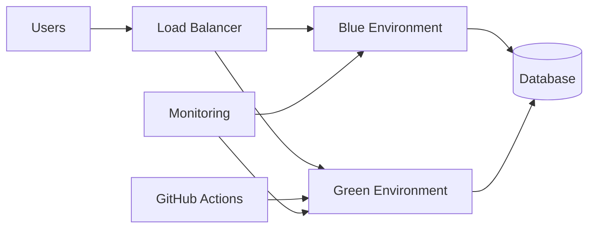
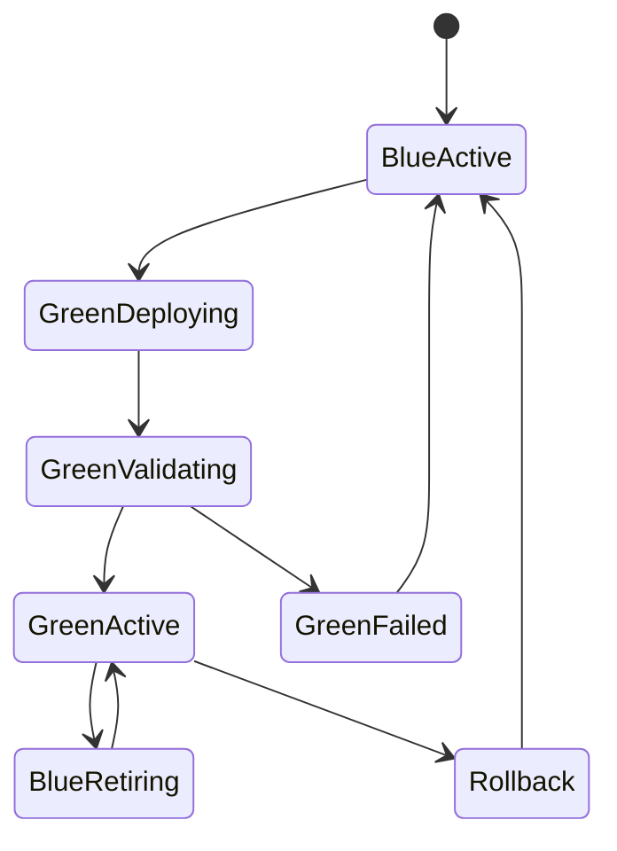
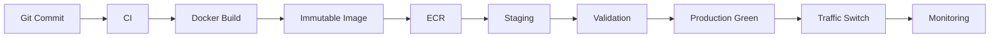

# 20- Blue Green Deployment

## Overview

Blue-green deployment is a release strategy that maintains two production-capable environments:

- **Blue** — the currently serving version
- **Green** — the new version being deployed and validated

Traffic initially points to Blue:

```text
Users
  ↓
Load Balancer
  ↓
Blue
```

The new release is deployed to Green without immediately receiving production traffic:

```text
Users
  ↓
Load Balancer
  ├── Blue  ← Active
  └── Green ← New release
```

After Green passes validation, traffic is switched:

```text
Users
  ↓
Load Balancer
  ↓
Green ← Active
```

Blue remains available temporarily so the deployment can be rolled back by switching traffic back.

The core principle is:

```text
Deploy → Validate → Switch → Observe → Retain Previous Version
```

Blue-green deployment is particularly useful for backend systems where downtime is expensive and a fast rollback path is required.

Typical implementations include:

- AWS ECS
- AWS Elastic Load Balancing
- Kubernetes
- EC2 Auto Scaling
- Nginx
- Docker
- Django
- FastAPI
- Microservices
- GitHub Actions
- Terraform
- CloudFormation

---

## Why Blue-Green Deployment Exists

A conventional deployment often modifies the currently serving infrastructure directly:

```text
Production
    ↓
Stop old application
    ↓
Deploy new application
    ↓
Start new application
```

This can introduce:

- Downtime
- Partial deployments
- Inconsistent application versions
- Difficult rollback
- Failed migrations
- Long recovery times

Blue-green deployment separates deployment from traffic switching.

```text
Production Traffic
       ↓
   Blue Environment
       │
       │
   Green Environment
       ↑
  New Version
```

The new version can be deployed and tested before users are moved to it.

---

## Blue-Green vs Rolling Deployment

| Characteristic | Blue-Green | Rolling |
|---|---|---|
| Environments | Two complete environments | Gradually replaces instances |
| Resource usage | Higher | Lower |
| Traffic switch | Usually explicit | Gradual |
| Rollback | Fast traffic switch | Usually redeploy/replace |
| Validation before traffic | Strong | Partial |
| Deployment complexity | Moderate | Moderate |
| Infrastructure cost | Higher | Lower |
| Blast radius during rollout | Easier to isolate | Gradually expands |
| Zero-downtime capability | Strong | Strong |
| Ideal use case | Fast rollback and controlled cutover | Resource-efficient continuous rollout |

Blue-green is not automatically better than rolling deployment. The trade-off is primarily between resource duplication, operational complexity, and rollback characteristics.

---

## Blue-Green vs Canary

| Characteristic | Blue-Green | Canary |
|---|---|---|
| Initial traffic | Usually 0% to Green | Small percentage |
| Traffic transition | Often a switch | Gradual |
| Environment | Full parallel environment | Usually partial capacity |
| Validation | Pre-cutover validation | Production traffic validation |
| Rollback | Switch traffic back | Reduce/remove canary traffic |
| Resource usage | Higher | Usually lower |
| Risk isolation | Strong before cutover | Strong during gradual rollout |

A sophisticated platform may combine the approaches:

```text
Blue
 ↓
Deploy Green
 ↓
Validate Green
 ↓
Send 5% traffic
 ↓
Observe
 ↓
Send 25%
 ↓
Observe
 ↓
100% Green
```

This is effectively a blue-green foundation with canary traffic shifting.

---

## Core Architecture



Blue and Green should generally use the same:

- Application configuration model
- Runtime
- Infrastructure definition
- Network architecture
- Database
- Observability
- Security controls

The important difference is the application release or deployment version.

---

## Basic Deployment Lifecycle

A production blue-green deployment generally follows:

```text
1. Build
2. Produce immutable artifact
3. Deploy Green
4. Run health checks
5. Run smoke tests
6. Validate dependencies
7. Switch traffic
8. Monitor
9. Retain Blue
10. Decommission Blue later
```

The critical design principle is that traffic switching happens only after Green is known to be healthy.

---

## Deployment State Model



The previous environment should not be destroyed immediately after the switch.

---

## Active and Standby Environments

At any point there is normally:

```text
Active
Standby
```

For example:

```text
Blue = active
Green = standby
```

After deployment:

```text
Blue = standby
Green = active
```

The active/standby relationship is logical rather than necessarily tied to fixed physical infrastructure.

---

## Environment Identity

Avoid treating:

```text
blue
green
```

as application versions.

Instead distinguish:

```text
Environment
    → Blue

Release
    → git-8f4c2d1
```

For example:

```text
Blue
  └── payments:git-71b8f42

Green
  └── payments:git-a83d991
```

This makes deployment history and rollback easier to reason about.

---

## Immutable Artifacts

Blue-green deployment works best with immutable artifacts.

Build once:

```text
Source
  ↓
CI
  ↓
Docker Image
  ↓
ECR
```

Then deploy the exact image to Green:

```text
ECR
 ↓
Green
```

After promotion:

```text
Same ECR image
 ↓
Production
```

Avoid rebuilding the application between staging and production.

---

## Docker Image Identity

Prefer immutable identifiers such as:

```text
payments:git-a83d991
```

or:

```text
payments@sha256:...
```

Avoid using:

```text
latest
```

as the deployment identity.

A rollback should identify exactly which artifact was previously serving.

---

## Traffic Switching

The traffic switch is the defining operation of blue-green deployment.

Conceptually:

```text
Before

Load Balancer
     ↓
   Blue
```

After:

```text
Load Balancer
     ↓
   Green
```

The switch can be implemented through:

- Load balancer target groups
- Listener rules
- DNS
- Service selectors
- Kubernetes Services
- Nginx configuration
- Service discovery
- API gateways

The mechanism changes, but the deployment principle remains the same.

---

## AWS Architecture

A common AWS implementation uses:

```text
Route 53
    ↓
Application Load Balancer
    ↓
Listener
    ↓
Target Group
    ├── Blue ECS Service
    └── Green ECS Service
```

The active target group receives production traffic.

Green can be registered separately and validated before switching.

---

## AWS ECS Blue-Green

A typical ECS architecture is:

```text
ALB
 │
 ├── Blue Target Group
 │       ↓
 │   Blue ECS Service
 │
 └── Green Target Group
         ↓
     Green ECS Service
```

The deployment process becomes:

```text
Build Docker Image
        ↓
Push to ECR
        ↓
Deploy Green ECS Service
        ↓
Health Check
        ↓
Smoke Test
        ↓
Shift ALB Traffic
        ↓
Monitor
```

---

## AWS CodeDeploy Integration

AWS CodeDeploy can manage blue-green deployments for supported AWS deployment targets.

Conceptually:

```text
GitHub Actions
      ↓
Artifact
      ↓
CodeDeploy
      ↓
Blue/Green Deployment
      ↓
Traffic Shift
      ↓
Validation
```

GitHub Actions can remain the orchestration layer while AWS manages the deployment mechanics.

---

## GitHub Actions Architecture

A GitHub Actions pipeline might look like:

```text
Pull Request
    ↓
Lint
    ↓
Unit Tests
    ↓
Integration Tests
    ↓
Security Scan
    ↓
Build Docker Image
    ↓
Push to ECR
    ↓
Deploy Green
    ↓
Health Validation
    ↓
Approval
    ↓
Switch Traffic
    ↓
Monitor
    ↓
Rollback if Required
```

---

## GitHub Actions Example

A simplified deployment structure:

```yaml
name: Blue Green Deployment

on:
  workflow_dispatch:
    inputs:
      image:
        description: "Immutable image reference"
        required: true
        type: string

permissions:
  contents: read
  id-token: write

jobs:
  deploy-green:
    runs-on: ubuntu-latest
    environment: staging

    steps:
      - name: Configure AWS credentials
        uses: aws-actions/configure-aws-credentials@v4
        with:
          role-to-assume: ${{ vars.AWS_DEPLOY_ROLE_ARN }}
          aws-region: ap-south-1

      - name: Deploy Green
        run: |
          ./scripts/deploy-green.sh "${{ inputs.image }}"

      - name: Validate Green
        run: |
          ./scripts/validate-green.sh

  switch-traffic:
    needs: deploy-green
    runs-on: ubuntu-latest
    environment: production

    concurrency:
      group: production-deployment
      cancel-in-progress: false

    steps:
      - name: Configure AWS credentials
        uses: aws-actions/configure-aws-credentials@v4
        with:
          role-to-assume: ${{ vars.AWS_PRODUCTION_ROLE_ARN }}
          aws-region: ap-south-1

      - name: Switch traffic
        run: |
          ./scripts/switch-to-green.sh
```

A real production implementation should also validate deployment state, image identity, health checks, and rollback conditions.

---

## GitHub Environment Protection

Production traffic switching should generally be associated with a protected environment.

For example:

```yaml
environment:
  name: production
```

The environment can enforce:

- Required reviewers
- Deployment restrictions
- Environment-specific configuration
- Environment-specific secrets

This creates a control point before the irreversible operational action of moving production traffic.

---

## Deployment Concurrency

Only one production traffic switch should normally occur at a time.

```yaml
concurrency:
  group: production-deployment
  cancel-in-progress: false
```

This prevents:

```text
Deployment A → switch traffic
Deployment B → switch traffic
Deployment A → rollback
Deployment B → deploy
```

from producing an unpredictable production state.

---

## Why `cancel-in-progress: false`

Cancelling a production deployment while it is modifying infrastructure can leave the system in an intermediate state.

Prefer:

```yaml
cancel-in-progress: false
```

for production deployments unless the deployment mechanism is explicitly designed for safe cancellation.

---

## Green Environment Deployment

Green should be deployed independently from the active environment.

Example:

```text
Blue
 └── Version 1.8.2

Green
 └── Version 1.9.0
```

The deployment system should verify:

- Container startup
- Application health
- Dependency connectivity
- Database connectivity
- Cache connectivity
- Message broker connectivity
- Required migrations
- Application readiness

before traffic is shifted.

---

## Health Checks

Health checks should be layered.

### Infrastructure Health

Check:

```text
Container running
Target registered
Target healthy
CPU/memory normal
```

### Application Health

Check:

```text
/health
/readiness
```

### Dependency Health

Check:

```text
PostgreSQL
Redis
Kafka
External APIs
```

### Functional Health

Run a real request:

```text
GET /api/health
GET /api/version
Authenticated API request
```

A container being "running" does not prove that the application is ready to serve production traffic.

---

## Readiness vs Liveness

These checks answer different questions.

| Check | Question |
|---|---|
| Liveness | Is the process alive? |
| Readiness | Can this instance serve traffic? |
| Smoke test | Does the application behave correctly? |
| Dependency check | Can required dependencies be reached? |

Blue-green switching should primarily depend on readiness and functional validation.

---

## Smoke Testing

After Green becomes healthy, run a small production-like test suite.

For example:

```bash
curl --fail https://green.internal.example.com/health
```

Then:

```bash
curl --fail \
  -H "Authorization: Bearer $TOKEN" \
  https://green.internal.example.com/api/orders/health
```

Smoke tests should be fast and deterministic.

---

## Testing Green Without Public Traffic

Green can be exposed through an internal endpoint:

```text
Production Load Balancer
        │
        ├── Blue → Public
        │
        └── Green → Internal validation
```

This allows CI/CD to validate Green without sending normal users to it.

---

## Database Compatibility

Blue-green deployments become significantly more difficult when application versions share a database.

Example:

```text
Blue → Application v1
Green → Application v2
        ↓
    Same Database
```

Both versions may temporarily access the database.

Therefore schema changes must be backward compatible during the transition.

---

## Expand and Contract Migrations

A safer migration pattern is:

```text
Expand
  ↓
Deploy compatible application
  ↓
Migrate data
  ↓
Switch traffic
  ↓
Contract later
```

For example:

### Phase 1

Add a nullable column:

```sql
ALTER TABLE orders
ADD COLUMN payment_reference VARCHAR(255);
```

### Phase 2

Deploy application code that supports both old and new behavior.

### Phase 3

Backfill data.

### Phase 4

Switch traffic to Green.

### Phase 5

Remove obsolete schema only after Blue is permanently retired.

---

## Dangerous Database Migration

Avoid:

```text
Deploy Green
 ↓
Drop column used by Blue
 ↓
Blue still receives traffic
```

Blue may fail immediately if it still expects that column.

The database must support both versions during the overlap period.

---

## Django Considerations

For Django:

```text
Blue
 ↓
Django v1
 ↓
PostgreSQL

Green
 ↓
Django v2
 ↓
Same PostgreSQL
```

Be careful with:

- Django migrations
- Model changes
- Removed fields
- Renamed fields
- Index changes
- Background jobs
- Celery task compatibility

Prefer backward-compatible schema changes across the deployment window.

---

## FastAPI Considerations

For FastAPI:

```text
ALB
 ↓
Green FastAPI
 ↓
PostgreSQL
```

Validate:

- Application startup
- Dependency injection
- Database connectivity
- External service connectivity
- API contract compatibility
- Authentication
- Readiness endpoints

The same deployment model applies to synchronous and asynchronous Python applications.

---

## Celery Considerations

Celery introduces another compatibility boundary.

For example:

```text
Blue API
Green API
Blue Workers
Green Workers
        ↓
      Redis
```

A new application version should not publish task payloads that old workers cannot deserialize or process.

Use backward-compatible task contracts during the transition.

---

## Redis Considerations

Redis may be shared by Blue and Green.

Be careful with:

- Cache key changes
- Serialization formats
- Session structures
- Distributed locks
- Pub/Sub channels

Do not assume Redis state is isolated simply because the application environments are isolated.

---

## Kafka Considerations

Blue and Green may consume from the same Kafka topics.

Potential issues include:

- Duplicate processing
- Consumer group behavior
- Message schema changes
- Offset handling
- Event compatibility

Schema evolution should remain backward compatible during the overlap period.

---

## Nginx-Based Blue-Green

Nginx can route traffic between environments.

Conceptually:

```nginx
upstream backend {
    server blue:8000;
}
```

Switching to Green:

```nginx
upstream backend {
    server green:8000;
}
```

The configuration must then be validated and reloaded safely.

For large-scale systems, dedicated load-balancing infrastructure is usually preferable to making a single Nginx instance the only traffic-switching point.

---

## Kubernetes Blue-Green

Kubernetes can implement blue-green deployments using separate Deployments and controlled Service routing.

Conceptually:

```text
Service
  ↓
selector: version=green
  ↓
Green Deployment
```

Blue remains available:

```text
Blue Deployment
```

for rollback.

Another option is to use an ingress or service-mesh layer to control traffic.

---

## Kubernetes Example

Blue:

```yaml
apiVersion: apps/v1
kind: Deployment
metadata:
  name: payments-blue
spec:
  replicas: 3
  selector:
    matchLabels:
      app: payments
      version: blue
  template:
    metadata:
      labels:
        app: payments
        version: blue
    spec:
      containers:
        - name: payments
          image: 123456789012.dkr.ecr.ap-south-1.amazonaws.com/payments:git-abc1234
```

Green:

```yaml
apiVersion: apps/v1
kind: Deployment
metadata:
  name: payments-green
spec:
  replicas: 3
  selector:
    matchLabels:
      app: payments
      version: green
  template:
    metadata:
      labels:
        app: payments
        version: green
    spec:
      containers:
        - name: payments
          image: 123456789012.dkr.ecr.ap-south-1.amazonaws.com/payments:git-def5678
```

A Service can then route to the selected version.

---

## Terraform Architecture

Terraform can manage the infrastructure required for blue-green deployment.

Typical resources include:

```text
VPC
ALB
Listeners
Target Groups
ECS Services
IAM Roles
Security Groups
ECR
CloudWatch
```

Terraform should normally manage infrastructure rather than become the mechanism for every application traffic switch.

Separate infrastructure lifecycle from application release lifecycle where practical.

---

## Terraform and Application Deployment

A useful separation is:

```text
Terraform
    ↓
Infrastructure

GitHub Actions
    ↓
Application Artifact
    ↓
Green Deployment
    ↓
Traffic Switch
```

This reduces unnecessary infrastructure changes during every application release.

---

## Traffic Switch Strategies

There are several approaches.

| Strategy | Description | Main Trade-off |
|---|---|---|
| Load balancer target switch | Change active target group | Fast and explicit |
| DNS switch | Change DNS destination | DNS caching/TTL considerations |
| Kubernetes Service | Change selector | Simple within Kubernetes |
| Ingress | Change routing rule | Flexible |
| Service mesh | Change routing policy | Powerful but complex |
| Nginx | Change upstream | Simple but operationally centralized |

For low-latency rollback, prefer a switch mechanism whose state changes quickly and is independently observable.

---

## DNS-Based Blue-Green

DNS can implement:

```text
api.example.com
      ↓
Blue
```

then:

```text
api.example.com
      ↓
Green
```

However, DNS caching means clients may continue using the previous destination.

Therefore DNS-based switching is not always appropriate when immediate rollback is required.

---

## Load Balancer Switching

Load balancers generally provide more direct control.

```text
ALB Listener
    ↓
Target Group
    ↓
Active Environment
```

Switching the target group can change the destination without requiring clients to resolve a new hostname.

This is often easier to reason about operationally.

---

## Zero-Downtime Deployment

Blue-green can support zero-downtime deployment when:

- Green is ready before traffic switching
- Blue remains healthy during the transition
- Database changes are compatible
- Connections are handled correctly
- Load balancer health checks are reliable
- Background workers are compatible

Zero-downtime is an architectural property, not merely a deployment command.

---

## Long-Lived Connections

WebSockets, streaming APIs, gRPC, and long-lived HTTP connections require special consideration.

A traffic switch affects new connection routing, but existing connections may continue on Blue.

For example:

```text
Blue
 ├── Existing WebSocket connections
 └── Existing gRPC streams

Green
 └── New connections
```

The deployment system needs a graceful connection-draining strategy.

---

## Connection Draining

A production traffic switch should account for:

- Existing HTTP connections
- Keep-alive connections
- WebSockets
- gRPC streams
- Long-running requests

A load balancer can often drain existing connections before retiring Blue.

Do not immediately terminate Blue after switching traffic.

---

## Rollback

The major operational advantage of blue-green is a simple rollback path.

If Green is unhealthy:

```text
Green
 ↓
Remove from traffic
 ↓
Blue
```

If Green is already active:

```text
Green
 ↓
Detect failure
 ↓
Switch back
 ↓
Blue
```

Rollback should be an explicit operational procedure rather than an improvised manual action.

---

## Automated Rollback

Automation can use health signals:

```text
Traffic Switch
      ↓
Monitor
      ↓
Error Rate ↑
      ↓
Rollback
```

Potential signals include:

- HTTP 5xx rate
- Latency
- CPU
- Memory
- Request success rate
- Application health
- Dependency errors

Automated rollback should have conservative thresholds to avoid oscillation.

---

## Rollback Caveats

Rollback is not always safe.

For example:

```text
Green
 ↓
Database migration
 ↓
Blue
```

If the migration is destructive, returning to Blue may not work.

Therefore:

```text
Application rollback
```

and:

```text
Database rollback
```

must be designed separately.

---

## Observability

Blue-green requires version-aware monitoring.

Useful dimensions include:

```text
service
environment
release
instance
region
status
```

For example:

```text
environment=green
release=git-a83d991
```

This allows operators to determine whether an increase in errors is associated specifically with Green.

---

## Metrics

Monitor at minimum:

- Request rate
- Error rate
- P50 latency
- P95 latency
- P99 latency
- CPU
- Memory
- Container restarts
- Database errors
- Cache errors
- Queue depth
- Kafka consumer lag

Compare Blue and Green where possible.

---

## Logs

Application logs should contain release identity.

For example:

```text
release=git-a83d991
environment=green
request_id=...
```

This makes post-deployment investigation much easier.

---

## Distributed Tracing

For microservices, tracing helps determine whether Green introduced downstream failures.

```text
Client
 ↓
API Gateway
 ↓
Green API
 ↓
Green gRPC Service
 ↓
PostgreSQL
```

Trace attributes should identify the release version where practical.

---

## Deployment Verification

A production verification process should include:

```text
Target health
      ↓
Application readiness
      ↓
Smoke tests
      ↓
Traffic switch
      ↓
Error-rate monitoring
      ↓
Latency monitoring
      ↓
Dependency monitoring
```

Do not consider the deployment complete immediately after the traffic switch.

---

## Grace Period

After switching traffic, keep Blue available during an observation period.

For example:

```text
T+0  → Switch
T+1  → Health check
T+5  → Error analysis
T+10 → Latency analysis
T+30 → Retire Blue
```

The actual duration should depend on application risk and traffic patterns.

---

## Cost Considerations

Blue-green can temporarily require approximately twice the application capacity.

For example:

```text
Blue: 10 instances
Green: 10 instances

Total: 20 instances during deployment
```

The cost is justified when fast rollback and controlled deployment are more important than minimizing temporary capacity.

For expensive workloads, use:

- Smaller Green capacity for pre-validation where safe
- Autoscaling
- Efficient container startup
- Short standby retention
- Infrastructure automation

Do not reduce Green capacity below what is required for meaningful validation.

---

## Database Cost and Risk

Running two application environments does not necessarily mean running two databases.

Often:

```text
Blue ──┐
       ├── PostgreSQL
Green ─┘
```

This reduces cost but increases compatibility requirements.

Separate databases provide stronger isolation but create:

- Data synchronization complexity
- Replication requirements
- Migration complexity
- Additional cost
- More difficult cutover logic

Choose based on application architecture rather than assuming either model is universally correct.

---

## High Availability

Blue-green improves deployment resilience but does not replace high availability.

A production architecture may still require:

```text
Multiple AZs
+
Load Balancer
+
Auto Scaling
+
Managed Database
+
Redundant Dependencies
```

Both Blue and Green should be highly available independently.

A single-instance Green environment is not a highly available deployment.

---

## Disaster Recovery

Blue-green is primarily a deployment strategy, not a disaster recovery strategy.

It can help with:

```text
Release rollback
```

but it does not replace:

- Database backups
- Cross-region recovery
- Infrastructure recreation
- Artifact retention
- State backups
- Disaster recovery procedures

Do not confuse:

```text
Rollback
```

with:

```text
Disaster Recovery
```

---

## Security Considerations

Green must have the same security posture as Blue.

Validate:

- Security groups
- IAM roles
- Network policies
- TLS
- Secrets
- Authentication
- Authorization
- Container image provenance
- Dependency versions

A deployment should not introduce a security regression merely because it uses a new environment.

---

## AWS IAM and OIDC

GitHub Actions should authenticate to AWS using OIDC rather than long-lived AWS keys.

```text
GitHub Actions
    ↓
OIDC
    ↓
STS
    ↓
Deployment IAM Role
    ↓
ECS / ALB / ECR
```

The production deployment role should have only the permissions required to perform the deployment and traffic switch.

---

## Artifact Security

A production blue-green deployment should use:

```text
Immutable Image
+
Image Digest
+
SBOM
+
Vulnerability Scan
+
Provenance
+
Attestation
```

The Green environment should be deployed from the exact artifact that was tested.

---

## Build Once, Deploy Many

A mature pipeline:



The production image should not be rebuilt after staging validation.

---

## Environment Promotion

A common environment progression is:

```text
Development
    ↓
Test
    ↓
Staging
    ↓
Production Green
    ↓
Production Active
```

Each promotion should use the same artifact where practical.

---

## Blue-Green for Microservices

For a microservice system:

```text
API Gateway
    ↓
Payments
 ├── Blue
 └── Green

Orders
 ├── Blue
 └── Green

Users
 ├── Blue
 └── Green
```

Full-system blue-green can become expensive.

A service-level blue-green strategy is often more practical.

For example:

```text
Payments → Green
Orders   → Blue
Users    → Blue
```

This requires backward-compatible service contracts.

---

## gRPC Considerations

gRPC introduces connection and schema compatibility requirements.

During transition:

```text
Client v1
    ↓
Blue / Green Service
```

and potentially:

```text
Client v2
    ↓
Blue / Green Service
```

Protocol changes should preserve compatibility during the transition window.

Long-lived HTTP/2 connections also require graceful draining.

---

## API Contract Compatibility

Blue and Green may temporarily coexist.

Therefore:

```text
API v1
```

and:

```text
API v2
```

should be compatible where requests can reach either environment during transition.

Avoid making breaking contract changes at the exact point where traffic can still reach the old version.

---

## Feature Flags

Feature flags can complement blue-green deployment.

For example:

```text
Deploy code
     ↓
Feature disabled
     ↓
Switch traffic
     ↓
Validate
     ↓
Enable feature
```

This separates:

```text
Deployment
```

from:

```text
Feature activation
```

However, feature flags add operational complexity and require lifecycle management.

---

## Common Mistakes

### Destroying Blue Immediately

This removes the fast rollback path.

Keep Blue available until the new release has been sufficiently validated.

### Rebuilding the Image for Production

This violates build-once/deploy-many principles.

Promote the exact tested artifact.

### Breaking Database Compatibility

Blue and Green may temporarily use the same database.

Schema changes must support both versions during transition.

### Switching Traffic Without Validation

A successful deployment command does not prove application readiness.

### Ignoring Long-Lived Connections

WebSockets and gRPC streams can continue using Blue after traffic switches.

### Using Mutable Tags

A tag such as:

```text
latest
```

does not provide reliable release identity.

### No Deployment Concurrency

Two traffic switches can race with each other.

### Treating Blue-Green as Disaster Recovery

Blue is a rollback environment, not a replacement for backups and DR.

### Running Green With Different Security Controls

Green should not accidentally bypass production security policies.

### No Version-Aware Observability

Without release/environment labels, determining whether Green caused a regression becomes difficult.

---

## Troubleshooting

### Green Never Becomes Healthy

**Possible causes:**

- Application startup failure
- Missing environment variables
- Database connectivity
- Redis failure
- Kafka failure
- Incorrect security group
- Container image problem
- Migration failure

**Checks:**

```bash
aws ecs describe-services \
  --cluster payments \
  --services payments-green
```

Inspect:

- Task status
- Target health
- Container logs
- Deployment events
- Security groups
- Environment configuration

---

### Traffic Switch Does Not Work

**Possible causes:**

- Wrong target group
- Listener rule mismatch
- Target unhealthy
- Incorrect listener configuration
- Deployment role lacks permissions

**Isolation strategy:**

```text
ALB
 ↓
Listener
 ↓
Rule
 ↓
Target Group
 ↓
Target
```

Validate each layer independently.

---

### Green Works Internally but Fails Through the Load Balancer

Check:

```text
Security Group
Network ACL
Listener
Target Group
Health Check
TLS
Host Header
Path Rules
```

The application being reachable directly does not guarantee correct load-balancer routing.

---

### Rollback Does Not Restore the Application

Check:

- Blue health
- Database compatibility
- Redis compatibility
- Kafka compatibility
- Background workers
- Configuration changes
- External API changes
- Schema migrations

Application rollback cannot automatically reverse incompatible state changes.

---

### Both Blue and Green Receive Unexpected Traffic

Check:

- Load balancer routing
- DNS
- Caches
- Service mesh configuration
- Existing persistent connections
- Client-side routing

Traffic switching must be observed rather than assumed.

---

## Failure Domain Model

Use:

```text
Symptom
  ↓
Possible Causes
  ↓
Isolation Strategy
  ↓
Commands / Checks
  ↓
Root Cause
  ↓
Corrective Action
  ↓
Prevention
```

Example:

```text
5xx increased after switch
        ↓
Application / dependency / routing
        ↓
Compare Blue vs Green metrics
        ↓
Inspect logs and traces
        ↓
Green database timeout
        ↓
Fix connection configuration
        ↓
Add readiness validation
```

---

## GitHub CLI Operations

List workflows:

```bash
gh workflow list
```

List recent runs:

```bash
gh run list
```

Inspect a deployment:

```bash
gh run view RUN_ID
```

View logs:

```bash
gh run view RUN_ID --log
```

Rerun a failed workflow:

```bash
gh run rerun RUN_ID
```

Run a manual deployment:

```bash
gh workflow run blue-green.yml
```

These commands are useful during deployment operations and incident response.

---

## AWS CLI Operations

Check active identity:

```bash
aws sts get-caller-identity
```

Inspect ECS services:

```bash
aws ecs describe-services \
  --cluster payments \
  --services payments-green
```

Inspect target health:

```bash
aws elbv2 describe-target-health \
  --target-group-arn "$TARGET_GROUP_ARN"
```

Inspect listener configuration:

```bash
aws elbv2 describe-listeners \
  --load-balancer-arn "$LOAD_BALANCER_ARN"
```

These commands help isolate whether a failure exists in AWS authentication, ECS, load balancing, or the application.

---

## Operational Runbook

A production runbook should define:

### Before Deployment

- Verify artifact digest
- Verify CI status
- Verify database compatibility
- Verify Green capacity
- Verify deployment permissions
- Verify monitoring

### During Green Deployment

- Deploy Green
- Wait for readiness
- Validate logs
- Run smoke tests
- Verify target health

### Before Switch

- Confirm approval
- Confirm Green artifact identity
- Confirm Blue remains healthy
- Confirm no conflicting deployment

### After Switch

- Monitor errors
- Monitor latency
- Monitor dependencies
- Monitor business metrics
- Keep Blue available

### After Stabilization

- Retire Blue
- Record deployment metadata
- Preserve rollback information
- Update release history

---

## Production Reference Architecture

```text
                         GitHub
                           │
                           ▼
                    GitHub Actions
                           │
            ┌──────────────┴──────────────┐
            │                             │
        CI Pipeline                  OIDC / STS
            │                             │
            ▼                             ▼
       Docker Build                 AWS IAM Role
            │                             │
            ▼                             │
           ECR                            │
            │                             │
            └──────────────┬──────────────┘
                           ▼
                    Green Environment
                           │
                 Health + Smoke Tests
                           │
                    Approval Gate
                           │
                           ▼
                    Traffic Switch
                           │
                           ▼
                     Production
                           │
                ┌──────────┴──────────┐
                ▼                     ▼
              Green                  Blue
             Active                Standby
                │                     │
                └──────────┬──────────┘
                           ▼
                     Observability
                           │
                           ▼
                       Rollback
```

---

## Senior Design Principles

### Deployment Is Separate From Traffic Activation

The most important architectural distinction is:

```text
Deploy
```

versus:

```text
Activate
```

Green can exist for several minutes without serving production traffic.

### The Rollback Path Must Exist Before the Deployment

Do not deploy Green and then design rollback.

The rollback mechanism should already be operational.

### The Database Is Usually the Hardest Part

Application binaries are easy to switch.

Shared persistent state is much harder.

Design database migrations around compatibility windows.

### Blue-Green Requires Capacity

You are intentionally maintaining additional infrastructure.

This is a reliability trade-off, not an optimization mistake.

### Observability Must Be Release-Aware

Operators need to answer:

```text
Did Green cause the regression?
```

within minutes.

### Immutable Artifacts Simplify Rollback

If every release maps to an immutable image digest, rollback becomes:

```text
Switch traffic to known-good artifact
```

rather than:

```text
Rebuild an old release
```

### Production Switching Should Be Protected

Use:

```text
Approval
+
Concurrency
+
Health Checks
+
Monitoring
```

for high-risk production changes.

---

## Interview Scenarios

### Design a Zero-Downtime Deployment for Django

Discuss:

```text
Docker
 ↓
ECR
 ↓
Green ECS
 ↓
Health Checks
 ↓
ALB Switch
 ↓
Monitoring
 ↓
Rollback
```

Then address:

- Django migrations
- Celery compatibility
- Redis
- PostgreSQL
- Connection draining

### How Is Blue-Green Different From Rolling Deployment?

Explain the difference in:

- Environment topology
- Resource consumption
- Traffic switching
- Rollback
- Validation
- Operational complexity

### How Would You Roll Back?

A strong design:

```text
Detect regression
 ↓
Stop new traffic
 ↓
Switch ALB to Blue
 ↓
Validate
 ↓
Investigate Green
```

Then explain why database compatibility can make rollback more complicated.

### How Would You Handle Database Migrations?

Use:

```text
Expand
 ↓
Backward-compatible application
 ↓
Data migration
 ↓
Traffic switch
 ↓
Contract
```

Avoid destructive changes while Blue remains active.

### How Would You Deploy Without Rebuilding?

Use:

```text
Git Commit
 ↓
Build
 ↓
Immutable Docker Image
 ↓
ECR
 ↓
Staging
 ↓
Green
 ↓
Production
```

### How Would You Prevent Two Production Deployments From Switching Traffic Simultaneously?

Use GitHub Actions concurrency:

```yaml
concurrency:
  group: production-deployment
  cancel-in-progress: false
```

and enforce additional deployment coordination at the infrastructure layer where necessary.

### What Happens to Existing WebSocket Connections?

Existing connections may remain attached to Blue.

Use graceful connection draining and keep Blue alive until the relevant connections have completed or been intentionally terminated.

### Does Blue-Green Guarantee Zero Downtime?

No.

It enables zero-downtime deployments when the surrounding system supports them.

Database incompatibility, failed readiness checks, broken load balancing, connection handling, or dependency failures can still cause downtime.

---

## Production Checklist

### Architecture

- [ ] Blue and Green environments are independently deployable
- [ ] Traffic switching is explicit
- [ ] Blue remains available during rollback window
- [ ] Load balancing is highly available
- [ ] Infrastructure supports sufficient Green capacity

### CI/CD

- [ ] Build once, deploy many
- [ ] Artifact is immutable
- [ ] Image digest is recorded
- [ ] Green is deployed before traffic switching
- [ ] Health checks run before cutover
- [ ] Smoke tests run before cutover
- [ ] Production approval is configured where required
- [ ] Deployment concurrency prevents races

### Database

- [ ] Blue and Green compatibility is understood
- [ ] Migrations use expand/contract where appropriate
- [ ] Destructive migrations are delayed
- [ ] Rollback implications are documented

### Application

- [ ] Django/FastAPI startup is validated
- [ ] Redis compatibility is checked
- [ ] Celery task compatibility is checked
- [ ] Kafka compatibility is checked
- [ ] gRPC/API compatibility is checked
- [ ] Long-lived connections are drained safely

### Security

- [ ] GitHub OIDC is used for AWS authentication
- [ ] IAM follows least privilege
- [ ] Production role is restricted
- [ ] Container images are scanned
- [ ] Artifact integrity is verified
- [ ] Green receives the same security controls as Blue

### Operations

- [ ] Metrics identify environment and release
- [ ] Logs contain release identity
- [ ] Traces identify deployed version
- [ ] Automated rollback criteria are defined where appropriate
- [ ] Blue retention period is defined
- [ ] Deployment runbook exists
- [ ] Incident response procedure exists

## Key Takeaways

- Blue-green deployment separates application deployment from traffic activation by maintaining two production-capable environments and switching traffic only after the new environment is validated.
- Immutable artifacts, health checks, deployment concurrency, protected environments, and release-aware observability are the core controls for reliable blue-green deployments.
- The hardest production problem is usually shared state: database migrations, Redis data, Kafka messages, Celery tasks, and long-lived connections must remain compatible while Blue and Green coexist.
- Blue-green provides a fast application rollback path, but it is not disaster recovery and cannot automatically reverse destructive database or persistent-state changes.
- A mature implementation combines GitHub Actions, immutable Docker artifacts, AWS OIDC, ECR, load-balancer traffic switching, monitoring, approval gates, and a tested rollback procedure.