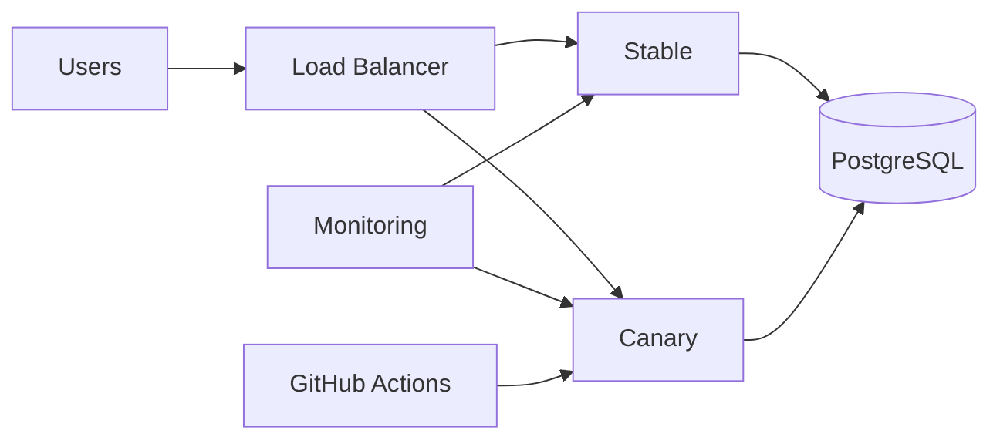
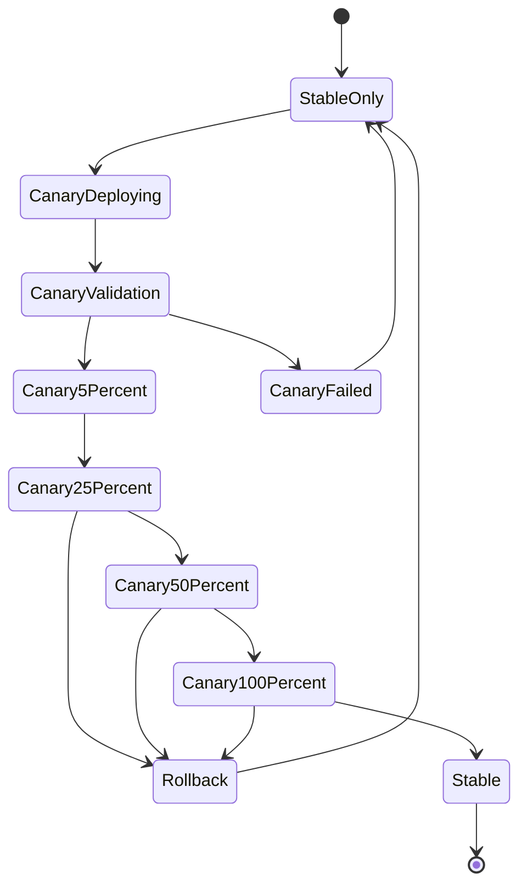
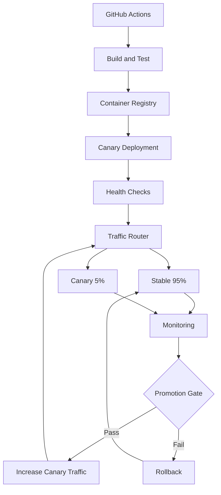

# 21- Canary Deployment

## Overview

Canary deployment is a release strategy that introduces a new application version to a small, controlled portion of production traffic before expanding the release to the rest of the system.

The core flow is:

```text
Current Version
      ↓
Deploy New Version
      ↓
Small Traffic Percentage
      ↓
Observe
      ↓
Increase Traffic
      ↓
Observe
      ↓
100% New Version
```

For example:

```text
Blue / Stable: 95%
Canary / New:   5%
```

If the canary remains healthy:

```text
Stable: 75%
Canary: 25%
```

then:

```text
Stable: 25%
Canary: 75%
```

and eventually:

```text
Stable: 0%
Canary: 100%
```

If the canary shows elevated errors or latency, traffic can be reduced or returned to the stable version.

Canary deployment is particularly useful for:

- High-traffic APIs
- Django and FastAPI services
- Microservices
- Docker workloads
- Kubernetes
- AWS ECS
- AWS EC2
- gRPC services
- Services with expensive or risky releases

The defining characteristic is **gradual exposure to real production traffic**.

---

## Why Canary Deployment Exists

A normal deployment can expose a new release to the entire production population immediately:

```text
Users
  ↓
New Version
```

If the release contains a regression:

```text
100% traffic
     ↓
Bad Release
     ↓
100% of users affected
```

Canary deployment limits the initial blast radius:

```text
Users
  ↓
Load Balancer
  ├── Stable → 95%
  └── Canary → 5%
```

Only a small portion of production traffic initially reaches the new version.

This provides real-world validation without immediately exposing the entire user population.

---

## Canary vs Blue-Green

| Characteristic | Canary | Blue-Green |
|---|---|---|
| New version traffic | Gradual | Usually switched |
| Initial exposure | Small percentage | Usually 0% |
| Production validation | Real traffic | Often pre-cutover |
| Rollout | Incremental | Discrete |
| Resource usage | Variable | Usually two environments |
| Rollback | Reduce canary traffic | Switch back |
| Blast radius | Gradually controlled | Controlled before switch |
| Monitoring importance | Very high | High |
| Traffic control complexity | Higher | Usually lower |
| Best suited for | Progressive validation | Fast controlled cutover |

The two strategies can also be combined.

For example:

```text
Stable
  ↓
Deploy Canary
  ↓
5% traffic
  ↓
25%
  ↓
50%
  ↓
100%
```

The canary environment can effectively become the new stable environment after successful promotion.

---

## Canary vs Rolling Deployment

| Characteristic | Canary | Rolling |
|---|---|---|
| Main concern | Traffic exposure | Instance replacement |
| Traffic control | Explicit | Usually implicit |
| User exposure | Gradual | Depends on routing |
| Validation | Traffic-based | Health-based |
| Rollback | Traffic reduction | Replace/redeploy |
| Operational complexity | Higher | Lower |
| Monitoring | Critical | Important |
| Resource usage | Flexible | Usually incremental |

A rolling deployment can technically expose new instances gradually, but it is not necessarily a canary strategy.

Canary deployment is specifically concerned with controlling **which production traffic reaches the new release**.

---

## Canary Architecture



The stable environment continues serving most traffic while Canary receives a controlled percentage.

---

## Basic Canary Lifecycle

A production canary rollout commonly follows:

```text
Build
 ↓
Security Scan
 ↓
Publish Immutable Artifact
 ↓
Deploy Canary
 ↓
Health Validation
 ↓
Route Small Traffic Percentage
 ↓
Observe
 ↓
Increase Traffic
 ↓
Observe
 ↓
Promote to 100%
 ↓
Retire Previous Version
```

Rollback can happen at any stage:

```text
Canary Failure
      ↓
Stop Promotion
      ↓
Route Traffic Back
      ↓
Investigate
```

---

## Canary State Model



The exact percentages are application-specific.

---

## Canary Traffic Percentages

A common progression is:

```text
5%
25%
50%
100%
```

Another production strategy might use:

```text
1%
5%
10%
25%
50%
100%
```

For a high-volume API, even 1% may represent a large number of requests.

For a low-volume service, 5% may not generate enough traffic to provide meaningful evidence.

The percentage should therefore be based on traffic volume and risk, not arbitrary convention.

---

## Traffic-Based Validation

Suppose an API receives:

```text
1,000 requests/second
```

A 1% canary receives approximately:

```text
10 requests/second
```

A 10% canary receives approximately:

```text
100 requests/second
```

The important question is not simply:

> What percentage should the canary receive?

It is:

> Does the canary receive enough representative traffic to detect regressions?

---

## Canary Duration

A canary should remain active long enough to observe meaningful behavior.

Possible observation windows:

```text
5 minutes
15 minutes
30 minutes
1 hour
```

The correct duration depends on:

- Traffic volume
- Business traffic patterns
- Failure modes
- Background jobs
- Cache behavior
- Database behavior
- External dependencies
- Time-dependent workloads

A five-minute canary may be sufficient for a high-volume API but insufficient for a low-volume batch service.

---

## Canary Success Criteria

Define success criteria before deployment.

Typical signals include:

- HTTP 5xx rate
- HTTP 4xx anomalies
- P95 latency
- P99 latency
- CPU utilization
- Memory usage
- Container restarts
- Database errors
- Redis errors
- Kafka consumer lag
- Queue depth
- Application exceptions
- Business transaction success rate

Example:

```text
Canary promotion allowed if:

5xx < 0.5%
P95 latency < 300 ms
Container restart count = 0
Database error rate within baseline
```

The thresholds must be appropriate for the service.

---

## Baseline Comparison

Absolute thresholds are not always sufficient.

Suppose:

```text
Stable P95 = 180 ms
Canary P95 = 260 ms
```

A 260 ms latency might be below a global 300 ms threshold but still represent a significant regression.

Compare:

```text
Canary
    vs
Stable
```

using the same:

- Time window
- Endpoint
- Region
- Traffic type
- Request volume

This provides stronger evidence than monitoring Canary in isolation.

---

## Error Rate Comparison

Example:

```text
Stable:
5xx = 0.15%

Canary:
5xx = 0.80%
```

Even if 0.80% is below an organization's absolute failure threshold, the difference may justify stopping promotion.

Canary analysis should consider both:

```text
Absolute threshold
```

and:

```text
Regression from baseline
```

---

## Statistical Considerations

Small traffic samples can produce noisy measurements.

For example:

```text
Canary requests = 20
Failures = 1
```

gives:

```text
5% observed error rate
```

but the sample may be too small to make a reliable decision.

Larger traffic volumes provide more confidence.

A mature canary system therefore considers:

- Request count
- Observation duration
- Traffic representativeness
- Statistical confidence
- Baseline comparison

rather than reacting to a single failed request.

---

## Representative Traffic

The canary should ideally receive representative production traffic.

Potential routing dimensions include:

- Random percentage
- User ID
- Region
- Customer segment
- Header
- Cookie
- API key
- Geography
- Device type

For example:

```text
5% of users
```

is different from:

```text
5% of requests
```

If one user makes hundreds of requests, request-based routing may expose a different population than user-based routing.

---

## Sticky Canary Assignment

Some systems assign a user consistently:

```text
User A → Canary
User B → Stable
User C → Stable
User D → Canary
```

This can be useful when a request sequence must remain on the same application version.

However, sticky routing can reduce the randomness of the sample and complicate traffic distribution.

Use it when session or workflow consistency requires it.

---

## Canary Routing Methods

Common routing mechanisms include:

| Mechanism | Example |
|---|---|
| Load balancer | Weighted target groups |
| Kubernetes | Service mesh / ingress |
| Nginx | Weighted upstreams |
| API gateway | Weighted routes |
| Service mesh | Traffic policies |
| DNS | Weighted records |
| Application routing | Feature/user rules |

The routing layer must provide sufficient control and observability for the rollout strategy.

---

## AWS ECS Canary Architecture

A typical ECS setup:

```text
                    ALB
                     │
            ┌────────┴────────┐
            │                 │
        Stable TG         Canary TG
            │                 │
        ECS Service       ECS Service
        Version A         Version B
```

Traffic can initially be weighted toward Stable:

```text
Stable = 95%
Canary = 5%
```

Then progressively shifted.

---

## AWS Application Load Balancer

An ALB can route traffic through listener rules and target groups.

Conceptually:

```text
ALB Listener
     │
     ├── Stable Target Group
     │
     └── Canary Target Group
```

Traffic weighting can be changed without rebuilding either application.

This makes the routing layer the control point for the canary rollout.

---

## AWS CodeDeploy

AWS CodeDeploy can manage deployment traffic shifting for supported AWS environments.

The conceptual workflow is:

```text
GitHub Actions
      ↓
Deploy New Version
      ↓
CodeDeploy
      ↓
Traffic Shift
      ↓
Validation
      ↓
Continue / Rollback
```

The exact traffic-shifting configuration should be selected based on the application's risk and health-validation requirements.

---

## Kubernetes Canary

Kubernetes can implement canary deployments through:

- Ingress
- Gateway APIs
- Service meshes
- Traffic controllers
- Separate Deployments

A simplified model:

```text
Service
   │
   ├── Stable Deployment
   │
   └── Canary Deployment
```

The routing layer determines the traffic split.

---

## Kubernetes Example

Stable Deployment:

```yaml
apiVersion: apps/v1
kind: Deployment
metadata:
  name: payments-stable
spec:
  replicas: 9
  selector:
    matchLabels:
      app: payments
      track: stable
  template:
    metadata:
      labels:
        app: payments
        track: stable
    spec:
      containers:
        - name: payments
          image: example/payments:git-abc1234
```

Canary Deployment:

```yaml
apiVersion: apps/v1
kind: Deployment
metadata:
  name: payments-canary
spec:
  replicas: 1
  selector:
    matchLabels:
      app: payments
      track: canary
  template:
    metadata:
      labels:
        app: payments
        track: canary
    spec:
      containers:
        - name: payments
          image: example/payments:git-def5678
```

A simple Service can expose both versions, but replica counts alone do not guarantee an exact percentage of production traffic. For precise traffic weighting, use a routing mechanism designed for weighted traffic.

---

## Service Mesh Canary

A service mesh can provide more precise routing.

Conceptually:

```text
Client
  ↓
Service Mesh
  ├── Stable 95%
  └── Canary 5%
```

The mesh can provide:

- Weighted routing
- Header-based routing
- Region-based routing
- Retries
- Timeouts
- Circuit breaking
- Metrics
- Distributed tracing

This is powerful but adds infrastructure and operational complexity.

---

## Nginx Canary

Nginx can implement controlled routing.

A conceptual pattern is:

```nginx
upstream payments {
    server stable:8000 weight=95;
    server canary:8000 weight=5;
}
```

The exact configuration should account for:

- Connection persistence
- Health checks
- Failure handling
- Reload behavior
- Session affinity

Nginx-based canaries are useful for simpler architectures but may become harder to operate as routing rules grow.

---

## Canary and Docker

The application artifact should be immutable.

```text
Docker Build
     ↓
payments:git-def5678
     ↓
ECR / Registry
     ↓
Canary
```

The same image should later become the production image:

```text
Canary
   ↓
100% Production
```

Do not rebuild after successful canary validation.

---

## Build Once, Deploy Many

The preferred pipeline is:

```text
Source
 ↓
Lint
 ↓
Tests
 ↓
Security Scan
 ↓
Docker Build
 ↓
Immutable Image
 ↓
Registry
 ↓
Canary
 ↓
Validation
 ↓
Promotion
```

The artifact identity must remain constant during promotion.

---

## GitHub Actions Pipeline

A production pipeline might be structured as:

```text
Pull Request
     ↓
Lint
     ↓
Unit Tests
     ↓
Integration Tests
     ↓
Security Scan
     ↓
Build
     ↓
Push Image
     ↓
Deploy Canary
     ↓
Health Validation
     ↓
5% Traffic
     ↓
Observe
     ↓
25% Traffic
     ↓
Observe
     ↓
50% Traffic
     ↓
Observe
     ↓
100% Traffic
```

Rollback can occur at every promotion stage.

---

## GitHub Actions Example

```yaml
name: Canary Deployment

on:
  workflow_dispatch:
    inputs:
      image:
        description: "Immutable image reference"
        required: true
        type: string

permissions:
  contents: read
  id-token: write

jobs:
  deploy-canary:
    runs-on: ubuntu-latest

    environment: production

    concurrency:
      group: production-canary
      cancel-in-progress: false

    steps:
      - name: Configure AWS credentials
        uses: aws-actions/configure-aws-credentials@v4
        with:
          role-to-assume: ${{ vars.AWS_DEPLOY_ROLE_ARN }}
          aws-region: ap-south-1

      - name: Deploy canary
        run: |
          ./scripts/deploy-canary.sh "${{ inputs.image }}"

      - name: Validate canary
        run: |
          ./scripts/validate-canary.sh

      - name: Route 5 percent
        run: |
          ./scripts/set-traffic.sh 5
```

A mature workflow would separate traffic promotion into controlled stages and collect monitoring evidence between each stage.

---

## Progressive Promotion

A common promotion model is:

```text
1%
 ↓
5%
 ↓
10%
 ↓
25%
 ↓
50%
 ↓
100%
```

The smaller early stages reduce initial blast radius.

The later stages provide stronger statistical evidence because more users are exposed.

---

## Promotion Gates

Each stage should have a gate.

```text
5%
 ↓
Health Gate
 ↓
25%
 ↓
Health Gate
 ↓
50%
 ↓
Health Gate
 ↓
100%
```

A gate may evaluate:

```text
Error rate
Latency
Availability
Resource utilization
Application exceptions
Business metrics
```

---

## Manual vs Automated Promotion

| Approach | Advantages | Limitations |
|---|---|---|
| Manual | Strong human control | Slow and operator-dependent |
| Automated | Fast and consistent | Requires reliable metrics |
| Hybrid | Human approval + automated validation | More workflow complexity |

A high-risk production release may use:

```text
Automated 5% validation
 ↓
Manual approval
 ↓
Automated 25%
 ↓
Automated 50%
 ↓
Automated 100%
```

---

## Automated Canary Analysis

A canary controller can continuously evaluate:

```text
Stable
vs
Canary
```

Example logic:

```text
IF canary_5xx > stable_5xx × threshold
    THEN rollback

IF canary_p95 > stable_p95 × threshold
    THEN rollback

IF business_success_rate < threshold
    THEN rollback
```

The thresholds should be defined before the deployment.

---

## Business Metrics

Infrastructure metrics may not detect every regression.

For a payment service, monitor:

```text
Payment success rate
Authorization failures
Checkout completion
Transaction latency
```

For an authentication service:

```text
Login success rate
Token issuance failures
Authentication latency
```

Canary analysis should include service-specific business signals where practical.

---

## Error Budget Integration

If the service uses an SLO/error-budget model, canary promotion can incorporate those signals.

For example:

```text
Current SLO health
        ↓
Canary regression
        ↓
Promotion decision
```

A canary that consumes an unacceptable portion of the service's reliability budget should not automatically continue.

---

## Health Checks

Health checks should operate at multiple levels.

### Infrastructure

```text
Pod/container running
Target healthy
CPU/memory normal
```

### Application

```text
/readiness
/health
```

### Functional

```text
Authenticated API request
Representative business operation
```

### Dependency

```text
PostgreSQL
Redis
Kafka
External APIs
```

A process being alive is insufficient evidence for canary promotion.

---

## Canary Smoke Tests

Before exposing real users:

```bash
curl --fail \
  https://canary.internal.example.com/health
```

Then execute representative API requests.

For example:

```bash
curl --fail \
  -H "Authorization: Bearer $TOKEN" \
  https://canary.internal.example.com/api/orders
```

Keep pre-traffic tests deterministic and fast.

---

## Canary and Database Compatibility

Canary deployments create a period where two application versions may access the same database:

```text
Stable → DB
Canary → DB
```

Therefore database changes must remain backward compatible.

Use:

```text
Expand
 ↓
Deploy
 ↓
Migrate
 ↓
Canary
 ↓
Promote
 ↓
Contract
```

Avoid destructive schema changes during the canary window.

---

## Django Canary Deployment

A Django deployment may look like:

```text
ALB
 ├── Stable Django
 └── Canary Django
          ↓
      PostgreSQL
```

Pay attention to:

- Django migrations
- Session storage
- Cache keys
- Celery task contracts
- API compatibility
- Static assets
- Background jobs

---

## Django Sessions

If sessions are stored in Redis or the database, Stable and Canary may share them.

The new version must remain compatible with existing session data.

Avoid changing session serialization in a way that prevents the previous version from reading existing sessions if rollback remains possible.

---

## FastAPI Canary Deployment

For FastAPI:

```text
Load Balancer
 ├── Stable FastAPI
 └── Canary FastAPI
```

Validate:

- Startup
- Dependency injection
- Database connections
- Async operations
- API response schemas
- Authentication
- External integrations

---

## Celery Canary Considerations

Celery creates a separate compatibility problem.

Suppose:

```text
Stable API
Canary API
Stable Worker
Canary Worker
       ↓
     Redis
```

A new API version might publish a task that Stable workers cannot understand.

Use backward-compatible task payloads during the canary period.

Consider separate queues when workload isolation is required.

---

## Redis Considerations

Shared Redis state can create subtle rollback problems.

Review:

- Cache key formats
- Serialization
- Session structures
- Distributed locks
- Pub/Sub channels

A canary should not silently invalidate data required by Stable.

---

## Kafka Considerations

Canary consumers can create different behavior depending on consumer-group configuration.

Consider:

```text
Stable Consumer Group
Canary Consumer Group
```

versus:

```text
Shared Consumer Group
```

A shared consumer group may distribute partitions rather than provide a simple percentage-based canary.

For event-driven systems, canary strategy must be designed around message ownership and processing semantics, not just HTTP traffic.

---

## gRPC Canary Deployment

gRPC uses long-lived HTTP/2 connections, so traffic shifting can behave differently from short-lived HTTP requests.

Consider:

- Connection lifetime
- Client-side load balancing
- Service discovery
- HTTP/2 streams
- Graceful draining
- Retry behavior

A routing change may not immediately move existing clients to Canary.

---

## Long-Lived Connections

For:

- WebSockets
- gRPC
- Streaming APIs
- Server-sent events

traffic percentage does not necessarily equal connection percentage.

For example:

```text
Canary = 10% of new connections
```

could still result in:

```text
Canary = 2% of active traffic
```

if most existing connections remain on Stable.

Monitor actual traffic and connection distribution.

---

## Feature Flags

Feature flags can complement canary deployment.

```text
Deploy Code
     ↓
Feature Disabled
     ↓
Canary
     ↓
Validate
     ↓
Enable Feature
```

This separates:

```text
Code deployment
```

from:

```text
Feature activation
```

However, feature flags introduce their own lifecycle, testing, security, and cleanup requirements.

---

## Canary and Security

Canary deployment should not weaken security.

Validate:

- Authentication
- Authorization
- TLS
- IAM
- Network policies
- Security groups
- Secrets
- Dependency versions
- Container image provenance

A new release should receive the same baseline security controls as Stable.

---

## GitHub OIDC

AWS authentication should use OIDC rather than long-lived AWS credentials.

```text
GitHub Actions
     ↓
GitHub OIDC
     ↓
AWS STS
     ↓
IAM Deployment Role
     ↓
ECS / ALB / ECR
```

Only the deployment jobs that need AWS access should receive:

```yaml
id-token: write
```

---

## Least Privilege

Separate roles when practical:

```text
Build Role
    ↓
ECR Push

Deployment Role
    ↓
ECS / ALB

Infrastructure Role
    ↓
Terraform
```

A canary deployment should not automatically receive full infrastructure administrator permissions.

---

## Third-Party Actions

Any third-party action running in a privileged deployment job shares the job's trust boundary.

Use:

- Trusted actions
- SHA pinning where appropriate
- Least-privilege permissions
- Separate privileged jobs
- Protected environments

Avoid putting untrusted code execution in the same job that can obtain production OIDC credentials.

---

## Pull Request Security

Do not expose production deployment credentials to arbitrary pull requests.

Separate:

```text
PR validation
```

from:

```text
Production canary deployment
```

Be particularly cautious with:

```text
pull_request_target
```

combined with attacker-controlled code checkout and execution.

---

## Canary and Self-Hosted Runners

A self-hosted runner may have access to private infrastructure.

If the runner can:

```text
Assume production IAM role
```

and:

```text
Access private services
```

then runner compromise can have a large blast radius.

Prefer:

```text
Ephemeral Runner
+
Dedicated Runner Group
+
Least Privilege
+
Network Isolation
```

for privileged deployment workloads.

---

## Artifact Integrity

The canary should run exactly the artifact that passed CI.

Use:

```text
Git Commit
 ↓
Build
 ↓
Image Digest
 ↓
Security Scan
 ↓
Canary
```

Do not rebuild the image after canary validation.

---

## Canary and SBOM

A production artifact can be associated with:

```text
Image Digest
SBOM
Provenance
Attestation
Signature
```

This allows the organization to identify exactly what was promoted.

Canary deployment should not become a bypass around normal supply-chain controls.

---

## Rollback

Rollback is one of the main benefits of canary deployment.

If Canary is unhealthy:

```text
Canary 10%
     ↓
Canary 0%
     ↓
Stable 100%
```

If traffic is already at 50%:

```text
Stable 50%
Canary 50%

        ↓ rollback

Stable 100%
Canary 0%
```

The rollback operation should be fast, deterministic, and tested.

---

## Automated Rollback

Possible trigger:

```text
Canary
 ↓
5xx spike
 ↓
Rollback
```

Example policy:

```text
IF canary_error_rate > 1%
FOR 5 minutes
THEN rollback
```

Do not blindly copy thresholds from another service.

Thresholds should reflect:

- Baseline
- SLO
- Traffic volume
- Business criticality
- Normal variance

---

## Rollback Safety

Before automating rollback, ensure:

- Stable remains healthy
- Database schema remains compatible
- Cache format remains compatible
- Background tasks remain compatible
- External API contracts remain compatible
- Configuration remains available

A traffic rollback does not reverse side effects already created by Canary.

---

## Data Side Effects

Consider:

```text
Canary processes payment
 ↓
Payment succeeds
 ↓
Canary rolls back
 ↓
Stable receives subsequent request
```

The transaction already happened.

Rollback restores application routing, not business state.

Use idempotency keys and durable transaction semantics where necessary.

---

## Idempotency

Critical operations should be safe against retries.

For example:

```text
POST /payments
Idempotency-Key: abc123
```

If a canary retry or rollback causes the request to be processed again, the backend should not accidentally create duplicate business operations.

---

## Observability

Canary analysis requires version-aware telemetry.

Include dimensions such as:

```text
environment=production
track=canary
release=git-def5678
service=payments
region=ap-south-1
```

Then compare:

```text
track=stable
```

against:

```text
track=canary
```

---

## Metrics Dashboard

A useful dashboard contains:

```text
Request Rate
Error Rate
P50
P95
P99
CPU
Memory
Restarts
DB Errors
Redis Errors
Kafka Lag
Business Success Rate
```

Display Stable and Canary side by side.

---

## Logs

Application logs should include release metadata:

```text
release=git-def5678
track=canary
request_id=...
```

This makes incident investigation much faster.

---

## Distributed Tracing

For microservices:

```text
Client
 ↓
API Gateway
 ↓
Canary API
 ↓
gRPC Service
 ↓
PostgreSQL
```

Tracing should make it possible to identify whether a request passed through Canary.

This is especially important when the canary calls downstream services that remain on Stable.

---

## Monitoring Promotion

Promotion should be based on evidence.

```text
Deploy Canary
      ↓
Observe
      ↓
Compare Stable vs Canary
      ↓
Pass?
 ┌────┴────┐
 No        Yes
 ↓          ↓
Rollback   Increase
            ↓
          Observe
```

Do not promote solely because the deployment command succeeded.

---

## Cost Considerations

Canary generally requires additional capacity.

Example:

```text
Stable = 20 instances
Canary = 2 instances
```

At later stages:

```text
Stable = 10
Canary = 10
```

The cost depends on the traffic strategy and capacity model.

Autoscaling can help control temporary capacity requirements.

---

## Canary Capacity Planning

The canary must have enough capacity to handle its assigned traffic.

A dangerous configuration is:

```text
Canary = 10% traffic
Canary capacity = 1% required capacity
```

This creates an artificial failure unrelated to application correctness.

Capacity should be validated before increasing traffic.

---

## Autoscaling

Canary autoscaling should be monitored carefully.

A new release may have different resource characteristics.

For example:

```text
Stable CPU = 45%
Canary CPU = 80%
```

even at equivalent request rates.

This can indicate a performance regression before users experience failures.

---

## High Availability

The canary itself should be sufficiently redundant to produce meaningful validation.

For critical services:

```text
Canary
 ├── AZ-A
 ├── AZ-B
 └── AZ-C
```

A single Canary instance may fail due to an infrastructure issue that is unrelated to the application release.

---

## Disaster Recovery

Canary deployment is not disaster recovery.

It protects primarily against:

```text
Bad Release
```

It does not replace:

- Backups
- Multi-region recovery
- Infrastructure recreation
- Database disaster recovery
- Artifact retention

The canary strategy should integrate with the organization's wider recovery architecture.

---

## Failure Domains

Common failure domains include:

```text
Build
 ↓
Artifact
 ↓
Deployment
 ↓
Routing
 ↓
Application
 ↓
Database
 ↓
External Dependencies
 ↓
Observability
```

A canary failure should first be classified into the correct domain.

---

## Troubleshooting

### Canary Is Not Receiving Traffic

**Possible causes:**

- Routing rule incorrect
- Target unhealthy
- Weight configuration incorrect
- Service discovery issue
- Sticky sessions
- DNS caching

**Checks:**

```text
Load Balancer
 ↓
Listener
 ↓
Routing Rule
 ↓
Target Group
 ↓
Target Health
```

Then inspect actual request distribution.

---

### Canary Receives More Traffic Than Expected

**Possible causes:**

- Weighted routing behavior
- Sticky sessions
- Existing connections
- Incorrect listener configuration
- Client-side routing

Do not assume the configured percentage equals exact request percentage.

Measure actual traffic.

---

### Canary Has Higher Latency

Compare:

```text
Stable P95
vs
Canary P95
```

Then investigate:

- CPU
- Memory
- Database queries
- Connection pools
- External APIs
- Cache misses
- Garbage collection
- Application code

A latency regression may not immediately appear as an error-rate regression.

---

### Canary Has Higher Error Rate

Check:

```text
Application logs
Database errors
Dependency errors
Configuration
Environment variables
Feature flags
```

Compare against Stable using the same time window.

---

### Canary Is Healthy but Promotion Fails

Possible causes:

- Promotion workflow error
- IAM permission issue
- Routing configuration
- Deployment concurrency
- Environment approval
- AWS API failure

Authentication can be verified with:

```bash
aws sts get-caller-identity
```

---

### Rollback Does Not Restore Stability

Investigate:

- Database schema changes
- Data side effects
- Shared cache state
- Kafka processing
- Celery tasks
- External APIs
- Long-lived connections

Routing rollback does not reverse state changes.

---

## AWS CLI Diagnostics

Check identity:

```bash
aws sts get-caller-identity
```

Inspect ECS:

```bash
aws ecs describe-services \
  --cluster payments \
  --services payments-canary
```

Inspect target health:

```bash
aws elbv2 describe-target-health \
  --target-group-arn "$CANARY_TARGET_GROUP_ARN"
```

Inspect listener:

```bash
aws elbv2 describe-listeners \
  --load-balancer-arn "$LOAD_BALANCER_ARN"
```

Inspect listener rules:

```bash
aws elbv2 describe-rules \
  --listener-arn "$LISTENER_ARN"
```

Use these commands to isolate whether the issue is:

```text
AWS authentication
ECS
Target health
Load balancing
Routing
```

---

## GitHub CLI Operations

List workflows:

```bash
gh workflow list
```

List deployment runs:

```bash
gh run list
```

Inspect a run:

```bash
gh run view RUN_ID
```

Inspect logs:

```bash
gh run view RUN_ID --log
```

Rerun a failed workflow:

```bash
gh run rerun RUN_ID
```

Trigger a manual canary:

```bash
gh workflow run canary.yml
```

GitHub CLI is useful for operational control and incident investigation without replacing the deployment system itself.

---

## Production Runbook

### Before Canary

Verify:

- CI passed
- Security scan passed
- Image digest is known
- Artifact provenance is available
- Database compatibility is confirmed
- Stable is healthy
- Monitoring dashboards are ready
- Rollback procedure is available

### Deploy Canary

```text
Deploy
 ↓
Readiness
 ↓
Smoke Test
 ↓
Target Health
```

Do not send production traffic before these checks pass.

### Initial Exposure

Start with a controlled percentage:

```text
1–5%
```

Observe:

- Error rate
- Latency
- Resource usage
- Business metrics

### Progressive Promotion

Increase gradually:

```text
5%
 ↓
25%
 ↓
50%
 ↓
100%
```

Only promote after the previous stage passes its gate.

### Rollback

If a gate fails:

```text
Stop Promotion
 ↓
Set Canary Traffic = 0%
 ↓
Stable = 100%
 ↓
Investigate
```

### After Promotion

Keep the previous release available long enough to support rollback if required.

---

## Production Architecture



This architecture emphasizes the separation between:

```text
Artifact
Deployment
Traffic
Observation
Promotion
Rollback
```

---

## Canary with Blue-Green

Canary and blue-green can be combined.

```text
Stable Environment
        ↓
Deploy Green
        ↓
Green = Canary
        ↓
5% Traffic
        ↓
25%
        ↓
50%
        ↓
100%
```

Once Green reaches 100%:

```text
Green = Stable
```

The previous environment can then be retained temporarily for rollback.

This combines:

- Parallel environments
- Gradual traffic exposure
- Fast rollback

but increases infrastructure and operational complexity.

---

## Canary for Microservices

A microservice platform may release services independently.

```text
Orders → Stable
Payments → Canary
Users → Stable
```

This limits the release blast radius.

However, service contracts must remain compatible.

For example:

```text
Payments Canary
      ↓
Orders Stable
```

must continue to work if Orders has not yet been upgraded.

---

## API Gateway Canary

An API gateway can route a percentage of requests to the new version.

```text
Client
 ↓
API Gateway
 ├── API v1 → 95%
 └── API v2 → 5%
```

This can be useful when the deployment unit is an API version rather than an entire infrastructure environment.

---

## Canary Release Strategies

### Random Traffic

```text
5% of requests
```

Simple and broadly representative.

### User-Based

```text
5% of users
```

Useful when user-level consistency matters.

### Region-Based

```text
Region A → Canary
Other regions → Stable
```

Useful for controlled geographic rollout.

### Header-Based

```text
X-Canary: true
```

Useful for internal testing and selected clients.

### Customer-Based

```text
Internal customers → Canary
External customers → Stable
```

Useful for controlled business validation.

---

## Canary Selection Trade-Offs

| Strategy | Benefit | Risk |
|---|---|---|
| Random request | Simple | User may see mixed versions |
| Sticky user | Consistent experience | Less random distribution |
| Region | Operational isolation | Regional traffic may differ |
| Header | Precise testing | Requires controlled clients |
| Customer segment | Business validation | Segment may not represent all traffic |

Select the routing strategy according to the failure mode being tested.

---

## Common Mistakes

### Treating Canary as Just a Smaller Deployment

A smaller deployment is not automatically a canary.

The critical component is controlled production traffic exposure.

### Using Arbitrary Percentages

Traffic percentages should be based on:

- Traffic volume
- Risk
- Capacity
- Statistical confidence

### Monitoring Only CPU

CPU may remain normal while:

```text
5xx increases
Latency increases
Business transactions fail
```

Monitor application and business metrics.

### Promoting Too Quickly

A canary must have enough time and traffic to produce useful evidence.

### Ignoring Baselines

Compare Canary with Stable.

### Ignoring Long-Lived Connections

Traffic percentages may not reflect active connection percentages.

### Breaking Database Compatibility

Stable and Canary may share the same database.

### Rebuilding After Canary

This invalidates the artifact that was actually tested.

### No Rollback Automation

A production canary without a fast rollback path increases operational risk.

### Giving Canary Excessive Permissions

The deployment role should remain least-privileged.

### Exposing OIDC Credentials to Untrusted Code

Do not execute untrusted pull-request code inside a privileged deployment job.

---

## Senior Design Principles

### Canary Is a Feedback Loop

The architecture is:

```text
Deploy
 ↓
Expose
 ↓
Observe
 ↓
Decide
 ↓
Promote / Rollback
```

The monitoring and decision mechanism is as important as the deployment mechanism.

### The Canary Must Be Observable

If you cannot distinguish:

```text
Stable
```

from:

```text
Canary
```

in metrics, logs, and traces, reliable automated promotion becomes difficult.

### Canary Traffic Must Be Meaningful

A 1% canary receiving very little traffic may provide less evidence than a larger canary with representative traffic.

### Rollback Must Be Cheap

The safest canary architecture makes rollback primarily a routing operation.

### Persistent State Determines Rollback Complexity

Code can be switched quickly.

Database, cache, message, and business state may not be reversible.

### Build Once, Promote Many

The artifact tested by the canary should be the artifact promoted to 100%.

### Progressive Delivery Is Broader Than Canary

A mature deployment platform can combine:

```text
Immutable Artifacts
+
Blue-Green
+
Canary
+
Feature Flags
+
Automated Analysis
+
Rollback
```

to control release risk.

---

## Interview Scenarios

### Design a Canary Deployment for a FastAPI Service

Discuss:

```text
GitHub Actions
 ↓
Docker Build
 ↓
ECR
 ↓
Canary ECS Service
 ↓
ALB
 ↓
5% Traffic
 ↓
Monitoring
 ↓
Progressive Promotion
```

Then address:

- Database compatibility
- Redis
- Authentication
- OIDC
- Rollback
- Long-lived connections

### How Is Canary Different From Blue-Green?

Explain that blue-green generally provides two environments and a controlled cutover, while canary progressively exposes production traffic to the new version.

### How Would You Decide Whether to Promote?

Use:

```text
Error rate
Latency
Request volume
Resource usage
Business metrics
Stable comparison
Observation window
```

Do not rely on one metric.

### How Would You Roll Back a Canary?

```text
Stop promotion
 ↓
Set canary traffic to 0%
 ↓
Restore stable traffic
 ↓
Verify
 ↓
Investigate
```

### What Makes Canary Difficult With Databases?

Both versions may operate against the same schema.

Use backward-compatible migrations and expand/contract patterns.

### How Would You Canary a gRPC Service?

Discuss:

- Client-side load balancing
- HTTP/2 connections
- Service mesh
- Connection draining
- Schema compatibility
- Retry behavior

### Can Canary Guarantee Zero Downtime?

No.

It reduces release blast radius but does not eliminate failures caused by:

- Infrastructure
- Database changes
- Dependency failures
- Routing errors
- Incorrect health checks
- Application bugs

### How Would You Prevent a Compromised Canary Workflow From Accessing Everything in AWS?

Use:

```text
OIDC
+
Least-privilege IAM
+
Protected Environment
+
Job isolation
+
Restricted trust policy
+
Trusted/pinned actions
```

---

## Production Checklist

### Release

- [ ] CI passed
- [ ] Security scanning passed
- [ ] Artifact is immutable
- [ ] Image digest is recorded
- [ ] SBOM/provenance requirements are satisfied

### Canary

- [ ] Canary environment is healthy
- [ ] Readiness checks pass
- [ ] Smoke tests pass
- [ ] Canary has sufficient capacity
- [ ] Traffic percentage is explicitly controlled
- [ ] Stable and Canary are distinguishable in telemetry

### Promotion

- [ ] Promotion stages are defined
- [ ] Each stage has success criteria
- [ ] Baseline comparison is available
- [ ] Business metrics are included where appropriate
- [ ] Manual approval exists where required
- [ ] Deployment concurrency prevents races

### Rollback

- [ ] Canary can be reduced to zero traffic quickly
- [ ] Stable remains available during rollout
- [ ] Database compatibility supports rollback
- [ ] Cache compatibility is understood
- [ ] Message/task compatibility is understood
- [ ] Rollback has been tested

### Security

- [ ] GitHub OIDC is used for AWS
- [ ] `id-token: write` is limited to required jobs
- [ ] IAM roles are least-privileged
- [ ] Production environment is protected
- [ ] Untrusted PR code cannot obtain production credentials
- [ ] Third-party actions are controlled
- [ ] Self-hosted runners are appropriately isolated

### Observability

- [ ] Error rate is monitored
- [ ] P95/P99 latency is monitored
- [ ] Resource utilization is monitored
- [ ] Business metrics are monitored
- [ ] Logs identify release and canary state
- [ ] Traces identify canary traffic
- [ ] Stable vs Canary comparison is available

## Key Takeaways

- Canary deployment gradually exposes a new release to real production traffic, limiting the blast radius while collecting evidence from actual users and workloads.
- Reliable canary promotion requires representative traffic, sufficient observation time, Stable-versus-Canary comparison, application and business metrics, and explicit promotion gates.
- The canary must use the same immutable artifact that passed CI; rebuilding after validation undermines the evidence collected during the rollout.
- Database schemas, Redis state, Kafka messages, Celery tasks, gRPC connections, and other persistent or long-lived state must remain compatible throughout the canary window and rollback period.
- A production-grade canary combines controlled traffic routing, GitHub Actions, OIDC, least-privilege IAM, progressive promotion, observability, deployment concurrency, and a fast, tested rollback mechanism.