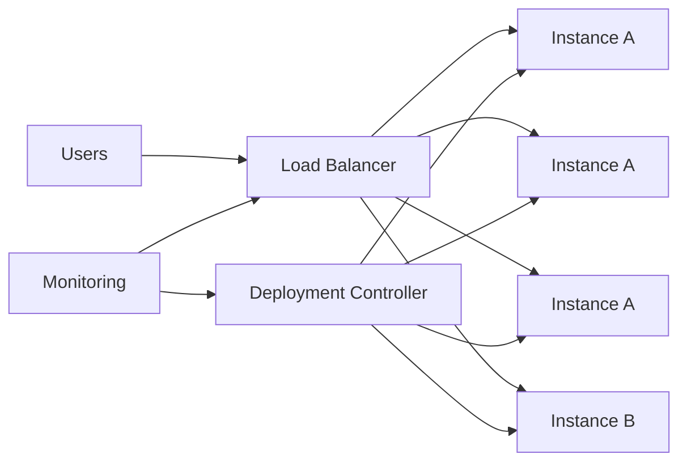
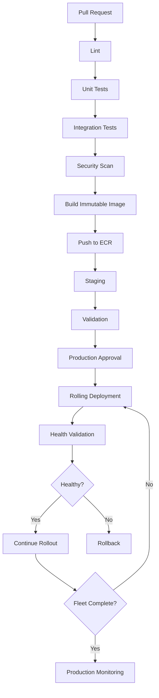

# 22- Rolling Deployment

## Overview

A rolling deployment replaces instances of an existing application version with a new version incrementally instead of replacing the entire production fleet at once.

A simplified rollout looks like:

```text
Version A
Version A
Version A
Version A

        ↓

Version B replaces one instance

Version B
Version A
Version A
Version A

        ↓

Version B
Version B
Version A
Version A

        ↓

Version B
Version B
Version B
Version A

        ↓

Version B
Version B
Version B
Version B
```

The objective is to update the production fleet while maintaining service availability.

Rolling deployment is common with:

- Kubernetes Deployments
- Amazon ECS services
- EC2 Auto Scaling Groups
- Docker-based services
- Django applications
- FastAPI services
- Microservices
- REST APIs
- gRPC services

A rolling deployment is primarily an **instance replacement strategy**. It should not be confused with canary deployment, where the key control is progressive exposure of production traffic to a new release.

---

## Why Rolling Deployment Exists

A naive deployment might stop every old instance and start the new version:

```text
Stop Version A
      ↓
Start Version B
```

This creates downtime or a large availability risk.

A rolling deployment instead maintains part of the existing capacity:

```text
Existing Fleet
      ↓
Replace Small Batch
      ↓
Validate
      ↓
Replace Next Batch
      ↓
Validate
      ↓
Complete
```

The deployment therefore reduces the immediate blast radius and can maintain service availability throughout the rollout.

---

## Rolling Deployment Architecture



During the rollout, the deployment controller gradually replaces Version A instances with Version B instances.

---

## Rolling Deployment Lifecycle

A production rolling deployment commonly follows:

```text
Build
 ↓
Test
 ↓
Security Scan
 ↓
Create Immutable Artifact
 ↓
Deploy First Batch
 ↓
Health Validation
 ↓
Deploy Next Batch
 ↓
Health Validation
 ↓
Continue
 ↓
All Instances Updated
 ↓
Post-Deployment Validation
```

Rollback should be possible whenever the deployment controller detects a failure.

---

## Rolling vs Canary vs Blue-Green

| Strategy | Primary Control | New Version Exposure | Rollback |
|---|---|---|---|
| Rolling | Instance replacement | Gradual through fleet replacement | Redeploy/revert |
| Canary | Traffic weighting | Controlled traffic percentage | Shift traffic away |
| Blue-Green | Environment cutover | Usually after environment validation | Switch environment |
| Recreate | Full replacement | All at once | Redeploy previous version |

The distinction matters because the failure modes are different.

A rolling deployment can expose the new version to users as soon as the first new instance enters service.

---

## Rolling Deployment vs Canary

Consider a four-instance service.

Rolling deployment:

```text
Step 1:
B A A A

Step 2:
B B A A

Step 3:
B B B A

Step 4:
B B B B
```

Depending on the load balancer and traffic distribution, Version B may immediately receive production traffic.

A canary deployment instead explicitly controls traffic:

```text
Stable = 95%
Canary = 5%
```

Therefore:

> Rolling controls replacement of capacity; canary controls exposure of traffic.

---

## Rolling Deployment vs Blue-Green

Blue-green maintains two environments:

```text
Blue  → Current
Green → New
```

The new environment can be validated before traffic is switched.

Rolling deployment usually operates within the same service capacity:

```text
Version A
Version A
Version A
Version A
```

and progressively changes it to:

```text
Version B
Version B
Version B
Version B
```

Blue-green generally consumes more temporary infrastructure capacity but provides a clearer environment-level rollback boundary.

---

## Deployment Parameters

A rolling deployment is usually controlled by parameters such as:

- Minimum healthy capacity
- Maximum capacity during deployment
- Batch size
- Maximum unavailable instances
- Health-check grace period
- Deployment timeout
- Failure threshold
- Automatic rollback behavior

These values directly affect:

- Availability
- Deployment speed
- Cost
- Failure blast radius

---

## Batch Size

Suppose a service has:

```text
20 instances
```

and the deployment replaces:

```text
2 instances per batch
```

The rollout becomes:

```text
Batch 1 → 2
Batch 2 → 2
Batch 3 → 2
...
Batch 10 → 2
```

A smaller batch provides finer-grained validation but increases deployment duration.

A larger batch reduces deployment time but increases risk.

---

## Capacity During Deployment

There are two common approaches.

### Maintain Capacity

```text
Before:
10 old

During:
2 new
8 old

Total:
10
```

This avoids additional capacity but reduces the old-version fleet while deployment is in progress.

### Surge Capacity

```text
Before:
10 old

During:
2 new
10 old

Total:
12
```

This provides additional safety but temporarily increases infrastructure cost.

---

## Minimum Healthy Capacity

A production deployment should avoid reducing capacity below the level required to serve expected traffic.

For example:

```text
Desired = 10
Minimum healthy = 8
```

The deployment controller should not intentionally reduce the service below the configured availability boundary.

The correct value depends on:

- Traffic
- Autoscaling
- Capacity per instance
- Failure tolerance
- Availability requirements

---

## Health Checks

A rolling deployment should not treat process startup as sufficient validation.

Use multiple levels of validation.

### Process

```text
Process running
```

### Infrastructure

```text
Instance healthy
Container healthy
Target registered
```

### Application

```text
/health
/readiness
```

### Functional

```text
Representative API request
```

### Dependency

```text
PostgreSQL
Redis
Kafka
External services
```

A deployment should progress only when the new instances are actually ready to serve production traffic.

---

## Readiness vs Liveness

These checks serve different purposes.

| Check | Purpose |
|---|---|
| Liveness | Is the application process functioning? |
| Readiness | Can the application safely receive traffic? |
| Startup | Has initialization completed? |

A readiness check is particularly important during rolling deployment because traffic should not reach an instance until it is capable of handling requests.

---

## Graceful Shutdown

The old application should be allowed to finish active work before termination.

A typical sequence is:

```text
Remove from Load Balancer
        ↓
Stop accepting new requests
        ↓
Drain existing requests
        ↓
Finish background work
        ↓
Terminate process
```

This is especially important for:

- Django
- FastAPI
- gRPC
- WebSockets
- Long-running API requests
- Celery workers

---

## Connection Draining

Without connection draining:

```text
Request
  ↓
Old Instance
  ↓
Instance terminated
```

the request may fail.

With graceful draining:

```text
Load Balancer
     ↓
Stop new traffic
     ↓
Existing connections finish
     ↓
Instance terminates
```

The drain period must be compatible with application request timeouts.

---

## Kubernetes Rolling Deployment

Kubernetes Deployments provide native rolling-update behavior.

Example:

```yaml
apiVersion: apps/v1
kind: Deployment
metadata:
  name: payments
spec:
  replicas: 6
  strategy:
    type: RollingUpdate
    rollingUpdate:
      maxUnavailable: 1
      maxSurge: 1
  selector:
    matchLabels:
      app: payments
  template:
    metadata:
      labels:
        app: payments
    spec:
      containers:
        - name: payments
          image: example/payments:git-def5678
          ports:
            - containerPort: 8000
          readinessProbe:
            httpGet:
              path: /ready
              port: 8000
            periodSeconds: 5
          livenessProbe:
            httpGet:
              path: /health
              port: 8000
            periodSeconds: 10
```

---

## `maxUnavailable`

`maxUnavailable` controls how much capacity may be unavailable during the rollout.

For example:

```yaml
maxUnavailable: 1
```

means the deployment can temporarily have one fewer available replica than the desired state.

For a service with six replicas:

```text
Desired = 6
Minimum available ≈ 5
```

The exact behavior also depends on readiness and Kubernetes rollout state.

---

## `maxSurge`

`maxSurge` controls how many additional Pods can temporarily exist above the desired replica count.

For:

```yaml
replicas: 6
maxSurge: 1
```

Kubernetes can temporarily run:

```text
7 Pods
```

This allows a new Pod to become ready before an old Pod is removed.

---

## Kubernetes Rollout Flow

```text
6 × Version A
      ↓
1 × Version B
5 × Version A
      ↓
2 × Version B
4 × Version A
      ↓
3 × Version B
3 × Version A
      ↓
6 × Version B
```

Readiness determines when the new Pods are considered available.

---

## Kubernetes Rollout Commands

Inspect deployment:

```bash
kubectl get deployment payments
```

Watch rollout:

```bash
kubectl rollout status deployment/payments
```

Inspect Pods:

```bash
kubectl get pods -l app=payments
```

Inspect rollout history:

```bash
kubectl rollout history deployment/payments
```

Rollback:

```bash
kubectl rollout undo deployment/payments
```

Inspect detailed state:

```bash
kubectl describe deployment payments
```

---

## Kubernetes Rollout History

Kubernetes can maintain revision history for a Deployment.

A typical operational sequence is:

```bash
kubectl rollout history deployment/payments
```

Then, if a release needs to be reverted:

```bash
kubectl rollout undo deployment/payments
```

Rollback should still be tested against database and state compatibility.

---

## Kubernetes Pod Disruption Considerations

Rolling deployment is different from voluntary disruption caused by:

- Node maintenance
- Cluster autoscaling
- Pod eviction
- Infrastructure failure

Production systems should also use appropriate:

- PodDisruptionBudgets
- Multi-zone scheduling
- Readiness probes
- Resource requests
- Resource limits

to maintain availability during operational events.

---

## Amazon ECS Rolling Deployment

Amazon ECS services can use rolling deployments to replace tasks gradually.

Conceptually:

```text
ECS Service
     ↓
Task Definition v1
Task Definition v1
Task Definition v1
Task Definition v1
```

becomes:

```text
Task Definition v2
Task Definition v1
Task Definition v1
Task Definition v1
```

and eventually:

```text
Task Definition v2
Task Definition v2
Task Definition v2
Task Definition v2
```

ECS controls task replacement according to deployment configuration and service health.

---

## ECS Deployment Configuration

Important ECS concepts include:

- Desired count
- Minimum healthy percentage
- Maximum percentage
- Deployment circuit breaker
- Health checks
- Target group health
- Task startup time
- Container health

The configuration determines how aggressively ECS replaces tasks.

---

## ECS Example

A deployment can be triggered by updating the service to a new task definition.

```bash
aws ecs update-service \
  --cluster payments \
  --service payments \
  --task-definition payments:42
```

Inspect the service:

```bash
aws ecs describe-services \
  --cluster payments \
  --services payments
```

Inspect tasks:

```bash
aws ecs list-tasks \
  --cluster payments \
  --service-name payments
```

---

## ECS Deployment Circuit Breaker

A deployment circuit breaker can detect failed deployments and stop progression.

Conceptually:

```text
New Task
   ↓
Fails Health Check
   ↓
Replacement
   ↓
Fails Again
   ↓
Deployment Failure
   ↓
Rollback
```

This prevents an unhealthy release from continuously replacing healthy capacity.

---

## EC2 Rolling Deployment

For EC2 workloads, rolling deployment can operate through:

- Auto Scaling Groups
- Launch templates
- Instance refresh
- Deployment agents
- Configuration management
- Custom deployment scripts

A modern immutable approach is generally preferable to manually mutating long-lived servers.

---

## EC2 Instance Refresh

An Auto Scaling Group can progressively replace instances using a newer launch template.

Conceptually:

```text
ASG
 ├── Old AMI
 ├── Old AMI
 ├── Old AMI
 └── Old AMI

        ↓

ASG
 ├── New AMI
 ├── Old AMI
 ├── Old AMI
 └── Old AMI
```

The replacement continues until the fleet uses the new configuration.

---

## EC2 Application Deployment

If the operating system remains unchanged and only application code changes, an application-level rolling deployment can be used:

```text
Load Balancer
      ↓
EC2 Instance
      ↓
Drain
      ↓
Deploy Application
      ↓
Health Check
      ↓
Return to Service
```

The instance should not return to production traffic until the application has passed readiness validation.

---

## Django Rolling Deployment

A Django service commonly looks like:

```text
ALB / Nginx
     ↓
Gunicorn
 ┌───┼───┐
 v1  v1  v2
     ↓
PostgreSQL
```

Important considerations include:

- Migration compatibility
- Static assets
- Session compatibility
- Cache compatibility
- Gunicorn graceful reload
- Celery workers
- Environment configuration

---

## Django Database Migrations

A dangerous rollout is:

```text
Deploy v2
 ↓
Apply destructive migration
 ↓
Old v1 still running
```

Version 1 may no longer understand the database schema.

Prefer:

```text
Expand
 ↓
Deploy compatible application
 ↓
Backfill if required
 ↓
Migrate application usage
 ↓
Contract later
```

This is commonly called the **expand-and-contract** pattern.

---

## FastAPI Rolling Deployment

A FastAPI service should expose readiness information.

Example:

```python
from fastapi import FastAPI

app = FastAPI()


@app.get("/health")
async def health() -> dict[str, str]:
    return {"status": "ok"}


@app.get("/ready")
async def ready() -> dict[str, str]:
    return {"status": "ready"}
```

In production, readiness should reflect whether the application can safely serve traffic rather than simply returning a static response.

---

## gRPC Rolling Deployment

gRPC requires additional attention because connections may be long-lived.

A deployment should support:

```text
Stop new connections
        ↓
Drain active streams
        ↓
Complete in-flight requests
        ↓
Terminate old process
```

Also validate protocol compatibility between old and new versions.

For Protobuf-based systems, avoid incompatible schema changes that break clients still running the previous version.

---

## Celery Rolling Deployment

Workers should be drained gracefully.

```text
Worker v1
   ↓
Stop receiving new work
   ↓
Finish active task
   ↓
Terminate
   ↓
Worker v2
```

Do not terminate workers abruptly when tasks cannot safely be retried.

Use task acknowledgment and idempotency semantics appropriate to the workload.

---

## Kafka Rolling Deployment

Kafka consumers are commonly rolled gradually:

```text
Consumer v1
Consumer v1
Consumer v1

      ↓

Consumer v2
Consumer v1
Consumer v1
```

A rolling consumer deployment may trigger partition rebalancing.

Consider:

- Consumer group behavior
- Partition ownership
- Rebalance duration
- Message compatibility
- Offset handling
- Processing idempotency

---

## Redis Compatibility

During deployment:

```text
Version A → Redis
Version B → Redis
```

Both versions may access the same keys.

Avoid changing:

- Serialization formats
- Key structures
- Data types

in a way that makes the previous version unable to operate during the rollout.

---

## API Backward Compatibility

Rolling deployment temporarily creates multiple application versions:

```text
Client
 ├── Version A
 └── Version B
```

Therefore API changes should generally be backward compatible during the transition.

Avoid immediately removing fields or changing response structures in ways that break clients still interacting with the previous version.

---

## Rolling Deployment with Docker

The container image should be immutable.

Use:

```text
payments:git-def5678
```

or preferably deploy using the image digest:

```text
payments@sha256:...
```

The deployment controller then replaces containers using that exact artifact.

---

## Build Once, Deploy Many

The CI/CD lifecycle should be:

```text
Source
 ↓
Test
 ↓
Build
 ↓
Image
 ↓
Registry
 ↓
Staging
 ↓
Production Rolling Deployment
```

Do not rebuild the application separately for production.

The artifact validated in earlier environments should be the artifact deployed to production.

---

## Docker Image Promotion

A production deployment can consume an image already published to ECR:

```text
GitHub Actions
      ↓
Build
      ↓
ECR
      ↓
Staging
      ↓
Validation
      ↓
Production Rolling Deployment
```

The image digest remains unchanged.

---

## GitHub Actions Rolling Deployment

A deployment workflow should separate artifact creation from production rollout.

```yaml
name: Deploy

on:
  workflow_dispatch:

permissions:
  contents: read
  id-token: write

jobs:
  deploy:
    runs-on: ubuntu-latest

    environment:
      name: production

    concurrency:
      group: production-deployment
      cancel-in-progress: false

    steps:
      - name: Configure AWS credentials
        uses: aws-actions/configure-aws-credentials@v4
        with:
          role-to-assume: ${{ vars.AWS_DEPLOY_ROLE_ARN }}
          aws-region: ap-south-1

      - name: Deploy immutable image
        env:
          IMAGE: ${{ vars.PRODUCTION_IMAGE }}
        run: |
          ./scripts/deploy.sh "$IMAGE"

      - name: Validate deployment
        run: |
          ./scripts/validate-production.sh
```

The deployment script should update the runtime to the known immutable artifact rather than building application code during deployment.

---

## Deployment Concurrency

Production deployments should normally be serialized.

```yaml
concurrency:
  group: production-deployment
  cancel-in-progress: false
```

This prevents two deployments from modifying the same production fleet simultaneously.

Without concurrency control:

```text
Deployment A
     ↓
Replace instances

Deployment B
     ↓
Replace instances
```

can create unpredictable rollout state.

---

## Why `cancel-in-progress: false` Is Often Appropriate

For production deployments, automatically cancelling a deployment halfway through can leave the system in an unexpected intermediate state.

A safer model is:

```text
Deployment A
     ↓
Complete

Deployment B
     ↓
Start
```

rather than:

```text
Deployment A
     ↓
Cancel
     ↓
Deployment B
```

The exact policy depends on the deployment controller and whether interruption is safely recoverable.

---

## Deployment Race Conditions

A dangerous sequence is:

```text
Commit A
 ↓
Deploy A

Commit B
 ↓
Deploy B

Deploy A finishes later
 ↓
Production becomes A
```

The system has accidentally rolled backward.

Mitigate this with:

- Concurrency groups
- Deployment locks
- Version checks
- Immutable artifact identifiers
- Environment protection

---

## Deployment Ordering

A robust deployment system should know:

```text
What is currently deployed?
What artifact is being deployed?
What release initiated the deployment?
Is another deployment active?
```

Record:

- Commit SHA
- Image digest
- Workflow run ID
- Deployment timestamp
- Environment
- Actor
- Release version

---

## Deployment Metadata

Example:

```text
release=2026.09.28
commit=def5678
image=sha256:abcd...
environment=production
workflow_run=123456
```

This metadata should be visible in logs and monitoring.

---

## Automatic Rollback

A rolling deployment should detect failures such as:

```text
New instances fail readiness
New containers crash
Target health fails
Application error rate increases
Deployment timeout
```

Then:

```text
Stop rollout
 ↓
Preserve healthy capacity
 ↓
Restore previous version
```

Automatic rollback is only safe when the rollback mechanism itself is reliable.

---

## Rollback Strategies

### Revert Application Version

Deploy the previous immutable image.

```text
Current:
sha256:new

Rollback:
sha256:previous
```

### Kubernetes Rollback

```bash
kubectl rollout undo deployment/payments
```

### ECS Rollback

Update the service back to the previous known task definition.

### EC2 Rollback

Restore the previous launch template or application artifact.

---

## Rollback and Database Changes

Application rollback is not sufficient if the database schema has already changed incompatibly.

Example:

```text
v1
 ↓
v2 + destructive migration
 ↓
Rollback v1
 ↓
v1 cannot operate
```

This is why database compatibility must be designed into the deployment strategy.

---

## Zero-Downtime Requirements

Rolling deployment can support zero-downtime operation, but it does not guarantee it automatically.

Required conditions typically include:

- Multiple instances
- Correct health checks
- Load balancer integration
- Graceful shutdown
- Capacity management
- Backward-compatible changes
- Reliable rollback
- Correct connection draining

A service with one instance cannot provide meaningful zero-downtime rolling replacement without additional capacity.

---

## Load Balancer Integration

The load balancer should route only to healthy instances.

```text
Load Balancer
     ↓
Healthy Version A
Healthy Version A
Healthy Version B
Unhealthy Version B ← no traffic
```

This prevents newly deployed but unhealthy instances from receiving user traffic.

---

## Health Check Failure

If a new instance repeatedly fails health checks:

```text
Deploy Version B
      ↓
Health Check Failed
      ↓
Do Not Route Traffic
      ↓
Investigate
```

The deployment controller should avoid continuing blindly.

---

## Monitoring

Monitor at least:

- Request rate
- Error rate
- P50 latency
- P95 latency
- P99 latency
- CPU
- Memory
- Restarts
- Health-check failures
- Database connections
- Database errors
- Redis latency
- Kafka lag
- Queue depth

Compare the new version with the old version whenever both coexist.

---

## Application Logs

Logs should identify the release:

```text
release=git-def5678
service=payments
environment=production
instance=i-012345
```

This makes it possible to correlate failures with newly deployed instances.

---

## Distributed Tracing

For microservices:

```text
Request
  ↓
Nginx
  ↓
Orders API v2
  ↓
Payments API v1
  ↓
PostgreSQL
```

Tracing can identify whether failures originate from the new version or a downstream dependency.

---

## Metrics During Rollout

A useful deployment dashboard should show:

```text
Desired Instances
Healthy Instances
Old Instances
New Instances
Request Rate
Error Rate
Latency
CPU
Memory
Restart Count
```

This allows operators to determine whether the rollout is progressing normally.

---

## Observability as a Deployment Dependency

A deployment system without reliable observability cannot safely determine whether a rollout succeeded.

At minimum, production deployments should have:

```text
Logs
+
Metrics
+
Health Checks
```

Distributed tracing becomes particularly valuable for microservice deployments.

---

## AWS OIDC

GitHub Actions should authenticate to AWS using short-lived OIDC credentials.

```text
GitHub Actions
      ↓
OIDC Token
      ↓
AWS STS
      ↓
IAM Role
      ↓
ECS / EC2 / ECR
```

Use:

```yaml
permissions:
  contents: read
  id-token: write
```

only where required.

---

## IAM Least Privilege

The deployment role should have only the permissions necessary to perform the rollout.

For ECS, this may include access to:

- ECS service updates
- ECS task definitions
- Describe operations
- Load balancer state
- Supporting deployment resources

Avoid giving the GitHub Actions job unrestricted AWS administrator access.

---

## Protected Environments

Production should normally be represented by a protected GitHub Environment.

Possible controls include:

- Required reviewers
- Deployment branch restrictions
- Environment secrets
- Deployment history

This creates a clear boundary between:

```text
CI
```

and:

```text
Production deployment
```

---

## Self-Hosted Runners

Self-hosted runners may have access to private infrastructure.

For privileged deployment jobs:

- Use dedicated runner groups
- Restrict repository access
- Prefer ephemeral runners
- Minimize installed credentials
- Control network egress
- Patch runner images
- Monitor runner activity

Do not allow arbitrary untrusted code to execute on a runner that can deploy production.

---

## Third-Party Actions

A deployment workflow has a high trust boundary.

A third-party action running inside the deployment job may potentially access:

- Environment variables
- Filesystem
- GITHUB_TOKEN
- AWS credentials obtained through OIDC
- Deployment configuration

Use trusted actions and appropriate version/SHA pinning policies.

---

## Security Boundary

A production workflow should separate:

```text
Untrusted Validation
        ↓
Trusted Artifact
        ↓
Protected Deployment
```

Do not combine arbitrary pull-request code execution with production deployment credentials.

---

## Supply Chain Security

The production artifact should have traceable identity.

A strong pipeline can associate:

```text
Commit SHA
 ↓
Build
 ↓
Image Digest
 ↓
SBOM
 ↓
Provenance
 ↓
Signature / Attestation
 ↓
Rolling Deployment
```

This provides stronger evidence about what was actually deployed.

---

## Artifact Verification

Before deployment, verify:

- Image exists
- Digest is known
- Artifact passed CI
- Security scan completed
- Artifact provenance is available where required
- Correct environment is selected

Never deploy an ambiguous mutable tag when exact artifact identity matters.

---

## Secrets

Avoid putting long-lived AWS credentials into GitHub secrets when OIDC is available.

Application secrets should generally be stored in an appropriate secret-management system and injected at runtime.

Examples include:

- AWS Secrets Manager
- AWS Systems Manager Parameter Store
- Kubernetes Secrets integrated with external secret management

Do not print secrets into deployment logs.

---

## Deployment Configuration

Separate:

```text
Application artifact
```

from:

```text
Environment configuration
```

For example:

```text
Image:
payments@sha256:...

Environment:
production

Database:
production-db

Redis:
production-redis
```

The same artifact can then be promoted across environments.

---

## Configuration Drift

Rolling deployment does not solve configuration drift.

If instances are configured differently:

```text
Instance A → CONFIG v1
Instance B → CONFIG v2
```

the rollout may produce inconsistent behavior.

Prefer declarative configuration and infrastructure as code where appropriate.

---

## Terraform and Rolling Deployment

Terraform should generally manage infrastructure state rather than becoming the application deployment mechanism for every request.

For example:

```text
Terraform
 ↓
ECS Service / ASG / Load Balancer
```

while:

```text
GitHub Actions
 ↓
Application Artifact
 ↓
Deployment
```

This separation reduces unnecessary infrastructure changes during application releases.

---

## CloudFormation and Rolling Deployment

CloudFormation can define infrastructure and deployment-related resources.

For example:

```text
CloudFormation
 ↓
ALB
ECS
Target Groups
IAM
Networking
```

Application deployment can then update the service using the new immutable artifact.

---

## High Availability

Rolling deployments work best when capacity is distributed across failure domains.

For AWS:

```text
AZ-A
 ├── Instance
 └── Instance

AZ-B
 ├── Instance
 └── Instance

AZ-C
 ├── Instance
 └── Instance
```

A rollout should avoid accidentally removing too much capacity from a single Availability Zone.

---

## Multi-AZ Rolling Deployment

For critical services:

```text
Before:
AZ-A → v1
AZ-B → v1
AZ-C → v1

During:
AZ-A → v2
AZ-B → v1
AZ-C → v1
```

Then progressively replace the remaining instances.

This reduces the risk of a single deployment step affecting the entire service.

---

## Disaster Recovery

Rolling deployment is not a DR strategy.

DR still requires:

- Backup strategy
- Recovery procedures
- Infrastructure recreation
- Database recovery
- Artifact retention
- Cross-region considerations

However, a rolling deployment can be part of the recovery process when restoring a known-good application version.

---

## Cost Considerations

Rolling deployment can temporarily increase or decrease capacity depending on configuration.

With surge capacity:

```text
Desired = 10
Temporary = 12
```

there is additional cost during deployment.

Without surge:

```text
Desired = 10
Temporary = 9
```

there may be lower cost but reduced capacity.

Production configuration should balance:

```text
Availability
+
Deployment speed
+
Cost
```

---

## Performance Considerations

A new version may have different resource requirements.

Monitor:

```text
CPU per request
Memory per request
Database connections
Network throughput
Latency
```

A rollout that succeeds functionally may still introduce a performance regression.

---

## Scaling During Deployment

Autoscaling and rolling deployment can interact in unexpected ways.

For example:

```text
Deployment removes capacity
        ↓
CPU increases
        ↓
Autoscaler adds instances
        ↓
Deployment replaces more instances
```

This can produce unnecessary scaling activity.

Understand the interaction between:

- Deployment controller
- Autoscaler
- Load balancer
- Health checks

before production rollout.

---

## Deployment Timeouts

Every rollout should have a bounded timeout.

A deployment should not remain indefinitely in:

```text
Updating
```

because of:

- Unhealthy instances
- Failed image pulls
- Network problems
- Database initialization
- Startup hangs
- Capacity shortages

Timeouts should trigger investigation or rollback according to the deployment platform's capabilities.

---

## Failure Domains

Troubleshoot rolling deployments by isolating the failure domain.

```text
Workflow
 ↓
Artifact
 ↓
Registry
 ↓
Deployment Controller
 ↓
Compute
 ↓
Health Check
 ↓
Load Balancer
 ↓
Application
 ↓
Database / Dependencies
```

Do not immediately assume an application code defect.

---

## Troubleshooting: Deployment Does Not Start

**Possible causes:**

- GitHub Actions failure
- Environment approval pending
- IAM permissions
- Concurrency lock
- Invalid deployment configuration

**Checks:**

```bash
gh run list
gh run view RUN_ID
```

Then inspect the deployment controller state.

---

## Troubleshooting: New Instances Are Unhealthy

**Possible causes:**

- Incorrect health endpoint
- Application startup failure
- Missing environment variables
- Database connection failure
- Redis connection failure
- Security group/network issue
- Wrong container port

Check:

```text
Container logs
Health check configuration
Target health
Application readiness
Environment configuration
```

---

## Troubleshooting: Old Instances Are Terminated Too Early

Possible causes:

- Incorrect minimum healthy capacity
- Health checks too permissive
- Insufficient drain time
- Incorrect deployment configuration

Review the deployment controller and load balancer settings.

---

## Troubleshooting: Deployment Is Stuck

Check:

```text
Deployment status
Task/instance state
Health checks
Capacity
Image pull
Network connectivity
IAM
Logs
```

For Kubernetes:

```bash
kubectl rollout status deployment/payments
kubectl describe deployment payments
kubectl get pods -l app=payments
```

For ECS:

```bash
aws ecs describe-services \
  --cluster payments \
  --services payments
```

---

## Troubleshooting: Application Works Locally but Fails During Rollout

Compare:

```text
Local environment
vs
Production environment
```

Check:

- Environment variables
- Secrets
- Network access
- Database
- Redis
- IAM
- Container image
- CPU/memory
- Health-check behavior

Deployment failures are often environment-specific rather than code-specific.

---

## Troubleshooting: Rollback Fails

Investigate:

```text
Artifact availability
Database compatibility
Configuration compatibility
Routing
Health checks
Message queues
Cache state
```

If the database has changed incompatibly, simply redeploying the previous image may not restore functionality.

---

## Troubleshooting: Mixed Versions Cause Errors

This usually indicates an incompatibility between:

```text
Old Version
```

and:

```text
New Version
```

Review:

- API contracts
- Database schema
- Redis formats
- Kafka events
- Celery tasks
- Configuration
- Shared files

Rolling deployments inherently create a temporary mixed-version state.

---

## GitHub CLI Operational Commands

List workflows:

```bash
gh workflow list
```

Inspect runs:

```bash
gh run list
gh run view RUN_ID
```

View logs:

```bash
gh run view RUN_ID --log
```

Rerun:

```bash
gh run rerun RUN_ID
```

Trigger a deployment workflow:

```bash
gh workflow run deploy.yml
```

These commands are useful for operational investigation without turning GitHub CLI into a separate administration layer.

---

## Production Deployment Workflow

A production-grade rolling pipeline can be:



The critical property is that the same immutable artifact flows through the environments.

---

## Recommended Production Sequence

```text
Pull Request
 ↓
Lint
 ↓
Unit Tests
 ↓
Integration Tests
 ↓
Security Scan
 ↓
Build
 ↓
Publish Immutable Image
 ↓
Staging
 ↓
Validation
 ↓
Production Approval
 ↓
Rolling Deployment
 ↓
Health Validation
 ↓
Progressive Instance Replacement
 ↓
Monitoring
 ↓
Release Complete
```

Rollback should remain available throughout the rollout.

---

## Rolling Deployment with Deployment Gates

A mature deployment can introduce explicit gates:

```text
Deploy Batch
     ↓
Health Check
     ↓
Metrics Check
     ↓
Approval / Automated Gate
     ↓
Next Batch
```

This is especially useful for high-risk services.

---

## Automated Gates

Possible conditions:

```text
Healthy replicas >= required minimum
5xx rate < threshold
P95 latency < threshold
No abnormal restart rate
Database error rate normal
Business success rate normal
```

Use multiple signals rather than a single CPU or process-health metric.

---

## Immutable Release Identity

Every deployment should identify the exact artifact.

Prefer:

```text
git-def5678
```

or:

```text
sha256:...
```

over:

```text
latest
```

Mutable tags make it difficult to determine exactly which artifact was deployed.

---

## Release Metadata

Record:

```text
Release ID
Commit SHA
Image Digest
Workflow Run ID
Environment
Deployment Start
Deployment End
Actor
```

This supports:

- Auditing
- Troubleshooting
- Rollback
- Incident response

---

## Operational Best Practices

- Keep deployment batches small enough to limit blast radius.
- Use readiness checks instead of process checks alone.
- Preserve sufficient healthy capacity.
- Drain connections before terminating instances.
- Use immutable artifacts.
- Serialize production deployments.
- Make database migrations backward compatible.
- Monitor the new version during rollout.
- Record exact release identity.
- Test rollback before relying on it.
- Keep the previous artifact available.
- Separate CI credentials from production deployment credentials.
- Use OIDC for AWS authentication.
- Protect production environments.
- Avoid executing untrusted code in privileged deployment jobs.

---

## Common Mistakes

### Replacing Too Much Capacity

A large batch can cause an availability incident if the new version fails.

### No Readiness Probe

A process may be running while the application is still initializing.

### No Connection Draining

Existing requests can be terminated unexpectedly.

### Destructive Database Migration

Old instances may still depend on the previous schema.

### Mutable Docker Tags

Using `latest` makes release identity ambiguous.

### Concurrent Deployments

Two rolling deployments can interfere with one another.

### Monitoring Only Infrastructure

A deployment can be CPU-healthy but functionally broken.

### Ignoring Mixed Versions

Old and new application versions coexist during rollout.

### Rebuilding During Deployment

The artifact tested in CI may differ from the artifact deployed to production.

### No Rollback Plan

A failed deployment should not require improvisation during an incident.

### Unsafe Self-Hosted Runner

A privileged runner can become a production security boundary.

---

## Senior Design Considerations

### Rolling Deployment Is a Mixed-Version System

For part of the rollout:

```text
Version A
+
Version B
```

are simultaneously serving production.

Therefore compatibility must be treated as a first-class design requirement.

### Availability Is a Function of Capacity and Health

A rollout is safe only if enough healthy capacity remains.

```text
Available Capacity
=
Healthy Instances × Capacity Per Instance
```

Do not reason only from instance count.

### Deployment Safety Depends on Readiness

The deployment controller needs reliable information about whether a new instance is actually ready.

### Rollback Is Different From Reverse Deployment

Code can be reverted quickly.

Data changes may not be reversible.

### Deployment Controllers Should Be Idempotent

Re-running the same deployment should converge on the intended state rather than produce unpredictable side effects.

### Artifact Identity Must Be Immutable

A release should refer to an exact build, not an ambiguous mutable reference.

### CI/CD and Runtime Responsibilities Should Be Separated

GitHub Actions should orchestrate the deployment.

The runtime platform should manage:

- Scheduling
- Health
- Capacity
- Service lifecycle
- Traffic

This separation improves maintainability.

---

## Interview Scenarios

### Design a Zero-Downtime Rolling Deployment

Discuss:

```text
Load Balancer
 ↓
Multiple Instances
 ↓
Health Checks
 ↓
Graceful Shutdown
 ↓
Batch Replacement
 ↓
Monitoring
 ↓
Rollback
```

Then address database compatibility and deployment concurrency.

### How Is Rolling Different From Canary?

Rolling replaces instances gradually.

Canary controls production traffic exposure to the new version.

### What Happens if the New Version Is Unhealthy?

The deployment should:

```text
Stop
 ↓
Preserve Healthy Capacity
 ↓
Prevent Further Replacement
 ↓
Rollback
```

### How Do You Handle Database Migrations?

Use backward-compatible expand-and-contract migrations so both old and new application versions can operate during rollout.

### How Do You Prevent Two Production Deployments From Running Together?

Use:

```yaml
concurrency:
  group: production-deployment
  cancel-in-progress: false
```

and enforce deployment locking at the runtime platform where applicable.

### How Would You Roll Back Kubernetes?

```bash
kubectl rollout undo deployment/payments
```

Then verify:

```bash
kubectl rollout status deployment/payments
```

### What Makes Rolling Deployment Difficult for gRPC?

Long-lived HTTP/2 connections require connection draining and careful handling of active streams.

### Why Should You Avoid `latest`?

Because a mutable tag does not uniquely identify the artifact that was tested and deployed.

### Can Rolling Deployment Guarantee Zero Downtime?

No. It can support zero-downtime operation when capacity, health checks, graceful shutdown, compatibility, and traffic routing are correctly designed.

---

## Production Checklist

### Artifact

- [ ] Build completed successfully
- [ ] Tests passed
- [ ] Security scans passed
- [ ] Image is immutable
- [ ] Image digest is recorded
- [ ] Artifact provenance requirements are satisfied

### Deployment

- [ ] Batch size is defined
- [ ] Minimum healthy capacity is defined
- [ ] Surge capacity is understood
- [ ] Deployment timeout is configured
- [ ] Health checks are reliable
- [ ] Readiness checks are configured
- [ ] Connection draining is configured

### Application

- [ ] API changes are backward compatible
- [ ] Database migration is compatible
- [ ] Redis changes are compatible
- [ ] Kafka events are compatible
- [ ] Celery tasks are compatible
- [ ] gRPC protocol changes are compatible

### Security

- [ ] Production environment is protected
- [ ] AWS authentication uses OIDC
- [ ] IAM role is least-privileged
- [ ] Deployment credentials are isolated
- [ ] Third-party actions are controlled
- [ ] Self-hosted runners are isolated

### Reliability

- [ ] Production deployments are serialized
- [ ] Rollback is tested
- [ ] Previous artifact is retained
- [ ] Healthy capacity remains available
- [ ] Multi-AZ behavior is understood
- [ ] Autoscaling interaction is understood

### Observability

- [ ] Error rate is monitored
- [ ] Latency is monitored
- [ ] Health-check failures are visible
- [ ] Instance/task/Pod state is visible
- [ ] Logs contain release identity
- [ ] Deployment events are auditable
- [ ] Business metrics are monitored where appropriate

## Key Takeaways

- Rolling deployment progressively replaces instances or tasks with a new version while preserving enough healthy capacity to maintain service availability.
- The strategy depends on reliable readiness and health checks, graceful connection draining, appropriate batch sizing, and careful capacity management.
- Rolling deployments inherently create a mixed-version production state, so database schemas, APIs, Redis data, Kafka messages, Celery tasks, and gRPC contracts must remain backward compatible during the rollout.
- Production deployments should use immutable artifacts, serialized deployment execution, protected environments, least-privilege OIDC-based AWS access, strong observability, and a tested rollback mechanism.
- Rolling deployment reduces release blast radius but does not guarantee zero downtime or safe rollback by itself; application compatibility, state management, infrastructure capacity, and operational controls determine the actual reliability of the rollout.