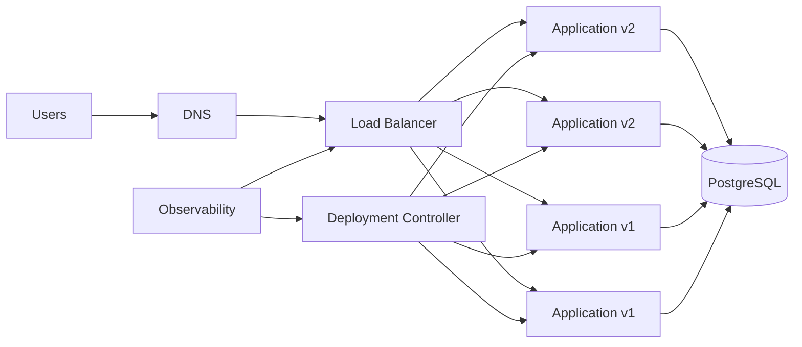
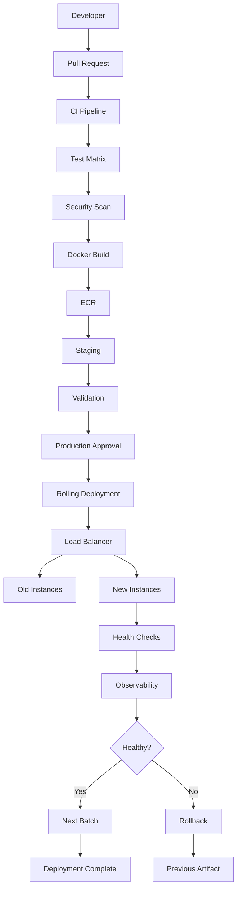

# 23- Zero Downtime Deployment

## Overview

Zero downtime deployment is a deployment approach designed to keep an application available to users while a new version is released.

The core objective is:

```text
Users continue sending requests
        ↓
Existing capacity remains available
        ↓
New version is introduced safely
        ↓
New capacity becomes healthy
        ↓
Traffic gradually or immediately uses the new version
        ↓
Old capacity is removed
```

Zero downtime is not a single deployment mechanism. It is an **availability property produced by coordinated application, infrastructure, networking, data, and deployment practices**.

Common strategies include:

- Rolling deployments
- Blue-green deployments
- Canary deployments
- Load-balancer-based traffic switching
- Kubernetes rolling updates
- ECS rolling deployments
- Instance replacement
- Graceful process replacement

A deployment can use a rolling strategy and still cause downtime if health checks, capacity, connection draining, database compatibility, or application startup behavior are incorrect.

---

## What Zero Downtime Actually Means

A deployment should allow the service to continue accepting and processing requests throughout the release.

Conceptually:

```text
Before Deployment

Users
  ↓
Load Balancer
  ↓
v1  v1  v1  v1


During Deployment

Users
  ↓
Load Balancer
  ↓
v1  v1  v2  v2


After Deployment

Users
  ↓
Load Balancer
  ↓
v2  v2  v2  v2
```

The critical requirement is that sufficient healthy capacity remains available during the transition.

Zero downtime does **not** mean:

- Every request is guaranteed to succeed.
- No individual connection can ever be interrupted.
- The database can be changed arbitrarily.
- Every deployment is automatically reversible.
- Infrastructure changes are risk-free.

It means the deployment process is designed so that the service remains available according to its defined availability and reliability requirements.

---

## Why Zero Downtime Deployment Matters

Traditional deployment:

```text
Stop application
      ↓
Replace application
      ↓
Start application
```

creates a period where no application is serving traffic.

A zero downtime deployment instead maintains an overlap:

```text
Old Version
     +
New Version
```

during the transition.

This is particularly important for:

- Public APIs
- Payment services
- Authentication services
- High-traffic Django applications
- FastAPI services
- Microservices
- gRPC services
- Background workers
- Customer-facing web applications

---

## Zero Downtime Is a System Property

A deployment strategy alone cannot guarantee zero downtime.

The complete system includes:

```text
Application
     +
Load Balancer
     +
Health Checks
     +
Capacity
     +
Database Compatibility
     +
Connection Management
     +
Deployment Controller
     +
Observability
     +
Rollback
```

A failure in any critical component can result in downtime.

For example:

```text
Correct Rolling Deployment
        +
Incorrect Database Migration
        =
Possible Downtime
```

---

## Core Zero Downtime Requirements

A production deployment generally requires:

| Requirement | Purpose |
|---|---|
| Multiple serving instances | Preserve capacity during replacement |
| Load balancing | Route traffic only to healthy instances |
| Readiness checks | Prevent premature traffic |
| Graceful shutdown | Protect in-flight requests |
| Connection draining | Allow existing connections to finish |
| Backward-compatible changes | Support mixed application versions |
| Immutable artifacts | Guarantee release identity |
| Deployment concurrency | Prevent conflicting deployments |
| Monitoring | Detect regressions |
| Rollback | Recover from failed releases |

---

## Zero Downtime Architecture



During deployment, both versions may temporarily coexist.

That mixed-version state is one of the most important concepts in zero downtime deployment.

---

## Request Lifecycle During Deployment

A request may flow like:

```text
Client
  ↓
DNS
  ↓
Load Balancer
  ↓
Healthy Application Instance
  ↓
Database / Cache / External Service
  ↓
Response
```

During deployment:

```text
Client
  ↓
Load Balancer
  ├── v1
  ├── v1
  ├── v2
  └── v2
```

The load balancer determines which healthy instances can receive traffic.

---

## Health Checks

Health checks are fundamental to zero downtime deployment.

A health check should answer:

> Can this instance safely receive production traffic?

Useful health checks include:

- Process health
- Container health
- Readiness
- Dependency health
- Application-level validation

Avoid using only:

```text
HTTP 200 from process
```

as the complete definition of readiness.

---

## Liveness vs Readiness

| Check | Purpose |
|---|---|
| Startup | Application initialization completed |
| Liveness | Process should remain running |
| Readiness | Application can receive traffic |

For deployment safety, readiness is particularly important.

Example:

```text
Container starts
      ↓
Application initializes
      ↓
Database connection ready
      ↓
Required configuration loaded
      ↓
/ready = 200
      ↓
Load balancer sends traffic
```

---

## Example FastAPI Health Endpoints

```python
from fastapi import FastAPI

app = FastAPI()


@app.get("/health")
async def health() -> dict[str, str]:
    return {"status": "ok"}


@app.get("/ready")
async def ready() -> dict[str, str]:
    return {"status": "ready"}
```

In production, readiness should reflect actual application readiness rather than simply returning a hard-coded response.

---

## Django Health Checks

For Django applications, health endpoints can validate important application dependencies.

For example:

```text
/health
```

can provide basic process-level health.

A readiness endpoint can additionally validate selected dependencies such as:

```text
Django
 ↓
PostgreSQL
 ↓
Redis
```

Do not make readiness checks unnecessarily expensive. A health endpoint that performs expensive database operations on every probe can itself become a source of load.

---

## Load Balancer Responsibility

A load balancer should not route traffic to instances that are not ready.

Conceptually:

```text
Load Balancer
    |
    +-- v1 healthy   → traffic
    +-- v1 healthy   → traffic
    +-- v2 starting → no traffic
    +-- v2 healthy   → traffic
```

When the new instance becomes healthy, it can enter the serving pool.

---

## Connection Draining

Before an old instance is terminated:

```text
Remove instance from traffic
        ↓
Stop new requests
        ↓
Allow active requests to complete
        ↓
Close connections
        ↓
Terminate instance
```

This is connection draining.

Without it:

```text
Client
  ↓
Old instance
  ↓
Deployment terminates instance
  ↓
Request fails
```

---

## Graceful Shutdown

Application processes should handle termination signals correctly.

Typical flow:

```text
SIGTERM
  ↓
Stop accepting new work
  ↓
Finish active requests
  ↓
Close resources
  ↓
Exit
```

This matters for:

- Gunicorn
- Uvicorn
- FastAPI
- Django
- gRPC servers
- Celery workers

---

## Long-Lived Connections

Traditional request-response traffic is easier to drain than long-lived connections.

Examples include:

- WebSockets
- gRPC streams
- Server-sent events
- Long-running HTTP requests

For these systems, graceful termination must account for active connections.

A deployment may need:

```text
Stop new connections
        ↓
Notify clients
        ↓
Drain active connections
        ↓
Wait for timeout
        ↓
Terminate
```

---

## Rolling Deployment

Rolling deployment progressively replaces old instances.

```text
v1 v1 v1 v1
 ↓
v2 v1 v1 v1
 ↓
v2 v2 v1 v1
 ↓
v2 v2 v2 v1
 ↓
v2 v2 v2 v2
```

It is one of the most common zero downtime deployment strategies.

The main controls are:

- Batch size
- Minimum healthy capacity
- Maximum surge
- Readiness
- Health checks
- Connection draining
- Rollback

---

## Rolling Deployment Capacity

Suppose:

```text
Desired instances = 10
```

A rollout can maintain:

```text
8 healthy instances minimum
```

while replacing the remaining instances.

The exact capacity policy depends on:

- Request load
- Instance capacity
- Autoscaling
- Availability requirements
- Deployment speed requirements

---

## Surge Capacity

A deployment can temporarily increase capacity.

```text
Desired = 10

Before:
10 × v1

During:
10 × v1
 2 × v2

Then:
8 × v1
 2 × v2
```

Surge capacity improves deployment safety but increases infrastructure cost.

---

## Blue-Green Deployment

Blue-green maintains two application environments.

```text
Blue  → v1
Green → v2
```

The new environment can be validated before switching traffic.

```text
Users
  ↓
Load Balancer
  ↓
Blue v1
```

Then:

```text
Users
  ↓
Load Balancer
  ↓
Green v2
```

Rollback can switch traffic back to Blue if the environment remains available.

---

## Canary Deployment

Canary deployment exposes a controlled portion of traffic to the new version.

```text
Users
  ↓
Load Balancer
  ├── 95% → v1
  └── 5%  → v2
```

The deployment can progressively increase exposure.

```text
5%
 ↓
10%
 ↓
25%
 ↓
50%
 ↓
100%
```

Canary is particularly useful when runtime behavior needs validation using real production traffic.

---

## Rolling vs Blue-Green vs Canary

| Strategy | Main Mechanism | Capacity Requirement | Typical Rollback |
|---|---|---|---|
| Rolling | Replace instances progressively | Moderate | Redeploy previous version |
| Blue-Green | Switch between environments | Higher | Switch traffic back |
| Canary | Control traffic exposure | Moderate | Reduce/stop canary traffic |
| Recreate | Replace everything | Low temporary capacity | Redeploy |

Zero downtime can be achieved using several of these strategies when the surrounding system is correctly designed.

---

## Kubernetes Zero Downtime Deployment

Kubernetes Deployments support rolling updates.

Example:

```yaml
apiVersion: apps/v1
kind: Deployment
metadata:
  name: orders
spec:
  replicas: 6
  strategy:
    type: RollingUpdate
    rollingUpdate:
      maxUnavailable: 1
      maxSurge: 1
  selector:
    matchLabels:
      app: orders
  template:
    metadata:
      labels:
        app: orders
    spec:
      containers:
        - name: orders
          image: example/orders@sha256:abc123
          ports:
            - containerPort: 8000
          readinessProbe:
            httpGet:
              path: /ready
              port: 8000
            periodSeconds: 5
            timeoutSeconds: 2
```

---

## Kubernetes `maxUnavailable`

This controls how many replicas can be unavailable during the rollout.

For:

```yaml
replicas: 6
maxUnavailable: 1
```

the deployment can temporarily operate with fewer than six available replicas while maintaining the configured rollout constraints.

A value that is too aggressive can reduce availability during deployment.

---

## Kubernetes `maxSurge`

`maxSurge` allows additional Pods to be created temporarily.

For:

```yaml
replicas: 6
maxSurge: 1
```

the controller can temporarily create an additional Pod before removing an old one.

This creates a safer transition:

```text
6 old
 ↓
6 old + 1 new
 ↓
5 old + 1 new
 ↓
5 old + 2 new
```

---

## Kubernetes Service Routing

A Service provides stable routing while Pods change.

```text
Client
  ↓
Service
  ↓
Healthy Pods
 ├── v1
 ├── v1
 └── v2
```

Pods can be replaced without clients needing to know their individual addresses.

---

## Kubernetes Rollout Commands

Check rollout:

```bash
kubectl rollout status deployment/orders
```

Watch Pods:

```bash
kubectl get pods -l app=orders -w
```

Inspect deployment:

```bash
kubectl describe deployment orders
```

Inspect history:

```bash
kubectl rollout history deployment/orders
```

Rollback:

```bash
kubectl rollout undo deployment/orders
```

---

## Amazon ECS Zero Downtime Deployment

ECS services can replace tasks progressively.

```text
ECS Service
   ↓
Task v1
Task v1
Task v1
Task v1
```

During rollout:

```text
Task v2
Task v1
Task v1
Task v1
```

Eventually:

```text
Task v2
Task v2
Task v2
Task v2
```

The service should maintain enough healthy tasks to serve traffic.

---

## ECS Health Validation

Zero downtime depends on:

- ECS task health
- Container health checks
- Load balancer target health
- Deployment configuration
- Desired count
- Minimum healthy percentage
- Maximum percentage
- Deployment circuit breaker

A task being in `RUNNING` state does not necessarily mean the application is ready for user traffic.

---

## ECS Deployment Example

```bash
aws ecs update-service \
  --cluster orders \
  --service orders \
  --task-definition orders:42
```

Inspect the service:

```bash
aws ecs describe-services \
  --cluster orders \
  --services orders
```

Inspect running tasks:

```bash
aws ecs list-tasks \
  --cluster orders \
  --service-name orders
```

---

## ECS Deployment Circuit Breaker

A deployment circuit breaker can stop a rollout when tasks repeatedly fail to become healthy.

Conceptually:

```text
Deploy v2
   ↓
Task starts
   ↓
Health check fails
   ↓
Task replaced
   ↓
Health check fails again
   ↓
Deployment failure
   ↓
Rollback / operator intervention
```

This limits the blast radius of an unhealthy release.

---

## EC2 Zero Downtime Deployment

EC2 deployments can use:

- Auto Scaling Groups
- Instance Refresh
- Load balancers
- Launch templates
- Immutable AMIs
- Application-level deployment agents
- Deployment scripts

A common architecture is:

```text
ALB
 ↓
Auto Scaling Group
 ├── EC2 v1
 ├── EC2 v1
 ├── EC2 v1
 └── EC2 v1
```

During replacement:

```text
ALB
 ↓
ASG
 ├── EC2 v2
 ├── EC2 v1
 ├── EC2 v1
 └── EC2 v1
```

---

## Instance Refresh

An Auto Scaling Group instance refresh can progressively replace instances using the desired launch configuration.

The new instance should:

1. Launch.
2. Initialize.
3. Start the application.
4. Pass health checks.
5. Become eligible for traffic.
6. Allow an old instance to be removed.

This provides infrastructure-level rolling replacement.

---

## Application-Level EC2 Deployment

For application-only releases:

```text
ALB
 ↓
EC2
 ↓
Drain
 ↓
Deploy artifact
 ↓
Restart application
 ↓
Health check
 ↓
Return to traffic
```

This approach requires careful handling because the instance may temporarily stop serving traffic.

For high availability, sufficient additional instances should remain available.

---

## Database Compatibility

Database changes are one of the most common causes of zero downtime failures.

During deployment:

```text
v1
+
v2
```

may both access:

```text
PostgreSQL
```

Therefore the schema must support both versions during the transition.

---

## Expand and Contract

A safer migration strategy is:

```text
Expand
 ↓
Deploy compatible application
 ↓
Backfill
 ↓
Switch application behavior
 ↓
Contract
```

Example:

### Phase 1

Add a new nullable column:

```sql
ALTER TABLE users
ADD COLUMN display_name VARCHAR(255);
```

### Phase 2

Deploy application code that understands both old and new representations.

### Phase 3

Backfill data.

### Phase 4

Switch application behavior.

### Phase 5

Remove the old schema only after no running version requires it.

---

## Dangerous Migration

Avoid:

```text
Deploy v2
 ↓
Drop column required by v1
 ↓
v1 still running
 ↓
Requests fail
```

This breaks the mixed-version requirement of a rolling deployment.

---

## Django Migration Strategy

For Django:

```bash
python manage.py makemigrations
python manage.py migrate
```

The important production consideration is not the command itself but migration compatibility.

Avoid deploying a migration that makes the currently running application version unable to operate.

---

## FastAPI and Schema Compatibility

For REST APIs, additive changes are generally safer during rolling deployments.

Prefer:

```json
{
  "id": 123,
  "name": "Alice",
  "display_name": "Alice"
}
```

over immediately removing fields consumed by older clients.

For request contracts, accept old and new forms when required during the transition.

---

## gRPC Compatibility

gRPC deployments must account for long-lived connections and mixed server versions.

Protobuf changes should preserve compatibility.

For example:

- Do not reuse field numbers.
- Avoid incompatible type changes.
- Prefer additive fields.
- Retain compatibility while old clients remain active.

---

## Redis Compatibility

During deployment:

```text
v1 → Redis
v2 → Redis
```

Both versions may read the same data.

Be careful with:

- Key formats
- Serialization formats
- Redis data types
- TTL assumptions
- Cache invalidation

A cache migration that breaks old instances can turn a rolling deployment into an outage.

---

## Kafka Compatibility

Kafka consumers and producers may temporarily run multiple versions.

```text
Producer v2
      ↓
Kafka
      ↓
Consumer v1 + Consumer v2
```

Event schemas should remain compatible during the transition.

Consider:

- Schema evolution
- Consumer compatibility
- Producer compatibility
- Partition behavior
- Consumer-group rebalancing
- Offset management

---

## Celery Rolling Deployment

Workers should be drained before termination.

```text
Worker v1
   ↓
Stop accepting new tasks
   ↓
Finish active tasks
   ↓
Terminate
   ↓
Worker v2
```

Task idempotency is important because retries or worker termination can result in a task being processed more than once.

---

## API Gateway and Nginx

Nginx can sit in front of multiple application instances.

```text
Client
  ↓
Nginx
  ↓
 ┌───────────────┐
 │               │
 v               v
App v1          App v2
```

Nginx or the upstream load balancer should route traffic only to available backends.

For larger deployments, a cloud load balancer or Kubernetes Service may handle the traffic layer.

---

## Immutable Docker Images

Use exact image identities.

Preferred:

```text
orders@sha256:...
```

or an immutable commit-based tag:

```text
orders:git-def5678
```

Avoid:

```text
orders:latest
```

for production deployment identity.

---

## Build Once, Deploy Many

A zero downtime pipeline should generally follow:

```text
Source
 ↓
Tests
 ↓
Build
 ↓
Immutable Image
 ↓
Registry
 ↓
Staging
 ↓
Validation
 ↓
Production
```

Do not rebuild for production.

The image validated in staging should be the same image promoted to production.

---

## GitHub Actions Architecture

A production workflow can separate build and deployment:

```yaml
name: Production Deployment

on:
  workflow_dispatch:

permissions:
  contents: read
  id-token: write

jobs:
  deploy:
    runs-on: ubuntu-latest

    environment:
      name: production

    concurrency:
      group: production-deployment
      cancel-in-progress: false

    steps:
      - name: Configure AWS credentials
        uses: aws-actions/configure-aws-credentials@v4
        with:
          role-to-assume: ${{ vars.AWS_DEPLOY_ROLE_ARN }}
          aws-region: ap-south-1

      - name: Deploy immutable image
        env:
          IMAGE_DIGEST: ${{ vars.PRODUCTION_IMAGE_DIGEST }}
        run: |
          ./scripts/deploy.sh "$IMAGE_DIGEST"

      - name: Validate service
        run: |
          ./scripts/validate-production.sh
```

The deployment job should consume an already-built artifact.

---

## GitHub Actions and OIDC

AWS credentials should preferably be obtained using GitHub OIDC:

```text
GitHub Actions
      ↓
OIDC token
      ↓
AWS STS
      ↓
IAM role
      ↓
Deployment service
```

This avoids storing long-lived AWS access keys in GitHub secrets.

Use the smallest practical permissions.

---

## Production Environment Protection

A production GitHub Environment can provide:

- Required reviewers
- Deployment branch restrictions
- Environment-specific secrets
- Deployment history

A typical flow is:

```text
CI
 ↓
Artifact
 ↓
Staging
 ↓
Validation
 ↓
Production Approval
 ↓
Rolling Deployment
```

---

## Deployment Concurrency

Prevent simultaneous production deployments:

```yaml
concurrency:
  group: production-deployment
  cancel-in-progress: false
```

Without this:

```text
Deployment A → v2
Deployment B → v3
```

could modify the same fleet concurrently.

The resulting state can become difficult to reason about.

---

## Deployment Race Condition

Consider:

```text
Commit A
 ↓
Deploy A starts

Commit B
 ↓
Deploy B starts

Deploy B finishes
 ↓
Production = B

Deploy A finishes later
 ↓
Production = A
```

This is an accidental rollback.

Use:

- Deployment concurrency
- Release ordering
- Immutable artifact identifiers
- Runtime version checks

to prevent stale deployments from becoming active.

---

## Observability

Zero downtime deployment requires more than checking whether processes are running.

Monitor:

- Request rate
- 4xx rate
- 5xx rate
- P50 latency
- P95 latency
- P99 latency
- CPU
- Memory
- Restarts
- Health checks
- Database errors
- Redis latency
- Kafka lag
- Queue depth

---

## Business Metrics

Technical metrics may remain healthy while business behavior is broken.

For important services, monitor relevant business indicators such as:

```text
Successful payments
Order creation rate
Authentication success rate
Transaction failure rate
```

This can reveal deployment regressions that infrastructure metrics miss.

---

## Deployment Dashboard

A useful deployment dashboard should show:

```text
Release
Commit SHA
Image Digest

Desired Capacity
Healthy Capacity
Old Version Count
New Version Count

Request Rate
Error Rate
Latency

Database Errors
Cache Errors
Queue Lag
```

---

## Release Metadata

Record:

```text
release=2026.09.28
commit=def5678
image=sha256:abcd...
environment=production
workflow_run=123456
```

This allows operators to correlate an incident with the exact release.

---

## Automated Deployment Gates

A deployment can pause between batches when metrics are abnormal.

Example:

```text
Deploy Batch
    ↓
Health Check
    ↓
Error Rate Check
    ↓
Latency Check
    ↓
Business Metric Check
    ↓
Next Batch
```

This combines rolling deployment with progressive validation.

---

## Failure Thresholds

Possible deployment gates include:

```text
5xx < defined threshold
P95 latency < defined threshold
Healthy replicas >= required capacity
Restart rate within expected range
Database error rate normal
```

Thresholds should be based on service behavior rather than arbitrary universal values.

---

## Automatic Rollback

A robust system should detect deployment failure and stop progression.

```text
Deploy
 ↓
Observe
 ↓
Failure detected
 ↓
Stop rollout
 ↓
Restore previous artifact
 ↓
Validate
```

Rollback should itself be observable and auditable.

---

## Rollback Is Not Always Safe

Application rollback can fail when:

- Database schema is incompatible
- Data has been transformed
- Event formats changed
- Redis data format changed
- External APIs changed
- Background jobs were already processed

Therefore rollback design must include application state, not just container versions.

---

## Artifact Retention

Keep the previous production artifact available.

For example:

```text
Current:
sha256:new

Previous:
sha256:old
```

If the old artifact is deleted immediately after deployment, recovery becomes slower.

---

## Security Considerations

A zero downtime deployment pipeline is a privileged system.

Protect:

- GitHub Actions workflow files
- Deployment credentials
- AWS IAM roles
- Production environments
- Self-hosted runners
- Container registries
- Deployment scripts

---

## Least-Privilege Permissions

Use narrow GitHub permissions.

Example:

```yaml
permissions:
  contents: read
  id-token: write
```

Avoid:

```yaml
permissions: write-all
```

unless there is a documented requirement.

---

## Untrusted Pull Requests

Do not expose production credentials to arbitrary pull-request code.

Be particularly careful with:

```text
pull_request
pull_request_target
```

and workflows that execute repository-controlled scripts.

A production deployment workflow should operate from a trusted source and protected environment.

---

## Third-Party Actions

A deployment workflow should minimize third-party action risk.

Use:

- Trusted actions
- Version pinning
- SHA pinning where required by governance
- Least-privilege permissions
- Restricted secrets

A compromised action running in a production deployment job can potentially access powerful credentials.

---

## Self-Hosted Runner Security

Self-hosted deployment runners may have access to:

```text
Private network
AWS resources
Production systems
Deployment credentials
```

Use:

- Dedicated runner groups
- Ephemeral runners where practical
- Network segmentation
- Minimal permissions
- Hardened images
- Monitoring
- Regular replacement

Never assume a persistent runner is clean simply because the previous workflow completed successfully.

---

## Supply Chain Security

A mature pipeline can connect:

```text
Source
 ↓
Commit
 ↓
Workflow
 ↓
Build
 ↓
SBOM
 ↓
Provenance
 ↓
Attestation / Signature
 ↓
Immutable Artifact
 ↓
Deployment
```

This provides stronger traceability for the artifact entering production.

---

## High Availability

Zero downtime requires sufficient capacity and failure-domain distribution.

For AWS:

```text
Availability Zone A
 ├── Instance
 └── Instance

Availability Zone B
 ├── Instance
 └── Instance

Availability Zone C
 ├── Instance
 └── Instance
```

Do not design a rollout that accidentally removes most capacity from a single Availability Zone.

---

## Disaster Recovery

Zero downtime deployment and disaster recovery solve different problems.

Zero downtime handles:

```text
Controlled application release
```

Disaster recovery handles:

```text
Major infrastructure or regional failure
```

A production system still needs:

- Backups
- Recovery procedures
- Infrastructure recreation
- Artifact retention
- Database recovery
- Operational runbooks

---

## Cost Considerations

Zero downtime often requires redundant capacity.

For example:

```text
Normal:
10 instances

Deployment:
10 old + 2 new
```

The additional capacity costs money.

Organizations must balance:

```text
Availability
+
Deployment Safety
+
Deployment Speed
+
Cost
```

---

## Performance Considerations

A new release may consume more resources.

During rollout:

```text
v1:
CPU = 40%

v2:
CPU = 75%
```

If the service has insufficient headroom, the rollout can trigger:

- CPU saturation
- Latency increases
- Autoscaling
- Queue growth
- Request failures

Resource behavior must therefore be monitored during deployment.

---

## Autoscaling Interaction

Deployment and autoscaling can interact:

```text
Deployment removes capacity
        ↓
CPU increases
        ↓
Autoscaler adds capacity
        ↓
Deployment replaces more capacity
```

This can produce unnecessary scaling and increased cost.

Deployment configuration should be evaluated together with autoscaling behavior.

---

## Failure Domains

Troubleshoot zero downtime failures systematically:

```text
CI Workflow
    ↓
Artifact
    ↓
Registry
    ↓
Deployment Controller
    ↓
Compute
    ↓
Health Checks
    ↓
Load Balancer
    ↓
Application
    ↓
Database / Cache / Messaging
```

This avoids immediately assuming the application code is responsible.

---

## Troubleshooting: Users See Errors During Deployment

### Symptom

Users report intermittent 5xx responses.

### Possible Causes

- Old instance terminated before draining
- New instance not fully ready
- Insufficient capacity
- Load balancer health-check issue
- Application startup failure
- Database incompatibility

### Isolation Strategy

Compare:

```text
Error timestamp
Instance/version
Load balancer target
Release ID
Application logs
```

### Prevention

Use:

- Readiness checks
- Connection draining
- Sufficient capacity
- Backward-compatible releases
- Deployment monitoring

---

## Troubleshooting: New Version Receives Traffic Too Early

### Possible Causes

- Incorrect readiness probe
- Health check too shallow
- Startup takes longer than health-check grace period
- Dependency initialization incomplete

### Checks

Inspect:

```text
Health-check configuration
Startup logs
Application readiness
Target health
```

The instance should become eligible for traffic only after it is genuinely ready.

---

## Troubleshooting: Old Version Terminates Too Early

Check:

- Minimum healthy capacity
- Deployment batch size
- Drain timeout
- Load balancer deregistration behavior
- Application shutdown behavior

The old instance should not be terminated while important active work still depends on it.

---

## Troubleshooting: Database Errors After Deployment

Check:

```text
Schema version
Migration state
Application version
Database queries
Old application compatibility
```

If both versions are running, verify that both understand the current schema.

---

## Troubleshooting: Deployment Never Completes

Possible causes:

- New instances never become healthy
- Capacity unavailable
- Image pull failure
- Health-check misconfiguration
- Application startup failure
- Deployment timeout
- Networking failure

For Kubernetes:

```bash
kubectl rollout status deployment/orders
kubectl get pods -l app=orders
kubectl describe deployment orders
```

For ECS:

```bash
aws ecs describe-services \
  --cluster orders \
  --services orders
```

---

## Troubleshooting: Rollback Does Not Restore Service

Check:

```text
Previous image availability
Database compatibility
Redis compatibility
Kafka compatibility
Configuration
External dependencies
```

A rollback is a new deployment of an old application artifact; it is not a time machine for application state.

---

## GitHub CLI Operations

List workflows:

```bash
gh workflow list
```

List recent runs:

```bash
gh run list
```

Inspect a run:

```bash
gh run view RUN_ID
```

View logs:

```bash
gh run view RUN_ID --log
```

Rerun a workflow:

```bash
gh run rerun RUN_ID
```

Trigger a workflow:

```bash
gh workflow run production.yml
```

These commands are useful when investigating deployment orchestration from the GitHub side.

---

## Zero Downtime Deployment Reference Architecture



---

## Production Release Flow

A mature production release can follow:

```text
Pull Request
 ↓
Lint
 ↓
Unit Tests
 ↓
Integration Tests
 ↓
Security Scan
 ↓
Matrix Tests
 ↓
Build Immutable Artifact
 ↓
Publish to Registry
 ↓
Deploy Staging
 ↓
Validate
 ↓
Production Approval
 ↓
Start Rolling Deployment
 ↓
Deploy Batch
 ↓
Readiness Validation
 ↓
Traffic Validation
 ↓
Next Batch
 ↓
All Capacity Updated
 ↓
Post-Deployment Monitoring
```

---

## Zero Downtime Checklist

### Application

- [ ] Application supports graceful shutdown.
- [ ] Readiness endpoint is implemented.
- [ ] Long-running requests are handled correctly.
- [ ] API changes are backward compatible.
- [ ] gRPC changes are compatible.
- [ ] Redis formats remain compatible.
- [ ] Kafka events remain compatible.
- [ ] Celery tasks are safe during worker replacement.

### Database

- [ ] Migrations are backward compatible.
- [ ] Expand-and-contract is used for risky schema changes.
- [ ] Old application versions can operate during migration.
- [ ] Rollback implications are understood.
- [ ] Long-running migrations do not block deployment traffic.

### Infrastructure

- [ ] Multiple instances/tasks/Pods exist.
- [ ] Capacity is distributed across failure domains.
- [ ] Load balancer health checks are correct.
- [ ] Readiness checks are configured.
- [ ] Connection draining is configured.
- [ ] Deployment batch size is appropriate.
- [ ] Surge capacity is understood.

### CI/CD

- [ ] Artifact is immutable.
- [ ] Artifact digest is recorded.
- [ ] Build once/deploy many is used.
- [ ] Production deployments are serialized.
- [ ] Production environment is protected.
- [ ] OIDC is used for AWS authentication.
- [ ] Rollback is tested.

### Observability

- [ ] Error rate is monitored.
- [ ] Latency is monitored.
- [ ] Health checks are visible.
- [ ] Application logs contain release identity.
- [ ] Deployment events are auditable.
- [ ] Database and dependency metrics are monitored.
- [ ] Business metrics are monitored where appropriate.

### Security

- [ ] GitHub token permissions are minimized.
- [ ] Production credentials are protected.
- [ ] Untrusted PR code cannot access deployment credentials.
- [ ] Third-party actions are controlled.
- [ ] Self-hosted runners are isolated.
- [ ] Artifact provenance requirements are satisfied.

---

## Common Mistakes

### Treating Process Health as Readiness

A running process may still be unable to serve requests.

### Using One Instance

A single instance cannot be replaced without temporarily removing the only serving capacity unless additional capacity is introduced.

### Destructive Database Migration

Removing schema elements required by old instances breaks mixed-version operation.

### No Connection Draining

Terminating instances immediately can interrupt active requests.

### Mutable Production Images

`latest` does not provide reliable release identity.

### No Deployment Concurrency

Two releases can modify the same production fleet simultaneously.

### Rebuilding for Production

The artifact tested in staging may differ from the production artifact.

### Ignoring Long-Lived Connections

gRPC, WebSockets, and streaming requests require explicit draining behavior.

### Monitoring Only CPU

A deployment can be CPU-healthy while producing incorrect business behavior.

### Assuming Rollback Is Instant

Database and external state can make application rollback incomplete or unsafe.

### Running Untrusted Code With Production Credentials

A compromised workflow or pull request can turn deployment infrastructure into a production compromise.

---

## Senior-Level Design Principles

### Zero Downtime Requires Overlapping Capacity

At some point during the deployment, old and new capacity generally coexist.

### Mixed-Version Compatibility Is Fundamental

Design APIs, schemas, events, cache formats, and background tasks for temporary version overlap.

### Health Checks Are Part of the Deployment Contract

The deployment controller cannot make safe decisions without trustworthy health information.

### Traffic Management and Instance Replacement Are Different Concerns

Rolling deployment changes capacity.

Load balancing determines traffic.

Canary deployment controls exposure.

These responsibilities should not be conflated.

### Immutable Artifacts Simplify Recovery

An exact image digest gives operators a reliable deployment and rollback identity.

### Database Changes Are Often Harder Than Application Rollback

Code can usually be redeployed.

Data schema and data transformations may not be reversible.

### Deployment Concurrency Is a Correctness Control

Serializing production deployments prevents release races, not merely operational inconvenience.

### Observability Is a Deployment Dependency

Without meaningful telemetry, operators cannot reliably determine whether a deployment is safe.

### Zero Downtime Is an End-to-End Property

Application behavior, infrastructure, networking, data compatibility, CI/CD, and monitoring must work together.

---

## Interview Scenarios

### How Would You Deploy a Django Application Without Downtime?

Discuss:

```text
Load Balancer
 ↓
Multiple Gunicorn Instances
 ↓
Rolling Replacement
 ↓
Readiness Checks
 ↓
Connection Draining
 ↓
Backward-Compatible Migration
 ↓
Monitoring
 ↓
Rollback
```

### Can a Single Server Have Zero Downtime?

Not for a typical in-place deployment unless another serving capacity is introduced.

Zero downtime generally requires overlapping capacity or traffic routing to another environment.

### Why Is Database Compatibility Important?

Because old and new application versions can run simultaneously during a rolling deployment.

### What Is the Difference Between Rolling and Blue-Green?

Rolling replaces capacity progressively.

Blue-green maintains two environments and switches traffic between them.

### What Is the Difference Between Rolling and Canary?

Rolling controls replacement of application capacity.

Canary controls the percentage or subset of traffic exposed to the new release.

### Why Is a Readiness Probe Necessary?

Because an application can be running without being ready to serve production traffic.

### What Happens During Graceful Shutdown?

The application stops accepting new work, completes active work where possible, closes resources, and then exits.

### How Would You Handle a Breaking Database Change?

Use an expand-and-contract migration so old and new application versions remain compatible during the transition.

### How Do You Prevent Two Production Deployments From Running Together?

Use deployment concurrency:

```yaml
concurrency:
  group: production-deployment
  cancel-in-progress: false
```

and use corresponding runtime deployment controls.

### How Would You Roll Back Kubernetes?

```bash
kubectl rollout undo deployment/orders
```

Then verify:

```bash
kubectl rollout status deployment/orders
```

### How Do You Deploy to AWS Without Long-Lived Credentials?

Use GitHub Actions OIDC to assume a narrowly scoped AWS IAM role through STS.

### Why Is `latest` Dangerous for Production?

It is mutable and does not uniquely identify the artifact that was tested and approved.

---

## Key Takeaways

- Zero downtime deployment is an end-to-end availability property that depends on healthy capacity, traffic management, readiness checks, graceful shutdown, data compatibility, observability, and rollback.
- Rolling, blue-green, and canary deployments can all support zero downtime, but they solve traffic and capacity transitions differently.
- Mixed-version operation is the central engineering constraint: APIs, database schemas, Redis data, Kafka events, Celery tasks, and gRPC contracts must remain compatible during deployment.
- Production pipelines should build immutable artifacts once, promote the same artifact, serialize deployments, protect production credentials with least-privilege access and OIDC, and continuously validate the rollout.
- Zero downtime does not eliminate failure; it reduces deployment-induced availability risk through overlapping capacity, health-aware traffic routing, graceful termination, monitoring, and a tested recovery path.