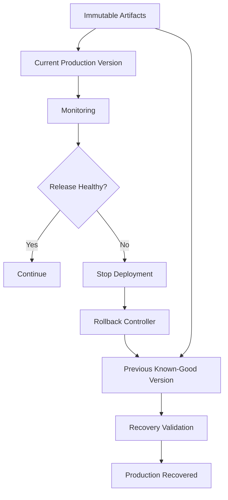
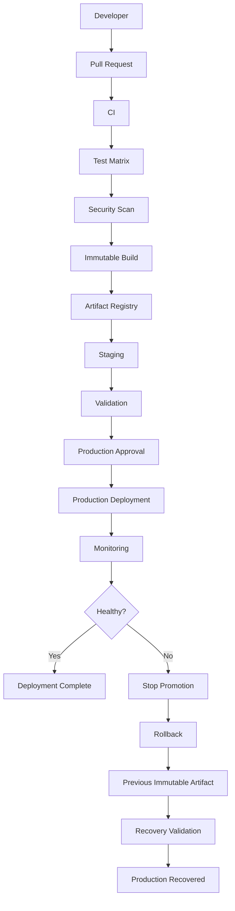

# 24- Rollback Strategies

## Overview

Rollback is the controlled process of returning a production system to a previously known-good application version or operational state after a deployment introduces unacceptable behavior.

A production deployment should be designed around two questions:

```text
How do we deploy the new version safely?

How do we recover if the new version is unsafe?
```

Rollback is the second part of that contract.

A typical deployment flow is:

```text
Build
 ↓
Test
 ↓
Immutable Artifact
 ↓
Staging
 ↓
Production
 ↓
Observe
 ↓
Failure Detected
 ↓
Rollback
 ↓
Validate Recovery
```

Rollback strategies differ depending on the deployment model:

- Rolling deployment
- Blue-green deployment
- Canary deployment
- Kubernetes
- Amazon ECS
- Amazon EC2
- Lambda
- Database migrations
- Docker image promotion
- Infrastructure changes

The important engineering principle is:

> Rollback should be a tested operational capability, not an emergency command discovered during an incident.

---

## What Rollback Means

Rollback normally means restoring the application to a previously known-good version.

For example:

```text
Production

Version A
   ↓
Deploy Version B
   ↓
Errors increase
   ↓
Rollback
   ↓
Version A
```

With immutable Docker artifacts:

```text
Current:
orders@sha256:new

Previous:
orders@sha256:old
```

Rollback means deploying the exact previous artifact rather than rebuilding the source code.

---

## Why Rollback Exists

Deployments can fail for many reasons:

- Application bugs
- Configuration mistakes
- Dependency incompatibilities
- Database migration problems
- Infrastructure errors
- Performance regressions
- Memory leaks
- Increased latency
- Broken integrations
- Incorrect environment variables
- Security configuration changes
- Unexpected production traffic behavior

A deployment can pass CI and staging while still failing under production conditions.

Rollback provides a recovery path when the new release is no longer acceptable.

---

## Rollback Is Not the Same as Reverting a Git Commit

A Git revert changes source history.

A production rollback changes the deployed runtime state.

For example:

```text
Git:
A → B → C
```

Production may currently be:

```text
C
```

Rolling back production can deploy:

```text
B
```

without changing the Git history.

A Git revert may be performed later as a source-control operation, but it is not necessarily the fastest production recovery mechanism.

---

## Rollback vs Roll Forward

Two common recovery approaches are:

| Approach | Description | Typical Use |
|---|---|---|
| Rollback | Deploy a previous known-good version | Existing release is unsafe |
| Roll forward | Deploy a new corrected version | Previous version cannot safely run |
| Hotfix | Create targeted corrective release | Small urgent defect |
| Disable feature | Turn off problematic behavior | Feature flag available |

The correct choice depends on application state and compatibility.

---

## Rollback Decision

A useful production decision model is:

```text
Incident Detected
      ↓
Is the current release responsible?
      ↓
     Yes
      ↓
Can the previous version safely run?
      ↓
   ┌──┴──┐
  Yes    No
   ↓      ↓
Rollback  Roll Forward
```

The critical question is not simply:

> Can we deploy the old image?

It is:

> Can the previous application version safely operate against the current production state?

---

## Rollback Architecture



The artifact registry should retain the versions required for recovery.

---

## Immutable Artifacts

The safest rollback target is an immutable artifact.

Prefer:

```text
orders@sha256:abc123...
```

or:

```text
orders:git-def5678
```

Avoid relying on:

```text
orders:latest
```

because a mutable tag does not uniquely identify the artifact that was previously deployed.

---

## Build Once, Deploy Many

A production pipeline should preferably follow:

```text
Source
 ↓
Build
 ↓
Test
 ↓
Immutable Artifact
 ↓
Staging
 ↓
Production
```

Rollback should use an artifact that has already been built and identified.

Do not rebuild the old source code during an incident and assume it will produce the same binary or container.

---

## Why Rebuilding During Rollback Is Risky

A rebuild can differ because of:

- Dependency changes
- Base image changes
- Package repository changes
- Build tool changes
- Generated files
- Environment differences
- Non-reproducible build steps

For example:

```text
Old source
   ↓
New rebuild
   ↓
Different dependency
   ↓
Different artifact
```

The safer approach is to retain and redeploy the exact previously validated artifact.

---

## Artifact Registry

A registry should retain enough historical artifacts to support operational rollback.

For example:

```text
ECR
 ├── sha256:current
 ├── sha256:previous
 ├── sha256:older
 └── sha256:release-history
```

Retention policies should balance:

- Recovery requirements
- Storage cost
- Compliance
- Release frequency

---

## Rollback Metadata

Record deployment metadata such as:

```text
release_id
commit_sha
image_digest
environment
workflow_run_id
deployment_time
deployed_by
```

Example:

```text
release=2026.09.28
commit=def5678
image=sha256:abc123
environment=production
workflow_run=123456
```

This allows operators to determine exactly what should be restored.

---

## Deployment History

A deployment system should make it easy to answer:

```text
What is currently deployed?
What was deployed immediately before it?
When was it deployed?
Which artifact was used?
Which workflow deployed it?
Who initiated it?
```

Without deployment history, rollback becomes guesswork.

---

## Rolling Deployment Rollback

Suppose production contains:

```text
v1 v1 v1 v1
```

A new release begins:

```text
v2 v1 v1 v1
```

Then:

```text
v2 v2 v1 v1
```

If v2 fails:

```text
Rollback
```

should restore healthy capacity:

```text
v1 v1 v1 v1
```

The deployment controller should avoid continuing the rollout while the failure is being investigated.

---

## Rolling Rollback Risks

A partially completed rollout may contain:

```text
v2 v2 v1 v1
```

Rollback must account for:

- Existing traffic
- Health checks
- Connection draining
- Capacity
- Deployment concurrency
- Database state
- Background jobs

Do not simply restart every instance simultaneously if doing so would reduce availability.

---

## Kubernetes Rollback

Kubernetes Deployments maintain rollout revisions.

Inspect history:

```bash
kubectl rollout history deployment/orders
```

Inspect rollout state:

```bash
kubectl rollout status deployment/orders
```

Rollback:

```bash
kubectl rollout undo deployment/orders
```

After rollback:

```bash
kubectl rollout status deployment/orders
```

Then verify application health independently.

---

## Kubernetes Rollback Flow

```text
Deployment v2
     ↓
Pods v2
     ↓
Health Failure
     ↓
kubectl rollout undo
     ↓
Previous ReplicaSet
     ↓
Pods v1
     ↓
Readiness Validation
```

Kubernetes can manage the workload transition, but database and external-state compatibility remain application responsibilities.

---

## Kubernetes Revision History

Rollback depends on retaining the required deployment revision.

Do not configure deployment history retention so aggressively that the version required for recovery disappears.

Also ensure that the underlying container image remains available.

A Kubernetes Deployment revision is not a substitute for artifact retention.

---

## Kubernetes Rollback Validation

After rollback:

```bash
kubectl get pods -l app=orders
kubectl rollout status deployment/orders
kubectl describe deployment orders
```

Then validate:

```text
HTTP health
API behavior
Error rate
Latency
Database connectivity
Business functionality
```

A successful `kubectl rollout` does not prove that the business application has recovered.

---

## Amazon ECS Rollback

ECS deployments can restore a previous task definition.

Identify task definitions:

```bash
aws ecs list-task-definitions \
  --family-prefix orders
```

Inspect the service:

```bash
aws ecs describe-services \
  --cluster production \
  --services orders
```

Update the service to the known-good task definition:

```bash
aws ecs update-service \
  --cluster production \
  --service orders \
  --task-definition orders:41
```

The exact operational sequence should be automated and tested rather than improvised during an incident.

---

## ECS Deployment Circuit Breaker

ECS deployment circuit breakers can help stop unhealthy deployments.

Conceptually:

```text
Deploy v2
   ↓
Tasks fail health checks
   ↓
Deployment cannot progress
   ↓
Circuit breaker
   ↓
Deployment failure
   ↓
Recovery / rollback
```

The circuit breaker reduces the risk of an unhealthy version consuming the entire service capacity.

---

## Amazon EC2 Rollback

For EC2 applications, rollback can use:

- Previous application artifact
- Previous AMI
- Previous launch template
- Previous Auto Scaling Group configuration
- Previous release directory

For application-level deployments:

```text
/opt/orders/releases/
    2026-09-27/
    2026-09-28/
```

A stable symlink can point to the active release:

```text
/opt/orders/current
        ↓
/opt/orders/releases/2026-09-28
```

Rollback can switch it back:

```text
current
   ↓
2026-09-27
```

Then restart or reload the application safely.

---

## Atomic Release Switching

A useful EC2 deployment pattern is:

```text
Download artifact
      ↓
Extract new release
      ↓
Validate
      ↓
Switch symlink atomically
      ↓
Reload application
      ↓
Health check
```

Rollback:

```text
Switch symlink
      ↓
Previous release
      ↓
Reload
      ↓
Health check
```

This is safer than overwriting files in the active application directory.

---

## Blue-Green Rollback

Blue-green provides a simple traffic-level rollback.

Before deployment:

```text
Blue  = v1
Green = v2

Traffic → Blue
```

After deployment:

```text
Blue  = v1
Green = v2

Traffic → Green
```

If Green fails:

```text
Traffic → Blue
```

The old environment remains available for the rollback window.

---

## Blue-Green Rollback Advantage

The rollback boundary is clear:

```text
Active Environment
+
Standby Environment
```

Traffic switching can be much faster than rebuilding instances.

The trade-off is higher infrastructure cost because both environments may need to remain available.

---

## Blue-Green Rollback Limitation

Blue-green does not automatically solve data compatibility.

For example:

```text
Blue v1
Green v2
     ↓
Shared Database
```

If v2 performs an incompatible schema migration, switching traffic back to v1 may not restore service.

---

## Canary Rollback

Canary deployment can stop exposure to the new version.

Example:

```text
95% → v1
5%  → v2
```

If v2 produces unacceptable behavior:

```text
100% → v1
0%   → v2
```

This limits the user impact of the release.

---

## Canary Rollback Flow

```text
Deploy v2
    ↓
5% Traffic
    ↓
Metrics
    ↓
Failure
    ↓
Stop Promotion
    ↓
Route Traffic Back to v1
    ↓
Validate
```

Canary rollback can be particularly effective when the failure becomes visible through production telemetry before full rollout.

---

## Rolling vs Blue-Green vs Canary Rollback

| Strategy | Rollback Mechanism | Speed | Main Constraint |
|---|---|---|---|
| Rolling | Replace with previous version | Moderate | Mixed-version state |
| Blue-Green | Switch traffic | Fast | Additional capacity |
| Canary | Reduce/remove new traffic | Fast | Requires traffic control |
| EC2 release switch | Activate previous artifact | Fast | Application state |
| Kubernetes | Restore previous revision | Moderate | Data compatibility |
| ECS | Restore previous task definition | Moderate | Data compatibility |

The appropriate strategy depends on system architecture and operational requirements.

---

## Database Rollback

Database rollback is substantially harder than application rollback.

Consider:

```text
Application v1
     ↓
Database schema v1

Deploy v2
     ↓
Database schema v2

Rollback application
     ↓
Application v1
```

If schema v2 is incompatible with v1, application rollback can fail.

Therefore:

> Database migrations should be designed around forward compatibility whenever rollback is a requirement.

---

## Expand-and-Contract

A safer migration sequence is:

```text
Expand
 ↓
Deploy compatible code
 ↓
Migrate usage
 ↓
Backfill
 ↓
Contract later
```

For example:

```text
Add new column
       ↓
Deploy code supporting old + new
       ↓
Populate new column
       ↓
Switch reads/writes
       ↓
Remove old column later
```

The destructive step should generally occur only after no active application version requires the old structure.

---

## Example PostgreSQL Migration

Suppose the application currently uses:

```sql
full_name
```

and the new version wants:

```sql
first_name
last_name
```

A safer migration is:

```sql
ALTER TABLE users
ADD COLUMN first_name VARCHAR(100);

ALTER TABLE users
ADD COLUMN last_name VARCHAR(100);
```

Deploy application code capable of understanding both representations.

Only later should the old field be removed after all old application versions are gone.

---

## Dangerous Database Rollback

Avoid:

```text
Deploy v2
 ↓
Drop column used by v1
 ↓
v2 fails
 ↓
Rollback v1
 ↓
v1 queries missing column
```

This can turn a deployment failure into a prolonged outage.

---

## Data Transformation Rollback

Schema changes are not the only concern.

Suppose v2 transforms:

```text
Data A
```

into:

```text
Data B
```

If the transformation is irreversible, restoring v1 code does not restore:

```text
Data A
```

Therefore rollback planning must consider:

- Data transformations
- Backfills
- Deletes
- Encryption changes
- Format changes
- External side effects

---

## Feature Flags as a Rollback Mechanism

Feature flags can provide a fast way to disable problematic functionality without redeploying.

```text
Application v2
     ↓
Feature Flag
     ↓
Enabled / Disabled
```

If a feature causes problems:

```text
Feature = OFF
```

while the rest of the application remains on v2.

This is not a replacement for artifact rollback, but it can reduce recovery time.

---

## Feature Flag Rollback

A mature release can separate:

```text
Code Deployment
```

from:

```text
Feature Activation
```

Example:

```text
Deploy code
   ↓
Feature disabled
   ↓
Validate
   ↓
Enable gradually
```

If the feature fails:

```text
Disable feature
```

without necessarily redeploying the application.

---

## Configuration Rollback

Configuration can be as dangerous as code.

Examples:

- Environment variables
- Feature flags
- Database endpoints
- Timeouts
- Connection pools
- Rate limits
- Queue settings

Maintain versioned configuration where practical.

A rollback plan should identify which configuration values changed with the release.

---

## Infrastructure Rollback

Infrastructure changes require separate consideration.

Examples:

- Security groups
- Load balancers
- ECS services
- EC2 launch templates
- IAM policies
- Kubernetes resources
- Terraform resources
- CloudFormation stacks

Infrastructure rollback may not be equivalent to application rollback.

---

## Terraform Rollback

Terraform does not provide a generic:

```bash
terraform rollback
```

command.

Instead, recovery generally means changing the desired configuration back to a known-good state and applying it.

Example:

```bash
terraform plan
terraform apply
```

A safer workflow uses version-controlled infrastructure code and reviewed changes.

---

## Terraform State Considerations

Never treat Terraform state as an ordinary rollback artifact.

Before recovery:

```text
Current configuration
+
Current state
+
Desired configuration
```

must be understood.

Manually modifying state during an incident can create additional inconsistencies.

Use state operations only when there is a specific reason and the consequences are understood.

---

## CloudFormation Rollback

CloudFormation can perform rollback behavior for failed stack operations.

Useful operational commands include:

```bash
aws cloudformation describe-stacks \
  --stack-name production
```

Inspect stack events:

```bash
aws cloudformation describe-stack-events \
  --stack-name production
```

Stack rollback does not necessarily mean application data is restored.

---

## Lambda Rollback

Lambda deployments can use immutable versioning and aliases.

Conceptually:

```text
Lambda
 ├── Version 41
 ├── Version 42
 └── Alias: production
```

Normal traffic:

```text
production → Version 42
```

Rollback:

```text
production → Version 41
```

This makes application-version rollback independent of rebuilding the function.

---

## AWS Lambda Traffic Management

Lambda aliases can also support controlled traffic shifting.

For example:

```text
Production Alias
 ├── 90% → v41
 └── 10% → v42
```

If the new version fails validation, traffic can be moved back.

This combines deployment and rollback controls at the traffic layer.

---

## Docker Rollback

A container rollback should use the previous image digest.

Example:

```bash
docker pull \
  registry.example.com/orders@sha256:previous
```

Then deploy the exact digest.

Do not assume:

```text
orders:previous
```

still points to the same image unless the tag is explicitly immutable.

---

## ECR Rollback

For AWS ECR:

```bash
aws ecr describe-images \
  --repository-name orders
```

Use the recorded image digest to identify the known-good artifact.

The rollback process should know:

```text
Current digest
Previous digest
```

rather than relying on manually remembered tags.

---

## Kubernetes Image Rollback

If the previous image is known:

```bash
kubectl set image deployment/orders \
  orders=123456789.dkr.ecr.ap-south-1.amazonaws.com/orders@sha256:previous
```

Then:

```bash
kubectl rollout status deployment/orders
```

However, using Deployment revision history is often simpler when the desired previous revision is already retained.

---

## GitHub Actions Rollback Workflow

A dedicated rollback workflow can reduce operator error.

```yaml
name: Rollback Production

on:
  workflow_dispatch:
    inputs:
      image_digest:
        description: "Known-good production image digest"
        required: true
        type: string

permissions:
  contents: read
  id-token: write

jobs:
  rollback:
    runs-on: ubuntu-latest

    environment:
      name: production

    concurrency:
      group: production-deployment
      cancel-in-progress: false

    steps:
      - name: Configure AWS credentials
        uses: aws-actions/configure-aws-credentials@v4
        with:
          role-to-assume: ${{ vars.AWS_DEPLOY_ROLE_ARN }}
          aws-region: ap-south-1

      - name: Roll back deployment
        env:
          IMAGE_DIGEST: ${{ inputs.image_digest }}
        run: |
          ./scripts/deploy.sh "$IMAGE_DIGEST"

      - name: Validate recovery
        run: |
          ./scripts/validate-production.sh
```

A rollback workflow should still use the same security controls as a normal production deployment.

---

## Rollback Inputs

A rollback workflow should avoid ambiguous inputs.

Prefer:

```text
image_digest
```

or a verified release identifier.

Avoid:

```text
version = latest
```

because the operator cannot reliably determine what artifact that represents.

---

## Rollback Authorization

Rollback is a privileged operation.

Use:

- Protected production environment
- Required reviewers where appropriate
- Least-privilege deployment role
- Audit logging
- Explicit rollback inputs
- Deployment concurrency

A rollback should be traceable to an operator and workflow run.

---

## Automated Rollback

Automatic rollback can be triggered when defined conditions are met.

For example:

```text
Deploy
 ↓
Health checks
 ↓
5xx increases
 ↓
Threshold exceeded
 ↓
Stop rollout
 ↓
Rollback
```

Possible signals include:

- HTTP 5xx rate
- Latency
- Health-check failures
- Crash rate
- Queue depth
- Business success rate

---

## Automatic Rollback Risks

Automatic rollback can itself cause harm if the detection signal is wrong.

For example:

```text
External dependency outage
        ↓
Application error rate increases
        ↓
Automatic rollback
        ↓
Old version has same dependency
        ↓
Rollback provides no benefit
```

Therefore automatic rollback should use carefully selected signals and avoid creating repeated deployment loops.

---

## Rollback Loops

A dangerous automation pattern is:

```text
Deploy v2
 ↓
Failure
 ↓
Rollback v1
 ↓
Automatic deployment trigger
 ↓
Deploy v2
 ↓
Failure
```

Use deployment state and release controls to prevent repeated oscillation.

---

## Rollback Validation

A rollback is not complete when the deployment command succeeds.

Validate:

### Infrastructure

```text
Healthy instances
Healthy tasks
Healthy Pods
```

### Application

```text
Health endpoint
API functionality
Error rate
Latency
```

### Dependencies

```text
PostgreSQL
Redis
Kafka
External APIs
```

### Business

```text
Critical business operation
```

---

## Recovery Validation Example

```bash
curl --fail https://api.example.com/health
```

Then validate an application endpoint:

```bash
curl --fail https://api.example.com/api/orders/healthcheck
```

For production systems, use a controlled smoke test rather than arbitrary production mutation.

---

## Observability During Rollback

Monitor rollback itself.

Track:

```text
Rollback started
Rollback artifact
Rollback workflow
Rollback duration
Healthy capacity
Error rate
Latency
Recovery status
```

A rollback should generate an auditable deployment event.

---

## Rollback Duration

Measure:

```text
Detection Time
+
Decision Time
+
Deployment Time
+
Validation Time
```

This is closely related to recovery performance.

A technically available rollback that takes an hour to execute may not satisfy a strict operational requirement.

---

## Recovery Time Objective

Rollback can contribute to the application's recovery strategy.

For example:

```text
RTO = 15 minutes
```

The rollback process must be capable of restoring service within the required window.

That requires:

- Previous artifact available
- Deployment automation ready
- Credentials available
- Infrastructure capacity available
- Validation automated
- Operators trained

---

## Recovery Point Considerations

Rollback does not necessarily restore data to an earlier point in time.

For example:

```text
Application v2
 ↓
Writes new data
 ↓
Rollback to v1
```

The new data may remain.

Therefore:

```text
Application rollback
≠
Database point-in-time recovery
```

Database recovery is a separate capability.

---

## Disaster Recovery vs Rollback

| Capability | Purpose |
|---|---|
| Rollback | Recover from bad release |
| Backup restore | Recover lost/corrupted data |
| Point-in-time recovery | Restore database to historical state |
| Disaster recovery | Recover from major infrastructure failure |
| Failover | Move service to another failure domain |

Do not use rollback as a substitute for disaster recovery.

---

## Rollback Runbook

A production rollback runbook should contain:

```text
1. Detect incident
2. Identify release
3. Confirm release correlation
4. Stop further promotion
5. Identify known-good artifact
6. Verify artifact availability
7. Initiate rollback
8. Monitor capacity
9. Validate health
10. Validate business behavior
11. Communicate recovery
12. Preserve incident evidence
13. Investigate root cause
```

The exact steps depend on the deployment platform.

---

## Rollback Runbook Example

### Identify Current Release

```text
Current release:
2026.09.28

Image:
sha256:new

Previous release:
2026.09.27

Image:
sha256:old
```

### Stop Promotion

Prevent additional instances from receiving the new release.

### Roll Back

Deploy:

```text
sha256:old
```

### Validate

Check:

```text
Health
Error rate
Latency
Database
Business functionality
```

### Observe

Continue monitoring after recovery because the rollback itself may expose compatibility issues.

---

## Incident Communication

During a production incident, record:

```text
Incident started
Release involved
Impact
Rollback decision
Rollback started
Rollback completed
Service recovered
```

This supports:

- Incident review
- Audit
- Postmortem
- Deployment improvement

---

## Rollback and Background Jobs

Application rollback does not automatically undo background work.

Example:

```text
v2 Celery worker
     ↓
Processes task
     ↓
Writes data
     ↓
Rollback to v1
```

The data modification remains.

Therefore background tasks should be designed for:

- Idempotency
- Safe retries
- Version compatibility
- Duplicate processing

---

## Rollback and Kafka

A consumer rollback does not rewind Kafka automatically.

If:

```text
Consumer v2
 ↓
Processes offsets 1000–1100
```

and then:

```text
Consumer v1
```

returns, the old consumer may encounter events produced or transformed under the newer version.

Schema compatibility must therefore be designed before relying on consumer rollback.

---

## Rollback and Redis

Rolling back application code while retaining Redis state can produce incompatibility.

For example:

```text
v2 writes:
user:{id}:profile:v2
```

while v1 expects:

```text
user:{id}:profile
```

A rollback may appear successful at the container level while the application remains functionally broken.

---

## Rollback and External APIs

An old application version may depend on an external API that has changed.

Therefore:

```text
Previous application
+
Current external dependency
```

must also be a supported combination.

Rollback plans should consider external compatibility.

---

## Rollback and Secrets

Configuration or secret changes may accompany deployments.

Example:

```text
v2 expects SECRET_B
v1 expects SECRET_A
```

If the old secret was deleted immediately, rolling back the application may still fail.

Retain required secrets for the rollback window.

---

## Rollback and Environment Variables

Environment configuration should be versioned or otherwise traceable.

Record which values changed with the release.

Avoid making production configuration changes manually without documenting them because rollback then becomes ambiguous.

---

## Rollback Safety Matrix

| Change | Application Rollback Safety |
|---|---|
| Bug fix only | Usually straightforward |
| Additive API field | Usually straightforward |
| Additive database column | Usually safer |
| Destructive schema change | High risk |
| Data transformation | High risk |
| Redis format change | High risk |
| Kafka schema change | Compatibility dependent |
| External API breaking change | High risk |
| Feature flag change | Often fast |
| Infrastructure change | Depends on resource/state behavior |

The actual risk depends on system compatibility and state.

---

## Production Best Practices

- Build artifacts once and retain them.
- Deploy immutable image digests.
- Record every production release.
- Keep at least the previous known-good artifact available.
- Automate rollback.
- Test rollback regularly.
- Protect rollback workflows.
- Use deployment concurrency.
- Design database migrations for backward compatibility.
- Keep old and new application versions compatible during transitions.
- Monitor rollback progress.
- Validate application behavior after rollback.
- Keep required secrets and configuration available during the rollback window.
- Treat background jobs and external state as part of rollback planning.

---

## Common Mistakes

### Rebuilding the Previous Version

A rebuild may not produce the same artifact.

### Rolling Back Only the Application

Database, Redis, Kafka, external API, and configuration state may still reflect the newer release.

### Deleting Previous Images

Without the old artifact, rollback becomes slower or impossible.

### Using Mutable Tags

A mutable tag can point to a different artifact than expected.

### No Rollback Testing

An untested rollback procedure may fail during the incident when time is critical.

### Automatically Rolling Back on Every Error

Not every production error is caused by the deployment.

### Ignoring Background Jobs

Rollback does not undo work already performed by workers.

### Ignoring Long-Lived Connections

Existing gRPC or WebSocket connections may continue using the new version.

### Destroying Previous Secrets

The previous application version may still require them.

### Treating Database Rollback Like Code Rollback

Data changes are often harder or impossible to reverse.

### Running Rollback Without Concurrency Control

A rollback can race with a new deployment and leave production in an unexpected state.

---

## Senior-Level Design Principles

### Rollback Is a Deployment Capability

It should be designed at the same time as deployment rather than added after an incident.

### The Rollback Target Must Be Explicit

Know exactly which artifact represents the previous known-good state.

### Immutable Artifacts Reduce Recovery Risk

An image digest provides a deterministic rollback target.

### Database Compatibility Determines Rollback Safety

A previous application version is useful only if it can operate against the current production state.

### Rollback Should Be Fast but Controlled

Automation should reduce recovery time while preserving authentication, authorization, auditability, and validation.

### Rollback Should Not Become a Loop

Automatic recovery needs safeguards against repeated failed deployments.

### State Must Be Included in Rollback Planning

Application code is only one component of production state.

### Recovery Must Be Observable

Operators need to know whether rollback actually restored the service.

### Rollback Is Not Disaster Recovery

Rollback handles bad releases. Backups, failover, and disaster recovery handle other failure classes.

---

## Interview Scenarios

### What Is a Rollback?

A controlled deployment of a previously known-good application version or operational configuration to recover from a failed release.

### Why Should You Roll Back Using an Image Digest?

Because a digest identifies an exact immutable artifact.

### Why Is Database Rollback Difficult?

Because the database may contain schema or data changes that the previous application version cannot understand.

### What Is the Difference Between Rollback and Roll Forward?

Rollback restores an earlier known-good release.

Roll forward deploys a new corrective release when the previous version cannot safely operate.

### How Would You Roll Back Kubernetes?

Use the Deployment's revision history:

```bash
kubectl rollout history deployment/orders
kubectl rollout undo deployment/orders
kubectl rollout status deployment/orders
```

### How Would You Roll Back ECS?

Identify the previous known-good task definition and update the ECS service to that task definition.

### How Would You Roll Back a Blue-Green Deployment?

Switch traffic from the new environment back to the previous environment.

### How Does Canary Rollback Work?

Stop promotion and route traffic away from the canary version.

### Can You Always Roll Back a Database Migration?

No. Destructive or irreversible changes may make application rollback unsafe.

### Why Is Build Once, Deploy Many Important for Rollback?

It ensures the artifact being rolled back to is the same artifact that was previously tested and deployed.

### What Happens if a Celery Task Was Processed Before Rollback?

The rollback does not undo the side effect. Task processing must therefore be designed around idempotency and compatible state transitions.

### Why Can an Application Rollback Still Fail?

Because dependencies and state may have changed:

```text
Database
Redis
Kafka
External APIs
Secrets
Configuration
```

The previous application version must remain compatible with the current environment.

---

## Production Rollback Checklist

### Release Identity

- [ ] Current release is known.
- [ ] Previous release is known.
- [ ] Image digest is recorded.
- [ ] Commit SHA is recorded.
- [ ] Deployment workflow run is recorded.
- [ ] Previous artifact is still available.

### Application

- [ ] Previous version can run against the current configuration.
- [ ] API compatibility is understood.
- [ ] Background jobs are compatible.
- [ ] gRPC connections are handled.
- [ ] Redis compatibility is understood.
- [ ] Kafka compatibility is understood.

### Database

- [ ] Current schema is known.
- [ ] Migration compatibility is verified.
- [ ] Destructive migrations are avoided where rollback is required.
- [ ] Data transformations are understood.
- [ ] Database recovery procedures are separate from application rollback.

### Infrastructure

- [ ] Previous task definition/image/AMI is available.
- [ ] Deployment capacity is available.
- [ ] Health checks are configured.
- [ ] Load balancer routing is understood.
- [ ] Connection draining is configured.
- [ ] Infrastructure state is known.

### Security

- [ ] Rollback workflow is protected.
- [ ] IAM permissions are least-privileged.
- [ ] OIDC authentication is configured where applicable.
- [ ] Required secrets remain available.
- [ ] Rollback actions are auditable.

### Validation

- [ ] Deployment health is checked.
- [ ] Application health is checked.
- [ ] Error rate is checked.
- [ ] Latency is checked.
- [ ] Critical business behavior is checked.
- [ ] Recovery is communicated.
- [ ] Incident evidence is preserved.

---

## Reference Production Architecture



---

## Recommended Recovery Model

A production system should maintain a clear relationship between releases:

```text
Current
   ↓
Previous
   ↓
Earlier
```

For example:

```text
Release 105 → Current
Release 104 → Previous
Release 103 → Recovery Backup
```

The deployment system should know these relationships automatically rather than requiring operators to search Git history during an incident.

---

## Rollback Lifecycle

```text
Release
 ↓
Deploy
 ↓
Observe
 ↓
Detect Failure
 ↓
Classify Failure
 ↓
Stop Promotion
 ↓
Select Known-Good Artifact
 ↓
Verify Compatibility
 ↓
Rollback
 ↓
Health Validation
 ↓
Business Validation
 ↓
Monitor
 ↓
Incident Review
```

This makes rollback an explicit operational lifecycle rather than a single deployment command.

## Key Takeaways

- Rollback is the controlled restoration of a previously known-good runtime state, and it should be designed, automated, authorized, monitored, and tested before production incidents occur.
- Immutable artifacts and exact deployment metadata make rollback deterministic; rebuilding old source code or relying on mutable tags introduces unnecessary recovery risk.
- Application rollback is only safe when databases, Redis, Kafka, background jobs, external APIs, secrets, configuration, and infrastructure remain compatible with the previous version.
- Rolling, blue-green, canary, Kubernetes, ECS, EC2, and Lambda deployments provide different rollback mechanisms, but every strategy requires explicit health validation and a clear recovery target.
- Rollback is not disaster recovery: release recovery, database recovery, backups, failover, and regional disaster recovery are separate capabilities that must work together in a production system.