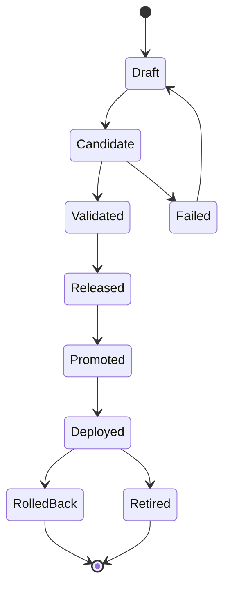
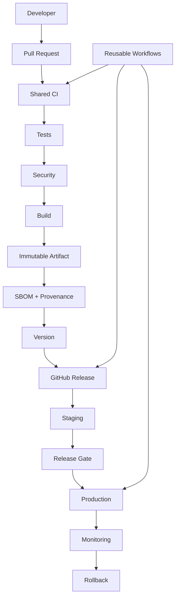

# 25- Release Automation

## Overview

Release automation is the process of turning a validated code change into a controlled, traceable, and repeatable software release.

A production-grade release process should automate the path from source control to a versioned release artifact:

```text
Pull Request
    ↓
CI Validation
    ↓
Build
    ↓
Immutable Artifact
    ↓
Version / Tag
    ↓
GitHub Release
    ↓
Release Artifacts
    ↓
Environment Promotion
    ↓
Production Deployment
    ↓
Monitoring
```

Release automation is broader than simply creating a Git tag. It can coordinate:

- Version generation
- Git tags
- Semantic versioning
- Changelog generation
- GitHub Releases
- Docker image publishing
- Artifact creation
- SBOM generation
- Provenance and attestations
- Release notes
- Pre-releases
- Environment promotion
- Deployment approvals
- Production deployment
- Rollback
- Release auditing

The objective is to make releases **repeatable, immutable, observable, secure, and recoverable**.

---

## Release Automation vs CI/CD

CI and CD solve related but different problems.

| Capability | Primary Responsibility |
|---|---|
| CI | Validate source changes |
| Build | Produce deployable artifacts |
| Release automation | Create and manage a versioned release |
| CD | Deploy the release |
| Deployment | Change production runtime state |
| Rollback | Restore a known-good runtime state |

A mature pipeline connects them:

```text
Source
 ↓
CI
 ↓
Build
 ↓
Artifact
 ↓
Release
 ↓
Promotion
 ↓
Deployment
```

---

## Why Release Automation Matters

Manual releases create operational risks:

```text
Developer
 ↓
Run commands manually
 ↓
Create tag
 ↓
Build artifact
 ↓
Upload files
 ↓
Write release notes
 ↓
Deploy
```

Common problems include:

- Incorrect version
- Missing artifact
- Inconsistent release notes
- Wrong Docker image
- Untracked manual changes
- Forgotten deployment step
- Production deployment from an untested commit
- No audit trail
- Difficult rollback

Automation replaces procedural memory with deterministic workflow logic.

---

## Release as an Immutable Identity

A release should identify a precise source state and artifact.

For example:

```text
Release:
v2.4.0

Commit:
abc1234

Docker Image:
orders@sha256:...

Build:
GitHub Actions Run #4821
```

This creates a relationship:

```text
Git Tag
   ↓
Commit
   ↓
Build
   ↓
Artifact
   ↓
Deployment
```

An operator should be able to trace a production deployment back to the exact source and build that produced it.

---

## Release Lifecycle

A production release can follow:

```text
Code Merged
    ↓
CI Validation
    ↓
Version Determination
    ↓
Build
    ↓
Test Artifact
    ↓
Generate Metadata
    ↓
Create Git Tag
    ↓
Create GitHub Release
    ↓
Publish Artifacts
    ↓
Promote
    ↓
Deploy
    ↓
Observe
```

The order can vary depending on whether the repository uses tag-driven or release-driven workflows.

---

## Release Models

Common release models include:

| Model | Trigger | Typical Use |
|---|---|---|
| Tag-driven | Git tag pushed | Explicit version releases |
| Release-driven | GitHub Release created | Release-centric workflows |
| Main-branch driven | Merge to main | Continuous delivery |
| Manual | `workflow_dispatch` | Controlled production release |
| Scheduled | `schedule` | Periodic releases |
| Automated versioning | Commit history | Conventional commit workflows |

The release model should match the team's branching and deployment strategy.

---

## Git Tags

A Git tag creates a named reference to a commit.

Example:

```bash
git tag v2.4.0
git push origin v2.4.0
```

The tag becomes a stable release identifier.

Inspect tags:

```bash
git tag
```

Inspect a specific tag:

```bash
git show v2.4.0
```

List remote tags:

```bash
git ls-remote --tags origin
```

---

## Annotated Tags

For releases, annotated tags are generally preferable to lightweight tags.

Create one:

```bash
git tag -a v2.4.0 -m "Release v2.4.0"
```

Push it:

```bash
git push origin v2.4.0
```

An annotated tag contains release metadata rather than being only a pointer.

---

## Semantic Versioning

Semantic Versioning commonly uses:

```text
MAJOR.MINOR.PATCH
```

For example:

```text
2.4.0
```

The general model is:

| Component | Meaning |
|---|---|
| MAJOR | Breaking compatibility changes |
| MINOR | Backward-compatible functionality |
| PATCH | Backward-compatible fixes |

Examples:

```text
2.4.0 → 2.4.1
```

for a patch release.

```text
2.4.0 → 2.5.0
```

for a backward-compatible feature.

```text
2.4.0 → 3.0.0
```

for a breaking change.

Semantic versioning is useful when the project has meaningful compatibility guarantees.

---

## Semantic Versioning and APIs

For backend APIs, versioning should reflect compatibility.

For example:

```text
v1 API
 ↓
Backward-compatible endpoint addition
 ↓
Minor release
```

A breaking API contract change may require:

```text
v2
```

The exact release policy should be documented rather than inferred from the version number alone.

---

## Pre-Releases

Pre-release versions can identify software that is not yet considered production-ready.

Examples:

```text
2.4.0-alpha.1
2.4.0-beta.1
2.4.0-rc.1
```

A typical lifecycle is:

```text
alpha
 ↓
beta
 ↓
release candidate
 ↓
stable release
```

Pre-releases can be useful for:

- Internal validation
- Staging
- Customer previews
- Release candidates
- Compatibility testing

---

## Release Candidates

A release candidate represents a version intended for final validation.

Example:

```text
v2.4.0-rc.1
```

Pipeline:

```text
Build
 ↓
RC
 ↓
Staging
 ↓
Integration Tests
 ↓
Security Validation
 ↓
Production Approval
 ↓
v2.4.0
```

The production artifact should ideally be the same artifact validated during the release-candidate stage.

---

## Build Once, Release Many

A release pipeline should avoid rebuilding the application for every environment.

Prefer:

```text
Source
 ↓
Build
 ↓
Immutable Artifact
 ↓
Staging
 ↓
Production
```

Instead of:

```text
Source
 ↓
Build staging
 ↓
Build production
```

The second model can produce different artifacts from the same source.

---

## Docker Release Artifacts

For a Python backend:

```text
Git Commit
 ↓
Docker Build
 ↓
Image
 ↓
ECR
 ↓
Digest
 ↓
Release
```

Example:

```text
orders:2.4.0
```

should resolve to an immutable digest:

```text
orders@sha256:abc123...
```

The digest should be treated as the actual deployment identity.

---

## Docker Image Tags

Useful tags can include:

```text
orders:2.4.0
orders:2.4
orders:2
orders:git-abc1234
```

However, production deployment should preferably resolve to a digest.

A release may record:

```text
version=2.4.0
commit=abc1234
image=sha256:...
```

This combines human-readable release identity with immutable runtime identity.

---

## GitHub Actions Release Trigger

A tag-triggered workflow can look like:

```yaml
name: Release

on:
  push:
    tags:
      - "v*.*.*"

permissions:
  contents: write
  packages: write

jobs:
  release:
    runs-on: ubuntu-latest

    steps:
      - name: Checkout
        uses: actions/checkout@v4
        with:
          fetch-depth: 0

      - name: Validate release tag
        run: |
          echo "Release: $GITHUB_REF_NAME"

      - name: Build
        run: |
          ./scripts/build.sh

      - name: Test
        run: |
          ./scripts/test.sh
```

The exact permissions should be limited to what the release workflow requires.

---

## Tag Validation

Do not blindly trust any tag as a production release.

Validate:

```text
Tag format
Commit
Branch ancestry
Repository
Release type
```

A simple version format check can be performed before release processing.

```bash
if [[ ! "$GITHUB_REF_NAME" =~ ^v[0-9]+\.[0-9]+\.[0-9]+$ ]]; then
  echo "Invalid release tag: $GITHUB_REF_NAME"
  exit 1
fi
```

For production governance, release creation should also be restricted through repository controls and permissions.

---

## Release Permissions

A release workflow may need:

```yaml
permissions:
  contents: write
```

If publishing packages:

```yaml
permissions:
  contents: write
  packages: write
```

If authenticating with AWS OIDC:

```yaml
permissions:
  contents: read
  id-token: write
```

Avoid granting:

```yaml
permissions: write-all
```

when narrower permissions are sufficient.

---

## GitHub Releases

A GitHub Release associates release metadata with a Git tag.

A release can contain:

- Release title
- Version
- Release notes
- Artifacts
- Source archive
- Pre-release status
- Release metadata

The release becomes a human-readable representation of a versioned software state.

---

## Creating a GitHub Release with GitHub CLI

Create a release:

```bash
gh release create v2.4.0 \
  --title "v2.4.0" \
  --generate-notes
```

Create a pre-release:

```bash
gh release create v2.4.0-rc.1 \
  --title "v2.4.0-rc.1" \
  --prerelease \
  --generate-notes
```

List releases:

```bash
gh release list
```

Inspect a release:

```bash
gh release view v2.4.0
```

---

## Release Artifacts

A release may contain:

```text
Application package
Docker metadata
CLI binaries
Configuration templates
SBOM
Checksums
Documentation
Migration bundles
```

For a Python application, the package might be:

```text
orders-2.4.0.tar.gz
orders-2.4.0-py3-none-any.whl
```

For containerized applications, the primary deployment artifact may be the Docker image stored in a registry.

---

## Checksums

For downloadable artifacts, checksums provide integrity verification.

Generate a checksum:

```bash
sha256sum orders-2.4.0.tar.gz
```

Example metadata:

```text
orders-2.4.0.tar.gz
SHA256:
abc123...
```

Consumers can verify:

```bash
sha256sum -c checksums.txt
```

Checksums detect accidental corruption but do not by themselves establish who produced the artifact.

---

## Signing

Signing provides stronger authenticity guarantees.

Conceptually:

```text
Artifact
   ↓
Hash
   ↓
Signature
   ↓
Verification
```

For production supply-chain security, release automation can integrate:

- Artifact signing
- Provenance
- SBOM
- Attestations

This allows downstream systems to establish stronger trust in release artifacts.

---

## SBOM Generation

A release pipeline can generate a Software Bill of Materials.

```text
Build
 ↓
Artifact
 ├── SBOM
 ├── Provenance
 └── Attestation
```

An SBOM can identify dependencies included in the release.

For Python:

```text
Application
 ├── Django
 ├── FastAPI
 ├── Celery
 ├── Redis client
 └── Other dependencies
```

For containers, the SBOM can also include packages from the base image.

---

## Artifact Provenance

Provenance answers questions such as:

```text
What source produced this artifact?
Which workflow built it?
Which repository produced it?
Which commit was used?
Which build environment was used?
```

A useful release relationship is:

```text
Commit
 ↓
Workflow Run
 ↓
Build
 ↓
Artifact
 ↓
Release
 ↓
Deployment
```

---

## Release Metadata

A production release can publish metadata such as:

```json
{
  "version": "2.4.0",
  "commit": "abc1234",
  "image_digest": "sha256:...",
  "workflow_run": "4821",
  "environment": "production"
}
```

Structured release metadata makes automation and auditing easier.

---

## Changelog Automation

Release automation can generate changelogs from:

- Commit messages
- Pull requests
- Labels
- Conventional Commits
- Previous release boundaries

A changelog should communicate meaningful user-facing changes rather than simply dumping every commit.

---

## Conventional Commits

A project may use a format such as:

```text
feat: add order export API
fix: prevent duplicate payment processing
docs: update deployment guide
refactor: simplify repository layer
```

This information can support automated release classification.

For example:

```text
feat → minor release
fix  → patch release
```

Breaking changes require explicit handling according to the project's versioning policy.

---

## Automated Version Determination

A release pipeline may derive the next version from the previous release.

Conceptually:

```text
Current:
2.3.4

Commits:
fix
fix
feat

Next:
2.4.0
```

Automated versioning reduces manual mistakes but should still have clear governance.

---

## Version Source of Truth

Choose one authoritative version source.

Possible sources:

- Git tag
- `pyproject.toml`
- Package metadata
- Release configuration
- Generated version file

Avoid maintaining conflicting versions manually.

Bad example:

```text
Git tag = 2.4.0
pyproject.toml = 2.3.9
Docker metadata = 2.4.1
```

A release pipeline should derive or validate these values consistently.

---

## Python Package Release

For a Python package:

```bash
python -m build
```

This can produce:

```text
dist/
├── package-2.4.0.tar.gz
└── package-2.4.0-py3-none-any.whl
```

The generated artifacts can then be published to the appropriate package registry if the project requires distribution outside the deployment environment.

---

## Django Application Release

For Django applications, release automation should distinguish application packaging from deployment.

A release may contain:

```text
Application Image
Migration Code
Static Assets
Configuration Metadata
Release Notes
```

Do not automatically run destructive database migrations merely because a GitHub Release was created.

Release creation and production deployment should remain logically separable when operational approval is required.

---

## FastAPI Release

For FastAPI:

```text
Source
 ↓
pytest
 ↓
Build Docker Image
 ↓
Push to ECR
 ↓
Release
 ↓
Deploy ECS/Kubernetes
```

The release should record the exact image digest used by the runtime.

---

## Release and Database Migrations

Database migrations are a deployment concern, not simply a version-labeling concern.

A release pipeline may validate migrations during CI:

```bash
python manage.py migrate --check
```

and test them against a temporary database.

Production execution should be handled by the deployment process with appropriate locking, ordering, and compatibility controls.

---

## Release Promotion

A release can move through environments:

```text
Release
 ↓
Development
 ↓
Staging
 ↓
Production
```

The artifact should remain unchanged.

```text
Artifact A
   ↓
Staging
   ↓
Approval
   ↓
Production
```

Do not rebuild Artifact A for production.

---

## Environment Promotion

GitHub Environments can represent deployment boundaries:

```yaml
environment:
  name: production
```

Production environments can provide:

- Required reviewers
- Environment-specific secrets
- Deployment restrictions
- Deployment history

The release workflow should preserve the same artifact identity across environments.

---

## Release Approval

A production release may require manual approval:

```text
Build
 ↓
Release Candidate
 ↓
Staging
 ↓
Validation
 ↓
Production Approval
 ↓
Production
```

Approval should happen after sufficient evidence has been collected.

Useful evidence includes:

- Test results
- Security scan
- Artifact digest
- Staging deployment
- Smoke tests
- Release notes

---

## Release Concurrency

Production release workflows should prevent overlapping releases.

```yaml
concurrency:
  group: production-release
  cancel-in-progress: false
```

Without concurrency control:

```text
Release v2.4.0
       ↓
Production deployment

Release v2.5.0
       ↓
Production deployment
```

can execute concurrently and create an unpredictable final state.

---

## Release Race Condition

Consider:

```text
Release A starts
       ↓
Release B starts
       ↓
B deploys
       ↓
A deploys later
```

Production can unexpectedly end up on Release A.

Release automation should coordinate:

- Release creation
- Promotion
- Deployment
- Concurrency
- Artifact identity

---

## Release and Rollback

Every release should have a known rollback target.

Example:

```text
Current:
v2.4.0
image sha256:new

Previous:
v2.3.4
image sha256:old
```

If v2.4.0 fails:

```text
Rollback
 ↓
v2.3.4
 ↓
sha256:old
```

Release metadata should make this relationship discoverable.

---

## Release Lifecycle State

A useful state model is:

```text
Draft
 ↓
Candidate
 ↓
Validated
 ↓
Released
 ↓
Promoted
 ↓
Deployed
 ↓
Retired
```

A failed release can transition to:

```text
Failed
 ↓
Rolled Back
```

This state model helps operators reason about release status.

---

## Release State Machine



---

## Release Workflow Architecture

```mermaid
flowchart LR
    PR[Pull Request] --> CI[CI]
    CI --> TEST[Test Matrix]
    TEST --> SEC[Security Scan]
    SEC --> BUILD[Build]
    BUILD --> ART[Immutable Artifact]

    ART --> VERSION[Version]
    VERSION --> TAG[Git Tag]
    TAG --> RELEASE[GitHub Release]

    RELEASE --> STAGE[Staging]
    STAGE --> VALIDATE[Validation]
    VALIDATE --> APPROVAL[Production Approval]
    APPROVAL --> PROD[Production]

    PROD --> OBS[Monitoring]
    OBS --> RB[Rollback]
```



---

## Tag-Driven Release Architecture

A common model is:

```text
Developer
   ↓
Merge to main
   ↓
Validated commit
   ↓
Create v2.4.0 tag
   ↓
GitHub Actions
   ↓
Build
   ↓
Publish
   ↓
GitHub Release
   ↓
Deploy
```

The tag becomes the release trigger.

This works well when releases are intentionally versioned.

---

## Separate Build and Release Workflows

A larger organization may separate:

```text
CI Workflow
```

from:

```text
Release Workflow
```

and:

```text
Deployment Workflow
```

For example:

```text
CI
 ↓
Validated commit

Release
 ↓
Version + Artifact

Deployment
 ↓
Environment promotion
```

This provides stronger separation of concerns and allows release promotion without rerunning the complete CI pipeline.

---

## Reusable Release Workflow

A reusable workflow can standardize release behavior.

Example caller:

```yaml
jobs:
  release:
    uses: org/platform-workflows/.github/workflows/release.yml@v2
    with:
      version: ${{ inputs.version }}
    secrets: inherit
```

The reusable workflow can handle:

- Version validation
- Artifact creation
- Release creation
- Metadata
- Signing
- Publishing

Keep the interface small and stable.

---

## Reusable Workflow vs Composite Action

| Capability | Reusable Workflow | Composite Action |
|---|---|---|
| Orchestrates jobs | Yes | No |
| Runs multiple jobs | Yes | No |
| Packages steps | No | Yes |
| Supports job dependencies | Yes | No |
| Environment promotion | Suitable | Usually not sufficient |
| Release orchestration | Suitable | Usually step-level |
| Shared setup logic | Possible | Strong fit |

Use reusable workflows for pipeline orchestration.

Use composite actions for reusable step sequences.

---

## Release Security

Release automation is a privileged path into production.

Protect:

- Workflow files
- Release tags
- Release permissions
- Deployment credentials
- AWS IAM roles
- Artifact registry
- Production environment

A malicious modification to release automation can bypass normal development controls.

---

## Protected Release Branches and Tags

Use repository controls to restrict who can create or modify production release references.

The exact protection mechanism depends on repository governance, but the objective is:

```text
Trusted Source
      ↓
Trusted Release Reference
      ↓
Trusted Workflow
      ↓
Trusted Artifact
```

---

## Third-Party Actions

Release workflows should minimize third-party action risk.

Use:

- Trusted action sources
- Version pinning
- SHA pinning where required
- Least-privilege permissions
- Protected environments

A compromised action running in a release workflow may gain access to package registries or deployment credentials.

---

## OIDC and AWS Release Automation

When publishing or deploying to AWS, prefer short-lived credentials through OIDC.

```text
GitHub Actions
      ↓
OIDC
      ↓
AWS STS
      ↓
IAM Role
      ↓
ECR / ECS / S3 / Lambda
```

Example:

```yaml
permissions:
  contents: read
  id-token: write
```

Then configure the AWS credentials action with the appropriate IAM role.

---

## ECR Release Flow

```text
Git Tag
 ↓
GitHub Actions
 ↓
Docker Buildx
 ↓
Image
 ↓
ECR
 ↓
Digest
 ↓
Release Metadata
 ↓
Staging
 ↓
Production
```

The release should record the digest rather than only the image tag.

---

## Docker Buildx

Buildx can support:

- Multi-stage builds
- Multi-platform builds
- BuildKit caching
- Registry caching
- Metadata generation

Example:

```bash
docker buildx build \
  --platform linux/amd64 \
  --tag "$IMAGE_TAG" \
  --push \
  .
```

For production, include immutable identity and appropriate provenance/security configuration.

---

## Docker Layer Caching

Release builds can become expensive without caching.

Typical flow:

```text
Dockerfile
 ↓
BuildKit
 ↓
Cache
 ↓
Faster Build
```

GitHub Actions can use a GitHub Actions cache:

```yaml
- name: Build image
  uses: docker/build-push-action@v6
  with:
    context: .
    push: true
    tags: ${{ env.IMAGE }}
    cache-from: type=gha
    cache-to: type=gha,mode=max
```

Cache data is an optimization, not the release artifact.

---

## Artifact vs Cache

| Artifact | Cache |
|---|---|
| Intended for release/deployment | Intended for acceleration |
| Must be identifiable | Can be discarded |
| Preserved for operational use | Recreated when necessary |
| Release evidence | Build optimization |
| Immutable identity preferred | Cache keys determine reuse |

Never use a cache as the authoritative production artifact.

---

## Release Artifacts and Retention

Artifact retention should consider:

- Rollback window
- Compliance
- Storage cost
- Release frequency
- Incident response requirements

Production systems should retain enough history to recover from recent releases.

---

## Release Notes

Release notes should communicate:

- New features
- Bug fixes
- Breaking changes
- Security changes
- Migration considerations
- Operational changes

For backend systems, include relevant deployment notes such as:

```text
Database migration required
Configuration change required
Backward compatibility impact
Rollback considerations
```

---

## Automated Release Notes

GitHub CLI can generate release notes:

```bash
gh release create v2.4.0 \
  --generate-notes
```

Automated notes are useful, but teams should ensure that pull requests and commits contain meaningful descriptions and labels.

Automation cannot reliably produce useful release information from poor source metadata.

---

## Release Notes and Change Classification

A useful structure is:

```text
Features
Fixes
Performance
Security
Breaking Changes
Infrastructure
Deployment Notes
```

The exact format should be standardized across repositories.

---

## Release Validation

Before creating a production release, validate:

```text
Version
Commit
Tests
Artifact
Security
Dependencies
SBOM
Provenance
Release metadata
```

A release should not be created merely because a branch was merged.

---

## Release Candidate Validation

A release candidate can go through:

```text
RC
 ↓
Unit Tests
 ↓
Integration Tests
 ↓
Security Scan
 ↓
Docker Scan
 ↓
Staging
 ↓
Smoke Tests
 ↓
Manual Validation
 ↓
Stable Release
```

This separates release construction from production activation.

---

## Release Gates

Useful gates include:

```text
All required tests passed
Security scan passed
Artifact built successfully
SBOM generated
Staging deployment healthy
Smoke tests passed
Required approval received
```

Each gate should have a clear failure behavior.

---

## Release Failure Handling

A release workflow can fail at:

```text
Versioning
Build
Test
Artifact publication
Tagging
Release creation
Staging
Approval
Production
```

Failure handling should preserve enough information to diagnose the failure.

---

## Failure Domain: Versioning

### Symptom

Incorrect release version.

### Possible Causes

- Invalid tag
- Version mismatch
- Concurrent release
- Incorrect automated version calculation

### Checks

```bash
git describe --tags --abbrev=0
git tag --list
```

### Prevention

Use one authoritative versioning policy and validate it before publishing.

---

## Failure Domain: Build

### Symptom

Release artifact cannot be created.

### Possible Causes

- Dependency failure
- Docker build error
- Missing build tool
- Incorrect build context

### Checks

Inspect:

```text
Workflow logs
Build output
Dependency lock file
Dockerfile
```

### Prevention

Run the same build process in CI before release creation.

---

## Failure Domain: Artifact Publishing

### Symptom

Release exists but artifact is unavailable.

### Possible Causes

- Registry authentication failure
- Package publication failure
- Incorrect permissions
- Network failure

### Prevention

Validate publication before marking the release as successfully promoted.

---

## Failure Domain: Deployment

### Symptom

Release is valid but production deployment fails.

### Possible Causes

- Invalid configuration
- Health-check failure
- Capacity issue
- Deployment race
- Database incompatibility

### Prevention

Use:

- Staging
- Health validation
- Deployment concurrency
- Immutable artifacts
- Rollback

---

## GitHub CLI Release Operations

List releases:

```bash
gh release list
```

View a release:

```bash
gh release view v2.4.0
```

Create a release:

```bash
gh release create v2.4.0 --generate-notes
```

Upload an artifact:

```bash
gh release upload v2.4.0 dist/orders-2.4.0.tar.gz
```

Delete a release when governance permits:

```bash
gh release delete v2.4.0
```

Inspect workflow runs:

```bash
gh run list
```

View logs:

```bash
gh run view RUN_ID --log
```

---

## Release Management Commands

List workflows:

```bash
gh workflow list
```

Run a release workflow:

```bash
gh workflow run release.yml
```

Inspect the workflow:

```bash
gh workflow view release.yml
```

Inspect a failed run:

```bash
gh run view RUN_ID
```

These commands are useful for operational release management without turning the release process into a manual CLI procedure.

---

## Release Automation with Manual Approval

A controlled production workflow may look like:

```text
Tag
 ↓
Build
 ↓
Test
 ↓
Publish Artifact
 ↓
Create Release
 ↓
Deploy Staging
 ↓
Validate
 ↓
Production Environment
 ↓
Approval
 ↓
Deploy Production
```

The approval should protect production deployment rather than block creation of the release artifact itself unless organizational policy requires otherwise.

---

## Release and Environments

A release should be independent of environment configuration.

For example:

```text
Release v2.4.0
```

can be promoted to:

```text
staging
production
```

while environment-specific values remain separate.

This prevents the artifact from being rebuilt simply because the destination environment changed.

---

## Release Configuration

Avoid embedding production configuration inside the application artifact.

Prefer:

```text
Immutable Artifact
+
Environment Configuration
=
Runtime
```

instead of:

```text
Production-specific Build
```

This supports promotion and rollback.

---

## Release and Feature Flags

Feature flags can decouple:

```text
Release
```

from:

```text
Feature activation
```

For example:

```text
Release v2.4.0
 ↓
Feature disabled
 ↓
Deploy
 ↓
Validate
 ↓
Enable feature gradually
```

If a feature causes problems, disabling the feature may provide a faster mitigation than rolling back the entire release.

---

## Release Automation for Microservices

For multiple services:

```text
orders
payments
users
notifications
```

each service may have its own release lifecycle.

A central platform can standardize:

```text
Build
Version
Release
Security
Artifact
Promotion
Deployment
Rollback
```

without forcing every service to share the same release cadence.

---

## Monorepo Release Automation

A monorepo may require selective release behavior.

For example:

```text
services/
├── orders/
├── payments/
└── users/
```

A change to:

```text
services/orders/
```

should not necessarily rebuild and release unrelated services.

A planning job can determine:

```text
Changed services
      ↓
Dynamic matrix
      ↓
Selective builds
      ↓
Selective releases
```

---

## Dynamic Release Matrix

A planning job can generate JSON:

```json
[
  "orders",
  "payments"
]
```

Then use:

```yaml
strategy:
  matrix:
    service: ${{ fromJSON(needs.plan.outputs.services) }}
```

This allows one reusable release workflow to operate on multiple services.

---

## Release Workflow Outputs

Release jobs can expose:

```text
version
commit_sha
image_digest
release_url
artifact_name
```

Example:

```yaml
jobs:
  release:
    outputs:
      version: ${{ steps.release.outputs.version }}
      image_digest: ${{ steps.image.outputs.digest }}
```

Downstream deployment jobs can consume these values through `needs`.

---

## Release Data Flow

```text
Release Job
 ├── version
 ├── commit
 ├── artifact
 └── digest
          ↓
     Deployment Job
          ↓
       Staging
          ↓
      Production
```

Prefer explicit outputs over hidden filesystem dependencies between jobs.

---

## Release and Artifacts

A release artifact can be uploaded:

```yaml
- name: Upload release artifact
  uses: actions/upload-artifact@v4
  with:
    name: orders-release
    path: dist/*
```

A later job can download it:

```yaml
- name: Download release artifact
  uses: actions/download-artifact@v4
  with:
    name: orders-release
    path: dist
```

For production deployment, a registry-backed immutable image is often preferable to treating a GitHub Actions artifact as the primary runtime artifact.

---

## Release and Caching

Do not confuse:

```text
Dependency cache
```

with:

```text
Release artifact
```

Dependency cache:

```text
pip cache
npm cache
Docker build cache
```

Release artifact:

```text
Docker image
Python wheel
CLI binary
```

A cache may disappear without invalidating the release.

---

## Release Governance

Organizations should define:

- Who can create releases
- Who can publish artifacts
- Who can deploy production
- Which actions are allowed
- Which workflows can access release credentials
- Which environments require approval
- Which artifacts must be signed
- How long releases are retained

This creates a consistent release boundary across repositories.

---

## Enterprise Release Architecture



---

## Reliability Considerations

Release automation itself is production infrastructure.

It should be:

- Deterministic
- Idempotent
- Observable
- Auditable
- Recoverable

A release workflow should not leave the repository or registry in an ambiguous state when rerun.

---

## Idempotency

A release workflow may be rerun after partial failure.

For example:

```text
Build succeeds
 ↓
Artifact published
 ↓
Release creation fails
```

A rerun should recognize that the artifact already exists rather than creating a conflicting artifact.

Use deterministic identifiers such as:

```text
version
commit SHA
image digest
```

to make operations repeatable.

---

## Partial Release Failure

Consider:

```text
Git tag created
 ↓
Docker image published
 ↓
GitHub Release creation fails
```

The system now contains some release state but not all expected metadata.

The workflow should define whether rerunning:

- Reuses the tag
- Reuses the artifact
- Updates the release
- Fails safely
- Requires operator intervention

Partial state should be an explicit design consideration.

---

## Release Transactions

Release automation is not a single atomic transaction.

It often spans:

```text
Git
+
GitHub
+
Container Registry
+
Package Registry
+
AWS
```

A failure in one system cannot necessarily roll back all previous operations atomically.

Therefore design for:

- Idempotency
- Reconciliation
- Clear state
- Safe reruns
- Auditability

---

## Release Observability

Monitor:

- Release frequency
- Release duration
- Build duration
- Deployment duration
- Failure rate
- Rollback frequency
- Artifact publication failures
- Approval wait time
- Deployment success rate

Useful release metadata includes:

```text
release_id
commit_sha
artifact_digest
workflow_run
environment
deployment_status
```

---

## Deployment Frequency

Release automation can reduce the operational cost of frequent releases.

However, release frequency should not become the only optimization target.

A healthy release process balances:

```text
Delivery Speed
+
Reliability
+
Security
+
Recovery
+
Operational Cost
```

---

## Cost Considerations

Release automation can increase CI usage through:

- Multiple test matrices
- Docker builds
- Security scans
- SBOM generation
- Multi-platform builds
- Staging deployments
- Release artifact retention

Optimize with:

- Dependency caching
- Docker layer caching
- Selective builds
- Dynamic matrices
- Reusable workflows
- Appropriate artifact retention

Do not optimize away controls that are required for release integrity.

---

## High Availability Considerations

Release automation should avoid creating unnecessary availability risk.

Production deployment should include:

```text
Sufficient capacity
+
Health checks
+
Deployment concurrency
+
Graceful shutdown
+
Rollback
```

Release creation itself should not modify production traffic unless the workflow explicitly enters the deployment phase.

---

## Disaster Recovery

Release artifacts are part of recovery readiness.

Retain:

- Known-good application artifacts
- Docker images
- Infrastructure definitions
- Release metadata
- Deployment configuration
- Migration history

If an environment must be recreated, the release system should be able to identify which artifact and infrastructure version belong together.

---

## Common Mistakes

### Treating Git Tags as the Entire Release

A tag identifies source state but does not automatically provide a tested artifact, release metadata, or deployment.

### Rebuilding Per Environment

This breaks build-once/deploy-many and can produce different artifacts.

### Using Mutable Docker Tags

A mutable tag weakens release reproducibility.

### Giving Release Workflows Excessive Permissions

Release workflows often have powerful credentials and should therefore use strict least privilege.

### Creating Releases From Unvalidated Commits

A release should originate from a validated source state.

### Mixing Release and Deployment Responsibilities Without Boundaries

Creating a release and deploying production can be separate stages when approval and promotion are required.

### No Rollback Metadata

If the previous artifact cannot be identified quickly, recovery becomes slower.

### No Release Concurrency

Concurrent release workflows can produce race conditions.

### Relying on Manual Changelogs

Manual release notes can become inconsistent and incomplete.

### Treating Caches as Artifacts

Caches are disposable optimizations and should not be the authoritative source for production releases.

### Ignoring Partial Failures

Git tags, artifacts, and releases can succeed independently. Rerun behavior must account for partial state.

---

## Production Release Checklist

### Source

- [ ] Release commit is validated.
- [ ] Release tag follows the defined convention.
- [ ] Version is authoritative and consistent.
- [ ] Required branch protections are satisfied.

### CI

- [ ] Linting passed.
- [ ] Unit tests passed.
- [ ] Integration tests passed.
- [ ] Matrix tests passed.
- [ ] Security scans passed.

### Artifact

- [ ] Artifact is immutable.
- [ ] Docker image digest is recorded.
- [ ] SBOM is generated where required.
- [ ] Provenance is available where required.
- [ ] Artifact is retained for rollback.

### Release

- [ ] Git tag is correct.
- [ ] GitHub Release is created.
- [ ] Release notes are generated or reviewed.
- [ ] Release artifacts are attached where required.
- [ ] Pre-release status is correct.

### Deployment

- [ ] Staging deployment succeeded.
- [ ] Smoke tests passed.
- [ ] Production approval completed.
- [ ] Deployment concurrency is enforced.
- [ ] Production uses the same artifact validated earlier.

### Security

- [ ] Least-privilege permissions are configured.
- [ ] Release credentials are protected.
- [ ] AWS authentication uses OIDC where applicable.
- [ ] Third-party actions are controlled.
- [ ] Release workflow changes are protected.

### Recovery

- [ ] Previous release is known.
- [ ] Previous artifact is available.
- [ ] Rollback procedure is documented.
- [ ] Database compatibility is understood.
- [ ] Recovery validation is defined.

---

## Senior Design Principles

### A Release Is More Than a Version Number

A production release should connect:

```text
Source
+
Commit
+
Build
+
Artifact
+
Metadata
+
Deployment
```

### Artifact Identity Matters More Than Tags

Tags provide human-readable references. Immutable digests provide deterministic artifact identity.

### Release and Deployment Can Be Separate

A release can be created and validated before production deployment.

This enables:

```text
Release
 ↓
Staging
 ↓
Approval
 ↓
Production
```

without rebuilding.

### Release Automation Must Be Idempotent

Rerunning a failed workflow should converge toward the intended release state rather than creating duplicate or conflicting state.

### Production Credentials Belong at the Deployment Boundary

Build and release jobs should not receive production credentials unless they actually need them.

### Release Metadata Is Operational Data

Version, commit SHA, image digest, workflow run, and deployment environment should be retained for incident investigation and rollback.

### Release Automation Is a Supply-Chain Boundary

The release workflow determines which code becomes an artifact and which artifact becomes deployable production software.

### Recovery Must Be Designed Alongside Release

A release without an identifiable rollback target is incomplete from an operational perspective.

---

## Interview Scenarios

### How Would You Design Release Automation for a Python Backend?

A strong design would include:

```text
Pull Request
 ↓
Lint
 ↓
Unit Tests
 ↓
Integration Tests
 ↓
Security Scan
 ↓
Docker Build
 ↓
Immutable Image
 ↓
ECR
 ↓
Version / Tag
 ↓
GitHub Release
 ↓
Staging
 ↓
Approval
 ↓
Production
 ↓
Monitoring
 ↓
Rollback
```

### How Would You Prevent Rebuilding the Production Image?

Build the image once, record its immutable digest, publish it to the registry, and promote that exact digest through environments.

### How Would You Generate Release Notes?

Use GitHub Release generation or structured commit/PR metadata, while ensuring source descriptions are meaningful enough to produce useful release information.

### How Would You Handle a Failed Release Workflow After the Docker Image Was Already Published?

Make the workflow idempotent, identify the existing artifact by immutable identity, reconcile the partial release state, and continue or safely retry the missing operation.

### How Would You Protect a Release Workflow?

Use:

- Least-privilege `GITHUB_TOKEN`
- Protected release references
- Environment protection
- OIDC for AWS
- Controlled third-party actions
- SHA pinning where required
- Audit logging
- Deployment concurrency

### How Would You Release Multiple Microservices From a Monorepo?

Use a planning job to identify changed services, generate a structured JSON matrix, build only affected services, publish immutable artifacts, and create service-specific release metadata.

### Why Should Release Creation Not Necessarily Deploy Production Immediately?

Separating release creation from deployment allows the artifact to be validated in staging, reviewed, and promoted to production without rebuilding it.

### What Is the Difference Between an Artifact and a Cache?

An artifact is a durable output used for release, deployment, testing, or debugging. A cache is an optimization intended to accelerate repeated work and can be recreated.

### How Would You Support Rollback?

Record the current and previous artifact identities, retain immutable artifacts, serialize deployments, make the rollback workflow protected and auditable, and verify compatibility with database and external state.

### What Happens if a Release Tag Is Created but the GitHub Release Creation Fails?

The repository is in a partial release state. The workflow should detect the existing tag, reuse the validated commit and artifacts, and create or reconcile the missing GitHub Release rather than creating a second release identity.

## Key Takeaways

- Release automation connects validated source code to a versioned, traceable, immutable artifact and provides the controlled path toward environment promotion and production deployment.
- Build once and promote the same artifact across environments; use Git tags for human-readable release identity and immutable artifact digests for deterministic deployment identity.
- Production release workflows should use least-privilege permissions, protected environments, controlled release references, OIDC for AWS access, and carefully governed third-party actions.
- Release automation must be idempotent and designed for partial failures, concurrency, observability, and rollback rather than assuming every workflow executes as one atomic transaction.
- A production-grade release records the relationship between commit, version, workflow run, artifact, release, deployment, and rollback target so operators can reproduce, audit, and recover the system reliably.