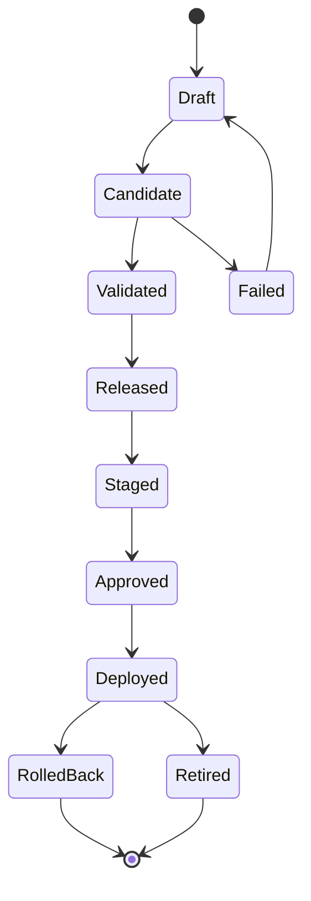
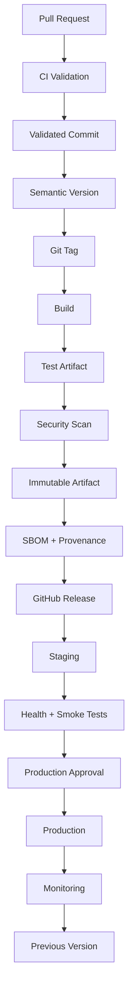

# 26- Semantic Versioning and Releases

## Overview

Semantic Versioning (SemVer) provides a predictable versioning convention for software releases:

```text
MAJOR.MINOR.PATCH
```

For backend systems, versioning is more than assigning numbers to releases. A production release should establish a traceable relationship between:

```text
Source
  ↓
Commit
  ↓
Version
  ↓
Build
  ↓
Immutable Artifact
  ↓
Release
  ↓
Deployment
```

Semantic Versioning is especially useful for:

- Python packages
- REST APIs
- gRPC services
- Internal libraries
- Dockerized services
- Reusable CI/CD components
- GitHub Actions
- Platform components

GitHub Actions release automation can use Git tags, GitHub Releases, release workflows, changelogs, artifacts, and environment promotion to turn versioned source code into controlled deployments.

---

## Semantic Versioning

Semantic Versioning uses:

```text
MAJOR.MINOR.PATCH
```

For example:

```text
2.4.3
```

The components represent different compatibility implications.

| Component | Typical Meaning | Example |
|---|---|---|
| MAJOR | Breaking compatibility change | `2.4.3 → 3.0.0` |
| MINOR | Backward-compatible functionality | `2.4.3 → 2.5.0` |
| PATCH | Backward-compatible fix | `2.4.3 → 2.4.4` |

The important engineering property is predictability: consumers should be able to reason about compatibility from the version.

---

## Why Semantic Versioning Exists

Without a versioning convention:

```text
release-1
release-final
release-final-2
release-latest
release-new
```

do not communicate compatibility.

Semantic Versioning gives teams a common vocabulary:

```text
Breaking API change
        ↓
     MAJOR

New compatible functionality
        ↓
     MINOR

Bug/security fix
        ↓
     PATCH
```

This becomes particularly valuable when multiple backend services and libraries evolve independently.

---

## Semantic Versioning and Backend APIs

Consider a REST API:

```text
GET /api/v1/orders
```

Adding an optional response field may be backward-compatible.

Removing or changing the meaning of an existing field can break consumers.

Similarly, for gRPC:

```text
OrderService.GetOrder
```

changes to an RPC contract should be evaluated for compatibility before determining the release version.

The version number should communicate the compatibility policy adopted by the project.

---

## Major Releases

A major release generally represents a breaking compatibility boundary.

Example:

```text
2.8.4
 ↓
3.0.0
```

Potential causes:

- Removing a public API
- Changing required request parameters
- Changing response semantics
- Removing supported Python versions
- Changing a library's public interface
- Introducing incompatible configuration
- Changing database behavior in a way that breaks consumers

A major version should not be used merely because a large amount of code changed.

---

## Minor Releases

A minor release generally adds backward-compatible functionality.

Example:

```text
2.4.0
 ↓
2.5.0
```

Examples:

- New API endpoint
- Optional request field
- New configuration option with a safe default
- New library feature
- New operational capability

The compatibility assumptions must still be validated rather than inferred solely from the version number.

---

## Patch Releases

Patch releases generally contain backward-compatible fixes.

Example:

```text
2.4.3
 ↓
2.4.4
```

Typical changes include:

- Bug fixes
- Security fixes
- Performance fixes that preserve behavior
- Dependency updates that do not intentionally change the public contract
- Reliability fixes

A security fix can require immediate release even if the normal release cadence is slower.

---

## Pre-Releases

Pre-release versions can represent software that is not yet considered stable.

Examples:

```text
2.5.0-alpha.1
2.5.0-beta.1
2.5.0-rc.1
```

Typical progression:

```text
alpha
  ↓
beta
  ↓
release candidate
  ↓
stable
```

Pre-releases are useful for:

- Internal validation
- Staging
- Customer previews
- Compatibility testing
- Release candidates

---

## Release Candidate

A release candidate is a version considered potentially ready for production.

Example:

```text
v2.5.0-rc.1
```

A mature pipeline can validate it through:

```text
Build
 ↓
Unit Tests
 ↓
Integration Tests
 ↓
Security Scan
 ↓
Staging
 ↓
Smoke Tests
 ↓
Production Validation
 ↓
v2.5.0
```

The final stable release should ideally use the same validated artifact rather than rebuilding from source.

---

## Semantic Versioning for APIs vs Applications

Not every system needs identical versioning semantics.

| Component | Typical Versioning Concern |
|---|---|
| Python library | Consumer compatibility |
| REST API | Contract compatibility |
| gRPC service | Protocol compatibility |
| Dockerized application | Deployment/release identity |
| Internal service | Operational release tracking |
| GitHub Action | Consumer workflow compatibility |
| Infrastructure module | Interface/state compatibility |

For applications deployed only internally, SemVer can still provide useful release identity even when external compatibility is not the primary concern.

---

## Git Tags as Version References

Git tags provide a stable reference to a commit.

Create an annotated tag:

```bash
git tag -a v2.5.0 -m "Release v2.5.0"
```

Push it:

```bash
git push origin v2.5.0
```

Inspect it:

```bash
git show v2.5.0
```

List tags:

```bash
git tag
```

A tag should point to the exact source state associated with the release.

---

## Tag Naming Convention

A common convention is:

```text
v2.5.0
```

rather than:

```text
2.5.0
```

Both approaches can work, but the repository should select one convention and use it consistently.

GitHub Actions can then trigger releases using:

```yaml
on:
  push:
    tags:
      - "v*.*.*"
```

---

## Tag-Driven Releases

A tag-driven release workflow follows:

```text
Validated Commit
      ↓
Create v2.5.0
      ↓
Git Push
      ↓
GitHub Actions
      ↓
Build
      ↓
Publish
      ↓
Release
```

Example:

```yaml
name: Release

on:
  push:
    tags:
      - "v*.*.*"

permissions:
  contents: write

jobs:
  release:
    runs-on: ubuntu-latest

    steps:
      - name: Checkout
        uses: actions/checkout@v4
        with:
          fetch-depth: 0

      - name: Display version
        run: echo "Releasing $GITHUB_REF_NAME"
```

---

## Release Version Validation

A release workflow should validate its version rather than assuming that every matching tag is correct.

Example:

```bash
if [[ ! "$GITHUB_REF_NAME" =~ ^v[0-9]+\.[0-9]+\.[0-9]+$ ]]; then
  echo "Invalid semantic version: $GITHUB_REF_NAME"
  exit 1
fi
```

For pre-releases, the validation must account for identifiers such as:

```text
v2.5.0-rc.1
```

A production pipeline should define exactly which version formats are accepted.

---

## Version Source of Truth

Choose one authoritative source for the application version.

Possible sources include:

- Git tag
- `pyproject.toml`
- Package metadata
- Generated version file
- Release configuration

Avoid manually maintaining multiple independent values.

Bad state:

```text
Git tag:       v2.5.0
pyproject:     2.4.9
Docker label:  2.5.1
Release:       v2.5.0
```

A release workflow should either derive these values from one source or validate that they agree.

---

## Python Package Versioning

For Python packages, the version may be defined in `pyproject.toml`.

Example:

```toml
[project]
name = "orders-client"
version = "2.5.0"
```

A release workflow can validate that the Git tag and package version agree.

For example:

```text
Git tag
v2.5.0

        ↓

Package
2.5.0
```

This prevents publishing a package under a version different from the release identity.

---

## Dynamic Versioning

Some projects derive package versions directly from Git metadata.

Conceptually:

```text
Git Tag
   ↓
Build Backend
   ↓
Package Version
```

This reduces duplication but introduces a dependency on repository metadata being available during the build.

Release workflows should ensure the required Git history and tags are available.

---

## Python Build Artifacts

A package release may generate:

```bash
python -m build
```

Result:

```text
dist/
├── orders_client-2.5.0.tar.gz
└── orders_client-2.5.0-py3-none-any.whl
```

These files are release artifacts.

They should be associated with the exact release version.

---

## Docker Image Versioning

For containerized applications, Docker tags can represent release versions:

```text
orders:2.5.0
```

A stronger deployment identity is the immutable digest:

```text
orders@sha256:abc123...
```

A release can record both:

```text
Version:
2.5.0

Image:
orders:2.5.0

Digest:
sha256:abc123...
```

The digest should be preferred for deterministic deployment.

---

## Build Once, Promote Many

Semantic versioning should not cause environment-specific rebuilds.

Prefer:

```text
v2.5.0
   ↓
Build
   ↓
Artifact
   ↓
Staging
   ↓
Production
```

instead of:

```text
v2.5.0
   ↓
Build staging
   ↓
Build production
```

The second model can produce different binaries or images even though both represent the same source version.

---

## Version Tags vs Artifact Digests

These provide different forms of identity.

| Identity | Purpose |
|---|---|
| `v2.5.0` | Human-readable release |
| `git SHA` | Exact source commit |
| Docker tag | Registry-friendly reference |
| Docker digest | Immutable artifact identity |
| Workflow run ID | Build execution identity |

A mature release system records the relationship between all of them.

```text
v2.5.0
  ↓
abc1234
  ↓
workflow #4821
  ↓
sha256:...
```

---

## GitHub Releases

A GitHub Release associates release metadata with a Git tag.

A release can include:

- Version
- Release notes
- Artifacts
- Pre-release status
- Deployment metadata
- Source references

Create one using GitHub CLI:

```bash
gh release create v2.5.0 \
  --title "v2.5.0" \
  --generate-notes
```

Inspect it:

```bash
gh release view v2.5.0
```

List releases:

```bash
gh release list
```

---

## Release Notes

Release notes should communicate meaningful changes.

A useful backend release format is:

```text
Features
Fixes
Performance
Security
Breaking Changes
Infrastructure
Deployment Notes
```

For example:

```text
## v2.5.0

### Features
- Added bulk order export API.

### Fixes
- Fixed duplicate task scheduling.

### Security
- Updated vulnerable dependency.

### Deployment Notes
- Requires the new database index migration.
```

---

## Changelog vs Release Notes

These concepts overlap but have different purposes.

| Changelog | Release Notes |
|---|---|
| Historical project record | Release-specific communication |
| May contain every version | Focuses on one release |
| Usually repository documentation | Often GitHub Release metadata |
| Long-lived | Created per release |

A project can maintain both.

---

## Automated Changelog Generation

Release automation can derive changelog information from:

- Git commits
- Pull requests
- Labels
- Conventional Commits
- Previous release boundaries

Example commit style:

```text
feat: add bulk order export
fix: prevent duplicate payment tasks
docs: update deployment instructions
```

Structured commit metadata makes automation more reliable.

---

## Conventional Commits and SemVer

A project may map commit categories to release levels.

Example:

| Change | Possible Release |
|---|---|
| `fix:` | Patch |
| `feat:` | Minor |
| Breaking change | Major |
| `docs:` | No release |
| `chore:` | No release |

This is a release policy rather than a universal requirement.

Teams should document their actual mapping.

---

## Breaking Changes

Breaking changes should be explicitly identified.

For example:

```text
feat: change order response contract

BREAKING CHANGE:
The `customer_name` field is now nested under `customer`.
```

The release automation can use this metadata to determine that a major version may be required.

Automated classification should still be validated for important releases.

---

## API Contract Compatibility

Before assigning a release level, evaluate:

```text
Request compatibility
Response compatibility
Authentication behavior
Error behavior
Data semantics
Performance assumptions
Configuration behavior
```

For REST APIs, removing a field can break clients.

For gRPC, changing protocol contracts can have compatibility implications even when the application still compiles.

---

## Database Changes and Versioning

Database migrations complicate release compatibility.

Consider:

```text
Application v2.5
      ↓
Database migration
      ↓
Application v2.5
```

A migration may need to remain compatible with both the old and new application versions during rolling deployment.

The release version alone does not solve database compatibility.

---

## Expand and Contract

For zero-downtime systems, use an expand-contract approach.

```text
Old Application
      ↓
Expand Database
      ↓
Deploy New Application
      ↓
Migrate Data
      ↓
Remove Old Structure
```

Example:

```text
Expand:
Add nullable column

Deploy:
Application writes both fields

Migrate:
Backfill data

Contract:
Remove old field later
```

This is safer than combining incompatible schema changes with an immediate application release.

---

## Release Compatibility Matrix

For complex systems, explicitly track compatibility.

| Component | v2.4 | v2.5 |
|---|---|---|
| API | Compatible | Compatible |
| Database | Old schema | Expanded schema |
| Redis | Compatible | Compatible |
| Kafka | Compatible | New event |
| Worker | Old | New |

This is particularly important when deploying Django, FastAPI, Celery, Kafka, and database changes together.

---

## Semantic Versioning and Microservices

Microservices can evolve independently:

```text
orders       v2.5.0
payments     v3.1.2
notifications v1.8.4
```

A shared platform should not force all services into a single version number unless there is a genuine release coupling.

Each service can maintain its own release identity.

---

## Service Compatibility

Versioning should not replace contract testing.

For example:

```text
orders v2.5
     ↓
calls
     ↓
payments v3.1
```

The systems still need compatible API contracts.

Useful controls include:

- Contract tests
- Backward-compatible APIs
- Consumer-driven testing
- Deprecation windows
- Explicit compatibility policies

---

## Semantic Versioning for Internal Services

Internal services may still use SemVer even if they are not distributed publicly.

Benefits include:

- Clear deployment history
- Easier rollback
- Better incident communication
- Consistent release references
- Dependency tracking

However, do not assign a major version solely because an internal implementation changed substantially if consumers are unaffected.

---

## Release Promotion

A version can move through environments without changing its identity:

```text
v2.5.0
   ↓
Development
   ↓
Staging
   ↓
Production
```

The same artifact should be promoted.

```text
v2.5.0
  ↓
Docker digest A
  ↓
Staging
  ↓
Production
```

---

## GitHub Environments

GitHub Environments can enforce production controls:

```yaml
jobs:
  deploy:
    environment:
      name: production
```

They can provide:

- Required reviewers
- Environment-specific secrets
- Deployment protection
- Deployment history

The release version remains independent from the environment configuration.

---

## Release Approvals

A production release may follow:

```text
Release Candidate
      ↓
Staging
      ↓
Validation
      ↓
Approval
      ↓
Production
```

Approval should be based on evidence such as:

- CI status
- Security results
- Staging health
- Artifact digest
- Smoke tests
- Release notes
- Migration assessment

---

## Release Concurrency

Production releases should not race.

Example:

```yaml
concurrency:
  group: production-release
  cancel-in-progress: false
```

Without concurrency:

```text
v2.5.0 deployment
       ↓
v2.6.0 deployment
       ↓
v2.5.0 finishes last
```

The production state may unexpectedly move backward.

Release and deployment workflows should define explicit concurrency behavior.

---

## Versioning and Rollback

A release system should preserve previous versions:

```text
v2.5.0
v2.4.3
v2.4.2
```

If:

```text
v2.5.0
```

causes a production failure, operators should be able to identify:

```text
Previous release:
v2.4.3

Previous artifact:
sha256:old...
```

Rollback becomes an artifact-selection operation rather than a rebuild operation.

---

## Release Retention

Retain enough release history to support:

- Rollback
- Incident investigation
- Compliance
- Debugging
- Customer support

Retention should balance recovery requirements against storage costs.

Do not delete the only known-good production artifact immediately after deployment.

---

## Security of Release Workflows

Release workflows are privileged CI/CD components.

Protect:

- Release tags
- Workflow files
- GitHub Release permissions
- Registry credentials
- AWS roles
- Production environments

Use least privilege:

```yaml
permissions:
  contents: write
```

rather than broad permissions when only release creation is required.

---

## OIDC for Release Automation

When publishing or deploying to AWS, avoid long-lived access keys where OIDC is appropriate.

Typical flow:

```text
GitHub Actions
      ↓
OIDC Token
      ↓
AWS STS
      ↓
IAM Role
      ↓
ECR / ECS / S3 / Lambda
```

Example:

```yaml
permissions:
  contents: read
  id-token: write
```

The IAM trust policy should restrict which repositories, branches, tags, or environments can assume the role.

---

## Third-Party Actions

Release workflows should minimize supply-chain risk.

Use:

- Trusted actions
- Version pinning
- SHA pinning where required
- Least-privilege permissions
- Protected environments
- Controlled action sources

A compromised action in a release workflow can potentially access release or deployment credentials.

---

## Release Artifact Integrity

A strong release can include:

```text
Version
Commit SHA
Artifact digest
SBOM
Provenance
Attestation
Signature
```

Conceptually:

```text
Source
 ↓
Build
 ↓
Artifact
 ├── SBOM
 ├── Provenance
 └── Signature
```

This allows operators and downstream systems to establish what was built and verify the artifact identity.

---

## Release Workflow Example

A production-oriented tag release workflow can look like:

```yaml
name: Release

on:
  push:
    tags:
      - "v*.*.*"

permissions:
  contents: write
  id-token: write

concurrency:
  group: release-${{ github.ref_name }}
  cancel-in-progress: false

jobs:
  validate:
    runs-on: ubuntu-latest

    steps:
      - name: Checkout
        uses: actions/checkout@v4
        with:
          fetch-depth: 0

      - name: Validate version
        shell: bash
        run: |
          if [[ ! "$GITHUB_REF_NAME" =~ ^v[0-9]+\.[0-9]+\.[0-9]+$ ]]; then
            echo "Invalid release version: $GITHUB_REF_NAME"
            exit 1
          fi

      - name: Run tests
        run: |
          python -m pytest

  build:
    needs: validate
    runs-on: ubuntu-latest

    steps:
      - name: Checkout
        uses: actions/checkout@v4

      - name: Build package
        run: |
          python -m pip install build
          python -m build

      - name: Upload artifact
        uses: actions/upload-artifact@v4
        with:
          name: release-package
          path: dist/

  release:
    needs: build
    runs-on: ubuntu-latest

    steps:
      - name: Download artifact
        uses: actions/download-artifact@v4
        with:
          name: release-package
          path: dist/

      - name: Create GitHub Release
        env:
          GH_TOKEN: ${{ github.token }}
        run: |
          gh release create "$GITHUB_REF_NAME" \
            --generate-notes \
            dist/*
```

The actual production workflow should additionally account for package publishing, artifact integrity, deployment, approvals, and rollback requirements.

---

## Release Workflow Architecture

```mermaid
flowchart LR
    SOURCE[Validated Commit] --> TAG[Semantic Version Tag]
    TAG --> CI[Release Validation]
    CI --> BUILD[Build]
    BUILD --> ART[Immutable Artifact]
    ART --> META[SBOM / Provenance]
    META --> GH[GitHub Release]
    GH --> STAGE[Staging]
    STAGE --> APPROVAL[Production Approval]
    APPROVAL --> PROD[Production]
    PROD --> MONITOR[Monitoring]
    MONITOR --> ROLLBACK[Previous Release]
```



---

## Release State Model

A release can be modeled as:



This is useful for reasoning about partial release failures.

---

## Release Automation and Partial Failure

Release operations span multiple systems:

```text
Git
GitHub Actions
GitHub Releases
Container Registry
Package Registry
AWS
Production
```

These systems do not form one atomic transaction.

For example:

```text
Tag created
 ↓
Docker image pushed
 ↓
GitHub Release fails
```

The workflow has partial state.

Production release automation should therefore support:

- Idempotent reruns
- Existing artifact detection
- Existing tag detection
- Release reconciliation
- Clear operator messages
- Auditability

---

## Idempotent Release Creation

A rerun should not create conflicting state.

For example, before creating a release:

```bash
if gh release view "$GITHUB_REF_NAME" >/dev/null 2>&1; then
  echo "Release already exists"
else
  gh release create "$GITHUB_REF_NAME" --generate-notes
fi
```

The exact implementation can be more sophisticated, but the principle is important: release workflows should converge toward the intended state.

---

## Release Observability

Track:

- Release version
- Commit SHA
- Workflow run ID
- Build duration
- Artifact digest
- Release creation status
- Deployment status
- Approval time
- Rollback status

A useful release record is:

```json
{
  "version": "2.5.0",
  "commit": "abc1234",
  "workflow_run": 4821,
  "image_digest": "sha256:...",
  "environment": "production",
  "status": "deployed"
}
```

This becomes valuable during production incidents.

---

## Release Metrics

Useful operational metrics include:

| Metric | Purpose |
|---|---|
| Release frequency | Delivery activity |
| Release duration | Pipeline efficiency |
| Release failure rate | Reliability |
| Deployment failure rate | Delivery health |
| Rollback frequency | Release stability |
| Approval wait time | Process latency |
| Build duration | CI efficiency |
| Artifact publication failures | Supply-chain reliability |

Metrics should support operational decisions rather than becoming vanity measurements.

---

## Release and Disaster Recovery

Release artifacts should remain available independently of source branches.

Recovery may require:

```text
Known-good version
      ↓
Known-good artifact
      ↓
Infrastructure
      ↓
Configuration
      ↓
Deployment
```

A deleted Git branch should not make the only production artifact unrecoverable.

---

## Release and Infrastructure

Infrastructure changes should have their own versioned representation.

For example:

```text
Application:
v2.5.0

Terraform:
infra-v4.2.0
```

or through a repository commit that records both application and infrastructure state.

Do not assume that application SemVer alone describes infrastructure compatibility.

---

## Release and Terraform

Terraform changes can introduce infrastructure behavior changes that are not naturally represented by application SemVer.

A release pipeline can:

```text
Validate Terraform
 ↓
Plan
 ↓
Review
 ↓
Apply
 ↓
Deploy Application
```

The application release and infrastructure change should have traceable identities.

---

## Release and CloudFormation

CloudFormation deployments can similarly be versioned through:

- Git commit
- Template artifact
- Stack change set
- Release metadata

A production release record should identify the infrastructure version when infrastructure changes are part of the release.

---

## Release and Lambda

Lambda releases can use immutable versions and aliases.

Conceptually:

```text
Build
 ↓
Publish Lambda Version
 ↓
Alias
 ↓
Staging
 ↓
Production
```

This supports controlled promotion and rollback.

---

## Release and ECS

For ECS:

```text
Semantic Version
      ↓
Docker Image
      ↓
ECR Digest
      ↓
Task Definition Revision
      ↓
ECS Service
```

The release metadata should connect these identities.

---

## Release and Kubernetes

For Kubernetes:

```text
Release v2.5.0
      ↓
Docker Digest
      ↓
Deployment
      ↓
ReplicaSet
      ↓
Pods
```

Avoid relying solely on mutable tags such as:

```text
latest
```

for production release identity.

---

## Release and Celery

A backend release may change both:

```text
Web Application
```

and:

```text
Celery Workers
```

Workers and producers should remain compatible during rolling deployments.

For example:

```text
Old Producer
     ↓
New Worker
```

and:

```text
New Producer
     ↓
Old Worker
```

may temporarily coexist.

Task payload compatibility should therefore be considered before assigning a release and deployment strategy.

---

## Release and Kafka

Kafka event schemas should be treated as compatibility contracts.

A release may introduce:

```text
New Event
```

or:

```text
Changed Event Schema
```

Before releasing, evaluate:

- Producer compatibility
- Consumer compatibility
- Schema evolution
- Replay behavior
- Deployment order

Semantic versioning of the application does not automatically guarantee event compatibility.

---

## Release and Redis

Redis is often runtime state rather than a versioned release artifact.

Release planning should consider:

- Cache key changes
- Serialization changes
- TTL behavior
- Session compatibility
- Distributed locks

Avoid assuming that clearing Redis is a safe rollback mechanism.

---

## Release and External APIs

External APIs can introduce compatibility constraints outside the repository.

A release should record important external dependencies when changes affect:

- API versions
- Authentication
- Request contracts
- Rate limits
- Webhooks

A release can be technically valid while still being incompatible with an external provider.

---

## Beginner Mistakes

### Using Random Version Numbers

Versions such as:

```text
1.4
1.7
2.1
```

without a documented compatibility policy make releases difficult to interpret.

### Treating SemVer as a Strict Automatic Truth

A version number does not prove compatibility. The actual API and dependency changes still need validation.

### Rebuilding for Production

Rebuilding after staging can create a different artifact.

### Using `latest` as the Release Identity

`latest` is mutable and does not identify a precise artifact.

### Maintaining Multiple Version Sources

This creates inconsistent releases.

### Forgetting Pre-Release Semantics

A candidate such as:

```text
2.5.0-rc.1
```

should not accidentally be treated as the stable production version.

---

## Production Pitfalls

### Breaking Changes Hidden in Patch Releases

Consumers may assume:

```text
2.5.3 → 2.5.4
```

is compatible.

Unexpected breaking behavior can therefore be operationally expensive.

### Release Tag Created Before Validation

A tag can become an official release reference even when the artifact later fails to build.

### Mutable Release Artifacts

If an artifact associated with a version can be replaced, the meaning of the version becomes unstable.

### Missing Previous Release

Without a retained previous artifact, rollback becomes slower.

### No Concurrency Control

Concurrent release deployments can race.

### Versioning Infrastructure and Applications Identically Without Reason

They have different compatibility and lifecycle concerns.

### Ignoring Data and Event Compatibility

Database and Kafka changes can break systems even when application SemVer appears correct.

---

## Troubleshooting Release Failures

### Version Validation Failure

**Symptom**

The release workflow rejects the tag.

**Possible Causes**

- Incorrect format
- Unsupported pre-release identifier
- Missing `v` prefix
- Invalid version source

**Checks**

```bash
git tag --list
echo "$GITHUB_REF_NAME"
```

**Prevention**

Define and enforce one release version policy.

---

### GitHub Release Failure

**Symptom**

Tag exists but GitHub Release does not.

**Possible Causes**

- Missing `contents: write`
- Existing release
- Invalid token
- API failure

**Checks**

```bash
gh release view "$GITHUB_REF_NAME"
gh run view RUN_ID
```

**Corrective Action**

Reconcile the existing tag and create or update the missing release.

---

### Artifact Mismatch

**Symptom**

Release version does not correspond to the artifact.

**Possible Causes**

- Rebuild
- Wrong tag
- Version source mismatch
- Incorrect image tag

**Checks**

```text
Git SHA
Image digest
Package metadata
Release metadata
```

**Prevention**

Record artifact identity explicitly.

---

### Docker Registry Failure

**Symptom**

The versioned image cannot be published.

**Possible Causes**

- Authentication
- IAM permissions
- Registry outage
- Incorrect repository
- Tag conflict

**Checks**

```bash
aws sts get-caller-identity
aws ecr describe-repositories --repository-names orders
```

---

### Concurrent Release Failure

**Symptom**

A previous release unexpectedly becomes active.

**Possible Cause**

Multiple production releases ran concurrently.

**Prevention**

Use deployment concurrency:

```yaml
concurrency:
  group: production-release
  cancel-in-progress: false
```

---

## GitHub CLI Release Operations

List releases:

```bash
gh release list
```

View a release:

```bash
gh release view v2.5.0
```

Create a release:

```bash
gh release create v2.5.0 --generate-notes
```

Upload an artifact:

```bash
gh release upload v2.5.0 dist/*
```

List workflow runs:

```bash
gh run list
```

Inspect a run:

```bash
gh run view RUN_ID
```

View logs:

```bash
gh run view RUN_ID --log
```

Run a workflow manually:

```bash
gh workflow run release.yml
```

---

## Release Governance

At organization level, define:

- Versioning policy
- Release naming convention
- Tag protection
- Release permissions
- Required approvals
- Artifact retention
- Rollback retention
- Action allowlists
- OIDC policies
- Environment controls
- Security scanning requirements

This prevents every repository from independently inventing a different release process.

---

## Recommended Release Contract

A release should expose a predictable contract:

```text
Version
Commit SHA
Artifact
Artifact Digest
Release URL
Changelog
SBOM
Provenance
Deployment Status
Rollback Target
```

Example:

```text
Version:       v2.5.0
Commit:        abc1234
Image Digest:  sha256:...
Release:       GitHub Release v2.5.0
Environment:   production
Rollback:      v2.4.3
```

This contract is useful for both humans and automation.

---

## Production Release Architecture



---

## Senior Design Principles

### Versioning Is a Compatibility Contract

SemVer is valuable because it communicates compatibility expectations, not because the numbers themselves are meaningful.

### Release Identity Must Be Traceable

A production version should map to:

```text
Tag
→ Commit
→ Workflow
→ Artifact
→ Digest
→ Deployment
```

### Immutable Artifacts Are More Important Than Mutable Tags

A semantic version provides human-readable identity. The artifact digest provides deterministic runtime identity.

### Release Automation Must Be Re-Runnable

Partial failures are normal in distributed CI/CD systems. Release workflows should reconcile existing state rather than assuming every operation is atomic.

### Database and Event Compatibility Matter

Application version numbers cannot guarantee compatibility with PostgreSQL schemas, Kafka events, Redis state, Celery payloads, or external APIs.

### Release and Deployment Should Be Independently Controlled

Creating a release does not necessarily need to mean immediately deploying production. Staging, validation, approval, and promotion can remain separate boundaries.

### Security Must Follow the Release Path

The workflow that creates production artifacts is itself part of the software supply chain and should receive only the permissions and credentials it requires.

## Key Takeaways

- Semantic Versioning provides a predictable compatibility contract through `MAJOR.MINOR.PATCH`, but the actual API, dependency, database, and event changes must still be evaluated.
- A production release should connect version, Git commit, workflow run, immutable artifact, digest, GitHub Release, deployment, and rollback target.
- Build once and promote the same immutable artifact across environments; do not rebuild separately for staging and production.
- Release automation should be idempotent, concurrency-aware, secure, and capable of recovering from partial failures across Git, GitHub, registries, AWS, and deployment systems.
- Backend release design must consider database, Kafka, Celery, Redis, external API, infrastructure, and service compatibility in addition to application version numbers.