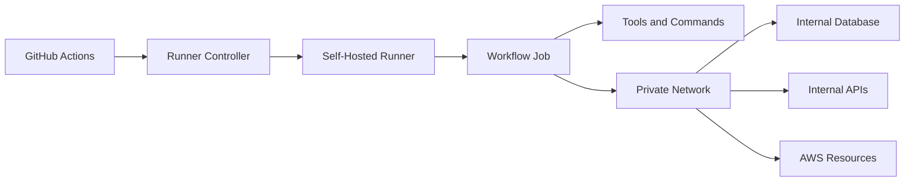
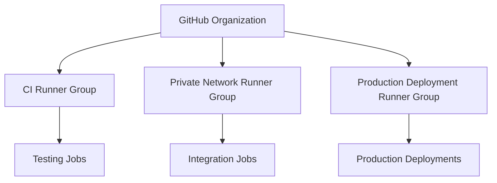
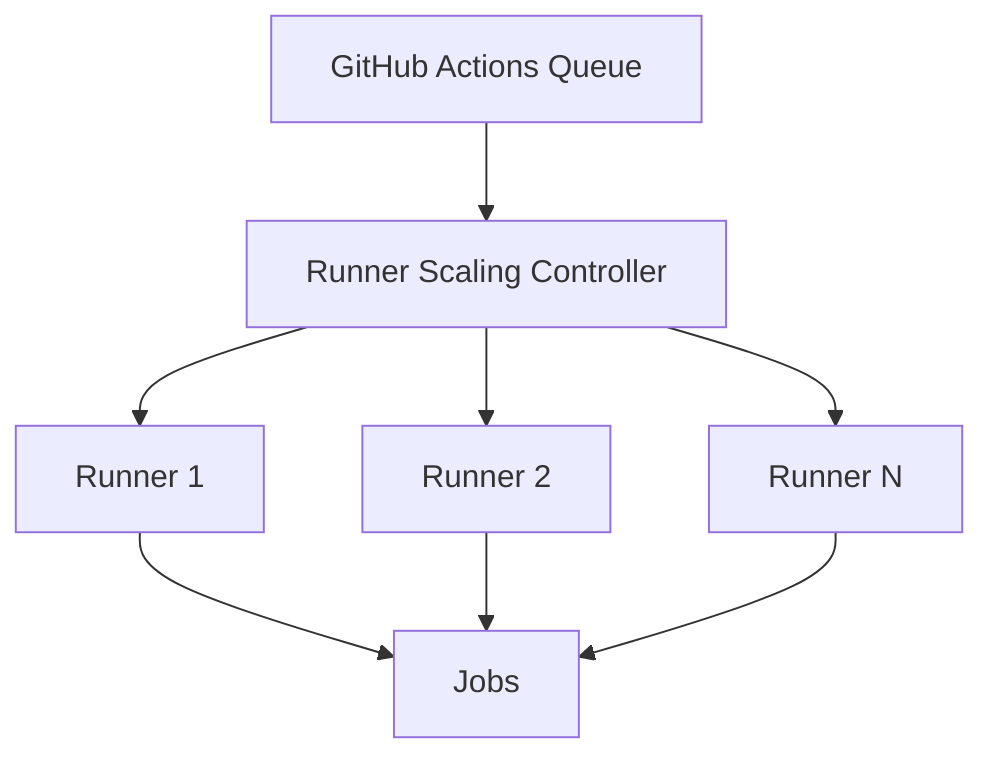
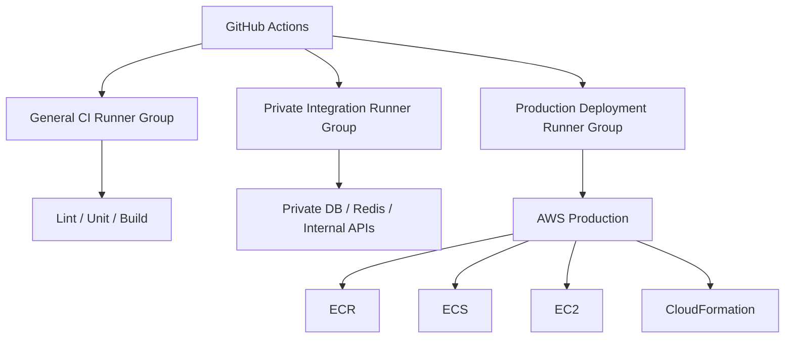

# 02- Self Hosted Runners

## Overview

Self-hosted runners are GitHub Actions runners operated and managed by the organization rather than GitHub.

They provide a controlled execution environment for workflows that require capabilities beyond standard GitHub-hosted runners, such as:

- Private network access
- Internal databases and APIs
- Custom enterprise software
- Specialized hardware
- Custom operating system configuration
- Persistent tooling
- Private AWS VPC connectivity
- Organization-specific security controls

The fundamental architecture is:

```text
GitHub
   ↓
Workflow
   ↓
Runner Selection
   ↓
Self-Hosted Runner
   ↓
Job
   ↓
Steps / Actions / Commands
   ↓
Internal or Cloud Resources
```

Self-hosted runners provide flexibility, but they also transfer significant security, reliability, patching, scaling, and operational responsibility to the organization.

A production self-hosted runner should therefore be treated as infrastructure rather than simply as another machine running the GitHub Actions agent.

---

## Why Self-Hosted Runners Exist

GitHub-hosted runners work well for standard CI workloads, but some workloads require infrastructure that GitHub cannot directly provide.

For example:

```text
GitHub-hosted runner
        X
        │
        │ private network
        ▼
Internal PostgreSQL
```

A self-hosted runner can instead be placed inside the required network:

```text
GitHub
  ↓
Self-Hosted Runner
  ↓
Private Network
  ├── PostgreSQL
  ├── Internal APIs
  ├── Redis
  └── Internal Services
```

Typical reasons for using self-hosted runners include:

| Requirement | Why Self-Hosted Helps |
|---|---|
| Private VPC access | Runner can be placed inside the network |
| Internal APIs | Direct network connectivity |
| Custom software | Full OS/package control |
| Specialized hardware | Organization controls the machine |
| Custom certificates | Organization-managed trust store |
| Internal registries | Private network access |
| Specialized build tools | Custom installation |
| Strict network controls | Organization controls network path |

The decision should be based on a concrete requirement rather than simply wanting more control.

---

## Self-Hosted Runner Architecture

A self-hosted runner consists of:

```text
Runner Host
├── Operating System
├── GitHub Actions Runner Application
├── Workspace
├── Toolchain
├── Network Access
└── Security Controls
```

GitHub coordinates workflow execution, while the organization operates the execution environment.



The GitHub service remains responsible for workflow orchestration, while the organization becomes responsible for the runner infrastructure.

---

## GitHub Actions Runner Lifecycle

A simplified lifecycle is:

```text
Provision Host
      ↓
Install Runner
      ↓
Register Runner
      ↓
Assign Labels / Groups
      ↓
Runner Online
      ↓
Receive Job
      ↓
Execute Job
      ↓
Cleanup
      ↓
Return to Idle
```

For persistent runners, the final state is usually:

```text
Idle
 ↓
Wait for next job
```

For ephemeral runners:

```text
Job Complete
 ↓
Destroy Runner
```

The second model generally provides stronger isolation.

---

## Runner Registration

A self-hosted runner must be registered with GitHub before it can receive jobs.

The registration process associates the runner with an appropriate GitHub scope such as:

- Repository
- Organization
- Enterprise

The runner receives registration credentials or tokens during setup.

Registration credentials should be treated as sensitive operational material.

Do not commit runner registration tokens to:

- Git repositories
- Docker images
- Configuration files
- CI logs
- Public documentation

---

## Runner Installation

A Linux runner typically requires:

```text
Linux host
Git
Required runtime libraries
GitHub Actions runner package
Application-specific tooling
```

A conceptual installation flow is:

```bash
mkdir actions-runner
cd actions-runner

# Download the runner package appropriate for the host architecture.
# Extract the package and configure it using the GitHub-provided registration flow.

./config.sh
./run.sh
```

Production installations should normally run the runner as a managed service rather than an interactive shell process.

---

## Running the Runner as a Service

A production runner should generally start automatically and recover after host reboot.

A service-based architecture provides:

```text
Host Reboot
    ↓
Runner Service Starts
    ↓
Runner Registers / Connects
    ↓
Runner Becomes Available
```

Operationally, the runner service should have:

- Automatic restart policy
- Dedicated service account
- Controlled filesystem permissions
- Centralized logging
- Monitoring
- Version/update procedures

Avoid running production runners manually from a developer terminal.

---

## Runner Labels

Labels allow workflows to select appropriate runners.

A runner might have labels such as:

```text
self-hosted
linux
x64
private-network
docker
deployment
```

A workflow can target labels:

```yaml
jobs:
  integration:
    runs-on:
      - self-hosted
      - linux
      - private-network
```

GitHub schedules the job only to a runner satisfying the required labels.

Labels should describe actual capabilities rather than arbitrary organizational names.

---

## Label Design

Useful labels might represent:

```text
Operating System
Architecture
Network Capability
Hardware Capability
Tooling Capability
Security Zone
```

For example:

```text
self-hosted
linux
x64
private-vpc
docker
```

Avoid creating labels that imply security guarantees without enforcing them.

For example:

```text
production-secure
```

does not make a runner secure by itself.

The actual runner configuration must enforce the intended security properties.

---

## Runner Groups

Runner groups provide an organizational mechanism for controlling which repositories or workflows can use particular runners.

A useful architecture might separate:

```text
General CI Runners
Private Integration Runners
Production Deployment Runners
Specialized Build Runners
```

This creates logical execution boundaries.

For example:



Runner groups should be governed as security boundaries, not merely as scheduling conveniences.

---

## Persistent vs Ephemeral Runners

There are two major operational models.

| Property | Persistent Runner | Ephemeral Runner |
|---|---|---|
| Host lifetime | Long-lived | One/few jobs |
| State | Can persist | Recreated |
| Setup cost | Lower per job | Higher per job |
| Isolation | Lower | Higher |
| Cleanup burden | Higher | Lower |
| Security | More difficult | Stronger isolation |
| Scaling | Requires management | Easier to automate |
| Recommended for untrusted workloads | Generally unsuitable | Better suited |

For security-sensitive workloads, ephemeral execution is generally preferable.

---

## Persistent Runners

A persistent runner remains available after a job completes.

```text
Host
 ↓
Job A
 ↓
Cleanup
 ↓
Idle
 ↓
Job B
```

This can be operationally efficient, but the filesystem and installed software can become contaminated.

Possible problems include:

- Leftover credentials
- Build files
- Compromised dependencies
- Modified configuration
- Stale Docker images
- Temporary files
- Unexpected process state

A cleanup script reduces risk but does not provide the same isolation as destroying the machine.

---

## Ephemeral Runners

An ephemeral runner is provisioned for a limited execution lifecycle.

```text
Provision
   ↓
Register
   ↓
Run Job
   ↓
Collect Results
   ↓
Destroy
```

The next job receives a fresh environment.

This reduces:

- Cross-job contamination
- Persistent malware
- Stale dependencies
- Filesystem leakage
- Configuration drift

The trade-off is additional provisioning complexity.

---

## Security Boundary

A self-hosted runner executes workflow code with the privileges available to its operating-system account and network environment.

This makes the runner a high-value security boundary.

Consider:

```text
Pull Request
    ↓
Workflow
    ↓
Self-Hosted Runner
    ↓
Private Network
    ↓
Production Database
```

If untrusted code can execute on that runner, the attacker may gain access to the network and credentials available from the runner.

Therefore:

> Never assume that self-hosted means trusted.

The opposite can be true if the runner has excessive privileges.

---

## Untrusted Pull Requests

A particularly dangerous architecture is:

```text
External PR
    ↓
Untrusted Code
    ↓
Privileged Self-Hosted Runner
    ↓
Internal Network
```

The application code in a pull request can potentially execute arbitrary commands during:

```text
Build
Test
Dependency Installation
Custom Scripts
Docker Build
```

If that workflow executes on a self-hosted runner with access to production resources, the runner becomes an attack path into the infrastructure.

---

## `pull_request` and Self-Hosted Runners

For untrusted pull requests, carefully evaluate:

- Secrets
- GITHUB_TOKEN permissions
- Runner access
- Network access
- Third-party actions
- Dependency installation
- Docker socket access
- AWS credentials

A safer architecture is often:

```text
Untrusted PR
    ↓
GitHub-Hosted Runner
    ↓
Low-Privilege Tests
```

and:

```text
Trusted Main Branch
    ↓
Self-Hosted Deployment Runner
    ↓
Private Infrastructure
```

This separates trust zones.

---

## `pull_request_target` Risk

`pull_request_target` executes using the context of the target repository rather than simply treating the pull request as an isolated untrusted execution context.

This can expose:

- Repository permissions
- Secrets
- Higher-trust workflow context

Using it to execute untrusted pull-request code can therefore create a serious security boundary failure.

A dangerous pattern is:

```yaml
on:
  pull_request_target:

jobs:
  test:
    runs-on: self-hosted
    steps:
      - uses: actions/checkout@v4
        with:
          ref: ${{ github.event.pull_request.head.sha }}

      - run: ./run-tests.sh
```

The critical problem is not the event alone.

The dangerous combination is:

```text
Untrusted PR Code
+
Privileged Context
+
Self-Hosted Runner
+
Secrets / Private Network
```

---

## Runner Operating System Security

A self-hosted runner is only as secure as its underlying host.

Apply standard operating-system hardening:

- Keep the OS patched
- Remove unnecessary packages
- Disable unnecessary services
- Restrict inbound network access
- Restrict outbound traffic where practical
- Use a dedicated service account
- Avoid running as root
- Protect SSH access
- Monitor authentication
- Rotate credentials
- Use host-level security monitoring

The runner should not be treated as a general-purpose server.

---

## Dedicated Runner Identity

The runner service should ideally use a dedicated operating-system account.

Avoid:

```text
root
```

unless a specific system requirement makes it unavoidable.

A dedicated account limits the impact of:

```text
Compromised dependency
Compromised action
Malicious script
Application test
```

However, OS-level least privilege is only one layer.

Network permissions and cloud credentials must also be restricted.

---

## Docker and Self-Hosted Runners

Docker introduces additional security considerations.

The Docker socket:

```text
/var/run/docker.sock
```

provides powerful access to the host.

A workflow with Docker socket access may effectively gain elevated control over the host.

Therefore, avoid casually exposing:

```text
Docker socket
```

to untrusted workloads.

This is particularly important when running:

- Pull request jobs
- Third-party actions
- Container builds
- Docker-in-Docker
- Self-hosted runners

---

## Docker-in-Docker

Docker-in-Docker can be useful for specific CI architectures, but it increases complexity.

Potential concerns include:

- Privileged containers
- Nested daemon management
- Filesystem access
- Performance overhead
- Network configuration
- Security boundaries

Where possible, use a controlled build architecture rather than granting broad host privileges to arbitrary workflow code.

---

## Private Network Access

One of the strongest reasons for self-hosted runners is private network connectivity.

Example:

```text
GitHub
   ↓
Self-Hosted Runner
   ↓
VPC
   ├── RDS PostgreSQL
   ├── ElastiCache Redis
   ├── Internal API
   ├── Kafka
   └── Private ECR Endpoint
```

This enables integration testing against resources that should not be publicly accessible.

However, network access should follow least privilege.

A runner that only needs PostgreSQL should not automatically receive unrestricted access to every subnet and service.

---

## Security Groups and Network Segmentation

For AWS deployments, use security groups and subnet design to constrain access.

For example:

```text
Runner Security Group
      │
      ├── TCP 5432 → RDS
      ├── TCP 443  → Required APIs
      └── TCP 9092 → Kafka
```

Avoid:

```text
Runner
  ↓
0.0.0.0/0
  ↓
Everything
```

Network segmentation limits the blast radius of a compromised workflow.

---

## Private DNS and Internal Services

A self-hosted runner may need access to internal DNS zones.

For example:

```text
api.internal.example
db.internal.example
kafka.internal.example
```

The runner must be able to resolve these names through the appropriate DNS infrastructure.

When troubleshooting connectivity, verify:

```bash
getent hosts api.internal.example
```

and:

```bash
curl -v https://api.internal.example/health
```

A successful DNS lookup does not prove application connectivity.

---

## AWS Access from Self-Hosted Runners

Self-hosted runners often execute inside AWS.

Possible authentication models include:

```text
Runner
 ↓
Instance Profile
 ↓
IAM Role
```

or:

```text
GitHub Actions
 ↓
OIDC
 ↓
AWS STS
 ↓
IAM Role
```

Avoid storing long-lived AWS access keys directly on the runner.

---

## Instance Profiles

If a runner is an EC2 instance, it can use an IAM instance profile.

The advantage is that credentials can be delivered through AWS-managed temporary credentials.

However, the runner's IAM role must be narrowly scoped.

For example, a deployment runner might require:

```text
ECR pull
ECS deployment
CloudFormation operations
```

It should not automatically receive:

```text
AdministratorAccess
```

---

## GitHub OIDC with Self-Hosted Runners

OIDC can provide short-lived AWS credentials without storing long-lived access keys in GitHub secrets.

The flow is:

```text
GitHub Workflow
      ↓
OIDC Token
      ↓
AWS STS
      ↓
IAM Trust Policy
      ↓
Temporary Credentials
      ↓
AWS API
```

The workflow may require:

```yaml
permissions:
  contents: read
  id-token: write
```

The IAM trust policy should restrict the identities allowed to assume the role.

---

## Separate CI and Deployment Runners

A production environment can separate runner responsibilities.

```text
CI Runner Group
 ├── Lint
 ├── Unit Tests
 ├── Integration Tests
 └── Build

Deployment Runner Group
 ├── Staging Deployment
 └── Production Deployment
```

This limits the privileges available to ordinary CI workloads.

A deployment runner can additionally be placed inside the required private network.

---

## Runner Groups as Security Zones

A useful organization model is:

```text
General CI
   ↓
Low Privilege

Private Integration
   ↓
Private Network Access

Production Deployment
   ↓
High Trust
```

Each group should have:

- Explicit repository access
- Explicit labels
- Defined network boundaries
- Defined credentials
- Defined maintenance ownership

---

## Custom Software

Self-hosted runners are useful when workflows require custom software.

Examples:

```text
Internal CLI
Private SDK
Enterprise certificate
Custom compiler
Specialized browser
Proprietary build tool
Internal security scanner
```

Install only software actually required by the workload.

Every additional package increases:

```text
Attack Surface
+
Maintenance
+
Dependency Risk
```

---

## Tool Version Management

Do not allow production runners to become unmanaged software collections.

Record:

```text
OS version
Runner version
Python version
Node version
Docker version
AWS CLI version
Terraform version
kubectl version
Internal tooling versions
```

Ideally, define the runner configuration as code or through an image-building process.

---

## Immutable Runner Images

A stronger architecture is to build a standard runner image.

```text
Runner Image Definition
        ↓
Build Image
        ↓
Security Scan
        ↓
Deploy Runner
        ↓
Register
```

The image can contain:

- OS
- Git
- Docker tooling
- Python
- Node.js
- AWS CLI
- Terraform
- kubectl
- Organization tooling

This reduces configuration drift.

---

## Runner Configuration as Code

Runner infrastructure can be managed with tools such as:

```text
Terraform
CloudFormation
Packer
Infrastructure automation
Configuration management
```

The goal is reproducibility.

Instead of:

```text
Engineer manually modifies runner
```

prefer:

```text
Configuration
 ↓
Version Control
 ↓
Build
 ↓
Provision
 ↓
Validate
```

---

## Runner Autoscaling

Persistent runner fleets may need autoscaling.

A conceptual architecture is:



The scaling mechanism should account for:

- Pending jobs
- Job duration
- Provisioning time
- Maximum runner count
- Minimum capacity
- Cost
- Security isolation

---

## Ephemeral Autoscaling

A stronger model is:

```text
Job Queued
   ↓
Provision Runner
   ↓
Register Runner
   ↓
Execute Job
   ↓
Collect Result
   ↓
Destroy Runner
```

This reduces the amount of persistent state that must be trusted.

The trade-off is additional orchestration complexity.

---

## Kubernetes-Based Runner Scaling

Organizations may run ephemeral GitHub Actions runners on Kubernetes.

Conceptually:

```text
GitHub
  ↓
Runner Controller
  ↓
Kubernetes
  ├── Runner Pod
  ├── Runner Pod
  └── Runner Pod
```

This can provide:

- Dynamic capacity
- Isolation
- Infrastructure automation
- Container-based lifecycle
- Resource limits

However, Kubernetes becomes another operational dependency.

The architecture should not be introduced merely to avoid maintaining a few simple runners.

---

## Resource Limits

Runner jobs can consume:

```text
CPU
Memory
Disk
Network
Container resources
```

For shared persistent runners, one poorly behaved job can affect another.

Resource controls can include:

- Dedicated hosts
- Containers
- cgroups
- Kubernetes resource requests/limits
- Ephemeral runners
- Job-level isolation

---

## Runner Disk Management

Docker-heavy CI can consume significant disk space.

Common sources include:

```text
Docker images
Build cache
Source checkouts
Package caches
Artifacts
Temporary files
Logs
```

Monitor:

```bash
df -h
docker system df
```

Persistent runners require an explicit cleanup strategy.

---

## Workspace Cleanup

A persistent runner should clean its workspace after execution.

Potential cleanup targets include:

```text
Build directories
Temporary files
Generated credentials
Test databases
Generated certificates
Docker containers
Unused images
```

Cleanup must be reliable even when the workflow fails.

However, cleanup should not be considered a substitute for ephemeral runner isolation.

---

## Runner Health Monitoring

Monitor at least:

```text
Runner Online/Offline
Job Queue Time
Job Duration
CPU
Memory
Disk
Network
Runner Errors
Service Restarts
Docker Health
OS Health
```

A runner can appear online while being operationally unhealthy.

For example:

```text
Runner Online
+
Disk 99% Full
=
Jobs Fail
```

---

## Runner Logs

Runner logs should help answer:

- Did the runner connect?
- Did it receive a job?
- Did the job start?
- Did the runner lose connectivity?
- Did the service crash?
- Did the host run out of resources?

Keep runner logs separate from application logs.

This makes operational troubleshooting easier.

---

## Runner Availability

A single production deployment runner creates a single point of failure.

Bad architecture:

```text
Production Deployment
        ↓
Runner 1
```

Better:

```text
Production Deployment
        ↓
Runner Group
   ├── Runner 1
   ├── Runner 2
   └── Runner 3
```

The runners should ideally be distributed across failure domains where appropriate.

---

## High Availability

High availability should consider:

```text
Runner Host Failure
Network Failure
Availability Zone Failure
Runner Service Failure
Scaling Failure
GitHub Service Dependency
Cloud Provider Failure
```

The runner fleet should not become a hidden single point of failure in the deployment system.

---

## Disaster Recovery

Runner infrastructure should be reproducible.

A recovery process should look like:

```text
Runner Host Lost
      ↓
Provision New Host
      ↓
Apply Runner Image
      ↓
Register Runner
      ↓
Apply Labels / Groups
      ↓
Validate Connectivity
      ↓
Resume CI/CD
```

Avoid recovery procedures that depend on undocumented manual configuration.

---

## Self-Hosted Runner Security Model

A production security model should include:

```text
Least-Privilege OS Account
        +
Least-Privilege Network
        +
Least-Privilege GitHub Permissions
        +
Least-Privilege AWS IAM
        +
Trusted Workflows
        +
Trusted Actions
        +
Ephemeral Execution
```

No individual control is sufficient by itself.

---

## GITHUB_TOKEN Permissions

Use explicit permissions.

Example:

```yaml
permissions:
  contents: read
```

Deployment jobs can grant only the permissions they actually require.

For AWS OIDC:

```yaml
permissions:
  contents: read
  id-token: write
```

Do not grant:

```yaml
permissions: write-all
```

as a convenience.

---

## Secrets on Self-Hosted Runners

Secrets can be exposed through:

- Environment variables
- Command arguments
- Logs
- Generated files
- Process arguments
- Docker build context
- Artifacts
- Temporary configuration

A self-hosted runner adds another concern:

```text
The host itself must be trusted.
```

Avoid storing long-lived secrets directly on disk.

---

## Environment Secrets

Production secrets should generally be associated with the appropriate GitHub environment.

Example:

```text
development
staging
production
```

A production deployment workflow can then be protected with:

- Required reviewers
- Branch restrictions
- Environment secrets
- Deployment controls

This is preferable to placing production credentials globally on every runner.

---

## Self-Hosted Runner and Docker Secrets

Avoid:

```dockerfile
ARG AWS_SECRET_ACCESS_KEY
```

or:

```dockerfile
ENV AWS_SECRET_ACCESS_KEY=...
```

Secrets passed into image build layers can become difficult to remove and may leak into image history or metadata.

Use appropriate BuildKit secret mechanisms when secrets are genuinely required during builds, and prefer designs that avoid secrets during image construction.

---

## Third-Party Actions

A third-party action executes on the runner.

On a self-hosted runner, the consequences can be greater because the runner may have:

```text
Private Network Access
+
Cloud Credentials
+
Internal Tools
+
Sensitive Files
```

Therefore:

```text
Third-Party Action Trust
```

should be part of runner security.

Use trusted actions and pin critical dependencies appropriately.

---

## SHA Pinning

For high-security workflows, pin third-party actions to immutable commit SHAs.

Instead of:

```yaml
- uses: example/action@v1
```

use:

```yaml
- uses: example/action@<verified-commit-sha>
```

This reduces the risk of a mutable tag being redirected to a different commit.

Organizations should balance:

```text
Security
+
Update Management
+
Operational Maintainability
```

when establishing pinning policy.

---

## Supply Chain Security

The self-hosted runner is part of the software supply chain.

Potential attack paths include:

```text
Compromised Dependency
        ↓
Build Script
        ↓
Runner
        ↓
Credentials / Network
```

Controls include:

- Dependency review
- Lock files
- Dependency scanning
- SHA-pinned actions
- SBOM
- Artifact provenance
- Artifact signing
- Least privilege
- Ephemeral runners
- Network segmentation

---

## Build Once, Deploy Many

A self-hosted deployment runner should not rebuild production artifacts unnecessarily.

Prefer:

```text
CI
 ↓
Build Image
 ↓
ECR
 ↓
Staging
 ↓
Approval
 ↓
Production
```

rather than:

```text
Staging Build
 ↓
Production Build
```

The production environment should receive the same immutable artifact that passed validation.

---

## Docker Image Identity

Use immutable identifiers.

For example:

```text
orders:8f41d9c
```

is better for deployment traceability than:

```text
orders:latest
```

An even stronger deployment reference is the image digest:

```text
orders@sha256:...
```

The deployment runner can then promote an exact artifact.

---

## Production Deployment Runner

A production deployment runner might have access to:

```text
AWS STS
ECR
ECS
CloudFormation
Terraform
Kubernetes
Private APIs
```

That runner should be isolated from ordinary CI workloads.

A typical architecture is:

```text
Pull Request
   ↓
GitHub-Hosted CI
   ↓
Tests / Security
   ↓
Immutable Artifact
   ↓
Production Deployment Workflow
   ↓
Production Runner Group
   ↓
OIDC / IAM
   ↓
Production AWS
```

---

## Deployment Concurrency

Production deployments should not race each other.

Example:

```yaml
concurrency:
  group: production-deployment
  cancel-in-progress: false
```

This prevents two production deployments from executing concurrently when the deployment process requires serialization.

The exact policy should reflect the deployment mechanism.

---

## Idempotent Deployment

A self-hosted runner may be interrupted and a workflow may be rerun.

Deployment operations should therefore be idempotent where possible.

For example:

```text
Deploy image digest X
```

should converge to:

```text
Production running X
```

rather than creating duplicate infrastructure or inconsistent state.

---

## Database Migrations

Runner architecture does not eliminate application deployment concerns.

For Django:

```text
Deploy Application
        ↓
Database Migration
        ↓
Application Health
```

Migration strategy must account for:

- Backward compatibility
- Rolling deployment
- Rollback
- Concurrent application versions

For production systems, expand-and-contract migrations are often safer than destructive schema changes during deployment.

---

## Celery and Background Workers

Deployments involving Celery require consideration of:

```text
Web Workers
Celery Workers
Celery Beat
Redis
Broker
Database
```

For example:

```text
New Application
      ↓
Web
      +
Celery
      ↓
Shared Database / Broker
```

Application and worker compatibility should be maintained during rolling deployments.

---

## Kafka Consumers

Kafka-based applications require additional care.

A deployment can involve:

```text
Producer
 ↓
Kafka
 ↓
Consumer
```

During a rolling deployment:

```text
Old Consumer
+
New Consumer
```

may coexist temporarily.

Therefore:

- Maintain message compatibility
- Avoid breaking schema changes
- Handle duplicate processing
- Preserve consumer-group behavior
- Make consumers idempotent where appropriate

---

## gRPC and Internal APIs

Self-hosted runners can be useful for integration testing against private gRPC services.

Example:

```text
Runner
  ↓
Private Network
  ↓
gRPC Service
```

Testing should validate:

- DNS
- TLS
- Authentication
- Port connectivity
- Protocol compatibility
- Service readiness

---

## Runner Governance

Organizations should define:

- Who can create runners
- Who can modify runners
- Who can assign runner labels
- Which repositories can use runner groups
- Which actions are allowed
- Which credentials runners can access
- How runners are patched
- How runners are retired
- How runner incidents are handled

Without governance, self-hosted runners can become unmanaged infrastructure.

---

## Runner Inventory

Maintain an inventory containing:

| Attribute | Example |
|---|---|
| Runner ID | `runner-prod-01` |
| Environment | Production |
| OS | Ubuntu |
| Architecture | x64 |
| Runner Group | Production |
| Network Zone | Private VPC |
| Labels | `linux`, `private-vpc`, `docker` |
| IAM Role | Deployment Role |
| Owner | Platform Team |
| Image Version | `2026.09.1` |
| Status | Online |

This makes operational ownership explicit.

---

## Runner Update Strategy

Runner software and host dependencies must be updated.

A controlled lifecycle can be:

```text
Build New Runner Image
        ↓
Security Validation
        ↓
Canary Runner
        ↓
Run Representative Jobs
        ↓
Expand Fleet
        ↓
Retire Old Runners
```

Avoid manually updating production runners one by one without a repeatable procedure.

---

## Runner Retirement

A runner should be retired when:

- OS is unsupported
- Runner software is obsolete
- Credentials are suspected to be compromised
- Configuration drift is detected
- Hardware is unreliable
- Network configuration is no longer appropriate

The retirement process should include:

```text
Stop Scheduling
 ↓
Drain Jobs
 ↓
Disable / Remove Runner
 ↓
Revoke Associated Access
 ↓
Destroy Host
 ↓
Remove Inventory Entry
```

---

## Runner Compromise Response

If a runner is suspected of compromise:

1. Stop new jobs from being scheduled.
2. Isolate the host from the network.
3. Preserve required forensic information.
4. Revoke exposed credentials.
5. Rotate affected secrets.
6. Review workflow execution history.
7. Inspect artifacts and releases.
8. Rebuild the runner from a trusted image.
9. Validate IAM and network access.
10. Resume workloads only after the trust boundary is restored.

Do not simply reboot a potentially compromised persistent runner and assume the issue is resolved.

---

## Monitoring and Alerting

Useful alerts include:

```text
Runner Offline
Runner Registration Failure
Unexpected Runner Restart
Disk > Threshold
Memory > Threshold
CPU Saturation
Job Queue Growth
Repeated Job Failures
Unexpected Network Activity
Runner Version Drift
OS Patch Drift
```

Security monitoring should additionally detect suspicious activity such as unexpected outbound connections or unauthorized process execution.

---

## Cost Optimization

Self-hosted runners can reduce or change CI execution costs, but they introduce infrastructure expenses.

Consider:

```text
EC2 / VM Cost
Storage
Networking
Load Balancers
Autoscaling Infrastructure
Monitoring
Maintenance
Security Tooling
Engineering Time
```

A runner fleet is not automatically cheaper.

Calculate total operational cost rather than only compute cost.

---

## Performance Optimization

Self-hosted runners can provide performance improvements through:

- Custom CPU/memory sizing
- Local dependency mirrors
- Preinstalled tools
- Local container registry access
- Private network proximity
- Specialized hardware

Persistent runners may also benefit from warm caches.

However, persistent state must be managed carefully because the same optimization can create correctness and security problems.

---

## Self-Hosted vs GitHub-Hosted

| Dimension | GitHub-Hosted | Self-Hosted |
|---|---|---|
| Infrastructure ownership | GitHub | Organization |
| Private VPC access | Limited by design | Strong |
| OS customization | Limited | Extensive |
| Maintenance | Lower | Higher |
| Security responsibility | Shared with GitHub | More organizational responsibility |
| Persistent state | Not the design goal | Possible |
| Custom networking | Limited | Full control |
| Specialized hardware | Limited to supported options | Full control |
| Scaling | Managed service | Organization-managed |
| Operational complexity | Lower | Higher |
| Ephemeral architecture | Natural | Must be designed |

---

## When Not to Use Self-Hosted Runners

Avoid self-hosted runners when the only motivation is:

```text
"I want more control."
```

If GitHub-hosted runners already satisfy:

- Runtime requirements
- Network requirements
- Security requirements
- Build requirements
- Performance requirements

then additional infrastructure may add unnecessary operational burden.

Self-hosting should solve a concrete engineering problem.

---

## Common Mistakes

### Using a Persistent Runner for Untrusted PRs

This can expose the runner's filesystem, network, and credentials.

### Running the Runner as Root

A compromised workflow can inherit excessive operating-system privileges.

### Giving the Runner Broad AWS Permissions

The runner should have only the IAM permissions required for its workloads.

### Allowing Broad Network Access

Private network access should be segmented.

### Installing Everything on One Runner

A giant shared runner becomes difficult to secure and maintain.

### Treating Labels as Security Controls

Labels identify capabilities. They do not enforce security boundaries by themselves.

### Keeping Long-Lived Credentials on Disk

Prefer short-lived credentials through mechanisms such as OIDC or cloud instance identity.

### Sharing CI and Production Deployment Runners

This unnecessarily increases blast radius.

### Ignoring Disk Cleanup

Docker and build artifacts can eventually exhaust disk space.

### Manually Modifying Production Runners

Manual changes create configuration drift and make disaster recovery difficult.

### Assuming Ephemeral Means Automatically Secure

An ephemeral runner still requires:

- Least privilege
- Trusted workflows
- Secure images
- Network controls
- Action controls

---

## Troubleshooting Self-Hosted Runners

Troubleshooting should follow:

```text
Symptom
   ↓
Possible Causes
   ↓
Isolation Strategy
   ↓
Commands / Checks
   ↓
Root Cause
   ↓
Corrective Action
   ↓
Prevention
```

---

## Runner Offline

### Symptom

GitHub shows the runner as offline.

### Possible Causes

- Host stopped
- Runner service stopped
- Network failure
- DNS failure
- Authentication/registration issue
- Host resource exhaustion

### Checks

```bash
systemctl status actions.runner.*
```

Check network:

```bash
curl -I https://github.com
```

Check system resources:

```bash
uptime
df -h
free -h
```

### Prevention

Monitor both:

```text
Runner availability
```

and:

```text
Host health
```

---

## Jobs Remain Queued

### Symptom

Jobs remain queued waiting for a runner.

### Possible Causes

- No runner with matching labels
- Runner offline
- Runner group restrictions
- Runner capacity exhausted
- Concurrency blocking the job

### Checks

Verify:

```text
runs-on
Runner Labels
Runner Groups
Runner Online Status
Workflow Concurrency
```

A label mismatch is a common cause.

---

## Runner Service Fails to Start

### Checks

```bash
systemctl status actions.runner.*
journalctl -u actions.runner.* --no-pager
```

Inspect:

- File permissions
- Service account
- Runner installation
- Environment
- Network
- Runner configuration

---

## Network Troubleshooting

For private services:

```bash
getent hosts internal-service.example
```

Test TCP connectivity:

```bash
nc -vz internal-service.example 5432
```

Test HTTPS:

```bash
curl -v https://internal-service.example/health
```

DNS success does not guarantee:

```text
Security Group
Routing
Firewall
TLS
Authentication
```

are correct.

---

## AWS Troubleshooting

Verify AWS identity:

```bash
aws sts get-caller-identity
```

Inspect region:

```bash
aws configure get region
```

For EC2-based runners, also verify that the intended IAM role is attached to the instance.

Do not troubleshoot an application deployment before verifying runner identity.

---

## Docker Troubleshooting

Check Docker:

```bash
docker version
docker info
docker ps
```

Check disk usage:

```bash
docker system df
```

Check running containers:

```bash
docker ps -a
```

If Docker access fails, verify:

- Docker daemon
- Service account permissions
- Socket permissions
- Disk capacity
- Security policy

---

## GitHub CLI Operations

The GitHub CLI is useful for operational work.

List workflows:

```bash
gh workflow list
```

List recent runs:

```bash
gh run list
```

Inspect a run:

```bash
gh run view RUN_ID
```

Inspect logs:

```bash
gh run view RUN_ID --log
```

Rerun a workflow:

```bash
gh run rerun RUN_ID
```

Watch a running workflow:

```bash
gh run watch RUN_ID
```

These commands are useful when diagnosing whether a problem is:

```text
Workflow
vs
Runner
vs
Application
```

---

## Production Runner Architecture

A mature architecture can separate runner classes:



Each group can have different:

- Network access
- IAM roles
- Repository access
- Labels
- Security policies
- Scaling rules

---

## Production CI/CD Flow

A production pipeline can follow:

```text
Pull Request
    ↓
GitHub-Hosted CI
    ↓
Lint
    ↓
Unit Tests
    ↓
Integration Tests
    ↓
Security Scan
    ↓
Build
    ↓
Immutable Docker Image
    ↓
ECR
    ↓
Staging
    ↓
Approval
    ↓
Self-Hosted Production Runner
    ↓
Production
    ↓
Health Validation
    ↓
Monitoring
    ↓
Rollback if Required
```

This separates general-purpose CI execution from privileged deployment execution.

---

## Failure Domains

A self-hosted runner architecture should explicitly identify:

```text
GitHub Failure
Runner Host Failure
Runner Service Failure
Network Failure
AWS Failure
Registry Failure
Dependency Failure
Deployment Failure
Application Failure
```

The deployment system should avoid allowing one failure to corrupt the release process.

For example:

```text
Runner Failure
```

should not imply:

```text
Artifact Lost
```

because the artifact should already exist in a durable registry.

---

## Security Zoning Example

A practical enterprise design can use:

```text
Zone A: Untrusted CI
    GitHub-hosted runners

Zone B: Trusted CI
    Controlled self-hosted runners

Zone C: Private Integration
    Self-hosted runners inside VPC

Zone D: Production Deployment
    Restricted deployment runners
```

The more privileged the zone, the stronger the controls should be.

---

## Production Checklist

### Infrastructure

- [ ] Runner host is provisioned from a controlled image.
- [ ] OS is patched.
- [ ] Runner software is maintained.
- [ ] Runner service is monitored.
- [ ] Disk capacity is monitored.
- [ ] Host access is restricted.

### Security

- [ ] Runner uses a dedicated OS account.
- [ ] Runner does not unnecessarily run as root.
- [ ] Network access is restricted.
- [ ] AWS IAM permissions are minimal.
- [ ] Long-lived credentials are avoided.
- [ ] Production secrets are protected by environments.
- [ ] Third-party actions are reviewed.
- [ ] Critical actions are pinned appropriately.
- [ ] Untrusted PRs do not execute on privileged runners.

### Operations

- [ ] Runner groups are defined.
- [ ] Labels are documented.
- [ ] Runner inventory exists.
- [ ] Logs are collected.
- [ ] Health monitoring is configured.
- [ ] Capacity is monitored.
- [ ] Scaling strategy is documented.
- [ ] Disaster recovery is tested.

### CI/CD

- [ ] Build and deployment responsibilities are separated.
- [ ] Production artifacts are immutable.
- [ ] Deployment concurrency is controlled.
- [ ] Rollback procedures exist.
- [ ] Health checks exist.
- [ ] Deployment identity is traceable.
- [ ] Runner failures do not destroy release artifacts.

---

## Senior Design Principles

### Self-Hosted Means More Responsibility

Self-hosting does not merely provide more control.

It also creates responsibility for:

```text
Security
Patching
Scaling
Availability
Monitoring
Networking
Credentials
Recovery
```

### Privilege Should Follow the Workload

A lint job should not receive production network access.

A deployment job may need it.

Separate them.

### Prefer Ephemeral Runners for Sensitive Workloads

Fresh infrastructure reduces persistence and contamination.

### Treat Network Access as a Privilege

A runner inside a private VPC should not automatically receive unrestricted access to the entire VPC.

### Make Runner Infrastructure Reproducible

Use infrastructure-as-code and immutable images where practical.

### Keep Artifacts Outside the Runner

The runner should execute the build, not become the system of record for release artifacts.

### Separate Trust Zones

Do not place untrusted PR execution and production deployment on the same runner pool.

### Design for Compromise

Assume that a dependency or action can eventually be compromised.

The architecture should limit what happens next.

---

## Interview Scenarios

### A Production Deployment Must Access a Private RDS Instance

Design:

```text
GitHub Actions
    ↓
Restricted Self-Hosted Runner
    ↓
Private VPC
    ↓
RDS
```

Discuss:

- Network segmentation
- Security groups
- IAM
- Runner groups
- Secrets
- Availability
- Monitoring

---

### A Third-Party Action Is Compromised

Discuss:

```text
Action
 ↓
Runner
 ↓
Credentials
 ↓
Private Network
```

Controls should include:

- SHA pinning
- Least privilege
- Restricted secrets
- Ephemeral runners
- Network segmentation
- Action governance

---

### Multiple Teams Need Private Runners

Do not necessarily create one giant shared runner.

Consider:

```text
Runner Groups
+
Labels
+
Repository Restrictions
+
Network Zones
```

This allows isolation based on workload and trust.

---

### Production Runner Is Compromised

The response should include:

```text
Isolate
 ↓
Revoke Credentials
 ↓
Investigate
 ↓
Rebuild
 ↓
Validate
 ↓
Resume
```

Do not simply restart the host.

---

### CI Is Becoming Slow

Investigate:

```text
Queue Time
Runner Provisioning
Dependency Installation
Docker Builds
Cache Performance
Test Duration
Matrix Cardinality
Artifact Upload
External Services
```

Optimize based on measured bottlenecks.

---

## Key Takeaways

- Self-hosted runners provide control over networking, operating systems, tooling, and infrastructure, but transfer security, maintenance, scaling, and reliability responsibilities to the organization.
- Treat self-hosted runners as security boundaries: untrusted code, third-party actions, Docker access, private networks, secrets, and cloud credentials must be carefully isolated.
- Prefer separate runner groups for general CI, private integration workloads, and production deployment workloads so that privileges and network access match the job's trust level.
- Ephemeral runners and reproducible runner images reduce configuration drift, cross-job contamination, and persistence risks compared with unmanaged long-lived runners.
- Production runner architecture should be observable, least-privileged, reproducible, highly available, and capable of recovering without depending on state stored on an individual runner.