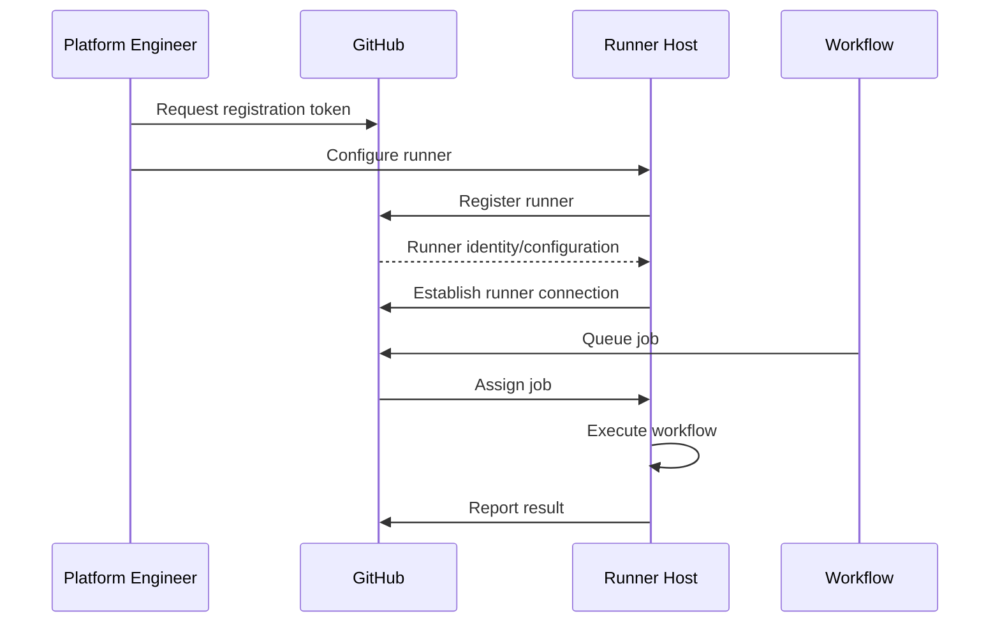
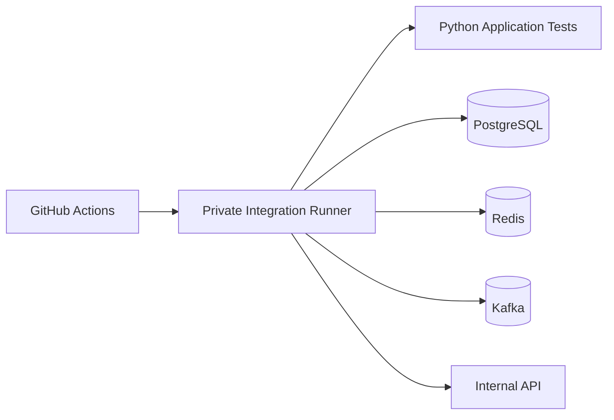
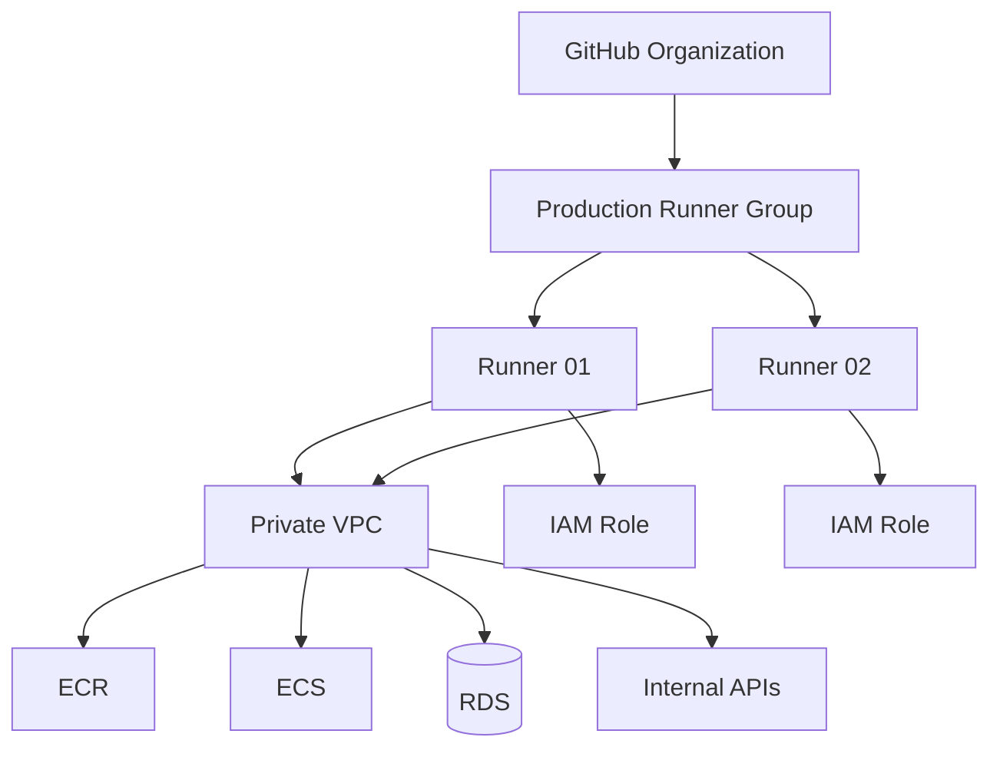
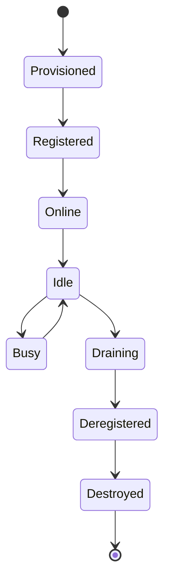

# 03- Runner Registration

## Overview

Runner registration is the process of connecting a self-hosted machine to GitHub Actions so that GitHub can assign workflow jobs to it.

Registration establishes the relationship between:

```text
GitHub Repository / Organization
            ↓
       Runner Group
            ↓
      Registered Runner
            ↓
       Workflow Job
```

A self-hosted runner is not useful merely because the runner software is installed. It must be registered with the correct GitHub scope, assigned appropriate labels or groups, and placed inside a controlled infrastructure environment.

For production CI/CD, registration should be treated as part of the runner's identity and lifecycle management.

A typical lifecycle is:

```text
Provision Host
      ↓
Install Runner Software
      ↓
Obtain Registration Token
      ↓
Configure Runner
      ↓
Assign Labels / Group
      ↓
Install Runner Service
      ↓
Validate Connectivity
      ↓
Execute Test Workflow
      ↓
Monitor and Maintain
```

---

## What Runner Registration Does

Runner registration tells GitHub:

- Which repository, organization, or enterprise owns the runner
- Which runner is available for jobs
- Which labels identify its capabilities
- Which runner group controls access
- Whether the runner is currently online

The runner then establishes communication with GitHub and waits for jobs that match its configuration.

Conceptually:



Registration does not grant the runner unlimited access to GitHub resources. Workflow permissions, repository access, runner groups, tokens, secrets, and cloud credentials remain separate security controls.

---

## Runner Registration Scope

Self-hosted runners can be registered at different scopes depending on the GitHub configuration and organizational requirements.

Common scopes include:

| Scope | Typical Use |
|---|---|
| Repository | Dedicated runner for one repository |
| Organization | Shared runners across selected repositories |
| Enterprise | Centralized runner infrastructure across organizations |

The scope determines where the runner is visible and how it can be governed.

---

## Repository-Level Registration

A repository-level runner is associated with a specific repository.

Example architecture:

```text
Repository A
    ↓
Dedicated Runner
```

This is useful when:

- The workload is highly specialized
- The runner requires repository-specific software
- Isolation is important
- The repository has unique network requirements

The limitation is reduced sharing efficiency.

A dedicated runner can remain idle while another repository needs capacity.

---

## Organization-Level Registration

An organization-level runner can serve multiple repositories, subject to runner-group and repository-access controls.

Example:

```text
Organization
    ↓
Runner Group
    ├── Repository A
    ├── Repository B
    └── Repository C
```

This is often more efficient for shared CI infrastructure.

However, shared runners require stronger isolation and governance because multiple workloads can execute on the same infrastructure.

---

## Enterprise-Level Registration

Large organizations may centralize runner infrastructure across multiple GitHub organizations.

The architecture can look like:

```text
Enterprise
    ├── Organization A
    ├── Organization B
    └── Organization C
            ↓
      Managed Runner Fleet
```

This can simplify:

- Standardization
- Runner image management
- Security policies
- Monitoring
- Capacity planning
- Cost management

The trade-off is increased platform-engineering complexity.

---

## Registration Token

Runner registration requires an appropriate registration mechanism provided by GitHub.

The registration token or equivalent registration credential is used during runner configuration.

It should be treated as sensitive.

Never:

- Commit it to Git
- Put it in source code
- Store it in a Docker image
- Print it in logs
- Share it through chat or tickets
- Put it into workflow artifacts

Registration credentials should have the narrowest practical scope and lifetime.

---

## Registration vs Authentication

These concepts should not be confused.

### Registration

Establishes the runner's relationship with GitHub.

```text
Host
 ↓
Register
 ↓
GitHub knows the runner
```

### Job Authentication

Controls what the workflow can access while executing.

Examples include:

```text
GITHUB_TOKEN
GitHub secrets
OIDC
AWS IAM
Repository permissions
Environment secrets
```

Therefore:

```text
Runner Registration
≠
Production Authorization
```

A registered runner should not automatically receive production access.

---

## Runner Identity

A registered runner has an identity within its GitHub scope.

The identity is useful for:

- Inventory
- Monitoring
- Troubleshooting
- Access control
- Runner lifecycle management
- Incident response

A production organization should know:

```text
Which runner exists?
Where is it running?
Who owns it?
What network can it access?
Which repositories can use it?
Which labels does it have?
Which runner group contains it?
What IAM role can it assume?
```

---

## Runner Name

Give runners meaningful names.

For example:

```text
prod-deploy-01
private-integration-01
ci-linux-01
```

Avoid names such as:

```text
runner1
server
test
my-machine
```

A useful naming convention can encode:

```text
Environment
Purpose
Sequence
```

For example:

```text
prod-deploy-01
```

communicates more operational information than:

```text
runner-01
```

---

## Runner Labels

Labels describe runner capabilities.

Example:

```yaml
runs-on:
  - self-hosted
  - linux
  - private-vpc
```

The workflow requests a runner satisfying the labels.

A runner may have:

```text
self-hosted
linux
x64
docker
private-vpc
```

Labels should represent actual capabilities.

---

## Label Design

A practical label taxonomy can contain:

```text
Operating System
Architecture
Network Zone
Hardware Capability
Tooling Capability
Workload Type
```

Example:

```text
self-hosted
linux
x64
private-vpc
docker
deployment
```

Avoid using labels as the only security mechanism.

For example:

```text
production-secure
```

does not make a runner secure.

The actual security properties must be enforced through:

- Runner groups
- Repository access
- Network controls
- IAM
- Host security
- Workflow permissions

---

## Runner Groups

Runner groups provide a higher-level access-control mechanism.

A useful production model is:

```text
Runner Groups
├── General CI
├── Private Integration
└── Production Deployment
```

The groups can have different repository access and security boundaries.

For example:

```text
General CI
    ↓
Low privilege

Private Integration
    ↓
Private VPC access

Production Deployment
    ↓
Restricted production access
```

---

## Registration and Runner Groups

The registration process should be planned together with runner groups.

Do not first register dozens of runners and decide access controls later.

Define:

```text
Purpose
 ↓
Scope
 ↓
Runner Group
 ↓
Labels
 ↓
Network
 ↓
IAM
 ↓
Workflow Access
```

This prevents runner infrastructure from becoming an unmanaged collection of machines.

---

## Linux Runner Registration

Linux is a common choice for backend workloads.

Typical requirements include:

```text
Linux host
Git
Required system libraries
Runner software
Application tooling
```

A simplified configuration flow is:

```bash
mkdir actions-runner
cd actions-runner

# Download and extract the runner package
# appropriate for the host architecture.

./config.sh
./run.sh
```

The exact registration command and package URL should come from the current GitHub runner setup instructions for the target repository or organization.

---

## Non-Interactive Registration

Production automation often needs unattended registration.

A conceptual setup might be:

```bash
./config.sh \
  --url https://github.com/ORG/REPOSITORY \
  --token "$RUNNER_TOKEN" \
  --name "private-integration-01" \
  --labels "linux,x64,private-vpc,docker"
```

Do not hard-code:

```bash
--token "permanent-secret"
```

into infrastructure code.

Registration credentials should be injected securely.

---

## Runner Service Installation

After registration, production runners should normally operate as a system service.

A typical lifecycle is:

```text
Host Boot
   ↓
Runner Service Starts
   ↓
Runner Connects
   ↓
Runner Online
   ↓
Wait for Job
```

A service-based runner is more reliable than:

```bash
./run.sh
```

executed manually from an administrator's terminal.

---

## Service Validation

After installation, validate:

```text
Service Running
Runner Online
Correct Name
Correct Labels
Correct Group
Correct Repository Scope
```

On Linux, service inspection can include:

```bash
systemctl status actions.runner.*
```

and:

```bash
journalctl -u actions.runner.* --no-pager
```

The exact service name depends on the runner installation.

---

## Runner Connectivity

A registered runner requires network connectivity to GitHub.

At a basic level, verify:

```bash
curl -I https://github.com
```

Also verify DNS:

```bash
getent hosts github.com
```

A runner can be fully configured at the operating-system level but still fail to operate if:

- DNS is unavailable
- Firewall rules block required traffic
- Proxy configuration is incorrect
- TLS inspection breaks trust
- Outbound HTTPS is restricted

---

## Proxy Environments

Enterprise environments may require outbound traffic through a proxy.

The runner must be configured according to the organization's network architecture.

Validate:

```text
DNS
 ↓
Proxy
 ↓
TLS
 ↓
GitHub
```

Do not disable TLS verification as a workaround for connectivity problems.

Instead investigate:

- CA certificates
- Proxy configuration
- TLS inspection
- Firewall rules
- DNS
- Egress policies

---

## Private Network Registration

A common AWS architecture is:

```text
GitHub
   ↓
Internet / Controlled Egress
   ↓
Self-Hosted Runner
   ↓
Private Subnet
   ├── RDS
   ├── Redis
   ├── Kafka
   └── Internal APIs
```

The runner requires enough outbound connectivity to communicate with GitHub while retaining private access to internal resources.

This often requires careful VPC routing and egress design.

---

## Registration Does Not Require Inbound GitHub Connectivity

The runner's connectivity model should not be misunderstood as GitHub directly opening arbitrary inbound connections to the runner.

The runner establishes the communication channel needed for receiving and reporting jobs.

This makes outbound network configuration particularly important.

A restrictive enterprise firewall therefore needs to account for the runner's required outbound communication.

---

## Runner Registration on AWS EC2

A common production architecture is:

```text
EC2
├── Linux
├── Runner Service
├── Docker
├── AWS CLI
└── Application Tooling
```

The EC2 instance can receive an IAM role through an instance profile.

The runner then has:

```text
GitHub Connectivity
+
Private VPC Connectivity
+
AWS API Access
```

These permissions should remain separate conceptually.

---

## EC2 Instance Profile

If the runner is hosted on EC2, an instance profile can provide AWS credentials.

The IAM role should be workload-specific.

For example:

```text
Integration Runner
    ↓
Read-only access to required AWS services
```

versus:

```text
Deployment Runner
    ↓
ECS / ECR / CloudFormation permissions
```

Avoid attaching broad administrator permissions merely because the runner is used for deployments.

---

## OIDC and Runner Registration

OIDC is separate from runner registration.

The architecture can be:

```text
Runner Registration
        ↓
GitHub Runner Identity
        +
Workflow OIDC Identity
        ↓
AWS STS
        ↓
IAM Role
```

A workflow may request an OIDC token:

```yaml
permissions:
  contents: read
  id-token: write
```

The AWS IAM trust policy then determines whether that workflow identity can assume the role.

Registering a runner does not itself authorize AWS access.

---

## Registration for Production Deployment

A deployment runner should have stricter controls than a general CI runner.

Example:

```text
Production Runner Group
    ↓
prod-deploy-01
prod-deploy-02
```

Potential controls include:

- Restricted repositories
- Restricted labels
- Private network
- Dedicated IAM role
- Environment protection
- Required reviewers
- Concurrency control
- Monitoring
- Ephemeral execution

---

## Ephemeral Runner Registration

Ephemeral runners change the lifecycle:

```text
Provision
   ↓
Register
   ↓
Execute Job
   ↓
Deregister / Destroy
```

This model reduces persistent state.

A new runner should be built from a known image or configuration rather than manually modified after every job.

---

## Persistent Runner Registration

Persistent runners remain registered and repeatedly accept jobs.

```text
Register Once
     ↓
Job 1
     ↓
Job 2
     ↓
Job 3
     ↓
...
```

This is simpler operationally but introduces:

- Workspace contamination
- Tool drift
- Cache state
- Credential persistence
- Docker state
- Potential cross-job compromise

Persistent runners therefore require stronger cleanup and hardening.

---

## Runner Registration Security

Registration should follow least privilege.

Controls include:

- Limit who can generate registration credentials
- Use the smallest practical GitHub scope
- Protect registration tokens
- Avoid embedding tokens in images
- Rotate or replace compromised credentials
- Restrict repository access
- Use runner groups
- Monitor runner registration
- Remove unused runners

A runner that is no longer needed should not remain registered indefinitely.

---

## Registration Token Handling

Bad:

```bash
./config.sh --token ghp_example_token
```

inside a committed script.

Better:

```bash
./config.sh --token "$RUNNER_TOKEN"
```

where the token is injected through a secure provisioning mechanism.

The provisioning system should also prevent the token from appearing in command logs.

---

## Infrastructure-as-Code Registration

Runner infrastructure can be automated with:

```text
Terraform
CloudFormation
Packer
EC2 User Data
Configuration Management
Cloud-init
```

A typical lifecycle is:

```text
Infrastructure Definition
        ↓
Build Runner Image
        ↓
Provision Host
        ↓
Obtain Short-Lived Registration Credential
        ↓
Register Runner
        ↓
Apply Labels
        ↓
Start Service
        ↓
Health Check
```

This provides repeatability.

---

## Bootstrap Script

A bootstrap script may perform:

```bash
#!/usr/bin/env bash
set -euo pipefail

install_runner_dependencies
install_docker
install_runner
configure_runner
install_runner_service
start_runner_service
```

Secrets should not be embedded in the script.

A robust bootstrap process should also fail fast if:

- Required dependencies are unavailable
- Network access is missing
- Registration fails
- Labels are invalid
- The service cannot start

---

## Runner Image Strategy

For larger fleets, build a standard image.

```text
Base OS
   ↓
Security Hardening
   ↓
Runner Dependencies
   ↓
Docker
   ↓
AWS CLI
   ↓
Terraform
   ↓
kubectl
   ↓
Internal Tooling
   ↓
Security Validation
```

This image becomes the baseline for new runners.

---

## Registration and Configuration Drift

A persistent runner can drift from its intended configuration.

For example:

```text
Declared Image
    ↓
Runner Provisioned
    ↓
Engineer Installs Extra Tool
    ↓
Runner State ≠ Image Definition
```

The next replacement runner behaves differently.

Avoid this by treating runner configuration as code.

---

## Runner Replacement

A healthy operational lifecycle is:

```text
Create New Runner
       ↓
Validate
       ↓
Add to Runner Group
       ↓
Drain Old Runner
       ↓
Remove Old Runner
       ↓
Destroy Host
```

Do not modify production runners indefinitely.

Replacement is often safer than repeated manual mutation.

---

## Runner Registration and Labels in CI

A workflow might select a private integration runner:

```yaml
jobs:
  integration:
    runs-on:
      - self-hosted
      - linux
      - private-vpc

    steps:
      - uses: actions/checkout@v4

      - name: Run integration tests
        run: pytest tests/integration
```

The workflow expresses its infrastructure requirement without hard-coding a specific runner name.

---

## Avoid Hard-Coding Runner Names

Avoid:

```yaml
runs-on: prod-deploy-01
```

unless the workload genuinely requires one specific machine.

Prefer capability-based selection:

```yaml
runs-on:
  - self-hosted
  - linux
  - production-deploy
```

This allows the platform team to replace or scale runners without modifying application workflows.

---

## Runner Groups and Workflow Design

A mature workflow architecture can combine:

```text
Runner Group
+
Labels
+
Environment
+
Permissions
+
Concurrency
```

Example:

```yaml
jobs:
  deploy:
    runs-on:
      - self-hosted
      - linux
      - production-deploy

    environment: production

    concurrency:
      group: production-deployment
      cancel-in-progress: false

    permissions:
      contents: read
      id-token: write
```

The runner selection controls execution infrastructure while environment and permissions controls protect the deployment boundary.

---

## Registration for Integration Testing

A private integration runner might be used for:

```text
Django
FastAPI
PostgreSQL
Redis
Kafka
Internal APIs
```

Example architecture:



This is useful when those dependencies are intentionally inaccessible from public CI infrastructure.

---

## Registration for Docker Builds

A specialized runner can provide:

```text
Docker
Buildx
Private Registry
Private Network
High CPU / Memory
```

A workflow might use:

```yaml
runs-on:
  - self-hosted
  - linux
  - docker-build
```

The runner should still be isolated from workloads that do not require Docker privileges.

---

## Docker Socket Considerations

If the runner uses:

```text
/var/run/docker.sock
```

then workflow code may have significant control over the Docker daemon and potentially the host.

Do not expose Docker privileges to untrusted workloads.

This is especially important when:

```text
Pull Request
+
Self-Hosted Runner
+
Docker Socket
```

are combined.

---

## Registration and Secrets

A runner should not contain permanent application secrets merely because it is registered.

Prefer:

```text
Workflow
 ↓
Environment Protection
 ↓
Short-Lived Credential
 ↓
Deployment
```

rather than:

```text
Runner Disk
 ↓
Permanent Production Secret
```

A compromised runner can expose anything stored locally.

---

## Runner Registration and `GITHUB_TOKEN`

The runner executes workflows that receive GitHub-provided tokens according to workflow permissions.

For example:

```yaml
permissions:
  contents: read
```

A deployment job may need additional permissions.

Keep permissions explicit.

Runner registration does not determine `GITHUB_TOKEN` permissions.

---

## Untrusted Workflow Execution

The most dangerous registration architecture is:

```text
Public / External PR
        ↓
Privileged Workflow
        ↓
Production Runner
        ↓
Private Network
```

A runner should only be available to workflows whose trust level is appropriate for the runner's capabilities.

---

## Repository Access Controls

For organization-level runners, restrict which repositories can use sensitive runner groups.

Example:

```text
Production Runner Group
    ├── payments-api
    ├── orders-api
    └── inventory-api
```

Do not automatically allow every repository in the organization to use a production runner.

Repository access should match the runner's privileges.

---

## Runner Registration Checklist

### Before Registration

- [ ] Define runner purpose.
- [ ] Determine repository/organization scope.
- [ ] Define runner group.
- [ ] Define labels.
- [ ] Define network access.
- [ ] Define IAM requirements.
- [ ] Define operating system.
- [ ] Define required tools.
- [ ] Decide persistent vs ephemeral lifecycle.
- [ ] Define monitoring.

### During Registration

- [ ] Use a protected registration mechanism.
- [ ] Assign the correct scope.
- [ ] Use a meaningful runner name.
- [ ] Apply appropriate labels.
- [ ] Place the runner in the correct group.
- [ ] Avoid exposing registration credentials.
- [ ] Validate GitHub connectivity.

### After Registration

- [ ] Confirm runner is online.
- [ ] Confirm labels.
- [ ] Confirm group membership.
- [ ] Test a non-production workflow.
- [ ] Verify network connectivity.
- [ ] Verify AWS identity if applicable.
- [ ] Verify Docker if required.
- [ ] Enable monitoring.
- [ ] Document ownership.

---

## Registration Troubleshooting

Troubleshooting should follow:

```text
Symptom
   ↓
Possible Causes
   ↓
Isolation Strategy
   ↓
Commands / Checks
   ↓
Root Cause
   ↓
Corrective Action
   ↓
Prevention
```

---

## Runner Does Not Appear Online

### Possible Causes

- Runner service is not running
- Registration failed
- Network connectivity failure
- DNS failure
- Proxy problem
- Host firewall
- Runner process exited

### Checks

```bash
systemctl status actions.runner.*
```

```bash
journalctl -u actions.runner.* --no-pager
```

Network:

```bash
curl -I https://github.com
```

DNS:

```bash
getent hosts github.com
```

---

## Registration Command Fails

### Possible Causes

- Incorrect repository or organization URL
- Invalid or expired registration credential
- Network failure
- Insufficient registration permissions
- Incorrect runner configuration

Check the target scope first.

A runner intended for:

```text
Organization A
```

should not accidentally be configured against:

```text
Repository B
```

---

## Runner Is Online but Does Not Receive Jobs

### Possible Causes

- Label mismatch
- Runner group restriction
- Repository not allowed to use the group
- Runner busy
- Workflow `runs-on` mismatch
- Concurrency blocking the job

Check:

```text
runs-on
Runner Labels
Runner Group
Repository Access
Workflow Concurrency
```

---

## Label Mismatch

Suppose the workflow uses:

```yaml
runs-on:
  - self-hosted
  - linux
  - private-vpc
```

but the runner has:

```text
self-hosted
linux
docker
```

The runner will not match because:

```text
private-vpc
```

is missing.

Capability-based labels should therefore be managed centrally.

---

## Runner Service Keeps Restarting

Check:

```bash
systemctl status actions.runner.*
```

and:

```bash
journalctl -u actions.runner.* -n 200 --no-pager
```

Investigate:

- Runner binary
- Service account
- Permissions
- Disk
- Memory
- Network
- Configuration
- OS compatibility

---

## Runner Cannot Reach GitHub

Check:

```bash
getent hosts github.com
```

```bash
curl -v https://github.com
```

Then investigate:

```text
DNS
Proxy
Firewall
Egress
TLS
CA Certificates
```

Do not immediately disable certificate validation.

---

## Private Service Is Unreachable

A runner may be online with GitHub but unable to reach an internal service.

For example:

```text
GitHub connectivity: OK
Private RDS connectivity: FAILED
```

Test:

```bash
getent hosts db.internal.example
```

```bash
nc -vz db.internal.example 5432
```

Then inspect:

- Route tables
- Security groups
- Network ACLs
- DNS
- Subnets
- Firewall
- Service availability

---

## AWS Identity Is Wrong

Check:

```bash
aws sts get-caller-identity
```

If the runner is EC2-based, inspect the attached instance profile.

If the workflow uses OIDC, verify:

```text
permissions.id-token
IAM trust policy
Repository
Branch
Environment
Audience
Subject
```

Registration itself does not determine AWS identity.

---

## Runner Registration and GitHub CLI

GitHub CLI is useful for operational inspection.

List workflows:

```bash
gh workflow list
```

List runs:

```bash
gh run list
```

Inspect a run:

```bash
gh run view RUN_ID
```

View logs:

```bash
gh run view RUN_ID --log
```

For runner administration, use the appropriate GitHub repository or organization runner management mechanisms rather than treating the runner host itself as the source of truth.

---

## Runner Registration Incident Response

If registration credentials or runner infrastructure are compromised:

```text
Stop Runner
    ↓
Remove / Disable Runner
    ↓
Revoke Exposed Credentials
    ↓
Review Workflow Activity
    ↓
Review AWS / Cloud Activity
    ↓
Rotate Secrets
    ↓
Rebuild Runner
    ↓
Register Fresh Runner
    ↓
Validate Security Controls
```

Do not simply re-register the same compromised host without investigating it.

---

## Production Registration Architecture



The runner group, network, IAM role, and repository access should all be deliberately designed.

---

## Runner Registration Lifecycle

A production lifecycle can be modeled as:



For ephemeral runners, the transition from job completion to destruction happens much faster.

---

## Registration Best Practices

### Use Meaningful Names

Names should identify purpose and environment.

### Use Capability Labels

Labels should describe actual runner capabilities.

### Use Runner Groups for Access Control

Do not rely exclusively on labels.

### Automate Registration

Avoid manual configuration at fleet scale.

### Keep Registration Credentials Secret

Treat registration credentials as sensitive infrastructure credentials.

### Prefer Ephemeral Runners for Sensitive Workloads

Fresh runners reduce persistent-state risk.

### Avoid Hard-Coded Runner Names in Workflows

Select by capability where possible.

### Separate Runner Pools

Separate:

```text
CI
Integration
Deployment
```

when their trust and network requirements differ.

### Monitor Registration Health

An online runner is not necessarily a healthy runner.

### Make Runners Reproducible

Infrastructure-as-code and immutable images simplify replacement and disaster recovery.

---

## Common Mistakes

### Registering Every Runner at Repository Scope

This can make centralized management difficult.

### Sharing Production Runners with General CI

This increases blast radius.

### Using Labels as Security Controls

Labels identify capabilities; they do not enforce security.

### Hard-Coding Registration Tokens

This creates credential exposure.

### Running the Runner Manually

Production runners should normally use a managed service.

### Manually Installing Tools

This creates configuration drift.

### Reusing Compromised Hosts

A compromised host should be rebuilt from a trusted source.

### Allowing Untrusted PRs on Privileged Runners

This can expose private networks and credentials.

### Registering a Runner Without an Ownership Model

Every production runner should have an owner and lifecycle policy.

---

## Interview Traps

### Does Registering a Runner Give It Production AWS Access?

No.

Registration connects the runner to GitHub. AWS access comes from mechanisms such as IAM instance profiles or OIDC-based role assumption.

### Should Workflows Target a Specific Runner Name?

Usually not.

Capability labels and runner groups allow infrastructure to scale and change without modifying application workflows.

### Are Runner Labels Security Boundaries?

No.

They are scheduling and capability selectors. Access control should also use runner groups, repository restrictions, network controls, IAM, and workflow permissions.

### Why Use Ephemeral Registration?

It reduces persistent state and limits cross-job contamination.

### Can a Runner Be Online but Still Be Unusable?

Yes.

The host may have:

- Full disk
- Broken Docker
- Network problems
- Insufficient resources
- Broken tooling

Operational health must be monitored independently.

### Why Separate Registration From AWS Authentication?

They solve different problems:

```text
Runner Registration
→ GitHub execution infrastructure

AWS Authentication
→ Authorization to AWS resources
```

Keeping these boundaries separate improves security and troubleshooting.

---

## Senior Design Considerations

A senior engineer designing runner registration should answer:

### Who Can Register a Runner?

Define administrative ownership and approval.

### Which Scope Should Be Used?

Choose repository, organization, or enterprise scope according to isolation and sharing requirements.

### Which Repositories Can Use It?

Especially important for production runners.

### What Does the Runner Have Network Access To?

Document private services and allowed destinations.

### What IAM Role Does It Have?

Keep cloud permissions minimal.

### What Happens if the Runner Is Compromised?

Define isolation, credential rotation, investigation, rebuild, and recovery procedures.

### How Is the Runner Replaced?

The replacement process should be automated.

### How Does the Fleet Scale?

Define:

```text
Minimum Capacity
Maximum Capacity
Provisioning Time
Queue Threshold
Cost Boundary
```

### How Is Configuration Drift Detected?

Use immutable images, infrastructure-as-code, configuration validation, and monitoring.

### How Is Production Deployment Protected?

Combine:

```text
Runner Group
+
Environment
+
Approval
+
OIDC
+
IAM
+
Concurrency
+
Immutable Artifact
```

---

## Production Checklist

### Registration

- [ ] Correct GitHub scope selected.
- [ ] Runner group selected.
- [ ] Repository access explicitly controlled.
- [ ] Registration credential securely provisioned.
- [ ] Runner name follows naming convention.
- [ ] Labels describe actual capabilities.

### Host

- [ ] OS is patched.
- [ ] Runner uses a dedicated account.
- [ ] Runner is not unnecessarily privileged.
- [ ] Required tools are version controlled.
- [ ] Disk and memory are monitored.
- [ ] Runner service starts automatically.

### Network

- [ ] GitHub connectivity validated.
- [ ] DNS validated.
- [ ] Proxy configuration documented.
- [ ] Private services explicitly allowed.
- [ ] Security groups are least privilege.
- [ ] Egress is controlled where appropriate.

### Security

- [ ] Untrusted PRs cannot use privileged runners.
- [ ] Production runners are isolated.
- [ ] AWS IAM permissions are minimal.
- [ ] Long-lived credentials are avoided.
- [ ] Third-party actions are governed.
- [ ] Docker privileges are restricted.

### Operations

- [ ] Runner health is monitored.
- [ ] Registration state is inventoried.
- [ ] Replacement process is documented.
- [ ] Disaster recovery is tested.
- [ ] Runner retirement is defined.
- [ ] Incident response covers runner compromise.

---

## Key Takeaways

- Runner registration establishes a self-hosted runner's relationship with GitHub, but it does not automatically grant production, AWS, repository, or network privileges.
- Registration should be designed together with runner groups, labels, repository access, network boundaries, IAM, and the runner's intended workload.
- Production registration should be automated and reproducible, with protected registration credentials, managed runner services, controlled images, and an explicit replacement lifecycle.
- Privileged runners must be isolated from untrusted pull-request workloads because registration gives the runner access to execute workflow code within its configured infrastructure boundary.
- Treat runner registration as an infrastructure lifecycle concern: provision, register, validate, monitor, drain, deregister, and replace rather than manually maintaining permanent machines.