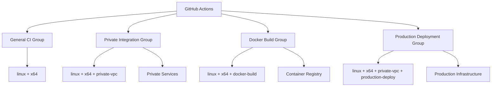

# 04- Runner Labels

## Overview

Runner labels are capability and selection metadata attached to GitHub Actions runners.

They allow workflows to request an execution environment based on characteristics rather than depending on a specific runner machine.

The basic relationship is:

```text
Workflow
    ↓
runs-on
    ↓
Required Labels
    ↓
Matching Runner
    ↓
Job Execution
```

For example:

```yaml
jobs:
  integration:
    runs-on:
      - self-hosted
      - linux
      - private-vpc
```

This tells GitHub that the job requires a runner matching all specified labels.

Runner labels are primarily a **scheduling mechanism**. They should not be treated as a complete security boundary. Security-sensitive access should additionally be enforced through runner groups, repository access policies, network controls, IAM, GitHub permissions, environments, and host hardening.

---

## Why Runner Labels Exist

Without labels, workflows would need to target individual runner identities:

```yaml
runs-on: runner-01
```

This creates tight coupling between application workflows and infrastructure.

If `runner-01` is replaced by `runner-07`, the workflow would need to change.

Labels remove that dependency:

```yaml
runs-on:
  - self-hosted
  - linux
  - docker
```

The workflow expresses:

> "I need a Linux self-hosted runner capable of running Docker."

It does not care which specific machine provides that capability.

---

## Labels as Capability Selectors

A useful mental model is:

```text
Workflow Requirement
        ↓
Capability Labels
        ↓
Eligible Runner Pool
        ↓
Available Runner
```

For example:

```text
Workflow
requires:
    self-hosted
    linux
    x64
    docker
```

Only a runner containing all required labels is eligible.

---

## Default `self-hosted` Label

Self-hosted runners have the `self-hosted` label.

A common workflow therefore begins with:

```yaml
runs-on:
  - self-hosted
  - linux
```

The `self-hosted` label distinguishes self-hosted infrastructure from GitHub-hosted runner labels.

Additional labels describe capabilities or workload requirements.

---

## Label Matching

When multiple labels are specified, the runner must satisfy all of them.

For example:

```yaml
runs-on:
  - self-hosted
  - linux
  - x64
  - docker
```

A runner with:

```text
self-hosted
linux
x64
docker
```

matches.

A runner with:

```text
self-hosted
linux
arm64
docker
```

does not match because:

```text
x64
```

is missing.

This makes labels effectively an AND-based capability selector.

---

## Example Runner Fleet

Consider:

```text
Runner A:
self-hosted
linux
x64
docker

Runner B:
self-hosted
linux
arm64
docker

Runner C:
self-hosted
linux
x64
private-vpc
docker

Runner D:
self-hosted
windows
x64
```

Workflows can select different capabilities:

```yaml
# Linux x64
runs-on:
  - self-hosted
  - linux
  - x64
```

```yaml
# Linux ARM64
runs-on:
  - self-hosted
  - linux
  - arm64
```

```yaml
# Private VPC
runs-on:
  - self-hosted
  - linux
  - private-vpc
```

```yaml
# Windows
runs-on:
  - self-hosted
  - windows
```

---

## Label Taxonomy

A production organization should define a consistent label taxonomy.

Useful dimensions include:

| Dimension | Example |
|---|---|
| Runner type | `self-hosted` |
| Operating system | `linux`, `windows` |
| Architecture | `x64`, `arm64` |
| Network | `private-vpc`, `public-egress` |
| Tooling | `docker`, `terraform`, `kubectl` |
| Hardware | `gpu` |
| Workload | `integration`, `deployment` |
| Environment | `production`, `staging` |

Not every dimension needs to become a label.

Labels should exist when they solve a real scheduling or infrastructure-selection requirement.

---

## Good Label Design

A good label is:

- Specific
- Stable
- Capability-oriented
- Easy to understand
- Consistently applied

Examples:

```text
linux
x64
docker
private-vpc
gpu
```

These describe characteristics that workflows can actually depend on.

---

## Poor Label Design

Avoid arbitrary labels such as:

```text
team-a
john-machine
fast-runner
important
best
secure
new
```

These labels either encode organizational information that belongs elsewhere or make subjective claims that are difficult to enforce.

For example:

```text
secure
```

does not make a runner secure.

Security must be enforced through actual controls.

---

## Labels vs Runner Groups

Labels and runner groups solve different problems.

| Feature | Labels | Runner Groups |
|---|---|---|
| Primary purpose | Capability selection | Access control |
| Select runner by capability | Yes | Indirectly |
| Restrict repositories | Not the primary mechanism | Yes |
| Describe OS | Yes | No |
| Describe architecture | Yes | No |
| Describe tooling | Yes | No |
| Security boundary | Limited | Stronger |
| Fleet organization | Useful | Useful |

A mature design uses both.

```text
Runner Group
    ↓
Controls who can use the runner pool

Labels
    ↓
Controls which capability is required
```

---

## Example: Production Deployment

A production deployment runner might have:

```text
self-hosted
linux
x64
production-deploy
private-vpc
```

A workflow can request:

```yaml
jobs:
  deploy:
    runs-on:
      - self-hosted
      - linux
      - production-deploy
      - private-vpc
```

The runner group should additionally restrict which repositories are allowed to use this pool.

---

## Labels Are Not Security Boundaries

This is a critical distinction.

Suppose a runner has:

```text
production
secure
private-vpc
```

A workflow selecting:

```yaml
runs-on:
  - self-hosted
  - production
```

does not become secure simply because the label says `secure`.

The actual security boundary depends on:

```text
Repository Access
+
Runner Groups
+
Workflow Permissions
+
Environment Protection
+
Network Controls
+
IAM
+
Host Security
```

---

## Environment Labels vs GitHub Environments

Do not confuse a label such as:

```text
production
```

with:

```yaml
environment: production
```

They represent different concepts.

### Runner Label

```yaml
runs-on:
  - self-hosted
  - production
```

Selects infrastructure.

### GitHub Environment

```yaml
environment: production
```

Associates the job with an environment that can provide:

- Environment secrets
- Required reviewers
- Deployment protection
- Deployment history
- Environment-specific controls

A production workflow may need both.

---

## Operating System Labels

Operating system labels are useful when workflow behavior depends on the host OS.

For example:

```yaml
runs-on:
  - self-hosted
  - linux
```

or:

```yaml
runs-on:
  - self-hosted
  - windows
```

Linux and Windows can differ in:

- Shell behavior
- File paths
- Package managers
- Available system tools
- Docker behavior
- Python installation
- Filesystem semantics

---

## Architecture Labels

CPU architecture should be explicit when required.

Examples:

```text
x64
arm64
```

This matters for:

- Docker builds
- Native Python dependencies
- Compilers
- Binary tooling
- Multi-platform artifacts

For example:

```yaml
strategy:
  matrix:
    arch:
      - x64
      - arm64

jobs:
  build:
    runs-on:
      - self-hosted
      - linux
      - ${{ matrix.arch }}
```

The runner fleet must have matching labels.

---

## Docker Labels

If a workflow requires Docker:

```yaml
runs-on:
  - self-hosted
  - linux
  - docker
```

The `docker` label should only be applied to runners where Docker is actually operational.

Validate:

```bash
docker version
```

and:

```bash
docker info
```

A label should describe an operational capability, not merely software that was installed once.

---

## Private Network Labels

A useful label for network-sensitive workloads is:

```text
private-vpc
```

For example:

```yaml
jobs:
  integration:
    runs-on:
      - self-hosted
      - linux
      - private-vpc
```

This can identify runners capable of reaching:

```text
PostgreSQL
Redis
Kafka
Internal APIs
Private AWS services
```

However, the label itself does not enforce network connectivity.

Actual access is determined by:

```text
Routing
+
Security Groups
+
Network ACLs
+
Firewall
+
DNS
```

---

## Tooling Labels

Specialized tooling can also be represented with labels.

Examples:

```text
terraform
kubectl
aws-cli
docker
```

For example:

```yaml
runs-on:
  - self-hosted
  - linux
  - terraform
```

This avoids requiring every runner to contain every possible tool.

---

## Specialized Hardware Labels

Special hardware is a natural use case for labels.

For example:

```text
gpu
```

A workflow can request:

```yaml
runs-on:
  - self-hosted
  - linux
  - gpu
```

The runner fleet might then contain:

```text
Standard Runners
GPU Runners
ARM Runners
High-Memory Runners
```

This is more scalable than hard-coding individual machine names.

---

## Workload Labels

Labels can identify workload capabilities when they are stable and operationally meaningful.

Examples:

```text
integration
deployment
docker-build
```

For example:

```yaml
runs-on:
  - self-hosted
  - linux
  - docker-build
```

Use workload labels carefully. If a label describes authorization rather than capability, runner groups and other access controls are usually more appropriate.

---

## Environment-Specific Labels

Some organizations use:

```text
staging
production
```

as labels.

This can be useful when runners are physically or logically isolated by environment.

For example:

```text
staging runner
    ↓
staging VPC

production runner
    ↓
production VPC
```

However, GitHub Environments should still be used for deployment protection and environment-specific secrets.

---

## Combining Labels

A workflow can combine multiple requirements:

```yaml
runs-on:
  - self-hosted
  - linux
  - x64
  - docker
  - private-vpc
```

This creates a precise execution requirement:

```text
Self-hosted
AND Linux
AND x64
AND Docker
AND Private VPC
```

The more labels required, the smaller the eligible runner pool becomes.

This creates an important capacity-planning consideration.

---

## Over-Specific Labels

Consider:

```yaml
runs-on:
  - self-hosted
  - linux
  - x64
  - docker
  - private-vpc
  - terraform
  - kubectl
  - staging
  - integration
```

This may work today but create unnecessary coupling.

If only one runner has all labels:

```text
Runner 01
```

then the workflow effectively depends on one machine.

A better design is to specify only capabilities that are genuinely required.

---

## Label Granularity

Use the minimum sufficient label set.

For example, if the job only needs:

```text
Linux
Docker
```

use:

```yaml
runs-on:
  - self-hosted
  - linux
  - docker
```

Do not add:

```text
private-vpc
production
terraform
gpu
```

unless the workload actually requires those capabilities.

---

## Labels and Capacity Planning

Labels affect scheduling capacity.

Suppose:

```text
Runner A
linux
docker

Runner B
linux
docker

Runner C
linux
```

A workflow requiring:

```text
linux + docker
```

has two possible runners.

A workflow requiring:

```text
linux + docker + private-vpc
```

may have zero.

Therefore, label design should be considered together with:

```text
Job Volume
+
Concurrency
+
Runner Capacity
+
Scaling
```

---

## Label Saturation

A common operational problem is a highly specific label becoming saturated.

Example:

```text
private-vpc
production
docker
terraform
```

with only one runner.

Then:

```text
10 jobs
   ↓
1 matching runner
   ↓
9 jobs queued
```

The workflow may appear slow even though the overall runner fleet has unused capacity.

---

## Scaling a Label Pool

If a workload frequently queues, scale the runner pool rather than simply increasing individual machine size.

For example:

```text
Before:

production-deploy
    └── Runner 1


After:

production-deploy
    ├── Runner 1
    ├── Runner 2
    └── Runner 3
```

This improves parallel execution while preserving the same workflow interface.

---

## Dynamic Runner Fleets

Ephemeral runners can be provisioned with the appropriate labels.

Conceptually:

```text
Job Queue
    ↓
Determine Required Labels
    ↓
Provision Runner
    ↓
Register Labels
    ↓
Execute Job
    ↓
Destroy Runner
```

This enables workload-specific capacity without maintaining a permanently oversized fleet.

---

## Labels and Autoscaling

Autoscaling should consider the label dimensions.

For example:

```text
linux + docker
```

may require one fleet, while:

```text
linux + gpu
```

requires another.

A generic autoscaler cannot always treat every runner as interchangeable.

Capacity planning should therefore be performed per important runner class.

---

## Matrix Testing with Labels

Labels work well with matrix strategies.

For example:

```yaml
jobs:
  test:
    strategy:
      matrix:
        arch:
          - x64
          - arm64

    runs-on:
      - self-hosted
      - linux
      - ${{ matrix.arch }}

    steps:
      - uses: actions/checkout@v4

      - name: Run tests
        run: pytest
```

This creates separate jobs targeting the corresponding architecture.

---

## Multiple Operating Systems

A matrix can similarly select OS-specific labels:

```yaml
strategy:
  matrix:
    os:
      - linux
      - windows

runs-on:
  - self-hosted
  - ${{ matrix.os }}
```

The runner fleet must contain matching labels.

This pattern is useful for compatibility testing when application behavior depends on the operating system.

---

## Python Compatibility Testing

A Python project may use:

```yaml
strategy:
  matrix:
    python:
      - "3.11"
      - "3.12"
      - "3.13"

runs-on:
  - self-hosted
  - linux
  - x64
```

Python versions can be managed by the runner image or setup tooling.

The label should describe the infrastructure capability, not each individual Python version unless separate runner images are intentionally maintained.

---

## Backend Integration Testing

A private integration runner can be selected using:

```yaml
runs-on:
  - self-hosted
  - linux
  - private-vpc
```

The job can then test:

```text
Django
    ↓
PostgreSQL
    +
Redis
    +
Internal API
```

The label expresses the networking requirement while the actual service access remains controlled by network security policies.

---

## Docker Build Runner

A dedicated Docker build pool might use:

```text
self-hosted
linux
x64
docker-build
```

A build workflow:

```yaml
jobs:
  build:
    runs-on:
      - self-hosted
      - linux
      - docker-build

    steps:
      - uses: actions/checkout@v4

      - name: Build image
        run: docker build -t orders:${GITHUB_SHA} .
```

The actual production implementation should also consider:

- Buildx
- Cache configuration
- Registry authentication
- SBOM
- Provenance
- Image scanning
- Resource limits

---

## Deployment Runner

A production deployment pool might use:

```text
self-hosted
linux
x64
production-deploy
private-vpc
```

A deployment job:

```yaml
jobs:
  deploy:
    runs-on:
      - self-hosted
      - linux
      - production-deploy
      - private-vpc

    environment: production

    permissions:
      contents: read
      id-token: write

    steps:
      - name: Deploy
        run: ./scripts/deploy.sh
```

Here:

```text
Labels
→ Select infrastructure

Environment
→ Protect deployment

Permissions
→ Restrict GitHub access

OIDC/IAM
→ Authorize AWS access
```

Each mechanism has a different responsibility.

---

## Labels and Reusable Workflows

Reusable workflows should avoid hard-coding organization-specific runner names.

A reusable workflow can accept a runner label or runner configuration as an input when appropriate.

For example:

```yaml
on:
  workflow_call:
    inputs:
      runner-label:
        required: false
        type: string
        default: ubuntu-latest
```

Then:

```yaml
jobs:
  test:
    runs-on: ${{ inputs.runner-label }}
```

For organization-wide reusable workflows, carefully control which runner values callers are allowed to select.

Allowing arbitrary caller-controlled runner selection can undermine isolation assumptions.

---

## Reusable Workflow Security

Suppose a reusable deployment workflow assumes:

```text
Production runner
```

If callers can freely override:

```text
runs-on
```

they may change where privileged operations execute.

A production reusable workflow should therefore treat runner selection as part of its security contract.

Possible approaches include:

- Fixed deployment runner labels
- Restricted runner groups
- Trusted repositories
- Explicit environment protection
- Controlled workflow inputs

---

## Labels and Custom Actions

Custom actions execute inside the job's selected runner.

Therefore:

```text
runs-on
   ↓
Runner
   ↓
Custom Action
```

A custom action does not escape the runner's security boundary.

If the runner has:

```text
Docker
AWS CLI
Private Network
```

the action executes within that environment and may potentially interact with those capabilities.

This is why third-party action trust is especially important on privileged runners.

---

## Labels and Container Jobs

A job can select a self-hosted runner and execute the job inside a container.

Conceptually:

```text
Self-Hosted Runner
        ↓
Containerized Job
        ↓
Workflow Steps
```

Example:

```yaml
jobs:
  test:
    runs-on:
      - self-hosted
      - linux
      - docker

    container:
      image: python:3.12-slim

    steps:
      - uses: actions/checkout@v4
      - run: pip install -r requirements.txt
      - run: pytest
```

The label identifies the underlying runner capability.

The `container` configuration defines the job execution environment.

---

## Labels and Service Containers

A private runner may be selected for integration testing:

```yaml
jobs:
  integration:
    runs-on:
      - self-hosted
      - linux
      - docker
      - private-vpc

    services:
      postgres:
        image: postgres:16
        env:
          POSTGRES_USER: test
          POSTGRES_PASSWORD: test
          POSTGRES_DB: app_test
```

This combines:

```text
Runner Capability
+
Container Runtime
+
Service Containers
```

The runner must support the required container functionality.

---

## Labels and Self-Hosted Security

Do not assume that a label such as:

```text
trusted
```

means a workflow is trusted.

The actual trust decision should be based on:

```text
Repository
+
Workflow Source
+
Event
+
Runner Group
+
Environment
+
Permissions
+
Network
```

This is particularly important for:

```text
pull_request
pull_request_target
forks
third-party actions
```

---

## Pull Requests and Runner Labels

A workflow triggered by:

```yaml
on:
  pull_request:
```

may execute code from a pull request.

Do not automatically route untrusted pull requests to:

```text
production
private-vpc
deployment
```

runner pools.

The runner label does not make untrusted code safe.

---

## `pull_request_target` and Labels

`pull_request_target` requires particular caution because the workflow can operate in a more privileged repository context.

The dangerous combination is:

```text
pull_request_target
+
checkout of untrusted code
+
privileged runner
+
secrets
+
private network
```

Runner labels should therefore be incorporated into the overall event-security design.

---

## Label Governance

Organizations should define:

- Allowed labels
- Naming conventions
- Ownership
- Creation process
- Retirement process
- Documentation
- Security implications

A simple policy might be:

```text
OS labels
Architecture labels
Capability labels
Network labels
Workload labels
```

Avoid uncontrolled label proliferation.

---

## Label Naming Convention

A consistent naming scheme makes runner selection easier to understand.

For example:

```text
self-hosted
linux
windows
x64
arm64
docker
private-vpc
gpu
docker-build
integration
production-deploy
```

Use lowercase names consistently unless there is a strong reason otherwise.

---

## Label Lifecycle

Labels should evolve with runner infrastructure.

When a capability is removed:

```text
Remove capability
    ↓
Update runner labels
    ↓
Validate workflows
```

When a runner is retired:

```text
Drain runner
    ↓
Remove runner
    ↓
Review label capacity
```

When a new runner capability is introduced:

```text
Provision
    ↓
Validate
    ↓
Apply label
    ↓
Add to appropriate group
    ↓
Test
```

---

## Detecting Incorrect Labels

A label is incorrect when the runner does not actually satisfy the capability it advertises.

Example:

```text
Runner:
docker
```

but:

```bash
docker info
```

fails.

The runner should not retain the `docker` capability label until the problem is corrected.

Otherwise jobs may be scheduled successfully and fail later.

---

## Labels and Infrastructure Drift

Consider:

```text
Runner Image
  Docker 27
  Python 3.12
  AWS CLI

Manual Change
  Docker removed
```

If the runner still has:

```text
docker
```

the label is now stale.

This creates a scheduling correctness problem.

Runner configuration and labels should therefore be managed together.

---

## Label Validation

A provisioning process can validate required capabilities before registering a runner.

Conceptually:

```bash
command -v docker
command -v aws
python --version
docker version
aws --version
```

Only after validation should the runner receive the corresponding labels.

This makes labels assertions about tested capabilities rather than assumptions.

---

## Labels and Immutable Runner Images

An immutable runner image makes label management easier.

Example:

```text
runner-image-v12
    ├── Linux
    ├── x64
    ├── Docker
    └── AWS CLI
```

Every runner created from that image can consistently receive:

```text
linux
x64
docker
aws-cli
```

If the image changes materially, rebuild and validate rather than manually changing individual machines.

---

## Labels and Runner Autoscaling

Autoscaling systems should provision runners according to label demand.

For example:

```text
Queue:
docker-build
docker-build
docker-build
```

The scaling system can provision additional:

```text
docker-build
```

runners.

Similarly:

```text
gpu
```

jobs should trigger capacity from the GPU runner pool rather than ordinary CI infrastructure.

---

## Labels and Cost Optimization

Specialized labels can help control infrastructure cost.

For example:

```text
standard
```

runners can handle normal jobs while:

```text
high-memory
gpu
```

runners are used only when necessary.

This prevents expensive infrastructure from becoming the default execution environment.

---

## Labels and High Availability

Critical runner labels should normally have multiple matching runners.

For example:

```text
production-deploy
    ├── Runner 1
    ├── Runner 2
    └── Runner 3
```

A label backed by one host creates a hidden single point of failure.

The workflow may be highly available at the application level while the deployment system remains dependent on one runner.

---

## Labels and Failure Domains

Runner pools should consider:

```text
Availability Zone
Region
Network Zone
Host Type
```

For critical systems, multiple matching runners can reduce dependency on a single infrastructure failure.

The exact topology depends on workload and deployment architecture.

---

## Label Troubleshooting

Use the following model:

```text
Symptom
   ↓
Possible Causes
   ↓
Isolation Strategy
   ↓
Commands / Checks
   ↓
Root Cause
   ↓
Corrective Action
   ↓
Prevention
```

---

## Job Remains Queued

### Symptom

A job remains queued waiting for a runner.

### Possible Causes

- No matching runner
- Incorrect label
- Runner offline
- Runner group restriction
- Repository not authorized
- All matching runners are busy
- Concurrency limit

### Isolation

Inspect:

```text
runs-on
Runner Labels
Runner Group
Repository Access
Runner Status
Concurrency
```

The first thing to verify is whether any runner satisfies **all** requested labels.

---

## Job Cannot Find a Matching Runner

Suppose:

```yaml
runs-on:
  - self-hosted
  - linux
  - x64
  - private-vpc
```

but the fleet contains:

```text
Runner 1:
self-hosted
linux
x64

Runner 2:
self-hosted
linux
private-vpc
```

Neither runner matches.

The workflow requires a single runner with:

```text
self-hosted
+
linux
+
x64
+
private-vpc
```

The solution is to either provision an appropriate runner or remove an unnecessary requirement.

---

## Runner Has the Label but Job Still Does Not Run

Possible causes include:

- Runner offline
- Runner busy
- Runner group restrictions
- Repository access restrictions
- Workflow concurrency
- Runner disabled
- Label mismatch due to spelling/case differences

Verify both:

```text
Runner metadata
```

and:

```text
Workflow configuration
```

Do not assume that seeing a label is sufficient to prove job eligibility.

---

## Label Causes Excessive Queueing

If a workflow is slow because jobs wait for a narrow label pool:

```text
Queue
 ↓
1 matching runner
```

measure:

```text
Queue Time
Job Duration
Runner Utilization
Label Demand
```

Then determine whether to:

- Add runners
- Broaden labels
- Split workloads
- Improve autoscaling
- Reduce matrix cardinality
- Optimize job duration

---

## Label Removed from Runner

If a runner loses a required label:

```text
Workflow
 ↓
No Matching Runner
 ↓
Queued
```

This can happen during infrastructure updates.

The solution is to ensure runner image/configuration and label configuration are managed as one lifecycle.

---

## Label Points to Wrong Capability

A runner may technically match the workflow but fail during execution.

Example:

```text
Label:
docker
```

Actual state:

```text
Docker daemon unavailable
```

This indicates a label integrity problem.

Fix the runner capability or remove the label until the capability is restored.

---

## Production Runner Label Architecture

A practical fleet might look like:

```text
General CI
├── self-hosted
├── linux
└── x64

Private Integration
├── self-hosted
├── linux
├── x64
└── private-vpc

Docker Build
├── self-hosted
├── linux
├── x64
└── docker-build

Production Deployment
├── self-hosted
├── linux
├── x64
├── private-vpc
└── production-deploy
```

The corresponding runner groups provide access control while labels provide capability selection.

---

## Reference Architecture



This separates:

```text
Access Control
```

from:

```text
Capability Selection
```

---

## Production Example

A Python backend might use three runner classes.

### Unit Testing

```yaml
runs-on:
  - self-hosted
  - linux
  - x64
```

### Integration Testing

```yaml
runs-on:
  - self-hosted
  - linux
  - x64
  - private-vpc
```

### Production Deployment

```yaml
runs-on:
  - self-hosted
  - linux
  - x64
  - private-vpc
  - production-deploy
```

The workflow requirements become increasingly specific as the job's infrastructure and trust requirements increase.

---

## Runner Labels and Build Once, Deploy Many

Runner labels should not determine which artifact gets deployed.

The pipeline should maintain artifact identity independently:

```text
CI Runner
    ↓
Build Image
    ↓
ECR
    ↓
Image Digest
    ↓
Staging
    ↓
Approval
    ↓
Production Runner
    ↓
Same Image Digest
```

The production runner provides the deployment capability; it should not rebuild the application.

---

## Labels and Deployment Concurrency

Labels identify the deployment infrastructure, while concurrency protects the deployment process.

For example:

```yaml
jobs:
  deploy:
    runs-on:
      - self-hosted
      - linux
      - production-deploy

    concurrency:
      group: production-deployment
      cancel-in-progress: false
```

This addresses two different problems:

```text
Label
→ Where can the deployment run?

Concurrency
→ Can multiple deployments run simultaneously?
```

---

## Labels and GitHub Environments

A mature production deployment can combine all three:

```yaml
jobs:
  deploy:
    runs-on:
      - self-hosted
      - linux
      - production-deploy

    environment:
      name: production

    concurrency:
      group: production-deployment
      cancel-in-progress: false

    permissions:
      contents: read
      id-token: write
```

The responsibilities are:

| Mechanism | Responsibility |
|---|---|
| Labels | Select infrastructure |
| Runner group | Restrict runner access |
| Environment | Protect deployment |
| Permissions | Limit GitHub capabilities |
| OIDC/IAM | Authorize AWS access |
| Concurrency | Prevent deployment races |

---

## Governance

Organizations should define a controlled label policy.

### Ownership

Each label category should have an owner.

### Naming

Use consistent names.

### Creation

New labels should have a documented purpose.

### Validation

Labels should correspond to tested capabilities.

### Retirement

Unused labels should be removed.

### Monitoring

Track queueing and utilization by runner class.

---

## Label Governance Policy Example

A practical policy could define:

```text
OS:
linux
windows

Architecture:
x64
arm64

Capabilities:
docker
terraform
kubectl
gpu

Network:
private-vpc

Workload:
integration
docker-build
production-deploy
```

Avoid arbitrary labels outside these categories unless a documented requirement exists.

---

## Security Checklist

- [ ] Labels are not treated as the primary security boundary.
- [ ] Sensitive runner groups restrict repository access.
- [ ] Production labels are backed by protected runner groups.
- [ ] Untrusted PRs cannot use privileged runner pools.
- [ ] Private-network labels correspond to actual network controls.
- [ ] Deployment labels do not grant authorization by themselves.
- [ ] Docker-capable runners are isolated where necessary.
- [ ] Specialized runners do not expose unnecessary credentials.
- [ ] Runner capabilities are validated before labels are assigned.
- [ ] Stale labels are removed during runner replacement.

---

## Operational Checklist

- [ ] Label taxonomy is documented.
- [ ] Naming conventions are consistent.
- [ ] Runner groups and labels have clear responsibilities.
- [ ] Every important label has sufficient capacity.
- [ ] Queue time is monitored.
- [ ] Runner utilization is monitored.
- [ ] Label changes are version-controlled or otherwise auditable.
- [ ] Runner images and labels are managed together.
- [ ] Specialized runner pools can scale independently.
- [ ] Critical labels have multiple matching runners.

---

## Common Mistakes

### Treating Labels as Security Controls

Labels only influence runner selection.

Use runner groups, repository access, environments, network controls, IAM, and permissions for security.

### Using Runner Names Instead of Capabilities

Hard-coding:

```yaml
runs-on: runner-01
```

creates unnecessary infrastructure coupling.

### Creating Too Many Labels

Excessive labels make workflows difficult to understand and reduce scheduling flexibility.

### Creating Over-Specific Combinations

Requiring six or seven labels may unintentionally reduce the runner pool to one machine.

### Forgetting Capacity

A label backed by one runner becomes a queue bottleneck.

### Keeping Stale Labels

A runner can claim a capability it no longer supports.

### Using `production` Labels as Deployment Protection

Use GitHub Environments and approval controls for deployment protection.

### Allowing Arbitrary Runner Selection in Privileged Reusable Workflows

This can undermine the intended security architecture.

---

## Interview Scenarios

### Why Use Labels Instead of Runner Names?

Because labels express capabilities while allowing the underlying runner fleet to change, scale, or be replaced without changing workflows.

---

### Are Labels a Security Boundary?

No.

They are primarily a scheduling mechanism. Security must be enforced through access controls, runner groups, permissions, environments, network controls, IAM, and host security.

---

### A Job Is Permanently Queued. What Do You Check?

Check:

```text
runs-on
Runner labels
Runner status
Runner group
Repository access
Concurrency
```

Then determine whether at least one online runner satisfies every requested label.

---

### Why Does a Highly Specific Label Cause Queueing?

Because it reduces the eligible runner pool.

For example:

```text
linux
+
x64
+
private-vpc
+
docker
+
production
```

may identify only one machine.

---

### How Would You Design Labels for a Large Organization?

Separate labels into meaningful dimensions:

```text
OS
Architecture
Network
Tooling
Hardware
Workload
```

Use runner groups for access control and avoid arbitrary or security-claim labels.

---

### How Would You Protect a Production Runner?

Use:

```text
Restricted Runner Group
+
Repository Access
+
Capability Labels
+
Private Network Controls
+
Least-Privilege IAM
+
Environment Protection
+
OIDC
+
Deployment Concurrency
```

The label itself is not the protection mechanism.

---

### How Would You Scale Docker Build Runners?

Create a dedicated runner class:

```text
self-hosted
linux
x64
docker-build
```

Then scale that pool independently based on queue depth and utilization.

---

### How Would You Support ARM and x64?

Use architecture labels:

```text
x64
arm64
```

and select them through a matrix:

```yaml
strategy:
  matrix:
    arch:
      - x64
      - arm64

runs-on:
  - self-hosted
  - linux
  - ${{ matrix.arch }}
```

---

## Senior Design Principles

### Labels Should Describe Reality

A label should represent a capability that has been validated.

### Labels Should Be Stable

Workflows should not need constant modification because individual machines change.

### Access and Capability Are Different

Runner groups answer:

```text
Who may use this runner pool?
```

Labels answer:

```text
Which capabilities does the job require?
```

### Use the Minimum Required Labels

Over-specification reduces capacity and increases coupling.

### Specialized Capabilities Deserve Dedicated Pools

GPU, private-network, production deployment, and high-performance Docker builds may require separate runner classes.

### Label Design Is an Infrastructure Design Problem

It affects:

```text
Scheduling
Capacity
Cost
Availability
Security
Scalability
Operations
```

### Protect Privileged Runners From Untrusted Workloads

A private-network or production runner should never become the default execution environment for arbitrary pull-request code.

---

## Key Takeaways

- Runner labels are capability selectors that allow workflows to target suitable infrastructure without hard-coding individual runner names.
- Labels and runner groups serve different purposes: labels describe execution capabilities, while runner groups provide access-control boundaries.
- Use the minimum set of meaningful labels required by a workload; overly specific combinations can create queue bottlenecks and hidden single points of failure.
- Never treat labels such as `production`, `private-vpc`, or `secure` as security controls; enforce security through repository access, environments, permissions, IAM, network controls, and host isolation.
- In production, manage labels as part of the runner lifecycle, validate that advertised capabilities are real, monitor capacity by runner class, and scale specialized label pools independently.