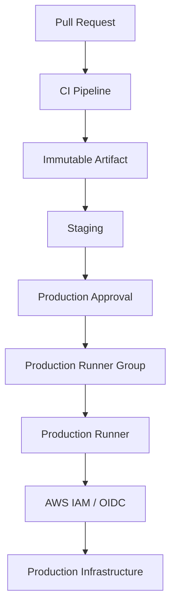
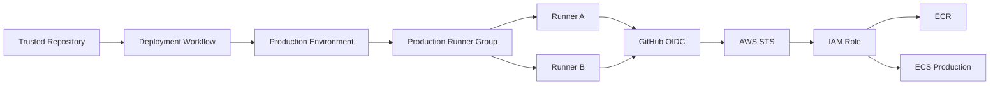

# 05- Runner Groups

## Overview

Runner groups provide an access-control layer for GitHub Actions self-hosted runners.

While runner labels answer:

> Which runner has the capabilities required by this job?

runner groups answer:

> Which repositories or workflows are allowed to use this runner pool?

This distinction is fundamental for production CI/CD.

A typical self-hosted architecture is:

```text
GitHub Actions Workflow
        |
        v
Runner Group
        |
        |-- Access Control
        |
        v
Runner Labels
        |
        |-- Capability Selection
        |
        v
Eligible Runner
        |
        v
Job Execution
```

Runner groups are especially useful for separating:

- General CI runners
- Private-network runners
- Production deployment runners
- Security-sensitive runners
- Specialized hardware runners
- Organization-specific infrastructure
- Enterprise-managed runner pools

Runner groups should be combined with repository permissions, workflow permissions, environments, network controls, IAM, and runner hardening. A runner group is an access-control mechanism, not a complete security boundary.

---

## Why Runner Groups Exist

A large organization may have many self-hosted runners:

```text
Runner Fleet
├── General Linux CI
├── Windows CI
├── Private VPC
├── Docker Build
├── GPU
├── Staging Deployment
└── Production Deployment
```

Not every repository should be able to execute jobs on every runner.

For example:

```text
Public Application Repository
        |
        X
        |
Production Deployment Runner
```

A production runner may have access to:

- Private AWS resources
- Production databases
- Internal APIs
- Deployment credentials
- Kubernetes clusters
- Container registries

Allowing arbitrary repositories to use that runner would increase the blast radius of a compromised workflow.

Runner groups allow administrators to define controlled pools.

---

## Runner Groups vs Runner Labels

These concepts should always be separated.

| Concept | Runner Groups | Runner Labels |
|---|---|---|
| Primary purpose | Access control | Capability selection |
| Determines who can use runners | Yes | No |
| Describes OS | No | Yes |
| Describes architecture | No | Yes |
| Describes tooling | No | Yes |
| Supports repository restrictions | Yes | No |
| Useful for private infrastructure | Yes | Yes |
| Security boundary | Access-control layer | Not sufficient |
| Example | `production-deployment` | `linux`, `x64`, `docker` |

A production deployment job might therefore require:

```text
Runner Group:
production-deployment
```

and:

```text
Labels:
self-hosted
linux
x64
private-vpc
```

The group controls access while the labels select the required capabilities.

---

## Runner Group Mental Model

Think of a runner group as a controlled pool:

```text
Runner Group
    |
    +-- Runner 1
    +-- Runner 2
    +-- Runner 3
```

Each runner can have multiple labels:

```text
Runner 1
├── self-hosted
├── linux
├── x64
└── private-vpc

Runner 2
├── self-hosted
├── linux
├── x64
└── private-vpc
```

The group controls which repositories can target this pool.

The labels control which runner within the pool is eligible.

---

## Organization Runner Groups

At the organization level, runner groups can be used to centralize runner governance.

A typical organization might have:

```text
Organization
│
├── General CI Group
├── Private Integration Group
├── Docker Build Group
└── Production Deployment Group
```

This allows common infrastructure to be shared while maintaining access boundaries.

---

## Enterprise Runner Groups

Large GitHub Enterprise environments may need organization-wide governance.

An enterprise can establish policies around runner usage and groups while individual organizations consume approved runner infrastructure.

A useful conceptual hierarchy is:

```text
Enterprise
    |
    +-- Organization A
    |      |
    |      +-- Runner Groups
    |
    +-- Organization B
    |      |
    |      +-- Runner Groups
    |
    +-- Organization C
           |
           +-- Runner Groups
```

The exact administrative capabilities depend on the GitHub plan and enterprise configuration.

---

## Repository Access

A runner group can be restricted to selected repositories.

For example:

```text
Production Deployment Group
    |
    +-- orders-api
    +-- payments-api
    +-- customer-api
```

Other repositories should not automatically gain access to the group.

This is particularly important when runners have access to sensitive infrastructure.

---

## Repository Access as a Security Boundary

Consider two repositories:

```text
public-demo
internal-payment-service
```

A production deployment runner may have:

```text
AWS IAM access
Private VPC access
ECR access
Kubernetes access
```

If both repositories can use the same runner group, a compromised workflow in `public-demo` could potentially interact with those capabilities.

Runner groups therefore help establish:

```text
Repository
    ↓
Allowed Runner Group
    ↓
Allowed Infrastructure
```

This is one of their most important production uses.

---

## Workflow Access to Runner Groups

Access is not simply:

```text
Repository → Runner Group
```

The workflow still needs to request an appropriate runner.

For example:

```yaml
jobs:
  deploy:
    runs-on:
      - self-hosted
      - linux
      - production-deploy
```

The repository must be permitted to use the relevant runner group, and an eligible runner must exist.

---

## Combining Groups and Labels

A production deployment architecture can look like:

```text
Repository
    |
    v
Production Runner Group
    |
    +--------------------+
    |                    |
    v                    v
Runner A              Runner B
linux                 linux
x64                   x64
private-vpc           private-vpc
production-deploy     production-deploy
```

The workflow specifies the labels:

```yaml
runs-on:
  - self-hosted
  - linux
  - x64
  - production-deploy
```

The runner group controls whether the repository is allowed to use the underlying pool.

---

## Default Runner Groups

GitHub environments may include default runner group arrangements depending on repository and organization configuration.

Do not assume that every self-hosted runner belongs to a custom security boundary simply because it has a useful label.

For production systems, explicitly design:

```text
Runner Group
+
Repository Access
+
Labels
```

rather than relying on naming conventions alone.

---

## Designing Runner Groups

A runner group should normally represent a meaningful security or operational boundary.

Good examples:

```text
General-CI
Private-Integration
Docker-Build
Staging-Deployment
Production-Deployment
```

Poor examples:

```text
Team-A
Team-B
Johns-Runners
Fast-Runners
Important
```

The latter often encode organizational information without clearly expressing a security or infrastructure boundary.

---

## General CI Group

A general CI group can support normal workloads:

```text
General-CI
```

Example labels:

```text
self-hosted
linux
x64
docker
```

Typical workloads include:

- Linting
- Unit tests
- Package builds
- Static analysis
- Test matrices
- Documentation builds

These runners should normally have minimal access to production infrastructure.

---

## Private Integration Group

Integration tests may require access to private services:

```text
Private-Integration
```

Possible labels:

```text
self-hosted
linux
x64
private-vpc
```

Typical dependencies:

```text
PostgreSQL
Redis
Kafka
Internal REST APIs
Internal gRPC services
```

Network access should be enforced through actual infrastructure controls.

The group itself should not be considered proof of network isolation.

---

## Docker Build Group

A dedicated Docker build pool can be useful when builds require:

- Docker
- Buildx
- High CPU
- Large memory
- Registry connectivity
- Build cache
- Specialized storage

Example:

```text
Docker-Build
```

Labels:

```text
self-hosted
linux
x64
docker-build
```

This allows build capacity to scale independently from test capacity.

---

## Staging Deployment Group

A staging deployment group can provide access to staging infrastructure:

```text
Staging-Deployment
```

Possible labels:

```text
self-hosted
linux
x64
private-vpc
staging-deploy
```

The group can be restricted to repositories that own staging services.

---

## Production Deployment Group

Production deployment runners should normally have the strongest restrictions.

Example:

```text
Production-Deployment
```

Possible labels:

```text
self-hosted
linux
x64
private-vpc
production-deploy
```

Access should be limited to trusted repositories and controlled workflows.

Additional controls should include:

- GitHub Environments
- Required reviewers
- Least-privilege permissions
- OIDC
- IAM
- Network restrictions
- Deployment concurrency
- Immutable artifacts
- Runner hardening
- Monitoring

---

## Production Deployment Architecture



The runner group is one layer in the deployment security model.

---

## Runner Groups and GitHub Environments

Runner groups and environments solve different problems.

```yaml
jobs:
  deploy:
    runs-on:
      - self-hosted
      - linux
      - production-deploy

    environment:
      name: production
```

The relationship is:

| Control | Purpose |
|---|---|
| Runner group | Who may use the runner pool |
| Runner labels | What infrastructure is required |
| Environment | Deployment protection and environment configuration |
| Required reviewers | Human approval |
| `permissions` | GitHub token capabilities |
| OIDC/IAM | Cloud authorization |
| Network controls | Infrastructure access |

Production systems should use these controls together rather than attempting to make one mechanism do everything.

---

## Runner Groups and Secrets

Runner groups do not directly replace secret management.

A workflow may have access to:

```text
Repository Secrets
Organization Secrets
Environment Secrets
```

A production runner can also potentially access credentials available through:

```text
Environment
AWS Instance Role
Filesystem
Docker
Cloud Metadata
```

Therefore, granting access to a privileged runner should be treated as granting access to a powerful execution environment.

---

## Runner Groups and OIDC

A production deployment runner may authenticate to AWS using GitHub OIDC:

```text
GitHub Actions
      |
      | OIDC Token
      v
AWS STS
      |
      | AssumeRoleWithWebIdentity
      v
IAM Role
      |
      v
AWS Services
```

The runner group can restrict which repositories are allowed to execute deployment jobs.

IAM trust policies should independently restrict the GitHub identity that can assume the role.

This creates layered controls:

```text
Runner Group
+
GitHub Environment
+
OIDC
+
IAM Trust Policy
+
IAM Permissions
```

---

## Runner Groups and AWS

Consider a production deployment:

```text
GitHub Repository
       |
       v
Production Runner Group
       |
       v
Private VPC Runner
       |
       v
GitHub OIDC
       |
       v
AWS STS
       |
       v
IAM Role
       |
       +--> ECR
       +--> ECS
       +--> EC2
       +--> S3
```

The runner group limits which repositories can reach the deployment execution environment.

AWS IAM must still enforce the actual cloud authorization.

---

## Runner Groups and Private Networks

A private-network runner may be able to reach:

```text
10.0.0.0/8
```

or internal DNS zones.

A repository that gains access to that runner may therefore gain the ability to execute code inside that network boundary.

This is why private-network runner groups should be treated as privileged infrastructure.

---

## Private Network Architecture

```text
GitHub
   |
   v
Private Runner Group
   |
   v
Self-Hosted Runner
   |
   +----> PostgreSQL
   |
   +----> Redis
   |
   +----> Kafka
   |
   +----> Internal APIs
   |
   +----> AWS Private Services
```

Network-level controls should still restrict exactly which destinations and ports are reachable.

---

## Runner Groups and Untrusted Pull Requests

One of the most important security rules is:

> Do not expose privileged self-hosted runner pools to untrusted code without a deliberate security model.

Potentially dangerous combinations include:

```text
Fork Pull Request
+
Privileged Self-Hosted Runner
+
Private Network
```

or:

```text
pull_request_target
+
Checkout of Untrusted Code
+
Production Runner
```

The risk comes from code execution, not from the label itself.

---

## `pull_request` and Runner Groups

For ordinary pull requests:

```yaml
on:
  pull_request:
```

the workflow may execute code from the proposed change.

For security-sensitive runner groups, determine whether the workflow should be permitted to access the group at all.

General CI can often use:

```text
General-CI
```

while privileged deployment infrastructure remains isolated.

---

## `pull_request_target` and Runner Groups

`pull_request_target` executes with the context of the base repository and therefore requires particular caution.

A dangerous pattern is:

```yaml
on:
  pull_request_target:

jobs:
  test:
    runs-on:
      - self-hosted
      - private-vpc

    steps:
      - uses: actions/checkout@v4
      - run: ./untrusted-script.sh
```

The security problem is the combination of:

```text
Privileged workflow context
+
Untrusted code
+
Privileged runner
```

Runner groups should be designed to reduce the consequences of such mistakes.

---

## Runner Groups and Third-Party Actions

A third-party action running on a privileged runner inherits the runner's execution environment.

For example:

```text
Production Runner
    |
    +-- AWS CLI
    +-- Docker
    +-- Private Network
    +-- Deployment Tooling
```

A workflow using:

```yaml
- uses: some-third-party/action@...
```

should therefore be treated carefully.

Use:

- Trusted action sources
- SHA pinning
- Minimal permissions
- Restricted runner groups
- Environment protection
- Limited secrets
- Network controls

---

## Runner Groups and Action Pinning

A privileged runner should not be paired casually with mutable third-party action references.

Prefer a verified immutable reference where appropriate:

```yaml
- uses: actions/checkout@<verified-commit-sha>
```

The exact SHA should be maintained through the organization's action update process.

The security model is:

```text
Trusted Repository
+
Trusted Workflow
+
Trusted Actions
+
Restricted Runner Group
+
Least Privilege
```

---

## Runner Groups and Permissions

Runner groups do not replace:

```yaml
permissions:
```

A production job should still use least privilege.

Example:

```yaml
permissions:
  contents: read
  id-token: write
```

If the job does not need:

```text
issues
pull-requests
actions
packages
```

do not grant unnecessary access.

---

## Runner Groups and Concurrency

Runner groups determine where jobs can execute.

Concurrency determines whether jobs can execute simultaneously.

Example:

```yaml
jobs:
  deploy:
    runs-on:
      - self-hosted
      - linux
      - production-deploy

    concurrency:
      group: production-deployment
      cancel-in-progress: false
```

This prevents two deployment jobs from racing against the same production environment.

---

## Runner Groups and Immutable Artifacts

Production runner groups should preferably deploy immutable artifacts.

A secure promotion flow is:

```text
Build
  ↓
Docker Image
  ↓
Immutable Digest
  ↓
ECR
  ↓
Staging
  ↓
Approval
  ↓
Production Runner Group
  ↓
Same Digest
```

The production runner should not rebuild the application.

---

## Runner Groups and Build Once, Deploy Many

Runner groups should not change artifact identity.

For example:

```text
CI Runner Group
    ↓
Build image
    ↓
sha256:abc123
    ↓
Staging
    ↓
Production Runner Group
    ↓
sha256:abc123
```

The runner class changes.

The artifact does not.

This improves:

- Reproducibility
- Auditability
- Rollback
- Security
- Deployment consistency

---

## Runner Group Capacity

A group with too few runners can become a deployment bottleneck.

For example:

```text
Production-Deployment
    └── Runner 1
```

If five deployment jobs arrive:

```text
Job 1 → Running
Job 2 → Queued
Job 3 → Queued
Job 4 → Queued
Job 5 → Queued
```

The problem may be capacity rather than workflow performance.

---

## Scaling Runner Groups

Add runners with equivalent capabilities:

```text
Production-Deployment
├── Runner 1
├── Runner 2
└── Runner 3
```

All runners should satisfy the same operational contract.

For example:

```text
linux
x64
private-vpc
production-deploy
```

If the runners differ materially, represent those differences with labels or separate groups.

---

## Specialized Runner Groups

Different requirements should normally map to different pools.

| Runner Group | Typical Purpose |
|---|---|
| `General-CI` | Linting and unit tests |
| `Private-Integration` | Internal service integration tests |
| `Docker-Build` | Container builds |
| `Staging-Deployment` | Staging deployment |
| `Production-Deployment` | Production deployment |
| `GPU-CI` | GPU workloads |

The exact taxonomy should reflect the organization's security and infrastructure boundaries.

---

## Runner Groups and Autoscaling

An autoscaled runner architecture may look like:

```text
Queued Job
    ↓
Runner Group
    ↓
Determine Required Labels
    ↓
Autoscaler
    ↓
Provision Runner
    ↓
Register Runner
    ↓
Execute Job
    ↓
Remove Runner
```

The group defines the permitted pool while labels define the required capabilities.

---

## Ephemeral Runners

Ephemeral runners are especially useful for sensitive groups.

Example:

```text
Production Deployment Group
        |
        v
Ephemeral Runner
        |
        v
Deployment
        |
        v
Runner Destroyed
```

Benefits include:

- Reduced persistent state
- Lower cross-job contamination risk
- Easier cleanup
- Better isolation
- Easier image-based lifecycle management

They also introduce provisioning latency and operational complexity.

---

## Persistent Runners

Persistent runners can be appropriate for:

- Expensive initialization
- Specialized hardware
- Stateful tooling
- High-frequency workloads
- Systems where startup time is significant

However, persistent runners require strong cleanup and hardening.

Potential residual state includes:

```text
Workspace
Environment Variables
Credentials
Docker Images
Docker Volumes
Caches
Temporary Files
Build Artifacts
```

---

## Runner Group Security Model

A privileged runner group should be designed as a layered security boundary:

```text
Repository Access
       ↓
Runner Group
       ↓
Runner
       ↓
Host Security
       ↓
Network Controls
       ↓
Cloud IAM
       ↓
Target Infrastructure
```

Each layer should enforce a separate security property.

---

## Blast Radius

Runner group design directly affects blast radius.

Suppose:

```text
100 repositories
        |
        v
Production Runner Group
```

A compromised workflow in any permitted repository may potentially affect production infrastructure.

A more controlled design might be:

```text
Production Runner Group
        |
        +-- orders-api
        +-- payments-api
```

The number of repositories with access should be minimized.

---

## Repository Segmentation

Large organizations should consider separate groups when services have different trust boundaries.

For example:

```text
Production-Platform
Production-Payments
Production-Internal
```

This can reduce blast radius compared with one universal production runner pool.

The trade-off is higher operational complexity.

---

## Runner Group vs Separate Runner Fleet

A runner group can organize runners logically, but infrastructure isolation may still require separate machines, accounts, VPCs, or clusters.

For example:

```text
Group:
Production-Deployment

Runners:
EC2-A
EC2-B
EC2-C
```

The group does not imply that these machines are isolated from one another.

If stronger isolation is required, use infrastructure boundaries as well.

---

## Governance

Runner groups should have clear ownership.

For each group define:

- Purpose
- Owner
- Allowed repositories
- Labels
- Network access
- Cloud permissions
- Secrets access
- Scaling model
- Lifecycle
- Monitoring
- Incident response procedure

A production group without an owner becomes difficult to operate safely.

---

## Naming Convention

Use names that describe the security or operational boundary.

Good:

```text
General-CI
Private-Integration
Docker-Build
Staging-Deployment
Production-Deployment
```

Avoid:

```text
Group1
FastRunners
MyRunners
Special
Important
```

Names should communicate intent to operators reviewing a workflow.

---

## Group Ownership

A useful ownership model is:

```text
Platform Team
    ↓
Runner Infrastructure
    ↓
Runner Groups

Application Teams
    ↓
Workflow Configuration
```

The platform team can control privileged infrastructure while application teams consume approved runner pools.

---

## Group Lifecycle

Runner groups should follow an explicit lifecycle.

```text
Design
  ↓
Create Group
  ↓
Add Runners
  ↓
Configure Repository Access
  ↓
Validate Labels
  ↓
Deploy Workloads
  ↓
Monitor
  ↓
Scale
  ↓
Rotate / Replace
  ↓
Retire
```

---

## Runner Group Auditing

Regularly review:

```text
Repositories with access
Runners in group
Runner labels
Network access
IAM permissions
Workflow usage
Third-party actions
Secret exposure
Queue time
Failure rate
```

The most important security question is:

> Which repositories can execute code on this runner group?

---

## Monitoring

Monitor runner groups for:

- Queue time
- Job duration
- Runner utilization
- Offline runners
- Failed jobs
- Registration failures
- Capacity exhaustion
- Autoscaling latency
- Deployment frequency
- Deployment failures

Group-level monitoring helps distinguish workflow problems from infrastructure problems.

---

## Capacity Metrics

Useful metrics include:

```text
Queue Time
Runner Utilization
Busy Runners
Idle Runners
Jobs per Runner
Provisioning Time
Job Failure Rate
```

For example:

```text
High Queue Time
+
Low Runner Utilization
```

may indicate label mismatch or scheduling constraints.

While:

```text
High Queue Time
+
High Runner Utilization
```

usually indicates insufficient capacity.

---

## Cost Considerations

Separate runner groups can improve cost allocation.

For example:

```text
General CI
→ Standard instances

Docker Build
→ CPU-optimized instances

GPU CI
→ GPU instances

Production Deployment
→ Small controlled fleet
```

Specialized infrastructure should not automatically become the default for every job.

---

## High Availability

Critical runner groups should avoid a single runner dependency.

Instead of:

```text
Production Group
    └── Runner 1
```

prefer:

```text
Production Group
    ├── Runner 1
    ├── Runner 2
    └── Runner 3
```

Where appropriate, distribute runners across independent failure domains.

---

## Disaster Recovery

Runner groups should be reproducible.

Maintain:

- Runner image definition
- Bootstrap scripts
- Registration process
- Labels
- Group configuration
- Network configuration
- IAM configuration
- Monitoring configuration

If all runners disappear, the platform should be able to recreate the fleet.

---

## Infrastructure as Code

Where supported by the organization's tooling, manage surrounding infrastructure as code.

Example architecture:

```text
Terraform
   |
   +-- VPC
   +-- Security Groups
   +-- EC2
   +-- IAM
   +-- Monitoring
   +-- Autoscaling
```

GitHub runner registration and group configuration may involve GitHub administration APIs or CLI automation in addition to infrastructure provisioning.

Keep the responsibilities clear:

```text
Cloud IaC
→ Infrastructure

GitHub Configuration
→ Runner Registration / Groups / Repository Access
```

---

## Troubleshooting Runner Groups

Use the standard failure-domain model:

```text
Symptom
→ Possible Causes
→ Isolation Strategy
→ Commands / Checks
→ Root Cause
→ Corrective Action
→ Prevention
```

---

## Repository Cannot Use Runner Group

### Symptom

A job cannot execute on a runner group.

### Possible Causes

- Repository is not authorized
- Runner group is restricted
- Organization policy blocks access
- Workflow uses incorrect labels
- Runners are offline
- Group has no eligible runners

### Isolation

Check:

```text
Repository Access
Runner Group Configuration
Runner Status
Runner Labels
Workflow runs-on
Organization Policies
```

---

## Job Is Queued

### Possible Causes

```text
No matching runner
+
All matching runners busy
+
Repository not permitted
+
Runner offline
+
Label mismatch
+
Concurrency restriction
```

Separate authorization problems from capacity problems.

---

## Runner Is Online but Job Does Not Start

Verify:

1. Runner belongs to the intended group.
2. Repository is authorized to use the group.
3. Required labels match.
4. Runner is online and idle.
5. Workflow permissions are valid.
6. Concurrency is not blocking execution.

---

## Label Matches but Group Blocks Access

A runner may have:

```text
self-hosted
linux
x64
docker
```

but still be unavailable because the repository is not allowed to use its runner group.

This illustrates why labels alone do not determine eligibility.

---

## Wrong Runner Group

If a workflow is unexpectedly executing on an inappropriate runner, investigate:

```text
runs-on
Runner Labels
Runner Group
Repository Access
Reusable Workflow Inputs
```

A reusable workflow that accepts arbitrary runner selection deserves particular scrutiny.

---

## Privileged Runner Exposure

If an untrusted workflow executes on a privileged runner:

### Immediate Isolation

- Disable or remove the affected runner from service.
- Restrict the runner group.
- Review the repository and workflow event.
- Inspect workflow changes.
- Review credentials and cloud access.
- Investigate network activity.
- Rotate potentially exposed credentials.

### Follow-Up

Determine why the workflow was able to access the privileged group and add controls to prevent recurrence.

---

## GitHub CLI for Runner Operations

GitHub CLI can assist with runner administration.

Examples:

```bash
gh auth status
```

List repository runners:

```bash
gh api repos/OWNER/REPO/actions/runners
```

List organization runners:

```bash
gh api orgs/ORG/actions/runners
```

Inspect runner information:

```bash
gh api repos/OWNER/REPO/actions/runners \
  --jq '.runners[] | {id,name,status,busy,labels:[.labels[].name]}'
```

These commands are useful for diagnosing:

- Runner availability
- Labels
- Busy state
- Registration
- Fleet inventory

Group-management capabilities should be verified against the installed GitHub CLI version and the organization's permissions.

---

## Operational Runbook

When a production job is queued:

```text
1. Inspect workflow runs-on.
2. Identify required labels.
3. Identify the runner group.
4. Verify repository authorization.
5. Check runner status.
6. Check runner capacity.
7. Check concurrency.
8. Verify network and runner health.
9. Determine whether the issue is authorization or capacity.
10. Correct the underlying configuration.
```

Avoid immediately restarting runners without identifying the failure domain.

---

## Production Architecture Example



This provides multiple independent controls:

```text
Repository Access
Environment Protection
Runner Group
Runner Labels
OIDC
IAM
```

---

## Production CI/CD Example

```yaml
name: Production Deployment

on:
  workflow_dispatch:

permissions:
  contents: read
  id-token: write

jobs:
  deploy:
    runs-on:
      - self-hosted
      - linux
      - x64
      - production-deploy

    environment:
      name: production

    concurrency:
      group: production-deployment
      cancel-in-progress: false

    steps:
      - uses: actions/checkout@v4

      - name: Configure AWS credentials
        uses: aws-actions/configure-aws-credentials@<verified-commit-sha>
        with:
          role-to-assume: arn:aws:iam::123456789012:role/github-production-deploy
          aws-region: ap-south-1

      - name: Deploy immutable image
        env:
          IMAGE_DIGEST: ${{ vars.PRODUCTION_IMAGE_DIGEST }}
        run: |
          ./scripts/deploy.sh "$IMAGE_DIGEST"
```

The workflow demonstrates several layers:

```text
Runner Group
→ Access to deployment infrastructure

Labels
→ Capability selection

Environment
→ Production protection

Permissions
→ GitHub token restriction

OIDC
→ Short-lived AWS authentication

IAM
→ AWS authorization

Concurrency
→ Deployment serialization

Immutable Digest
→ Artifact identity
```

---

## Reusable Workflow Considerations

A centralized deployment workflow might expose only controlled inputs:

```yaml
on:
  workflow_call:
    inputs:
      image-digest:
        required: true
        type: string
```

Avoid allowing arbitrary callers to specify privileged infrastructure unless that is explicitly part of the design.

For example, this is potentially risky:

```yaml
inputs:
  runner:
    required: true
    type: string
```

if callers can choose:

```text
production-deploy
private-vpc
privileged-runner
```

without additional authorization controls.

---

## Enterprise Governance

At enterprise scale, establish:

```text
Approved Runner Groups
        ↓
Approved Repository Access
        ↓
Approved Labels
        ↓
Approved Network Boundaries
        ↓
Approved IAM Roles
```

Govern:

- Self-hosted runner registration
- Runner groups
- Repository access
- Labels
- Third-party actions
- Permissions
- Environments
- Deployment workflows
- OIDC trust policies
- Runner images

---

## Common Mistakes

### Treating Runner Groups as Labels

Groups control access; labels select capabilities.

### Giving Every Repository Access to Production Runners

This unnecessarily increases blast radius.

### Using One Universal Runner Group

A universal pool makes isolation difficult and can expose sensitive infrastructure to unrelated workloads.

### Putting Private and Public Workloads in the Same Pool

Private-network runners should normally be separated from general-purpose CI.

### Ignoring Repository Access

A runner group is only useful as an access boundary if its repository authorization is deliberately configured.

### Giving Reusable Workflows Arbitrary Runner Selection

This can allow callers to bypass intended infrastructure boundaries.

### Assuming a Group Makes a Runner Secure

The host, network, permissions, actions, credentials, and workflows still require hardening.

### Running Untrusted Code on Privileged Runners

This can expose private network resources, cloud credentials, deployment tooling, or persistent runner state.

### Keeping One Production Runner

This creates a single point of failure and a capacity bottleneck.

---

## Interview Traps

### "Are Runner Groups and Runner Labels the Same?"

No.

Runner groups primarily control access to runner pools. Labels select runners based on capabilities.

### "Does a Runner Group Prevent Malicious Code From Executing?"

Not by itself.

If a trusted repository's workflow is compromised, code can still execute on an allowed runner. Additional workflow, action, host, network, permission, and IAM controls are required.

### "Can Labels Replace Runner Groups?"

Not for access control.

Labels do not provide the same repository authorization model as runner groups.

### "Why Separate Production and CI Runners?"

Production runners may have:

- Private network access
- Cloud deployment permissions
- Sensitive tooling
- Production credentials or identities

Separating them reduces blast radius.

### "Why Not Use One Large Runner Pool?"

Because different workloads have different:

- Trust levels
- Network requirements
- Security requirements
- Tooling
- Resource requirements
- Cost profiles

---

## Senior Design Considerations

### Treat Runner Groups as Trust Boundaries

A group should represent a meaningful execution boundary.

### Keep Privileged Groups Small

Only repositories that genuinely need access should be allowed.

### Separate Capability From Authorization

Use:

```text
Group → Authorization
Labels → Capability
```

### Design for Failure

Critical groups should have enough capacity to survive runner failures.

### Design for Reproducibility

Runner infrastructure should be reconstructable from automation.

### Minimize Persistent State

Ephemeral runners are valuable for sensitive workloads where startup latency is acceptable.

### Protect the Artifact Pipeline

Build artifacts once and promote immutable artifacts rather than rebuilding on privileged runners.

### Layer Security

A production deployment should rely on multiple controls:

```text
Repository
→ Workflow
→ Environment
→ Runner Group
→ Runner
→ Network
→ OIDC
→ IAM
→ Target
```

### Monitor the Runner Platform

Runner queueing and failure behavior are part of CI/CD reliability, not merely infrastructure administration.

---

## Production Checklist

### Access Control

- [ ] Runner groups have a documented purpose.
- [ ] Repository access is explicitly controlled.
- [ ] Production runner groups are restricted.
- [ ] Private-network groups are restricted.
- [ ] Group ownership is documented.

### Runner Configuration

- [ ] Labels accurately describe capabilities.
- [ ] Runner images are standardized.
- [ ] Runner lifecycle is automated.
- [ ] Persistent runners are hardened.
- [ ] Ephemeral runners are used where appropriate.

### Security

- [ ] Untrusted PRs cannot unintentionally reach privileged runner groups.
- [ ] `pull_request_target` workflows are reviewed carefully.
- [ ] Third-party actions are trusted and pinned appropriately.
- [ ] GitHub permissions follow least privilege.
- [ ] AWS access uses OIDC where appropriate.
- [ ] IAM policies are least privilege.
- [ ] Network access is explicitly controlled.

### Reliability

- [ ] Critical groups have multiple runners.
- [ ] Runner capacity is monitored.
- [ ] Queue time is monitored.
- [ ] Autoscaling is configured where needed.
- [ ] Runner failures do not create unnecessary deployment outages.

### Deployment

- [ ] Production uses GitHub Environments.
- [ ] Production deployments use concurrency controls.
- [ ] Immutable artifacts are promoted.
- [ ] Rollback procedures are tested.
- [ ] Deployment runners do not rebuild application artifacts unnecessarily.

---

## Key Takeaways

- Runner groups provide an access-control boundary for self-hosted runner pools, while runner labels select runners based on capabilities.
- Production, private-network, and specialized runner groups should be restricted to the repositories and workloads that genuinely require them.
- Runner groups are only one security layer; combine them with GitHub permissions, environments, network controls, OIDC, IAM, trusted actions, and runner hardening.
- Design runner groups around meaningful trust, infrastructure, or workload boundaries and maintain enough capacity to avoid single points of failure.
- For production CI/CD, use privileged runner groups primarily to deploy immutable artifacts, not to rebuild applications, and monitor the groups as part of the overall CI/CD platform.