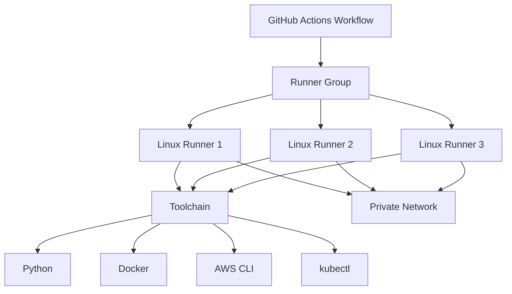
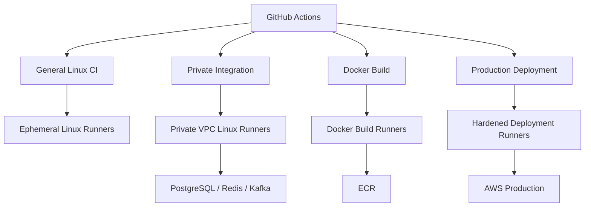

# 06- Linux Runners

## Overview

Linux runners are execution environments used by GitHub Actions jobs on Linux operating systems. They can be GitHub-hosted or self-hosted and are commonly used for Python, Docker, Kubernetes, AWS, and backend CI/CD workloads.

For production engineering, a Linux runner is more than a machine that executes YAML. It is part of the CI/CD execution plane and therefore affects:

- Build reproducibility
- Dependency compatibility
- Security
- Network access
- Performance
- Runner capacity
- Deployment reliability
- Operational cost
- Failure isolation

A typical Linux-based GitHub Actions workflow is:

```text
Workflow
   ↓
Job
   ↓
runs-on
   ↓
Linux Runner
   ↓
Workspace + Toolchain
   ↓
Steps / Actions
   ↓
Artifacts / Deployment
```

For self-hosted Linux runners, the platform team controls the operating system, installed software, networking, security configuration, runner lifecycle, and infrastructure capacity.

---

## Linux Runner Types

Linux runners can broadly be divided into:

| Type | Management | Typical Use |
|---|---|---|
| GitHub-hosted | Managed by GitHub | Standard CI/CD |
| Self-hosted persistent | Managed by organization | Specialized or stable workloads |
| Self-hosted ephemeral | Provisioned per workload | Security-sensitive and scalable workloads |
| Autoscaled | Dynamically provisioned | Variable workloads |

The choice depends on security, networking, customization, performance, and cost requirements.

---

## GitHub-Hosted Linux Runners

GitHub-hosted runners provide managed Linux execution environments.

A typical workflow might use:

```yaml
jobs:
  test:
    runs-on: ubuntu-latest

    steps:
      - uses: actions/checkout@v4

      - name: Install dependencies
        run: pip install -r requirements.txt

      - name: Run tests
        run: pytest
```

The major advantage is reduced infrastructure management.

The organization does not need to manage:

- Operating system patching
- Runner registration
- Runner service lifecycle
- Base machine provisioning
- Hardware replacement
- Host monitoring

The trade-off is reduced control over the underlying environment and networking.

---

## Self-Hosted Linux Runners

Self-hosted Linux runners are machines managed by the organization.

They may run on:

- AWS EC2
- Azure virtual machines
- Google Cloud instances
- On-premises servers
- Kubernetes-based infrastructure
- Virtual machines
- Bare metal

A workflow might target one using:

```yaml
jobs:
  integration:
    runs-on:
      - self-hosted
      - linux
      - x64
```

Self-hosted runners are useful when jobs require capabilities unavailable or unsuitable on GitHub-hosted runners.

---

## Why Use Linux Self-Hosted Runners?

Common reasons include:

### Private Network Access

The runner may need access to:

```text
Private PostgreSQL
Redis
Kafka
Internal APIs
Private AWS resources
```

### Custom Software

The organization may require:

```text
Custom CLI
Internal SDK
Specialized compiler
Private package manager
Security tooling
```

### Specialized Hardware

Examples include:

```text
High-memory instances
GPU
ARM64
High-CPU instances
Large local storage
```

### Deployment Infrastructure

Production deployment runners may need access to:

```text
Private VPC
Kubernetes
ECS
EC2
Internal services
```

---

## Linux Distribution

The Linux distribution matters because it affects:

- Package management
- System libraries
- libc implementation
- OpenSSL versions
- Compiler versions
- Kernel behavior
- Native Python dependencies
- Docker compatibility

Common choices include:

```text
Ubuntu
Debian
Amazon Linux
RHEL-compatible distributions
```

Choose a distribution based on the application's runtime and operational requirements rather than personal preference.

---

## Ubuntu Runners

Ubuntu is commonly used for GitHub Actions Linux workloads because of its broad ecosystem support.

A self-hosted Ubuntu runner might provide:

```text
Ubuntu
Python
Docker
Git
AWS CLI
kubectl
Terraform
Node.js
```

A workflow can select it through labels:

```yaml
runs-on:
  - self-hosted
  - linux
  - x64
```

The exact distribution should normally be represented through the runner image or controlled labels if multiple Linux distributions are intentionally supported.

---

## Linux Architecture

CPU architecture should be explicit when it matters.

Common architectures are:

```text
x86_64 / x64
ARM64
```

Example:

```yaml
strategy:
  matrix:
    arch:
      - x64
      - arm64

jobs:
  test:
    runs-on:
      - self-hosted
      - linux
      - ${{ matrix.arch }}
```

Architecture matters for:

- Native Python packages
- C/C++ extensions
- Docker images
- Binary dependencies
- System libraries
- Multi-platform builds

---

## Linux Runner Labels

A Linux runner should generally expose meaningful labels.

For example:

```text
self-hosted
linux
x64
docker
```

A private integration runner might have:

```text
self-hosted
linux
x64
private-vpc
```

A production deployment runner might have:

```text
self-hosted
linux
x64
private-vpc
production-deploy
```

Labels describe capabilities. Runner groups provide access control.

---

## Linux Runner Groups

Runner groups should separate workloads with different trust boundaries.

Example:

```text
General CI
    ↓
Linux Runners

Private Integration
    ↓
Linux + Private Network

Production Deployment
    ↓
Linux + Private Network + Deployment Tooling
```

A privileged Linux runner should not be exposed to every repository merely because all workloads use Linux.

---

## Linux Runner Architecture



The runner group controls access while the runner configuration provides the execution capabilities.

---

## Linux Runner Components

A self-hosted Linux runner generally contains:

```text
Linux OS
├── Git
├── GitHub Actions Runner
├── Shell
├── Runtime Toolchains
├── Package Managers
├── Build Tools
├── Docker
├── Cloud CLIs
└── Monitoring / Security Agents
```

The exact components should be minimized according to workload requirements.

---

## GitHub Actions Runner Service

The runner agent communicates with GitHub Actions and executes assigned jobs.

A Linux installation commonly runs the runner as a service.

A service-based runner should:

- Start automatically
- Restart after host reboot
- Run under an appropriate user
- Produce operational logs
- Be monitored
- Be managed through infrastructure automation

---

## Runner User

Avoid running all CI workloads as `root` unless there is a specific operational requirement.

A dedicated service account provides better isolation.

For example:

```text
github-runner
```

can own the runner installation and workspace.

The exact permissions should be minimized according to required operations.

---

## Linux Filesystem Layout

A typical runner might use:

```text
/opt/actions-runner/
    config.sh
    run.sh
    svc.sh
    bin/

/home/github-runner/
    _work/
```

The exact layout can vary.

Important directories include:

```text
Runner installation
Workspace
Temporary files
Tool caches
Docker data
Logs
```

These areas must be considered during cleanup and incident response.

---

## Workspace Isolation

Jobs execute within runner workspaces.

A persistent runner may retain state between jobs unless cleanup is performed correctly.

Potential residual data includes:

```text
Source code
Build artifacts
Test files
Temporary credentials
Dependency caches
Docker layers
Generated configuration
```

This is one reason ephemeral runners are valuable for sensitive workloads.

---

## Persistent Linux Runners

Persistent runners remain available for multiple jobs.

Advantages:

- Low startup latency
- Warm caches
- Preinstalled software
- Suitable for frequent workloads
- Useful for specialized hardware

Limitations:

- State contamination
- Security exposure
- Configuration drift
- Patch management
- Long-lived infrastructure
- More complex cleanup

Persistent runners require stronger operational discipline.

---

## Ephemeral Linux Runners

An ephemeral runner is created for a limited workload and then destroyed.

Typical lifecycle:

```text
Provision
   ↓
Register
   ↓
Execute Job
   ↓
Collect Results
   ↓
Destroy
```

This reduces persistent state and improves isolation.

Ephemeral runners are particularly useful for:

- Production deployment
- Sensitive builds
- Untrusted-but-controlled workloads
- High-scale CI
- Autoscaling environments

---

## Persistent vs Ephemeral

| Property | Persistent | Ephemeral |
|---|---|---|
| Startup | Fast | Slower |
| State isolation | Lower | Higher |
| Maintenance | Higher | Image-focused |
| Scaling | Manual/autoscaled | Naturally scalable |
| Cleanup | Required | Mostly lifecycle-based |
| Security | More difficult | Stronger isolation |
| Cost efficiency | Good for steady load | Good for variable load |

Neither model is universally appropriate.

---

## Linux Runner Image

For self-hosted runners, create a controlled base image.

Example:

```text
Ubuntu Base
    ↓
Security Updates
    ↓
Git
    ↓
Python
    ↓
Docker
    ↓
AWS CLI
    ↓
kubectl
    ↓
GitHub Runner
    ↓
Monitoring
```

The image should be versioned.

For example:

```text
linux-runner:2026.09
```

This makes runner replacement reproducible.

---

## Immutable Runner Images

Avoid manually configuring every runner after provisioning.

Instead:

```text
Runner Image
     ↓
Provision
     ↓
Validate
     ↓
Register
```

When tooling changes:

```text
Build New Image
     ↓
Test
     ↓
Deploy New Runners
     ↓
Drain Old Runners
     ↓
Remove Old Runners
```

This reduces configuration drift.

---

## Configuration Drift

A common failure mode is:

```text
Runner 1
Python 3.12
Docker 27

Runner 2
Python 3.12
Docker 26

Runner 3
Python 3.11
Docker 27
```

All runners may have the same labels:

```text
linux
x64
docker
```

The workflow appears deterministic but actually depends on which runner receives the job.

This is configuration drift.

---

## Runner Validation

Before adding a runner to a production pool, validate required capabilities.

Example:

```bash
uname -a
cat /etc/os-release

python3 --version
git --version
docker --version
aws --version
kubectl version --client
```

For Docker:

```bash
docker info
```

For Python:

```bash
python3 -c "import sys; print(sys.version)"
```

Only advertise labels corresponding to validated capabilities.

---

## Python on Linux Runners

Python backend projects frequently require:

```text
Python
pip
virtualenv
build-essential
system libraries
```

A production runner should not rely on whatever Python happens to be installed.

Prefer explicit setup.

For GitHub-hosted runners:

```yaml
- name: Set up Python
  uses: actions/setup-python@v5
  with:
    python-version: "3.12"
```

For self-hosted runners, standardize Python versions through runner images or controlled setup mechanisms.

---

## Native Python Dependencies

Packages such as:

```text
psycopg
mysqlclient
cryptography
numpy
pandas
```

may depend on native libraries or wheels.

A Linux runner must have compatible:

- libc
- compiler toolchain
- development headers
- system libraries

For example, a source build may require:

```bash
sudo apt-get install -y build-essential
```

Do not install arbitrary build dependencies during every job unless there is a clear reason.

For predictable CI, bake stable dependencies into the runner image or use job containers.

---

## Django on Linux Runners

A Django CI workflow may require:

```text
Python
PostgreSQL
Redis
pytest
pytest-django
```

Example:

```yaml
jobs:
  test:
    runs-on:
      - self-hosted
      - linux
      - x64

    steps:
      - uses: actions/checkout@v4

      - name: Set up Python
        uses: actions/setup-python@v5
        with:
          python-version: "3.12"

      - name: Install dependencies
        run: |
          python -m pip install --upgrade pip
          pip install -r requirements.txt

      - name: Run Django tests
        run: pytest
```

For database-backed integration testing, service containers or dedicated test infrastructure may be required.

---

## FastAPI on Linux Runners

FastAPI applications can use the same Linux CI model:

```yaml
- name: Install dependencies
  run: pip install -r requirements.txt

- name: Run tests
  run: pytest

- name: Validate application
  run: python -m compileall app/
```

For production deployment, the runner should generally build and promote an immutable artifact rather than directly modifying the application environment in an uncontrolled way.

---

## Docker on Linux Runners

Linux is a common platform for Docker builds.

Example:

```yaml
jobs:
  build:
    runs-on:
      - self-hosted
      - linux
      - x64
      - docker-build

    steps:
      - uses: actions/checkout@v4

      - name: Build image
        run: |
          docker build \
            --tag orders:${GITHUB_SHA} \
            .
```

Production builds should additionally consider:

- Buildx
- Layer caching
- Multi-platform builds
- Registry authentication
- Image scanning
- SBOM
- Provenance
- Immutable tags or digests

---

## Docker Socket Security

If a Linux runner exposes:

```text
/var/run/docker.sock
```

to workloads, the Docker daemon can provide powerful host-level capabilities.

Treat Docker-capable self-hosted runners as privileged infrastructure.

Do not assume:

```text
Docker access = harmless build capability
```

A compromised workflow may potentially use Docker capabilities to affect the host.

For sensitive workloads, evaluate:

- Rootless Docker
- Ephemeral runners
- Isolated build hosts
- BuildKit
- Dedicated build pools
- Containerized execution
- Network restrictions

---

## Linux Containers

A job can run inside a Linux container:

```yaml
jobs:
  test:
    runs-on: ubuntu-latest

    container:
      image: python:3.12-slim

    steps:
      - uses: actions/checkout@v4
      - run: pip install -r requirements.txt
      - run: pytest
```

This provides a more controlled application-level environment than relying entirely on the host.

However, container jobs still depend on the underlying runner.

---

## Service Containers

Linux runners are well suited to service-container-based integration testing.

Example:

```yaml
jobs:
  integration:
    runs-on: ubuntu-latest

    services:
      postgres:
        image: postgres:16
        env:
          POSTGRES_USER: test
          POSTGRES_PASSWORD: test
          POSTGRES_DB: app_test
        options: >-
          --health-cmd="pg_isready -U test -d app_test"
          --health-interval=10s
          --health-timeout=5s
          --health-retries=5
```

The application can then execute integration tests against PostgreSQL.

---

## Redis Integration

A backend pipeline may require Redis:

```yaml
services:
  redis:
    image: redis:7
```

This is useful for testing:

```text
Django
+
Celery
+
Redis
```

or:

```text
FastAPI
+
Redis
```

The test environment should remain isolated from production Redis.

---

## PostgreSQL Integration

For Django or FastAPI applications:

```text
Linux Runner
    |
    +-- Application
    |
    +-- PostgreSQL
    |
    +-- Redis
    |
    +-- pytest
```

Readiness checks are important because container startup does not necessarily mean the database is ready to accept connections.

---

## Kafka Integration

Kafka-based systems may require:

```text
Kafka
Zookeeper / KRaft
Schema Registry
```

depending on the architecture.

Avoid putting large stateful integration environments on generic runners unless the operational model is well understood.

For complex integration tests, an ephemeral environment or dedicated test infrastructure may be more reliable.

---

## Linux Networking

Linux runners participating in private environments may need:

```text
DNS
Routing
Security Groups
Firewall
Proxy
VPN
VPC connectivity
```

A workflow can fail even when the runner itself is healthy.

For example:

```text
Runner
   ↓
DNS Resolution
   ↓
Private Endpoint
   ↓
Security Group
   ↓
Service
```

Every layer can fail independently.

---

## Private AWS VPC

A self-hosted Linux runner in AWS can be deployed inside a VPC:

```text
GitHub
   ↓
Internet
   ↓
Runner
   ↓
Private Subnet
   ↓
AWS Resources
```

The runner may reach:

- Private RDS
- ElastiCache
- Internal load balancers
- Private ECS services
- Private APIs

The network should restrict access to only required destinations.

---

## Security Groups

A Linux runner in AWS may use a dedicated security group.

Example conceptual policy:

```text
Runner SG
    ↓
Allow HTTPS outbound
    ↓
Allow required internal service access
```

Avoid broad rules such as:

```text
0.0.0.0/0
```

for internal service access unless explicitly required.

---

## DNS

Private-network runners frequently fail because DNS is incorrect.

Check:

```bash
getent hosts internal-api.example.local
```

or:

```bash
nslookup internal-api.example.local
```

Also inspect:

```bash
cat /etc/resolv.conf
```

The application may be healthy while DNS prevents the runner from reaching it.

---

## Connectivity Diagnostics

Useful Linux commands include:

```bash
ip addr
ip route
```

DNS:

```bash
getent hosts example.com
```

Connectivity:

```bash
curl -v https://example.com
```

Port testing:

```bash
nc -vz hostname 5432
```

TLS:

```bash
openssl s_client -connect example.com:443
```

These commands help isolate:

```text
DNS
Routing
Firewall
TLS
Application
```

---

## Proxy Environments

Corporate environments may require HTTP/HTTPS proxies.

Common variables include:

```bash
HTTP_PROXY
HTTPS_PROXY
NO_PROXY
```

For example:

```bash
export HTTPS_PROXY=http://proxy.internal:8080
export NO_PROXY=localhost,127.0.0.1,.internal.example.com
```

Incorrect proxy configuration can cause:

- Git failures
- Docker pull failures
- AWS CLI failures
- Package installation failures
- GitHub connectivity problems

---

## Package Management

Ubuntu-based runners may use:

```bash
apt-get
```

Example:

```bash
sudo apt-get update
sudo apt-get install -y build-essential
```

Avoid updating the operating system and installing large dependency sets on every job when stable dependencies can be baked into the runner image.

Frequent package installation increases:

- Job duration
- Network dependency
- Failure surface
- External availability dependency

---

## Linux Package Repositories

Self-hosted runners should ideally use controlled package sources.

For enterprise systems, consider:

```text
Internal APT mirror
Internal Python package index
Dependency proxy
Approved container registry
```

This improves:

- Reproducibility
- Availability
- Supply-chain control
- Performance

---

## Python Dependency Caching

GitHub Actions cache can reduce dependency installation time.

Example:

```yaml
- name: Set up Python
  uses: actions/setup-python@v5
  with:
    python-version: "3.12"
    cache: pip
    cache-dependency-path: requirements.txt
```

Do not confuse dependency caches with build artifacts.

Caches accelerate repeated work.

Artifacts represent outputs that need to be retained or transferred.

---

## Linux Disk Management

Build-heavy runners can consume large amounts of disk space.

Check:

```bash
df -h
```

Docker:

```bash
docker system df
```

Filesystem usage:

```bash
du -sh /home/github-runner/_work/* 2>/dev/null
```

A persistent runner should have a cleanup strategy.

---

## Docker Disk Cleanup

If a persistent runner accumulates Docker data:

```bash
docker system df
```

Potential cleanup:

```bash
docker image prune
```

Use more aggressive cleanup commands carefully because they may remove resources needed by concurrent or future jobs.

Ephemeral runners reduce this operational problem by destroying the host after execution.

---

## Memory Management

Monitor memory usage:

```bash
free -h
```

Process-level inspection:

```bash
ps aux --sort=-%mem | head
```

Builds involving:

```text
Docker
Webpack
Pandas
NumPy
large test suites
```

may require more memory than normal unit tests.

Insufficient memory can cause:

```text
OOM killer
Process termination
Build failures
Runner instability
```

---

## CPU Capacity

Inspect CPU:

```bash
nproc
```

and:

```bash
lscpu
```

Parallel test execution can improve throughput:

```bash
pytest -n auto
```

when using an appropriate parallel testing plugin.

However, excessive parallelism can cause:

- CPU saturation
- Memory pressure
- Database connection exhaustion
- Disk contention
- Longer overall execution due to resource contention

---

## Runner Capacity Planning

Runner sizing should consider:

```text
CPU
Memory
Disk
Network
Job concurrency
Job duration
Artifact volume
Docker workload
Test parallelism
```

A runner that is powerful enough for one build may be insufficient for four concurrent jobs.

---

## Runner Concurrency

Persistent self-hosted runners should be designed with job isolation in mind.

Multiple concurrent workloads can contend for:

```text
CPU
Memory
Disk
Docker daemon
Network
Workspace
Ports
```

For sensitive or resource-heavy workloads, use separate runner pools or ephemeral runners.

---

## Linux Kernel Considerations

Container and networking behavior depends partly on the Linux kernel.

Relevant areas include:

- cgroups
- namespaces
- filesystem support
- networking
- process limits
- memory limits

Container-heavy runners should use a supported kernel and should be patched regularly.

---

## File Descriptor Limits

Large backend or integration workloads may require many file descriptors.

Inspect:

```bash
ulimit -n
```

System-level limits:

```bash
cat /proc/sys/fs/file-max
```

Applications such as:

- High-concurrency test suites
- Web servers
- Proxy workloads
- Browser automation

can hit descriptor limits.

---

## Process Limits

Inspect:

```bash
ulimit -u
```

Large parallel test workloads can hit process limits.

Tune limits deliberately rather than simply increasing them without understanding the workload.

---

## Time Synchronization

Correct system time matters for:

- TLS
- AWS authentication
- OIDC-related workflows
- Artifact signing
- Logs
- Distributed systems

Check:

```bash
timedatectl
```

A runner with incorrect time can produce authentication and certificate failures that appear unrelated to the host clock.

---

## Linux Runner Security

A self-hosted Linux runner should be treated as a privileged execution environment.

Security controls should include:

- Minimal installed software
- Least-privilege runner user
- OS patching
- Firewall rules
- Network segmentation
- Restricted outbound access where possible
- Disk cleanup
- Secret handling
- Monitoring
- Audit logging
- Ephemeral execution where appropriate

---

## OS Patching

Linux runners need regular security updates.

For persistent infrastructure, define:

```text
Patch Schedule
+
Validation
+
Drain
+
Replacement
```

An immutable image strategy is often safer than performing uncontrolled in-place updates.

---

## Runner Replacement

A healthy replacement process is:

```text
Build Updated Image
        ↓
Security Validation
        ↓
Provision New Runner
        ↓
Register Runner
        ↓
Validate Capabilities
        ↓
Add to Runner Group
        ↓
Drain Old Runner
        ↓
Remove Old Runner
```

This minimizes downtime and reduces configuration drift.

---

## Linux Runner Hardening

Consider:

```text
Dedicated service account
SSH restrictions
Firewall
Automatic security updates
Minimal packages
Restricted sudo
Filesystem permissions
EDR/security agent
Centralized logging
Monitoring
Network segmentation
```

Do not install unnecessary administrative tooling on privileged deployment runners.

---

## SSH Access

SSH should be tightly controlled.

Avoid exposing production runners broadly.

Prefer:

```text
SSM
Bastion
Private administrative network
```

where appropriate in AWS environments.

Administrative access should be auditable.

---

## AWS Instance Profiles

An EC2-based runner can receive an IAM role through an instance profile.

However, a runner's IAM permissions can become available to every workflow that executes on that machine.

For production deployment workloads, carefully consider whether:

```text
Instance Profile
```

or:

```text
GitHub OIDC
```

provides the appropriate identity boundary.

OIDC generally provides a workflow-aware identity model, while an instance profile is attached to the host.

---

## GitHub OIDC on Linux Runners

The typical flow is:

```text
GitHub Actions
      |
      | OIDC token
      v
AWS STS
      |
      | AssumeRoleWithWebIdentity
      v
IAM Role
      |
      v
AWS Resource
```

Workflow permissions:

```yaml
permissions:
  contents: read
  id-token: write
```

OIDC avoids storing long-lived AWS access keys as GitHub secrets.

---

## IAM and Linux Runner Security

Runner infrastructure and IAM should be designed together.

For example:

```text
Production Runner
    ↓
GitHub OIDC
    ↓
Production Deployment Role
    ↓
ECS UpdateService
```

The IAM role should not have unrelated permissions such as:

```text
iam:*
s3:*
ec2:*
```

unless they are genuinely required.

---

## Linux Runner and Secrets

Avoid placing long-lived secrets directly on the filesystem.

Bad pattern:

```bash
echo "$AWS_SECRET_ACCESS_KEY" > /opt/runner/aws-secret
```

Persistent credentials increase the impact of runner compromise.

Prefer short-lived credentials such as OIDC-issued AWS credentials where supported.

---

## Untrusted Code

Never assume that Linux means secure.

The following are dangerous together:

```text
Untrusted Code
+
Self-Hosted Runner
+
Private Network
+
Cloud Credentials
```

Use GitHub-hosted runners or isolated ephemeral infrastructure for workloads that do not need privileged access.

---

## Third-Party Actions

Third-party actions execute within the runner environment.

On a privileged Linux runner, they may potentially access:

- Filesystem
- Environment variables
- Git credentials
- Docker
- Network
- Cloud credentials available to the job

Use trusted actions and pin important third-party actions to reviewed immutable references where organizational policy requires it.

---

## Supply Chain Security

Linux runners are part of the software supply chain.

Protect:

```text
Source
↓
Workflow
↓
Actions
↓
Dependencies
↓
Build Environment
↓
Artifact
↓
Registry
↓
Deployment
```

Relevant controls include:

- Dependency review
- Dependabot
- SHA pinning
- SBOM
- Provenance
- Artifact attestations
- Artifact signing
- Immutable image references

---

## Monitoring Linux Runners

Monitor:

```text
CPU
Memory
Disk
Network
Runner Status
Job Queue
Job Duration
Failure Rate
Docker Usage
OS Health
Security Events
```

Useful host-level tools include:

```bash
top
free -h
df -h
iostat
vmstat
ss
journalctl
```

---

## Runner Service Logs

On systemd-based systems:

```bash
systemctl status actions.runner.*
```

View logs:

```bash
journalctl -u actions.runner.<service-name>
```

The exact service name depends on the runner installation.

These logs are useful when:

- Runner does not start
- Runner repeatedly restarts
- Registration fails
- Network connectivity breaks
- Service permissions are incorrect

---

## Linux Runner Troubleshooting

Use:

```text
Symptom
→ Possible Causes
→ Isolation Strategy
→ Commands / Checks
→ Root Cause
→ Corrective Action
→ Prevention
```

---

## Runner Offline

### Possible Causes

- Service stopped
- Host unavailable
- Network failure
- DNS failure
- Runner process crash
- Authentication/registration issue
- OS failure

### Checks

```bash
systemctl status actions.runner.*
```

```bash
journalctl -u actions.runner.<service-name>
```

```bash
ping -c 3 github.com
```

```bash
curl -I https://github.com
```

### Prevention

Use:

- Service monitoring
- Host monitoring
- Automatic restart
- Autoscaling
- Multiple runners

---

## Runner Online but Jobs Fail Immediately

Possible causes:

- Missing tool
- Incorrect PATH
- Permission issue
- Wrong architecture
- Missing system library
- Workspace corruption
- Docker unavailable

Check:

```bash
whoami
id
echo "$PATH"
uname -m
python3 --version
docker version
```

---

## `command not found`

Example:

```text
terraform: command not found
```

Check:

```bash
which terraform
echo "$PATH"
```

Determine whether the tool:

- Was never installed
- Is installed outside PATH
- Is available only to another user
- Was removed during image changes

Do not immediately modify the live runner without determining whether the runner image itself is incorrect.

---

## Python Version Mismatch

Symptom:

```text
Python 3.11 expected
Python 3.10 found
```

Check:

```bash
which python3
python3 --version
```

Also inspect:

```bash
which pip
pip --version
```

Do not assume `python` and `pip` point to the same interpreter.

Prefer:

```bash
python3 -m pip
```

to bind package installation to the intended interpreter.

---

## Docker Failure

Check:

```bash
docker version
docker info
```

Service status:

```bash
systemctl status docker
```

Logs:

```bash
journalctl -u docker
```

Potential causes include:

- Docker service stopped
- Permission denied
- Disk full
- Storage corruption
- Network problems
- Incorrect daemon configuration

---

## Disk Full

Check:

```bash
df -h
```

Then:

```bash
docker system df
```

and:

```bash
du -sh /home/github-runner/_work/* 2>/dev/null
```

Corrective action may include:

- Workspace cleanup
- Docker cleanup
- Log rotation
- Increasing disk
- Replacing the runner

For ephemeral runners, replacement is often simpler than deep cleanup.

---

## Memory Exhaustion

Check:

```bash
free -h
```

and:

```bash
dmesg | grep -i oom
```

Potential causes:

- Too many parallel jobs
- Large Docker builds
- Large test suites
- Memory-intensive Python processing
- Browser tests

Mitigation:

- Increase memory
- Reduce concurrency
- Split jobs
- Use larger runners
- Use separate runner pools

---

## Network Failure

Check:

```bash
ip route
```

DNS:

```bash
getent hosts github.com
```

Connectivity:

```bash
curl -v https://github.com
```

Private endpoint:

```bash
curl -v https://internal-api.example.com
```

Separate:

```text
DNS failure
Routing failure
Firewall failure
TLS failure
Application failure
```

Do not treat all connectivity failures as GitHub Actions failures.

---

## AWS Authentication Failure

Check identity:

```bash
aws sts get-caller-identity
```

If OIDC is used, inspect:

```text
Workflow permissions
OIDC provider
IAM trust policy
Repository
Branch
Environment
Audience
Subject
```

Do not immediately add broad IAM permissions as a troubleshooting shortcut.

---

## Linux Runner and GitHub Connectivity

A self-hosted runner must maintain communication with GitHub.

Test:

```bash
curl -I https://github.com
```

Proxy environments should be validated if applicable.

For restricted networks, ensure required GitHub connectivity is available without unnecessarily allowing broad outbound access.

---

## Linux Runner and Artifact Uploads

Artifacts require network connectivity between the runner and GitHub's artifact infrastructure.

A runner can successfully execute:

```bash
pytest
```

but fail while uploading:

```text
coverage.xml
```

This indicates a different failure domain.

Separate application execution from artifact transport during troubleshooting.

---

## Linux Runner and Caches

Caching may reduce dependency installation time, but caches should not become a security boundary.

Avoid placing secrets in cache paths.

Be especially careful with caches in workflows processing untrusted inputs.

---

## Linux Runner and Test Reports

A robust Python test job might produce:

```text
pytest results
coverage.xml
HTML coverage
JUnit XML
logs
```

Then upload them as artifacts.

Example:

```yaml
- name: Run tests
  run: |
    pytest \
      --junitxml=reports/junit.xml \
      --cov=. \
      --cov-report=xml:reports/coverage.xml

- name: Upload test reports
  if: ${{ !cancelled() }}
  uses: actions/upload-artifact@v4
  with:
    name: test-reports
    path: reports/
```

The runner filesystem should not be considered durable storage.

---

## Linux Runner and End-to-End Testing

Linux runners can support:

- Selenium
- Playwright
- API tests
- Browser tests
- Django integration tests
- FastAPI integration tests

Browser-based tests may require:

```text
Browser
Driver
System Libraries
Display Server / Headless Mode
Fonts
Shared Memory
```

A dedicated browser-test image can improve reproducibility.

---

## `/dev/shm` and Browser Tests

Browser workloads can fail due to insufficient shared memory.

Inspect:

```bash
df -h /dev/shm
```

Containerized browser jobs may need explicit shared-memory configuration.

This is a common source of intermittent browser-test failures.

---

## Linux Runner and Kubernetes

A Linux runner may deploy to Kubernetes using:

```text
kubectl
Helm
Terraform
Argo CD
```

The runner should receive only the permissions required for deployment.

For example:

```text
Production Runner
    ↓
OIDC / Cloud Identity
    ↓
Deployment Authorization
    ↓
Kubernetes API
```

Do not give the runner unrestricted cluster-admin permissions unless the deployment architecture genuinely requires them.

---

## Linux Runner and Terraform

A Linux runner commonly executes:

```bash
terraform fmt -check
terraform validate
terraform plan
terraform apply
```

Production infrastructure changes should normally use:

```text
Pull Request
→ Plan
→ Review
→ Approval
→ Apply
```

rather than unrestricted automatic applies from arbitrary branches.

---

## Linux Runner and AWS CLI

AWS CLI diagnostics:

```bash
aws sts get-caller-identity
```

Region:

```bash
aws configure get region
```

For production workflows, avoid storing static AWS access keys when OIDC is appropriate.

---

## Linux Runner and Nginx

A deployment runner may interact with Nginx configuration on EC2 or another Linux host.

After configuration changes:

```bash
nginx -t
```

should be executed before reload.

A production deployment should validate configuration before making the active change.

---

## Linux Runner and Celery

A Django deployment may include:

```text
Web
Celery Worker
Celery Beat
Redis
PostgreSQL
```

The deployment runner should account for:

- Worker restart strategy
- Task compatibility
- Database migrations
- Queue draining
- Rollback compatibility

A runner can successfully deploy code while asynchronous workers continue running incompatible versions.

---

## Linux Runner and Kafka

Kafka-backed services require compatibility between:

```text
Producer
Consumer
Schema
Broker
```

A CI/CD pipeline should validate compatibility before production rollout.

Runner infrastructure should not become responsible for application-level Kafka guarantees; it provides the execution environment for deployment and testing.

---

## High Availability

For important CI/CD workloads, use multiple Linux runners:

```text
Runner Group
├── Runner A
├── Runner B
└── Runner C
```

Where possible, distribute them across independent failure domains.

The goal is to prevent:

```text
Single Host Failure
        ↓
Entire CI/CD Pipeline Unavailable
```

---

## Disaster Recovery

Runner infrastructure should be reproducible.

Store or automate:

```text
Runner Image
Bootstrap Script
Registration Logic
Labels
Runner Groups
Network Configuration
IAM
Monitoring
```

If a complete runner fleet is lost:

```text
Infrastructure
    ↓
Recreate
    ↓
Register
    ↓
Validate
    ↓
Resume CI/CD
```

This is more reliable than maintaining undocumented manual setup procedures.

---

## Cost Optimization

Control cost through:

- Autoscaling
- Ephemeral runners
- Right-sized instances
- Specialized runner pools
- Build caching
- Parallelism tuning
- Job duration optimization
- Runner utilization monitoring

Do not use expensive high-memory or GPU infrastructure for normal linting and unit tests.

---

## Performance Optimization

Important levers include:

```text
Dependency caching
Docker layer caching
Prebuilt runner images
Parallel test execution
Matrix sizing
Runner CPU
Runner memory
Disk performance
Network bandwidth
```

Avoid optimizing only the runner hardware when the actual bottleneck is dependency installation or test design.

---

## Runner Queue Optimization

If queue time is high:

```text
Measure
  ↓
Identify Label
  ↓
Measure Matching Runner Capacity
  ↓
Check Utilization
  ↓
Check Job Duration
  ↓
Scale or Rebalance
```

Do not automatically add larger machines.

If jobs are independent, additional runners may provide better throughput than larger individual runners.

---

## Linux Runner Governance

A mature organization should standardize:

- Linux distribution
- Runner image lifecycle
- Labels
- Runner groups
- Security baseline
- Patch policy
- Tool versions
- Monitoring
- Registration
- Decommissioning
- Incident response

This transforms self-hosted runners from manually managed servers into a managed CI/CD platform.

---

## Recommended Runner Image Layers

A practical image can be structured as:

```text
Base Linux Image
        ↓
Security Updates
        ↓
System Libraries
        ↓
Git
        ↓
Python / Node / Java as required
        ↓
Docker / Buildx
        ↓
AWS CLI
        ↓
kubectl / Terraform
        ↓
Security + Monitoring Agents
        ↓
GitHub Actions Runner
```

Only install tooling required by the workloads assigned to the runner pool.

---

## Runner Image Versioning

Version images explicitly:

```text
linux-runner:2026.09.1
linux-runner:2026.09.2
```

Record:

- OS version
- Kernel baseline
- Tool versions
- Security patch level
- Runner version
- Configuration changes

This makes failures easier to correlate with infrastructure changes.

---

## Blue/Green Runner Rotation

Runner infrastructure can use a blue/green replacement strategy:

```text
Current Fleet
    ↓
Provision New Fleet
    ↓
Validate
    ↓
Add New Fleet to Group
    ↓
Drain Old Fleet
    ↓
Remove Old Fleet
```

This reduces risk during runner image upgrades.

---

## Linux Runner Incident Response

If a runner is suspected of compromise:

```text
1. Remove it from active scheduling.
2. Restrict runner group access if necessary.
3. Preserve relevant logs and metadata.
4. Determine which workflows executed on it.
5. Identify potentially exposed credentials.
6. Review network activity.
7. Rotate affected credentials.
8. Revoke unnecessary access.
9. Rebuild the runner from a trusted image.
10. Investigate the root cause.
```

Do not simply restart a potentially compromised persistent runner and return it to production.

---

## Production Reference Architecture



Each pool can have different:

```text
Security
Network
Tooling
Capacity
Lifecycle
Cost
```

---

## Production Checklist

### Operating System

- [ ] Linux distribution is standardized.
- [ ] Security patches are applied.
- [ ] Kernel is supported.
- [ ] Runner user follows least privilege.
- [ ] Unnecessary packages are removed.

### Runner

- [ ] Runner service is monitored.
- [ ] Registration is automated.
- [ ] Labels accurately represent capabilities.
- [ ] Runner groups restrict access.
- [ ] Runner images are versioned.
- [ ] Configuration drift is minimized.

### Security

- [ ] Privileged runners are isolated.
- [ ] Untrusted workflows cannot access sensitive runner pools unintentionally.
- [ ] Docker access is treated as privileged.
- [ ] OIDC is used where appropriate.
- [ ] IAM permissions are least privilege.
- [ ] Secrets are not persisted unnecessarily.
- [ ] Third-party actions are controlled.

### Networking

- [ ] DNS works correctly.
- [ ] Routing is validated.
- [ ] Security groups/firewalls are restrictive.
- [ ] Private resources are reachable only when required.
- [ ] Proxy configuration is documented.
- [ ] Outbound access is controlled where appropriate.

### Reliability

- [ ] Critical runner groups have multiple runners.
- [ ] Queue time is monitored.
- [ ] CPU and memory are monitored.
- [ ] Disk usage is monitored.
- [ ] Runner replacement is automated.
- [ ] Disaster recovery is documented.

### CI/CD

- [ ] Python versions are controlled.
- [ ] Docker tooling is standardized.
- [ ] Test environments are isolated.
- [ ] Artifacts are immutable.
- [ ] Production deployment uses protected environments.
- [ ] Deployment concurrency is configured.
- [ ] Rollback is tested.

---

## Common Mistakes

### Treating Linux Runners as Generic Servers

A runner is an execution platform for potentially untrusted automation and should be secured accordingly.

### Running Everything as Root

This increases the impact of compromised jobs.

### Manually Configuring Runners

Manual configuration creates drift and makes replacement difficult.

### Installing Dependencies During Every Job

This increases runtime and external failure dependencies.

### Giving Every Runner Private Network Access

Only workloads that require private access should receive it.

### Giving Runners Broad AWS Permissions

Use OIDC and narrowly scoped IAM roles where appropriate.

### Sharing Production and General CI Runners

This increases blast radius.

### Leaving Docker State on Persistent Runners

Stale images, volumes, credentials, and workspaces can affect later jobs.

### Using One Runner for Critical Deployments

This creates a single point of failure.

### Ignoring Disk Usage

Docker builds and test artifacts can eventually exhaust the filesystem.

### Treating Labels as Security Controls

Labels select runners; they do not make the runner secure.

---

## Interview Traps

### Why Use a Self-Hosted Linux Runner?

Typical reasons include private network access, custom tooling, specialized hardware, deployment infrastructure, and workload-specific performance requirements.

### What Is the Main Risk of Self-Hosted Runners?

The runner executes workflow code inside infrastructure controlled by the organization. A compromised workflow can potentially interact with the runner's filesystem, network, credentials, and installed tooling.

### Persistent vs Ephemeral Runner?

Persistent runners are efficient for stable high-frequency workloads but retain state. Ephemeral runners provide stronger isolation and simpler cleanup at the cost of provisioning overhead.

### How Do You Secure a Production Runner?

Use:

```text
Restricted Runner Group
+
Hardened Linux Image
+
Least Privilege
+
Network Segmentation
+
OIDC/IAM
+
Environment Protection
+
Trusted Actions
+
Monitoring
+
Ephemeral Lifecycle Where Appropriate
```

### Why Not Give the Runner an IAM Administrator Role?

Because the runner executes workflow code. A compromised job could potentially obtain or use those permissions. IAM roles should be narrowly scoped to the operations required by the deployment.

### How Would You Troubleshoot a Job That Fails Only on One Runner?

Compare:

```text
OS Version
Tool Versions
Environment Variables
PATH
Filesystem
CPU/Memory
Docker
Network
Permissions
Runner Image
```

This is usually an infrastructure consistency problem rather than an application problem.

---

## Senior Design Principles

### Treat Runners as Infrastructure

Manage Linux runners through:

```text
Images
IaC
Bootstrap
Monitoring
Security
Lifecycle Automation
```

rather than manual administration.

### Prefer Reproducibility

A new runner should be functionally equivalent to an existing runner in the same pool.

### Minimize Privilege

The runner should have only the network, filesystem, cloud, and tooling access required by its workloads.

### Separate Trust Zones

Use different runner groups for:

```text
General CI
Private Integration
Docker Builds
Staging
Production
```

when their security requirements differ.

### Prefer Ephemeral Runners for Sensitive Workloads

Especially when workflows handle:

```text
Production deployment
Cloud credentials
Private infrastructure
Sensitive source
Untrusted inputs
```

### Build Once, Deploy Many

Use CI runners to build immutable artifacts and controlled deployment runners to promote those artifacts.

### Monitor the Execution Plane

Runner health directly affects CI/CD availability.

### Design for Replacement

A production runner should be replaceable without manual reconstruction.

---

## Key Takeaways

- Linux runners are the execution layer for GitHub Actions jobs and should be treated as production infrastructure rather than ordinary build machines.
- Self-hosted Linux runners provide control over networking, tooling, hardware, and deployment access but introduce significant security, maintenance, and lifecycle responsibilities.
- Standardized immutable runner images, validated labels, controlled runner groups, automated replacement, and monitoring are essential for predictable production execution.
- Privileged Linux runners should use layered security controls including least-privilege permissions, restricted network access, trusted actions, OIDC/IAM, environment protection, and ephemeral execution where appropriate.
- Runner reliability depends on capacity, filesystem health, CPU and memory resources, networking, configuration consistency, and the ability to recreate the fleet automatically.