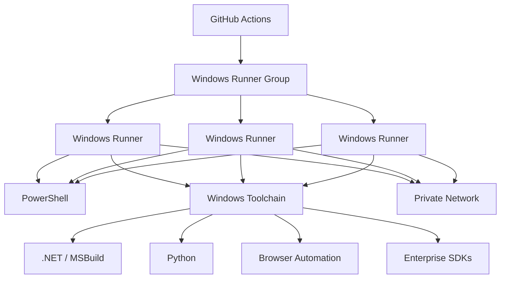
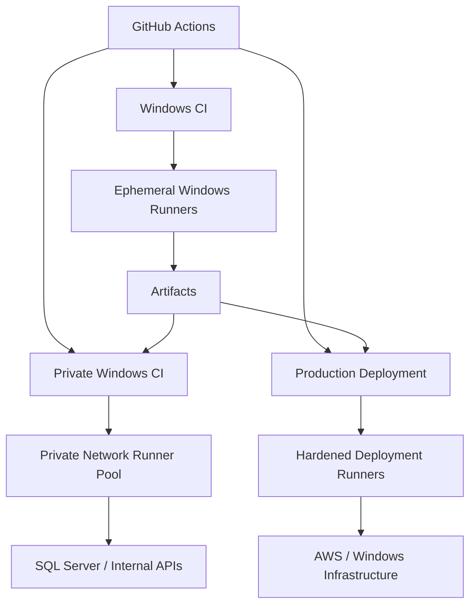

# 07- Windows Runners

## Overview

Windows runners are execution environments used by GitHub Actions jobs that require the Windows operating system. They are useful when CI/CD workloads depend on Windows-specific tooling, .NET, PowerShell, Windows services, Microsoft SQL Server, IIS, desktop automation, proprietary SDKs, or applications that cannot be validated correctly on Linux.

GitHub Actions supports both GitHub-hosted and self-hosted Windows runners.

For production engineering, a Windows runner is part of the CI/CD execution plane. Its operating system, PowerShell environment, filesystem behavior, installed toolchain, networking, identity, patch level, and lifecycle directly affect pipeline reliability and security.

A typical execution flow is:

```text
Workflow
   ↓
Job
   ↓
runs-on
   ↓
Windows Runner
   ↓
PowerShell / CMD / Toolchain
   ↓
Tests / Build / Artifact
   ↓
Deployment
```

Windows runners are especially relevant when a backend platform contains a mixture of:

```text
Python
Django / FastAPI
.NET
PowerShell
Windows Services
IIS
SQL Server
Selenium
Proprietary Windows SDKs
```

---

## Windows Runner Types

| Type | Management | Typical Use |
|---|---|---|
| GitHub-hosted Windows | Managed by GitHub | Standard Windows CI |
| Self-hosted persistent Windows | Organization-managed | Specialized tooling |
| Self-hosted ephemeral Windows | Provisioned per workload | Sensitive or isolated workloads |
| Autoscaled Windows | Dynamically provisioned | Variable workloads |

The appropriate model depends on:

- Required tooling
- Network access
- Security requirements
- Job frequency
- Provisioning time
- Cost
- Hardware requirements
- Licensing constraints

---

## GitHub-Hosted Windows Runners

GitHub-hosted Windows runners provide managed Windows environments.

Example:

```yaml
jobs:
  build:
    runs-on: windows-latest

    steps:
      - uses: actions/checkout@v4

      - name: Display environment
        shell: pwsh
        run: |
          $PSVersionTable
          Get-ComputerInfo | Select-Object WindowsProductName

      - name: Run tests
        shell: pwsh
        run: |
          pytest
```

The major advantage is reduced infrastructure management.

GitHub manages the underlying runner lifecycle, while the workflow controls the job execution.

---

## Self-Hosted Windows Runners

Self-hosted Windows runners are Windows machines managed by the organization.

They can run on:

- AWS EC2
- Azure virtual machines
- On-premises infrastructure
- Virtualized Windows servers
- Dedicated hardware

They are appropriate when workflows need capabilities unavailable or unsuitable on GitHub-hosted runners.

Typical requirements include:

```text
Internal Windows applications
Private network access
Windows services
IIS
Microsoft tooling
Custom SDKs
Licensed software
Specialized hardware
```

---

## Why Use Windows Runners?

Windows runners are commonly required when the build or test environment is inherently Windows-specific.

Examples include:

### Windows Applications

```text
.exe
.msi
Windows Services
Desktop applications
```

### Microsoft Tooling

```text
MSBuild
Visual Studio Build Tools
PowerShell
.NET SDK
IIS tooling
SQL Server tooling
```

### Browser Automation

Some enterprise automation environments depend on Windows-specific browser or desktop integrations.

### Legacy Systems

Legacy applications may require:

```text
Windows Registry
COM
ActiveX
Windows Services
Proprietary DLLs
```

These dependencies cannot always be reproduced faithfully on Linux.

---

## Linux vs Windows Runners

| Concern | Linux | Windows |
|---|---|---|
| Default shell | Bash | PowerShell |
| Common package manager | apt/dnf | winget/chocolatey or enterprise tooling |
| Filesystem | POSIX-oriented | Windows filesystem |
| Path separator | `/` | `\` |
| Environment variables | `$VAR` | `$env:VAR` |
| Service management | systemd | Windows Services |
| Container ecosystem | Strong | Windows-specific limitations may apply |
| Common backend CI | Python, Go, Java | .NET, Windows-specific workloads |
| Administration | SSH commonly used | RDP/WinRM/management tooling |
| Native Windows tooling | Limited | Native |
| Private enterprise tooling | Possible | Often easier |

The operating system should match the workload's real runtime requirements.

---

## Windows Runner Architecture



Runner groups provide access boundaries while labels describe execution capabilities.

---

## Windows Runner Labels

A Windows runner should have meaningful labels.

For example:

```text
self-hosted
windows
x64
```

A specialized runner might use:

```text
self-hosted
windows
x64
dotnet
```

A private deployment runner might use:

```text
self-hosted
windows
x64
private-network
production-deploy
```

Labels should represent real capabilities.

Do not assign labels that a runner cannot reliably satisfy.

---

## Runner Groups

Runner groups are particularly important when Windows runners provide privileged capabilities.

Example:

```text
General Windows CI
        ↓
Windows Runner Group

Private Windows CI
        ↓
Private Runner Group

Production Deployment
        ↓
Restricted Deployment Group
```

A production Windows deployment runner should not automatically be available to every repository in an organization.

---

## Selecting a Windows Runner

A workflow can target a GitHub-hosted Windows runner:

```yaml
jobs:
  test:
    runs-on: windows-latest

    steps:
      - uses: actions/checkout@v4
      - shell: pwsh
        run: pytest
```

A self-hosted runner can be selected using labels:

```yaml
jobs:
  test:
    runs-on:
      - self-hosted
      - windows
      - x64
```

Additional labels can narrow scheduling:

```yaml
runs-on:
  - self-hosted
  - windows
  - x64
  - dotnet
```

---

## PowerShell as the Default Shell

PowerShell is the primary shell for many Windows workflows.

Example:

```yaml
- name: Build application
  shell: pwsh
  run: |
    dotnet build --configuration Release
```

Environment variables use PowerShell syntax:

```powershell
$env:BUILD_NUMBER
```

rather than:

```bash
$BUILD_NUMBER
```

This distinction is important when moving workflows between Linux and Windows.

---

## PowerShell vs CMD

GitHub Actions can explicitly select the shell.

PowerShell:

```yaml
- name: PowerShell
  shell: pwsh
  run: |
    Write-Host "Running on Windows"
```

Command Prompt:

```yaml
- name: CMD
  shell: cmd
  run: |
    echo Running on Windows
```

PowerShell is generally easier to use for structured scripting, error handling, and Windows administration.

---

## PowerShell Error Handling

PowerShell's error behavior should be understood rather than assumed.

A production workflow can explicitly configure failure behavior:

```powershell
$ErrorActionPreference = "Stop"

Write-Host "Starting build"

dotnet build --configuration Release

if ($LASTEXITCODE -ne 0) {
    throw "Build failed with exit code $LASTEXITCODE"
}
```

This makes failures explicit.

Do not assume every native executable failure automatically behaves exactly like a PowerShell exception.

---

## Environment Variables

Windows PowerShell uses:

```powershell
$env:APP_ENV
```

Example:

```yaml
env:
  APP_ENV: test

steps:
  - name: Display environment
    shell: pwsh
    run: |
      Write-Host "Environment: $env:APP_ENV"
```

The GitHub Actions `env` mechanism remains the same across operating systems, but shell syntax differs.

---

## `$GITHUB_ENV`

Values can be shared with later steps using `$GITHUB_ENV`.

Example:

```yaml
- name: Set environment variable
  shell: pwsh
  run: |
    "BUILD_VERSION=2026.09.28" >> $env:GITHUB_ENV

- name: Read environment variable
  shell: pwsh
  run: |
    Write-Host $env:BUILD_VERSION
```

The file path is supplied by GitHub Actions through the environment.

---

## `$GITHUB_OUTPUT`

Step outputs should use `$GITHUB_OUTPUT`.

Example:

```yaml
- name: Generate version
  id: version
  shell: pwsh
  run: |
    $version = "1.4.0"
    "version=$version" >> $env:GITHUB_OUTPUT

- name: Display version
  shell: pwsh
  run: |
    Write-Host "${{ steps.version.outputs.version }}"
```

This is preferred over deprecated workflow command patterns.

---

## `$GITHUB_PATH`

A Windows workflow can add a directory to the PATH:

```yaml
- name: Add tool directory
  shell: pwsh
  run: |
    "C:\tools\bin" >> $env:GITHUB_PATH
```

Later steps can resolve executables from that directory.

---

## Windows Filesystem Paths

Windows paths commonly use:

```text
C:\work\project
```

while Linux uses:

```text
/work/project
```

Hard-coding paths can make a workflow non-portable.

Prefer environment variables and runtime path construction.

PowerShell example:

```powershell
$path = Join-Path $env:GITHUB_WORKSPACE "reports"
New-Item -ItemType Directory -Force -Path $path
```

---

## Path Portability

Avoid:

```yaml
run: pytest C:\project\tests
```

when the same workflow may eventually run on Linux.

Prefer:

```powershell
$tests = Join-Path $env:GITHUB_WORKSPACE "tests"
pytest $tests
```

For cross-platform workflows, application code should use platform-independent path APIs.

Python example:

```python
from pathlib import Path

reports_dir = Path("reports")
reports_dir.mkdir(parents=True, exist_ok=True)
```

---

## Windows Environment Inspection

Useful PowerShell commands include:

```powershell
$PSVersionTable
```

```powershell
Get-ComputerInfo
```

```powershell
Get-ChildItem Env:
```

```powershell
Get-Location
```

```powershell
Get-Command python
```

```powershell
Get-Command git
```

These are useful during runner troubleshooting.

---

## Windows Runner Toolchain

A standardized Windows runner may contain:

```text
Windows OS
├── Git
├── PowerShell
├── Python
├── Node.js
├── .NET SDK
├── MSBuild
├── Docker
├── AWS CLI
├── Terraform
├── kubectl
└── Security / Monitoring Tools
```

Do not install every available tool on every runner.

Create specialized runner images or pools when tooling requirements differ significantly.

---

## Windows Runner Image Strategy

For self-hosted Windows infrastructure, use a versioned base image.

Conceptually:

```text
Windows Base Image
        ↓
Security Updates
        ↓
PowerShell
        ↓
Git
        ↓
Python / .NET
        ↓
Build Tools
        ↓
AWS CLI / Terraform / kubectl
        ↓
Monitoring
        ↓
GitHub Runner
```

Version the image so that a runner can be reproduced.

---

## Windows Configuration Drift

Persistent Windows runners can drift over time.

Example:

```text
Runner A
Python 3.12
.NET 8
MSBuild X

Runner B
Python 3.11
.NET 8
MSBuild Y
```

Both may have:

```text
windows
x64
```

labels.

A workflow can therefore behave differently depending on which runner executes it.

Standardized images and automated provisioning reduce this risk.

---

## Windows Runner Registration

Self-hosted Windows runners require registration with GitHub.

The registration process should be automated rather than manually repeated for every server.

A production lifecycle should look like:

```text
Provision Windows VM
       ↓
Apply Security Baseline
       ↓
Install Toolchain
       ↓
Install GitHub Runner
       ↓
Register Runner
       ↓
Apply Labels / Group
       ↓
Validate
       ↓
Enable Workloads
```

Registration credentials or tokens should never be permanently embedded in images.

---

## Windows Runner Service

The runner should operate as a Windows service for production use.

Service management can be inspected with:

```powershell
Get-Service
```

A runner service can be checked using:

```powershell
Get-Service | Where-Object {
    $_.Name -like "*actions.runner*"
}
```

The exact service name depends on the runner installation.

---

## Windows Event Logs

Windows Event Viewer provides useful diagnostics for:

- Service failures
- System errors
- Authentication
- Network failures
- Application crashes

PowerShell can inspect event logs:

```powershell
Get-WinEvent -LogName System -MaxEvents 50
```

Application-specific logs should be correlated with GitHub Actions job timestamps.

---

## Windows Runner Connectivity

A self-hosted Windows runner requires outbound connectivity to GitHub and any services used by the workflow.

Test connectivity:

```powershell
Test-NetConnection github.com -Port 443
```

DNS:

```powershell
Resolve-DnsName github.com
```

HTTP:

```powershell
Invoke-WebRequest https://github.com -UseBasicParsing
```

Private service:

```powershell
Test-NetConnection internal-db.example.com -Port 5432
```

---

## Windows Firewall

Windows Firewall can block required communication.

Inspect firewall profiles:

```powershell
Get-NetFirewallProfile
```

List relevant rules:

```powershell
Get-NetFirewallRule
```

Do not disable the firewall as a generic troubleshooting solution.

Identify the blocked connection and create the narrowest required rule.

---

## Private Network Access

Windows runners may need access to:

```text
Private APIs
SQL Server
PostgreSQL
Redis
Internal package repositories
Active Directory
Deployment targets
```

A typical architecture is:

```text
GitHub
   ↓
Windows Runner
   ↓
Private Network
   ├── API
   ├── Database
   └── Internal Services
```

Network access should be restricted to the resources required by the workflow.

---

## Proxy Configuration

Corporate Windows environments may require HTTP/HTTPS proxies.

PowerShell can inspect environment variables:

```powershell
Get-ChildItem Env: | Where-Object {
    $_.Name -match "PROXY"
}
```

Incorrect proxy configuration can affect:

- Git
- NuGet
- pip
- npm
- Docker
- AWS CLI
- Terraform
- GitHub connectivity

---

## Windows Package Management

Depending on organizational policy, Windows tooling may be installed using:

```text
winget
Chocolatey
NuGet
Visual Studio Installer
Internal software distribution
Golden images
```

Production runners should prefer deterministic provisioning over ad-hoc package installation during jobs.

---

## Python on Windows Runners

Python workloads can run normally on Windows.

Example:

```yaml
jobs:
  test:
    runs-on: windows-latest

    steps:
      - uses: actions/checkout@v4

      - name: Set up Python
        uses: actions/setup-python@v5
        with:
          python-version: "3.12"

      - name: Install dependencies
        shell: pwsh
        run: |
          python -m pip install --upgrade pip
          pip install -r requirements.txt

      - name: Run tests
        shell: pwsh
        run: |
          pytest
```

Python projects should avoid relying on Windows-specific behavior unless the application itself requires it.

---

## Django on Windows Runners

Django CI can use Windows when Windows-specific dependencies or deployment environments require it.

Example:

```yaml
- name: Install dependencies
  shell: pwsh
  run: |
    python -m pip install --upgrade pip
    pip install -r requirements.txt

- name: Run Django tests
  shell: pwsh
  run: |
    python manage.py check
    pytest
```

If the production environment is Linux, Linux CI should normally remain part of the validation strategy even if Windows compatibility testing is also required.

---

## FastAPI on Windows Runners

FastAPI tests can run on Windows using:

```yaml
- name: Run API tests
  shell: pwsh
  run: |
    pytest
```

For cross-platform applications, consider a matrix:

```yaml
strategy:
  matrix:
    os:
      - ubuntu-latest
      - windows-latest

runs-on: ${{ matrix.os }}
```

This validates platform compatibility without making Windows the only CI environment.

---

## Windows Service Containers

Service-container behavior on Windows requires special attention.

Linux containers and Windows containers are different execution models.

Do not assume that a Linux service-container configuration will behave identically on a Windows runner.

If a workflow depends on PostgreSQL or Redis Linux containers, a Linux runner is usually the simpler execution environment.

---

## PostgreSQL and Redis Testing

For backend integration tests such as:

```text
Django
+
PostgreSQL
+
Redis
```

Linux runners often provide a more straightforward container environment.

A Windows runner should be selected when Windows itself is part of what is being tested or required.

Do not choose Windows solely because the developer machine uses Windows.

---

## Windows Containers

Windows containers are appropriate when the application requires a Windows userland or Windows-specific APIs.

They may be required for:

```text
Windows Server applications
.NET Framework
IIS-based applications
Windows-specific dependencies
```

Windows containers have different image compatibility and host requirements from Linux containers.

---

## Windows Container Compatibility

Windows container images must be compatible with the underlying Windows container host.

Consider:

```text
Windows Server Version
Container Base Image
Container Isolation Mode
Architecture
Runtime
```

This is a major operational difference from typical Linux container workflows.

---

## Docker on Windows Runners

Docker support depends on the runner configuration.

Validate:

```powershell
docker version
```

and:

```powershell
docker info
```

A build workflow might use:

```yaml
- name: Build Docker image
  shell: pwsh
  run: |
    docker build `
      --tag orders:${env:GITHUB_SHA} `
      .
```

PowerShell uses the backtick for line continuation, so shell-specific syntax matters.

---

## Docker Command Portability

Linux:

```bash
docker build \
  --tag orders:${GITHUB_SHA} \
  .
```

PowerShell:

```powershell
docker build `
  --tag "orders:$env:GITHUB_SHA" `
  .
```

Avoid copying shell syntax between operating systems without adapting it.

---

## Docker Buildx

For production image builds, Buildx can provide:

- BuildKit
- Layer caching
- Multi-platform builds
- Provenance support
- Advanced build configuration

The workflow should still account for Windows-specific Docker capabilities and whether the desired image platform matches the runner and build strategy.

---

## Windows and ECR

A Windows runner can authenticate to Amazon ECR using AWS CLI credentials obtained through an appropriate identity mechanism.

Example:

```powershell
aws sts get-caller-identity
```

Then authenticate Docker:

```powershell
aws ecr get-login-password --region ap-south-1 |
  docker login --username AWS --password-stdin <account>.dkr.ecr.ap-south-1.amazonaws.com
```

For production workloads, prefer GitHub OIDC over long-lived AWS access keys where supported.

---

## AWS OIDC from Windows Runners

The identity flow remains:

```text
GitHub Actions
      ↓
OIDC Token
      ↓
AWS STS
      ↓
IAM Role
      ↓
AWS Resource
```

Workflow permissions:

```yaml
permissions:
  contents: read
  id-token: write
```

The operating system does not change the fundamental OIDC trust model.

---

## Windows Runner IAM Security

Do not assume that a Windows runner is safe because it is isolated from Linux infrastructure.

A compromised Windows runner can still expose:

- AWS credentials
- GitHub tokens
- Repository data
- Internal network access
- Deployment credentials
- Build artifacts

Use least-privilege IAM roles and restricted runner groups.

---

## Windows Runner and Secrets

Avoid persisting secrets in:

```text
Registry
Environment configuration
Files
PowerShell profiles
Runner installation directories
```

Secrets should be provided only to jobs that require them.

Never write secrets to diagnostic output.

Bad:

```powershell
Write-Host $env:AWS_SECRET_ACCESS_KEY
```

Even when GitHub masking is enabled, deliberately printing secrets is an unsafe practice.

---

## Windows Credential Storage

Be careful with credentials stored through:

```text
Credential Manager
Registry
PowerShell profiles
Configuration files
```

A persistent runner may expose stored credentials to future jobs.

Ephemeral runners reduce this residual-state risk.

---

## Untrusted Workflows

The following combination creates a high-risk boundary:

```text
Untrusted Pull Request
        +
Self-Hosted Windows Runner
        +
Private Network
        +
Cloud Credentials
```

Do not route untrusted code to privileged self-hosted runners unless the security architecture explicitly isolates the workload.

---

## `pull_request` vs `pull_request_target`

Windows runners do not change the security implications of GitHub events.

Be especially cautious with:

```yaml
pull_request_target
```

when executing code from untrusted sources.

The fundamental concern is:

```text
Trusted Workflow Context
        ↓
Potentially Untrusted Code
        ↓
Privileged Runner
```

Keep privileged deployment jobs separated from untrusted PR execution.

---

## Third-Party Actions

Third-party actions execute on the runner and therefore inherit the job's execution environment.

On a Windows runner they may interact with:

- Filesystem
- Environment variables
- PowerShell
- Network
- Installed tooling
- Docker
- Cloud credentials

Use trusted actions and control action versions according to organizational security policy.

---

## Windows Runner Security Hardening

Recommended controls include:

- Dedicated service account
- Restricted local administrator access
- Windows Firewall
- Security updates
- Endpoint protection
- Restricted network access
- Controlled software installation
- Minimal credentials
- Centralized logging
- Runner monitoring
- Ephemeral lifecycle where practical

---

## Local Administrator Risk

Avoid making the runner service account a permanent local administrator unless the workload requires it.

Some build tools may require elevated permissions, but the requirement should be isolated to the smallest possible execution boundary.

A privileged deployment runner should be treated as sensitive infrastructure.

---

## Windows Update Strategy

Persistent Windows runners require a patch strategy.

A safer lifecycle is:

```text
Build Updated Image
        ↓
Patch Validation
        ↓
Provision New Runner
        ↓
Validate Toolchain
        ↓
Drain Old Runner
        ↓
Remove Old Runner
```

This is usually more predictable than manually patching production runners in place.

---

## Windows Runner Image Lifecycle

Track:

```text
Windows Version
Patch Level
PowerShell Version
.NET Version
Python Version
Build Tools Version
Docker Version
AWS CLI Version
Runner Version
Security Agent Version
```

When a build changes unexpectedly, this metadata makes infrastructure differences easier to identify.

---

## Windows Runner and IIS

Windows runners can deploy applications to IIS when the deployment target is Windows.

A deployment might validate configuration before changing the active service.

Typical lifecycle:

```text
Build
  ↓
Package
  ↓
Transfer Artifact
  ↓
Validate
  ↓
Deploy
  ↓
Restart / Reload
  ↓
Health Check
```

Avoid embedding environment-specific configuration directly into the build artifact.

---

## Windows Runner and Windows Services

Applications deployed as Windows Services should account for:

- Service stop/start
- Graceful shutdown
- File locks
- Version compatibility
- Configuration
- Health validation
- Rollback

PowerShell can inspect services:

```powershell
Get-Service
```

Specific service:

```powershell
Get-Service -Name "OrdersService"
```

A deployment should verify the expected service state after deployment.

---

## File Locks

Windows applications can hold files open while running.

This can make deployment behavior different from Linux.

Potential symptoms:

```text
Unable to replace DLL
Access denied
File is being used by another process
```

Deployment strategies should account for active processes and file locks.

For critical applications, use techniques such as:

```text
Side-by-side deployment
Service draining
Blue/green deployment
Atomic artifact switching where supported
```

rather than overwriting active binaries blindly.

---

## Windows Runner and SQL Server

Windows-based environments may require SQL Server integration testing.

A test architecture might be:

```text
Windows Runner
    ↓
Application
    ↓
SQL Server Test Environment
```

The database should be isolated from production.

Credentials should be short-lived or scoped to the test environment.

---

## Windows Runner and Selenium

Windows runners can be useful for browser automation when the test environment depends on Windows-specific behavior.

Typical components include:

```text
Browser
WebDriver
Test Framework
Application
```

The runner must maintain compatible versions.

A mismatch between browser and driver can cause failures that look like application defects.

---

## Browser Test Diagnostics

Useful PowerShell checks:

```powershell
Get-Command chrome
Get-Command msedgedriver
```

Browser version:

```powershell
(Get-Item "C:\Program Files\Google\Chrome\Application\chrome.exe").VersionInfo.ProductVersion
```

The exact path depends on installation.

Capture:

```text
Screenshots
Browser logs
Test logs
HTML reports
Video
Traces
```

as artifacts when debugging failures.

---

## Windows Runner Performance

Important factors include:

```text
CPU
Memory
Disk I/O
Antivirus scanning
Windows Update
Docker storage
Browser startup
Dependency installation
Network throughput
```

Security software can significantly affect build and test performance, especially when large dependency trees or temporary files are created.

Security exclusions should never be added blindly to improve performance.

---

## Disk Management

Check Windows disk usage:

```powershell
Get-PSDrive -PSProvider FileSystem
```

Inspect workspace size:

```powershell
Get-ChildItem $env:GITHUB_WORKSPACE -Recurse -ErrorAction SilentlyContinue |
    Measure-Object -Property Length -Sum
```

Large Docker builds, browser caches, package caches, and test artifacts can exhaust disk space.

---

## Memory Diagnostics

PowerShell:

```powershell
Get-CimInstance Win32_OperatingSystem |
    Select-Object FreePhysicalMemory, TotalVisibleMemorySize
```

Process inspection:

```powershell
Get-Process |
    Sort-Object WorkingSet64 -Descending |
    Select-Object -First 10
```

Use these checks when jobs fail due to memory pressure.

---

## CPU Diagnostics

Inspect CPU information:

```powershell
Get-CimInstance Win32_Processor |
    Select-Object Name, NumberOfCores, NumberOfLogicalProcessors
```

Excessive matrix parallelism can overwhelm a self-hosted Windows host.

---

## Windows Runner and Matrix Testing

Windows compatibility can be tested through a matrix:

```yaml
strategy:
  matrix:
    os:
      - ubuntu-latest
      - windows-latest
    python:
      - "3.11"
      - "3.12"

jobs:
  test:
    runs-on: ${{ matrix.os }}

    steps:
      - uses: actions/checkout@v4

      - uses: actions/setup-python@v5
        with:
          python-version: ${{ matrix.python }}

      - name: Install dependencies
        shell: pwsh
        if: runner.os == 'Windows'
        run: |
          python -m pip install -r requirements.txt

      - name: Install dependencies on Linux
        shell: bash
        if: runner.os == 'Linux'
        run: |
          python -m pip install -r requirements.txt

      - name: Run tests
        run: pytest
```

A matrix should test meaningful compatibility dimensions rather than multiplying every possible combination.

---

## Cross-Platform Shell Design

A workflow targeting both Linux and Windows should avoid unnecessary shell-specific logic.

Prefer application-level scripts where practical.

For example:

```text
scripts/
├── test.py
├── build.py
└── validate.py
```

Then:

```yaml
- name: Run tests
  run: python scripts/test.py
```

This reduces differences between:

```text
bash
PowerShell
cmd
```

---

## Cross-Platform Python Paths

Use Python's `pathlib`:

```python
from pathlib import Path

root = Path(__file__).resolve().parent
reports = root / "reports"

reports.mkdir(parents=True, exist_ok=True)
```

Avoid:

```python
path = "C:\\project\\reports"
```

unless the application specifically requires a fixed Windows location.

---

## Cross-Platform Line Endings

Windows commonly uses CRLF while Linux commonly uses LF.

Git configuration can affect working-tree behavior.

Inspect:

```powershell
git config --get core.autocrlf
```

Unexpected line-ending changes can affect:

- Shell scripts
- Configuration files
- Generated files
- Tests
- Hash-based operations

Standardize repository behavior through `.gitattributes` where necessary.

---

## Executable Permissions

Unix executable permissions do not map directly to Windows.

A script such as:

```text
./deploy.sh
```

may require a different execution mechanism on Windows.

For cross-platform CI, consider:

```text
Python
PowerShell
Node.js
```

for automation that must run on multiple operating systems.

---

## Windows Path Length

Some repositories can create deeply nested paths.

Symptoms include:

```text
Path too long
Cannot create file
Build tool failure
```

Use shorter workspace paths and avoid unnecessarily deep generated directory structures.

Dependency-heavy projects can expose this problem more often on Windows.

---

## Windows and Git

Git behavior should be standardized.

Useful checks:

```powershell
git --version
git config --show-origin --get core.autocrlf
git config --show-origin --get core.longpaths
```

Repository-specific Git configuration is preferable to relying on undocumented machine defaults.

---

## Windows Runner and Artifacts

Artifacts are transferred outside the runner filesystem and should be used for outputs such as:

```text
Test Reports
Coverage
Installers
Build Packages
Logs
Screenshots
```

Example:

```yaml
- name: Upload Windows build
  uses: actions/upload-artifact@v4
  with:
    name: windows-build
    path: |
      dist/
      reports/
```

Do not rely on files remaining on a persistent runner for downstream jobs.

---

## Windows Runner and Caches

Caches can improve:

```text
pip
npm
NuGet
Docker
```

dependency performance.

A cache is not an artifact and should not be used as the authoritative source for deployment output.

Avoid putting secrets or sensitive generated files into cache paths.

---

## Windows Runner and Reusable Workflows

Reusable workflows can abstract operating-system-specific CI.

For example:

```yaml
jobs:
  windows-tests:
    uses: organization/ci/.github/workflows/windows-tests.yml@v1
    with:
      python-version: "3.12"
```

The reusable workflow can standardize:

- Runner labels
- Tool setup
- Test execution
- Reports
- Artifacts
- Security controls

This prevents every repository from implementing Windows CI independently.

---

## Windows Runner and Deployment Concurrency

Production Windows deployments should prevent overlapping deployments.

Example:

```yaml
concurrency:
  group: production-windows
  cancel-in-progress: false
```

This helps prevent:

```text
Deployment A
    +
Deployment B
    ↓
Conflicting file changes
```

For stateful deployment systems, concurrency should be combined with idempotent deployment procedures and health checks.

---

## Windows Runner and Build Once, Deploy Many

A robust pipeline is:

```text
Pull Request
    ↓
Test
    ↓
Build
    ↓
Immutable Artifact
    ↓
Staging
    ↓
Approval
    ↓
Production
```

The production environment should receive the same artifact that was validated earlier rather than rebuilding it on the production runner.

---

## Windows Runner and Docker Image Promotion

If the application is containerized:

```text
Windows CI
    ↓
Build Image
    ↓
Registry
    ↓
Staging
    ↓
Approval
    ↓
Production
```

The artifact should be identified by an immutable reference such as a digest.

Example:

```text
sha256:...
```

rather than relying only on:

```text
latest
```

---

## Windows Runner and Kubernetes

A Windows runner can execute Kubernetes deployment tooling:

```powershell
kubectl apply -f deployment.yaml
```

or:

```powershell
helm upgrade --install orders ./helm/orders
```

The runner should receive only the credentials and cluster access required by the deployment.

---

## Windows Runner and Terraform

Terraform workflows can execute on Windows:

```powershell
terraform fmt -check
terraform init
terraform validate
terraform plan
```

Production `apply` operations should use controlled environments and approvals where appropriate.

State should remain in a secure remote backend rather than on the runner filesystem.

---

## Windows Runner and CloudFormation

AWS CloudFormation can be managed from Windows using AWS CLI:

```powershell
aws cloudformation validate-template `
  --template-body file://template.yaml
```

The runner identity should be limited to the CloudFormation operations required by the pipeline.

---

## High Availability

Critical Windows CI workloads should not depend on one host.

Example:

```text
Windows Runner Group
├── Runner A
├── Runner B
└── Runner C
```

Runners should ideally be distributed across independent infrastructure failure domains.

---

## Autoscaling Windows Runners

Windows runners can be expensive and slower to provision than lightweight Linux runners.

Autoscaling should consider:

```text
Queued Jobs
Job Duration
Provisioning Time
Instance Cost
Capacity
Workload Priority
```

A common architecture is:

```text
Job Queue
    ↓
Autoscaler
    ↓
Provision Windows Runner
    ↓
Register
    ↓
Execute Job
    ↓
Destroy
```

Ephemeral Windows runners reduce long-term host drift.

---

## Ephemeral Windows Runners

Ephemeral Windows runners provide stronger workload isolation.

Lifecycle:

```text
Provision
   ↓
Apply Image
   ↓
Register
   ↓
Execute
   ↓
Collect Artifacts
   ↓
Destroy
```

This is useful for:

- Sensitive builds
- Production deployments
- Specialized licensed environments
- High-trust workloads
- Reducing persistent state

---

## Persistent Windows Runners

Persistent runners are useful when:

- Provisioning is expensive
- Tooling is complex
- Software licensing is tied to a machine
- Jobs are frequent
- Warm caches significantly improve performance

They require:

- Cleanup
- Monitoring
- Patching
- Configuration management
- Security controls
- Capacity management

---

## Runner Cleanup

Persistent Windows runners should clean:

```text
Workspace
Temporary files
Package caches
Build output
Browser data
Docker resources
Credentials
Generated configuration
```

Cleanup should not remove resources belonging to another concurrent job.

This is another reason to prefer isolated or ephemeral runners for sensitive workloads.

---

## Windows Runner Monitoring

Monitor:

```text
Runner online/offline state
CPU
Memory
Disk
Network
Job queue time
Job duration
Failure rate
Service state
Windows Event Logs
Security events
```

A runner being "online" does not necessarily mean it is healthy.

It may be:

```text
Online
but disk-full
```

or:

```text
Online
but unable to reach internal services
```

---

## Windows Runner Observability

Correlate:

```text
GitHub Actions Job ID
Runner Name
Runner Image Version
Host ID
Deployment Version
Application Version
```

This allows an incident to answer:

```text
Which runner executed this job?
What image was it using?
What tools were installed?
What changed recently?
```

---

## Windows Runner Troubleshooting

Use the standard failure-domain model:

```text
Symptom
→ Possible Causes
→ Isolation Strategy
→ Commands / Checks
→ Root Cause
→ Corrective Action
→ Prevention
```

---

## Runner Offline

### Possible Causes

- Windows service stopped
- Host unavailable
- Network failure
- DNS failure
- Runner process failure
- Registration issue
- Windows update/reboot
- Resource exhaustion

### Checks

```powershell
Get-Service | Where-Object {
    $_.Name -like "*actions.runner*"
}
```

```powershell
Test-NetConnection github.com -Port 443
```

```powershell
Get-WinEvent -LogName System -MaxEvents 50
```

### Prevention

Use:

- Service monitoring
- Automatic recovery
- Host monitoring
- Multiple runners
- Ephemeral replacement

---

## Runner Online but Job Does Not Start

Check:

```text
Runner Labels
Runner Group
Repository Access
Runner Busy State
Workflow runs-on
Runner Availability
```

A label mismatch can cause a job to remain queued even when healthy Windows runners exist.

---

## Tool Not Found

Example:

```text
terraform : The term 'terraform' is not recognized
```

Check:

```powershell
Get-Command terraform
```

and:

```powershell
$env:PATH -split ';'
```

Potential causes:

- Tool not installed
- PATH not configured
- Tool installed for another user
- Runner image changed
- Tool installation failed

---

## PowerShell Script Failure

Check:

```powershell
$ErrorActionPreference
```

Inspect the exit code of native commands:

```powershell
Write-Host "Exit code: $LASTEXITCODE"
```

For deterministic automation, explicitly handle command failures.

---

## Access Denied

Possible causes include:

- File permissions
- Locked files
- Service account permissions
- UAC/elevation
- Antivirus interference
- Another process using the file

Inspect the running identity:

```powershell
whoami
```

and:

```powershell
whoami /groups
```

Do not solve every access issue by granting Administrator privileges.

---

## File Lock Troubleshooting

When a file cannot be replaced:

```text
Application Process
        ↓
File Lock
        ↓
Deployment Failure
```

Identify the process holding the file and design deployment around service lifecycle rather than forcibly deleting files.

---

## Network Troubleshooting

DNS:

```powershell
Resolve-DnsName internal.example.com
```

Port:

```powershell
Test-NetConnection internal.example.com -Port 443
```

HTTP:

```powershell
Invoke-WebRequest https://internal.example.com -UseBasicParsing
```

Use these to distinguish:

```text
DNS
Routing
Firewall
TLS
Application
```

---

## AWS Authentication Troubleshooting

Check:

```powershell
aws sts get-caller-identity
```

Then inspect:

```text
Workflow permissions
OIDC provider
IAM trust policy
Repository
Branch
Environment
Audience
Subject
```

Do not add broad IAM permissions simply to make a deployment pass.

---

## Docker Troubleshooting

Check:

```powershell
docker version
```

```powershell
docker info
```

If Docker is unavailable, determine whether the runner supports the required Docker mode and whether the daemon/service is healthy.

---

## Disk Troubleshooting

Check:

```powershell
Get-PSDrive -PSProvider FileSystem
```

Identify large directories:

```powershell
Get-ChildItem $env:GITHUB_WORKSPACE -Recurse -ErrorAction SilentlyContinue |
    Sort-Object Length -Descending |
    Select-Object -First 20 FullName, Length
```

For persistent runners, implement predictable cleanup rather than deleting arbitrary directories during incidents.

---

## GitHub CLI for Windows Runner Operations

GitHub CLI can be used from PowerShell.

List workflows:

```powershell
gh workflow list
```

Run a workflow:

```powershell
gh workflow run ci.yml
```

List recent runs:

```powershell
gh run list
```

Inspect a run:

```powershell
gh run view <run-id>
```

View logs:

```powershell
gh run view <run-id> --log
```

Rerun:

```powershell
gh run rerun <run-id>
```

These commands are useful for operational debugging without turning the runner documentation into a generic GitHub CLI guide.

---

## Artifact Inspection

List workflow artifacts:

```powershell
gh run view <run-id>
```

Download artifacts:

```powershell
gh run download <run-id>
```

Artifacts should be used for durable CI outputs rather than relying on files remaining on the Windows host.

---

## Release Operations

List releases:

```powershell
gh release list
```

View a release:

```powershell
gh release view <tag>
```

Create a release when appropriate:

```powershell
gh release create v1.4.0 --generate-notes
```

Release permissions should be scoped separately from ordinary CI permissions.

---

## Windows Runner Incident Response

If a Windows runner is suspected of compromise:

```text
1. Remove it from active scheduling.
2. Isolate the host if required.
3. Preserve relevant logs.
4. Identify workflows executed on the runner.
5. Determine potentially exposed credentials.
6. Review network activity.
7. Rotate affected credentials.
8. Revoke unnecessary access.
9. Rebuild from a trusted image.
10. Investigate the root cause.
```

Do not simply restart a potentially compromised persistent runner and return it to production.

---

## Production Windows Runner Architecture



Separating runner pools limits blast radius and makes security policies easier to enforce.

---

## Windows Runner Governance

A mature organization should standardize:

- Supported Windows versions
- Runner images
- Patch lifecycle
- Labels
- Runner groups
- Service accounts
- Tool versions
- Network access
- Security controls
- Monitoring
- Registration
- Decommissioning

Runner governance should be centrally managed rather than implemented independently by every repository.

---

## Cost Considerations

Windows infrastructure can have higher operational and licensing costs than Linux infrastructure.

Control cost through:

- Ephemeral runners
- Autoscaling
- Right-sized instances
- Specialized runner pools
- Reusable workflows
- Dependency caching
- Prebuilt images
- Job duration optimization

Do not run every CI workload on Windows when Linux provides equivalent coverage.

---

## Reliability Considerations

Windows runners can be affected by:

```text
Windows Updates
Reboots
Disk pressure
Antivirus scans
Software installation
Tool version changes
File locks
Service failures
Network configuration
```

Critical runner pools should have enough capacity to tolerate individual host failures.

---

## Disaster Recovery

A Windows runner should be reproducible from:

```text
Windows Image
+
Provisioning Configuration
+
Runner Registration
+
Labels
+
Runner Group
+
Network Configuration
+
IAM
+
Monitoring
```

Recovery should not depend on an engineer remembering manual setup steps.

---

## Windows Runner Best Practices

### Standardize the Image

Keep OS and tooling versions controlled.

### Use Runner Groups

Separate general CI from privileged deployment workloads.

### Use Labels for Capabilities

Examples:

```text
windows
x64
dotnet
private-network
production-deploy
```

### Prefer Ephemeral Runners for Sensitive Workloads

Reduce persistent state and credential exposure.

### Keep Windows-Specific Logic Explicit

Use PowerShell intentionally and avoid accidentally mixing Bash syntax into Windows jobs.

### Build Once, Deploy Many

Produce immutable artifacts and promote them through environments.

### Keep Credentials Short-Lived

Use OIDC for AWS authentication where appropriate.

### Monitor the Host

Runner availability alone is not sufficient health monitoring.

### Automate Replacement

Treat runners as replaceable infrastructure.

---

## Common Mistakes

### Assuming Windows and Linux Shell Syntax Is Interchangeable

PowerShell and Bash have different:

- Variables
- Quoting
- Escaping
- Pipes
- Command chaining
- Exit-code behavior

### Hard-Coding Windows Paths

This makes workflows difficult to reuse across operating systems.

### Running Every Workflow on Windows

Use Windows where Windows-specific validation or tooling is required.

### Using Persistent Runners Without Cleanup

Old workspaces and credentials can affect future jobs.

### Granting Local Administrator Access

Use the smallest required privilege.

### Giving Broad AWS Permissions

A compromised workflow can abuse the runner's credentials.

### Sharing Production and General CI Runners

This increases the blast radius of a compromised workflow.

### Ignoring File Locks

Windows applications can keep deployment files open.

### Ignoring Reboots

Windows updates or infrastructure operations can restart persistent runners.

### Treating the Runner as Durable Storage

Artifacts should be stored using GitHub Actions artifacts or an appropriate external artifact store.

---

## Interview Traps

### Why Would You Choose a Windows Runner?

Because the workload requires Windows-specific runtime behavior, tooling, APIs, applications, services, or infrastructure.

### Can a Python Application Use a Windows Runner?

Yes. Python, Django, FastAPI, pytest, and related tooling can execute on Windows. The choice should depend on the target runtime and compatibility requirements.

### Why Not Use Windows for All CI?

Windows can introduce additional infrastructure, licensing, startup, tooling, and maintenance considerations. If the production workload is Linux-based, Linux CI may better represent the target environment.

### What Is the Biggest Self-Hosted Runner Risk?

The runner executes workflow code inside organization-controlled infrastructure. A compromised workflow can potentially access the runner's filesystem, network, installed software, and credentials.

### How Do You Make Windows CI Reproducible?

Use:

```text
Versioned Windows Image
+
Controlled Toolchain
+
Automated Provisioning
+
Explicit Workflow Versions
+
Runner Validation
```

### How Would You Troubleshoot a Windows-Only Failure?

Compare:

```text
OS Version
PowerShell Version
Tool Versions
PATH
Filesystem Behavior
Line Endings
Permissions
File Locks
Environment Variables
Network
```

Then determine whether the failure is genuinely Windows-specific or caused by runner drift.

---

## Senior Design Considerations

### Separate Execution Environments

Use different runner pools for:

```text
General CI
Windows Compatibility
Private Network
Build
Production Deployment
```

when their trust boundaries differ.

### Treat Windows Runners as Infrastructure

Manage them using:

```text
Infrastructure as Code
Golden Images
Automated Registration
Monitoring
Security Baselines
Lifecycle Automation
```

### Design for Replacement

Any Windows runner should be replaceable without manually reconstructing the machine.

### Minimize Privilege

The runner should have only the:

```text
Network Access
IAM Permissions
Filesystem Access
Software
Administrative Privileges
```

required by its workload.

### Prefer Immutable Artifacts

The runner should build or validate artifacts, while deployment should promote the same immutable artifact.

### Protect Production Deployment

Use:

```text
Environment Protection
+
Approval
+
Concurrency
+
Least Privilege
+
Health Validation
+
Rollback
```

for production deployment pipelines.

---

## Production Checklist

### Operating System

- [ ] Supported Windows version is standardized.
- [ ] Security updates are managed.
- [ ] PowerShell version is controlled.
- [ ] Required toolchain versions are documented.
- [ ] Runner image is versioned.

### Runner

- [ ] Runner registration is automated.
- [ ] Labels accurately describe capabilities.
- [ ] Runner groups restrict access.
- [ ] Runner service is monitored.
- [ ] Configuration drift is minimized.
- [ ] Replacement is automated.

### Security

- [ ] Runner service uses least privilege.
- [ ] Local administrator access is restricted.
- [ ] Windows Firewall is enabled.
- [ ] Network access is segmented.
- [ ] Secrets are not persisted unnecessarily.
- [ ] OIDC is used where appropriate.
- [ ] AWS IAM permissions are least privilege.
- [ ] Third-party actions are controlled.

### CI/CD

- [ ] Windows-specific tests are intentional.
- [ ] Cross-platform testing is used where required.
- [ ] Build artifacts are immutable.
- [ ] Artifacts are promoted instead of rebuilt.
- [ ] Production deployments use protected environments.
- [ ] Deployment concurrency is configured.
- [ ] Rollback is tested.

### Operations

- [ ] CPU is monitored.
- [ ] Memory is monitored.
- [ ] Disk is monitored.
- [ ] Network connectivity is monitored.
- [ ] Windows Event Logs are available.
- [ ] Runner service failures are detected.
- [ ] Disaster recovery is documented.

## Key Takeaways

- Windows runners provide GitHub Actions execution for workloads that depend on Windows-specific operating system behavior, tooling, services, APIs, or enterprise software.
- PowerShell, Windows filesystem semantics, file locking, service management, networking, and toolchain differences must be handled explicitly when designing Windows workflows.
- Self-hosted Windows runners should use standardized images, controlled runner groups, least privilege, restricted network access, monitoring, and automated replacement to remain reliable and secure.
- Production Windows pipelines should prefer immutable artifacts, protected environments, OIDC-based cloud authentication, deployment concurrency, health validation, and tested rollback procedures.
- Use Windows runners intentionally: combine them with Linux CI where necessary to validate platform-specific behavior without making every backend pipeline depend on Windows infrastructure.