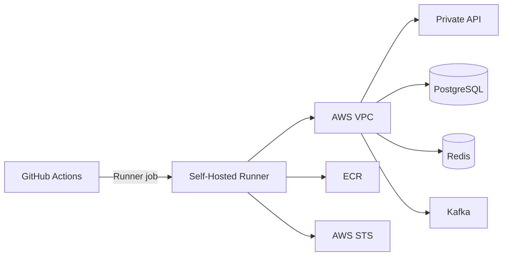
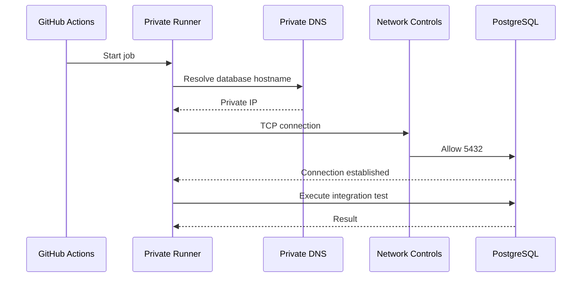
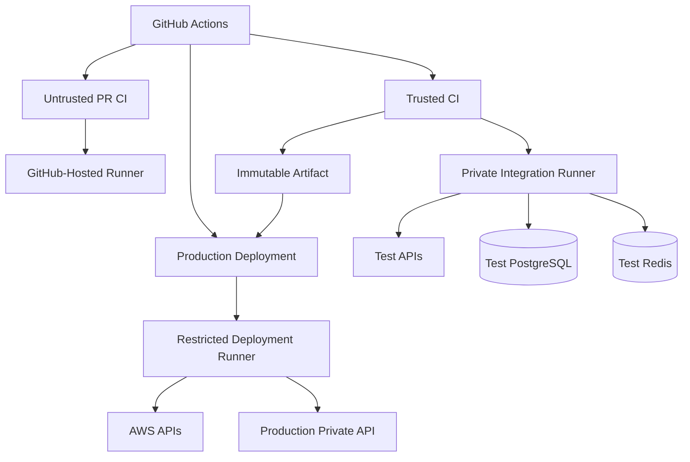

# 08- Private Network Access

## Overview

Private network access allows GitHub Actions workflows to reach infrastructure that is not publicly exposed to the internet.

Typical private resources include:

- Internal REST APIs
- PostgreSQL and MySQL databases
- Redis
- Kafka
- gRPC services
- Internal package registries
- Kubernetes clusters
- Private AWS services
- Internal deployment targets
- Corporate systems

A GitHub Actions workflow running on a standard GitHub-hosted runner normally executes outside the organization's private network. A private resource such as:

```text
10.0.10.25:5432
```

cannot simply be accessed because the workflow has a GitHub repository identity.

The network path and trust model must explicitly allow the connection.

A typical architecture is:

```text
GitHub Actions
      |
      | HTTPS / GitHub control plane
      v
Self-Hosted Runner
      |
      | Private Network
      v
+---------------------------+
| VPC / Corporate Network   |
|                           |
|  API      PostgreSQL      |
|   |           |           |
| Redis     Kafka / gRPC    |
+---------------------------+
```

Private network access is therefore primarily a **network architecture and trust-boundary problem**, not merely a GitHub Actions configuration problem.

---

## Why Private Network Access Matters

Production systems commonly keep sensitive infrastructure private.

For example:

```text
Internet
   |
   v
Public Load Balancer
   |
   v
Application
   |
   +----> PostgreSQL
   |
   +----> Redis
   |
   +----> Kafka
```

The database, Redis cluster, and Kafka brokers should generally not be exposed directly to the public internet merely to support CI/CD.

A CI pipeline may nevertheless need access to these resources for:

- Integration tests
- Database migrations
- Deployment
- Health checks
- Infrastructure provisioning
- Private package installation
- Internal API testing

The solution is to provide controlled network connectivity from an appropriate runner.

---

## Public vs Private CI Connectivity

| Model | Runner | Private Resource Access | Security Consideration |
|---|---|---|---|
| Public CI | GitHub-hosted | Usually unavailable directly | Strong isolation from private network |
| Public endpoint | GitHub-hosted | Via internet | Requires public exposure and strong authentication |
| Self-hosted | Private network | Direct | Runner becomes a privileged asset |
| VPN-connected runner | Self-hosted | Through VPN | Requires VPN lifecycle management |
| Private connectivity | Self-hosted | VPC/private routing | Stronger network isolation |
| Ephemeral private runner | Temporary self-hosted | Direct/private | Reduced persistent compromise risk |

The correct design depends on what the workflow actually needs to access.

---

## GitHub-Hosted Runners and Private Resources

A GitHub-hosted runner is not automatically placed inside your AWS VPC or corporate network.

For example:

```yaml
jobs:
  integration:
    runs-on: ubuntu-latest

    steps:
      - name: Test database
        run: |
          psql postgresql://10.0.10.20:5432/orders
```

This does not make the private database reachable.

The runner needs a network path to the address.

If the database is private, possible solutions include:

- Self-hosted runner inside the private network
- Controlled private networking architecture
- VPN-based connectivity
- A dedicated CI gateway
- An appropriate private networking product or architecture

---

## Self-Hosted Runners

Self-hosted runners are the most common model when CI requires direct private-network access.

The runner is placed inside the same network or an appropriately routed network as the target resources.

Example:

```text
GitHub
   |
   v
Self-Hosted Runner
   |
   +------------------+
   |                  |
   v                  v
Private API       PostgreSQL
   |
   v
Redis
```

The runner can therefore resolve and reach private DNS names and private IP addresses.

---

## AWS VPC Architecture

A typical AWS architecture is:



The runner can use private routes for application infrastructure while using controlled outbound connectivity for GitHub and AWS APIs.

---

## Runner Placement

The runner should be placed where it can reach the resources it actually requires.

For example:

```text
VPC
|
+-- Private Subnet A
|      |
|      +-- CI Runner
|
+-- Private Subnet B
|      |
|      +-- Application
|
+-- Private Subnet C
       |
       +-- PostgreSQL
```

Subnet placement alone does not guarantee connectivity.

You must also consider:

- Route tables
- Security groups
- Network ACLs
- DNS
- NAT
- Firewall rules
- Proxy configuration
- Service endpoints

---

## Routing

The first networking question should be:

> Does a route exist from the runner to the target?

For example:

```text
Runner
10.0.1.20
   |
   | Route
   v
Database
10.0.20.15
```

A missing route results in connectivity failure even when security groups are correctly configured.

For AWS, inspect:

- Subnet route tables
- VPC routing
- Transit Gateway
- VPC peering
- VPN
- Direct Connect
- NAT gateways
- Internet gateways

---

## Security Groups

AWS security groups should allow only the required traffic.

For example:

```text
CI Runner Security Group
        |
        | TCP 5432
        v
PostgreSQL Security Group
```

Prefer referencing the runner security group rather than allowing an entire CIDR range when the architecture permits it.

Conceptually:

```text
Source:
CI-Runner-SG

Destination:
Database-SG

Port:
5432
```

This is more maintainable than:

```text
0.0.0.0/0 -> 5432
```

which should generally not be used for a private database.

---

## Network ACLs

Network ACLs operate at the subnet boundary and are stateless.

Security groups are stateful.

A connection can therefore fail even when a security group looks correct if the subnet-level network policy blocks traffic.

When troubleshooting, inspect both:

```text
Security Group
+
Network ACL
```

rather than assuming the security group is the only control.

---

## Private DNS

Private network connectivity often depends on DNS.

Example:

```text
postgres.internal.example.com
        |
        v
10.0.20.15
```

A runner must be able to resolve the private hostname.

Test from the runner:

```bash
nslookup postgres.internal.example.com
```

or:

```bash
dig postgres.internal.example.com
```

On Windows:

```powershell
Resolve-DnsName postgres.internal.example.com
```

If DNS resolution fails, testing the application itself is premature.

---

## DNS Failure vs Network Failure

These are different failure domains.

### DNS failure

```text
Hostname
   X
IP address
```

### Routing failure

```text
Hostname
   ↓
IP address
   X
Network route
```

### Firewall failure

```text
Hostname
   ↓
IP
   ↓
Route
   X
Security policy
```

Troubleshoot in this order:

```text
DNS
→ Routing
→ Security
→ Port
→ TLS
→ Authentication
→ Application
```

---

## Private Network Access Flow

A production request can be modeled as:



Each layer represents a separate failure domain.

---

## Self-Hosted Runner Security Boundary

A self-hosted runner inside a private network is highly privileged infrastructure.

A workflow running on the runner may potentially access:

```text
Private APIs
Databases
Internal services
Cloud credentials
Repository contents
Deployment systems
```

Therefore:

```text
Private Network Access
+
Untrusted Workflow
```

is a dangerous combination.

Do not route arbitrary pull-request code to a privileged private runner.

---

## Fork Pull Requests

Fork-based pull requests require special care.

An external contributor may control:

- Source code
- Build scripts
- Test code
- Dependency declarations
- Shell commands

If that code executes on a self-hosted runner with private network access, it may attempt to reach internal infrastructure.

A safe architecture separates:

```text
Untrusted PR Validation
        ↓
GitHub-Hosted Runner
```

from:

```text
Trusted Build / Deployment
        ↓
Private Self-Hosted Runner
```

---

## `pull_request_target`

`pull_request_target` runs in the context of the target repository and therefore requires particular caution.

Do not use it as a shortcut for giving forked code access to:

```text
Secrets
Private Network
Cloud Credentials
Deployment Runners
```

The dangerous pattern is:

```text
Trusted Workflow
      ↓
Untrusted PR Code
      ↓
Private Runner
      ↓
Internal Network
```

Separate trust boundaries instead.

---

## Runner Groups for Private Networks

Runner groups can restrict which repositories can use private runners.

For example:

```text
General CI
   |
   +-- GitHub-hosted

Private CI
   |
   +-- private-network runners

Production Deployment
   |
   +-- restricted deployment runners
```

This prevents every repository from automatically gaining access to internal infrastructure.

---

## Labels for Network Capabilities

Use explicit labels.

Example:

```yaml
runs-on:
  - self-hosted
  - linux
  - private-network
```

For production:

```yaml
runs-on:
  - self-hosted
  - linux
  - private-network
  - production-deploy
```

Labels should represent capabilities, not arbitrary organizational names.

---

## Separate CI and Deployment Runners

A useful security boundary is:

```text
CI Runner
├── Private test database
├── Test services
└── Internal APIs

Deployment Runner
├── Production AWS
├── Production Kubernetes
└── Production services
```

Do not give ordinary integration-test runners production deployment credentials.

---

## Ephemeral Private Runners

Ephemeral runners are particularly useful for private-network workloads.

Lifecycle:

```text
Provision
   ↓
Join Private Network
   ↓
Register with GitHub
   ↓
Execute One Job
   ↓
Collect Artifacts
   ↓
Destroy
```

Advantages:

- Reduced persistent state
- Reduced credential residue
- Lower configuration drift
- Smaller compromise window
- Easier recovery

Limitations:

- Provisioning latency
- More infrastructure automation
- More complex autoscaling
- Potentially higher startup cost

---

## Persistent Private Runners

Persistent runners can be appropriate when:

- Specialized tooling is expensive to install
- Jobs are frequent
- Warm caches are important
- Provisioning takes significant time
- Software licensing requires persistent infrastructure

They require strong controls around:

- Workspace cleanup
- Credentials
- Patching
- Monitoring
- Configuration drift
- Job isolation

---

## Private Network Access for Integration Testing

A backend integration pipeline might look like:

```text
Pull Request
    ↓
Lint
    ↓
Unit Tests
    ↓
Build
    ↓
Trusted Integration Test
    ↓
Private Runner
    ↓
PostgreSQL + Redis + Internal APIs
    ↓
Test Reports
```

The private runner should be used only for the test stage that actually requires private connectivity.

Avoid moving the entire workflow into the private network unnecessarily.

---

## Django Integration Testing

A Django application may need access to a private PostgreSQL instance.

Example:

```yaml
jobs:
  integration:
    runs-on:
      - self-hosted
      - linux
      - private-network

    env:
      DATABASE_HOST: postgres.test.internal
      DATABASE_PORT: "5432"

    steps:
      - uses: actions/checkout@v4

      - name: Set up Python
        uses: actions/setup-python@v5
        with:
          python-version: "3.12"

      - name: Install dependencies
        run: |
          python -m pip install --upgrade pip
          pip install -r requirements.txt

      - name: Run Django checks
        run: |
          python manage.py check

      - name: Run integration tests
        run: |
          pytest -m integration
```

The runner's network identity provides connectivity; application credentials still need to be handled separately.

---

## FastAPI Integration Testing

A FastAPI service may need access to:

```text
Private PostgreSQL
Private Redis
Internal gRPC service
```

Example:

```yaml
- name: Run integration tests
  env:
    DATABASE_URL: ${{ secrets.TEST_DATABASE_URL }}
    REDIS_URL: ${{ secrets.TEST_REDIS_URL }}
  run: |
    pytest tests/integration
```

Network reachability and application authentication are separate controls.

A reachable database does not imply that the application should automatically be able to authenticate.

---

## Redis Access

Redis commonly runs in a private subnet.

Example:

```text
Runner
  |
  | TCP 6379
  v
Redis
```

Validate connectivity:

```bash
nc -vz redis.internal.example.com 6379
```

or:

```bash
timeout 5 bash -c '</dev/tcp/redis.internal.example.com/6379'
```

Do not expose Redis publicly merely to simplify CI.

---

## PostgreSQL Access

Validate the network first:

```bash
nc -vz postgres.internal.example.com 5432
```

Then validate authentication:

```bash
psql "$DATABASE_URL" -c "SELECT 1;"
```

This separates:

```text
Network problem
```

from:

```text
Database authentication problem
```

---

## Kafka Access

Kafka introduces additional networking considerations because clients may connect to bootstrap brokers and then receive broker addresses from metadata.

A runner may successfully reach:

```text
kafka-bootstrap.internal:9092
```

but fail afterward if the broker advertises unreachable addresses.

Typical failure:

```text
Bootstrap connection succeeds
        ↓
Metadata returned
        ↓
Advertised broker address unreachable
        ↓
Producer / consumer fails
```

Kafka's advertised listeners must be reachable from the runner's network.

---

## gRPC Private Services

gRPC commonly runs over HTTP/2.

A private runner must have:

```text
DNS
Routing
TCP connectivity
TLS trust
Authentication
```

A basic port check:

```bash
nc -vz grpc.internal.example.com 50051
```

does not validate the full gRPC protocol.

Use an appropriate application-level health check for final validation.

---

## Internal REST APIs

Private APIs should normally use:

```text
Private DNS
TLS
Authentication
Authorization
Network restrictions
```

A runner should not bypass application authentication merely because it is inside the VPC.

The security model should remain:

```text
Network Authorization
+
Application Authentication
+
Application Authorization
```

---

## Private Package Registries

Private network runners are useful when Python or Node dependencies come from internal registries.

Example:

```text
Runner
   ↓
Internal PyPI
   ↓
Private Packages
```

For Python:

```bash
pip install \
  --index-url https://packages.internal.example.com/simple \
  -r requirements.txt
```

Credentials should be injected securely and should not be persisted in the runner image.

---

## AWS Private Endpoints

AWS workloads can use VPC endpoints for supported AWS services.

This can reduce the need for general internet egress.

Examples include private access to services such as:

```text
S3
ECR
STS
CloudWatch
```

The exact endpoint architecture depends on the AWS service and workload.

A private runner should have only the endpoints required by its job.

---

## NAT Gateway

A private subnet may use a NAT gateway for outbound internet access.

Conceptually:

```text
Private Runner
      |
      v
Private Subnet
      |
      v
NAT Gateway
      |
      v
Internet
```

This can allow the runner to reach:

```text
GitHub
Package Registries
External APIs
AWS APIs
```

without assigning a public IP to the runner.

NAT gateways introduce cost and should be designed according to actual traffic requirements.

---

## Internet Egress Control

A private runner does not automatically mean a secure runner.

If it can make unrestricted outbound connections, compromised workflow code may exfiltrate data.

Consider:

- Egress firewall
- Proxy
- Domain allowlists
- VPC endpoints
- NAT controls
- Network monitoring

The required balance depends on workload sensitivity.

---

## Proxy Architecture

Some organizations route outbound traffic through a proxy:

```text
Private Runner
      |
      v
Corporate Proxy
      |
      +----> GitHub
      +----> Package Registry
      +----> External API
```

The proxy provides a centralized control point for:

- Egress policy
- Logging
- Domain restrictions
- TLS inspection where appropriate
- Traffic monitoring

---

## VPN Connectivity

A self-hosted runner outside the private network can use a VPN.

Example:

```text
GitHub
   |
   v
Runner
   |
   | VPN Tunnel
   v
Corporate Network
```

VPN introduces additional operational dependencies:

- Tunnel availability
- Routing
- DNS
- Credential management
- MTU issues
- Certificate management
- Monitoring

For AWS-native workloads, placing the runner directly inside the appropriate VPC can often simplify routing.

---

## Transit Gateway

For organizations with multiple VPCs:

```text
Runner VPC
     |
     v
Transit Gateway
   /   |   \
  /    |    \
VPC A VPC B VPC C
```

The runner may access multiple private networks through centralized routing.

This increases the runner's potential blast radius, so route and security boundaries must be tightly controlled.

---

## VPC Peering

VPC peering can provide private connectivity between networks.

Example:

```text
CI VPC
  |
  | Peering
  v
Application VPC
```

Peering is useful for targeted connectivity but becomes harder to manage as the number of VPCs grows.

The important CI/CD question remains:

> Does this runner really need access to this network?

---

## Network Segmentation

Avoid:

```text
Runner
  |
  +----> Entire VPC
```

Prefer:

```text
Runner
  |
  +----> Test API
  |
  +----> Test DB
  |
  +----> Test Redis
```

Network access should follow workload requirements.

---

## Private Network and Secrets

Network location is not a replacement for secret management.

A runner may be inside the VPC but still require:

```text
Database Password
API Token
TLS Certificate
AWS Role
```

Use GitHub secrets, environment protection, AWS IAM, Secrets Manager, or another appropriate secret-management system.

Do not bake secrets into:

```text
Runner images
Terraform files
Docker images
Git repositories
Environment templates
```

---

## AWS OIDC and Private Runners

OIDC allows GitHub Actions to exchange a GitHub-issued identity token for temporary AWS credentials.

The architecture is:

```text
GitHub Actions
      |
      | OIDC
      v
AWS STS
      |
      | AssumeRole
      v
IAM Role
      |
      v
AWS Resources
```

The runner can simultaneously use:

```text
Private Network
+
Temporary AWS Identity
```

These solve different problems.

Network controls determine **where traffic can go**.

IAM determines **what AWS operations the workflow can perform**.

---

## Runner IAM vs Instance Profile

A self-hosted runner on EC2 may receive AWS credentials through an instance profile.

This can be useful for infrastructure-level operations, but it increases the privilege associated with the host.

For GitHub workflow identity, OIDC can provide a more explicit workload identity boundary.

Do not automatically give a runner a broad instance profile merely because it needs access to one AWS service.

---

## Private ECR Access

A private runner can pull or push images to Amazon ECR.

Example:

```text
Private Runner
      |
      v
ECR
```

A production pipeline can use:

```text
GitHub OIDC
    ↓
STS
    ↓
IAM Role
    ↓
ECR
```

This avoids long-lived AWS access keys in GitHub secrets.

---

## Private ECS Deployment

A deployment runner may need to access AWS APIs while also reaching private ECS services for health validation.

Architecture:

```text
GitHub
   |
   v
Deployment Runner
   |
   +----> AWS APIs
   |
   +----> Private Load Balancer
   |
   +----> Private ECS Services
```

Keep deployment credentials separate from ordinary CI credentials.

---

## Private Kubernetes Deployment

A private Kubernetes cluster can require the deployment runner to have network access to the Kubernetes API endpoint.

Example:

```text
Deployment Runner
       |
       | Private Network
       v
Kubernetes API
       |
       v
Cluster
```

The runner needs both:

```text
Network connectivity
+
Kubernetes authorization
```

One without the other is insufficient.

---

## Private API Gateway and Internal APIs

Private APIs may be exposed through:

```text
Internal Load Balancer
Private API Gateway
Service Mesh
Ingress
Nginx
```

The runner should connect using the same production-like network path that the application is expected to use where practical.

This improves the value of integration testing.

---

## Security Model

A secure private CI architecture uses multiple layers:

```text
GitHub Repository Trust
        ↓
Workflow Permissions
        ↓
Runner Group
        ↓
Runner Identity
        ↓
Network Routing
        ↓
Security Group / Firewall
        ↓
TLS
        ↓
Application Authentication
        ↓
Application Authorization
```

No single layer should be treated as sufficient.

---

## Least Privilege

A private runner should not automatically have:

```text
Full VPC access
Full AWS access
Production database access
Production Kubernetes access
```

Instead define narrow capabilities.

For example:

```text
Integration Runner
    ├── Test PostgreSQL
    ├── Test Redis
    └── Test API

Production Runner
    ├── Production deployment API
    └── Production health endpoint
```

---

## TLS

Private traffic should still use TLS when appropriate.

Private IP addressing does not automatically provide encryption or application identity.

For example:

```text
https://api.internal.example.com
```

is preferable to treating internal HTTP as inherently trusted when the architecture requires encrypted service-to-service communication.

---

## Certificate Trust

Private services may use internal certificate authorities.

The runner must trust the appropriate CA.

Do not solve certificate problems by globally disabling TLS verification.

Avoid:

```bash
curl -k https://internal.example.com
```

as a permanent CI configuration.

Instead install and trust the correct CA chain.

---

## Private Network Performance

Network latency matters for CI jobs that repeatedly communicate with remote private services.

For example:

```text
Runner
  ↓
Private API
  ↓
Database
```

may produce many network round trips.

Integration tests should avoid unnecessarily chatty communication.

For large test suites, consider:

- Local service containers
- Ephemeral databases
- Test-specific environments
- Connection pooling
- Parallelization
- Data seeding optimization

---

## Network Isolation vs Test Isolation

These are different concerns.

Network isolation:

```text
Who can reach the service?
```

Test isolation:

```text
Who can modify or observe test data?
```

A private shared database can still produce flaky tests if multiple CI jobs modify the same records.

Prefer:

```text
Ephemeral Database
```

or:

```text
Per-Job Schema / Database
```

when practical.

---

## Parallel CI Jobs

Private resources can become bottlenecks.

Example:

```text
20 CI Jobs
   |
   v
One PostgreSQL Instance
```

Potential problems:

- Connection exhaustion
- CPU saturation
- Lock contention
- Test interference
- Network saturation

Capacity planning must consider CI concurrency, not just production traffic.

---

## Connection Pooling

If many CI jobs connect to PostgreSQL, connection pooling can protect the database.

However, pooling should be designed carefully.

For example:

```text
100 CI Jobs
    ↓
Connection Pool
    ↓
PostgreSQL
```

The pool itself becomes another infrastructure component and should not become an uncontrolled bottleneck.

---

## Private Kafka Test Environments

Kafka integration tests can generate significant load.

Avoid running unbounded CI traffic against shared production Kafka clusters.

Prefer:

```text
Dedicated Test Kafka
```

or:

```text
Ephemeral Kafka Environment
```

when appropriate.

Use unique topics or namespaces per test run to reduce cross-test interference.

---

## Private Redis Test Environments

Shared Redis environments can cause test contamination.

Avoid using production Redis for CI.

Prefer:

```text
Dedicated Test Redis
```

with controlled access.

---

## Private Database Migration Tests

Migration testing is a common reason for private CI access.

Example:

```text
Build
 ↓
Private Test DB
 ↓
Run migrations
 ↓
Run application tests
 ↓
Validate schema
```

Production migrations should normally be separated from ordinary integration tests and protected by deployment controls.

---

## Environment Promotion

A secure architecture separates environments:

```text
Development
     ↓
Staging
     ↓
Production
```

The runner used for staging should not automatically gain production access.

Use separate:

```text
Runner Groups
IAM Roles
Network Paths
Secrets
Environments
```

where the risk boundary requires it.

---

## Deployment Concurrency

Private deployments can race with each other.

Example:

```text
Deployment A → Production
Deployment B → Production
```

Both may attempt:

```text
Database migration
Service restart
Infrastructure update
Traffic switch
```

Use GitHub Actions concurrency:

```yaml
concurrency:
  group: production-deployment
  cancel-in-progress: false
```

Combine concurrency with idempotent deployment procedures.

---

## Build Once, Promote Many

Private network access should not require rebuilding artifacts in every environment.

Prefer:

```text
Public / Isolated CI
       ↓
Immutable Artifact
       ↓
Staging
       ↓
Approval
       ↓
Private Production Runner
       ↓
Production
```

The production runner should promote the validated artifact rather than rebuild it.

---

## Artifact Security

Private runners should not be treated as trusted artifact stores.

Use durable artifact systems such as:

- GitHub Actions artifacts
- Amazon S3
- Amazon ECR
- Another approved artifact registry

Where appropriate, use:

```text
Digest
+
SBOM
+
Provenance
+
Attestation
+
Signature
```

to verify artifact integrity.

---

## Monitoring Private Connectivity

Monitor:

```text
Runner availability
DNS failures
Connection failures
Latency
Firewall denies
VPN state
NAT utilization
Transit Gateway health
Database connections
Private API health
```

A CI failure may be caused by infrastructure outside GitHub Actions.

---

## Observability Correlation

Include identifiers such as:

```text
GitHub Run ID
Workflow
Job
Runner
Commit SHA
Environment
Deployment ID
```

in deployment and application logs.

This allows engineers to correlate:

```text
GitHub Actions run
        ↓
Runner
        ↓
Network request
        ↓
Deployment
        ↓
Application
```

---

## Failure Domains

Private network CI should be analyzed by failure domain:

| Failure Domain | Example |
|---|---|
| GitHub | Workflow not dispatched |
| Runner | Runner offline |
| DNS | Private hostname unresolved |
| Routing | No route to subnet |
| Firewall | Security group denied |
| TLS | Certificate validation failure |
| Authentication | Invalid database credentials |
| Authorization | User lacks required permission |
| Service | PostgreSQL unavailable |
| Application | API returns 500 |
| Capacity | Connection exhaustion |

This prevents random configuration changes during incidents.

---

## Troubleshooting Workflow

Use:

```text
Symptom
  ↓
DNS
  ↓
Route
  ↓
Port
  ↓
Firewall
  ↓
TLS
  ↓
Authentication
  ↓
Authorization
  ↓
Application
```

Do not start by changing application code when the runner cannot establish a TCP connection.

---

## DNS Troubleshooting

Linux:

```bash
getent hosts api.internal.example.com
```

```bash
nslookup api.internal.example.com
```

```bash
dig api.internal.example.com
```

Windows:

```powershell
Resolve-DnsName api.internal.example.com
```

Check whether the resolved address belongs to the expected private network.

---

## Port Troubleshooting

Linux:

```bash
nc -vz postgres.internal.example.com 5432
```

Windows:

```powershell
Test-NetConnection postgres.internal.example.com -Port 5432
```

If this fails, investigate network infrastructure before changing application credentials.

---

## HTTP Troubleshooting

```bash
curl -v https://api.internal.example.com/health
```

The verbose output helps distinguish:

```text
DNS
TCP
TLS
HTTP
```

failures.

---

## TLS Troubleshooting

Inspect the certificate:

```bash
openssl s_client \
  -connect api.internal.example.com:443 \
  -servername api.internal.example.com
```

Check:

- Certificate chain
- Hostname
- Expiration
- Trusted CA
- TLS version

Avoid disabling certificate validation merely to make CI pass.

---

## Database Troubleshooting

Test PostgreSQL:

```bash
psql "$DATABASE_URL" -c "SELECT 1;"
```

Test MySQL:

```bash
mysql \
  --host="$MYSQL_HOST" \
  --port="$MYSQL_PORT" \
  --user="$MYSQL_USER" \
  --password \
  "$MYSQL_DATABASE"
```

First prove connectivity, then authentication, then application behavior.

---

## AWS Connectivity Troubleshooting

Check AWS identity:

```bash
aws sts get-caller-identity
```

Check region:

```bash
aws configure get region
```

For a private runner, determine whether the required AWS service is reached through:

```text
VPC Endpoint
NAT
Public AWS API
Proxy
```

---

## GitHub Actions Troubleshooting

If a private runner is not selected:

```text
Check runs-on
Check runner labels
Check runner group
Check repository access
Check runner online state
Check runner busy state
```

If the runner executes but cannot reach the service:

```text
Check DNS
Check routing
Check security groups
Check NACLs
Check firewall
Check proxy
Check target service
```

---

## Common Misconfigurations

### Exposing a Private Database Publicly

Do not expose:

```text
PostgreSQL
Redis
Kafka
```

to the internet just to support CI.

### Using a Production Runner for PR Testing

Untrusted code can inherit the runner's network privileges.

### Giving the Runner Full VPC Access

Network reachability should be narrowly scoped.

### Assuming Private Means Trusted

A private IP does not replace:

```text
Authentication
Authorization
TLS
```

### Ignoring DNS

Private DNS is frequently the first failure in internal service connectivity.

### Testing Only Port Connectivity

A successful TCP connection does not prove that:

```text
TLS
Authentication
Authorization
Application
```

will succeed.

### Sharing Production Databases with CI

CI tests can modify data, create locks, consume connections, or accidentally execute destructive operations.

### Baking Credentials into Runner Images

Runner images should be reusable without embedding environment secrets.

---

## Production Architecture

A mature architecture can separate CI, integration, and deployment trust zones:



The key design principle is **privilege separation**.

---

## Recommended Runner Segmentation

| Runner Pool | Network | Typical Workload | Trust Level |
|---|---|---|---|
| Public CI | Internet | Lint/unit tests | Lower |
| Private Integration | Test VPC | Integration tests | Medium |
| Build | Controlled network | Image builds | Medium |
| Production Deployment | Production network | Deployment | High |
| Sensitive Deployment | Restricted | Critical infrastructure | Very high |

The exact segmentation should follow organizational risk.

---

## Governance

Organizations should define:

- Which repositories can use private runners
- Which runner groups exist
- Which networks each group can access
- Which IAM roles are permitted
- Which environments can use each group
- Which actions are allowed
- Which workflows can reach production
- How runners are patched
- How runners are decommissioned

This prevents private network access from becoming an undocumented capability.

---

## Reliability

Private CI depends on more components than a standard GitHub-hosted workflow.

The dependency chain may be:

```text
GitHub
 ↓
Runner
 ↓
DNS
 ↓
Routing
 ↓
Firewall
 ↓
Private Service
 ↓
Database
```

Each additional dependency adds another failure domain.

Use redundancy where the workload requires it.

---

## High Availability

For critical workflows:

```text
Private Runner Group
├── Runner A
├── Runner B
└── Runner C
```

Distribute runners across infrastructure failure domains.

For private services, use highly available architectures where appropriate:

```text
Multi-AZ Database
Multiple API Instances
Highly Available Redis
Highly Available Kafka
```

CI reliability should not depend on a single private test host.

---

## Disaster Recovery

A private runner should be reproducible.

Maintain:

```text
Runner Image
Provisioning Code
Network Configuration
IAM Configuration
Runner Group
Labels
Monitoring
Registration Automation
```

If a runner is destroyed, recovery should be:

```text
Provision
→ Register
→ Validate
→ Execute
```

rather than:

```text
Find the engineer who originally configured the machine
```

---

## Cost Considerations

Private network CI can increase infrastructure cost through:

- EC2 instances
- NAT gateways
- VPN
- Transit Gateway
- Load balancers
- Dedicated databases
- Dedicated Redis
- Dedicated Kafka
- Monitoring
- Egress

Reduce cost by:

- Using GitHub-hosted runners for workloads that do not require private access
- Using ephemeral environments selectively
- Reusing appropriate test infrastructure
- Autoscaling private runners
- Using smaller runner instances
- Using local service containers when private access is unnecessary

---

## Senior Design Principles

### Private Access Should Be Capability-Based

A runner should receive private access because its workload requires it, not because it is convenient.

### Network Access Is a Security Boundary

A compromised workflow on a private runner can become an internal network threat.

### Separate Trust Zones

Keep:

```text
Untrusted CI
Trusted CI
Private Integration
Production Deployment
```

separate when their privilege levels differ.

### Network and Identity Are Independent

Use:

```text
Network Controls
+
IAM
+
Application Authentication
+
Authorization
```

together.

### Prefer Ephemeral Runners for High-Trust Workloads

Ephemeral execution reduces persistent state and makes compromise recovery simpler.

### Promote Immutable Artifacts

Do not rebuild artifacts merely because the deployment occurs from a private runner.

---

## Interview Traps

### How Does a GitHub Actions Job Access a Private AWS Database?

The runner needs a network path to the database, commonly through a self-hosted runner located in or connected to the VPC.

### Does a Self-Hosted Runner Automatically Have VPC Access?

No. The runner still requires correct:

```text
Routing
Security Groups
NACLs
DNS
Firewall
```

configuration.

### Is a Private Runner Safe for Pull Requests?

Not automatically. If untrusted code can execute on it, the code may inherit access to private resources.

### Why Not Open the Database to GitHub Actions IP Addresses?

This increases the database's public exposure and introduces operational complexity around changing runner addresses. A private runner architecture can keep the database private.

### What Is More Important: Security Group or Routing?

Both are required. A correct security group cannot compensate for a missing route, and a correct route cannot compensate for a blocking security policy.

### Does OIDC Provide Network Access?

No.

OIDC provides an identity mechanism for cloud authentication.

Network routing determines connectivity.

### Why Can Kafka Fail Even When Port 9092 Is Reachable?

Kafka clients receive broker metadata after connecting to the bootstrap server. Advertised broker addresses must also be reachable from the runner.

---

## Production Checklist

### Network

- [ ] Runner has a required private route.
- [ ] Private DNS resolves correctly.
- [ ] Security groups are least privilege.
- [ ] Network ACLs are understood.
- [ ] Firewall rules are controlled.
- [ ] Egress is intentionally designed.
- [ ] Required private endpoints exist.

### Runner

- [ ] Private runner is in an appropriate runner group.
- [ ] Labels accurately represent capabilities.
- [ ] Runner image is versioned.
- [ ] Runner lifecycle is automated.
- [ ] Persistent state is minimized.
- [ ] Monitoring is enabled.

### Security

- [ ] Untrusted PRs cannot use privileged runners.
- [ ] Production deployment runners are restricted.
- [ ] Secrets are not baked into images.
- [ ] AWS credentials use short-lived identity where appropriate.
- [ ] IAM roles are least privilege.
- [ ] TLS is enabled where required.
- [ ] Internal services still enforce authentication and authorization.

### CI/CD

- [ ] Private access is limited to jobs that need it.
- [ ] Integration tests use isolated test resources.
- [ ] Production artifacts are immutable.
- [ ] Build and deployment stages are separated.
- [ ] Deployment concurrency is configured.
- [ ] Rollback is supported.

### Operations

- [ ] DNS diagnostics are available.
- [ ] Network connectivity checks are documented.
- [ ] Runner health is monitored.
- [ ] Private service health is monitored.
- [ ] Failure domains are documented.
- [ ] Runner recovery is automated.
- [ ] Disaster recovery has been tested.

## Key Takeaways

- Private network access in GitHub Actions requires an explicit network path; self-hosted runners are commonly used when workflows must reach private AWS or corporate infrastructure.
- Network connectivity, DNS, routing, firewall rules, TLS, authentication, and authorization are separate layers and should be troubleshot independently.
- A private self-hosted runner is a privileged security boundary, so untrusted pull requests should not execute on runners that can reach sensitive internal systems.
- Separate runner groups, IAM roles, network paths, and environments to isolate ordinary CI, private integration testing, and production deployment workloads.
- Prefer ephemeral runners and immutable artifact promotion for sensitive production pipelines, while using GitHub-hosted runners whenever private network access is not actually required.