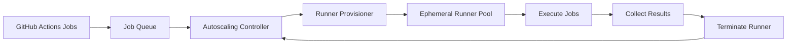
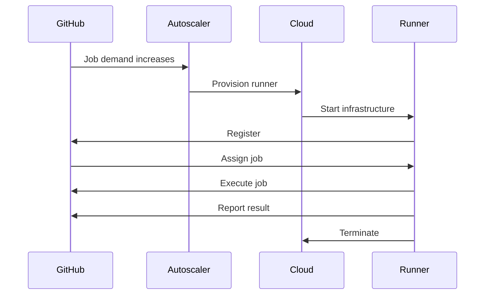
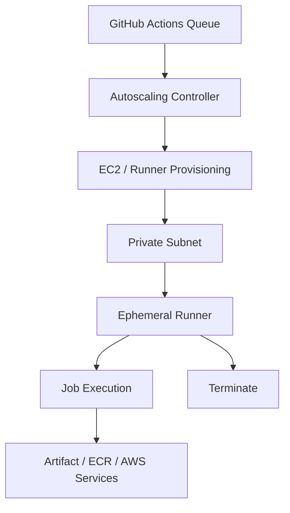
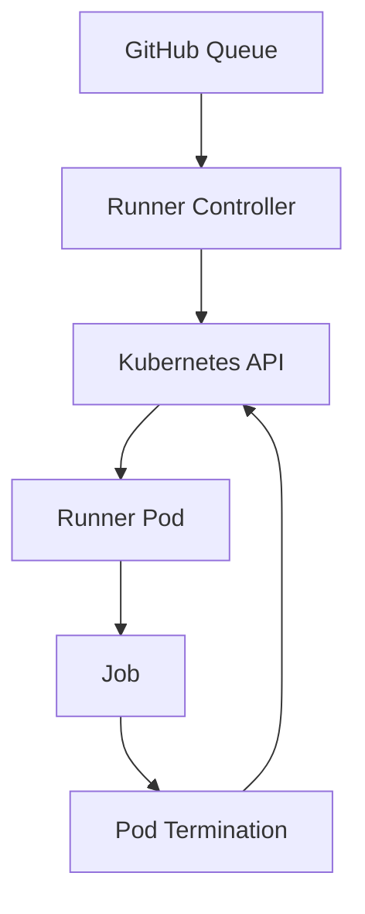
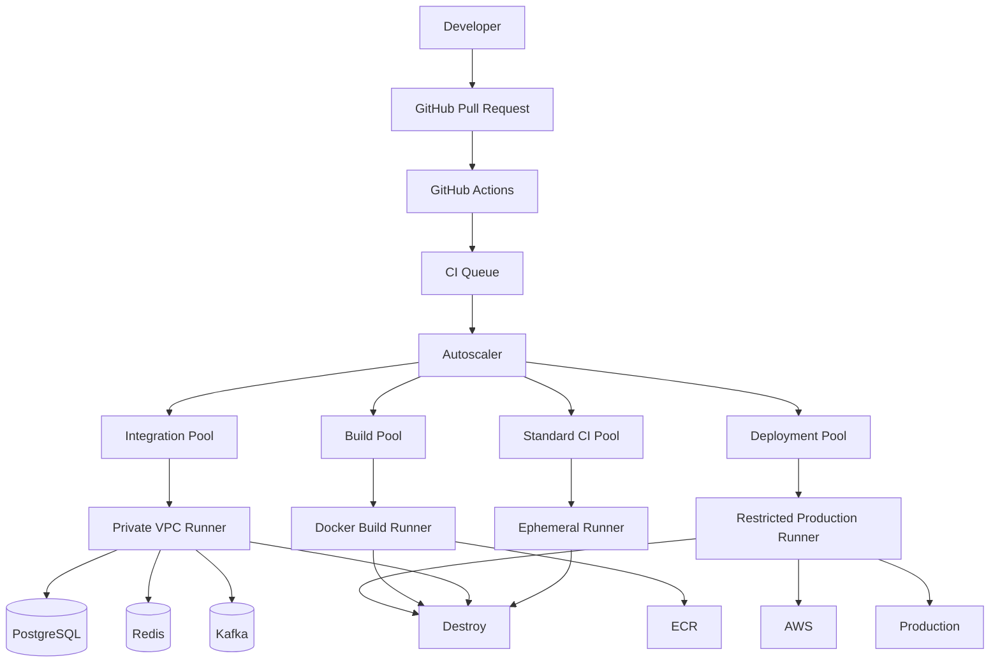

# 10- Runner Autoscaling

## Overview

Runner autoscaling is the practice of dynamically increasing or decreasing GitHub Actions runner capacity based on CI/CD workload demand.

Instead of maintaining a fixed pool of self-hosted runners:

```text
Fixed Runner Pool
├── Runner 1
├── Runner 2
├── Runner 3
└── Runner 4
```

an autoscaled architecture adjusts capacity:

```text
Workflow Queue
      ↓
Autoscaling Controller
      ↓
Provision Runners
      ↓
Execute Jobs
      ↓
Destroy Idle Runners
```

Autoscaling is particularly valuable when CI/CD workloads are bursty. A team may have only a few jobs during normal development but hundreds of jobs during a large merge, release, or matrix test.

For production GitHub Actions infrastructure, runner autoscaling should be designed around:

- Queue demand
- Runner startup latency
- Job duration
- Runner isolation
- Cost
- Security
- Private-network requirements
- Failure recovery
- Capacity limits
- Observability
- Runner lifecycle management

The most important architectural distinction is:

> Autoscaling determines how much runner capacity exists; ephemeral runners determine how long an individual runner remains alive.

These concepts work particularly well together.

---

## Why Runner Autoscaling Exists

A fixed self-hosted runner pool has two opposing problems.

### Too Few Runners

If demand exceeds capacity:

```text
100 queued jobs
      ↓
5 runners
      ↓
95 jobs waiting
```

This increases CI queue time and slows development.

### Too Many Runners

If capacity is provisioned for the maximum expected workload:

```text
100 runners
      ↓
10 active jobs
      ↓
90 mostly idle runners
```

This increases infrastructure cost.

Autoscaling attempts to match capacity to demand.

```text
Demand ↑  → Capacity ↑
Demand ↓  → Capacity ↓
```

---

## Autoscaling vs Ephemeral Runners

These are related but different concepts.

| Concept | Purpose |
|---|---|
| Autoscaling | Adjusts the number of available runners |
| Ephemeral runner | Defines the lifecycle of an individual runner |
| Persistent runner | Allows a runner to execute multiple jobs |
| Runner group | Controls access and organization |
| Runner label | Describes runner capabilities |
| Scheduler | Selects a compatible runner for a job |

A common production design is:

```text
Autoscaler
    ↓
Ephemeral Runner Pool
    ↓
One Job
    ↓
Destroy Runner
```

This provides both elastic capacity and workload isolation.

---

## Fixed Capacity vs Autoscaling

| Model | Capacity | Startup | Cost | Isolation | Complexity |
|---|---|---|---|---|---|
| Fixed persistent | Static | Low | Higher idle cost | Lower | Medium |
| Fixed ephemeral | Static | Low/medium | Medium | High | Medium |
| Autoscaled persistent | Dynamic | Low after capacity exists | Variable | Lower | High |
| Autoscaled ephemeral | Dynamic | Higher | Efficient | High | High |
| Warm ephemeral pool | Dynamic + warm | Low/medium | Medium | High | High |

The choice should be based on workload characteristics rather than assuming autoscaling is always better.

---

## Core Architecture

A basic architecture is:



The autoscaler does not execute CI jobs itself.

Its responsibility is to ensure enough compatible runner capacity exists.

---

## Demand and Capacity

The simplest autoscaling relationship is:

```text
Required Capacity ≈ Runnable Jobs
```

But this is only a starting point.

A production autoscaler must consider:

- Number of queued jobs
- Number of busy runners
- Number of available runners
- Runner labels
- Runner groups
- Job duration
- Provisioning time
- Maximum capacity
- Minimum capacity
- Resource constraints
- Availability zones
- Runner startup failures

For example:

```text
Queued jobs       = 20
Available runners = 2
Busy runners      = 8

Required additional capacity ≈ 10
```

The exact scaling algorithm depends on the runner platform.

---

## Queue-Based Scaling

Queue depth is one of the most useful scaling signals.

```text
Queue depth = 0
      ↓
No additional runners

Queue depth = 10
      ↓
Provision more runners

Queue depth = 100
      ↓
Scale aggressively within limits
```

However, queue depth alone can be misleading.

Suppose all queued jobs require:

```text
linux + private-network
```

but the autoscaler provisions:

```text
linux + public-network
```

The total runner count increases while the relevant capacity remains zero.

Autoscaling should therefore consider **compatible capacity**, not merely total capacity.

---

## Label-Aware Autoscaling

A production system may have multiple runner pools:

```text
                    ┌── Linux CI
                    │
Workflow Jobs ──────┼── Docker Build
                    │
                    ├── Private Integration
                    │
                    └── Production Deployment
```

A job might request:

```yaml
runs-on:
  - self-hosted
  - linux
  - ephemeral
  - private-network
```

The autoscaler must provision a runner capable of satisfying those requirements.

---

## Runner Groups and Autoscaling

Runner groups can provide organizational and security boundaries.

For example:

```text
Runner Groups

CI
 └── Standard Linux

Build
 └── Docker-capable

Integration
 └── Private VPC

Staging
 └── Restricted deployment

Production
 └── Highly restricted deployment
```

Each group can have different:

- Capacity limits
- Images
- Network access
- IAM roles
- Scaling policies
- Security controls

This is preferable to treating every runner as interchangeable.

---

## Autoscaling Lifecycle

A typical lifecycle is:



The exact control-plane implementation varies, but the lifecycle is conceptually the same.

---

## Provisioning Latency

Autoscaling introduces startup latency.

For a VM-based runner:

```text
Scaling decision
      ↓
API request
      ↓
VM provisioning
      ↓
OS boot
      ↓
Bootstrap
      ↓
Runner registration
      ↓
Ready
      ↓
Job execution
```

If provisioning takes two minutes, autoscaling cannot immediately eliminate queue latency.

Measure:

```text
Provisioning latency
=
Runner ready
-
Provision request
```

and:

```text
Queue latency
=
Job start
-
Job queued
```

These are different metrics.

---

## Cold Starts

Cold starts are one of the primary trade-offs of autoscaling.

Example:

```text
Job duration = 30 seconds
Runner startup = 90 seconds
```

The infrastructure spends more time preparing the runner than executing the job.

Cold-start optimization techniques include:

- Golden images
- Preinstalled dependencies
- Fast bootstrap
- Smaller images
- Preconfigured networking
- Efficient registration
- Container-based provisioning
- Warm pools
- Appropriate runner placement

---

## Golden Images

A golden runner image contains stable dependencies required by the workload.

For example:

```text
Ubuntu
 ├── Git
 ├── Python 3.12
 ├── Docker
 ├── Buildx
 ├── AWS CLI
 ├── Security tooling
 └── GitHub Runner
```

The image should be tested before deployment.

A useful lifecycle is:

```text
Base OS
   ↓
Security patches
   ↓
CI tooling
   ↓
Runner software
   ↓
Validation
   ↓
Golden image
   ↓
Autoscaled runners
```

Avoid installing every dependency during bootstrap if doing so creates significant startup latency.

---

## Image Versioning

Runner images should be immutable and versioned.

Example:

```text
runner-linux:v2026.09.01
runner-linux:v2026.09.15
runner-linux:v2026.10.01
```

The autoscaler should know which image version it is provisioning.

This allows operators to answer:

- Which image was used?
- When was it introduced?
- Which jobs used it?
- Did failures increase after deployment?

---

## Image Rollouts

Do not immediately switch every runner to a newly built image.

A safer approach is:

```text
New Image
    ↓
Validation
    ↓
Canary Pool
    ↓
Small Production Percentage
    ↓
Observe
    ↓
Full Rollout
```

This limits the blast radius of a broken image.

---

## Warm Pools

A warm pool maintains a small number of ready runners.

```text
              ┌── Ready Runner
              ├── Ready Runner
Autoscaler ───┤
              └── Ready Runner
```

When demand appears:

```text
Job
 ↓
Warm runner
 ↓
Immediate execution
```

The autoscaler then provisions replacement capacity.

Warm pools reduce cold-start latency at the cost of keeping some infrastructure running.

---

## Warm Pool Sizing

If a team normally receives bursts of 10 jobs but only 1–2 jobs arrive most of the time:

```text
Minimum warm capacity = 2
Burst capacity = 10
```

The system might maintain:

```text
2 warm runners
+
8 dynamically provisioned runners
```

The correct number should be derived from observed demand.

---

## Autoscaling Policies

A policy normally has:

- Minimum capacity
- Maximum capacity
- Scale-up threshold
- Scale-down threshold
- Cooldown period
- Provisioning timeout
- Runner lifetime
- Failure threshold

Conceptually:

```text
if compatible_queue > available_capacity:
    scale_up()

if compatible_queue == 0 and excess_capacity > 0:
    scale_down()
```

Production systems require additional safeguards.

---

## Scale-Up Behavior

Scale-up should react quickly enough to avoid excessive queue latency.

Example:

```text
Queue: 2
Capacity: 4
→ No scaling

Queue: 10
Capacity: 4
→ Add runners

Queue: 50
Capacity: 4
→ Aggressive scale-up within max limit
```

Do not allow unlimited scale-up.

---

## Maximum Capacity

Always define a hard upper bound.

For example:

```text
min = 2
max = 50
```

This protects against:

- Runaway workflows
- Fork abuse
- Accidental infinite matrices
- Workflow storms
- Infrastructure cost explosions
- Cloud quota exhaustion

Maximum capacity is both a reliability and security control.

---

## Minimum Capacity

Minimum capacity prevents the pool from scaling completely to zero.

Example:

```text
min = 2
max = 50
```

Advantages:

- Lower startup latency
- Better developer experience
- Faster response to normal workloads

Disadvantages:

- Idle cost
- Persistent infrastructure exposure if runners are not ephemeral

A zero minimum may be appropriate for low-frequency workloads.

---

## Scale-Down Behavior

Scale-down should be conservative.

Never terminate an active runner.

A runner should transition through:

```text
Ready
  ↓
Assigned
  ↓
Busy
  ↓
Finished
  ↓
Safe to terminate
```

The autoscaler must distinguish:

```text
Idle runner
```

from:

```text
Busy runner
```

before termination.

---

## Scale-Down Cooldown

Immediately removing runners after every job can cause oscillation.

Example:

```text
Jobs arrive
 ↓
Scale up
 ↓
Jobs finish
 ↓
Scale down
 ↓
More jobs arrive
 ↓
Scale up again
```

This creates unnecessary infrastructure churn.

A cooldown period can stabilize capacity.

---

## Scaling Oscillation

A poorly tuned autoscaler can oscillate:

```text
Scale up
   ↓
Scale down
   ↓
Scale up
   ↓
Scale down
```

This is commonly caused by:

- Aggressive thresholds
- No cooldown
- Slow queue metrics
- Long provisioning time
- Short jobs
- Delayed runner registration

Scaling decisions should account for infrastructure lag.

---

## Burst Workloads

CI/CD often produces bursts.

Examples:

- Large pull request
- Monorepo change
- Release
- Security scan
- Matrix testing
- Organization-wide dependency update
- Nightly test suite

A matrix can multiply a single workflow into many jobs:

```yaml
strategy:
  matrix:
    python: ["3.11", "3.12", "3.13"]
    database: ["postgres", "mysql"]
```

This produces:

```text
3 × 2 = 6 jobs
```

Large matrices can create significant demand spikes.

---

## Dynamic Matrices

Dynamic matrices can make demand unpredictable.

For example:

```text
Changed services
      ↓
Planning job
      ↓
JSON matrix
      ↓
N jobs
```

A monorepo change could suddenly produce dozens or hundreds of jobs.

Autoscaling therefore needs protection against uncontrolled concurrency.

---

## Concurrency Limits

Autoscaling should not replace workflow-level concurrency controls.

Example:

```yaml
concurrency:
  group: production
  cancel-in-progress: false
```

For pull requests:

```yaml
concurrency:
  group: ci-${{ github.workflow }}-${{ github.ref }}
  cancel-in-progress: true
```

This reduces unnecessary runner demand.

---

## Matrix and `max-parallel`

A matrix can also limit how much demand is generated.

```yaml
strategy:
  fail-fast: false
  max-parallel: 6
  matrix:
    python: ["3.11", "3.12", "3.13"]
```

This does not necessarily eliminate the matrix jobs, but it limits concurrent execution.

The correct value depends on:

- Runner capacity
- Job duration
- Cloud cost
- External service capacity
- Database connection limits

---

## Autoscaling and External Dependencies

Scaling CI runners does not mean every dependency should scale equally.

Suppose 50 integration tests run concurrently against PostgreSQL:

```text
50 runners
   ↓
50 test processes
   ↓
PostgreSQL
```

The database may become the bottleneck.

Likewise:

```text
50 runners
   ↓
Redis
```

or:

```text
50 runners
   ↓
Kafka
```

may overload shared infrastructure.

Autoscaling should consider downstream capacity.

---

## Database-Aware Scaling

For integration testing, consider:

- Connection limits
- CPU
- Memory
- IOPS
- Test database isolation
- Migration contention
- Lock contention

A runner scaling event should not accidentally become a database outage.

Possible strategies include:

- Dedicated test databases
- Per-job schemas
- Database pooling
- Concurrency limits
- Separate database clusters
- Scheduled load limits

---

## Redis-Aware Scaling

If each test job uses Redis:

```text
Runner × N
     ↓
Redis
```

consider:

- Connection count
- Memory
- Key isolation
- Cleanup
- Eviction
- CPU
- Network throughput

A dedicated Redis namespace or instance may be appropriate for parallel integration testing.

---

## Kafka-Aware Scaling

Kafka integration tests can require isolation for:

- Topics
- Consumer groups
- Partitions
- Message retention

A scaling event can create many simultaneous producers and consumers.

Use predictable naming where appropriate:

```text
ci.<run-id>.<job-id>.<topic>
```

and ensure cleanup does not interfere with another test.

---

## Runner Resource Classes

Not all jobs need the same runner size.

A useful architecture is:

```text
Small
 ├── lint
 └── unit tests

Medium
 ├── integration tests
 └── API tests

Large
 ├── Docker builds
 └── E2E tests
```

Jobs can request different labels:

```yaml
runs-on:
  - self-hosted
  - linux
  - ephemeral
  - medium
```

This improves resource utilization.

---

## Multi-Architecture Autoscaling

Some workloads require:

- x86_64
- ARM64

Separate pools can be used:

```text
linux-x64
linux-arm64
```

A matrix can test both:

```yaml
strategy:
  matrix:
    architecture:
      - x64
      - arm64
```

The autoscaler should maintain capacity for each architecture independently.

---

## GPU Runners

GPU workloads have different scaling economics.

Examples include:

- ML tests
- GPU-enabled builds
- Specialized data processing

GPU runners are expensive, so:

- Keep minimum capacity low
- Scale aggressively only when required
- Use specialized labels
- Enforce maximum capacity
- Destroy unused capacity
- Monitor GPU utilization

Do not place GPU workloads on general-purpose runner pools.

---

## Private Network Autoscaling

Private runners may require provisioning inside an AWS VPC or another private network.

Example:

```text
GitHub
   ↓
Autoscaler
   ↓
Private Subnet
   ↓
Ephemeral Runner
   ├── PostgreSQL
   ├── Redis
   ├── Kafka
   └── Internal APIs
```

The autoscaler must provision:

- Correct subnet
- Security groups
- IAM role
- DNS configuration
- Routing
- Egress path

A runner with the wrong network placement is effectively unusable even if registration succeeds.

---

## AWS Architecture

A common AWS architecture is:



The runner may use an EC2 instance profile for AWS access when appropriate.

For GitHub-to-AWS authentication from workflows, OIDC can be used to assume an IAM role.

---

## AWS OIDC with Autoscaled Runners

The runner itself should not require permanent AWS credentials.

A typical flow is:

```text
GitHub Workflow
      ↓
OIDC Token
      ↓
AWS STS
      ↓
IAM Role
      ↓
Temporary Credentials
      ↓
ECR / S3 / ECS / EC2 / CloudFormation
```

Use restrictive trust policies.

For example, restrict the role to:

- Specific repository
- Specific branch
- Specific environment
- Specific workflow identity where appropriate

---

## EC2-Based Runner Scaling

EC2 is useful when runners require:

- Custom OS packages
- Docker
- Private networking
- Large CPU/memory
- Specialized hardware
- Full VM isolation

The lifecycle can be:

```text
Scaling signal
    ↓
EC2 launch
    ↓
User data
    ↓
Runner registration
    ↓
Job
    ↓
Instance termination
```

The AMI should contain as much stable configuration as practical.

---

## User Data

A minimal bootstrap can configure runtime-specific values.

Conceptually:

```bash
#!/usr/bin/env bash
set -euo pipefail

echo "Bootstrapping runner"

# Install only runtime-specific configuration here.
# Do not hard-code credentials.
```

Avoid making user data responsible for installing an entire operating system's worth of dependencies.

Long bootstrap scripts increase startup latency and failure probability.

---

## Kubernetes-Based Autoscaling

Kubernetes can provision ephemeral runner Pods.



Advantages include:

- Fast provisioning
- Resource requests and limits
- Namespace isolation
- Declarative infrastructure
- Native Kubernetes scheduling
- Easy integration with private services

Security must account for:

- Service accounts
- RBAC
- Pod security
- Network policies
- Container images
- Secrets
- Privileged containers

---

## Kubernetes Node Autoscaling

Runner autoscaling and node autoscaling are different layers.

```text
GitHub Job Demand
      ↓
Runner Pod Autoscaling
      ↓
Insufficient Node Capacity
      ↓
Kubernetes Node Autoscaling
      ↓
New Nodes
      ↓
Runner Pods
```

This creates nested scaling delays.

Measure both:

```text
Runner provisioning latency
```

and:

```text
Node provisioning latency
```

---

## Layered Autoscaling

A large deployment may have:

```text
GitHub
  ↓
Runner Autoscaler
  ↓
Kubernetes
  ↓
Cluster Autoscaler
  ↓
Cloud Provider
```

Every layer can introduce:

- Delays
- Quotas
- Failure modes
- Oscillation
- Cost

Avoid tuning each layer independently.

The entire chain should be evaluated as one capacity system.

---

## Maximum Cloud Capacity

Cloud quotas can limit autoscaling.

Examples include:

- EC2 instance quotas
- EBS limits
- VPC IP availability
- NAT gateway capacity
- Kubernetes node capacity
- API rate limits

If the autoscaler requests 100 runners but the account can launch only 20:

```text
Desired capacity = 100
Actual capacity = 20
```

The remaining jobs stay queued.

Autoscaling must therefore monitor capacity shortfalls explicitly.

---

## Subnet IP Exhaustion

Private runner scaling can consume private IP addresses.

For example:

```text
/24 subnet
   ↓
Limited usable IPs
   ↓
Runner scaling reaches network capacity
```

A runner launch failure may therefore look like an application problem but actually be a subnet-capacity issue.

Monitor:

- Available IPs
- ENIs
- Subnet capacity
- Security-group limits
- NAT capacity

---

## API Rate Limits

Autoscaling can create API bursts.

Examples:

- GitHub API
- AWS APIs
- Kubernetes API
- Container registry
- Cloud provider APIs

A controller that launches hundreds of runners simultaneously may hit rate limits.

Use:

- Bounded concurrency
- Exponential backoff
- Jitter
- Retry policies
- Request batching where supported

---

## Autoscaling Failure Modes

Common failure domains include:

```text
Demand Detection
      ↓
Scaling Decision
      ↓
Provisioning
      ↓
Bootstrap
      ↓
Registration
      ↓
Scheduling
      ↓
Execution
      ↓
Cleanup
```

Do not diagnose all scaling failures as "GitHub Actions is slow."

---

## Workflow Queue Problems

### Symptom

Jobs remain queued.

### Possible Causes

- No matching runner
- Runner pool exhausted
- Autoscaler not seeing queue demand
- Incorrect labels
- Runner group restriction
- Capacity limit reached

### Isolation

Check:

```text
Job requirements
    ↓
Matching runner group
    ↓
Matching labels
    ↓
Available capacity
    ↓
Autoscaler metrics
```

---

## Autoscaler Not Scaling

### Possible Causes

- Queue metrics unavailable
- Authentication failure
- Controller stopped
- Incorrect runner scope
- Incorrect labels
- Maximum capacity reached
- API rate limiting

### Checks

Inspect:

- Autoscaler logs
- GitHub runner state
- Cloud events
- Queue metrics
- Controller health
- API errors

---

## Runners Provision but Never Register

Possible causes:

- Network connectivity
- Invalid registration token
- Incorrect repository/org URL
- Bootstrap failure
- DNS
- Proxy
- Firewall
- Runner software failure

The distinction is important:

```text
Provisioned
≠
Registered
≠
Ready
```

Each state should be monitored independently.

---

## Runners Register but Jobs Never Start

Check:

- Labels
- Runner group
- Repository access
- Job requirements
- Runner busy state
- Workflow `runs-on`
- Capacity assignment

For example:

```yaml
runs-on:
  - self-hosted
  - linux
  - private-network
```

requires a runner satisfying all requested labels.

---

## Runners Scale Too Aggressively

Symptoms:

- High cloud cost
- Large number of idle runners
- API throttling
- Database overload
- Network saturation

Potential causes:

- Incorrect queue metrics
- No maximum
- Poor cooldown
- Duplicate scaling signals
- Matrix explosion

Corrective actions:

- Add max capacity
- Tune scale-up thresholds
- Add cooldown
- Limit matrix parallelism
- Add downstream capacity controls

---

## Runners Scale Too Slowly

Symptoms:

- Long queue times
- Poor developer experience
- Jobs wait despite available cloud capacity

Potential causes:

- Slow provisioning
- Slow bootstrap
- Slow image pulls
- Incorrect scaling interval
- Conservative scale-up policy
- Cloud API latency

Optimize:

- Golden images
- Warm pools
- Faster bootstrap
- Larger scale-up increments
- Preconfigured networking

---

## Orphaned Runners

An orphaned runner may exist when:

```text
Cloud instance exists
but
GitHub runner registration is stale
```

or:

```text
GitHub runner exists
but
Cloud instance disappeared
```

These states should be reconciled.

A useful reconciliation process is:

```text
Cloud Inventory
      ↕
Runner Inventory
      ↕
Workflow Activity
```

Unknown resources should be investigated and cleaned up according to policy.

---

## Runner Lifetime

Even autoscaled runners should have a maximum lifetime.

For example:

```text
Provision
   ↓
Register
   ↓
Execute
   ↓
Terminate
```

If a runner remains stuck for an unexpected period:

```text
Maximum lifetime exceeded
       ↓
Force cleanup
```

This protects against:

- Hung jobs
- Controller bugs
- Cleanup failures
- Infrastructure leaks

---

## Stuck Jobs

A runner may appear active while the underlying job is no longer progressing.

Monitor:

- Job duration
- CPU
- Memory
- Network
- Heartbeat
- Runner status

Long-running jobs should have explicit timeouts where appropriate.

Example:

```yaml
jobs:
  integration:
    timeout-minutes: 45
```

Timeouts prevent infrastructure from being consumed indefinitely.

---

## Security Boundaries

Autoscaling does not eliminate runner security concerns.

A malicious workflow may still:

- Read environment variables
- Use available credentials
- Access private networks
- Modify artifacts
- Abuse cloud permissions
- Exfiltrate data

Use:

- Least-privilege `GITHUB_TOKEN`
- Environment protection
- OIDC
- Restricted IAM
- Runner groups
- Network segmentation
- Trusted actions
- SHA pinning
- Ephemeral lifecycle

---

## Untrusted Pull Requests

Avoid exposing privileged private runners to untrusted code.

For example:

```text
Fork PR
   ↓
Untrusted workflow
   ↓
Private production-network runner
```

is a dangerous architecture.

A safer model is:

```text
Fork PR
   ↓
Restricted CI
   ↓
No production credentials
   ↓
No unnecessary private-network access
```

Privileged deployment runners should be reserved for trusted deployment workflows.

---

## Production Runner Pools

A production organization can use:

```text
Runner Pools

Standard CI
    ↓
Ephemeral public-access runner

Private Integration
    ↓
Ephemeral VPC runner

Build
    ↓
Ephemeral Docker runner

Production Deployment
    ↓
Restricted ephemeral deployment runner
```

Each pool can have independent scaling policies.

---

## Deployment Runner Autoscaling

Deployment workloads are often low-volume but high-risk.

A production deployment pool might use:

```text
Minimum = 0
Maximum = 3
```

rather than maintaining many idle privileged runners.

When deployment demand appears:

```text
Approval
   ↓
Provision restricted runner
   ↓
OIDC
   ↓
Deploy
   ↓
Health validation
   ↓
Destroy
```

This minimizes the time privileged infrastructure exists.

---

## Artifact Promotion

Autoscaling should not cause artifacts to be rebuilt.

Preferred:

```text
Build Runner
    ↓
Docker Image
    ↓
ECR
    ↓
Staging
    ↓
Approval
    ↓
Production Runner
    ↓
Same Image Digest
```

The staging and production runners may be completely different machines.

That is an advantage.

---

## Security and Supply Chain

The autoscaling platform itself becomes part of the CI/CD supply chain.

Protect:

- Runner images
- Bootstrap scripts
- Autoscaler configuration
- Infrastructure code
- IAM policies
- Kubernetes manifests
- Container images
- Third-party actions

A compromised runner image can compromise every workflow using that pool.

---

## Runner Image Security

Images should be:

- Minimal
- Patched
- Scanned
- Versioned
- Reproducible where practical
- Stored in trusted registries
- Promoted through controlled environments

Avoid installing unnecessary software.

Every additional package increases the attack surface.

---

## Docker-in-Docker Considerations

Docker-based CI workloads can require privileged operations.

For example:

```text
Runner
  ↓
Docker daemon
  ↓
Build container
```

or:

```text
Runner container
  ↓
Host Docker socket
```

The second model can create a significant privilege boundary.

Autoscaled infrastructure should therefore explicitly define whether Docker workloads receive:

- Dedicated VM
- Isolated Docker daemon
- Rootless BuildKit
- Kubernetes build environment
- Privileged container

---

## Monitoring

A production autoscaling system should expose metrics such as:

### Capacity

```text
Desired runners
Available runners
Busy runners
Provisioning runners
Failed runners
```

### Queue

```text
Queued jobs
Queue age
Oldest queued job
Jobs by label
Jobs by runner group
```

### Provisioning

```text
Provision latency
Registration latency
Readiness latency
Bootstrap failures
```

### Lifecycle

```text
Runner lifetime
Termination success
Orphan count
Cleanup failures
```

### Cost

```text
Runner-hours
Cost per workflow
Cost per successful build
Idle capacity
Warm pool utilization
```

---

## Queue Age

Queue depth alone does not tell the complete story.

Suppose:

```text
Queue = 5 jobs
```

If they have been waiting for:

```text
10 seconds
```

the system may be healthy.

If they have been waiting for:

```text
20 minutes
```

capacity is clearly insufficient or unavailable.

Track:

```text
Oldest queued job age
```

as an important SLO indicator.

---

## Runner Utilization

A useful utilization measure is:

```text
Runner Utilization
=
Busy Runner Time
/
Available Runner Time
```

Very low utilization may indicate overprovisioning.

Very high utilization with growing queue age may indicate underprovisioning.

The target depends on workload and latency requirements.

---

## Cost Model

A simplified model is:

```text
Total Cost
=
Compute
+
Storage
+
Network
+
Registry
+
Logging
+
Control Plane
```

For autoscaled runners:

```text
Compute Cost
≈
Active Runner Time
+
Warm Pool Time
```

The objective is not simply minimizing runner count.

The objective is balancing:

```text
Cost
+
Queue Latency
+
Reliability
+
Security
```

---

## Cost Optimization Techniques

Use:

- Right-sized instance types
- Ephemeral runners
- Scale-to-zero where appropriate
- Small warm pools for latency-sensitive workloads
- Caching
- Golden images
- Efficient Docker builds
- Matrix limits
- Maximum capacity
- Spot capacity where workload interruption is acceptable

Do not use cheaper capacity for workloads that cannot tolerate interruption without designing retry and recovery behavior.

---

## Spot Instances

Spot capacity can reduce cost for suitable CI workloads.

Potential advantages:

- Lower compute cost
- Good fit for disposable workloads

Risks:

- Interruption
- Capacity availability
- Regional variability
- Job retry requirements

Suitable workloads often include:

- Unit tests
- Integration tests
- Non-critical builds
- Large parallel test matrices

Production deployment jobs may require a more predictable capacity model.

---

## High Availability

Autoscaling improves availability by avoiding dependence on one runner.

For example:

```text
Runner A fails
     ↓
Controller detects failure
     ↓
Runner B provisioned
     ↓
Job retries / continues
```

However, the autoscaler itself can become a single point of failure.

Consider redundancy for:

- Autoscaler
- Controller
- Queue monitoring
- Cloud API access
- Runner image registry
- Infrastructure state

---

## Multi-AZ Runner Infrastructure

For AWS-based runners:

```text
Region
├── Availability Zone A
│   └── Runner Pool
│
└── Availability Zone B
    └── Runner Pool
```

This reduces dependency on a single availability zone.

The runner workload should not require a specific instance unless the job explicitly needs locality.

---

## Disaster Recovery

The recovery objective should be:

```text
Runner infrastructure failure
        ↓
Recreate runner platform
        ↓
Provision new runners
        ↓
Resume CI/CD execution
```

Store durable configuration in:

- Infrastructure as code
- Git repositories
- Parameter/configuration stores
- Remote state
- Trusted image registries

Do not rely on a running runner to recover the system.

---

## Infrastructure as Code

Runner autoscaling infrastructure should generally be managed declaratively.

Possible tools include:

- Terraform
- CloudFormation
- Kubernetes manifests
- Helm

Manage:

- Network
- Security groups
- IAM
- Instance profiles
- Runner images
- Autoscaler
- Scaling limits
- Monitoring
- Logging
- Policies

This makes the runner platform reproducible.

---

## Terraform State

If Terraform manages autoscaling infrastructure:

```text
Ephemeral Runner
      ↓
Terraform command
      ↓
Remote Terraform State
```

The runner itself must not contain authoritative state.

Use appropriate remote state storage and locking.

---

## Reliability and Idempotency

Provisioning operations should be idempotent where practical.

For example:

```text
Provision request
      ↓
Runner exists?
      ├── Yes → Reconcile
      └── No  → Create
```

Similarly, cleanup should tolerate partial failure.

```text
Terminate runner
      ↓
Already gone?
      ├── Yes → Success
      └── No  → Terminate
```

This is important because infrastructure APIs and network operations can fail or time out.

---

## Retry Strategy

Retries should be bounded.

Use:

- Exponential backoff
- Jitter
- Maximum retry count
- Failure classification

Avoid retrying permanent failures indefinitely.

For example:

```text
Invalid configuration
    ↓
Do not retry forever

Transient cloud API error
    ↓
Retry with backoff
```

---

## Autoscaling and Workflow Retries

Infrastructure retries and workflow retries are different.

```text
Infrastructure retry
    ↓
Provision runner again

Workflow retry
    ↓
Execute failed CI job again
```

A failed infrastructure provisioning attempt should not necessarily rerun application tests.

Keep failure domains separate.

---

## Failure Domains

A useful architecture model is:

```text
GitHub
  ↓
Workflow Scheduler
  ↓
Autoscaler
  ↓
Cloud Provider
  ↓
Runner Image
  ↓
Runner
  ↓
Job
  ↓
External Dependency
```

Troubleshooting should identify the first failed layer rather than retrying everything.

---

## Troubleshooting Workflow

Use:

```text
Symptom
  ↓
Identify failure domain
  ↓
Check metrics
  ↓
Inspect logs
  ↓
Validate infrastructure
  ↓
Validate runner registration
  ↓
Validate labels/groups
  ↓
Validate job execution
  ↓
Correct root cause
  ↓
Add prevention
```

---

## GitHub CLI Operations

Useful commands include:

```bash
gh workflow list
```

```bash
gh run list
```

```bash
gh run view <run-id>
```

```bash
gh run view <run-id> --log
```

```bash
gh workflow run <workflow-file>
```

```bash
gh run rerun <run-id>
```

These commands are useful for correlating workflow demand with runner capacity.

---

## AWS CLI Diagnostics

For EC2-based infrastructure:

```bash
aws sts get-caller-identity
```

Inspect instances:

```bash
aws ec2 describe-instances
```

Check instance status:

```bash
aws ec2 describe-instance-status
```

The exact query and filters should be constrained in production environments rather than dumping an entire account's infrastructure.

---

## Kubernetes Diagnostics

For Kubernetes-based runner infrastructure:

```bash
kubectl get pods -n actions-runners
```

```bash
kubectl get events -n actions-runners --sort-by=.lastTimestamp
```

```bash
kubectl describe pod <runner-pod> -n actions-runners
```

Check:

- Pending Pods
- Image pull errors
- Resource limits
- Scheduling failures
- Service account permissions
- Network policies
- Node capacity

---

## Common Mistakes

### Scaling Based Only on Total Queue Depth

Total queue depth ignores runner labels and capabilities.

### No Maximum Capacity

A workflow storm can create an infrastructure cost incident.

### No Cooldown

Runners repeatedly scale up and down, creating churn.

### Slow Bootstrap

Installing every dependency at startup creates long queue times.

### Treating Persistent Runners as Equivalent to Ephemeral Runners

Autoscaling persistent runners does not provide the same isolation characteristics as disposable runners.

### Ignoring Downstream Capacity

Fifty runners can overwhelm PostgreSQL, Redis, Kafka, or an internal API.

### No Reconciliation

Orphaned cloud instances and stale GitHub runners accumulate.

### Sharing Production and CI Runner Pools

This creates unnecessary security and blast-radius overlap.

### No Observability

Without queue, provisioning, registration, and cleanup metrics, autoscaling becomes difficult to operate.

### No Maximum Runner Lifetime

Hung or broken infrastructure can remain indefinitely.

---

## Production Pitfalls

### Autoscaling Too Aggressively

High capacity does not automatically improve throughput if the bottleneck is downstream.

### Autoscaling Too Conservatively

Long queue times can negate the benefits of self-hosted infrastructure.

### Large Warm Pools

Warm capacity reduces latency but can recreate the cost problem that autoscaling was intended to solve.

### Overloaded Runner Images

A single image containing every possible development tool increases:

- Image size
- Attack surface
- Update complexity
- Boot time

### Overly Broad IAM Roles

A compromised CI job can use whatever AWS permissions its runner receives.

### Broad Private Network Access

A runner should not automatically receive access to every internal service.

---

## Production Architecture Example

A production backend organization might use:



Each pool can have independent:

- Images
- Labels
- Runner groups
- IAM permissions
- Network access
- Scaling limits
- Cost controls

---

## Senior Design Considerations

When designing runner autoscaling, ask:

### What is the scaling signal?

Queue depth, queue age, compatible capacity, or another workload metric?

### What is the unit of capacity?

A runner, CPU, memory, GPU, or specialized capability?

### What is the maximum?

What prevents an accidental workflow from consuming the entire account?

### How fast can capacity appear?

Measure provisioning and readiness rather than assuming cloud instances are immediately usable.

### What happens when provisioning fails?

Does the controller retry, back off, and report the failure?

### What happens when a runner becomes unhealthy?

Can it be replaced automatically?

### What happens when downstream systems saturate?

Does scaling stop at an appropriate point?

### What is the trust boundary?

Which workflows can use each runner pool?

### Where does durable state live?

It should not live on the runner.

### How is the system recovered?

Can the complete runner platform be recreated from code and trusted images?

---

## Autoscaling Decision Matrix

| Requirement | Suitable Approach |
|---|---|
| Predictable low-volume CI | Small fixed pool |
| Bursty CI | Autoscaling |
| Strong isolation | Ephemeral autoscaling |
| Very low latency | Warm ephemeral pool |
| Private VPC tests | Private autoscaled pool |
| Docker builds | Dedicated build pool |
| GPU workloads | Specialized GPU pool |
| Production deployment | Restricted deployment pool |
| Highly variable matrix tests | Autoscaling with concurrency limits |
| Cost-sensitive batch CI | Scale-to-zero ephemeral runners |

---

## Production Checklist

### Capacity

- [ ] Minimum capacity is defined.
- [ ] Maximum capacity is defined.
- [ ] Scale-up behavior is tested.
- [ ] Scale-down behavior is tested.
- [ ] Cooldown is configured.
- [ ] Queue age is monitored.
- [ ] Compatible runner capacity is measured.

### Runner Lifecycle

- [ ] Runner provisioning is automated.
- [ ] Registration is automated.
- [ ] Runners are ephemeral where appropriate.
- [ ] Failed runners are replaced.
- [ ] Maximum runner lifetime is enforced.
- [ ] Cleanup is automated.
- [ ] Orphan reconciliation exists.

### Infrastructure

- [ ] Runner images are immutable.
- [ ] Images are versioned.
- [ ] Images are patched and scanned.
- [ ] Infrastructure is managed as code.
- [ ] Private network capacity is monitored.
- [ ] Cloud quotas are monitored.
- [ ] Multiple availability zones are considered.

### Security

- [ ] Runner groups are used for trust boundaries.
- [ ] Labels represent capabilities.
- [ ] GITHUB_TOKEN permissions are minimized.
- [ ] AWS access uses OIDC or appropriately scoped temporary credentials.
- [ ] IAM roles are narrowly scoped.
- [ ] Production runners are isolated.
- [ ] Untrusted pull requests cannot access privileged runner pools.

### Performance

- [ ] Provisioning latency is measured.
- [ ] Bootstrap time is measured.
- [ ] Warm capacity is justified by workload.
- [ ] Dependency and Docker caching is used appropriately.
- [ ] Matrix parallelism is controlled.

### Reliability

- [ ] Autoscaler failures are observable.
- [ ] Cloud provisioning failures are handled.
- [ ] Runner registration failures are handled.
- [ ] Downstream service limits are understood.
- [ ] Infrastructure APIs use bounded retries.
- [ ] Recovery can recreate the runner platform.

### Cost

- [ ] Runner utilization is measured.
- [ ] Idle capacity is monitored.
- [ ] Warm pool size is justified.
- [ ] Runner sizes are right-sized.
- [ ] Maximum capacity prevents runaway spending.
- [ ] Spot capacity is evaluated for interruptible workloads.

---

## Interview Scenarios

### Production CI Is Experiencing Long Queue Times

Investigate:

```text
Queue age
    ↓
Compatible runner capacity
    ↓
Autoscaler health
    ↓
Provisioning latency
    ↓
Cloud quotas
    ↓
Runner registration
```

Do not immediately increase the runner count without identifying the bottleneck.

### A Matrix Generates 200 Jobs

Consider:

- Maximum runner capacity
- Matrix `max-parallel`
- Downstream database capacity
- Cloud quotas
- Queue behavior
- Cost
- Job duration

### Runners Are Being Created but Queue Time Is Not Improving

Possible causes:

- Wrong labels
- Wrong runner groups
- Runners not registering
- Runners failing readiness
- Capacity in the wrong region/network
- Jobs requiring specialized runners

### AWS Cost Suddenly Increases

Investigate:

- Runner count
- Runner lifetime
- Warm pool
- Workflow frequency
- Matrix expansion
- Failed cleanup
- Orphaned instances
- Maximum capacity
- Spot/on-demand mix

### A Private Integration Test Needs 50 Concurrent Runners

Do not only scale the runners.

Validate:

```text
50 runners
 ↓
50 database connections?
 ↓
Redis capacity?
 ↓
Kafka capacity?
 ↓
Network capacity?
 ↓
NAT capacity?
 ↓
Cloud quotas?
```

### How Would You Design a Production Runner Platform?

A strong design would include:

```text
GitHub Actions
      ↓
Queue
      ↓
Autoscaler
      ↓
Trust-specific runner pools
      ↓
Ephemeral runners
      ↓
Immutable artifacts
      ↓
AWS / Kubernetes
      ↓
Monitoring + rollback
```

The design should explicitly address:

- Capacity
- Security
- Failure handling
- Cost
- Observability
- Recovery
- Governance

## Key Takeaways

- Runner autoscaling dynamically matches CI/CD capacity to workload demand, but scaling must consider compatible labels, runner groups, startup latency, quotas, and downstream service capacity.
- Autoscaling and ephemeral runners solve different problems and work best together: autoscaling controls capacity while ephemeral lifecycle provides workload isolation.
- Production autoscaling requires hard capacity limits, cooldowns, failure recovery, reconciliation, immutable runner images, and strong observability across provisioning, registration, execution, and cleanup.
- Runner pools should be separated by trust and capability, especially for private integration tests, Docker builds, and production deployments.
- The goal is not maximum runner count; it is a controlled balance between queue latency, reliability, security, infrastructure cost, and downstream system capacity.