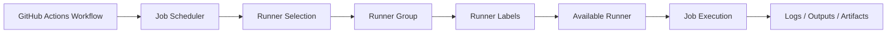
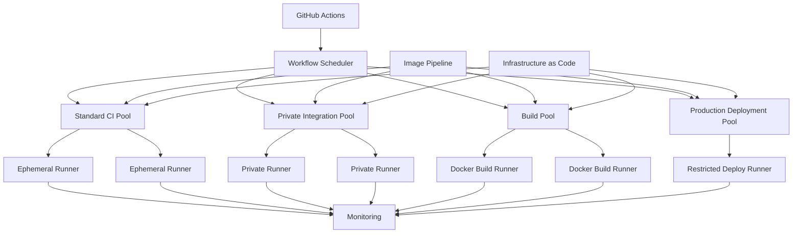

# 11- Runner Management

## Overview

Runner management is the operational discipline of provisioning, configuring, securing, monitoring, updating, scaling, and retiring GitHub Actions runners.

A runner is the execution environment in which a GitHub Actions job actually runs. For production CI/CD, runner management therefore becomes infrastructure management rather than simply selecting:

```yaml
runs-on: ubuntu-latest
```

A production runner platform must answer:

- Which workloads can execute on which runners?
- How are runners registered?
- How are labels and runner groups managed?
- How are runners provisioned and removed?
- How are runner images updated?
- How is capacity managed?
- How are private-network runners secured?
- How are unhealthy runners detected?
- How are secrets and credentials protected?
- How are ephemeral runners isolated?
- How are failures diagnosed?
- How is the platform recovered after infrastructure failure?

The operational model is:

```text
Runner Definition
      ↓
Provisioning
      ↓
Registration
      ↓
Configuration
      ↓
Job Execution
      ↓
Monitoring
      ↓
Maintenance
      ↓
Replacement / Retirement
```

For larger organizations, runners should be treated as a managed platform with clear ownership, security boundaries, lifecycle policies, and observability.

---

## GitHub Actions Runner Architecture

The core relationship is:

```text
Workflow
   ↓
Job
   ↓
runs-on
   ↓
Runner Selection
   ↓
Runner
   ↓
Steps / Actions
```

A runner provides the execution environment for the job.

A simplified architecture is:



Runner management controls the infrastructure represented by the final execution layer.

---

## Runner Types

GitHub Actions supports several operational models.

| Runner Model | Lifecycle | Isolation | Management Effort | Typical Use |
|---|---|---|---|---|
| GitHub-hosted | Managed by GitHub | Strong job-level isolation | Low | Standard CI |
| Persistent self-hosted | Long-lived | Lower | High | Specialized workloads |
| Ephemeral self-hosted | One/few jobs then destroyed | High | High | Production CI/CD |
| Autoscaled ephemeral | Dynamically provisioned | High | High | Large-scale CI |
| Private-network self-hosted | Organization-managed | Depends on design | High | Internal integration/deployment |

The appropriate model depends on workload trust, network requirements, performance, cost, and operational constraints.

---

## Runner Scope

Self-hosted runners can be associated with different administrative scopes.

Typical scopes include:

- Repository
- Organization
- Enterprise

A repository-scoped runner provides tighter isolation.

An organization-level runner can serve multiple repositories, but its security boundary becomes broader.

A production organization should deliberately decide:

```text
Repository
   ↓
Organization
   ↓
Enterprise
```

rather than automatically placing every runner at the widest possible scope.

---

## Repository-Level Runners

Repository-level runners are useful when:

- Only one repository requires specialized software.
- The workload is highly sensitive.
- Isolation is more important than reuse.
- The runner requires repository-specific network access.

Example:

```text
Repository A
    ↓
Dedicated Runner Pool
```

The disadvantage is potentially lower utilization.

---

## Organization-Level Runners

Organization-level runners are useful for shared capabilities:

```text
Organization
├── Linux CI
├── Docker Build
├── Integration Testing
└── Deployment
```

This improves utilization but increases blast radius.

A compromised workflow from one repository could potentially affect shared runner infrastructure.

Use runner groups and permissions to constrain access.

---

## Runner Groups

Runner groups provide an administrative boundary for runner access.

Example:

```text
Runner Groups

Standard-CI
    └── Linux runners

Private-Integration
    └── VPC runners

Build
    └── Docker-capable runners

Production-Deploy
    └── Restricted deployment runners
```

Runner groups are especially useful when different repositories require different trust levels.

---

## Runner Labels

Labels describe runner capabilities.

Example:

```yaml
runs-on:
  - self-hosted
  - linux
  - docker
  - private-network
```

A runner must satisfy the requested labels.

Labels can represent:

- Operating system
- CPU architecture
- Docker availability
- GPU availability
- Private network access
- Resource class
- Specialized software

Use labels to describe **capabilities**, not arbitrary organizational metadata.

---

## Label Design

Good:

```text
linux
x64
docker
private-network
large
```

Less useful:

```text
team-a
johns-runner
new-runner
server-17
```

Capability-based labels remain meaningful when infrastructure is replaced.

---

## Runner Naming

Runner names should be predictable and operationally useful.

Examples:

```text
ci-linux-x64-001
integration-linux-x64-003
build-linux-x64-007
deploy-production-002
```

For ephemeral runners, names may include an instance or lifecycle identifier.

Avoid names that encode temporary infrastructure assumptions unless they help debugging.

---

## Runner Registration

Registration establishes the runner's relationship with GitHub.

The conceptual flow is:

```text
Provision Runner
      ↓
Install Runner Software
      ↓
Configure Runner
      ↓
Authenticate Registration
      ↓
Assign Labels / Group
      ↓
Runner Online
```

Registration credentials should be treated as sensitive bootstrap material.

Never hard-code them into:

- Git repositories
- Docker images
- AMIs
- Terraform files
- Shell scripts committed to source control

---

## Registration Lifecycle

A production runner should move through explicit states:

```text
Provisioning
    ↓
Bootstrapping
    ↓
Registering
    ↓
Ready
    ↓
Busy
    ↓
Idle
    ↓
Draining
    ↓
Retired
```

Not every implementation exposes all states directly, but the operational model is useful for automation and monitoring.

---

## Runner Configuration

A runner configuration typically includes:

- Runner name
- Runner URL
- Authentication
- Runner group
- Labels
- Work directory
- Service configuration
- Environment configuration

A production configuration should be reproducible.

Do not rely on manual configuration performed through an SSH session.

---

## Infrastructure as Code

Runner infrastructure should preferably be managed using:

- Terraform
- CloudFormation
- Kubernetes manifests
- Helm
- Image build pipelines

Manage infrastructure such as:

```text
VPC
Security Groups
IAM
Runner Instances
Runner Groups
Autoscaling
Logging
Monitoring
Images
```

This makes runner infrastructure auditable and reproducible.

---

## Persistent vs Ephemeral Management

Persistent runners remain available after a job completes.

```text
Runner
 ↓
Job A
 ↓
Idle
 ↓
Job B
 ↓
Idle
```

Ephemeral runners are intended to be short-lived:

```text
Provision
 ↓
Register
 ↓
Job
 ↓
Destroy
```

Persistent runners require stronger cleanup controls because state survives between jobs.

Ephemeral runners reduce residual-state risk.

---

## Persistent Runner State

A persistent runner may retain:

- Source code
- Build outputs
- Package caches
- Docker images
- Temporary files
- Credentials accidentally written to disk
- Logs
- Tool-generated state

This can create cross-job contamination.

For example:

```text
Job A
 ↓
Creates malicious or stale file
 ↓
Job B
 ↓
Reads same filesystem
```

Ephemeral runners avoid most of this class of problem.

---

## Runner Workspaces

Runner workspaces should not be treated as durable storage.

For persistent runners:

```text
Workspace
   ↓
Cleanup
   ↓
Next job
```

Cleanup must be reliable.

For ephemeral runners:

```text
Workspace
   ↓
Job
   ↓
Runner destroyed
```

The runner lifecycle itself provides cleanup.

---

## Runner Software Updates

Runner software must be maintained.

An update strategy should account for:

- Runner version
- OS patches
- Docker version
- Python versions
- AWS CLI
- Buildx
- Security tooling
- Other preinstalled dependencies

Do not allow runner software versions to drift indefinitely.

---

## Immutable Runner Images

A strong production approach is to create versioned images:

```text
runner-linux:v2026.09.01
runner-linux:v2026.09.15
runner-linux:v2026.10.01
```

Then provision runners from a known image version.

Advantages:

- Reproducibility
- Faster startup
- Easier rollback
- Reduced configuration drift
- Easier incident investigation

---

## Configuration Drift

Drift occurs when runners that should be identical become different.

For example:

```text
Runner A
Python 3.12.6

Runner B
Python 3.12.7

Runner C
Python 3.11
```

A workflow may then pass on one runner and fail on another.

Reduce drift through:

- Immutable images
- Configuration management
- Automated replacement
- Versioned dependencies
- Infrastructure as code

---

## Runner Replacement

For production infrastructure, replacement is often safer than manually repairing a broken runner.

Preferred:

```text
Detect unhealthy runner
       ↓
Drain
       ↓
Provision replacement
       ↓
Validate
       ↓
Remove old runner
```

rather than:

```text
SSH
 ↓
Manually repair
 ↓
Hope it works
```

Replacement produces a more predictable operational state.

---

## Runner Health

A runner can be:

- Online
- Offline
- Busy
- Idle
- Unresponsive
- Misconfigured
- Network-isolated
- Provisioned but unregistered

Monitoring should distinguish these conditions.

```text
Infrastructure healthy
        ≠
Runner registered
        ≠
Runner ready
        ≠
Runner successfully executing jobs
```

---

## Health Checks

Useful health checks include:

### Infrastructure

- Instance running
- Pod running
- CPU
- Memory
- Disk
- Network

### Runner

- Registration status
- Runner process
- Runner service
- Job execution
- Heartbeat/connectivity

### Tooling

- Git
- Docker
- Python
- AWS CLI
- Required system packages

---

## Disk Management

CI workloads can consume large amounts of disk.

Examples:

```text
Docker images
Build layers
Package caches
Source repositories
Test artifacts
Temporary files
```

Monitor:

```bash
df -h
```

and:

```bash
du -sh /path/to/workspace/*
```

Persistent runners require explicit disk cleanup policies.

Ephemeral runners reduce long-term disk accumulation.

---

## Docker Disk Usage

On Docker-capable runners:

```bash
docker system df
```

can help identify storage consumption.

Be careful with cleanup commands on shared persistent runners.

For example:

```bash
docker system prune
```

can remove resources used by other workloads.

Dedicated ephemeral runners are safer for aggressive cleanup.

---

## CPU and Memory

A runner should be sized according to workload.

Examples:

| Workload | Typical Characteristics |
|---|---|
| Linting | Low CPU/memory |
| Unit tests | Moderate CPU |
| Integration tests | CPU + service dependency load |
| Docker builds | CPU + disk + memory |
| E2E tests | CPU + memory + browser |
| Large builds | High CPU/memory |
| GPU jobs | Specialized hardware |

Oversized runners increase cost.

Undersized runners increase job duration and can create timeouts.

---

## Resource Classes

A production runner platform can define:

```text
small
medium
large
xlarge
```

with labels:

```yaml
runs-on:
  - self-hosted
  - linux
  - medium
```

This makes resource allocation explicit.

---

## Runner Networking

Self-hosted runners may need access to:

- GitHub
- Package registries
- Docker registries
- PostgreSQL
- Redis
- Kafka
- Internal REST APIs
- gRPC services
- AWS services

Network design should follow least privilege.

Do not give a CI runner unrestricted access to an entire VPC simply because one integration test needs a private database.

---

## Private Network Runners

A typical architecture is:

```text
GitHub Actions
      ↓
Private Runner
      ↓
VPC
├── PostgreSQL
├── Redis
├── Kafka
└── Internal APIs
```

The runner requires appropriate:

- Subnet
- Route table
- Security group
- DNS
- Egress
- Network policy

---

## Security Groups

For AWS-based runners, security groups should allow only required traffic.

For example:

```text
Runner
  ↓ TCP 5432
PostgreSQL

Runner
  ↓ Redis port
Redis

Runner
  ↓ HTTPS
Internal API
```

Avoid:

```text
Runner
  ↓
Allow all inbound
Allow all outbound
```

unless there is a documented architectural reason.

---

## Runner Credentials

Runners should avoid long-lived credentials wherever possible.

For AWS:

```text
GitHub Actions
    ↓
OIDC
    ↓
STS
    ↓
Temporary IAM Credentials
```

For EC2 workloads, an instance profile may also be appropriate depending on the trust model.

Do not bake AWS access keys into runner images.

---

## GITHUB_TOKEN

The `GITHUB_TOKEN` available to workflows should have the minimum permissions required.

Example:

```yaml
permissions:
  contents: read
```

A deployment job may require additional permissions:

```yaml
permissions:
  contents: read
  id-token: write
```

Keep elevated permissions limited to the jobs that need them.

---

## Production Deployment Runners

Production deployment runners should be treated as privileged infrastructure.

They may have access to:

- AWS
- Kubernetes
- Terraform
- Production APIs
- Production registries

Separate them from ordinary CI runners.

Example:

```text
Standard CI
   ↓
No production access

Build
   ↓
Registry access

Production Deploy
   ↓
Restricted AWS/Kubernetes access
```

---

## Runner Groups for Security

A secure deployment architecture might use:

```text
Runner Group: CI
    ↓
Standard repositories

Runner Group: Integration
    ↓
Approved repositories

Runner Group: Production
    ↓
Deployment workflows only
```

Access to the production group should be intentionally restricted.

---

## Untrusted Pull Requests

Do not allow untrusted fork code to execute on highly privileged self-hosted runners.

A dangerous model is:

```text
Public Fork PR
      ↓
Workflow
      ↓
Production-capable self-hosted runner
      ↓
AWS credentials
```

A safer model is:

```text
Fork PR
   ↓
Restricted CI
   ↓
No production credentials
   ↓
No unnecessary private-network access
```

This is one of the most important runner-management security considerations.

---

## `pull_request` vs `pull_request_target`

`pull_request` is generally appropriate for testing code from a pull request without automatically granting the workflow the same trust level as the base repository.

`pull_request_target` executes in the context of the base repository and therefore requires particular caution.

Never combine:

```text
pull_request_target
+
untrusted checkout
+
privileged self-hosted runner
+
secrets
```

without a carefully designed security boundary.

---

## Third-Party Actions

A runner executes actions selected by workflows.

A compromised action may therefore execute with the privileges available to the job.

Reduce risk through:

- Trusted action sources
- SHA pinning
- Minimal permissions
- Limited secrets
- Restricted runner groups
- Ephemeral runners
- Dependency review
- Action governance

---

## Runner Image Supply Chain

Runner images themselves are dependencies.

The image build process should protect:

```text
Source
  ↓
Image Build
  ↓
Security Scan
  ↓
Validation
  ↓
Trusted Registry
  ↓
Runner Provisioning
```

Consider:

- Base-image provenance
- Package versions
- Vulnerability scanning
- SBOM generation
- Image signing
- Controlled promotion

---

## Docker on Self-Hosted Runners

Docker-enabled runners require additional consideration.

The Docker daemon may provide significant privileges.

Avoid unnecessarily exposing:

```text
/var/run/docker.sock
```

to untrusted workloads.

If Docker builds require elevated privileges, use dedicated runner pools with appropriate isolation.

---

## Runner Containers

Some organizations run GitHub Actions jobs inside containers.

This can provide application-level consistency:

```text
Runner Host
    ↓
Job Container
    ↓
Python / Django / FastAPI
```

But containerization does not automatically provide complete security isolation.

The host remains part of the trust boundary.

---

## Kubernetes Runner Management

For Kubernetes-based runner platforms, manage:

- Namespaces
- Service accounts
- RBAC
- Resource requests
- Resource limits
- Network policies
- Pod security
- Container images
- Secrets
- Node pools

Example:

```text
Runner Pod
 ├── Service Account
 ├── CPU Request
 ├── Memory Request
 ├── Network Policy
 └── Ephemeral Workspace
```

---

## Runner Autoscaling

Runner management and autoscaling should be integrated.

A basic model is:

```text
Queued Jobs
     ↓
Autoscaler
     ↓
Provision Runners
     ↓
Register
     ↓
Execute
     ↓
Destroy
```

Autoscaling policies should include:

- Minimum capacity
- Maximum capacity
- Scale-up behavior
- Scale-down behavior
- Cooldown
- Provisioning timeout
- Failure handling

---

## Capacity Planning

Capacity should be based on:

```text
Expected workload
+
Peak workload
+
Provisioning latency
+
Downstream capacity
```

For example, 50 runners are not useful if PostgreSQL can safely handle only 10 concurrent integration-test workloads.

---

## Concurrency Management

Runner capacity and workflow concurrency should complement each other.

For pull requests:

```yaml
concurrency:
  group: ci-${{ github.workflow }}-${{ github.ref }}
  cancel-in-progress: true
```

For production deployments:

```yaml
concurrency:
  group: production-deployment
  cancel-in-progress: false
```

This prevents multiple deployments from modifying production simultaneously.

---

## Runner Drain

Before maintenance or retirement, a runner should be drained.

Conceptually:

```text
Healthy
   ↓
Drain
   ↓
No new jobs
   ↓
Current job completes
   ↓
Retire
```

This avoids terminating active workloads unexpectedly.

---

## Runner Maintenance

Maintenance can include:

- OS updates
- Runner software updates
- Docker updates
- Python updates
- Security patches
- Certificate updates
- Toolchain updates

For persistent runners, maintenance should be scheduled around workload demand.

For ephemeral runners, replacing the image is often simpler.

---

## Blue/Green Runner Updates

A safe runner update strategy is:

```text
Current Pool
    ↓
Create New Pool
    ↓
Validate
    ↓
Shift Workloads
    ↓
Drain Old Pool
    ↓
Retire Old Pool
```

This reduces the risk of updating every runner simultaneously.

---

## Canary Runner Updates

For large environments:

```text
100 runners
    ↓
5 new-image runners
    ↓
Observe
    ↓
20 runners
    ↓
Observe
    ↓
100 runners
```

Monitor:

- Job failure rate
- Provisioning failures
- Test failures
- Tooling failures
- Performance
- Queue latency

---

## Monitoring

Runner management requires operational metrics.

### Capacity Metrics

Track:

- Desired runners
- Available runners
- Busy runners
- Provisioning runners
- Failed runners
- Offline runners

### Queue Metrics

Track:

- Queue depth
- Queue age
- Jobs by runner label
- Jobs by runner group

### Lifecycle Metrics

Track:

- Provisioning time
- Registration time
- Startup failures
- Cleanup failures
- Runner lifetime
- Orphan count

### Resource Metrics

Track:

- CPU
- Memory
- Disk
- Network
- Docker storage

---

## Logging

Runner logs should be centralized where practical.

Useful sources include:

- Runner service logs
- Bootstrap logs
- Cloud-init logs
- Kubernetes events
- Autoscaler logs
- Infrastructure events
- Workflow logs

Avoid putting secrets into diagnostic logs.

---

## Auditability

Production runner changes should be traceable.

Record:

- Who changed the runner configuration
- Which image version was deployed
- Which infrastructure version was used
- Which runner group changed
- Which labels changed
- Which IAM role changed
- When the change occurred

Infrastructure as code and controlled deployment workflows improve auditability.

---

## Runner Inventory

Maintain an inventory containing at least:

| Attribute | Example |
|---|---|
| Runner name | `ci-linux-001` |
| Scope | Organization |
| Group | `Standard-CI` |
| Labels | `linux`, `x64`, `docker` |
| Image | `runner-linux:v2026.09` |
| Status | Online |
| Lifecycle | Ephemeral |
| Network | Private |
| Resource class | Medium |
| Owner | Platform Engineering |

Inventory is particularly important when managing hundreds or thousands of runners.

---

## Orphan Detection

An orphan may exist when:

```text
Cloud instance
    ↓
No corresponding GitHub runner
```

or:

```text
GitHub runner
    ↓
No corresponding infrastructure
```

Reconciliation should periodically identify mismatches.

---

## Runner Retirement

Retirement should be explicit.

A typical process:

```text
Identify runner
    ↓
Stop accepting jobs
    ↓
Drain active job
    ↓
Remove registration
    ↓
Destroy infrastructure
    ↓
Delete associated resources
    ↓
Update inventory
```

Do not simply terminate infrastructure and assume the GitHub control plane will always remain clean.

---

## Disaster Recovery

Runner infrastructure should be reconstructible.

The durable components should be:

```text
Git
Infrastructure as Code
Runner Image Definition
Configuration
Monitoring Configuration
IAM Policies
Network Configuration
```

The runner itself should not be considered durable state.

---

## High Availability

Avoid making one runner a critical dependency.

Instead:

```text
Runner Pool
├── Runner A
├── Runner B
├── Runner C
└── Runner D
```

For private infrastructure, consider multiple:

- Availability zones
- Subnets
- Node pools
- Runner groups

The goal is to prevent a single infrastructure failure from stopping all CI/CD execution.

---

## Disaster Scenarios

### One Runner Fails

Expected behavior:

```text
Runner fails
   ↓
Job fails / becomes unavailable
   ↓
Replacement runner
   ↓
Workflow retry where appropriate
```

### Entire Runner Pool Fails

Recovery:

```text
Pool failure
   ↓
Provision replacement pool
   ↓
Register runners
   ↓
Validate
   ↓
Resume workloads
```

### Cloud Availability Zone Failure

Use multiple zones where runner availability requirements justify it.

### Runner Image Is Broken

Roll back to the previous known-good image version.

---

## Performance Optimization

Runner performance depends on:

- CPU
- Memory
- Disk throughput
- Network bandwidth
- Image size
- Dependency installation
- Docker layer caching
- Package caching
- Workspace setup

For Python pipelines:

```text
Runner
 ↓
Restore dependency cache
 ↓
Install dependencies
 ↓
Run pytest
```

can be significantly faster than downloading all dependencies for every job.

---

## Cache vs Runner State

Do not rely on persistent runner state as a cache strategy.

A persistent filesystem cache is difficult to control and can introduce contamination.

Prefer explicit GitHub Actions caches or controlled registry caches where appropriate.

```text
Job
 ↓
GitHub Cache
 ↓
Runner
```

rather than:

```text
Job
 ↓
Whatever previous job left on disk
```

---

## Docker Layer Caching

Docker builds can benefit from BuildKit caching.

A runner can use:

```text
Source
 ↓
BuildKit
 ↓
Existing Layers
 ↓
New Layers
```

For ephemeral runners, external cache backends are often more useful than relying on local Docker state.

---

## Python Backend Runner

A typical Python CI runner may require:

```text
Python
pip
pytest
ruff
mypy
Docker
Git
AWS CLI
```

A Django integration-test runner may additionally need:

```text
PostgreSQL
Redis
```

or access to service containers.

A FastAPI pipeline may additionally execute:

```text
pytest
HTTP API tests
OpenAPI validation
```

---

## Example CI Job

```yaml
jobs:
  test:
    runs-on:
      - self-hosted
      - linux
      - ephemeral
      - medium

    permissions:
      contents: read

    steps:
      - name: Checkout
        uses: actions/checkout@v4

      - name: Set up Python
        uses: actions/setup-python@v6
        with:
          python-version: "3.12"
          cache: pip

      - name: Install dependencies
        run: pip install -r requirements.txt

      - name: Run tests
        run: pytest
```

The runner platform should provide only the infrastructure capabilities required by the job.

---

## Example Production Deployment Job

```yaml
jobs:
  deploy:
    runs-on:
      - self-hosted
      - linux
      - ephemeral
      - production-deploy

    permissions:
      contents: read
      id-token: write

    environment:
      name: production

    concurrency:
      group: production-deployment
      cancel-in-progress: false

    steps:
      - name: Checkout
        uses: actions/checkout@v4

      - name: Configure AWS credentials
        uses: aws-actions/configure-aws-credentials@v6
        with:
          role-to-assume: ${{ vars.DEPLOY_ROLE_ARN }}
          aws-region: ${{ vars.AWS_REGION }}

      - name: Deploy
        run: ./scripts/deploy.sh
```

The deployment runner should belong to a restricted runner group and have only the network and IAM access required for deployment.

---

## GitHub CLI Operations

GitHub CLI is useful for operational workflows.

List workflows:

```bash
gh workflow list
```

List recent runs:

```bash
gh run list
```

Inspect a run:

```bash
gh run view <run-id>
```

View logs:

```bash
gh run view <run-id> --log
```

Rerun a workflow:

```bash
gh run rerun <run-id>
```

Run a workflow manually:

```bash
gh workflow run <workflow-file>
```

The CLI should complement runner-level monitoring rather than replace infrastructure observability.

---

## Troubleshooting Method

Use a consistent failure-domain model:

```text
Symptom
   ↓
Possible Causes
   ↓
Isolation Strategy
   ↓
Commands / Checks
   ↓
Root Cause
   ↓
Corrective Action
   ↓
Prevention
```

This prevents random configuration changes during incidents.

---

## Runner Is Offline

### Possible Causes

- Instance stopped
- Pod terminated
- Runner service stopped
- Network failure
- DNS failure
- Proxy issue
- Runner process crashed
- Registration problem

### Checks

On Linux:

```bash
systemctl status actions.runner*
```

Check network connectivity:

```bash
curl -I https://github.com
```

For cloud infrastructure, also inspect instance or Pod health.

---

## Runner Is Online but Jobs Do Not Start

### Possible Causes

- Incorrect labels
- Incorrect runner group
- Repository not authorized
- Runner is busy
- Workflow requests unavailable capabilities
- Deployment environment restrictions

Validate:

```text
runs-on
   ↓
labels
   ↓
runner group
   ↓
repository access
```

---

## Runner Provisioning Succeeds but Registration Fails

Investigate:

1. Runner URL.
2. Registration credentials.
3. DNS.
4. Proxy.
5. Firewall.
6. GitHub connectivity.
7. Bootstrap logs.
8. Runner software version.

Separate infrastructure provisioning from GitHub registration when debugging.

---

## Jobs Fail Only on One Runner

This commonly indicates configuration drift.

Compare:

- OS version
- Python version
- Docker version
- Environment variables
- Installed packages
- Disk space
- Network configuration
- Runner image version

If the runner cannot be made reproducible, replace it.

---

## Docker Build Fails Only on Self-Hosted Runners

Check:

```bash
docker version
```

```bash
docker info
```

```bash
docker buildx version
```

Then inspect:

- Disk space
- Docker daemon health
- BuildKit configuration
- Registry connectivity
- Authentication
- Network access
- CPU/memory

---

## AWS Authentication Fails

Check:

```bash
aws sts get-caller-identity
```

For OIDC-based workflows, validate:

- `id-token: write`
- IAM trust policy
- Repository
- Branch/environment conditions
- Role ARN
- AWS region
- Workflow context

Do not solve an IAM trust-policy problem by adding long-lived AWS access keys to runner secrets.

---

## Runner Has Unexpected Production Access

Treat this as a security incident.

Investigate:

```text
Runner Group
   ↓
Workflow Access
   ↓
IAM Role
   ↓
Network Access
   ↓
Secrets
```

Remove unnecessary privileges first, then investigate the source of the configuration.

---

## Common Runner Management Mistakes

### Treating Runners as Pets

Manually maintaining each runner creates configuration drift.

Prefer:

```text
Image
+
Infrastructure as Code
+
Automation
```

over manual repair.

### Sharing Privileged Runners

Do not allow ordinary CI workloads and production deployment workloads to share the same highly privileged runner pool.

### Hard-Coding Credentials

Never embed AWS credentials or registration secrets into runner images.

### Ignoring Disk Usage

Builds can eventually fill persistent runner disks.

### No Maximum Capacity

Autoscaling without a maximum can create a cost or quota incident.

### No Runner Inventory

Without inventory, operators cannot reliably determine what infrastructure exists.

### No Drain Process

Destroying active runners can interrupt deployments and builds.

### Updating Every Runner at Once

A broken image can cause organization-wide CI failure.

### Using Labels as Security Controls Alone

Labels describe capabilities. They should be combined with runner groups and repository access controls for stronger boundaries.

---

## Production Runner Governance

A mature organization should define policies for:

- Who can create runners
- Who can modify runner groups
- Who can change labels
- Who can modify runner images
- Who can access deployment runners
- Which repositories can use privileged runners
- Which actions are allowed
- Which credentials are permitted
- How runners are patched
- How runners are retired
- How incidents are handled

---

## Runner Ownership

Every production runner pool should have an owner.

Example:

| Runner Pool | Owner | Purpose |
|---|---|---|
| Standard CI | Platform | General CI |
| Integration | Backend Platform | Private integration |
| Build | DevOps | Docker builds |
| Production | Release Engineering | Production deployment |

Ownership should include operational responsibility, not just a team name.

---

## Runner Change Management

Runner changes should follow the same engineering discipline as application changes.

```text
Change
 ↓
Review
 ↓
Test
 ↓
Canary
 ↓
Deploy
 ↓
Monitor
 ↓
Rollback if required
```

This is particularly important for:

- Runner images
- IAM policies
- Network access
- Docker versions
- Security tooling
- Runner software

---

## Production Runner Architecture

A mature runner platform can look like:



The important architectural principle is separation of concerns:

```text
Workflow Definition
        ↓
Runner Selection
        ↓
Runner Platform
        ↓
Infrastructure
        ↓
External Systems
```

---

## Runner Management Design Principles

### Prefer Replacement Over Repair

If a runner becomes inconsistent, replace it from a known-good image.

### Keep Runners Disposable

Where practical, treat runners as compute capacity rather than durable infrastructure.

### Separate Trust Zones

CI, integration, build, and production workloads should not automatically share the same runner pool.

### Keep Privileges Narrow

Runner access should match the job's actual requirements.

### Make Infrastructure Reproducible

A new runner should be created from automation, not tribal knowledge.

### Observe the Complete Lifecycle

Monitor:

```text
Provision
→ Register
→ Ready
→ Busy
→ Drain
→ Destroy
```

### Control Capacity

Every autoscaled pool should have explicit capacity limits.

---

## Senior Interview Scenarios

### Design a Runner Platform for a Large Python Monorepo

Discuss:

- Runner groups
- Labels
- Ephemeral runners
- Autoscaling
- Matrix testing
- Docker builds
- Private integration testing
- Cache strategy
- Capacity limits
- Cost controls

### How Would You Protect Production Credentials?

A strong design separates:

```text
CI Runner
   ↓
No production credentials

Deployment Runner
   ↓
OIDC
   ↓
Restricted IAM Role
```

### How Would You Upgrade 500 Runners?

Use:

```text
New image
   ↓
Canary pool
   ↓
Validation
   ↓
Progressive rollout
   ↓
Drain old runners
   ↓
Retire old image
```

### A Runner Works Today but Fails Tomorrow

Investigate configuration drift.

Compare:

```text
Image
OS
Dependencies
Docker
Environment
Network
IAM
Runner version
```

Then determine whether replacement is safer than repair.

### How Would You Design Private Integration Runners?

Consider:

```text
Private subnet
   ↓
Runner group
   ↓
Ephemeral runner
   ↓
Security group
   ↓
PostgreSQL / Redis / Kafka / Internal APIs
```

Then add:

- Network isolation
- Capacity limits
- Observability
- Cleanup
- Least-privilege access

### How Would You Recover From a Runner Platform Outage?

The answer should include:

```text
Detect
 ↓
Identify failure domain
 ↓
Provision replacement infrastructure
 ↓
Register runners
 ↓
Validate
 ↓
Resume workloads
```

and should avoid depending on manually repaired runner state.

---

## Production Checklist

### Runner Infrastructure

- [ ] Runner infrastructure is managed as code.
- [ ] Runner images are versioned.
- [ ] Configuration drift is minimized.
- [ ] Runner software is maintained.
- [ ] Runner resources are appropriately sized.
- [ ] Disk usage is monitored.
- [ ] Network access is explicitly defined.

### Lifecycle

- [ ] Registration is automated.
- [ ] Runner health is monitored.
- [ ] Unhealthy runners are replaced.
- [ ] Drain procedures exist.
- [ ] Retirement is automated.
- [ ] Orphaned infrastructure is reconciled.

### Security

- [ ] Runner groups provide trust boundaries.
- [ ] Labels represent capabilities.
- [ ] GITHUB_TOKEN permissions are minimized.
- [ ] AWS access uses OIDC or other temporary credentials where appropriate.
- [ ] Production runners are isolated.
- [ ] Untrusted PRs cannot access privileged runners.
- [ ] Third-party actions are governed and pinned where appropriate.

### Scalability

- [ ] Runner autoscaling is configured where required.
- [ ] Minimum capacity is defined.
- [ ] Maximum capacity is defined.
- [ ] Scale-up and scale-down behavior is monitored.
- [ ] Matrix concurrency is controlled.
- [ ] Downstream service capacity is considered.

### Reliability

- [ ] Multiple runners exist for critical pools.
- [ ] Multiple availability zones are considered.
- [ ] Runner images can be rolled back.
- [ ] Infrastructure can be recreated.
- [ ] Provisioning failures are observable.
- [ ] Registration failures are observable.

### Operations

- [ ] Runner inventory exists.
- [ ] Ownership is defined.
- [ ] Changes are reviewed.
- [ ] Logs are centralized where appropriate.
- [ ] Queue latency is monitored.
- [ ] Runner utilization is monitored.
- [ ] Cost is tracked.

## Key Takeaways

- Runner management is infrastructure management: runners require controlled provisioning, configuration, security, monitoring, maintenance, replacement, and retirement.
- Capability-based labels and runner groups should be combined to control workload placement and establish meaningful security boundaries.
- Production runner platforms should prefer reproducible images, automated replacement, ephemeral execution where appropriate, and infrastructure-as-code over manual server maintenance.
- Privileged workloads such as production deployments and private-network operations should use dedicated runner pools with least-privilege credentials and restricted access.
- Effective runner operations require lifecycle observability, capacity controls, reconciliation, failure recovery, and a clear ownership model.