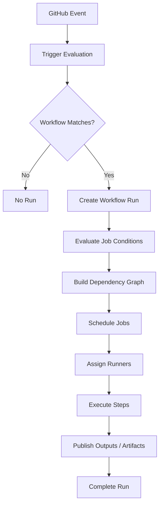

# 12- Workflow Management

## Overview

Workflow management is the operational discipline of designing, controlling, monitoring, maintaining, and governing GitHub Actions workflows across their complete lifecycle.

A GitHub Actions workflow is more than a YAML file. In a production environment, workflows become executable infrastructure responsible for:

- Continuous integration
- Testing
- Security validation
- Artifact creation
- Deployment
- Environment promotion
- Release automation
- Operational tasks
- Rollbacks

A useful mental model is:

```text
Workflow Definition
        ↓
Trigger
        ↓
Workflow Run
        ↓
Job Graph
        ↓
Runner Assignment
        ↓
Step Execution
        ↓
Artifacts / Outputs
        ↓
Promotion / Deployment
        ↓
Monitoring
        ↓
Retry / Rollback
```

Good workflow management optimizes for:

- Correctness
- Security
- Reproducibility
- Maintainability
- Observability
- Controlled concurrency
- Failure recovery
- Cost efficiency

Poor workflow management often results in duplicate deployments, excessive CI cost, insecure permissions, difficult troubleshooting, and tightly coupled pipelines.

---

## Workflow Architecture

The basic GitHub Actions execution hierarchy is:

```text
Workflow
   ↓
Run
   ↓
Jobs
   ↓
Steps
   ↓
Actions / Shell Commands
   ↓
Runner
```

A workflow is defined under:

```text
.github/
└── workflows/
    ├── ci.yml
    ├── cd.yml
    ├── release.yml
    └── security.yml
```

Each workflow represents an automation boundary.

---

## Workflow Responsibilities

A workflow should have a clear responsibility.

Examples:

| Workflow | Responsibility |
|---|---|
| `ci.yml` | Linting and testing |
| `security.yml` | Security scanning |
| `build.yml` | Artifact/image creation |
| `deploy.yml` | Environment deployment |
| `release.yml` | Release creation |
| `rollback.yml` | Controlled rollback |
| `maintenance.yml` | Operational maintenance |

Avoid creating one enormous workflow containing every CI/CD concern.

---

## Workflow Execution Model

A workflow run begins when an event matches its trigger.



Understanding this lifecycle is essential when troubleshooting workflows that appear not to run or run unexpectedly.

---

## Workflow Triggers

Common triggers include:

- `push`
- `pull_request`
- `pull_request_target`
- `workflow_dispatch`
- `schedule`
- `workflow_call`
- `workflow_run`
- `repository_dispatch`
- `release`

Example:

```yaml
name: CI

on:
  push:
    branches:
      - main

  pull_request:
    branches:
      - main

  workflow_dispatch:
```

Each event represents a different trust and execution model.

---

## Trigger Management

Triggers should be intentionally designed.

### Pull Requests

Use:

```yaml
on:
  pull_request:
    branches:
      - main
```

for validation of changes before merging.

### Main Branch

Use:

```yaml
on:
  push:
    branches:
      - main
```

for post-merge CI or deployment workflows.

### Manual Operations

Use:

```yaml
on:
  workflow_dispatch:
```

for controlled operational workflows such as:

- Rollback
- Data migration
- Maintenance
- Manual deployment

---

## Branch Filters

Branch filters reduce unnecessary workflow executions.

```yaml
on:
  push:
    branches:
      - main
      - release/*
```

Be careful with overly broad patterns.

A deployment workflow should normally target explicitly controlled branches or tags.

---

## Path Filters

Path filters are useful for monorepos.

```yaml
on:
  push:
    paths:
      - "services/orders/**"
      - "shared/**"
```

This can reduce unnecessary builds.

However, path-based filtering becomes difficult when shared libraries have broad dependency relationships.

For example:

```text
shared/auth/
   ↓
service-a
service-b
service-c
```

A change to `shared/auth` may require rebuilding multiple services.

---

## Workflow Inputs

Manual workflows can define typed inputs.

```yaml
on:
  workflow_dispatch:
    inputs:
      environment:
        description: Deployment environment
        required: true
        type: choice
        options:
          - staging
          - production

      version:
        description: Artifact version
        required: true
        type: string
```

Inputs should be validated before being used in deployment commands.

Do not assume that a manually supplied value is safe simply because the workflow is manually triggered.

---

## Expressions and Contexts

GitHub Actions expressions use:

```yaml
${{ ... }}
```

Example:

```yaml
if: ${{ github.ref == 'refs/heads/main' }}
```

Expressions are evaluated by GitHub Actions before or during workflow execution depending on where they are used.

Shell commands are different.

```yaml
run: echo "${{ github.ref }}"
```

The expression is resolved before the shell executes.

---

## Workflow Contexts

Important contexts include:

| Context | Purpose |
|---|---|
| `github` | Repository, event, ref, commit, actor |
| `env` | Environment variables |
| `vars` | Configuration variables |
| `secrets` | Secrets |
| `steps` | Step outputs |
| `needs` | Outputs/status of dependencies |
| `job` | Current job information |
| `runner` | Runner information |
| `matrix` | Current matrix values |
| `strategy` | Matrix strategy information |
| `inputs` | Workflow inputs |

Use the narrowest context needed.

---

## Expression vs Shell

These are different execution layers:

```yaml
if: ${{ github.ref == 'refs/heads/main' }}
```

versus:

```yaml
run: |
  if [ "$ENVIRONMENT" = "production" ]; then
    ./deploy.sh
  fi
```

The first is GitHub Actions expression evaluation.

The second is shell execution.

Confusing the two can cause subtle quoting, escaping, and security problems.

---

## Status Functions

Important functions include:

```text
success()
failure()
cancelled()
always()
```

Example:

```yaml
- name: Upload test reports
  if: ${{ !cancelled() }}
  uses: actions/upload-artifact@v4
```

Use status functions deliberately.

`always()` should not be used blindly for every cleanup or reporting step because it can cause work to execute even when the workflow has been cancelled or when dependencies did not complete in the intended state.

---

## Environment Variables

Variables can exist at multiple scopes:

```yaml
env:
  APP_NAME: orders
```

Job level:

```yaml
jobs:
  test:
    env:
      ENVIRONMENT: test
```

Step level:

```yaml
- name: Test
  env:
    DATABASE_URL: ${{ secrets.DATABASE_URL }}
  run: pytest
```

Prefer the narrowest scope that satisfies the requirement.

---

## Variables

GitHub Actions variables are useful for non-secret configuration.

Examples:

```text
AWS_REGION
ECR_REPOSITORY
DEPLOY_ROLE_ARN
PYTHON_VERSION
```

Sensitive values should not be stored as ordinary variables.

---

## Secrets

Secrets may exist at:

- Repository scope
- Organization scope
- Environment scope

Example:

```yaml
env:
  API_KEY: ${{ secrets.API_KEY }}
```

Secrets should be passed only to jobs and steps that require them.

---

## Secret Inheritance

Reusable workflows can receive secrets explicitly or through inheritance.

Example:

```yaml
jobs:
  deploy:
    uses: organization/platform/.github/workflows/deploy.yml@v1
    secrets: inherit
```

`secrets: inherit` is convenient, but it can broaden the secret boundary.

Prefer explicit secrets when practical for sensitive deployment workflows.

---

## Environment Management

GitHub Environments commonly represent:

```text
development
staging
production
```

An environment can provide:

- Environment variables
- Environment secrets
- Required reviewers
- Deployment protection rules
- Deployment history

Example:

```yaml
jobs:
  deploy:
    environment:
      name: production
```

---

## Environment Protection

A production environment can require approval before deployment.

Conceptually:

```text
Build
  ↓
Immutable Artifact
  ↓
Staging
  ↓
Validation
  ↓
Production Approval
  ↓
Production
```

The approval should occur after the artifact has been created and validated, not before a new artifact is built.

---

## Environment Strategy

A common production promotion model is:

```text
Development
     ↓
Testing
     ↓
Staging
     ↓
Production
```

The same immutable artifact should ideally move through these environments.

Avoid:

```text
Build staging image
       ↓
Build production image
```

Prefer:

```text
Build once
   ↓
Artifact
   ↓
Staging
   ↓
Production
```

---

## Job Dependency Graph

Use `needs` to explicitly define dependencies.

```yaml
jobs:
  lint:
    runs-on: ubuntu-latest
    steps:
      - run: ruff check .

  test:
    needs: lint
    runs-on: ubuntu-latest
    steps:
      - run: pytest

  build:
    needs: test
    runs-on: ubuntu-latest
    steps:
      - run: docker build .
```

This creates:

```text
lint
 ↓
test
 ↓
build
```

Jobs without dependencies can execute in parallel.

---

## Fan-Out and Fan-In

A common CI architecture is:

```text
             ┌── Unit Tests
             │
Lint ────────┼── Integration Tests
             │
             └── Security Scan
                    ↓
                  Build
```

The parallel jobs form fan-out.

The build job forms fan-in.

This improves throughput while maintaining a controlled dependency graph.

---

## Matrix Management

Matrices are useful for compatibility testing.

```yaml
strategy:
  matrix:
    python-version:
      - "3.11"
      - "3.12"
```

Example:

```yaml
jobs:
  test:
    strategy:
      matrix:
        python-version:
          - "3.11"
          - "3.12"

    runs-on: ubuntu-latest

    steps:
      - uses: actions/setup-python@v6
        with:
          python-version: ${{ matrix.python-version }}

      - run: pytest
```

---

## Matrix Capacity

Matrix expansion can multiply resource usage.

For example:

```text
3 Python versions
×
2 database versions
×
2 operating systems
=
12 jobs
```

Large matrices can produce:

- Higher cost
- Longer queue times
- More artifact volume
- More external service load

Use `max-parallel` when downstream capacity is limited.

```yaml
strategy:
  max-parallel: 4
```

---

## Dynamic Matrices

A planning job can generate structured JSON.

```yaml
jobs:
  plan:
    runs-on: ubuntu-latest
    outputs:
      matrix: ${{ steps.plan.outputs.matrix }}
    steps:
      - id: plan
        run: |
          echo 'matrix={"service":["api","worker"]}' >> "$GITHUB_OUTPUT"

  test:
    needs: plan
    strategy:
      matrix: ${{ fromJSON(needs.plan.outputs.matrix) }}
    runs-on: ubuntu-latest
    steps:
      - run: echo "Testing ${{ matrix.service }}"
```

This is useful in monorepos where the affected services are calculated dynamically.

---

## Workflow Outputs

Values can move through several scopes:

```text
Step Output
    ↓
Job Output
    ↓
Workflow Output
```

Step output:

```yaml
- id: version
  run: echo "value=1.2.3" >> "$GITHUB_OUTPUT"
```

Job output:

```yaml
outputs:
  version: ${{ steps.version.outputs.value }}
```

Another job:

```yaml
needs.build.outputs.version
```

Use outputs for structured workflow communication rather than relying on filesystem state.

---

## Artifacts

Artifacts are workflow outputs that need to survive beyond the job or be consumed by another job or workflow stage.

Example:

```yaml
- name: Upload reports
  uses: actions/upload-artifact@v4
  with:
    name: test-reports
    path: reports/
```

Typical artifacts include:

- Test reports
- Coverage reports
- Build packages
- Debug logs
- Deployment bundles

---

## Artifacts vs Caches

| Feature | Artifact | Cache |
|---|---|---|
| Purpose | Preserve output | Accelerate repeated work |
| Typical lifetime | Deliberate retention | Reusable cache lifecycle |
| Example | Docker metadata/report | pip cache |
| Required for correctness | Often | No |
| Promotion | Yes | No |

Never use a cache as the source of truth for a production release artifact.

---

## Caching

Caching can reduce CI duration.

Python example:

```yaml
- uses: actions/setup-python@v6
  with:
    python-version: "3.12"
    cache: pip
```

Cache keys should reflect relevant dependency state.

`hashFiles()` is commonly used:

```yaml
key: ${{ runner.os }}-pip-${{ hashFiles('**/requirements*.txt') }}
```

---

## Cache Management

A cache should be treated as disposable acceleration.

A cache miss must not break correctness.

```text
Cache hit
   ↓
Fast execution

Cache miss
   ↓
Normal execution
```

If a pipeline fails because its cache is unavailable, the cache has incorrectly become part of the application's state.

---

## Workflow Commands

Modern GitHub Actions provides files for communication.

### `GITHUB_ENV`

Persist an environment variable to later steps.

```bash
echo "APP_ENV=staging" >> "$GITHUB_ENV"
```

### `GITHUB_OUTPUT`

Set step outputs.

```bash
echo "version=1.2.3" >> "$GITHUB_OUTPUT"
```

### `GITHUB_PATH`

Add a directory to `PATH`.

```bash
echo "$HOME/.local/bin" >> "$GITHUB_PATH"
```

---

## Step Summaries

Step summaries provide human-readable operational information.

```bash
{
  echo "## Deployment"
  echo ""
  echo "- Environment: staging"
  echo "- Version: ${VERSION}"
} >> "$GITHUB_STEP_SUMMARY"
```

Useful summaries include:

- Deployment version
- Environment
- Test counts
- Coverage
- Image digest
- Rollback information

---

## Reusable Workflows

Reusable workflows centralize pipeline orchestration.

Example caller:

```yaml
jobs:
  ci:
    uses: organization/platform/.github/workflows/python-ci.yml@v1
    with:
      python-version: "3.12"
```

A reusable workflow can contain multiple jobs.

This is fundamentally different from a composite action.

---

## Reusable Workflow vs Composite Action

| Capability | Reusable Workflow | Composite Action |
|---|---|---|
| Multiple jobs | Yes | No |
| Job dependencies | Yes | No |
| Runner selection | Yes | Runs inside caller job |
| Environment deployment | Yes | Limited |
| Step reuse | No | Yes |
| Pipeline orchestration | Yes | No |

Use reusable workflows for platform-level CI/CD orchestration.

Use composite actions for reusable sequences of steps within a job.

---

## Workflow Versioning

Reusable workflows should be versioned.

Example:

```yaml
uses: organization/platform/.github/workflows/python-ci.yml@v2
```

Avoid silently changing behavior for every consumer unless the organization explicitly accepts that coupling.

For sensitive workflows, immutable references or controlled release tags are preferable to mutable branches.

---

## Workflow Concurrency

Concurrency prevents conflicting runs.

Pull request example:

```yaml
concurrency:
  group: ci-${{ github.workflow }}-${{ github.ref }}
  cancel-in-progress: true
```

Production deployment:

```yaml
concurrency:
  group: production-deployment
  cancel-in-progress: false
```

The policies differ because cancelling production deployment work can be unsafe.

---

## Deployment Race Conditions

Without concurrency:

```text
Deployment A ────────→ Production
Deployment B ────────→ Production
```

Both may modify the same environment.

With concurrency:

```text
Deployment A
    ↓
Production

Deployment B
    ↓
Wait
```

This creates an explicit serialization boundary.

---

## Workflow Cancellation

Cancellation should be considered part of workflow design.

A cancelled workflow may have:

- Active jobs
- Running deployment steps
- Temporary infrastructure
- Locks
- Partial changes

Do not assume cancellation means all external side effects have been automatically reversed.

---

## Workflow Reruns

Rerunning a workflow is safe only when the workflow is designed for repeatability.

Deployment operations should ideally be idempotent.

For example:

```text
Desired state:
production → version 1.2.3
```

Running the deployment twice should converge to the same state rather than create inconsistent resources.

---

## Retry Strategy

Retries are useful for transient failures.

Appropriate candidates:

- Network requests
- Registry operations
- Temporary cloud API failures

Poor candidates:

- Invalid configuration
- Failed unit tests
- Broken migrations
- Security policy violations

Blind retries can hide real defects.

---

## Workflow Timeouts

Long-running jobs should have appropriate limits.

```yaml
jobs:
  integration:
    timeout-minutes: 30
```

Timeouts protect against:

- Deadlocked tests
- Stuck deployments
- Network hangs
- Infinite loops
- Broken external dependencies

Timeouts should reflect expected execution time plus reasonable operational tolerance.

---

## Workflow Failure Handling

A production workflow should distinguish:

```text
Expected failure
Transient failure
Configuration failure
Infrastructure failure
Security failure
Application failure
```

These categories require different responses.

For example:

```text
Test failure
→ Fix code

Runner failure
→ Replace runner

AWS throttling
→ Retry/backoff

IAM denial
→ Correct permissions

Artifact corruption
→ Rebuild and investigate
```

---

## Workflow Notifications

Notifications should be actionable.

Useful events include:

- Production deployment failure
- Rollback
- Security failure
- Repeated runner failure
- Workflow infrastructure outage

Avoid notifying teams about every expected test failure if the team cannot act on it.

---

## Workflow Observability

Track:

- Workflow success rate
- Workflow duration
- Queue time
- Job duration
- Failure rate
- Cancellation rate
- Retry count
- Artifact generation
- Deployment frequency
- Deployment failure rate

For production delivery, these metrics become part of engineering operations.

---

## CI Performance

Workflow performance can be improved through:

- Parallel jobs
- Dependency caching
- Docker layer caching
- Smaller Docker images
- Matrix optimization
- Selective testing
- Reusable setup
- Faster runners
- Reduced redundant checkout/setup

Measure before optimizing.

---

## CI Cost

Cost is affected by:

```text
Runner duration
×
Runner size
×
Number of jobs
×
Workflow frequency
```

A matrix that runs on every commit may be technically correct but financially inefficient.

Common optimization strategies:

- Fast PR validation
- Full nightly matrix
- Full release matrix
- Selective monorepo builds
- Cache dependencies
- Avoid redundant jobs

---

## Workflow Governance

Organizations should define standards for:

- Workflow naming
- Action versions
- Permissions
- Runner selection
- Secrets
- Environments
- Reusable workflows
- Deployment concurrency
- Artifact retention
- Security scanning
- Action pinning

Example organization policy:

```text
All workflows
   ↓
Least privilege
   ↓
Approved actions
   ↓
Controlled runners
   ↓
Required security checks
   ↓
Auditable deployments
```

---

## Action Governance

Third-party actions execute code within workflow jobs.

A governance model can include:

```text
Approved Actions
      ↓
Version Policy
      ↓
SHA Verification
      ↓
Permission Review
      ↓
Consumer Workflows
```

Do not grant broad permissions simply because an action requests them.

---

## Workflow Security

Every workflow should define appropriate permissions.

Example:

```yaml
permissions:
  contents: read
```

Deployment jobs requiring AWS OIDC may use:

```yaml
permissions:
  contents: read
  id-token: write
```

Keep elevated permissions at job scope where possible.

---

## Shell Injection

Never directly interpolate untrusted GitHub values into shell syntax.

Risky pattern:

```yaml
run: echo "${{ github.event.pull_request.title }}"
```

If the value contains shell metacharacters, it can become executable input depending on how it is used.

Safer pattern:

```yaml
env:
  PR_TITLE: ${{ github.event.pull_request.title }}
run: |
  printf '%s\n' "$PR_TITLE"
```

Treat branch names, commit messages, PR titles, issue content, and workflow inputs as potentially untrusted data.

---

## Fork Pull Requests

Fork workflows require special care because code originates outside the repository's normal trust boundary.

Do not combine untrusted fork code with:

- Production credentials
- Privileged self-hosted runners
- Private network access
- Deployment permissions

A secure CI architecture should isolate untrusted workloads.

---

## AWS OIDC

GitHub Actions can authenticate to AWS using OIDC.

The architecture is:

```text
GitHub Actions
      ↓
OIDC Token
      ↓
AWS STS
      ↓
IAM Role
      ↓
Temporary Credentials
      ↓
AWS Service
```

This avoids storing long-lived AWS access keys in GitHub secrets.

---

## Production Deployment Workflow

A typical backend pipeline is:

```text
Pull Request
    ↓
Lint
    ↓
Unit Tests
    ↓
Integration Tests
    ↓
Security Scan
    ↓
Matrix Validation
    ↓
Build
    ↓
Docker Image
    ↓
ECR
    ↓
Staging
    ↓
Approval
    ↓
Production
    ↓
Health Validation
    ↓
Monitoring
    ↓
Rollback if Required
```

---

## Build Once, Deploy Many

The build stage should create an immutable artifact.

For Docker:

```text
Source
 ↓
Docker Buildx
 ↓
Image
 ↓
Digest
 ↓
ECR
 ↓
Staging
 ↓
Production
```

Production should consume the same artifact that was validated in staging.

---

## Artifact Identity

Tags can identify an artifact:

```text
orders:abc123
```

A digest provides immutable content identity:

```text
sha256:...
```

Production promotion should preferably preserve the immutable identity.

This prevents the meaning of a tag from changing between environments.

---

## Docker Build Management

Use Buildx for modern image builds.

Example:

```yaml
- name: Set up Buildx
  uses: docker/setup-buildx-action@v3

- name: Build image
  uses: docker/build-push-action@v6
  with:
    context: .
    push: false
    tags: orders:${{ github.sha }}
```

Use layer caching where appropriate.

---

## ECR Management

A production workflow commonly follows:

```text
GitHub Actions
   ↓
OIDC
   ↓
AWS STS
   ↓
IAM
   ↓
ECR
   ↓
Image Push
```

The ECR repository should have lifecycle and security policies appropriate for the organization.

---

## ECS / EC2 / Lambda / Kubernetes

Workflow management should separate:

```text
Build
```

from:

```text
Runtime Deployment
```

The same immutable artifact can then be deployed to:

- ECS
- EC2
- Kubernetes
- Lambda packages or container images

This reduces environment-specific rebuilds.

---

## Infrastructure as Code

Infrastructure deployment workflows can manage:

- Terraform
- CloudFormation

A safe Terraform workflow commonly separates:

```text
Format
 ↓
Validate
 ↓
Plan
 ↓
Review
 ↓
Apply
```

Production applies should be protected by appropriate permissions and environment controls.

---

## Database Migrations

Workflow management must account for database compatibility.

For Django:

```bash
python manage.py makemigrations --check
python manage.py migrate
```

Production migrations should not be casually embedded into every application startup.

For zero-downtime deployment, prefer compatible migration strategies such as:

```text
Expand
 ↓
Deploy compatible application
 ↓
Migrate data
 ↓
Contract
```

---

## Celery Deployments

A Django or FastAPI system using Celery may have:

```text
API
 ↓
Redis
 ↓
Celery Worker
```

Application and worker versions must remain compatible during deployment.

A deployment workflow may therefore need to coordinate:

```text
API version
Worker version
Task schema
Database schema
```

---

## Kafka Deployments

Kafka consumers introduce similar compatibility requirements.

Avoid deploying a producer that emits a schema the currently running consumers cannot process.

Use backward-compatible schema evolution and controlled consumer/producer promotion.

---

## Kubernetes Workflow Management

A Kubernetes deployment workflow may be:

```text
Build Image
   ↓
Push ECR
   ↓
Validate Manifest
   ↓
Update Image Digest
   ↓
Deploy
   ↓
Wait for Rollout
   ↓
Health Check
```

Useful commands include:

```bash
kubectl rollout status deployment/orders
```

and:

```bash
kubectl rollout history deployment/orders
```

---

## Rollback Management

Rollback should be an explicit operational workflow.

Example:

```text
Current
  ↓
Version 1.5.0

Rollback
  ↓
Version 1.4.3
```

The rollback artifact should already exist.

Do not depend on rebuilding an old version during an incident if an immutable artifact is available.

---

## Deployment Concurrency and Rollback

Rollback itself should be serialized with forward deployments.

```text
Production Deployment
        ↓
Concurrency Lock
        ↓
Rollback
```

Otherwise:

```text
Deploy 1.5.0
      ↓
Rollback 1.4.3
      ↓
Deploy 1.5.1
```

could race and produce an unexpected final state.

---

## Workflow Recovery

A workflow should be designed for partial failure.

For example:

```text
Build
  ↓
Push image
  ↓
Deploy staging
  ↓
Production
```

If staging succeeds but production fails, the artifact should remain available.

The system should not require rebuilding to retry production deployment.

---

## Failure Domains

Workflow failures should be isolated by domain.

| Failure | Primary Domain |
|---|---|
| YAML parse failure | Workflow |
| Workflow not triggered | Event/filter |
| Job not scheduled | Runner/capacity |
| Command fails | Application |
| Cache unavailable | Cache |
| Artifact missing | Artifact |
| AWS authentication fails | IAM/OIDC |
| Docker push fails | Registry |
| Deployment fails | Runtime |
| Concurrent deployment conflict | Concurrency |

This classification speeds incident response.

---

## Troubleshooting Workflow Syntax

### Symptom

Workflow does not load.

### Possible Causes

- Invalid YAML
- Invalid workflow syntax
- Incorrect event configuration
- Invalid expression

### Isolation

Inspect the workflow file and GitHub Actions UI.

Validate indentation and syntax.

Do not troubleshoot runner infrastructure until GitHub accepts the workflow definition.

---

## Workflow Does Not Trigger

Check:

```text
Event
 ↓
Branch Filter
 ↓
Path Filter
 ↓
Tag Filter
 ↓
Workflow File
```

For example:

```yaml
on:
  push:
    branches:
      - main
```

will not execute for a push to `develop`.

---

## Job Does Not Execute

Check:

- `needs`
- `if`
- Matrix expansion
- Runner availability
- Environment protection
- Concurrency
- Permissions

A job can be valid but skipped because its dependency or condition is not satisfied.

---

## Secret Is Empty

Investigate:

- Secret scope
- Environment
- Repository access
- Fork behavior
- Reusable workflow secret passing
- `secrets: inherit`
- Workflow context

Do not print the secret to debug it.

Instead verify its existence indirectly.

---

## Permission Denied

Check:

```yaml
permissions:
  contents: read
```

and determine whether the job actually requires another permission.

For AWS OIDC:

```yaml
permissions:
  id-token: write
```

may be required.

Avoid fixing permission errors with:

```yaml
permissions: write-all
```

---

## Artifact Missing

Check:

- Upload step execution
- `if` condition
- Artifact name
- Path
- Job dependency
- Retention
- Download step

Remember that artifacts belong to workflow execution, not runner filesystem state.

---

## Cache Miss

A cache miss is not inherently a failure.

Check:

- Cache key
- Dependency lock files
- OS
- Python version
- `hashFiles()`
- Cache scope

The pipeline should continue correctly without the cache.

---

## Runner Failure

Use:

```text
Symptom
 ↓
Runner status
 ↓
Runner health
 ↓
Network
 ↓
Toolchain
 ↓
Workspace
 ↓
Resource limits
```

For persistent runners, compare the failing runner with a known-good runner.

For ephemeral runners, investigate the image/bootstrap pipeline.

---

## Self-Hosted Runner Failure

Check:

```bash
systemctl status actions.runner*
```

Then investigate:

```text
CPU
Memory
Disk
Network
DNS
Runner process
Docker
Credentials
Registration
```

Replace rather than manually repair a heavily drifted runner.

---

## OIDC Failure

Check:

1. Workflow has `id-token: write`.
2. IAM identity provider is configured.
3. Trust policy matches the repository.
4. Branch/environment conditions are correct.
5. Role ARN is correct.
6. AWS account is correct.

Do not add long-lived credentials as a shortcut.

---

## Docker Registry Failure

Check:

```bash
docker info
```

and registry authentication.

For ECR, verify AWS identity:

```bash
aws sts get-caller-identity
```

Then verify ECR access and repository existence.

---

## Deployment Failure

Separate:

```text
Workflow failure
```

from:

```text
Application deployment failure
```

The workflow may have executed correctly while the deployment itself failed due to:

- Health checks
- IAM
- Networking
- Image availability
- Configuration
- Database migration
- Application startup

---

## Concurrency Failure

Check:

```text
Concurrency Group
 ↓
Running Workflow
 ↓
Queued Workflow
 ↓
Cancellation Policy
```

A common mistake is using the same concurrency group for unrelated workflows.

Concurrency groups should represent the resource being protected.

---

## Operational GitHub CLI

List workflows:

```bash
gh workflow list
```

Run a workflow:

```bash
gh workflow run deploy.yml
```

List runs:

```bash
gh run list
```

Inspect a run:

```bash
gh run view <run-id>
```

Inspect logs:

```bash
gh run view <run-id> --log
```

Rerun:

```bash
gh run rerun <run-id>
```

List artifacts:

```bash
gh run view <run-id> --json artifacts
```

The CLI is particularly useful for incident response and operational automation.

---

## Release Management

Release workflows can be triggered by Git tags.

Example:

```yaml
on:
  push:
    tags:
      - "v*.*.*"
```

A release workflow may:

```text
Tag
 ↓
Validate
 ↓
Build
 ↓
Test
 ↓
Publish Artifact
 ↓
Create Release
```

---

## Semantic Versioning

Use versions such as:

```text
1.4.2
```

where:

```text
MAJOR.MINOR.PATCH
```

The versioning strategy should match compatibility guarantees.

Docker image tags, Python package versions, and release metadata should have a clear source of truth.

---

## Workflow File Organization

A scalable repository may use:

```text
.github/
└── workflows/
    ├── ci.yml
    ├── security.yml
    ├── build.yml
    ├── deploy-staging.yml
    ├── deploy-production.yml
    ├── rollback.yml
    └── release.yml
```

Avoid dozens of nearly identical workflow files.

Reusable workflows and composite actions should remove genuine duplication.

---

## Workflow Naming

Workflow names should communicate purpose.

Good:

```yaml
name: Python CI
```

```yaml
name: Production Deployment
```

```yaml
name: Security Scan
```

Avoid:

```yaml
name: Workflow 1
```

or names that become ambiguous as the repository grows.

---

## Workflow Ownership

Each critical workflow should have an owner.

Examples:

```text
CI
→ Platform Engineering

Production Deployment
→ Release Engineering

Security
→ Security Engineering

Infrastructure
→ Cloud Platform
```

Ownership should include responsibility for:

- Failures
- Updates
- Security
- Documentation
- Deprecation

---

## Workflow Deprecation

Workflows should be retired cleanly.

A deprecation process can be:

```text
Identify consumers
 ↓
Announce replacement
 ↓
Migrate consumers
 ↓
Monitor usage
 ↓
Disable old workflow
 ↓
Remove old workflow
```

Reusable workflows require special care because multiple repositories may depend on them.

---

## Workflow Blast Radius

Consider the effect of a workflow change.

A repository-specific CI change may have:

```text
Blast Radius = One repository
```

An organization-wide reusable deployment workflow may have:

```text
Blast Radius = Hundreds of repositories
```

The larger the blast radius, the stronger the testing and rollout controls should be.

---

## High Availability

CI/CD itself can become an operational dependency.

For critical organizations:

- Avoid a single self-hosted runner.
- Use multiple runner instances.
- Spread private runners across availability zones where appropriate.
- Keep runner images reproducible.
- Maintain infrastructure-as-code.
- Avoid dependencies on runner-local state.

---

## Disaster Recovery

The recovery unit should be infrastructure definitions rather than individual runners.

Store and version:

```text
Workflow Definitions
Reusable Workflows
Actions
Runner Images
Infrastructure as Code
IAM Policies
Network Configuration
Monitoring Configuration
```

A new runner pool should be reconstructible from these sources.

---

## Cost Optimization

Use different workflow policies by event.

Example:

```text
Pull Request
→ Fast CI

Main Branch
→ Full CI

Nightly
→ Full Matrix

Release
→ Complete Validation
```

This avoids running every expensive test on every developer commit.

---

## Production Workflow Architecture

A mature backend CI/CD platform can be represented as:

```mermaid
flowchart LR
    A[Pull Request] --> B[Fast CI]
    B --> C[Unit Tests]
    C --> D[Integration Tests]
    D --> E[Security Scan]

    E --> F[Build]
    F --> G[Immutable Docker Image]
    G --> H[ECR]

    H --> I[Staging]
    I --> J[Validation]
    J --> K[Production Approval]
    K --> L[Production]

    L --> M[Health Checks]
    M --> N[Monitoring]

    N -->|Failure| O[Rollback]
    O --> L
```



Workflow management is responsible for making each transition explicit, observable, and recoverable.

---

## Senior Design Principles

### Separate Orchestration From Execution

The workflow should define what needs to happen.

The runner provides where it happens.

### Separate CI From CD

CI should validate and produce artifacts.

CD should promote and deploy artifacts.

### Make Artifacts Immutable

Do not rebuild for every environment.

### Minimize Workflow Coupling

Use reusable workflows for stable platform-level orchestration.

### Treat Workflows as Production Code

Review:

- Security
- Reliability
- Testing
- Versioning
- Observability
- Failure handling

### Design for Failure

Every important workflow should answer:

```text
What happens if this step fails?
What happens if the runner disappears?
What happens if the workflow is cancelled?
What happens if the deployment partially succeeds?
What happens if AWS is temporarily unavailable?
```

---

## Common Mistakes

### One Giant Workflow

A single workflow containing CI, security, builds, releases, deployments, and rollback becomes difficult to reason about.

### Excessive Duplication

Copying YAML between repositories creates inconsistent behavior.

### Uncontrolled Permissions

Using broad permissions makes compromised actions more dangerous.

### Rebuilding Per Environment

This breaks artifact identity and reproducibility.

### Using Caches as Artifacts

Caches are optimization mechanisms, not release storage.

### Ignoring Concurrency

Parallel production deployments can cause race conditions.

### Overusing `always()`

This can cause steps to execute in states where their assumptions are no longer valid.

### No Timeouts

Stuck jobs consume runner capacity indefinitely.

### Blind Retries

Retries can hide deterministic failures and amplify side effects.

### Manual Production Operations

Critical deployment and rollback procedures should be encoded into controlled workflows where practical.

---

## Production Checklist

### Workflow Design

- [ ] Each workflow has a clear responsibility.
- [ ] Triggers are intentionally defined.
- [ ] Branch and path filters are understood.
- [ ] Job dependencies are explicit.
- [ ] Matrix expansion is controlled.
- [ ] Concurrency is configured for shared resources.
- [ ] Timeouts exist for long-running jobs.

### Data Flow

- [ ] Step outputs use `GITHUB_OUTPUT`.
- [ ] Job outputs use `needs`.
- [ ] Artifacts are used for durable workflow outputs.
- [ ] Caches are used only for acceleration.
- [ ] Environment variables use appropriate scope.
- [ ] Structured data uses JSON where appropriate.

### Security

- [ ] GITHUB_TOKEN permissions are minimized.
- [ ] Secrets are scoped appropriately.
- [ ] Production environments are protected.
- [ ] Untrusted PRs cannot access privileged infrastructure.
- [ ] Third-party actions are governed.
- [ ] AWS uses OIDC where appropriate.
- [ ] Shell injection risks are controlled.

### Deployment

- [ ] Build once, deploy many is used where practical.
- [ ] Artifacts are immutable.
- [ ] Staging precedes production where appropriate.
- [ ] Production approvals are configured where required.
- [ ] Deployment concurrency prevents races.
- [ ] Rollback is operationally tested.
- [ ] Health validation occurs after deployment.

### Operations

- [ ] Workflow failures are observable.
- [ ] Runner failures are distinguishable from application failures.
- [ ] Workflow ownership is defined.
- [ ] Workflow changes are reviewed.
- [ ] Reusable workflows are versioned.
- [ ] Deprecated workflows have a migration path.
- [ ] Critical workflows have recovery procedures.

## Key Takeaways

- Workflow management treats GitHub Actions workflows as production automation infrastructure that requires clear ownership, lifecycle management, security, observability, and recovery procedures.
- Separate workflow responsibilities, use explicit job dependencies and controlled concurrency, and avoid turning individual workflows into unmaintainable orchestration monoliths.
- Use outputs for workflow data, artifacts for durable outputs, and caches only as disposable performance optimizations.
- Production delivery should build immutable artifacts once, promote the same artifact through protected environments, and provide explicit health validation and rollback paths.
- Mature workflow management optimizes the complete system: security boundaries, runner capacity, CI performance, deployment reliability, operational visibility, governance, and failure recovery.