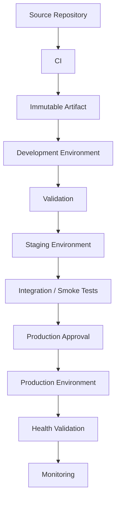
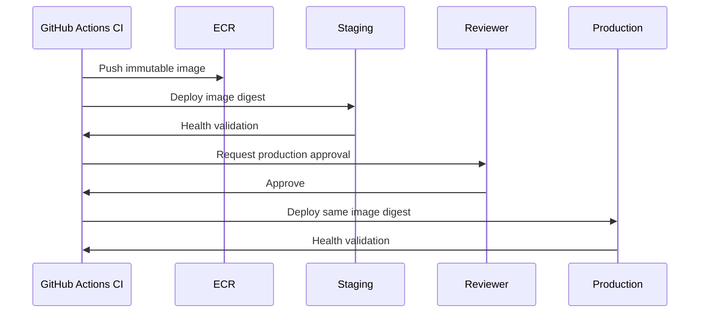

# 14- Environment Management

## Overview

GitHub Actions Environments provide a controlled boundary around environment-specific deployments, configuration, secrets, and protection rules.

A production CI/CD system commonly separates:

```text
Development
    ↓
Staging
    ↓
Production
```

Each environment can have different:

- Configuration variables
- Secrets
- Deployment protection rules
- Required reviewers
- Branch restrictions
- Deployment history
- Runtime targets

Environment management is therefore not simply a naming convention. It is part of the deployment security and release architecture.

A mature model separates:

```text
Application Code
        ↓
Immutable Artifact
        ↓
Environment Configuration
        ↓
Environment Protection
        ↓
Deployment
        ↓
Health Validation
```

The same application artifact should normally move through environments rather than being rebuilt independently for each environment.

---

## GitHub Actions Environment Model

An environment represents a deployment target and its associated controls.

Typical environments include:

```text
development
staging
production
```

Example:

```yaml
jobs:
  deploy:
    environment:
      name: production
```

The environment can determine which secrets and variables become available and which protection rules must be satisfied.

---

## Why Environments Exist

Without environment boundaries, a workflow may have direct access to all deployment credentials.

For example:

```text
One Workflow
    ↓
Staging Credentials
Production Credentials
AWS Credentials
Database Credentials
```

This creates unnecessary blast radius.

With environment separation:

```text
Staging Job
    ↓
Staging Environment
    ↓
Staging Credentials

Production Job
    ↓
Production Environment
    ↓
Production Credentials
```

The workflow becomes easier to secure and operate.

---

## Environment Architecture



---

## Environment Configuration

Environment configuration should contain values that legitimately differ between deployment targets.

Examples:

```text
AWS_REGION
ECR_REPOSITORY
ECS_CLUSTER
ECS_SERVICE
API_BASE_URL
DEPLOYMENT_TIMEOUT
```

Example:

```yaml
jobs:
  deploy:
    environment:
      name: staging

    env:
      AWS_REGION: ${{ vars.AWS_REGION }}
      ECR_REPOSITORY: ${{ vars.ECR_REPOSITORY }}

    steps:
      - run: ./deploy.sh
```

The workflow logic remains reusable while the environment supplies target-specific configuration.

---

## Environment Variables vs Workflow Variables

A workflow variable represents configuration available to the workflow.

An environment variable represents configuration associated with a deployment environment.

For example:

```text
Repository Variable
→ Python version

Environment Variable
→ Production ECS service
```

Prefer environment-level configuration when the value is inherently deployment-target-specific.

---

## Environment Secrets

Environment secrets are appropriate for sensitive deployment configuration.

Example:

```yaml
jobs:
  deploy:
    environment:
      name: production

    steps:
      - name: Deploy
        env:
          DEPLOYMENT_TOKEN: ${{ secrets.DEPLOYMENT_TOKEN }}
        run: ./deploy.sh
```

This prevents staging credentials from automatically becoming production credentials.

---

## Environment Secret Boundary

A useful model is:

```text
Workflow
   ↓
Job
   ↓
Environment
   ↓
Environment Secrets
   ↓
Deployment Step
```

Only jobs that target the environment should receive the associated credentials.

Avoid loading production secrets into unrelated jobs such as linting or unit testing.

---

## Development Environment

Development environments typically optimize for:

- Fast feedback
- Frequent deployments
- Low operational overhead
- Broad testing flexibility

Typical configuration:

```text
development
├── Development API endpoint
├── Development database
├── Development Redis
└── Development deployment target
```

Production-grade approval controls may not be necessary for every development workflow.

---

## Staging Environment

Staging should represent production behavior closely enough to validate releases.

Typical characteristics:

- Production-like infrastructure
- Production-like configuration structure
- Integration testing
- Smoke testing
- Deployment validation
- Release candidate verification

Staging should not necessarily contain production secrets.

---

## Production Environment

Production should have the strongest controls.

Typical controls include:

- Required reviewers
- Deployment protection
- Branch restrictions
- Environment-specific secrets
- Deployment concurrency
- Health validation
- Rollback procedures
- Monitoring

Example:

```yaml
jobs:
  deploy:
    environment:
      name: production
```

---

## Environment Protection

Environment protection can introduce an approval boundary.

A common flow is:

```text
Build
 ↓
Artifact
 ↓
Staging
 ↓
Validation
 ↓
Production Approval
 ↓
Production Deployment
```

The approval should protect the production deployment, not be used as a substitute for CI validation.

---

## Required Reviewers

Required reviewers provide a human authorization boundary for sensitive deployments.

A reviewer should have enough context to determine:

- What artifact is being deployed
- Which environment is affected
- What changed
- Whether validation succeeded
- Whether the deployment is expected

A production approval process is stronger when the workflow exposes useful deployment metadata.

---

## Deployment Metadata

A production workflow can create a step summary:

```bash
{
  echo "## Production Deployment"
  echo ""
  echo "- Environment: production"
  echo "- Image: ${IMAGE_TAG}"
  echo "- Commit: ${GITHUB_SHA}"
} >> "$GITHUB_STEP_SUMMARY"
```

Useful metadata includes:

- Version
- Commit SHA
- Image digest
- Environment
- Deployment actor
- Release identifier

Never include credentials or sensitive configuration.

---

## Branch Restrictions

Production deployments should normally originate from controlled sources.

For example:

```text
main
release/*
version tags
```

The exact policy depends on the organization's release model.

A production environment should not automatically trust arbitrary branches.

---

## Environment and `pull_request`

Pull request workflows usually validate unmerged code.

They should generally operate with:

```text
Low privilege
No production credentials
No production deployment
```

The workflow can test the proposed change without exposing the production environment.

---

## Environment and `pull_request_target`

`pull_request_target` runs with the base repository's security context and therefore requires particular caution.

Dangerous architecture:

```text
Untrusted PR
    ↓
pull_request_target
    ↓
Checkout PR code
    ↓
Production Secret
    ↓
Execute attacker-controlled code
```

Environment protection does not make unsafe execution of untrusted code safe.

Keep trusted deployment workflows separate from untrusted validation workflows.

---

## Environment Promotion

A mature release process promotes the same artifact:

```text
Source
  ↓
Build
  ↓
Immutable Artifact
  ↓
Development
  ↓
Staging
  ↓
Production
```

Avoid:

```text
Build development image
       ↓
Build staging image
       ↓
Build production image
```

Rebuilding changes the artifact being validated.

---

## Immutable Artifact Promotion

For Docker:

```text
orders:abc123
      ↓
ECR
      ↓
Staging
      ↓
Production
```

Prefer digest-based identity:

```text
sha256:<digest>
```

The production environment should consume the artifact that passed earlier validation.

---

## Environment-Specific Configuration

Environment-specific behavior should come from configuration rather than source-code changes.

Example:

```text
Application
    ↓
IMAGE_DIGEST = immutable

Environment
    ↓
DATABASE_URL
REDIS_URL
API_ENDPOINT
AWS_REGION
```

This keeps the artifact identical across environments.

---

## Configuration vs Artifact

| Concern | Artifact | Environment |
|---|---|---|
| Application code | Yes | No |
| Python dependencies | Yes | No |
| Docker image | Yes | No |
| AWS region | No | Yes |
| Database endpoint | No | Yes |
| Redis endpoint | No | Yes |
| Production credentials | No | Yes |
| Deployment target | No | Yes |

This distinction is fundamental to build-once/deploy-many architecture.

---

## Environment Naming

Use consistent environment names.

Common:

```text
development
staging
production
```

For larger systems:

```text
dev
qa
staging
production
```

Avoid environment names that describe temporary implementation details unless those environments are intentionally persistent.

---

## Environment Naming in Monorepos

A monorepo may deploy multiple services to the same environment:

```text
production
├── orders
├── payments
├── users
└── notifications
```

The environment identifies the deployment boundary, while variables identify the service-specific target.

---

## Multiple Production Environments

Large organizations may have:

```text
production-us
production-eu
production-ap
```

This can be useful for regional deployments.

Each environment may have different:

- AWS account
- AWS region
- ECS cluster
- Kubernetes cluster
- Database
- Redis
- Network
- Secrets

The workflow should keep deployment logic reusable.

---

## AWS Environment Architecture

A common model is:

```text
GitHub Environment
       ↓
OIDC
       ↓
AWS IAM Role
       ↓
STS
       ↓
AWS Account / Region
       ↓
ECR / ECS / EC2 / Lambda
```

For example:

```text
staging
 → staging AWS account
 → staging IAM role

production
 → production AWS account
 → production IAM role
```

This provides a strong account and credential boundary.

---

## OIDC and Environment Separation

The workflow can use environment-specific IAM roles.

```yaml
jobs:
  deploy:
    environment:
      name: production

    permissions:
      contents: read
      id-token: write
```

The IAM trust policy should restrict which repository, branch, and environment can assume the role.

Conceptually:

```text
Repository
   ↓
Branch
   ↓
Environment
   ↓
OIDC Subject
   ↓
IAM Trust Policy
   ↓
Production Role
```

---

## AWS Account Separation

For stronger isolation:

```text
GitHub
   ↓
OIDC
   ├── Development Account
   ├── Staging Account
   └── Production Account
```

This limits the impact of an incorrectly configured deployment role.

---

## Environment and ECR

A typical model is:

```text
Build
 ↓
ECR
 ↓
Image Digest
 ├── Staging
 └── Production
```

The registry should hold the immutable artifact while environments control where that artifact is deployed.

---

## ECS Environment Deployment

A Django or FastAPI application deployed to ECS may use:

```text
production environment
├── AWS_REGION
├── ECS_CLUSTER
├── ECS_SERVICE
└── ECR_REPOSITORY
```

Sensitive runtime values should generally be supplied through the application's runtime secret-management mechanism rather than copied into GitHub configuration unnecessarily.

---

## EC2 Environment Deployment

For EC2 deployments, environment configuration may determine:

```text
AWS account
Region
Auto Scaling Group
Target instances
S3 artifact location
Systemd service
```

The deployment workflow should avoid embedding environment-specific infrastructure identifiers directly into reusable scripts where variables or infrastructure outputs can provide them.

---

## Lambda Environment Deployment

Environment management may define:

```text
Lambda function
AWS region
Alias
Configuration
```

Production promotion should still use an immutable build artifact.

For example:

```text
Build
 ↓
Package
 ↓
Artifact
 ↓
Staging Lambda
 ↓
Validation
 ↓
Production Lambda
```

---

## Terraform and Environments

Terraform environments can be represented through separate state and configuration boundaries.

A production workflow may perform:

```text
Format
 ↓
Validate
 ↓
Plan
 ↓
Review
 ↓
Apply
```

The GitHub environment can protect the production apply.

Avoid allowing arbitrary pull request code to access production Terraform credentials or state.

---

## CloudFormation and Environments

CloudFormation deployments may use environment-specific parameters.

Example:

```bash
aws cloudformation deploy \
  --stack-name orders-production \
  --template-file template.yaml \
  --parameter-overrides \
    Environment=production
```

The stack itself remains infrastructure state while the GitHub environment provides deployment protection and credentials.

---

## Database Configuration

Database endpoints should vary by environment:

```text
Development
→ development PostgreSQL

Staging
→ staging PostgreSQL

Production
→ production PostgreSQL
```

Never point staging or development workflows at production databases merely because the schema is similar.

---

## Database Migration Strategy

Environment management must account for migration compatibility.

A typical sequence is:

```text
Deploy Compatible Schema
        ↓
Run Migration
        ↓
Deploy Application
        ↓
Validate
```

For zero-downtime systems, use expand-and-contract techniques.

```text
Expand
 ↓
Compatible Application
 ↓
Backfill
 ↓
Switch
 ↓
Contract
```

---

## Redis Environment Isolation

Redis endpoints should normally be environment-specific.

```text
development → Redis A
staging     → Redis B
production  → Redis C
```

Avoid sharing production Redis with lower environments.

This protects:

- Cache data
- Sessions
- Rate-limit state
- Celery queues

---

## Celery Environment Isolation

A Django application using Celery should separate:

```text
Development
→ Development broker/workers

Staging
→ Staging broker/workers

Production
→ Production broker/workers
```

A staging workflow must never accidentally publish jobs into production queues.

---

## Kafka Environment Isolation

Kafka environments should similarly be isolated.

```text
Development Kafka
Staging Kafka
Production Kafka
```

Environment configuration should control:

- Bootstrap servers
- Security configuration
- Topics
- Consumer groups

Do not allow staging consumers to join production consumer groups.

---

## API and gRPC Endpoints

Environment-specific service endpoints should be configuration-driven.

Example:

```text
ORDERS_API_URL
PAYMENTS_GRPC_ENDPOINT
```

A production artifact can therefore communicate with different service instances depending on the environment.

---

## Nginx and Environment Configuration

Nginx may route traffic differently by environment.

For example:

```text
staging.example.internal
production.example.com
```

The application artifact does not need to change simply because the reverse-proxy endpoint changes.

---

## Environment Promotion Gates

A promotion gate can verify:

```text
Artifact exists
 ↓
Artifact scanned
 ↓
Staging deployment succeeded
 ↓
Smoke tests passed
 ↓
Production approval
 ↓
Production deployment
```

This is stronger than manually deciding whether to deploy after a successful build.

---

## Environment Concurrency

Production deployments should generally be serialized.

```yaml
concurrency:
  group: production-deployment
  cancel-in-progress: false
```

This prevents multiple workflows from modifying the same production environment simultaneously.

For staging, cancellation may be acceptable:

```yaml
concurrency:
  group: staging-${{ github.ref }}
  cancel-in-progress: true
```

---

## Environment Concurrency Trade-Off

| Environment | Typical Policy |
|---|---|
| Development | Cancel stale runs |
| PR | Cancel stale runs |
| Staging | Often cancel stale runs |
| Production | Serialize deployments |
| Rollback | Serialize with production |

The correct policy depends on the resource being protected.

---

## Blue-Green Environment Management

Blue-green deployment can use two runtime environments:

```text
Production
├── Blue
└── Green
```

Example:

```text
Current Traffic
      ↓
     Blue

Deploy New Version
      ↓
     Green

Validate Green
      ↓
Switch Traffic
      ↓
     Green
```

The inactive environment provides a controlled rollback target.

---

## Canary Environment Management

Canary deployment introduces a limited traffic path.

```text
Production
   ├── Stable 95%
   └── Canary 5%
```

Promotion can be:

```text
5%
 ↓
25%
 ↓
50%
 ↓
100%
```

Each stage should have explicit health criteria.

---

## Rolling Deployment

Rolling deployment replaces instances progressively.

```text
v1 v1 v1 v1
 ↓
v2 v1 v1 v1
 ↓
v2 v2 v1 v1
 ↓
v2 v2 v2 v1
 ↓
v2 v2 v2 v2
```

Environment management should define how deployment health is evaluated during the transition.

---

## Zero-Downtime Requirements

A production environment should consider:

- Readiness checks
- Health checks
- Connection draining
- Graceful shutdown
- Backward-compatible APIs
- Database migration compatibility
- Queue compatibility

For Django/FastAPI services, the deployment must account for active HTTP requests and background workers.

---

## Environment Health Checks

After deployment:

```text
Deployment
 ↓
Health Check
 ↓
Smoke Test
 ↓
Metrics
 ↓
Promotion / Rollback
```

Examples:

```bash
curl --fail https://staging.example.com/health
```

or:

```bash
kubectl rollout status deployment/orders
```

Health checks should verify application readiness rather than simply confirming that a process exists.

---

## Environment Drift

Environment drift occurs when environments differ unexpectedly.

Examples:

```text
Staging:
Python 3.12

Production:
Python 3.11
```

or:

```text
Staging:
PostgreSQL 16

Production:
PostgreSQL 14
```

Some differences are intentional; undocumented differences create deployment risk.

---

## Environment Parity

The goal is not necessarily identical environments.

Instead, preserve important behavioral parity:

```text
Application Runtime
Database Behavior
Networking Model
Security Model
Deployment Process
Observability
```

Production may differ in scale without differing fundamentally in architecture.

---

## Environment Configuration as Code

Configuration should be reproducible.

For example:

```text
Terraform
   ↓
AWS Infrastructure

GitHub Environment
   ↓
Deployment Controls

Variables
   ↓
Non-sensitive Target Configuration

Secret Manager
   ↓
Runtime Secrets
```

Avoid relying exclusively on undocumented manual configuration.

---

## Temporary Environments

Ephemeral environments can be useful for:

- Pull request validation
- Feature testing
- Integration testing
- End-to-end testing

Architecture:

```text
Pull Request
    ↓
Provision Environment
    ↓
Deploy Immutable Artifact
    ↓
Run Tests
    ↓
Destroy Environment
```

Temporary environments require automated cleanup to control cost.

---

## Environment Cleanup

For ephemeral environments:

```text
Create
 ↓
Deploy
 ↓
Test
 ↓
Collect Artifacts
 ↓
Destroy
```

Cleanup should run even when tests fail, while being careful with cancellation semantics.

---

## Environment Costs

Environment management affects cost through:

- Running infrastructure
- Databases
- Redis
- Kafka
- Load balancers
- NAT gateways
- Runner capacity
- Temporary environments

Development and PR environments can often use smaller or ephemeral infrastructure.

Production should optimize for availability rather than simply minimizing resource cost.

---

## Environment Availability

Critical environments should avoid single points of failure.

For production:

```text
Multiple Availability Zones
        ↓
Load Balancer
        ↓
Multiple Application Instances
```

The CI/CD system should also avoid depending on one self-hosted runner.

---

## Environment Disaster Recovery

Document:

- Environment infrastructure
- Configuration
- Secrets source
- IAM roles
- Deployment workflow
- Artifact registry
- Rollback procedure
- Recovery dependencies

A production environment should be reconstructible from controlled sources.

---

## Environment Rollback

Rollback should identify the previous immutable artifact.

```text
Current
v1.5.0
  ↓
Rollback
v1.4.3
```

The rollback should not require rebuilding version `v1.4.3`.

---

## Environment Variables During Rollback

Configuration changes can complicate rollback.

For example:

```text
Application v2
requires:
NEW_API_URL
```

Rolling back to v1 may fail if the environment was changed incompatibly.

Environment changes should therefore be backward-compatible where possible.

---

## Feature Flags

Feature flags can separate deployment from feature activation.

```text
Deploy Code
    ↓
Feature Disabled
    ↓
Validate
    ↓
Enable Feature
```

This is particularly useful for:

- Canary releases
- Gradual rollout
- Risky migrations
- Large backend changes

Feature-flag state should still be governed and observable.

---

## Environment Management and Artifacts

An environment should consume artifacts rather than build them.

Example:

```yaml
jobs:
  deploy:
    environment: production

    steps:
      - name: Deploy immutable image
        env:
          IMAGE_DIGEST: ${{ inputs.image-digest }}
        run: ./deploy.sh "$IMAGE_DIGEST"
```

The deployment identity is therefore explicit.

---

## Environment Promotion Architecture



This model provides traceability from source to production.

---

## Environment Auditability

A production deployment should answer:

```text
Which commit?
Which artifact?
Which image digest?
Which environment?
Who initiated it?
Who approved it?
Which workflow run?
Which deployment target?
```

Store this metadata in workflow summaries, deployment records, release metadata, and operational systems as appropriate.

Do not store sensitive credentials in audit metadata.

---

## Environment Ownership

Every production environment should have an owner.

Ownership should cover:

- Configuration
- Credentials
- Deployment process
- Monitoring
- Incident response
- Capacity
- Recovery

A shared environment without clear ownership becomes difficult to operate safely.

---

## Environment Governance

Organization-level governance can define:

- Required environment names
- Production approval standards
- Allowed deployment branches
- Action policies
- Runner policies
- Secret policies
- OIDC requirements
- Artifact requirements
- Rollback standards

This creates consistency across repositories.

---

## Environment Access Control

Separate:

```text
Developer
Reviewer
Deployer
Platform Administrator
```

roles where appropriate.

Not every developer needs direct production access if deployments are performed through controlled workflows.

---

## Environment Change Management

Environment configuration changes should be treated similarly to application changes.

A controlled process is:

```text
Change
 ↓
Review
 ↓
Apply
 ↓
Validate
 ↓
Monitor
```

Infrastructure-as-code can provide version history for infrastructure changes.

GitHub environment configuration should also be governed through appropriate administrative controls.

---

## Troubleshooting: Deployment Uses Wrong Environment

### Symptom

A workflow deploys to staging instead of production.

### Possible Causes

- Wrong environment name
- Incorrect variable
- Incorrect branch
- Wrong reusable workflow input
- Incorrect AWS account
- Incorrect IAM role

### Isolation

Inspect:

```text
Git ref
 ↓
Workflow input
 ↓
Environment
 ↓
Variables
 ↓
AWS role
 ↓
AWS account
 ↓
Deployment target
```

Verify AWS identity:

```bash
aws sts get-caller-identity
```

---

## Troubleshooting: Environment Secret Missing

### Symptom

A deployment cannot access a production secret.

### Possible Causes

- Job does not target production
- Secret exists at a different scope
- Incorrect secret name
- Reusable workflow does not declare the secret
- Workflow event cannot access the secret

### Corrective Action

Verify:

```yaml
environment:
  name: production
```

and the reusable workflow secret contract if applicable.

Never weaken environment protection to solve a configuration error.

---

## Troubleshooting: Approval Not Triggered

### Check

```text
Job Environment
 ↓
Environment Name
 ↓
Protection Rules
 ↓
Required Reviewers
 ↓
Workflow Run
```

The job must actually target the configured environment.

---

## Troubleshooting: Wrong AWS Account

Check:

```bash
aws sts get-caller-identity
```

Then verify:

```text
GitHub Environment
 ↓
OIDC Subject
 ↓
IAM Role
 ↓
AWS Account
```

Do not assume that a successful OIDC authentication means the workflow reached the intended account.

---

## Troubleshooting: Deployment Succeeds but Application Is Broken

Separate infrastructure success from application readiness.

Check:

```text
Deployment command
 ↓
Container / process startup
 ↓
Readiness
 ↓
Health endpoint
 ↓
Database connectivity
 ↓
Redis connectivity
 ↓
External dependencies
```

A successful `aws ecs update-service` does not by itself prove that the application is healthy.

---

## Troubleshooting: Environment Drift

Compare:

```text
Infrastructure
Configuration
Runtime
Dependencies
Secrets
IAM
Networking
```

Use infrastructure-as-code and environment configuration inventories to identify undocumented differences.

---

## Troubleshooting: Rollback Fails

Investigate:

- Artifact availability
- Database compatibility
- Environment configuration
- Previous image digest
- Runtime compatibility
- Migration state
- Feature flags

Rollback is not simply changing an image tag when database or configuration state has changed incompatibly.

---

## GitHub CLI Environment Operations

List environments through repository APIs or inspect repository configuration using GitHub CLI workflows and API commands.

For example, list repository information:

```bash
gh repo view
```

Inspect workflow runs:

```bash
gh run list
```

Inspect a deployment-related run:

```bash
gh run view <run-id>
```

List repository variables:

```bash
gh variable list
```

List environment-scoped variables:

```bash
gh variable list --env production
```

List environment secrets:

```bash
gh secret list --env production
```

Use CLI operations with appropriate administrative permissions.

---

## Environment and Workflow CLI Operations

Run a manual deployment:

```bash
gh workflow run deploy-production.yml \
  -f image-tag=abc123
```

Inspect the resulting run:

```bash
gh run list --workflow deploy-production.yml
```

View logs:

```bash
gh run view <run-id> --log
```

This provides a practical operational workflow:

```text
Trigger
 ↓
Inspect
 ↓
Validate
 ↓
Monitor
```

---

## Environment Security Checklist

- [ ] Production is a protected environment.
- [ ] Production secrets are environment-scoped.
- [ ] Untrusted PRs cannot access production credentials.
- [ ] Production IAM roles use least privilege.
- [ ] OIDC trust policies restrict repository and deployment context.
- [ ] Environment variables contain no sensitive data.
- [ ] Deployment branches are controlled.
- [ ] Production deployments are serialized.
- [ ] Artifacts are immutable.
- [ ] Rollback artifacts are retained.

---

## Environment Reliability Checklist

- [ ] Health checks exist.
- [ ] Readiness is validated after deployment.
- [ ] Database migrations are deployment-safe.
- [ ] Redis and Kafka environments are isolated.
- [ ] Production infrastructure is highly available.
- [ ] Rollback procedures are tested.
- [ ] Environment dependencies are documented.
- [ ] Configuration is reproducible.
- [ ] Environment drift is detectable.
- [ ] Disaster recovery procedures exist.

---

## Environment Cost Checklist

- [ ] Temporary environments are automatically destroyed.
- [ ] Non-production resources are appropriately sized.
- [ ] Unused environments are removed.
- [ ] Runner capacity matches environment demand.
- [ ] Expensive databases are not duplicated unnecessarily.
- [ ] Production capacity is not reduced below reliability requirements.

---

## Common Mistakes

### Treating Environments as Names Only

An environment should represent a meaningful deployment boundary.

### Sharing Production Secrets With CI

Testing jobs rarely need production credentials.

### Rebuilding Per Environment

This breaks immutable artifact promotion.

### Using the Same Database Across Environments

This creates data corruption and security risks.

### Using the Same Redis or Kafka Infrastructure

Cross-environment state leakage can occur.

### No Production Approval

Sensitive production changes may execute automatically without the intended human control.

### Overly Broad OIDC Trust

A role trusted by too many repositories or branches has excessive blast radius.

### No Deployment Concurrency

Two workflows can modify production simultaneously.

### Configuration Hidden in Scripts

Hard-coded environment targets make workflows difficult to reuse and audit.

### No Rollback Testing

A rollback that exists only on paper is not a reliable recovery mechanism.

---

## Senior Engineering Considerations

A senior engineer designing environment management should reason about:

### Security Boundary

```text
What credentials become available after selecting this environment?
```

### Artifact Boundary

```text
Is this the exact artifact that passed validation?
```

### Authorization Boundary

```text
Who can deploy to production?
```

### Infrastructure Boundary

```text
Which AWS account, VPC, cluster, or runtime is being changed?
```

### Configuration Boundary

```text
Which values are environment-specific?
```

### Failure Boundary

```text
What happens if deployment succeeds but health validation fails?
```

### Recovery Boundary

```text
Can the previous artifact and compatible configuration be restored?
```

---

## Production Reference Architecture

```text
                         Git Repository
                              │
                              ▼
                       GitHub Actions CI
                              │
                ┌─────────────┴─────────────┐
                │                           │
             Testing                    Security
                │                           │
                └─────────────┬─────────────┘
                              ▼
                    Immutable Docker Image
                              │
                              ▼
                             ECR
                              │
              ┌───────────────┴────────────────┐
              │                                │
              ▼                                ▼
         Staging Environment             Production
              │                         Environment
              │                                │
         Smoke Tests                     Approval Gate
              │                                │
              └───────────────┬────────────────┘
                              ▼
                       Production Runtime
                              │
                    ┌─────────┼─────────┐
                    ▼         ▼         ▼
                  ECS       Redis    PostgreSQL
                              │
                            Kafka
```

The key architectural property is that environments control deployment context while the artifact remains immutable.

---

## Interview Scenarios

### Production Must Not Deploy Twice

Use an environment-specific concurrency group:

```yaml
concurrency:
  group: production-deployment
  cancel-in-progress: false
```

Explain why production deployments should be serialized.

### Production Requires Approval

Use a protected GitHub Environment:

```yaml
environment:
  name: production
```

Configure required reviewers at the environment level.

### Staging and Production Use Different AWS Accounts

Use environment-specific OIDC roles:

```text
staging → staging IAM role
production → production IAM role
```

Restrict trust policies accordingly.

### Docker Image Must Not Be Rebuilt

Build once:

```text
Source
 ↓
Build
 ↓
ECR
 ↓
Digest
```

Promote the same digest:

```text
Staging
 ↓
Production
```

### Production Database Migration Is Risky

Use backward-compatible expand-and-contract migration strategies and validate compatibility before application promotion.

### A Deployment Succeeds but Health Checks Fail

Do not consider the deployment successful merely because the deployment command returned zero.

Use:

```text
Deploy
 ↓
Readiness
 ↓
Health
 ↓
Smoke Tests
 ↓
Promote or Rollback
```

### A Pull Request Requires Environment Access

Determine whether the requirement can be satisfied without privileged production access. Do not expose production secrets or private-network credentials to arbitrary PR code.

---

## Production Environment Review

Before enabling production deployment, verify:

### Access

- [ ] Correct repository
- [ ] Correct branch restrictions
- [ ] Correct reviewers
- [ ] Correct IAM role
- [ ] Correct AWS account

### Configuration

- [ ] Correct region
- [ ] Correct cluster
- [ ] Correct service
- [ ] Correct registry
- [ ] Correct runtime configuration

### Security

- [ ] Least-privilege permissions
- [ ] OIDC trust restrictions
- [ ] No long-lived AWS credentials
- [ ] No production secrets in CI test jobs
- [ ] No untrusted PR access

### Reliability

- [ ] Deployment concurrency
- [ ] Health checks
- [ ] Rollback artifact
- [ ] Migration strategy
- [ ] Monitoring

---

## Key Takeaways

- GitHub Environments should be treated as **deployment security and configuration boundaries**, not merely labels such as `staging` and `production`.
- Keep **environment-specific configuration and secrets separate from immutable application artifacts**, allowing the same artifact to progress through development, staging, and production.
- Protect production with **environment approvals, branch restrictions, least-privilege IAM, OIDC, deployment concurrency, and health validation**.
- Isolate environment infrastructure and state, including PostgreSQL, Redis, Kafka, AWS accounts, networks, and runtime targets, to prevent cross-environment failures and data exposure.
- Design environments for the complete lifecycle: **promotion, observability, rollback, configuration drift detection, cost control, high availability, and disaster recovery**.