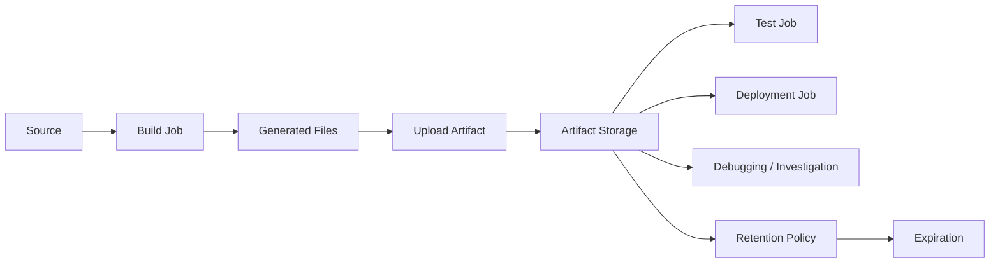
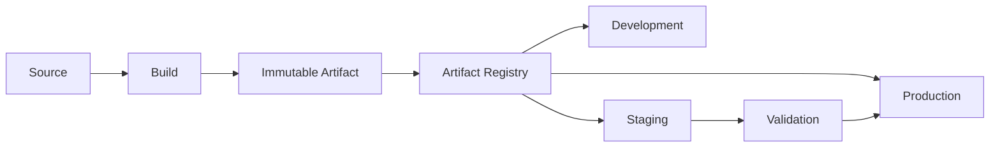
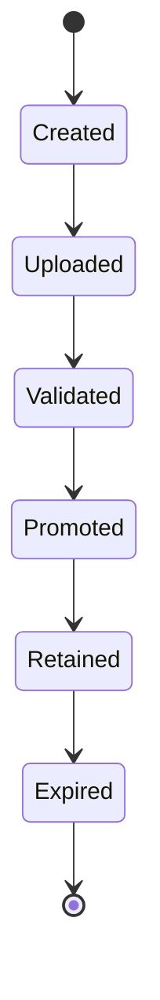
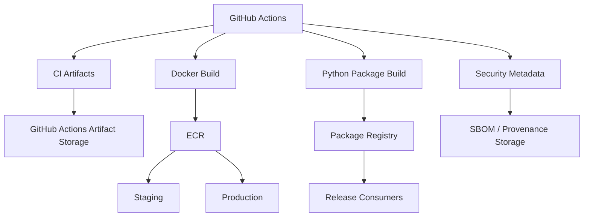

# 15- Artifact Retention and Storage

## Overview

Artifacts are outputs produced by GitHub Actions workflows that need to persist beyond the execution of an individual job. They are commonly used for test reports, build packages, deployment bundles, debugging data, and other workflow outputs.

Artifact management becomes an operational concern when CI/CD pipelines scale.

A production pipeline must answer:

- What should be stored?
- For how long?
- Who can access it?
- Which artifacts are release artifacts?
- Which artifacts are only diagnostic?
- How are artifacts transferred between jobs?
- How much storage is being consumed?
- What happens when artifacts expire?
- Can production deployments still be rolled back?
- Which artifacts must be preserved for compliance or incident investigation?

A useful model is:

```text
Source
  ↓
Build
  ↓
Artifact
  ↓
Validation
  ↓
Promotion
  ↓
Deployment
  ↓
Retention / Cleanup
```

Artifact storage should be designed around lifecycle, reproducibility, security, cost, and recovery rather than simply uploading every generated file.

---

## What Is a GitHub Actions Artifact?

A workflow artifact is a collection of files uploaded during a workflow run and retained for later access.

Example:

```yaml
- name: Upload test reports
  uses: actions/upload-artifact@v4
  with:
    name: test-reports
    path: reports/
```

Another job can download it:

```yaml
- name: Download test reports
  uses: actions/download-artifact@v5
  with:
    name: test-reports
    path: reports/
```

The artifact provides a controlled data-transfer mechanism between workflow stages and a way to preserve selected workflow outputs.

---

## Why Artifacts Exist

Artifacts solve several different problems.

### Job-to-Job Transfer

Jobs execute independently and do not normally share their workspace.

```text
Build Job
   ↓
Artifact
   ↓
Deploy Job
```

### Debugging

Failed tests may generate:

- Logs
- Screenshots
- Coverage reports
- Stack traces
- Browser traces

### Release Outputs

Build jobs may produce:

- Python wheels
- Source archives
- Deployment bundles
- Static assets
- Configuration packages

### Auditability

Artifacts can provide evidence of what a workflow produced at a particular point in time.

---

## Artifact Architecture



The runner filesystem is temporary workflow execution state. Artifact storage provides persistence beyond the individual job.

---

## Artifact vs Workspace

A workspace exists on the runner during job execution.

```text
Runner
└── Workspace
    ├── source
    ├── build output
    └── test reports
```

When the job finishes, the workspace should not be treated as durable storage.

If another job needs the files:

```text
Job A
  ↓
Upload Artifact
  ↓
Job B
  ↓
Download Artifact
```

---

## Artifact vs Cache

Artifacts and caches have different purposes.

| Property | Artifact | Cache |
|---|---|---|
| Primary purpose | Preserve output | Accelerate execution |
| Correctness dependency | Can be | Should not be |
| Typical contents | Reports, packages, bundles | Dependencies, build layers |
| Explicit upload/download | Yes | Cache mechanism |
| Release usage | Yes | No |
| Debugging usage | Yes | Usually no |
| Retention intent | Deliberate | Optimization-oriented |

A cache should never become the authoritative source of a production release artifact.

---

## Artifact vs Job Output

Job outputs are appropriate for small structured values.

Example:

```yaml
outputs:
  image_digest: ${{ steps.build.outputs.digest }}
```

Artifacts are appropriate for files.

Use:

```text
Output
→ Version, identifier, JSON metadata

Artifact
→ Package, report, archive, bundle
```

Do not use artifacts for simple strings that can be passed through job outputs.

---

## Artifact vs External Artifact Registry

GitHub Actions artifacts are useful for workflow-level outputs.

Production application artifacts often belong in dedicated registries.

Examples:

```text
Python package → Package registry
Docker image → ECR
Terraform module/package → Registry
Release binary → Release/object storage
```

A common architecture is:

```text
GitHub Actions Artifact
→ CI intermediate output

ECR / Package Registry
→ Production deployment artifact
```

---

## Artifact Categories

Not all artifacts require the same retention period.

A practical classification is:

| Artifact | Typical Purpose | Retention Strategy |
|---|---|---|
| Test report | CI diagnostics | Short |
| Coverage report | Quality tracking | Short/medium |
| Debug logs | Failure investigation | Short |
| E2E screenshots | Debugging | Short |
| Python wheel | Release | Long |
| Deployment bundle | Release/rollback | Long |
| SBOM | Security/compliance | Long |
| Provenance/attestation | Supply chain | Long |
| Temporary matrix output | Job coordination | Short |

Retention should be based on operational value.

---

## Artifact Naming

Artifact names should identify their purpose.

Good:

```text
unit-test-results
coverage-report
integration-test-results
orders-build
orders-release
sbom
```

For matrix jobs, include relevant dimensions:

```yaml
name: coverage-python-${{ matrix.python-version }}
```

This prevents ambiguity when multiple jobs upload related artifacts.

---

## Matrix Artifact Naming

A matrix can generate multiple artifacts.

Example:

```yaml
strategy:
  matrix:
    python-version:
      - "3.11"
      - "3.12"

steps:
  - name: Upload report
    uses: actions/upload-artifact@v4
    with:
      name: pytest-${{ matrix.python-version }}
      path: reports/
```

Without unique names, multiple matrix jobs can become difficult to distinguish or may conflict with the intended artifact model.

---

## Artifact Paths

Use explicit paths.

```yaml
- name: Upload reports
  uses: actions/upload-artifact@v4
  with:
    name: reports
    path: |
      reports/junit.xml
      reports/coverage.xml
```

Avoid uploading an entire workspace unless there is a specific reason.

Broad uploads can accidentally include:

- Secrets
- `.env` files
- Credentials
- Dependency caches
- Large temporary files

---

## Artifact Exclusions

Use explicit inclusion or exclusion patterns where appropriate.

Example:

```yaml
- name: Upload logs
  uses: actions/upload-artifact@v4
  with:
    name: application-logs
    path: |
      logs/**/*.log
      !logs/secrets/**
```

The safer pattern is to generate a dedicated output directory containing only approved files.

---

## Dedicated Artifact Directory

A robust pattern is:

```text
workspace/
├── source/
├── temporary/
├── build/
└── artifacts/
    ├── report.xml
    └── package.whl
```

Then upload:

```yaml
path: artifacts/
```

This reduces accidental data exposure.

---

## Test Reports

Python projects commonly generate JUnit reports.

Example:

```bash
pytest \
  --junitxml=artifacts/junit.xml \
  --cov=. \
  --cov-report=xml:artifacts/coverage.xml
```

Then:

```yaml
- name: Upload test reports
  if: ${{ !cancelled() }}
  uses: actions/upload-artifact@v4
  with:
    name: test-reports
    path: artifacts/
```

This preserves diagnostics even when tests fail.

---

## Coverage Artifacts

Coverage outputs may include:

```text
coverage.xml
htmlcov/
```

A common pattern is:

```yaml
- name: Run tests
  run: |
    pytest \
      --cov=. \
      --cov-report=xml:coverage.xml

- name: Upload coverage
  if: ${{ !cancelled() }}
  uses: actions/upload-artifact@v4
  with:
    name: coverage
    path: coverage.xml
```

Avoid retaining large HTML reports indefinitely unless they provide operational value.

---

## Django Test Artifacts

A Django pipeline may generate:

```text
artifacts/
├── junit.xml
├── coverage.xml
└── django-test.log
```

Example:

```bash
pytest \
  --ds=config.settings.test \
  --junitxml=artifacts/junit.xml \
  --cov=. \
  --cov-report=xml:artifacts/coverage.xml
```

These artifacts help diagnose CI failures without rerunning the entire pipeline.

---

## FastAPI Test Artifacts

FastAPI applications using pytest can follow the same pattern:

```bash
pytest \
  --junitxml=artifacts/junit.xml \
  --cov=app \
  --cov-report=xml:artifacts/coverage.xml
```

The artifact mechanism is independent of the application framework.

---

## Integration Test Artifacts

Integration tests may produce:

```text
artifacts/
├── junit.xml
├── coverage.xml
├── postgres.log
└── redis.log
```

Service logs are particularly useful when a test fails because a dependency did not become ready.

---

## End-to-End Test Artifacts

Browser-based E2E tests can produce:

```text
artifacts/
├── screenshots/
├── traces/
├── videos/
└── junit.xml
```

These can become large quickly.

Retention should therefore be shorter for routine successful runs and longer only when needed for failure investigation.

---

## Failure-Aware Artifact Collection

Artifact upload should normally happen when the workflow reaches a meaningful post-test state.

Example:

```yaml
- name: Upload test artifacts
  if: ${{ !cancelled() }}
  uses: actions/upload-artifact@v4
  with:
    name: test-results
    path: artifacts/
```

The condition should reflect the intended behavior.

Avoid blindly using:

```yaml
if: always()
```

for every cleanup or reporting step without considering cancellation and dependency behavior.

---

## Debugging Artifacts

Useful debugging artifacts include:

- Application logs
- Test logs
- Screenshots
- Browser traces
- Stack traces
- Generated configuration with secrets removed
- Performance profiles

Debug artifacts should be intentionally scoped.

Never upload:

```text
.env
credentials.json
private-key.pem
```

just because a debugging workflow failed.

---

## Artifact Compression

Many artifact formats are already compressed.

For large collections of small files, packaging them can reduce transfer overhead.

Example:

```bash
tar -czf artifacts/test-logs.tar.gz logs/
```

Then upload:

```yaml
path: artifacts/test-logs.tar.gz
```

Compression can reduce:

- Upload time
- Storage consumption
- Download time

But it adds CPU work and can complicate individual-file inspection.

---

## Large Artifacts

Large artifacts can increase:

- Upload duration
- Workflow runtime
- Storage consumption
- Download duration
- Network utilization

Do not upload data merely because it exists.

Ask:

```text
Will this artifact be used?
Who needs it?
For how long?
Can it be regenerated?
```

---

## Artifact Retention

Artifact retention defines how long uploaded workflow artifacts remain available.

Example:

```yaml
- name: Upload artifact
  uses: actions/upload-artifact@v4
  with:
    name: test-results
    path: artifacts/
    retention-days: 7
```

Use retention according to artifact purpose rather than applying the longest possible retention to everything.

---

## Retention Strategy

A practical model:

```text
PR Diagnostics
→ Short retention

Nightly Reports
→ Medium retention

Release Artifacts
→ Long retention

Compliance / Provenance
→ Policy-driven retention
```

Exact durations should follow repository, organization, and regulatory requirements.

---

## Retention and Rollback

Do not rely on short-lived CI artifacts for production rollback if the production deployment requires the artifact later.

For production artifacts:

```text
Build
 ↓
Registry
 ↓
Immutable Artifact
 ↓
Promotion
 ↓
Retention Policy
```

Docker images should normally live in ECR or another appropriate registry rather than depending solely on GitHub Actions artifact retention.

---

## Release Artifact Storage

A release may produce:

```text
orders-1.4.2.whl
orders-1.4.2.tar.gz
sbom.json
provenance.json
```

These should have a deliberate long-term storage strategy.

Possible destinations include:

- GitHub Releases
- Package registries
- Object storage
- Container registries
- Security/provenance systems

---

## Docker Images Are Different

A Docker image built by GitHub Actions should generally be pushed to a container registry.

```text
GitHub Actions
    ↓
Docker Buildx
    ↓
ECR
    ↓
Image Digest
    ↓
Staging
    ↓
Production
```

Do not use a GitHub Actions artifact as the normal production Docker image registry.

---

## Build Once, Deploy Many

Artifact storage supports immutable promotion.



The production deployment consumes the same artifact that was validated earlier.

---

## Artifact Identity

Every production artifact should have a stable identity.

For Docker:

```text
Tag:
orders:abc123
```

and immutable content identity:

```text
sha256:<digest>
```

For Python packages:

```text
orders-1.4.2-py3-none-any.whl
```

For release bundles:

```text
orders-1.4.2.tar.gz
```

Artifact metadata should make it possible to trace the output back to source.

---

## Artifact Metadata

Useful metadata includes:

```text
Repository
Commit SHA
Workflow run
Build timestamp
Version
Artifact type
Image digest
Build environment
Dependency information
SBOM
Provenance
```

Avoid placing secrets in artifact metadata.

---

## Artifact Provenance

For security-sensitive release pipelines, provenance can establish:

```text
Source
 ↓
Workflow
 ↓
Build
 ↓
Artifact
```

This helps answer:

> Where did this production artifact come from?

Provenance is particularly valuable for:

- Production Docker images
- Release packages
- Security investigations
- Compliance
- Supply-chain verification

---

## SBOM Artifacts

A Software Bill of Materials identifies dependencies included in a build.

Example:

```text
Application
├── Django
├── PostgreSQL client
├── Redis client
└── Other Python dependencies
```

An SBOM can be retained alongside the artifact.

Example:

```yaml
- name: Upload SBOM
  uses: actions/upload-artifact@v4
  with:
    name: sbom
    path: artifacts/sbom.json
```

Security-sensitive organizations may retain SBOMs according to their artifact and compliance policies.

---

## Artifact Signing

Artifact integrity can be strengthened with signatures or attestations.

Conceptually:

```text
Build
 ↓
Artifact
 ↓
Hash
 ↓
Signature / Attestation
 ↓
Registry
 ↓
Verification
```

This helps detect unauthorized artifact modification.

---

## Artifact Security

Artifacts should be treated as potentially sensitive and potentially executable.

Security considerations include:

- Access control
- Retention
- Integrity
- Malware scanning
- Secret leakage
- Supply-chain trust
- Artifact poisoning
- Download permissions

Do not automatically trust every artifact produced by every workflow.

---

## Artifact Poisoning

A compromised workflow could produce a malicious artifact.

Example:

```text
Compromised Action
       ↓
Modified Build
       ↓
Malicious Artifact
       ↓
Production Deployment
```

Mitigations include:

- Least-privilege permissions
- SHA-pinned actions
- Trusted build workflows
- Immutable artifacts
- Provenance
- Attestations
- Artifact scanning
- Controlled promotion

---

## Artifact Access Control

Not every repository user or workflow should automatically have access to every artifact.

Production release artifacts may contain proprietary or sensitive code.

Control access according to:

```text
Repository
Organization
Environment
Release process
Security policy
```

---

## Artifact Download Security

Downloaded artifacts should not automatically be executed.

For example:

```text
Download
 ↓
Verify identity
 ↓
Verify checksum / provenance
 ↓
Scan
 ↓
Execute / Deploy
```

This is especially important when workflows consume artifacts from other repositories or workflow runs.

---

## Cross-Workflow Artifacts

Artifacts can be useful when one workflow produces output consumed by another.

A common model is:

```text
Build Workflow
    ↓
Artifact
    ↓
Deployment Workflow
```

The deployment workflow should validate that the artifact corresponds to an approved build.

Do not rely only on a human-readable artifact name.

---

## Cross-Repository Artifacts

Enterprise CI/CD systems may promote artifacts across repositories.

Example:

```text
Application Repository
        ↓
Build
        ↓
Artifact Registry
        ↓
Deployment Repository
        ↓
Production
```

A dedicated artifact registry is generally more appropriate for long-lived cross-repository production artifacts.

---

## Artifact Retention and Compliance

Some artifacts may need longer retention due to:

- Regulatory requirements
- Security investigations
- Release traceability
- Audit requirements
- Customer support
- Incident response

Retention policies should be documented.

Do not retain everything forever without a clear reason.

---

## Artifact Storage Cost

Storage cost depends on:

```text
Artifact Size
×
Workflow Frequency
×
Retention Duration
```

A simple model:

```text
10 GB/day
×
30 days
=
300 GB
```

If artifacts are generated for every matrix combination, storage can grow significantly faster.

---

## Matrix Storage Explosion

Consider:

```text
4 Python versions
×
3 databases
×
2 operating systems
=
24 jobs
```

If each job uploads:

```text
500 MB
```

then one run can produce:

```text
24 × 500 MB = 12 GB
```

Retention and artifact granularity should account for matrix expansion.

---

## Artifact Aggregation

Instead of retaining duplicate reports from every job indefinitely, aggregate them.

Example:

```text
Matrix Jobs
 ├── Python 3.11
 ├── Python 3.12
 └── Python 3.13
        ↓
Download Reports
        ↓
Aggregate
        ↓
Combined Report
```

Keep individual artifacts only when they provide meaningful diagnostic value.

---

## Artifact Naming for Matrix Jobs

Use deterministic naming:

```yaml
name: |
  test-results-${{ matrix.python-version }}-${{ matrix.database }}
```

For example:

```text
test-results-3.12-postgres
test-results-3.12-mysql
```

This makes troubleshooting significantly easier.

---

## Artifact Retention by Workflow Type

A practical policy can be:

| Workflow | Artifact Type | Retention Approach |
|---|---|---|
| Pull request | Test/debug output | Short |
| Main CI | Test reports | Short/medium |
| Nightly | Full reports | Medium |
| Release | Release package | Long |
| Production deployment | Deployment metadata | Policy-driven |
| Security scan | SBOM/provenance | Policy-driven |

The exact durations should be determined by operational requirements.

---

## Artifact Lifecycle



For release artifacts, the lifecycle may instead be:

```text
Created
 ↓
Published
 ↓
Promoted
 ↓
Archived
```

---

## Artifact Expiration

Expiration should be expected behavior.

Do not design production recovery around an artifact that is scheduled to expire.

For long-lived releases:

```text
GitHub Actions Artifact
→ Temporary workflow output

ECR / Package Registry / Release Storage
→ Durable release artifact
```

---

## Artifact Cleanup

Cleanup should remove artifacts that no longer have operational value.

For example:

```text
PR artifacts
→ Short retention

Old debug artifacts
→ Automatic expiration

Released Docker images
→ Registry lifecycle policies
```

Do not manually delete artifacts as the primary lifecycle strategy when automated retention is sufficient.

---

## ECR Lifecycle Policies

For Docker images, use registry lifecycle management.

Conceptually:

```text
ECR
├── Current production images
├── Recent release images
└── Old unused images
          ↓
       Cleanup
```

Be careful not to delete images that are required for rollback.

---

## Rollback Artifact Retention

Before deleting an artifact, determine whether it can be required for:

- Production rollback
- Incident investigation
- Customer support
- Compliance
- Reproducibility

A release retention policy should explicitly preserve rollback candidates.

---

## Artifact Recovery

If an artifact is deleted:

```text
Determine Source Commit
 ↓
Determine Build Configuration
 ↓
Determine Dependency Versions
 ↓
Determine Build Environment
 ↓
Rebuild
```

However, rebuilding may not reproduce the exact binary unless the build is reproducible.

For critical releases, retain the original immutable artifact.

---

## Reproducible Builds

A reproducible build aims to produce equivalent artifacts from the same source and build inputs.

Control:

- Dependency versions
- Base images
- Build tools
- Python version
- OS dependencies
- Build configuration

This reduces dependency on a single stored artifact but does not eliminate the value of preserving the original artifact.

---

## Artifact Storage and Python

A Python application may produce:

```text
dist/
├── orders-1.4.2-py3-none-any.whl
└── orders-1.4.2.tar.gz
```

CI can upload these as release artifacts or publish them to an appropriate package registry.

Example:

```yaml
- name: Build package
  run: |
    python -m build

- name: Upload package
  uses: actions/upload-artifact@v4
  with:
    name: python-package
    path: dist/
```

---

## Artifact Storage and Docker

A production Docker workflow:

```yaml
- name: Build and push
  uses: docker/build-push-action@v6
  with:
    context: .
    push: true
    tags: |
      ${{ vars.ECR_REGISTRY }}/${{ vars.ECR_REPOSITORY }}:${{ github.sha }}
```

The image belongs in the container registry rather than being retained indefinitely as a workflow artifact.

---

## Artifact Storage and Kubernetes

Kubernetes deployments should normally consume images from a registry:

```text
GitHub Actions
 ↓
Buildx
 ↓
ECR
 ↓
Image Digest
 ↓
Kubernetes
```

The workflow artifact mechanism may still be used for:

- Rendered manifests
- Deployment reports
- Debugging output
- SBOMs
- Provenance

---

## Artifact Storage and Terraform

Terraform workflows may generate:

```text
plan.out
plan.json
logs
policy-results
```

A plan artifact can be useful for review.

However, sensitive Terraform plans may contain infrastructure values that should not be broadly distributed.

Protect and retain them according to their sensitivity.

---

## Terraform Plan Security

Terraform plans can expose:

- Resource configuration
- Network details
- Sensitive values
- Infrastructure identifiers

Do not upload every plan as a public or broadly accessible artifact.

Use appropriate access controls and avoid storing secrets in Terraform configuration.

---

## Artifact Storage and Test Evidence

A production CI pipeline can preserve:

```text
test-results/
coverage/
security/
sbom/
```

Example:

```text
CI Run
 ├── JUnit
 ├── Coverage
 ├── Security Results
 └── SBOM
```

These outputs provide useful evidence without requiring access to the runner after the workflow finishes.

---

## Artifact Retention and Observability

Track:

- Artifact count
- Artifact size
- Storage growth
- Upload failures
- Download failures
- Expiration
- Failed artifact collection
- Retention policy effectiveness

Unexpected storage growth often indicates:

- Matrix expansion
- Large debug files
- Duplicate artifacts
- Excessive retention
- Workflow frequency increases

---

## Artifact Upload Failure

### Symptom

The artifact upload step fails.

### Possible Causes

- Missing path
- Permission problem
- Network issue
- Excessive artifact size
- Invalid configuration
- Runner failure

### Isolation Strategy

Check:

```bash
ls -lah artifacts/
du -sh artifacts/
```

Then verify the workflow step and runner state.

### Prevention

Create artifacts explicitly and validate their size before uploading.

---

## Artifact Missing

### Symptom

A downstream job cannot find an artifact.

### Possible Causes

- Upload step was skipped
- Incorrect artifact name
- Wrong workflow run
- Incorrect download path
- Upstream job failed
- Artifact expired

### Isolation

Trace:

```text
Producer Job
 ↓
Upload Step
 ↓
Artifact Name
 ↓
Workflow Run
 ↓
Consumer Job
 ↓
Download Step
```

---

## Artifact Path Problem

### Symptom

Upload succeeds but expected files are missing.

Check:

```bash
find artifacts -maxdepth 3 -type f -print
```

Then verify the upload path.

Avoid assuming the runner working directory is the same in every job.

---

## Artifact Size Problem

### Symptom

Workflow becomes slow after adding artifacts.

Check:

```bash
du -sh artifacts/
```

Then inspect the largest files:

```bash
du -ah artifacts/ | sort -h | tail -20
```

Remove unnecessary files or compress large collections.

---

## Artifact Expiration Problem

### Symptom

An old workflow artifact is no longer available.

Possible cause:

```text
Retention period expired
```

Corrective action:

- Use durable release storage for long-lived artifacts.
- Preserve rollback images in ECR.
- Publish release packages to appropriate registries.
- Define retention according to operational requirements.

Do not extend all CI artifacts indefinitely just to solve one release-retention problem.

---

## Artifact Security Failure

### Symptom

Sensitive data appears in an artifact.

Immediate response:

```text
Identify artifact
 ↓
Restrict / remove access
 ↓
Determine exposed data
 ↓
Rotate affected credentials
 ↓
Investigate consumers
 ↓
Fix artifact collection
```

If credentials were included, revoke or rotate them.

---

## Artifact Poisoning Incident

### Symptom

A production artifact may have been generated by a compromised workflow.

Investigate:

```text
Workflow Run
 ↓
Commit
 ↓
Actions
 ↓
Runner
 ↓
Build Inputs
 ↓
Artifact
 ↓
Promotion
```

Use provenance, attestations, logs, and artifact metadata where available.

Do not automatically redeploy an artifact whose build integrity is uncertain.

---

## GitHub CLI Artifact Operations

List workflow runs:

```bash
gh run list
```

Inspect a run:

```bash
gh run view <run-id>
```

View logs:

```bash
gh run view <run-id> --log
```

Inspect artifacts through the run metadata:

```bash
gh run view <run-id> --json artifacts
```

Download a workflow run's artifacts:

```bash
gh run download <run-id>
```

These commands are useful during CI/CD incident investigation.

---

## GitHub CLI Workflow Operations

Run a workflow:

```bash
gh workflow run build.yml
```

Rerun a workflow:

```bash
gh run rerun <run-id>
```

List workflows:

```bash
gh workflow list
```

A practical investigation sequence is:

```text
gh run list
    ↓
gh run view <run-id>
    ↓
Inspect logs
    ↓
Inspect artifacts
    ↓
Identify failure
```

---

## Artifact Governance

An organization should define:

- Artifact naming standards
- Retention classes
- Release artifact policy
- Debug artifact policy
- Access control
- Security scanning
- Provenance requirements
- Rollback retention
- Storage limits
- Cleanup policies

---

## Artifact Ownership

Every important artifact class should have an owner.

For example:

```text
Test Reports
→ CI Platform

Release Packages
→ Application Team

Docker Images
→ Platform / Application Team

SBOM
→ Security / Platform

Deployment Bundles
→ Release Engineering
```

Ownership determines who defines retention and recovery requirements.

---

## Artifact Storage Architecture

A mature CI/CD system may use different storage systems for different artifact classes:



The important principle is to select storage based on artifact lifecycle rather than forcing every output into one storage mechanism.

---

## Production Artifact Strategy

A production pipeline can use:

```text
Pull Request
→ Short-lived test artifacts

Main CI
→ Test and coverage artifacts

Release
→ Durable package/image

Production
→ Immutable deployment artifact

Security
→ SBOM/provenance/attestation
```

This balances operational usefulness with storage cost.

---

## Reliability Considerations

Artifact storage can become a dependency between jobs.

For critical pipelines:

- Minimize unnecessary artifact transfers.
- Keep artifacts reasonably sized.
- Avoid using artifacts for values that outputs can carry.
- Use durable registries for release artifacts.
- Preserve rollback artifacts.
- Design downstream jobs to fail clearly when required artifacts are unavailable.

---

## Performance Considerations

Artifact transfer adds network I/O.

For large pipelines:

```text
Job A
 ↓
Large Artifact
 ↓
Upload
 ↓
Storage
 ↓
Download
 ↓
Job B
```

can become a significant part of total pipeline time.

Prefer:

- Small artifacts
- Parallel uploads where appropriate
- Dedicated release registries
- Build caching for intermediate dependencies
- Job outputs for small metadata

---

## Scalability Considerations

As repository count and workflow frequency increase:

```text
More Repositories
        ↓
More Workflow Runs
        ↓
More Artifacts
        ↓
More Storage
        ↓
More Operational Metadata
```

Enterprise platforms should use standardized retention classes and artifact governance.

---

## Disaster Recovery

For production recovery, identify the authoritative artifact source.

Example:

```text
GitHub Actions Artifact
→ Temporary CI evidence

ECR
→ Production Docker image

Package Registry
→ Python package

Object Storage
→ Deployment bundle
```

Recovery procedures should reference the durable source rather than an artifact that may expire automatically.

---

## High Availability

Application availability and artifact availability are related but different concerns.

During an incident, the deployment platform may need access to:

```text
Previous Image
Previous Package
Deployment Metadata
Infrastructure Configuration
```

Retain critical release artifacts independently of transient CI output.

---

## Cost Optimization

Reduce artifact storage by:

- Setting appropriate retention
- Avoiding duplicate uploads
- Avoiding entire workspace uploads
- Compressing large logs
- Aggregating matrix reports
- Using dedicated registries for durable artifacts
- Expiring debugging artifacts quickly
- Retaining only rollback-relevant release versions

---

## Common Mistakes

### Uploading the Entire Workspace

This can expose secrets and unnecessary files.

### Using Artifacts as Caches

Artifacts and caches solve different problems.

### Using Artifacts as the Docker Registry

Production images belong in a container registry such as ECR.

### Retaining Everything Forever

This increases cost without necessarily improving reliability.

### Short Retention for Rollback Artifacts

Critical release artifacts must outlive ordinary CI diagnostics.

### Non-Unique Matrix Artifact Names

This makes artifacts difficult to identify and troubleshoot.

### Uploading Secrets

Debugging artifacts can accidentally contain `.env` files, credentials, or private keys.

### Passing Small Values Through Artifacts

Use job outputs for simple metadata.

### Rebuilding During Rollback

Prefer deploying the previously stored immutable artifact.

### Ignoring Artifact Provenance

A production artifact should be traceable to its source and trusted build process.

---

## Production Checklist

### Artifact Design

- [ ] Artifact purpose is defined.
- [ ] Artifact names are deterministic.
- [ ] Upload paths are explicit.
- [ ] Only required files are uploaded.
- [ ] Matrix artifacts have unique names.
- [ ] Large artifacts are reviewed.

### Retention

- [ ] Retention matches artifact purpose.
- [ ] PR artifacts have short retention.
- [ ] Release artifacts have durable storage.
- [ ] Rollback artifacts are preserved.
- [ ] Compliance artifacts follow applicable policy.

### Security

- [ ] Artifacts do not contain secrets.
- [ ] Sensitive reports have appropriate access controls.
- [ ] Build artifacts have integrity metadata where required.
- [ ] SBOMs and provenance are retained appropriately.
- [ ] Untrusted artifacts are not automatically deployed.

### Production

- [ ] Docker images are stored in ECR or an appropriate registry.
- [ ] Production artifacts are immutable.
- [ ] Artifact identity is traceable to a commit.
- [ ] Promotion uses the same artifact.
- [ ] Rollback does not require rebuilding.

### Operations

- [ ] Artifact upload failures are observable.
- [ ] Storage growth is monitored.
- [ ] Cleanup is automated.
- [ ] Artifact ownership is defined.
- [ ] Recovery procedures identify durable artifact sources.

---

## Interview Scenarios

### A Build Job Produces a Python Wheel

Explain how the build job can upload the wheel and how a downstream deployment or release job can consume it.

The important distinction is:

```text
File
→ Artifact

Version metadata
→ Job output
```

### A Matrix Generates 30 Test Reports

Explain how you would:

- Use deterministic names.
- Aggregate reports where useful.
- Reduce retention for temporary outputs.
- Avoid unnecessary duplicate storage.

### Production Rollback Is Required After 30 Days

Do not depend on a short-lived CI artifact.

Use durable release storage such as a container registry or package registry with a retention policy designed for rollback.

### A Debug Artifact Contains a Database Password

Treat the password as compromised:

```text
Restrict access
 ↓
Rotate credential
 ↓
Investigate exposure
 ↓
Remove unsafe artifact generation
 ↓
Improve validation
```

### Docker Images Are Being Stored as GitHub Artifacts

Move durable production images to a container registry such as ECR.

Use GitHub artifacts for workflow-level outputs and debugging data.

### Artifact Storage Is Growing Rapidly

Investigate:

```text
Workflow frequency
 ↓
Matrix expansion
 ↓
Artifact size
 ↓
Retention duration
 ↓
Duplicate artifacts
```

Optimize the largest contributor rather than arbitrarily reducing all retention.

---

## Senior Design Principles

### Store According to Lifecycle

Temporary diagnostics and production releases have different retention requirements.

### Artifacts Are Outputs, Not State

Do not turn artifact storage into an application database.

### Immutable Artifacts Enable Reliable Promotion

The same artifact should move from staging to production.

### Retention Is an Operational Policy

Retention affects cost, rollback, compliance, and incident response.

### Durable Releases Need Durable Storage

Production recovery should not depend on expiring CI artifacts.

### Artifact Security Is Supply-Chain Security

An artifact is executable or deployable output and must have appropriate integrity and provenance controls.

### Optimize Artifact Volume Deliberately

Large matrices and verbose test outputs can create substantial storage and network overhead.

### Make Recovery Independent of the Runner

Runner workspaces are temporary. Critical release artifacts must exist in durable storage.

## Key Takeaways

- Treat artifacts as **durable workflow outputs with an explicit lifecycle**, not as generic file storage or caches.
- Separate **short-lived CI diagnostics** from **durable production artifacts** stored in systems such as ECR or package registries.
- Use explicit artifact paths, deterministic names, appropriate retention, and security controls to prevent unnecessary storage growth and accidental secret exposure.
- Production deployments should use **immutable, traceable artifacts** and retain the artifacts required for reliable rollback without rebuilding.
- Artifact management should be designed for **security, provenance, performance, cost, observability, and disaster recovery**, especially as CI/CD scales across repositories and matrix workloads.