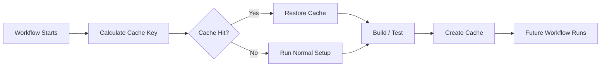
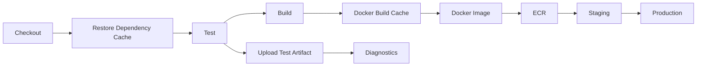
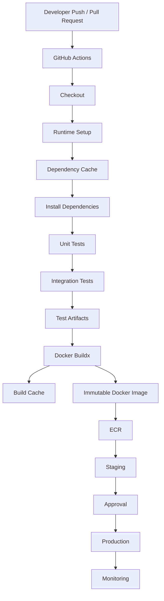

# 16- Cache Management

## Overview

Caching in GitHub Actions reduces workflow execution time by reusing data that is expensive to recreate, such as Python dependencies, Node dependencies, package-manager metadata, and Docker build layers.

Caching is an optimization mechanism, not an artifact-management mechanism.

A useful distinction is:

```text
Cache
→ Reusable data that accelerates future executions

Artifact
→ Output that must be preserved, transferred, inspected, or deployed
```

A production caching strategy should optimize:

- Workflow duration
- Network usage
- Dependency installation
- Docker build performance
- Runner utilization
- Storage consumption
- Reliability
- Cache correctness
- Security

Caching should never become a correctness requirement for a CI pipeline. A cache miss must cause the workflow to perform the normal work rather than fail.

---

## Why Caching Exists

Without caching, a Python pipeline may repeatedly download the same dependencies:

```text
Checkout
  ↓
Create environment
  ↓
Download Django
  ↓
Download FastAPI
  ↓
Download pytest
  ↓
Download remaining dependencies
  ↓
Run tests
```

With caching:

```text
Checkout
  ↓
Restore Cache
  ↓
Install Missing Dependencies
  ↓
Run Tests
```

The cache can significantly reduce repeated network and package-manager work.

---

## GitHub Actions Cache Model

The high-level lifecycle is:



The important property is that the workflow must remain functional when the cache does not exist.

---

## Cache vs Artifact

| Property | Cache | Artifact |
|---|---|---|
| Primary purpose | Speed up workflows | Preserve outputs |
| Can be regenerated? | Yes | Usually should be preserved |
| Correctness dependency | No | May be |
| Typical content | Dependencies/build layers | Reports/packages/releases |
| Retention purpose | Optimization | Lifecycle/preservation |
| Deployment source | No | Sometimes |
| Cache miss | Normal | Usually meaningful |
| Example | pip cache | Python wheel |

A production Docker image should not be treated as a cache.

A production release should not depend on a cache.

---

## Cache vs Job Outputs

Job outputs are small values passed between jobs.

Example:

```yaml
outputs:
  image_tag: ${{ steps.meta.outputs.tag }}
```

Cache:

```text
Dependency files
Build layers
Package-manager data
```

Output:

```text
Image tag
Version
Commit SHA
Dynamic matrix JSON
```

Do not use cache storage to transfer workflow state.

---

## What Should Be Cached?

Good cache candidates include:

- Python package downloads
- Node package downloads
- Maven/Gradle dependencies
- Go modules
- Rust dependencies
- Docker build layers
- Tool downloads
- Large deterministic build dependencies

Poor cache candidates include:

- Secrets
- Production databases
- Mutable application state
- Deployment state
- Release artifacts
- Credentials
- Environment-specific configuration

---

## Cache Correctness

A cache is correct when restored data is compatible with the current build.

For example:

```text
Python 3.12
+
requirements.lock
```

should generally have a different cache identity from:

```text
Python 3.11
+
different requirements.lock
```

Cache keys must represent the inputs that materially affect cached data.

---

## Cache Keys

A cache key identifies a cache entry.

Conceptually:

```text
OS
+
Runtime Version
+
Dependency Definition
+
Architecture
```

For Python:

```text
Linux
+
Python 3.12
+
requirements.lock
```

can produce a deterministic key.

---

## `hashFiles()`

`hashFiles()` is useful for incorporating dependency-file contents into cache keys.

Example:

```yaml
key: ${{ runner.os }}-python-${{ matrix.python-version }}-${{ hashFiles('**/requirements.lock') }}
```

When the dependency file changes, the hash changes and a new cache key is produced.

---

## Basic Python Cache

Example:

```yaml
- name: Set up Python
  uses: actions/setup-python@v6
  with:
    python-version: "3.12"
    cache: "pip"
    cache-dependency-path: requirements.lock

- name: Install dependencies
  run: |
    python -m pip install --upgrade pip
    pip install -r requirements.lock
```

Using the package setup action's supported cache integration is usually preferable to manually managing the package-manager cache unless custom behavior is required.

---

## Python Dependency Cache

A Python pipeline may use:

```text
requirements.txt
requirements.lock
pyproject.toml
poetry.lock
uv.lock
```

The dependency file used to determine the cache identity should reflect the actual dependency source of truth.

For example:

```yaml
cache-dependency-path: uv.lock
```

if the project uses `uv` as the dependency manager.

---

## Python Matrix Caching

Consider:

```yaml
strategy:
  matrix:
    python-version:
      - "3.11"
      - "3.12"
      - "3.13"
```

The cache must not accidentally cause incompatible environments to reuse the same dependency state.

Use runtime information in the cache identity when necessary.

Conceptually:

```text
Linux-Python-3.11-dependencies
Linux-Python-3.12-dependencies
Linux-Python-3.13-dependencies
```

---

## Node Dependency Caching

A Node project may use:

```yaml
- name: Set up Node
  uses: actions/setup-node@v5
  with:
    node-version: "22"
    cache: "npm"
    cache-dependency-path: package-lock.json

- name: Install dependencies
  run: npm ci
```

The lock file should be part of cache invalidation.

---

## Why Lock Files Matter

A lock file captures resolved dependency versions.

For example:

```text
package.json
    ↓
package-lock.json
    ↓
Resolved dependency graph
```

The lock file is therefore a better cache invalidation input than only the high-level dependency declaration.

The same principle applies to Python lock files and other package managers.

---

## Cache Hit and Cache Miss

A cache hit means reusable data was found.

A cache miss means it was not.

A miss is not an error.

The correct workflow is:

```text
Cache Miss
   ↓
Install / Build Normally
   ↓
Generate Cache
   ↓
Future Run Can Reuse It
```

Do not write workflows that assume:

```text
Cache Miss → Failure
```

unless the cache itself is intentionally part of a special workflow contract.

---

## Restore Keys

Restore keys can allow a workflow to search for a related cache when an exact key does not exist.

Conceptually:

```text
Exact:
Linux-python-3.12-hash123

Fallback:
Linux-python-3.12-

Fallback:
Linux-python-
```

This can improve cache utilization but increases the chance of restoring older data.

Use fallback keys only when older cached data is safe to reuse.

---

## Exact vs Partial Cache Matches

| Strategy | Benefit | Risk |
|---|---|---|
| Exact key | Strong isolation | More misses |
| Prefix fallback | Better reuse | Older data may be restored |
| Broad fallback | High hit rate | Compatibility risk |

For package-manager caches, broad fallback is often less dangerous because the package manager can download missing dependencies.

For generated build state, broad fallback may be unsafe.

---

## Cache Key Design

A strong cache key contains the inputs that determine compatibility.

Example:

```yaml
key: >-
  ${{ runner.os }}-
  python-${{ matrix.python-version }}-
  ${{ hashFiles('requirements.lock') }}
```

The exact syntax should remain readable.

Avoid meaningless keys such as:

```yaml
key: cache
```

A static key can cause unrelated builds to share data.

---

## Cache Key Dimensions

Depending on the workload, consider:

| Dimension | Why |
|---|---|
| OS | Files and binaries may differ |
| Architecture | ARM and x64 binaries differ |
| Runtime version | Python/Node versions may differ |
| Dependency lock file | Dependency graph changes |
| Compiler version | Generated binaries may differ |
| Build configuration | Output may differ |
| Framework/tool version | Generated state may differ |

Do not include dimensions that do not affect the cache, because that unnecessarily reduces hit rates.

---

## Cache Invalidation

Cache invalidation should happen when relevant inputs change.

For Python:

```text
requirements.lock changes
        ↓
hash changes
        ↓
new cache key
        ↓
fresh dependency resolution
```

For Node:

```text
package-lock.json changes
        ↓
hash changes
        ↓
new cache key
```

This is more reliable than manually clearing caches after every dependency update.

---

## Cache Busting

Sometimes a build system requires deliberate invalidation.

A version component can be included:

```yaml
key: v2-${{ runner.os }}-${{ hashFiles('requirements.lock') }}
```

Changing:

```text
v1 → v2
```

creates a new cache namespace.

Use this deliberately.

Do not continuously change the prefix because that defeats caching.

---

## Docker Layer Caching

Docker builds can be expensive because every build may need to:

- Resolve dependencies
- Install OS packages
- Install Python packages
- Build application layers

BuildKit caching can reuse previously built layers.

A typical architecture is:

```text
Dockerfile
   ↓
Buildx
   ↓
BuildKit Cache
   ↓
Docker Image
```

---

## Docker Layer Ordering

Dockerfile ordering strongly affects cache reuse.

Prefer:

```dockerfile
FROM python:3.12-slim

WORKDIR /app

COPY requirements.txt .

RUN pip install --no-cache-dir -r requirements.txt

COPY app/ ./app/

CMD ["python", "-m", "app"]
```

Application source changes do not invalidate the dependency-install layer.

A less efficient pattern is:

```dockerfile
COPY . .

RUN pip install -r requirements.txt
```

because every source change can invalidate the dependency layer.

---

## Docker Cache with Buildx

A GitHub Actions build may use Buildx cache storage.

Conceptually:

```yaml
- name: Build image
  uses: docker/build-push-action@v6
  with:
    context: .
    push: true
    tags: ${{ vars.ECR_REGISTRY }}/${{ vars.ECR_REPOSITORY }}:${{ github.sha }}
    cache-from: type=gha
    cache-to: type=gha,mode=max
```

This allows BuildKit to reuse build layers across workflow executions.

---

## Docker Cache vs Docker Image

These are different:

```text
Cache
→ Intermediate build layers

Image
→ Deployable application artifact
```

The cache can disappear without making the application unreleasable.

The image must be stored durably in a registry when it represents a release.

---

## Docker Cache and ECR

A registry can also participate in build caching.

Conceptually:

```text
GitHub Actions
      ↓
Buildx
  ↙       ↘
Cache     ECR
           ↓
       Deployable Image
```

This can be useful for large projects where build cache reuse across runners is important.

---

## Docker Cache Security

Build caches can contain intermediate layers.

Be careful when those layers may include:

- Secrets
- Private source
- Generated credentials
- Internal configuration

Never place secrets into Docker build layers.

Prefer BuildKit secret mechanisms when build-time secrets are genuinely required.

---

## GitHub Actions Cache

The dedicated cache mechanism can be used directly:

```yaml
- name: Cache dependencies
  uses: actions/cache@v4
  with:
    path: ~/.cache/pip
    key: ${{ runner.os }}-pip-${{ hashFiles('requirements.lock') }}
```

Then:

```yaml
- name: Install dependencies
  run: pip install -r requirements.lock
```

For standard package-manager caching, built-in support from setup actions may be simpler.

---

## Cache Paths

A cache must identify the directories that actually contain reusable data.

For example:

```yaml
path: ~/.cache/pip
```

Caching the wrong directory produces successful-looking cache steps without meaningful performance improvement.

Before defining a cache, identify the actual cache location.

---

## Discovering Cache Locations

For Python:

```bash
python -m pip cache dir
```

For npm:

```bash
npm config get cache
```

For other package managers, use their supported cache-location commands.

This is preferable to guessing filesystem paths.

---

## Cache Compression

Cache implementations may compress stored data.

The practical concern is the trade-off between:

```text
Compression
→ Less network/storage

CPU
→ More runner work
```

Caching extremely cheap-to-create data can make the workflow slower rather than faster.

---

## Cache Hit Ratio

A useful operational metric is:

```text
Cache Hit Ratio =
Successful Cache Restores
÷
Total Cache Restore Attempts
```

A low hit ratio can indicate:

- Poor key design
- Excessive invalidation
- Matrix fragmentation
- Frequent dependency changes
- Incompatible runner dimensions

---

## Cache Efficiency

A cache is useful when:

```text
Time saved
>
Cache restore + upload overhead
```

For a small dependency set:

```text
Download = 3 seconds
Cache restore = 5 seconds
```

Caching may provide no benefit.

For a large dependency set:

```text
Download = 90 seconds
Cache restore = 10 seconds
```

Caching provides significant value.

Measure rather than assuming.

---

## Cache Storage Growth

Caching creates storage consumption.

Growth is influenced by:

```text
Number of keys
×
Cache size
×
Retention behavior
```

Matrix-heavy workflows can create many distinct cache entries.

For example:

```text
3 Python versions
×
2 operating systems
×
5 dependency generations
```

can create many independent cache variants.

---

## Cache Management in Large Repositories

Large repositories should avoid unnecessary cache dimensions.

Bad:

```text
OS
+
Python
+
branch
+
commit SHA
+
timestamp
+
dependency hash
```

This can create extremely fragmented caches.

Better:

```text
OS
+
Python
+
dependency hash
```

when those are the actual compatibility boundaries.

---

## Branches and Cache Reuse

Cache design should consider branch behavior.

A feature branch should generally be able to benefit from compatible dependency caches without making the cache a mechanism for sharing mutable application state.

The dependency lock file remains a stronger compatibility signal than the branch name.

---

## Monorepo Caching

A monorepo may contain:

```text
services/
├── users/
├── orders/
├── payments/
└── notifications/
```

Caching the entire repository's dependency state can become inefficient.

Prefer service-specific dependency inputs when practical.

Example:

```yaml
cache-dependency-path: services/orders/requirements.lock
```

This reduces invalidation caused by unrelated services.

---

## Selective Caching

Selective caching is useful when only a subset of a repository changes.

A planning job can determine affected services:

```text
Changed Files
      ↓
Change Detection
      ↓
Affected Services
      ↓
Service-specific Build
      ↓
Service-specific Cache
```

This is particularly useful for large microservice repositories.

---

## Cache and Matrix Testing

Matrix jobs can reuse compatible dependency caches.

Example:

```yaml
strategy:
  matrix:
    python-version:
      - "3.11"
      - "3.12"
```

Use runtime-specific keys when dependency environments differ.

For databases:

```text
Python 3.12 + PostgreSQL
Python 3.12 + MySQL
```

may share the Python dependency cache if the cached content is database-independent.

Do not add database dimensions to cache keys unless the cached content actually depends on the database.

---

## Cache and PostgreSQL

A PostgreSQL service container normally should not be cached.

The database state is ephemeral test state.

Cache:

```text
Python packages
```

Do not cache:

```text
PostgreSQL data directory
```

A fresh database provides better test isolation.

---

## Cache and Redis

Redis service state should generally remain ephemeral.

Cache:

```text
Application dependencies
```

Do not cache:

```text
Redis runtime data
```

Tests should initialize Redis in a predictable state.

---

## Cache and Kafka

Kafka broker state should normally not be persisted through CI caching.

Use fresh service containers or controlled integration-test environments.

Cache the expensive setup dependencies, not mutable message-broker state.

---

## Cache and Celery

Celery worker state should not normally be cached.

A CI workflow may cache Python dependencies:

```text
pip cache
```

while starting a fresh:

```text
Celery worker
Redis broker
```

for each integration test run.

---

## Cache and Django

A Django pipeline may use:

```text
pip cache
+
Docker layer cache
```

while keeping:

```text
PostgreSQL
Redis
Celery
```

ephemeral.

This preserves test isolation while accelerating dependency installation.

---

## Cache and FastAPI

FastAPI pipelines can use the same dependency caching principles.

Example:

```text
FastAPI source
 ↓
Restore Python cache
 ↓
Install dependencies
 ↓
Start PostgreSQL/Redis
 ↓
pytest
```

The application runtime itself is not the cache.

---

## Cache and Nginx

Nginx configuration is normally source-controlled and should not be treated as a generic cache.

Generated configuration or build outputs may be cached only if they are deterministic and safely reusable.

---

## Cache and gRPC

Generated protobuf code can sometimes be cached if generation is expensive and all inputs are part of the cache identity.

However, generated code is often inexpensive enough to regenerate.

Cache it only after measuring the actual build cost.

---

## Cache and AWS

AWS authentication should never depend on a cache.

The correct production flow is:

```text
GitHub Actions
 ↓
OIDC
 ↓
AWS STS
 ↓
Temporary Credentials
 ↓
ECR / S3 / ECS / EC2 / Lambda
```

Do not cache:

```text
AWS credentials
```

---

## Cache and OIDC

OIDC credentials are temporary credentials.

They should be generated for the job when required.

Caching credentials defeats the security model of short-lived identity.

---

## Cache and Secrets

Never cache:

```text
.env
AWS credentials
Private keys
Database passwords
API tokens
SSH keys
```

Even if a cache is protected, secrets should not be placed into reusable caches.

---

## Cache and Untrusted Pull Requests

Caches introduce a trust boundary.

A workflow executing untrusted code should not be allowed to influence data later consumed by a more privileged workflow without appropriate isolation.

Be particularly careful with:

- Fork pull requests
- `pull_request_target`
- Self-hosted runners
- Deployment workflows
- Cache contents generated by untrusted code

---

## Cache Poisoning

Cache poisoning occurs when an attacker influences cached data so a later workflow restores malicious content.

Conceptually:

```text
Untrusted Workflow
       ↓
Writes Malicious Cache
       ↓
Privileged Workflow
       ↓
Restores Cache
       ↓
Executes Malicious Content
```

Mitigations include:

- Avoid caching executable mutable state from untrusted jobs.
- Keep privileged workflows isolated.
- Use appropriate permissions.
- Avoid sharing caches across incompatible trust boundaries.
- Treat restored cached content as untrusted when appropriate.
- Prefer deterministic package-manager caches over arbitrary workspace caches.

---

## Self-Hosted Runner Cache Risks

Persistent self-hosted runners introduce additional risk because local state may survive between jobs.

Potential leftovers include:

```text
Workspace files
Credentials
Build outputs
Caches
Temporary files
Docker layers
```

Ephemeral runners reduce this persistence risk.

---

## Persistent Runner Cleanup

If persistent runners are necessary:

```text
Job
 ↓
Cleanup
 ↓
Remove sensitive files
 ↓
Reset workspace
 ↓
Next job
```

Do not assume GitHub Actions cache management cleans the entire runner filesystem.

---

## Cache and Runner Isolation

A cache is not a security boundary.

Do not use caching as a replacement for:

- Runner isolation
- Permissions
- Environment protection
- Secret management
- Network isolation
- Artifact verification

---

## Cache Versioning

A cache namespace can be versioned intentionally.

Example:

```yaml
key: v3-${{ runner.os }}-python-${{ matrix.python-version }}-${{ hashFiles('requirements.lock') }}
```

When the cache format changes:

```text
v3 → v4
```

This allows old entries to become obsolete without changing every dependency file.

---

## Cache Invalidation After Toolchain Changes

Invalidate caches when changing:

- Python version
- Node version
- Compiler
- OS image
- Package manager
- Dependency format
- Build process

The cache key should reflect compatibility boundaries.

---

## Cache and Dependency Updates

Dependabot or manual dependency updates may change:

```text
requirements.lock
package-lock.json
```

A content hash naturally creates a new cache key.

This is preferable to manually deleting caches after every dependency update.

---

## Cache and Build Failures

A corrupted cache should not permanently break the pipeline.

A good design allows:

```text
Cache Restore
 ↓
Build
 ↓
Failure
 ↓
Invalidate / change cache key
 ↓
Rebuild from clean state
```

If deleting or changing the cache makes the build succeed, investigate the cache contents and invalidation model.

---

## Cache Failure Domain

Treat caching as an optimization failure domain:

```text
Cache unavailable
      ↓
Workflow should still run
      ↓
Slower execution
      ↓
Not incorrect execution
```

This principle is critical for reliable CI/CD.

---

## Troubleshooting Cache Misses

### Symptom

Cache is always missed.

### Possible Causes

- Key changes every run
- Lock file hash changes
- Incorrect cache path
- Matrix dimension creates unique keys
- Cache does not exist yet

### Checks

```bash
git status --short
```

Inspect the dependency files and workflow key.

Check whether a timestamp, run ID, or commit SHA is accidentally part of the cache key.

---

## Troubleshooting Low Cache Hit Rate

### Symptom

Caches exist but are rarely reused.

### Isolation Strategy

Inspect:

```text
OS
Runtime
Architecture
Dependency hash
Branch
Matrix dimensions
```

Compare actual keys across workflow runs.

### Corrective Action

Remove dimensions that do not affect compatibility.

---

## Troubleshooting Incorrect Dependencies

### Symptom

A workflow restores a cache but dependencies are incorrect.

### Possible Causes

- Weak cache key
- Missing lock-file hash
- Missing runtime dimension
- Incompatible restore key
- Stale build state

### Corrective Action

Strengthen the cache identity.

Example:

```yaml
key: >-
  ${{ runner.os }}-
  python-${{ matrix.python-version }}-
  ${{ hashFiles('requirements.lock') }}
```

---

## Troubleshooting Docker Cache

### Symptom

Docker builds are not becoming faster.

Check:

```text
Dockerfile layer order
Build context
.dockerignore
Cache exporter
Cache importer
Dependency changes
```

A large build context can also reduce performance.

---

## `.dockerignore`

Use `.dockerignore` to reduce unnecessary build context.

Example:

```dockerignore
.git
.github
.pytest_cache
__pycache__
*.pyc
.venv
.env
node_modules
coverage
htmlcov
```

This improves build performance and reduces accidental inclusion of sensitive files.

---

## Cache and `.gitignore`

`.gitignore` controls Git tracking.

`.dockerignore` controls Docker build context.

They solve different problems.

Do not assume:

```text
.gitignore
```

automatically controls:

```text
Docker build context
```

---

## Cache Debugging

Useful commands include:

```bash
du -sh ~/.cache
```

For Python:

```bash
python -m pip cache info
```

For npm:

```bash
npm cache verify
```

For Docker:

```bash
docker system df
```

These help determine whether caching is actually providing value.

---

## Cache Monitoring

Track workflow duration before and after caching.

Useful measurements:

```text
Dependency installation time
Cache restore time
Cache save time
Total workflow duration
Cache hit rate
Cache size
```

The objective is not maximum cache usage.

The objective is lower reliable pipeline latency.

---

## Cache Performance Trade-Off

A cache introduces overhead:

```text
Restore
 ↓
Network transfer
 ↓
Decompression
 ↓
Build
 ↓
Compression
 ↓
Upload
```

For small data sets, this can cost more than rebuilding.

Caching should therefore be based on measured performance.

---

## Cache Cost

Cost can come from:

- Storage
- Network transfer
- Runner CPU
- Cache upload/download time
- Operational complexity

A cache that saves 10 seconds but consumes substantial storage and increases failure modes may not be worthwhile.

---

## Cache Reliability

A production-quality cache strategy should satisfy:

```text
Cache Hit
→ Faster workflow

Cache Miss
→ Normal workflow

Cache Failure
→ Normal workflow where possible
```

Caching should not create a new critical dependency in the deployment path.

---

## High Availability

CI/CD high availability does not mean caches must always exist.

Instead:

```text
Cache Available
→ Fast CI

Cache Unavailable
→ Slower CI

Runner / GitHub Actions Available
→ CI remains functional
```

This is a healthier failure model.

---

## Disaster Recovery

Do not use caches as disaster-recovery storage.

Caches are:

```text
Regenerable
Optimization-oriented
Temporary
```

Disaster recovery requires durable sources such as:

- Source control
- Container registries
- Package registries
- Object storage
- Infrastructure-as-code repositories

---

## Cache Governance

Organizations should define:

- Approved cache mechanisms
- Security requirements
- Sensitive-data restrictions
- Key naming conventions
- Runner isolation requirements
- Docker caching standards
- Cache troubleshooting procedures

---

## Enterprise Cache Strategy

A large organization may standardize:

```text
Python
→ setup-python caching

Node
→ setup-node caching

Docker
→ Buildx cache

Release
→ ECR / package registry

Debugging
→ GitHub Actions artifacts
```

This avoids every repository inventing a different caching model.

---

## Reusable Workflows and Cache Configuration

Reusable workflows can standardize caching.

Example:

```yaml
jobs:
  test:
    uses: company/platform/.github/workflows/python-ci.yml@v1
    with:
      python-version: "3.12"
```

The reusable workflow can enforce:

- Cache strategy
- Dependency installation
- Cache key conventions
- Security controls
- Standard diagnostics

This reduces configuration drift across repositories.

---

## Composite Actions and Cache Configuration

Composite actions can package caching-related steps.

For example:

```text
setup-python
restore dependencies
install tools
```

However, cache design should remain understandable to workflow consumers.

Do not hide important cache behavior behind opaque abstractions.

---

## Cache and Reusable Workflows

A reusable workflow can orchestrate:

```text
Checkout
 ↓
Setup Runtime
 ↓
Restore Cache
 ↓
Install Dependencies
 ↓
Test
```

This is appropriate when multiple repositories need the same CI contract.

---

## Cache and Custom Actions

Custom actions are useful when cache behavior requires reusable implementation logic.

However:

```text
Reusable Workflow
→ Multi-job CI/CD orchestration

Composite Action
→ Reusable steps

Cache
→ Reusable optimization data
```

These are different abstraction layers.

---

## Cache and Artifacts in a Production Pipeline

A mature pipeline may use both:



The cache accelerates the pipeline.

The artifacts and registry outputs preserve important results.

---

## Cache and Build Once, Deploy Many

Caching should never change the application artifact between environments.

Correct:

```text
Build
 ↓
Immutable Image
 ↓
Staging
 ↓
Production
```

Cache:

```text
Build acceleration
```

Artifact:

```text
Deployment identity
```

---

## Cache and Concurrency

Caching should be designed alongside workflow concurrency.

For example:

```yaml
concurrency:
  group: ci-${{ github.ref }}
  cancel-in-progress: true
```

This prevents obsolete PR runs from consuming runner capacity unnecessarily.

Caching then reduces the cost of the runs that remain.

---

## Cache and Deployment Concurrency

Production deployments should use controlled concurrency:

```yaml
concurrency:
  group: production-deployment
  cancel-in-progress: false
```

Caching does not solve deployment race conditions.

Concurrency solves workflow coordination.

---

## Cache and Security Scanning

Do not cache security scan results as if they were current truth unless the cache identity fully represents the scanned inputs.

For example:

```text
Source commit
+
Dependency lock file
+
Scanner version
```

may affect scan results.

Security decisions should not accidentally consume stale cached results.

---

## Cache and Vulnerability Scanning

Dependency caches can contain packages that are later used by builds.

The cache does not eliminate the need for:

- Dependency scanning
- Lock files
- Trusted package sources
- Integrity verification
- Dependency review

---

## Cache and Supply Chain Security

Caching introduces another supply-chain consideration:

```text
External Dependency
 ↓
Package Cache
 ↓
Future Build
```

The cache should not be treated as inherently trustworthy.

Use trusted package registries and appropriate package integrity mechanisms.

---

## Cache Poisoning vs Dependency Compromise

These are different problems.

### Dependency Compromise

A legitimate dependency becomes malicious.

```text
Package Registry
 ↓
Malicious Dependency
 ↓
Build
```

### Cache Poisoning

An attacker influences reusable cached data.

```text
Untrusted Build
 ↓
Malicious Cache
 ↓
Privileged Build
```

Both require different controls.

---

## Cache Security Checklist

- [ ] Never cache secrets.
- [ ] Never cache long-lived AWS credentials.
- [ ] Do not cache `.env` files.
- [ ] Use appropriate cache keys.
- [ ] Avoid sharing mutable caches across trust boundaries.
- [ ] Treat untrusted PR workflows carefully.
- [ ] Avoid executing arbitrary cached files.
- [ ] Use ephemeral runners for high-risk workloads where appropriate.
- [ ] Keep deployment credentials isolated.
- [ ] Do not treat caches as trusted artifacts.

---

## Production Cache Design

A practical Python/Docker/AWS pipeline:

```text
Pull Request
    ↓
Checkout
    ↓
Setup Python
    ↓
Restore pip cache
    ↓
Install dependencies
    ↓
PostgreSQL + Redis
    ↓
pytest
    ↓
Coverage
    ↓
Build Docker image
    ↓
Restore BuildKit cache
    ↓
Push immutable image to ECR
    ↓
Staging
    ↓
Production
```

The cache accelerates dependency installation and image construction without becoming the source of production truth.

---

## Example Production Workflow

```yaml
name: CI

on:
  pull_request:
  push:
    branches:
      - main

permissions:
  contents: read

jobs:
  test:
    runs-on: ubuntu-latest

    strategy:
      matrix:
        python-version:
          - "3.12"
          - "3.13"

    steps:
      - name: Checkout
        uses: actions/checkout@v5

      - name: Set up Python
        uses: actions/setup-python@v6
        with:
          python-version: ${{ matrix.python-version }}
          cache: pip
          cache-dependency-path: requirements.lock

      - name: Install dependencies
        run: |
          python -m pip install --upgrade pip
          pip install -r requirements.lock

      - name: Run tests
        run: |
          pytest \
            --junitxml=test-results.xml \
            --cov=. \
            --cov-report=xml:coverage.xml

      - name: Upload test reports
        if: ${{ !cancelled() }}
        uses: actions/upload-artifact@v4
        with:
          name: test-results-${{ matrix.python-version }}
          path: |
            test-results.xml
            coverage.xml
```

This demonstrates the separation between:

```text
Cache
→ pip dependencies

Artifact
→ test reports
```

---

## Production Docker Workflow

```yaml
- name: Set up Docker Buildx
  uses: docker/setup-buildx-action@v3

- name: Build and push image
  uses: docker/build-push-action@v6
  with:
    context: .
    push: true
    tags: |
      ${{ vars.ECR_REGISTRY }}/${{ vars.ECR_REPOSITORY }}:${{ github.sha }}
    cache-from: type=gha
    cache-to: type=gha,mode=max
```

The resulting image is the deployable artifact.

The Buildx cache is only an optimization.

---

## Cache Design Decision Process

When deciding whether to cache something, ask:

```text
Is it expensive to recreate?
        ↓
Is it deterministic?
        ↓
Can it be safely reused?
        ↓
Can compatibility be represented in the key?
        ↓
Is cache overhead lower than regeneration cost?
        ↓
Does a cache miss still allow normal execution?
```

If the answers are appropriate, caching is likely useful.

---

## When Not to Cache

Do not cache simply because a cache mechanism exists.

Avoid caching:

- Tiny files
- Fast operations
- Mutable runtime state
- Secrets
- Credentials
- Environment-specific configuration
- Production databases
- Redis state
- Kafka state
- Deployment state
- Data that is difficult to invalidate safely

---

## Common Mistakes

### Static Cache Keys

```yaml
key: dependencies
```

This can cause incompatible data to be reused.

### Cache Key Contains Commit SHA

```yaml
key: dependencies-${{ github.sha }}
```

Every commit produces a new cache.

This usually destroys reuse.

### Missing Dependency Hash

If dependency changes do not change the key, stale caches may persist.

### Caching Application State

Caches are not databases.

### Caching Secrets

Never use caches for credentials.

### Treating Cache Miss as Failure

A cache miss should normally fall back to normal installation/build behavior.

### Caching the Entire Workspace

This increases storage, invalidation, and security risk.

### Over-Fragmenting Matrix Caches

Only include dimensions that affect cache compatibility.

### Using Cache as a Release Store

Release artifacts should have durable storage.

### Ignoring Dockerfile Layer Order

Poor layer ordering can eliminate most Docker cache benefits.

---

## Interview Traps

### Is a cache an artifact?

No.

A cache accelerates future execution. An artifact preserves workflow output.

### Can production depend on a cache?

It should not.

A cache miss or expiration should not make production deployment impossible.

### Why include `hashFiles()` in a dependency cache key?

To invalidate the cache when dependency definitions change.

### Should the commit SHA always be included?

No. It can cause a cache miss for every commit.

### Should PostgreSQL data be cached?

Generally no. Integration tests should use isolated, reproducible database state.

### Should AWS credentials be cached?

No. Use short-lived credentials through OIDC and STS.

### Why can cache poisoning be dangerous?

Because untrusted workflow execution may influence data later consumed by a more privileged workflow.

### Why is Docker layer caching different from storing the Docker image?

Layers accelerate builds. The final image is the deployable artifact and should be stored in a registry.

---

## Senior-Level Design Questions

When designing caching for a production CI platform, consider:

### Correctness

Can the cache ever cause an incorrect build?

### Isolation

Can one repository, branch, or trust boundary influence another?

### Security

Can cached content contain executable or sensitive data?

### Performance

Does restore/save time actually improve overall workflow duration?

### Scalability

What happens when hundreds of repositories and matrix jobs use the cache?

### Cost

How much storage and network traffic does the cache consume?

### Reliability

What happens if the cache service is unavailable?

### Reproducibility

Can the workflow still produce the same result without the cache?

### Governance

Can teams follow a standard caching strategy without duplicating fragile configuration?

---

## Reference Architecture



The architectural separation is:

```text
Cache
→ Performance

Artifact
→ Workflow output

Registry
→ Durable production artifact

Environment
→ Deployment target
```

---

## Operational Checklist

### Cache Design

- [ ] Cache has a clearly defined purpose.
- [ ] Cache key represents compatibility.
- [ ] Dependency lock files participate in invalidation.
- [ ] Runtime versions are included where necessary.
- [ ] Unnecessary key dimensions are avoided.
- [ ] Cache misses do not break CI.

### Python

- [ ] Package-manager cache is used where beneficial.
- [ ] Lock files are part of invalidation.
- [ ] Python versions are isolated where necessary.
- [ ] Cache path is verified.

### Docker

- [ ] Dockerfile layers are ordered for reuse.
- [ ] `.dockerignore` is configured.
- [ ] Buildx caching is enabled where beneficial.
- [ ] Secrets are not embedded in layers.
- [ ] Final images are stored in a registry.

### Security

- [ ] Secrets are never cached.
- [ ] AWS credentials are never cached.
- [ ] Untrusted workflows cannot poison privileged caches.
- [ ] Self-hosted runner state is controlled.
- [ ] Cache contents are not blindly trusted.

### Operations

- [ ] Cache hit/miss behavior is observable.
- [ ] Cache size is monitored.
- [ ] Storage growth is understood.
- [ ] Cache performance is measured.
- [ ] Cache failure does not become a production failure.

## Key Takeaways

- **Caches accelerate CI/CD; they are not durable release storage.** A cache miss should normally result in a slower workflow, not an incorrect or failed deployment.
- Design cache keys around real compatibility boundaries such as **OS, runtime version, architecture, and dependency lock files**, while avoiding unnecessary dimensions that fragment reuse.
- Treat caches as a **security boundary concern**: never cache secrets or credentials, and prevent untrusted workflows from influencing cached data consumed by privileged workflows.
- For Docker, optimize **BuildKit layer reuse and Dockerfile ordering**, while storing the final immutable image in ECR or another appropriate registry.
- Production cache strategy should balance **performance, correctness, security, scalability, reliability, and cost**, with artifacts and durable registries handling outputs that must survive beyond the CI optimization lifecycle.