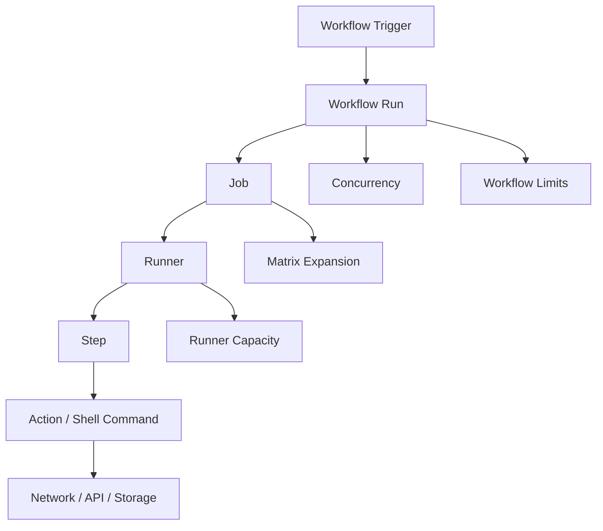
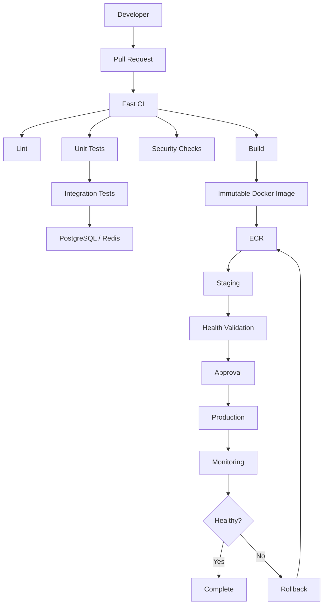
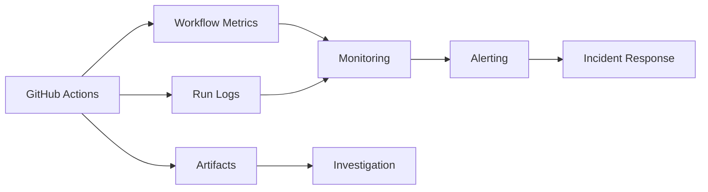

# 17- Workflow Usage and Limits

## Overview

GitHub Actions is a managed CI/CD platform, but workflows operate within limits related to execution time, concurrency, storage, API usage, matrix expansion, workflow complexity, runners, and organizational policy.

These limits are not merely platform constraints. They influence architecture.

A workflow that works for one Python service may become inefficient when the same design is applied to:

- Large monorepos
- Hundreds of repositories
- Large test matrices
- Microservice platforms
- High-frequency pull requests
- Self-hosted runner fleets
- Production deployment pipelines

A senior engineer should design workflows with limits as part of the system model:

```text
Workflow Design
      ↓
Execution Model
      ↓
Resource Consumption
      ↓
Platform Limits
      ↓
Scalability / Reliability
```

The goal is not to maximize GitHub Actions usage. The goal is to build pipelines that remain predictable, secure, maintainable, and cost-efficient as workload grows.

---

## GitHub Actions Execution Model

A workflow is composed of:

```text
Workflow
   ↓
Jobs
   ↓
Steps
   ↓
Actions / Commands
   ↓
Runner
```

Each layer consumes different resources.



A workflow can therefore fail or become inefficient for reasons unrelated to application code.

---

## Workflow Run

A workflow run is one execution of a workflow.

For example:

```yaml
on:
  push:
    branches:
      - main
```

Every qualifying push can create a workflow run.

If developers push frequently:

```text
10 commits
   ↓
10 workflow runs
```

A poorly designed CI workflow may execute expensive tests repeatedly for changes that quickly become obsolete.

---

## Workflow Frequency

Workflow frequency is affected by:

- `push`
- `pull_request`
- `schedule`
- `workflow_dispatch`
- `workflow_run`
- `repository_dispatch`
- `release`

High-frequency triggers should be designed carefully.

For example:

```yaml
on:
  push:
    branches:
      - main
```

is appropriate for continuous integration on the main branch, while:

```yaml
on:
  pull_request:
```

can execute on every pull request update.

---

## Path Filters

Path filters reduce unnecessary workflow executions.

Example:

```yaml
on:
  pull_request:
    paths:
      - "services/orders/**"
      - "shared/**"
```

This is useful in monorepos where unrelated changes should not execute the entire test suite.

---

## Path Filter Trade-Offs

Path filtering reduces execution but introduces dependency-analysis complexity.

Suppose:

```text
services/orders/
shared/database/
shared/auth/
```

The orders service may depend on all three.

A filter that only watches:

```text
services/orders/**
```

could miss relevant changes.

A production monorepo therefore needs an explicit dependency model.

---

## Branch Filters

Branch filters can prevent unnecessary workflow runs.

Example:

```yaml
on:
  push:
    branches:
      - main
      - develop
```

Use branch filters to define where a workflow is meaningful rather than using one workflow for every branch when the behavior differs significantly.

---

## Tag Filters

Release workflows can be triggered from tags.

Example:

```yaml
on:
  push:
    tags:
      - "v*"
```

This avoids running release-specific workflows for ordinary development commits.

---

## Scheduled Workflows

Scheduled workflows are useful for:

- Dependency verification
- Nightly integration tests
- Security scans
- Periodic maintenance
- Compatibility testing

Example:

```yaml
on:
  schedule:
    - cron: "0 2 * * *"
```

Scheduled jobs should be designed for the expected workload and should not become a replacement for event-driven CI.

---

## Manual Workflows

`workflow_dispatch` is useful for operational workflows.

Example:

```yaml
on:
  workflow_dispatch:
    inputs:
      environment:
        description: Deployment environment
        required: true
        type: choice
        options:
          - staging
          - production
```

Typical uses include:

- Manual deployment
- Rollback
- Maintenance
- Re-running a controlled operational procedure

Manual execution should still enforce appropriate permissions and environment protection.

---

## Workflow Complexity

A workflow becomes difficult to operate when it contains:

- Many jobs
- Large matrices
- Deep dependencies
- Complex expressions
- Multiple deployment environments
- Dynamic configuration
- Many reusable workflows
- Extensive conditional logic

A workflow should be decomposed when different concerns have different lifecycle or security boundaries.

---

## Workflow Decomposition

Instead of:

```text
One Huge Workflow
├── Lint
├── Tests
├── Security
├── Build
├── Staging
├── Production
├── Rollback
└── Release
```

consider:

```text
CI Workflow
 ├── Lint
 ├── Unit Tests
 ├── Integration Tests
 └── Security

Build Workflow
 └── Immutable Artifact

Deployment Workflow
 ├── Staging
 └── Production

Release Workflow
 └── Release Metadata
```

The correct boundary depends on the system's security and operational requirements.

---

## Job Limits and Job Design

Each job runs on a runner.

Example:

```yaml
jobs:
  test:
    runs-on: ubuntu-latest
```

Jobs are isolated execution units.

A large workflow should avoid creating unnecessary jobs because each job can introduce:

- Runner startup time
- Checkout time
- Dependency installation
- Artifact transfer
- Cache operations
- Scheduling overhead

---

## Steps vs Jobs

Use a step when operations naturally belong to the same execution environment.

```yaml
steps:
  - run: pip install -r requirements.txt
  - run: pytest
  - run: coverage report
```

Use separate jobs when you need:

- Parallelism
- Different runners
- Different permissions
- Different environments
- Stronger isolation
- Explicit dependency boundaries

---

## Job Dependencies

Jobs can form a dependency graph.

```yaml
jobs:
  test:
    ...

  build:
    needs: test

  deploy:
    needs: build
```

This produces:

```text
test
 ↓
build
 ↓
deploy
```

Avoid unnecessary sequential dependencies because they reduce parallelism.

---

## Parallel Jobs

Independent jobs can execute concurrently.

```text
         ┌── Lint ───────┐
         │               │
PR ──────┼── Unit Tests ─┼── Build
         │               │
         └── Security ───┘
```

This reduces total pipeline latency.

---

## Fan-Out and Fan-In

A common scalable pattern is:

```text
              ┌── Python 3.11
              │
Test Planning ├── Python 3.12
              │
              └── Python 3.13
                     ↓
                Aggregate
```

This increases parallelism but also multiplies resource consumption.

---

## Matrix Expansion

A matrix creates multiple job executions from one job definition.

Example:

```yaml
strategy:
  matrix:
    python-version:
      - "3.11"
      - "3.12"
      - "3.13"
```

This produces three jobs.

Multiple dimensions multiply the combinations.

---

## Matrix Cardinality

Suppose:

```yaml
matrix:
  python:
    - "3.11"
    - "3.12"
  database:
    - postgres
    - mysql
  os:
    - ubuntu
    - windows
```

The theoretical number of combinations is:

```text
2 × 2 × 2 = 8
```

Adding dimensions can cause rapid growth.

For example:

```text
4 Python versions
× 3 databases
× 3 operating systems
× 2 test modes
=
72 jobs
```

Matrix size must therefore be treated as a capacity concern.

---

## Matrix Design

Do not create a matrix merely because multiple combinations are technically possible.

Ask:

```text
Which combinations provide meaningful compatibility coverage?
```

For example:

```text
Python version
+
database
```

may be useful.

Testing every database against every operating system may not be necessary.

---

## `include` and `exclude`

Use `include` and `exclude` to control matrix expansion.

Example:

```yaml
strategy:
  matrix:
    python-version:
      - "3.11"
      - "3.12"
    database:
      - postgres
      - mysql
    exclude:
      - python-version: "3.11"
        database: mysql
```

This reduces unnecessary combinations.

---

## `fail-fast`

Matrix jobs can use:

```yaml
strategy:
  fail-fast: true
```

When an early failure occurs, remaining matrix work may be cancelled according to matrix execution behavior.

This can reduce wasted runner capacity for PR validation.

For release compatibility testing, continuing other matrix combinations may be more useful.

---

## `max-parallel`

Control matrix concurrency with:

```yaml
strategy:
  max-parallel: 4
```

This is useful when downstream systems cannot handle unlimited parallel load.

For example:

```text
100 test jobs
     ↓
PostgreSQL
Redis
Package Registry
Internal APIs
```

Uncontrolled parallelism can overload dependencies.

---

## Matrix and Database Capacity

Suppose 30 integration-test jobs each create:

```text
10 PostgreSQL connections
```

Potential database connection pressure becomes:

```text
30 × 10 = 300 connections
```

Even if GitHub Actions can execute the jobs concurrently, PostgreSQL may become the bottleneck.

CI scalability must therefore include external dependency capacity.

---

## Matrix and Redis

Redis can also become a shared bottleneck.

Consider:

```text
40 parallel jobs
×
high request volume
```

A single Redis service may become saturated.

Use isolated service containers or controlled concurrency where appropriate.

---

## Matrix and Kafka

Kafka integration tests can generate significant load through:

- Topic creation
- Producers
- Consumers
- Partition activity
- Broker startup
- Message retention

Large matrices should avoid unintentionally creating a Kafka stress test.

---

## Matrix and Celery

Celery integration tests may create:

- Workers
- Broker connections
- Task queues
- Result backends

Parallel jobs should use isolated queues and predictable test data.

---

## Matrix and AWS

Large matrices that call AWS APIs can encounter:

- API throttling
- Account service quotas
- IAM policy limits
- ECR request pressure
- Resource creation limits

Do not assume GitHub runner capacity is the only limit.

---

## Runner Availability

A workflow job requires an eligible runner.

For GitHub-hosted runners:

```text
Job
 ↓
Runner Allocation
 ↓
Runner Startup
 ↓
Execution
```

For self-hosted runners:

```text
Job
 ↓
Matching Labels / Groups
 ↓
Available Runner
 ↓
Execution
```

If no eligible runner is available, the job waits.

---

## Runner Capacity

Self-hosted environments must plan for:

```text
Peak Concurrent Jobs
+
Average Job Duration
+
Startup Time
+
Failure Capacity
```

If a repository normally needs:

```text
20 concurrent jobs
```

but only has:

```text
5 runners
```

the remaining jobs wait for capacity.

---

## Runner Labels

Labels route jobs to appropriate runners.

Example:

```yaml
runs-on:
  - self-hosted
  - linux
  - private-network
```

Labels should represent stable capabilities.

Avoid excessive labels that make scheduling difficult to reason about.

---

## Runner Groups

Runner groups can enforce access boundaries.

Example:

```text
Public CI Runners
Private Build Runners
Production Deployment Runners
Security Scanning Runners
```

This is particularly useful when jobs have different network or credential requirements.

---

## Persistent vs Ephemeral Runners

Persistent runners retain local state.

Ephemeral runners are created for limited workloads and then removed.

For security-sensitive workloads:

```text
Provision
 ↓
Run Job
 ↓
Destroy
```

reduces cross-job contamination.

---

## Self-Hosted Runner Risk

Self-hosted runners may have access to:

- Internal networks
- AWS resources
- Package registries
- Databases
- Deployment systems

Therefore:

```text
Untrusted Code
+
Privileged Runner
=
High Risk
```

Do not allow untrusted pull requests to execute arbitrary code on sensitive persistent runners.

---

## Workflow Time Limits

Individual workflow jobs and execution environments have platform-specific runtime constraints.

Long-running workloads should not be designed around indefinite CI execution.

A job that takes hours because it performs:

```text
Load testing
Data migration
Long polling
Infrastructure waiting
```

may belong in a dedicated operational system rather than standard CI.

---

## Long-Running Jobs

If a job is consistently long-running, investigate:

```text
Dependency installation
Tests
Build
Network calls
External services
Runner capacity
Docker build
```

Do not solve a slow pipeline by simply making the job run longer.

---

## Job Timeout

Set explicit job timeouts where appropriate.

Example:

```yaml
jobs:
  integration:
    runs-on: ubuntu-latest
    timeout-minutes: 30
```

Timeouts protect runner capacity from hung processes.

---

## Step Timeouts

Actions may also provide their own timeout behavior.

For shell commands, use bounded execution patterns when an external operation could hang indefinitely.

A deployment workflow should not wait forever for:

```text
AWS API
Kubernetes rollout
Health endpoint
Database migration
```

---

## Timeout Design

A timeout should represent the expected operating window.

For example:

```text
Unit Tests
→ Short timeout

Integration Tests
→ Moderate timeout

Docker Build
→ Build-specific timeout

Deployment
→ Deployment-specific timeout
```

Avoid one huge timeout for every job.

---

## Workflow Cancellation

Pull request workflows frequently become obsolete.

Suppose:

```text
Commit A
 ↓
CI running

Commit B
 ↓
CI running

Commit C
 ↓
CI running
```

The older runs may no longer provide useful information.

Concurrency can cancel obsolete runs.

---

## PR Concurrency

Example:

```yaml
concurrency:
  group: ci-${{ github.workflow }}-${{ github.ref }}
  cancel-in-progress: true
```

This prevents obsolete PR runs from consuming runner capacity unnecessarily.

---

## Production Concurrency

Production deployments should generally not be cancelled merely because another commit arrives.

Example:

```yaml
concurrency:
  group: production-deployment
  cancel-in-progress: false
```

Deployment serialization is a correctness concern.

---

## API Rate Limits

GitHub Actions workflows can interact with:

- GitHub APIs
- AWS APIs
- Container registries
- Package registries
- Internal APIs

A workflow that creates thousands of API calls can become API-bound even when runner capacity is available.

---

## GitHub API Usage

Avoid inefficient loops such as:

```text
For every file
    call GitHub API
```

when a bulk or local operation is available.

Prefer:

```text
Checkout Repository
 ↓
Use local Git data
 ↓
Perform analysis locally
```

when possible.

---

## GitHub CLI

The GitHub CLI can be used for operational inspection.

List workflows:

```bash
gh workflow list
```

List recent runs:

```bash
gh run list
```

Inspect a run:

```bash
gh run view <run-id>
```

View logs:

```bash
gh run view <run-id> --log
```

Rerun:

```bash
gh run rerun <run-id>
```

---

## GitHub CLI and Automation

Do not turn every GitHub API operation into a CLI subprocess.

For workflow operations, use:

```text
gh
```

when it improves operational clarity.

For application automation requiring structured API interaction, a dedicated API integration may be more appropriate.

---

## Artifact Limits

Artifacts consume storage and transfer bandwidth.

Avoid uploading:

```text
Entire workspace
Large dependency directories
Docker caches as artifacts
Temporary build directories
```

Prefer targeted outputs:

```text
JUnit report
Coverage report
Release package
SBOM
Debug logs
```

---

## Artifact Retention

Artifact retention should match purpose.

| Artifact | Typical Purpose | Strategy |
|---|---|---|
| PR logs | Debugging | Short |
| Test reports | CI analysis | Short/medium |
| Coverage | Quality tracking | Medium |
| Release package | Release | Long |
| SBOM | Security | Policy-driven |
| Deployment metadata | Audit/recovery | Policy-driven |

Production Docker images should normally be stored in ECR or another durable registry.

---

## Cache Limits

Caches should be treated as optimization data.

A cache should not contain:

- Secrets
- Credentials
- Production state
- Release state

Cache keys should be deterministic and based on compatibility inputs.

Example:

```yaml
key: >-
  ${{ runner.os }}-
  python-${{ matrix.python-version }}-
  ${{ hashFiles('requirements.lock') }}
```

---

## Cache Fragmentation

Excessive cache dimensions create fragmentation.

Bad:

```text
OS
+
Python
+
Branch
+
Commit
+
Timestamp
+
Dependency Hash
```

Better:

```text
OS
+
Python
+
Dependency Hash
```

when these represent the actual compatibility boundary.

---

## Cache as a Non-Critical Dependency

A cache failure should ideally produce:

```text
Cache failure
 ↓
Normal dependency installation
 ↓
Slower CI
```

rather than:

```text
Cache failure
 ↓
CI failure
```

This preserves reliability.

---

## Storage Growth

Storage usage can increase due to:

```text
More workflow runs
+
More artifacts
+
More cache entries
+
Longer retention
+
Larger matrix
```

Monitor storage growth rather than discovering the problem after the platform reaches an operational limit.

---

## Workflow Storage Strategy

Use the correct storage mechanism.

```text
Cache
→ Dependencies / build acceleration

Artifact
→ CI outputs / reports

ECR
→ Docker images

Package Registry
→ Python packages

Object Storage
→ Durable deployment bundles
```

This separation prevents one storage mechanism from becoming overloaded.

---

## Logs

Logs are essential for troubleshooting but can become difficult to consume when workflows are excessively verbose.

Avoid:

```bash
set -x
```

when commands may expose sensitive values.

Prefer meaningful structured logging.

---

## Log Volume

Large logs increase:

- Debugging difficulty
- Storage
- Network transfer
- Signal-to-noise ratio

Use summaries for important results.

Example:

```yaml
- name: Publish test summary
  run: |
    {
      echo "## Test Results"
      echo ""
      echo "- Tests: 1,240"
      echo "- Passed: 1,238"
      echo "- Failed: 2"
    } >> "$GITHUB_STEP_SUMMARY"
```

---

## Step Summary

`GITHUB_STEP_SUMMARY` is useful for high-value information.

Good summary content includes:

- Test counts
- Deployment target
- Image digest
- Security scan result
- Artifact name
- Environment
- Rollback information

This avoids forcing engineers to inspect thousands of log lines.

---

## Workflow Command Usage

Use current supported environment files:

```text
GITHUB_ENV
GITHUB_OUTPUT
GITHUB_PATH
GITHUB_STEP_SUMMARY
```

These provide structured communication between steps and jobs.

Avoid relying on deprecated workflow command patterns.

---

## Environment File Example

Persist an environment variable for later steps:

```yaml
- name: Set version
  run: echo "APP_VERSION=1.4.2" >> "$GITHUB_ENV"

- name: Show version
  run: echo "$APP_VERSION"
```

The value is available to subsequent steps in the same job.

---

## Output Example

```yaml
- name: Calculate image tag
  id: image
  run: echo "tag=${GITHUB_SHA}" >> "$GITHUB_OUTPUT"

- name: Show tag
  run: echo "${{ steps.image.outputs.tag }}"
```

Use outputs for structured workflow data rather than artifacts or caches.

---

## Workflow Quotas and Constraints

GitHub Actions has platform-level constraints covering areas such as:

- Workflow execution
- Job execution
- Matrix expansion
- Concurrent workloads
- Storage
- Artifact retention
- Caches
- API usage
- Repository and organization configuration
- Runner availability

Exact limits can vary by GitHub plan, repository configuration, runner type, and platform capabilities.

Production designs should therefore avoid depending on a single hard-coded numeric limit.

---

## Plan-Dependent Limits

Some capabilities and quotas vary across:

- GitHub Free
- GitHub Team
- GitHub Enterprise Cloud
- GitHub Enterprise Server
- GitHub-hosted runners
- Self-hosted runners

Always verify the applicable platform documentation when a design depends on a specific quota.

---

## Why Hard-Coding Limits Is Dangerous

Suppose a workflow is designed around:

```text
Exactly N jobs
```

If the platform changes its limit or the organization changes plans, the architecture may become unnecessarily constrained or invalid.

Prefer designing around:

```text
Expected workload
+
Observed capacity
+
Configured concurrency
+
Failure behavior
```

and verify exact platform limits separately when required.

---

## Concurrency vs Platform Capacity

These are different concepts.

### Platform Capacity

How much execution the environment can provide.

### Workflow Concurrency

How much execution your workflow intentionally allows.

For example:

```yaml
strategy:
  max-parallel: 4
```

limits matrix concurrency even if more runners are available.

This can protect downstream systems.

---

## Backpressure

CI/CD systems should sometimes apply backpressure.

Example:

```text
100 PR jobs
     ↓
max-parallel: 10
     ↓
10 active jobs
     ↓
90 queued
```

This may be preferable to overwhelming:

- PostgreSQL
- Redis
- Kafka
- AWS APIs
- Internal services

---

## Runner Autoscaling

Self-hosted runners can scale according to demand.

```text
Pending Jobs
     ↓
Autoscaler
     ↓
Provision Runners
     ↓
Jobs Execute
     ↓
Runners Terminate
```

Autoscaling must account for:

- Provisioning latency
- Cloud quotas
- IP availability
- Network initialization
- Runner registration
- Image startup time
- Maximum capacity

---

## Autoscaling Limits

An autoscaler should have upper bounds.

Without a maximum:

```text
Job burst
 ↓
More runners
 ↓
More jobs
 ↓
More downstream load
 ↓
More failures
```

Runner scaling does not automatically mean dependency scaling.

---

## AWS Capacity Interaction

Consider an integration matrix that provisions temporary AWS infrastructure.

```text
20 matrix jobs
×
3 AWS resources each
=
60 resources
```

AWS account quotas may become the real bottleneck.

Control concurrency:

```yaml
strategy:
  max-parallel: 5
```

when necessary.

---

## Docker Build Concurrency

Parallel Docker builds can consume significant:

- CPU
- Memory
- Disk
- Network bandwidth

Large matrices should avoid building the same image repeatedly when a single build can be promoted.

---

## Build Once, Deploy Many

Instead of:

```text
Python Matrix
 ↓
Build Image
 ↓
Staging

Python Matrix
 ↓
Build Image
 ↓
Production
```

prefer:

```text
Test Matrix
 ↓
Build Once
 ↓
Immutable Image
 ↓
Staging
 ↓
Approval
 ↓
Production
```

This reduces build load and avoids environment-specific rebuilds.

---

## Reusable Workflows and Scale

Reusable workflows reduce duplicated configuration.

Example:

```yaml
jobs:
  ci:
    uses: company/platform/.github/workflows/python-ci.yml@v1
```

Benefits include:

- Standardization
- Fewer duplicated fixes
- Consistent security controls
- Centralized caching
- Standard runner selection

However, excessive abstraction can make debugging difficult.

---

## Reusable Workflow Limits

A reusable workflow should expose a focused interface:

```text
Inputs
Outputs
Secrets
```

Avoid creating a reusable workflow with dozens of configuration flags.

If every repository configures the reusable workflow differently, the abstraction may no longer provide meaningful standardization.

---

## Composite Actions vs Reusable Workflows

| Feature | Composite Action | Reusable Workflow |
|---|---|---|
| Scope | Steps | Jobs/workflow |
| Multiple jobs | No | Yes |
| Matrix orchestration | Limited by caller | Yes |
| Job permissions | Caller-controlled job | Workflow/job level |
| Environment/deployment flow | Limited | Strong |
| Best use | Reusable step sequence | Pipeline architecture |

This distinction becomes increasingly important as workflows grow.

---

## Workflow Security Limits

A workflow may be technically valid but operationally unsafe.

Security boundaries include:

```text
Permissions
Secrets
Environments
Runners
Actions
Artifacts
Caches
AWS Roles
Network Access
```

A large workflow should not automatically receive broad permissions simply because it performs many tasks.

---

## GITHUB_TOKEN Permissions

Use least privilege.

Example:

```yaml
permissions:
  contents: read
```

A deployment job may require additional permissions:

```yaml
permissions:
  contents: read
  id-token: write
```

Keep elevated permissions at the smallest possible scope.

---

## Job-Level Isolation

Separate CI and deployment privileges.

```text
Test Job
→ contents: read

Build Job
→ contents: read

AWS Deployment Job
→ contents: read
→ id-token: write
```

This reduces blast radius.

---

## Environments and Limits

Production environments can provide:

- Required reviewers
- Deployment protection
- Environment-specific secrets
- Environment-specific variables
- Deployment history

A deployment should not bypass these controls merely because a workflow needs to execute quickly.

---

## Production Deployment Concurrency

Use concurrency to prevent race conditions.

```yaml
concurrency:
  group: production
  cancel-in-progress: false
```

This prevents two deployments from modifying production simultaneously.

---

## Deployment Queue

When deployment concurrency is serialized:

```text
Deployment A
     ↓
Production

Deployment B
     ↓
Waiting
```

The waiting behavior is intentional.

Do not increase concurrency merely to eliminate a queue if simultaneous deployments would be unsafe.

---

## Deployment Timeout

Deployment workflows should have bounded operations.

For example:

```text
Deploy
 ↓
Wait for health
 ↓
Timeout
 ↓
Rollback / Incident
```

A deployment that waits indefinitely can consume runners and hide production failures.

---

## Rollback and Artifact Availability

Rollback requires access to a known-good artifact.

```text
Current Release
      ↓
Failure
      ↓
Previous Immutable Image
      ↓
Rollback
```

Do not rebuild the previous version during an incident unless there is no viable stored artifact.

---

## Workflow Failure Domains

A production CI/CD system has multiple failure domains:

```text
GitHub
├── Workflow configuration
├── API
├── Actions
├── Runners
├── Storage
└── Authentication

Application
├── Dependencies
├── Tests
├── Build
└── Packaging

Infrastructure
├── AWS
├── Docker Registry
├── Kubernetes
└── Network
```

Troubleshooting should identify the domain before changing configuration.

---

## Troubleshooting Workflow Syntax

### Symptom

Workflow does not start or is rejected.

### Possible Causes

- YAML syntax
- Invalid workflow configuration
- Incorrect event configuration
- Unsupported configuration

### Isolation

Validate the workflow structure and inspect GitHub's workflow diagnostics.

### Prevention

Keep workflows focused and use reusable patterns that have already been validated.

---

## Troubleshooting Trigger Problems

### Symptom

Expected workflow does not execute.

Check:

```text
Event
Branch
Tag
Path
File location
Workflow state
```

Example:

```yaml
on:
  pull_request:
    paths:
      - "backend/**"
```

A change outside `backend/**` will not match this path filter.

---

## Troubleshooting Queued Jobs

### Symptom

Jobs remain queued.

Possible causes:

- No eligible self-hosted runner
- Runner group restriction
- Label mismatch
- Runner capacity exhausted
- Platform capacity
- Concurrency serialization

Isolation:

```text
Job
 ↓
runs-on
 ↓
Labels
 ↓
Runner Group
 ↓
Available Runner
 ↓
Concurrency
```

---

## Troubleshooting Slow Workflows

Break total duration into:

```text
Queue Time
+
Runner Startup
+
Checkout
+
Dependency Installation
+
Tests
+
Build
+
Artifact Transfer
+
Deployment
```

Do not optimize the wrong stage.

---

## Troubleshooting Cache Problems

### Symptom

Pipeline is slow despite caching.

Check:

- Cache hit rate
- Cache key
- Cache path
- Dependency lock hash
- Matrix fragmentation
- Restore time
- Save time

A cache that takes longer to restore than the original operation is not an optimization.

---

## Troubleshooting Artifact Problems

### Symptom

Artifact is missing.

Check:

```text
Upload step
 ↓
Condition
 ↓
Path
 ↓
Artifact name
 ↓
Workflow run
 ↓
Retention
```

Artifacts are not permanent storage by default.

---

## Troubleshooting Matrix Problems

### Symptom

Workflow consumes excessive runner capacity.

Calculate:

```text
Matrix cardinality
×
Average job duration
×
Resource consumption
```

Then evaluate:

- `exclude`
- `include`
- `max-parallel`
- selective testing
- path filtering

---

## Troubleshooting API Throttling

### Symptom

Workflow receives API throttling or rate-limit errors.

Possible causes:

- Excessive loops
- Large matrix
- Repeated API polling
- Many repositories executing simultaneously

Corrective actions:

- Reduce API calls
- Batch operations
- Cache immutable metadata
- Reduce polling frequency
- Add bounded retries with backoff
- Reduce unnecessary matrix execution

---

## Retry Design

Retries can improve resilience but can also multiply load.

Bad:

```text
100 jobs
×
10 retries
=
1000 attempts
```

Use:

- Bounded retries
- Exponential backoff
- Jitter
- Idempotent operations
- Retry only transient failures

---

## External Dependency Limits

CI depends on more than GitHub.

Possible limits include:

```text
PostgreSQL connections
Redis memory
Kafka throughput
AWS API rate limits
ECR operations
Docker registry capacity
Internal API rate limits
```

A scalable pipeline must consider the entire dependency graph.

---

## Reliability Model

A useful model is:

```text
CI Reliability
=
GitHub
×
Runner
×
Dependencies
×
Network
×
Credentials
×
Build System
```

A failure in any critical dependency can fail the workflow.

This is why minimizing unnecessary dependencies improves reliability.

---

## Workflow Resilience

Prefer:

```text
Cache failure
→ Slower workflow

Optional report failure
→ Report unavailable

Transient API failure
→ Bounded retry

Deployment health failure
→ Stop promotion / rollback
```

Different failures should have different severity.

---

## High Availability for CI

For self-hosted runners:

```text
Runner Pool A
Runner Pool B
        ↓
Shared Job Queue
```

Avoid making one physical runner the only execution path for critical workflows.

Use multiple runner instances where the workload justifies it.

---

## Disaster Recovery

CI/CD recovery should answer:

- Where are workflows stored?
- Where are release artifacts?
- Where are Docker images?
- How are deployment credentials obtained?
- How are runners recreated?
- How is infrastructure restored?
- How is rollback performed?

Infrastructure-as-code and immutable artifacts significantly improve recovery.

---

## Cost Optimization

Cost drivers include:

```text
Workflow Frequency
×
Execution Duration
×
Runner Resources
```

Additional factors:

- Matrix size
- Redundant builds
- Artifact storage
- Cache storage
- Self-hosted infrastructure
- Large Docker builds
- Unnecessary E2E tests

---

## Cost Optimization Strategies

Use:

- Path filtering
- Concurrency cancellation for PRs
- Appropriate matrices
- Dependency caching
- Docker layer caching
- Build once/deploy many
- Parallelism where beneficial
- Scheduled heavy tests
- Selective E2E execution

---

## PR vs Main vs Release Workloads

Different workflows can have different execution policies.

| Workflow | Typical Focus |
|---|---|
| Pull Request | Fast feedback |
| Main | Comprehensive validation |
| Nightly | Broad compatibility |
| Release | Build and publish |
| Deployment | Promotion |
| Rollback | Recovery |

Do not force every workflow to perform every test.

---

## Test Pyramid and Workflow Cost

A practical CI structure is:

```text
Many
 ↑
Unit Tests
Integration Tests
API Tests
E2E Tests
 ↓
Few
```

Running thousands of E2E tests on every commit may be unnecessarily expensive.

Use broader E2E suites for appropriate events such as main-branch or scheduled workflows.

---

## Python Pipeline Optimization

A scalable Python pipeline may use:

```text
PR
 ↓
Lint
 ↓
Unit Tests
 ↓
Selective Integration Tests
```

while main/release adds:

```text
Full Integration Tests
 ↓
Security
 ↓
Build
 ↓
Deployment
```

---

## Django Pipeline Optimization

For Django:

```text
PR
 ↓
Ruff / Formatting
 ↓
pytest
 ↓
Selected integration tests
```

Use PostgreSQL and Redis service containers only where required.

Do not start unnecessary infrastructure for pure unit tests.

---

## FastAPI Pipeline Optimization

For FastAPI:

```text
Lint
 ↓
Unit Tests
 ↓
API Tests
 ↓
Integration Tests
```

Use service containers only for tests requiring external dependencies.

---

## Docker Pipeline Optimization

A typical production flow:

```text
Test Matrix
      ↓
Build Once
      ↓
Buildx Cache
      ↓
ECR
      ↓
Staging
      ↓
Production
```

Avoid rebuilding the same image independently for every environment.

---

## AWS Pipeline Optimization

Use OIDC instead of long-lived AWS credentials.

```text
GitHub Actions
 ↓
OIDC Token
 ↓
STS AssumeRole
 ↓
Temporary Credentials
 ↓
AWS
```

This reduces credential-management overhead and improves security.

---

## Kubernetes Pipeline Optimization

Avoid executing full cluster deployment validation for every matrix combination.

A common pattern is:

```text
Application Test Matrix
        ↓
Single Build
        ↓
Single Deployment Validation
        ↓
Staging
```

The exact architecture depends on the application's compatibility requirements.

---

## Workflow Governance

Organizations should establish standards for:

- Workflow naming
- Permissions
- Approved actions
- SHA pinning
- Runner groups
- Environment protection
- Cache usage
- Artifact retention
- Concurrency
- Reusable workflows
- Deployment patterns

---

## Action Governance

Third-party actions can consume:

- Runner permissions
- Secrets
- Environment variables
- Network access

Use trusted sources and pin important dependencies appropriately.

Example:

```yaml
- uses: actions/checkout@v5
```

For high-assurance environments, organizations may require commit-SHA pinning according to their security policy.

---

## Organization Policies

Enterprise environments may restrict:

- Which actions can run
- Which repositories can use certain runners
- Which workflows can access environments
- Which permissions are allowed
- Which Marketplace actions are permitted

Workflow design must operate within those policies.

---

## Enterprise Architecture

A large organization may use:

```text
Organization Governance
        ↓
Reusable Workflows
        ↓
Repository CI
        ↓
Standard Security
        ↓
Standard Build
        ↓
Artifact Registry
        ↓
Deployment Workflows
```

This creates consistent engineering controls without copying every implementation into every repository.

---

## Failure Domain Isolation

Separate workflows or jobs when they require significantly different trust levels.

Example:

```text
Untrusted PR
→ GitHub-hosted runner
→ Read-only permissions

Build
→ Controlled runner
→ Artifact creation

Production
→ Protected environment
→ OIDC
→ Deployment runner
```

This reduces blast radius.

---

## Production Reference Architecture



This architecture minimizes unnecessary repeated work while preserving deployment controls.

---

## Production Workflow Example

```yaml
name: Production Delivery

on:
  push:
    branches:
      - main

permissions:
  contents: read

concurrency:
  group: production-delivery
  cancel-in-progress: false

jobs:
  test:
    runs-on: ubuntu-latest

    steps:
      - name: Checkout
        uses: actions/checkout@v5

      - name: Set up Python
        uses: actions/setup-python@v6
        with:
          python-version: "3.12"
          cache: pip
          cache-dependency-path: requirements.lock

      - name: Install dependencies
        run: |
          python -m pip install --upgrade pip
          pip install -r requirements.lock

      - name: Run tests
        run: pytest

  build:
    needs: test
    runs-on: ubuntu-latest

    permissions:
      contents: read

    steps:
      - name: Checkout
        uses: actions/checkout@v5

      - name: Set up Docker Buildx
        uses: docker/setup-buildx-action@v3

      - name: Build image
        uses: docker/build-push-action@v6
        with:
          context: .
          push: false
          tags: application:${{ github.sha }}
          cache-from: type=gha
          cache-to: type=gha,mode=max

  deploy:
    needs: build
    runs-on: ubuntu-latest

    environment:
      name: production

    permissions:
      contents: read
      id-token: write

    steps:
      - name: Deploy
        run: echo "Deploy immutable artifact"
```

In a complete production implementation, the build job would publish the immutable image to ECR and the deployment job would consume that exact image identity.

---

## Workflow Design Principles

### Keep Fast Feedback Fast

PR workflows should provide useful feedback without running every expensive operation.

### Separate Validation from Promotion

Testing and deployment have different operational requirements.

### Limit Parallelism Intentionally

More jobs do not automatically mean faster pipelines.

### Treat External Dependencies as Capacity Constraints

PostgreSQL, Redis, Kafka, AWS, and internal APIs can become bottlenecks.

### Prefer Deterministic Builds

Lock dependencies and use immutable artifact identities.

### Make Caches Optional

A cache miss should generally degrade performance rather than correctness.

### Preserve Release Artifacts

Rollback should not require rebuilding an old release.

### Isolate Privileged Jobs

Deployment credentials and private network access should not be available to ordinary CI jobs.

---

## Common Mistakes

### Creating Huge Matrices

A matrix can multiply runner consumption and downstream load rapidly.

### Running Everything on Every Push

This creates unnecessary workflow volume.

### Ignoring External Quotas

GitHub runner capacity may not be the bottleneck.

### Using One Giant Workflow

Large workflows become difficult to debug and govern.

### Overusing `max-parallel`

Too much parallelism can overload dependencies; too little creates unnecessary queue time.

### Using `always()` Everywhere

This can cause reporting or cleanup jobs to execute in situations where cancellation semantics matter.

### Ignoring Cancellation

Long-running PR workflows can waste runner capacity after newer commits arrive.

### Rebuilding Per Environment

This creates inconsistent artifacts and unnecessary build cost.

### Storing Credentials in Caches

Caches are not secret stores.

### Using Self-Hosted Runners for Untrusted Code

A privileged runner can expose internal resources.

### Treating Platform Limits as Application Limits

A platform quota is only one constraint in a larger system.

---

## Interview Scenarios

### Multiple Python Versions Must Be Tested

Design:

```text
Matrix
→ Python 3.11 / 3.12 / 3.13
→ max-parallel
→ Dependency Cache
→ Tests
```

Discuss matrix cardinality and downstream resource capacity.

### PostgreSQL and Redis Are Required

Use service containers where appropriate:

```text
Python
 ↓
PostgreSQL
Redis
 ↓
pytest
```

Explain readiness, connection limits, isolation, and parallelism.

### Production Deployment Must Not Run Twice

Use:

```yaml
concurrency:
  group: production
  cancel-in-progress: false
```

Explain deployment serialization and rollback implications.

### PR Workflows Are Too Expensive

Consider:

```text
Path filters
+
Concurrency cancellation
+
Selective tests
+
Caching
+
Matrix reduction
```

Do not simply add larger runners.

### Build Is Repeated for Staging and Production

Use:

```text
Build Once
 ↓
Immutable Artifact
 ↓
Staging
 ↓
Production
```

The same artifact should be promoted rather than rebuilt.

### Self-Hosted Runners Are Always Busy

Investigate:

```text
Queue
 ↓
Runner Capacity
 ↓
Job Duration
 ↓
Matrix Size
 ↓
Concurrency
 ↓
Autoscaling
```

Then determine whether capacity or workflow design is the bottleneck.

### AWS API Calls Are Being Throttled

Reduce:

- Matrix parallelism
- Polling
- Repeated API calls

Use bounded retries with backoff and consider AWS service quotas.

---

## Senior-Level Capacity Model

A useful high-level model is:

```text
Workflow Demand
=
Workflow Frequency
×
Average Job Count
×
Average Job Duration
×
Parallelism
```

For matrix workloads:

```text
Demand
≈
Runs
×
Matrix Cardinality
×
Average Duration
```

This is not a GitHub billing formula. It is an engineering model for understanding workload pressure.

---

## Queueing Perspective

If jobs arrive faster than runners can process them:

```text
Arrival Rate > Service Capacity
```

the queue grows.

If:

```text
Arrival Rate < Service Capacity
```

the system can generally drain the queue.

This is why:

- Path filtering
- Concurrency
- Matrix control
- Runner autoscaling
- Faster builds
- Caching

all contribute to CI scalability.

---

## Workflow Optimization Order

When a workflow becomes slow, investigate in this order:

```text
1. Queue time
2. Unnecessary workflow runs
3. Job dependencies
4. Matrix size
5. Dependency installation
6. Test duration
7. Docker builds
8. Artifact transfers
9. External API calls
10. Runner capacity
```

Optimize based on measurements rather than assumptions.

---

## Operational Metrics

Useful CI/CD metrics include:

| Metric | Purpose |
|---|---|
| Workflow duration | Overall pipeline performance |
| Queue time | Runner capacity |
| Job duration | Slow stages |
| Cache hit rate | Cache effectiveness |
| Artifact size | Storage/network cost |
| Matrix cardinality | Parallel workload |
| Failure rate | Reliability |
| Retry count | Dependency stability |
| Deployment duration | CD performance |
| Rollback frequency | Release reliability |

---

## Alerting

Alert when operational behavior changes materially.

Examples:

```text
CI duration suddenly increases
Runner queue grows
Deployment duration increases
Failure rate increases
Cache hit rate drops
Artifact storage grows unexpectedly
```

Avoid alerting on every transient CI failure.

---

## Monitoring Architecture



Operational visibility should cover both workflow failures and systemic capacity problems.

---

## Disaster Recovery Workflow

A production CI/CD recovery procedure should preserve:

```text
Source Code
 ↓
Workflow Definitions
 ↓
Infrastructure Code
 ↓
Immutable Release Artifact
 ↓
Deployment Configuration
 ↓
Rollback Procedure
```

Runner infrastructure should be recreatable rather than treated as irreplaceable state.

---

## Cost-Aware Architecture

A scalable architecture separates expensive workloads:

```text
PR
→ Fast validation

Main
→ Full CI

Nightly
→ Broad compatibility

Release
→ Build and publish

Production
→ Controlled deployment
```

This prevents expensive tests from becoming the default path for every development event.

---

## Final Production Checklist

### Workflow Design

- [ ] Workflow triggers are intentional.
- [ ] Branch and path filters are correct.
- [ ] Jobs have meaningful boundaries.
- [ ] Dependencies are minimized.
- [ ] Parallelism is intentional.
- [ ] Long-running jobs have timeouts.

### Matrix

- [ ] Matrix dimensions are justified.
- [ ] Cardinality is understood.
- [ ] `include`/`exclude` are used where useful.
- [ ] `max-parallel` protects dependencies.
- [ ] Matrix outputs and artifacts are deterministic.

### Runners

- [ ] Runner capacity matches expected demand.
- [ ] Self-hosted labels are controlled.
- [ ] Sensitive workloads use appropriate runner isolation.
- [ ] Ephemeral runners are considered for high-risk workloads.
- [ ] Runner autoscaling has capacity limits.

### Storage

- [ ] Artifacts have appropriate retention.
- [ ] Caches are not used as release storage.
- [ ] Production images are stored durably.
- [ ] Large artifacts are controlled.
- [ ] Cache fragmentation is monitored.

### Security

- [ ] `GITHUB_TOKEN` uses least privilege.
- [ ] Deployment jobs have isolated permissions.
- [ ] Secrets are not cached.
- [ ] Untrusted code does not run on privileged runners.
- [ ] Production environments have appropriate protection.

### Reliability

- [ ] Cache failures degrade performance rather than correctness.
- [ ] Transient API failures have bounded retries.
- [ ] Deployment concurrency prevents races.
- [ ] Rollback artifacts are retained.
- [ ] External dependency capacity is understood.

### Operations

- [ ] Workflow duration is monitored.
- [ ] Queue time is monitored.
- [ ] Failure rates are visible.
- [ ] Storage growth is monitored.
- [ ] Incident troubleshooting has documented failure domains.

## Key Takeaways

- GitHub Actions limits should be treated as **architecture constraints** involving workflow frequency, matrix size, runner capacity, storage, API usage, and external dependencies rather than isolated numeric quotas.
- **Matrix cardinality and uncontrolled parallelism multiply resource consumption**; use selective matrices, `exclude`, `max-parallel`, path filtering, and appropriate workflow decomposition.
- Design CI as a **capacity-managed system**: runner availability, PostgreSQL, Redis, Kafka, AWS APIs, Docker builds, artifact storage, and network resources can all become bottlenecks.
- Use **concurrency, caching, immutable artifacts, reusable workflows, and build-once/deploy-many patterns** to reduce unnecessary execution while preserving deployment correctness.
- Treat limits as part of **reliability, security, scalability, and cost design**; verify exact plan- and platform-specific quotas when an implementation depends on a particular numeric limit.