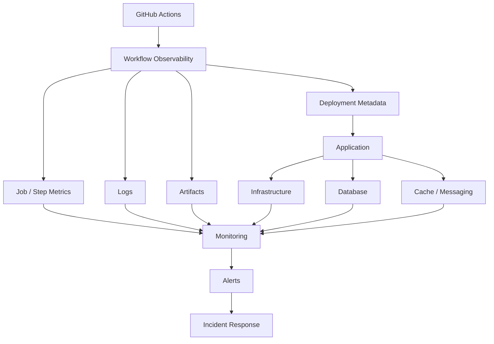
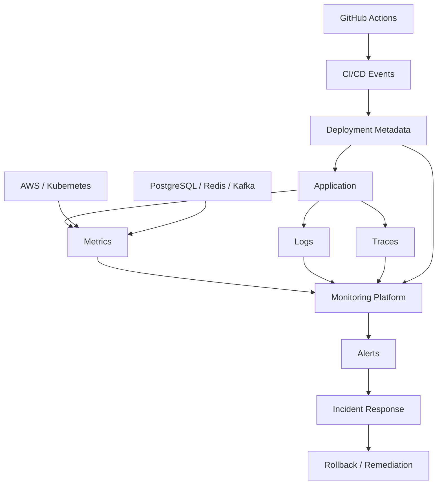

# 18- Monitoring and Observability

## Overview

Monitoring and observability are essential for operating GitHub Actions as a production CI/CD platform rather than treating workflows as disposable YAML scripts.

A production pipeline should answer:

- Did the workflow start?
- Why did it start?
- Which jobs are running or waiting?
- Where did execution fail?
- How long did each stage take?
- Are runners available?
- Are caches effective?
- Are artifacts being produced correctly?
- Are deployments healthy?
- Which artifact was deployed?
- Did production recover after deployment?
- Can an incident be diagnosed from available evidence?

A useful model is:

```text
Workflow
   ↓
Metrics + Logs + Artifacts + Events
   ↓
Observability
   ↓
Diagnosis
   ↓
Alerting
   ↓
Operational Action
```

GitHub Actions provides workflow execution visibility, logs, job status, summaries, artifacts, and operational APIs. Production systems should combine those capabilities with application and infrastructure observability.

---

## Monitoring vs Observability

### Monitoring

Monitoring answers known questions through predefined signals.

Examples:

```text
Workflow failure rate
Average workflow duration
Runner queue time
Deployment failure count
```

### Observability

Observability helps investigate unknown failure modes by correlating:

- Metrics
- Logs
- Traces
- Workflow metadata
- Deployment metadata
- Artifact identity
- Infrastructure state

For example:

```text
Production API latency increased
        ↓
Deployment occurred 8 minutes earlier
        ↓
Deployment used image sha256:abc...
        ↓
Deployment workflow succeeded
        ↓
Application logs show database timeout
        ↓
PostgreSQL connection saturation
```

Monitoring detects the problem; observability helps explain it.

---

## CI/CD Observability Layers

A production platform can be observed at several layers:



The CI/CD platform should be correlated with the system it deploys.

---

## What Should Be Monitored?

A practical CI/CD observability model includes:

| Area | Important Signals |
|---|---|
| Workflow | Run count, success rate, duration |
| Jobs | Duration, failures, queue time |
| Steps | Slow/failing steps |
| Runners | Availability, utilization, queue depth |
| Matrix | Cardinality, duration, failures |
| Cache | Hit/miss behavior, restore time |
| Artifacts | Size, retention, availability |
| Docker | Build duration, cache effectiveness |
| Registry | Push/pull failures |
| AWS | Authentication and API failures |
| Deployment | Duration, success, rollback |
| Application | Error rate, latency, saturation |
| Infrastructure | CPU, memory, network, disk |
| Database | Connections, latency, errors |
| Messaging | Kafka lag, Celery queue depth |
| Security | Permission/authentication failures |

---

## Workflow Health

The first level of monitoring is workflow health.

Important measurements include:

```text
Workflow Runs
Successful Runs
Failed Runs
Cancelled Runs
Average Duration
P95 Duration
Queue Time
Retry Count
```

A single failed workflow is usually less important than a sustained increase in failure rate.

---

## Workflow Success Rate

A useful metric is:

```text
Success Rate =
Successful Runs / Total Runs
```

Track it over time rather than only looking at individual failures.

For example:

```text
Monday
Success: 98%

Tuesday
Success: 97%

Wednesday
Success: 83%
```

The change is more operationally significant than one isolated failure.

---

## Workflow Duration

Track:

- Average duration
- Median duration
- P95 duration
- Maximum duration

Average duration alone can hide outliers.

Example:

```text
Median: 6 min
P95:    18 min
Max:    42 min
```

This indicates that most runs are fast while a significant tail is slow.

---

## Queue Time

Total workflow duration should be separated into:

```text
Queue Time
+
Runner Startup
+
Execution Time
```

A workflow that takes 5 minutes to execute but waits 20 minutes for a runner has a different problem from a workflow that spends 25 minutes executing tests.

---

## Job-Level Monitoring

A workflow may succeed while individual jobs become progressively slower.

Track:

```text
Job Name
Duration
Queue Time
Runner Type
Failure Rate
Retry Count
Matrix Variant
```

Example:

```text
lint              1m
unit-tests        3m
integration       11m
docker-build      14m
deployment        6m
```

This identifies the actual bottleneck.

---

## Step-Level Monitoring

Within a job, expensive steps should be visible.

Example:

```text
Checkout              5s
Install dependencies  45s
Run tests              8m
Coverage               30s
Upload reports         10s
```

If dependency installation suddenly becomes:

```text
45s → 7m
```

the pipeline may have a package registry, cache, or dependency-resolution problem.

---

## Slow Step Detection

Common slow steps include:

- Dependency installation
- Docker builds
- Integration tests
- E2E tests
- AWS polling
- Kubernetes rollouts
- Artifact uploads
- Cache restoration

Do not optimize every step equally. Focus on steps contributing materially to total pipeline latency.

---

## GitHub Step Summary

`GITHUB_STEP_SUMMARY` provides concise operational information.

Example:

```yaml
- name: Publish deployment summary
  run: |
    {
      echo "## Deployment"
      echo ""
      echo "- Environment: production"
      echo "- Version: ${GITHUB_SHA}"
      echo "- Status: successful"
    } >> "$GITHUB_STEP_SUMMARY"
```

Useful summary information includes:

- Version
- Image digest
- Environment
- Test counts
- Coverage
- Deployment status
- Rollback status
- Security scan result

---

## Annotations

Annotations can highlight warnings and errors directly in workflow results.

For example, tooling can report:

```text
Error
Warning
Notice
```

Use annotations for actionable findings rather than generating large amounts of noisy output.

---

## Logs

Logs provide execution-level evidence.

Good logs should answer:

```text
What happened?
Where?
When?
With which version?
Against which environment?
```

Avoid logging sensitive information.

Never intentionally print:

```text
AWS credentials
API keys
Passwords
Tokens
Private keys
Secret environment variables
```

---

## Structured Logging

Prefer consistent log formats for complex automation.

Example:

```text
timestamp
workflow
job
environment
release
operation
status
duration
```

For application systems, structured JSON logs can improve correlation with centralized logging systems.

---

## Correlation IDs

A deployment should have a traceable identifier.

For example:

```text
Deployment ID
Commit SHA
Docker image digest
GitHub run ID
Release version
```

A useful deployment record might conceptually contain:

```json
{
  "environment": "production",
  "commit": "abc123",
  "image_digest": "sha256:...",
  "workflow_run": "123456",
  "release": "v1.8.0"
}
```

This allows operators to connect CI/CD events with application behavior.

---

## Deployment Metadata

Every production deployment should ideally identify:

```text
Who
What
When
Where
Why
```

For example:

| Field | Example |
|---|---|
| Commit | `abc1234` |
| Release | `v2.4.0` |
| Image | `sha256:...` |
| Environment | Production |
| Workflow | Deploy |
| Run ID | `123456` |
| Trigger | Git tag |
| Approver | Deployment reviewer |

This creates an operational audit trail.

---

## Build Once, Observe Once

Immutable artifacts simplify observability.

```text
Build
 ↓
Image Digest
 ↓
Staging
 ↓
Production
```

If the same digest reaches production, operators can correlate:

```text
Source
→ Build
→ Artifact
→ Deployment
→ Runtime
```

without ambiguity.

---

## Docker Image Observability

Track:

- Build duration
- Cache hit rate
- Image size
- Push duration
- Push failures
- Image digest
- Vulnerability scan status

Example:

```text
Commit
 ↓
Buildx
 ↓
Image
 ↓
Digest
 ↓
ECR
 ↓
ECS
```

The digest should be captured as deployment metadata.

---

## Docker Build Performance

A slow Docker build may result from:

- Poor Dockerfile layer ordering
- Dependency installation
- Large build context
- Missing `.dockerignore`
- Cache misses
- Large base images
- Network dependency downloads

Monitor build duration before changing the build architecture.

---

## Docker Layer Cache

A cache hit can significantly reduce build time.

Monitor:

```text
Cache Hit
Cache Miss
Restore Duration
Save Duration
Build Duration
```

A cache that is frequently invalidated may provide little value.

---

## Artifact Observability

Monitor:

- Artifact creation
- Artifact size
- Upload success
- Download success
- Retention
- Naming consistency

Artifacts should have deterministic names.

Example:

```yaml
- name: Upload test report
  uses: actions/upload-artifact@v5
  with:
    name: test-report-${{ github.sha }}
    path: reports/
```

---

## Artifact vs Cache Observability

| Mechanism | Purpose | Operational Question |
|---|---|---|
| Artifact | Preserve output | Was the required output produced? |
| Cache | Accelerate execution | Is the optimization effective? |

A cache miss is usually a performance event.

A missing release artifact can be a correctness event.

---

## Cache Metrics

Useful cache signals include:

```text
Hit Rate
Miss Rate
Restore Time
Save Time
Cache Size
Key Fragmentation
```

A declining hit rate may indicate:

- Dependency changes
- Incorrect key design
- Matrix fragmentation
- OS/version changes
- Cache invalidation

---

## Runner Monitoring

For self-hosted runners monitor:

```text
Runner Online
Runner Busy
Runner Idle
Queue Depth
CPU
Memory
Disk
Network
Job Duration
Registration State
```

A runner that is online but never receives jobs may have:

- Incorrect labels
- Runner group restrictions
- Repository access problems
- Concurrency constraints

---

## Runner Capacity

A useful operational model is:

```text
Incoming Jobs
      ↓
Queue
      ↓
Available Runners
      ↓
Running Jobs
      ↓
Completed Jobs
```

Monitor both:

```text
Queue Depth
+
Runner Utilization
```

High utilization with increasing queue depth indicates insufficient capacity or excessive workload.

---

## Runner Saturation

Persistent high utilization can cause:

- Longer queues
- Slower builds
- Disk exhaustion
- Memory pressure
- Job failures
- Increased deployment latency

Do not solve every queue problem by adding runners. First determine whether the workload itself is unnecessarily large.

---

## Ephemeral Runner Observability

Ephemeral runners should expose lifecycle events:

```text
Provisioned
 ↓
Registered
 ↓
Ready
 ↓
Job Started
 ↓
Job Completed
 ↓
Destroyed
```

Failures during any stage should be distinguishable.

---

## Runner Disk Monitoring

Docker builds and test artifacts can consume large amounts of disk.

Monitor:

```bash
df -h
```

and:

```bash
docker system df
```

For persistent runners, cleanup policies are essential.

---

## Runner Resource Monitoring

Linux diagnostics:

```bash
uptime
free -h
df -h
top
ps aux
```

Container diagnostics:

```bash
docker ps
docker stats
docker system df
```

These commands help isolate runner-level resource exhaustion.

---

## Self-Hosted Runner Security Monitoring

Monitor:

- Unexpected processes
- Unauthorized network connections
- Credential usage
- Runner registration changes
- Runner group membership
- Software changes
- Image drift

Ephemeral runners reduce persistent state but do not eliminate the need for monitoring.

---

## GitHub Actions and Application Observability

CI/CD observability should continue after deployment.

```text
GitHub Actions
      ↓
Deployment
      ↓
Application
      ↓
Infrastructure
      ↓
Database / Redis / Kafka
```

A successful workflow does not prove that production is healthy.

---

## Deployment Health

A deployment should have explicit validation.

Example:

```text
Deploy
 ↓
Wait for rollout
 ↓
Health check
 ↓
Smoke test
 ↓
Metrics validation
 ↓
Promote / Complete
```

Do not define deployment success only as:

```text
AWS CLI command exited 0
```

---

## Health Checks

For a FastAPI service:

```bash
curl --fail https://api.example.com/health
```

For a Django service, expose a lightweight health endpoint that validates the appropriate runtime dependencies.

Health checks should be:

- Fast
- Deterministic
- Authenticated where appropriate
- Free from unnecessary side effects

---

## Readiness vs Liveness

### Liveness

Answers:

```text
Is the process alive?
```

### Readiness

Answers:

```text
Can the service safely receive traffic?
```

A deployment should generally validate readiness before considering a new instance healthy.

---

## Deployment Monitoring

Track:

```text
Deployment Start
Deployment End
Deployment Duration
Target Version
Health Status
Rollback
```

For progressive deployments also track:

```text
Traffic Percentage
Error Rate
Latency
Saturation
```

---

## Rolling Deployment Observability

Monitor:

```text
Old Instances
New Instances
Healthy Instances
Unhealthy Instances
Traffic Distribution
```

A rolling deployment can fail gradually if only a subset of instances is unhealthy.

---

## Blue-Green Observability

Track:

```text
Blue Health
Green Health
Active Environment
Traffic Target
Switch Time
Rollback Target
```

Traffic switching should be visible as an operational event.

---

## Canary Observability

Canary deployments require comparative signals.

```text
Stable
   │
   ├── Error Rate
   ├── Latency
   └── Saturation
        │
        ▼
Canary
   ├── Error Rate
   ├── Latency
   └── Saturation
```

Compare the canary against a representative baseline before promotion.

---

## Application Metrics

Typical backend metrics include:

- Request count
- Error rate
- Latency
- Throughput
- CPU
- Memory
- Database connections
- Queue depth
- Kafka consumer lag

For Python services, expose meaningful application-level metrics rather than relying exclusively on host metrics.

---

## Django Observability

Useful Django signals include:

```text
HTTP request latency
5xx rate
Database query latency
Database connection count
Celery queue depth
Cache errors
External API latency
```

Application instrumentation should avoid excessive per-request logging.

---

## FastAPI Observability

For FastAPI monitor:

```text
Request rate
Latency
HTTP status codes
Exception rate
Dependency latency
Worker utilization
```

For asynchronous endpoints, also investigate event-loop blocking.

---

## PostgreSQL Observability

Important signals:

```text
Connections
Connection utilization
Query latency
Slow queries
Locks
Deadlocks
Transactions
CPU
Storage
Replication lag
```

A CI deployment can succeed while PostgreSQL becomes the production bottleneck.

---

## Redis Observability

Monitor:

```text
Memory
Evictions
Hit Rate
Commands
Connections
Latency
Replication
Persistence
```

A deployment that increases cache-miss traffic can indirectly increase PostgreSQL load.

---

## Kafka Observability

Monitor:

```text
Consumer Lag
Producer Errors
Consumer Errors
Throughput
Partition Health
Broker Resources
Under-Replicated Partitions
```

A successful application deployment can still create operational problems if consumer lag grows rapidly.

---

## Celery Observability

Monitor:

```text
Queue Length
Task Duration
Task Failure Rate
Retries
Worker Availability
Worker Concurrency
Broker Connectivity
```

Deployment validation should consider whether background workers are healthy, not just the HTTP service.

---

## Nginx Observability

Useful signals include:

```text
Request rate
Status codes
Upstream latency
Connection count
5xx responses
Timeouts
Upstream failures
```

Nginx metrics can help distinguish application failures from gateway or networking failures.

---

## gRPC Observability

For gRPC services monitor:

- Request count
- Error codes
- Latency
- Deadline exceeded
- Connection failures
- Retry behavior

Do not treat all non-200-style failures as equivalent because gRPC has its own status model.

---

## Distributed Tracing

In microservices:

```text
API Gateway
    ↓
Service A
    ↓
Service B
    ↓
PostgreSQL
```

Tracing allows an operator to correlate latency across services.

A deployment event should ideally be associated with the release version used by traced requests.

---

## Deployment Markers

A useful observability pattern is to create a deployment marker:

```text
Release v2.5.0
     ↓
Production Deployment
     ↓
Monitoring Timeline
```

When latency or errors increase, operators can immediately correlate the change with a deployment.

---

## AWS Observability

For AWS deployments monitor the relevant service layer.

### ECS

Monitor:

- Task health
- Running task count
- Deployment state
- CPU
- Memory
- Target health
- ALB errors

### EC2

Monitor:

- Instance health
- CPU
- Memory
- Disk
- Network
- Application process state

### Lambda

Monitor:

- Invocations
- Errors
- Duration
- Throttles
- Concurrent executions

---

## AWS Authentication Observability

For OIDC-based deployment failures inspect:

```text
GitHub job
 ↓
OIDC token
 ↓
AWS STS
 ↓
IAM trust policy
 ↓
Temporary credentials
 ↓
AWS API
```

Failures should be distinguished between:

- Token acquisition
- Trust policy
- Role assumption
- IAM authorization
- AWS service operation

---

## Kubernetes Observability

For Kubernetes deployments inspect:

```bash
kubectl get pods
kubectl get deployments
kubectl rollout status deployment/api
kubectl describe deployment/api
kubectl logs deployment/api
```

Useful signals include:

- Pod readiness
- Restart count
- Deployment rollout
- CPU/memory
- Service endpoints
- Ingress errors

---

## Terraform Observability

Infrastructure changes should preserve:

```text
Plan
 ↓
Approval
 ↓
Apply
 ↓
Outputs
 ↓
Infrastructure State
```

Capture relevant Terraform outputs and deployment metadata without exposing sensitive values.

---

## Alerting Principles

Alerts should be:

- Actionable
- Specific
- Timely
- Low-noise
- Associated with an owner

Bad alert:

```text
Workflow failed
```

Better:

```text
Production deployment failed during health validation.
Release: v2.8.1
Environment: production
Rollback: initiated
```

---

## Alert Severity

A practical model:

| Severity | Example |
|---|---|
| Informational | Cache miss |
| Warning | CI duration increased |
| High | Production deployment unhealthy |
| Critical | Production unavailable |

Severity should reflect operational impact rather than technical complexity.

---

## Alert Fatigue

Too many alerts cause engineers to ignore alerts.

Avoid alerting on:

- Every PR failure
- Every transient cache miss
- Every retry
- Every cancelled workflow

Reserve operational alerts for conditions requiring action.

---

## SLO-Oriented CI/CD

CI/CD can have operational targets such as:

```text
PR feedback latency
Deployment success rate
Deployment duration
Rollback completion time
Runner availability
```

Example:

```text
95% of normal PR CI runs complete within target duration.
```

The exact target should reflect team requirements rather than arbitrary numbers.

---

## Deployment SLOs

Useful deployment indicators:

```text
Deployment Success Rate
Deployment Duration
Rollback Rate
Rollback Duration
Post-Deployment Incident Rate
```

A deployment that technically succeeds but frequently causes incidents is not operationally healthy.

---

## Error Budgets

For mature engineering organizations, deployment reliability can be incorporated into broader service reliability practices.

For example:

```text
Deployment Reliability
+
Application Reliability
+
Recovery Time
```

This encourages teams to consider release safety as part of operational reliability.

---

## Monitoring Production Rollouts

A safe rollout sequence:

```text
Build
 ↓
Test
 ↓
Deploy
 ↓
Health Validation
 ↓
Observe
 ↓
Promote
 ↓
Monitor
```

For canary deployments:

```text
Deploy Canary
 ↓
Observe
 ↓
Evaluate
 ↓
Increase Traffic
 ↓
Observe Again
 ↓
Complete / Rollback
```

---

## Automated Rollback

Automated rollback can be useful when health criteria are deterministic.

Example conditions:

```text
HTTP 5xx > threshold
Latency > threshold
Health checks failing
Task count below minimum
Deployment rollout failed
```

Automated rollback should have safeguards to prevent rollback loops.

---

## Rollback Loop Prevention

A dangerous pattern is:

```text
Deploy
 ↓
Fail
 ↓
Rollback
 ↓
Automatically deploy again
 ↓
Fail
 ↓
Rollback
```

Use:

- Deployment locks
- Explicit release identity
- Bounded retries
- Incident state
- Manual intervention when necessary

---

## Observability During Rollback

Capture:

```text
Failed release
Current release
Rollback target
Rollback start
Rollback completion
Health status
```

Rollback should be observable as a first-class deployment event.

---

## Incident Response

A CI/CD incident should follow a structured investigation:

```text
Detect
 ↓
Scope
 ↓
Identify Release
 ↓
Check Deployment
 ↓
Check Application
 ↓
Check Infrastructure
 ↓
Mitigate
 ↓
Recover
 ↓
Document
```

Avoid immediately changing multiple unrelated workflow settings.

---

## Incident Correlation

A useful correlation chain is:

```text
Alert
 ↓
Deployment Event
 ↓
GitHub Run
 ↓
Commit SHA
 ↓
Artifact Digest
 ↓
Application Logs
 ↓
Infrastructure Metrics
```

This is one of the most important senior-level observability patterns.

---

## Security and Observability

Monitoring must not become a secret-exposure mechanism.

Do not log:

```bash
echo "${{ secrets.API_KEY }}"
```

or:

```bash
env
```

when the environment contains sensitive values.

Masking is helpful but should not be treated as permission to log secrets.

---

## Sensitive Deployment Metadata

Be careful with:

- Cloud credentials
- Authorization headers
- Database connection strings
- Private URLs
- Internal IPs
- Tokens
- Signed URLs

Store only the operational metadata required for diagnosis.

---

## Permissions

Observability tooling should follow least privilege.

A deployment job that needs:

```yaml
permissions:
  contents: read
  id-token: write
```

should not automatically receive broad write access to unrelated GitHub resources.

---

## Third-Party Monitoring Actions

Treat monitoring actions as dependencies.

Evaluate:

- Source
- Maintainer
- Permissions
- Secrets
- Network access
- Versioning
- SHA pinning
- Update process

A monitoring action executes inside your workflow and can therefore affect workflow security.

---

## Monitoring Self-Hosted Runners

Self-hosted runner monitoring should include:

```text
Availability
Capacity
CPU
Memory
Disk
Network
Runner Version
Image Version
Job Failures
Registration State
```

Runner fleet health is part of CI platform health.

---

## Runner Drift

Persistent runners can drift from their expected configuration.

Track:

```text
Base Image
OS Version
Docker Version
Python Version
Node Version
Installed Tools
Security Patches
Runner Version
```

Ephemeral runners and immutable runner images reduce drift.

---

## Workflow Governance Metrics

Organizations can monitor:

```text
Repositories using standard workflows
Repositories with excessive permissions
Unpinned third-party actions
Self-hosted runner usage
Production deployment workflows
Workflow failure rates
Artifact retention
```

Governance metrics identify systemic problems that individual workflow monitoring cannot.

---

## GitHub CLI Operations

List workflows:

```bash
gh workflow list
```

List recent runs:

```bash
gh run list
```

Inspect a run:

```bash
gh run view <run-id>
```

Inspect logs:

```bash
gh run view <run-id> --log
```

Watch a running workflow:

```bash
gh run watch <run-id>
```

Rerun:

```bash
gh run rerun <run-id>
```

List artifacts:

```bash
gh run view <run-id> --json artifacts
```

---

## Workflow Execution Operations

Run a workflow manually:

```bash
gh workflow run deploy.yml \
  -f environment=staging
```

List workflow runs:

```bash
gh run list --workflow deploy.yml
```

Filter by branch:

```bash
gh run list \
  --workflow deploy.yml \
  --branch main
```

Use these commands as operational tooling rather than replacing the workflow's normal automation.

---

## Release Monitoring

List releases:

```bash
gh release list
```

Inspect a release:

```bash
gh release view v2.4.0
```

The release should correlate with:

```text
Git Tag
Commit
Artifact
Image Digest
Deployment
```

---

## Production Monitoring Architecture



The central idea is correlation rather than simply collecting more logs.

---

## Production Deployment Observability Example

```yaml
- name: Deploy
  id: deploy
  run: |
    echo "Deploying commit ${GITHUB_SHA}"
    ./scripts/deploy.sh

- name: Health check
  run: |
    for attempt in {1..12}; do
      if curl --fail --silent --show-error \
        https://api.example.com/health; then
        exit 0
      fi

      sleep 10
    done

    echo "Deployment health validation failed"
    exit 1

- name: Publish deployment summary
  if: ${{ success() }}
  run: |
    {
      echo "## Production Deployment"
      echo ""
      echo "- Commit: ${GITHUB_SHA}"
      echo "- Run: ${GITHUB_RUN_ID}"
      echo "- Status: Healthy"
    } >> "$GITHUB_STEP_SUMMARY"
```

The health check should be designed according to the application's actual readiness requirements.

---

## Failure-Domain Troubleshooting

### Workflow Failure

**Symptom**

Workflow fails immediately.

**Possible causes**

- Invalid syntax
- Invalid trigger
- Missing permission
- Invalid action configuration

**Isolation**

Inspect workflow validation and the first failing job.

**Corrective action**

Fix workflow configuration before changing application code.

---

### Slow Workflow

**Symptom**

Pipeline takes significantly longer than normal.

**Possible causes**

- Runner queue
- Dependency installation
- Cache miss
- Slow tests
- Docker build
- Artifact upload

**Isolation**

Compare queue, job, and step duration.

**Prevention**

Track duration trends and establish performance baselines.

---

### Runner Queue Growth

**Symptom**

Jobs remain queued.

**Possible causes**

- Insufficient runner capacity
- Incorrect labels
- Runner group restrictions
- Large matrix
- Concurrency

**Checks**

```bash
gh run list
```

Then inspect runner configuration and capacity.

---

### Deployment Succeeds but Application Is Unhealthy

**Symptom**

GitHub job succeeds but production returns errors.

**Possible causes**

- Application startup failure
- Dependency failure
- Configuration problem
- Database migration issue
- Network problem

**Isolation**

Check:

```text
Deployment metadata
→ Application logs
→ Health checks
→ Infrastructure metrics
→ Database / Redis / Kafka
```

---

### Docker Build Suddenly Slows

**Symptom**

Build duration increases.

**Possible causes**

- Cache miss
- Dockerfile layer changes
- Large build context
- Dependency download
- Registry/network problem

**Checks**

Inspect BuildKit output and compare previous build duration.

---

### AWS Deployment Authentication Failure

**Symptom**

AWS deployment fails during authentication.

**Possible causes**

- OIDC configuration
- IAM trust policy
- Incorrect audience
- Subject mismatch
- Missing `id-token: write`

**Isolation**

```text
GitHub Job
→ OIDC
→ STS
→ IAM Trust Policy
→ AWS Permissions
```

---

## Observability Data Retention

Retention should reflect operational requirements.

Short-lived data:

```text
PR logs
Temporary test artifacts
Debug output
```

Longer-lived data:

```text
Release metadata
Deployment history
Security evidence
SBOM
Provenance
Production incident evidence
```

Retention should balance:

```text
Debugging Value
+
Compliance
+
Storage Cost
```

---

## Cost of Observability

Observability itself consumes resources.

Cost drivers include:

- Log volume
- Artifact storage
- Monitoring metrics
- Trace volume
- Long retention
- High-cardinality labels
- Frequent polling

Do not collect every possible signal indefinitely.

---

## High-Cardinality Metrics

Avoid metric labels such as:

```text
commit_sha
request_id
user_id
```

when they produce excessive unique time series.

Use stable dimensions such as:

```text
service
environment
region
workflow
job
status
```

High-cardinality data belongs in logs or traces where appropriate.

---

## Monitoring vs Logging vs Tracing

| Signal | Best For |
|---|---|
| Metrics | Trends, thresholds, alerting |
| Logs | Detailed events |
| Traces | Request flow across services |
| Artifacts | Persistent workflow outputs |
| Deployment Events | Release correlation |

A mature platform uses all of them where appropriate.

---

## Common Mistakes

### Monitoring Only Workflow Success

A successful workflow does not prove production health.

### Collecting Logs Without Correlation

Large log volumes are difficult to use without release and request context.

### Logging Secrets

Masking does not justify intentionally printing sensitive values.

### Alerting on Everything

Excessive alerts create alert fatigue.

### Ignoring Queue Time

Slow pipelines may be waiting for runners rather than executing slowly.

### Ignoring Downstream Capacity

Increasing CI parallelism can overload databases, APIs, Kafka, or AWS.

### No Deployment Metadata

Without commit/image/release identity, incident correlation becomes difficult.

### Rebuilding During Rollback

Rollback should preferably use an existing immutable artifact.

### No Health Validation

A successful deployment command is not equivalent to a healthy service.

### No Runner Monitoring

Self-hosted runner failures can silently become CI availability failures.

---

## Senior Design Considerations

A senior engineer should think beyond:

```text
Did the job pass?
```

and ask:

```text
Can we explain why it passed?
Can we identify what changed?
Can we correlate it with production?
Can we detect degradation?
Can we recover?
Can we prove which artifact was deployed?
Can we distinguish application failure from CI failure?
```

The observability architecture should support those questions without requiring manual reconstruction.

---

## Production Readiness Checklist

### Workflow

- [ ] Workflow success rate is measurable.
- [ ] Workflow duration is tracked.
- [ ] Queue time is distinguishable from execution time.
- [ ] Slow jobs and steps can be identified.
- [ ] Matrix execution is observable.

### Deployment

- [ ] Every deployment has a release identity.
- [ ] Commit SHA is recorded.
- [ ] Docker image digest is recorded.
- [ ] Environment is recorded.
- [ ] Deployment duration is tracked.
- [ ] Health validation is automated.
- [ ] Rollbacks are observable.

### Runners

- [ ] Runner availability is monitored.
- [ ] Queue depth is visible.
- [ ] CPU, memory, disk, and network are monitored where appropriate.
- [ ] Ephemeral runner lifecycle is observable.
- [ ] Runner drift is controlled.

### Application

- [ ] Error rate is monitored.
- [ ] Latency is monitored.
- [ ] Infrastructure saturation is monitored.
- [ ] Database health is monitored.
- [ ] Redis health is monitored.
- [ ] Kafka/Celery health is monitored where applicable.

### Security

- [ ] Secrets are excluded from logs.
- [ ] Monitoring permissions follow least privilege.
- [ ] Third-party monitoring actions are trusted.
- [ ] Sensitive metadata is controlled.
- [ ] Deployment identities are auditable.

### Incident Response

- [ ] Alerts are actionable.
- [ ] Deployment events can be correlated with incidents.
- [ ] Logs and metrics have appropriate retention.
- [ ] Rollback events are observable.
- [ ] CI/CD failure domains are documented.

## Interview Scenarios

### A deployment succeeded, but latency increased immediately afterward. How would you investigate?

Start with:

```text
Deployment Event
 ↓
Release / Commit
 ↓
Image Digest
 ↓
Application Metrics
 ↓
Application Logs
 ↓
Database / Redis / External Dependencies
```

Determine whether the timing and affected release correlate before changing the deployment.

### CI became 40% slower without an increase in test count. What would you inspect?

Check:

```text
Queue Time
Runner Capacity
Dependency Installation
Cache Hit Rate
Docker Build Time
External API Latency
Artifact Upload Time
```

Do not assume the test suite itself became slower.

### Production deployment failed after AWS authentication succeeded. Where is the likely failure domain?

Separate:

```text
OIDC
→ STS
→ IAM Authentication
```

from:

```text
AWS Authorization
→ Service Operation
→ Deployment Health
```

Successful role assumption does not imply that the role has sufficient permissions.

### How would you design observability for a canary deployment?

Track:

```text
Stable vs Canary
+
Traffic
+
Error Rate
+
Latency
+
Saturation
+
Health Checks
```

The promotion decision should use signals relevant to the service's actual failure modes.

### How do you know exactly what is running in production?

Use immutable identity:

```text
Git Commit
+
Release Version
+
Docker Image Digest
+
Deployment Record
```

Avoid relying only on mutable image tags such as `latest`.

## Key Takeaways

- Production CI/CD observability must correlate **workflow runs, deployments, immutable artifacts, application behavior, and infrastructure health** rather than monitoring workflow success in isolation.
- Track **workflow duration, queue time, job/step performance, runner capacity, cache effectiveness, artifact behavior, and deployment health** to identify both immediate failures and systemic degradation.
- Use **deployment metadata such as commit SHA, image digest, release version, environment, and workflow run ID** to connect CI/CD activity with production incidents.
- Monitoring should remain **actionable and secure**: avoid secret exposure, control high-cardinality data, minimize alert noise, and apply least privilege to observability tooling.
- Senior CI/CD observability focuses on **correlation, failure domains, recovery, capacity, and operational evidence**, enabling engineers to detect, diagnose, mitigate, and safely roll back production changes.