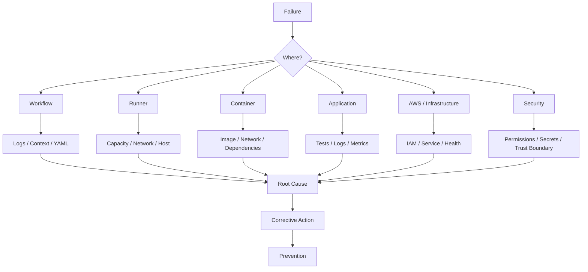

# 19- Workflow Logs and Debugging

## Overview

GitHub Actions logs are the primary execution evidence for understanding what happened inside a workflow.

A production CI/CD platform should make failures diagnosable without requiring engineers to reproduce the entire workflow locally.

The debugging model should be:

```text
Workflow Failure
      ↓
Identify Failure Domain
      ↓
Inspect Workflow / Job / Step
      ↓
Inspect Context and Inputs
      ↓
Inspect Runner / Container
      ↓
Inspect External Dependency
      ↓
Identify Root Cause
      ↓
Correct
      ↓
Prevent Recurrence
```

Logs should explain execution without exposing secrets or generating excessive noise.

For senior backend engineers, effective debugging means distinguishing between:

- Workflow configuration failures
- GitHub Actions execution failures
- Runner failures
- Application/test failures
- Docker failures
- AWS authentication failures
- Deployment failures
- Infrastructure failures
- Concurrency and race conditions
- Security-related failures

---

## GitHub Actions Execution Model

A workflow is executed through several layers:

```text
Workflow
   ↓
Job
   ↓
Runner
   ↓
Step
   ↓
Action / Shell Command
   ↓
Process
```

A failure at one layer can look similar to a failure at another.

For example:

```text
pytest failed
```

could mean:

```text
Application test failure
```

or:

```text
Python dependency installation failure
```

or:

```text
PostgreSQL unavailable
```

or:

```text
Runner disk exhausted
```

Correct debugging starts by identifying the failing layer.

---

## Workflow-Level Logs

Workflow-level investigation should begin with:

- Workflow name
- Run ID
- Trigger
- Branch/tag
- Commit SHA
- Actor
- Start time
- Completion time
- Overall status

Useful information:

```text
Workflow: CI
Run: 123456
Event: pull_request
Branch: feature/orders
Commit: abc123
Status: failure
```

The trigger matters because security context and available secrets can differ between events.

---

## Job-Level Logs

A workflow may contain:

```text
lint
unit-tests
integration-tests
security
build
deploy
```

First identify the failing job.

For example:

```text
lint                  success
unit-tests             success
integration-tests      failure
security               skipped
build                  skipped
deploy                 skipped
```

The correct investigation target is `integration-tests`, not the deployment stage.

---

## Step-Level Logs

Inside a failing job, identify the first meaningful failure.

Example:

```text
Checkout                    success
Setup Python                success
Install dependencies       success
Start PostgreSQL            success
Run migrations              success
Run pytest                  failure
Upload reports             skipped
```

The failure boundary is:

```text
pytest
```

Later skipped steps are usually consequences rather than root causes.

---

## First Failure Principle

When multiple steps fail, investigate the earliest meaningful failure.

For example:

```text
Install dependencies     failure
Run tests                failure
Upload reports           skipped
```

The test failure is secondary because tests never received their expected environment.

However, do not assume the first visible message is always the root cause. A process can fail because of an earlier environmental problem that only becomes visible later.

---

## GitHub CLI for Workflow Inspection

List workflows:

```bash
gh workflow list
```

List recent runs:

```bash
gh run list
```

Inspect a specific run:

```bash
gh run view <run-id>
```

Inspect logs:

```bash
gh run view <run-id> --log
```

Watch a running workflow:

```bash
gh run watch <run-id>
```

Rerun a workflow:

```bash
gh run rerun <run-id>
```

These commands are useful for operational debugging without manually navigating the GitHub UI.

---

## Filtering Workflow Runs

Inspect runs for a specific workflow:

```bash
gh run list --workflow ci.yml
```

Inspect a branch:

```bash
gh run list \
  --workflow ci.yml \
  --branch main
```

Inspect failed runs:

```bash
gh run list \
  --workflow ci.yml \
  --status failure
```

This is useful when investigating recurring failures rather than a single run.

---

## Inspecting Run Metadata

```bash
gh run view <run-id>
```

Look for:

```text
Status
Conclusion
Event
Branch
Commit
Workflow
Jobs
Duration
```

The event is particularly important when debugging PR security or environment behavior.

---

## Downloading Workflow Logs

For detailed offline investigation:

```bash
gh run view <run-id> --log > run.log
```

Then search:

```bash
grep -n "Error" run.log
```

or:

```bash
grep -n "failed" run.log
```

Large logs should be searched rather than read linearly.

---

## Workflow Debug Logging

GitHub Actions supports additional runner diagnostic logging through:

```text
ACTIONS_RUNNER_DEBUG
ACTIONS_STEP_DEBUG
```

These should be enabled selectively when deeper execution information is required.

Do not leave excessive diagnostic logging permanently enabled in production workflows because it increases noise and may reveal operational details that are unnecessary for normal execution.

---

## Step Debugging

A workflow can enable step-level debugging through repository or organization configuration.

The goal is to expose additional runner/action diagnostics when normal logs are insufficient.

Use debug logging for:

- Action execution problems
- Environment resolution issues
- Runner behavior
- Unexpected command execution

Do not use debug logging as a substitute for structured troubleshooting.

---

## Logging Environment Information Safely

Useful diagnostic information includes:

```bash
python --version
pip --version
node --version
docker version
git --version
uname -a
```

For example:

```yaml
- name: Print runtime versions
  run: |
    python --version
    pip --version
    docker version
```

Avoid:

```bash
env
```

when secrets may be present.

---

## Safe Diagnostic Context

Prefer explicitly selecting non-sensitive values:

```yaml
- name: Print CI context
  env:
    PYTHON_VERSION: ${{ matrix.python-version }}
    RUNNER_OS: ${{ runner.os }}
  run: |
    echo "Python: ${PYTHON_VERSION}"
    echo "Runner OS: ${RUNNER_OS}"
```

This provides useful context without dumping the complete environment.

---

## Expression vs Shell Debugging

GitHub Actions expressions:

```yaml
${{ github.sha }}
```

are evaluated by GitHub Actions.

Shell variables:

```bash
"$GITHUB_SHA"
```

are interpreted by the shell.

These are different evaluation systems.

Example:

```yaml
env:
  COMMIT_SHA: ${{ github.sha }}

steps:
  - run: echo "Commit: ${COMMIT_SHA}"
```

This separates expression evaluation from shell execution.

---

## Debugging Context Problems

When a context value behaves unexpectedly, identify:

```text
Context
→ Property
→ Evaluation Location
→ Runtime Value
```

Common contexts include:

```text
github
env
vars
secrets
steps
needs
job
runner
matrix
strategy
inputs
```

Do not assume every context is available at every workflow level.

---

## Safely Inspecting Contexts

Structured debugging can use `toJSON()` for non-sensitive contexts.

Example:

```yaml
- name: Inspect job context
  env:
    JOB_CONTEXT: ${{ toJSON(job) }}
  run: |
    printf '%s\n' "$JOB_CONTEXT"
```

Do not serialize contexts containing secrets or sensitive information into logs.

---

## Debugging `if` Conditions

Conditional execution is a common source of confusion.

Example:

```yaml
if: ${{ success() && github.ref == 'refs/heads/main' }}
```

If the step does not run, determine:

```text
Was the previous step successful?
Is github.ref what you expect?
Is the condition evaluated at job or step level?
```

A skipped step is not necessarily a failure.

---

## Status Functions

Important functions include:

```text
success()
failure()
always()
cancelled()
```

Typical usage:

```yaml
- name: Upload reports
  if: ${{ !cancelled() }}
  uses: actions/upload-artifact@v5
```

Be careful with `always()`.

A cleanup/reporting step that uses `always()` can execute after failures, but indiscriminate use can create misleading behavior during cancellation or make a workflow appear to continue when it should stop.

---

## `continue-on-error`

`continue-on-error` changes failure behavior.

Example:

```yaml
- name: Optional static analysis
  continue-on-error: true
  run: ./scripts/optional-check.sh
```

Use it deliberately.

A production deployment step should not normally use `continue-on-error` simply to make the workflow appear successful.

---

## Debugging Workflow Syntax Errors

### Symptom

Workflow does not start or is rejected.

### Possible Causes

- Invalid YAML
- Invalid workflow structure
- Unsupported field
- Incorrect indentation
- Invalid expression

### Isolation Strategy

Separate:

```text
YAML syntax
→ Workflow schema
→ Expression syntax
```

### Corrective Action

Validate the workflow structure and compare the failing section with the expected GitHub Actions schema.

### Prevention

Keep workflows small and use reusable workflows for repeated patterns.

---

## Debugging Trigger Problems

### Symptom

Expected workflow does not run.

### Possible Causes

- Wrong event
- Branch filter
- Path filter
- Tag filter
- Workflow disabled
- Event-specific behavior

### Isolation Strategy

Check:

```text
Event
Branch
Changed Paths
Tags
Workflow Configuration
```

For example:

```yaml
on:
  push:
    branches:
      - main
```

A push to:

```text
feature/orders
```

will not trigger this workflow.

---

## Debugging Path Filters

Example:

```yaml
on:
  push:
    paths:
      - "backend/**"
```

A change only to:

```text
README.md
```

will not trigger the workflow.

When debugging, inspect the actual changed files and compare them with the path patterns.

---

## Debugging Branch Filters

Example:

```yaml
on:
  pull_request:
    branches:
      - main
```

The `branches` filter describes the relevant target branch for pull requests.

Do not debug PR filters as if they behaved identically to `push` branch filters.

---

## Debugging Expression Failures

Common problems:

```text
Wrong context
Wrong property
Incorrect quoting
Unexpected null/empty value
Boolean/string confusion
Incorrect function usage
```

For example:

```yaml
if: github.ref == 'refs/heads/main'
```

and:

```yaml
if: ${{ github.ref == 'refs/heads/main' }}
```

may both be valid in appropriate contexts, but mixing expression syntax with shell syntax is a common source of errors.

---

## Debugging Environment Variables

Environment variables can exist at:

```text
Workflow
 ↓
Job
 ↓
Step
```

A lower scope can override a higher scope.

Example:

```yaml
env:
  APP_ENV: production

jobs:
  deploy:
    env:
      APP_ENV: staging
```

The job-level value applies within that job.

When debugging, determine the scope at which the value is defined.

---

## Debugging Variables vs Secrets

Variables are appropriate for non-sensitive configuration.

Secrets are appropriate for sensitive values.

Do not move a secret into `vars` simply because it is easier to debug.

Use explicit diagnostic checks such as:

```bash
if [[ -z "${API_URL:-}" ]]; then
  echo "API_URL is missing"
  exit 1
fi
```

Never print the secret itself.

---

## Debugging Secrets

### Symptom

A secret appears empty or unavailable.

### Possible Causes

- Wrong secret scope
- Environment not attached
- Forked PR restrictions
- Incorrect secret name
- Reusable workflow not receiving the secret
- Environment protection not satisfied

### Isolation

Check:

```text
Repository
Organization
Environment
Workflow
Job
Reusable Workflow
Event
```

Do not solve secret availability by logging the secret.

---

## Secret Availability Checks

Instead of:

```bash
echo "$API_KEY"
```

use:

```bash
if [[ -z "${API_KEY:-}" ]]; then
  echo "API_KEY is unavailable"
  exit 1
fi

echo "API_KEY is configured"
```

This confirms presence without exposing the value.

---

## Debugging `secrets: inherit`

For reusable workflows:

```yaml
jobs:
  deploy:
    uses: org/platform/.github/workflows/deploy.yml@v1
    secrets: inherit
```

If the reusable workflow cannot access an expected secret, inspect:

```text
Caller
→ Reusable Workflow
→ Secret Scope
→ Environment
```

Do not assume environment secrets automatically behave identically to repository secrets across reusable workflow boundaries.

---

## Debugging Permissions

### Symptom

An action receives:

```text
403
Resource not accessible
Permission denied
```

### Possible Causes

- Missing `GITHUB_TOKEN` permission
- Job-level permissions override
- Repository policy
- Event security restrictions
- Resource access limitation

Example:

```yaml
permissions:
  contents: read
  pull-requests: write
```

Start with the smallest required permission set.

---

## Permission Isolation

A common mistake is:

```yaml
permissions: write-all
```

This increases the impact of:

- Compromised actions
- Shell injection
- Malicious dependencies
- Unexpected scripts

Debug the specific API operation and grant only the permission required for it.

---

## Debugging Matrix Failures

### Symptom

One matrix variant fails while others pass.

Example:

```text
Python 3.10  success
Python 3.11  success
Python 3.12  failure
```

Investigate:

```text
Python Version
Dependency Resolution
OS
Database Version
Environment
Test Data
```

Do not treat a matrix failure as a generic workflow failure.

---

## Matrix Debug Metadata

Useful diagnostic output:

```yaml
- name: Print matrix configuration
  run: |
    echo "Python: ${{ matrix.python-version }}"
    echo "Database: ${{ matrix.database }}"
```

This makes individual matrix executions easier to identify.

---

## Debugging Dynamic Matrices

Dynamic matrices commonly use:

```text
Planning Job
 ↓
JSON Output
 ↓
fromJSON()
 ↓
Matrix
```

Example:

```yaml
strategy:
  matrix: ${{ fromJSON(needs.plan.outputs.matrix) }}
```

If the matrix fails, inspect:

```text
Generated JSON
→ Job Output
→ fromJSON()
→ Matrix Definition
```

The planning job should produce valid JSON.

---

## Debugging Job Outputs

Outputs travel through:

```text
Step
 ↓
Job
 ↓
needs
 ↓
Dependent Job
```

Example:

```yaml
outputs:
  image:
    value: ${{ steps.build.outputs.image }}
```

If the consuming job receives an empty value, inspect each boundary rather than only the final job.

---

## Debugging `GITHUB_OUTPUT`

Correct:

```bash
echo "image=example/app:${GITHUB_SHA}" >> "$GITHUB_OUTPUT"
```

Incorrect approaches often involve:

- Writing to the wrong file
- Incorrect multiline syntax
- Shell quoting problems
- Referencing the wrong step ID

Always verify the producing step's `id`.

---

## Debugging Artifacts

### Symptom

Artifact is missing.

### Possible Causes

- Upload step skipped
- Incorrect path
- Previous step failed
- Artifact name mismatch
- Conditional execution
- File was never generated

### Isolation

First check whether the expected file exists:

```bash
ls -lah reports/
```

Then inspect the upload step.

---

## Debugging Artifact Paths

Example:

```yaml
- name: Upload report
  uses: actions/upload-artifact@v5
  with:
    name: test-report
    path: reports/
```

Before upload:

```yaml
- name: Inspect reports
  run: |
    pwd
    find reports -maxdepth 2 -type f -print
```

This distinguishes a missing artifact from a missing source file.

---

## Artifact Upload After Failure

For test reporting:

```yaml
- name: Upload test reports
  if: ${{ !cancelled() }}
  uses: actions/upload-artifact@v5
  with:
    name: test-reports
    path: reports/
```

The condition should reflect the desired behavior during failures and cancellations.

---

## Debugging Cache Problems

### Symptom

Build suddenly becomes slower.

### Possible Causes

- Cache miss
- Key changed
- Dependency lock file changed
- Matrix fragmentation
- Cache unavailable
- Incorrect cache path

Example:

```yaml
key: ${{ runner.os }}-python-${{ hashFiles('**/poetry.lock') }}
```

When debugging, inspect the effective key and dependency files.

---

## Cache vs Artifact Debugging

A cache problem affects performance.

An artifact problem affects data availability.

```text
Cache miss
→ Rebuild / reinstall

Artifact missing
→ Output unavailable
```

Do not use caches to preserve required deployment artifacts.

---

## Debugging Containers

### Symptom

Job fails only inside a container.

### Possible Causes

- Missing executable
- Wrong working directory
- Missing environment variable
- Incorrect shell
- User permissions
- Network configuration
- Missing system dependency

Inspect:

```bash
pwd
id
whoami
python --version
env | sort
```

Use selective environment output when secrets are present.

---

## Job Containers vs Runner Shell

A command that works on the runner may fail inside:

```yaml
container:
  image: python:3.12-slim
```

because the container may not contain:

- Bash
- Git
- Compilers
- System libraries
- Docker CLI
- AWS CLI

Choose CI images intentionally.

---

## Debugging Service Containers

For PostgreSQL:

```yaml
services:
  postgres:
    image: postgres:17
```

If integration tests fail, investigate:

```text
Container Started
→ Port / Network
→ Health
→ Credentials
→ Database Initialization
→ Application Connection
```

Do not assume container startup means database readiness.

---

## PostgreSQL Diagnostics

Useful checks:

```bash
pg_isready \
  -h postgres \
  -p 5432
```

Then inspect application configuration:

```text
DB_HOST
DB_PORT
DB_NAME
DB_USER
```

Never print the database password.

---

## Redis Diagnostics

For Redis:

```bash
redis-cli -h redis ping
```

Expected:

```text
PONG
```

If it fails, determine whether the problem is:

```text
Network
→ DNS
→ Container
→ Authentication
→ Redis Process
```

---

## MySQL Diagnostics

Useful check:

```bash
mysqladmin ping \
  -h mysql \
  -P 3306
```

Also verify:

```text
Host
Port
Database
User
Character Set
```

---

## Debugging Python Dependencies

### Symptom

Import failure:

```text
ModuleNotFoundError
```

Check:

```bash
python --version
python -m pip --version
python -m pip list
```

Prefer:

```bash
python -m pip install -r requirements.txt
```

over relying on an ambiguous `pip` executable.

---

## Python Environment Debugging

Check interpreter location:

```bash
which python
```

On Windows runners:

```powershell
Get-Command python
```

Then:

```bash
python -c "import sys; print(sys.executable)"
```

This helps detect multiple Python installations.

---

## Django Debugging

For Django CI failures:

```bash
python manage.py check
python manage.py showmigrations
python manage.py migrate --plan
pytest
```

Investigate separately:

```text
Settings
Database
Migrations
Environment Variables
Dependencies
Tests
```

A Django migration failure is not necessarily a test-code failure.

---

## FastAPI Debugging

For FastAPI:

```text
Application Startup
 ↓
Dependency Initialization
 ↓
Database Connection
 ↓
Route Registration
 ↓
Health Check
 ↓
Test Request
```

Useful checks include:

```bash
python -m pytest
```

and an explicit health request:

```bash
curl --fail http://127.0.0.1:8000/health
```

---

## Debugging Docker Builds

### Symptom

Docker build fails.

### Isolation

Separate:

```text
Dockerfile Parsing
→ Dependency Installation
→ Build Context
→ BuildKit
→ Registry
```

Build with plain output when detailed build logs are required:

```bash
docker buildx build \
  --progress=plain \
  .
```

---

## Common Docker Build Failures

### Missing File

Possible cause:

```text
.dockerignore
```

Check:

```bash
docker buildx build --progress=plain .
```

and inspect the build context.

### Dependency Compilation

Python packages such as native database drivers may require:

```text
gcc
headers
system libraries
```

The correct fix is usually to install required build dependencies in the build stage rather than weakening the production image.

---

## Debugging ECR

Authentication flow:

```text
GitHub Actions
 ↓
OIDC
 ↓
STS
 ↓
IAM Role
 ↓
ECR
 ↓
Docker Push
```

Separate:

```text
Authentication Failure
```

from:

```text
Authorization Failure
```

and:

```text
Registry / Repository Failure
```

---

## ECR Diagnostics

Check AWS identity:

```bash
aws sts get-caller-identity
```

Check repository:

```bash
aws ecr describe-repositories \
  --repository-names my-app
```

List images:

```bash
aws ecr list-images \
  --repository-name my-app
```

These commands should be run with appropriate least-privilege credentials.

---

## Debugging AWS OIDC

### Symptom

Role assumption fails.

### Isolation

```text
GitHub OIDC Token
 ↓
IAM OIDC Provider
 ↓
Trust Policy
 ↓
STS AssumeRole
 ↓
Temporary Credentials
```

Check:

- `id-token: write`
- AWS account
- Role ARN
- Audience
- Subject conditions
- Environment/branch restrictions

---

## Debugging Deployment Failures

A deployment should be divided into:

```text
Artifact
 ↓
Authentication
 ↓
Authorization
 ↓
Infrastructure
 ↓
Application
 ↓
Health
```

This prevents treating every deployment failure as an application bug.

---

## ECS Debugging

Useful commands:

```bash
aws ecs describe-services \
  --cluster production \
  --services api
```

Inspect task state:

```bash
aws ecs list-tasks \
  --cluster production
```

Then:

```bash
aws ecs describe-tasks \
  --cluster production \
  --tasks <task-arn>
```

Investigate:

```text
Task Definition
Image
Environment
Secrets
Networking
Health Checks
Exit Code
Stopped Reason
```

---

## EC2 Deployment Debugging

Typical investigation:

```text
GitHub Workflow
 ↓
Artifact
 ↓
EC2
 ↓
Deployment Directory
 ↓
Application Process
 ↓
Reverse Proxy
 ↓
Health Check
```

On the instance:

```bash
systemctl status gunicorn
systemctl status nginx
journalctl -u gunicorn
```

Use AWS Systems Manager where possible rather than relying exclusively on SSH.

---

## Kubernetes Deployment Debugging

Check:

```bash
kubectl get pods
```

Then:

```bash
kubectl describe pod <pod>
```

Logs:

```bash
kubectl logs <pod>
```

Deployment:

```bash
kubectl rollout status deployment/api
```

History:

```bash
kubectl rollout history deployment/api
```

Separate:

```text
Image Pull
→ Pod Startup
→ Readiness
→ Service
→ Ingress
```

---

## Concurrency Problems

### Symptom

Two production deployments overlap.

### Possible Causes

- Missing concurrency group
- Incorrect group key
- Separate workflows deploying the same environment
- Manual workflow started during an automated deployment

Example:

```yaml
concurrency:
  group: production-deployment
  cancel-in-progress: false
```

For production deployments, cancellation policy should be chosen carefully because cancelling an active deployment can be more dangerous than waiting.

---

## Race Conditions

A deployment race can produce:

```text
Release A starts
Release B starts
Release B completes
Release A completes later
```

Production may end up running an older release.

Use:

```text
Concurrency
+
Immutable Artifacts
+
Deployment Locks
+
Idempotent Deployment Logic
```

---

## Debugging Security Failures

Security-related failures often appear as ordinary command failures.

Examples:

```text
403 Forbidden
AccessDenied
Resource not accessible
Permission denied
Secret unavailable
```

Determine whether the cause is:

```text
GitHub Permission
→ Secret Availability
→ AWS IAM
→ Environment Protection
→ Network Access
```

Do not immediately broaden permissions.

---

## Debugging `pull_request` vs `pull_request_target`

A workflow behaving differently for fork PRs may be caused by trust boundaries.

Investigate:

```text
Event
Repository
Fork Status
Token Permissions
Secret Availability
Checked-Out Code
```

`pull_request_target` requires particular caution because it executes with the context of the target repository while potentially processing untrusted PR data.

---

## Debugging Script Injection

Unsafe:

```yaml
- run: echo "PR title: ${{ github.event.pull_request.title }}"
```

A user-controlled value is being inserted directly into a shell command.

Safer:

```yaml
- name: Inspect PR title
  env:
    PR_TITLE: ${{ github.event.pull_request.title }}
  run: |
    printf '%s\n' "$PR_TITLE"
```

The general rule is:

```text
GitHub Expression
→ Environment Variable
→ Quoted Shell Variable
```

rather than interpolating untrusted values directly into shell syntax.

---

## Debugging Third-Party Actions

If an action suddenly fails:

```text
Action Version
 ↓
Action SHA
 ↓
Inputs
 ↓
Permissions
 ↓
Secrets
 ↓
Runner
 ↓
External API
```

Check whether the action version changed.

SHA-pinned actions make changes easier to reason about because the executed revision is explicit.

---

## Debugging Custom Actions

For composite actions:

```text
action.yml
→ Inputs
→ Steps
→ Shell
→ Outputs
```

For JavaScript actions:

```text
action.yml
→ Node Runtime
→ Dependencies
→ API Calls
→ Outputs
```

For Docker actions:

```text
action.yml
→ Dockerfile
→ Entrypoint
→ Container Environment
→ Outputs
```

Debug according to the action type.

---

## Reusable Workflow Debugging

A reusable workflow introduces another boundary:

```text
Caller
 ↓
workflow_call
 ↓
Inputs / Secrets
 ↓
Reusable Workflow
 ↓
Jobs
 ↓
Outputs
```

When debugging, verify the caller's:

```text
Inputs
Secrets
Permissions
Ref
```

and the reusable workflow's:

```text
Input Definitions
Job Permissions
Outputs
Environment
```

---

## Workflow Log Design

Good workflow logs should provide:

```text
Phase
Operation
Version
Environment
Result
Duration
```

Example:

```text
[build] Building image
[build] Commit: abc123
[build] Environment: staging
[build] Image: example/api
[build] Build completed in 94s
```

Avoid excessive decoration or repeated information.

---

## Log Noise

Avoid patterns such as:

```text
echo "Starting..."
echo "Starting..."
echo "Starting..."
```

Useful logs explain state transitions and important decisions.

Prefer:

```text
Running integration tests against PostgreSQL 17
```

over dozens of low-value messages.

---

## Debugging Long Workflows

Large workflows should be divided into logical jobs:

```text
Quality
Testing
Security
Build
Publish
Deploy
Verify
```

This improves:

- Failure isolation
- Parallelism
- Log navigation
- Retry behavior
- Ownership

A monolithic job makes debugging significantly harder.

---

## Failure Domain Model

Use a consistent debugging model:

```text
Symptom
   ↓
Possible Causes
   ↓
Isolation Strategy
   ↓
Commands / Checks
   ↓
Root Cause
   ↓
Corrective Action
   ↓
Prevention
```

This prevents random configuration changes during incidents.

---

## Example: Integration Test Failure

### Symptom

```text
pytest failed with database connection error
```

### Possible Causes

- PostgreSQL unavailable
- Wrong hostname
- Wrong port
- Wrong credentials
- Database not ready
- Application configuration error

### Isolation

```bash
pg_isready -h postgres -p 5432
```

Then inspect non-sensitive connection settings.

### Root Cause

For example:

```text
Application used localhost
```

while PostgreSQL was running in a service container.

### Corrective Action

Use the correct service hostname.

### Prevention

Document runner vs container networking and add readiness checks.

---

## Example: Docker Build Failure

### Symptom

```text
docker buildx build failed
```

### Possible Causes

- Invalid Dockerfile
- Missing build dependency
- Incorrect build context
- Network failure
- Cache failure
- Registry authentication

### Isolation

```bash
docker buildx build \
  --progress=plain \
  .
```

### Prevention

Use:

- Reproducible dependencies
- Small build contexts
- Multi-stage builds
- Explicit base images
- Appropriate caching
- Immutable image identification

---

## Example: Production Deployment Failure

### Symptom

Deployment workflow failed.

### Investigation

```text
Workflow
 ↓
Deploy Job
 ↓
AWS Authentication
 ↓
Artifact
 ↓
Service Deployment
 ↓
Health Check
```

If authentication succeeded but health validation failed, do not debug OIDC first.

The failure domain has moved to the deployment/runtime layer.

---

## Debugging Through Artifacts

When logs are insufficient, generate diagnostic artifacts.

Useful artifacts include:

```text
JUnit XML
Coverage Reports
Application Logs
Screenshots
Browser Traces
Docker Build Metadata
Test Reports
Configuration Snapshots
```

Do not upload:

```text
.env
Private Keys
Cloud Credentials
Database Dumps
Unredacted Secrets
```

---

## Failure Reports

A useful test report might contain:

```text
Test Suite
Passed
Failed
Skipped
Duration
Coverage
Environment
Python Version
Database Version
```

This makes matrix failures easier to diagnose.

---

## Debugging E2E Tests

For browser or API E2E tests capture:

- Test report
- Screenshot
- Browser trace
- Relevant application logs
- Request/response metadata where safe

Example:

```yaml
- name: Upload E2E diagnostics
  if: ${{ !cancelled() }}
  uses: actions/upload-artifact@v5
  with:
    name: e2e-diagnostics-${{ github.run_id }}
    path: |
      reports/
      screenshots/
      traces/
```

---

## Debugging Flaky Tests

A flaky test should not be hidden with unlimited retries.

Investigate:

```text
Timing
Concurrency
Shared State
Database Isolation
External Dependencies
Test Ordering
Resource Limits
```

Retries can help distinguish transient infrastructure failures from deterministic test failures, but they should not conceal a recurring defect.

---

## Debugging Network Problems

Separate:

```text
DNS
→ TCP Connection
→ TLS
→ Authentication
→ Application
```

For example:

```bash
getent hosts postgres
```

Then:

```bash
nc -vz postgres 5432
```

Then use the database-specific readiness command.

---

## Debugging Private Network Access

For self-hosted runners accessing AWS private resources, investigate:

```text
Runner
 ↓
DNS
 ↓
Route
 ↓
Security Group
 ↓
NACL
 ↓
Private Endpoint / Service
```

A successful internet connection does not prove private VPC connectivity.

---

## Debugging DNS

Check:

```bash
getent hosts api.internal.example
```

or:

```bash
nslookup api.internal.example
```

Then distinguish:

```text
DNS Failure
```

from:

```text
Connection Refused
```

and:

```text
Timeout
```

They indicate different failure domains.

---

## Debugging TLS

For HTTPS:

```bash
curl -v https://api.example.com/health
```

Inspect:

```text
DNS
TCP
TLS Handshake
Certificate
HTTP Response
```

Do not disable TLS verification merely to make CI pass.

---

## Debugging Runner Connectivity

For self-hosted runners inspect:

```text
Runner Status
Network
Proxy
DNS
Firewall
Outbound Access
Runner Version
```

A runner can be healthy at the OS level while being unable to communicate with required GitHub services.

---

## Runner Failure Isolation

Separate:

```text
Job Queued
 ↓
Runner Assigned
 ↓
Runner Starts Job
 ↓
Command Starts
 ↓
Command Fails
```

If no runner is assigned, application logs are irrelevant.

---

## Disk Exhaustion

Symptoms include:

```text
No space left on device
Docker build failures
Artifact failures
Package installation failures
```

Check:

```bash
df -h
```

For Docker:

```bash
docker system df
```

Persistent runners require explicit disk management.

---

## Memory Exhaustion

Symptoms include:

```text
Process killed
OOM
Random build failures
Container exits
```

Check:

```bash
free -h
```

and:

```bash
docker stats
```

Large test matrices can increase resource pressure when jobs execute concurrently.

---

## CPU Saturation

High CPU may result from:

- Parallel tests
- Docker builds
- Compilation
- Compression
- Static analysis

Do not assume more parallelism always makes CI faster.

---

## Concurrency vs Parallelism

Parallelism:

```text
Run independent jobs simultaneously
```

Concurrency control:

```text
Prevent conflicting executions
```

For example:

```text
10 unit-test jobs
```

may be desirable.

But:

```text
2 production deployments
```

may be unsafe.

---

## Production Debugging Workflow

A practical incident workflow:

```text
1. Identify affected environment
2. Identify workflow/run
3. Identify release
4. Identify artifact digest
5. Identify failing stage
6. Identify failure domain
7. Gather evidence
8. Mitigate
9. Validate recovery
10. Document root cause
```

Avoid changing configuration before establishing the failure boundary.

---

## Debugging Architecture



---

## Production Debugging Principles

### Start at the Failure Boundary

Do not inspect the entire system immediately.

### Preserve Evidence

Record:

```text
Run ID
Commit SHA
Artifact
Environment
Timestamp
Error
```

### Change One Thing at a Time

Changing five workflow settings simultaneously destroys useful evidence.

### Prefer Deterministic Reproduction

If possible, reproduce:

```text
Same Commit
Same Image
Same Runtime
Same Dependency Versions
```

### Distinguish Symptom from Root Cause

For example:

```text
pytest failed
```

is a symptom.

```text
PostgreSQL was not ready
```

may be the actual cause.

---

## Security During Debugging

Debugging is itself a security-sensitive operation.

Never solve an observability problem by:

```text
Printing secrets
Granting write-all permissions
Disabling TLS
Disabling security checks
Uploading entire filesystems
Using long-lived cloud credentials
```

Use temporary, narrowly scoped diagnostics instead.

---

## Production Debugging Checklist

### Workflow

- [ ] Run ID identified.
- [ ] Trigger identified.
- [ ] Branch/tag identified.
- [ ] Commit identified.
- [ ] First meaningful failure identified.

### Job

- [ ] Failing job identified.
- [ ] Runner identified.
- [ ] Matrix dimensions identified.
- [ ] Job dependencies inspected.

### Step

- [ ] Failing step identified.
- [ ] Inputs inspected.
- [ ] Environment scope checked.
- [ ] Exit code examined.

### Infrastructure

- [ ] Runner capacity checked.
- [ ] Disk checked.
- [ ] Memory checked.
- [ ] Network checked.
- [ ] External services checked.

### Security

- [ ] Permissions checked.
- [ ] Secret availability checked safely.
- [ ] Event trust boundary checked.
- [ ] OIDC/IAM checked where applicable.
- [ ] No secrets exposed during debugging.

### Deployment

- [ ] Artifact identity verified.
- [ ] Image digest verified.
- [ ] Deployment state checked.
- [ ] Health checks inspected.
- [ ] Rollback evaluated.

---

## Interview Scenarios

### A GitHub Actions workflow is failing, but the error message is generic. What do you do first?

Identify:

```text
Run
→ Job
→ Runner
→ Step
→ First Meaningful Error
```

Then classify the failure domain before changing configuration.

### A workflow succeeds but production is unhealthy. Is the CI pipeline successful?

The workflow execution may be successful, but deployment success and application health are separate operational concerns.

Validate:

```text
Deployment
→ Readiness
→ Health
→ Metrics
→ Logs
```

### Integration tests fail intermittently. How would you debug them?

Investigate:

```text
Service Readiness
Database Isolation
Shared State
Concurrency
Resource Limits
Network
External Dependencies
```

Use diagnostic artifacts and bounded retries where appropriate.

### A self-hosted runner has jobs stuck in queue. What do you inspect?

Check:

```text
Runner Availability
Labels
Runner Groups
Repository Access
Concurrency
Capacity
Network Connectivity
```

Do not start by debugging the application.

### A Docker build suddenly takes three times longer. What would you inspect?

Compare:

```text
Build Context
Dockerfile Layers
Cache Hit Rate
Dependency Downloads
Base Image
Registry Connectivity
Runner Resources
```

### AWS authentication works, but deployment fails with `AccessDenied`. What does that tell you?

OIDC and STS authentication may already be functioning. Investigate the IAM permissions attached to the assumed role and the specific AWS operation being denied.

### Why should logs include the commit SHA or release identity?

Because production debugging requires correlation:

```text
Incident
→ Deployment
→ Workflow Run
→ Commit
→ Artifact
→ Runtime
```

Without immutable identity, reconstructing what was deployed becomes harder.

## Key Takeaways

- Debug GitHub Actions by isolating the **failure domain and first meaningful failure** across workflow, job, step, runner, container, application, infrastructure, and security layers.
- Use **GitHub CLI, structured logs, step summaries, diagnostic artifacts, and controlled debug logging** to collect evidence without exposing secrets or creating excessive noise.
- Separate **workflow success from deployment and application health**; a successful GitHub Actions run does not prove that production is healthy.
- Debug production failures through **immutable release identity, commit SHA, image digest, deployment metadata, and downstream application/infrastructure signals**.
- Senior-level debugging emphasizes **evidence preservation, least-privilege diagnostics, deterministic reproduction, failure-domain isolation, and prevention of recurring incidents**.