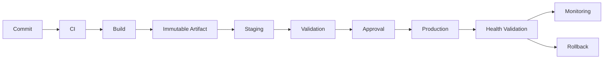
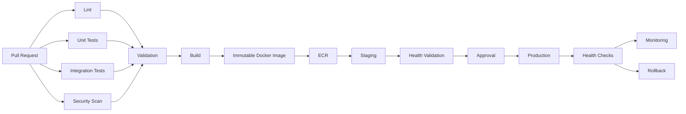

# 20- CI CD Reliability

## Overview

CI/CD reliability is the ability of a delivery system to produce predictable results, recover from failures, and safely move software from source control to production.

A reliable GitHub Actions platform should provide:

- Deterministic builds
- Repeatable tests
- Controlled deployments
- Clear failure boundaries
- Safe retries
- Deployment serialization
- Immutable artifacts
- Observable execution
- Fast recovery
- Secure credentials
- Reproducible environments
- Controlled operational cost

Reliability is broader than workflow success.

```text
Reliable CI/CD
├── Correctness
├── Availability
├── Reproducibility
├── Recoverability
├── Observability
├── Security
├── Scalability
└── Operational Control
```

A production pipeline should behave predictably under normal operation, dependency failures, runner failures, network failures, deployment failures, and partial outages.

---

## CI/CD Reliability Model

A useful model is:

```text
Source
  ↓
Validation
  ↓
Testing
  ↓
Build
  ↓
Artifact
  ↓
Promotion
  ↓
Deployment
  ↓
Health Validation
  ↓
Monitoring
  ↓
Rollback / Recovery
```

Each stage introduces a potential failure domain.

A reliable architecture isolates these domains rather than allowing one failure to corrupt the entire delivery process.

---

## Reliability vs Availability

These concepts are related but different.

| Concept | Meaning |
|---|---|
| Reliability | Ability to perform correctly and consistently |
| Availability | Ability to remain usable when requested |
| Recoverability | Ability to restore service after failure |
| Resilience | Ability to tolerate failures without unacceptable impact |
| Durability | Ability to preserve required data/artifacts |
| Observability | Ability to understand system state from outputs |

A GitHub Actions workflow can be highly reliable while GitHub itself is temporarily unavailable.

Likewise, a deployment system can be available but unreliable if it frequently produces incorrect releases.

---

## Reliability Objectives

CI/CD should have explicit operational objectives.

Examples:

```text
PR CI:
  Fast feedback
  High determinism
  Safe parallelism

Production CD:
  Strong correctness
  Deployment serialization
  Approval controls
  Fast rollback

Release Pipeline:
  Immutable artifacts
  Traceability
  Reproducibility
```

Useful measurements include:

- Workflow success rate
- Flaky test rate
- Median workflow duration
- P95 workflow duration
- Queue time
- Deployment frequency
- Deployment failure rate
- Mean time to recovery
- Rollback frequency
- Cache hit rate
- Runner utilization

---

## Failure Domains

A production CI/CD system should identify failure domains explicitly.

```text
GitHub Platform
       │
       ├── Workflow Configuration
       │
       ├── Runner
       │
       ├── Dependency Registry
       │
       ├── Docker Registry
       │
       ├── AWS
       │
       ├── Infrastructure
       │
       └── Application
```

A failure in one domain should not automatically compromise unrelated stages.

For example:

```text
ECR unavailable
```

should prevent image publication, but should not corrupt source code, test results, or previously published immutable artifacts.

---

## Deterministic CI

A reliable pipeline should produce the same result from the same source and environment assumptions.

Avoid uncontrolled inputs such as:

```text
latest
floating dependency versions
unversioned actions
mutable infrastructure
uncontrolled external services
```

Prefer:

```text
Locked dependencies
Pinned action versions
Explicit runtime versions
Immutable artifact identifiers
Explicit container images
Versioned infrastructure
```

---

## Dependency Pinning

Python dependencies should use a lock strategy appropriate to the package manager.

For example:

```text
requirements.lock
poetry.lock
uv.lock
```

The exact mechanism depends on the project.

The important reliability property is:

```text
Source Revision
+
Dependency Definition
+
Runtime
=
Reproducible Build
```

---

## GitHub Action Pinning

An action reference such as:

```yaml
uses: actions/checkout@v4
```

provides a stable major-version contract but can still move as the referenced release changes.

For stronger supply-chain reproducibility, organizations may pin actions to immutable commit SHAs and manage updates deliberately.

Reliability and security both benefit from knowing exactly which action implementation executed.

---

## Runtime Pinning

Avoid relying on an unspecified runtime.

Example:

```yaml
- name: Set up Python
  uses: actions/setup-python@v6
  with:
    python-version: "3.12"
```

The application should also define supported versions explicitly.

For a Python backend:

```text
Python
Django / FastAPI
System libraries
Database driver
Dependencies
```

must be compatible as a tested combination.

---

## Build Reproducibility

A production build should be reproducible from:

```text
Commit SHA
+
Locked Dependencies
+
Build Configuration
+
Base Image
+
Toolchain
```

For Docker:

```dockerfile
FROM python:3.12-slim
```

can be further controlled through organization-specific base-image policies and image lifecycle management.

For higher reproducibility, use immutable image references where appropriate.

---

## Build Once, Deploy Many

A strong reliability pattern is:

```text
Build
  ↓
Immutable Artifact
  ↓
Staging
  ↓
Approval
  ↓
Production
```

rather than:

```text
Build for Staging
  ↓
Rebuild
  ↓
Build for Production
```

The second model can produce different binaries or images between environments.

---

## Artifact Identity

For Docker images, the digest is a strong artifact identity:

```text
example/api@sha256:<digest>
```

A tag such as:

```text
example/api:latest
```

is mutable and therefore weaker as a deployment identity.

A reliable deployment system records:

```text
Commit SHA
Image Digest
Workflow Run ID
Build Timestamp
Environment
Deployment ID
```

---

## Artifact Promotion



The same artifact should move through environments.

Environment-specific behavior should primarily come from configuration, not rebuilding.

---

## Workflow Idempotency

A reliable workflow should tolerate safe retries.

An operation is idempotent when executing it multiple times results in the same desired state.

For example:

```bash
aws s3 cp build.zip s3://deployments/app/build.zip
```

can be designed as a repeatable operation.

Deployment scripts should avoid destructive sequences such as:

```text
delete current application
then install new application
```

when an atomic or staged replacement is possible.

---

## Idempotent Deployment

A better model is:

```text
Upload Release
      ↓
Validate Release
      ↓
Prepare Runtime
      ↓
Switch Active Version
      ↓
Health Check
```

For EC2:

```text
/releases/abc123
/releases/def456
```

and:

```text
/current -> /releases/def456
```

can provide atomic release selection.

Rollback can then switch the active reference back to a known-good release.

---

## Safe Retries

Not every operation should be retried automatically.

| Operation | Retry Consideration |
|---|---|
| Dependency download | Usually safe |
| Docker registry pull | Usually safe |
| Test execution | Sometimes |
| AWS API read | Usually safe |
| Deployment mutation | Requires idempotency |
| Database migration | Requires careful design |
| Payment API | Requires idempotency semantics |

Blind retries can turn transient failures into duplicate side effects.

---

## Retry Strategy

Use:

```text
Bounded Retries
+
Backoff
+
Jitter
+
Idempotency
+
Timeout
```

Avoid:

```text
Infinite retries
```

A retry policy should have a clear maximum duration and failure outcome.

---

## Timeouts

Every external operation should have an appropriate timeout.

Examples:

```text
HTTP request
Database connection
Docker registry operation
AWS API operation
Deployment health check
Test suite
```

Without timeouts, a workflow can remain blocked indefinitely.

---

## Workflow Timeouts

A job can define a maximum runtime:

```yaml
jobs:
  test:
    runs-on: ubuntu-latest
    timeout-minutes: 20
    steps:
      - uses: actions/checkout@v4

      - name: Run tests
        run: pytest
```

Choose a value based on observed runtime rather than arbitrarily setting an extremely large limit.

---

## Failure Isolation

A reliable workflow should separate independent concerns.

Instead of:

```text
One Large Job
 ├── lint
 ├── tests
 ├── security
 ├── build
 └── deploy
```

prefer:

```text
                ┌── Lint
                ├── Unit Tests
Commit ────────┼── Integration Tests
                └── Security
                       ↓
                     Build
                       ↓
                    Publish
                       ↓
                    Deploy
```

This improves:

- Parallelism
- Failure visibility
- Retry granularity
- Resource utilization
- Ownership

---

## Fan-Out and Fan-In

Example:

```text
                 ┌── Python 3.11
                 ├── Python 3.12
Commit → Test ──┼── PostgreSQL
                 └── MySQL
                       ↓
                    Build
```

Independent validation runs in parallel.

The build waits for the required validation jobs.

---

## Matrix Reliability

Matrix testing increases coverage but also increases operational cost.

Example:

```yaml
strategy:
  fail-fast: false
  matrix:
    python-version:
      - "3.11"
      - "3.12"
    database:
      - postgres
      - mysql
```

This creates:

```text
2 × 2 = 4 jobs
```

Matrix dimensions should represent meaningful compatibility requirements.

Do not create a large matrix simply because GitHub Actions makes it easy.

---

## `fail-fast`

For compatibility testing:

```yaml
strategy:
  fail-fast: false
```

may be useful because one failure should not hide results from other combinations.

For expensive exploratory matrices, `fail-fast: true` can reduce wasted compute when the remaining results have little value.

The correct setting depends on the purpose of the matrix.

---

## Concurrency Control

Production deployment should generally be serialized.

```yaml
concurrency:
  group: production-deployment
  cancel-in-progress: false
```

This prevents two workflows from mutating production simultaneously.

For pull request CI, cancellation can often be appropriate:

```yaml
concurrency:
  group: ci-${{ github.workflow }}-${{ github.ref }}
  cancel-in-progress: true
```

The policy should differ between validation and deployment.

---

## Deployment Race Conditions

Without concurrency control:

```text
Release A starts
      ↓
Release B starts
      ↓
Release B finishes
      ↓
Release A finishes
```

Production may end up running Release A even though Release B was newer.

Prevent this through:

```text
Concurrency Groups
+
Immutable Artifacts
+
Idempotent Deployments
+
Deployment State
```

---

## Environment Protection

Production environments can provide deployment controls such as:

- Required reviewers
- Branch restrictions
- Environment secrets
- Deployment history
- Protection rules

A production deployment should be separated from ordinary CI execution.

---

## Approval Reliability

Approval gates should validate a specific artifact.

Prefer:

```text
Build SHA
→ Image Digest
→ Staging Validation
→ Approval
→ Same Image Digest
→ Production
```

Avoid approving:

```text
"whatever the latest build is"
```

and then rebuilding later.

---

## Database Reliability

Database migrations are a major CI/CD reliability boundary.

A deployment can succeed while the application remains broken because the database schema is incompatible.

Use backward-compatible migration strategies.

---

## Expand and Contract

A common approach:

```text
Expand
  ↓
Deploy Compatible Application
  ↓
Backfill / Migrate
  ↓
Switch Application Behavior
  ↓
Contract
```

Example:

```text
Old application → old column
New application → old + new column
Backfill data
New application → new column
Remove old column later
```

This supports rolling and zero-downtime deployments.

---

## Django Migration Reliability

Before production:

```bash
python manage.py makemigrations --check
python manage.py migrate --plan
```

Run migration validation in CI.

Production migration execution should be controlled and observable rather than hidden inside arbitrary application startup commands.

---

## PostgreSQL Reliability

CI integration tests should use a known PostgreSQL version:

```yaml
services:
  postgres:
    image: postgres:17
    env:
      POSTGRES_DB: app_test
      POSTGRES_USER: app
      POSTGRES_PASSWORD: test-password
```

Tests should validate database readiness before executing.

Production CI/CD should not depend on a developer's local PostgreSQL installation.

---

## Redis Reliability

Redis may support:

- Caching
- Celery brokers
- Rate limiting
- Distributed coordination

CI should treat Redis as an explicit dependency when application behavior depends on it.

For example:

```text
Django / FastAPI
       ↓
     Redis
       ↓
    Celery
```

A Redis outage should be distinguishable from an application failure.

---

## Celery Reliability

A deployment can be technically successful while workers remain on an incompatible version.

For Celery deployments:

```text
Application
+
Worker
+
Task Schema
+
Broker
```

should remain compatible during rolling deployment.

Avoid deploying a worker that expects task payloads older workers cannot understand without considering compatibility.

---

## Kafka Reliability

Kafka consumers introduce additional deployment concerns:

- Consumer groups
- Offset management
- Message compatibility
- Schema evolution
- Rebalancing
- Duplicate processing

Application deployments should preserve backward-compatible event contracts.

A pipeline should not assume:

```text
Deploy succeeded
=
All consumers are healthy
```

---

## API Compatibility

For REST and gRPC services, rolling deployment requires compatible interfaces.

Prefer:

```text
Old Client
+
Old Server

Old Client
+
New Server

New Client
+
New Server
```

to remain compatible during the transition.

Breaking API changes should use an explicit migration strategy.

---

## Docker Build Reliability

A production Docker pipeline should separate:

```text
Source
→ Build Context
→ Buildx
→ Cache
→ Image
→ Scan
→ SBOM
→ Registry
```

Use multi-stage builds where appropriate.

Example:

```dockerfile
FROM python:3.12-slim AS builder

WORKDIR /app

COPY requirements.txt .
RUN python -m pip install --no-cache-dir -r requirements.txt --target /install

FROM python:3.12-slim

WORKDIR /app

COPY --from=builder /install /usr/local/lib/python3.12/site-packages
COPY . .

CMD ["python", "-m", "gunicorn", "config.wsgi:application"]
```

The exact runtime command depends on the application.

---

## Docker Layer Caching

Caching can reduce build duration significantly.

Example:

```yaml
- name: Build image
  uses: docker/build-push-action@v6
  with:
    context: .
    push: false
    tags: example/api:${{ github.sha }}
    cache-from: type=gha
    cache-to: type=gha,mode=max
```

Cache failure should degrade to a slower build rather than break the entire delivery system.

---

## Cache Reliability

A cache is an optimization.

An artifact is a required output.

```text
Cache unavailable
→ Recompute

Artifact unavailable
→ Pipeline may fail
```

Do not design a deployment pipeline that requires a cache to contain the production artifact.

---

## Dependency Registry Failures

External package registries can become a CI failure domain.

Mitigation strategies include:

- Dependency lock files
- Package caching
- Internal package proxies
- Controlled dependency versions
- Build isolation
- Artifact retention

For critical production builds, organizations may maintain controlled dependency mirrors or proxies.

---

## Artifact Registry Reliability

For Docker:

```text
GitHub Actions
      ↓
ECR
      ↓
ECS / EC2 / Kubernetes
```

The registry becomes a critical dependency.

Production systems should retain previously deployed immutable artifacts long enough to support rollback.

---

## Artifact Retention

Retention should balance:

```text
Rollback Requirements
+
Audit Requirements
+
Storage Cost
```

Do not delete the only copy of a production artifact immediately after deployment.

---

## AWS Authentication Reliability

Prefer GitHub OIDC:

```text
GitHub Actions
      ↓
OIDC Token
      ↓
AWS STS
      ↓
IAM Role
      ↓
Temporary Credentials
```

This avoids maintaining long-lived AWS access keys in GitHub secrets.

---

## OIDC Failure Isolation

If AWS authentication fails, inspect:

```text
id-token: write
 ↓
OIDC Provider
 ↓
IAM Trust Policy
 ↓
Subject / Audience
 ↓
STS AssumeRole
```

Only after role assumption succeeds should deployment permissions be investigated.

---

## AWS Deployment Reliability

A production deployment should separate:

```text
Authentication
→ Authorization
→ Artifact Retrieval
→ Infrastructure
→ Application Startup
→ Health Validation
```

This produces a clearer failure boundary.

---

## ECS Reliability

For ECS deployments:

```text
ECR Image
   ↓
Task Definition
   ↓
ECS Service
   ↓
Task Startup
   ↓
Health Check
   ↓
Load Balancer
```

Important signals include:

- Desired count
- Running count
- Pending count
- Task exit codes
- Health checks
- Deployment status
- Service events

---

## EC2 Reliability

For EC2 deployments:

```text
Artifact
 ↓
Release Directory
 ↓
Application Process
 ↓
Nginx
 ↓
Health Endpoint
```

A robust deployment should avoid modifying the currently active release until the new release is ready.

---

## Lambda Reliability

Lambda deployments should validate:

- Package/image integrity
- Runtime compatibility
- Environment configuration
- IAM permissions
- Health or smoke behavior
- Alias/version state

Using published versions and aliases can separate immutable versions from traffic routing.

---

## Infrastructure as Code Reliability

Infrastructure should be version-controlled.

Common approaches:

```text
CloudFormation
Terraform
```

Production changes should pass through:

```text
Validate
→ Plan / Change Set
→ Review
→ Apply
→ Verify
```

Avoid making manual infrastructure changes that are not reflected in infrastructure code.

---

## Terraform Reliability

A production Terraform pipeline should separate:

```text
fmt
→ validate
→ plan
→ review
→ apply
```

The saved plan should be treated as an important deployment artifact when appropriate.

State management must be reliable and protected because state loss or corruption can affect the ability to manage infrastructure.

---

## CloudFormation Reliability

Use change sets when a change requires review before execution.

Important operational controls include:

- Stack rollback behavior
- Termination protection
- Drift detection
- Stack policies
- Explicit resource replacement awareness

---

## Self-Hosted Runner Reliability

Self-hosted runners introduce additional failure domains:

```text
Runner OS
Runner Service
Network
Capacity
Disk
Credentials
Docker
Private Network
```

A persistent runner can also accumulate:

```text
Caches
Files
Processes
Credentials
Docker Layers
```

Ephemeral runners reduce state leakage and configuration drift.

---

## Runner Autoscaling

Autoscaling should respond to workload demand.

```text
Job Queue
   ↓
Capacity Controller
   ↓
Provision Runner
   ↓
Execute Job
   ↓
Destroy Runner
```

Consider:

- Provisioning latency
- Maximum capacity
- AWS quotas
- IP availability
- Cost
- Warm pools
- Failure recovery

Do not scale runners faster than downstream systems can handle.

---

## Downstream Capacity

Increasing CI parallelism can overload dependencies.

Example:

```text
50 integration jobs
      ↓
50 PostgreSQL connections
      ↓
Database saturation
```

Likewise:

```text
100 test jobs
      ↓
Redis
      ↓
Connection saturation
```

CI scalability must consider the capacity of databases, registries, package repositories, and APIs.

---

## Reliability and Cost

Higher reliability can increase cost.

Examples:

```text
More runners
→ Faster CI
→ Higher compute cost

More artifact retention
→ Better rollback
→ Higher storage cost

Larger matrices
→ Better compatibility coverage
→ Higher CI cost

More frequent E2E tests
→ Better confidence
→ Longer pipelines
```

Use workload-specific policies.

---

## CI Cost Optimization

Useful techniques include:

- Dependency caching
- Docker layer caching
- Matrix reduction
- Path-based workflow execution
- Parallel jobs
- Appropriate runner sizes
- Artifact retention policies
- Ephemeral runners
- Avoiding unnecessary rebuilds
- Reusing immutable artifacts

Do not optimize cost by removing critical production validation.

---

## Observability

CI/CD should be observable like any production system.

Track:

```text
Workflow Duration
Queue Time
Failure Rate
Retry Rate
Deployment Duration
Rollback Rate
Runner Utilization
Cache Hit Rate
Artifact Availability
```

Deployment observability should connect CI/CD data with application telemetry.

---

## Deployment Correlation

A production incident should be traceable to:

```text
Incident
 ↓
Deployment
 ↓
Workflow Run
 ↓
Commit SHA
 ↓
Artifact Digest
 ↓
Application Version
```

This is one of the most important reliability properties of a mature delivery platform.

---

## Step Summaries

Use job summaries for important operational information.

Example:

```yaml
- name: Deployment summary
  run: |
    {
      echo "## Deployment"
      echo ""
      echo "- Environment: production"
      echo "- Commit: ${GITHUB_SHA}"
      echo "- Status: successful"
    } >> "$GITHUB_STEP_SUMMARY"
```

Summaries should contain useful operational metadata, not secrets.

---

## Health Validation

A deployment should not be considered complete immediately after the deployment command returns successfully.

Use:

```text
Deployment
 ↓
Process Startup
 ↓
Readiness
 ↓
Health
 ↓
Smoke Test
 ↓
Monitoring
```

Example:

```bash
curl --fail --retry 5 --retry-delay 5 \
  https://api.example.com/health
```

The exact retry strategy should reflect application behavior.

---

## Health Checks

Distinguish:

| Check | Purpose |
|---|---|
| Liveness | Process is running |
| Readiness | Process can serve traffic |
| Dependency health | Required dependencies are reachable |
| Smoke test | Critical application behavior works |

A successful TCP connection does not prove application correctness.

---

## Zero-Downtime Reliability

Zero downtime requires more than a deployment command.

It depends on:

```text
Load Balancing
+
Readiness
+
Graceful Shutdown
+
Connection Draining
+
Backward-Compatible Schema
+
Deployment Strategy
```

Relevant strategies include:

- Rolling
- Blue/green
- Canary

---

## Rolling Deployment Reliability

Rolling deployment replaces instances incrementally.

```text
v1 v1 v1 v1
 ↓
v2 v1 v1 v1
 ↓
v2 v2 v1 v1
 ↓
v2 v2 v2 v1
 ↓
v2 v2 v2 v2
```

The key reliability requirement is compatibility between versions during the transition.

---

## Blue/Green Reliability

```text
             ┌── Blue v1 ── Active
Traffic ─────┤
             └── Green v2 ─ Standby
```

After validation:

```text
Traffic
   ↓
Green v2
```

Rollback can switch traffic back to Blue if the previous environment remains healthy.

The main trade-off is increased infrastructure cost.

---

## Canary Reliability

A canary exposes a limited amount of traffic to a new version.

```text
Traffic
  ↓
90% → v1
10% → v2
```

Validate:

```text
Error Rate
Latency
Health
Business Metrics
```

Then progressively increase traffic.

Canary deployment requires meaningful monitoring and a clear rollback threshold.

---

## Rollback Reliability

A rollback should be a normal operational capability, not an emergency improvisation.

```text
Production
   ↓
Detect Failure
   ↓
Identify Previous Artifact
   ↓
Deploy / Switch Back
   ↓
Health Validation
   ↓
Monitor
```

Rollback must be compatible with database and data changes.

---

## Roll Forward vs Rollback

Rollback is not always the safest solution.

If the database has already undergone an irreversible compatible migration, rolling the application backward may be unsafe.

Alternatives include:

```text
Feature Flag Disable
+
Roll Forward Fix
+
Configuration Change
```

The recovery strategy should depend on the failure.

---

## Feature Flags

Feature flags separate:

```text
Code Deployment
```

from:

```text
Feature Activation
```

This allows:

```text
Deploy disabled feature
→ Validate infrastructure
→ Enable gradually
→ Disable quickly if necessary
```

Feature flags themselves require lifecycle management and observability.

---

## Disaster Recovery

CI/CD infrastructure can also require disaster recovery.

Protect:

- Workflow definitions
- Infrastructure code
- Release metadata
- Deployment scripts
- Critical artifacts
- Configuration definitions
- Runner infrastructure definitions

Do not assume GitHub Actions alone provides complete recovery for every dependency.

---

## Recovery Objectives

CI/CD operations should understand:

```text
RTO
Recovery Time Objective

RPO
Recovery Point Objective
```

For example:

```text
Production artifact registry
→ Must retain enough historical releases
→ To satisfy rollback requirements
```

---

## High Availability of Delivery

A highly available production delivery system may use:

```text
GitHub-hosted CI
+
Managed Artifact Registry
+
Multi-AZ Runtime
+
Automated Health Checks
+
Immutable Releases
+
Rollback
```

Self-hosted runners should have enough capacity and redundancy to avoid becoming a single point of failure.

---

## Security and Reliability

Security controls often improve reliability.

Examples:

```text
OIDC
→ Short-lived credentials

SHA Pinning
→ Reproducible action execution

Least Privilege
→ Smaller failure blast radius

Immutable Artifacts
→ Predictable deployments

Environment Protection
→ Controlled production changes
```

Security should not be bolted onto reliability after the system is built.

---

## Supply Chain Reliability

A production artifact should have traceability to:

```text
Source
 ↓
Dependencies
 ↓
Build
 ↓
Artifact
 ↓
Deployment
```

Useful metadata includes:

- Commit SHA
- Dependency lock state
- Builder identity
- Workflow run
- Image digest
- SBOM
- Provenance
- Attestation/signature where implemented

---

## Third-Party Action Reliability

Every external action introduces dependency risk.

Evaluate:

```text
Source
Version
Maintenance
Permissions
Inputs
Secrets
Runner Access
Network Access
```

A compromised action can affect the reliability and security of the entire workflow.

Use trusted sources and appropriate pinning policies.

---

## Untrusted Pull Requests

Fork PRs require particular care.

A reliable architecture should prevent untrusted code from gaining access to:

```text
Production Secrets
AWS Credentials
Private Networks
Persistent Self-Hosted Runners
Deployment Permissions
```

Keep untrusted validation separate from privileged deployment operations.

---

## Production Pipeline Architecture

A mature backend pipeline can look like:



Reliability boundaries exist between each major stage.

---

## Reliability Boundaries

| Boundary | Primary Risk | Control |
|---|---|---|
| Source → CI | Invalid/untrusted code | Branch/PR controls |
| CI → Artifact | Build corruption | Reproducible builds |
| Artifact → Registry | Publication failure | Immutable artifacts |
| Registry → Staging | Pull failure | Health validation |
| Staging → Production | Incorrect promotion | Approval |
| Production → Runtime | Deployment failure | Health checks |
| Runtime → Recovery | Incident | Rollback |

---

## Reliability Anti-Patterns

### `latest` as the Production Version

```yaml
image: example/api:latest
```

Problem:

```text
Artifact identity is mutable.
```

Prefer immutable digests.

### Rebuilding for Production

```text
Staging Build
→ Production Rebuild
```

Problem:

```text
Artifacts can differ.
```

Prefer promotion.

### Infinite Retries

Problem:

```text
Failure becomes hidden.
```

Use bounded retries.

### `continue-on-error` Everywhere

Problem:

```text
Critical failures become non-blocking.
```

Use it only for intentionally non-blocking checks.

### Persistent Shared Runners

Problem:

```text
State leaks between jobs.
```

Prefer ephemeral runners for workloads requiring stronger isolation.

### No Deployment Concurrency

Problem:

```text
Two releases can mutate production simultaneously.
```

Use deployment concurrency.

### Health Check Missing

Problem:

```text
Deployment command succeeded
but application is broken.
```

Validate actual runtime health.

---

## Reliability Review Checklist

### Workflow

- [ ] Workflow dependencies are explicit.
- [ ] Jobs are appropriately isolated.
- [ ] Independent jobs run in parallel.
- [ ] Critical dependencies are versioned.
- [ ] Timeouts are defined.
- [ ] Retry behavior is bounded.

### Build

- [ ] Dependencies are reproducible.
- [ ] Runtime versions are explicit.
- [ ] Docker builds are deterministic enough for the required assurance level.
- [ ] Build outputs are immutable.
- [ ] Artifact identity is recorded.

### Deployment

- [ ] Environments are protected.
- [ ] Production deployments are serialized.
- [ ] Same artifact is promoted.
- [ ] Health checks run after deployment.
- [ ] Rollback is documented and tested.

### Infrastructure

- [ ] Runner capacity is sufficient.
- [ ] Downstream systems can handle CI concurrency.
- [ ] Registry and artifact retention support rollback.
- [ ] Infrastructure is version controlled.
- [ ] Self-hosted runners are isolated appropriately.

### Security

- [ ] GITHUB_TOKEN uses least privilege.
- [ ] AWS uses OIDC where appropriate.
- [ ] Secrets are not printed.
- [ ] Untrusted PRs cannot reach privileged infrastructure.
- [ ] Third-party actions are governed.

### Observability

- [ ] Workflow duration is tracked.
- [ ] Failure rates are tracked.
- [ ] Deployment identity is traceable.
- [ ] Health checks are observable.
- [ ] Incident investigation can correlate runtime state to a workflow run.

---

## Troubleshooting Reliability Problems

### Workflow Is Frequently Failing

Investigate:

```text
Failure Rate
→ Failure Type
→ Failure Domain
→ Correlation
```

Do not immediately increase retries.

### Workflow Is Too Slow

Investigate:

```text
Queue Time
→ Dependency Installation
→ Test Duration
→ Docker Build
→ Registry
→ Runner Capacity
```

Then optimize the actual bottleneck.

### Tests Are Flaky

Investigate:

```text
Shared State
→ Timing
→ Dependencies
→ Concurrency
→ Resource Limits
```

Retries should be a diagnostic aid, not the primary solution.

### Deployments Occasionally Overlap

Check:

```text
Concurrency Group
Workflow Scope
Job Scope
Manual Dispatch
Multiple Deployment Workflows
```

### Rollback Is Slow

Investigate:

```text
Artifact Retention
Artifact Discovery
Deployment Automation
Database Compatibility
Approval Process
Health Validation
```

A rollback should not require rebuilding an old release from scratch.

---

## GitHub CLI Operational Commands

List workflows:

```bash
gh workflow list
```

List recent runs:

```bash
gh run list
```

Inspect a run:

```bash
gh run view <run-id>
```

Inspect logs:

```bash
gh run view <run-id> --log
```

Watch a run:

```bash
gh run watch <run-id>
```

Rerun:

```bash
gh run rerun <run-id>
```

Run a manually dispatchable workflow:

```bash
gh workflow run deploy.yml \
  --ref main
```

List releases:

```bash
gh release list
```

These commands are useful for operational control and incident investigation.

---

## Operational Governance

At organizational scale, define standards for:

- Action versions
- SHA pinning
- Token permissions
- OIDC
- Runner groups
- Environment protection
- Artifact retention
- Workflow ownership
- Reusable workflows
- Production deployment policies
- Rollback procedures

Governance should reduce variation without making legitimate application-specific requirements impossible.

---

## Reliability Ownership

Every production pipeline should have clear ownership.

Define:

```text
Workflow Owner
Runner Owner
Application Owner
Infrastructure Owner
Security Owner
```

Ownership should also cover:

```text
Incident Response
Dependency Updates
Action Updates
Runner Updates
Rollback
Recovery
```

A pipeline without operational ownership becomes technical debt.

---

## Reliability Testing

Reliability should be tested rather than assumed.

Useful exercises include:

- Failed deployment
- Runner loss
- Registry failure
- Dependency download failure
- Database readiness failure
- Health-check failure
- AWS authentication failure
- Concurrent deployment attempt
- Rollback
- Partial service outage

The objective is to verify that the system fails safely.

---

## Failure Injection

Controlled failure testing can validate:

```text
Timeouts
Retries
Rollback
Health Gates
Concurrency
Alerting
Recovery
```

Examples:

```text
Return HTTP 500 from health endpoint
Temporarily make a test dependency unavailable
Force deployment health failure
Run two deployment workflows simultaneously
```

Perform such tests in controlled environments.

---

## Senior Design Considerations

When designing CI/CD reliability, ask:

### What happens if GitHub Actions is temporarily unavailable?

Existing production workloads should continue running independently of the CI control plane.

### What happens if ECR is unavailable?

Existing deployments should continue running. New deployments may be blocked, but previously deployed immutable images should remain usable.

### What happens if a runner disappears during deployment?

The deployment system should detect incomplete state and support safe retry or recovery.

### What happens if deployment succeeds but health checks fail?

The pipeline should stop promotion and invoke the defined recovery strategy.

### What happens if two production releases start simultaneously?

Concurrency controls should prevent conflicting mutations.

### What happens if the database cannot safely roll backward?

Use forward-compatible schema changes and application rollback strategies that do not require destructive database rollback.

---

## Reliability Trade-Offs

There is no universally optimal configuration.

| Decision | Reliability Benefit | Cost / Trade-Off |
|---|---|---|
| More matrix coverage | Better compatibility confidence | Higher CI cost |
| Ephemeral runners | Better isolation | Provisioning overhead |
| Blue/green | Fast rollback | Higher infrastructure cost |
| Canary | Progressive exposure | More routing/observability complexity |
| Long artifact retention | Better rollback | Storage cost |
| More integration tests | Better system confidence | Longer pipelines |
| Strict approvals | Stronger production control | Slower delivery |
| Aggressive retries | Better transient-failure tolerance | Can hide real defects |

Senior engineering decisions should optimize for the system's risk profile rather than maximizing any single metric.

---

## Production Reliability Architecture

A mature architecture can be summarized as:

```text
                     GitHub
                       │
                Pull Request / Push
                       │
                       ▼
              ┌─────────────────┐
              │ CI Validation   │
              │ Lint/Test/Scan  │
              └────────┬────────┘
                       │
                       ▼
              ┌─────────────────┐
              │ Reproducible    │
              │ Build           │
              └────────┬────────┘
                       │
                       ▼
              ┌─────────────────┐
              │ Immutable       │
              │ Artifact        │
              └────────┬────────┘
                       │
                       ▼
                    ECR
                       │
             ┌─────────┴─────────┐
             ▼                   ▼
         Staging              Artifact
             │                 History
             ▼
        Health Checks
             │
             ▼
         Approval
             │
             ▼
        Production
             │
       ┌─────┴─────┐
       ▼           ▼
    Monitor     Rollback
```

The central principle is separation:

```text
Build
≠
Promotion
≠
Deployment
≠
Runtime Health
≠
Recovery
```

Each responsibility should have explicit controls.

## Key Takeaways

- Reliable CI/CD depends on **deterministic builds, immutable artifacts, controlled concurrency, bounded retries, explicit timeouts, and safe recovery mechanisms**.
- Production should preferably **build once and promote the same artifact** across environments, with deployment identity tied to commit SHA and artifact digest.
- CI scalability must account for **downstream capacity** such as PostgreSQL, Redis, Kafka, package registries, Docker registries, and AWS APIs.
- Reliability requires **post-deployment health validation, observable release identity, tested rollback paths, and failure-domain isolation** rather than relying on workflow success alone.
- Senior CI/CD design balances **reliability, security, scalability, recovery, maintainability, and cost** according to the risk profile of the system.