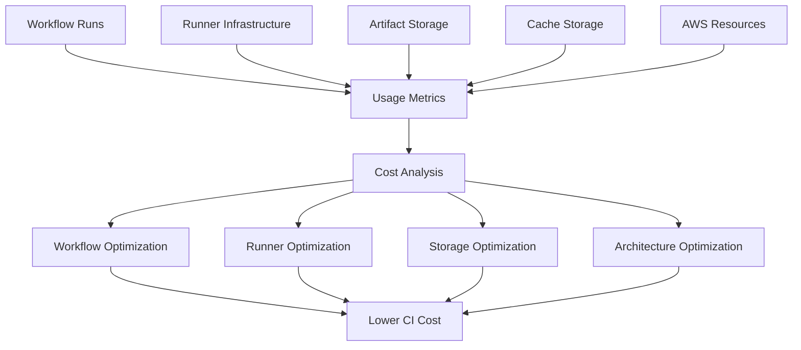

# 21- Cost Optimization

## Overview

CI/CD cost optimization is the process of reducing the compute, storage, network, and operational cost of software delivery without weakening required quality, security, reliability, or deployment confidence.

For GitHub Actions, the largest cost drivers are typically:

- Workflow execution time
- Number of workflow runs
- Runner capacity
- Matrix size
- Dependency installation
- Docker builds
- Integration and end-to-end tests
- Artifact storage
- Cache storage
- Self-hosted runner infrastructure
- Network transfer
- Idle or oversized compute resources

The objective is not simply:

```text
Spend Less
```

It is:

```text
Optimize Cost
without reducing
required engineering confidence
```

A useful model is:

```text
CI/CD Cost
├── Compute
│   ├── GitHub-hosted runners
│   └── Self-hosted runners
├── Storage
│   ├── Artifacts
│   └── Caches
├── Network
│   ├── Package downloads
│   ├── Container images
│   └── External services
├── Pipeline inefficiency
│   ├── Duplicate builds
│   ├── Unnecessary workflows
│   ├── Excessive matrices
│   └── Repeated dependency installation
└── Operational overhead
    ├── Runner management
    ├── Maintenance
    └── Monitoring
```

---

## Cost Optimization Principles

A production CI/CD system should optimize in this order:

```text
1. Remove unnecessary work
2. Avoid duplicate work
3. Parallelize valuable work
4. Cache expensive deterministic work
5. Right-size compute
6. Control storage retention
7. Optimize self-hosted infrastructure
8. Measure continuously
```

Do not start by selecting cheaper runners while allowing the pipeline to execute unnecessary jobs.

The highest-value optimization is often eliminating work entirely.

---

## Cost vs Engineering Value

Every CI/CD workload should have a reason to exist.

| Workload | Value | Typical Optimization |
|---|---|---|
| Lint | Fast feedback | Run only when relevant |
| Unit tests | High confidence | Parallelize |
| Integration tests | System confidence | Run on relevant changes |
| E2E tests | High production confidence | Selective / release / scheduled execution |
| Security scans | Risk reduction | Reuse/cache dependencies |
| Docker build | Release artifact | Build once |
| Deployment | Production delivery | Serialize |
| Nightly compatibility tests | Broad coverage | Schedule |
| Debug workflow | Investigation | Manual only |

The objective is to spend compute where it increases confidence.

---

## Measure Before Optimizing

Useful metrics include:

```text
Workflow Duration
Queue Time
Runner Utilization
Job Duration
Matrix Cardinality
Cache Hit Rate
Artifact Storage
Workflow Frequency
Docker Build Time
Dependency Installation Time
```

Example:

```text
CI workflow
  18 minutes
  12 matrix jobs
  7 minutes dependency installation
  5 minutes tests
  4 minutes Docker build
  2 minutes setup
```

The obvious optimization target is not necessarily the runner.

If dependency installation consumes 39% of the runtime, improving dependency caching may provide more value than changing runner size.

---

## Cost Attribution

A useful cost model is:

```text
Total CI Cost
=
Run Count
×
Average Execution Cost
+
Storage
+
Infrastructure
+
Network
```

For self-hosted runners:

```text
Runner Cost
=
Compute
+
Storage
+
Network
+
Operations
+
Maintenance
```

Cost should be measured by:

- Repository
- Workflow
- Team
- Environment
- Workload type
- Runner class

This allows expensive workflows to be identified rather than treating CI cost as one undifferentiated number.

---

## Workflow Frequency

Every workflow trigger creates potential cost.

Consider:

```yaml
on:
  push:
    branches:
      - main
```

versus:

```yaml
on:
  push:
    branches:
      - main
  pull_request:
```

A repository with hundreds of pull requests can generate substantially more execution than a repository with only a few changes per day.

Triggers should match the value of the validation.

---

## Path-Based Execution

For monorepositories, path filters can prevent unrelated workflows.

Example:

```yaml
on:
  pull_request:
    paths:
      - "backend/**"
      - "shared/**"
```

A frontend-only change does not necessarily need to execute backend integration tests.

However, path filters must account for shared dependencies.

Incorrect filtering can create false confidence.

---

## Change Detection

For larger monorepositories, a planning job can determine which components changed.

```text
Commit
  ↓
Change Detection
  ├── backend changed
  ├── frontend changed
  ├── infrastructure changed
  └── documentation only
          ↓
      Select Jobs
```

This is often more scalable than running every pipeline for every change.

---

## Documentation-Only Changes

Some repositories can avoid expensive CI for documentation-only changes.

Example:

```yaml
on:
  pull_request:
    paths-ignore:
      - "**/*.md"
      - "docs/**"
```

Use this only when documentation changes genuinely cannot affect the validated system.

For example, documentation that contains executable examples or infrastructure configuration may still require validation.

---

## Commit-Level Deduplication

Developers may push several commits to the same PR.

Without concurrency:

```text
Commit A → CI
Commit B → CI
Commit C → CI
Commit D → CI
```

All four may execute simultaneously.

For PR validation:

```yaml
concurrency:
  group: ci-${{ github.workflow }}-${{ github.ref }}
  cancel-in-progress: true
```

This allows obsolete runs to be cancelled.

---

## Deployment Concurrency

Production requires a different policy.

```yaml
concurrency:
  group: production-deployment
  cancel-in-progress: false
```

Cancelling an active production deployment can leave infrastructure in an uncertain state.

The cost optimization policy should therefore differ from PR CI.

---

## Matrix Cost

A matrix multiplies execution.

Example:

```yaml
strategy:
  matrix:
    python:
      - "3.11"
      - "3.12"
    database:
      - postgres
      - mysql
    os:
      - ubuntu-latest
      - windows-latest
```

Total jobs:

```text
2 × 2 × 2 = 8
```

Adding another dimension:

```text
architecture:
  - amd64
  - arm64
```

creates:

```text
2 × 2 × 2 × 2 = 16
```

Matrix growth can become exponential.

---

## Designing an Efficient Matrix

Use different test matrices for different purposes.

### Pull Request

```text
Supported Python versions
+
Primary database
```

### Nightly

```text
All supported Python versions
+
Multiple databases
+
Multiple operating systems
```

### Release

```text
Production-supported combinations
+
Full integration validation
```

This provides broad coverage without running the most expensive matrix for every commit.

---

## `max-parallel`

`max-parallel` controls concurrent matrix jobs.

Example:

```yaml
strategy:
  max-parallel: 4
  matrix:
    python-version:
      - "3.11"
      - "3.12"
```

Lower parallelism can reduce downstream resource pressure.

Higher parallelism can reduce wall-clock time.

The correct value depends on:

```text
Runner Capacity
+
Database Capacity
+
Test Duration
+
Cost
```

---

## Parallelism vs Cost

Suppose:

```text
10 jobs × 5 minutes
```

Sequential execution:

```text
50 minutes
```

Parallel execution:

```text
~5 minutes
```

But parallel execution consumes more concurrent compute.

The correct objective is not minimum wall-clock time at any cost.

It is:

```text
Acceptable Feedback Time
+
Reasonable Resource Cost
```

---

## Fail-Fast and Cost

For some matrices:

```yaml
strategy:
  fail-fast: true
```

can stop queued/in-progress matrix work after an eligible failure.

For compatibility testing:

```yaml
strategy:
  fail-fast: false
```

may be more valuable because all combinations provide diagnostic information.

Use `fail-fast` according to the purpose of the matrix.

---

## Unit Test Optimization

Unit tests are usually relatively cheap and should remain part of fast PR validation.

Optimize them through:

- Parallel execution
- Test selection
- Efficient fixtures
- Avoiding unnecessary external services
- Reusing dependencies
- Eliminating flaky retries

Do not remove important unit coverage merely to reduce CI cost.

---

## Integration Test Optimization

Integration tests are more expensive because they may require:

```text
PostgreSQL
Redis
MySQL
Kafka
Celery
External APIs
```

Use service containers only when the test requires the actual dependency behavior.

Do not start unnecessary services for every test job.

---

## Test Layering

A cost-efficient pipeline uses different test layers:

```text
Fast
 ↓
Unit Tests
 ↓
API Tests
 ↓
Integration Tests
 ↓
E2E Tests
 ↓
Production Smoke Tests
Slow
```

A large amount of basic correctness should be validated before expensive E2E execution.

---

## Test Selection

For large repositories, selective testing can reduce execution cost.

Example:

```text
Changed:
backend/orders/
```

Run:

```text
Orders unit tests
Orders integration tests
Relevant shared-library tests
```

rather than:

```text
Entire E2E suite
```

Selective testing requires dependency awareness.

---

## E2E Test Cost

E2E tests are often expensive because they may require:

```text
Application
Database
Redis
Browser
External Services
```

They can also produce large artifacts:

```text
Screenshots
Videos
Traces
Logs
```

Run the minimum E2E set necessary for each pipeline stage.

---

## E2E Strategy

A practical model:

```text
PR
→ Critical Smoke E2E

Main
→ Broader E2E

Nightly
→ Full E2E

Release
→ Production-critical E2E
```

The exact policy depends on application risk.

---

## Dependency Caching

Dependency installation can dominate CI duration.

Python:

```yaml
- name: Set up Python
  uses: actions/setup-python@v6
  with:
    python-version: "3.12"
    cache: pip
```

Caching reduces repeated downloads.

The cache should be treated as an optimization rather than a required build artifact.

---

## Cache Key Design

A useful cache key incorporates relevant dependency state.

Conceptually:

```text
OS
+
Runtime
+
Dependency Lock File
```

For example:

```yaml
key: ${{ runner.os }}-python-${{ hashFiles('**/requirements.lock') }}
```

If dependencies change, the key changes.

---

## Cache Hit Rate

Track cache behavior.

```text
100 CI runs
80 cache hits
20 cache misses
```

Cache hit rate:

```text
80%
```

A low hit rate may indicate:

- Unstable keys
- Excessive matrix dimensions
- Frequent lock-file changes
- Incorrect cache paths
- Incompatible cache sharing

---

## Cache Granularity

Avoid unnecessarily fragmented caches.

For example:

```text
Python 3.11 + PostgreSQL
Python 3.11 + MySQL
Python 3.12 + PostgreSQL
Python 3.12 + MySQL
```

may create four independent caches when the dependency layer is identical.

Cache only what actually varies.

---

## Docker Layer Caching

Docker builds can be expensive.

Buildx supports cache backends such as GitHub Actions cache.

Example:

```yaml
- name: Build image
  uses: docker/build-push-action@v6
  with:
    context: .
    push: false
    tags: example/api:${{ github.sha }}
    cache-from: type=gha
    cache-to: type=gha,mode=max
```

Effective Docker caching depends heavily on Dockerfile layer ordering.

---

## Dockerfile Layer Ordering

Prefer:

```dockerfile
COPY requirements.txt .
RUN pip install -r requirements.txt

COPY . .
```

instead of copying the entire source tree before dependency installation.

This allows dependency layers to remain cached when application source changes.

---

## `.dockerignore`

A large build context increases:

- Upload time
- Build time
- Cache invalidation
- Network usage

Example:

```text
.git
.github
.pytest_cache
__pycache__
*.pyc
.venv
.env
node_modules
```

The exact contents depend on the project.

---

## Build Once, Deploy Many

Rebuilding an image for each environment increases compute cost.

Avoid:

```text
Build → Staging
Build → Production
```

Prefer:

```text
Build
 ↓
Image
 ↓
ECR
 ├── Staging
 └── Production
```

The same image digest is promoted.

---

## Immutable Image Identity

Use:

```text
example/api:${GITHUB_SHA}
```

for traceability.

For deployment identity, prefer the immutable digest:

```text
example/api@sha256:<digest>
```

This prevents accidental deployment of a mutable tag.

---

## ECR Cost Optimization

For Amazon ECR, consider:

- Lifecycle policies
- Removing obsolete untagged images
- Appropriate retention
- Avoiding duplicate repositories
- Multi-stage images
- Smaller runtime images

Do not remove images that are still required for production rollback.

---

## Artifact Storage

Artifacts can accumulate quickly:

```text
Test Reports
Coverage
Build Outputs
Screenshots
Traces
Logs
Packages
```

Retention should reflect operational value.

Example:

```yaml
- name: Upload test report
  uses: actions/upload-artifact@v5
  with:
    name: test-report
    path: reports/
    retention-days: 14
```

Do not automatically retain every artifact for months unless there is a requirement.

---

## Artifact Retention Policy

Consider different retention periods:

| Artifact | Example Retention |
|---|---:|
| PR test report | Short |
| Nightly diagnostics | Short |
| Release artifact | Longer |
| Production deployment artifact | Based on rollback/DR needs |
| Security evidence | Based on compliance requirements |

The exact retention values should be defined by organizational requirements.

---

## Artifact Size

Large artifacts increase storage and transfer costs.

Avoid uploading unnecessary directories.

Bad:

```yaml
path: .
```

Better:

```yaml
path: |
  reports/junit.xml
  reports/coverage.xml
```

For E2E diagnostics:

```text
Upload failures
```

rather than every successful test's screenshot/video.

---

## Debug Artifacts

Debug artifacts are valuable during failure investigation but may be unnecessary for successful runs.

Example:

```yaml
- name: Upload diagnostics
  if: ${{ failure() }}
  uses: actions/upload-artifact@v5
  with:
    name: diagnostics
    path: diagnostics/
```

The exact condition should account for the desired behavior during cancellation and post-failure reporting.

---

## Artifact vs Cache

| Property | Artifact | Cache |
|---|---|---|
| Purpose | Preserve/share outputs | Speed up computation |
| Required for correctness | Often | No |
| Retention | Explicit | Optimization-oriented |
| Deployment use | Yes | No |
| Example | Docker metadata/report | pip cache |
| Missing data | Can break workflow | Usually causes slower execution |

Never make production deployment depend on a cache.

---

## Runner Selection

Runner size should match workload requirements.

Example:

```text
Small:
Lint / basic unit tests

Medium:
Integration tests

Large:
Docker builds / heavy test suites
```

Oversized runners waste capacity.

Undersized runners can increase runtime enough to cost more overall.

---

## Right-Sizing

A useful concept is:

```text
Total Cost
=
Runner Cost per Unit
×
Execution Duration
```

A more expensive runner can be cheaper overall if it reduces execution time substantially.

Example:

```text
Runner A
$0.01/min × 20 min
= $0.20

Runner B
$0.02/min × 8 min
= $0.16
```

Do not optimize based only on per-minute price.

---

## GitHub-Hosted vs Self-Hosted

| Factor | GitHub-Hosted | Self-Hosted |
|---|---|---|
| Setup | Low | Higher |
| Maintenance | Low | High |
| Customization | Limited | High |
| Private network | Limited/architecture-dependent | Strong fit |
| Fixed infrastructure | Low | Possible |
| Burst capacity | Convenient | Requires scaling |
| Idle cost | Generally avoided | Possible |

Self-hosted runners are not automatically cheaper.

---

## Self-Hosted Runner Economics

A self-hosted runner may cost money while idle.

Example:

```text
EC2 instance
+
EBS
+
NAT
+
Monitoring
+
Maintenance
```

If utilization is only:

```text
10%
```

the effective cost per CI minute may be high.

---

## Runner Utilization

Measure:

```text
Available Capacity
vs
Actual Job Runtime
```

A simple utilization model:

```text
Utilization =
Busy Time / Available Time
```

Low utilization suggests:

- Oversized runner pool
- Excessive minimum capacity
- Poor autoscaling
- Infrequent workloads

---

## Ephemeral Runners

Ephemeral runners can be provisioned for individual jobs.

```text
Job Queue
 ↓
Provision Runner
 ↓
Run Job
 ↓
Destroy Runner
```

Advantages:

- Better isolation
- Less state leakage
- Less configuration drift
- Dynamic capacity

Trade-offs:

- Provisioning latency
- Image management
- Autoscaling complexity

---

## Runner Autoscaling

Autoscaling can reduce idle capacity.

```text
Queue Length
     ↓
Capacity Controller
     ↓
Runner Provisioning
     ↓
Job Execution
     ↓
Runner Termination
```

Important parameters include:

- Minimum runners
- Maximum runners
- Scale-up threshold
- Scale-down threshold
- Cooldown
- Provisioning timeout

---

## Warm Pools

If runner startup is expensive, maintain a small warm pool.

```text
Minimum Warm Capacity
+
Burst Autoscaling
```

This balances:

```text
Low Latency
vs
Low Idle Cost
```

---

## AWS Spot Instances

Spot capacity can reduce self-hosted runner cost for interruptible workloads.

Good candidates:

```text
Unit Tests
Builds
Non-critical CI
Nightly Tests
```

Less suitable:

```text
Critical deployment control
Stateful operations
Operations requiring uninterrupted execution
```

Workflows must tolerate interruption if Spot is used.

---

## Runner Image Strategy

Use immutable or versioned runner images.

Include required tools:

```text
Python
Docker
AWS CLI
Terraform
kubectl
Testing Tools
```

Avoid manually installing tools on long-lived runners after deployment.

Image-based management improves consistency and reduces maintenance drift.

---

## Runner Software Installation

Installing dependencies on every job:

```text
Download
→ Install
→ Configure
→ Run
```

can be expensive.

A controlled runner image can preinstall stable tooling.

However, preinstalling too much increases:

- Image size
- Maintenance
- Patch complexity
- Attack surface

Install only broadly reused tooling.

---

## Package Download Optimization

For high-volume CI:

```text
GitHub Actions
 ↓
Package Cache / Proxy
 ↓
PyPI / npm / Other Registry
```

Internal dependency proxies can reduce external downloads and improve reliability.

They also provide centralized control over dependencies.

---

## Network Cost

Network-heavy pipelines may transfer:

- Docker images
- Dependency packages
- Artifacts
- Test data
- Logs
- Build contexts

Reduce unnecessary transfers through:

- Caching
- Smaller images
- `.dockerignore`
- Selective artifacts
- Local dependency mirrors
- Efficient build contexts

---

## Docker Image Size

Smaller images reduce:

```text
Build Time
Push Time
Pull Time
Storage
Deployment Time
```

Use multi-stage builds:

```dockerfile
FROM python:3.12-slim AS builder

# Build/install dependencies here.

FROM python:3.12-slim

# Copy only required runtime content.
```

Avoid carrying compilers and build tools into the production image unless required.

---

## Production Image Optimization

For Django/FastAPI services, separate:

```text
Build Dependencies
```

from:

```text
Runtime Dependencies
```

This reduces runtime image size and attack surface.

The same principle applies to Node-based frontend or backend build stages.

---

## Workflow Reuse

Reusable workflows reduce duplicated configuration.

Instead of maintaining:

```text
Repository A → 200 lines
Repository B → 200 lines
Repository C → 200 lines
```

use:

```text
Reusable CI Workflow
       ↑
 ┌─────┼─────┐
 A     B     C
```

This reduces maintenance cost and makes optimization centralized.

---

## Reusable Workflow Cost Benefits

A reusable workflow can standardize:

- Dependency caching
- Docker caching
- Test execution
- Artifact handling
- Security checks
- Runner selection

A single optimization can benefit many repositories.

---

## Composite Actions

Composite actions are useful for reusable step sequences within a job.

Examples:

```text
Setup Python
Install Dependencies
Configure Test Environment
```

They reduce duplication but do not provide the multi-job orchestration of reusable workflows.

---

## Avoid Abstraction Overhead

Not every three-step sequence needs an abstraction.

Over-abstraction can make:

```text
Debugging
Customization
Ownership
```

more difficult.

Use reusable workflows and actions when the repeated behavior has a stable interface.

---

## Workflow Architecture and Cost

A pipeline should separate expensive stages.

Example:

```text
Cheap Validation
      ↓
Medium Validation
      ↓
Expensive Build
      ↓
Deployment
```

Do not build a Docker image before basic validation if the build can be avoided.

---

## Early Failure

A cost-efficient pipeline fails early.

Example:

```text
Lint
 ↓
Unit Tests
 ↓
Integration Tests
 ↓
Docker Build
 ↓
Publish
```

If lint fails, the Docker build is unnecessary.

This saves both compute and developer feedback time.

---

## Expensive Job Gating

Example:

```yaml
jobs:
  lint:
    runs-on: ubuntu-latest
    steps:
      - uses: actions/checkout@v4
      - run: ruff check .

  build:
    needs: lint
    runs-on: ubuntu-latest
    steps:
      - uses: actions/checkout@v4
      - run: docker buildx build .
```

For larger pipelines:

```text
Lint
+
Unit Tests
+
Security
    ↓
Build
```

This prevents expensive downstream work when basic validation fails.

---

## Security Scan Cost

Security scanning should be valuable and appropriately placed.

Avoid running the same expensive scanner repeatedly at every pipeline stage without reason.

Possible strategy:

```text
PR
→ Fast dependency/static checks

Main
→ Full scan

Release
→ Final artifact/image scan
```

The exact model depends on security requirements.

---

## SBOM Cost

SBOM generation introduces additional processing but provides valuable supply-chain visibility.

Generate SBOMs as part of the artifact lifecycle when required:

```text
Build
 ↓
Image
 ↓
SBOM
 ↓
Scan
 ↓
Attestation
 ↓
Registry
```

Avoid generating unrelated SBOMs for every temporary intermediate artifact unless there is a reason to retain them.

---

## Artifact Provenance

Provenance improves traceability:

```text
Artifact
 ↓
Source Commit
 ↓
Workflow
 ↓
Builder
```

This is an operational and security investment rather than a simple compute optimization.

The correct approach is to retain the evidence required by the organization's risk and compliance model.

---

## Environment Optimization

Different environments need different pipeline depth.

Example:

```text
Development
→ Fast CI

Staging
→ Full Integration + E2E

Production
→ Approval + Deployment + Health Validation
```

Do not make every environment run the entire release pipeline if the additional validation provides no meaningful confidence.

---

## Ephemeral Environments

Ephemeral environments can provide isolated testing:

```text
PR
 ↓
Create Environment
 ↓
Test
 ↓
Destroy
```

The major cost risk is forgotten environments.

Always implement lifecycle cleanup.

---

## Preview Environment Cleanup

Track:

```text
Environment Owner
PR Number
Created At
Expiration
Resources
```

Use automatic cleanup after merge or closure.

Otherwise:

```text
100 PRs
×
Temporary Infrastructure
=
Significant Cloud Cost
```

---

## AWS Cost Controls

For AWS-backed CI/CD infrastructure consider:

- EC2 right-sizing
- Spot capacity for interruptible CI
- EBS cleanup
- ECR lifecycle policies
- S3 lifecycle policies
- NAT Gateway usage
- CloudWatch log retention
- Ephemeral environment cleanup
- Autoscaling
- Resource tagging

CI/CD infrastructure should be treated as production infrastructure.

---

## NAT Gateway Costs

Self-hosted runners in private AWS subnets may require NAT for external package registries.

Heavy CI traffic through NAT can become expensive.

Consider architecture alternatives where appropriate:

```text
VPC Endpoints
Private Package Proxies
Caching
Controlled Egress
```

The correct choice depends on security and connectivity requirements.

---

## CloudWatch Log Costs

Long-running workflows or self-hosted runners can generate substantial logs.

Control:

```text
Log Volume
Retention
Debug Logging
Application Log Verbosity
```

Do not permanently enable verbose debugging unless required.

---

## Storage Lifecycle Management

Use lifecycle policies for:

```text
ECR
S3
CloudWatch Logs
Runner Disks
Temporary Environments
```

Retention should be driven by:

```text
Operational Need
+
Rollback
+
Compliance
+
Cost
```

---

## Cost and Reliability Trade-Off

Cost optimization must not destroy reliability.

Bad optimization:

```text
Delete old Docker images
→ No rollback available
```

Better:

```text
Retain last N production releases
→ Delete obsolete non-production images
```

Another example:

```text
Disable integration tests
```

may reduce cost but increase production defect risk.

The correct question is:

```text
What confidence does this cost buy?
```

---

## Cost-Aware Pipeline Example

```yaml
name: CI

on:
  pull_request:
    paths:
      - "backend/**"
      - "shared/**"

concurrency:
  group: ci-${{ github.workflow }}-${{ github.ref }}
  cancel-in-progress: true

jobs:
  lint:
    runs-on: ubuntu-latest
    steps:
      - uses: actions/checkout@v4

      - name: Set up Python
        uses: actions/setup-python@v6
        with:
          python-version: "3.12"
          cache: pip

      - name: Install dependencies
        run: python -m pip install -r requirements-dev.txt

      - name: Lint
        run: ruff check .

  unit-tests:
    needs: lint
    runs-on: ubuntu-latest
    steps:
      - uses: actions/checkout@v4

      - name: Set up Python
        uses: actions/setup-python@v6
        with:
          python-version: "3.12"
          cache: pip

      - name: Install dependencies
        run: python -m pip install -r requirements-dev.txt

      - name: Run tests
        run: pytest tests/unit -q

  build:
    needs: unit-tests
    runs-on: ubuntu-latest
    steps:
      - uses: actions/checkout@v4

      - name: Build image
        uses: docker/build-push-action@v6
        with:
          context: .
          push: false
          tags: example/api:${{ github.sha }}
          cache-from: type=gha
          cache-to: type=gha,mode=max
```

This design controls cost through:

```text
Path Filtering
+
PR Concurrency
+
Dependency Caching
+
Early Failure
+
Build Gating
+
Docker Layer Caching
```

---

## Production Cost-Aware Pipeline

A production pipeline can use:

```text
Pull Request
   ↓
Lint
   ↓
Unit Tests
   ↓
Integration Tests
   ↓
Security
   ↓
Build Once
   ↓
Immutable Image
   ↓
ECR
   ↓
Staging
   ↓
Health Validation
   ↓
Approval
   ↓
Production
   ↓
Monitoring
```

Expensive stages are executed only after lower-cost validation succeeds.

---

## Cost Optimization for Python Backends

For Django/FastAPI projects:

```text
Cache pip/uv dependencies
+
Use locked dependencies
+
Run unit tests first
+
Use service containers only when required
+
Use selective integration tests
+
Cache Docker layers
+
Build once
```

For example:

```text
Python dependency installation
7 min
↓
Cache
↓
1 min
```

This can significantly reduce total CI time across many workflows.

---

## Cost Optimization for Celery

Celery integration tests may require Redis or another broker.

Do not start worker processes for unit tests that do not exercise asynchronous execution.

Use:

```text
Unit tests
→ Mock task boundaries

Integration tests
→ Real broker + worker where required
```

This keeps expensive infrastructure out of tests that do not need it.

---

## Cost Optimization for Kafka

Kafka-based integration tests can be expensive.

Use layered validation:

```text
Unit
→ Event Serialization

Integration
→ Broker Interaction

E2E
→ Full Consumer/Producer Flow
```

Do not launch a full Kafka environment for every unit test job.

---

## Cost Optimization for Microservices

For a microservice repository:

```text
Change Detection
      ↓
Affected Services
      ↓
Service-Specific CI
      ↓
Shared Dependency Validation
```

This avoids rebuilding and retesting unaffected services.

However, shared libraries and cross-service contracts must still be validated.

---

## Contract Testing

Contract testing can reduce expensive E2E combinations.

Instead of testing every:

```text
Service A
×
Service B
×
Service C
```

combination end-to-end, validate service contracts independently.

This can provide useful compatibility confidence at lower runtime cost.

---

## Cost Optimization for gRPC

For gRPC services:

```text
Proto Change
 ↓
Generate Code
 ↓
Compile
 ↓
Contract Tests
 ↓
Integration Tests
```

Run expensive full-system tests only when the relevant service or contract changes.

---

## Cost Optimization for Nginx

If Nginx is only needed for routing behavior, do not include it in every unit test.

Use it for:

```text
Integration
E2E
Reverse Proxy Validation
```

Unit tests should generally exercise application behavior directly.

---

## Reliability Before Optimization

Do not optimize a broken pipeline.

The correct sequence is:

```text
Correct
 ↓
Reliable
 ↓
Observable
 ↓
Measure
 ↓
Optimize
```

An unreliable workflow can produce misleading cost metrics because retries and reruns inflate execution.

---

## Reruns and Hidden Cost

Frequent reruns can multiply cost.

Example:

```text
100 workflows
×
1.5 average runs
=
150 executions
```

If reruns are caused by flaky tests, the true cost includes both:

```text
Compute
+
Developer Time
```

Reducing flakiness can be a better cost optimization than reducing runner size.

---

## Developer Time as a Cost

CI cost is not only infrastructure cost.

Consider:

```text
Pipeline Duration
+
Developer Waiting Time
+
Debugging Time
+
Rerun Time
```

A pipeline that costs slightly more but reduces developer waiting by several minutes may produce lower total engineering cost.

---

## Cost Optimization and Developer Experience

Optimize:

```text
Fast PR Feedback
+
Reliable Results
+
Predictable Runtime
```

Avoid:

```text
Cheap but unreliable CI
```

because developers may compensate with:

```text
Manual Testing
Local Workarounds
Repeated Reruns
Skipped Checks
```

which increases organizational cost.

---

## Common Cost Optimization Mistakes

### Running Every Test on Every Commit

Problem:

```text
Unnecessary compute
```

Use appropriate triggers and test layering.

### Excessive Matrix Dimensions

Problem:

```text
Combinatorial growth
```

Separate PR, nightly, and release matrices.

### No Dependency Cache

Problem:

```text
Repeated downloads
```

Use stable cache keys.

### No Docker Cache

Problem:

```text
Repeated image rebuilds
```

Use BuildKit/Buildx caching.

### Rebuilding for Each Environment

Problem:

```text
Extra compute
+
Artifact inconsistency
```

Build once and promote.

### Over-Sized Runners

Problem:

```text
Paying for unused capacity
```

Right-size based on actual workload.

### Under-Sized Runners

Problem:

```text
Longer execution
```

The cheapest runner per minute is not always the cheapest runner per job.

### Excessive Artifact Retention

Problem:

```text
Storage growth
```

Use purpose-based retention.

### Permanent Debug Logging

Problem:

```text
Noise
+
Storage
+
Potential information exposure
```

Enable detailed diagnostics temporarily.

### Ignoring Self-Hosted Idle Time

Problem:

```text
EC2 / infrastructure costs continue
while no jobs run
```

Use autoscaling or right-sized capacity.

---

## Cost Optimization Checklist

### Workflow

- [ ] Unnecessary triggers are removed.
- [ ] Path filters are used where safe.
- [ ] Obsolete PR runs are cancelled.
- [ ] Expensive jobs are gated behind cheap validation.
- [ ] Matrix dimensions are justified.

### Dependencies

- [ ] Dependencies are cached.
- [ ] Cache keys are stable.
- [ ] Docker layers are cached.
- [ ] Build contexts are small.
- [ ] Dependency downloads are minimized.

### Runners

- [ ] Runner sizes are measured.
- [ ] Self-hosted utilization is tracked.
- [ ] Idle capacity is controlled.
- [ ] Autoscaling is considered for burst workloads.
- [ ] Ephemeral runners are used where appropriate.

### Storage

- [ ] Artifact retention is defined.
- [ ] Debug artifacts are limited.
- [ ] ECR lifecycle policies exist.
- [ ] Cloud logs have appropriate retention.
- [ ] Temporary environments are cleaned up.

### Testing

- [ ] Unit tests run early.
- [ ] Integration tests run where required.
- [ ] E2E tests are appropriately scoped.
- [ ] Matrix coverage matches risk.
- [ ] Flaky tests are addressed.

### Deployment

- [ ] Images are built once.
- [ ] Immutable artifacts are promoted.
- [ ] Production deployments are serialized.
- [ ] Rollback artifacts are retained.
- [ ] Deployment health validation remains enabled.

---

## Cost Monitoring Architecture



The important point is to optimize from measured usage rather than assumptions.

---

## Senior-Level Cost Decisions

### When should a team use self-hosted runners?

Consider them when there is a strong requirement for:

- Private network access
- Specialized hardware
- Custom software
- High sustained utilization
- Controlled execution environments

Do not choose them solely because the per-minute compute price appears lower.

### When should a matrix be reduced?

Reduce it when:

```text
The additional combination provides little confidence
```

Keep it when:

```text
The combination represents a supported production configuration
```

### When should E2E tests be moved out of PR workflows?

Consider moving expensive suites to:

```text
Main
Nightly
Release
```

when the PR feedback cost is high and a smaller smoke suite provides sufficient early confidence.

### When should caching be introduced?

When:

```text
Work Is Deterministic
+
Work Is Expensive
+
Cache Invalidation Can Be Defined Safely
```

### When is a more expensive runner cheaper?

When its additional capacity significantly reduces execution time.

---

## Interview Scenarios

### A GitHub Actions pipeline is taking 30 minutes. How would you reduce the cost?

Start by measuring:

```text
Queue
→ Setup
→ Dependencies
→ Tests
→ Docker
→ Uploads
```

Then identify the dominant cost before optimizing.

Potential changes:

```text
Caching
+
Parallelism
+
Test Layering
+
Matrix Reduction
+
Docker Layer Cache
+
Runner Right-Sizing
```

### A matrix has 24 jobs. How would you decide whether to reduce it?

Determine:

```text
Which dimensions represent supported configurations?
Which combinations are production-relevant?
Which are already covered elsewhere?
Which combinations run nightly instead?
```

Do not reduce coverage solely because the matrix is expensive.

### Your self-hosted runners are cheaper per minute than GitHub-hosted runners. Should you migrate everything?

Not automatically.

Compare:

```text
Compute
+
Idle Capacity
+
Storage
+
Network
+
Maintenance
+
Security
+
Autoscaling
+
Operational Staff Time
```

The total cost of ownership matters.

### Docker builds are consuming most CI time. What would you inspect?

Inspect:

```text
Dockerfile Layer Ordering
.dockerignore
Build Context
Dependency Installation
Base Image
Buildx Cache
Runner CPU
Registry Transfer
```

### Artifact storage is growing rapidly. What would you do?

Classify artifacts:

```text
PR
Nightly
Release
Production
Debug
```

Then define retention based on operational value.

Do not delete artifacts required for rollback or compliance.

### Developers frequently rerun failed workflows. Is reducing runner cost the first optimization?

No. First determine why reruns happen.

If the cause is flaky tests or nondeterministic infrastructure, fixing the underlying reliability problem can reduce both compute usage and developer time.

---

## Production Cost Optimization Strategy

A mature CI/CD platform can use:

```text
                Pull Request
                     │
          ┌──────────┼──────────┐
          ▼          ▼          ▼
        Lint       Unit       Security
          │          │          │
          └──────────┼──────────┘
                     ▼
               Integration
                     │
                     ▼
                  Build
                     │
                Docker Cache
                     │
                     ▼
                   ECR
                     │
                     ▼
                 Staging
                     │
              Health Validation
                     │
                     ▼
                 Approval
                     │
                     ▼
                Production
```

Cost controls exist at every layer:

```text
Trigger Filtering
→ Test Layering
→ Caching
→ Matrix Control
→ Build Once
→ Artifact Retention
→ Runner Right-Sizing
→ Autoscaling
→ Resource Lifecycle
```

---

## Cost Optimization Governance

Organizations should define standards for:

- Maximum artifact retention
- Cache policies
- Runner classes
- Matrix justification
- Self-hosted runner utilization
- ECR lifecycle policies
- Temporary environment expiration
- Debug logging
- Workflow ownership
- Cost attribution

Teams should be able to understand why their pipelines consume resources.

---

## Cost Review Cadence

Review CI/CD cost periodically.

Analyze:

```text
Top Workflows
Top Repositories
Top Runner Pools
Top Artifact Consumers
Top Docker Builds
Lowest Cache Hit Rates
Longest Jobs
Highest Rerun Rates
```

A workflow that was efficient six months ago may become expensive as the repository grows.

---

## Cost Optimization Lifecycle

```text
Measure
  ↓
Identify
  ↓
Prioritize
  ↓
Optimize
  ↓
Validate
  ↓
Monitor
  ↓
Repeat
```

Optimization is continuous because:

```text
Codebase Changes
+
Team Growth
+
Test Growth
+
Infrastructure Growth
=
Changing CI/CD Economics
```

## Key Takeaways

- Optimize CI/CD by **removing unnecessary work first**, then improving caching, parallelism, runner sizing, storage, and infrastructure efficiency.
- Treat **matrix size, workflow frequency, dependency installation, Docker builds, artifacts, and self-hosted idle capacity** as measurable cost drivers.
- Preserve engineering confidence: **do not remove critical tests, rollback artifacts, health validation, or security controls merely to reduce spend**.
- Build once and promote immutable artifacts, while using **dependency caching, Docker layer caching, selective testing, path filtering, and concurrency control** to reduce repeated work.
- Senior cost optimization balances **infrastructure cost, developer time, reliability, security, scalability, and operational complexity** rather than optimizing compute price alone.