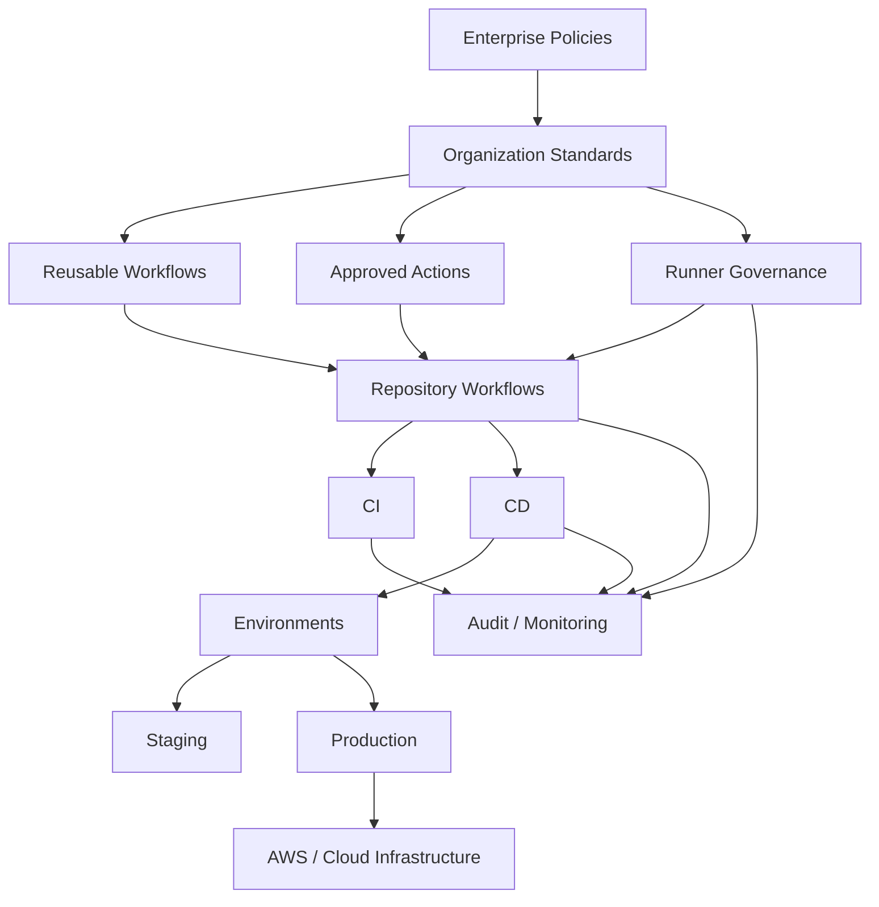
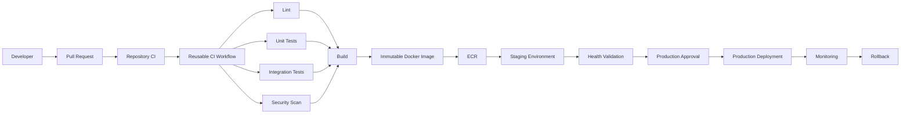
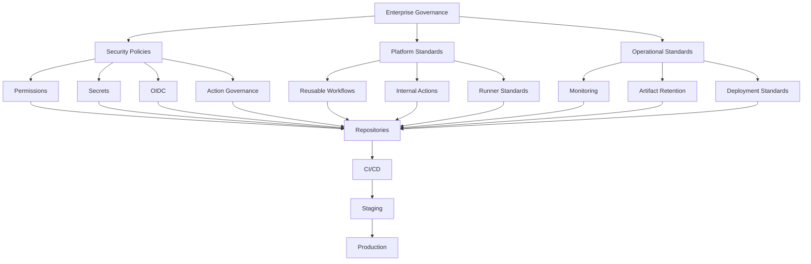

# 22- Enterprise Governance

## Overview

Enterprise governance for GitHub Actions is the set of policies, controls, ownership models, and operational standards used to manage CI/CD consistently across repositories, teams, and environments.

At small scale, a repository can manage its own workflows. At enterprise scale, unrestricted autonomy creates problems:

```text
Repository A → Different security model
Repository B → Different runner model
Repository C → Different deployment controls
Repository D → Different action versions
Repository E → Excessive permissions
```

Enterprise governance establishes common boundaries without forcing every repository into an identical pipeline.

A practical governance model separates:

```text
Enterprise Policies
       ↓
Organization Standards
       ↓
Reusable Workflows / Actions
       ↓
Repository Workflows
       ↓
Application-Specific Configuration
```

The goal is controlled standardization:

```text
Centralized Guardrails
+
Team-Level Flexibility
=
Scalable CI/CD Governance
```

---

## Why Enterprise Governance Matters

Without governance, GitHub Actions can become a distributed execution platform with inconsistent security and operational behavior.

Common enterprise problems include:

- Long-lived cloud credentials
- Excessive `GITHUB_TOKEN` permissions
- Unapproved third-party actions
- Mutable action references
- Persistent self-hosted runners
- Uncontrolled production deployments
- Inconsistent artifact retention
- Duplicate CI implementations
- Unowned workflows
- Excessive workflow execution
- Inconsistent runner configurations
- Secrets distributed across repositories
- No standard rollback process
- Poor auditability

Governance addresses these problems through policy, architecture, automation, and ownership.

---

## Governance Layers

A mature organization can model governance across several layers.

| Layer | Primary Responsibility |
|---|---|
| Enterprise | Global security and compliance boundaries |
| Organization | Shared standards and platform controls |
| Repository | Application-specific workflow behavior |
| Environment | Deployment protection and runtime configuration |
| Runner | Execution isolation and infrastructure |
| Action | Reusable automation components |
| Workflow | CI/CD orchestration |
| Team | Ownership and operational responsibility |

A central platform team should govern the boundaries while application teams retain ownership of their delivery logic.

---

## Enterprise Governance Architecture



Governance should be implemented as a platform rather than as documentation alone.

---

## Governance Principles

### Least Privilege

Every workflow should receive only the permissions it requires.

Example:

```yaml
permissions:
  contents: read
```

A deployment job may require additional permissions:

```yaml
permissions:
  contents: read
  id-token: write
```

Avoid:

```yaml
permissions: write-all
```

unless there is a documented and justified requirement.

---

### Standardization Without Over-Centralization

Centralize:

- Security controls
- Authentication patterns
- Approved actions
- Runner standards
- Deployment guardrails
- Artifact policies
- Audit requirements

Allow repositories to control:

- Application test commands
- Framework-specific configuration
- Service-specific deployment parameters
- Repository-specific matrices
- Application-specific validation

The platform should define the interface rather than every implementation detail.

---

## Enterprise vs Organization Governance

Organizations may operate multiple GitHub organizations.

For example:

```text
Enterprise
├── Engineering Organization
├── Data Organization
├── Platform Organization
└── Research Organization
```

Enterprise-level policies provide global boundaries.

Organization-level policies provide implementation standards within a specific organizational boundary.

---

## Enterprise Policies

Typical enterprise-level controls include:

- Allowed GitHub Actions
- Repository policies
- Workflow restrictions
- Runner policies
- Authentication requirements
- Security standards
- Audit requirements
- Marketplace restrictions
- Deployment controls

Policies should be enforceable where possible.

A written rule that can be bypassed by changing YAML is not a strong security control.

---

## Organization Standards

Organizations can define standards such as:

```text
Every repository must:
- Use approved CI workflows
- Use least-privilege permissions
- Avoid long-lived AWS credentials
- Pin critical third-party actions
- Use approved runner groups
- Protect production environments
- Retain required deployment evidence
```

These standards should ideally be implemented through reusable workflows, policy checks, repository rules, or automated auditing.

---

## Central Platform Team

A platform team commonly owns:

- Reusable workflows
- Internal actions
- Runner infrastructure
- AWS authentication patterns
- Deployment tooling
- Security standards
- CI/CD observability
- Governance automation
- Documentation
- Migration tooling

Application teams remain responsible for:

- Application tests
- Application configuration
- Service-specific deployment logic
- Production readiness
- Incident response for their services

---

## Ownership Model

Every workflow should have an identifiable owner.

Example:

| Resource | Owner |
|---|---|
| Reusable CI workflow | Platform Team |
| Django repository workflow | Backend Team |
| Production deployment workflow | Service Owner + Platform |
| Self-hosted runner platform | Platform Team |
| AWS deployment role | Cloud Platform |
| Security scanning policy | Security Team |

Use CODEOWNERS and repository ownership conventions to make responsibility explicit.

---

## Workflow Ownership

An enterprise should avoid workflows that nobody understands.

A useful metadata model is:

```text
Workflow
├── Owner
├── Repository
├── Purpose
├── Environments
├── Runner Class
├── AWS Roles
├── Required Secrets
├── Dependencies
└── Support Contact
```

This makes operational ownership discoverable.

---

## Reusable Workflows as Governance Boundaries

Reusable workflows are one of the strongest mechanisms for centralized CI/CD standards.

Example:

```yaml
jobs:
  ci:
    uses: company/platform-workflows/.github/workflows/python-ci.yml@v3
    with:
      python-version: "3.12"
```

The central workflow can enforce:

```text
Lint
+
Testing
+
Security Scanning
+
Artifact Handling
```

while allowing controlled inputs.

---

## Why Reusable Workflows Matter

Without reuse:

```text
Repository A → Custom CI
Repository B → Custom CI
Repository C → Custom CI
```

Every repository can drift.

With reusable workflows:

```text
                 Platform CI
                 /    |    \
                /     |     \
              Repo A Repo B Repo C
```

Security and operational improvements can be introduced centrally.

---

## Reusable Workflow vs Composite Action

| Capability | Reusable Workflow | Composite Action |
|---|---|---|
| Multiple jobs | Yes | No |
| Job orchestration | Yes | No |
| Matrix strategy | Yes | Within calling job |
| Environments | Yes | No direct job orchestration |
| Deployment pipeline | Strong fit | Usually not |
| Reusable steps | Possible | Primary purpose |
| Governance boundary | Strong | Moderate |

A reusable workflow is generally the stronger enterprise governance boundary for CI/CD pipelines.

---

## Workflow Versioning

Central workflows should be versioned.

Example:

```yaml
uses: company/platform-workflows/.github/workflows/python-ci.yml@v3
```

Avoid silently changing behavior for every consumer without a migration strategy.

A mature lifecycle is:

```text
v2
 ↓
v3
 ↓
Migration Period
 ↓
v2 Deprecation
 ↓
v2 Removal
```

---

## Breaking Changes

Treat reusable workflows as APIs.

Breaking changes can include:

- Removing inputs
- Renaming inputs
- Changing output semantics
- Changing required permissions
- Changing runner requirements
- Changing artifact names
- Changing deployment behavior

Use versioning and migration documentation.

---

## Approved Actions

Organizations may maintain an approved action policy.

Conceptually:

```text
Approved
├── Official GitHub actions
├── Internal actions
├── Reviewed third-party actions
└── Security-approved external actions
```

Unapproved actions should be blocked or detected.

---

## Third-Party Action Governance

Third-party actions execute code inside your CI environment.

They can potentially access:

- Repository contents
- `GITHUB_TOKEN`
- Secrets available to the job
- Filesystem contents
- Network resources
- Cloud credentials
- Docker credentials

Therefore:

```text
Action Selection
=
Supply Chain Decision
```

---

## Action Pinning

Prefer immutable references for security-sensitive workflows.

Example:

```yaml
- uses: actions/checkout@<verified-commit-sha>
```

A major-version tag is easier to maintain:

```yaml
- uses: actions/checkout@v4
```

but a commit SHA provides stronger immutability.

Enterprise policy should define where SHA pinning is mandatory.

---

## Action Allowlisting

An organization may restrict actions to approved sources.

Conceptually:

```text
Allowed:
github.com/actions/*
github.com/company/*
approved third-party repositories

Blocked:
Unknown actions
Unreviewed repositories
Untrusted forks
```

The exact policy should match organizational risk.

---

## Internal Actions

Internal actions are useful for common engineering operations.

Examples:

```text
company/setup-python
company/security-scan
company/docker-build
company/aws-auth
company/deploy-service
```

They provide:

- Standardization
- Central maintenance
- Consistent security
- Reduced duplication

They also create platform dependencies, so ownership and versioning are important.

---

## Action Governance Lifecycle

```text
Request
 ↓
Security Review
 ↓
Technical Review
 ↓
Approval
 ↓
Version
 ↓
Publish
 ↓
Monitor
 ↓
Update
 ↓
Deprecate
```

Do not allow internal actions to become abandoned infrastructure.

---

## GITHUB_TOKEN Governance

A repository should not assume that every workflow needs broad token permissions.

Prefer:

```yaml
permissions:
  contents: read
```

Then grant additional permissions only where needed.

Example:

```yaml
jobs:
  release:
    permissions:
      contents: write
```

This limits the blast radius of compromised workflow code.

---

## Job-Level Permissions

Separate privileges between jobs.

Example:

```yaml
jobs:
  test:
    permissions:
      contents: read

  deploy:
    permissions:
      contents: read
      id-token: write
```

The deployment job has greater privilege than the test job.

This creates privilege boundaries inside the pipeline.

---

## OIDC Governance

AWS authentication should preferably use short-lived OIDC credentials rather than long-lived AWS access keys stored as GitHub secrets.

Architecture:

```text
GitHub Actions
      │
      │ OIDC Token
      ▼
AWS STS
      │
      │ AssumeRole
      ▼
IAM Role
      │
      ▼
AWS Resources
```

The trust policy should restrict the GitHub identity to the intended repository, branch, tag, or environment.

---

## AWS Role Separation

Avoid one universal deployment role.

Prefer:

```text
CI Role
Staging Role
Production Role
Infrastructure Role
```

Each role should have the minimum permissions required.

For example:

```text
CI
→ ECR Push

Staging
→ ECS UpdateService

Production
→ Production ECS Resources
```

This limits the blast radius of a compromised workflow.

---

## Environment Governance

Use GitHub Environments for deployment boundaries.

Typical environments:

```text
development
staging
production
```

Production may require:

- Required reviewers
- Branch restrictions
- Environment secrets
- Deployment protection
- Deployment history

---

## Production Approval

A production workflow can require explicit approval before deployment.

Conceptually:

```text
Build
 ↓
Security Validation
 ↓
Staging
 ↓
Health Check
 ↓
Production Approval
 ↓
Production
```

Approval should protect the deployment boundary rather than compensate for weak CI.

---

## Environment Separation

Use separate credentials and cloud boundaries where appropriate.

Example:

```text
staging
→ AWS Account A
→ Staging IAM Role
→ Staging ECR

production
→ AWS Account B
→ Production IAM Role
→ Production ECR
```

Account separation can significantly reduce blast radius.

---

## Repository Governance

Repositories should follow standard conventions.

Example:

```text
.github/
├── workflows/
│   ├── ci.yml
│   └── cd.yml
└── dependabot.yml
```

Organizations may also require:

```text
CODEOWNERS
Security Policy
Required Status Checks
Branch Protection
Standard README
```

---

## Branch Protection

Production code should be protected through repository controls.

Typical requirements:

- Pull request review
- Required status checks
- Restricted direct pushes
- Required code owners
- Protected release branches
- Controlled bypass permissions

CI governance and Git governance should work together.

---

## Required Status Checks

Important CI workflows should become required checks where appropriate.

Example:

```text
Pull Request
   ↓
CI
├── Lint
├── Unit
├── Integration
└── Security
   ↓
Required Checks
   ↓
Merge
```

Do not make unstable or irrelevant checks mandatory.

---

## Repository Onboarding

A new repository should follow a predictable onboarding process.

```text
Create Repository
 ↓
Apply Organization Policies
 ↓
Configure CODEOWNERS
 ↓
Configure Branch Protection
 ↓
Adopt Standard CI
 ↓
Configure Environments
 ↓
Configure AWS OIDC
 ↓
Configure Deployment
 ↓
Enable Monitoring
```

Automation should perform as much of this process as possible.

---

## Enterprise Repository Template

A repository template can provide:

```text
.github/
├── workflows/
├── CODEOWNERS
└── dependabot.yml

Dockerfile
README.md
pyproject.toml
```

Templates reduce initial setup time but should not become the only governance mechanism.

Repositories evolve after creation.

---

## Repository Drift

Over time repositories can diverge from standards.

Examples:

```text
Old action versions
Old runner labels
Missing permissions
Missing security scans
Custom deployment logic
Expired dependencies
```

Governance should continuously detect drift.

---

## Drift Detection

A governance workflow can inspect repositories for:

```text
Action versions
Workflow permissions
Runner usage
Environment configuration
Required workflows
Secret usage
Deployment controls
Artifact retention
```

Results can be reported centrally.

---

## Enterprise Compliance Dashboard

A platform can aggregate:

```text
Repository
Workflow
Security Status
Runner
Deployment
Action Versions
Policy Violations
```

Example:

| Repository | CI Standard | Security | OIDC | Production Protection |
|---|---|---|---|---|
| service-a | Compliant | Compliant | Yes | Yes |
| service-b | Drift | Warning | Yes | Yes |
| service-c | Compliant | Compliant | No | No |

The purpose is visibility and remediation, not merely reporting.

---

## Governance as Code

Where possible, express policies as code.

Examples:

```text
Allowed Actions
Required Permissions
Runner Policies
Deployment Rules
Repository Standards
Infrastructure Policies
```

Benefits:

- Version control
- Review
- Reproducibility
- Automated enforcement
- Auditability

---

## Policy Enforcement

There are several enforcement levels.

| Level | Example | Strength |
|---|---|---|
| Documentation | Security guideline | Low |
| Review | Human review | Medium |
| Detection | Compliance scanner | Medium |
| Automation | Auto-remediation | High |
| Platform Policy | Hard restriction | Highest |

Use stronger enforcement for high-risk controls.

---

## Guardrails vs Hard Blocks

Not every violation should block development.

Example:

```text
Missing README
→ Warning

Unapproved production deployment
→ Block

Broad cloud credentials
→ Block

Old non-critical action
→ Warning + migration deadline
```

Risk-based enforcement reduces unnecessary friction.

---

## Exception Management

Enterprises inevitably need exceptions.

An exception should include:

```text
Repository
Control
Reason
Risk
Owner
Approver
Expiration
Compensating Control
```

Avoid permanent exceptions.

Example:

```text
Exception:
Legacy Windows build runner

Reason:
Vendor dependency

Owner:
Team A

Expires:
2027-03-31

Compensating Control:
Isolated runner group
```

---

## Exception Lifecycle

```text
Request
 ↓
Risk Assessment
 ↓
Approval
 ↓
Time-Bounded Exception
 ↓
Monitoring
 ↓
Remediation
 ↓
Expiration
```

Exceptions should be visible in governance reporting.

---

## Runner Governance

Runner infrastructure is part of the enterprise security boundary.

Govern:

- Registration
- Runner groups
- Labels
- Access
- Network connectivity
- Images
- Software versions
- Patching
- Lifecycle
- Autoscaling
- Isolation

---

## Runner Groups

Use runner groups to separate workloads.

Example:

```text
Runner Groups
├── Public CI
├── Private Integration
├── Production Deployment
└── Specialized Builds
```

Production deployment runners should not automatically execute arbitrary pull request code.

---

## Persistent vs Ephemeral Runners

| Type | Governance Consideration |
|---|---|
| Persistent | State leakage and drift |
| Ephemeral | Better isolation |
| Autoscaled | Dynamic capacity |
| Dedicated | Strong workload separation |

For sensitive workloads, ephemeral execution provides stronger isolation.

---

## Private Network Governance

Self-hosted runners may access:

```text
Private PostgreSQL
Private Redis
Internal APIs
Kafka
Internal Package Registry
AWS Private Resources
```

This increases the impact of compromised workflow code.

Use:

- Runner groups
- Network segmentation
- Least privilege
- Egress controls
- Ephemeral runners
- Environment separation

---

## Production Deployment Runners

Production deployment should have a distinct trust boundary.

```text
PR Runner
   X
   │
   │ no direct production access
   ▼
Production Deployment Runner
   │
   ▼
AWS Production
```

This prevents ordinary CI workloads from automatically inheriting production access.

---

## Secrets Governance

Centralized governance should define:

- Secret naming
- Scope
- Rotation
- Ownership
- Access
- Environment boundaries
- Audit requirements
- Migration to external secret stores

Avoid using organization-wide secrets when repository or environment scope is sufficient.

---

## Secret Scope

Prefer:

```text
Production Secret
→ Production Environment
→ Production Deployment Job
```

instead of:

```text
Organization Secret
→ Every Repository
→ Every Workflow
```

Smaller scope reduces blast radius.

---

## Secret Rotation

Secrets should have an ownership and rotation process.

Example:

```text
Secret
 ↓
Owner
 ↓
Rotation Schedule
 ↓
Validation
 ↓
Old Credential Revoked
```

OIDC can remove the need for many long-lived cloud credentials entirely.

---

## Variable Governance

Variables are not equivalent to secrets.

Use variables for:

```text
Configuration
Feature Settings
Environment Metadata
Non-sensitive Values
```

Use secrets for:

```text
Credentials
Tokens
Private Keys
Sensitive Configuration
```

Do not place secrets into ordinary repository variables.

---

## Artifact Governance

Artifacts should have defined:

- Ownership
- Naming
- Retention
- Integrity
- Promotion model
- Access
- Audit requirements

For production deployments:

```text
Build
 ↓
Immutable Artifact
 ↓
Registry
 ↓
Promotion
```

Avoid rebuilding separately for each environment.

---

## Artifact Integrity

Production artifacts should be traceable to:

```text
Source Commit
+
Workflow Run
+
Build Identity
+
Artifact Digest
```

For containerized applications:

```text
Git SHA
 ↓
Docker Image
 ↓
Digest
 ↓
ECR
 ↓
Production
```

---

## SBOM and Provenance Governance

Enterprise supply-chain standards may require:

- SBOM generation
- Dependency scanning
- Artifact provenance
- Attestations
- Artifact signing
- Verification before deployment

The objective is to answer:

```text
What is this artifact?
Where did it come from?
How was it built?
Which source produced it?
Can we verify its integrity?
```

---

## Dependency Governance

Python repositories should standardize dependency practices.

Examples:

```text
requirements.lock
pyproject.toml
Dependency Review
Dependabot
Security Scanning
```

Do not allow uncontrolled dependency installation in production builds.

---

## Docker Base Image Governance

Organizations may maintain approved base images.

Example:

```text
company/python-runtime:3.12
company/python-runtime:3.12-slim
```

Benefits:

- Security patching
- Standard configuration
- Reduced build duplication
- Consistent runtime behavior

However, centralized images introduce dependency on the platform team and require controlled update policies.

---

## Build Reproducibility

Enterprise pipelines should aim for deterministic builds.

Control:

```text
Source
Dependencies
Base Images
Build Tools
Action Versions
Environment
```

A reproducible build makes incident investigation and rollback easier.

---

## Deployment Governance

Production deployment should have explicit controls.

A typical model:

```text
Pull Request
 ↓
CI
 ↓
Build
 ↓
Security
 ↓
Immutable Artifact
 ↓
Staging
 ↓
Validation
 ↓
Approval
 ↓
Production
```

---

## Deployment Strategies

Governance should support approved strategies:

| Strategy | Typical Use |
|---|---|
| Rolling | Standard service updates |
| Blue/Green | Fast traffic switching |
| Canary | Progressive risk exposure |
| Zero Downtime | Availability-sensitive systems |

Teams can select the strategy based on application requirements while respecting common controls.

---

## Deployment Concurrency

Production deployments should prevent race conditions.

Example:

```yaml
concurrency:
  group: production-api
  cancel-in-progress: false
```

This prevents two production deployments from modifying the same service simultaneously.

---

## Rollback Governance

Every production deployment should have a defined rollback path.

For immutable Docker deployments:

```text
Current
→ image@sha256:A

Previous
→ image@sha256:B
```

Rollback:

```text
A
↓
B
```

Rollback should not require rebuilding the old application.

---

## Database Migration Governance

Database changes require additional controls.

For Django/PostgreSQL:

```text
Application Release
+
Migration
```

should support backward compatibility during rolling deployment.

Prefer:

```text
Expand
 ↓
Deploy Compatible Code
 ↓
Migrate Data
 ↓
Contract
```

Avoid migrations that require all application instances to stop simultaneously unless explicitly designed for that behavior.

---

## Infrastructure Governance

Terraform and CloudFormation workflows should be governed separately from application deployment where appropriate.

Example:

```text
Infrastructure Pipeline
→ VPC
→ IAM
→ ECR
→ ECS

Application Pipeline
→ Build
→ Test
→ Image
→ Deploy
```

Separating infrastructure and application lifecycle reduces accidental privilege escalation.

---

## Terraform Governance

Enterprise Terraform pipelines may require:

```text
fmt
→ validate
→ plan
→ policy checks
→ approval
→ apply
```

Production apply should use the reviewed plan rather than generating an unrelated plan during deployment.

---

## CloudFormation Governance

CloudFormation pipelines should use:

```text
Validate
→ Change Set
→ Review
→ Execute
```

Controls can include:

- Stack ownership
- Account restrictions
- IAM capability controls
- Change review
- Drift detection
- Rollback configuration

---

## AWS Account Governance

Large organizations commonly separate workloads across accounts.

Example:

```text
AWS Organization
├── Shared Services
├── Development
├── Staging
├── Production
└── Security
```

GitHub Actions should assume environment-specific roles rather than holding broad credentials.

---

## Production Access Model

A strong model is:

```text
GitHub Repository
       │
       ▼
GitHub Environment
       │
       ▼
OIDC
       │
       ▼
AWS STS
       │
       ▼
Environment IAM Role
       │
       ▼
Environment Resources
```

This creates multiple independent controls.

---

## Security Governance

Enterprise GitHub Actions security should cover:

```text
Workflow
├── Permissions
├── Secrets
├── Untrusted Input
├── Actions
├── Dependencies
├── Runner
├── Network
├── Artifact
└── Cloud Credentials
```

Security cannot be delegated to a single security scanning job.

---

## `pull_request` Governance

Pull request workflows execute code associated with proposed changes.

Treat repository code as potentially untrusted.

Avoid exposing privileged credentials to arbitrary PR execution.

---

## `pull_request_target` Governance

`pull_request_target` executes in the context of the base repository.

It therefore requires particular caution.

A dangerous pattern is:

```text
pull_request_target
+
checkout PR code
+
execute PR-controlled scripts
+
secrets
```

This can cross the intended trust boundary.

Use it only when the workflow architecture explicitly requires its privilege model.

---

## Untrusted Input Governance

Potentially attacker-controlled values include:

```text
PR Title
Branch Name
Commit Message
Issue Content
Workflow Inputs
External API Data
```

Avoid:

```yaml
run: echo "${{ github.event.pull_request.title }}"
```

when the value can influence shell parsing.

Safer:

```yaml
env:
  PR_TITLE: ${{ github.event.pull_request.title }}

steps:
  - name: Process title
    run: |
      printf '%s\n' "$PR_TITLE"
```

---

## Shell Injection Governance

Enterprise standards should prohibit unsafe patterns such as:

```bash
eval "$INPUT"
```

or:

```bash
sh -c "$UNTRUSTED_VALUE"
```

Prefer:

```text
Explicit Arguments
+
Allow Lists
+
Environment Variables
+
Safe Quoting
```

---

## Governance for Custom Actions

Internal custom actions should have:

- Owner
- Documentation
- Version
- Tests
- Security review
- Release process
- Dependency management
- Deprecation policy

Actions should not become undocumented shell scripts hidden behind a repository interface.

---

## Custom Action Dependencies

JavaScript actions may depend on npm packages.

Govern:

```text
package-lock.json
Dependency Updates
Security Scanning
Build Output
Node Runtime
Release Process
```

Docker actions require similar controls for:

```text
Base Image
Dockerfile
Dependencies
Entrypoint
Image Updates
```

---

## Governance for Reusable Workflows

Reusable workflows should define stable interfaces.

Example:

```yaml
on:
  workflow_call:
    inputs:
      python-version:
        required: true
        type: string
      run-integration:
        required: false
        type: boolean
        default: true
```

Avoid exposing excessive implementation details.

---

## Reusable Workflow Security

A reusable workflow can become a privileged execution boundary.

Therefore:

```text
Caller
→ Reusable Workflow
→ Secrets
→ Cloud Access
```

must be explicitly designed.

Do not assume that centralizing a workflow automatically makes it secure.

---

## Governance of Workflow Inputs

Inputs should be:

- Typed where supported
- Validated
- Minimal
- Documented
- Safe against injection

For example:

```yaml
inputs:
  environment:
    required: true
    type: string
```

The implementation should still validate allowed values:

```text
development
staging
production
```

rather than accepting arbitrary environment names.

---

## Enterprise Workflow Architecture

A scalable architecture can look like:

```text
                    Enterprise
                        │
              ┌─────────┴─────────┐
              │                   │
       Security Standards    Platform Standards
              │                   │
              └─────────┬─────────┘
                        │
                Reusable Workflows
                        │
        ┌───────────────┼───────────────┐
        ▼               ▼               ▼
    Backend A       Backend B       Backend C
        │               │               │
       CI              CI              CI
        │               │               │
      ECR             ECR             ECR
        │               │               │
    Staging         Staging         Staging
        │               │               │
   Production      Production      Production
```

---

## Enterprise CI/CD Reference Architecture



---

## Failure Domains

Enterprise governance should identify failure domains.

| Failure Domain | Example | Control |
|---|---|---|
| Workflow | YAML failure | Validation |
| Action | Compromised dependency | Pinning |
| Runner | Host compromise | Isolation |
| Credential | Excessive IAM | Least privilege |
| Artifact | Poisoned image | Provenance |
| Environment | Incorrect production target | Protection |
| Deployment | Race condition | Concurrency |
| Infrastructure | AWS failure | HA/DR |
| Governance | Policy drift | Continuous auditing |

---

## Governance and High Availability

The CI/CD platform itself can become a dependency.

If every deployment depends on one platform workflow or runner pool, that platform becomes a potential single point of failure.

Design for:

- Runner capacity
- Multiple runner pools
- Workflow availability
- Dependency redundancy
- Cloud service availability
- Recovery procedures

---

## Platform Failure

Consider:

```text
Platform Workflow Unavailable
        ↓
Application Deployments Blocked
```

Mitigation may include:

- Versioned reusable workflows
- Multiple runner pools
- Tested rollback procedures
- Emergency deployment process
- Cached infrastructure tooling
- Documented break-glass access

Break-glass mechanisms should be tightly controlled and audited.

---

## Break-Glass Access

Emergency access should not mean unrestricted access.

Define:

```text
Who
Why
What
How Long
Which Environment
What Audit Evidence
```

Example:

```text
Production deployment bypass
→ Incident Commander
→ Emergency rollback
→ 30-minute authorization
→ Audit trail required
```

---

## Disaster Recovery

CI/CD DR should consider:

```text
Workflow Repository
Runner Infrastructure
Cloud Credentials
Artifact Registry
Deployment Metadata
Infrastructure State
Secrets
Monitoring
```

A production recovery process should not depend on an unavailable runner pool or deleted artifact.

---

## Artifact Retention for DR

Production artifacts should remain available for rollback according to the organization's recovery requirements.

For example:

```text
Current Release
+
Previous N Releases
```

may be retained even when ordinary CI artifacts expire earlier.

---

## Monitoring Governance

Enterprise CI/CD monitoring should track:

- Workflow failures
- Workflow duration
- Queue time
- Runner availability
- Runner failures
- Deployment failures
- Deployment frequency
- Rollback frequency
- Action failures
- Policy violations
- Security events

---

## Operational Metrics

Useful metrics include:

```text
CI Success Rate
Deployment Success Rate
Mean Pipeline Duration
Mean Deployment Duration
Rollback Rate
Runner Utilization
Queue Time
Cache Hit Rate
Policy Violation Count
Workflow Rerun Rate
```

Metrics should be interpreted by repository and workload type.

---

## Governance Alerts

Examples:

```text
New production workflow created
Unapproved action introduced
OIDC disabled
Broad permissions detected
Persistent production runner created
Production environment protection removed
Workflow references unapproved action
Artifact retention exceeds policy
```

High-risk changes should generate alerts or require review.

---

## GitHub CLI for Governance Operations

GitHub CLI can support operational workflows.

List workflows:

```bash
gh workflow list
```

Run a workflow:

```bash
gh workflow run ci.yml
```

List recent runs:

```bash
gh run list
```

Inspect a run:

```bash
gh run view <run-id>
```

View logs:

```bash
gh run view <run-id> --log
```

Rerun:

```bash
gh run rerun <run-id>
```

List repository secrets:

```bash
gh secret list
```

List repository variables:

```bash
gh variable list
```

List releases:

```bash
gh release list
```

These commands are useful for operational automation and incident response.

---

## Governance Automation

Organizations can periodically inspect repositories.

Conceptually:

```bash
gh repo list ORG --limit 1000
```

Then evaluate:

```text
Workflow Files
Permissions
Actions
Runners
Environments
Branch Protection
Security Configuration
```

A central governance job can produce compliance reports.

---

## Policy Scanning Workflow

Example architecture:

```text
Scheduled Workflow
      ↓
Enumerate Repositories
      ↓
Inspect Workflow Files
      ↓
Evaluate Policies
      ↓
Generate Report
      ↓
Create Findings
      ↓
Notify Owners
```

This is more scalable than manually reviewing repositories.

---

## Governance Findings

Classify findings by severity.

```text
Critical
High
Medium
Low
Informational
```

Examples:

```text
Critical:
Production workflow exposes long-lived cloud credentials

High:
Untrusted PR executes on privileged runner

Medium:
Unapproved action reference

Low:
Workflow uses outdated but non-critical action version
```

---

## Remediation

A governance system should not stop at detection.

Possible remediation:

```text
Finding
 ↓
Owner Notification
 ↓
Suggested Fix
 ↓
Deadline
 ↓
Validation
 ↓
Closure
```

For standard changes, automated pull requests can reduce migration effort.

---

## Enterprise Migration Strategy

When introducing governance to an existing organization:

```text
Inventory
 ↓
Risk Assessment
 ↓
Define Standards
 ↓
Create Platform Components
 ↓
Pilot
 ↓
Migrate High-Risk Repositories
 ↓
Migrate Remaining Repositories
 ↓
Enforce Policies
 ↓
Continuously Audit
```

Do not attempt to rewrite every repository simultaneously.

---

## Inventory First

Before enforcing standards, identify:

```text
Repositories
Workflows
Actions
Runners
Secrets
Environments
Cloud Roles
Deployment Models
```

Without inventory, governance policies may break undocumented dependencies.

---

## Pilot Repositories

Choose representative repositories:

```text
Simple Python Service
Complex Django Service
FastAPI Service
Dockerized Service
Private Network Service
Production-Critical Service
```

Use the pilot to identify platform limitations before enterprise rollout.

---

## Backward Compatibility

Governance changes can break existing workflows.

Examples:

```text
Removing an action
Changing runner labels
Restricting permissions
Changing reusable workflow inputs
Changing AWS trust policies
Changing artifact retention
```

Use migration windows and versioned platform interfaces.

---

## Governance Migration Example

Suppose repositories currently use:

```yaml
aws-access-key-id: ${{ secrets.AWS_ACCESS_KEY_ID }}
aws-secret-access-key: ${{ secrets.AWS_SECRET_ACCESS_KEY }}
```

A migration can move them to:

```text
GitHub OIDC
 ↓
AWS STS
 ↓
IAM Role
```

Roll out in phases:

```text
Pilot
→ Staging
→ Non-critical Production
→ Critical Production
→ Enforce No Long-Lived Keys
```

---

## Governance and Cost

Governance itself has operational cost.

Examples:

- Platform team
- Runner infrastructure
- Security tooling
- Monitoring
- Compliance automation
- Workflow maintenance

The objective is to reduce total engineering risk and duplication rather than minimize governance infrastructure at all costs.

---

## Platform Reuse and Cost

Central reusable workflows can reduce:

```text
Duplicate Engineering
+
Security Review
+
Maintenance
+
CI Configuration
```

But over-centralization can increase:

```text
Platform Dependency
+
Migration Cost
+
Change Coordination
```

Governance should optimize total organizational cost.

---

## Governance Trade-Offs

| Decision | Centralized | Decentralized |
|---|---|---|
| Security policy | Strong consistency | Variable |
| Flexibility | Lower | Higher |
| Maintenance | Central | Distributed |
| Innovation | Controlled | Faster |
| Risk | Easier to manage | More variable |
| Platform dependency | Higher | Lower |

The appropriate balance depends on organizational scale and risk.

---

## Common Governance Mistakes

### Governance Through Documentation Only

Problem:

```text
Rules exist
but repositories can ignore them
```

Use automated enforcement for critical controls.

### One Workflow for Everything

Problem:

```text
Different applications have different requirements
```

Provide reusable building blocks with controlled customization.

### One AWS Role for Every Repository

Problem:

```text
Massive blast radius
```

Use environment- and workload-specific roles.

### Organization-Wide Secrets

Problem:

```text
Every repository can potentially become a secret exposure point
```

Use the narrowest appropriate scope.

### Unrestricted Third-Party Actions

Problem:

```text
Supply-chain risk
```

Use allowlists, reviews, and immutable references where required.

### Persistent Production Runners

Problem:

```text
State leakage
+
Credential persistence
+
Cross-job contamination
```

Prefer isolated or ephemeral execution for sensitive workloads.

### No Exception Process

Problem:

```text
Teams create undocumented workarounds
```

Provide controlled, time-bounded exceptions.

### No Ownership

Problem:

```text
Policy violations remain unresolved
```

Every control and workflow should have an owner.

---

## Governance Anti-Patterns

Avoid:

```text
Central platform owns every YAML detail
```

```text
Security policy depends on developers remembering documentation
```

```text
Production access available to every CI job
```

```text
All repositories share one runner pool
```

```text
All repositories share organization-wide secrets
```

```text
Governance findings have no remediation deadline
```

```text
Reusable workflows change without versioning
```

```text
Exceptions never expire
```

---

## Enterprise Governance Checklist

### Organization

- [ ] Enterprise policies are defined.
- [ ] Organization standards are documented.
- [ ] Repository ownership is established.
- [ ] Platform ownership is established.
- [ ] Exceptions are time-bounded.

### Workflows

- [ ] Standard reusable workflows exist.
- [ ] Workflow permissions are minimized.
- [ ] Critical actions are approved.
- [ ] Third-party actions are governed.
- [ ] Reusable workflows are versioned.

### Security

- [ ] OIDC is preferred for AWS authentication.
- [ ] IAM roles are scoped.
- [ ] Production environments are protected.
- [ ] Secrets are narrowly scoped.
- [ ] Untrusted PR execution is isolated.

### Runners

- [ ] Runner groups are defined.
- [ ] Production runners are isolated.
- [ ] Runner images are managed.
- [ ] Runner lifecycle is controlled.
- [ ] Autoscaling is considered.

### Supply Chain

- [ ] Dependencies are governed.
- [ ] Docker base images are managed.
- [ ] Artifacts are immutable.
- [ ] SBOM/provenance requirements are defined.
- [ ] Artifact retention supports rollback.

### Operations

- [ ] Workflow failures are monitored.
- [ ] Policy drift is detected.
- [ ] Runner health is monitored.
- [ ] Deployment metrics are collected.
- [ ] Incident response procedures exist.

---

## Senior Design Principles

### Treat CI/CD as a Platform

GitHub Actions is not merely repository YAML.

It is an execution platform containing:

```text
Code
+
Credentials
+
Runners
+
Network Access
+
Artifacts
+
Cloud Access
+
Deployment Controls
```

It therefore requires platform-level architecture.

### Treat Workflows as Production Software

Workflows should have:

```text
Ownership
Versioning
Testing
Security Review
Observability
Change Management
```

### Make Privilege Boundaries Explicit

Separate:

```text
Untrusted CI
Trusted Build
Artifact Registry
Staging Deployment
Production Deployment
```

### Make Artifacts the Promotion Boundary

Prefer:

```text
Build Once
→ Verify
→ Promote
```

over:

```text
Rebuild
→ Rebuild
→ Rebuild
```

### Automate Governance

The more frequently a control must be checked, the more valuable automated enforcement becomes.

---

## Interview Scenarios

### How would you govern GitHub Actions across 500 repositories?

Discuss:

```text
Enterprise Policies
+
Organization Standards
+
Reusable Workflows
+
Approved Actions
+
Runner Groups
+
OIDC
+
Environment Protection
+
Continuous Compliance
+
Exception Management
```

Avoid proposing one giant workflow for all repositories.

### How would you prevent a repository from bypassing the standard CI workflow?

Use layered controls:

```text
Repository Policies
+
Required Checks
+
Reusable Workflows
+
Governance Scanning
+
Ownership
```

Critical controls should be enforced rather than relying only on conventions.

### How would you securely deploy 200 services to AWS?

Use:

```text
Reusable Deployment Workflow
+
OIDC
+
Environment-Specific IAM Roles
+
Immutable ECR Images
+
Deployment Concurrency
+
Approvals
+
Health Checks
+
Rollback
```

### How would you govern third-party actions?

Consider:

```text
Allowlist
+
Security Review
+
Version/SHA Pinning
+
Minimal Permissions
+
Dependency Monitoring
+
Ownership
```

### How would you handle an exception to an enterprise policy?

Require:

```text
Risk Assessment
+
Owner
+
Approver
+
Expiration
+
Compensating Control
```

### How would you migrate an organization from long-lived AWS keys to OIDC?

Use:

```text
Inventory
→ Pilot
→ Create IAM Trust Policies
→ Migrate Workflows
→ Validate
→ Rotate/Delete Old Keys
→ Enforce Policy
```

---

## Enterprise Governance Maturity

A useful maturity progression is:

```text
Level 1
Repository-Owned
        ↓
Level 2
Documented Standards
        ↓
Level 3
Reusable Platform Components
        ↓
Level 4
Automated Governance
        ↓
Level 5
Continuous Policy Enforcement
```

At higher maturity:

```text
Policy
→ Automation
→ Measurement
→ Feedback
→ Improvement
```

becomes the normal operating model.

---

## Production Governance Model



---

## Governance Operating Model

A sustainable enterprise model separates responsibilities:

| Area | Platform | Security | Application Team |
|---|---|---|---|
| Reusable workflows | Own | Review | Consume |
| IAM standards | Own | Review | Consume |
| Application tests | Enable | Review | Own |
| Runner platform | Own | Review | Consume |
| Production deployment | Enable | Review | Own |
| Security scanning | Enable | Own | Remediate |
| Exceptions | Administer | Approve | Request |
| Incident response | Support | Coordinate | Own application impact |

This prevents the platform team from becoming a bottleneck for every repository change.

---

## Key Takeaways

- Enterprise GitHub Actions governance should provide **centralized security and operational guardrails while preserving repository-level flexibility**.
- Use **reusable workflows, approved actions, runner groups, environment protection, OIDC, least-privilege permissions, and automated policy checks** as the core governance mechanisms.
- Treat **workflows, runners, actions, credentials, artifacts, and deployment environments as production security boundaries**, not merely YAML configuration.
- Governance should be **automated, measurable, ownership-driven, and risk-based**, with controlled exceptions and continuous drift detection.
- A scalable enterprise model separates **platform standards from application ownership**, enabling consistent CI/CD without turning the central platform into a bottleneck.