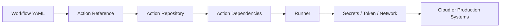
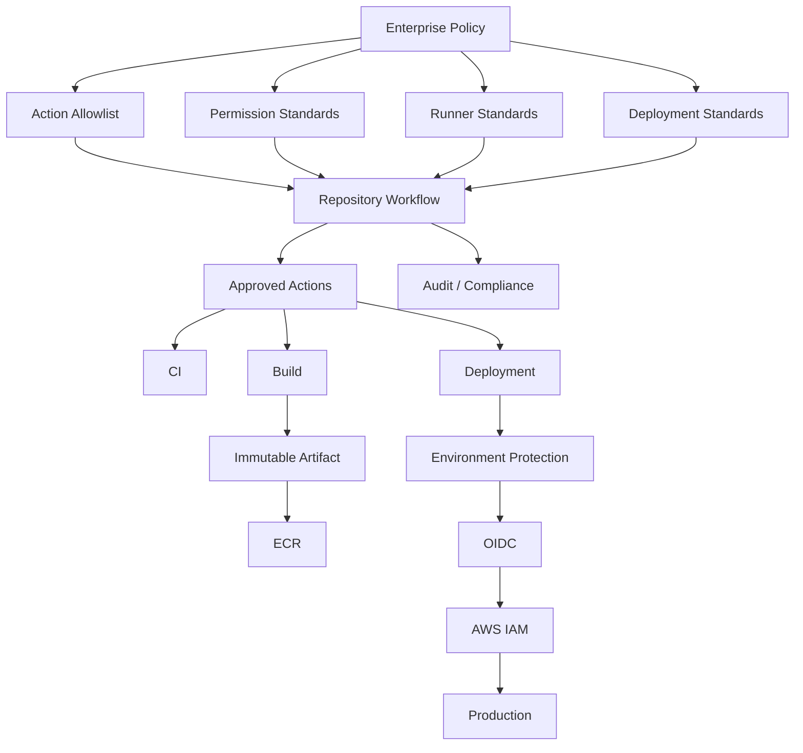

# 23- Actions Policies and Allowlists

## Overview

GitHub Actions policies and allowlists provide enterprise controls over which workflows, actions, runners, and execution patterns are permitted across an organization.

At small scale, developers can select actions independently:

```text
Repository
  ↓
Workflow
  ↓
Any Marketplace Action
  ↓
Runner
```

At enterprise scale, this creates a significant supply-chain and governance problem.

A workflow can execute third-party code with access to:

- Repository contents
- `GITHUB_TOKEN`
- Secrets
- Cloud credentials
- Docker credentials
- Private networks
- Self-hosted runner infrastructure

A governed model introduces controlled trust boundaries:

```text
Enterprise Policy
      ↓
Organization Policy
      ↓
Approved Actions
      ↓
Repository Workflow
      ↓
Controlled Runner
      ↓
Deployment
```

The objective is not to eliminate reusable automation. It is to make automation **predictable, reviewable, auditable, and appropriately trusted**.

---

## Why Action Policies Matter

A GitHub Action is executable software.

For example:

```yaml
- uses: some-org/deploy-action@v1
```

may execute code inside the runner with whatever privileges the workflow provides.

If the action is compromised, poorly maintained, malicious, or unexpectedly changes behavior, the workflow can become an attack path.

Therefore:

```text
Action Selection
=
Dependency Management
+
Supply Chain Security
+
CI/CD Governance
```

---

## What an Enterprise Action Policy Controls

A mature policy may govern:

| Area | Example Control |
|---|---|
| Actions | Approved action sources |
| Versions | SHA or version requirements |
| Marketplace | Allowed/restricted actions |
| Repositories | Internal action repositories |
| Permissions | `GITHUB_TOKEN` limits |
| Runners | Approved runner groups |
| Secrets | Environment/repository scope |
| Cloud | OIDC and IAM requirements |
| Workflows | Required reusable workflows |
| Deployments | Environment protection |
| Exceptions | Time-bounded approval |
| Auditing | Continuous policy checks |

---

## Action Trust Model

Consider the execution chain:



Every layer can introduce risk.

An action that appears harmless can still:

```text
Read files
→ Access environment variables
→ Use GITHUB_TOKEN
→ Access credentials
→ Call external services
```

The security impact depends heavily on the privileges granted to the job.

---

## Trusted and Untrusted Actions

A practical classification is:

### Trusted Internal Actions

Examples:

```text
company/setup-python
company/security-scan
company/docker-build
company/deploy
```

These are owned and maintained internally.

### Approved External Actions

Examples may include widely used actions from trusted publishers that have passed organizational review.

### Unreviewed External Actions

These should not automatically be available to sensitive workflows.

### Unknown or Prohibited Actions

These should be blocked where policy enforcement supports it.

---

## Allowlists

An allowlist defines which actions repositories may use.

Conceptually:

```text
Allowed
├── actions/checkout
├── actions/setup-python
├── docker/*
├── company/*
└── security-approved/*
```

Anything outside the approved set requires review or is blocked.

---

## Allowlist Scope

An allowlist can operate at different scopes:

```text
Enterprise
   ↓
Organization
   ↓
Repository
   ↓
Workflow
```

The broader the scope, the greater the impact of an incorrect approval.

A trusted action may be appropriate for an organization but still be inappropriate for a highly sensitive production workflow.

---

## Allowlist Design

Avoid unnecessarily broad patterns.

For example:

```text
github/*
```

may trust a much larger set of repositories than intended.

Prefer narrowly defined sources:

```text
actions/checkout
actions/setup-python
company/platform-actions/*
```

where the platform supports the required policy granularity.

---

## Approved Action Registry

An enterprise can maintain an internal registry.

Example:

| Action | Owner | Approved Version | Risk | Status |
|---|---|---|---|---|
| `actions/checkout` | GitHub | v4 | Low | Approved |
| `actions/setup-python` | GitHub | v6 | Low | Approved |
| `company/docker-build` | Platform | v3 | Controlled | Approved |
| External scanner | Security Team | Reviewed SHA | Controlled | Approved |
| Unknown Action | Unknown | N/A | Unknown | Blocked |

The registry should have ownership and review dates.

---

## Action Ownership

Every approved action should have an owner.

```text
Action
 ↓
Owner
 ↓
Security Contact
 ↓
Version
 ↓
Review Date
 ↓
Deprecation Status
```

An allowlist entry without ownership becomes technical debt.

---

## Action Approval Lifecycle

```text
Action Request
      ↓
Source Review
      ↓
Code / Dependency Review
      ↓
Permission Assessment
      ↓
Security Approval
      ↓
Allowlist
      ↓
Monitor
      ↓
Periodic Review
```

---

## Action Review Criteria

Review an external action for:

- Repository ownership
- Maintenance activity
- Release history
- Dependencies
- Runtime
- Permissions required
- Network behavior
- Secret handling
- File-system behavior
- Docker access
- Cloud authentication
- Release process
- Security history

The objective is to understand the action's trust boundary.

---

## Pinning Action Versions

There are three common reference styles.

### Major Version

```yaml
- uses: actions/checkout@v4
```

Advantages:

- Convenient
- Receives compatible updates
- Easy maintenance

Limitation:

- The referenced code can change within the major release.

### Exact Version

```yaml
- uses: actions/checkout@v4.2.2
```

Advantages:

- More predictable
- Easier change tracking

Limitation:

- Updates require explicit changes.

### Commit SHA

```yaml
- uses: actions/checkout@<verified-commit-sha>
```

Advantages:

- Immutable reference
- Stronger supply-chain protection

Limitation:

- Harder to read
- Requires update automation

---

## SHA Pinning

For sensitive workflows, SHA pinning provides a stronger integrity boundary.

Conceptually:

```text
Mutable Tag
    ↓
Potentially Different Code

Commit SHA
    ↓
Specific Commit
```

The SHA should be verified against the intended repository and release.

Do not copy an arbitrary SHA from an untrusted source.

---

## Pinning Policy

A practical enterprise policy might define:

```text
Production deployment workflows
→ SHA pinning required

Security-sensitive workflows
→ SHA pinning required

General CI
→ Approved major/minor references allowed

Internal actions
→ Versioned releases required
```

The exact policy should match organizational risk.

---

## Dependabot and Action Updates

Pinned actions should still be updated.

A common failure is:

```text
SHA pinned
→ Never updated
→ Security patch missed
```

Use automated dependency update mechanisms where appropriate.

The objective is:

```text
Immutable Reference
+
Managed Update Process
```

not simply "never change the SHA."

---

## Action Version Lifecycle

A governed action should have:

```text
Current
 ↓
New Version
 ↓
Migration Period
 ↓
Deprecated
 ↓
Removed
```

Repositories should receive advance notice for breaking changes.

---

## Semantic Versioning

Internal actions can use semantic versioning:

```text
MAJOR.MINOR.PATCH
```

For example:

```text
v3.2.1
```

Use major versions for incompatible interface changes.

A reusable action should behave like a software library with a stable API.

---

## Internal Action Repository

A company may maintain:

```text
platform-actions/
├── setup-python/
├── security-scan/
├── docker-build/
├── aws-auth/
└── deploy/
```

Each action should have:

```text
action.yml
README
Tests
Release Process
Ownership
Security Controls
```

---

## Internal Actions vs External Actions

| Property | Internal Action | External Action |
|---|---|---|
| Ownership | Organization | External |
| Source control | Direct | Indirect |
| Security review | Internal | Required |
| Customization | High | Limited |
| Maintenance | Organization | Publisher |
| Trust boundary | Easier to establish | Must be evaluated |

Internal does not automatically mean secure.

Internal actions still execute privileged code and require review.

---

## Marketplace Governance

Marketplace actions should not be treated as trusted merely because they are published on GitHub.

Review:

```text
Publisher
+
Source
+
Dependencies
+
Release Process
+
Permissions
+
Maintenance
```

Marketplace availability is not equivalent to enterprise approval.

---

## Dependency Chain Risk

An action may depend on other packages.

For example:

```text
Workflow
 ↓
Action
 ↓
JavaScript Package
 ↓
Nested Dependency
```

The trust boundary therefore extends beyond the action repository.

---

## JavaScript Actions

JavaScript actions may use npm dependencies.

Example:

```text
action.yml
 ↓
Node Runtime
 ↓
dist/index.js
 ↓
npm Dependencies
```

Govern:

- `package-lock.json`
- Dependency updates
- Security scanning
- Build process
- Node runtime
- Release artifact

---

## Docker Actions

Docker actions introduce another software supply chain.

```text
action.yml
 ↓
Dockerfile
 ↓
Base Image
 ↓
Packages
 ↓
Entrypoint
```

Review:

- Base image
- Dockerfile
- Installed packages
- Network access
- Entrypoint
- Image updates
- Build process

---

## Composite Actions

Composite actions package multiple steps.

Example:

```yaml
name: Setup Backend

runs:
  using: composite
  steps:
    - uses: actions/setup-python@v6
      with:
        python-version: "3.12"

    - shell: bash
      run: python -m pip install -r requirements-dev.txt
```

Composite actions are simpler operationally but still inherit the security context of the calling job.

---

## Action Permissions

An action does not receive an independent security identity simply because it is an action.

It runs within the job's context.

Therefore:

```yaml
permissions:
  contents: read
```

is an important boundary.

Avoid:

```yaml
permissions: write-all
```

for convenience.

---

## Job-Level Permission Isolation

Separate jobs when different privileges are required.

```yaml
jobs:
  test:
    permissions:
      contents: read

  deploy:
    permissions:
      contents: read
      id-token: write
```

This prevents the test job from inheriting deployment privileges.

---

## AWS OIDC and Action Policies

A production deployment should ideally use:

```text
GitHub Actions
 ↓
OIDC
 ↓
AWS STS
 ↓
IAM Role
 ↓
AWS
```

The deployment action should not require long-lived:

```text
AWS_ACCESS_KEY_ID
AWS_SECRET_ACCESS_KEY
```

stored as repository secrets.

---

## Action Allowlist and OIDC

An important enterprise rule is:

```text
Only trusted actions
+
Only trusted workflows
+
Only required OIDC permissions
```

A compromised action running in a job with:

```yaml
id-token: write
```

may be able to obtain an OIDC token and attempt to assume a trusted AWS role if the IAM trust policy is insufficiently restrictive.

Therefore action governance and IAM governance must be designed together.

---

## IAM Trust Policy

Restrict AWS role assumption using claims such as:

```text
Repository
Branch
Tag
Environment
```

Conceptually:

```text
Repository
+
Environment
+
OIDC
→
Specific IAM Role
```

Avoid broad trust relationships that allow arbitrary repositories to assume production roles.

---

## Production Action Boundary

A production deployment job may look conceptually like:

```text
Build Job
   │
   │ no AWS production credentials
   ▼
Artifact
   │
   ▼
Deployment Job
   │
   ├── Approved Action
   ├── id-token: write
   └── Production Environment
          │
          ▼
       AWS Role
```

This is safer than giving the entire workflow production privileges.

---

## Untrusted Pull Requests

Pull requests can contain attacker-controlled code and data.

Never assume:

```text
Pull Request
=
Trusted Developer Code
```

This is especially important for workflows triggered by external forks.

---

## `pull_request` Governance

Use `pull_request` for normal PR validation when possible.

Avoid exposing sensitive production credentials to the PR workflow.

A typical safe boundary is:

```text
PR
 ↓
Lint
 ↓
Unit Tests
 ↓
Integration Tests
```

with no production credentials.

---

## `pull_request_target` Governance

`pull_request_target` runs with the base repository's context and therefore requires special care.

A dangerous design is:

```text
pull_request_target
 ↓
Checkout PR Code
 ↓
Execute PR Code
 ↓
Expose Secrets
```

This can allow untrusted code to execute with privileged repository context.

---

## Safe `pull_request_target` Pattern

If `pull_request_target` is genuinely required, avoid executing untrusted PR code with privileged credentials.

For example, a workflow may process trusted metadata without checking out and executing the contributor's code.

The important boundary is:

```text
Trusted Workflow Logic
≠
Untrusted PR Code
```

---

## Shell Injection

Action policies should include standards for handling GitHub-provided values.

Potentially untrusted values include:

```text
PR Title
Branch Name
Commit Message
Issue Content
Workflow Inputs
```

Avoid directly embedding them into shell syntax.

Unsafe:

```yaml
run: echo "${{ github.event.pull_request.title }}"
```

Safer:

```yaml
env:
  PR_TITLE: ${{ github.event.pull_request.title }}

steps:
  - name: Print title
    run: printf '%s\n' "$PR_TITLE"
```

---

## Action Input Validation

Actions should validate user-controlled inputs.

For example:

```text
environment
```

should accept:

```text
development
staging
production
```

rather than arbitrary strings.

Validation reduces accidental and malicious misuse.

---

## Action Allowlist for Deployment

Production deployment workflows should have stricter action policies than ordinary CI.

For example:

```text
Production
├── Approved checkout
├── Approved cloud authentication
├── Approved deployment action
├── Approved monitoring action
└── Approved rollback action
```

Do not allow arbitrary Marketplace actions inside the production deployment path.

---

## Required Workflows

Organizations may standardize critical checks through required workflows.

Conceptually:

```text
Repository
   ↓
Required Enterprise CI
   ├── Security
   ├── Dependency Review
   ├── Policy Validation
   └── Standard Checks
```

Repository-specific workflows can then provide application-specific validation.

---

## Required Workflow Design

Required workflows should be:

- Stable
- Versioned
- Observable
- Backward-compatible
- Fast enough for broad adoption
- Clearly owned

A centrally required workflow that frequently fails can become an organization-wide bottleneck.

---

## Governance Workflow

A dedicated governance workflow can inspect repositories.

```text
Repository Inventory
        ↓
Workflow Discovery
        ↓
Action Extraction
        ↓
Policy Evaluation
        ↓
Findings
        ↓
Owner Notification
        ↓
Remediation
```

---

## Action Discovery

A governance scanner can identify action references such as:

```yaml
uses: actions/checkout@v4
```

and:

```yaml
uses: company/platform-actions/security-scan@v3
```

Then compare them against an approved registry.

---

## Policy Evaluation

Conceptually:

```text
Action
 ↓
Is Source Approved?
 ↓
Yes
 ↓
Is Version Allowed?
 ↓
Yes
 ↓
Is SHA Required?
 ↓
Yes
 ↓
Is Reference Immutable?
 ↓
Pass
```

A policy engine can automate this evaluation.

---

## Example Governance Rule

Conceptual policy:

```text
IF
  action source is external
AND
  workflow targets production
AND
  reference is not pinned
THEN
  block deployment
```

This is stronger than merely documenting the preferred behavior.

---

## Policy Severity

Classify violations.

| Severity | Example |
|---|---|
| Critical | Untrusted action with production credentials |
| High | Unapproved deployment action |
| Medium | External action not SHA-pinned |
| Low | Deprecated action version |
| Informational | Non-standard but approved configuration |

Severity should determine remediation urgency.

---

## Exceptions

Not every action can always meet the standard immediately.

An exception should include:

```text
Action
Repository
Reason
Risk
Owner
Approver
Compensating Controls
Expiration
```

Example:

```text
Action:
vendor/windows-build

Reason:
Required by legacy vendor tooling

Controls:
Dedicated runner group
No production secrets

Expiration:
2027-03-31
```

---

## Exception Expiration

Exceptions should not become permanent.

```text
Approved
 ↓
Temporary Use
 ↓
Reminder
 ↓
Expiration
 ↓
Block / Renew
```

Renewal should require explicit review.

---

## Runner Allowlists

Action policies should be complemented by runner policies.

For example:

```text
Public CI
→ GitHub-hosted

Private Integration
→ Private Runner Group

Production Deployment
→ Dedicated Deployment Runner Group
```

A trusted action on an untrusted runner may still create risk.

---

## Runner Group Restrictions

Production runners should not accept arbitrary workflows.

Conceptually:

```text
Production Runner Group
        │
        ├── Approved Repositories
        └── Approved Workflows
```

This reduces the possibility of an unrelated repository executing code in the production network.

---

## Private Network Risk

A self-hosted runner may have access to:

```text
PostgreSQL
Redis
Kafka
Internal APIs
AWS Private Services
```

A workflow executing on that runner effectively inherits network reachability.

Therefore runner allowlists are part of network security.

---

## Artifact Governance

Approved actions are only one part of the supply chain.

Also govern:

```text
Build
 ↓
Artifact
 ↓
Registry
 ↓
Promotion
 ↓
Deployment
```

Production should consume verified immutable artifacts.

---

## Build Once, Promote Many

Prefer:

```text
Build
 ↓
Scan
 ↓
Sign / Attest
 ↓
ECR
 ↓
Staging
 ↓
Production
```

rather than:

```text
Build Staging
Build Production
```

This prevents environment-specific rebuilds from introducing different artifacts.

---

## Docker Action Governance

For Docker-based CI/CD, govern:

- Base images
- Dockerfiles
- Buildx
- Build contexts
- Build arguments
- Secrets
- Registry authentication
- Image tags
- Digests
- Scanning
- SBOM
- Provenance

---

## ECR Governance

A typical enterprise model is:

```text
GitHub OIDC
 ↓
AWS STS
 ↓
Build IAM Role
 ↓
ECR Push
```

Deployment then uses separate permissions:

```text
Deployment IAM Role
 ↓
ECS / EC2 / Lambda
```

Do not give a generic CI role unnecessary production permissions.

---

## Environment Protection

Production environments should have:

- Required reviewers where appropriate
- Branch restrictions
- Environment secrets
- Deployment history
- Concurrency controls

This creates a governance boundary between artifact creation and production execution.

---

## Deployment Concurrency

Use concurrency to prevent deployment races.

```yaml
concurrency:
  group: production-api
  cancel-in-progress: false
```

For pull requests:

```yaml
concurrency:
  group: ci-${{ github.workflow }}-${{ github.ref }}
  cancel-in-progress: true
```

The policies differ because obsolete PR work can usually be discarded, while an active production deployment should generally not be cancelled casually.

---

## Action Governance and Rollback

A deployment action update can itself introduce risk.

Therefore:

```text
Action Update
 ↓
Test
 ↓
Staging
 ↓
Production
 ↓
Monitor
```

If a new action version causes deployment failures, the previous approved action version should remain available for rollback.

---

## Canary Action Updates

For critical internal actions:

```text
v3
 ↓
Pilot Repositories
 ↓
Expanded Adoption
 ↓
Enterprise Default
```

This limits blast radius.

---

## Action Deprecation

Deprecation should include:

```text
Announcement
 ↓
Migration Guide
 ↓
Compatibility Period
 ↓
Usage Monitoring
 ↓
Deadline
 ↓
Removal
```

Track consumers before removing an action.

---

## Action Inventory

Maintain an inventory of:

```text
Action
Repository
Version
Consumers
Owner
Security Review
Last Update
Deprecation Status
```

Without consumer visibility, breaking an internal action becomes unpredictable.

---

## Supply Chain Security

Action policies should work with:

- Dependency Review
- Dependabot
- SHA pinning
- SBOM
- Artifact provenance
- Attestations
- Signing
- Vulnerability scanning

The complete model is:

```text
Source
 ↓
Workflow
 ↓
Action
 ↓
Dependencies
 ↓
Build
 ↓
Artifact
 ↓
Registry
 ↓
Deployment
```

---

## Action Compromise Scenario

Consider:

```text
Trusted Action
 ↓
Publisher Account Compromised
 ↓
New Release
 ↓
Workflow Uses Mutable Tag
 ↓
Malicious Code Executes
```

Potential controls:

```text
SHA Pinning
+
Approved Sources
+
Automated Review
+
Minimal Permissions
+
Dependency Monitoring
```

No single control eliminates the entire risk.

---

## Malicious Internal Action

Internal actions can also become compromised through:

- Developer account compromise
- Malicious pull request
- Weak branch protection
- Dependency compromise
- Release pipeline compromise

Protect action repositories with:

- Branch protection
- CODEOWNERS
- Required reviews
- Security scanning
- Release controls
- Restricted publishing permissions

---

## Release Pipeline Security

An internal action's release workflow is part of the trusted computing base.

Protect:

```text
Source
 ↓
Build
 ↓
Package
 ↓
Release
```

If attackers can modify the release process, action allowlisting does not provide meaningful protection.

---

## Action Policy and Secrets

Avoid making secrets available to actions unless required.

Prefer:

```text
Job
 ├── Trusted Action
 └── Secret
```

over:

```text
Workflow
 ├── Many Actions
 └── Many Secrets
```

Narrow privilege reduces the blast radius of a compromised action.

---

## Action Policy and Environment Secrets

Production secrets should remain protected by the production environment.

Conceptually:

```text
PR Workflow
→ No Production Secret

Staging Workflow
→ Staging Secret

Production Deployment
→ Production Secret
```

This is stronger than storing all secrets at organization scope.

---

## Governance for Python Projects

A standard Python backend pipeline might use:

```text
actions/checkout
actions/setup-python
Approved Security Scanner
Internal Test Action
Internal Docker Action
```

Then:

```text
Python
 ↓
pytest
 ↓
Coverage
 ↓
Security
 ↓
Docker
 ↓
ECR
```

The action allowlist should cover both external and internal components.

---

## Django Governance Example

For Django applications:

```text
CI
├── Ruff
├── pytest
├── PostgreSQL
├── Redis
└── Security Checks

CD
├── Docker Build
├── ECR
├── Staging
└── Production
```

Only approved actions should interact with:

```text
AWS
Docker
Production
```

---

## FastAPI Governance Example

For FastAPI:

```text
Lint
 ↓
Unit Tests
 ↓
Integration Tests
 ↓
PostgreSQL / Redis
 ↓
Docker
 ↓
ECR
 ↓
ECS
```

Separate application testing from deployment privileges.

---

## Kubernetes Governance

For Kubernetes deployments, approved actions may perform:

```text
kubectl
Helm
Image Promotion
Deployment
Health Validation
Rollback
```

These actions should not receive unrestricted cluster-admin privileges.

Use namespace- or workload-scoped credentials where possible.

---

## Nginx and API Gateway Deployments

For systems using Nginx or an API gateway, deployment actions may modify routing configuration.

Govern:

```text
Configuration Validation
+
Security Review
+
Staging Test
+
Production Approval
```

Do not allow arbitrary workflow inputs to become production routing configuration without validation.

---

## Kafka and Redis Governance

CI workflows that access Kafka or Redis should use isolated environments.

Avoid:

```text
PR Workflow
→ Production Redis
```

or:

```text
PR Workflow
→ Production Kafka
```

Use dedicated test infrastructure.

---

## Governance and Cost

Allowlist governance can also improve cost control.

Uncontrolled actions may:

- Trigger unnecessary jobs
- Download excessive dependencies
- Upload large artifacts
- Build unnecessary images
- Use oversized runners

Standardized actions can centralize efficient implementation.

---

## Governance and Reliability

Approved actions should be evaluated for:

- Failure handling
- Timeouts
- Retry behavior
- Idempotency
- Logging
- Exit codes
- Compatibility
- Maintenance

A technically secure action that frequently fails can still become a platform reliability problem.

---

## Action Timeouts

Long-running actions can consume expensive runner capacity.

Where supported, workflows should define sensible timeouts.

Example:

```yaml
jobs:
  integration:
    timeout-minutes: 30
```

Avoid excessively long defaults.

---

## Action Retry Behavior

Retries should be used carefully.

Good candidates:

```text
Transient network failure
Temporary registry failure
Cloud API throttling
```

Poor candidates:

```text
Invalid credentials
Invalid configuration
Deterministic test failure
Permission denial
```

Retries should not hide systemic problems.

---

## Action Observability

Approved actions should provide:

- Clear logs
- Meaningful exit codes
- Step summaries
- Useful errors
- Deployment metadata

Avoid actions that produce opaque output such as:

```text
Deployment failed
```

without identifying the failing operation.

---

## Governance Monitoring

Monitor:

```text
Action Adoption
Action Version Distribution
Policy Violations
Exception Count
Runner Usage
Deployment Failures
Action Failure Rate
Security Findings
```

An organization should know which actions are actually used.

---

## Policy Drift

Example:

```text
Enterprise Policy:
SHA pinning required

Repository A:
Compliant

Repository B:
Mutable tag

Repository C:
Old SHA
```

Drift detection identifies B and C before they become larger risks.

---

## Continuous Compliance

A scheduled governance workflow can periodically evaluate repositories.

```text
Daily / Scheduled
      ↓
Repository Inventory
      ↓
Workflow Scan
      ↓
Policy Evaluation
      ↓
Compliance Report
      ↓
Owner Notification
```

Critical violations can trigger immediate escalation.

---

## Failure Domain Troubleshooting

Action policy failures should be diagnosed systematically.

Use:

```text
Symptom
→ Possible Causes
→ Isolation Strategy
→ Commands / Checks
→ Root Cause
→ Corrective Action
→ Prevention
```

---

## Action Not Allowed

### Symptom

A workflow fails before executing an action.

### Possible Causes

- Action is not on the allowlist.
- Organization policy blocks the source.
- Repository policy overrides organization configuration.
- Action version is prohibited.

### Checks

Inspect the workflow:

```bash
gh workflow view ci.yml
```

Review repository and organization Actions settings.

### Corrective Action

Either:

```text
Use Approved Action
```

or:

```text
Submit Action for Review
```

Do not bypass the policy by switching to an unknown action.

---

## SHA Pinning Violation

### Symptom

A workflow is rejected because an action is not pinned.

### Possible Causes

```text
@v4
```

used where policy requires:

```text
@<SHA>
```

### Corrective Action

Resolve the intended release and pin the verified commit.

---

## Action Version Breaks the Workflow

### Symptom

A centrally approved action update breaks multiple repositories.

### Possible Causes

- Breaking API change
- Runtime change
- Dependency change
- Input/output change

### Prevention

Use:

```text
Semantic Versioning
+
Compatibility Testing
+
Canary Adoption
+
Migration Window
```

---

## Action Cannot Access AWS

### Symptom

Deployment action fails during AWS authentication.

### Possible Causes

- Missing `id-token: write`
- Incorrect IAM trust policy
- Wrong repository claim
- Wrong branch/environment claim
- Incorrect AWS role ARN
- OIDC configuration mismatch

### Diagnostic

```yaml
permissions:
  contents: read
  id-token: write
```

Then inspect the IAM trust policy and workflow environment.

---

## Action Has Too Much Access

### Symptom

A third-party action requires broad permissions.

### Response

Determine whether the permission is actually necessary.

Prefer:

```text
Minimal Job Permissions
```

over:

```text
Global Workflow Permissions
```

If the action fundamentally requires excessive privileges, evaluate whether it should be approved.

---

## Runner Access Violation

### Symptom

A workflow cannot access a required runner.

### Possible Causes

- Runner group restrictions
- Missing labels
- Repository not authorized
- Runner offline
- Capacity exhausted

Check:

```text
Runner Group
Labels
Repository Access
Runner Status
Capacity
```

---

## Governance CLI Operations

List workflows:

```bash
gh workflow list
```

Inspect a workflow:

```bash
gh workflow view ci.yml
```

List runs:

```bash
gh run list
```

Inspect logs:

```bash
gh run view <run-id> --log
```

Run a workflow manually:

```bash
gh workflow run ci.yml
```

List repository secrets:

```bash
gh secret list
```

List variables:

```bash
gh variable list
```

List releases:

```bash
gh release list
```

These commands are useful for investigating and operating governed repositories.

---

## Governance Reference Architecture



---

## Production Action Governance Model

A production workflow should ideally satisfy:

```text
Approved Workflow
      ↓
Approved Actions
      ↓
Minimal Permissions
      ↓
Protected Environment
      ↓
OIDC
      ↓
Scoped IAM Role
      ↓
Immutable Artifact
      ↓
Controlled Deployment
      ↓
Health Validation
      ↓
Rollback
```

Each layer reduces a different class of failure or security risk.

---

## Enterprise Action Policy Example

A practical policy can be expressed conceptually as:

```text
1. Only approved action sources may execute.
2. Production workflows require stronger action pinning.
3. Third-party actions require security review.
4. Actions must run with least-privilege permissions.
5. Production deployment actions must be explicitly approved.
6. AWS authentication must use OIDC where supported.
7. Production runners must belong to dedicated runner groups.
8. Exceptions require owners and expiration dates.
9. Action versions must be continuously monitored.
10. Policy violations must be observable and remediated.
```

---

## Policy Rollout Strategy

For an existing organization:

```text
Inventory
 ↓
Observe
 ↓
Classify
 ↓
Define Policy
 ↓
Warn
 ↓
Remediate
 ↓
Enforce
```

Starting with hard blocking can disrupt existing delivery pipelines.

A staged rollout allows teams to fix violations before enforcement.

---

## Audit Mode

An initial governance workflow can operate in audit mode:

```text
Violation
 ↓
Report
 ↓
Notify
```

without immediately blocking workflows.

After the organization reaches acceptable compliance:

```text
Violation
 ↓
Block
```

for critical policies.

---

## Policy Enforcement Modes

| Mode | Behavior | Use |
|---|---|---|
| Inform | Report only | Initial rollout |
| Warn | Report + owner notification | Migration |
| Require | Block non-compliant workflows | Critical controls |
| Exception | Allow with approval | Special cases |

Use hard enforcement for high-risk security boundaries.

---

## Senior-Level Design Considerations

### Should every third-party action be prohibited?

Not necessarily.

The decision should consider:

```text
Risk
+
Maintenance
+
Permissions
+
Business Value
+
Alternative Availability
```

A controlled allowlist is generally more practical than treating every external action identically.

### Should every action use a SHA?

SHA pinning provides stronger immutability, but it increases update-management overhead.

A mature enterprise should define where the stronger control is required and automate updates where possible.

### Should all CI use internal actions?

Internal actions can improve consistency but create central dependencies.

Use them where the behavior is genuinely reusable and stable.

### Should governance block every violation?

Not necessarily.

Risk-based enforcement avoids turning low-risk standards into unnecessary delivery bottlenecks.

---

## Interview Scenarios

### How would you secure third-party GitHub Actions?

Discuss:

```text
Allowlisting
+
Source Review
+
SHA Pinning
+
Minimal Permissions
+
Dependency Monitoring
+
Secrets Isolation
+
Runner Isolation
```

### How would you prevent a compromised action from accessing AWS production?

Use multiple boundaries:

```text
Untrusted CI
→ No Production OIDC

Production Deployment
→ Approved Action

Production Environment
→ Protected

OIDC
→ Restricted IAM Trust Policy

IAM Role
→ Least Privilege
```

### How would you manage 1,000 repositories?

Use:

```text
Enterprise Policies
+
Organization Standards
+
Reusable Workflows
+
Approved Actions
+
Automated Compliance
+
Runner Governance
+
Central Observability
```

Do not manually maintain every workflow.

### How would you migrate from mutable action tags to SHA pinning?

Use:

```text
Inventory
→ Identify Actions
→ Resolve Trusted SHAs
→ Automate Updates
→ Pilot
→ Warn
→ Enforce
```

### How would you handle an action required by only one legacy application?

Use a controlled exception:

```text
Dedicated Repository
+
Owner
+
Risk Assessment
+
Isolated Runner
+
Minimal Permissions
+
Expiration
```

---

## Production Checklist

### Action Sources

- [ ] Approved action sources are defined.
- [ ] Third-party actions are reviewed.
- [ ] Internal actions have owners.
- [ ] Marketplace restrictions are documented.

### Versioning

- [ ] Action versions are controlled.
- [ ] SHA pinning requirements are defined.
- [ ] Dependency updates are automated.
- [ ] Deprecated actions are tracked.

### Permissions

- [ ] `GITHUB_TOKEN` uses least privilege.
- [ ] Job-level permissions are used where appropriate.
- [ ] `id-token: write` is restricted.
- [ ] Production deployment jobs are isolated.

### Runners

- [ ] Runner groups are controlled.
- [ ] Production runners are isolated.
- [ ] Private network access is restricted.
- [ ] Ephemeral runners are considered for sensitive workloads.

### AWS

- [ ] OIDC is used instead of long-lived credentials where supported.
- [ ] IAM trust policies restrict repository/environment identity.
- [ ] Deployment roles are environment-specific.
- [ ] Production roles have minimal permissions.

### Governance

- [ ] Policy violations are monitored.
- [ ] Exceptions have owners.
- [ ] Exceptions expire.
- [ ] Action inventory is maintained.
- [ ] Governance policies are continuously evaluated.

---

## Key Takeaways

- Treat GitHub Actions as **executable supply-chain dependencies** and govern them through approved sources, ownership, versioning, permissions, and continuous review.
- Use **allowlists, SHA pinning where required, least-privilege permissions, protected environments, runner groups, and OIDC/IAM controls** as complementary security boundaries.
- Reusable workflows and internal actions provide strong standardization, but they must be **versioned, tested, owned, and operated like production software**.
- Enterprise governance should be **automated and risk-based**, progressing from inventory and audit mode to enforcement while supporting time-bounded exceptions.
- The strongest production model combines **approved actions, isolated execution, immutable artifacts, scoped cloud identity, deployment protection, monitoring, and rollback** rather than relying on a single policy control.