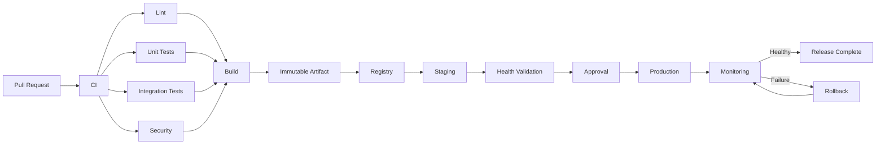

# 24- Production Best Practices

## Overview

GitHub Actions should be treated as a production engineering platform rather than a collection of YAML files.

A production CI/CD system must provide:

- Deterministic builds
- Secure execution
- Controlled deployments
- Immutable artifacts
- Environment isolation
- Failure containment
- Observability
- Rollback capability
- Appropriate runner capacity
- Repeatable operations
- Clear ownership and governance

A mature pipeline typically follows:

```text
Pull Request
    ↓
Lint
    ↓
Unit Tests
    ↓
Integration Tests
    ↓
Security Scan
    ↓
Matrix Testing
    ↓
Build
    ↓
Immutable Artifact
    ↓
Registry
    ↓
Staging
    ↓
Approval
    ↓
Production
    ↓
Health Validation
    ↓
Monitoring
    ↓
Rollback if Required
```

The important engineering principle is that CI/CD itself is a production system. A broken pipeline can prevent releases, while a poorly secured pipeline can become a path into production infrastructure.

---

## Production CI/CD Principles

A production-grade GitHub Actions implementation should optimize for:

| Principle | Engineering Goal |
|---|---|
| Reproducibility | Same source produces predictable output |
| Immutability | Deployed artifact does not change |
| Least privilege | Jobs receive only required permissions |
| Isolation | Failures and credentials remain contained |
| Idempotency | Repeated execution is safe |
| Observability | Failures are diagnosable |
| Automation | Manual work is minimized |
| Promotion | Same artifact moves between environments |
| Rollback | Failed releases can be reversed |
| Governance | Standards are consistently enforced |

A useful mental model is:

```text
Reliable CI/CD
=
Reproducible Build
+
Secure Execution
+
Immutable Artifact
+
Controlled Promotion
+
Observable Deployment
+
Recoverable Failure
```

---

## Workflow Architecture

GitHub Actions has a hierarchy:

```text
Workflow
    ↓
Job
    ↓
Step
    ↓
Action / Shell Command
    ↓
Runner
```

For example:

```yaml
name: Backend CI

on:
  pull_request:
  push:
    branches:
      - main

jobs:
  test:
    runs-on: ubuntu-latest

    steps:
      - uses: actions/checkout@v4

      - uses: actions/setup-python@v6
        with:
          python-version: "3.12"

      - run: pip install -r requirements.txt

      - run: pytest
```

The workflow defines the automation, jobs define execution boundaries, steps perform individual operations, and the runner provides the execution environment.

---

## Production Workflow Boundaries

Do not put the entire software lifecycle into one giant job.

Prefer:

```text
Lint
  ↓
Unit Tests
  ↓
Integration Tests
  ↓
Security
  ↓
Build
  ↓
Deploy
```

rather than:

```text
One Job
 ├── Lint
 ├── Tests
 ├── Build
 ├── Docker
 ├── AWS
 └── Production
```

Separate jobs provide:

- Clear failure boundaries
- Parallelism
- Permission isolation
- Better observability
- Easier retries
- Better resource allocation

---

## Dependency Graph

Use `needs` to make dependencies explicit.

```yaml
jobs:
  lint:
    runs-on: ubuntu-latest
    steps:
      - run: ruff check .

  test:
    needs: lint
    runs-on: ubuntu-latest
    steps:
      - run: pytest

  build:
    needs: test
    runs-on: ubuntu-latest
    steps:
      - run: docker build .
```

The resulting dependency graph is:

```text
lint
  ↓
test
  ↓
build
```

Independent jobs should run in parallel.

```text
          ┌── Unit Tests ──┐
Lint ─────┤                ├── Build
          └── Security ───┘
```

---

## Fan-Out and Fan-In

A production pipeline commonly uses fan-out:

```text
             ┌── Python 3.11
             │
Planning ────┼── Python 3.12
             │
             └── Python 3.13
```

Then fan-in:

```text
Python 3.11 ──┐
Python 3.12 ──┼── Build
Python 3.13 ──┘
```

This provides parallel validation while maintaining a clear promotion boundary.

---

## CI and CD Separation

CI should establish that the artifact is valid.

CD should establish that the artifact can safely be deployed.

```text
CI
├── Lint
├── Test
├── Security
└── Build

CD
├── Promote
├── Approve
├── Deploy
├── Validate
└── Rollback
```

Avoid rebuilding the application during CD.

---

## Build Once, Deploy Many

Prefer:

```text
Source
 ↓
Build
 ↓
Test
 ↓
Immutable Artifact
 ↓
Staging
 ↓
Production
```

Avoid:

```text
Source
 ↓
Build Staging

Source
 ↓
Build Production
```

Separate builds can produce different artifacts because of:

- Dependency changes
- Base image changes
- Package repository changes
- Build-time timestamps
- Environment differences
- Toolchain changes

---

## Immutable Artifacts

For Docker deployments, use immutable identifiers.

Example:

```text
my-api:git-7f31d2a
```

or preferably deploy using the resulting digest:

```text
my-api@sha256:<digest>
```

Tags are useful for human navigation, but the digest is the stronger deployment identity.

---

## Docker Production Pipeline

A typical backend pipeline:

```text
Python Application
       ↓
pytest
       ↓
Security Scan
       ↓
Docker Buildx
       ↓
Image
       ↓
SBOM / Scan
       ↓
ECR
       ↓
Staging
       ↓
Production
```

Example:

```yaml
- name: Build and push
  uses: docker/build-push-action@v6
  with:
    context: .
    push: true
    tags: |
      ${{ env.REGISTRY }}/${{ env.IMAGE_NAME }}:${{ github.sha }}
```

The production deployment should reference the exact artifact produced by CI.

---

## Dockerfile Production Practices

Use multi-stage builds when appropriate.

```dockerfile
FROM python:3.12-slim AS builder

WORKDIR /app

COPY requirements.txt .
RUN pip install --prefix=/install -r requirements.txt

FROM python:3.12-slim

WORKDIR /app

COPY --from=builder /install /usr/local
COPY . .

CMD ["gunicorn", "config.wsgi:application"]
```

Benefits include:

- Smaller runtime image
- Reduced attack surface
- Separation of build and runtime dependencies
- Better deployment efficiency

---

## Docker Build Context

Use `.dockerignore`.

Example:

```text
.git
.github
.pytest_cache
__pycache__
*.pyc
.env
venv
node_modules
```

Do not send unnecessary files to the Docker daemon or BuildKit.

Never rely on `.dockerignore` alone for secret protection; secrets should not be placed in the build context in the first place.

---

## Docker Build Secrets

Do not pass secrets as ordinary build arguments.

Avoid:

```yaml
build-args:
  PRIVATE_TOKEN: ${{ secrets.PRIVATE_TOKEN }}
```

Build arguments can become visible through build metadata or image history depending on how they are used.

Use BuildKit secret mechanisms when a build genuinely requires credentials.

---

## Dependency Pinning

Production applications should use deterministic dependency management.

For Python:

```text
requirements.txt
requirements.lock
pyproject.toml
lock file
```

depending on the dependency-management strategy.

Avoid allowing every CI run to resolve completely unconstrained dependency versions.

---

## Dependency Caching

Caching improves performance but is not an artifact mechanism.

Example:

```yaml
- uses: actions/setup-python@v6
  with:
    python-version: "3.12"
    cache: pip
```

A cache can be discarded or regenerated.

An artifact must represent a specific build output.

---

## Artifact vs Cache

| Property | Artifact | Cache |
|---|---|---|
| Purpose | Preserve build/test output | Speed up repeated work |
| Identity | Specific output | Reusable dependency state |
| Reliability | Required for promotion | Optional optimization |
| Example | Docker metadata/report | pip cache |
| Replacement | Must be controlled | Can be regenerated |
| Production deployment | Appropriate | Not appropriate |

Never use a cache as the authoritative production artifact.

---

## Trigger Design

Production workflows should have deliberate triggers.

Typical choices:

| Trigger | Typical Use |
|---|---|
| `pull_request` | Validation |
| `push` | Main branch CI |
| `workflow_dispatch` | Controlled manual operations |
| `workflow_call` | Reusable workflows |
| `release` | Release automation |
| `workflow_run` | Workflow orchestration |
| `schedule` | Periodic maintenance |

Avoid triggering expensive production operations from arbitrary events.

---

## Branch and Path Filters

Use filters to reduce unnecessary execution.

```yaml
on:
  pull_request:
    branches:
      - main
    paths:
      - "src/**"
      - "tests/**"
      - "pyproject.toml"
```

For monorepos, path filtering can significantly reduce unnecessary CI cost.

However, deployment dependencies must be considered before assuming a path can safely skip a pipeline.

---

## Pull Request Security

Pull requests can contain untrusted code.

Do not expose production credentials to ordinary PR validation.

Prefer:

```text
PR
 ↓
Lint
 ↓
Tests
 ↓
Security Scan
```

and:

```text
Trusted Main Branch
 ↓
Build
 ↓
Deploy
```

---

## `pull_request_target`

`pull_request_target` executes in the context of the base repository and therefore requires particular caution.

Avoid:

```text
pull_request_target
 ↓
Checkout PR Code
 ↓
Execute PR Code
 ↓
Expose Secrets
```

This can turn attacker-controlled code into privileged execution.

Separate trusted workflow logic from untrusted contributor code.

---

## GITHUB_TOKEN

Use explicit permissions.

```yaml
permissions:
  contents: read
```

For deployment:

```yaml
permissions:
  contents: read
  id-token: write
```

Avoid broad permissions unless a job actually requires them.

---

## Job-Level Permissions

Permissions should be scoped to the smallest useful boundary.

```yaml
jobs:
  test:
    permissions:
      contents: read

  deploy:
    permissions:
      contents: read
      id-token: write
```

This prevents test execution from unnecessarily receiving cloud authentication capabilities.

---

## Secrets

Secrets may exist at:

- Organization level
- Repository level
- Environment level

Production credentials should generally be associated with protected environments rather than made globally available.

Prefer:

```text
Staging Job
→ Staging Credentials

Production Job
→ Production Credentials
```

---

## Secret Exposure Risks

Secrets can accidentally leak through:

- Command arguments
- Logs
- Debug output
- Artifacts
- Docker build layers
- Generated configuration
- Exceptions
- Third-party actions

Never assume masking makes arbitrary secret handling safe.

---

## Safe Environment Variable Handling

Avoid interpolating untrusted values directly into shell commands.

Instead:

```yaml
env:
  BRANCH_NAME: ${{ github.ref_name }}

steps:
  - run: printf 'Branch: %s\n' "$BRANCH_NAME"
```

This keeps GitHub expression evaluation separate from shell parsing.

---

## Environments

Use GitHub Environments to represent deployment boundaries.

```text
development
    ↓
staging
    ↓
production
```

Production environments can provide:

- Required reviewers
- Environment secrets
- Branch restrictions
- Deployment history
- Protection controls

---

## Environment Promotion

Promotion should move an existing artifact.

```text
Build
 ↓
Artifact A
 ↓
Staging
 ↓
Approval
 ↓
Production
```

Do not rebuild Artifact A between staging and production.

---

## Deployment Approvals

Approvals should happen after enough automated evidence exists.

A useful flow is:

```text
Build
 ↓
Automated Tests
 ↓
Security Scan
 ↓
Staging
 ↓
Health Validation
 ↓
Approval
 ↓
Production
```

Approval should not compensate for poor automated validation.

---

## Deployment Concurrency

Production deployments should normally be serialized.

```yaml
concurrency:
  group: production
  cancel-in-progress: false
```

This reduces race conditions such as:

```text
Deployment A starts
Deployment B starts
Deployment A finishes
Deployment B finishes
```

where the final state may not correspond to the intended release order.

---

## Pull Request Concurrency

PR validation can usually cancel obsolete work.

```yaml
concurrency:
  group: ci-${{ github.workflow }}-${{ github.ref }}
  cancel-in-progress: true
```

This saves runner capacity while preserving the latest relevant validation.

---

## Matrix Testing

Use matrices when compatibility is a real requirement.

```yaml
strategy:
  matrix:
    python-version:
      - "3.11"
      - "3.12"
      - "3.13"
```

For backend applications, dimensions might include:

```text
Python
Database
Operating System
Dependency Version
```

Avoid excessive matrix cardinality.

---

## Matrix Cost

A matrix multiplies execution.

For example:

```text
3 Python versions
×
2 databases
×
2 operating systems
=
12 jobs
```

Every additional dimension increases:

- Runtime
- Runner consumption
- CI cost
- Failure surface
- Maintenance complexity

Use matrices where the compatibility value justifies the cost.

---

## Fail-Fast

For compatibility testing:

```yaml
strategy:
  fail-fast: true
```

can stop remaining matrix jobs after an early failure.

For independent diagnostics, `fail-fast: false` may provide more information.

Choose based on whether the objective is:

```text
Fast Feedback
```

or:

```text
Complete Compatibility Report
```

---

## `max-parallel`

Limit concurrency when the downstream system cannot handle unlimited parallelism.

```yaml
strategy:
  max-parallel: 4
```

This is particularly useful when integration tests share:

- Database capacity
- Redis
- Kafka
- External APIs
- Self-hosted runner capacity

---

## Python Backend CI

A production Python pipeline might look like:

```yaml
jobs:
  test:
    runs-on: ubuntu-latest

    services:
      postgres:
        image: postgres:16
        env:
          POSTGRES_USER: app
          POSTGRES_PASSWORD: test
          POSTGRES_DB: app_test
        ports:
          - 5432:5432

    steps:
      - uses: actions/checkout@v4

      - uses: actions/setup-python@v6
        with:
          python-version: "3.12"
          cache: pip

      - run: pip install -r requirements.txt
      - run: python manage.py migrate
      - run: pytest --cov
```

The exact service configuration should match the application's test architecture.

---

## Django Production Pipeline

A Django application commonly requires:

```text
Lint
 ↓
Unit Tests
 ↓
PostgreSQL Integration Tests
 ↓
Migration Validation
 ↓
Security Scan
 ↓
Docker Build
 ↓
ECR
 ↓
Staging
 ↓
Production
```

Production deployment should also validate:

- Database compatibility
- Static assets
- Health endpoints
- Worker compatibility
- Celery tasks
- Redis connectivity

---

## FastAPI Production Pipeline

For FastAPI:

```text
Ruff
 ↓
pytest
 ↓
API Tests
 ↓
PostgreSQL
 ↓
Redis
 ↓
Docker
 ↓
ECR
 ↓
ECS / Kubernetes
```

Validate application readiness separately from process startup.

---

## Database Migration Safety

Database migrations are one of the most important deployment failure domains.

Avoid coupling application deployment to destructive migrations.

Prefer the expand-contract approach:

```text
Expand
 ↓
Deploy Compatible Application
 ↓
Backfill
 ↓
Switch Usage
 ↓
Contract
```

This supports rolling and zero-downtime deployments.

---

## Example Migration Strategy

Instead of:

```text
Remove column
+
Deploy new application
```

use:

```text
Add new column
 ↓
Deploy application supporting both
 ↓
Backfill data
 ↓
Switch reads/writes
 ↓
Remove old column later
```

This reduces compatibility problems between old and new application instances.

---

## Redis Compatibility

During rolling deployments, old and new application versions may run simultaneously.

Therefore Redis key formats should remain compatible during the transition.

Avoid immediately changing:

```text
Key Schema
+
Serialization Format
```

without a compatibility strategy.

---

## Celery Compatibility

A deployment may temporarily run:

```text
Old Web
Old Worker
New Web
New Worker
```

Ensure task payloads remain compatible.

A new web process should not immediately enqueue task data that an older worker cannot deserialize or process.

---

## Kafka Compatibility

Kafka consumers and producers may also overlap during deployment.

Maintain compatible event schemas.

Use versioned events when required:

```text
OrderCreated.v1
OrderCreated.v2
```

and transition consumers deliberately.

---

## API Compatibility

Rolling deployments can temporarily expose multiple API versions.

For REST APIs and gRPC services:

```text
Old Client
+
New Server
```

and:

```text
New Client
+
Old Server
```

may coexist.

Avoid breaking contract changes without a migration plan.

---

## Deployment Strategies

### Rolling

```text
Instances
A A A A

Deploy
↓
A A A B
↓
A A B B
↓
A B B B
↓
B B B B
```

Advantages:

- Lower additional capacity
- Common operational model

Risks:

- Old and new versions coexist
- Rollback can be slower
- Compatibility is required

### Blue-Green

```text
Blue → Active
Green → New

Traffic
   ↓
Green

Blue → Standby
```

Advantages:

- Fast traffic switching
- Straightforward rollback

Cost:

- Requires additional capacity

### Canary

```text
95% → Current
 5% → New
```

Gradually increase traffic based on health and business metrics.

Advantages:

- Limits blast radius

Cost:

- More routing and observability complexity

---

## Zero-Downtime Deployment

Zero downtime requires more than a deployment command.

Consider:

- Readiness checks
- Graceful shutdown
- Connection draining
- Load balancer behavior
- Database compatibility
- Long-running requests
- Background workers
- Cache compatibility

For example:

```text
Deploy
 ↓
Start New Instance
 ↓
Readiness Check
 ↓
Receive Traffic
 ↓
Drain Old Instance
 ↓
Stop Old Instance
```

---

## Health Validation

A deployment should distinguish:

```text
Process Started
```

from:

```text
Application Ready
```

A health check may validate:

```text
HTTP endpoint
+
Database connectivity
+
Required dependency availability
```

Avoid making health checks unnecessarily dependent on fragile external systems.

---

## Smoke Tests

After deployment, run targeted smoke tests.

Example:

```text
GET /health
GET /api/version
POST /api/auth/test
```

Smoke tests should be:

- Fast
- Deterministic
- Safe
- Representative

Do not use destructive production test data.

---

## Rollback

A rollback should identify the exact artifact to restore.

```text
Production
 ↓
Current Artifact
 ↓
Previous Known-Good Artifact
```

For Docker:

```text
ECR
 ├── sha256:A
 ├── sha256:B
 └── sha256:C
```

Deploy the previously validated digest rather than rebuilding the old source.

---

## Automated Rollback

Automated rollback can be useful when clear health criteria exist.

Example:

```text
Deploy
 ↓
Health Check
 ↓
Failure
 ↓
Rollback
 ↓
Health Check
```

Do not create automatic rollback loops where every deployment repeatedly triggers another deployment.

---

## Rollback vs Database Migration

Application rollback does not automatically mean database rollback.

If a migration is destructive:

```text
Application rollback
≠
Database rollback
```

This is why backward-compatible migrations and expand-contract patterns are important.

---

## Artifact Provenance

For sensitive production systems, record:

```text
Commit SHA
Workflow Run
Builder
Docker Digest
Dependencies
SBOM
Source Repository
Deployment Environment
Timestamp
```

This provides traceability during incidents.

---

## SBOM

An SBOM provides visibility into software components.

A production image can be associated with:

```text
Image
 ↓
SBOM
 ↓
Dependencies
 ↓
Versions
 ↓
Vulnerabilities
```

Use SBOM generation as part of the build and security process where appropriate.

---

## Artifact Signing and Attestation

For higher assurance environments:

```text
Build
 ↓
Artifact
 ↓
Attestation / Signature
 ↓
Registry
 ↓
Verify
 ↓
Deploy
```

The deployment system can then establish stronger provenance than a mutable tag alone.

---

## AWS Authentication

Prefer GitHub OIDC:

```text
GitHub Actions
      ↓
OIDC Token
      ↓
AWS STS
      ↓
IAM Role
      ↓
AWS Service
```

Avoid long-lived AWS credentials in repository secrets where OIDC is supported.

---

## IAM Role Separation

Use separate roles for different activities.

```text
CI Build Role
   ↓
ECR Push

Deployment Role
   ↓
ECS / EC2 / Lambda

Infrastructure Role
   ↓
Terraform / CloudFormation
```

This reduces the blast radius of compromised credentials.

---

## AWS Service Boundaries

A typical deployment may involve:

```text
GitHub Actions
      ↓
OIDC
      ↓
STS
      ↓
IAM
      ↓
ECR
      ↓
ECS / EC2 / Lambda
```

For infrastructure:

```text
GitHub Actions
      ↓
OIDC
      ↓
Terraform / CloudFormation
      ↓
AWS
```

Do not combine every privilege into one IAM role.

---

## ECS Production Practices

For ECS:

- Use immutable image identities.
- Separate task and execution roles.
- Configure health checks.
- Use deployment circuit breakers where appropriate.
- Monitor service health.
- Control deployment concurrency.
- Validate the new task revision.
- Retain previous task definitions for rollback.

---

## EC2 Production Practices

For EC2-based deployment:

```text
Build
 ↓
Artifact / ECR
 ↓
Deployment Script
 ↓
Health Check
 ↓
Traffic
```

Prefer controlled deployment mechanisms such as:

- SSM
- Immutable AMIs
- Auto Scaling Groups
- Rolling replacement

rather than depending on manual SSH operations.

---

## Lambda Production Practices

For Lambda:

```text
Build
 ↓
Package / Image
 ↓
Artifact
 ↓
Deploy Version
 ↓
Alias
 ↓
Validation
```

Aliases can help separate deployment versions from traffic configuration.

---

## Infrastructure as Code

Use Terraform or CloudFormation for infrastructure rather than creating production infrastructure manually from CI shell commands.

Example:

```text
Git
 ↓
Terraform Plan
 ↓
Review
 ↓
Terraform Apply
 ↓
AWS
```

or:

```text
Git
 ↓
CloudFormation Change Set
 ↓
Review
 ↓
Stack Update
```

Keep application deployment and infrastructure changes logically separated when their lifecycle and risk differ.

---

## Secrets and External Secret Managers

For larger systems, application runtime secrets may be stored in services such as:

```text
AWS Secrets Manager
AWS Systems Manager Parameter Store
```

GitHub Actions should not become the permanent storage layer for every production secret.

The pipeline should establish identity and allow the runtime environment to retrieve the required secret.

---

## Runner Selection

Choose runners based on workload.

| Workload | Typical Runner |
|---|---|
| Standard CI | GitHub-hosted |
| Linux backend tests | Linux runner |
| Windows-specific tests | Windows runner |
| Private network integration | Self-hosted |
| Production deployment | Dedicated runner group |
| Sensitive workload | Ephemeral isolated runner |

---

## Self-Hosted Runner Security

Self-hosted runners can access internal resources.

Risks include:

- Persistent filesystem state
- Credential residue
- Docker socket access
- Network access
- Cross-job contamination
- Untrusted code execution

For sensitive workloads, ephemeral runners reduce persistent state.

---

## Runner Autoscaling

Runner capacity should scale with workload.

```text
Workflow Demand
      ↓
Queue
      ↓
Autoscaling
      ↓
Ephemeral Runners
      ↓
Jobs
      ↓
Runner Disposal
```

Do not scale CI independently of downstream infrastructure.

A large matrix can overload:

- PostgreSQL
- Redis
- Kafka
- Docker registries
- External APIs

---

## Workflow Reliability

Reliable workflows should use:

- Explicit dependencies
- Sensible timeouts
- Controlled retries
- Idempotent operations
- Concurrency controls
- Deterministic dependencies
- Clear failure boundaries

Example:

```yaml
jobs:
  deploy:
    timeout-minutes: 30
```

Timeouts prevent indefinitely stuck deployments from consuming resources.

---

## Idempotent Deployment

A deployment should be safe to retry.

For example:

```text
Deploy Artifact A
→ Artifact A already active
→ No destructive duplicate operation
```

Avoid scripts that assume:

```text
This command will run exactly once.
```

CI systems can be rerun manually or automatically.

---

## Retry Strategy

Retry only transient failures.

| Failure | Retry? |
|---|---|
| Network timeout | Usually |
| AWS throttling | Usually |
| Registry temporary failure | Usually |
| Invalid IAM policy | No |
| Syntax error | No |
| Test failure | No |
| Invalid configuration | No |

Retries should have bounded attempts and backoff.

---

## Concurrency and Race Prevention

Production deployments should have explicit concurrency policy.

```text
Release A
   ↓
Production Group
   ↓
Release B waits
```

Do not rely on developers to manually prevent simultaneous releases.

---

## Release Management

Use Git tags for deliberate releases.

Example:

```bash
git tag v2.4.0
git push origin v2.4.0
```

A release workflow can then:

```text
Tag
 ↓
Build
 ↓
Test
 ↓
Publish
 ↓
Staging
 ↓
Approval
 ↓
Production
```

---

## Semantic Versioning

Use semantic versioning where it fits the project's release model:

```text
MAJOR.MINOR.PATCH
```

For backend APIs:

```text
MAJOR
→ Breaking API contract

MINOR
→ Backward-compatible functionality

PATCH
→ Backward-compatible fixes
```

The exact release policy should match the application's compatibility model.

---

## GitHub Releases

A release can associate:

- Git tag
- Changelog
- Build metadata
- Release artifacts
- Deployment information

Keep release automation deterministic and reproducible.

---

## Monitoring the Pipeline

Monitor both CI/CD and the deployed system.

### Pipeline Metrics

Track:

- Workflow duration
- Failure rate
- Queue time
- Deployment frequency
- Deployment duration
- Rollback frequency
- Flaky test rate
- Runner utilization

### Application Metrics

Track:

- Error rate
- Latency
- Throughput
- Saturation
- Availability
- Dependency health

CI/CD success does not prove application health.

---

## Deployment Observability

Associate deployments with application telemetry.

Useful metadata:

```text
service=orders-api
version=2.4.0
commit=7f31d2a
environment=production
deployment_id=12345
```

This allows incidents to be correlated with releases.

---

## Logs

Workflow logs should answer:

```text
What ran?
Where?
With which version?
What failed?
What input was used?
What resource was affected?
```

Do not log secrets or sensitive payloads.

---

## Step Summaries

Use `$GITHUB_STEP_SUMMARY` for concise operational information.

Example:

```bash
{
  echo "## Deployment"
  echo ""
  echo "- Environment: production"
  echo "- Image: ${IMAGE_DIGEST}"
  echo "- Commit: ${GITHUB_SHA}"
} >> "$GITHUB_STEP_SUMMARY"
```

This makes important deployment metadata easier to inspect than searching raw logs.

---

## Artifacts for Diagnostics

Upload useful failure artifacts:

- Test reports
- Coverage reports
- Application logs
- Screenshots
- Browser traces
- Generated manifests
- Deployment metadata

Example:

```yaml
- name: Upload test reports
  if: ${{ !cancelled() }}
  uses: actions/upload-artifact@v4
  with:
    name: test-reports
    path: |
      reports/
      coverage.xml
```

Do not upload secrets or sensitive environment files.

---

## `always()` and Failure Handling

`always()` can be useful for cleanup and diagnostics, but it should be used carefully.

For example:

```yaml
- name: Upload reports
  if: ${{ !cancelled() }}
  uses: actions/upload-artifact@v4
```

This allows report collection after failures while avoiding unnecessary execution after cancellation.

Understand the distinction between:

```text
success()
failure()
cancelled()
always()
```

before designing failure paths.

---

## Failure Isolation

A production pipeline should make failure domains visible.

```text
Trigger Failure
      ↓
Workflow Configuration

Test Failure
      ↓
Application / Test Environment

Build Failure
      ↓
Dependency / Docker / Toolchain

Deployment Failure
      ↓
Cloud / Artifact / Application

Post-Deployment Failure
      ↓
Runtime / Dependency / Configuration
```

Do not treat all failures as generic "CI failed" events.

---

## Troubleshooting Workflow

Use:

```text
Symptom
 ↓
Possible Causes
 ↓
Isolation Strategy
 ↓
Commands / Checks
 ↓
Root Cause
 ↓
Corrective Action
 ↓
Prevention
```

This prevents random configuration changes from masking the real problem.

---

## Workflow Syntax Failure

Check:

```bash
gh workflow view <workflow>
```

Then inspect:

- YAML indentation
- Event syntax
- Job dependencies
- Expression syntax
- Action versions

Validate the workflow before merging where appropriate.

---

## Trigger Failure

If a workflow does not run, check:

```text
Event
Branch
Path
Tag
Workflow File Location
Repository Settings
Permissions
```

A valid workflow can still appear "broken" when the trigger filters simply exclude the event.

---

## Expression Failure

Separate:

```text
GitHub Expression
```

from:

```text
Shell Evaluation
```

For example:

```yaml
env:
  VALUE: ${{ github.ref_name }}

steps:
  - run: printf '%s\n' "$VALUE"
```

This makes the trust boundary easier to reason about.

---

## Secret Failure

Check:

```text
Secret Scope
Environment
Repository
Organization
Job
Workflow Trigger
```

A secret may legitimately be unavailable because the workflow is executing in a context where that secret is not exposed.

---

## Permission Failure

Typical symptoms:

```text
403
Resource not accessible
Access denied
OIDC token unavailable
```

Check:

```yaml
permissions:
  contents: read
  id-token: write
```

Then verify the downstream IAM policy or GitHub permission requirement.

---

## Matrix Failure

Check:

- JSON syntax
- `fromJSON()`
- `include`
- `exclude`
- Matrix dimensions
- Output generation
- `needs` dependencies
- `max-parallel`

A dynamic matrix should have a clear producer and consumer.

---

## Artifact Failure

Check:

```text
Upload Path
Artifact Name
Job Completion
Retention
Download Job
```

Do not assume a failed test job prevents all diagnostics from being uploaded.

---

## Cache Failure

Cache misses are normally not correctness failures.

Check:

```text
Key
OS
Dependency Lock File
hashFiles()
Cache Scope
```

The application should still be able to build without a cache.

---

## Container Failure

Check:

```text
Image
Architecture
Working Directory
Environment
Network
Volume
User
Installed Dependencies
```

For service containers, distinguish:

```text
Container Started
```

from:

```text
Service Ready
```

---

## Database Service Failure

For PostgreSQL or MySQL:

```text
Start
 ↓
Health Check
 ↓
Connection
 ↓
Migration
 ↓
Tests
```

Do not assume that container startup means the database is ready.

---

## Redis Failure

Check:

```text
Hostname
Port
Service Lifecycle
Network
Authentication
Readiness
```

Integration tests should use isolated Redis instances.

---

## Custom Action Failure

Check:

```text
action.yml
Inputs
Outputs
Runtime
Dependencies
Packaging
Permissions
```

For JavaScript actions, also verify that the packaged runtime output matches the source.

---

## Runner Failure

Check:

```text
Runner Online?
Runner Group?
Labels?
Capacity?
Disk?
Memory?
CPU?
Network?
```

For self-hosted runners also inspect:

```text
Service State
Registration
Workspace
Docker
Private Network
```

---

## OIDC Failure

Check the full chain:

```text
GitHub Workflow
 ↓
id-token: write
 ↓
OIDC Provider
 ↓
AWS STS
 ↓
IAM Trust Policy
 ↓
Role Permissions
```

A failure at any layer can appear as an AWS authentication problem.

---

## Docker Registry Failure

Check:

```text
Registry Login
 ↓
Repository
 ↓
Push Permission
 ↓
Image Tag
 ↓
Network
 ↓
Registry Availability
```

For ECR, verify the AWS identity and repository permissions separately.

---

## Deployment Failure

Separate:

```text
Artifact Problem
```

from:

```text
Infrastructure Problem
```

and:

```text
Application Problem
```

A failed ECS deployment, for example, may result from:

- Invalid image
- Task startup failure
- Health check failure
- Security group issue
- Missing secret
- IAM permission
- Application crash

---

## Production Incident Response

During a failed deployment:

```text
Stop Further Promotion
        ↓
Identify Artifact
        ↓
Check Deployment State
        ↓
Check Health Metrics
        ↓
Determine Rollback Need
        ↓
Rollback / Stabilize
        ↓
Collect Evidence
        ↓
Root Cause Analysis
        ↓
Prevent Recurrence
```

Do not immediately rerun a failed deployment without understanding the failure.

---

## Rollback Runbook

A rollback procedure should specify:

```text
Trigger
Artifact
Command / Workflow
Health Validation
Owner
Communication
Exit Criteria
```

Example:

```text
Current:
sha256:BAD

Previous:
sha256:GOOD

Action:
Deploy sha256:GOOD

Validation:
HTTP + Metrics + Error Rate
```

---

## Disaster Recovery

CI/CD infrastructure is itself a dependency.

Consider:

- Repository availability
- Workflow availability
- Runner availability
- Registry availability
- Cloud provider availability
- Secret availability
- Artifact retention
- Infrastructure-as-code availability

Store critical deployment definitions in version control.

---

## High Availability

High availability for CI/CD can involve:

```text
Multiple Runner Pools
+
Ephemeral Capacity
+
Multiple Availability Zones
+
Durable Artifact Registry
+
Infrastructure as Code
+
Repeatable Deployment
```

Do not create a single self-hosted runner as the only path to production.

---

## Runner Capacity Planning

Capacity planning should consider:

```text
Average Load
+
Peak Load
+
Matrix Expansion
+
Deployment Demand
+
Maintenance Capacity
```

Example:

```text
10 repositories
×
5 concurrent jobs
=
Potential 50-job burst
```

The actual requirement depends on workflow duration and scheduling behavior.

---

## Downstream Capacity

Scaling CI too aggressively can overload dependencies.

For example:

```text
100 Integration Jobs
      ↓
100 PostgreSQL Connections
```

may overwhelm a database.

Use:

- `max-parallel`
- Connection limits
- Dedicated test infrastructure
- Ephemeral databases
- Queueing

where appropriate.

---

## Cost Optimization

Major cost drivers include:

- Runner minutes
- Matrix size
- Large Docker builds
- Artifact storage
- Cache storage
- Self-hosted infrastructure
- Excessive E2E testing
- Redundant workflows

Optimize without weakening critical validation.

---

## Cost Optimization Strategies

Useful techniques include:

```text
Cache dependencies
Use path filtering
Reduce unnecessary matrix dimensions
Parallelize independent jobs
Use appropriate runners
Retain artifacts only as long as needed
Run expensive E2E tests selectively
Use reusable workflows
```

Do not optimize by removing tests that protect important production behavior.

---

## Production Workflow Example

```yaml
name: Production Pipeline

on:
  push:
    branches:
      - main

permissions:
  contents: read

concurrency:
  group: production
  cancel-in-progress: false

jobs:
  test:
    runs-on: ubuntu-latest

    steps:
      - uses: actions/checkout@v4

      - uses: actions/setup-python@v6
        with:
          python-version: "3.12"
          cache: pip

      - run: pip install -r requirements.txt
      - run: pytest

  build:
    needs: test
    runs-on: ubuntu-latest

    permissions:
      contents: read
      id-token: write

    steps:
      - uses: actions/checkout@v4

      - name: Build image
        run: |
          docker build \
            --tag "${IMAGE_NAME}:${GITHUB_SHA}" \
            .

  deploy:
    needs: build
    runs-on: ubuntu-latest

    environment:
      name: production

    permissions:
      contents: read
      id-token: write

    steps:
      - name: Authenticate with AWS
        uses: aws-actions/configure-aws-credentials@v6
        with:
          role-to-assume: ${{ vars.AWS_DEPLOY_ROLE }}
          aws-region: ${{ vars.AWS_REGION }}

      - name: Deploy
        run: ./scripts/deploy.sh

      - name: Health check
        run: ./scripts/health-check.sh
```

In a real production system, the build job should publish an immutable artifact and the deployment job should consume that exact artifact rather than rebuilding it.

---

## Production Architecture



---

## Production Pipeline Boundaries

The architecture should separate:

```text
Source Trust
      ↓
Build Trust
      ↓
Artifact Trust
      ↓
Deployment Trust
      ↓
Runtime Trust
```

Each boundary should have its own controls.

For example:

```text
Build
→ No Production Credentials

Artifact
→ Immutable

Deployment
→ Protected Environment

AWS
→ Scoped IAM Role

Runtime
→ Health + Monitoring
```

---

## Reusable Workflows

Use reusable workflows when multiple repositories share the same orchestration pattern.

```yaml
jobs:
  ci:
    uses: company/platform/.github/workflows/python-ci.yml@v3
    with:
      python-version: "3.12"
```

Reusable workflows are particularly useful for:

- Standard CI
- Security scanning
- Docker builds
- Deployment orchestration

---

## Reusable Workflow vs Composite Action

| Feature | Reusable Workflow | Composite Action |
|---|---|---|
| Scope | Multiple jobs | Steps within a job |
| `jobs` orchestration | Yes | No |
| Matrix orchestration | Yes | No |
| Environment/deployment flow | Yes | Limited |
| Step reuse | Indirect | Primary purpose |
| Best use | Pipeline architecture | Reusable step sequence |

Do not use a composite action when the problem requires multiple jobs and deployment orchestration.

---

## Governance

Production standards should cover:

```text
Workflow Standards
Action Allowlist
Permissions
Secrets
Environments
Runners
Artifacts
Deployments
Rollback
Monitoring
```

At organization scale, centralize common controls while allowing application teams to own application-specific behavior.

---

## Action Governance

Maintain approved actions and review them periodically.

Track:

```text
Action
Version
SHA
Owner
Consumers
Security Review
Last Update
Exception
```

For sensitive production workflows, prefer immutable references and controlled updates.

---

## Repository Governance

Repositories should have:

- CODEOWNERS
- Branch protection
- Required checks
- Controlled workflow changes
- Secure secret handling
- Documented deployment ownership

Workflow files themselves are production infrastructure and should receive appropriate code review.

---

## Workflow File Security

Protect:

```text
.github/workflows/
```

from unauthorized modification.

A workflow change can alter:

```text
Permissions
Secrets
Deployment
Runner
AWS Authentication
```

Therefore workflow files should be reviewed with the same seriousness as application infrastructure.

---

## Common Production Mistakes

### One Giant Workflow

**Problem:** Difficult to understand and isolate.

**Better:** Separate logical stages and jobs.

### Mutable Production Artifact

**Problem:** Deployment identity can change.

**Better:** Use immutable tags or digests.

### Rebuilding During Production

**Problem:** Production artifact may differ from staging.

**Better:** Promote the exact artifact.

### Long-Lived AWS Credentials

**Problem:** Credentials can remain valid after exposure.

**Better:** Use OIDC and short-lived role credentials.

### Broad Permissions

**Problem:** Compromised job has excessive access.

**Better:** Job-level least privilege.

### Untrusted PR + Production Secrets

**Problem:** Attacker-controlled code can access privileged resources.

**Better:** Separate PR validation from trusted deployment workflows.

### Unlimited Matrix

**Problem:** CI cost and downstream resource exhaustion.

**Better:** Bound matrix dimensions and concurrency.

### No Deployment Concurrency

**Problem:** Releases can race.

**Better:** Use deployment-specific concurrency groups.

### No Rollback Artifact

**Problem:** Recovery requires rebuilding.

**Better:** Retain known-good immutable artifacts.

### Manual SSH Deployment

**Problem:** Difficult to audit and reproduce.

**Better:** Use controlled automation and infrastructure-as-code.

---

## Production Review Checklist

### Workflow

- [ ] Workflow boundaries are clear.
- [ ] Jobs have explicit dependencies.
- [ ] Unnecessary sequential execution is avoided.
- [ ] Expensive work is parallelized where appropriate.
- [ ] Timeouts are defined.

### Security

- [ ] `GITHUB_TOKEN` uses least privilege.
- [ ] Production credentials are isolated.
- [ ] OIDC is used for AWS where appropriate.
- [ ] Third-party actions are governed.
- [ ] Untrusted PR code cannot access production credentials.
- [ ] Workflow files are protected.

### Build

- [ ] Dependencies are deterministic.
- [ ] Docker builds are reproducible.
- [ ] Build context is minimized.
- [ ] Images are scanned.
- [ ] SBOM/provenance controls are used where required.

### Artifacts

- [ ] Artifacts have stable identity.
- [ ] Production uses immutable artifacts.
- [ ] Staging and production use the same artifact.
- [ ] Previous known-good artifacts remain available.

### Deployment

- [ ] Environments are protected.
- [ ] Deployment concurrency is configured.
- [ ] Health checks exist.
- [ ] Rollback is documented.
- [ ] Database migrations are deployment-safe.

### Operations

- [ ] Workflow logs are actionable.
- [ ] Deployment metadata is recorded.
- [ ] Failure artifacts are retained appropriately.
- [ ] Runner capacity is monitored.
- [ ] CI cost is monitored.
- [ ] Incident procedures exist.

---

## Senior-Level Design Questions

When reviewing a production GitHub Actions system, ask:

### Reliability

- Can the deployment be safely retried?
- What happens if the runner disappears halfway through deployment?
- What happens if AWS is temporarily unavailable?
- Can two releases modify production simultaneously?

### Security

- What code can access production credentials?
- Can a third-party action assume an AWS role?
- Can an untrusted PR reach a self-hosted runner?
- What happens if an approved action is compromised?

### Scalability

- What happens when 500 repositories run CI simultaneously?
- Can the database handle the integration-test matrix?
- How quickly can runner capacity scale?

### Recovery

- Can production be rolled back without rebuilding?
- How long is the rollback RTO?
- What happens if the current artifact is corrupted?
- What happens if the registry is unavailable?

### Maintainability

- Which workflows are reusable?
- Who owns internal actions?
- How are action versions updated?
- How are policy violations detected?

---

## Senior Interview Scenario: Production Deployment

**Scenario:** A Python API is deployed to ECS. Multiple teams share the CI platform. Production deployment must never run twice simultaneously.

A strong design is:

```text
PR
 ↓
Lint
 ↓
Unit Tests
 ↓
Integration Tests
 ↓
Security
 ↓
Build Docker Image
 ↓
Push Immutable Image to ECR
 ↓
Staging
 ↓
Health Check
 ↓
Production Approval
 ↓
Production Concurrency Group
 ↓
ECS Deployment
 ↓
Health Validation
 ↓
Monitoring
 ↓
Rollback if Required
```

The design should additionally include:

```text
OIDC
+
Least-Privilege IAM
+
Action Governance
+
Artifact Provenance
+
Deployment Observability
```

---

## Senior Interview Scenario: Private Network

**Scenario:** Integration tests require PostgreSQL and an internal gRPC service that are only accessible inside a private AWS network.

Consider:

```text
GitHub-hosted Runner
        │
        └── No Private Network Access

Self-hosted Ephemeral Runner
        │
        ├── Private VPC
        ├── PostgreSQL
        └── Internal gRPC
```

The runner must be isolated and restricted to appropriate repositories and workflows.

---

## Senior Interview Scenario: Compromised Action

**Scenario:** A third-party action used by CI is compromised.

Controls should limit blast radius:

```text
Action Allowlist
+
SHA Pinning
+
Minimal GITHUB_TOKEN
+
No Production Secrets
+
Ephemeral Runner
+
Restricted Network
+
OIDC IAM Conditions
+
Artifact Verification
```

No individual control should be treated as sufficient.

---

## Senior Interview Scenario: Rollback

**Scenario:** Production error rate increases immediately after deployment.

A production system should support:

```text
Detect
 ↓
Stop Further Promotion
 ↓
Identify Current Artifact
 ↓
Identify Previous Known-Good Artifact
 ↓
Rollback
 ↓
Health Validation
 ↓
Monitor
 ↓
Investigate
```

The key is that rollback should operate on a previously validated artifact, not trigger another uncontrolled build.

---

## Production Definition of Done

A GitHub Actions production pipeline is mature when an engineer can answer:

```text
What triggered this workflow?
        ↓
What code was tested?
        ↓
What artifact was built?
        ↓
Where is that artifact stored?
        ↓
What credentials were used?
        ↓
Which permissions were granted?
        ↓
Which environment was targeted?
        ↓
Who approved production?
        ↓
What was deployed?
        ↓
How was health validated?
        ↓
How do we roll it back?
        ↓
How do we prove what happened?
```

If these questions cannot be answered from workflow configuration, deployment metadata, logs, and artifact history, the pipeline has an operational visibility gap.

---

## Key Takeaways

- Treat GitHub Actions as **production infrastructure**: secure workflow files, minimize permissions, isolate runners, control actions, and make deployment behavior deterministic.
- Prefer **build once, produce an immutable artifact, and promote that exact artifact** through staging and production rather than rebuilding for each environment.
- Production deployments require **concurrency control, environment protection, health validation, observability, and a tested rollback path**.
- Design CI/CD around **failure domains, idempotency, controlled retries, capacity limits, and explicit recovery procedures** rather than assuming every workflow execution succeeds.
- A senior-level pipeline combines **security, reliability, scalability, governance, cost control, and operational traceability** into one coherent delivery architecture.