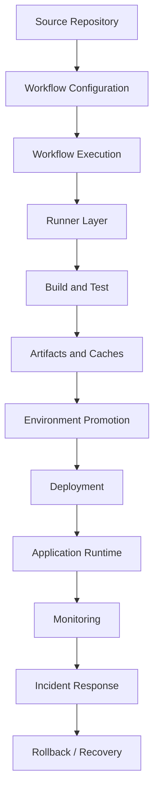
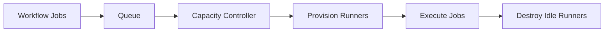
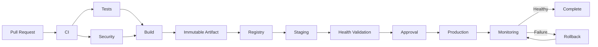

# README

## Overview

This section covers the operational layer required to run GitHub Actions reliably at production scale.

The focus is not on individual YAML features, but on operating the CI/CD platform itself:

```text
Workflows
    ↓
Runners
    ↓
Environments
    ↓
Secrets and Variables
    ↓
Artifacts and Caches
    ↓
Monitoring and Logs
    ↓
Reliability
    ↓
Governance
```

Production CI/CD requires more than successful workflow execution. The platform must remain secure, observable, scalable, cost-effective, and recoverable when workloads, repositories, teams, and deployment frequency increase.

---

## What This Section Covers

| Area | Focus |
|---|---|
| Runner Management | Registration, labels, groups, lifecycle, capacity |
| Runner Security | Isolation, persistent vs ephemeral execution, private networks |
| Runner Autoscaling | Capacity management and workload-driven scaling |
| Environment Management | Development, staging, production boundaries |
| Secrets and Variables | Secure configuration and operational lifecycle |
| Artifact Management | Retention, promotion, and production identity |
| Cache Management | Performance optimization without treating caches as artifacts |
| Workflow Operations | Limits, execution behavior, and operational controls |
| Monitoring | Workflow, runner, deployment, and application visibility |
| Logs and Debugging | Failure diagnosis and operational investigation |
| Reliability | Idempotency, retries, concurrency, failure isolation |
| Cost Optimization | Runner, matrix, artifact, cache, and execution costs |
| Governance | Policies, allowlists, permissions, and organizational standards |

---

## Production Operations Model

A mature GitHub Actions platform should be managed as a layered system.



Each layer has a different failure domain.

For example:

- A workflow syntax problem is not a runner problem.
- A runner capacity problem is not an application failure.
- An ECR authentication failure is not necessarily a Docker build failure.
- A failed health check after deployment is different from a failed deployment command.

Operational diagnosis should preserve these boundaries.

---

## Runner Operations

Runners provide the execution environment for GitHub Actions jobs.

A production runner strategy should define:

- Which repositories can use a runner
- Which workflows can use it
- Which labels identify its capabilities
- Which runner group controls access
- Whether the runner is persistent or ephemeral
- Which network resources it can access
- How it is provisioned
- How it is updated
- How it is monitored
- How it is retired

---

## GitHub-Hosted vs Self-Hosted Runners

| Characteristic | GitHub-Hosted | Self-Hosted |
|---|---|---|
| Infrastructure management | GitHub | Organization |
| Private network access | Limited by architecture | Full control |
| Custom software | Limited to image capabilities | Full control |
| Operational overhead | Lower | Higher |
| Isolation model | Managed | Organization responsibility |
| Persistent state control | Limited | Full control |
| Autoscaling control | Platform-managed | Organization-managed |
| Best use | Standard CI | Specialized/private workloads |

Use GitHub-hosted runners when they satisfy the workload.

Use self-hosted runners when requirements such as private network access, specialized hardware, or custom software justify the additional operational responsibility.

---

## Runner Registration

Runner registration should be automated where possible.

A production process should establish:

```text
Provision Runner
      ↓
Install Runner
      ↓
Register Runner
      ↓
Apply Labels
      ↓
Assign Runner Group
      ↓
Validate Connectivity
      ↓
Accept Jobs
```

Avoid manually registering large fleets of runners.

Infrastructure-as-code, golden images, or automated bootstrap processes make runner replacement predictable.

---

## Runner Labels

Labels describe runner capabilities.

Example:

```yaml
runs-on:
  - self-hosted
  - linux
  - private-network
```

Possible labels include:

```text
linux
windows
docker
private-network
production
gpu
arm64
```

Labels should describe capabilities rather than become an uncontrolled authorization mechanism.

Access control should primarily come from runner groups and repository/workflow policy.

---

## Runner Groups

Runner groups provide an important isolation boundary.

Example:

```text
Public CI Runners
    └── Standard repositories

Private Network Runners
    └── Internal services

Production Deployment Runners
    └── Approved deployment workflows
```

Do not allow every repository to use production deployment runners.

---

## Production Runner Segmentation

Separate runner pools by trust and capability.

```text
                Runner Platform
                      |
        +-------------+-------------+
        |             |             |
       CI          Private       Production
     Runners       Runners        Runners
        |             |             |
      Tests       Integration    Deployment
```

This reduces blast radius when a workflow or dependency is compromised.

---

## Persistent Runners

Persistent runners remain available across jobs.

Advantages:

- Lower startup latency
- Preinstalled tooling
- Potentially faster builds

Risks:

- Workspace residue
- Credential residue
- Cross-job contamination
- Package drift
- Persistent compromise
- Docker state leakage

Persistent runners require strong lifecycle and cleanup controls.

---

## Ephemeral Runners

Ephemeral runners are created for limited workloads and then destroyed.

Typical lifecycle:

```text
Create
  ↓
Bootstrap
  ↓
Register
  ↓
Run Job
  ↓
Collect Required Metadata
  ↓
Destroy
```

Advantages:

- Reduced cross-job contamination
- Better isolation
- Easier replacement
- Reduced long-lived state

Trade-offs:

- Startup latency
- Provisioning complexity
- Image/bootstrap management
- Autoscaling requirements

---

## Runner Image Management

For self-hosted infrastructure, prefer immutable or versioned runner images.

A runner image may contain:

```text
Linux
Python
Docker
AWS CLI
Terraform
kubectl
Security Tools
Organization Tooling
```

Avoid continuously modifying production runners manually.

Prefer:

```text
Image v1
 ↓
Image v2
 ↓
Validation
 ↓
Fleet Replacement
```

rather than:

```text
Existing Runner
 ↓
Manual Package Changes
 ↓
Unknown State
```

---

## Runner Drift

Runner drift occurs when machines gradually diverge.

Examples:

- Different Python versions
- Different Docker versions
- Different OS packages
- Missing CLI tools
- Different environment variables
- Different security patches

Drift causes "works on this runner" failures.

Use immutable images and automated replacement to control it.

---

## Runner Health

Monitor:

- Online/offline state
- Job queue time
- Job execution duration
- CPU utilization
- Memory utilization
- Disk usage
- Network failures
- Registration state
- Runner version
- Unexpected restarts

A runner that is technically online but consistently unable to execute jobs is operationally unhealthy.

---

## Runner Capacity

Capacity planning should consider:

```text
Average Concurrent Jobs
+
Peak Concurrent Jobs
+
Matrix Expansion
+
Deployment Demand
+
Maintenance Capacity
```

For example:

```text
10 repositories
×
5 concurrent jobs
=
Potential 50-job burst
```

Actual capacity requirements depend on queueing, execution duration, workflow concurrency, and runner availability.

---

## Runner Autoscaling

Autoscaling is useful when workloads are bursty.



Scaling should consider:

- Queue depth
- Job labels
- Runner startup time
- Maximum capacity
- Minimum capacity
- Cooldown periods
- Cloud quotas
- Private IP capacity
- Downstream service capacity

---

## Matrix and Autoscaling Interaction

A matrix can multiply workload unexpectedly.

```text
3 Python Versions
×
2 Databases
×
2 Operating Systems
=
12 Jobs
```

A larger matrix can create a sudden runner demand spike.

Use:

```yaml
strategy:
  max-parallel: 4
```

when downstream capacity or runner capacity must be bounded.

---

## Downstream Capacity

Do not scale runners without considering dependencies.

Example:

```text
100 Integration Jobs
        ↓
100 Database Connections
        ↓
PostgreSQL Overload
```

The same problem can occur with:

- Redis
- Kafka
- Internal APIs
- Package registries
- External APIs

CI scalability is constrained by the slowest shared dependency.

---

## Private Network Access

Self-hosted runners are often required when CI needs access to private resources.

Example:

```text
GitHub Actions
      ↓
Ephemeral Runner
      ↓
AWS VPC
 ┌────┼─────────────┐
 ↓    ↓             ↓
RDS  Redis      Internal gRPC
```

Network controls should restrict access to only the required services.

---

## Network Security

Use:

- Security groups
- Network ACLs where appropriate
- Private subnets
- VPC endpoints
- Controlled egress
- DNS controls
- TLS
- Network segmentation

Do not treat private network access as automatically trusted.

A compromised workflow executing on a private runner may inherit the runner's network reachability.

---

## Environment Management

A production environment model commonly includes:

```text
Development
    ↓
Staging
    ↓
Production
```

Each environment should define:

- Configuration
- Secrets
- Deployment permissions
- Branch restrictions
- Review requirements
- Infrastructure
- Monitoring expectations

---

## Environment Boundaries

Environment separation should prevent accidental promotion.

For example:

```text
Development Credentials
≠
Staging Credentials
≠
Production Credentials
```

Likewise:

```text
Development AWS Account
≠
Production AWS Account
```

where organizational architecture permits account separation.

---

## Production Environment Protection

Production should typically have controls such as:

```text
Protected Branch
+
Required Checks
+
Required Reviewers
+
Environment Secrets
+
Deployment Concurrency
+
Audit History
```

Approval should be the final control in a pipeline that already performs strong automated validation.

---

## Secret Operations

Secrets should be managed according to lifecycle:

```text
Create
 ↓
Scope
 ↓
Use
 ↓
Monitor
 ↓
Rotate
 ↓
Revoke
```

Avoid treating secrets as permanent static configuration.

---

## Secret Scope

Prefer the narrowest useful scope:

```text
Organization
    ↓
Repository
    ↓
Environment
    ↓
Job
```

Production credentials should not be available to unrelated CI jobs.

---

## Variables vs Secrets

| Type | Typical Use |
|---|---|
| Variable | Non-sensitive configuration |
| Secret | Sensitive credential or token |
| Environment Variable | Runtime/process configuration |
| Environment Secret | Environment-specific sensitive configuration |

Do not store credentials in ordinary variables.

---

## AWS OIDC

For AWS deployments, prefer short-lived credentials:

```text
GitHub Actions
      ↓
OIDC Token
      ↓
AWS STS
      ↓
IAM Role
      ↓
ECR / ECS / EC2 / Lambda
```

Example:

```yaml
permissions:
  contents: read
  id-token: write
```

Then configure the AWS role trust policy to restrict which workflows can assume it.

---

## IAM Separation

Do not use one broad AWS role for all CI/CD operations.

Prefer:

```text
CI Role
 └── ECR Push

Deployment Role
 └── ECS Deployment

Infrastructure Role
 └── Terraform / CloudFormation
```

This limits blast radius.

---

## Artifact Operations

Artifacts should have clear ownership and lifecycle.

A production artifact should answer:

```text
What is it?
Which commit produced it?
Which workflow produced it?
When was it created?
Where was it tested?
Can it be promoted?
Can it be rolled back?
```

---

## Build Once, Promote Many

Use:

```text
Source
 ↓
Build
 ↓
Artifact A
 ↓
Staging
 ↓
Approval
 ↓
Production
```

Avoid:

```text
Build A → Staging
Build B → Production
```

The production artifact should be the same artifact that passed the required validation.

---

## Docker Artifact Identity

Use commit-based identifiers:

```text
orders-api:7f31d2a
```

and retain the immutable image digest:

```text
orders-api@sha256:<digest>
```

A digest is stronger than a mutable tag as the deployment identity.

---

## Artifact Retention

Retention should match operational requirements.

Consider:

- Rollback window
- Incident investigation
- Compliance
- Storage cost
- Release frequency

Do not retain every artifact forever without a business or operational reason.

---

## Cache Management

Caches are performance optimizations.

Typical caches include:

```text
pip
npm
Gradle
Docker BuildKit
```

A cache miss should not make a workflow logically incorrect.

---

## Cache Keys

A cache key should change when relevant dependencies change.

For example:

```yaml
key: ${{ runner.os }}-pip-${{ hashFiles('**/requirements.lock') }}
```

Avoid overly broad cache keys that allow unrelated builds to reuse incompatible state.

---

## Cache Security

Treat caches as potentially reusable state, not trusted deployment artifacts.

Do not place secrets or sensitive runtime data into caches.

Be especially careful when untrusted pull requests can interact with cache state.

---

## Workflow Storage

Manage:

- Artifact retention
- Cache usage
- Logs
- Test reports
- Build outputs
- Debugging files

Storage policies should balance operational usefulness and cost.

---

## Monitoring

Monitor GitHub Actions at several levels.

### Workflow Level

Track:

- Success rate
- Failure rate
- Duration
- Queue time
- Cancellation rate
- Retry frequency

### Runner Level

Track:

- Availability
- CPU
- Memory
- Disk
- Queue depth
- Provisioning time

### Deployment Level

Track:

- Deployment frequency
- Deployment duration
- Failure rate
- Rollback frequency
- Post-deployment incidents

---

## CI/CD Operational Metrics

Useful indicators include:

| Metric | Why It Matters |
|---|---|
| Workflow Duration | Developer feedback speed |
| Queue Time | Runner capacity |
| Failure Rate | Pipeline reliability |
| Flaky Test Rate | Test quality |
| Deployment Duration | Release efficiency |
| Rollback Rate | Deployment stability |
| Runner Utilization | Capacity planning |
| Artifact Storage | Cost management |
| Cache Hit Rate | Build efficiency |

---

## Logs

Logs should provide enough information to reconstruct execution without exposing secrets.

Useful metadata includes:

```text
Repository
Workflow
Run ID
Commit SHA
Job
Runner
Environment
Artifact
Deployment ID
```

Avoid printing:

- Secrets
- Access tokens
- Private credentials
- Sensitive request payloads

---

## Step Summaries

Use step summaries for operationally important information.

```bash
{
  echo "## Deployment"
  echo "- Environment: production"
  echo "- Commit: ${GITHUB_SHA}"
  echo "- Image: ${IMAGE_DIGEST}"
} >> "$GITHUB_STEP_SUMMARY"
```

This makes deployment information easier to inspect than searching raw logs.

---

## Debugging Model

Troubleshooting should follow:

```text
Symptom
 ↓
Possible Causes
 ↓
Isolation Strategy
 ↓
Commands / Checks
 ↓
Root Cause
 ↓
Corrective Action
 ↓
Prevention
```

Avoid changing multiple unrelated configuration values at once.

---

## Common Operational Failure Domains

| Symptom | Likely Domain |
|---|---|
| Workflow does not start | Trigger/configuration |
| Job stays queued | Runner/capacity |
| Permission denied | GitHub permissions/IAM |
| Secret unavailable | Secret/environment scope |
| Docker build fails | Build context/dependency/toolchain |
| Image push fails | Registry/authentication |
| Deployment starts twice | Concurrency |
| Service starts but fails health check | Runtime/deployment |
| Tests become slow | Runner/dependency/service capacity |
| Cache misses | Cache key/configuration |

---

## Workflow Limits

Production design should account for platform constraints.

Avoid architectures that depend on:

- Extremely large matrices
- Excessive artifact volume
- Long-running monolithic jobs
- Unlimited concurrency
- Huge log output
- Persistent runner state
- Excessive workflow chaining

When a workflow approaches platform or organizational limits, redesign the workflow rather than relying on increasingly fragile workarounds.

---

## Reliability

Reliable CI/CD should be:

- Deterministic
- Idempotent
- Observable
- Retryable where appropriate
- Timeout-bound
- Concurrency-aware
- Recoverable

A deployment command should be safe to rerun when possible.

---

## Idempotent Operations

Example:

```text
Deploy Image A
      ↓
Image A already active
      ↓
No destructive duplicate operation
```

Avoid deployment scripts that assume they will execute exactly once.

---

## Retry Strategy

Retry transient failures:

```text
Network Timeout
AWS Throttling
Temporary Registry Failure
```

Do not repeatedly retry deterministic failures:

```text
Invalid IAM Policy
Syntax Error
Failed Test
Invalid Configuration
```

Use bounded retries with backoff.

---

## Deployment Concurrency

Production deployments should normally be serialized.

```yaml
concurrency:
  group: production
  cancel-in-progress: false
```

This prevents two deployments from modifying the same production environment simultaneously.

---

## Failure Isolation

A production platform should distinguish:

```text
Workflow Failure
Runner Failure
Build Failure
Artifact Failure
Authentication Failure
Deployment Failure
Application Failure
```

Each requires a different investigation path.

---

## Production Deployment Architecture



The operational layer ensures every transition has appropriate controls.

---

## High Availability

CI/CD infrastructure should avoid single points of failure.

For self-hosted runners:

```text
Runner A
Runner B
Runner C
```

should be available rather than relying on a single machine.

For production deployment infrastructure, use appropriate AWS or Kubernetes availability architecture rather than treating the CI runner as the application runtime.

---

## Disaster Recovery

CI/CD recovery should consider:

```text
Repository
Workflow Definitions
Runner Infrastructure
Artifact Registry
Infrastructure Code
Secrets
Deployment Configuration
```

Infrastructure-as-code and immutable artifacts are particularly important for recovery.

---

## Runner Disaster Recovery

A runner should be replaceable.

Preferred model:

```text
Runner Lost
   ↓
Provision Replacement
   ↓
Register
   ↓
Apply Labels
   ↓
Resume Workload
```

Avoid architectures where critical runner state exists only on one machine.

---

## Cost Optimization

Major cost drivers include:

- Runner execution time
- Excessive matrix dimensions
- Redundant workflows
- Docker builds
- Artifact storage
- Cache storage
- Self-hosted infrastructure
- Large E2E suites

Optimize the workflow architecture before simply increasing infrastructure.

---

## Cost Optimization Techniques

Use:

- Path filters
- Dependency caching
- Appropriate matrix dimensions
- `max-parallel`
- Reusable workflows
- Selective E2E execution
- Appropriate artifact retention
- Ephemeral runners for bursty workloads
- Efficient Docker layer caching

Do not remove critical validation solely to reduce cost.

---

## Governance

Enterprise GitHub Actions environments should establish standards for:

```text
Actions
Permissions
Secrets
Runners
Environments
Artifacts
Deployments
Workflow Files
Security
```

Governance should reduce risk without preventing teams from implementing legitimate application-specific workflows.

---

## Organization Policies

Useful organizational controls include:

- Approved action sources
- Action allowlists
- SHA pinning
- Permission standards
- Runner group restrictions
- Environment protection
- Required security checks
- Reusable workflow standards

---

## Action Allowlisting

An enterprise may maintain an approved set of actions.

Example:

```text
Approved
├── actions/checkout
├── actions/setup-python
├── actions/upload-artifact
├── docker/*
└── aws-actions/*
```

Sensitive workflows should avoid arbitrary third-party actions.

---

## Workflow Governance

Workflow changes should receive appropriate review because workflow files can control:

```text
Secrets
AWS Access
Production Deployment
Runner Selection
Artifact Creation
Permissions
```

Protect `.github/workflows/` using normal repository governance controls.

---

## Operational Ownership

Define ownership for:

| Component | Typical Owner |
|---|---|
| Application Workflow | Application Team |
| Reusable CI Workflow | Platform Team |
| Runner Fleet | Platform Team |
| Production Environment | Platform / Operations |
| AWS IAM | Cloud / Security |
| Action Allowlist | Platform / Security |
| Artifact Registry | Platform / Cloud |
| Incident Response | Application + Platform |

The exact organizational model may differ, but ownership should be explicit.

---

## GitHub CLI for Operations

GitHub CLI is useful for day-to-day Actions operations.

### List Workflows

```bash
gh workflow list
```

### View Workflow

```bash
gh workflow view <workflow>
```

### Run Workflow

```bash
gh workflow run <workflow>
```

### List Runs

```bash
gh run list
```

### Inspect Run

```bash
gh run view <run-id>
```

### View Logs

```bash
gh run view <run-id> --log
```

### Rerun

```bash
gh run rerun <run-id>
```

### List Artifacts

```bash
gh run view <run-id> --json artifacts
```

Use the CLI to investigate and operate workflows without turning the command line into an alternative source of undocumented deployment logic.

---

## Operational Runbook

A production CI/CD runbook should include:

```text
Workflow Failure
      ↓
Identify Run
      ↓
Identify Failed Job
      ↓
Classify Failure Domain
      ↓
Inspect Logs
      ↓
Check Dependencies
      ↓
Validate Permissions
      ↓
Determine Corrective Action
      ↓
Rerun or Rollback
      ↓
Record Root Cause
```

---

## Production Readiness Checklist

### Runners

- [ ] Runner ownership is defined.
- [ ] Runner groups are configured.
- [ ] Labels are meaningful.
- [ ] Capacity is monitored.
- [ ] Persistent runners are hardened.
- [ ] Ephemeral runners are used where isolation is important.
- [ ] Runner images are versioned.
- [ ] Runner replacement is automated.

### Environments

- [ ] Development, staging, and production are clearly separated.
- [ ] Production is protected.
- [ ] Required reviewers are configured where appropriate.
- [ ] Environment secrets are scoped correctly.
- [ ] Deployment history is auditable.
- [ ] Production concurrency is configured.

### Secrets

- [ ] Secrets have appropriate scope.
- [ ] Production secrets are not exposed to untrusted PRs.
- [ ] AWS uses OIDC where appropriate.
- [ ] Secrets are not printed to logs.
- [ ] Rotation procedures exist.

### Artifacts and Caches

- [ ] Production artifacts are immutable.
- [ ] Build artifacts are traceable to source.
- [ ] Staging and production use the same artifact.
- [ ] Artifact retention is intentional.
- [ ] Cache keys are deterministic.
- [ ] Caches are not treated as deployment artifacts.

### Reliability

- [ ] Deployments are idempotent.
- [ ] Timeouts are configured.
- [ ] Retries are bounded.
- [ ] Deployment concurrency is controlled.
- [ ] Rollback is documented.
- [ ] Health validation exists.

### Monitoring

- [ ] Workflow failures are observable.
- [ ] Runner health is monitored.
- [ ] Deployment metrics exist.
- [ ] Logs are actionable.
- [ ] Deployment metadata is traceable.
- [ ] Failure artifacts are retained appropriately.

### Governance

- [ ] Approved actions are defined.
- [ ] Permissions are minimized.
- [ ] Workflow files are protected.
- [ ] Runner access is controlled.
- [ ] Ownership is documented.
- [ ] Security standards are enforced.

---

## Common Mistakes

### Treating Runners as Permanent Servers

Runners should be replaceable infrastructure.

### Giving Every Repository Access to Production Runners

Use runner groups and explicit access controls.

### Storing Production Credentials Globally

Scope secrets to the smallest required environment and workflow boundary.

### Rebuilding for Production

Promote the artifact that passed staging validation.

### Treating Cache as Artifact Storage

Caches are optimization mechanisms, not authoritative release artifacts.

### Unlimited Matrix Execution

Bound concurrency and consider downstream capacity.

### No Deployment Concurrency

Production deployments can race without explicit concurrency controls.

### Manual Runner Configuration

Manual configuration creates drift.

### No Runner Cleanup

Persistent runners can accumulate credentials, packages, files, and Docker state.

### Monitoring Only Application Runtime

A production platform also needs visibility into CI/CD and runner health.

---

## Senior-Level Operational Questions

A senior engineer should be able to explain:

### Runner Architecture

- Why use GitHub-hosted versus self-hosted runners?
- When should runners be ephemeral?
- How are private network requirements handled?
- How is runner capacity scaled?
- How is runner drift prevented?

### Security

- Which jobs can access production credentials?
- What happens if a CI dependency is compromised?
- Can untrusted PR code execute on a private runner?
- How are AWS credentials obtained?

### Reliability

- What happens if deployment A and B start together?
- Can a failed deployment be safely retried?
- How is rollback performed?
- What happens if the registry is temporarily unavailable?

### Scalability

- What happens when matrix size increases tenfold?
- Can PostgreSQL handle integration-test concurrency?
- How quickly can runner capacity scale?

### Operations

- How do you determine whether a failure is a runner problem or workflow problem?
- What information is retained for incident investigation?
- How do you replace a failed runner?
- How do you measure CI/CD reliability?

---

## Production Architecture Principles

A mature runner and operations platform should follow these principles:

```text
Immutable Infrastructure
        +
Least Privilege
        +
Ephemeral Execution
        +
Explicit Environment Boundaries
        +
Immutable Artifacts
        +
Controlled Concurrency
        +
Observable Operations
        +
Automated Recovery
        +
Governance
```

The objective is not merely to make workflows execute successfully. The objective is to make the entire delivery platform predictable under normal operation, failure, scale, and security incidents.

---

## Key Takeaways

- Treat runners, environments, artifacts, secrets, and workflows as **production infrastructure with explicit ownership, lifecycle, security, and operational controls**.
- Prefer **isolated and replaceable execution**, using runner groups, ephemeral runners, controlled private-network access, and automated provisioning where appropriate.
- Keep production delivery based on **immutable artifacts, protected environments, least-privilege credentials, deployment concurrency, health validation, and rollback capability**.
- Operate CI/CD using **failure-domain troubleshooting, measurable reliability metrics, capacity planning, monitoring, and deliberate cost controls**.
- At organizational scale, combine **runner governance, action policies, permissions standards, reusable workflows, artifact management, and security controls** into a consistent platform model.