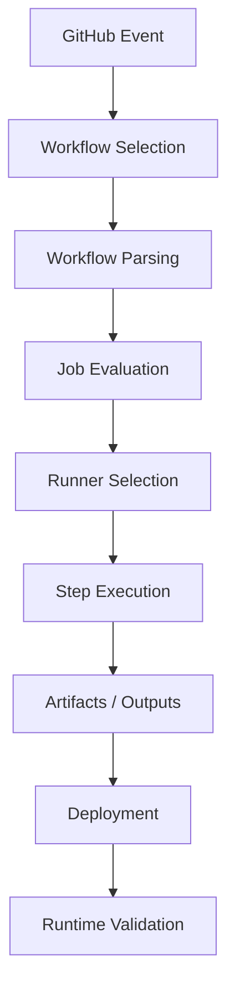
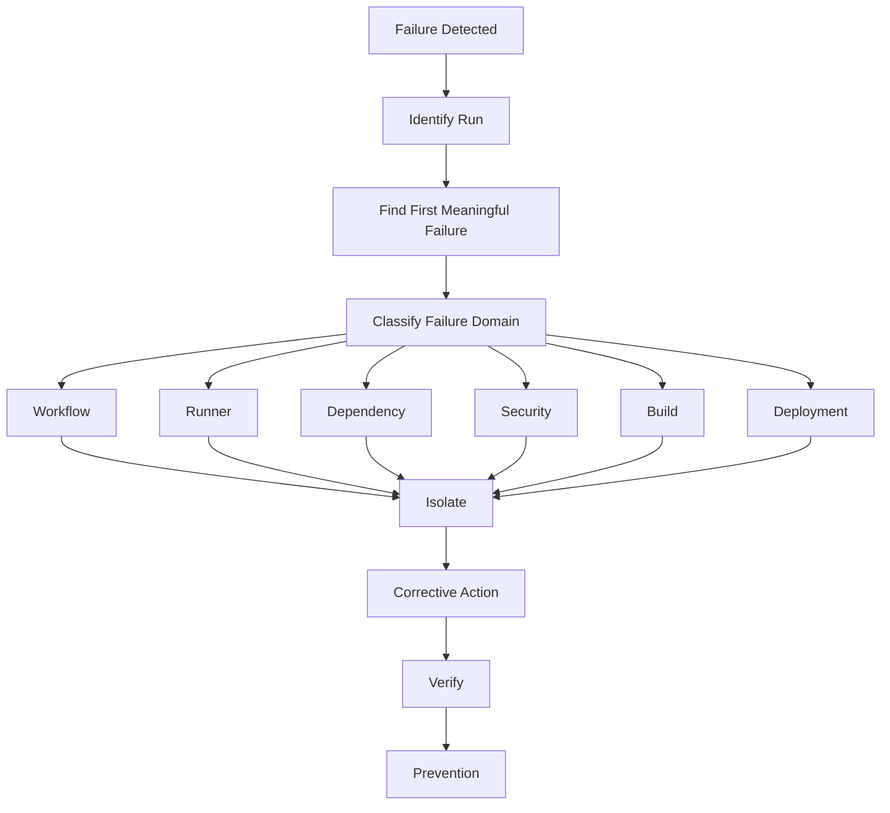

# 01- Troubleshooting Methodology

## Overview

Production CI/CD failures should be investigated systematically rather than through trial-and-error YAML changes.

GitHub Actions introduces multiple execution layers:

```text
GitHub Event
    ↓
Workflow Configuration
    ↓
Job
    ↓
Runner
    ↓
Step / Action
    ↓
External Dependency
    ↓
Artifact / Deployment
    ↓
Runtime
```

A failure at any layer can produce similar symptoms.

For example:

```text
"Deployment failed"
```

could actually mean:

- The workflow never triggered.
- The job was skipped by an expression.
- No runner was available.
- An action failed.
- AWS authentication failed.
- The Docker image was not pushed.
- ECS started the task but the health check failed.
- The application started but PostgreSQL was unavailable.

A senior engineer should first identify the failure domain, then isolate the smallest failing component.

---

## Core Troubleshooting Model

Use the following investigation model consistently:

```text
Symptom
   ↓
Possible Causes
   ↓
Isolation Strategy
   ↓
Commands / Checks
   ↓
Root Cause
   ↓
Corrective Action
   ↓
Prevention
```

Do not start by changing configuration.

First determine what actually happened.

---

## Troubleshooting Principles

### Reproduce Before Changing

If a failure is deterministic, reproduce it with the same:

- Commit
- Workflow
- Inputs
- Environment
- Runner type
- Artifact
- Configuration

Avoid making several changes before reproducing the problem.

Otherwise the investigation loses causality.

### Start at the Earliest Failure

If five jobs fail because one upstream job failed, investigate the first meaningful failure.

```text
Lint ────────────────┐
Unit Tests ──────────┤
Integration Tests ───┼── Build ── Deploy
                     │
Security ────────────┘
```

If `Build` failed, do not initially investigate `Deploy`.

### Separate Symptom from Cause

Example:

```text
Symptom:
ECS deployment failed

Possible underlying cause:
Container health check failed

Possible root cause:
Application could not connect to Redis
```

The final error message is not necessarily the root cause.

---

## Failure Domain Classification

Classify a failure before investigating it.

| Domain | Typical Symptoms |
|---|---|
| Workflow Configuration | YAML errors, workflow not loading |
| Trigger | Workflow never starts |
| Conditions | Job or step unexpectedly skipped |
| Expression | Invalid or unexpected values |
| Context | Missing or incorrect GitHub data |
| Environment | Incorrect configuration |
| Secrets | Missing or inaccessible credentials |
| Permissions | 403 or resource access errors |
| Matrix | Invalid combinations or missing outputs |
| Reusable Workflow | Inputs, outputs, or permissions problems |
| Artifact | Missing or incorrect build output |
| Cache | Unexpected misses or stale state |
| Container | Image, filesystem, network, or process errors |
| Service Container | Readiness or connectivity failures |
| Runner | Offline, capacity, disk, or software issues |
| Custom Action | Runtime or packaging failure |
| OIDC | Token or trust-policy failure |
| AWS | STS, IAM, ECR, ECS, EC2, Lambda failures |
| Docker | Build, authentication, or image problems |
| Registry | Push/pull/tag failures |
| Deployment | Runtime or orchestration problems |
| Concurrency | Race conditions or skipped work |
| Security | Policy, trust, or credential violations |

---

## Troubleshooting Workflow

A practical investigation can follow:

```text
1. Identify the failing workflow run
2. Identify the first failed job
3. Identify the first failed step
4. Read the complete relevant log section
5. Classify the failure domain
6. Reproduce the smallest failing operation
7. Inspect inputs and execution context
8. Verify permissions and dependencies
9. Apply the smallest corrective change
10. Rerun
11. Confirm the underlying cause is resolved
12. Add prevention where appropriate
```

---

## Establish the Execution Context

Before diagnosing a failure, establish:

```text
Repository
Workflow
Run ID
Commit SHA
Event
Branch / Tag
Environment
Job
Runner
Matrix Variant
Artifact
Deployment Target
```

A failure that occurs only on:

```text
Python 3.13 + PostgreSQL
```

has a very different investigation path from a failure that occurs on every job.

---

## GitHub Actions Execution Flow

A useful mental model is:



Determine which stage failed before investigating deeper layers.

---

## Workflow Syntax Failures

A workflow can fail before a job starts because of invalid YAML or unsupported workflow configuration.

Typical symptoms:

```text
Workflow does not appear
Workflow fails validation
Unexpected YAML error
Invalid key
Invalid workflow syntax
```

Check:

- YAML indentation
- Mapping structure
- List syntax
- Expression syntax
- Job definitions
- Event configuration
- Unsupported keys
- Incorrect nesting

Example:

```yaml
jobs:
  test:
    runs-on: ubuntu-latest
    steps:
      - uses: actions/checkout@v4
```

Compare malformed structures carefully.

---

## YAML Indentation

YAML is whitespace-sensitive.

Incorrect:

```yaml
jobs:
test:
  runs-on: ubuntu-latest
```

Correct:

```yaml
jobs:
  test:
    runs-on: ubuntu-latest
```

When a workflow behaves unexpectedly, inspect the structure before investigating runtime behavior.

---

## Trigger Troubleshooting

A workflow that does not run is not necessarily broken.

Check:

```text
Event
 ↓
Branch Filter
 ↓
Path Filter
 ↓
Tag Filter
 ↓
Repository / Organization Policy
 ↓
Workflow Availability
```

Example:

```yaml
on:
  push:
    branches:
      - main
```

A push to `develop` will not trigger this workflow.

---

## Branch Filter Problems

Verify:

```text
Actual Branch
Expected Branch
Pattern
Event Type
```

For pull requests, remember that branch filters apply to the appropriate event target semantics rather than simply the source branch name.

---

## Path Filter Problems

Example:

```yaml
on:
  pull_request:
    paths:
      - "src/**"
      - "tests/**"
```

A change only to:

```text
README.md
```

may not trigger the workflow.

Path filtering is useful for monorepos but can accidentally skip required validation if dependencies between directories are misunderstood.

---

## Tag Filter Problems

Example:

```yaml
on:
  push:
    tags:
      - "v*"
```

Verify:

```bash
git tag
git ls-remote --tags origin
```

Make sure the tag actually exists on the remote repository.

---

## Manual Workflow Troubleshooting

For `workflow_dispatch`, verify:

- Workflow exists on the expected branch.
- The workflow supports manual execution.
- Required inputs are supplied.
- Repository permissions allow the operation.
- The selected ref contains the workflow definition.

Example:

```yaml
on:
  workflow_dispatch:
    inputs:
      environment:
        required: true
        type: choice
        options:
          - staging
          - production
```

---

## Job Skipped Troubleshooting

A job can be skipped without being broken.

Common causes:

```yaml
if: github.ref == 'refs/heads/main'
```

or:

```yaml
if: needs.test.result == 'success'
```

Check:

- `if`
- `needs`
- Matrix expressions
- Event context
- Branch
- Tag
- Inputs
- Previous job result

---

## `if` Conditions

For example:

```yaml
if: ${{ github.ref == 'refs/heads/main' }}
```

Ask:

```text
What value does github.ref actually contain?
```

Do not infer context values from memory.

Inspect the relevant context safely.

---

## Status Functions

Common status functions include:

```text
success()
failure()
cancelled()
always()
```

They have different semantics.

For diagnostic or cleanup work:

```yaml
if: ${{ !cancelled() }}
```

can be preferable to blindly using:

```yaml
if: ${{ always() }}
```

because cancellation behavior matters.

---

## `continue-on-error`

`continue-on-error` changes failure propagation.

Example:

```yaml
- name: Experimental check
  continue-on-error: true
  run: ./experimental-check.sh
```

This can be useful for non-blocking checks, but it can also hide genuine failures.

Do not use it as a generic fix for unstable pipelines.

---

## Expression vs Shell Troubleshooting

GitHub evaluates expressions before the shell executes the command.

Example:

```yaml
env:
  BRANCH_NAME: ${{ github.ref_name }}

steps:
  - run: printf '%s\n' "$BRANCH_NAME"
```

There are two different evaluation systems:

```text
GitHub Expression Evaluation
          ↓
Generated Step Environment
          ↓
Shell Evaluation
```

A value can therefore be correct at the GitHub expression layer but unsafe or incorrect at the shell layer.

---

## Context Troubleshooting

Important contexts include:

```text
github
env
vars
secrets
steps
needs
job
runner
matrix
strategy
inputs
```

When a value is unexpected, determine:

1. Which context contains it?
2. Is that context available at this workflow level?
3. Is the value evaluated before or during step execution?
4. Is the value being interpreted by the shell afterward?

---

## Safe Context Inspection

Avoid dumping sensitive contexts.

Do not use broad debugging such as:

```yaml
run: echo '${{ toJSON(secrets) }}'
```

Instead inspect non-sensitive fields deliberately.

Example:

```yaml
env:
  EVENT_NAME: ${{ github.event_name }}
  REF: ${{ github.ref }}
  SHA: ${{ github.sha }}

steps:
  - run: |
      printf 'event=%s\n' "$EVENT_NAME"
      printf 'ref=%s\n' "$REF"
      printf 'sha=%s\n' "$SHA"
```

---

## Environment Variable Troubleshooting

Environment variables can exist at different scopes:

```text
Workflow
 ↓
Job
 ↓
Step
```

Check where the value is defined and where it is consumed.

Example:

```yaml
env:
  APP_ENV: test

jobs:
  test:
    env:
      DATABASE_NAME: app_test
```

A step can override or add values locally.

---

## Variables vs Environment Variables

`vars` and `env` are different mechanisms.

For example:

```yaml
env:
  APP_MODE: test
```

versus:

```yaml
run: echo "${{ vars.APP_MODE }}"
```

When debugging, determine whether the value originates from:

- Workflow YAML
- Repository variables
- Organization variables
- Environment variables
- Step environment

---

## Secret Troubleshooting

A secret may be missing because:

- The secret does not exist.
- It is scoped to another environment.
- The workflow is running from an untrusted context.
- The job does not reference the expected environment.
- The reusable workflow does not receive the secret.
- The secret is unavailable to the triggering event.

Do not assume an empty secret means the secret itself is corrupted.

---

## `secrets: inherit`

Reusable workflows may use:

```yaml
jobs:
  ci:
    uses: company/platform/.github/workflows/ci.yml@v1
    secrets: inherit
```

When troubleshooting, verify:

```text
Caller
 ↓
Reusable Workflow
 ↓
Secret Availability
 ↓
Job
```

Do not expose more secrets than the reusable workflow actually requires.

---

## Secret Exposure

Never diagnose secret problems by printing the secret.

Avoid:

```yaml
run: echo "${{ secrets.API_TOKEN }}"
```

Even when GitHub masks known secret values, relying on masking as a debugging mechanism is unsafe.

Instead verify:

```text
Secret Exists
Scope Correct
Environment Correct
Workflow Context Correct
Consumer Receives Value
```

without exposing the value.

---

## Permissions Troubleshooting

Common symptoms:

```text
403 Forbidden
Resource not accessible
Permission denied
Access denied
```

Inspect the workflow permissions.

Example:

```yaml
permissions:
  contents: read
```

For OIDC:

```yaml
permissions:
  contents: read
  id-token: write
```

Then inspect downstream authorization.

---

## GITHUB_TOKEN Troubleshooting

Check:

```text
Workflow permissions
Job permissions
Repository settings
Organization policy
Target API
```

A token can exist but still lack the required permission.

---

## OIDC Troubleshooting

The authentication chain is:

```text
GitHub Workflow
      ↓
id-token: write
      ↓
GitHub OIDC Token
      ↓
AWS STS
      ↓
IAM Trust Policy
      ↓
IAM Role
      ↓
AWS API
```

Investigate each layer separately.

---

## AWS Identity Check

After AWS authentication, verify the active identity.

```bash
aws sts get-caller-identity
```

This answers:

```text
Which AWS account?
Which IAM role?
Which principal?
```

Do this before investigating ECR, ECS, S3, or other AWS permissions.

---

## IAM Trust Policy Failures

If `AssumeRoleWithWebIdentity` fails, inspect:

- OIDC provider
- Audience
- Subject
- Repository
- Branch
- Environment
- Trust policy conditions

The workflow can have valid GitHub permissions while AWS still rejects the identity.

---

## ECR Troubleshooting

For ECR failures, isolate:

```text
AWS Identity
 ↓
ECR Authentication
 ↓
Repository
 ↓
Push Permission
 ↓
Image Tag
 ↓
Network
```

Useful commands:

```bash
aws sts get-caller-identity
aws ecr describe-repositories --repository-names my-api
```

Then inspect the Docker login and push operation.

---

## Docker Authentication

Typical workflow:

```bash
aws ecr get-login-password --region "$AWS_REGION" \
  | docker login \
      --username AWS \
      --password-stdin "$REGISTRY"
```

If login succeeds but push fails, investigate repository permissions and image naming rather than repeatedly authenticating.

---

## Docker Build Troubleshooting

Classify failures:

```text
Dockerfile Syntax
Dependency Installation
Build Context
Network
Base Image
BuildKit
Cache
Architecture
Secrets
```

Inspect the first meaningful error rather than the final cascade of failures.

---

## Docker Build Context

A common problem is a missing file:

```text
COPY failed
file not found
```

Check:

```text
Docker build context
.dockerignore
COPY source
Working directory
```

For example:

```bash
docker build -f deploy/Dockerfile .
```

has `.` as the build context, not `deploy/`.

---

## Docker Multi-Architecture Problems

A build may succeed locally but fail in CI because of architecture differences.

Check:

```bash
docker version
docker buildx version
uname -m
```

For multi-platform builds:

```yaml
with:
  platforms: linux/amd64,linux/arm64
```

Verify that dependencies and base images support every target architecture.

---

## Docker Layer Cache Problems

A cache miss usually affects performance rather than correctness.

Check:

```text
Cache Backend
Cache Key
Dockerfile Layer Order
Build Context
Dependency Files
```

Do not treat cache availability as a correctness requirement.

---

## Artifact Troubleshooting

When an artifact is missing, check:

```text
Upload Step Executed?
 ↓
Path Exists?
 ↓
Job Reached Upload?
 ↓
Artifact Name
 ↓
Run ID
 ↓
Retention
```

Example:

```yaml
- name: Upload reports
  if: ${{ !cancelled() }}
  uses: actions/upload-artifact@v4
  with:
    name: test-reports
    path: reports/
```

---

## Artifact Path Problems

A common failure is assuming a relative path exists.

Add controlled diagnostics:

```bash
pwd
find reports -maxdepth 2 -type f -print
```

Avoid recursively printing sensitive workspace contents.

---

## Cache Troubleshooting

Inspect:

```text
OS
Dependency Lock File
Cache Key
Restore Keys
Cache Scope
```

Example:

```yaml
key: ${{ runner.os }}-pip-${{ hashFiles('**/requirements.lock') }}
```

If the lock file changes, a new cache key may be expected.

---

## Service Container Troubleshooting

A service container must be:

```text
Created
 ↓
Started
 ↓
Ready
 ↓
Reachable
 ↓
Usable
```

Container startup alone does not guarantee readiness.

---

## PostgreSQL Troubleshooting

Check:

```text
Image
Port
Credentials
Database Name
Health Check
Network
Startup Time
```

From the test job, verify connectivity using the appropriate hostname for the runner architecture.

---

## Redis Troubleshooting

Check:

```text
Service Name
Port
Network
Readiness
Authentication
Application Configuration
```

If Django or FastAPI cannot connect, first determine whether the failure is:

```text
DNS
TCP
Authentication
Application Configuration
```

---

## MySQL Troubleshooting

Check:

```text
Port
User
Password
Database
Character Set
Collation
SQL Mode
Readiness
```

Do not confuse MySQL authentication errors with network connectivity errors.

---

## Integration Test Failures

Separate:

```text
Test Assertion
```

from:

```text
Environment Failure
```

Example:

```text
pytest assertion failed
```

may indicate an application bug.

But:

```text
connection refused
```

likely indicates infrastructure or service readiness.

---

## Test Matrix Troubleshooting

A matrix can hide the actual scope of a failure.

Identify:

```text
Python Version
Database
OS
Dependency Version
```

For example:

```text
Python 3.12 + PostgreSQL → PASS
Python 3.13 + PostgreSQL → FAIL
Python 3.12 + MySQL      → PASS
```

This strongly narrows the investigation.

---

## Dynamic Matrix Troubleshooting

A common pattern is:

```text
Planning Job
    ↓
JSON Output
    ↓
fromJSON()
    ↓
Matrix
```

If the matrix is invalid, inspect the producer first.

Example:

```yaml
outputs:
  matrix: ${{ steps.generate.outputs.matrix }}
```

Then validate the generated JSON before consuming it.

---

## Job Output Troubleshooting

A step output must be written correctly.

```bash
echo "image=api:${GITHUB_SHA}" >> "$GITHUB_OUTPUT"
```

Then expose it at the job level:

```yaml
outputs:
  image: ${{ steps.build.outputs.image }}
```

Then consume it:

```yaml
needs.build.outputs.image
```

Trace the complete data path:

```text
Step Output
 ↓
Job Output
 ↓
needs.<job>.outputs
```

---

## Reusable Workflow Troubleshooting

Check:

```text
workflow_call
Inputs
Outputs
Secrets
Permissions
Referenced Ref
Caller
Callee
```

A reusable workflow has its own interface contract.

Verify that the caller and reusable workflow agree on:

```text
Input Name
Input Type
Required State
Output Name
Secret Availability
Permissions
```

---

## Custom Action Troubleshooting

For a composite action, inspect:

```text
action.yml
Inputs
Outputs
Shell
Working Directory
Environment
```

For JavaScript actions:

```text
action.yml
Node Runtime
Dependencies
dist/
Packaging
API Permissions
```

For Docker actions:

```text
Dockerfile
Entrypoint
Base Image
Inputs
Outputs
Container Runtime
```

---

## Runner Failure Troubleshooting

Symptoms include:

```text
Job remains queued
Runner offline
Runner disconnected
Unexpected tool missing
Disk full
Process killed
```

Check:

```text
Runner Online
Runner Group
Labels
CPU
Memory
Disk
Network
Runner Version
Installed Tools
```

---

## Disk Problems

A full runner can cause seemingly unrelated failures.

Check:

```bash
df -h
```

and:

```bash
du -sh "$RUNNER_WORKSPACE" 2>/dev/null || true
```

For Docker-heavy runners:

```bash
docker system df
```

Do not blindly delete resources on shared persistent runners without understanding what other jobs depend on.

---

## Memory Problems

Symptoms may include:

```text
Killed
Out of memory
Process terminated
Docker build unexpectedly stops
```

Investigate:

```text
Runner Memory
Parallel Jobs
Docker Containers
Test Processes
Build Workers
```

Reduce parallelism or move the workload to an appropriately sized runner.

---

## CPU Problems

High CPU usage may come from:

- Large test suites
- Docker builds
- Compilation
- Parallel matrix execution
- Dependency installation
- Compression

Measure before changing runner size.

---

## Network Troubleshooting

Separate:

```text
DNS
TCP
TLS
HTTP
Authentication
Application
```

For example:

```text
DNS resolves
 ↓
TCP connects
 ↓
TLS succeeds
 ↓
HTTP returns 403
```

This is not a network connectivity failure. It is an authorization failure.

---

## DNS Troubleshooting

Check the hostname first.

Example:

```bash
getent hosts example.internal
```

For service containers, verify the expected hostname based on the runner/job networking model.

---

## HTTP Troubleshooting

Use controlled diagnostics:

```bash
curl -I https://example.com
```

For APIs where appropriate:

```bash
curl --fail-with-body \
  --silent \
  --show-error \
  https://example.com/health
```

Do not print authorization headers or secrets.

---

## TLS Troubleshooting

Typical symptoms:

```text
certificate verify failed
TLS handshake failed
unknown CA
hostname mismatch
```

Check:

- Certificate chain
- Hostname
- Trust store
- Proxy
- System time
- Internal CA configuration

Do not disable TLS verification as a permanent fix.

---

## Concurrency Problems

Symptoms:

```text
Two deployments overlap
Older release finishes after newer release
Environment state becomes unexpected
```

Inspect:

```yaml
concurrency:
  group: production
  cancel-in-progress: false
```

Determine whether the concurrency scope is:

```text
Workflow
Job
Environment
Service
```

---

## Race Conditions

A common deployment race:

```text
Release A ────────────────┐
                          ├── Production
Release B ────────────────┘
```

Without serialization, completion order may differ from start order.

Production deployments should have explicit concurrency semantics.

---

## Security-Related Failures

Security controls can intentionally block workflows.

Examples:

```text
Action Not Allowed
Permission Denied
Environment Approval Required
OIDC Trust Failure
Secret Unavailable
Runner Group Access Denied
```

Do not immediately weaken the control.

First determine which security boundary rejected the operation.

---

## Third-Party Action Failures

Check:

```text
Action Version
SHA
Marketplace Source
Input Contract
Permissions
Secrets
Runtime
Dependencies
```

If an action recently changed behavior, compare the pinned reference and release history.

---

## Action Pinning

For sensitive workflows, immutable action references reduce unexpected changes.

Conceptually:

```yaml
uses: some-org/action@<commit-sha>
```

When investigating an action failure, identify the exact revision that executed.

---

## Production Deployment Troubleshooting

Use this sequence:

```text
Workflow
 ↓
Build
 ↓
Artifact
 ↓
Registry
 ↓
Authentication
 ↓
Deployment Controller
 ↓
New Runtime
 ↓
Health Check
 ↓
Traffic
```

Do not skip layers.

---

## ECS Troubleshooting

For ECS, inspect:

```text
Cluster
Service
Task Definition
Image
Execution Role
Task Role
Security Groups
Subnets
Secrets
Container Logs
Health Checks
Load Balancer
```

The AWS CLI can help isolate state.

```bash
aws ecs describe-services \
  --cluster my-cluster \
  --services my-service
```

---

## EC2 Deployment Troubleshooting

Check:

```text
Instance State
IAM Instance Profile
Security Group
SSM Connectivity
Deployment Directory
Application Process
systemd
Health Endpoint
Logs
```

For systemd:

```bash
systemctl status my-api
journalctl -u my-api --no-pager -n 100
```

---

## Kubernetes Deployment Troubleshooting

For Kubernetes deployments, separate:

```text
Manifest
 ↓
API Server
 ↓
Scheduler
 ↓
Pod
 ↓
Container
 ↓
Readiness
 ↓
Service
 ↓
Ingress
```

Useful commands include:

```bash
kubectl get pods
kubectl describe pod <pod>
kubectl logs <pod>
```

---

## Deployment Health Failure

A deployment can technically succeed while the application is unhealthy.

Example:

```text
Deployment Command
       ↓
Success
       ↓
Container Started
       ↓
Health Check
       ↓
FAIL
```

Treat post-deployment health validation as a separate stage.

---

## Rollback Troubleshooting

Before rolling back, identify:

```text
Current Artifact
Previous Known-Good Artifact
Database State
Configuration
Feature Flags
External Dependencies
```

Application rollback may not be safe if the database schema is incompatible.

---

## Database Rollback

Avoid assuming:

```text
Application rollback
=
Database rollback
```

A safer deployment model is:

```text
Backward-Compatible Migration
 ↓
Application Deployment
 ↓
Validation
 ↓
Rollback Application if Required
 ↓
Database Cleanup Later
```

---

## Production Incident Investigation

When a deployment causes an incident:

```text
1. Stop further promotion.
2. Identify the deployed artifact.
3. Compare with the previous release.
4. Inspect application metrics.
5. Inspect deployment events.
6. Validate dependencies.
7. Determine whether rollback is safe.
8. Roll back or stabilize.
9. Preserve evidence.
10. Identify the root cause.
11. Add prevention.
```

Do not destroy useful evidence during cleanup.

---

## Evidence Collection

Useful evidence includes:

```text
Workflow Run
Commit SHA
Action Versions
Runner
Artifact Digest
Deployment Revision
Application Logs
Health Metrics
Cloud Events
Configuration
```

Record the time window for every incident.

---

## Rerunning Failed Workflows

A rerun is appropriate when:

- Failure was transient.
- Infrastructure temporarily failed.
- Runner failed.
- Network request timed out.

A rerun is not a root-cause fix for:

- Broken tests
- Invalid configuration
- IAM policy errors
- Deterministic build failures
- Application defects

---

## Safe Rerun Decision

Use:

```text
Was failure deterministic?
        |
   +----+----+
  Yes       No
   |         |
Fix first   Rerun
```

For production deployments, confirm that the deployment is idempotent before rerunning.

---

## GitHub CLI Troubleshooting

### List Runs

```bash
gh run list
```

### Inspect a Run

```bash
gh run view <run-id>
```

### View Logs

```bash
gh run view <run-id> --log
```

### Inspect Workflow

```bash
gh workflow view <workflow>
```

### Rerun

```bash
gh run rerun <run-id>
```

These commands are useful for operational diagnosis without navigating the entire GitHub UI.

---

## Useful AWS Commands

### Identity

```bash
aws sts get-caller-identity
```

### ECR Repository

```bash
aws ecr describe-repositories \
  --repository-names my-api
```

### ECS Service

```bash
aws ecs describe-services \
  --cluster my-cluster \
  --services my-api
```

### ECS Tasks

```bash
aws ecs list-tasks \
  --cluster my-cluster \
  --service-name my-api
```

Use commands to answer specific diagnostic questions rather than dumping large amounts of unrelated infrastructure state.

---

## Useful Docker Commands

### Version

```bash
docker version
```

### Buildx

```bash
docker buildx version
```

### Images

```bash
docker images
```

### Disk Usage

```bash
docker system df
```

### Container Logs

```bash
docker logs <container>
```

---

## Useful Python Diagnostics

For backend CI:

```bash
python --version
pip --version
pip list
```

Check the actual runtime rather than assuming the workflow installed the expected version.

For Django:

```bash
python manage.py check
python manage.py showmigrations
```

For pytest:

```bash
pytest -vv
```

---

## Debugging Django CI

Typical failure domains:

```text
Dependency Installation
 ↓
Settings
 ↓
Environment Variables
 ↓
Database
 ↓
Migrations
 ↓
Application Tests
```

Useful checks:

```bash
python manage.py check
python manage.py showmigrations
pytest -vv
```

---

## Debugging FastAPI CI

Check:

```text
Python Version
Dependencies
Environment
Application Import
Database
Redis
Tests
```

For example:

```bash
python -c "from app.main import app; print(app)"
pytest -vv
```

This can distinguish import failures from test failures.

---

## Debugging Celery

Check:

```text
Broker
Worker
Task Serialization
Network
Credentials
Task Registration
```

A web application can be healthy while Celery workers are failing independently.

---

## Debugging Kafka

Check:

```text
Broker Connectivity
DNS
Port
TLS
Authentication
Topic
Consumer Group
Schema
```

Separate:

```text
Producer Failure
```

from:

```text
Consumer Failure
```

and:

```text
Infrastructure Failure
```

---

## Debugging Nginx

For Nginx-related CI or deployment failures, separate:

```text
Configuration
 ↓
Syntax
 ↓
Upstream Connectivity
 ↓
TLS
 ↓
Routing
 ↓
Application
```

Validate configuration before restarting production services.

---

## Failure Prevention

Troubleshooting should produce prevention improvements.

Examples:

| Root Cause | Prevention |
|---|---|
| Missing dependency | Lock dependencies |
| Runner drift | Immutable runner images |
| Deployment race | Concurrency groups |
| Secret exposure | Scope secrets |
| IAM failure | Validate OIDC/IAM configuration |
| Missing artifact | Explicit artifact contract |
| Service readiness | Health checks |
| Excessive matrix load | `max-parallel` |
| Flaky test | Isolate and repair test |
| Unknown deployment state | Deployment metadata |

A good incident fix reduces the probability of recurrence.

---

## Flaky Tests

A flaky test can create false CI failures.

Investigate:

```text
Timing
Shared State
Randomness
External Dependencies
Concurrency
Database Isolation
Network
Test Order
```

Do not hide flaky tests indefinitely with:

```yaml
continue-on-error: true
```

or unlimited retries.

Retries can reduce signal and increase pipeline time.

---

## Deterministic Testing

Prefer:

```text
Fixed Dependencies
Isolated Database
Controlled Clock
Deterministic Test Data
Mocked External Services
Independent Tests
```

where appropriate.

Determinism makes failures reproducible.

---

## Timeouts

Every potentially long-running operation should have a bounded timeout.

Example:

```yaml
jobs:
  integration:
    timeout-minutes: 30
```

Timeouts protect runner capacity and prevent stuck jobs from blocking delivery.

---

## Retry Boundaries

Retries should occur at the layer that understands the transient failure.

For example:

```text
HTTP Client
→ Retry transient HTTP failures

Deployment Controller
→ Retry transient cloud operation

Workflow
→ Rerun complete job only when appropriate
```

Avoid stacking retries at every layer.

---

## Observability Improvements

When recurring failures are difficult to diagnose, add:

- Step summaries
- Structured logs
- Deployment IDs
- Artifact metadata
- Version information
- Health endpoints
- Correlation IDs
- Failure artifacts

The goal is to reduce mean time to diagnosis.

---

## Troubleshooting Architecture



---

## Production Troubleshooting Checklist

### Workflow

- [ ] Confirm the workflow was triggered.
- [ ] Confirm the expected branch/tag/event.
- [ ] Check path and branch filters.
- [ ] Check workflow syntax.
- [ ] Check job conditions.
- [ ] Check `needs` dependencies.

### Execution

- [ ] Identify the first failed job.
- [ ] Identify the first meaningful failed step.
- [ ] Confirm runner selection.
- [ ] Check runner capacity.
- [ ] Check CPU, memory, and disk.
- [ ] Check network connectivity.

### Configuration

- [ ] Check environment variables.
- [ ] Check repository/org variables.
- [ ] Check environment configuration.
- [ ] Check secret scope.
- [ ] Check permissions.

### Build

- [ ] Check dependency installation.
- [ ] Check Docker context.
- [ ] Check Dockerfile.
- [ ] Check Buildx.
- [ ] Check cache behavior.
- [ ] Check artifact creation.

### AWS

- [ ] Run `aws sts get-caller-identity`.
- [ ] Verify OIDC permissions.
- [ ] Verify IAM trust policy.
- [ ] Verify IAM permissions.
- [ ] Verify ECR access.
- [ ] Verify deployment target.

### Deployment

- [ ] Identify deployed artifact.
- [ ] Check deployment revision.
- [ ] Check health checks.
- [ ] Check application logs.
- [ ] Check dependency connectivity.
- [ ] Check concurrency.
- [ ] Determine rollback safety.

### Prevention

- [ ] Document root cause.
- [ ] Add automated validation.
- [ ] Improve observability.
- [ ] Update the runbook.
- [ ] Add a regression test where appropriate.

---

## Common Troubleshooting Mistakes

### Changing Multiple Things at Once

This destroys causality.

### Looking Only at the Final Error

The first meaningful failure is usually more valuable.

### Assuming the Runner Is the Problem

A job running on a runner does not mean the runner caused the failure.

### Printing Secrets

Never use secret output as a debugging strategy.

### Disabling Security Controls

Do not weaken IAM, environment protection, or action policies just to make a workflow pass.

### Blindly Rerunning

A rerun is useful for transient failures, not deterministic defects.

### Treating Cache Misses as Build Failures

Caches are optional optimizations.

### Rebuilding During Rollback

Use a previously validated immutable artifact where possible.

### Ignoring Concurrency

Production deployment races can create inconsistent state even when individual deployment steps are correct.

---

## Senior-Level Troubleshooting Reasoning

A senior engineer should reason in terms of boundaries.

### Workflow Boundary

```text
Did the intended workflow execute?
```

### Job Boundary

```text
Was the job created and scheduled?
```

### Runner Boundary

```text
Did the correct execution environment exist?
```

### Dependency Boundary

```text
Could the job reach PostgreSQL, Redis, AWS, ECR, or another dependency?
```

### Security Boundary

```text
Did GitHub or AWS intentionally reject the operation?
```

### Artifact Boundary

```text
Was the expected immutable artifact produced and retrieved?
```

### Deployment Boundary

```text
Did the deployment system accept and start the artifact?
```

### Runtime Boundary

```text
Did the application become healthy?
```

This model prevents unrelated layers from being investigated simultaneously.

---

## Interview Scenario: Workflow Does Not Run

**Scenario:** A developer pushes to a feature branch, but the CI workflow does not execute.

Investigate:

```text
Workflow File
 ↓
Event
 ↓
Branch Filter
 ↓
Path Filter
 ↓
Repository Policy
 ↓
Workflow Availability
```

Do not start debugging Python or Docker because no job has executed yet.

---

## Interview Scenario: Job Is Queued

**Scenario:** A production job remains queued.

Investigate:

```text
Runner Group
 ↓
Runner Labels
 ↓
Runner Availability
 ↓
Capacity
 ↓
Concurrency
 ↓
Repository Access
```

If no eligible runner exists, changing application code will not solve the problem.

---

## Interview Scenario: AWS Deployment Fails

**Scenario:** Docker build succeeds and ECR push succeeds, but deployment fails.

Investigate:

```text
AWS Identity
 ↓
Deployment Permissions
 ↓
Target Resource
 ↓
Deployment Revision
 ↓
Runtime
 ↓
Health Check
```

Do not repeat the Docker build unless evidence points to an artifact problem.

---

## Interview Scenario: Production Deployment Runs Twice

**Scenario:** Two releases deploy simultaneously.

Root cause may be missing or incorrectly scoped concurrency.

A production design should include a deployment-specific concurrency group:

```yaml
concurrency:
  group: production
  cancel-in-progress: false
```

Then verify that all production deployment paths use the same logical group.

---

## Interview Scenario: Integration Tests Fail Randomly

Investigate:

```text
Test Determinism
 ↓
Database Isolation
 ↓
Redis State
 ↓
Service Readiness
 ↓
Concurrency
 ↓
Network
 ↓
External Dependencies
```

Run the failing test repeatedly in isolation and under the same matrix configuration before labeling it a test defect.

---

## Interview Scenario: Docker Image Works in Staging but Fails in Production

Compare:

```text
Image Digest
Environment Variables
Secrets
Network
IAM
Database
Redis
Load Balancer
Health Checks
```

The first question should be whether staging and production actually ran the same immutable image.

---

## Operational Maturity

A mature troubleshooting system evolves from:

```text
Engineer Reads Logs
```

to:

```text
Structured Failure
 ↓
Known Failure Domain
 ↓
Automated Diagnostics
 ↓
Runbook
 ↓
Corrective Action
 ↓
Regression Prevention
```

The goal is not merely faster debugging. It is reducing recurring operational uncertainty.

---

## Key Takeaways

- Troubleshoot GitHub Actions by **failure domain and execution boundary**, starting with the earliest meaningful failure rather than the final error message.
- Use the consistent model **Symptom → Causes → Isolation → Checks → Root Cause → Correction → Prevention** for both CI and production deployment incidents.
- Separate **workflow, runner, dependency, security, artifact, AWS, Docker, and runtime failures** instead of treating every problem as a generic CI failure.
- Production troubleshooting should preserve evidence, use **least-privilege diagnostics, controlled reruns, immutable artifacts, concurrency controls, and explicit rollback paths**.
- The best troubleshooting improvement is often **prevention**: deterministic workflows, better observability, automated validation, runbooks, and regression controls reduce repeated incidents.