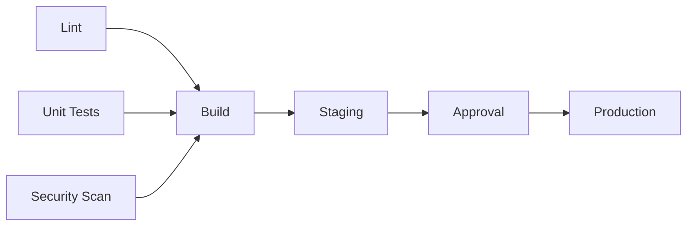
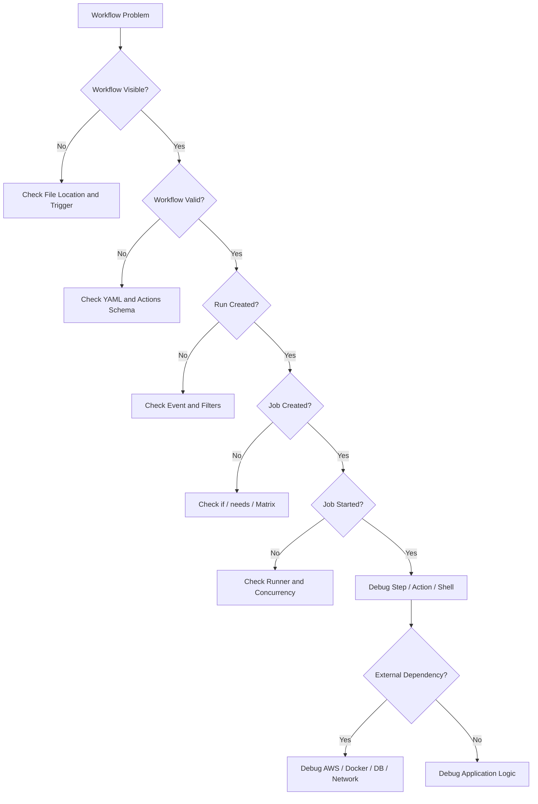
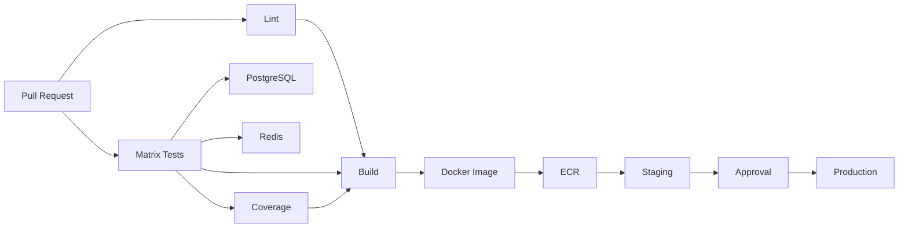

# 02- Workflow Syntax Errors

## Overview

GitHub Actions workflows are declarative YAML configurations interpreted by GitHub before jobs are scheduled and executed. Syntax problems can therefore prevent a workflow from reaching the runner entirely.

A useful distinction is:

```text
YAML Syntax
    ↓
GitHub Actions Schema
    ↓
Expression Evaluation
    ↓
Workflow / Job Planning
    ↓
Runner Execution
    ↓
Shell / Action Execution
```

A failure at an earlier layer should not be debugged as a runtime problem.

For example:

- Invalid YAML is not a runner failure.
- An invalid workflow key is not a Python failure.
- A malformed expression is not a Docker failure.
- A shell command failure is not necessarily a workflow syntax failure.

The troubleshooting objective is to identify the exact layer at which GitHub rejected or misinterpreted the workflow.

---

## Workflow Syntax Layers

GitHub Actions syntax problems generally fall into several categories.

| Layer | Example | Typical Result |
|---|---|---|
| YAML | Incorrect indentation | Workflow parsing failure |
| Actions Schema | Invalid key | Workflow validation failure |
| Trigger | Incorrect `on` configuration | Workflow does not trigger as expected |
| Expression | Invalid `${{ }}` expression | Evaluation/planning failure |
| Context | Context unavailable at that location | Incorrect or empty value |
| Job Definition | Invalid `needs`, `if`, or strategy | Job planning failure |
| Step Definition | Invalid `uses` or `run` structure | Job/step failure |
| Shell | Invalid command | Runtime step failure |
| Action | Action implementation failure | Runtime action failure |

The earlier the failure occurs, the less useful runner-level debugging becomes.

---

## Basic Workflow Structure

A minimal workflow looks like:

```yaml
name: CI

on:
  push:
    branches:
      - main

jobs:
  test:
    runs-on: ubuntu-latest

    steps:
      - name: Checkout
        uses: actions/checkout@v4

      - name: Run tests
        run: pytest
```

The conceptual structure is:

```text
Workflow
├── name
├── on
└── jobs
    └── job
        ├── runs-on
        └── steps
            ├── action
            └── shell command
```

A syntax problem at any structural level can prevent the workflow from executing correctly.

---

## YAML vs GitHub Actions Syntax

There are two separate validation layers:

```text
YAML Parser
    ↓
GitHub Actions Workflow Schema
```

A file can be valid YAML but still be an invalid GitHub Actions workflow.

For example:

```yaml
jobs:
  test:
    invalid-property: true
```

The YAML structure may be valid, but `invalid-property` may not be valid for a job.

This distinction is important when diagnosing errors.

---

## YAML Indentation

YAML is whitespace-sensitive.

Incorrect:

```yaml
jobs:
test:
  runs-on: ubuntu-latest
```

Correct:

```yaml
jobs:
  test:
    runs-on: ubuntu-latest
```

Another common error:

```yaml
steps:
- name: Checkout
uses: actions/checkout@v4
```

Correct:

```yaml
steps:
  - name: Checkout
    uses: actions/checkout@v4
```

Indentation determines the hierarchy.

---

## Mapping vs List Errors

GitHub Actions uses both mappings and lists extensively.

Mapping:

```yaml
jobs:
  test:
    runs-on: ubuntu-latest
```

List:

```yaml
steps:
  - name: Checkout
    uses: actions/checkout@v4

  - name: Test
    run: pytest
```

Confusing the two structures can produce parsing or schema errors.

---

## Quoting

Use quoting when YAML interpretation could become ambiguous.

For example:

```yaml
env:
  APP_VERSION: "1.0"
```

For expressions:

```yaml
if: ${{ github.ref == 'refs/heads/main' }}
```

For shell values:

```yaml
run: echo "$APP_VERSION"
```

Do not add quoting mechanically. Understand which parser is consuming the value.

---

## Special YAML Values

YAML has its own interpretation rules for values such as:

```text
true
false
null
yes
no
numbers
special characters
```

When an environment variable or input must be treated explicitly as a string, quote it when appropriate.

Example:

```yaml
env:
  FEATURE_FLAG: "false"
```

This avoids ambiguity when the value is intended to be passed as text.

---

## Workflow File Location

GitHub Actions workflows must be placed under:

```text
.github/
└── workflows/
    └── ci.yml
```

A correctly written workflow outside this location will not behave as a GitHub Actions workflow.

---

## Workflow File Extension

Use supported YAML extensions:

```text
.yml
.yaml
```

A file such as:

```text
.github/workflows/ci.txt
```

is not a workflow definition.

---

## Workflow Name

A workflow can have:

```yaml
name: Backend CI
```

The name is useful for operational visibility.

It does not determine whether the workflow is syntactically valid.

---

## `on` Configuration

The `on` key defines workflow triggers.

Example:

```yaml
on:
  push:
    branches:
      - main
```

Multiple events can be configured:

```yaml
on:
  push:
    branches:
      - main

  pull_request:

  workflow_dispatch:
```

Incorrect indentation or nesting can change the meaning of the configuration.

---

## Event Configuration

Common events include:

```text
push
pull_request
pull_request_target
workflow_dispatch
schedule
workflow_call
workflow_run
repository_dispatch
release
```

Each event has its own configuration structure.

For example:

```yaml
on:
  workflow_dispatch:
    inputs:
      environment:
        description: Deployment environment
        required: true
        type: choice
        options:
          - staging
          - production
```

Do not copy configuration properties between unrelated events without checking whether the event supports them.

---

## Branch Filters

Example:

```yaml
on:
  push:
    branches:
      - main
      - "release/**"
```

Common mistakes include:

- Incorrect indentation
- Wrong pattern
- Applying a filter to the wrong event
- Assuming a source branch is filtered the same way for every event

---

## Path Filters

Example:

```yaml
on:
  pull_request:
    paths:
      - "backend/**"
      - "tests/**"
```

A workflow may appear "broken" simply because the changed files do not match the configured paths.

For monorepos, carefully model dependency relationships before relying heavily on path filters.

---

## Tag Filters

Example:

```yaml
on:
  push:
    tags:
      - "v*"
```

A workflow triggered by tags should be tested with actual remote tags.

Useful checks:

```bash
git tag
git ls-remote --tags origin
```

---

## Job Structure

A job requires an identifier:

```yaml
jobs:
  test:
    runs-on: ubuntu-latest
```

The job ID:

```text
test
```

is later used by features such as:

```yaml
needs:
  - test
```

and:

```yaml
needs.test.result
```

Keep job IDs stable and descriptive.

---

## `runs-on`

A job requires a runner selection.

Example:

```yaml
jobs:
  test:
    runs-on: ubuntu-latest
```

Self-hosted runners may use labels:

```yaml
runs-on:
  - self-hosted
  - linux
  - private-network
```

If the syntax is valid but no eligible runner exists, the problem has moved from workflow syntax to runner operations.

---

## Steps Structure

Steps must be a list.

Correct:

```yaml
steps:
  - name: Checkout
    uses: actions/checkout@v4

  - name: Install dependencies
    run: pip install -r requirements.txt
```

Each step generally uses either:

```yaml
uses:
```

or:

```yaml
run:
```

depending on the operation.

---

## `uses` Syntax

A typical action reference is:

```yaml
- uses: actions/checkout@v4
```

A repository action reference follows:

```text
owner/repository@ref
```

The reference may be:

- Tag
- Branch
- Commit SHA

For production security-sensitive workflows, immutable SHA pinning can reduce supply-chain risk.

---

## `run` Syntax

A shell command can be written as:

```yaml
- name: Run tests
  run: pytest
```

Multiple commands:

```yaml
- name: Test
  run: |
    python -m compileall .
    pytest -q
```

A common mistake is confusing YAML multiline syntax with shell syntax.

---

## Multiline Commands

Use:

```yaml
run: |
  command-one
  command-two
```

when multiple shell commands belong to the same step.

For long commands, this improves readability and reduces YAML quoting complexity.

---

## Shell Selection

A step can specify a shell:

```yaml
- name: Run script
  shell: bash
  run: |
    set -euo pipefail
    pytest -q
```

On Windows, the appropriate shell may differ.

When troubleshooting a command failure, verify the shell because shell syntax is not interchangeable across Bash, PowerShell, and other shells.

---

## `env` Placement

Environment variables can be defined at different levels.

Workflow:

```yaml
env:
  APP_ENV: test
```

Job:

```yaml
jobs:
  test:
    env:
      APP_ENV: test
```

Step:

```yaml
- name: Test
  env:
    APP_ENV: test
  run: pytest
```

Incorrect indentation can place the variable at a different scope or make the workflow invalid.

---

## `permissions` Placement

Permissions can be defined at workflow or job level.

Workflow:

```yaml
permissions:
  contents: read
```

Job:

```yaml
jobs:
  deploy:
    permissions:
      contents: read
      id-token: write
```

Do not confuse permissions with shell environment variables.

For AWS OIDC, the job normally requires:

```yaml
permissions:
  contents: read
  id-token: write
```

---

## Job-Level `if`

Example:

```yaml
jobs:
  deploy:
    if: ${{ github.ref == 'refs/heads/main' }}
    runs-on: ubuntu-latest
```

If the condition is false, the job may be skipped.

A skipped job is not a syntax failure.

---

## Step-Level `if`

Example:

```yaml
steps:
  - name: Deploy
    if: ${{ github.ref == 'refs/heads/main' }}
    run: ./deploy.sh
```

When troubleshooting, determine whether the step:

```text
Failed
```

or:

```text
Was skipped
```

These are different problems.

---

## `needs`

Dependencies are expressed using job IDs.

```yaml
jobs:
  test:
    runs-on: ubuntu-latest
    steps:
      - run: pytest

  build:
    needs: test
    runs-on: ubuntu-latest
    steps:
      - run: docker build .
```

Multiple dependencies:

```yaml
needs:
  - lint
  - test
  - security
```

A common mistake is referencing a job name rather than its actual job ID.

---

## Dependency Graph

The workflow becomes a directed graph:



Syntax problems in `needs` can break the dependency graph before runtime.

---

## `needs` and Skipped Jobs

If an upstream job is skipped or fails, downstream jobs can also be skipped depending on their conditions.

Example:

```yaml
build:
  needs: test
```

If `test` does not complete successfully, `build` may not run.

When a downstream job unexpectedly does not execute, inspect the upstream job state first.

---

## Matrix Syntax

Basic matrix:

```yaml
strategy:
  matrix:
    python-version:
      - "3.11"
      - "3.12"
      - "3.13"
```

Use:

```yaml
${{ matrix.python-version }}
```

inside the job.

Example:

```yaml
jobs:
  test:
    runs-on: ubuntu-latest

    strategy:
      matrix:
        python-version:
          - "3.11"
          - "3.12"
          - "3.13"

    steps:
      - uses: actions/setup-python@v5
        with:
          python-version: ${{ matrix.python-version }}
```

---

## Matrix Quoting

Version-like values should generally be represented explicitly as strings.

Prefer:

```yaml
python-version:
  - "3.11"
  - "3.12"
```

rather than relying on YAML to infer the intended type.

---

## Multiple Matrix Dimensions

Example:

```yaml
strategy:
  matrix:
    python-version:
      - "3.11"
      - "3.12"
    database:
      - postgres
      - mysql
```

This creates:

```text
2 Python versions
×
2 databases
=
4 jobs
```

Large matrices should be designed deliberately because they increase runner and dependency demand.

---

## `include`

Example:

```yaml
strategy:
  matrix:
    python-version:
      - "3.11"
      - "3.12"

    include:
      - python-version: "3.13"
        experimental: true
```

Use `include` to add or extend specific matrix combinations.

---

## `exclude`

Example:

```yaml
strategy:
  matrix:
    python-version:
      - "3.11"
      - "3.12"
    database:
      - postgres
      - mysql

    exclude:
      - python-version: "3.11"
        database: mysql
```

This is useful when certain combinations are unsupported.

---

## `fail-fast`

Example:

```yaml
strategy:
  fail-fast: true
  matrix:
    python-version:
      - "3.11"
      - "3.12"
```

`fail-fast` controls whether in-progress matrix jobs can be cancelled when a matrix job fails.

It does not mean:

```text
stop every job immediately
```

or:

```text
fix the failing job automatically
```

Understand the operational effect before enabling it.

---

## `max-parallel`

Example:

```yaml
strategy:
  max-parallel: 3
  matrix:
    python-version:
      - "3.11"
      - "3.12"
      - "3.13"
```

This limits concurrent matrix jobs and can protect:

- Runner capacity
- PostgreSQL
- Redis
- External APIs
- AWS APIs

---

## Expressions

Expressions use:

```text
${{ ... }}
```

Example:

```yaml
if: ${{ github.ref == 'refs/heads/main' }}
```

They are evaluated by GitHub Actions, not by the shell.

---

## Expression Operators

Common operators include:

```text
==
!=
&&
||
!
>
>=
<
<=
```

Example:

```yaml
if: ${{ github.event_name == 'push' && github.ref == 'refs/heads/main' }}
```

Keep complex expressions readable. When conditions become difficult to reason about, simplify the workflow or expose intermediate values.

---

## Expression Functions

Important functions include:

```text
success()
failure()
cancelled()
always()
contains()
startsWith()
endsWith()
format()
fromJSON()
toJSON()
hashFiles()
```

Example:

```yaml
if: ${{ failure() }}
```

---

## `fromJSON`

Dynamic matrices commonly use JSON.

Producer:

```yaml
- id: matrix
  run: |
    echo 'matrix={"include":[{"python":"3.11"},{"python":"3.12"}]}' >> "$GITHUB_OUTPUT"
```

Consumer:

```yaml
strategy:
  matrix: ${{ fromJSON(needs.plan.outputs.matrix) }}
```

When debugging, validate the generated JSON first.

---

## `toJSON`

`toJSON()` can help inspect non-sensitive context data.

Example:

```yaml
env:
  EVENT_NAME: ${{ github.event_name }}
  REF: ${{ github.ref }}

steps:
  - run: |
      printf 'event=%s\n' "$EVENT_NAME"
      printf 'ref=%s\n' "$REF"
```

Avoid dumping entire sensitive contexts.

---

## `hashFiles`

`hashFiles()` is commonly used for cache keys.

Example:

```yaml
key: ${{ runner.os }}-pip-${{ hashFiles('**/requirements.lock') }}
```

If the dependency lock file changes, the cache key changes.

A missing or incorrectly matched file pattern can produce unexpected cache behavior.

---

## Context Availability

Not every context is available in every location.

Common contexts include:

| Context | Typical Information |
|---|---|
| `github` | Repository, event, ref, SHA |
| `env` | Environment variables |
| `vars` | Configuration variables |
| `secrets` | Secrets |
| `steps` | Step outputs |
| `needs` | Upstream job outputs/results |
| `job` | Current job information |
| `runner` | Runner information |
| `matrix` | Current matrix values |
| `strategy` | Matrix strategy |
| `inputs` | Workflow/action inputs |

When an expression unexpectedly evaluates to an empty or unavailable value, first verify that the context is valid at that location.

---

## `steps` Context

Step outputs require an `id`.

```yaml
steps:
  - id: metadata
    run: |
      echo "version=1.2.3" >> "$GITHUB_OUTPUT"

  - run: echo "${{ steps.metadata.outputs.version }}"
```

Without the `id`, the step cannot be referenced using that identifier.

---

## `needs` Context

Job outputs are consumed through `needs`.

```yaml
jobs:
  build:
    runs-on: ubuntu-latest
    outputs:
      image: ${{ steps.meta.outputs.image }}
    steps:
      - id: meta
        run: echo "image=api:${GITHUB_SHA}" >> "$GITHUB_OUTPUT"

  deploy:
    needs: build
    runs-on: ubuntu-latest
    steps:
      - run: echo "${{ needs.build.outputs.image }}"
```

The data flow is:

```text
Step
 ↓
Job Output
 ↓
needs.<job>.outputs
```

---

## `GITHUB_OUTPUT`

Use the supported output mechanism:

```bash
echo "image=api:${GITHUB_SHA}" >> "$GITHUB_OUTPUT"
```

For multiline output:

```bash
{
  echo 'config<<EOF'
  cat config.json
  echo 'EOF'
} >> "$GITHUB_OUTPUT"
```

Be careful with generated content and untrusted values.

---

## `GITHUB_ENV`

Use:

```bash
echo "APP_ENV=staging" >> "$GITHUB_ENV"
```

The variable becomes available to later steps in the same job.

It does not automatically become a job output or cross-job variable.

---

## `GITHUB_PATH`

Use:

```bash
echo "$HOME/.local/bin" >> "$GITHUB_PATH"
```

This modifies `PATH` for subsequent steps.

A common mistake is expecting it to modify the current shell process immediately in every context.

---

## Step Summary

Use:

```bash
echo "## Test Results" >> "$GITHUB_STEP_SUMMARY"
echo "- Status: passed" >> "$GITHUB_STEP_SUMMARY"
```

Step summaries are useful for diagnostics and deployment metadata without requiring engineers to inspect large raw logs.

---

## YAML Anchors and Reuse

Avoid making workflows unnecessarily complex with advanced YAML mechanisms.

GitHub Actions has its own reuse mechanisms:

```text
Reusable Workflows
Composite Actions
```

Use those mechanisms when the goal is to share CI/CD behavior across workflows.

---

## Reusable Workflow Syntax

A reusable workflow uses:

```yaml
on:
  workflow_call:
```

Example:

```yaml
on:
  workflow_call:
    inputs:
      python-version:
        required: true
        type: string
```

Caller:

```yaml
jobs:
  ci:
    uses: organization/platform/.github/workflows/python-ci.yml@v1
    with:
      python-version: "3.12"
```

A syntax error in the caller or reusable workflow can prevent the expected job graph from being created.

---

## Composite Action vs Reusable Workflow

| Feature | Composite Action | Reusable Workflow |
|---|---|---|
| Reuses steps | Yes | Yes |
| Runs inside a job | Yes | No |
| Can orchestrate jobs | No | Yes |
| Can define multiple jobs | No | Yes |
| Best for | Step-level reuse | Pipeline-level reuse |
| Typical use | Setup/build helper | Standard CI/CD pipeline |

Do not use a composite action when the requirement is job orchestration.

---

## Workflow Command Deprecation

Avoid old command patterns that GitHub has replaced with environment files.

Prefer:

```bash
echo "name=value" >> "$GITHUB_OUTPUT"
```

instead of deprecated output commands.

Likewise:

```bash
echo "NAME=value" >> "$GITHUB_ENV"
```

should be used for environment propagation.

Use current supported mechanisms rather than copying old workflow examples.

---

## Common Syntax Error Patterns

### Incorrect Job Indentation

```yaml
jobs:
test:
  runs-on: ubuntu-latest
```

### Incorrect Step Structure

```yaml
steps:
  name: Test
  run: pytest
```

Correct:

```yaml
steps:
  - name: Test
    run: pytest
```

### Incorrect `needs`

```yaml
needs: unit tests
```

Use a valid job ID:

```yaml
needs: unit-tests
```

### Incorrect Matrix Reference

```yaml
python-version: ${{ matrix.python }}
```

when the matrix actually defines:

```yaml
python-version:
```

The reference must match the matrix key.

---

## Trigger vs Syntax Problem

These are frequently confused.

### Syntax Problem

```text
Workflow cannot be parsed or validated.
```

### Trigger Problem

```text
Workflow is valid but does not run for the expected event.
```

Use the following distinction:

```text
No Workflow
    ↓
Check Trigger / Filters / Repository Configuration

Workflow Exists but Invalid
    ↓
Check YAML / Actions Schema

Workflow Runs
    ↓
Check Jobs / Steps / Runtime
```

---

## Expression vs Runtime Problem

Consider:

```yaml
run: echo "${{ github.ref_name }}"
```

If the expression is malformed, GitHub may reject or fail to evaluate the workflow before shell execution.

If the expression succeeds but the resulting shell command fails, the problem is at a later layer.

Think:

```text
Expression
   ↓
Rendered Step
   ↓
Shell
```

---

## Shell Injection Consideration

Workflow syntax can be valid while the resulting command is unsafe.

Avoid directly inserting untrusted GitHub data into shell code.

Risky:

```yaml
- run: echo "${{ github.event.pull_request.title }}"
```

Prefer passing untrusted values through environment variables:

```yaml
- name: Inspect title
  env:
    PR_TITLE: ${{ github.event.pull_request.title }}
  run: |
    printf '%s\n' "$PR_TITLE"
```

This separates GitHub expression evaluation from shell parsing more safely.

---

## Production Validation Strategy

Validate workflows before merging them.

A practical process is:

```text
Edit Workflow
    ↓
Static Validation
    ↓
Pull Request
    ↓
CI Validation
    ↓
Controlled Execution
    ↓
Production Promotion
```

Workflow files themselves should be treated as production code because they can control:

- Credentials
- Deployment
- Infrastructure
- Artifact creation
- Security boundaries

---

## Local YAML Validation

A generic YAML parser can identify structural YAML problems.

For example:

```bash
python - <<'PY'
import yaml

with open(".github/workflows/ci.yml", encoding="utf-8") as f:
    yaml.safe_load(f)

print("YAML syntax is valid")
PY
```

This validates YAML structure only.

It does **not** validate the complete GitHub Actions schema.

---

## GitHub CLI Validation and Inspection

Use GitHub CLI for operational inspection.

List workflows:

```bash
gh workflow list
```

Inspect a workflow:

```bash
gh workflow view <workflow>
```

List runs:

```bash
gh run list
```

Inspect a run:

```bash
gh run view <run-id>
```

View logs:

```bash
gh run view <run-id> --log
```

These commands are useful after the workflow has reached GitHub's execution system.

---

## Troubleshooting Decision Tree



---

## Production CI/CD Syntax Example

A typical Python backend pipeline may look like:

```yaml
name: Backend CI

on:
  pull_request:
    branches:
      - main
    paths:
      - "app/**"
      - "tests/**"
      - "pyproject.toml"
      - ".github/workflows/**"

  push:
    branches:
      - main

  workflow_dispatch:

permissions:
  contents: read

jobs:
  test:
    runs-on: ubuntu-latest

    strategy:
      fail-fast: false
      matrix:
        python-version:
          - "3.11"
          - "3.12"

    steps:
      - name: Checkout
        uses: actions/checkout@v4

      - name: Set up Python
        uses: actions/setup-python@v5
        with:
          python-version: ${{ matrix.python-version }}

      - name: Install dependencies
        run: |
          python -m pip install --upgrade pip
          pip install -r requirements.txt

      - name: Run tests
        run: pytest -q
```

When this workflow fails, investigate in order:

```text
Workflow Parsing
 ↓
Trigger
 ↓
Matrix
 ↓
Runner
 ↓
Checkout
 ↓
Python Setup
 ↓
Dependency Installation
 ↓
pytest
```

---

## Production Deployment Syntax Example

A deployment workflow may look like:

```yaml
name: Deploy

on:
  workflow_dispatch:
    inputs:
      environment:
        required: true
        type: choice
        options:
          - staging
          - production

permissions:
  contents: read
  id-token: write

jobs:
  deploy:
    runs-on: ubuntu-latest
    environment: ${{ inputs.environment }}

    concurrency:
      group: deploy-${{ inputs.environment }}
      cancel-in-progress: false

    steps:
      - name: Checkout
        uses: actions/checkout@v4

      - name: Configure AWS credentials
        uses: aws-actions/configure-aws-credentials@v4
        with:
          role-to-assume: ${{ secrets.AWS_DEPLOY_ROLE_ARN }}
          aws-region: ${{ vars.AWS_REGION }}

      - name: Verify identity
        run: aws sts get-caller-identity

      - name: Deploy
        run: ./scripts/deploy.sh
```

If deployment fails, syntax should be considered only if the workflow never reached execution.

---

## Syntax Error Prevention

Use repository-level controls:

```text
Protected Workflow Files
        ↓
Pull Request Review
        ↓
Static Validation
        ↓
CI Checks
        ↓
Controlled Merge
```

Recommended practices:

- Keep workflows readable.
- Use consistent indentation.
- Use descriptive job IDs.
- Avoid unnecessarily complex expressions.
- Keep reusable workflow interfaces explicit.
- Pin important dependencies appropriately.
- Validate changes through pull requests.
- Keep deployment workflows protected.
- Avoid deprecated workflow commands.

---

## Common Mistakes

### Debugging the Runner First

If GitHub cannot parse the workflow, the runner is irrelevant.

### Treating Skipped Jobs as Syntax Failures

A job may be correctly skipped because its condition is false.

### Confusing YAML With Actions Schema

Valid YAML does not guarantee a valid Actions workflow.

### Using the Wrong Context

A context can be valid elsewhere but unavailable at the current evaluation point.

### Referencing a Step Without an ID

Step outputs require a referenceable step ID.

### Referencing the Wrong Matrix Key

Matrix expressions must match the declared matrix structure.

### Assuming `needs` Means "Run After"

`needs` establishes dependency and affects execution behavior when upstream jobs fail or are skipped.

### Printing Entire Contexts

This can expose sensitive information.

### Mixing Expression and Shell Syntax

GitHub expressions and shell variables are evaluated by different systems.

### Copying Deprecated Examples

Old workflow syntax can still appear in tutorials and internal documentation.

---

## Senior-Level Troubleshooting Questions

### A Workflow File Exists but Does Not Run

Investigate:

```text
Location
 ↓
Event
 ↓
Branch
 ↓
Path
 ↓
Tag
 ↓
Repository Policy
```

### The Workflow Runs but a Job Is Skipped

Investigate:

```text
if
needs
Matrix
Event Context
Inputs
```

### The Job Is Queued

Investigate:

```text
runs-on
Runner Labels
Runner Groups
Runner Availability
Concurrency
```

### The Step Starts but Fails Immediately

Investigate:

```text
Shell
Environment
Action Version
Working Directory
Command
```

### The Workflow Builds Correctly but Deployment Fails

Investigate:

```text
Artifact
Registry
AWS Identity
IAM
Deployment Target
Health Check
```

---

## Interview Scenario: Design a Safe CI Pipeline

A production Python service requires:

```text
Python 3.11
Python 3.12
PostgreSQL
Redis
pytest
Coverage
Docker
AWS
```

A reasonable architecture is:



Syntax design should support the architecture rather than become an obstacle to it.

---

## Interview Scenario: Workflow Works Locally but GitHub Rejects It

Explain the distinction:

```text
Local YAML Parser
        ≠
GitHub Actions Workflow Validator
```

A local YAML parser can confirm structural validity, but GitHub Actions also validates its workflow schema and execution semantics.

---

## Interview Scenario: Why Is a Job Not Running?

A strong investigation does not immediately change `needs` or remove `if`.

Instead:

```text
Inspect Job State
 ↓
Inspect Condition
 ↓
Inspect Dependencies
 ↓
Inspect Matrix
 ↓
Inspect Event Context
```

Then change only the component supported by evidence.

---

## Senior Engineering Principle

Treat workflow syntax as code.

Workflow files define executable behavior around:

```text
Source Code
Secrets
Builds
Artifacts
Infrastructure
Deployments
Production Access
```

Therefore:

```text
Workflow Change
    =
Production Code Change
```

They deserve review, testing, ownership, and security controls.

---

## Key Takeaways

- Debug GitHub Actions syntax through the correct layers: **YAML → Actions schema → expressions/contexts → job planning → runner execution → shell/action runtime**.
- A workflow can be valid YAML and still be invalid GitHub Actions configuration; distinguish **syntax, schema, trigger, condition, and runtime failures**.
- When jobs or steps do not run, inspect **events, filters, `if`, `needs`, matrices, contexts, and runner selection** before changing application code.
- Treat expressions, shell commands, contexts, outputs, environment files, and reusable workflow interfaces as separate execution mechanisms with explicit data-flow boundaries.
- Workflow files are production code because they control **builds, credentials, artifacts, infrastructure, and deployments**; validate and review them with the same discipline as backend application code.