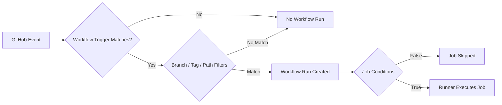
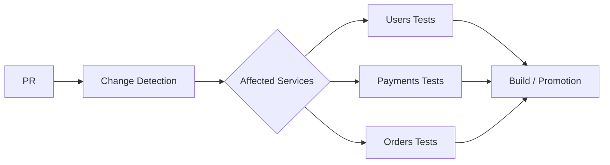
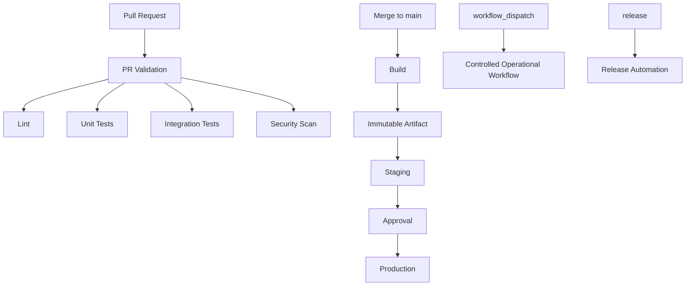
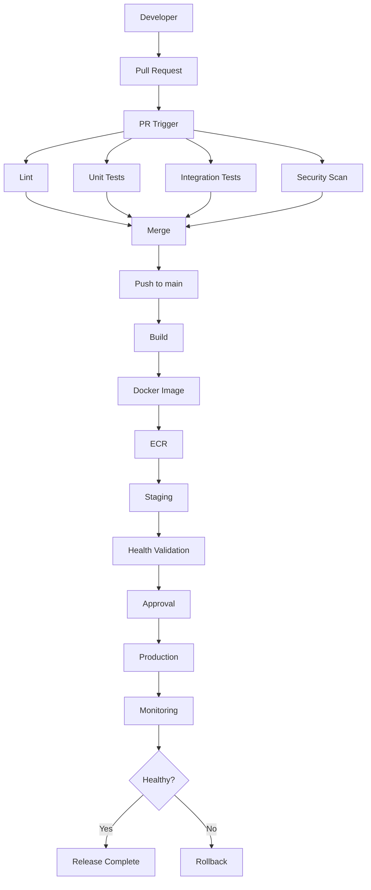

# 03- Trigger and Event Issues

## Overview

GitHub Actions trigger problems are often misdiagnosed as workflow failures. A workflow can be syntactically valid, correctly committed, and still not execute because the event, branch, path, tag, repository policy, or event-specific filter does not match what actually happened.

The operational model is:

```text
GitHub Event
    ↓
Workflow Trigger Definition
    ↓
Event Filters
    ↓
Workflow Eligibility
    ↓
Workflow Run
    ↓
Job Conditions
    ↓
Job Execution
```

The key distinction is:

```text
Workflow did not start
    ≠
Workflow started and failed
```

Trigger troubleshooting should therefore begin before inspecting runners, Docker, Python, PostgreSQL, AWS, or application logs.

A production troubleshooting sequence is:

```text
Symptom
  ↓
Identify Expected Event
  ↓
Verify Actual Event
  ↓
Check Workflow Discovery
  ↓
Check Event Configuration
  ↓
Check Branch / Tag / Path Filters
  ↓
Check Repository / Organization Policies
  ↓
Check Job Conditions
  ↓
Inspect Workflow Run
  ↓
Root Cause
  ↓
Corrective Action
  ↓
Prevention
```

---

## GitHub Actions Event Model

A GitHub Actions workflow is activated by one or more GitHub events.

Common events include:

| Event | Typical Use |
|---|---|
| `push` | CI after commits reach a branch |
| `pull_request` | Validation of proposed changes |
| `pull_request_target` | Trusted workflow logic using the base repository context |
| `workflow_dispatch` | Manual execution |
| `schedule` | Scheduled automation |
| `workflow_call` | Reusable workflows |
| `workflow_run` | React to another workflow's completion |
| `repository_dispatch` | External/system-triggered workflows |
| `release` | Release lifecycle automation |

The trigger configuration determines whether GitHub should create a workflow run.

---

## Workflow Trigger Architecture



This distinction is essential when debugging:

- No run usually means event/filter/configuration investigation.
- A skipped job means job-level logic investigation.
- A failed job means runtime investigation.

---

## `push`

The `push` event runs when commits are pushed to the repository.

Basic:

```yaml
name: CI

on:
  push:
```

Branch-specific:

```yaml
on:
  push:
    branches:
      - main
      - develop
```

Tag-specific:

```yaml
on:
  push:
    tags:
      - "v*"
```

Path-specific:

```yaml
on:
  push:
    paths:
      - "backend/**"
      - "pyproject.toml"
```

Multiple filters can make the trigger much narrower than expected.

---

## Troubleshooting `push`

### Symptom

A commit was pushed, but no workflow run appeared.

### Possible Causes

- Workflow does not listen to `push`.
- Branch does not match.
- Path filter excludes the changed files.
- Tag/branch filter is configured incorrectly.
- Workflow file is not present on the relevant branch.
- Repository or organization policy affects Actions execution.
- The event was not actually the event expected.

### Isolation Strategy

Start with:

```bash
git branch --show-current
git log -1 --oneline
git status
```

Then inspect the remote:

```bash
git remote -v
git ls-remote origin
```

Inspect workflow configuration:

```bash
gh workflow list
gh workflow view <workflow>
```

### Root Cause

Determine whether the workflow was:

```text
Not eligible
```

or:

```text
Eligible but failed after starting
```

### Prevention

Document trigger expectations in the workflow and test branch/path filters explicitly.

---

## `pull_request`

A common CI configuration is:

```yaml
on:
  pull_request:
    branches:
      - main
```

This is appropriate when the workflow validates changes proposed through pull requests.

Typical uses:

- Linting
- Unit tests
- Integration tests
- Security scanning
- Build validation

---

## Pull Request Base vs Source Branch

A common source of confusion is branch filtering.

For a pull request:

```text
feature/login
       ↓
    Pull Request
       ↓
      main
```

The workflow's pull-request branch filter refers to the PR's base branch.

Example:

```yaml
on:
  pull_request:
    branches:
      - main
```

This means:

```text
Run when the PR targets main
```

It does not mean:

```text
Run only when the source branch is main
```

---

## Troubleshooting Pull Request Triggers

### Symptom

A PR exists but the workflow does not run.

### Possible Causes

- PR targets a different base branch.
- Workflow is not configured for `pull_request`.
- Path filter excludes the changes.
- Workflow configuration is not present in the relevant repository state.
- Repository policy prevents execution.
- The workflow was intentionally skipped by configuration.

### Checks

```bash
gh pr view <number>
gh workflow list
```

Inspect the workflow and compare:

```text
PR base branch
Workflow branches filter
Changed files
Workflow paths filter
```

---

## `pull_request_target`

`pull_request_target` executes using the context of the base repository rather than the pull request's workflow code in the same way as `pull_request`.

Example:

```yaml
on:
  pull_request_target:
    types:
      - opened
      - synchronize
      - reopened
```

This event requires particular caution because it can interact with repository secrets, permissions, and untrusted pull-request content.

Do not treat it as a simple replacement for:

```yaml
pull_request:
```

---

## `pull_request` vs `pull_request_target`

| Property | `pull_request` | `pull_request_target` |
|---|---|---|
| Typical purpose | Validate PR code | Trusted base-repository automation |
| Fork PR security | Safer default boundary | Requires careful design |
| Base repository secrets | Restricted behavior | Can access trusted repository context |
| Untrusted code | Common | Dangerous if executed carelessly |
| Typical CI testing | Yes | Usually avoid for untrusted builds |
| Deployment automation | Usually inappropriate | Possible with strict controls |

The important principle is:

```text
More repository trust
    →
More potential impact from executing untrusted input
```

Never check out and execute untrusted PR code in a privileged `pull_request_target` workflow without a deliberate security model.

---

## Event Types

Many events support `types`.

Example:

```yaml
on:
  pull_request:
    types:
      - opened
      - synchronize
      - reopened
```

This limits execution to selected activity types.

A workflow may appear broken because the event happened but its activity type was not configured.

---

## Common Pull Request Activity Types

Depending on the event, activity can include actions such as:

```text
opened
closed
reopened
synchronize
labeled
unlabeled
```

Always verify the event documentation and actual event payload before assuming a particular activity type.

---

## `workflow_dispatch`

Manual execution uses:

```yaml
on:
  workflow_dispatch:
```

Example with inputs:

```yaml
on:
  workflow_dispatch:
    inputs:
      environment:
        description: Deployment environment
        required: true
        type: choice
        options:
          - staging
          - production
```

Manual inputs are useful for controlled operational workflows.

---

## Troubleshooting Manual Workflows

### Symptom

`workflow_dispatch` does not appear in the Actions interface.

Check:

- Workflow exists under `.github/workflows/`.
- Workflow YAML is valid.
- Workflow includes `workflow_dispatch`.
- The workflow exists on the expected branch.
- Repository Actions configuration allows execution.

Run:

```bash
gh workflow list
```

Then:

```bash
gh workflow run <workflow>
```

If required inputs exist:

```bash
gh workflow run <workflow> \
  -f environment=staging
```

---

## `schedule`

Scheduled workflows use cron syntax.

Example:

```yaml
on:
  schedule:
    - cron: "0 2 * * *"
```

Cron expressions represent UTC scheduling.

A schedule should therefore be designed around UTC rather than assuming the repository user's local timezone.

---

## Scheduled Workflow Characteristics

Scheduled workflows are useful for:

- Nightly tests
- Dependency checks
- Cleanup jobs
- Periodic synchronization
- Maintenance workflows

They are not appropriate for latency-sensitive production scheduling.

For critical business scheduling, use an application or dedicated scheduling system when stronger execution guarantees are required.

---

## Troubleshooting Scheduled Workflows

### Symptom

A scheduled workflow did not run.

### Possible Causes

- Incorrect cron expression.
- Workflow is disabled.
- Workflow configuration is not on the expected default branch.
- Repository or Actions configuration prevents execution.
- The expected time was interpreted in local time instead of UTC.
- GitHub scheduling delay.

### Isolation

Validate the cron expression independently and inspect the workflow configuration.

A practical diagnostic pattern is to temporarily add:

```yaml
workflow_dispatch:
```

This separates:

```text
Workflow configuration problem
```

from:

```text
Schedule behavior problem
```

---

## `workflow_call`

A reusable workflow is triggered by another workflow.

```yaml
on:
  workflow_call:
    inputs:
      environment:
        required: true
        type: string
```

The caller uses:

```yaml
jobs:
  deploy:
    uses: organization/platform/.github/workflows/deploy.yml@v1
    with:
      environment: production
```

This is not an ordinary event like `push`.

The workflow is invoked by another workflow.

---

## `workflow_run`

`workflow_run` can react to another workflow.

Example:

```yaml
on:
  workflow_run:
    workflows:
      - Backend CI
    types:
      - completed
```

A common production pattern is:

```text
CI Workflow
    ↓
Completed
    ↓
Deployment Workflow
```

Use explicit conditions to distinguish successful completion from failure.

---

## `repository_dispatch`

`repository_dispatch` can be used by external systems to trigger a workflow.

Example:

```yaml
on:
  repository_dispatch:
    types:
      - deploy
```

An external system can send a custom event.

This is useful when GitHub Actions is integrated with:

- Internal platforms
- Release systems
- External automation
- Deployment controllers

Treat external payloads as untrusted input unless the integration explicitly authenticates and validates them.

---

## `release`

Release workflows can respond to release lifecycle events.

Example:

```yaml
on:
  release:
    types:
      - published
```

Typical use cases:

- Build release artifacts
- Publish packages
- Generate deployment metadata
- Trigger downstream release workflows

Do not assume a Git tag push and release publication are identical events.

---

## Branch Filters

Branch filters restrict workflow eligibility.

Example:

```yaml
on:
  push:
    branches:
      - main
      - develop
```

Pattern matching can also be used:

```yaml
on:
  push:
    branches:
      - "release/**"
```

Be precise about whether the filter applies to:

- Source branch
- Target/base branch
- Pushed branch
- Tag

The meaning depends on the event.

---

## Branch Ignore Filters

Example:

```yaml
on:
  push:
    branches-ignore:
      - "docs/**"
```

Do not define both `branches` and `branches-ignore` for the same event configuration.

Use the appropriate inclusion or exclusion model.

---

## Path Filters

Example:

```yaml
on:
  pull_request:
    paths:
      - "backend/**"
      - "tests/**"
```

This can reduce unnecessary CI execution in monorepos.

However, path filtering must account for dependencies.

For example:

```text
shared-library/
    ↓
backend/
    ↓
tests/
```

A change under `shared-library/` may affect `backend/` even if the backend files themselves did not change.

---

## Path Ignore Filters

Example:

```yaml
on:
  push:
    paths-ignore:
      - "docs/**"
      - "*.md"
```

This is convenient for documentation-only changes.

Do not use broad ignore rules when source changes can indirectly affect the workflow.

---

## Branch and Path Filters Together

Consider:

```yaml
on:
  pull_request:
    branches:
      - main
    paths:
      - "backend/**"
```

The workflow requires both conditions to match:

```text
PR targets main
AND
relevant changed path exists
```

If either condition fails, the workflow may not run.

This is one of the most common causes of "GitHub Actions did nothing."

---

## Tag Filters

Example:

```yaml
on:
  push:
    tags:
      - "v*"
```

A version tag:

```text
v1.4.0
```

matches the pattern.

A branch push does not.

When debugging release workflows, determine whether the event was:

```text
Commit Push
Tag Push
Release Event
```

before modifying the workflow.

---

## Multiple Events

A workflow can respond to several events:

```yaml
on:
  push:
    branches:
      - main

  pull_request:
    branches:
      - main

  workflow_dispatch:
```

This is convenient but can introduce duplicate execution.

For example:

```text
PR opened
    ↓
pull_request workflow

PR merged
    ↓
push to main
```

Both can execute CI.

---

## Duplicate Workflow Runs

A common configuration is:

```yaml
on:
  push:
    branches:
      - main

  pull_request:
    branches:
      - main
```

This is often intentional.

However, understand the lifecycle:

```text
Feature Branch
    ↓
Pull Request
    ↓
CI

Merge
    ↓
Push to main
    ↓
CI Again
```

If CI is expensive, decide whether duplicate validation is acceptable.

---

## Workflow-Level Concurrency

Concurrency can reduce duplicate runs.

Example:

```yaml
concurrency:
  group: ci-${{ github.workflow }}-${{ github.ref }}
  cancel-in-progress: true
```

This is useful for pull-request CI where newer commits supersede older commits.

Do not blindly apply the same policy to production deployment workflows.

---

## Production Deployment Concurrency

For production deployment:

```yaml
concurrency:
  group: production-deployment
  cancel-in-progress: false
```

This protects against simultaneous deployments.

A production deployment should generally not be cancelled halfway through simply because another commit arrived.

---

## Path Filters and Monorepos

A monorepo may contain:

```text
services/
├── users/
├── payments/
├── orders/
└── notifications/

shared/
infra/
```

A service-specific workflow might use:

```yaml
on:
  pull_request:
    paths:
      - "services/users/**"
      - "shared/**"
```

The important question is not:

```text
Which files changed?
```

but:

```text
Which components can be affected by those changes?
```

---

## Dynamic Change Detection

For large repositories, a planning job can determine which components require testing.

Conceptually:



Dynamic matrices can then represent the affected components.

This is more flexible than maintaining large numbers of independent path-filtered workflows.

---

## Event Context

The `github` context contains event information.

Examples:

```yaml
- name: Inspect event
  env:
    EVENT_NAME: ${{ github.event_name }}
    REF: ${{ github.ref }}
    SHA: ${{ github.sha }}
  run: |
    printf 'event=%s\n' "$EVENT_NAME"
    printf 'ref=%s\n' "$REF"
    printf 'sha=%s\n' "$SHA"
```

Avoid dumping the entire event payload when it may contain sensitive or untrusted data.

---

## Event-Specific References

Different events can produce different meanings for:

```text
github.ref
github.sha
github.ref_name
github.event.*
```

Do not assume that a value has the same semantics across:

```text
push
pull_request
pull_request_target
workflow_run
workflow_dispatch
```

When debugging an expression, first identify the event that generated the run.

---

## Conditional Jobs vs Trigger Filters

These mechanisms operate at different stages.

### Trigger Filter

```yaml
on:
  push:
    branches:
      - main
```

Controls whether the workflow is eligible to run.

### Job Condition

```yaml
jobs:
  deploy:
    if: ${{ github.ref == 'refs/heads/main' }}
```

The workflow can start, but the job may be skipped.

Conceptually:

```text
Trigger Filter
    ↓
Workflow Run
    ↓
Job Condition
    ↓
Job
```

This distinction is critical during troubleshooting.

---

## `if` and Event Conditions

Example:

```yaml
jobs:
  deploy:
    if: ${{ github.event_name == 'push' && github.ref == 'refs/heads/main' }}
    runs-on: ubuntu-latest
```

This can support a workflow that handles multiple events while restricting deployment.

However, if the workflow only needs to respond to one event, a narrower trigger can often be easier to reason about.

---

## Status Functions and Trigger Debugging

Status functions apply after workflow execution has started.

Examples:

```yaml
if: ${{ failure() }}
```

```yaml
if: ${{ always() }}
```

These do not solve a workflow trigger problem.

If no workflow run exists:

```text
failure()
always()
cancelled()
```

are irrelevant because there is no job execution context.

---

## `workflow_dispatch` as a Diagnostic Tool

When investigating an event problem, adding:

```yaml
workflow_dispatch:
```

can be useful.

If manual execution works:

```text
YAML
 ↓
Workflow Schema
 ↓
Jobs
 ↓
Runner
```

are likely functional.

The remaining investigation can focus on:

```text
Event
Branch
Path
Tag
Repository Policy
```

This is a powerful isolation technique.

---

## Repository Actions Settings

Trigger behavior can also be affected by repository-level configuration.

When a workflow appears correct but does not execute, inspect:

- Actions availability
- Workflow permissions
- Organization policies
- Enterprise policies
- Fork behavior
- Required approvals
- Action restrictions

Do not assume every trigger problem originates inside the YAML file.

---

## Organization and Enterprise Policies

Large organizations may restrict:

- Which actions can run
- Which repositories can use Actions
- Fork workflow behavior
- Self-hosted runner usage
- Workflow permissions
- Deployment environments
- Marketplace actions

A repository workflow can therefore be technically correct while being blocked by organizational policy.

---

## Fork Pull Requests

Forks introduce an additional trust boundary.

Example:

```text
External Contributor
        ↓
Fork
        ↓
Pull Request
        ↓
Base Repository
```

Do not design privileged workflows assuming that all pull-request code is trusted.

Especially avoid combining:

```text
Untrusted PR Code
+
Secrets
+
Write Permissions
+
Privileged Runner
```

without an explicit security architecture.

---

## Security-Sensitive Trigger Design

A safe pattern separates untrusted validation from privileged deployment.

```text
Untrusted PR
    ↓
Read-only CI
    ↓
Tests / Security Checks
    ↓
Trusted Merge
    ↓
Privileged Deployment
    ↓
AWS OIDC
    ↓
Production
```

This minimizes the blast radius of malicious workflow changes or untrusted input.

---

## Trigger Troubleshooting by Failure Domain

Use a consistent diagnostic model.

| Symptom | Possible Causes | First Checks |
|---|---|---|
| No workflow appears | Trigger mismatch | `on`, branch, path |
| PR does not trigger | Wrong base branch | PR target |
| Push does not trigger | Branch/path filter | Changed branch/files |
| Tag workflow does not run | Wrong tag pattern | `git ls-remote --tags` |
| Manual workflow unavailable | Missing `workflow_dispatch` | Workflow configuration |
| Scheduled workflow absent | Cron/branch/configuration | Schedule definition |
| Workflow exists but job skipped | `if` / `needs` / matrix | Job state |
| Duplicate CI | Multiple events | `push` + `pull_request` |
| Deployment runs twice | Missing concurrency | Concurrency group |
| Fork PR behaves differently | Trust boundary | Event and permissions |
| External trigger fails | Dispatch/authentication | Event integration |

---

## Practical Troubleshooting Workflow

### Symptom

A developer says:

> "I pushed to `feature/orders`, but GitHub Actions did not run."

### Possible Causes

The workflow may contain:

```yaml
on:
  push:
    branches:
      - main
```

In this case the workflow is behaving as configured.

Other possibilities:

- Path filter excludes the changed files.
- Workflow file is not available in the relevant repository state.
- Repository policy prevents execution.
- The push went to a different remote.
- The workflow is disabled.

### Isolation Strategy

Check:

```bash
git branch --show-current
git remote -v
git log -1 --oneline
```

Then:

```bash
gh workflow list
```

Inspect the workflow:

```bash
gh workflow view <workflow>
```

### Root Cause

Compare:

```text
Actual event:
push

Actual branch:
feature/orders

Configured branch:
main
```

### Corrective Action

Either change the trigger intentionally:

```yaml
on:
  push:
    branches:
      - main
      - "feature/**"
```

or keep the narrower trigger if that behavior is intentional.

### Prevention

Document trigger semantics and add pull-request validation for changes to workflow files.

---

## Practical Path Filter Investigation

### Symptom

A PR changes code but CI does not run.

Configuration:

```yaml
on:
  pull_request:
    paths:
      - "backend/**"
```

Changed files:

```text
README.md
docs/api.md
```

### Diagnosis

The workflow is path-filtered and the changed files do not match.

This is not a runner failure.

### Prevention

Design path filters around dependency boundaries rather than individual directories only.

---

## Practical Duplicate Execution Investigation

### Symptom

A test suite runs twice for the same change.

Configuration:

```yaml
on:
  push:
    branches:
      - main

  pull_request:
    branches:
      - main
```

Lifecycle:

```text
PR
 ↓
pull_request
 ↓
CI

Merge
 ↓
push main
 ↓
CI again
```

Determine whether both executions are intentional.

If not, redesign event responsibilities or use appropriate concurrency.

---

## Practical Scheduled Workflow Investigation

### Symptom

A nightly maintenance workflow did not appear.

Configuration:

```yaml
on:
  schedule:
    - cron: "0 2 * * *"
```

Check:

```text
Is the workflow enabled?
Is the schedule expressed in UTC?
Is the workflow configured on the expected branch?
Are repository policies permitting Actions?
Is the workflow merely delayed?
```

For operational workflows, provide a manual fallback:

```yaml
on:
  schedule:
    - cron: "0 2 * * *"
  workflow_dispatch:
```

---

## GitHub CLI Operations

List workflows:

```bash
gh workflow list
```

View a workflow:

```bash
gh workflow view <workflow>
```

Run manually:

```bash
gh workflow run <workflow>
```

Run with inputs:

```bash
gh workflow run deploy.yml \
  -f environment=staging
```

List recent runs:

```bash
gh run list
```

Inspect a run:

```bash
gh run view <run-id>
```

Inspect logs:

```bash
gh run view <run-id> --log
```

Inspect failed logs:

```bash
gh run view <run-id> --log-failed
```

These commands help determine whether the issue is:

```text
No Run
```

or:

```text
Run Exists
```

That distinction should be established early.

---

## Useful Git Diagnostics

Current branch:

```bash
git branch --show-current
```

Recent commit:

```bash
git log -1 --oneline
```

Remote configuration:

```bash
git remote -v
```

Remote branches:

```bash
git ls-remote --heads origin
```

Remote tags:

```bash
git ls-remote --tags origin
```

Changed files:

```bash
git diff --name-only HEAD^ HEAD
```

These commands are especially useful for branch, tag, and path-filter investigations.

---

## Trigger Design for a Python Backend

A practical backend repository might use:

```yaml
name: Backend CI

on:
  pull_request:
    branches:
      - main
    paths:
      - "app/**"
      - "tests/**"
      - "pyproject.toml"
      - "requirements*.txt"
      - ".github/workflows/**"

  push:
    branches:
      - main

  workflow_dispatch:
```

The responsibility of each event is clear:

| Event | Responsibility |
|---|---|
| `pull_request` | Validate proposed changes |
| `push` to `main` | Validate merged code / build |
| `workflow_dispatch` | Controlled manual operation |

---

## Production Pipeline Trigger Model

A mature production pipeline can separate responsibilities:



This avoids using one trigger to perform unrelated responsibilities.

---

## Trigger Design and Build Once, Promote Many

A production pipeline should preferably follow:

```text
PR
 ↓
Validation

Merge
 ↓
Build
 ↓
Immutable Artifact
 ↓
Staging
 ↓
Approval
 ↓
Production
```

Do not make production depend on rebuilding an artifact from potentially different source state.

Trigger boundaries should correspond to lifecycle boundaries.

---

## Trigger Design and AWS

A typical AWS deployment pipeline is:

```text
GitHub Event
    ↓
GitHub Actions
    ↓
OIDC
    ↓
AWS STS
    ↓
IAM Role
    ↓
ECR
    ↓
ECS / EC2 / Lambda
```

The trigger should not itself be treated as an authentication mechanism.

Security controls should independently enforce:

- Workflow permissions
- `id-token: write`
- IAM trust policies
- Environment protection
- Branch restrictions
- Deployment concurrency

---

## Trigger Design and Docker

A typical flow is:

```text
pull_request
    ↓
Tests
    ↓
Merge
    ↓
Build Docker Image
    ↓
Tag with Commit SHA
    ↓
Push to ECR
    ↓
Staging
    ↓
Production
```

A Docker build should not be triggered from every event without considering cost and artifact lifecycle.

---

## Trigger Design and Integration Testing

For a Python backend:

```text
Pull Request
    ↓
Matrix
    ├── Python 3.11 + PostgreSQL
    ├── Python 3.11 + Redis
    ├── Python 3.12 + PostgreSQL
    └── Python 3.12 + Redis
```

The matrix belongs to job execution after the workflow is triggered.

Do not attempt to encode every test dimension into event triggers.

---

## Reliability Considerations

Triggers should be:

- Explicit
- Predictable
- Minimal
- Observable
- Documented

Avoid workflows that execute on many overlapping events unless the duplication is intentional.

For expensive workflows, consider:

- Path filtering
- Change detection
- Matrix limits
- Concurrency
- Manual dispatch for exceptional operations
- Separate CI and CD workflows

---

## Scalability Considerations

Trigger design affects runner consumption.

A broad trigger such as:

```yaml
on:
  push:
```

can produce significant workload in a large repository.

Combined with:

```text
5 Python versions
× 3 databases
× 4 operating systems
```

the workload becomes:

```text
60 matrix jobs per event
```

Before expanding a matrix, understand:

```text
Event Frequency
×
Matrix Cardinality
×
Average Job Duration
×
Repository Count
```

This becomes an organizational capacity problem at scale.

---

## Cost Considerations

Poor trigger design can create unnecessary CI consumption.

Examples:

```text
Documentation change
    ↓
Full integration matrix
    ↓
Docker build
    ↓
Security scan
```

If documentation does not affect the application, this may be avoidable.

Use path filtering or change detection where the dependency model supports it.

---

## High Availability Considerations

Production deployment triggers should not create ambiguous competing executions.

Use:

```yaml
concurrency:
  group: production-deployment
  cancel-in-progress: false
```

Combined with:

- Environment protection
- Approval gates
- Immutable artifacts
- Health validation
- Rollback

This creates a more deterministic deployment lifecycle.

---

## Security Considerations

Treat event payloads as potentially untrusted.

Examples include:

- PR titles
- Branch names
- Commit messages
- Issue content
- Manual inputs
- Repository dispatch payloads

Avoid:

```yaml
run: echo "${{ github.event.pull_request.title }}"
```

Prefer:

```yaml
env:
  PR_TITLE: ${{ github.event.pull_request.title }}

run: |
  printf '%s\n' "$PR_TITLE"
```

The distinction is important because GitHub expression interpolation occurs before the shell receives the command.

---

## Trigger Security Boundaries

A useful security model is:

```text
Untrusted Event
    ↓
Read-Only Validation
    ↓
Trusted Repository State
    ↓
Privileged Build / Deployment
    ↓
Protected Environment
    ↓
AWS OIDC
```

Do not allow a broad event such as an untrusted PR to directly control:

```text
Production Credentials
Production Runner
AWS Deployment Role
Production Environment
```

without strong isolation.

---

## Common Mistakes

### Assuming Every Push Triggers CI

The workflow may filter branches or paths.

### Confusing PR Source and Base Branch

Pull-request branch filters normally concern the target/base branch.

### Using `pull_request_target` as a Drop-In Replacement

It changes the security boundary and requires careful handling of untrusted code.

### Forgetting Path Filters

A valid PR may still not trigger the workflow because no configured path matched.

### Treating Tags and Releases as the Same Event

A tag push and release lifecycle event are distinct.

### Forgetting UTC for Schedules

Cron schedules are interpreted in UTC.

### Creating Duplicate CI Runs

Using both `push` and `pull_request` can intentionally or unintentionally execute CI twice.

### Using Job `if` to Solve Trigger Problems

A job condition cannot make a workflow run if no workflow run was created.

### Ignoring Repository Policies

Enterprise or organization configuration can affect workflow execution.

### Using Privileged Triggers With Untrusted Code

This can create a serious security boundary failure.

---

## Production Troubleshooting Checklist

When a workflow does not execute:

```text
[ ] Is the workflow under .github/workflows/?
[ ] Is the YAML valid?
[ ] Is the workflow recognized by GitHub?
[ ] Is the expected event configured?
[ ] Did the actual event occur?
[ ] Does the branch match?
[ ] Does the tag match?
[ ] Does the path match?
[ ] Is the relevant event type configured?
[ ] Is the workflow enabled?
[ ] Are repository/org/enterprise policies allowing execution?
[ ] Is this a fork PR?
[ ] Is pull_request_target involved?
[ ] Does a workflow run exist?
[ ] If a run exists, is the job skipped?
[ ] Does the job's if condition evaluate as expected?
[ ] Are concurrency rules affecting execution?
[ ] Are runner constraints relevant?
```

---

## Senior Diagnostic Method

Avoid immediately changing YAML.

Use evidence:

```text
Expected Behavior
        ↓
Actual Event
        ↓
Workflow Configuration
        ↓
Filters
        ↓
Repository Policy
        ↓
Workflow Run
        ↓
Job State
        ↓
Runtime
```

This prevents fixing the wrong layer.

For example, if no run exists, changing:

```yaml
runs-on:
```

cannot solve the problem.

If the job is skipped, changing:

```yaml
on:
```

may not solve the problem.

If the job failed after starting, changing branch filters is irrelevant.

---

## Interview Scenarios

### Production Deployment Must Not Run Twice

Design:

```text
Merge
 ↓
Build
 ↓
Immutable Image
 ↓
Production Deployment
```

Use a production concurrency group:

```yaml
concurrency:
  group: production-deployment
  cancel-in-progress: false
```

Then protect the environment with appropriate approval and deployment controls.

---

### Multiple Python Versions Must Be Tested

Use a matrix rather than separate workflows:

```yaml
strategy:
  matrix:
    python-version:
      - "3.11"
      - "3.12"
```

Keep the trigger independent of the matrix.

---

### PostgreSQL and Redis Are Required

Trigger:

```yaml
on:
  pull_request:
    branches:
      - main
```

Then provision services during job execution.

Conceptually:

```text
PR
 ↓
Matrix
 ↓
Python
 ├── PostgreSQL
 └── Redis
 ↓
pytest
```

---

### AWS Credentials Must Not Be Long-Lived Secrets

Use:

```text
GitHub Actions
    ↓
OIDC Token
    ↓
AWS STS
    ↓
IAM Role
    ↓
Temporary Credentials
```

The event determines when the workflow runs; IAM determines whether the resulting workflow identity can access AWS.

---

### A Reusable CI Pipeline Must Be Shared

Use:

```yaml
on:
  workflow_call:
```

Then invoke it from repository workflows.

Do not solve cross-repository pipeline reuse by duplicating large YAML files.

---

### A Compromised Action Must Have Limited Impact

Use layered controls:

```text
Action Pinning
+
Minimal GITHUB_TOKEN Permissions
+
Job Isolation
+
Minimal Secrets
+
OIDC Trust Restrictions
+
Runner Isolation
```

A trigger is only one component of the security boundary.

---

### Docker Image Must Be Promoted Without Rebuilding

Use:

```text
Merge
 ↓
Build
 ↓
Image Digest
 ↓
ECR
 ↓
Staging
 ↓
Approval
 ↓
Same Digest
 ↓
Production
```

The production trigger should promote the existing artifact rather than rebuild it.

---

### Self-Hosted Runner Requires Private Network Access

Use:

```text
GitHub Actions
    ↓
Runner Group
    ↓
Self-Hosted Runner
    ↓
Private VPC
    ├── PostgreSQL
    ├── Redis
    ├── Internal APIs
    └── Private Services
```

The event should not directly determine network trust. Runner isolation, IAM, security groups, and workflow permissions must enforce the boundary.

---

## Architecture Trade-Offs

| Design | Advantage | Risk |
|---|---|---|
| Broad `push` trigger | Simple | High CI volume |
| Narrow branch filters | Predictable | May miss required validation |
| Path filters | Efficient monorepo CI | Dependency changes can be missed |
| Multiple overlapping events | Flexible | Duplicate runs |
| Manual dispatch | Controlled operations | Human dependency |
| Scheduled workflows | Periodic automation | Timing/execution assumptions |
| Dynamic change detection | Scales monorepos | More workflow complexity |
| Separate CI/CD workflows | Clear lifecycle | More workflow interfaces |
| Single large workflow | Centralized view | Harder to maintain |

The correct design depends on repository size, deployment model, cost, security requirements, and operational ownership.

---

## Recommended Production Trigger Model

For a backend service:

```yaml
name: Backend CI

on:
  pull_request:
    branches:
      - main
    paths:
      - "app/**"
      - "tests/**"
      - "pyproject.toml"
      - "uv.lock"
      - ".github/workflows/**"

  push:
    branches:
      - main

  workflow_dispatch:
```

Deployment should normally be separated:

```yaml
name: Production Deployment

on:
  workflow_dispatch:
    inputs:
      image_digest:
        description: Immutable image digest to deploy
        required: true
        type: string
```

This makes the deployment artifact explicit instead of rebuilding based on whatever source state happens to be present.

---

## Reference Production Architecture



The trigger architecture aligns each event with a lifecycle responsibility:

```text
Pull Request → Validation
Merge        → Build / Release
Manual       → Controlled Operations
Approval     → Production Promotion
```

---

## Operational Best Practices

- Keep event responsibilities explicit.
- Prefer narrow, intentional triggers over broad accidental execution.
- Document why branch and path filters exist.
- Test filters when modifying workflow files.
- Use `workflow_dispatch` for controlled operational workflows.
- Separate untrusted validation from privileged deployment.
- Use concurrency for production deployment serialization.
- Use immutable artifacts between environments.
- Treat repository and organization policies as part of the execution model.
- Use GitHub CLI to distinguish missing runs from failed runs.
- Review trigger changes as production-code changes.
- Keep CI and CD responsibilities clear.

---

## Key Takeaways

- A missing workflow run is usually a **trigger, filter, repository-policy, or workflow-discovery problem**, not a runner or application failure.
- Understand the difference between **workflow triggers, branch/path/tag filters, job-level `if`, and runtime failures**; they operate at different stages.
- Treat `pull_request`, `pull_request_target`, scheduled events, manual dispatch, and external events as different execution and security models rather than interchangeable triggers.
- Design production pipelines around clear lifecycle boundaries: **PR validation → merge/build → immutable artifact → staging → approval → production**, with concurrency and security controls around privileged operations.
- Diagnose trigger issues using evidence—**actual event, branch/tag/path, workflow run existence, job state, and repository policy**—before modifying unrelated workflow or application configuration.