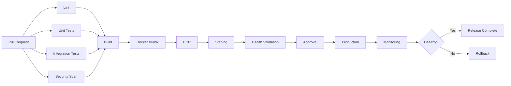
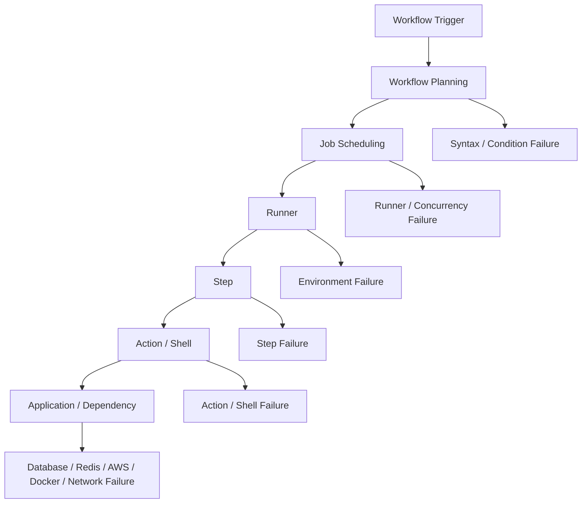

# 04- Job and Step Failures

## Overview

GitHub Actions failures can occur at several execution layers:

```text
Workflow
  ↓
Job Planning
  ↓
Runner Allocation
  ↓
Job Initialization
  ↓
Step
  ↓
Action / Shell Command
  ↓
Application / Infrastructure
```

A failed workflow does not automatically mean the application is broken. The failure may originate from:

- Job dependency configuration
- Conditional execution
- Matrix expansion
- Runner availability
- Environment configuration
- Permissions
- Secrets
- Action execution
- Shell commands
- Docker
- PostgreSQL/MySQL/Redis
- AWS authentication
- Network connectivity
- Application tests

The most reliable troubleshooting model is:

```text
Symptom
  ↓
Possible Causes
  ↓
Isolation Strategy
  ↓
Commands / Checks
  ↓
Root Cause
  ↓
Corrective Action
  ↓
Prevention
```

The goal is not merely to make a failed run green. The goal is to identify the failing execution boundary and prevent recurrence.

---

## GitHub Actions Execution Model

A workflow is composed of jobs, and jobs are composed of steps.

```text
Workflow
├── Job A
│   ├── Step 1
│   ├── Step 2
│   └── Step 3
│
├── Job B
│   ├── Step 1
│   └── Step 2
│
└── Job C
    └── Step 1
```

Jobs can execute independently or through dependencies:

```yaml
jobs:
  test:
    runs-on: ubuntu-latest
    steps:
      - run: pytest

  build:
    needs: test
    runs-on: ubuntu-latest
    steps:
      - run: docker build .
```

The execution dependency is:

```text
test
  ↓
build
```

If `test` fails, `build` normally does not execute.

---

## Failure Domain Classification

Classifying the failure before changing configuration prevents wasted debugging effort.

| Failure Domain | Typical Symptom | First Investigation |
|---|---|---|
| Workflow | Run never starts | Trigger/configuration |
| Job planning | Job skipped | `if`, `needs`, matrix |
| Runner | Job queued | Runner availability |
| Step | Step failed | Step logs |
| Action | Action failed | Action version/input |
| Shell | Command failed | Exit code/shell |
| Environment | Missing value | `env`, `vars`, secrets |
| Permission | Access denied | `permissions` |
| Dependency | Installation failure | Package manager/network |
| Service container | Connection refused | Health/readiness/network |
| Docker | Build failure | Dockerfile/context/cache |
| AWS | Access denied | OIDC/IAM/STS |
| Deployment | Health failure | Target/service state |
| Concurrency | Conflicting runs | Concurrency groups |

---

## Job Failures vs Step Failures

A job can fail because a step failed:

```text
Job
 ├── Checkout       ✓
 ├── Install        ✓
 ├── Test           ✗
 └── Deploy         skipped
```

The important point is that:

```text
Failed job
```

is a high-level status.

The actionable root cause is usually lower in the execution tree.

Start with the first meaningful failure rather than the final skipped or dependent job.

---

## The First Failure Principle

Consider:

```text
lint        ✓
unit-test   ✗
integration skipped
build       skipped
deploy      skipped
```

Do not investigate:

```text
deploy
```

first.

Investigate:

```text
unit-test
```

The downstream skips are consequences, not independent failures.

This principle becomes especially important in large fan-out/fan-in pipelines.

---

## Job Conditions

Jobs can be conditionally executed:

```yaml
jobs:
  deploy:
    if: ${{ github.ref == 'refs/heads/main' }}
    runs-on: ubuntu-latest
    steps:
      - run: ./deploy.sh
```

If the condition is false:

```text
Job = skipped
```

This is not a job failure.

---

## Troubleshooting Skipped Jobs

### Symptom

A required job did not run.

### Possible Causes

- `if` evaluated to false.
- Upstream `needs` job failed.
- Upstream job was skipped.
- Matrix generated no matching combination.
- Event context differed from expectations.
- Concurrency affected execution.

### Isolation Strategy

Inspect:

```text
Job status
↓
if condition
↓
needs dependencies
↓
Upstream result
↓
Event context
↓
Matrix
```

### Prevention

Keep complex conditions understandable and expose important decision values explicitly.

---

## `needs` Failures

Example:

```yaml
jobs:
  test:
    runs-on: ubuntu-latest
    steps:
      - run: pytest

  build:
    needs: test
    runs-on: ubuntu-latest
    steps:
      - run: docker build .
```

If `test` fails:

```text
test = failure
build = skipped
```

The correct investigation target is `test`.

---

## Inspecting `needs` Results

A downstream job can inspect upstream results.

```yaml
jobs:
  test:
    runs-on: ubuntu-latest
    steps:
      - run: pytest

  report:
    needs: test
    if: ${{ always() }}
    runs-on: ubuntu-latest
    steps:
      - env:
          TEST_RESULT: ${{ needs.test.result }}
        run: |
          printf 'test result: %s\n' "$TEST_RESULT"
```

This is useful for diagnostics and reporting.

---

## Status Functions

Important status functions include:

```text
success()
failure()
cancelled()
always()
```

Example:

```yaml
- name: Upload diagnostics
  if: ${{ failure() }}
  uses: actions/upload-artifact@v4
  with:
    name: diagnostics
    path: diagnostics/
```

Status functions operate within workflow execution. They cannot make a workflow run if no workflow run was created.

---

## `always()` and Cancellation

`always()` means the condition can remain true even when previous steps have failed.

Example:

```yaml
- name: Collect diagnostics
  if: ${{ always() }}
  run: ./scripts/collect-diagnostics.sh
```

Use it deliberately.

For cleanup or diagnostic tasks that should not run after cancellation, consider whether `cancelled()` needs to be handled explicitly.

Do not use `always()` as a generic replacement for dependency reasoning.

---

## `failure()` vs `cancelled()`

These represent different states.

```text
failure()
    ↓
An earlier execution failed

cancelled()
    ↓
Execution was cancelled
```

A production diagnostic step may need different handling for each case.

---

## `continue-on-error`

A step can be allowed to fail without failing the entire job:

```yaml
- name: Optional static analysis
  continue-on-error: true
  run: my-analysis-tool
```

This changes failure semantics.

Use it carefully because:

```text
Green job
≠
Every step succeeded
```

If a security scan is marked `continue-on-error`, the pipeline may appear healthy while the scan actually failed.

---

## Job-Level `continue-on-error`

A matrix job can also tolerate specific failures.

```yaml
strategy:
  matrix:
    python-version:
      - "3.11"
      - "3.12"
  fail-fast: false
```

For experimental configurations, controlled failure tolerance can be useful.

Do not use it to hide required compatibility failures.

---

## Matrix Job Failures

A matrix expands one logical job into multiple executions.

```yaml
strategy:
  matrix:
    python-version:
      - "3.11"
      - "3.12"
```

Conceptually:

```text
test
├── Python 3.11
└── Python 3.12
```

A failure may therefore be specific to one combination.

---

## Matrix Troubleshooting

### Symptom

Only one matrix job fails.

### Possible Causes

- Python version incompatibility
- Database version incompatibility
- OS difference
- Dependency resolution
- Application compatibility
- Matrix-specific environment

### Isolation Strategy

Identify the exact matrix values:

```text
Python = 3.12
Database = PostgreSQL 17
OS = Ubuntu
```

Then reproduce that exact combination.

---

## Matrix `fail-fast`

Example:

```yaml
strategy:
  fail-fast: true
  matrix:
    python-version:
      - "3.11"
      - "3.12"
      - "3.13"
```

A failure can cause in-progress matrix jobs to be cancelled.

For compatibility testing, it can be useful to use:

```yaml
fail-fast: false
```

so all combinations produce diagnostic information.

---

## `max-parallel`

Example:

```yaml
strategy:
  max-parallel: 2
  matrix:
    python-version:
      - "3.11"
      - "3.12"
      - "3.13"
```

This controls concurrency within the matrix.

It can prevent excessive load against:

- PostgreSQL
- Redis
- External APIs
- Runner pools
- AWS services

---

## Step Failure Lifecycle

A step generally follows:

```text
Step Scheduled
    ↓
Environment Prepared
    ↓
Action / Shell Started
    ↓
Command Executes
    ↓
Exit Code
    ↓
Success / Failure
```

For shell commands:

```text
exit code 0 → success
non-zero     → failure
```

unless failure behavior is explicitly changed.

---

## Exit Codes

Example:

```yaml
- name: Run tests
  run: pytest
```

If pytest returns:

```text
0
```

the step succeeds.

If pytest returns:

```text
1
```

the step fails.

Always distinguish:

```text
GitHub Actions failure
```

from:

```text
Application process exit code
```

---

## Shell Failures

A step may fail because of shell syntax:

```yaml
- name: Run script
  shell: bash
  run: |
    set -euo pipefail
    ./scripts/deploy.sh
```

Common causes:

- Invalid shell syntax
- Missing executable
- Missing environment variable
- Incorrect working directory
- Permission denied
- Non-zero command exit code

---

## Debugging Shell Commands

Prefer explicit diagnostics:

```yaml
- name: Diagnose environment
  run: |
    pwd
    python --version
    pip --version
    env | sort
```

Do not dump secrets.

For sensitive workflows, selectively print safe values:

```yaml
- name: Diagnose
  env:
    APP_ENV: ${{ vars.APP_ENV }}
  run: |
    printf 'APP_ENV=%s\n' "$APP_ENV"
```

---

## Working Directory Failures

A command may fail because it runs from the wrong directory.

Example:

```yaml
defaults:
  run:
    working-directory: backend
```

Then:

```yaml
- name: Test
  run: pytest
```

GitHub Actions executes pytest from:

```text
backend/
```

A common error is assuming the shell is executing from the repository root.

Diagnose with:

```bash
pwd
find . -maxdepth 2 -type f | sort
```

---

## Missing Executable

Example:

```text
pytest: command not found
```

Possible causes:

- Dependencies were not installed.
- Virtual environment is not active.
- Wrong Python environment.
- PATH is incorrect.
- Tool installation failed earlier.

Check:

```bash
python --version
python -m pip --version
python -m pytest --version
```

For Python workflows, prefer:

```bash
python -m pytest
```

when appropriate because it ties pytest invocation to the selected Python interpreter.

---

## Python Dependency Failures

Typical failure:

```text
ModuleNotFoundError
```

Investigate:

```bash
python --version
python -m pip list
python -m pip show <package>
python -c "import <package>; print(<package>.__version__)"
```

Common causes:

- Dependency not installed
- Wrong Python version
- Incorrect lock file
- Installation failure hidden earlier
- Multiple Python installations

---

## Django Test Failures

Example:

```yaml
- name: Run Django tests
  env:
    DJANGO_SETTINGS_MODULE: config.settings.test
  run: |
    python manage.py check
    python manage.py test
```

Potential causes include:

- Missing settings
- Missing environment variables
- Database unavailable
- Migration failure
- Incorrect installed apps
- Test configuration mismatch

Separate framework configuration errors from actual test assertion failures.

---

## FastAPI Test Failures

For FastAPI:

```bash
python -m pytest -q
```

Typical issues:

- Application import errors
- Dependency injection configuration
- Missing environment variables
- Database connectivity
- Async test configuration
- External service dependencies

A useful isolation sequence is:

```text
Import Application
    ↓
Start Test Dependencies
    ↓
Run Unit Tests
    ↓
Run Integration Tests
```

---

## PostgreSQL Service Container Failures

Example:

```yaml
services:
  postgres:
    image: postgres:17
    env:
      POSTGRES_USER: app
      POSTGRES_PASSWORD: test-password
      POSTGRES_DB: app_test
    options: >-
      --health-cmd="pg_isready -U app -d app_test"
      --health-interval=10s
      --health-timeout=5s
      --health-retries=5
```

Potential failures:

```text
Connection refused
Authentication failed
Database does not exist
Migration failure
Service not ready
```

Do not assume container startup means database readiness.

---

## Redis Service Failures

Typical configuration:

```yaml
services:
  redis:
    image: redis:7
    options: >-
      --health-cmd="redis-cli ping"
      --health-interval=10s
      --health-timeout=5s
      --health-retries=5
```

Test connectivity:

```bash
redis-cli -h "$REDIS_HOST" ping
```

or from Python:

```bash
python -c "import redis; print(redis.Redis(host='localhost').ping())"
```

Adjust hostname according to the runner/container networking model.

---

## Service Readiness vs Availability

This distinction is important:

```text
Container Running
    ≠
Service Ready
```

For PostgreSQL:

```text
Container Started
    ↓
Database Process Started
    ↓
Database Accepting Connections
    ↓
Schema Ready
```

Integration tests should begin only when required dependencies are ready.

---

## Container Networking Failures

When the job runs directly on a runner, service containers commonly require mapped ports.

When the job itself runs in a container, service containers can use the job container's network model.

Therefore, do not blindly reuse:

```text
localhost
```

between different GitHub Actions container configurations.

First establish:

```text
Where is the test process running?
Where is the service running?
How are they connected?
Which hostname resolves to the service?
```

---

## Docker Build Failures

Example:

```yaml
- name: Build image
  run: docker build -t backend:${GITHUB_SHA} .
```

Typical failures:

- Invalid Dockerfile
- Missing build context
- `.dockerignore` excludes required files
- Dependency installation failure
- Network failure
- Base image unavailable
- Architecture mismatch
- BuildKit/cache issue

Start with:

```bash
docker version
docker info
docker build --progress=plain -t backend:test .
```

---

## Docker Build Context Problems

A Dockerfile may contain:

```dockerfile
COPY pyproject.toml .
```

but `.dockerignore` might exclude the file.

Check:

```bash
cat .dockerignore
```

and:

```bash
ls -la
```

The build context is not necessarily identical to the Git repository contents.

---

## Docker Cache Problems

A cache can make debugging harder because stale layers may hide the real behavior.

For diagnosis:

```bash
docker build --no-cache --progress=plain -t backend:test .
```

Do not disable caching permanently to solve a cache problem.

Determine why the cache is stale or invalid.

---

## Action Failures

Example:

```yaml
- uses: actions/setup-python@v5
  with:
    python-version: "3.12"
```

An action failure may originate from:

- Invalid input
- Unsupported version
- Network problem
- Action implementation
- Permissions
- Runner environment
- Action dependency

Inspect the action step before debugging subsequent steps.

---

## Action Input Failures

Example:

```yaml
- uses: actions/setup-python@v5
  with:
    python-version: "3.12"
```

If the input key is wrong:

```yaml
with:
  python: "3.12"
```

the workflow may remain valid YAML while the action does not receive the expected input.

Always compare the action's documented interface with the workflow configuration.

---

## Third-Party Action Failures

When an external action fails, investigate:

```text
Action Version
 ↓
Input Configuration
 ↓
Permissions
 ↓
Runner Environment
 ↓
Network
 ↓
Action Dependency
```

Do not immediately replace the action.

If the action is security-sensitive, also inspect its trust and versioning model.

---

## Permissions Failures

A job may fail with:

```text
Resource not accessible
Permission denied
403
```

Check:

```yaml
permissions:
  contents: read
```

or the required job-specific permissions.

For AWS OIDC:

```yaml
permissions:
  contents: read
  id-token: write
```

Minimal permissions should be granted only where required.

---

## `GITHUB_TOKEN` Failures

The token's effective permissions depend on repository/workflow/job configuration.

A common pattern is:

```yaml
permissions:
  contents: read
```

Then a step attempts to create or modify a resource requiring write access.

The correct fix is not automatically:

```yaml
permissions: write-all
```

Instead:

1. Identify the API operation.
2. Identify the required permission.
3. Grant it at the narrowest appropriate scope.

---

## Secret Failures

Symptoms include:

```text
Authentication failed
Credential missing
Invalid token
Access denied
```

Possible causes:

- Secret does not exist.
- Wrong secret scope.
- Environment not selected.
- Secret not available to the event.
- Secret name mismatch.
- Secret was rotated.
- Secret was passed incorrectly.

Diagnose presence without printing the value.

Example:

```yaml
- name: Check secret presence
  env:
    API_TOKEN: ${{ secrets.API_TOKEN }}
  run: |
    if [[ -z "$API_TOKEN" ]]; then
      echo "API_TOKEN is not configured"
      exit 1
    fi
```

Never print:

```bash
echo "$API_TOKEN"
```

---

## Environment Failures

A job can target an environment:

```yaml
environment:
  name: production
```

Environment configuration can provide:

- Secrets
- Variables
- Required reviewers
- Deployment protection

If an expected value is missing, verify that the job actually targets the intended environment.

---

## AWS OIDC Failures

A typical authentication sequence is:

```text
GitHub Actions
    ↓
OIDC Token
    ↓
AWS STS
    ↓
AssumeRoleWithWebIdentity
    ↓
Temporary Credentials
```

Workflow permissions:

```yaml
permissions:
  contents: read
  id-token: write
```

Typical failures:

- `id-token: write` missing
- Incorrect IAM trust policy
- Wrong audience
- Incorrect repository/branch/environment condition
- Wrong role ARN
- Incorrect AWS account
- Expired or invalid workflow context

---

## AWS Authentication Diagnostics

After configuring credentials:

```yaml
- name: Verify AWS identity
  run: aws sts get-caller-identity
```

This establishes:

```text
Which AWS account?
Which principal?
Did credential acquisition succeed?
```

Then investigate ECR/ECS/S3/IAM permissions separately.

Do not treat:

```text
AWS authentication succeeded
```

as proof that:

```text
AWS operation is authorized
```

---

## ECR Failures

Typical workflow:

```text
OIDC
 ↓
STS
 ↓
IAM Role
 ↓
ECR Login
 ↓
Docker Build
 ↓
Docker Push
```

Diagnostic:

```bash
aws sts get-caller-identity
aws ecr describe-repositories --repository-names backend
```

Then test registry authentication and push separately.

Failure domains should remain isolated.

---

## Artifact Failures

Artifacts are used to transfer build/test outputs between jobs.

Example:

```yaml
- name: Upload test report
  uses: actions/upload-artifact@v4
  with:
    name: test-report
    path: reports/
```

Potential failures:

- Incorrect path
- File was never generated
- Artifact name collision
- Permission/configuration issue
- Downloading from the wrong job/run

Check:

```bash
pwd
find reports -maxdepth 2 -type f -print
```

before debugging the artifact action.

---

## Artifact vs Cache

Do not confuse:

| Artifact | Cache |
|---|---|
| Build/test output | Reusable dependency data |
| Intended for transfer/retention | Intended for performance |
| Explicitly uploaded/downloaded | Restored by key |
| Can represent release material | Should not be treated as release material |
| Debugging/test reports | Dependencies/build cache |

An artifact failure should not be debugged as a cache miss.

---

## Cache Failures

Symptoms:

```text
Cache miss
Slow dependency installation
Unexpected stale dependency behavior
```

Check:

```yaml
key: ${{ runner.os }}-pip-${{ hashFiles('**/requirements.lock') }}
```

Investigate:

- Key
- Restore keys
- Lock files
- OS
- Python version
- Cache path
- Cache scope

Caching should improve performance, not become a correctness dependency.

---

## Reusable Workflow Failures

A reusable workflow is invoked through:

```yaml
jobs:
  ci:
    uses: organization/platform/.github/workflows/python-ci.yml@v1
```

Common problems:

- Wrong workflow reference
- Missing `workflow_call`
- Input mismatch
- Secret mismatch
- Output mismatch
- Permission mismatch
- Incorrect repository/ref

Debug the interface contract first.

---

## Reusable Workflow Inputs

Definition:

```yaml
on:
  workflow_call:
    inputs:
      python-version:
        required: true
        type: string
```

Caller:

```yaml
with:
  python-version: "3.12"
```

A contract mismatch can fail before the underlying application logic executes.

---

## Custom Action Failures

For composite actions:

```yaml
runs:
  using: composite
  steps:
    - shell: bash
      run: ./scripts/build.sh
```

For JavaScript actions:

```yaml
runs:
  using: node24
  main: dist/index.js
```

For Docker actions:

```yaml
runs:
  using: docker
  image: Dockerfile
```

When troubleshooting, first identify which action type is being executed.

---

## Runner Failures

A job can remain queued because no eligible runner is available.

Potential causes:

- Incorrect labels
- Runner offline
- Runner group restriction
- Capacity exhausted
- Self-hosted runner unavailable
- Private network runner unavailable
- Concurrency limiting execution

For self-hosted runners, investigate runner state before changing application configuration.

---

## Runner Environment Diagnostics

Useful commands:

```bash
uname -a
whoami
pwd
df -h
free -h
nproc
```

For processes:

```bash
ps aux
```

For networking:

```bash
ip addr
ip route
```

Use only diagnostics appropriate to the runner operating system.

---

## Disk Exhaustion

A runner can fail because disk space is exhausted.

Check:

```bash
df -h
```

For Docker:

```bash
docker system df
```

Potential causes:

- Large Docker layers
- Old caches
- Test artifacts
- Dependency caches
- Build outputs

Persistent self-hosted runners require explicit cleanup and capacity management.

---

## Memory Failures

Symptoms:

```text
Killed
Out of memory
Process exited unexpectedly
```

Check:

```bash
free -h
```

and:

```bash
docker stats
```

where Docker is involved.

Possible solutions include:

- Reduce parallelism
- Reduce matrix size
- Optimize tests
- Increase runner resources
- Split jobs
- Use resource-appropriate runner classes

---

## Network Failures

Typical errors:

```text
Connection timed out
Could not resolve host
Connection refused
TLS handshake failure
```

Debug in layers:

```text
DNS
 ↓
Routing
 ↓
TCP
 ↓
TLS
 ↓
Authentication
 ↓
Application
```

Useful commands:

```bash
getent hosts example.com
curl -I https://example.com
```

For private infrastructure, verify VPC routing, security groups, DNS, proxy configuration, and runner network placement.

---

## Service Container vs External Service

A failure may come from assuming the wrong dependency location.

```text
GitHub runner
    ↓
Service container
```

is different from:

```text
GitHub runner
    ↓
Private VPC
    ↓
RDS / Redis / Kafka
```

The second architecture introduces additional network and security failure domains.

---

## Concurrency Failures

Production deployments should usually serialize access to the same deployment target.

```yaml
concurrency:
  group: production-deployment
  cancel-in-progress: false
```

Without concurrency control:

```text
Deployment A ────────────→ Production
Deployment B ────────────→ Production
```

can produce race conditions.

---

## Race Condition Example

Suppose:

```text
Commit A → Build → Deploy
Commit B → Build → Deploy
```

Deployment B may start while A is still changing production.

Possible outcomes:

- Wrong version becomes active.
- Health checks observe inconsistent state.
- Rollback targets the wrong release.
- Database migration ordering becomes unsafe.

Use concurrency plus immutable artifacts and idempotent deployment operations.

---

## Deployment Step Failures

A deployment step should not be considered successful merely because a command exited successfully.

A production deployment should validate:

```text
Deployment Command
    ↓
Target State
    ↓
Health Check
    ↓
Application Readiness
    ↓
Traffic
    ↓
Monitoring
```

For ECS:

```bash
aws ecs describe-services \
  --cluster production \
  --services backend
```

For Kubernetes:

```bash
kubectl rollout status deployment/backend
```

---

## Zero-Downtime Deployment Failures

A deployment can technically complete while causing downtime.

Common causes:

- Readiness check missing
- Connection draining not configured
- Incompatible schema migration
- Old and new application versions cannot coexist
- Long-lived connections terminated
- Insufficient capacity

Use deployment strategies appropriate to the application:

- Rolling
- Blue/green
- Canary

---

## Database Migration Failures

Django example:

```bash
python manage.py migrate
```

A migration failure can block deployment.

Production-safe migration design often follows:

```text
Expand
 ↓
Deploy Compatible Application
 ↓
Backfill
 ↓
Switch Usage
 ↓
Contract
```

Avoid coupling destructive schema changes to application deployment unless rollback behavior is explicitly understood.

---

## Celery Failure Domain

A backend may deploy successfully while background workers remain incompatible.

Example:

```text
Web Application
      ↓
Redis
      ↓
Celery Worker
```

A new deployment may introduce task payloads that old workers cannot deserialize.

When deploying Django/FastAPI services with Celery, verify:

- Worker version
- Task compatibility
- Queue state
- Redis connectivity
- Graceful worker shutdown
- Rolling worker deployment

---

## Kafka Failure Domain

Kafka introduces additional deployment compatibility concerns.

Check:

- Producer compatibility
- Consumer compatibility
- Schema changes
- Consumer lag
- Topic availability
- Authentication
- Network connectivity

A CI/CD deployment failure can originate from a downstream messaging dependency rather than GitHub Actions itself.

---

## Nginx and API Gateway Failures

For services behind Nginx:

```text
Client
 ↓
Nginx
 ↓
Application
 ↓
Database
```

A deployment may fail health checks because:

- Nginx points to the wrong upstream
- Application is listening on the wrong port
- Health endpoint requires authentication
- TLS configuration is invalid
- DNS is stale

Debug from the outside inward:

```bash
curl -v https://service.example.com/health
```

then inspect the backend target directly where possible.

---

## Failure Reporting

For important failures, preserve diagnostic information.

Example:

```yaml
- name: Upload logs
  if: ${{ failure() }}
  uses: actions/upload-artifact@v4
  with:
    name: logs-${{ github.run_id }}
    path: |
      logs/
      reports/
```

Useful diagnostics include:

- Test reports
- Coverage reports
- Application logs
- Docker build logs
- Screenshots
- Stack traces
- Configuration metadata without secrets

---

## Safe Debug Logging

Avoid:

```yaml
- run: env
```

in workflows containing secrets.

Prefer targeted diagnostics:

```yaml
- name: Debug runtime
  env:
    APP_ENV: ${{ vars.APP_ENV }}
  run: |
    printf 'runner=%s\n' "$RUNNER_OS"
    printf 'app_env=%s\n' "$APP_ENV"
    python --version
    docker version
```

Never use debugging as a reason to expose credentials.

---

## Debugging With Step Summaries

Use:

```bash
{
  echo "## Deployment Diagnostics"
  echo "- Environment: staging"
  echo "- Commit: ${GITHUB_SHA}"
  echo "- Runner: ${RUNNER_OS}"
} >> "$GITHUB_STEP_SUMMARY"
```

This provides concise operational evidence without forcing engineers to inspect thousands of log lines.

---

## GitHub CLI Failure Investigation

List recent runs:

```bash
gh run list --limit 20
```

Inspect a run:

```bash
gh run view <run-id>
```

Inspect failed logs:

```bash
gh run view <run-id> --log-failed
```

Inspect complete logs:

```bash
gh run view <run-id> --log
```

Rerun failed jobs:

```bash
gh run rerun <run-id> --failed
```

Use reruns to validate hypotheses, not as a substitute for root-cause analysis.

---

## Rerun Analysis

A rerun can provide useful evidence.

Example:

```text
Run 1 → Dependency download timeout
Run 2 → Success
```

This may indicate:

```text
Transient network failure
```

rather than an application defect.

But:

```text
Run 1 → Test failure
Run 2 → Test failure
```

suggests a deterministic failure.

Repeated reruns without investigation create noise and waste CI capacity.

---

## Failure Reproduction

A strong troubleshooting workflow attempts to reproduce the exact environment.

Record:

```text
Commit SHA
Workflow
Job
Step
Runner
OS
Python version
Matrix values
Dependency versions
Environment
Container versions
External service versions
```

Then reproduce the smallest failing boundary.

---

## Reproduction Strategy

For a failing Python test:

```text
GitHub Actions
    ↓
Runner
    ↓
Python 3.12
    ↓
Dependencies
    ↓
pytest
    ↓
Failing Test
```

Try locally:

```bash
python --version
python -m pip freeze
python -m pytest path/to/test.py -q
```

If the exact failure cannot be reproduced locally, compare the environment rather than assuming GitHub Actions is defective.

---

## Production Incident Workflow

A production CI/CD incident should follow:

```text
Detect
  ↓
Stabilize
  ↓
Identify Failure Domain
  ↓
Collect Evidence
  ↓
Mitigate
  ↓
Recover
  ↓
Validate
  ↓
Root Cause
  ↓
Prevention
```

Do not make unrelated workflow changes during an incident without recording why they are being made.

---

## Rollback Failures

If deployment fails after an artifact was produced:

```text
Identify Active Version
        ↓
Identify Previous Known-Good Artifact
        ↓
Validate Compatibility
        ↓
Rollback
        ↓
Health Check
        ↓
Monitor
```

For Docker deployments, prefer immutable image references such as digests rather than mutable tags.

---

## Build Once, Deploy Many

A robust pipeline uses:

```text
Build
 ↓
Immutable Artifact
 ↓
Staging
 ↓
Approval
 ↓
Production
```

not:

```text
Staging Build
 ↓
Production Rebuild
```

The second model can introduce differences between the tested and deployed artifact.

---

## Production CI/CD Architecture



Each stage should have a clear failure boundary.

---

## Security Failure Handling

Failures involving:

- Secrets
- OIDC
- IAM
- Third-party actions
- Self-hosted runners
- Untrusted pull requests

should be treated as security-sensitive incidents.

Do not solve a permissions problem by broadly increasing privileges.

Instead:

```text
Required Operation
 ↓
Required Permission
 ↓
Minimal Scope
 ↓
Job-Level Permission
```

---

## Self-Hosted Runner Failures

Self-hosted runners require additional investigation.

Check:

```text
Runner Online?
 ↓
Correct Labels?
 ↓
Runner Group Access?
 ↓
Capacity?
 ↓
Network?
 ↓
Disk?
 ↓
Memory?
 ↓
Installed Dependencies?
 ↓
Workspace State?
```

Persistent runners can retain state between jobs, which introduces both reliability and security risks.

Ephemeral runners reduce persistent-state problems.

---

## Runner State Contamination

A persistent runner can accidentally retain:

- Build directories
- Docker layers
- Credentials
- Temporary files
- Package caches
- Previous application artifacts

This can cause:

```text
Works on runner A
Fails on runner B
```

or:

```text
Build succeeds only because stale files exist
```

Use cleanup or ephemeral runners where appropriate.

---

## Dependency Installation Failures

Common package installation failures:

```text
pip install
npm install
apt-get
docker pull
```

Potential causes:

- Network outage
- Registry outage
- Rate limiting
- Dependency removed
- Lockfile conflict
- Native build dependency missing

Investigate the exact failing dependency before changing unrelated workflow logic.

---

## Retry Strategy

Retries can help with transient infrastructure failures.

Good candidates:

- Network downloads
- External service availability
- Registry operations

Poor candidates:

- Deterministic unit test failures
- Schema incompatibility
- Invalid configuration
- Compilation errors

Retries should be bounded and observable.

---

## Timeout Strategy

Long-running steps should have meaningful timeouts where supported by the operation.

Avoid letting a failed external dependency consume runner capacity indefinitely.

At the same time, do not use extremely short timeouts that turn normal variance into false failures.

Choose timeouts from observed production behavior.

---

## Flaky Tests

A flaky test alternates between success and failure without a deterministic code change.

Common causes:

- Race conditions
- Shared state
- Time dependence
- External network dependency
- Database state
- Parallel execution
- Insufficient readiness checks

Do not treat repeated reruns as the solution.

Investigate the source of nondeterminism.

---

## Deterministic CI

Reliable CI should minimize:

```text
Current Time
External Network
Shared State
Uncontrolled Services
Mutable Dependencies
Random Ordering
```

Use:

- Locked dependencies
- Isolated databases
- Controlled service versions
- Deterministic test data
- Explicit readiness checks
- Stable container images

---

## Failure Isolation by Technology

| Technology | First Diagnostic |
|---|---|
| Python | `python --version` |
| pytest | `python -m pytest -q` |
| Django | `python manage.py check` |
| PostgreSQL | `pg_isready` / connection test |
| Redis | `redis-cli ping` |
| Docker | `docker version` / `docker build --progress=plain` |
| AWS | `aws sts get-caller-identity` |
| ECR | `aws ecr describe-repositories` |
| ECS | `aws ecs describe-services` |
| Kubernetes | `kubectl get pods` |
| GitHub Actions | `gh run view` |

Use the narrowest diagnostic that tests the suspected boundary.

---

## Common Failure Patterns

### "Everything After Test Is Skipped"

Usually investigate the first failed job.

### "The Job Never Starts"

Investigate:

```text
Runner
Concurrency
Dependencies
Conditions
```

### "The Step Starts and Immediately Fails"

Investigate:

```text
Command
Environment
Working Directory
Shell
```

### "The Action Says Access Denied"

Investigate:

```text
GITHUB_TOKEN
permissions
Secrets
OIDC
IAM
```

### "It Works on My Machine"

Compare:

```text
Runtime
Dependencies
OS
Environment
Service Versions
Network
```

### "Rerunning Fixed It"

Treat the rerun as evidence of a possible transient failure, not proof that the underlying system is healthy.

---

## Common Mistakes

### Debugging the Last Skipped Job

The last skipped job is often a consequence of an earlier failure.

### Changing Multiple Variables at Once

Changing the runner, Python version, dependencies, and workflow structure simultaneously destroys diagnostic clarity.

### Increasing Permissions Immediately

An authorization failure should be mapped to the required permission rather than solved with broad write access.

### Printing Secrets

Debugging output can become a security incident.

### Ignoring Exit Codes

The shell command's exit code determines whether a step succeeds unless failure handling changes the semantics.

### Assuming Container Startup Means Readiness

Databases and Redis may need additional time before accepting requests.

### Treating Retries as Fixes

Retries can hide deterministic failures.

### Ignoring Matrix Values

A failure may exist only for one Python, database, OS, or service combination.

### Rebuilding During Production Promotion

Rebuilding can create an artifact different from the one that passed CI and staging.

---

## Production Failure Prevention

A mature pipeline should include:

```text
Deterministic Dependencies
        ↓
Lint
        ↓
Unit Tests
        ↓
Integration Tests
        ↓
Security Scanning
        ↓
Matrix Validation
        ↓
Immutable Build
        ↓
Artifact Verification
        ↓
Staging
        ↓
Health Validation
        ↓
Approval
        ↓
Production
        ↓
Monitoring
        ↓
Rollback
```

Failure handling should be designed before the first production incident.

---

## Operational Checklist

### Workflow

```text
[ ] Correct trigger
[ ] Valid workflow syntax
[ ] Correct branch/path filters
[ ] Correct event context
```

### Job

```text
[ ] Correct runs-on
[ ] Correct needs
[ ] Correct if
[ ] Correct matrix
[ ] Correct concurrency
```

### Step

```text
[ ] Correct action/version
[ ] Correct inputs
[ ] Correct shell
[ ] Correct working directory
[ ] Correct environment
[ ] Correct exit code
```

### Dependencies

```text
[ ] Python installed
[ ] Packages installed
[ ] PostgreSQL ready
[ ] Redis ready
[ ] Docker available
[ ] AWS identity valid
```

### Security

```text
[ ] Minimal permissions
[ ] Secrets not logged
[ ] OIDC trust restricted
[ ] Untrusted input handled safely
[ ] Third-party actions trusted/pinned appropriately
```

### Production

```text
[ ] Immutable artifact
[ ] Deployment serialized
[ ] Health checks
[ ] Monitoring
[ ] Rollback path
```

---

## Senior-Level Troubleshooting Method

A senior engineer should reason from boundaries rather than symptoms.

Given:

```text
Production deployment failed
```

do not immediately inspect the application.

First classify:

```text
Did GitHub Actions execute?
    ↓
Did the deployment job start?
    ↓
Did AWS authentication succeed?
    ↓
Was the artifact available?
    ↓
Did the deployment API accept the request?
    ↓
Did the target become healthy?
    ↓
Did traffic shift correctly?
```

This transforms a broad incident into isolated hypotheses.

---

## Interview Scenarios

### A Job Is Skipped After Tests Fail

Explain:

```text
test = failure
    ↓
build needs test
    ↓
build = skipped
```

The solution is to investigate the test failure rather than forcing the build to run.

---

### One Matrix Combination Fails

Explain how you would isolate:

```text
Python version
Database
Operating system
Dependencies
Environment
```

Then reproduce the exact matrix combination.

---

### A Step Returns Exit Code 1

Explain:

```text
GitHub Actions reports the step as failed
```

Then inspect:

```text
Command output
Exit code
Environment
Working directory
Dependencies
```

Do not assume the GitHub Actions platform itself is broken.

---

### AWS Authentication Succeeds but ECR Push Fails

Separate:

```text
OIDC authentication
```

from:

```text
IAM authorization
```

Validate:

```bash
aws sts get-caller-identity
```

Then inspect ECR permissions.

---

### PostgreSQL Container Is Running but Tests Cannot Connect

Explain the difference between:

```text
Container started
```

and:

```text
Database ready
```

Then inspect:

```text
Hostname
Port
Credentials
Health status
Readiness
Networking model
```

---

### Rerun Succeeds Without Code Changes

Do not immediately conclude that the original issue was harmless.

Compare:

```text
Run 1
Run 2
```

and determine whether the difference indicates:

- Network transient
- Runner issue
- Registry issue
- External dependency
- Genuine flakiness

---

### Production Deployment Runs Twice

Investigate:

```text
Trigger overlap
+
Concurrency configuration
+
Reusable workflow invocation
+
Manual dispatch
```

Then protect the deployment target with an explicit concurrency group.

---

### Deployment Succeeds but Application Is Unhealthy

Separate:

```text
Deployment command success
```

from:

```text
Application health success
```

A production pipeline must validate the deployed system, not only the deployment API response.

---

## Reference Failure Architecture



The correct troubleshooting strategy is to identify which boundary failed.

---

## Production Engineering Principles

### Make Failures Observable

A failure should expose enough evidence to identify:

```text
What failed?
Where?
Why?
Under which configuration?
Against which version?
```

### Make Failures Isolatable

Use separate jobs and clear dependencies:

```text
Lint
Unit
Integration
Security
Build
Deploy
```

### Make Deployments Reversible

Maintain:

```text
Previous Artifact
Current Artifact
Deployment Metadata
Health Status
Rollback Procedure
```

### Make CI Deterministic

Pin important versions and isolate dependencies.

### Make Privileged Jobs Small

A deployment job should not contain unrelated testing or build responsibilities.

---

## Key Takeaways

- Diagnose failures by **execution boundary**: workflow planning → job → runner → step → action/shell → application or infrastructure, and investigate the first meaningful failure.
- Distinguish **failed, skipped, cancelled, and queued** states; `needs`, `if`, matrices, concurrency, and runner availability can change execution without indicating an application defect.
- For backend CI, isolate external dependencies such as **PostgreSQL, Redis, Docker, AWS, Kafka, and Celery** with explicit readiness, identity, networking, and health checks.
- Treat retries, `continue-on-error`, broad permissions, and repeated reruns as controlled mechanisms—not substitutes for root-cause analysis.
- Production pipelines should produce **immutable artifacts, validate deployments, serialize production changes, preserve diagnostics, monitor health, and maintain a tested rollback path**.