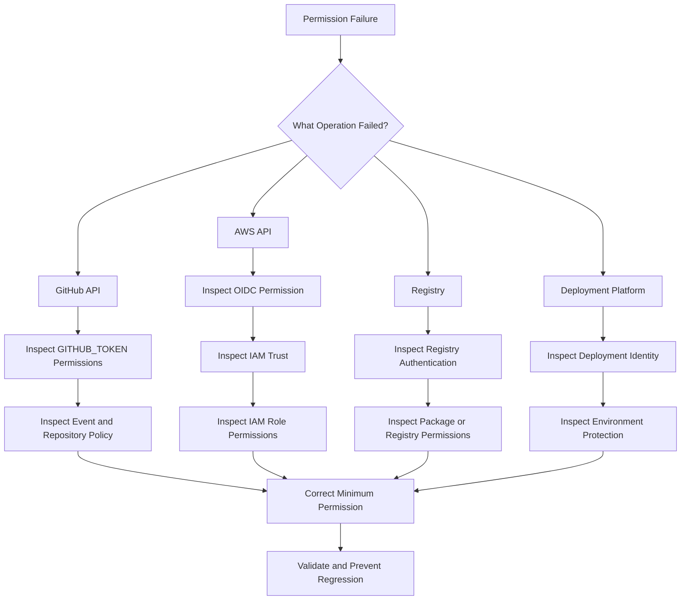
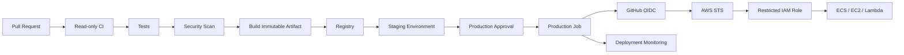

# 07- Permissions and GITHUB_TOKEN Issues

## Overview

GitHub Actions permissions determine what a workflow, job, action, or deployment is allowed to do.

The most important permission boundary is the automatically provided `GITHUB_TOKEN`. It gives a workflow authenticated access to GitHub APIs and repository resources, but its capabilities depend on the permissions granted to it.

Permission failures commonly appear as:

- `Resource not accessible by integration`
- `403 Forbidden`
- API calls unexpectedly failing
- Checkout succeeding but later repository operations failing
- Pull request comments failing
- Release creation failing
- Package publishing failing
- A reusable workflow losing access to a required resource
- AWS OIDC authentication failing because `id-token: write` is missing
- A third-party action failing after permissions were reduced
- A workflow working in one repository but not another
- A job unexpectedly having more privileges than intended

The correct troubleshooting model is:

```text
Permission Failure
       ↓
Identify Resource
       ↓
Identify Actor / Token
       ↓
Identify Event
       ↓
Inspect Effective Permissions
       ↓
Check Repository / Organization Policy
       ↓
Check Job-Level Overrides
       ↓
Check Security Boundary
       ↓
Correct Minimum Required Permission
       ↓
Validate
       ↓
Prevent Regression
```

The core production principle is:

> Grant the smallest permission required at the narrowest practical scope.

---

## GitHub Actions Permission Model

A useful mental model is:

```text
Workflow
   ↓
GITHUB_TOKEN
   ↓
Repository / GitHub API
   ↓
Allowed Resources
```

For more complex workflows:

```text
Workflow
 ├── GITHUB_TOKEN
 │      └── GitHub API permissions
 │
 ├── OIDC token
 │      └── Cloud identity exchange
 │
 ├── Repository secrets
 │      └── External credentials
 │
 └── Third-party actions
        └── Execute using workflow privileges
```

This means permissions are not simply an authentication concern.

They are an authorization boundary.

---

## What Is `GITHUB_TOKEN`?

`GITHUB_TOKEN` is a GitHub-provided token available to workflow jobs.

It allows workflows to authenticate against GitHub resources without requiring a manually created personal access token for many repository operations.

Typical uses include:

- Reading repository contents
- Creating issues
- Updating pull requests
- Uploading packages
- Creating releases
- Accessing GitHub APIs
- Managing workflow-related resources where permitted

A workflow can access it as:

```yaml
${{ secrets.GITHUB_TOKEN }}
```

or:

```yaml
env:
  GH_TOKEN: ${{ github.token }}
```

The token is automatically managed by GitHub for the workflow run.

---

## `GITHUB_TOKEN` Is Not a Personal Access Token

A common misconception is:

```text
GITHUB_TOKEN = personal GitHub token
```

They are different.

`GITHUB_TOKEN` is:

- Automatically generated for the workflow
- Scoped to the repository/workflow context
- Controlled through workflow permissions
- Short-lived
- Intended for automation

A personal access token is an independently managed credential with its own identity and lifecycle.

Avoid replacing `GITHUB_TOKEN` with a PAT simply because a workflow operation fails.

First determine whether the required permission can be granted safely to `GITHUB_TOKEN`.

---

## Authentication vs Authorization

These are different failure domains.

### Authentication

Answers:

```text
Who are you?
```

### Authorization

Answers:

```text
What are you allowed to do?
```

For example:

```text
GITHUB_TOKEN exists
        ↓
Authentication succeeds
        ↓
contents: read only
        ↓
Attempt to create release
        ↓
Authorization fails
```

A `403` often indicates that authentication succeeded but the token lacks sufficient authorization.

---

## Permission Categories

GitHub Actions supports granular permission categories.

Common categories include:

| Permission | Typical Purpose |
|---|---|
| `actions` | Manage GitHub Actions resources |
| `attestations` | Create artifact attestations |
| `checks` | Manage check runs |
| `contents` | Repository contents |
| `deployments` | Deployment-related operations |
| `discussions` | Discussions |
| `id-token` | OIDC token issuance |
| `issues` | Issues |
| `packages` | Packages |
| `pages` | GitHub Pages |
| `pull-requests` | Pull request operations |
| `security-events` | Security-related events |
| `statuses` | Commit statuses |

The exact operation required should determine the permission rather than choosing broad access by trial and error.

---

## The `permissions` Block

Permissions can be explicitly configured.

Example:

```yaml
permissions:
  contents: read
```

This establishes a narrow baseline for the workflow.

A production CI workflow often starts with:

```yaml
permissions:
  contents: read
```

and grants additional permissions only to jobs that need them.

---

## Workflow-Level Permissions

Example:

```yaml
name: CI

on:
  pull_request:

permissions:
  contents: read

jobs:
  test:
    runs-on: ubuntu-latest

    steps:
      - uses: actions/checkout@v4

      - name: Run tests
        run: pytest
```

This provides a clear security baseline.

---

## Job-Level Permissions

Permissions can be narrowed or expanded at job level.

Example:

```yaml
permissions:
  contents: read

jobs:
  test:
    permissions:
      contents: read

    runs-on: ubuntu-latest

    steps:
      - uses: actions/checkout@v4
      - run: pytest

  release:
    permissions:
      contents: write

    runs-on: ubuntu-latest

    steps:
      - name: Create release
        run: ./release.sh
```

This is preferable to giving every job write access.

---

## Why Job-Level Permissions Matter

Consider:

```text
Lint
Unit Tests
Integration Tests
Security Scan
Build
Release
Deploy
```

Only some of these jobs may require write access.

A better model is:

```text
Lint              → read
Unit tests        → read
Integration       → read
Security          → read
Build             → read/packages
Release           → contents write
AWS deployment    → id-token write
```

This reduces blast radius.

---

## Least Privilege

Least privilege means:

```text
Minimum permission
+
Minimum scope
+
Minimum duration
+
Minimum trust boundary
```

For GitHub Actions this usually means:

- Explicit `permissions`
- Job-level restrictions
- Separate deployment jobs
- Separate environments
- OIDC instead of long-lived AWS keys
- Restricted reusable workflows
- Trusted actions
- Minimal repository write access

---

## A Secure Baseline

A common starting point:

```yaml
permissions:
  contents: read
```

Then add only what is required.

For AWS OIDC:

```yaml
permissions:
  contents: read
  id-token: write
```

For publishing packages:

```yaml
permissions:
  contents: read
  packages: write
```

For pull request comments:

```yaml
permissions:
  contents: read
  pull-requests: write
```

The exact permission should correspond to the operation.

---

## Permission Inheritance and Overrides

Permissions can be defined at workflow and job levels.

Conceptually:

```text
Workflow permissions
        ↓
Job permissions
        ↓
Effective job permissions
```

If a job declares its own permissions, do not assume that workflow-level permissions will continue to apply unchanged.

This is a frequent cause of unexpected failures.

---

## Common Override Failure

Example:

```yaml
permissions:
  contents: read
  pull-requests: write

jobs:
  test:
    permissions:
      contents: read
```

The `test` job should not be treated as automatically retaining the workflow-level `pull-requests: write` capability.

When debugging, inspect the permissions declared at the actual job where the failure occurs.

---

## `contents: read`

This is one of the most common permissions.

It is typically required for repository content operations such as:

```yaml
- uses: actions/checkout@v4
```

A minimal CI workflow commonly uses:

```yaml
permissions:
  contents: read
```

---

## Checkout Permission Failure

### Symptom

`actions/checkout` fails with an authorization error.

### Possible Causes

- `contents: read` missing
- Repository policy restrictions
- Token configuration
- Private repository access constraints
- Organization-level Actions policy

### Isolation Strategy

Start with:

```yaml
permissions:
  contents: read
```

Then rerun the workflow.

If it still fails, investigate repository and organization policies rather than immediately granting broad write permissions.

---

## `contents: write`

This permission is appropriate for operations that modify repository contents or certain repository-managed resources.

Examples may include:

- Pushing generated content
- Updating repository files through the API
- Certain release automation operations

Example:

```yaml
permissions:
  contents: write
```

Do not grant this permission to ordinary test jobs.

---

## `pull-requests: write`

Required for workflows that need to modify pull requests, such as certain automation that:

- Adds comments
- Updates PR metadata
- Performs PR-specific automation

Example:

```yaml
permissions:
  contents: read
  pull-requests: write
```

Keep this permission isolated to the job that performs the operation.

---

## `issues: write`

Use when automation needs to modify issues.

Example:

```yaml
permissions:
  contents: read
  issues: write
```

A workflow that only reads repository content should not receive `issues: write`.

---

## `packages: write`

Package publishing often requires:

```yaml
permissions:
  contents: read
  packages: write
```

For example:

```yaml
- name: Publish package
  run: |
    python -m build
    twine upload dist/*
```

The package registry and authentication method determine the exact configuration.

---

## `id-token: write`

This permission is especially important for AWS OIDC.

Example:

```yaml
permissions:
  contents: read
  id-token: write
```

Without `id-token: write`, a workflow cannot request the GitHub OIDC token needed for federation.

The architecture is:

```text
GitHub Actions
      ↓
OIDC token
      ↓
AWS STS
      ↓
IAM role
      ↓
Temporary credentials
```

---

## AWS OIDC Permission Failure

### Symptom

AWS authentication fails with an error indicating that an identity token cannot be requested.

### Possible Cause

The workflow does not have:

```yaml
id-token: write
```

### Corrective Action

Grant only the required OIDC permission:

```yaml
permissions:
  contents: read
  id-token: write
```

Then separately validate the AWS IAM trust policy.

---

## OIDC Permission vs IAM Trust

Two independent authorization systems are involved:

```text
GitHub
  ↓
id-token: write
  ↓
OIDC token
  ↓
AWS STS
  ↓
IAM trust policy
  ↓
IAM role permissions
  ↓
AWS resource
```

A failure can occur at any stage.

| Failure | Likely Domain |
|---|---|
| Cannot request OIDC token | GitHub permissions |
| STS rejects token | IAM trust policy |
| AssumeRole succeeds but ECR fails | IAM role permissions |
| ECR works but ECS deployment fails | ECS/IAM/deployment configuration |

Do not solve an IAM trust failure by granting broader GitHub permissions.

---

## `actions` Permission

Some automation interacts with GitHub Actions resources.

For example:

```text
Workflow management
Workflow-related APIs
Actions administration
```

If an action performs GitHub API operations, inspect which permission category its API request requires.

Avoid:

```yaml
permissions:
  actions: write
```

unless the workflow genuinely needs to manage Actions resources.

---

## `checks` Permission

The checks API can be used by automation that creates or updates check runs.

If an action reports CI status through GitHub Checks, it may require:

```yaml
permissions:
  checks: write
```

Do not confuse this with:

```text
pull-requests
statuses
```

Each represents a different GitHub API resource model.

---

## `statuses`

Commit status operations may require:

```yaml
permissions:
  statuses: write
```

When debugging status publishing, identify whether the integration uses:

```text
Checks API
```

or:

```text
Commit Status API
```

before changing permissions.

---

## Security Events

Security tooling may require:

```yaml
permissions:
  security-events: write
```

depending on what the workflow is uploading or modifying.

This should generally be isolated to security-scanning jobs rather than granted globally.

---

## Artifact Attestations

Modern supply-chain workflows may require attestation-related permissions:

```yaml
permissions:
  contents: read
  id-token: write
  attestations: write
```

The exact permissions depend on the attestation workflow and GitHub feature being used.

Treat artifact provenance as a security-sensitive operation.

---

## Permission Troubleshooting Model

For every permission failure, answer these questions:

```text
1. Which operation failed?
2. Which GitHub API/resource is involved?
3. Which job performed the operation?
4. Which token was used?
5. Which event triggered the workflow?
6. What permissions does the job declare?
7. What repository/org policy applies?
8. Is the workflow trusted or untrusted?
9. Is an environment involved?
10. Is a third-party action performing the operation?
```

This prevents random permission escalation.

---

## Symptom: `Resource not accessible by integration`

### Possible Causes

- Missing permission
- Token is intentionally restricted
- Fork security boundary
- Organization policy
- Repository policy
- Wrong API resource
- Job-level permissions override
- Event-specific restrictions

### Isolation Strategy

Start with the failing operation.

For example:

```text
Create PR comment
       ↓
pull-requests: write?
```

Then inspect the job configuration.

### Corrective Action

Grant only the required permission at the narrowest scope.

---

## Symptom: HTTP 403

A `403` does not automatically mean:

```text
GITHUB_TOKEN is invalid
```

It often means:

```text
Authenticated
+
Not authorized for requested operation
```

Check:

```text
Token identity
Permission category
Permission level
Event
Repository policy
Organization policy
Resource ownership
```

---

## Symptom: Workflow Works Without `permissions`

This does not mean explicit permissions are unnecessary.

Default permissions can vary according to repository or organization configuration.

Explicit permissions make the workflow's security contract easier to reason about.

Prefer:

```yaml
permissions:
  contents: read
```

over relying on undocumented assumptions about defaults.

---

## Symptom: Workflow Suddenly Fails After Security Hardening

A repository or organization may have changed:

- Default workflow permissions
- Action policies
- Fork restrictions
- Environment protection
- Organization controls

A previously functioning workflow can therefore fail without a YAML change.

Check both:

```text
Workflow configuration
```

and:

```text
Repository / organization policy
```

---

## Event Security Boundaries

Permissions do not operate independently of the triggering event.

Important events include:

```text
push
pull_request
pull_request_target
workflow_dispatch
schedule
workflow_call
workflow_run
repository_dispatch
release
```

The security context can differ significantly.

---

## `pull_request` Security

Pull requests can contain code controlled by contributors.

A safe mental model is:

```text
PR code
 ↓
Potentially untrusted
 ↓
Do not expose privileged credentials unnecessarily
```

This is particularly important for:

- Forks
- Shell execution
- Self-hosted runners
- Deployment credentials
- Cloud credentials
- Third-party actions

---

## `pull_request_target`

`pull_request_target` executes in the context of the base repository.

This can provide access to repository-level privileges that ordinary pull request workflows should not have.

The dangerous pattern is:

```text
pull_request_target
+
checkout attacker-controlled code
+
secrets
+
write permissions
```

Do not treat `pull_request_target` as simply a more powerful version of `pull_request`.

It changes the trust boundary.

---

## Safe Pull Request Architecture

A strong pattern is:

```text
Fork PR
  ↓
Unprivileged validation
  ↓
Tests / lint / static analysis
  ↓
Artifact or result
  ↓
Trusted workflow
  ↓
Privileged operation
```

Avoid executing untrusted PR code with:

```text
production secrets
production AWS role
write-enabled GITHUB_TOKEN
persistent self-hosted runner
```

---

## GITHUB_TOKEN and Third-Party Actions

Every action executes within the workflow's security context.

For example:

```yaml
permissions:
  contents: write

steps:
  - uses: third-party/action@v1
```

The third-party action may potentially use the available token.

Therefore:

```text
Action trust
+
Token permissions
=
Effective blast radius
```

A trusted action with excessive permissions is still a security concern.

---

## Reduce Action Blast Radius

Instead of:

```yaml
permissions:
  contents: write
  issues: write
  pull-requests: write
  actions: write
```

prefer:

```yaml
permissions:
  contents: read
```

and grant write permissions only to the specific job that requires them.

---

## SHA Pinning

Third-party actions should be treated as dependencies.

Mutable:

```yaml
uses: vendor/action@v1
```

More deterministic:

```yaml
uses: vendor/action@<verified-commit-sha>
```

SHA pinning reduces the risk that a mutable reference unexpectedly changes.

It does not eliminate all supply-chain risk, but it improves reproducibility and change control.

---

## Reusable Workflows and Permissions

Reusable workflows should define a clear security contract.

Caller:

```yaml
jobs:
  deploy:
    uses: org/platform/.github/workflows/deploy.yml@v1
```

The reusable workflow may require:

```yaml
permissions:
  contents: read
  id-token: write
```

Permission design should be explicit.

Do not assume a reusable workflow can automatically obtain every privilege that the caller possesses.

---

## Permission Propagation

A useful model is:

```text
Caller Workflow
      ↓
Reusable Workflow
      ↓
Job
      ↓
Action
      ↓
API
```

At every boundary ask:

```text
What permissions are actually available here?
```

This is especially important when reusable workflows are shared across many repositories.

---

## Environment Protection and Permissions

Permissions alone do not provide complete deployment protection.

A production deployment may require:

```text
GITHUB_TOKEN permissions
+
Environment protection
+
Required reviewers
+
Branch restrictions
+
OIDC trust policy
+
IAM permissions
+
Deployment concurrency
```

These controls address different failure modes.

---

## Production Deployment Permissions

A typical architecture:

```yaml
permissions:
  contents: read

jobs:
  test:
    permissions:
      contents: read

  deploy:
    permissions:
      contents: read
      id-token: write
    environment: production
```

This keeps cloud federation privileges away from ordinary test jobs.

---

## AWS Deployment Example

```yaml
name: Deploy

on:
  workflow_dispatch:

permissions:
  contents: read

jobs:
  deploy:
    runs-on: ubuntu-latest
    environment: production

    permissions:
      contents: read
      id-token: write

    steps:
      - uses: actions/checkout@v4

      - name: Configure AWS credentials
        uses: aws-actions/configure-aws-credentials@v4
        with:
          role-to-assume: ${{ vars.AWS_ROLE_ARN }}
          aws-region: ${{ vars.AWS_REGION }}

      - name: Verify AWS identity
        run: aws sts get-caller-identity
```

The AWS role itself should be constrained by an IAM trust policy and least-privilege permissions.

---

## Permissions and Docker Publishing

Publishing to GitHub Container Registry may require package permissions.

Example:

```yaml
permissions:
  contents: read
  packages: write
```

A typical flow:

```text
Checkout
 ↓
Build
 ↓
Test
 ↓
Authenticate Registry
 ↓
Push Image
```

Only the publishing job should receive the required write permission.

---

## Permissions and ECR

AWS ECR does not use `GITHUB_TOKEN` for authorization.

The normal architecture is:

```text
GitHub OIDC
 ↓
AWS STS
 ↓
IAM Role
 ↓
ECR
```

Therefore, an ECR failure should not automatically be debugged as a `GITHUB_TOKEN` issue.

Separate:

```text
GitHub authorization
```

from:

```text
AWS authorization
```

---

## Permissions and Deployment Artifacts

Artifact promotion should avoid giving deployment jobs unnecessary repository write access.

A secure model is:

```text
Build Job
  ↓
Immutable Artifact
  ↓
Registry
  ↓
Staging
  ↓
Approval
  ↓
Production
```

The production job primarily needs:

```text
Artifact read
+
Deployment identity
+
Environment authorization
```

not broad repository modification rights.

---

## Permission Failures in Python CI

A Python workflow commonly starts with:

```yaml
permissions:
  contents: read
```

Example:

```yaml
jobs:
  test:
    runs-on: ubuntu-latest

    permissions:
      contents: read

    steps:
      - uses: actions/checkout@v4

      - uses: actions/setup-python@v5
        with:
          python-version: "3.12"

      - run: |
          python -m pip install -r requirements.txt
          pytest
```

Testing normally does not require repository write permissions.

---

## Django and FastAPI Pipelines

Typical CI permissions:

```text
Checkout       → contents: read
Install        → no GitHub write permission
pytest         → no GitHub write permission
Coverage       → no GitHub write permission
Artifacts      → workflow-managed artifact capability
Deployment     → separate privileged job
```

This separation reduces the impact of a compromised dependency or action.

---

## Permission Failures With Package Installation

Do not confuse:

```text
GitHub package permission
```

with:

```text
PyPI credentials
```

or:

```text
private package registry credentials
```

For example:

```text
GitHub Packages
    ↓
packages permission

Private external registry
    ↓
Registry-specific authentication
```

The failure domain depends on the registry.

---

## Permission Failures With Pull Request Comments

A test workflow may successfully run but fail when posting a report:

```text
Tests → success
Coverage → success
Comment PR → 403
```

This indicates that the test operation and PR mutation operation have different authorization requirements.

Possible correction:

```yaml
permissions:
  contents: read
  pull-requests: write
```

Apply the write permission only to the job that needs it.

---

## Separate Reporting From Testing

A strong architecture is:

```text
Test Job
  ↓
Report Artifact
  ↓
Reporting Job
  ↓
PR Comment
```

Then:

```text
Test Job → read-only
Reporting Job → pull-requests: write
```

This is safer than giving the entire test job write access.

---

## Conditional Permission Requirements

If a job performs privileged operations only in certain cases, keep the privileged job separate.

Avoid giving every matrix worker:

```text
contents: write
```

when only one release job needs it.

Instead:

```text
Matrix Tests
    ↓
Fan-in
    ↓
Release Job
```

---

## Matrix Jobs and Permissions

A matrix job replicates its permission model across every matrix execution.

For example:

```yaml
strategy:
  matrix:
    python: ["3.11", "3.12", "3.13"]

permissions:
  contents: read
```

This is appropriate for tests.

Avoid:

```yaml
permissions:
  contents: write
```

unless every matrix worker genuinely requires repository write access.

---

## Dynamic Matrices and Security

Dynamic matrices may be generated from repository or external data.

Do not allow untrusted input to determine privileged operations without validation.

Dangerous model:

```text
Untrusted input
 ↓
Dynamic matrix
 ↓
Privileged job
 ↓
Production deployment
```

Prefer:

```text
Input
 ↓
Validation
 ↓
Allowed values
 ↓
Matrix
 ↓
Controlled operation
```

---

## Permission and Concurrency

Concurrency controls execution overlap.

Permissions control authorization.

They solve different problems.

For production:

```text
Permissions
    ↓
Who can deploy?

Concurrency
    ↓
How many deployments can execute simultaneously?
```

Use both where appropriate.

---

## Permission and Secrets

A workflow can have:

```text
secret
```

without having the correct:

```text
GITHUB_TOKEN permission
```

These are independent controls.

For example:

```text
AWS_ROLE_ARN secret/variable
+
id-token: write
+
AWS IAM trust
+
IAM role permissions
```

All may be required for successful AWS federation.

---

## Troubleshooting Checklist

When a permission failure occurs:

```text
[ ] Identify the exact failing command
[ ] Identify the GitHub API/resource
[ ] Identify the job
[ ] Inspect job-level permissions
[ ] Inspect workflow-level permissions
[ ] Identify the triggering event
[ ] Check fork/untrusted-code boundaries
[ ] Check repository policy
[ ] Check organization policy
[ ] Check environment protection
[ ] Check reusable workflow boundaries
[ ] Check third-party action behavior
[ ] Check external authorization separately
```

---

## Diagnostic Workflow



---

## GitHub CLI Diagnostics

List workflows:

```bash
gh workflow list
```

List recent runs:

```bash
gh run list
```

Inspect a run:

```bash
gh run view <run-id>
```

Inspect failed logs:

```bash
gh run view <run-id> --log-failed
```

Rerun failed jobs:

```bash
gh run rerun <run-id> --failed
```

List repository secrets:

```bash
gh secret list
```

List variables:

```bash
gh variable list
```

View repository information:

```bash
gh repo view
```

These commands help establish operational context without exposing secret values.

---

## Safe Permission Diagnostics

Do not attempt to print the token.

Avoid:

```bash
echo "$GITHUB_TOKEN"
```

Instead inspect the operation itself.

For example, GitHub CLI can authenticate through:

```bash
export GH_TOKEN="${GITHUB_TOKEN}"
gh api user
```

The command validates that the token can authenticate without printing its value.

For a repository-specific API:

```bash
gh api repos/"$GITHUB_REPOSITORY"
```

If the request succeeds but a write operation fails, investigate authorization rather than authentication.

---

## API Permission Testing

A controlled API test can isolate authorization:

```bash
gh api \
  -H "Accept: application/vnd.github+json" \
  "/repos/${GITHUB_REPOSITORY}"
```

For a write operation, test only in a safe environment and use the minimum required resource.

Do not use destructive API calls simply to prove permissions.

---

## Permission Debugging With Step Summary

Use the step summary for safe diagnostics:

```yaml
- name: Diagnostics
  env:
    EVENT_NAME: ${{ github.event_name }}
    REF: ${{ github.ref }}
    RUN_ID: ${{ github.run_id }}
  run: |
    {
      echo "### Workflow diagnostics"
      echo
      echo "- Event: $EVENT_NAME"
      echo "- Ref: $REF"
      echo "- Run: $RUN_ID"
    } >> "$GITHUB_STEP_SUMMARY"
```

Never put secret values into the summary.

---

## Common Permission Mistakes

### Granting `write-all`

This makes troubleshooting easy at the expense of security.

### Using PATs Instead of Fixing `GITHUB_TOKEN`

A PAT can create a much larger and longer-lived security boundary.

### Giving Test Jobs Deployment Permissions

Testing code should not automatically have production privileges.

### Granting `id-token: write` Globally

Only jobs that need cloud federation should receive it.

### Ignoring Fork Security

Fork code should be treated as potentially untrusted.

### Checking Only Workflow-Level Permissions

Job-level permissions may change the effective authorization.

### Confusing GitHub and AWS Permissions

`GITHUB_TOKEN` does not authorize AWS API operations.

### Giving Third-Party Actions Broad Permissions

An action inherits the workflow security context.

### Using Permissions to Fix Logic Errors

A failure may actually be caused by:

- Wrong repository
- Wrong branch
- Wrong API endpoint
- Wrong event
- Wrong environment
- Wrong resource owner

Do not escalate privileges before confirming the failing operation.

---

## Production Permission Architecture

A mature pipeline can be structured as:

```text
Pull Request
    ↓
CI
    ├── contents: read
    ├── no production secrets
    └── no cloud deployment role

Build
    ├── contents: read
    └── registry permissions where required

Staging
    ├── contents: read
    ├── id-token: write
    └── staging environment

Production
    ├── contents: read
    ├── id-token: write
    ├── production environment
    └── approval protection
```

This creates privilege boundaries between pipeline stages.

---

## Enterprise Governance

At organization or enterprise scale, permissions should be standardized.

Useful controls include:

- Default least-privilege permissions
- Required workflow policies
- Approved action sources
- SHA pinning
- Reusable workflows
- Environment protection
- Runner groups
- OIDC standards
- Permission review
- Security scanning
- Audit logging

A platform team can provide reusable deployment workflows that enforce these controls centrally.

---

## Permission Governance Model

```text
Enterprise Policy
       ↓
Organization Policy
       ↓
Repository Policy
       ↓
Workflow Permissions
       ↓
Job Permissions
       ↓
Action Execution
       ↓
External Resource
```

A local workflow change should not be assumed to override higher-level organization controls.

---

## High Availability and Reliability

Permission configuration is part of deployment reliability.

A deployment pipeline should avoid unnecessary authorization dependencies.

For example:

```text
Test
 ↓
Build
 ↓
Artifact
 ↓
Approval
 ↓
Deploy
```

Only the deployment stage should require privileged cloud access.

This reduces the number of failure points affecting ordinary CI.

---

## Disaster Recovery

Document:

```text
Which workflows can deploy?
Which GitHub environment controls deployment?
Which IAM role is used?
Which repository is trusted?
Which branch/tag is trusted?
Which permissions are required?
Which artifact is deployed?
How is rollback performed?
```

If deployment permissions are changed during an incident, record the temporary change and restore the intended least-privilege state afterward.

---

## Monitoring

Monitor:

- Permission-related workflow failures
- Repeated `403` responses
- OIDC failures
- Deployment authorization failures
- Unexpected workflow permission changes
- Failed package publishing
- Failed PR automation
- Security policy violations

Useful metadata:

```text
Repository
Workflow
Job
Run ID
Commit SHA
Event
Environment
Failure domain
```

Do not log:

```text
GITHUB_TOKEN
PAT
AWS secret keys
Passwords
API credentials
```

---

## Incident Response

If a workflow may have operated with excessive permissions:

```text
1. Stop affected deployments.
2. Identify workflow and run.
3. Identify accessible resources.
4. Inspect actions and scripts executed.
5. Review logs and artifacts.
6. Review cloud audit logs if applicable.
7. Revoke or rotate affected credentials.
8. Reduce permissions.
9. Pin or remove compromised actions.
10. Re-run from a trusted commit.
11. Document the root cause.
```

For AWS, correlate GitHub workflow identity with AWS CloudTrail events where possible.

---

## Production Security Example

A deployment architecture can use:



The important security boundary is:

```text
Untrusted CI
    ≠
Production deployment identity
```

---

## Senior Design Principles

### Permissions Should Be Explicit

Prefer:

```yaml
permissions:
  contents: read
```

over depending on implicit defaults.

### Privileged Operations Should Be Isolated

Separate:

```text
Testing
```

from:

```text
Deployment
```

### Cloud Authentication Should Be Short-Lived

Use:

```text
OIDC → STS
```

rather than long-lived cloud credentials where supported.

### Third-Party Actions Are Code

Treat every action as executable code operating within the job's security boundary.

### Permission Failures Should Be Diagnosed Before Escalation

Determine:

```text
Operation
→ Resource
→ Token
→ Event
→ Scope
→ Policy
```

before granting additional access.

---

## Production Pipeline Example

```yaml
name: Production Deployment

on:
  workflow_dispatch:

permissions:
  contents: read

jobs:
  test:
    runs-on: ubuntu-latest

    permissions:
      contents: read

    steps:
      - uses: actions/checkout@v4

      - uses: actions/setup-python@v5
        with:
          python-version: "3.12"

      - name: Test
        run: |
          python -m pip install -r requirements.txt
          pytest

  build:
    needs: test
    runs-on: ubuntu-latest

    permissions:
      contents: read

    steps:
      - uses: actions/checkout@v4

      - name: Build image
        run: |
          docker build \
            --tag backend:${GITHUB_SHA} \
            .

  deploy:
    needs: build
    runs-on: ubuntu-latest

    environment: production

    permissions:
      contents: read
      id-token: write

    steps:
      - name: Configure AWS credentials
        uses: aws-actions/configure-aws-credentials@v4
        with:
          role-to-assume: ${{ vars.AWS_ROLE_ARN }}
          aws-region: ${{ vars.AWS_REGION }}

      - name: Verify AWS identity
        run: |
          aws sts get-caller-identity

      - name: Deploy
        run: |
          ./deploy.sh
```

The important property is not the exact YAML.

It is the separation of privilege:

```text
Test → read
Build → read
Deploy → read + OIDC
```

---

## Interview Scenarios

### Production deployment receives `403`

Explain how you would determine:

```text
Which API failed?
Which token was used?
Which job performed it?
What permission is required?
Is the permission declared at workflow or job level?
Is an organization policy involved?
Is an environment involved?
```

Do not immediately add `write-all`.

---

### AWS OIDC Authentication Fails

Trace:

```text
id-token: write
      ↓
OIDC token
      ↓
IAM trust policy
      ↓
STS AssumeRole
      ↓
IAM permissions
      ↓
AWS resource
```

Identify exactly which stage fails.

---

### Third-Party Action Requires Write Access

Ask:

```text
Why does it require write access?
Which API does it call?
Can the job be isolated?
Can permissions be reduced?
Can the action be replaced?
Can it be pinned to a verified SHA?
```

---

### Tests Need Repository Access but Deployment Must Be Protected

Use:

```text
Test Job
  contents: read

Deployment Job
  contents: read
  id-token: write
  production environment
```

Do not give deployment privileges to the entire workflow unnecessarily.

---

### Fork PR Must Run Tests

Use an unprivileged validation workflow.

Avoid giving fork-controlled code:

```text
production secrets
production cloud role
write-enabled token
persistent privileged runner
```

---

## Interview Traps

### "The token exists, so the operation should work."

False.

Authentication does not imply authorization.

### "`contents: write` fixes repository access."

It may fix one operation, but broadening permissions without identifying the required API violates least privilege.

### "`GITHUB_TOKEN` Can Access AWS."

False.

AWS access normally requires a separate cloud authentication mechanism such as OIDC federation.

### "`pull_request_target` Is Safer for Any PR Workflow."

Not automatically.

It changes the trust context and becomes dangerous when combined with untrusted code execution.

### "A Third-Party Action Only Has Its Own Permissions."

Incorrect.

An action runs within the workflow/job security context.

---

## Operational Checklist

### Workflow

```text
[ ] Explicit permissions are configured
[ ] Default permissions are not relied upon unnecessarily
[ ] Workflow permissions are minimal
[ ] Job permissions are narrower where appropriate
```

### CI

```text
[ ] Test jobs use read-only repository access
[ ] No production cloud credentials are available
[ ] Fork workflows are treated as untrusted
[ ] Third-party actions are reviewed
```

### Deployment

```text
[ ] Deployment jobs are isolated
[ ] Production environment is protected
[ ] OIDC is used where supported
[ ] IAM trust is restricted
[ ] IAM permissions are least privilege
[ ] Deployment concurrency is controlled
```

### Security

```text
[ ] Actions are trusted and pinned appropriately
[ ] Secrets are not exposed
[ ] Untrusted inputs are validated
[ ] pull_request_target is carefully controlled
[ ] Self-hosted runners are protected
```

### Troubleshooting

```text
[ ] Exact failing API/resource identified
[ ] Effective job permissions inspected
[ ] Event context inspected
[ ] Repository/org policy checked
[ ] External authorization checked separately
[ ] Corrective permission is minimal
```

## Key Takeaways

- `GITHUB_TOKEN` is an automatically managed workflow credential whose effective capabilities are controlled by GitHub Actions permissions; authentication and authorization must be diagnosed separately.
- Prefer explicit least-privilege permissions such as `contents: read`, and grant write or OIDC permissions only to the jobs that actually require them.
- Treat `pull_request`, `pull_request_target`, forks, third-party actions, and self-hosted runners as distinct security boundaries rather than interchangeable execution contexts.
- AWS deployment authorization has multiple layers: `id-token: write`, GitHub OIDC, AWS IAM trust, STS, and IAM resource permissions; troubleshoot each layer independently.
- Isolate privileged deployment jobs from ordinary CI, use protected environments and short-lived cloud credentials, and never solve permission failures by blindly granting broad access.