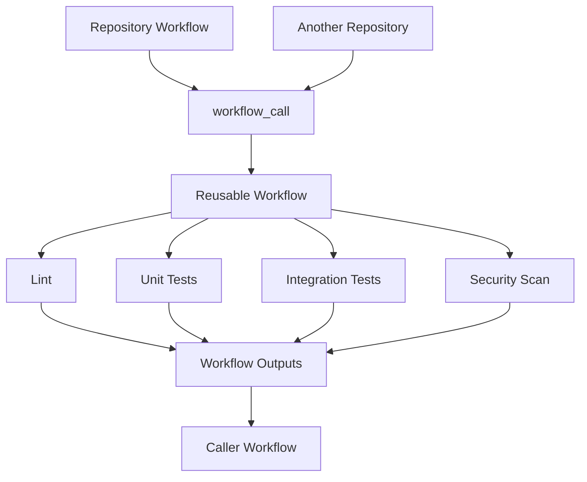
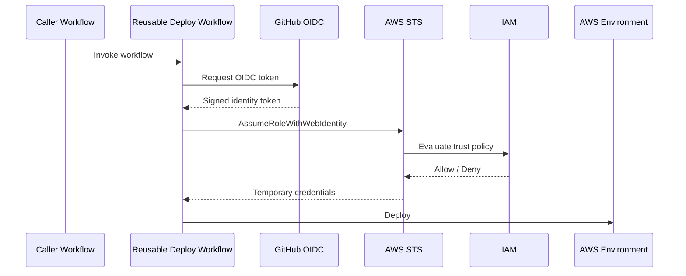
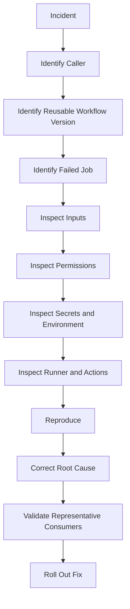

# 09- Reusable Workflow Issues

## Overview

Reusable workflows allow GitHub Actions teams to define a workflow once and invoke it from multiple repositories or workflows. They are one of the most important mechanisms for reducing CI/CD duplication across backend services, while also introducing additional boundaries around inputs, outputs, secrets, permissions, contexts, environments, and versioning.

A reusable workflow is invoked with `workflow_call`:

```text
Caller Workflow
      ↓
Reusable Workflow
      ↓
Multiple Jobs
      ↓
Steps / Actions / Runners
```

This differs fundamentally from a composite action:

```text
Reusable Workflow
    → Can orchestrate multiple jobs

Composite Action
    → Packages steps inside one job
```

Reusable workflow failures are therefore often caused by interactions between two workflow definitions rather than by a single YAML file.

For production systems, troubleshooting should focus on the contract between the caller and reusable workflow:

```text
Caller
  ↓
Trigger / workflow_call
  ↓
Inputs
  ↓
Secrets
  ↓
Permissions
  ↓
Reusable Workflow
  ↓
Jobs
  ↓
Outputs
  ↓
Caller
```

---

## What Is a Reusable Workflow?

A reusable workflow is a workflow that exposes a callable interface using:

```yaml
on:
  workflow_call:
```

Example:

```yaml
name: Reusable Python CI

on:
  workflow_call:
    inputs:
      python-version:
        required: true
        type: string
    secrets:
      registry-token:
        required: true

jobs:
  test:
    runs-on: ubuntu-latest

    steps:
      - uses: actions/checkout@v4

      - uses: actions/setup-python@v5
        with:
          python-version: ${{ inputs.python-version }}

      - run: python -m pytest
```

A caller can invoke it with:

```yaml
jobs:
  ci:
    uses: my-org/platform/.github/workflows/python-ci.yml@v1
    with:
      python-version: "3.12"
    secrets:
      registry-token: ${{ secrets.REGISTRY_TOKEN }}
```

---

## Why Reusable Workflows Exist

Without reusable workflows, organizations often duplicate:

- Python setup
- Dependency installation
- Linting
- Unit testing
- Integration testing
- Security scanning
- Docker builds
- Artifact publishing
- Deployment logic
- AWS authentication
- Environment protection

A reusable workflow centralizes that behavior.

Instead of:

```text
Repository A → duplicate CI
Repository B → duplicate CI
Repository C → duplicate CI
```

use:

```text
                  ┌── Repository A
                  │
Platform Workflow ├── Repository B
                  │
                  └── Repository C
```

This improves consistency, but increases the importance of API compatibility and governance.

---

## Reusable Workflow vs Composite Action

| Capability | Reusable Workflow | Composite Action |
|---|---|---|
| Invocation | `workflow_call` | `uses` step |
| Multiple jobs | Yes | No |
| Job dependencies | Yes | No |
| Runner selection | Workflow jobs | Caller job |
| Matrix orchestration | Yes | Limited to caller job |
| Environments | Yes | Not as workflow-level orchestration |
| Deployment pipeline | Excellent fit | Usually poor fit |
| Reusable step group | Possible | Primary purpose |
| Inputs | Yes | Yes |
| Outputs | Yes | Yes |
| Secrets | Workflow contract | Passed by caller |
| Fan-out/fan-in | Yes | No |
| CI pipeline template | Excellent fit | Limited |
| Step utility | Usually excessive | Excellent fit |

A common troubleshooting mistake is treating a reusable workflow like a composite action.

---

## Reusable Workflow Architecture



The reusable workflow acts as a platform-level API.

---

## The Reusable Workflow Contract

A good reusable workflow should define a stable contract consisting of:

```text
Inputs
Secrets
Permissions
Jobs
Outputs
Version
Expected repository assumptions
```

Example:

```yaml
on:
  workflow_call:
    inputs:
      python-version:
        required: false
        type: string
        default: "3.12"

      run-integration-tests:
        required: false
        type: boolean
        default: true

    secrets:
      registry-token:
        required: false

    outputs:
      test-status:
        description: Test result
        value: ${{ jobs.test.outputs.status }}
```

Treat this contract like an API.

---

## Failure Domain Model

Reusable workflow troubleshooting should follow:

```text
Symptom
   ↓
Possible Causes
   ↓
Isolation Strategy
   ↓
Commands / Checks
   ↓
Root Cause
   ↓
Corrective Action
   ↓
Prevention
```

The most useful failure domains are:

| Failure Domain | Typical Problem |
|---|---|
| Invocation | Workflow cannot be called |
| Reference | Wrong repository, branch, tag, or SHA |
| Inputs | Missing or incorrectly typed values |
| Secrets | Secret unavailable or not inherited |
| Permissions | Caller lacks required permission |
| Environment | Environment behavior differs from caller |
| Outputs | Output missing or incorrectly exposed |
| Context | Caller and callee contexts misunderstood |
| Matrix | Reusable workflow invoked incorrectly with matrix |
| Versioning | Breaking workflow change |
| Nested workflow | Permissions/secrets not propagated as expected |
| Runner | Runner unavailable or incompatible |
| Action dependency | Action inside reusable workflow fails |
| Security | Excessive permissions or untrusted input |
| Deployment | Environment or approval boundary incorrect |

---

## Invocation Basics

A reusable workflow is called at the job level:

```yaml
jobs:
  ci:
    uses: my-org/platform/.github/workflows/python-ci.yml@v1
```

A common mistake is trying to call it as a step:

```yaml
steps:
  - uses: my-org/platform/.github/workflows/python-ci.yml@v1
```

That is incorrect because reusable workflows are workflow-level orchestration units, not actions.

---

## Repository and Path Requirements

Reusable workflows are stored under:

```text
.github/workflows/
```

Example:

```text
platform/
└── .github/
    └── workflows/
        └── python-ci.yml
```

The caller references the workflow using the repository and workflow path.

Example:

```yaml
jobs:
  ci:
    uses: my-org/platform/.github/workflows/python-ci.yml@v1
```

---

## Failure Domain: Workflow Cannot Be Called

### Symptom

The caller cannot resolve or invoke the reusable workflow.

### Possible Causes

- Incorrect repository
- Incorrect workflow path
- Workflow not under `.github/workflows`
- Missing `workflow_call`
- Invalid reference
- Access restrictions
- Private repository visibility restrictions

### Isolation Strategy

Verify:

```text
Repository
Workflow path
workflow_call
Reference
Repository access
```

A minimal reusable workflow should contain:

```yaml
on:
  workflow_call:
```

### Prevention

Treat reusable workflow paths and references as versioned interfaces.

---

## Failure Domain: Wrong Version Reference

A caller may use:

```yaml
uses: my-org/platform/.github/workflows/python-ci.yml@main
```

This tracks a moving branch.

A production caller can instead use:

```yaml
uses: my-org/platform/.github/workflows/python-ci.yml@v1
```

or a specific immutable commit SHA.

Version strategy should match the organization's change-management requirements.

---

## Why `main` Can Be Dangerous

If the reusable workflow changes on `main`, every caller can change behavior without modifying its own repository.

Example:

```text
Monday:
Repo A → reusable workflow version X

Tuesday:
Platform team changes main

Wednesday:
Repo A → reusable workflow version Y
```

This can create unexpected production CI/CD behavior.

---

## Recommended Versioning Model

For shared platform workflows:

```text
Development
   ↓
Feature branch
   ↓
Validation
   ↓
Versioned release
   ↓
Consumer adoption
```

For high-risk deployment workflows, immutable references provide stronger reproducibility.

---

## Failure Domain: Input Problems

### Symptom

Reusable workflow behaves differently from what the caller requested.

### Possible Causes

- Wrong input name
- Missing required input
- Incorrect input type
- Unexpected default
- Caller passes a string instead of boolean
- Input referenced through the wrong context

Inputs are accessed using:

```yaml
${{ inputs.python-version }}
```

not:

```yaml
${{ github.event.inputs.python-version }}
```

for normal `workflow_call` inputs.

---

## Typed Inputs

Reusable workflows support typed inputs.

Example:

```yaml
on:
  workflow_call:
    inputs:
      deploy:
        required: false
        type: boolean
        default: false

      replicas:
        required: false
        type: number
        default: 2

      environment:
        required: true
        type: string
```

Caller:

```yaml
with:
  deploy: true
  replicas: 3
  environment: staging
```

Using typed inputs makes the workflow contract clearer.

---

## Failure Domain: Boolean Input Confusion

A common mistake is treating a boolean input as a string.

Prefer:

```yaml
if: ${{ inputs.deploy }}
```

rather than relying on string comparisons such as:

```yaml
if: ${{ inputs.deploy == 'true' }}
```

when the input is explicitly declared as:

```yaml
type: boolean
```

The key principle is to preserve the input's declared type throughout the workflow.

---

## Failure Domain: Missing Secrets

A reusable workflow may declare:

```yaml
on:
  workflow_call:
    secrets:
      aws-role:
        required: true
```

The caller must provide it:

```yaml
jobs:
  deploy:
    uses: my-org/platform/.github/workflows/deploy.yml@v1
    secrets:
      aws-role: ${{ secrets.AWS_ROLE }}
```

If the caller does not provide the required secret, the workflow contract is incomplete.

---

## `secrets: inherit`

When appropriate, a caller can pass inherited secrets:

```yaml
jobs:
  ci:
    uses: my-org/platform/.github/workflows/ci.yml@v1
    secrets: inherit
```

Use this carefully.

Inheritance can make a reusable workflow convenient but can also make its effective secret surface less obvious.

For sensitive deployment workflows, explicitly passing only required secrets can make the security boundary clearer.

---

## Secret Propagation

A nested reusable workflow requires particular care.

Example:

```text
Caller
  ↓
Reusable Workflow A
  ↓
Reusable Workflow B
```

A secret available to A should not automatically be assumed to be available to B.

Design the secret contract explicitly at every boundary.

---

## Secret Failure Investigation

### Symptom

Reusable workflow sees an empty secret.

### Possible Causes

- Secret not declared
- Secret not passed
- Incorrect secret name
- Incorrect inheritance
- Environment secret boundary
- Fork or trust boundary
- Nested reusable workflow propagation

### Safe Diagnostic

Do not print the secret.

Instead inspect whether the expected configuration path is active without exposing the value.

Avoid:

```yaml
run: echo "${{ secrets.MY_SECRET }}"
```

---

## Failure Domain: Permissions

Reusable workflows can perform operations requiring permissions such as:

```yaml
permissions:
  contents: read
```

or:

```yaml
permissions:
  id-token: write
  contents: read
```

For AWS OIDC, the deployment job generally requires:

```yaml
permissions:
  id-token: write
  contents: read
```

Permissions should be granted deliberately.

---

## Caller and Callee Permissions

The effective permission model is important when a reusable workflow is called from another workflow.

A reusable workflow should not assume that the caller has granted every permission it needs.

For example:

```text
Caller
  ↓
Reusable Workflow
  ↓
AWS OIDC
```

If the calling job does not provide the required token permission, AWS authentication can fail.

---

## Failure Domain: OIDC

### Symptom

AWS authentication fails inside the reusable workflow.

### Possible Causes

- Missing `id-token: write`
- Incorrect AWS role trust policy
- Incorrect repository/branch/environment conditions
- Incorrect audience
- Wrong reusable workflow invocation context
- Incorrect role ARN
- Caller permissions too restrictive

### Diagnostic Architecture

```text
GitHub Actions
    ↓
OIDC Token
    ↓
AWS STS AssumeRoleWithWebIdentity
    ↓
IAM Trust Policy
    ↓
Temporary Credentials
    ↓
AWS API
```

Do not replace OIDC with long-lived AWS access keys merely to bypass a reusable workflow permission problem.

---

## Reusable Workflow and AWS OIDC

Example:

```yaml
jobs:
  deploy:
    uses: my-org/platform/.github/workflows/aws-deploy.yml@v1
    permissions:
      contents: read
      id-token: write
    with:
      environment: staging
```

The reusable workflow can then perform AWS authentication.

A production design should restrict the IAM role trust policy to the intended GitHub repository and workflow/environment boundaries.

---

## Failure Domain: Environment

Reusable workflows can interact with GitHub Environments.

Example:

```yaml
jobs:
  deploy:
    environment: production
```

Environment protection can introduce:

- Required reviewers
- Deployment restrictions
- Environment secrets
- Environment variables
- Deployment history

A caller may expect one environment while the reusable workflow selects another.

---

## Environment Boundary

Be explicit about who controls the deployment environment.

For example:

```text
Caller
  ↓
environment = production
  ↓
Reusable Deployment Workflow
  ↓
production environment
  ↓
approval
  ↓
AWS deployment
```

Do not allow arbitrary user input to select privileged environments without validation.

---

## Failure Domain: Environment Secrets

### Symptom

Repository secret is available but deployment secret is missing.

### Possible Cause

The secret may belong to a GitHub Environment rather than the repository.

Verify:

```text
Repository secrets
Organization secrets
Environment secrets
Reusable workflow contract
Environment selected by deployment job
```

Do not assume all secret scopes behave identically.

---

## Reusable Workflow Outputs

Reusable workflows can expose workflow-level outputs.

Example:

```yaml
on:
  workflow_call:
    outputs:
      image-digest:
        description: Docker image digest
        value: ${{ jobs.build.outputs.digest }}
```

The underlying job must expose the output:

```yaml
jobs:
  build:
    runs-on: ubuntu-latest

    outputs:
      digest: ${{ steps.image.outputs.digest }}

    steps:
      - id: image
        run: |
          echo "digest=sha256:example" >> "$GITHUB_OUTPUT"
```

The caller can then consume:

```yaml
jobs:
  build:
    uses: my-org/platform/.github/workflows/build.yml@v1

  deploy:
    needs: build
    runs-on: ubuntu-latest
    steps:
      - run: echo "${{ needs.build.outputs.image-digest }}"
```

---

## Output Failure Chain

Reusable workflow outputs have multiple layers:

```text
Step Output
    ↓
Job Output
    ↓
Reusable Workflow Output
    ↓
Caller Job
```

A failure at any layer can result in an empty or missing value.

Troubleshoot from the bottom upward.

---

## Failure Domain: Missing Output

### Symptom

Caller sees an empty output.

### Isolation

Check:

```text
Step ID
↓
GITHUB_OUTPUT
↓
Job output mapping
↓
workflow_call output mapping
↓
Caller needs.<job>.outputs
```

Example:

```yaml
echo "digest=$DIGEST" >> "$GITHUB_OUTPUT"
```

then:

```yaml
outputs:
  digest: ${{ steps.image.outputs.digest }}
```

then:

```yaml
on:
  workflow_call:
    outputs:
      image-digest:
        value: ${{ jobs.build.outputs.digest }}
```

---

## Structured Outputs

Reusable workflows can pass structured data as JSON.

Example:

```yaml
echo 'matrix={"python":["3.11","3.12"]}' >> "$GITHUB_OUTPUT"
```

Caller:

```yaml
strategy:
  matrix: ${{ fromJSON(needs.prepare.outputs.matrix) }}
```

Validate generated JSON before passing it into privileged or complex workflows.

---

## Failure Domain: Context Confusion

Reusable workflows have multiple contexts.

Common contexts include:

```text
github
inputs
secrets
vars
env
jobs
steps
needs
runner
strategy
matrix
```

The most common mistake is assuming that a value available in the caller is automatically available in the same form inside the reusable workflow.

Treat the reusable workflow as a separate contract boundary.

---

## Caller vs Callee Context

Conceptually:

```text
Caller Workflow
   ↓
Invocation Contract
   ├── inputs
   ├── secrets
   └── permissions
   ↓
Reusable Workflow
   ├── its own jobs
   ├── its own steps
   └── its own contexts
```

Explicitly pass values that the reusable workflow requires.

---

## Failure Domain: Matrix + Reusable Workflow

Reusable workflows can be invoked from matrix jobs.

Example:

```yaml
jobs:
  ci:
    strategy:
      matrix:
        python:
          - "3.11"
          - "3.12"

    uses: my-org/platform/.github/workflows/python-ci.yml@v1

    with:
      python-version: ${{ matrix.python }}
```

This creates multiple reusable workflow invocations.

Be careful with:

- Artifact naming
- Output aggregation
- Deployment behavior
- Runner capacity
- Cost
- Concurrency

---

## Matrix Deployment Trap

This can accidentally produce multiple deployments:

```yaml
strategy:
  matrix:
    environment:
      - staging
      - production

uses: my-org/platform/.github/workflows/deploy.yml@v1
```

The deployment workflow executes once per matrix combination.

For production deployments, prefer explicit promotion stages rather than using deployment environments as a matrix dimension.

---

## Reusable Workflow and `needs`

A reusable workflow invocation is represented as a job in the caller.

Example:

```yaml
jobs:
  test:
    uses: my-org/platform/.github/workflows/test.yml@v1

  build:
    needs: test
    uses: my-org/platform/.github/workflows/build.yml@v1
```

This creates:

```text
Reusable Test Workflow
        ↓
Reusable Build Workflow
```

The caller controls the high-level dependency graph.

---

## Fan-Out With Reusable Workflows

```text
                 ┌── Python CI
                 │
Pull Request ────┼── Security CI
                 │
                 └── Integration CI
                         ↓
                       Fan-In
```

Reusable workflows are particularly useful for standardizing these pipeline components across repositories.

---

## Fan-In and Deployment

Example:

```yaml
jobs:
  unit:
    uses: my-org/platform/.github/workflows/unit.yml@v1

  integration:
    uses: my-org/platform/.github/workflows/integration.yml@v1

  security:
    uses: my-org/platform/.github/workflows/security.yml@v1

  build:
    needs:
      - unit
      - integration
      - security
    uses: my-org/platform/.github/workflows/build.yml@v1
```

This allows a central platform team to own reusable implementation while application repositories retain pipeline composition.

---

## Failure Domain: Nested Reusable Workflows

A reusable workflow may call another reusable workflow.

```text
Application
   ↓
Application CI
   ↓
Platform CI
   ↓
Shared Security Workflow
```

This creates a dependency chain.

Failure can originate from:

- Caller contract
- First reusable workflow
- Nested workflow
- Nested action
- Permissions
- Secrets
- Version mismatch

Keep nesting shallow enough that troubleshooting remains understandable.

---

## Reusable Workflow Versioning

Version reusable workflows deliberately.

Possible references include:

```yaml
@main
@v1
@v1.2.0
@<commit-sha>
```

Trade-offs:

| Reference | Reproducibility | Update Effort | Risk |
|---|---|---|---|
| Branch | Low | Low | Higher |
| Major tag | Medium | Low | Controlled |
| Exact release | High | Medium | Controlled |
| Commit SHA | Highest | Higher | Operational overhead |

For security-sensitive production workflows, immutable references provide stronger control.

---

## Breaking Changes

Examples of breaking reusable workflow changes:

- Renaming an input
- Removing an input
- Changing input type
- Removing an output
- Changing output semantics
- Removing a required secret
- Increasing required permissions
- Changing deployment environment
- Changing artifact names
- Changing runner requirements

Treat these changes like breaking API changes.

---

## Semantic Versioning

A reusable workflow can follow:

```text
MAJOR.MINOR.PATCH
```

Example:

```text
v1
v1.1
v1.1.2
v2
```

A major version can represent breaking contract changes.

A minor release can add backward-compatible functionality.

A patch release can fix behavior without changing the public contract.

---

## Consumer Compatibility

Before changing a reusable workflow:

```text
Identify consumers
      ↓
Validate contract compatibility
      ↓
Test representative repositories
      ↓
Release new version
      ↓
Migrate consumers
      ↓
Deprecate old version
```

This prevents one platform change from breaking dozens of repositories simultaneously.

---

## Failure Domain: Version Drift

### Symptom

Only some repositories fail after a reusable workflow update.

### Possible Causes

- Different workflow versions
- Different caller assumptions
- Different input combinations
- Repository-specific permissions
- Repository-specific environments

### Corrective Action

Inventory consumers and versions.

Prefer centralized documentation showing:

```text
Repository
Workflow Version
Environment
Owner
Migration Status
```

---

## Reusable Workflow Security

Reusable workflows should follow least privilege.

Example:

```yaml
permissions:
  contents: read
```

For AWS deployment:

```yaml
permissions:
  contents: read
  id-token: write
```

Do not grant:

```yaml
permissions: write-all
```

simply because one step needs additional access.

---

## Job-Level Permission Isolation

If only the deployment job needs AWS OIDC, isolate it:

```yaml
jobs:
  test:
    permissions:
      contents: read

  deploy:
    permissions:
      contents: read
      id-token: write
```

This reduces the blast radius of compromised dependencies in testing jobs.

---

## Third-Party Actions Inside Reusable Workflows

A reusable workflow centralizes third-party action dependencies.

This means one vulnerable action can affect many repositories.

Prefer:

- Trusted action sources
- Version pinning
- SHA pinning where appropriate
- Dependency review
- Dependabot
- Regular action inventory
- Minimal permissions

The reusable workflow should be treated as part of the organization's software supply chain.

---

## Untrusted Pull Requests

Be particularly careful when reusable workflows execute code from pull requests.

Potentially dangerous data includes:

- Pull request titles
- Branch names
- Commit messages
- User inputs
- Changed files
- Generated configuration

Do not directly place untrusted values into shell commands.

Prefer:

```yaml
env:
  PR_TITLE: ${{ github.event.pull_request.title }}
run: |
  printf '%s\n' "$PR_TITLE"
```

rather than embedding uncontrolled values directly into shell syntax.

---

## `pull_request` vs `pull_request_target`

Reusable deployment workflows should be designed carefully around event trust boundaries.

A `pull_request` workflow is appropriate for testing untrusted contributor code with restricted privileges.

`pull_request_target` executes in the context of the base repository and therefore requires particular caution when interacting with code or data from the pull request.

Avoid using privileged reusable deployment workflows as a convenient shortcut for untrusted pull request automation.

---

## Secret Exposure Risk

Do not pass production secrets to reusable workflows unless they are actually required.

Prefer:

```text
PR CI
  ↓
No production secrets

Staging deployment
  ↓
Staging credentials / OIDC role

Production deployment
  ↓
Production environment protection
+
Production OIDC role
```

This creates clear trust boundaries.

---

## Reusable Workflow and OIDC Architecture



The IAM trust policy should restrict the intended repository and deployment boundary.

---

## Reusable Workflow and Docker

A reusable workflow can standardize Docker builds:

```yaml
jobs:
  build:
    uses: my-org/platform/.github/workflows/docker-build.yml@v1
    with:
      image-name: backend-api
      dockerfile: Dockerfile
```

The reusable workflow can centrally enforce:

- Buildx
- Multi-stage builds
- Cache strategy
- Registry authentication
- Image tagging
- SBOM generation
- Provenance
- Vulnerability scanning

---

## Build Once, Promote Many

A reusable deployment architecture should generally follow:

```text
Source
  ↓
CI
  ↓
Docker Build
  ↓
Immutable Image
  ↓
Registry
  ↓
Staging
  ↓
Approval
  ↓
Production
```

Do not rebuild the same application separately for staging and production if the goal is to promote the same artifact.

---

## Failure Domain: Docker Build

### Symptom

Reusable workflow works for some repositories but Docker build fails for another.

### Possible Causes

- Different Dockerfile assumptions
- Missing build context
- Incorrect input path
- Missing build arguments
- Incorrect permissions
- Registry authentication
- Cache configuration

### Isolation

Log non-secret configuration:

```text
Dockerfile path
Build context
Image name
Runner
Architecture
Build target
```

Do not expose registry credentials.

---

## Reusable Workflow and Containers

Reusable workflows can standardize:

```text
Python setup
Docker build
PostgreSQL service
Redis service
pytest
Coverage
Artifact upload
```

However, the reusable workflow should not assume application-specific filesystem paths unless those assumptions are explicitly part of the contract.

---

## Repository Assumptions

A reusable Python workflow may assume:

```text
requirements.txt
```

But another repository may use:

```text
pyproject.toml
uv.lock
poetry.lock
```

Avoid hidden assumptions.

Prefer explicit inputs:

```yaml
with:
  dependency-file: pyproject.toml
```

or design the workflow to detect supported formats safely.

---

## Failure Domain: Runner Assumptions

### Symptom

Reusable workflow works in one repository but fails in another.

### Possible Causes

- Required tools unavailable
- Different runner labels
- Private network requirement
- Different architecture
- Custom software dependency
- Self-hosted runner configuration

### Corrective Action

Document runner requirements explicitly.

---

## Self-Hosted Runner Considerations

A reusable deployment workflow may require:

```text
private network
+
custom tooling
+
AWS access
```

Do not automatically make the entire organization use that runner.

Use controlled:

```text
Runner Groups
Labels
Permissions
Environments
```

to restrict access.

---

## Ephemeral Runners

For sensitive deployment or build workflows, ephemeral runners can reduce persistent state.

A useful architecture is:

```text
Workflow
   ↓
Ephemeral Runner
   ↓
Build / Deploy
   ↓
Destroy Runner
```

This reduces risks associated with:

- Workspace residue
- Credentials
- Temporary files
- Cache contamination
- Previous job state

---

## Failure Domain: Cache

A reusable workflow can standardize caching, but a cache strategy that works for one repository may not work for all consumers.

For Python:

```yaml
- uses: actions/setup-python@v5
  with:
    python-version: ${{ inputs.python-version }}
    cache: pip
```

If dependency files vary, expose a configurable path or establish a documented convention.

---

## Failure Domain: Artifact

A reusable workflow may upload artifacts under a fixed name.

That can create collisions when:

```text
Repository A
Repository B
Matrix Job
```

share the same naming strategy.

Prefer unique names based on:

```text
Repository
Commit
Matrix cell
Artifact type
```

where appropriate.

---

## Reusable Workflow Inputs as API Design

Good inputs are:

- Explicit
- Minimal
- Typed
- Validated
- Stable
- Well documented

Bad interface:

```yaml
with:
  config: "some giant JSON string"
```

when separate typed inputs would provide a clearer contract.

---

## Avoid Over-Generalization

A reusable workflow should not become a giant conditional system:

```yaml
if: application == ...
if: language == ...
if: framework == ...
if: deployment == ...
```

This creates:

- Hidden coupling
- Difficult testing
- High blast radius
- Complex debugging

Prefer several focused reusable workflows where appropriate:

```text
python-ci.yml
docker-build.yml
security.yml
aws-deploy.yml
```

---

## Reusable Workflow Boundaries

A production platform can expose:

```text
Reusable CI
Reusable Integration Testing
Reusable Security Scan
Reusable Docker Build
Reusable Deployment
```

Application repositories compose them.

This provides standardization without forcing every repository into one monolithic workflow.

---

## Reusable Workflow Governance

Platform ownership should include:

- Workflow owners
- Version policy
- Release process
- Consumer inventory
- Deprecation policy
- Security review
- Permission review
- Action dependency review
- Incident response
- Documentation

A reusable workflow is infrastructure, not merely a convenience YAML file.

---

## Failure Blast Radius

Consider:

```text
One application workflow
    ↓
One repository
```

versus:

```text
Shared reusable workflow
    ↓
50 repositories
```

A bug in the second can affect all consumers.

Therefore shared workflow changes require stronger testing and rollout controls.

---

## Testing Reusable Workflows

Test the reusable workflow against representative consumers.

At minimum test:

```text
Default inputs
Custom inputs
Required secrets
Optional secrets
Permissions
Matrix callers
Artifact generation
Failure conditions
Deployment paths
```

For deployment workflows also test:

```text
Approval
Concurrency
Rollback
AWS authentication
Environment restrictions
```

---

## Contract Testing

A useful platform practice is to maintain a small set of representative repositories or fixtures.

Validate:

```text
Caller
  ↓
Reusable Workflow
  ↓
Expected Outputs
```

This catches breaking changes before broad adoption.

---

## Reusable Workflow Documentation

Document:

```text
Workflow purpose
Supported inputs
Input types
Required secrets
Optional secrets
Permissions
Outputs
Runner requirements
Expected repository structure
Version
Compatibility
Security considerations
Examples
Failure behavior
```

Example:

```yaml
jobs:
  ci:
    uses: my-org/platform/.github/workflows/python-ci.yml@v1
    with:
      python-version: "3.12"
      run-integration-tests: true
    secrets:
      registry-token: ${{ secrets.REGISTRY_TOKEN }}
```

---

## Failure Domain: Permissions After Refactoring

### Symptom

A previously working repository starts returning:

```text
403 Forbidden
```

after moving CI logic into a reusable workflow.

### Possible Causes

- Permissions changed
- Caller job lacks required permission
- Reusable workflow now performs additional API operations
- Third-party action requires additional access
- `id-token` permission missing

### Corrective Action

Identify the exact operation requiring permission and grant the smallest required scope.

Do not solve a 403 with broad write permissions.

---

## Failure Domain: Reusable Workflow Access

### Symptom

A public workflow works, but a private shared workflow cannot be invoked.

### Possible Causes

- Repository visibility
- Organization policy
- Workflow access settings
- Caller repository authorization
- Incorrect reference

### Isolation

Check:

```text
Caller repository
Reusable workflow repository
Visibility
Organization access policy
Workflow location
Reference
```

---

## Failure Domain: Caller Works, Callee Fails

### Symptom

The caller workflow starts successfully, but an internal step fails.

### Approach

Separate the problem:

```text
Invocation
   ↓
Reusable workflow started?
   ↓
Correct inputs?
   ↓
Correct secrets?
   ↓
Correct permissions?
   ↓
Correct runner?
   ↓
Action execution?
   ↓
Application command?
```

This prevents debugging the caller when the actual failure is inside the reusable workflow.

---

## Failure Domain: Callee Works Directly but Fails When Called

This usually indicates a contract difference.

Compare:

```text
Direct test environment
vs
Caller invocation environment
```

Look at:

- Inputs
- Secrets
- Permissions
- Environment
- Runner
- Matrix
- Event context
- Repository context

A reusable workflow should be tested through its actual invocation path, not only in isolation.

---

## Debugging Without Secret Exposure

Use diagnostic metadata:

```yaml
- name: Workflow diagnostics
  env:
    REPOSITORY: ${{ github.repository }}
    REF: ${{ github.ref }}
    WORKFLOW: ${{ github.workflow }}
    RUNNER_OS: ${{ runner.os }}
  run: |
    echo "Repository: $REPOSITORY"
    echo "Ref: $REF"
    echo "Workflow: $WORKFLOW"
    echo "Runner OS: $RUNNER_OS"
```

Never dump:

```text
secrets
OIDC tokens
AWS credentials
authorization headers
private keys
```

---

## GitHub CLI Troubleshooting

List workflows:

```bash
gh workflow list
```

List recent runs:

```bash
gh run list
```

Inspect a run:

```bash
gh run view <run-id>
```

Show failed logs:

```bash
gh run view <run-id> --log-failed
```

Rerun failed jobs:

```bash
gh run rerun <run-id> --failed
```

Watch a running workflow:

```bash
gh run watch <run-id>
```

List workflow runs for a specific workflow:

```bash
gh run list --workflow python-ci.yml
```

These commands are particularly useful when a shared reusable workflow affects many repositories.

---

## Operational Investigation

For a reusable workflow incident, capture:

```text
Caller repository
Reusable workflow repository
Workflow version
Commit SHA
Run ID
Event
Inputs
Permission model
Environment
Runner
Failed job
Failed step
Artifact/version
Deployment target
```

This creates enough context to reproduce the failure.

---

## Production Incident Pattern



The workflow version is particularly important because consumers may not all execute the same reusable workflow revision.

---

## Reliability Considerations

Reusable workflows improve consistency but introduce shared dependencies.

Reliability requires:

- Versioned releases
- Backward compatibility
- Representative testing
- Controlled rollout
- Clear ownership
- Consumer inventory
- Failure isolation
- Rollback capability

A shared workflow should not become a single point of failure for the entire organization's delivery process.

---

## High Availability

CI/CD itself may not require application-style high availability, but shared workflow infrastructure should avoid unnecessary centralized runtime dependencies.

For example:

```text
Shared Workflow
     ↓
GitHub-hosted runners
     ↓
External services
```

should not depend on one fragile internal runner or one manually maintained service.

For private network workflows, use appropriately managed runner capacity and recovery procedures.

---

## Cost Considerations

Reusable workflows can reduce duplicated maintenance but may increase centralized workflow execution if every repository runs identical expensive stages.

Monitor:

```text
Workflow duration
Runner minutes
Matrix cardinality
Docker build time
Cache effectiveness
Integration test duration
Security scan duration
```

Avoid forcing expensive integration or end-to-end tests into every pull request if a targeted or scheduled strategy provides sufficient coverage.

---

## Disaster Recovery

Maintain:

- Versioned reusable workflows
- Immutable releases
- Known-good workflow versions
- Consumer inventory
- Rollback procedure
- Documentation
- Ownership

If version `v2` introduces a critical regression:

```text
v2
 ↓
Incident
 ↓
Restore v1
 ↓
Investigate
 ↓
Fix
 ↓
Release v2.1
```

This is safer than modifying a shared `main` workflow and hoping all consumers recover.

---

## Common Mistakes

### Calling a Reusable Workflow as a Step

Reusable workflows are invoked at the job level.

### Assuming Caller Secrets Automatically Exist

Secrets must be explicitly passed or appropriately inherited.

### Assuming Caller Permissions Are Sufficient

The reusable workflow's operations must be evaluated against the actual permission boundary.

### Using `main` for Production Workflow Dependencies

Moving shared workflow behavior can change production CI/CD unexpectedly.

### Making One Giant Reusable Workflow

Excessive conditional logic increases blast radius and troubleshooting complexity.

### Deploying From a Matrix

A matrix can unintentionally create multiple deployment executions.

### Printing Secrets During Debugging

This can turn a troubleshooting operation into a credential exposure incident.

### Granting Broad Permissions to Fix Errors

A 403 should be investigated at the permission boundary rather than solved with broad write access.

### Ignoring Nested Workflow Contracts

Inputs, secrets, outputs, and permissions may need explicit handling across nested boundaries.

---

## Production Architecture

A mature backend platform can use:

```text
Application Repositories
        │
        ├──────────────┐
        │              │
        ▼              ▼
Reusable CI      Reusable Security
        │              │
        └──────┬───────┘
               ▼
        Reusable Build
               │
               ▼
             ECR
               │
               ▼
       Reusable Deployment
               │
        ┌──────┴──────┐
        ▼             ▼
     Staging      Production
        │             │
        ▼             ▼
     Approval      Protection
```

The platform team owns reusable workflow implementation while application teams own application-specific configuration.

---

## Production CI/CD Example

```yaml
name: Backend CI/CD

on:
  pull_request:

jobs:
  test:
    uses: my-org/platform/.github/workflows/python-ci.yml@v1
    with:
      python-version: "3.12"
      run-integration-tests: true

  security:
    uses: my-org/platform/.github/workflows/security.yml@v1

  build:
    needs:
      - test
      - security

    uses: my-org/platform/.github/workflows/docker-build.yml@v1
    with:
      image-name: backend-api

  deploy-staging:
    needs: build
    uses: my-org/platform/.github/workflows/aws-deploy.yml@v1
    with:
      environment: staging
      image-digest: ${{ needs.build.outputs.image-digest }}
    secrets: inherit
```

A production deployment can then be implemented as a separate protected promotion workflow.

---

## Production Promotion Model

Prefer:

```text
Pull Request
    ↓
Reusable CI
    ↓
Reusable Security
    ↓
Reusable Build
    ↓
Immutable Docker Image
    ↓
ECR
    ↓
Staging
    ↓
Approval
    ↓
Production
```

The same image digest should be promoted rather than rebuilding the application for production.

---

## Reusable Workflow Review Checklist

### Contract

```text
[ ] Inputs are explicit
[ ] Inputs are typed
[ ] Defaults are safe
[ ] Required secrets are documented
[ ] Outputs are documented
```

### Security

```text
[ ] Permissions use least privilege
[ ] OIDC is preferred over long-lived AWS credentials
[ ] Production secrets are environment-scoped
[ ] Untrusted input is validated
[ ] Third-party actions are controlled
```

### Reliability

```text
[ ] Workflow is versioned
[ ] Breaking changes are controlled
[ ] Representative consumers are tested
[ ] Rollback version exists
[ ] Failure behavior is documented
```

### Operations

```text
[ ] Runner requirements are documented
[ ] Artifacts are uniquely named
[ ] Logs are actionable
[ ] GitHub CLI can inspect failures
[ ] Consumer repositories are identifiable
```

### Deployment

```text
[ ] Build and deployment are separated
[ ] Artifacts are immutable
[ ] Environment promotion is explicit
[ ] Production concurrency is controlled
[ ] Approval boundaries are preserved
[ ] Rollback is defined
```

---

## Senior Design Principles

### Treat Reusable Workflows as APIs

Inputs, outputs, secrets, permissions, and behavior form an interface.

### Minimize the Contract

Only expose values consumers actually need.

### Prefer Composition Over a Monolith

Use focused workflows for:

```text
CI
Security
Build
Deployment
```

rather than one workflow containing every possible application behavior.

### Version Deliberately

Shared workflow changes have organizational blast radius.

### Separate Validation From Deployment

Matrix tests should validate configurations; deployment should promote one immutable artifact.

### Keep Privilege Close to the Operation

Only deployment jobs should receive deployment permissions.

### Make Failure Boundaries Observable

A caller should make it easy to identify whether the failure occurred in:

```text
Invocation
Contract
Permissions
Runner
Action
Application
AWS
Deployment
```

---

## Interview Questions

### What is a reusable workflow?

A workflow exposed through `workflow_call` that can be invoked by another workflow and can orchestrate multiple jobs.

### How is it different from a composite action?

A reusable workflow operates at workflow/job level and can orchestrate multiple jobs. A composite action packages multiple steps into a single action invocation inside a job.

### How do you pass inputs?

Declare typed `workflow_call` inputs and access them using:

```yaml
${{ inputs.name }}
```

### How are secrets passed?

Declare required secrets and explicitly pass them or use controlled inheritance where appropriate.

### How do reusable workflow outputs work?

They form a chain:

```text
Step output
→ Job output
→ workflow_call output
→ Caller job output
```

### Why can a reusable workflow fail when the same logic works directly?

The caller may provide different:

- Inputs
- Secrets
- Permissions
- Environment
- Runner
- Matrix
- Event context

### How would you secure a reusable AWS deployment workflow?

Use:

```text
Least-privilege permissions
+
OIDC
+
Restricted IAM trust policy
+
Environment protection
+
Immutable artifact promotion
```

### How would you version a shared workflow?

Use controlled releases such as major versions or immutable references, validate representative consumers, and manage breaking changes explicitly.

---

## Interview Scenario: Shared Python CI

Requirement:

```text
50 repositories
Python applications
Django/FastAPI
PostgreSQL
pytest
coverage
```

A reasonable design is:

```text
Shared Python CI Workflow
        ↓
Inputs:
- Python version
- Dependency configuration
- Integration test flag
        ↓
Standardized testing
        ↓
Reports / artifacts
```

The workflow should avoid repository-specific assumptions unless those assumptions are part of the contract.

---

## Interview Scenario: AWS Deployment

Requirement:

```text
All repositories deploy to AWS.
No long-lived AWS credentials.
```

Design:

```text
Caller
  ↓
Reusable AWS Deployment Workflow
  ↓
GitHub OIDC
  ↓
AWS STS
  ↓
Restricted IAM Role
  ↓
ECR / ECS
```

The role trust policy should restrict the intended GitHub identity boundary.

---

## Interview Scenario: Compromised Shared Workflow

Requirement:

```text
A vulnerability is discovered in the shared reusable workflow.
```

Response:

```text
Identify affected version
        ↓
Identify consumers
        ↓
Stop or restrict affected deployment paths
        ↓
Move consumers to known-good version
        ↓
Investigate credentials/artifacts
        ↓
Release fixed version
        ↓
Validate consumers
        ↓
Resume controlled rollout
```

This demonstrates why reusable workflow versioning and consumer inventory matter.

---

## Interview Scenario: Production Deployment Runs Twice

If a reusable deployment workflow is invoked from multiple matrix cells or concurrent workflows, duplicate deployments may occur.

Use:

```yaml
concurrency:
  group: production
  cancel-in-progress: false
```

and ensure the deployment job is not unintentionally matrix-expanded.

The deployment should consume a single immutable artifact.

---

## Interview Scenario: Reusable Workflow Requires a Secret

Requirement:

```text
Reusable workflow requires a registry credential.
```

Design the contract explicitly:

```yaml
on:
  workflow_call:
    secrets:
      registry-token:
        required: true
```

Caller:

```yaml
secrets:
  registry-token: ${{ secrets.REGISTRY_TOKEN }}
```

Only pass the secret where it is required.

---

## Senior Failure Analysis

A useful mental model is:

```text
Is the workflow being invoked?
        ↓
Is the correct version being invoked?
        ↓
Are inputs correct?
        ↓
Are secrets available?
        ↓
Are permissions sufficient?
        ↓
Is the correct environment selected?
        ↓
Is the runner correct?
        ↓
Are internal actions working?
        ↓
Are application commands working?
        ↓
Are AWS / Docker / registry operations working?
        ↓
Is deployment behavior correct?
```

This prevents jumping directly to application debugging when the actual problem is the reusable workflow contract.

## Key Takeaways

- Treat reusable workflows as versioned CI/CD APIs with explicit inputs, secrets, permissions, outputs, and compatibility contracts.
- Troubleshoot reusable workflow failures by separating invocation, contract, permission, environment, runner, action, and application failure domains.
- Use least-privilege permissions, controlled secret propagation, GitHub OIDC for AWS, and strong environment boundaries for deployment workflows.
- Keep reusable workflows focused and composable; avoid one giant workflow containing repository-specific behavior and excessive conditional logic.
- Version shared workflows deliberately, test representative consumers, and maintain rollback capability because a reusable workflow change can affect many repositories simultaneously.