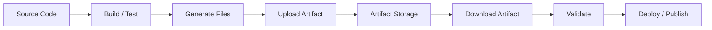
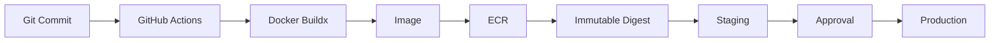
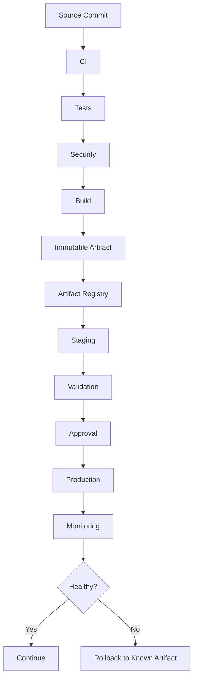

# 10- Artifact Issues

## Overview

Artifacts are a primary data-transfer mechanism in GitHub Actions. They allow one job or workflow to persist files and make them available to later jobs, workflow runs, debugging processes, or deployment stages.

Typical CI/CD artifact flow:

```text
Source
  ↓
Lint / Tests
  ↓
Build
  ↓
Artifact
  ↓
Download
  ↓
Deploy / Inspect / Publish
```

Artifact failures are different from cache failures.

- **Artifacts** preserve outputs that the pipeline intentionally produces.
- **Caches** accelerate repeated computation and can be recreated.

For production CI/CD, artifacts may contain:

- Test reports
- Coverage reports
- Build packages
- Python wheels
- JavaScript bundles
- Deployment manifests
- Generated documentation
- Debug logs
- Screenshots
- Configuration templates
- Release packages

Artifact troubleshooting therefore needs to consider workflow dependencies, paths, job isolation, retention, permissions, naming, matrix execution, storage, and deployment architecture.

---

## Artifact Lifecycle

A typical artifact lifecycle is:



The important boundary is between jobs.

A file created in one job does not automatically exist in another job:

```text
Job A filesystem
     X
     │
     │ not automatically shared
     ▼
Job B filesystem
```

Use artifacts when files must cross job boundaries.

---

## Artifacts vs Caches

| Property | Artifact | Cache |
|---|---|---|
| Primary purpose | Preserve workflow output | Speed up repeated work |
| Intended to be consumed | Yes | Indirectly |
| Rebuildable | Usually not the goal | Yes |
| Typical content | Reports, packages, binaries | Dependencies, build layers |
| Lifecycle | Explicit artifact | Key-based |
| Naming | Explicit | Cache key |
| Production deployment | Suitable | Not suitable |
| Integrity importance | High | Lower |
| Retention | Explicit policy | Cache lifecycle |
| Cross-job transfer | Yes | Possible but different semantics |

Do not use caches as a substitute for release artifacts.

---

## Basic Artifact Upload

GitHub Actions provides the artifact actions for upload and download.

Example:

```yaml
- name: Upload test reports
  uses: actions/upload-artifact@v4
  with:
    name: test-reports
    path: reports/
```

Download:

```yaml
- name: Download test reports
  uses: actions/download-artifact@v5
  with:
    name: test-reports
    path: downloaded-reports/
```

The exact action version should follow the organization's approved action-version policy.

---

## Job Isolation

Consider:

```yaml
jobs:
  test:
    runs-on: ubuntu-latest

    steps:
      - run: pytest --junitxml=reports/junit.xml

  report:
    needs: test
    runs-on: ubuntu-latest

    steps:
      - run: ls reports/
```

The second job should not assume that `reports/` exists.

The correct model is:

```yaml
jobs:
  test:
    runs-on: ubuntu-latest

    steps:
      - run: pytest --junitxml=reports/junit.xml

      - uses: actions/upload-artifact@v4
        with:
          name: test-reports
          path: reports/

  report:
    needs: test
    runs-on: ubuntu-latest

    steps:
      - uses: actions/download-artifact@v5
        with:
          name: test-reports
          path: reports/

      - run: ls -la reports/
```

---

## Failure Domain: Artifact Not Uploaded

### Symptom

The workflow succeeds, but no artifact appears.

### Possible Causes

- Upload step did not execute
- Previous step failed
- `if` condition skipped the upload
- Incorrect path
- Empty directory
- Artifact name is unexpected
- Upload action failed
- Job was cancelled

### Isolation Strategy

First inspect the upload step.

Then verify the generated files:

```yaml
- name: Inspect reports
  run: |
    pwd
    find . -maxdepth 3 -type f | sort
```

Then inspect the upload action logs.

---

## Verify the Path

One of the most common artifact problems is an incorrect relative path.

For example:

```yaml
defaults:
  run:
    working-directory: backend
```

does not necessarily mean the artifact action interprets:

```yaml
path: reports/
```

exactly as a shell command under the same working-directory semantics.

Make artifact paths explicit when there is any ambiguity.

For example:

```yaml
- name: Upload reports
  uses: actions/upload-artifact@v4
  with:
    name: test-reports
    path: backend/reports/
```

---

## Failure Domain: Empty Artifact

### Symptom

The artifact exists but contains nothing useful.

### Possible Causes

- Test tool did not generate the report
- Report path is wrong
- Directory is empty
- Report generation failed
- Files were written elsewhere
- Conditional logic skipped report generation

Validate before upload:

```yaml
- name: Validate reports
  run: |
    test -d reports
    find reports -type f -print
```

For production pipelines, fail explicitly when a required artifact is missing.

---

## Optional vs Required Artifacts

Not every artifact is mandatory.

Examples:

| Artifact | Required? |
|---|---|
| Production Docker image | Yes |
| Release package | Yes |
| Test report | Usually |
| Coverage report | Usually |
| Debug screenshot | Optional |
| Failure logs | Optional but valuable |
| Temporary benchmark output | Depends |

Do not silently ignore missing release artifacts.

---

## Conditional Artifact Upload

Debug artifacts often need to be uploaded even after a test failure.

Example:

```yaml
- name: Upload test reports
  if: ${{ !cancelled() }}
  uses: actions/upload-artifact@v4
  with:
    name: test-reports
    path: reports/
```

This allows reporting after a failure while avoiding execution after cancellation.

Use `always()` carefully. A step guarded only by `always()` can behave differently during cancellation and can cause unwanted post-failure work.

---

## Failure Domain: Upload Step Skipped

### Symptom

The test failed, but the report artifact is missing.

### Possible Cause

The upload step implicitly required previous steps to succeed.

Example:

```yaml
- run: pytest

- uses: actions/upload-artifact@v4
  with:
    name: test-reports
    path: reports/
```

If `pytest` fails, the upload step may not run.

Use an appropriate status condition:

```yaml
- name: Upload test reports
  if: ${{ !cancelled() }}
  uses: actions/upload-artifact@v4
  with:
    name: test-reports
    path: reports/
```

---

## Failure Domain: Wrong Artifact Name

### Symptom

The download step cannot find the artifact.

### Producer

```yaml
- uses: actions/upload-artifact@v4
  with:
    name: python-package
    path: dist/
```

### Consumer

```yaml
- uses: actions/download-artifact@v5
  with:
    name: python-package
```

Names must match the intended producer.

Avoid dynamically generated names unless the consumer understands the naming scheme.

---

## Artifact Naming

A production artifact name should communicate its purpose.

Good:

```text
test-reports
coverage
python-package
docker-metadata
deployment-manifests
e2e-results
```

For matrix jobs, include the matrix identity where needed:

```yaml
name: test-reports-python-${{ matrix.python-version }}
```

This prevents ambiguity.

---

## Matrix Artifact Problems

A matrix can produce multiple artifacts:

```yaml
strategy:
  matrix:
    python-version:
      - "3.11"
      - "3.12"
```

Each job can upload:

```yaml
- uses: actions/upload-artifact@v4
  with:
    name: coverage-python-${{ matrix.python-version }}
    path: coverage.xml
```

Result:

```text
coverage-python-3.11
coverage-python-3.12
```

This is preferable to multiple matrix jobs attempting to publish the same artifact name.

---

## Artifact Collision

A common mistake is:

```yaml
strategy:
  matrix:
    python-version: ["3.11", "3.12"]

steps:
  - uses: actions/upload-artifact@v4
    with:
      name: coverage
      path: coverage.xml
```

Parallel matrix cells may produce logically different results while using the same artifact identity.

Use unique names when artifacts are logically separate.

---

## Artifact Aggregation

Sometimes the goal is not separate artifacts but one combined artifact.

Architecture:

```text
Python 3.11 ──┐
              │
Python 3.12 ──┼──> Aggregate Job ──> Combined Artifact
              │
Python 3.13 ──┘
```

Example:

```yaml
jobs:
  test:
    strategy:
      matrix:
        python-version: ["3.11", "3.12", "3.13"]

    runs-on: ubuntu-latest

    steps:
      - uses: actions/checkout@v4

      - uses: actions/setup-python@v5
        with:
          python-version: ${{ matrix.python-version }}

      - run: pytest --junitxml=junit.xml

      - uses: actions/upload-artifact@v4
        with:
          name: junit-${{ matrix.python-version }}
          path: junit.xml

  aggregate:
    needs: test
    runs-on: ubuntu-latest

    steps:
      - uses: actions/download-artifact@v5
        with:
          path: reports

      - run: find reports -type f -print
```

The aggregation job can then normalize or combine the reports.

---

## Failure Domain: Download Artifact Fails

### Symptom

A later job cannot download an artifact.

### Possible Causes

- Producer job did not run
- Producer job failed
- `needs` relationship missing
- Wrong artifact name
- Artifact expired
- Artifact belongs to another workflow run
- Download path is incorrect
- Workflow architecture assumes an artifact exists when it does not

Start with the dependency graph.

```text
Producer
   ↓
Artifact
   ↓
Consumer
```

Make sure the consumer actually depends on the producer when appropriate:

```yaml
needs: build
```

---

## `needs` and Artifacts

Artifacts and job dependencies are separate concepts.

This:

```yaml
needs: build
```

establishes execution dependency.

It does not itself transfer files.

The producer must still upload:

```yaml
actions/upload-artifact
```

and the consumer must download:

```yaml
actions/download-artifact
```

---

## Artifact Download Path

Consider:

```yaml
- uses: actions/download-artifact@v5
  with:
    name: build-output
    path: downloaded/
```

The files are placed under:

```text
downloaded/
```

Verify the resulting structure:

```yaml
- name: Inspect downloaded artifact
  run: |
    pwd
    find downloaded -type f -maxdepth 5 -print
```

Many "missing artifact" issues are actually path assumptions after download.

---

## Failure Domain: Artifact Path Mismatch

### Symptom

Download succeeds, but deployment cannot find the package.

### Example

The artifact contains:

```text
downloaded/
└── dist/
    └── app.whl
```

but deployment expects:

```text
downloaded/app.whl
```

Inspect the actual artifact structure before changing deployment logic.

---

## Artifact Packaging

Control the structure intentionally.

For example:

```text
artifact/
├── app.whl
├── manifest.json
└── checksums.txt
```

is easier to consume than an artifact containing an accidental repository tree:

```text
artifact/
└── workspace/
    └── backend/
        └── dist/
```

Keep deployment artifacts minimal.

---

## Build Artifact Example

Python package:

```yaml
- name: Build package
  run: |
    python -m build

- name: Upload package
  uses: actions/upload-artifact@v4
  with:
    name: python-package
    path: dist/
```

Deployment job:

```yaml
- name: Download package
  uses: actions/download-artifact@v5
  with:
    name: python-package
    path: dist/

- name: Inspect package
  run: |
    find dist -type f -print
```

---

## Django Artifact Example

A Django deployment may produce:

```text
static/
requirements/
release metadata
```

However, do not automatically package runtime-generated state as an artifact.

Avoid including:

- Database files
- Secrets
- `.env`
- Runtime caches
- User-uploaded mutable data

Artifacts should represent deterministic build output.

---

## FastAPI Artifact Example

For a FastAPI service deployed as a container, the primary deployment artifact is normally the container image rather than a source archive.

The pipeline can produce:

```text
Source
  ↓
Docker Build
  ↓
Image Digest
  ↓
ECR
  ↓
Deployment
```

A GitHub Actions artifact may still contain:

```text
SBOM
Provenance
Deployment manifest
Release metadata
```

---

## Docker Artifacts

Do not confuse a GitHub Actions artifact containing Docker metadata with the actual container image stored in a registry.

| Object | Purpose |
|---|---|
| GitHub Artifact | Workflow output |
| Docker Image | Deployable container |
| ECR | Container image registry |
| Cache | Build acceleration |

For production Docker deployments, the registry normally becomes the artifact distribution system.

---

## Immutable Artifact Promotion

A production deployment should preferably follow:

```text
Build
  ↓
Immutable Artifact
  ↓
Staging
  ↓
Approval
  ↓
Production
```

For containerized applications:

```text
Docker Build
    ↓
Image Digest
    ↓
ECR
    ↓
Staging
    ↓
Production
```

Do not rebuild the image between staging and production.

---

## Failure Domain: Artifact Corruption

### Symptom

The artifact downloads successfully but cannot be consumed.

### Possible Causes

- Incomplete build
- Incorrect packaging
- Concurrent generation
- Wrong file selection
- Corrupted generated output
- Application-specific build problem

Validate the artifact before publishing.

For packages:

```bash
python -m twine check dist/*
```

For archives:

```bash
tar -tzf release.tar.gz
```

For checksums:

```bash
sha256sum release.tar.gz
```

---

## Artifact Integrity

For high-value release artifacts, maintain metadata such as:

```text
Commit SHA
Build ID
Workflow version
Application version
Artifact digest
Build timestamp
Source repository
```

Example:

```json
{
  "application": "backend-api",
  "version": "2.4.1",
  "commit": "abc123",
  "workflow": "build-v3",
  "artifact": "backend-api",
  "digest": "sha256:..."
}
```

This makes production debugging and rollback significantly easier.

---

## Artifact Provenance

For production software supply chains, artifacts should ideally have provenance describing:

```text
What was built
From which source
By which workflow
Using which build environment
```

For container images, provenance can be associated with the image rather than treating a GitHub Actions artifact as the final deployment object.

---

## SBOM and Artifact Security

Security metadata can be produced alongside a build:

```text
Build
 ├── Application artifact
 ├── SBOM
 └── Provenance / Attestation
```

This supports:

- Vulnerability analysis
- Supply-chain investigation
- Compliance
- Incident response
- Release traceability

Do not place secrets inside artifacts.

---

## Failure Domain: Secret Leakage in Artifacts

### Symptom

A secret is discovered inside an uploaded artifact.

### Common Causes

- `.env` included in build output
- Debug archive includes configuration
- Temporary files copied into release package
- Docker build context contains secrets
- Logs contain credentials
- Test fixtures contain real credentials

Before uploading:

```bash
find . -type f -not -path './.git/*' -print
```

Then inspect the exact artifact source directories.

Use secret scanning as part of the CI security layer.

---

## Artifact Retention

Artifact retention should reflect its purpose.

Examples:

| Artifact | Retention Strategy |
|---|---|
| PR test report | Short |
| Debug logs | Short |
| Release package | Longer |
| Compliance evidence | Policy-driven |
| Production deployment metadata | Long enough for audit/rollback |

Do not retain every PR artifact indefinitely.

Retention increases storage cost and operational noise.

---

## Artifact Retention vs Release Storage

GitHub Actions artifacts are not necessarily the correct long-term release storage mechanism.

For production releases, consider the appropriate system:

```text
Python package → Package registry
Docker image → ECR
Release archive → Release/object storage
Deployment state → Deployment platform
Test reports → CI artifact
```

Choose storage based on the artifact's lifecycle.

---

## Failure Domain: Artifact Expired

### Symptom

A previously available artifact can no longer be downloaded.

### Cause

Artifact retention expired.

### Prevention

Define retention according to business and operational requirements.

Do not design production rollback around an artifact that may disappear before the rollback window expires.

For production deployments, retain deployable artifacts in a durable release registry where appropriate.

---

## Artifact Retention and Rollback

A safe rollback architecture is:

```text
Release N
  ↓
Artifact A

Release N+1
  ↓
Artifact B
  ↓
Production failure
  ↓
Rollback
  ↓
Artifact A
```

If Artifact A has expired, rollback may require rebuilding, which weakens the build-once/deploy-many model.

---

## Failure Domain: Artifact Missing During Rollback

### Root Cause

The original deployable artifact was not retained in a durable location.

### Corrective Action

Use a durable artifact registry or release repository for production deployment artifacts.

For Docker:

```text
ECR
  ↓
Image digest
  ↓
Production
```

The GitHub Actions artifact can hold supporting metadata rather than being the only copy of the production image.

---

## Artifact Naming Strategy

For release-oriented artifacts, include stable identity:

```text
backend-api-2.4.1
backend-api-commit-abc123
```

For matrix test artifacts:

```text
pytest-python-3.11
pytest-python-3.12
```

Avoid names such as:

```text
latest
output
result
build
```

when multiple workflow executions can produce different outputs.

---

## Artifact Naming and Concurrency

Suppose two commits execute simultaneously:

```text
Commit A → build → artifact "release"
Commit B → build → artifact "release"
```

Ambiguous names make operational investigation difficult.

Prefer:

```text
release-${{ github.sha }}
```

for artifacts tied to a specific commit.

---

## Artifact Upload in Reusable Workflows

Reusable workflows should define artifact naming behavior explicitly.

Example:

```yaml
on:
  workflow_call:
    inputs:
      artifact-name:
        required: true
        type: string
```

Then:

```yaml
- uses: actions/upload-artifact@v4
  with:
    name: ${{ inputs.artifact-name }}
    path: dist/
```

This avoids hidden naming assumptions between caller and reusable workflow.

---

## Failure Domain: Reusable Workflow Artifact

### Symptom

A caller cannot find an artifact produced by a reusable workflow.

### Investigation

Check:

```text
Reusable workflow version
↓
Artifact upload step
↓
Artifact name
↓
Job result
↓
Caller dependency
↓
Download configuration
```

Do not assume the artifact name from the workflow filename.

---

## Artifact Transfer Between Reusable Workflows

Example:

```text
Reusable Build
    ↓
Artifact
    ↓
Reusable Deployment
```

The caller should coordinate the transfer.

```yaml
jobs:
  build:
    uses: my-org/platform/.github/workflows/build.yml@v1

  deploy:
    needs: build
    uses: my-org/platform/.github/workflows/deploy.yml@v1
    with:
      artifact-name: backend-build
```

The deployment workflow can download the named artifact.

---

## Artifact vs Job Output

Use outputs for small pieces of metadata:

```text
image-digest
version
artifact-name
deployment-id
```

Use artifacts for files:

```text
coverage.xml
package.whl
test-results.xml
manifest.json
```

Do not attempt to transfer large files through job outputs.

---

## Artifact vs Cache

A useful decision rule:

```text
Can I safely recreate this file?
        │
        ├── Yes → Consider cache
        │
        └── No / Need exact output → Artifact
```

Examples:

```text
pip cache → Cache
Docker build cache → Cache
pytest report → Artifact
Python wheel → Artifact
Release package → Artifact / Registry
```

---

## Artifact Troubleshooting Commands

Inspect generated files:

```bash
find . -type f | sort
```

Inspect directory sizes:

```bash
du -sh .
du -sh dist reports
```

Inspect package contents:

```bash
unzip -l package.zip
tar -tf release.tar.gz
```

Calculate checksums:

```bash
sha256sum dist/*
```

Inspect GitHub Actions runs:

```bash
gh run list
```

Inspect a run:

```bash
gh run view <run-id>
```

Inspect failed logs:

```bash
gh run view <run-id> --log-failed
```

---

## GitHub CLI Artifact Operations

List artifacts for a run:

```bash
gh api repos/{owner}/{repo}/actions/runs/{run_id}/artifacts
```

List recent runs:

```bash
gh run list
```

Inspect a run:

```bash
gh run view <run-id>
```

Download run artifacts through the CLI:

```bash
gh run download <run-id>
```

For operational debugging, combine run metadata with the workflow file and artifact naming strategy.

---

## Failure Domain: Storage and Size

Large artifacts can increase:

- Upload time
- Download time
- Storage cost
- Workflow duration
- Failure probability

Do not upload unnecessary directories.

Bad:

```yaml
path: .
```

Better:

```yaml
path: |
  dist/
  reports/
```

Explicit artifact selection improves reliability.

---

## Artifact Compression

Large collections of small files can be expensive to transfer individually.

Package logically related files when appropriate:

```bash
tar -czf test-results.tar.gz reports/
```

Then upload:

```yaml
- uses: actions/upload-artifact@v4
  with:
    name: test-results
    path: test-results.tar.gz
```

Do not compress files that are already efficiently compressed without a measurable benefit.

---

## Artifact Performance

Optimize:

```text
Artifact size
Upload count
Download count
Compression
Retention
Parallelism
```

Avoid downloading the same large artifact in many independent jobs when a more efficient architecture is possible.

---

## Artifact Fan-Out

If multiple deployment jobs consume the same artifact:

```text
Build
  ↓
Artifact
  ├── Staging
  ├── Security Validation
  └── Release Validation
```

Ensure each consumer downloads the exact same artifact identity.

For production promotion, artifact immutability is more important than minimizing every individual transfer.

---

## Failure Domain: Deployment Uses Wrong Artifact

### Symptom

The deployment succeeds but contains code from a different commit.

### Possible Causes

- `latest` tag
- Mutable artifact name
- Rebuild during deployment
- Wrong workflow run
- Incorrect artifact download
- Environment-specific rebuild

### Prevention

Track:

```text
Commit SHA
Artifact identity
Image digest
Release version
Workflow run
```

Deploy by immutable identity whenever possible.

---

## Docker Image Identity

For production containers, prefer image digests:

```text
backend-api@sha256:...
```

over:

```text
backend-api:latest
```

Tags are useful for human navigation, but digests provide stronger identity.

---

## ECR Artifact Flow



The GitHub artifact system does not replace ECR for production Docker image distribution.

---

## Artifact Security Boundaries

Artifacts can cross job and workflow boundaries, so consider:

- Who can create them?
- Who can download them?
- What trust level does the producer have?
- Can untrusted pull requests influence them?
- Can a deployment consume an artifact generated from untrusted code?
- Is the artifact immutable?
- Is provenance available?

Never assume an artifact is trustworthy simply because GitHub Actions produced it.

---

## Fork Pull Requests

Fork-based workflows require particular caution.

Do not allow an untrusted pull request to produce an artifact that is automatically promoted to production without appropriate validation and trust boundaries.

A safer model is:

```text
Fork PR
  ↓
Restricted CI
  ↓
Validation
  ↓
Trusted branch
  ↓
Trusted build
  ↓
Release artifact
  ↓
Production
```

---

## Artifact Poisoning

Artifact poisoning occurs when an attacker causes a downstream stage to consume a malicious or unintended artifact.

Examples:

```text
Untrusted build
   ↓
Artifact
   ↓
Privileged deployment
```

or:

```text
Compromised dependency
   ↓
Build
   ↓
Malicious package
   ↓
Production
```

Mitigations include:

- Trusted build boundaries
- Least privilege
- Immutable artifact identity
- Provenance
- Attestations
- Security scanning
- Protected environments
- Controlled promotion

---

## Artifact Validation

Before deployment, validate:

```text
Artifact exists
Artifact identity is expected
Commit SHA matches
Version matches
Checksum/digest matches
Security validation passed
Artifact came from trusted workflow
```

Example:

```bash
test -f dist/backend.whl
sha256sum dist/backend.whl
```

For Docker:

```bash
docker image inspect backend-api@sha256:...
```

---

## Artifact Metadata

A deployment manifest can record:

```yaml
application: backend-api
version: 2.4.1
commit: abc123
image: 123456789012.dkr.ecr.us-east-1.amazonaws.com/backend-api
digest: sha256:...
environment: staging
```

This makes deployment investigation much easier.

---

## Production CI/CD Architecture

A mature pipeline can use:

```text
Pull Request
    ↓
Lint
    ↓
Unit Tests
    ↓
Integration Tests
    ↓
Security Scan
    ↓
Matrix Testing
    ↓
Build
    ↓
Immutable Artifact
    ↓
ECR / Package Registry
    ↓
Staging
    ↓
Approval
    ↓
Production
    ↓
Monitoring
    ↓
Rollback
```

Artifact handling is the boundary that connects CI to CD.

---

## Artifact Failure Prevention

### Before Upload

```text
[ ] Build completed
[ ] Expected files exist
[ ] Paths are explicit
[ ] Secrets excluded
[ ] Artifact name is unique
[ ] Artifact contents validated
```

### Before Download

```text
[ ] Producer job completed
[ ] Correct workflow run
[ ] Correct artifact name
[ ] Artifact retention is sufficient
```

### Before Deployment

```text
[ ] Artifact identity verified
[ ] Commit/version verified
[ ] Security validation passed
[ ] Image digest verified
[ ] Environment is correct
```

---

## Production Pitfalls

### Rebuilding During Deployment

Weakens reproducibility and can produce an artifact different from the tested artifact.

### Using `latest`

Makes rollback and incident investigation ambiguous.

### Uploading the Entire Workspace

Creates oversized artifacts and can accidentally include secrets.

### Treating Caches as Release Storage

Caches are optimization mechanisms, not durable release artifacts.

### Using One Artifact Name for Matrix Jobs

Creates ambiguity and can complicate aggregation.

### Ignoring Retention

Can make historical deployments impossible to reproduce or roll back.

### Downloading Without Inspecting Paths

Can cause deployment scripts to reference the wrong directory.

### Allowing Untrusted Artifacts Into Production

Creates a supply-chain boundary failure.

---

## Senior Architecture: Artifact Promotion

A strong production model is:



The deployment stage should promote the same artifact that passed CI.

---

## Artifact Reliability

Artifact reliability depends on:

- Deterministic builds
- Explicit paths
- Stable naming
- Immutable identity
- Correct retention
- Validation
- Durable production storage
- Clear ownership
- Monitoring

Artifact failures should be observable rather than discovered only during deployment.

---

## Monitoring Artifact Operations

Useful metrics include:

```text
Artifact upload duration
Artifact download duration
Artifact size
Upload failures
Download failures
Missing artifact incidents
Cache/artifact ratio
Build-to-deploy delay
Artifact retention failures
```

For large organizations, monitor storage growth and workflow execution time.

---

## Disaster Recovery

For production rollback, maintain access to known-good artifacts.

Example:

```text
Production
   ↓
Release 2.5.0
   ↓
Incident
   ↓
Rollback
   ↓
Release 2.4.3 artifact
```

Do not depend on reconstructing the old artifact from source unless rebuilding is an explicit and acceptable recovery strategy.

---

## Interview Scenarios

### A build succeeds but the deployment job cannot find the artifact. How do you debug it?

Check:

```text
Producer job
↓
Upload step
↓
Artifact path
↓
Artifact name
↓
needs dependency
↓
Download configuration
↓
Downloaded directory structure
```

Do not immediately modify the deployment script.

---

### Why would you use an artifact instead of a cache?

Artifacts represent outputs that need to be consumed or retained. Caches exist primarily to accelerate repeatable work and can be recreated.

---

### How would you design artifacts for matrix testing?

Give each matrix cell a unique artifact identity:

```text
pytest-python-3.11
pytest-python-3.12
```

Then use an aggregation job if a combined report is required.

---

### How do you prevent production from deploying a different artifact than staging?

Build once, publish an immutable artifact, and promote that exact artifact or image digest through environments.

---

### What should be the production artifact for a Dockerized FastAPI service?

Typically the Docker image stored in a container registry such as ECR. GitHub Actions artifacts can contain supporting metadata, reports, manifests, SBOMs, or provenance.

---

### What happens if the artifact used for rollback has expired?

Rollback may require rebuilding or may become impossible. Production release artifacts should therefore have retention appropriate to the rollback and compliance requirements, often in a durable registry rather than only temporary CI artifact storage.

---

### How do you prevent a malicious pull request from influencing production artifacts?

Separate untrusted validation from trusted release builds, restrict permissions and secrets, validate provenance, protect deployment environments, and ensure production consumes artifacts from a trusted build boundary.

---

## Operational Checklist

```text
Artifact Generation
[ ] Artifact source directory is explicit
[ ] Expected files exist
[ ] Build completed successfully
[ ] Secrets are excluded
[ ] Artifact name is deterministic

Artifact Transfer
[ ] Producer job is connected with needs where appropriate
[ ] Download uses the correct artifact name
[ ] Download path is explicit
[ ] Matrix artifacts are uniquely named

Artifact Integrity
[ ] Commit/version is recorded
[ ] Checksums or digests are available where appropriate
[ ] Provenance is considered
[ ] Artifact is validated before deployment

Security
[ ] Untrusted workflows cannot promote artifacts
[ ] Least-privilege permissions are used
[ ] Secrets are not packaged
[ ] Production environments are protected

Operations
[ ] Retention matches rollback requirements
[ ] Production artifacts are stored durably
[ ] Artifact size is monitored
[ ] Upload/download failures are observable
[ ] Rollback artifacts remain available
```

## Key Takeaways

- Artifacts transfer and preserve workflow outputs, while caches exist primarily to accelerate repeatable computation; do not use caches as release storage.
- Most artifact failures come from incorrect paths, skipped upload steps, naming mismatches, job isolation, matrix collisions, missing dependencies, or expired retention.
- Production deployments should consume immutable artifacts or image digests produced by the trusted build pipeline rather than rebuilding separately for each environment.
- Treat artifacts as part of the software supply chain: validate identity, exclude secrets, preserve provenance, and prevent untrusted builds from reaching privileged deployment stages.
- Design artifact retention, naming, storage, and rollback together so that a known-good production release remains reproducible and deployable during an incident.