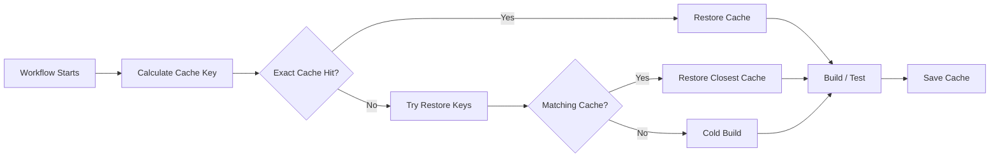
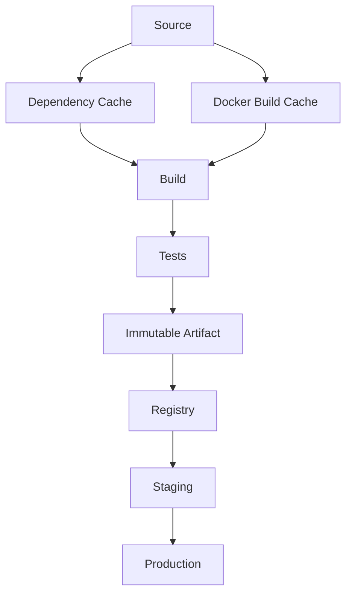

# 11- Cache Issues

## Overview

GitHub Actions caches are designed to reduce workflow execution time by reusing data that can be safely recreated, such as dependency downloads and build inputs.

A cache is an optimization layer, not a deployment artifact.

```text
Without cache:

Source
  ↓
Install dependencies
  ↓
Build
  ↓
Test

With cache:

Source
  ↓
Restore cache
  ↓
Install missing dependencies
  ↓
Build
  ↓
Test
```

Cache failures commonly appear as:

- Unexpected cache misses
- Stale dependencies
- Incorrect cache keys
- Cache restores that succeed but do not improve performance
- Cross-branch cache behavior that is misunderstood
- Docker builds that remain slow despite caching
- Cache poisoning or trust-boundary problems
- Excessive cache storage
- Matrix jobs producing ineffective caches

For production CI/CD, caching should improve performance without changing the correctness or security of the build.

---

## Cache vs Artifact

The first troubleshooting question is whether the data should be a cache at all.

| Property | Cache | Artifact |
|---|---|---|
| Purpose | Speed up computation | Preserve workflow output |
| Rebuildable | Yes | Usually not |
| Example | Python package downloads | Wheel/package |
| Example | Docker build layers | Built image |
| Example | npm cache | Test report |
| Identity | Cache key | Artifact name/version |
| Correctness dependency | Should not affect correctness | Often required |
| Long-term retention | Not guaranteed | Explicit retention |
| Production rollback | No | Yes, when designed for it |

A useful rule:

```text
If deleting it should only make the build slower,
it is a cache candidate.

If deleting it prevents deployment or loses an important result,
it should not be treated as a cache.
```

---

## How GitHub Actions Caching Works

A cache is associated with a key.

Typical lifecycle:



The cache key should represent the inputs that materially determine the cached data.

---

## Basic Cache Configuration

A typical Python dependency cache:

```yaml
- name: Set up Python
  uses: actions/setup-python@v5
  with:
    python-version: "3.12"
    cache: pip
    cache-dependency-path: requirements.txt
```

For explicit caching:

```yaml
- name: Cache pip
  uses: actions/cache@v4
  with:
    path: ~/.cache/pip
    key: ${{ runner.os }}-python-${{ matrix.python-version }}-pip-${{ hashFiles('requirements.txt') }}
    restore-keys: |
      ${{ runner.os }}-python-${{ matrix.python-version }}-pip-
```

The cache key separates operating system, Python version, and dependency definition.

---

## Cache Key Design

A cache key should contain the inputs that affect the cached content.

For Python:

```text
OS
+
Python version
+
Dependency lock file
```

Example:

```yaml
key: ${{ runner.os }}-python-${{ matrix.python-version }}-pip-${{ hashFiles('requirements.txt') }}
```

For a project using multiple dependency files:

```yaml
key: ${{ runner.os }}-python-${{ matrix.python-version }}-pip-${{ hashFiles('requirements.txt', 'requirements-dev.txt') }}
```

Do not include unnecessary high-cardinality values.

---

## Cache Key Components

| Component | Example | Why |
|---|---|---|
| OS | `Linux` | Platform-specific data |
| Runtime | `3.12` | Runtime-specific dependencies |
| Lock file hash | `abc123` | Dependency version changes |
| Architecture | `amd64` | Native binaries |
| Toolchain | `gcc12` | Compiled dependencies |
| Dependency manager | `pip` | Avoid collisions |

The correct key depends on what is being cached.

---

## Failure Domain: Cache Miss

### Symptom

Every workflow run reports a cache miss.

### Possible Causes

- Cache key changes every run
- `hashFiles()` points to the wrong path
- Dependency file does not exist
- OS/runtime is unnecessarily included incorrectly
- Cache is being created under a different key
- The workflow never reaches the cache-save stage
- Cache scope or branch behavior is misunderstood

### Isolation Strategy

Inspect the generated key inputs.

For example:

```yaml
- name: Inspect dependency files
  run: |
    pwd
    find . -maxdepth 3 -type f \( -name 'requirements*.txt' -o -name 'pyproject.toml' \) -print
```

Verify the dependency file is actually present before the cache step.

---

## `hashFiles()` and Cache Keys

`hashFiles()` is useful for dependency-sensitive caching:

```yaml
key: pip-${{ hashFiles('requirements.txt') }}
```

If `requirements.txt` changes:

```text
Old hash
   ↓
Old cache key

New requirements.txt
   ↓
New hash
   ↓
New cache key
```

This naturally invalidates the old dependency cache.

---

## Failure Domain: `hashFiles()` Produces an Unexpected Result

### Symptom

The cache key is unexpectedly stable or changes unexpectedly.

### Possible Causes

- Incorrect repository-relative path
- File generated after the cache step
- Multiple dependency files omitted
- Monorepo path is incorrect
- Lock file differs between jobs

For monorepos:

```yaml
key: ${{ runner.os }}-api-${{ hashFiles('services/api/requirements.txt') }}
```

Be explicit about the dependency boundary.

---

## Restore Keys

Restore keys allow a workflow to use a broader cache when an exact key is unavailable.

Example:

```yaml
- uses: actions/cache@v4
  with:
    path: ~/.cache/pip
    key: ${{ runner.os }}-python-${{ matrix.python-version }}-pip-${{ hashFiles('requirements.txt') }}
    restore-keys: |
      ${{ runner.os }}-python-${{ matrix.python-version }}-pip-
      ${{ runner.os }}-python-
```

Conceptually:

```text
Exact cache
    ↓
Python-version cache
    ↓
Generic Python cache
```

Restore keys should be used carefully because broader caches may contain older dependency data.

---

## Exact Hit vs Partial Restore

There is an important distinction:

```text
Exact key
    ↓
Exact cache

No exact key
    ↓
Restore-key match
    ↓
Older / broader cache
```

A restore-key hit is useful for performance but does not mean the cache represents the current dependency state exactly.

The dependency manager should still validate and install missing or changed packages.

---

## Failure Domain: Stale Dependencies

### Symptom

The cache restores successfully, but tests behave unexpectedly.

### Possible Causes

- Cache key does not include dependency lock information
- Dependency manager reuses stale state
- Multiple dependency configurations share a cache
- Native compiled dependencies are reused across incompatible environments

### Corrective Action

Include relevant dependency and runtime inputs in the key.

Example:

```yaml
key: ${{ runner.os }}-${{ runner.arch }}-python-${{ matrix.python-version }}-${{ hashFiles('poetry.lock') }}
```

---

## Cache Correctness Principle

A cache should never be the source of truth.

Correct model:

```text
Lock file
   ↓
Dependency definition
   ↓
Dependency manager
   ↓
Cache accelerates retrieval
```

Incorrect model:

```text
Cache
  ↓
Assume dependencies are correct
  ↓
Skip validation
```

A cache miss should result in a slower but correct build.

---

## Python Dependency Caching

Common Python cache locations include:

```text
~/.cache/pip
```

A typical workflow:

```yaml
steps:
  - uses: actions/checkout@v4

  - uses: actions/setup-python@v5
    with:
      python-version: "3.12"
      cache: pip
      cache-dependency-path: requirements.txt

  - name: Install dependencies
    run: |
      python -m pip install --upgrade pip
      pip install -r requirements.txt
```

The cache accelerates package retrieval but `pip install` remains responsible for dependency correctness.

---

## `requirements.txt` vs `pyproject.toml`

The cache dependency input must match the project's actual dependency source.

For example:

```yaml
cache-dependency-path: pyproject.toml
```

or:

```yaml
cache-dependency-path: poetry.lock
```

depending on the dependency-management strategy.

For multiple files:

```yaml
cache-dependency-path: |
  requirements.txt
  requirements-dev.txt
```

Use the file that actually determines dependency versions.

---

## Django Cache Example

For a Django application:

```text
requirements.txt
      ↓
Python dependency cache
      ↓
Django + PostgreSQL driver + Redis client
      ↓
Tests
```

Do not cache:

```text
db.sqlite3
production database state
.env
application secrets
user uploads
runtime database state
```

Those are not dependency caches.

---

## FastAPI Cache Example

A FastAPI pipeline may use:

```yaml
- uses: actions/setup-python@v5
  with:
    python-version: "3.12"
    cache: pip
    cache-dependency-path: pyproject.toml

- run: pip install .
- run: pytest
```

The cache accelerates dependency retrieval without becoming part of application state.

---

## Node Dependency Caching

For a frontend or Node-based build:

```yaml
- uses: actions/setup-node@v5
  with:
    node-version: "24"
    cache: npm
    cache-dependency-path: package-lock.json

- run: npm ci
```

The lock file should drive cache invalidation.

---

## Cache Paths

The path must point to data that is actually cacheable.

Examples:

```text
Python:
~/.cache/pip

npm:
~/.npm

Gradle:
~/.gradle/caches
```

Inspect the runtime environment when uncertain:

```bash
python -m pip cache dir
```

For npm:

```bash
npm config get cache
```

---

## Failure Domain: Wrong Cache Path

### Symptom

The workflow reports a successful cache operation, but subsequent runs receive no performance improvement.

### Possible Causes

- Path is empty
- Tool uses a different cache location
- Dependencies are installed somewhere else
- Cache contains irrelevant files

Inspect the path:

```bash
du -sh ~/.cache/pip
find ~/.cache/pip -maxdepth 2 -type f | head
```

Do not assume the tool's cache directory.

---

## Docker Layer Caching

Docker caching operates at a different layer from GitHub Actions dependency caching.

Example:

```text
GitHub Actions cache
        ↓
BuildKit cache
        ↓
Docker build layers
        ↓
Docker image
```

A Docker build can use BuildKit caching:

```yaml
- uses: docker/setup-buildx-action@v3

- uses: docker/build-push-action@v6
  with:
    context: .
    push: false
    tags: backend-api:test
    cache-from: type=gha
    cache-to: type=gha,mode=max
```

The exact action versions should follow the organization's approved version policy.

---

## Docker Cache vs Docker Image

Do not confuse:

```text
Docker build cache
```

with:

```text
Docker image
```

The build cache accelerates image construction.

The image is the deployable artifact.

---

## Dockerfile Layer Ordering

A poor Dockerfile can reduce cache effectiveness.

Less effective:

```dockerfile
COPY . .
RUN pip install -r requirements.txt
```

A source-code change invalidates the dependency-install layer.

Better:

```dockerfile
COPY requirements.txt .
RUN pip install --no-cache-dir -r requirements.txt

COPY . .
```

Now application source changes do not necessarily invalidate dependency installation.

---

## `.dockerignore`

A large build context can reduce build performance.

Example:

```text
.git
.github
__pycache__
.pytest_cache
.venv
node_modules
*.log
.env
```

Never use `.dockerignore` merely as a security control; secrets should not exist in the build context in the first place.

---

## Failure Domain: Docker Cache Miss

### Symptom

Docker builds become slow even though BuildKit caching is configured.

### Possible Causes

- Dockerfile layer ordering
- Changed dependency files
- Cache scope changes
- Build context changes
- Cache not exported
- Wrong `cache-from`
- Wrong `cache-to`
- Different builder configuration
- Multi-platform build behavior

Inspect Buildx output:

```yaml
- uses: docker/build-push-action@v6
  with:
    context: .
    push: false
    cache-from: type=gha
    cache-to: type=gha,mode=max
    progress: plain
```

`progress: plain` can make cache behavior easier to inspect.

---

## Docker Cache Invalidation

Docker cache invalidation is input-sensitive.

For example:

```text
requirements.txt
      ↓
pip install layer
      ↓
Application source
      ↓
application layer
```

Changing only application source should ideally avoid rebuilding dependency layers.

Changing:

```text
requirements.txt
```

should invalidate the dependency layer.

---

## Cache Scope and Trust Boundaries

Caches can become security-sensitive when untrusted code can influence cache contents.

Potential attack:

```text
Untrusted PR
    ↓
Build
    ↓
Modified cache
    ↓
Trusted workflow restores cache
    ↓
Unexpected code/data
```

Do not treat a cache as trusted storage.

Cache design must account for:

- Fork pull requests
- `pull_request_target`
- Self-hosted runners
- Privileged deployment jobs
- Third-party actions
- Shared cache namespaces

---

## Cache Poisoning

Cache poisoning occurs when attacker-controlled content is stored in a cache that a trusted workflow later consumes.

Possible targets include:

- Dependency caches
- Build caches
- Compiled outputs
- Tool caches

The impact depends on what consumes the cached data.

Mitigate by:

- Separating trust boundaries
- Using precise cache keys
- Avoiding privileged operations in untrusted workflows
- Restricting permissions
- Not treating cache data as trusted
- Keeping release builds in trusted workflows

---

## `pull_request` and Cache Security

Pull request workflows may execute untrusted code.

A secure architecture separates:

```text
Untrusted PR validation
        ↓
No production secrets
        ↓
No privileged deployment
        ↓
Trusted branch
        ↓
Trusted release build
```

Do not allow cache behavior to become an indirect privilege-escalation path.

---

## `pull_request_target` and Cache Risk

`pull_request_target` executes with the context of the base repository.

Using it with untrusted checkout code requires particular caution.

Avoid designs where:

```text
pull_request_target
    ↓
checkout attacker-controlled code
    ↓
execute code
    ↓
write shared cache
```

The trusted workflow boundary can be compromised if untrusted code receives privileged execution.

---

## Cache Keys and Untrusted Input

Avoid directly using arbitrary user-controlled data in cache identity.

Risky sources include:

```text
PR title
issue body
branch-controlled strings
commit messages
external input
```

Prefer trusted identifiers:

```text
github.repository
github.ref
github.sha
matrix.python-version
hashFiles(...)
```

and carefully designed normalized values.

---

## Cache Scope in Monorepos

A monorepo may contain:

```text
services/
├── api/
├── worker/
└── frontend/
```

Avoid a single dependency cache when the services have independent dependency graphs.

Prefer:

```yaml
key: ${{ runner.os }}-api-${{ hashFiles('services/api/requirements.txt') }}
```

and:

```yaml
key: ${{ runner.os }}-worker-${{ hashFiles('services/worker/requirements.txt') }}
```

This improves isolation and invalidation accuracy.

---

## Matrix Cache Design

A matrix might test:

```yaml
strategy:
  matrix:
    python-version:
      - "3.11"
      - "3.12"
      - "3.13"
```

Use runtime-aware cache keys:

```yaml
key: ${{ runner.os }}-python-${{ matrix.python-version }}-${{ hashFiles('requirements.txt') }}
```

This prevents incompatible runtime caches from being treated as identical.

---

## Matrix and Database Caches

Do not blindly include every matrix dimension in every cache.

For example:

```text
Python version → dependency cache identity
Database version → usually irrelevant to pip cache
```

But a compiled dependency cache may require additional dimensions such as:

```text
OS
Architecture
Compiler
Python ABI
```

Cache only what materially affects correctness.

---

## Cache Cardinality

Overly specific keys create too many caches.

For example:

```text
OS
Python
Architecture
Database
Browser
Commit SHA
PR number
Timestamp
```

can produce a huge number of cache entries.

The result may be:

```text
Low cache reuse
High storage usage
More cold builds
More operational complexity
```

Design keys around meaningful invalidation boundaries.

---

## Avoid Commit SHA in Dependency Cache Keys

This:

```yaml
key: deps-${{ github.sha }}
```

usually defeats dependency-cache reuse.

Every commit produces a new cache key.

Prefer:

```yaml
key: deps-${{ hashFiles('requirements.txt') }}
```

because the cache should change when dependencies change, not when application source changes.

---

## Cache Hit Does Not Mean Build Success

A cache can restore successfully while the build still fails.

For example:

```text
Cache hit
   ↓
Dependencies restored
   ↓
Django migration failure
```

Do not blame the cache merely because a cached build fails.

First isolate:

```text
Cache restore
Dependency installation
Application build
Tests
Deployment
```

---

## Failure Domain: Cache Hit but No Speed Improvement

### Symptom

The workflow reports a cache hit but runtime is almost unchanged.

### Possible Causes

- Cached data is small
- Dependency installation still performs expensive validation
- Cache restore is itself expensive
- Build is dominated by compilation
- Cache does not contain the expensive portion
- Network transfer is expensive
- Docker cache is not being reused

Measure rather than assuming.

---

## Cache Performance Model

Total workflow time can be viewed as:

```text
Workflow Time
=
Cache Restore
+
Dependency Install
+
Build
+
Tests
+
Cache Save
```

A cache is useful only if:

```text
Time saved
>
Restore + Save overhead
```

Caching a tiny directory can make the workflow slower.

---

## Cache Storage and Cost

Caches consume storage and transfer resources.

Monitor:

- Cache size
- Number of cache variants
- Restore frequency
- Hit rate
- Workflow duration
- Storage growth

A highly fragmented cache strategy can increase operational overhead without improving CI performance.

---

## Cache Eviction and Availability

Caches should be treated as disposable.

A workflow must remain correct if:

```text
Cache is unavailable
Cache is evicted
Cache expires
Cache is cold
Cache is invalidated
```

The fallback should be a normal build.

---

## Failure Domain: Build Breaks Only on Cache Hit

### Symptom

Cold builds pass, but cached builds fail.

### Likely Causes

- Stale generated files
- Incompatible compiled dependencies
- Incorrect cache key
- Corrupted cache contents
- Tool state that should not have been cached

### Isolation Strategy

Force a cold build.

Then compare:

```text
Cold build
vs
Cached build
```

If only cached builds fail, narrow the cache contents.

Do not blindly invalidate everything permanently.

---

## Cache Contents Should Be Minimal

Cache only data that is:

- Reusable
- Reconstructable
- Safe to share within the intended trust boundary
- Expensive to regenerate

Avoid caching:

```text
Secrets
Runtime state
Production data
Database state
User uploads
Deployment credentials
Application-generated mutable state
```

---

## Dependency Cache vs Build Cache

These solve different problems.

### Dependency Cache

```text
pip / npm / Maven downloads
```

### Build Cache

```text
Docker layers
compiled objects
generated intermediate build data
```

A mature CI system may use both.

---

## Cache and Immutable Artifacts

The pipeline should remain:

```text
Cache
  ↓
Faster build
  ↓
Deterministic build output
  ↓
Immutable artifact
  ↓
Promotion
```

The cache should never become part of artifact identity.

---

## Cache and Build Reproducibility

A reproducible build should not depend on a cache.

Given the same:

```text
Source
Dependencies
Toolchain
Build configuration
```

the build should remain valid even without the cache.

Caching should change performance, not semantics.

---

## Cache Troubleshooting Workflow

Use this sequence:

```text
Symptom
  ↓
Verify cache step executed
  ↓
Inspect cache key
  ↓
Verify cache path
  ↓
Check exact-hit / restore behavior
  ↓
Inspect dependency inputs
  ↓
Test cold build
  ↓
Compare cached vs cold behavior
  ↓
Reduce cache scope if necessary
  ↓
Validate performance improvement
```

---

## Failure Domain: Cache Step Never Runs

### Possible Causes

- Previous step failed
- Job was skipped
- `if` condition evaluated false
- Matrix cell was excluded
- Workflow was cancelled

Inspect the job execution graph before changing the cache configuration.

---

## Failure Domain: Cache Save Never Occurs

A cache generally needs the job to reach the appropriate post-step processing.

If the job terminates early:

```text
Build
  ↓
Failure
  ↓
Cache save may not happen
```

If repeated cold builds occur after failures, determine whether the workflow reaches the cache-save stage.

---

## Cache and `continue-on-error`

Be careful when using:

```yaml
continue-on-error: true
```

A job can appear operationally successful while an important build stage did not complete as expected.

Cache troubleshooting should consider actual step outcomes, not only the final job status.

---

## Cache and Concurrency

Concurrent workflows can produce different cache versions.

Example:

```text
Commit A ──┐
           ├── Cache key
Commit B ──┘
```

Use stable dependency-based keys rather than commit-specific keys for reusable dependency caches.

For deployment artifacts, use immutable artifact identity instead of cache mechanisms.

---

## Cache and Self-Hosted Runners

Self-hosted runners introduce another layer:

```text
GitHub Actions cache
        +
Runner-local state
        +
Docker/BuildKit cache
```

A persistent runner may appear fast even without GitHub Actions cache because local state survives between jobs.

This can hide portability problems.

---

## Persistent Runner Cache Risks

Persistent runners may retain:

- Dependency files
- Build outputs
- Docker layers
- Temporary credentials
- Workspace data

Treat runner-local state separately from GitHub Actions caching.

For security-sensitive environments, ephemeral runners provide stronger isolation.

---

## Ephemeral Runners

With ephemeral runners:

```text
Runner created
   ↓
Job executes
   ↓
Runner destroyed
```

Local caches disappear with the runner.

External caching can therefore be valuable for performance.

However, cache reuse must still respect security boundaries.

---

## Cache and Docker Buildx

A production Docker pipeline may use:

```yaml
- name: Set up Buildx
  uses: docker/setup-buildx-action@v3

- name: Build image
  uses: docker/build-push-action@v6
  with:
    context: .
    push: false
    tags: backend-api:test
    cache-from: type=gha
    cache-to: type=gha,mode=max
```

The build cache should accelerate the build while the resulting image remains the deployable artifact.

---

## Cache and ECR

A registry can also participate in Docker build caching depending on the architecture.

Conceptually:

```text
GitHub Actions
     ↓
Buildx
     ↓
Registry-backed cache
     ↓
Docker build
     ↓
ECR image
```

Do not confuse the build cache with the production image stored in ECR.

---

## Cache and AWS Credentials

Never cache:

```text
AWS credentials
STS credentials
OIDC tokens
credential files
```

Use GitHub OIDC:

```text
GitHub Actions
      ↓
OIDC token
      ↓
AWS STS
      ↓
Temporary credentials
      ↓
AWS service
```

Cache dependency data, not authentication material.

---

## Cache Security with Third-Party Actions

A third-party action involved in cache management can potentially access cache-related data and the job environment.

Apply:

- SHA pinning
- Least-privilege permissions
- Trusted action sources
- Action review
- Dependency management

Do not grant broad permissions simply because a caching action is present.

---

## Cache Troubleshooting with GitHub CLI

Inspect recent runs:

```bash
gh run list
```

Inspect a run:

```bash
gh run view <run-id>
```

Inspect failed logs:

```bash
gh run view <run-id> --log-failed
```

Rerun:

```bash
gh run rerun <run-id>
```

For operational troubleshooting, compare:

```text
Cold run
vs
Warm run
```

rather than repeatedly rerunning the same state without changing the diagnostic conditions.

---

## Cache Debugging Checklist

```text
[ ] Cache action executed
[ ] Cache key is stable
[ ] Cache key contains correct dependency inputs
[ ] hashFiles() points to the correct files
[ ] Cache path exists
[ ] Cache path contains expected data
[ ] Exact hit is understood
[ ] Restore-key behavior is understood
[ ] Matrix dimensions are correct
[ ] OS/runtime/architecture are compatible
[ ] Cold build succeeds
[ ] Cached build succeeds
[ ] Cache actually improves runtime
```

---

## Production Cache Architecture

A mature pipeline separates:



The cache accelerates CI.

The immutable artifact drives CD.

---

## Cache Failure Prevention

### Design

- Keep keys deterministic.
- Hash dependency definitions.
- Separate incompatible runtimes.
- Keep cache paths minimal.
- Avoid commit SHA in reusable dependency caches.
- Treat caches as disposable.

### Security

- Never cache secrets.
- Separate trusted and untrusted workflows.
- Avoid privileged execution of untrusted cache-producing code.
- Review third-party actions.
- Do not treat restored cache content as inherently trusted.

### Operations

- Measure hit rate.
- Measure restore time.
- Monitor cache size.
- Periodically review cache cardinality.
- Validate that caching actually improves pipeline duration.

---

## Common Mistakes

### Caching the Entire Repository

```yaml
path: .
```

This creates huge, noisy caches and may include sensitive or irrelevant data.

Cache only the intended directory.

### Using Commit SHA as a Dependency Cache Key

```yaml
key: dependencies-${{ github.sha }}
```

This prevents reuse across commits.

### Treating a Cache as an Artifact

A cache is not a release mechanism.

### Ignoring Runtime Compatibility

A compiled dependency cache may not be safe across Python versions, architectures, or operating systems.

### Assuming a Cache Hit Guarantees Correctness

The dependency manager and build system still determine correctness.

### Sharing Caches Across Trust Boundaries

Untrusted and privileged workflows should not blindly share cache state.

---

## Interview Scenarios

### Why should dependency caches use a lock-file hash?

Because dependency versions are an input to the cached state. Changing the lock file should invalidate the dependency cache.

---

### Why is `github.sha` usually a poor dependency cache key?

Because every commit produces a new key, which prevents reuse even when dependencies have not changed.

---

### A cache hit occurs but CI is still slow. What do you investigate?

Check:

```text
Cache size
Restore duration
Actual cached contents
Dependency installation behavior
Build time
Docker layer reuse
Test duration
```

A cache hit is not proof that the expensive part of the workflow was cached.

---

### How would you troubleshoot a cached build that fails but a cold build passes?

Compare the two execution paths:

```text
Cached build
   ↓
Identify restored data
   ↓
Cold build
   ↓
Compare outputs
   ↓
Narrow cache contents
   ↓
Fix cache key/path
```

Do not immediately disable all caching.

---

### Can a cache be used for Docker images?

Docker build caches can accelerate image construction, but the final image should remain a proper immutable deployment artifact stored in a registry such as ECR.

---

### How would you cache dependencies for Python 3.11 and 3.12?

Include the Python version in the cache identity:

```yaml
key: ${{ runner.os }}-python-${{ matrix.python-version }}-${{ hashFiles('requirements.txt') }}
```

This avoids treating runtime-specific dependency state as interchangeable.

---

### What is cache poisoning?

It is the introduction of attacker-controlled or unintended data into a cache that is later restored by another workflow or trust boundary.

The risk is especially important when untrusted pull requests can influence cache contents consumed by privileged workflows.

---

## Senior Design Principles

A senior engineer should treat caching as an optimization subsystem with explicit failure semantics.

The design should satisfy:

```text
Cache available
      ↓
Fast build

Cache unavailable
      ↓
Correct but slower build
```

Not:

```text
Cache unavailable
      ↓
Production build impossible
```

For production CI/CD:

```text
Dependencies
   ↓
Cache
   ↓
Deterministic Build
   ↓
Security Validation
   ↓
Immutable Artifact
   ↓
Registry
   ↓
Promotion
```

The cache improves throughput while artifact identity, provenance, security, and deployment correctness remain independent of it.

## Key Takeaways

- Treat GitHub Actions caches as disposable performance optimizations; artifacts and registries should carry important build and release outputs.
- Design cache keys around real invalidation boundaries such as dependency lock files, runtime versions, operating systems, and architectures rather than commit SHAs.
- When troubleshooting, verify the cache step, key, path, hit type, compatibility, and cold-build behavior before changing the workflow.
- Protect cache trust boundaries: never cache secrets, and do not allow untrusted workflows to create state that privileged production workflows blindly trust.
- Measure cache effectiveness using hit rate, restore time, workflow duration, and storage usage; a cache is valuable only when it improves the pipeline without changing build correctness.