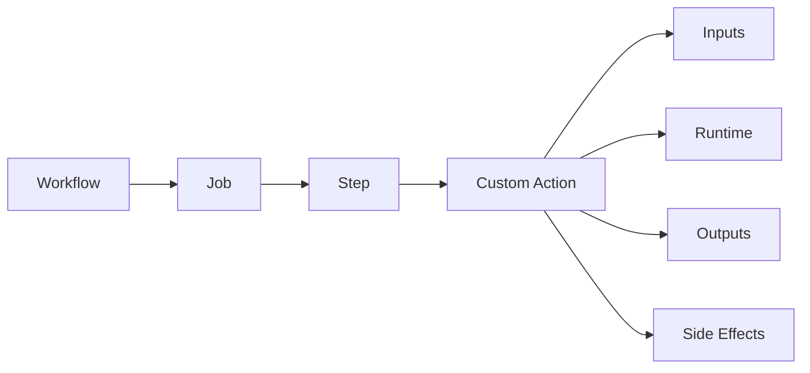
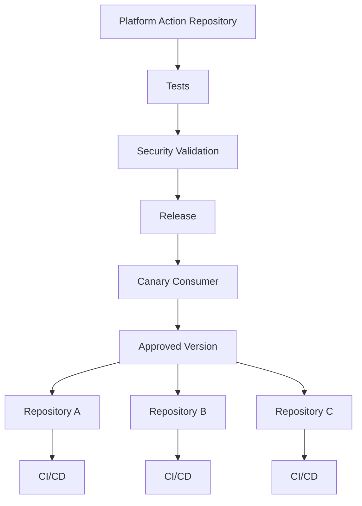

# 13- Custom Action Issues

## Overview

Custom GitHub Actions package reusable CI/CD behavior into a stable execution interface. They are useful when multiple workflows repeatedly implement the same operational logic, such as:

- Python environment preparation
- Repository validation
- Test setup
- Release metadata generation
- Docker operations
- AWS authentication helpers
- Deployment preparation
- Internal platform tooling

GitHub Actions supports three major custom action types:

| Type | Primary purpose | Execution model |
|---|---|---|
| Composite action | Package reusable steps | Steps execute within the calling job |
| JavaScript action | Implement logic with Node.js | Action runtime executes Node.js code |
| Docker action | Package logic in a container | Action executes inside its container |

A custom action failure must be investigated differently from an ordinary workflow step because the failure may originate from the action contract, runtime, packaging, inputs, outputs, dependencies, permissions, or the workflow invoking it.

A useful troubleshooting model is:

```text
Symptom
   ↓
Identify action type
   ↓
Validate action metadata
   ↓
Validate invocation
   ↓
Validate inputs / environment
   ↓
Validate runtime and dependencies
   ↓
Validate permissions / secrets
   ↓
Inspect action execution
   ↓
Isolate root cause
   ↓
Correct action or caller
   ↓
Test against real consumers
   ↓
Prevent recurrence
```

---

## Custom Action Architecture

The relationship between a workflow and a custom action is:



The action is effectively an API boundary.

A well-designed action has:

```text
Stable inputs
      ↓
Validation
      ↓
Implementation
      ↓
Deterministic outputs
      ↓
Documented failure behavior
```

Treating an action as an undocumented collection of shell commands creates long-term maintenance problems.

---

## Custom Action Types

### Composite Actions

Composite actions package multiple workflow steps.

Typical structure:

```text
.github/
└── actions/
    └── setup-python/
        └── action.yml
```

Example:

```yaml
name: Setup Python

description: Set up Python and install project dependencies

inputs:
  python-version:
    description: Python version
    required: true

runs:
  using: composite
  steps:
    - name: Set up Python
      uses: actions/setup-python@v5
      with:
        python-version: ${{ inputs.python-version }}

    - name: Install dependencies
      shell: bash
      run: |
        python -m pip install --upgrade pip
        pip install -r requirements.txt
```

Composite actions are useful for reusable step-level behavior.

---

## JavaScript Actions

JavaScript actions execute Node.js code.

Typical structure:

```text
my-action/
├── action.yml
├── package.json
├── src/
│   └── main.js
└── dist/
    └── index.js
```

Example metadata:

```yaml
name: Validate Release

description: Validate release metadata

inputs:
  version:
    description: Release version
    required: true

outputs:
  valid:
    description: Whether the version is valid

runs:
  using: node24
  main: dist/index.js
```

JavaScript actions are useful when the action needs:

- Complex control flow
- GitHub API interaction
- Structured input processing
- Rich error handling
- Node.js libraries
- More logic than is appropriate for shell commands

---

## Docker Actions

Docker actions package execution into a container.

Typical structure:

```text
docker-action/
├── action.yml
├── Dockerfile
└── entrypoint.sh
```

Example:

```yaml
name: Internal CLI

description: Execute the organization's deployment CLI

inputs:
  environment:
    description: Deployment environment
    required: true

runs:
  using: docker
  image: Dockerfile
  args:
    - ${{ inputs.environment }}
```

Docker actions provide stronger runtime packaging but introduce image build, startup, networking, filesystem, and platform considerations.

---

## Action vs Reusable Workflow

This distinction is critical when troubleshooting.

| Feature | Custom Action | Reusable Workflow |
|---|---|---|
| Scope | Steps within a job | One or more jobs |
| `action.yml` | Yes | No |
| `workflow_call` | No | Yes |
| Job orchestration | No | Yes |
| Matrix orchestration | Limited to caller | Yes |
| Environment deployment | Caller-controlled | Can orchestrate deployment jobs |
| Best use | Reusable implementation | Reusable pipeline |
| Execution boundary | Step | Workflow/job |

A reusable workflow can orchestrate:

```text
Lint
 ↓
Unit Tests
 ↓
Build
 ↓
Deploy
```

A composite action is better suited to:

```text
Setup Python
 ↓
Install dependencies
 ↓
Configure tooling
```

Many "custom action problems" are actually architectural problems caused by using an action where a reusable workflow is required.

---

## `action.yml` Contract

Every custom action depends on its metadata contract.

Common fields include:

```yaml
name:
description:
inputs:
outputs:
runs:
```

The `runs` section determines the action implementation type.

A malformed `action.yml` can prevent the action from executing before its implementation is even reached.

---

## Failure Domain: Action Not Found

### Symptom

Typical errors include:

```text
Can't find action.yml
Unable to resolve action
repository not found
```

### Possible Causes

- Incorrect action path
- Incorrect repository reference
- Wrong branch/tag
- Action directory does not contain `action.yml`
- Private repository access problem
- Incorrect relative path
- Typographical error

### Isolation Strategy

Verify the caller:

```yaml
- uses: ./.github/actions/setup-python
```

and confirm:

```text
.github/actions/setup-python/action.yml
```

exists at the expected repository path.

---

## Local Action Path Issues

A local action reference commonly looks like:

```yaml
- uses: ./.github/actions/setup-python
```

The path must point to the action directory.

Incorrect:

```yaml
- uses: ./.github/actions/setup-python/action.yml
```

The `uses` reference identifies the action directory, not the metadata file itself.

---

## Failure Domain: `action.yml` Invalid

### Symptom

The workflow fails before action implementation starts.

### Possible Causes

- Invalid YAML
- Missing required metadata
- Invalid `runs`
- Invalid input definition
- Incorrect output definition
- Unsupported runtime configuration

### Isolation Strategy

Inspect:

```text
action.yml
```

and validate the action metadata before debugging application logic.

A runtime failure cannot be fixed by changing Python, Bash, or JavaScript code if the action metadata itself is invalid.

---

## Input Contract

Actions should expose explicit inputs.

Example:

```yaml
inputs:
  environment:
    description: Target environment
    required: true

  dry-run:
    description: Whether to perform a dry run
    required: false
    default: "false"
```

Caller:

```yaml
- uses: ./.github/actions/deploy
  with:
    environment: staging
    dry-run: "true"
```

Inputs are part of the action's public API.

---

## Failure Domain: Missing Input

### Symptom

The action receives an empty or missing value.

### Possible Causes

- Input name mismatch
- Caller omitted required input
- Incorrect `${{ }}` expression
- Input has a different spelling
- Action metadata defines a different input

Example mismatch:

```yaml
inputs:
  python-version:
```

Caller:

```yaml
with:
  python_version: "3.12"
```

These are different names.

Use consistent naming:

```yaml
with:
  python-version: "3.12"
```

---

## Input Defaults

Defaults should be explicit where safe.

```yaml
inputs:
  timeout:
    description: Operation timeout in seconds
    required: false
    default: "300"
```

Avoid dangerous defaults for deployment actions.

For example, a deployment action should not silently default to:

```text
production
```

unless that behavior is deliberately designed and protected.

---

## Input Validation

Do not assume callers provide valid values.

For example:

```text
environment
```

may need to accept only:

```text
development
staging
production
```

A composite action can validate explicitly:

```yaml
- name: Validate environment
  shell: bash
  run: |
    set -euo pipefail

    case "${{ inputs.environment }}" in
      development|staging|production)
        ;;
      *)
        echo "Invalid environment"
        exit 1
        ;;
    esac
```

Validation prevents invalid values from reaching deployment logic.

---

## Failure Domain: Input Contains Unexpected Data

### Symptom

The action behaves unpredictably or executes the wrong command.

### Possible Causes

- No input validation
- Shell injection
- Unexpected whitespace
- User-controlled values
- Incorrect quoting
- Implicit type conversion

Treat action inputs as untrusted unless their trust boundary is explicit.

---

## Shell Injection

This is dangerous:

```yaml
run: |
  deploy --environment "${{ inputs.environment }}"
```

Even with quoting, carefully consider whether the value can contain unexpected shell syntax and whether the action is executing untrusted input.

A safer pattern is to pass data through environment variables and validate it:

```yaml
env:
  DEPLOY_ENV: ${{ inputs.environment }}
run: |
  set -euo pipefail

  case "$DEPLOY_ENV" in
    staging|production)
      ;;
    *)
      echo "Invalid environment"
      exit 1
      ;;
  esac
```

For complex values, prefer structured data processing rather than shell command construction.

---

## JavaScript Action Input Handling

JavaScript actions commonly read inputs using `@actions/core`.

```javascript
const core = require("@actions/core");

const environment = core.getInput("environment", {
  required: true,
});
```

Validate before performing side effects:

```javascript
const allowed = new Set(["staging", "production"]);

if (!allowed.has(environment)) {
  throw new Error(`Unsupported environment: ${environment}`);
}
```

A good action validates the contract before interacting with AWS, Docker, Kubernetes, or external APIs.

---

## Failure Domain: JavaScript Runtime Failure

### Symptoms

```text
MODULE_NOT_FOUND
Cannot find package
SyntaxError
TypeError
```

### Possible Causes

- Dependency not installed
- `dist` not rebuilt
- Wrong Node runtime
- Incorrect package version
- Source code differs from packaged output
- Missing production dependency

### Isolation Strategy

Verify:

```text
package.json
package-lock.json
dist/
action.yml
Node runtime
```

---

## JavaScript Action Packaging

A common JavaScript action workflow is:

```text
src/main.js
     ↓
npm install
     ↓
Build/package
     ↓
dist/index.js
     ↓
Release
```

If `action.yml` points to:

```yaml
main: dist/index.js
```

then `dist/index.js` must exist in the version consumed by the workflow.

A frequent failure is updating `src/` but forgetting to regenerate `dist/`.

---

## `@actions/core`

`@actions/core` provides common action functionality such as:

- Inputs
- Outputs
- Errors
- Warnings
- Debug messages
- Environment handling
- Step summaries

Example:

```javascript
const core = require("@actions/core");

const version = core.getInput("version", {
  required: true,
});

core.setOutput("normalized-version", version.trim());
```

---

## `@actions/github`

For GitHub API interaction:

```javascript
const core = require("@actions/core");
const github = require("@actions/github");

const token = core.getInput("token", {
  required: true,
});

const client = github.getOctokit(token);
```

Use least-privilege tokens and request only the permissions needed by the action.

---

## Failure Domain: JavaScript Action Works Locally but Fails in CI

### Possible Causes

- Local dependencies differ
- Different Node runtime
- Missing packaged `dist`
- Environment variables exist locally but not in Actions
- GitHub token permissions differ
- Working directory differs
- API authentication differs

Reproduce using the same runtime and packaging model as the workflow.

---

## Composite Action Shell Issues

Composite actions must define the shell for `run` steps.

Example:

```yaml
runs:
  using: composite
  steps:
    - name: Validate
      shell: bash
      run: |
        set -euo pipefail
        python --version
```

Without explicit shell configuration, portability can become difficult across operating systems.

---

## Windows and Linux Compatibility

An action using:

```bash
export VERSION=1.0
```

is not portable to a Windows shell without appropriate configuration.

If an action is Linux-specific, document that constraint.

If it must support multiple operating systems, design and test the shell behavior explicitly.

---

## Failure Domain: Composite Action Fails on Windows

### Possible Causes

- Bash-specific syntax
- Unix path assumptions
- Linux-only commands
- File permission assumptions
- Incorrect path separators

### Corrective Action

Either:

- Explicitly require Linux, or
- Implement platform-specific behavior and test each supported runner.

Do not claim cross-platform compatibility without testing it.

---

## Environment Variables

Actions frequently depend on environment variables.

A caller can provide:

```yaml
env:
  API_BASE_URL: https://api.example.internal
```

An action can consume:

```bash
echo "$API_BASE_URL"
```

Prefer explicit action inputs for values that are part of the action API.

Environment variables are better suited for ambient runtime configuration.

---

## Inputs vs Environment Variables

| Requirement | Preferred mechanism |
|---|---|
| Public action parameter | Input |
| Secret | Secret / environment |
| Runtime process configuration | Environment variable |
| Action result | Output |
| Cross-job data | Job output |
| Build file | Artifact |

An action becomes difficult to reuse when its behavior depends on undocumented environment variables.

---

## Failure Domain: Environment Variable Missing

### Symptom

```text
variable not set
empty configuration
incorrect endpoint
```

### Isolation

Inspect safe metadata:

```bash
echo "Environment: ${ENVIRONMENT:-unset}"
echo "API_BASE_URL: ${API_BASE_URL:-unset}"
```

Never print sensitive values.

Verify the variable's scope:

```text
Workflow
  ↓
Job
  ↓
Step
  ↓
Action
```

---

## Outputs

Actions can expose outputs to the caller.

Metadata:

```yaml
outputs:
  image-digest:
    description: Digest of the built image
```

Composite action:

```yaml
- id: build
  shell: bash
  run: |
    digest="sha256:example"
    echo "image-digest=$digest" >> "$GITHUB_OUTPUT"

outputs:
  image-digest:
    description: Built image digest
    value: ${{ steps.build.outputs.image-digest }}
```

Caller:

```yaml
- id: build-image
  uses: ./.github/actions/build-image

- run: echo "${{ steps.build-image.outputs.image-digest }}"
```

---

## Failure Domain: Output Is Empty

### Possible Causes

- Missing step `id`
- Wrong output name
- `$GITHUB_OUTPUT` not used
- Output set after a failed command
- Metadata does not map the output correctly
- Caller references the wrong output

Correct pattern:

```yaml
- id: result
  shell: bash
  run: |
    echo "value=hello" >> "$GITHUB_OUTPUT"

outputs:
  value:
    description: Result
    value: ${{ steps.result.outputs.value }}
```

---

## Output vs Environment

An environment variable:

```text
GITHUB_ENV
```

is primarily for subsequent steps in the same job.

An action output:

```text
GITHUB_OUTPUT
```

is part of the action's public result.

For cross-job communication:

```text
Step output
   ↓
Job output
   ↓
needs.<job>.outputs
```

Do not use environment variables as a substitute for job outputs.

---

## Multiline Outputs

Structured or multiline values require appropriate output handling.

For complex data, prefer compact JSON:

```bash
payload='{"environment":"staging","region":"ap-south-1"}'
echo "metadata=$payload" >> "$GITHUB_OUTPUT"
```

The caller can parse the value where required.

Avoid passing large payloads through outputs. Use artifacts for substantial data.

---

## Failure Domain: Output Works in One Workflow but Not Another

### Possible Causes

- Caller references a different action version
- Older action release
- Output contract changed
- Output is conditional
- Caller expects an output that is no longer produced

This is a versioning and API compatibility problem, not necessarily an implementation bug.

---

## Action Versioning

A custom action is an API.

Changing:

```text
Input name
Input semantics
Output name
Output format
Default behavior
Failure behavior
Required permissions
```

can break consumers.

Use versioning deliberately.

Example:

```text
v1
v2
v3
```

or organization-approved immutable references.

---

## Failure Domain: Consumer Breakage After Action Update

### Symptom

Multiple repositories fail after an action release.

### Possible Causes

- Breaking input change
- Output contract changed
- Runtime change
- Dependency update
- Permission requirement changed
- New required environment variable

### Corrective Action

Identify the last known working action version and roll back consumers while investigating.

For shared internal actions, maintain a consumer inventory.

---

## SHA Pinning

Consumers may reference an action using a tag:

```yaml
uses: org/internal-action@v2
```

or an immutable commit:

```yaml
uses: org/internal-action@<commit-sha>
```

SHA pinning improves supply-chain integrity but increases update-management work.

For enterprise environments, combine:

```text
SHA pinning
+
approved update process
+
automation
+
ownership
```

---

## Action Dependencies

A custom action can depend on:

```text
Third-party actions
npm packages
OS packages
Docker base images
AWS APIs
GitHub APIs
```

Therefore the action's supply chain extends beyond its own repository.

Example:

```text
Workflow
   ↓
Internal Action
   ↓
npm dependency
   ↓
External package
```

Review the complete dependency chain.

---

## Failure Domain: Third-Party Action Dependency Breaks

### Possible Causes

- Upstream breaking change
- Compromised dependency
- Mutable tag changed
- API behavior changed
- Runtime incompatibility
- Dependency vulnerability

Mitigate with:

- Version control
- SHA pinning
- Dependency review
- Dependabot
- Controlled update windows
- Testing before rollout

---

## Permissions

A custom action runs with the permissions available to its job.

Example:

```yaml
permissions:
  contents: read
```

For AWS OIDC:

```yaml
permissions:
  contents: read
  id-token: write
```

Do not grant:

```yaml
permissions: write-all
```

merely because an action might need additional access.

Determine the exact API operations required.

---

## Failure Domain: `403 Forbidden`

### Possible Causes

- Missing `GITHUB_TOKEN` permission
- Job-level permissions override workflow permissions
- Repository policy blocks the operation
- Token belongs to an unexpected repository context
- Environment protection blocks access

Check:

```yaml
permissions:
  contents: read
  pull-requests: read
```

and add only the permission actually required.

---

## Custom Actions and AWS OIDC

A deployment action may authenticate with AWS using OIDC:

```text
GitHub Actions
      ↓
OIDC token
      ↓
AWS STS
      ↓
IAM role
      ↓
AWS service
```

The job requires:

```yaml
permissions:
  id-token: write
  contents: read
```

The IAM trust policy must also allow the intended repository and workflow identity.

---

## Failure Domain: OIDC Action Failure

### Symptoms

```text
Unable to retrieve OIDC token
AccessDenied
Not authorized to perform sts:AssumeRoleWithWebIdentity
```

### Isolation

Check:

```text
id-token: write
IAM OIDC provider
IAM trust policy
Audience
Subject
Repository
Branch/environment conditions
```

The custom action itself may be functioning correctly while AWS rejects the identity.

---

## Secrets

A custom action should request only the secrets it actually requires.

Example:

```yaml
- uses: ./.github/actions/deploy
  with:
    environment: staging
  secrets:
    AWS_ROLE_ARN: ${{ secrets.AWS_ROLE_ARN }}
```

Where possible, prefer OIDC and temporary credentials over long-lived AWS credentials.

Never print secrets for debugging.

---

## Failure Domain: Secret Not Available

### Possible Causes

- Secret scope mismatch
- Environment secret not attached
- Reusable workflow did not receive the secret
- Fork workflow cannot access the secret
- Wrong secret name
- Environment protection has not been satisfied

Check the secret scope without exposing its value.

---

## Reusable Workflows Calling Custom Actions

A reusable workflow may invoke an internal action:

```text
Repository
   ↓
Reusable Workflow
   ↓
Custom Action
   ↓
AWS / Docker / GitHub API
```

There are now multiple contracts:

```text
Caller
  ↓
Reusable workflow
  ↓
Custom action
```

A failure may therefore be caused by any contract boundary.

---

## Composite Action vs Reusable Workflow Troubleshooting

If the problem is:

```text
Action cannot access multiple jobs
```

the architecture may be wrong.

A composite action cannot orchestrate:

```text
Job A
   ↓
Job B
   ↓
Job C
```

Use a reusable workflow for job-level orchestration.

---

## Action Working Directory

A custom action may assume:

```text
repository root
```

but the caller may configure:

```yaml
defaults:
  run:
    working-directory: backend
```

Do not assume caller defaults automatically represent the action's intended working directory.

Actions should either:

- Resolve paths explicitly, or
- Clearly document their working-directory assumptions.

---

## File Path Failures

Symptoms:

```text
file not found
No such file or directory
```

Debug with:

```bash
pwd
find "$GITHUB_WORKSPACE" -maxdepth 3 -type f | head -100
```

Use absolute paths based on:

```text
GITHUB_WORKSPACE
```

when the action needs predictable repository access.

---

## GitHub Workspace

Actions commonly interact with:

```text
$GITHUB_WORKSPACE
```

If source checkout has not occurred:

```text
GITHUB_WORKSPACE
```

may not contain the expected repository files.

A local action can be invoked only after the repository containing it is available to the workflow execution context.

---

## Checkout Ordering

A typical workflow:

```yaml
steps:
  - uses: actions/checkout@v4

  - uses: ./.github/actions/validate
```

This makes repository contents available before invoking the local action.

Failure to understand checkout and workspace state can cause confusing local-action failures.

---

## Failure Domain: Action Works Locally but Not From Another Repository

### Possible Causes

- Relative local path only exists in the original repository
- Internal action repository is private
- Consumer lacks repository access
- Release reference is wrong
- Action version is unavailable
- Required secrets/permissions differ

Cross-repository actions require explicit distribution and access design.

---

## Internal and Private Actions

An organization may maintain:

```text
platform-actions
├── setup-python
├── docker-build
├── aws-auth
└── deploy
```

Consumers can then standardize CI/CD behavior.

However, internal actions create organizational dependencies.

Define:

- Owner
- Supported versions
- Release process
- Security review
- Deprecation policy
- Consumer inventory
- Incident response process

---

## Failure Domain: Private Action Access

### Symptoms

```text
Repository not found
Resource not accessible
Permission denied
```

The repository may exist but be inaccessible to the workflow identity.

Check:

```text
Repository visibility
Consumer repository access
Organization policies
Token permissions
Action distribution model
```

Do not confuse "repository does not exist" with "workflow cannot access repository."

---

## Docker Action Troubleshooting

A Docker action adds another execution layer:

```text
Runner
   ↓
Docker action container
   ↓
Entrypoint
   ↓
Application logic
```

Failures can originate from:

- Dockerfile
- Base image
- Build context
- Entrypoint
- File permissions
- Architecture
- Network
- Environment variables
- Mounted workspace
- Dependency installation

---

## Docker Action Entrypoint

Example:

```dockerfile
FROM python:3.12-slim

WORKDIR /app

COPY requirements.txt .
RUN pip install --no-cache-dir -r requirements.txt

COPY entrypoint.py .

ENTRYPOINT ["python", "/app/entrypoint.py"]
```

If the entrypoint path is wrong:

```text
exec /app/entrypoint.py: no such file
```

the action fails before its business logic can execute.

---

## Docker Action Arguments

Metadata:

```yaml
runs:
  using: docker
  image: Dockerfile
  args:
    - ${{ inputs.environment }}
```

Entrypoint:

```python
import sys

environment = sys.argv[1]
```

Validate argument count and values.

Do not assume the caller always supplies correct arguments.

---

## Docker Action File Permissions

Shell entrypoints may require executable permissions.

Example:

```dockerfile
COPY entrypoint.sh /entrypoint.sh
RUN chmod +x /entrypoint.sh

ENTRYPOINT ["/entrypoint.sh"]
```

A missing executable bit can produce:

```text
permission denied
```

---

## Docker Action Networking

A Docker action may need to communicate with:

- GitHub APIs
- AWS APIs
- Internal APIs
- Databases
- Docker registries

Failures may therefore involve network access rather than action logic.

Check:

```text
DNS
Outbound connectivity
Proxy
TLS
Authentication
Private network access
```

---

## Docker Action and Private Networks

A Docker action running on a GitHub-hosted runner cannot automatically access an organization's private network.

If private resources are required:

```text
Self-hosted runner
      ↓
Private network
      ↓
Internal service
```

may be required, subject to the organization's security architecture.

---

## Action Dependencies and Docker Images

For Docker actions, the dependency chain includes:

```text
Action
  ↓
Dockerfile
  ↓
Base image
  ↓
OS packages
  ↓
Application dependencies
```

A vulnerability or breaking change at any layer can affect the action.

Pin and update dependencies through a controlled process.

---

## Failure Domain: Action Suddenly Starts Failing

### Possible Causes

- Action dependency changed
- Mutable tag changed
- Node runtime changed
- Docker base image changed
- GitHub API behavior changed
- AWS API behavior changed
- Repository permissions changed
- Organization policy changed

Use version history and release metadata to identify what changed immediately before the failure.

---

## Action Observability

Custom actions should provide useful diagnostics without leaking secrets.

Useful information includes:

```text
Action version
Runtime version
Operating system
Target environment
Input names
Operation stage
Request identifiers
Output status
```

Avoid logging:

```text
Tokens
Passwords
Secret values
Private credentials
Sensitive payloads
```

---

## Step Summaries

For human-readable operational output:

```bash
{
  echo "## Deployment"
  echo ""
  echo "- Environment: staging"
  echo "- Image: backend-api"
  echo "- Status: successful"
} >> "$GITHUB_STEP_SUMMARY"
```

Step summaries are preferable to dumping large diagnostic payloads into raw logs.

---

## Failure Domain: Insufficient Logs

### Symptom

The action reports:

```text
Command failed
```

without enough context.

### Corrective Action

Add structured stages:

```text
Validate inputs
      ↓
Authenticate
      ↓
Resolve artifact
      ↓
Execute operation
      ↓
Validate result
```

Log the stage, not sensitive data.

---

## Error Handling

Actions should fail deliberately.

Bad pattern:

```bash
some-command || true
```

This can hide actual failures.

Better:

```bash
set -euo pipefail
some-command
```

If an error is intentionally recoverable, handle it explicitly and document why.

---

## Retries

Retries can help with transient failures:

```text
Network timeout
API rate limit
Temporary AWS service failure
Registry transient failure
```

But do not blindly retry:

```text
Authentication failure
Invalid configuration
Permission denial
Malformed input
```

Use bounded retries with backoff.

---

## Idempotency

Deployment-oriented actions should be safe to retry.

Example:

```text
Create deployment
   ↓
Network timeout
   ↓
Did deployment actually succeed?
```

A retry should determine existing state rather than blindly creating duplicate resources.

This is particularly important for:

- AWS deployments
- Kubernetes
- Terraform
- Database migrations
- Releases
- Artifact publishing

---

## Failure Domain: Retry Creates Duplicate Side Effects

### Root Cause

The action assumes:

```text
request failed
=
operation failed
```

But distributed systems can have:

```text
request timeout
+
operation succeeded
```

Use idempotent APIs or verify state before retrying.

---

## Action Timeouts

Long-running actions should have bounded execution.

Consider:

```text
API timeout
Retry timeout
Overall action timeout
Workflow timeout
```

Do not allow an action to hang indefinitely.

---

## AWS CLI Actions

A custom deployment action may use:

```bash
aws sts get-caller-identity
aws ecr describe-repositories
aws ecs describe-services
```

Before diagnosing application-level deployment failures, verify identity:

```bash
aws sts get-caller-identity
```

This confirms which AWS principal the action actually uses.

---

## Docker Actions and ECR

A typical flow is:

```text
GitHub Actions
      ↓
OIDC
      ↓
AWS STS
      ↓
IAM role
      ↓
ECR
      ↓
Docker image
```

Failures can occur at each boundary.

Separate:

```text
Authentication failure
```

from:

```text
Registry authorization failure
```

from:

```text
Docker build failure
```

---

## Custom Actions in Production CI/CD

A production pipeline may contain:

```mermaid
flowchart LR
    A[Pull Request] --> B[Reusable CI]
    B --> C[Custom Validation Actions]
    C --> D[Unit Tests]
    D --> E[Integration Tests]
    E --> F[Build Action]
    F --> G[Immutable Image]
    G --> H[ECR]
    H --> I[Reusable Deployment Workflow]
    I --> J[Deployment Action]
    J --> K[Staging]
    K --> L[Approval]
    L --> M[Production]
```



The action boundaries should remain focused.

A deployment action should not also own unrelated testing, release management, and infrastructure provisioning unless there is a clear architectural reason.

---

## Security Boundaries

A custom action can execute with all privileges available to its job.

Therefore:

```text
Action trust
+
Workflow trust
+
Runner trust
+
Token permissions
+
Secret access
```

must be evaluated together.

An apparently harmless action can become high-risk if invoked by a highly privileged deployment job.

---

## Third-Party Action Risk

A custom action may invoke another action:

```text
Trusted Workflow
    ↓
Internal Action
    ↓
Third-Party Action
```

The internal action does not eliminate the third-party dependency risk.

Review:

- Source
- Maintainer
- Version
- SHA
- Dependencies
- Permissions
- Release history

---

## Untrusted Inputs

Potentially untrusted values include:

```text
Pull request title
Branch name
Commit message
Issue content
Workflow dispatch input
Repository dispatch payload
External API response
```

Do not directly concatenate such values into shell commands.

Unsafe pattern:

```yaml
run: |
  deploy --message "${{ github.event.pull_request.title }}"
```

Prefer environment passing and explicit validation:

```yaml
env:
  PR_TITLE: ${{ github.event.pull_request.title }}
run: |
  python scripts/process_title.py
```

---

## `pull_request` vs `pull_request_target`

Custom actions are especially sensitive to this distinction.

`pull_request` is generally appropriate for validating proposed changes without granting unnecessary privileges.

`pull_request_target` runs in the context of the base repository and therefore requires particular caution.

Dangerous architecture:

```text
pull_request_target
       ↓
checkout untrusted PR code
       ↓
run custom action
       ↓
access secrets
```

The action may become an execution path for attacker-controlled code.

---

## Action Permissions and Least Privilege

A validation action might need:

```yaml
permissions:
  contents: read
```

A pull request automation action may need:

```yaml
permissions:
  contents: read
  pull-requests: write
```

An AWS deployment action may need:

```yaml
permissions:
  contents: read
  id-token: write
```

Keep these responsibilities separate rather than granting one shared action broad permissions.

---

## Testing Custom Actions

Test the action at multiple levels.

### Unit Tests

For JavaScript actions:

```text
Input validation
Transformation logic
API request construction
Error handling
```

### Integration Tests

Validate:

```text
GitHub API
AWS APIs
Docker
Registry
Deployment platform
```

### Consumer Tests

Validate the action from an actual workflow:

```text
Real action reference
Real inputs
Real permissions
Real runner
Real output contract
```

A unit-tested action can still fail when invoked through GitHub Actions because the execution environment differs.

---

## Action Contract Testing

For every action, test:

```text
Required input
Optional input
Default value
Invalid input
Missing permission
Missing secret
Successful execution
Expected output
Failure output
Retry behavior
```

For deployment actions also test:

```text
Already deployed
Partial failure
Timeout
Rollback
Repeated invocation
```

---

## Local Testing Limitations

Some GitHub Actions behavior cannot be perfectly reproduced locally.

For example:

- GitHub event contexts
- `GITHUB_TOKEN`
- OIDC
- Environments
- GitHub-hosted runner behavior
- GitHub API permissions

Use local testing for implementation logic, then run controlled GitHub integration tests for platform-specific behavior.

---

## Version Compatibility

A custom action can depend on:

```text
Node version
Python version
Docker runtime
GitHub API
AWS API
Third-party action
OS packages
```

Track compatibility explicitly.

For example:

| Component | Compatibility Concern |
|---|---|
| Node | Runtime support |
| npm package | API/version changes |
| Docker base image | OS/runtime changes |
| AWS CLI | Command behavior |
| GitHub API | Endpoint behavior |
| Third-party action | Contract changes |

---

## Failure Domain: Action Version Mismatch

### Symptom

A consumer expects an output or input that does not exist.

### Isolation

Identify:

```text
Consumer version
Action version
Release tag
Commit SHA
```

Then compare the action contract between versions.

Use a controlled migration path:

```text
v1
 ↓
v1.x updates
 ↓
v2 migration
```

Avoid silently introducing breaking behavior under a stable major version.

---

## Backward Compatibility

Prefer additive changes.

Safe:

```text
Add optional input
Add output
Improve diagnostics
```

Potentially breaking:

```text
Rename input
Remove output
Change output semantics
Change default environment
Require new permission
Change failure behavior
```

Treat permission changes as API changes because consumers may need workflow modifications.

---

## Deprecation

When retiring an action version:

```text
Announce deprecation
       ↓
Identify consumers
       ↓
Provide migration guide
       ↓
Monitor adoption
       ↓
Disable deprecated version
```

Internal platform teams should maintain an inventory of action consumers.

---

## Enterprise Governance

Organizations with many repositories should standardize:

```text
Approved action sources
Versioning
SHA pinning
Permissions
Security review
Ownership
Release process
Deprecation
Incident response
```

A central platform team can provide reusable actions for:

- Python setup
- Security scanning
- Docker builds
- AWS authentication
- ECR publishing
- Deployment preparation

But centralization increases blast radius, so action releases must be controlled.

---

## Action Blast Radius

Consider:

```text
One repository
    ↓
One action
```

versus:

```text
100 repositories
    ↓
One shared action
```

A defective action release can affect all consumers.

Mitigate with:

- Version pinning
- Canary releases
- Consumer testing
- Gradual rollout
- Clear ownership
- Fast rollback

---

## Action Release Strategy

A mature release flow:

```text
Commit
  ↓
Unit tests
  ↓
Integration tests
  ↓
Consumer tests
  ↓
Security checks
  ↓
Release candidate
  ↓
Canary consumers
  ↓
Stable release
```

Do not automatically roll every consumer to a new major version without validation.

---

## Failure Domain: Action Release Breaks Production

### Isolation

Identify:

```text
Action version
Workflow version
Deployment artifact
Deployment environment
Last known-good action version
```

If the action changed but the deployment artifact did not, the safest rollback may be the action version rather than rebuilding the application.

This is one reason build and deployment artifacts should be immutable and independently identifiable.

---

## Artifact Promotion and Custom Actions

A deployment action should preferably consume an immutable artifact:

```text
Build
  ↓
Image digest
  ↓
ECR
  ↓
Deployment action
  ↓
Staging
  ↓
Production
```

Avoid rebuilding the application inside the deployment action.

This preserves:

- Reproducibility
- Artifact identity
- Rollback capability
- Provenance
- Separation of CI and CD

---

## Custom Actions and Docker Images

A Docker action that builds an application image should clearly separate:

```text
Build logic
```

from:

```text
Deployment logic
```

For example:

```text
build-image action
      ↓
image digest

deploy-ecs action
      ↓
image digest
```

This makes each action easier to test and reason about.

---

## Failure Domain: Action Changes Deployment Behavior

### Possible Causes

- Changed AWS CLI behavior
- Changed Docker command
- New default
- Changed environment variable
- Changed API request
- Different artifact resolution logic

Capture deployment metadata:

```text
Action version
Workflow run
Commit SHA
Artifact digest
Target environment
AWS account
Region
```

This makes incidents traceable.

---

## Monitoring

For production deployment actions, monitor:

- Success rate
- Failure rate
- Execution duration
- Retry frequency
- AWS API errors
- Registry errors
- Deployment rollback rate
- Version adoption
- Consumer failures

A shared action should be treated as platform infrastructure.

---

## Reliability

Reliable actions should have:

- Explicit validation
- Deterministic behavior
- Bounded retries
- Timeouts
- Idempotency
- Clear errors
- Stable contracts
- Versioned releases
- Consumer testing

Avoid actions that silently swallow failures.

---

## Cost and Performance

Action design affects CI cost.

Potential overhead:

```text
Action startup
+
Dependency installation
+
Docker image pull
+
API requests
+
Retries
```

Optimize by:

- Reusing dependency caches where appropriate
- Using efficient CI images
- Avoiding unnecessary API calls
- Batching API operations
- Limiting retries
- Avoiding heavyweight Docker actions for trivial logic

Do not trade away security for small CI-time savings.

---

## Failure Domain: Action Becomes Slow

### Possible Causes

- Dependency installation
- Docker image pull
- API pagination
- Repeated authentication
- Excessive retries
- Large artifact transfers
- External service latency

Instrument action stages:

```text
Initialization
Input validation
Authentication
Main operation
Verification
Cleanup
```

Then optimize the actual bottleneck.

---

## Cleanup

Actions that create temporary resources should clean them up.

Examples:

```text
Temporary files
Docker containers
Temporary AWS resources
Credentials
Background processes
Locks
```

Use failure-aware cleanup without hiding the original failure.

The cleanup mechanism must not turn:

```text
Original failure
```

into:

```text
Misleading cleanup failure
```

---

## Concurrency

Deployment actions should be used with appropriate workflow concurrency.

Example:

```yaml
concurrency:
  group: production-deployment
  cancel-in-progress: false
```

This prevents multiple production deployments from modifying the same environment simultaneously.

The action itself should still be idempotent because concurrency controls do not eliminate all race conditions.

---

## Action and Environment Protection

Production deployment actions should normally operate behind:

```text
GitHub Environment
       ↓
Required reviewers
       ↓
Deployment job
       ↓
Custom deployment action
```

The action should not attempt to bypass environment protection.

---

## Failure Domain: Deployment Action Runs Without Approval

### Possible Causes

- Action invoked by the wrong job
- Environment omitted
- Workflow uses a different deployment path
- Environment protection configured incorrectly
- Reusable workflow does not attach the expected environment

Review the complete workflow architecture rather than only the action.

---

## Troubleshooting Methodology

Use the following sequence for every custom action incident:

### Identify the action

```text
Composite?
JavaScript?
Docker?
```

### Validate the contract

```text
action.yml
inputs
outputs
runtime
```

### Validate invocation

```text
uses
version
repository
path
checkout
```

### Validate execution environment

```text
runner
OS
working directory
container
network
```

### Validate permissions

```text
GITHUB_TOKEN
job permissions
OIDC
AWS IAM
environment protection
```

### Validate dependencies

```text
npm
Docker
OS packages
third-party actions
APIs
```

### Validate side effects

```text
AWS
ECR
ECS
Kubernetes
GitHub API
```

### Reproduce

Reduce the action to the smallest failing operation.

---

## Troubleshooting Matrix

| Symptom | Failure Domain | First Check |
|---|---|---|
| Action not found | Path/reference | `uses` and repository |
| Metadata error | `action.yml` | `runs`, inputs, outputs |
| Missing input | Contract | Input names |
| Empty output | Output mapping | Step `id` + `$GITHUB_OUTPUT` |
| Command not found | Runtime | Container/image |
| JavaScript module error | Packaging | `package.json` + `dist` |
| Docker entrypoint failure | Image | `Dockerfile` |
| 403 | Permissions | `permissions` |
| AWS AssumeRole failure | OIDC/IAM | Trust policy |
| Secret unavailable | Scope | Environment/repository |
| File not found | Workspace | Checkout/path |
| API timeout | Network/retry | Connectivity + timeout |
| Duplicate deployment | Concurrency | Concurrency group |
| Consumer suddenly fails | Versioning | Action release |
| Action becomes slow | Performance | Stage timings |
| Security concern | Trust boundary | Inputs/permissions/runner |

---

## GitHub CLI Diagnostics

List workflows:

```bash
gh workflow list
```

Run a workflow:

```bash
gh workflow run deploy.yml
```

List recent runs:

```bash
gh run list
```

Inspect a run:

```bash
gh run view <run-id>
```

Show failed logs:

```bash
gh run view <run-id> --log-failed
```

Rerun:

```bash
gh run rerun <run-id>
```

Download artifacts:

```bash
gh run download <run-id>
```

Inspect repository information:

```bash
gh repo view
```

The CLI should support incident investigation rather than replace proper workflow observability.

---

## Production Incident Runbook

When a shared custom action starts failing:

```text
1. Identify affected repositories.
2. Identify the action version.
3. Identify the first failing workflow run.
4. Compare with the last successful run.
5. Identify recent action changes.
6. Check permissions and environment changes.
7. Check dependency/runtime changes.
8. Determine whether the failure is action-wide or consumer-specific.
9. Roll back the action reference if necessary.
10. Reproduce against a controlled consumer.
11. Fix and test the action.
12. Release a corrected version.
13. Gradually restore consumers.
14. Document the incident and prevention.
```

---

## Production Architecture

A scalable internal action platform can look like:



The key design property is controlled reuse.

A shared action should reduce duplication without becoming an uncontrolled central failure point.

---

## Reference Production Pipeline

A senior backend pipeline can combine reusable workflows and custom actions:

```text
Pull Request
    ↓
Reusable CI Workflow
    ├── Lint
    ├── Unit Tests
    ├── Integration Tests
    └── Security Scan
            ↓
        Build Action
            ↓
        Immutable Docker Image
            ↓
            ECR
            ↓
        Staging Deployment Action
            ↓
        Health Validation
            ↓
        Approval
            ↓
        Production Deployment Action
            ↓
        Monitoring
            ↓
        Rollback if required
```

Each component should have a clearly defined responsibility.

---

## Common Mistakes

### Treating a Custom Action as a Reusable Workflow

A composite action cannot orchestrate multiple jobs.

### Hiding Required Configuration

Actions that depend on undocumented environment variables are difficult to operate.

### No Input Validation

Invalid values can reach deployment systems or shell commands.

### Mutable Action References

Uncontrolled mutable references increase supply-chain risk.

### Missing `dist` for JavaScript Actions

Changing source code without rebuilding the packaged action causes consumers to execute stale code.

### Excessive Permissions

Actions often receive more permissions than their implementation requires.

### Printing Secrets During Debugging

This can turn an operational incident into a credential exposure incident.

### Retrying Non-Idempotent Operations

Retries can create duplicate resources or deployments.

### Rebuilding During Deployment

Deployment actions should consume immutable artifacts rather than silently producing new ones.

### No Consumer Testing

An action can pass unit tests while breaking real workflows.

---

## Senior Interview Scenarios

### A composite action works in one repository but fails in another. How do you investigate?

Check:

```text
Action version
Input contract
Environment variables
Working directory
Permissions
Secrets
Runner OS
Repository policies
```

Then compare the execution contexts rather than assuming the action itself changed.

---

### A JavaScript action was updated and all consumers started failing. What do you do?

Identify the last known-good version, compare the action contract and runtime changes, determine whether the failure is universal, and roll consumers back if required.

Then test the corrected version with representative consumers before broad rollout.

---

### How would you design an internal deployment action?

Define:

```text
Stable inputs
Immutable artifact identity
Environment
Authentication mechanism
Required permissions
Output contract
Timeouts
Retries
Idempotency
Health validation
Failure behavior
Versioning
```

Keep deployment orchestration separate from unrelated CI responsibilities.

---

### Why should deployment actions consume image digests?

A digest identifies the exact image content.

```text
Tag
  ↓
May move

Digest
  ↓
Identifies immutable content
```

This supports build-once/promote-many and reliable rollback.

---

### How do you secure a custom action that deploys to AWS?

Use:

```text
Least-privilege GITHUB_TOKEN
+
GitHub OIDC
+
AWS IAM trust policy
+
Short-lived STS credentials
+
Environment protection
+
Immutable artifacts
+
Controlled action versioning
```

Avoid long-lived AWS access keys where OIDC is suitable.

---

### What makes a custom action production-ready?

It should have:

```text
Stable API
Input validation
Clear outputs
Predictable failures
Security controls
Versioning
Tests
Observability
Documentation
Rollback strategy
Consumer compatibility
```

---

### When should you create a custom action instead of a reusable workflow?

Use a custom action when the reusable unit is primarily step-level implementation.

Use a reusable workflow when the reusable unit needs:

```text
Multiple jobs
Dependency graphs
Matrices
Environment protection
Approvals
Deployment orchestration
```

---

## Production Checklist

### Action Contract

- [ ] `action.yml` is valid.
- [ ] Inputs are explicit.
- [ ] Defaults are safe.
- [ ] Inputs are validated.
- [ ] Outputs are documented.
- [ ] Failure behavior is documented.

### Runtime

- [ ] Correct action type is selected.
- [ ] Runtime version is supported.
- [ ] Dependencies are controlled.
- [ ] JavaScript actions have current packaged output.
- [ ] Docker actions have reproducible images.
- [ ] Shell assumptions are explicit.

### Security

- [ ] Least-privilege permissions are used.
- [ ] Secrets are scoped appropriately.
- [ ] Untrusted inputs are validated.
- [ ] Third-party actions are controlled.
- [ ] Action references follow organizational policy.
- [ ] OIDC is used for AWS where appropriate.
- [ ] Production environments are protected.

### Reliability

- [ ] Operations are idempotent where possible.
- [ ] Retries are bounded.
- [ ] Timeouts exist.
- [ ] Errors are actionable.
- [ ] Cleanup is handled.
- [ ] Concurrency is considered.

### Operations

- [ ] Action versions are tracked.
- [ ] Consumers are identifiable.
- [ ] Releases are tested.
- [ ] Canary rollout is possible.
- [ ] Rollback is documented.
- [ ] Logs and step summaries are useful.
- [ ] Security and dependency updates are monitored.

## Key Takeaways

- Treat a custom GitHub Action as a versioned API with explicit inputs, outputs, runtime requirements, permissions, and failure semantics.
- Troubleshoot in layers: action metadata → invocation → inputs/outputs → runtime → dependencies → permissions → network/API side effects.
- Choose the correct abstraction: custom actions package reusable steps, while reusable workflows orchestrate jobs, matrices, environments, approvals, and deployments.
- Production actions require least privilege, input validation, controlled dependencies, idempotency, bounded retries, observability, and immutable artifact handling.
- Shared internal actions need controlled releases, consumer testing, versioning, and rollback because a single defective release can affect many repositories.