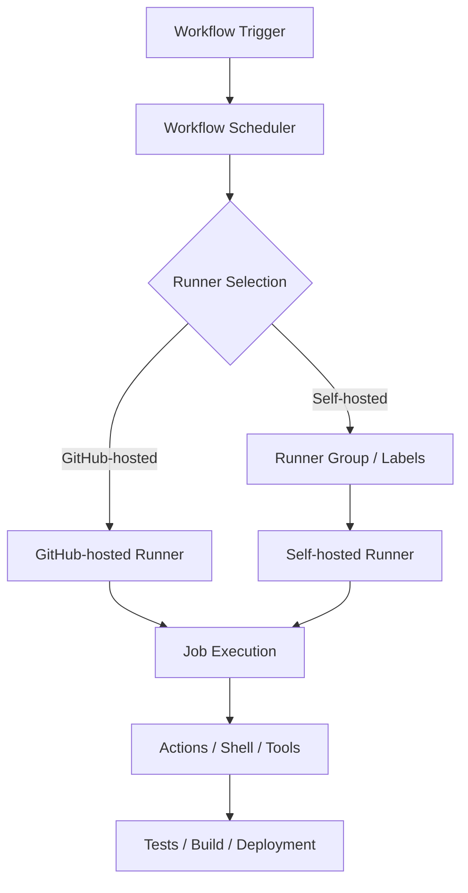
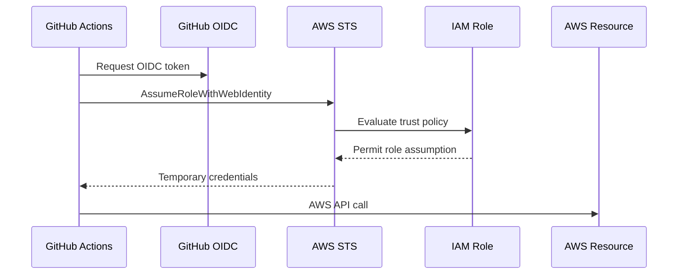
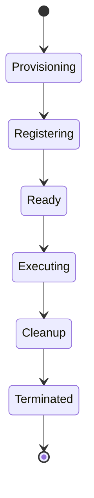
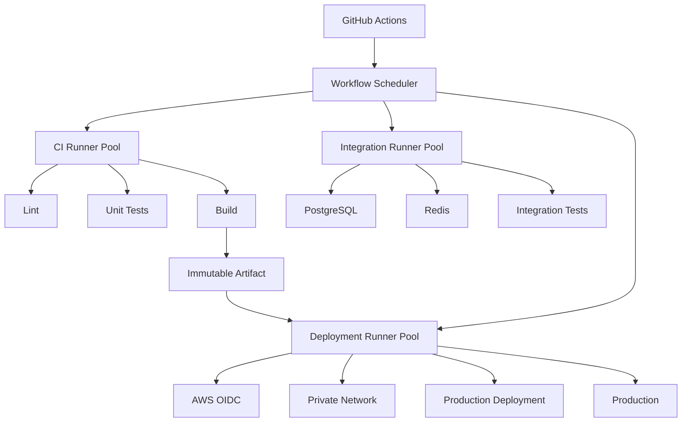

# 14- Runner Issues

## Overview

GitHub Actions runners are the execution layer for workflows. A workflow defines what should happen, but the runner provides the operating system, filesystem, network environment, installed tools, credentials, container runtime, and compute resources required to execute the jobs.

Runner failures are therefore different from ordinary workflow or step failures. A YAML file can be valid while the workflow still fails because the selected runner is unavailable, incorrectly labeled, out of disk space, unable to reach a private dependency, missing a required executable, running an incompatible architecture, or carrying stale state.

For production CI/CD, runner troubleshooting should be treated as a failure-domain problem:

```text
Workflow
   ↓
Job scheduling
   ↓
Runner selection
   ↓
Runner availability
   ↓
Runner startup
   ↓
Operating system
   ↓
Network / DNS / TLS
   ↓
Toolchain / dependencies
   ↓
Workspace / filesystem
   ↓
Docker / containers
   ↓
Application tests / build / deployment
```

A useful troubleshooting model is:

```text
Symptom
   ↓
Possible Causes
   ↓
Isolation Strategy
   ↓
Commands / Checks
   ↓
Root Cause
   ↓
Corrective Action
   ↓
Prevention
```

The goal is not simply to make one failed run pass. A production-grade runner strategy should make failures diagnosable, isolated, reproducible, secure, and recoverable.

---

## Runner Architecture

A simplified GitHub Actions execution flow is:



A runner is responsible for executing jobs, not for defining the workflow itself.

The important distinction is:

| Layer | Responsibility |
|---|---|
| Workflow | Defines automation |
| Job | Defines an execution unit |
| Runner selector | Determines where the job runs |
| Runner | Provides execution environment |
| Step | Performs an operation |
| Action | Packages reusable automation |
| Application | Code being tested or deployed |

For example:

```yaml
jobs:
  test:
    runs-on: ubuntu-latest

    steps:
      - uses: actions/checkout@v4

      - name: Install dependencies
        run: pip install -r requirements.txt

      - name: Run tests
        run: pytest
```

The workflow assumes that `ubuntu-latest` provides the required execution environment.

When that assumption is incorrect, the failure belongs to the runner/toolchain domain rather than necessarily to the application.

---

## GitHub-Hosted vs Self-Hosted Runner Issues

Runner troubleshooting starts by identifying the runner model.

| Area | GitHub-hosted | Self-hosted |
|---|---|---|
| OS management | GitHub | Organization |
| Base image | GitHub-managed | Organization-managed |
| Software updates | GitHub-managed | Organization-managed |
| Network | Usually public GitHub-hosted environment | Can access private networks |
| Persistent state | Generally ephemeral | May be persistent |
| Capacity | Managed by GitHub within limits | Must be provisioned |
| Security responsibility | Shared | Primarily organization |
| Custom dependencies | Limited to image/custom setup | Fully customizable |
| Private AWS resources | Requires appropriate network architecture | Can run inside VPC/private network |
| Debugging | Less infrastructure control | More infrastructure control, more responsibility |
| Common failure | Image/tool availability | Drift, capacity, networking, stale state |

A runner problem should therefore not be diagnosed the same way in both environments.

---

## Runner Selection Issues

### Symptom

A job remains queued, is never assigned, or reports that no suitable runner is available.

### Possible Causes

Common causes include:

- Invalid `runs-on` value.
- Incorrect self-hosted labels.
- Runner group restrictions.
- Offline runners.
- Busy runners.
- No runner matching all requested labels.
- Architecture mismatch.
- Organization or repository runner policy.
- Runner group does not permit repository access.
- Runner has been removed.
- Required runner type has no available capacity.

### Example

```yaml
jobs:
  build:
    runs-on: [self-hosted, linux, x64, docker]
```

The runner must satisfy all requested labels.

If the available runner has:

```text
self-hosted
linux
arm64
docker
```

it does not satisfy:

```text
x64
```

### Isolation Strategy

Check:

1. `runs-on`.
2. Runner labels.
3. Runner group.
4. Repository access.
5. Runner status.
6. Runner architecture.
7. Capacity.

GitHub CLI can help inspect runners:

```bash
gh api repos/OWNER/REPO/actions/runners
```

For an organization:

```bash
gh api orgs/ORG/actions/runners
```

### Corrective Action

Prefer explicit, stable labels:

```yaml
runs-on: [self-hosted, linux, x64, ci]
```

Avoid labels that describe temporary state:

```yaml
runs-on: [self-hosted, overloaded-runner]
```

Runner labels should represent durable capabilities.

---

## Offline Runner Issues

### Symptom

A self-hosted runner appears in GitHub but is offline.

### Possible Causes

- Runner service stopped.
- Host rebooted.
- Network failure.
- DNS failure.
- Firewall/proxy issue.
- Outbound HTTPS blocked.
- Runner process crashed.
- Runner registration became invalid.
- Host terminated.
- Machine is intentionally drained or disabled.

### Isolation Strategy

On Linux, inspect the runner service.

```bash
sudo systemctl status actions.runner.*
```

Check the process:

```bash
ps aux | grep Runner.Listener
```

Check network connectivity:

```bash
curl -I https://github.com
```

Check DNS:

```bash
getent hosts github.com
```

Check HTTPS:

```bash
curl -v https://github.com
```

### Corrective Action

Restart the runner service when appropriate:

```bash
sudo systemctl restart actions.runner.<service>
```

If the host itself is unhealthy, replacing the runner can be safer than repeatedly repairing it.

For production infrastructure, prefer automated replacement over manual long-term repair.

---

## Busy Runner Issues

### Symptom

Jobs remain queued even though runners appear online.

### Possible Causes

- All matching runners are busy.
- Matrix expansion created unexpected concurrency.
- Long-running jobs occupy the pool.
- Deployment jobs are serialized.
- Runner autoscaling is too slow.
- Maximum runner capacity has been reached.
- Downstream dependencies are causing jobs to run longer.

### Diagnostic Model

```text
Queued jobs
    ↓
Matching labels?
    ↓
Available runners?
    ↓
Runner capacity?
    ↓
Job duration?
    ↓
Autoscaling delay?
```

A runner pool should be evaluated using queue time, execution time, and utilization rather than only runner count.

### Production Considerations

For a workload with:

```text
20 parallel jobs
```

and:

```text
5 runners
```

the jobs cannot execute concurrently even if the workflow matrix allows 20 jobs.

Increasing `max-parallel` does not create runner capacity.

```yaml
strategy:
  matrix:
    python: ["3.11", "3.12", "3.13"]
  max-parallel: 6
```

`max-parallel` limits workflow concurrency. It does not provision runners.

---

## Runner Labels and Groups

Labels describe runner capabilities.

Examples:

```text
self-hosted
linux
x64
docker
python
deployment
private-network
```

Runner groups provide an additional access-control boundary.

A production deployment architecture might use:

```text
CI runners
├── public-ci
│
├── integration
│   ├── postgres
│   └── redis
│
└── deployment
    ├── private-network
    └── production
```

This separation reduces blast radius.

A test job should generally not require access to a runner that can directly deploy to production.

---

## Runner Group Access Issues

### Symptom

A valid self-hosted runner exists but a repository cannot use it.

### Possible Causes

- Repository not allowed to access the runner group.
- Organization policy restricts access.
- Enterprise policy restricts the runner.
- Runner group is scoped to selected repositories.
- Workflow requests a label belonging to an inaccessible group.

### Diagnostic Questions

- Which organization owns the runner?
- Which runner group contains it?
- Is the repository permitted?
- Does the runner have the required labels?
- Is the workflow running from the expected repository/ref?
- Are organization or enterprise Actions policies restricting access?

### Production Recommendation

Separate runner groups by trust boundary rather than only by technology.

For example:

```text
ci-untrusted
ci-trusted
deployment-staging
deployment-production
```

This is stronger than simply creating:

```text
python
docker
linux
```

because security boundaries are usually more important than software capabilities.

---

## Operating System Issues

### Symptom

A workflow works on GitHub-hosted runners but fails on a self-hosted Linux runner.

### Possible Causes

- Different distribution.
- Missing package.
- Different glibc version.
- Different Python version.
- Different shell.
- Different filesystem permissions.
- Missing compiler.
- Missing system libraries.
- Different Docker version.
- Different kernel.
- Different architecture.
- Environment variables differ.

### Compare the Environment

```bash
uname -a
cat /etc/os-release
uname -m
python --version
pip --version
docker --version
git --version
```

Check available resources:

```bash
df -h
free -h
nproc
```

Check environment:

```bash
env | sort
```

Do not blindly compare or print secrets.

---

## Toolchain Issues

### Symptom

A command such as `python`, `node`, `docker`, `aws`, or `terraform` cannot be found.

Example:

```text
python: command not found
```

### Possible Causes

- Tool is not installed.
- Incorrect `PATH`.
- Different executable name.
- Runner image changed.
- Installation failed.
- Tool installed under another user.
- Architecture mismatch.

Check:

```bash
command -v python
command -v python3
command -v docker
command -v aws
command -v terraform
```

Inspect `PATH`:

```bash
echo "$PATH"
```

For Python:

```bash
python3 --version
python3 -m pip --version
```

Prefer explicit tool setup in workflows when reproducibility matters:

```yaml
- uses: actions/setup-python@v6
  with:
    python-version: "3.12"
```

A self-hosted runner should not rely on undocumented manual configuration.

---

## Python Runner Issues

Python projects commonly fail because the runner's Python environment differs from local development.

### Common Problems

- Wrong Python version.
- System Python used accidentally.
- Missing virtual environment.
- Native dependency compilation failure.
- Incompatible wheel.
- `pip` associated with a different interpreter.
- Cached dependency mismatch.

Prefer:

```bash
python -m pip install -r requirements.txt
```

instead of:

```bash
pip install -r requirements.txt
```

Verify:

```bash
python --version
python -c "import sys; print(sys.executable)"
python -m pip --version
```

For Django:

```bash
python manage.py check
python manage.py test
```

For FastAPI:

```bash
pytest
```

---

## Native Dependency Failures

Packages such as database drivers may require system libraries.

Examples include:

- `psycopg`
- `mysqlclient`
- cryptography-related dependencies
- image-processing libraries
- scientific Python packages

A self-hosted Linux runner may require:

```bash
sudo apt-get update
sudo apt-get install -y build-essential
```

and appropriate development libraries.

The correct solution depends on the package and operating system.

Do not solve dependency failures by installing arbitrary packages permanently on production runners without documenting the runner image.

A better model is:

```text
Runner Image Definition
        ↓
Build / Provision
        ↓
Validation
        ↓
Runner Pool
```

---

## Filesystem and Workspace Issues

### Symptom

Files cannot be found or writes fail.

### Possible Causes

- Wrong working directory.
- Repository not checked out.
- Workspace cleanup.
- Relative path assumption.
- Permission problem.
- Disk full.
- Persistent runner contains stale files.
- Concurrent jobs share filesystem state.

Check:

```bash
pwd
ls -la
df -h
```

Use GitHub-provided workspace paths where appropriate:

```yaml
- name: Inspect workspace
  run: |
    pwd
    ls -la
```

Avoid hard-coded local paths such as:

```text
C:\Users\developer\project
```

or:

```text
/home/developer/project
```

CI workflows should use workspace-relative paths or environment variables.

---

## Persistent Runner State

Persistent runners introduce a major source of hidden state.

A previous job may leave:

- Build artifacts.
- Virtual environments.
- Docker images.
- Temporary files.
- Credentials.
- Modified configuration.
- Git repositories.
- Cache directories.
- Test databases.
- Processes.

This can create:

```text
Job A
  ↓
Leaves state
  ↓
Job B
  ↓
Reads stale state
  ↓
Non-deterministic failure
```

### Production Recommendation

Prefer ephemeral runners for workloads executing untrusted or sensitive code.

If persistent runners are required:

- Clean workspaces.
- Remove temporary credentials.
- Remove stale containers.
- Control Docker resources.
- Monitor disk usage.
- Regularly rebuild runner images.
- Isolate sensitive workloads.
- Avoid sharing production deployment runners with arbitrary CI workloads.

---

## Disk Space Issues

### Symptom

Typical errors include:

```text
No space left on device
```

or:

```text
failed to write layer
```

### Diagnose

```bash
df -h
```

Find large directories:

```bash
sudo du -xh /var | sort -h | tail -n 20
```

For Docker:

```bash
docker system df
```

Inspect containers:

```bash
docker ps -a
```

Inspect images:

```bash
docker images
```

### Common Sources

- Docker images.
- BuildKit cache.
- Dependency caches.
- Test artifacts.
- Large workspaces.
- Logs.
- Core dumps.
- Old runner work directories.

Do not blindly execute:

```bash
docker system prune -a
```

on a shared runner without understanding its impact.

Aggressive cleanup can remove useful cached layers and increase build time.

---

## CPU and Memory Issues

### Symptoms

- Builds become extremely slow.
- Processes are killed.
- Tests randomly fail.
- Docker builds fail.
- Matrix jobs overload the host.

Inspect:

```bash
nproc
free -h
uptime
```

Process-level usage:

```bash
ps aux --sort=-%mem | head
ps aux --sort=-%cpu | head
```

### Production Considerations

A runner is not the only capacity constraint.

For integration tests:

```text
Runner CPU
    ↓
PostgreSQL capacity
    ↓
Redis capacity
    ↓
Application process
    ↓
Network
```

Increasing runner capacity may simply move the bottleneck to PostgreSQL or Redis.

---

## Process and Port Issues

Persistent runners can contain orphaned processes.

### Symptom

A later job reports:

```text
Address already in use
```

Check:

```bash
ss -lntp
```

or:

```bash
sudo lsof -i :8000
```

For Python applications:

```bash
ps aux | grep uvicorn
ps aux | grep gunicorn
```

CI jobs should clean up processes they create.

For long-running background processes, use explicit lifecycle management.

---

## Network Connectivity Issues

Runner network failures often appear as application failures.

Possible symptoms:

```text
Connection timed out
```

```text
Could not resolve host
```

```text
Connection refused
```

```text
TLS handshake failed
```

Diagnose in layers.

### DNS

```bash
getent hosts example.com
```

### TCP

```bash
nc -vz example.com 443
```

### HTTPS

```bash
curl -v https://example.com
```

### Route

```bash
ip route
```

### DNS Configuration

```bash
cat /etc/resolv.conf
```

Do not jump directly to application debugging when the runner cannot establish the underlying network connection.

---

## Private Network Access

A common production requirement is:

```text
GitHub Actions
      ↓
Self-hosted runner
      ↓
AWS VPC
      ↓
Private resources
```

Examples:

- RDS PostgreSQL.
- ElastiCache Redis.
- Internal APIs.
- Private ECR endpoints.
- Internal gRPC services.
- Private package repositories.

A GitHub-hosted runner generally should not be assumed to have private VPC connectivity.

A self-hosted runner inside the appropriate network boundary may be required.

### Failure-Domain Checklist

```text
Runner online?
        ↓
DNS works?
        ↓
Route exists?
        ↓
Security group permits traffic?
        ↓
NACL permits traffic?
        ↓
Target service listening?
        ↓
TLS valid?
        ↓
Authentication valid?
```

---

## PostgreSQL Connectivity Issues

For a Django or FastAPI integration test:

```text
Runner
  ↓
PostgreSQL
  ↓
Application tests
```

Check DNS:

```bash
getent hosts postgres.internal
```

Check port:

```bash
nc -vz postgres.internal 5432
```

Check PostgreSQL readiness:

```bash
pg_isready -h postgres.internal -p 5432
```

Common causes:

- Wrong hostname.
- Wrong port.
- Security group restriction.
- Database not ready.
- Credentials incorrect.
- TLS configuration mismatch.
- Runner is outside the private network.

Do not treat authentication errors and network timeouts as the same failure.

---

## Redis Connectivity Issues

Check:

```bash
nc -vz redis.internal 6379
```

If Redis CLI is available:

```bash
redis-cli -h redis.internal ping
```

Expected:

```text
PONG
```

Common causes:

- Wrong endpoint.
- TLS mismatch.
- Authentication configuration.
- Security group.
- DNS.
- Redis not ready.
- Runner placed in the wrong subnet.

---

## Docker Runner Issues

### Symptom

Docker commands fail on a self-hosted runner.

Examples:

```text
Cannot connect to the Docker daemon
```

or:

```text
permission denied while trying to connect to the Docker daemon socket
```

Check:

```bash
docker version
docker info
```

Check service:

```bash
sudo systemctl status docker
```

Check socket:

```bash
ls -l /var/run/docker.sock
```

### Security Consideration

Access to the Docker socket can effectively provide highly privileged access to the host.

Do not expose the Docker socket to untrusted workloads without understanding the security boundary.

---

## Docker-in-Docker and Container Jobs

Containerized CI introduces additional failure domains:

```text
Runner
  ↓
Container runtime
  ↓
Job container
  ↓
Service containers
```

Possible failures include:

- Docker daemon unavailable.
- Incorrect socket mounting.
- Network isolation.
- DNS resolution.
- Missing tools inside the container.
- Permission mismatch.
- Architecture incompatibility.
- Volume permission problems.

When diagnosing container failures, determine whether the command executes:

```text
On host
```

or:

```text
Inside job container
```

or:

```text
Inside service container
```

This distinction is often the first useful isolation step.

---

## Architecture and CPU Compatibility

A workflow may fail when a runner architecture differs from the expected environment.

Check:

```bash
uname -m
```

Typical values:

```text
x86_64
aarch64
```

This matters for:

- Python wheels.
- Native binaries.
- Docker images.
- Buildx multi-platform builds.
- Database drivers.
- Browser binaries.

For multi-platform image builds:

```yaml
- uses: docker/setup-buildx-action@v3

- uses: docker/build-push-action@v6
  with:
    platforms: linux/amd64,linux/arm64
```

The runner architecture and target image architecture are related but not necessarily identical because Buildx can perform cross-platform builds.

---

## Runner Environment Drift

Persistent runners tend to drift over time.

Examples:

```text
Month 1:
Python 3.12
Docker 27
Ubuntu package set A

Month 6:
Python 3.12
Docker 28
Ubuntu package set B
Manual packages
Old caches
Changed configuration
```

Eventually:

```text
Works on runner A
Fails on runner B
```

### Prevention

Use:

- Immutable runner images.
- Infrastructure as Code.
- Versioned provisioning.
- Automated validation.
- Ephemeral runners.
- Regular replacement.
- Explicit tool setup.

Treat runner infrastructure as code rather than as a manually maintained server.

---

## Runner Registration Issues

### Symptom

A runner cannot register or disappears after registration.

Possible causes:

- Invalid registration token.
- Expired registration process.
- Incorrect repository or organization scope.
- Network restrictions.
- Runner already registered.
- Incorrect configuration.
- Host identity problems.

Registration should be automated where possible.

Never commit registration tokens into:

- Git.
- Dockerfiles.
- Workflow YAML.
- AMIs.
- Public logs.

---

## Runner Token Security

Runner registration credentials are sensitive infrastructure credentials.

Avoid:

```bash
echo "$RUNNER_TOKEN"
```

Avoid logging complete bootstrap commands containing secrets.

Prefer secret injection during provisioning.

For ephemeral runners:

```text
Provision
   ↓
Obtain short-lived registration material
   ↓
Register
   ↓
Execute job
   ↓
Deregister / terminate
```

This limits credential lifetime and persistent compromise.

---

## Self-Hosted Runner Security

Self-hosted runners execute workflow code with the privileges available to the runner.

This creates a critical security boundary.

A compromised workflow can potentially access:

- Filesystem.
- Environment variables.
- Network resources.
- Docker.
- Cloud credentials.
- Metadata endpoints.
- SSH keys.
- Other processes.

Therefore:

```text
Untrusted CI
      ≠
Production deployment runner
```

Separate runner pools according to trust level.

---

## Pull Requests and Self-Hosted Runners

Running untrusted pull request code on a sensitive persistent self-hosted runner can expose the runner environment.

Risk increases when the runner has:

- AWS credentials.
- Private network access.
- Docker socket access.
- Production connectivity.
- Long-lived secrets.
- Persistent filesystem state.

For untrusted workloads, consider:

- GitHub-hosted runners.
- Ephemeral runners.
- Restricted runner groups.
- Minimal permissions.
- No production credentials.
- No unnecessary private network access.

Be particularly careful with `pull_request_target`, because the workflow executes in the base repository security context while handling pull request data.

---

## AWS Credential and OIDC Runner Issues

Production workflows should generally prefer short-lived AWS credentials through OIDC rather than long-lived AWS access keys stored as repository secrets.

Typical flow:



Runner failures can therefore occur at multiple layers:

```text
OIDC token
   ↓
id-token: write
   ↓
IAM trust policy
   ↓
STS
   ↓
IAM permissions
   ↓
AWS service
```

Check identity:

```bash
aws sts get-caller-identity
```

Do not debug ECR or ECS permissions before confirming the identity actually assumed by the workflow.

---

## EC2 Self-Hosted Runner Issues

A common architecture is:

```text
GitHub Actions
      ↓
Self-hosted EC2 runner
      ↓
AWS VPC
      ├── RDS
      ├── ElastiCache
      ├── ECR
      └── Internal services
```

Common EC2-specific issues include:

- Instance stopped.
- Security group rules.
- Route table issues.
- DNS configuration.
- IAM instance profile.
- Disk exhaustion.
- CPU or memory exhaustion.
- IMDS configuration.
- Docker daemon failures.
- Runner service stopped.

Useful checks:

```bash
curl -s http://169.254.169.254/latest/meta-data/instance-id
```

For production systems, use IMDSv2 and avoid exposing metadata access unnecessarily to untrusted workloads.

---

## Runner and IAM Instance Profiles

An EC2 runner may use an instance profile.

This creates an important distinction:

```text
GitHub OIDC credentials
```

versus:

```text
EC2 instance profile credentials
```

If a workflow unexpectedly receives AWS permissions, investigate both.

A runner host with a powerful instance profile can create a large blast radius if arbitrary workflow code executes on that host.

Prefer least-privileged identities and isolate deployment runners from general CI runners.

---

## Windows Runner Issues

Windows runners introduce additional differences:

- PowerShell defaults.
- Windows paths.
- Case-insensitive filesystem behavior.
- Different package managers.
- Different native binaries.
- Different line endings.
- Different shell semantics.

Explicitly select the shell when necessary:

```yaml
- name: Run PowerShell
  shell: pwsh
  run: |
    Write-Host "Running on Windows"
```

Do not assume that Bash syntax works identically on Windows.

---

## Shell Differences

A workflow can fail because the runner uses a different shell than expected.

Examples:

```bash
export FOO=bar
```

is not equivalent to PowerShell syntax.

Prefer explicit shells when portability matters:

```yaml
- name: Run Bash
  shell: bash
  run: |
    set -euo pipefail
    echo "Running Bash"
```

For PowerShell:

```yaml
- name: Run PowerShell
  shell: pwsh
  run: |
    $ErrorActionPreference = "Stop"
    Write-Host "Running PowerShell"
```

Shell choice should be treated as part of the job contract.

---

## File Permissions

### Symptom

A script exists but cannot execute.

Example:

```text
Permission denied
```

Check:

```bash
ls -l script.sh
```

Make executable:

```bash
chmod +x script.sh
```

But do not use permission changes as a permanent workaround without understanding why the executable bit was missing.

Git preserves executable metadata for tracked files, so repository state should be checked as well.

---

## Git Checkout Issues on Runners

A runner may fail because the repository was not checked out or the checkout state differs from expectations.

A standard pattern is:

```yaml
- name: Checkout
  uses: actions/checkout@v4
```

Then:

```yaml
- name: Verify repository
  run: |
    git status
    git rev-parse --show-toplevel
    git rev-parse HEAD
```

For deployment workflows, verify the commit identity before building or deploying.

---

## Runner and Matrix Failures

Matrices can multiply runner demand.

Example:

```yaml
strategy:
  matrix:
    python: ["3.11", "3.12", "3.13"]
    database: ["postgres", "mysql"]
```

This creates:

```text
3 Python versions × 2 databases = 6 jobs
```

If each job requires a self-hosted runner with the same labels, the runner pool must have enough capacity or accept queueing.

### Production Considerations

Use:

```yaml
strategy:
  max-parallel: 3
```

when downstream systems cannot handle six concurrent integration environments.

This controls concurrency without changing the matrix definition.

---

## Runner Failures in Integration Testing

A production-like Python pipeline might look like:

```text
Python Matrix
     ↓
Runner
     ├── PostgreSQL
     ├── Redis
     └── Application
             ↓
           pytest
             ↓
       Coverage Reports
             ↓
          Artifacts
```

Failures should be isolated in this order:

1. Runner available?
2. Python available?
3. Dependencies installed?
4. PostgreSQL ready?
5. Redis ready?
6. Application starts?
7. Tests execute?
8. Test itself fails?

This prevents application debugging from masking infrastructure failures.

---

## Runner Failures During Docker Builds

Typical symptoms:

```text
failed to solve
```

```text
no space left on device
```

```text
permission denied
```

```text
failed to fetch
```

Check:

```bash
docker version
docker info
docker system df
df -h
```

Check Buildx:

```bash
docker buildx ls
```

If the failure involves registry access, separate:

```text
Runner network
    ↓
Registry authentication
    ↓
Registry authorization
    ↓
Image build
    ↓
Image push
```

Do not assume an ECR push failure is a Docker build failure.

---

## Runner Cache Problems

Caching can improve performance but introduce state-related failures.

Common cache sources:

- Python dependencies.
- Node dependencies.
- Docker BuildKit cache.
- Build outputs.

Distinguish:

```text
Cache
```

from:

```text
Artifact
```

A cache is an optimization and may be unavailable or invalidated.

An artifact is an explicit workflow output.

Never make production correctness depend solely on a cache hit.

---

## Cache Corruption and Stale State

### Symptom

A workflow fails only on some runners or suddenly succeeds after clearing caches.

Possible causes:

- Corrupted dependency cache.
- Incompatible cache key.
- Runtime version changed.
- Dependency lock file changed.
- Architecture mismatch.
- Persistent runner state.

For Python dependency caching, include relevant inputs in the cache key, such as the lock file hash.

Example:

```yaml
- uses: actions/setup-python@v6
  with:
    python-version: "3.12"
    cache: "pip"
```

For Docker, use BuildKit caching deliberately and treat cache data as untrusted optimization state.

---

## Runner Health Checks

A production runner fleet should expose health signals.

Useful signals include:

| Signal | What it indicates |
|---|---|
| Online status | Runner connectivity |
| Busy status | Current utilization |
| Queue time | Capacity pressure |
| Job duration | Workload behavior |
| CPU | Compute pressure |
| Memory | Memory pressure |
| Disk | Storage pressure |
| Network errors | Connectivity problems |
| Registration age | Runner lifecycle |
| Image version | Environment consistency |
| Failed jobs | Runner health indicator |

Runner health should be observable separately from application health.

---

## Runner Monitoring

For self-hosted runners, monitor:

```text
Runner availability
Runner queue time
CPU
Memory
Disk
Network
Docker
Process count
Job duration
Job failure rate
Provisioning time
Replacement rate
```

A useful production dashboard might contain:

```text
Runner Fleet
├── Online
├── Offline
├── Busy
├── Idle
├── Queue depth
├── Average queue time
├── Job failure rate
├── Disk utilization
└── Provisioning latency
```

---

## Ephemeral Runner Lifecycle

Ephemeral runners reduce persistent state.



The important property is:

```text
One runner
    ↓
Limited workload
    ↓
Destroy
```

This reduces:

- Credential persistence.
- Workspace contamination.
- Dependency drift.
- Malware persistence.
- Cross-job state leakage.

The trade-off is additional provisioning latency and infrastructure complexity.

---

## Runner Autoscaling Issues

### Symptom

Jobs remain queued despite an autoscaling runner platform.

Possible causes:

- Autoscaler does not observe queue correctly.
- Provisioning is too slow.
- Image bootstrap fails.
- Registration fails.
- Runner labels are wrong.
- Cloud quota reached.
- Subnet IP exhaustion.
- Instance launch failures.
- Maximum runner count reached.

A useful metric is:

```text
Job queue time
+
Runner provisioning time
+
Job execution time
```

If provisioning takes five minutes, simply increasing desired capacity may not solve burst latency.

---

## Runner Autoscaling and Downstream Capacity

Runner scaling must account for dependencies.

Suppose 100 integration jobs are launched simultaneously:

```text
100 runners
      ↓
100 PostgreSQL connections × N processes
      ↓
Database overload
```

More runners can make the system less reliable.

Capacity planning should therefore consider:

```text
Runner capacity
        +
Database capacity
        +
Redis capacity
        +
Registry capacity
        +
Network capacity
```

---

## Concurrency and Runner Failures

Concurrency controls prevent multiple workflows from conflicting.

Example:

```yaml
concurrency:
  group: production-deployment
  cancel-in-progress: false
```

For pull requests:

```yaml
concurrency:
  group: ci-${{ github.workflow }}-${{ github.ref }}
  cancel-in-progress: true
```

Production deployments often should not be cancelled after deployment has started without carefully understanding the deployment system.

Runner availability and concurrency are separate concerns:

```text
Runner capacity
    → Can the job execute?

Concurrency policy
    → Should the job execute now?
```

---

## Deployment Runner Failures

Deployment runners require stricter controls than general CI runners.

A production deployment runner may have:

- AWS access.
- Private network access.
- Production credentials.
- Kubernetes credentials.
- ECR permissions.
- Terraform permissions.

Recommended separation:

```text
General CI
   ↓
Build / Test
   ↓
Immutable Artifact
   ↓
Restricted Deployment Runner
   ↓
Production
```

Do not use the same highly privileged runner pool for arbitrary pull request code.

---

## Kubernetes Runner Issues

When deploying to Kubernetes, runner failures can occur before Kubernetes is involved.

First check:

```bash
kubectl version --client
kubectl config current-context
kubectl cluster-info
```

Then:

```bash
kubectl get nodes
```

A useful isolation sequence is:

```text
Runner
 ↓
kubectl installed
 ↓
Kubeconfig / identity
 ↓
Network access
 ↓
API server reachable
 ↓
RBAC permissions
 ↓
Deployment operation
```

Do not diagnose Kubernetes deployment behavior until runner authentication and API connectivity are confirmed.

---

## Terraform Runner Issues

Terraform jobs depend heavily on runner state and credentials.

Check:

```bash
terraform version
terraform init
terraform validate
terraform plan
```

AWS identity:

```bash
aws sts get-caller-identity
```

Common runner-related problems:

- Wrong Terraform version.
- Missing provider binary.
- Backend unavailable.
- State locking issue.
- AWS credentials unavailable.
- Private endpoint inaccessible.
- Plugin cache corruption.
- Disk exhaustion.

For production infrastructure, pin Terraform and provider versions appropriately and treat the runner as an execution environment rather than a state store.

---

## Nginx and Internal API Access

A self-hosted runner may need to call an internal API behind Nginx.

Diagnostic sequence:

```bash
getent hosts api.internal.example
```

```bash
nc -vz api.internal.example 443
```

```bash
curl -vk https://api.internal.example/health
```

If DNS works but TCP fails:

```text
Likely network/security boundary
```

If TCP works but TLS fails:

```text
Likely certificate/TLS configuration
```

If TLS works but HTTP returns `401`:

```text
Likely application authentication
```

This layered approach avoids mixing network, TLS, and application failures.

---

## Runner Logs and Diagnostic Evidence

When debugging a runner failure, collect evidence before changing infrastructure.

Useful evidence includes:

- Workflow run ID.
- Job name.
- Runner name.
- Runner labels.
- Runner group.
- Runner OS.
- Runner architecture.
- Runner image/version.
- Job start time.
- Queue duration.
- Exact failing step.
- Exit code.
- Relevant system logs.
- Disk/memory state.
- Network diagnostics.
- Docker state.
- AWS identity where relevant.

Avoid collecting:

- Secrets.
- Tokens.
- Private keys.
- Full environment variables containing credentials.

---

## GitHub CLI Diagnostics

List workflows:

```bash
gh workflow list
```

List recent runs:

```bash
gh run list
```

Inspect a run:

```bash
gh run view RUN_ID
```

View logs:

```bash
gh run view RUN_ID --log
```

Rerun:

```bash
gh run rerun RUN_ID
```

Rerun failed jobs:

```bash
gh run rerun RUN_ID --failed
```

Inspect repository runners:

```bash
gh api repos/OWNER/REPO/actions/runners
```

Inspect organization runners:

```bash
gh api orgs/ORG/actions/runners
```

For operational debugging, capture the run ID and correlate it with runner-side logs.

---

## System-Level Linux Diagnostics

Useful commands for self-hosted Linux runners:

### Identity

```bash
whoami
id
hostname
```

### OS

```bash
uname -a
cat /etc/os-release
```

### CPU and memory

```bash
nproc
free -h
uptime
```

### Disk

```bash
df -h
```

### Processes

```bash
ps aux --sort=-%cpu | head
ps aux --sort=-%mem | head
```

### Network

```bash
ip addr
ip route
```

### DNS

```bash
getent hosts github.com
```

### Ports

```bash
ss -lntp
```

### Docker

```bash
docker info
docker system df
```

Use these commands to establish facts rather than guessing from the application error alone.

---

## Failure Domain Matrix

| Symptom | Likely Domain | First Checks |
|---|---|---|
| Job queued | Scheduling/capacity | Labels, groups, runner availability |
| No matching runner | Selection | `runs-on`, labels, group access |
| Runner offline | Host/network | Service, process, DNS, HTTPS |
| Command not found | Toolchain | `command -v`, `PATH`, installed tools |
| Permission denied | Filesystem/security | Ownership, mode, user |
| No space left | Disk | `df -h`, Docker usage |
| Process killed | Resource | Memory, CPU, OOM |
| DNS failure | Network | `getent hosts` |
| Connection timeout | Network/security | Route, SG/NACL, endpoint |
| TLS failure | TLS | `curl -v`, certificates |
| Docker daemon failure | Runtime | `docker info`, daemon status |
| ECR authentication failure | AWS/OIDC | `aws sts get-caller-identity` |
| ECR push denied | IAM | Repository permissions |
| Kubernetes API unavailable | Network/auth | `kubectl cluster-info` |
| Tests fail only on one runner | Drift/state | Runtime, image, cache, workspace |
| Intermittent failures | Capacity/state/race | Runner state, concurrency, resources |
| Jobs contaminate each other | Persistent state | Cleanup/ephemeral runners |

---

## General Runner Troubleshooting Runbook

Use this sequence for production incidents.

### Step 1: Identify the runner

Determine:

- GitHub-hosted or self-hosted.
- Runner name.
- Runner group.
- Labels.
- OS.
- Architecture.

### Step 2: Determine whether the job was scheduled

If it never started:

```text
Do not debug application code yet.
```

Investigate:

- Labels.
- Runner availability.
- Group access.
- Capacity.
- Organization policy.

### Step 3: Verify the host

```bash
hostname
uname -a
df -h
free -h
```

### Step 4: Verify required tools

```bash
python --version
docker --version
git --version
```

Use the tools actually required by the workflow.

### Step 5: Verify network

```bash
getent hosts github.com
curl -I https://github.com
```

Then test the specific dependency.

### Step 6: Verify credentials

For AWS:

```bash
aws sts get-caller-identity
```

For Kubernetes:

```bash
kubectl config current-context
kubectl cluster-info
```

### Step 7: Verify workspace

```bash
pwd
git status
ls -la
```

### Step 8: Verify resources

```bash
df -h
free -h
nproc
```

### Step 9: Reproduce the failing command

Run the smallest failing command rather than rerunning the entire pipeline blindly.

### Step 10: Determine root cause

Document:

```text
Symptom
Cause
Evidence
Correction
Prevention
```

---

## Reproducing Runner Failures

A strong troubleshooting technique is to reduce the workflow to a diagnostic job.

Example:

```yaml
jobs:
  runner-diagnostics:
    runs-on: [self-hosted, linux, x64]

    steps:
      - name: Runner information
        run: |
          uname -a
          cat /etc/os-release
          uname -m

      - name: Resource information
        run: |
          nproc
          free -h
          df -h

      - name: Tool versions
        run: |
          python --version || true
          docker --version || true
          git --version

      - name: Network diagnostics
        run: |
          getent hosts github.com
          curl -I https://github.com
```

Do not expose secrets or sensitive environment variables in diagnostic output.

---

## Common Runner Mistakes

### Treating runner failures as application failures

If the runner cannot reach PostgreSQL, changing Django code will not solve the problem.

### Manually fixing persistent runners

A manual fix may hide configuration drift.

Prefer fixing the runner image or provisioning definition.

### Sharing privileged runners

A production deployment runner should not normally execute arbitrary untrusted pull request code.

### Ignoring disk usage

Docker-heavy CI workloads can exhaust persistent runners quickly.

### Assuming online means healthy

A runner can be online while:

- Disk is full.
- Docker is broken.
- DNS is broken.
- CPU is exhausted.
- Memory is exhausted.
- Required tools are missing.

### Increasing runner count without capacity analysis

More runners can overload:

- PostgreSQL.
- Redis.
- AWS APIs.
- Docker registries.
- Internal APIs.

### Depending on undocumented runner state

If a workflow requires a manually installed package, encode that requirement into the runner image or workflow.

### Printing diagnostic environment variables

This can leak secrets.

Use targeted diagnostics instead.

---

## Production Runner Architecture

A mature production architecture separates trust and workload types.



The important security boundary is:

```text
Untrusted / General CI
        ↓
Trusted Build
        ↓
Immutable Artifact
        ↓
Restricted Deployment Runner
        ↓
Production
```

This architecture reduces the consequences of runner compromise.

---

## Runner Design for Python Backend Teams

For Django/FastAPI services, a practical runner strategy is:

```text
CI
├── Python 3.11
├── Python 3.12
├── Python 3.13
├── pytest
├── PostgreSQL
└── Redis

Build
├── Docker
├── Buildx
├── ECR
└── SBOM / provenance

Deployment
├── AWS OIDC
├── ECS / EC2 / Kubernetes
└── Private network
```

Keep the runner environment deterministic.

For application dependencies, prefer workflow-controlled setup:

```yaml
- uses: actions/setup-python@v6
  with:
    python-version: "3.12"

- run: python -m pip install -r requirements.txt
```

rather than assuming the host has the correct Python environment.

---

## Reliability Considerations

Runner reliability improves when the system is designed around replacement rather than repair.

Prefer:

```text
Immutable runner image
        ↓
Automated provisioning
        ↓
Health validation
        ↓
Runner registration
        ↓
Job execution
        ↓
Termination
```

over:

```text
Long-lived server
        ↓
Manual package installation
        ↓
Manual fixes
        ↓
Unknown state
        ↓
Intermittent failures
```

For production workloads:

- Use ephemeral runners where appropriate.
- Pin important tool versions.
- Monitor capacity.
- Control runner groups.
- Separate trust zones.
- Automate provisioning.
- Rotate or replace runners.
- Keep deployment runners isolated.
- Document network dependencies.

---

## High Availability and Disaster Recovery

GitHub Actions runner availability is part of CI/CD availability.

For self-hosted infrastructure:

```text
Runner Pool A
Runner Pool B
      ↓
Shared provisioning model
```

Avoid a single deployment runner becoming a single point of failure.

For production deployments, consider:

- Multiple runners.
- Multiple availability zones where appropriate.
- Automated provisioning.
- Infrastructure as Code.
- Backup runner image definitions.
- Documented recovery procedures.
- External artifact storage.
- Immutable deployment artifacts.

The goal of runner DR is not necessarily to preserve a specific runner. It is to restore execution capability.

---

## Cost Considerations

Runner cost is influenced by:

```text
Runner count
×
Runtime
×
Instance cost
```

But inefficient CI can also increase downstream costs.

Examples:

- Excessive matrix dimensions.
- Overly large runners.
- Slow Docker builds.
- Missing dependency caching.
- Unnecessary integration tests.
- Excessive E2E execution.
- Over-provisioned persistent runners.
- Idle self-hosted EC2 instances.

Optimize using measurements:

```text
Queue time
+
Execution time
+
Provisioning time
+
Resource utilization
```

Do not optimize runner cost by weakening isolation for production deployment workloads.

---

## Security Checklist

Before allowing a runner into a production environment, verify:

- Runner scope is appropriate.
- Runner group access is restricted.
- Labels are intentional.
- Workflow permissions use least privilege.
- Production runners are separated from untrusted CI.
- OIDC trust policies are restricted.
- Long-lived AWS credentials are avoided where possible.
- Docker socket exposure is controlled.
- Runner images are patched.
- Runner state is cleaned.
- Secrets are not logged.
- Private network access is restricted.
- Third-party actions are trusted and pinned appropriately.
- Runner registration credentials are protected.
- Monitoring and auditability exist.
- Replacement procedures are documented.

---

## Senior-Level Troubleshooting Scenarios

### Scenario: Job remains queued

Investigate:

```text
runs-on
→ labels
→ runner group
→ repository access
→ runner status
→ capacity
```

Do not immediately change application code.

### Scenario: Only one self-hosted runner fails

Compare:

```text
OS
Python
Docker
Disk
Memory
Network
Image version
Workspace
Installed packages
```

This is often environment drift.

### Scenario: All integration tests suddenly fail

Check shared dependencies first:

```text
Runner network
→ PostgreSQL
→ Redis
→ DNS
→ credentials
```

A simultaneous failure across unrelated tests often indicates infrastructure rather than application regression.

### Scenario: Docker builds suddenly fail

Check:

```text
Disk
→ Docker daemon
→ Buildx
→ network
→ registry
→ credentials
```

### Scenario: Production deployment cannot assume AWS role

Check:

```text
id-token: write
→ OIDC token
→ IAM trust policy
→ STS
→ role permissions
```

### Scenario: Deployment runner is online but cannot reach ECS/ECR

Separate:

```text
Runner network
```

from:

```text
AWS authentication
```

and:

```text
AWS authorization
```

These are different failure domains.

---

## Production Incident Checklist

### Scheduling

- [ ] Workflow triggered correctly.
- [ ] Job is not blocked by `needs`.
- [ ] `runs-on` is correct.
- [ ] Required labels exist.
- [ ] Runner group permits the repository.
- [ ] Matching runner has capacity.

### Runner

- [ ] Runner is online.
- [ ] Runner service is healthy.
- [ ] OS is healthy.
- [ ] CPU is available.
- [ ] Memory is available.
- [ ] Disk has capacity.
- [ ] Required tools exist.
- [ ] Docker is healthy where required.

### Network

- [ ] DNS resolves.
- [ ] Route exists.
- [ ] Firewall/security groups permit traffic.
- [ ] Private network access exists where required.
- [ ] TLS works.
- [ ] Target service is reachable.

### Security

- [ ] GITHUB_TOKEN permissions are sufficient.
- [ ] Secrets are available.
- [ ] Secrets are not exposed.
- [ ] AWS OIDC is configured correctly.
- [ ] IAM trust policy matches the workflow.
- [ ] Deployment runner is appropriately isolated.

### State

- [ ] Workspace is clean.
- [ ] No stale processes remain.
- [ ] Docker cache/state is healthy.
- [ ] Dependency cache is valid.
- [ ] Runner image is current.

### Recovery

- [ ] Failure is reproducible.
- [ ] Evidence is collected.
- [ ] Root cause is identified.
- [ ] Runner replacement is considered.
- [ ] Corrective action is documented.
- [ ] Prevention is added to infrastructure or workflow configuration.

---

## Key Takeaways

- Runner failures must be diagnosed as infrastructure failure domains: scheduling, runner state, OS, resources, networking, toolchain, containers, credentials, and downstream services.
- Self-hosted runners provide powerful customization and private-network access, but they also create significant security, state, capacity, and maintenance responsibilities.
- Production runner fleets should favor deterministic environments, least privilege, workload isolation, monitoring, and automated replacement over manually repaired persistent machines.
- Runner capacity must be planned together with downstream systems such as PostgreSQL, Redis, Docker registries, AWS APIs, and internal services; more runners do not automatically improve reliability.
- The strongest troubleshooting process is evidence-driven: identify the runner, isolate the failure domain, verify the smallest dependency chain, establish the root cause, and then encode the prevention into the workflow or runner infrastructure.