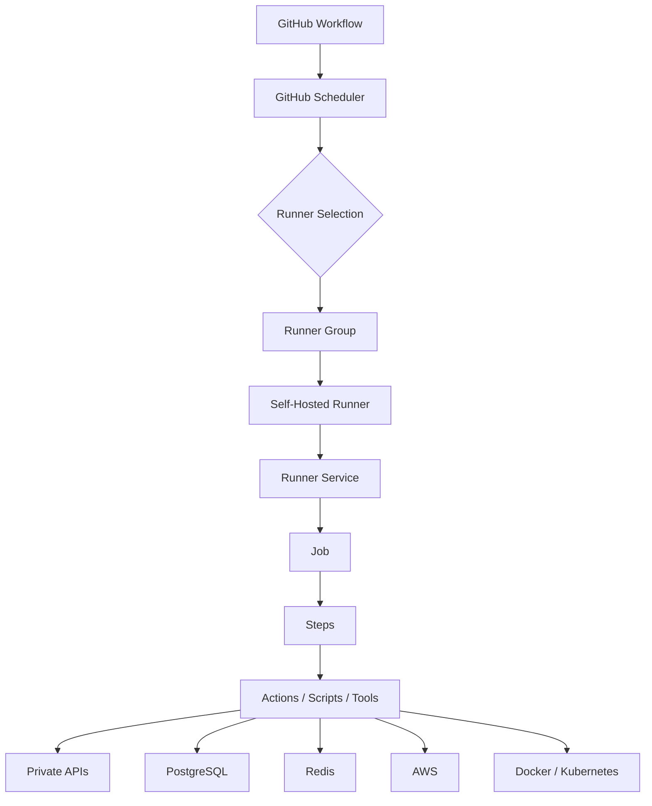
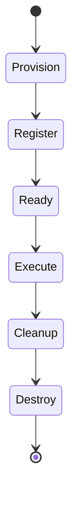
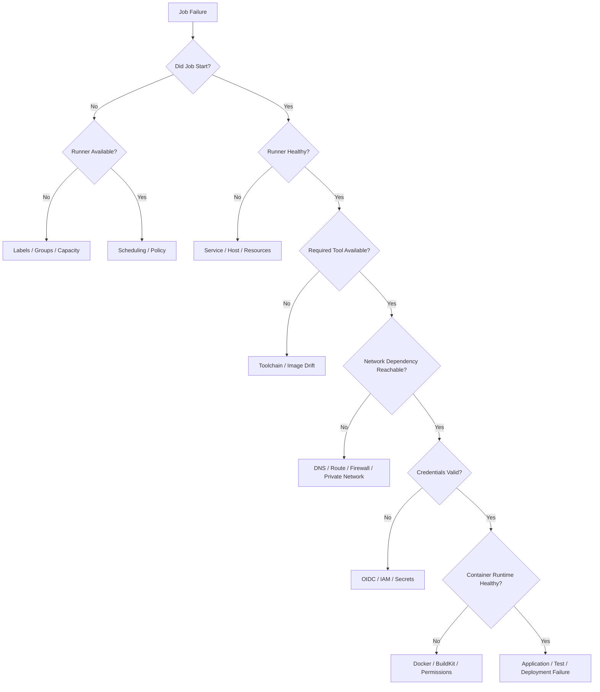
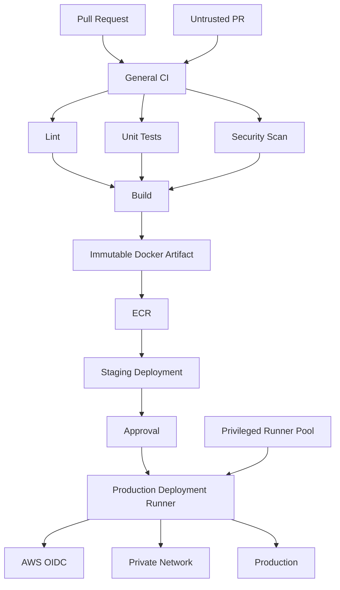

# 15- Self Hosted Runner Issues

## Overview

Self-hosted runners execute GitHub Actions jobs on infrastructure controlled by the organization rather than on GitHub-managed runner infrastructure.

They are useful when CI/CD requires:

- Private network access.
- Custom operating systems or software.
- Specialized hardware.
- Internal package repositories.
- Private databases or services.
- Custom Docker tooling.
- Access to AWS VPC resources.
- Controlled execution environments.
- Specialized deployment infrastructure.

They also introduce infrastructure responsibilities that do not exist to the same degree with GitHub-hosted runners:

```text
Runner lifecycle
    ↓
Registration
    ↓
Connectivity
    ↓
OS and toolchain
    ↓
Capacity
    ↓
Networking
    ↓
Security
    ↓
Isolation
    ↓
Patching
    ↓
Monitoring
    ↓
Replacement
```

A self-hosted runner should therefore be treated as production infrastructure, not simply as a machine with the GitHub Actions runner binary installed.

The core troubleshooting model is:

```text
Symptom
   ↓
Possible Causes
   ↓
Isolation Strategy
   ↓
Commands / Checks
   ↓
Root Cause
   ↓
Corrective Action
   ↓
Prevention
```

---

## Self-Hosted Runner Architecture

A typical execution flow is:



The important boundary is:

```text
GitHub
   ↓
Runner control plane
   ↓
Organization infrastructure
   ↓
Your private resources
```

A self-hosted runner may have access to resources that are otherwise unreachable from GitHub-hosted runners.

That makes runner compromise a potentially significant security event.

---

## GitHub-Hosted vs Self-Hosted Runners

| Capability | GitHub-hosted | Self-hosted |
|---|---|---|
| Infrastructure ownership | GitHub | Organization |
| OS management | GitHub | Organization |
| Software customization | Limited | Extensive |
| Private VPC access | Requires special architecture | Natural fit |
| Persistent state | Generally ephemeral | Possible |
| Custom networking | Limited | Full control |
| Maintenance | Lower | Higher |
| Security responsibility | Shared | Primarily organization |
| Capacity management | Managed | Organization-managed |
| Autoscaling | Platform-managed | Organization-managed |
| Hardware selection | Predefined | Custom |
| Failure modes | Mostly platform/job | Infrastructure + platform + job |

Self-hosted runners are primarily justified by requirements that cannot be handled effectively with GitHub-hosted runners.

---

## When to Use Self-Hosted Runners

Typical use cases include:

### Private Network Access

```text
GitHub Actions
      ↓
Self-hosted runner
      ↓
AWS VPC
      ├── RDS PostgreSQL
      ├── ElastiCache Redis
      ├── Internal APIs
      └── Private services
```

### Custom Tooling

Examples:

- Proprietary SDKs.
- Internal CLIs.
- Specialized compilers.
- Enterprise security tools.
- Custom test infrastructure.

### Specialized Hardware

Examples:

- GPUs.
- High-memory machines.
- ARM systems.
- Specialized build environments.

### Deployment Infrastructure

A restricted runner may deploy to:

- ECS.
- EC2.
- EKS.
- Private Kubernetes clusters.
- Internal APIs.
- Private infrastructure.

Deployment runners should generally be isolated from general CI workloads.

---

## When Self-Hosted Runners Create Problems

Self-hosted infrastructure introduces additional operational domains:

- Host provisioning.
- Runner registration.
- Software updates.
- Network connectivity.
- Capacity planning.
- Disk management.
- Process management.
- Security hardening.
- Credential handling.
- Autoscaling.
- Patching.
- Monitoring.
- Incident response.

A useful engineering rule is:

> Use self-hosted runners because you have a concrete infrastructure requirement, not simply because they appear more customizable.

---

## Runner Registration

A self-hosted runner must be registered with an appropriate GitHub scope.

Typical scopes include:

- Repository.
- Organization.
- Enterprise.

The scope determines where the runner can potentially be used.

A production organization might use:

```text
Organization
├── General CI runners
├── Integration runners
├── Private-network runners
└── Production deployment runners
```

### Registration Security

Registration credentials are sensitive.

Never store runner registration credentials in:

- Git repositories.
- Docker images.
- Public logs.
- Workflow source.
- AMI source files.
- Configuration committed to source control.

Prefer automated provisioning with short-lived registration material where supported by the chosen runner architecture.

---

## Runner Registration Failures

### Symptom

The runner cannot register.

### Possible Causes

- Incorrect repository or organization.
- Invalid registration credential.
- Registration credential expired.
- Network connectivity failure.
- Proxy configuration.
- DNS failure.
- TLS failure.
- Existing conflicting registration.
- Incorrect runner configuration.
- Host clock problems.

### Isolation Strategy

Check basic connectivity first:

```bash
getent hosts github.com
```

```bash
curl -I https://github.com
```

Check system time:

```bash
date
timedatectl status
```

Check the runner service:

```bash
sudo systemctl status actions.runner.*
```

Registration should not be debugged by repeatedly generating credentials without first determining whether the failure is authentication, configuration, or connectivity.

---

## Runner Offline Issues

### Symptom

GitHub shows the runner as offline.

### Possible Causes

- Runner service stopped.
- Host stopped.
- Runner process crashed.
- DNS failure.
- Outbound HTTPS blocked.
- Proxy failure.
- Network interface failure.
- Host resource exhaustion.
- Runner configuration corruption.

Check the process:

```bash
ps aux | grep Runner.Listener
```

Check the service:

```bash
sudo systemctl status actions.runner.*
```

Check connectivity:

```bash
curl -v https://github.com
```

Check DNS:

```bash
getent hosts github.com
```

### Corrective Action

Restart the service only after understanding the failure:

```bash
sudo systemctl restart actions.runner.<service>
```

For repeatedly failing hosts, replacement is often safer than indefinite repair.

---

## Runner Service Issues

A production runner should normally run as a managed service rather than from an interactive shell.

Check:

```bash
sudo systemctl status actions.runner.*
```

View recent logs:

```bash
sudo journalctl -u actions.runner.* --since "30 minutes ago"
```

Common service failures:

- Invalid configuration.
- Missing executable.
- Permission problems.
- User account removed.
- Working directory missing.
- Dependency unavailable.
- Host rebooted without service restart.

A healthy service should survive normal host reboots and automatically return the runner to service.

---

## Runner Labels

Labels describe runner capabilities.

Example:

```yaml
jobs:
  integration:
    runs-on:
      - self-hosted
      - linux
      - x64
      - integration
```

The runner must satisfy all required labels.

Example runner:

```text
self-hosted
linux
x64
docker
integration
```

can execute the job.

A runner with:

```text
self-hosted
linux
arm64
integration
```

cannot satisfy:

```text
x64
```

### Good Label Design

Prefer durable capability labels:

```text
linux
x64
docker
private-network
deployment
```

Avoid labels representing temporary state:

```text
busy
temporary
server-7
fixed-yesterday
```

Labels should communicate capabilities rather than operational history.

---

## Runner Group Issues

Runner groups provide an access-control layer around self-hosted runners.

A common production design is:

```text
Runner Groups
├── CI
├── Integration
├── Staging Deployment
└── Production Deployment
```

The production group can be restricted to repositories that are allowed to deploy production.

### Symptom

A workflow specifies correct labels but remains queued.

### Possible Causes

- Repository is not allowed to access the runner group.
- Organization policy blocks access.
- Enterprise policy restricts Actions.
- Runner is assigned to a different group.
- Label does not match the expected runner.

### Prevention

Treat runner groups as security boundaries, not simply as organizational folders.

---

## Runner Selection Troubleshooting

When a job is queued, inspect the complete selection chain:

```text
runs-on
   ↓
Labels
   ↓
Runner Group
   ↓
Repository Access
   ↓
Runner Online?
   ↓
Runner Capacity
```

For example:

```yaml
runs-on:
  - self-hosted
  - linux
  - x64
  - production
```

A runner can be:

```text
Online
```

and still not be eligible because its labels or group access do not match.

---

## GitHub CLI Runner Diagnostics

List repository runners:

```bash
gh api repos/OWNER/REPO/actions/runners
```

List organization runners:

```bash
gh api orgs/ORG/actions/runners
```

For JSON filtering:

```bash
gh api orgs/ORG/actions/runners \
  --jq '.runners[] | {name, status, busy, labels: [.labels[].name]}'
```

This can quickly reveal:

- Offline runners.
- Busy runners.
- Incorrect labels.
- Unexpected runner names.

---

## Operating System Issues

Self-hosted runners are only as reliable as their host environment.

Inspect the host:

```bash
uname -a
cat /etc/os-release
uname -m
```

Check the current user:

```bash
whoami
id
```

Check resources:

```bash
nproc
free -h
df -h
```

Common OS-related failures include:

- Unsupported OS.
- Missing system libraries.
- Incorrect permissions.
- Kernel incompatibility.
- Architecture mismatch.
- Missing shell.
- Package manager failure.
- Filesystem exhaustion.

---

## Linux Runner Issues

Linux is commonly used for backend CI/CD because it integrates well with Python, Docker, PostgreSQL, Redis, AWS CLI, Kubernetes, and Terraform.

Typical dependencies include:

```text
Python
Git
Docker
AWS CLI
kubectl
Terraform
Node.js
Build tools
```

Verify only the tools required by the workload:

```bash
python --version
git --version
docker --version
aws --version
kubectl version --client
terraform version
```

Do not assume that a tool exists because it was present on a previous runner image.

---

## Windows Runner Issues

Windows runners introduce additional failure domains:

- PowerShell semantics.
- Windows path syntax.
- Case-insensitive filesystem behavior.
- Different package managers.
- Different native dependencies.
- Line ending differences.
- Different executable names.

Example:

```yaml
- name: Run PowerShell
  shell: pwsh
  run: |
    $ErrorActionPreference = "Stop"
    Write-Host "Runner diagnostics"
```

Avoid assuming Bash commands are portable across operating systems.

---

## Architecture Mismatch

Check architecture:

```bash
uname -m
```

Typical results:

```text
x86_64
aarch64
```

Architecture affects:

- Python wheels.
- Native packages.
- Docker images.
- Compilers.
- Browser binaries.
- Build tools.
- Cross-compilation.

For multi-platform Docker builds:

```yaml
- uses: docker/setup-buildx-action@v3

- uses: docker/build-push-action@v6
  with:
    platforms: linux/amd64,linux/arm64
    push: true
```

The runner's architecture does not necessarily have to equal every target image architecture because Buildx can perform cross-platform builds.

---

## Toolchain Issues

### Symptom

A command cannot be found:

```text
command not found
```

Check:

```bash
command -v python
command -v python3
command -v docker
command -v aws
command -v kubectl
command -v terraform
```

Inspect:

```bash
echo "$PATH"
```

For Python:

```bash
python3 --version
python3 -m pip --version
```

For production reproducibility, explicitly install or provision required tool versions.

---

## Python Environment Issues

Backend projects frequently use Python, Django, FastAPI, Celery, and pytest.

Verify:

```bash
python --version
python -c "import sys; print(sys.executable)"
python -m pip --version
```

Avoid relying on:

```bash
pip install ...
```

Prefer:

```bash
python -m pip install -r requirements.txt
```

For Django:

```bash
python manage.py check
python manage.py test
```

For FastAPI:

```bash
pytest
```

A runner that has multiple Python installations can easily execute `pip` and `python` from different environments.

---

## Dependency Compilation Issues

Some Python packages require native libraries or compilers.

Examples include:

- PostgreSQL drivers.
- MySQL drivers.
- Cryptography dependencies.
- Image-processing libraries.
- Scientific libraries.

Check:

```bash
gcc --version
make --version
```

The correct system packages depend on the operating system and dependency.

For production runners, document these requirements in the runner image or provisioning configuration rather than manually installing them after every failure.

---

## Filesystem Issues

### Common Symptoms

```text
Permission denied
```

```text
No such file or directory
```

```text
No space left on device
```

Check:

```bash
pwd
ls -la
df -h
```

Check ownership:

```bash
ls -ld .
```

Check the runner workspace and temporary directories.

Avoid hard-coded developer paths.

Prefer GitHub workspace variables and repository-relative paths.

---

## Persistent Runner State

Persistent runners are a major source of non-deterministic failures.

A previous job can leave:

- Files.
- Processes.
- Docker containers.
- Docker images.
- Credentials.
- Virtual environments.
- Temporary databases.
- Modified configuration.
- Build output.

The next job may accidentally consume that state.


Symptoms often include:

- Works after manually cleaning the runner.
- Fails only on one runner.
- Fails intermittently.
- Different results across runners.

---

## Persistent Runner Cleanup

If persistent runners are required, implement explicit cleanup.

Examples:

```bash
docker ps -aq
```

```bash
docker system df
```

Clean only resources that the runner owns.

Avoid destructive commands such as:

```bash
docker system prune -a
```

without understanding whether other workloads depend on the same Docker host.

For sensitive workloads, ephemeral runners are generally easier to reason about.

---

## Ephemeral Runners

An ephemeral runner is provisioned for a limited workload and then destroyed or retired.

Typical lifecycle:



Advantages:

- Reduced state leakage.
- Lower dependency drift.
- Smaller compromise persistence window.
- Cleaner debugging.
- Better isolation.

Limitations:

- Provisioning latency.
- Infrastructure complexity.
- Image management.
- Autoscaling requirements.
- More sophisticated observability.

Ephemeral runners are especially useful for untrusted or high-sensitivity workloads.

---

## Runner Autoscaling Issues

A production runner fleet may dynamically scale based on demand.

```text
Queued Jobs
     ↓
Autoscaler
     ↓
Provision Runner
     ↓
Register
     ↓
Execute
     ↓
Terminate
```

Common failures:

- Autoscaler does not detect queued work.
- Instance provisioning fails.
- Cloud quota reached.
- Subnet IP addresses exhausted.
- Runner registration fails.
- Runner labels are incorrect.
- Bootstrap script fails.
- Image is unavailable.
- Runner startup is too slow.

Monitor:

```text
Queue time
Provisioning time
Registration time
Execution time
Termination time
```

---

## Autoscaling and Downstream Capacity

Runner scaling must account for dependent systems.

For example:

```text
50 integration runners
       ↓
50 PostgreSQL test environments
       ↓
Database resource exhaustion
```

Or:

```text
100 build jobs
       ↓
100 concurrent ECR operations
       ↓
Registry/API pressure
```

Scaling runners without capacity planning can increase failure rates.

---

## Runner Resource Issues

### Disk

```bash
df -h
```

### Memory

```bash
free -h
```

### CPU

```bash
nproc
uptime
```

### Processes

```bash
ps aux --sort=-%cpu | head
ps aux --sort=-%mem | head
```

### Docker

```bash
docker system df
```

A runner that is online but resource-starved should be treated as unhealthy.

---

## Disk Exhaustion

### Symptom

```text
No space left on device
```

Check:

```bash
df -h
```

Find large directories:

```bash
sudo du -xh /var | sort -h | tail -n 20
```

Docker is often a significant source:

```bash
docker system df
```

Potential sources include:

- Docker layers.
- BuildKit cache.
- Old images.
- Test artifacts.
- Logs.
- Workspaces.
- Package caches.

Prevention:

- Monitor disk usage.
- Use cleanup policies.
- Replace ephemeral runners.
- Limit Docker cache growth.
- Size runner disks appropriately.

---

## Memory Exhaustion

### Symptom

A process disappears unexpectedly or reports an out-of-memory condition.

Check:

```bash
free -h
```

Inspect processes:

```bash
ps aux --sort=-%mem | head
```

Check kernel messages where appropriate:

```bash
dmesg | grep -i -E 'oom|out of memory'
```

Potential causes include:

- Large Docker builds.
- Parallel pytest execution.
- Large matrix workloads.
- Multiple service containers.
- Browser-based E2E tests.
- Excessive application workers.

Increasing runner size may help, but first identify which process consumes memory.

---

## CPU Exhaustion

Check:

```bash
nproc
```

and:

```bash
uptime
```

Inspect processes:

```bash
ps aux --sort=-%cpu | head
```

CPU pressure commonly appears during:

- Docker builds.
- Compilation.
- Parallel test suites.
- Compression.
- Browser tests.
- Static analysis.

Use matrix `max-parallel` when downstream capacity or runner CPU is constrained.

---

## Process and Port Conflicts

Persistent runners can contain orphaned processes.

Example symptom:

```text
Address already in use
```

Check:

```bash
ss -lntp
```

For port `8000`:

```bash
sudo lsof -i :8000
```

For Python processes:

```bash
ps aux | grep -E 'uvicorn|gunicorn'
```

CI jobs should clean up background processes they start.

---

## Network Troubleshooting

Use layered diagnostics.

### DNS

```bash
getent hosts github.com
```

### Route

```bash
ip route
```

### TCP

```bash
nc -vz example.com 443
```

### HTTPS

```bash
curl -v https://example.com
```

Interpret failures carefully:

| Failure | Likely domain |
|---|---|
| DNS resolution failure | DNS |
| Timeout | Routing/firewall/security group |
| Connection refused | Target/service |
| TLS error | Certificate/TLS |
| HTTP 401/403 | Authentication/authorization |
| HTTP 5xx | Remote service |

---

## Private Network Access

One of the primary reasons to use self-hosted runners is private network access.

Example:

```text
GitHub
   ↓
Self-hosted runner
   ↓
AWS VPC
   ├── Private subnet
   │     ├── RDS
   │     └── Redis
   │
   └── Internal services
```

Verify each layer:

```text
Runner
 ↓
Network interface
 ↓
Route table
 ↓
Security group
 ↓
NACL
 ↓
DNS
 ↓
Target port
 ↓
Application
```

Do not treat a private-network failure as an application authentication problem until network connectivity has been established.

---

## Security Groups and Network ACLs

For AWS-hosted self-hosted runners, inspect:

- Security groups.
- Network ACLs.
- Route tables.
- Subnets.
- NAT gateways.
- VPC endpoints.
- DNS configuration.

For PostgreSQL:

```text
Runner → TCP 5432 → PostgreSQL
```

For Redis:

```text
Runner → TCP 6379 → Redis
```

For HTTPS APIs:

```text
Runner → TCP 443 → API
```

The target resource must permit traffic from the runner's network identity.

---

## PostgreSQL Issues

For integration testing:

```bash
pg_isready -h postgres.internal -p 5432
```

Check connectivity:

```bash
nc -vz postgres.internal 5432
```

Common causes:

- Wrong endpoint.
- Wrong port.
- Security group restriction.
- DNS failure.
- Database unavailable.
- Authentication failure.
- TLS mismatch.

Separate:

```text
Connection timeout
```

from:

```text
Authentication failed
```

because they indicate different failure domains.

---

## Redis Issues

Check:

```bash
nc -vz redis.internal 6379
```

If available:

```bash
redis-cli -h redis.internal ping
```

Expected:

```text
PONG
```

Common causes:

- Wrong endpoint.
- Network restriction.
- Authentication.
- TLS mismatch.
- Redis unavailable.

---

## Docker Issues on Self-Hosted Runners

Check:

```bash
docker version
docker info
```

Check daemon:

```bash
sudo systemctl status docker
```

Check socket:

```bash
ls -l /var/run/docker.sock
```

Typical errors:

```text
Cannot connect to the Docker daemon
```

```text
permission denied while trying to connect to the Docker daemon socket
```

### Security Consideration

Docker socket access can provide highly privileged host access.

A runner that exposes Docker to untrusted workflow code should therefore be treated as a high-risk execution environment.

---

## Docker Build Failures

Separate:

```text
Runner
 ↓
Docker daemon
 ↓
BuildKit / Buildx
 ↓
Build context
 ↓
Base image registry
 ↓
Build
 ↓
Target registry
```

Check:

```bash
docker buildx ls
docker system df
df -h
```

A Docker build failure caused by disk exhaustion is different from a registry authentication failure.

---

## AWS OIDC Issues

A self-hosted runner can use GitHub OIDC for short-lived AWS credentials.

Required workflow permission:

```yaml
permissions:
  id-token: write
  contents: read
```

Then validate identity:

```bash
aws sts get-caller-identity
```

The authentication path is:

```text
GitHub Workflow
   ↓
OIDC Token
   ↓
AWS STS
   ↓
IAM Trust Policy
   ↓
Temporary Credentials
   ↓
AWS API
```

Troubleshoot from left to right.

Do not begin with ECR permissions before confirming that the expected IAM role was actually assumed.

---

## EC2 Runner Issues

A common deployment architecture is:

```text
GitHub Actions
      ↓
EC2 Self-Hosted Runner
      ↓
AWS VPC
      ├── RDS
      ├── ElastiCache
      ├── ECR
      └── Internal APIs
```

Check:

```bash
hostname
curl -s http://169.254.169.254/latest/meta-data/instance-id
```

Also inspect:

- Instance status.
- Security groups.
- IAM instance profile.
- Disk.
- CPU.
- Memory.
- Network routes.
- Runner service.

For production systems, prefer IMDSv2 and minimize access to instance metadata from untrusted processes.

---

## AWS Identity Confusion

An EC2 self-hosted runner may have an instance profile while the GitHub workflow also uses OIDC.

These are separate credential sources.

Potential identities include:

```text
EC2 Instance Profile
```

and:

```text
GitHub OIDC → STS → IAM Role
```

If AWS permissions appear unexpectedly, determine which identity supplied them.

Always verify:

```bash
aws sts get-caller-identity
```

This should be part of AWS deployment diagnostics.

---

## Kubernetes Runner Issues

Before debugging the Kubernetes workload, verify the runner can reach the cluster.

```bash
kubectl version --client
kubectl config current-context
kubectl cluster-info
```

Then:

```bash
kubectl get nodes
```

Failure isolation:

```text
Runner
 ↓
kubectl binary
 ↓
Credentials
 ↓
Network
 ↓
Kubernetes API
 ↓
RBAC
 ↓
Deployment
```

A runner with no route to the Kubernetes API cannot be fixed by modifying the Deployment manifest.

---

## Terraform Runner Issues

Verify:

```bash
terraform version
```

Then:

```bash
terraform init
terraform validate
```

For AWS:

```bash
aws sts get-caller-identity
```

Potential runner failures include:

- Incorrect Terraform version.
- Missing provider.
- Backend unreachable.
- State lock unavailable.
- AWS identity incorrect.
- Private endpoint inaccessible.
- Disk exhaustion.
- Corrupt local plugin cache.

Keep infrastructure state external to the runner.

A runner should be disposable.

---

## Secrets on Self-Hosted Runners

Self-hosted runners can access secrets supplied to the workflow.

This makes runner trust especially important.

Avoid exposing secrets through:

```bash
echo "$SECRET"
```

or:

```bash
some-command --password "$SECRET"
```

where process arguments or logs may expose the value.

Do not persist secrets in:

- Workspace files.
- Docker images.
- Temporary files without cleanup.
- Global shell configuration.
- Persistent runner directories.

Use short-lived credentials whenever possible.

---

## GITHUB_TOKEN Permissions

Runner isolation does not replace workflow permission controls.

Use least privilege:

```yaml
permissions:
  contents: read
```

For AWS OIDC:

```yaml
permissions:
  contents: read
  id-token: write
```

Do not grant broad write permissions simply because the workflow runs on a trusted runner.

The runner and GitHub token are separate security boundaries that should both be minimized.

---

## Untrusted Pull Requests

A particularly dangerous architecture is:

```text
Untrusted Pull Request
       ↓
Persistent Self-Hosted Runner
       ↓
Private Network
       ↓
AWS Credentials
```

The pull request code executes on infrastructure with access to sensitive resources.

Prefer:

```text
Untrusted PR
    ↓
Isolated CI Runner
    ↓
Tests
```

Then:

```text
Trusted Build
    ↓
Immutable Artifact
    ↓
Restricted Deployment Runner
    ↓
Production
```

This separation significantly reduces blast radius.

---

## Third-Party Actions on Self-Hosted Runners

Third-party actions execute on the runner.

A compromised action may potentially access resources available to the job.

Controls should include:

- Action allowlists.
- SHA pinning.
- Least-privilege permissions.
- Restricted secrets.
- Runner isolation.
- Separate deployment runners.
- Ephemeral execution where appropriate.

A trusted runner does not make an untrusted action safe.

---

## Runner Isolation Strategy

A mature organization can divide runners into trust zones:

```text
Runner Platform
│
├── Untrusted CI
│   ├── Pull requests
│   └── Public contribution workflows
│
├── Trusted CI
│   ├── Main branch
│   └── Release builds
│
├── Integration
│   ├── PostgreSQL
│   └── Redis
│
└── Deployment
    ├── Staging
    └── Production
```

Each zone can have different:

- Network access.
- Secrets.
- IAM roles.
- Runner groups.
- Labels.
- Permissions.
- Lifecycle policies.

---

## Runner Image Management

Treat runner images as versioned infrastructure.

A runner image might contain:

```text
Ubuntu
Python
Docker
AWS CLI
kubectl
Terraform
Build tools
Security tooling
```

The image should be:

```text
Defined as code
      ↓
Built
      ↓
Scanned
      ↓
Validated
      ↓
Released
      ↓
Used by runners
```

Avoid manually modifying production runners.

---

## Runner Drift

Drift occurs when the actual runner differs from the expected runner configuration.

Examples:

```text
Expected Python 3.12
Actual Python 3.11

Expected Docker version X
Actual Docker version Y

Expected packages A/B/C
Actual packages A/B/C/D/E
```

Drift can explain why:

```text
Runner A succeeds
Runner B fails
```

Prevent it through:

- Immutable images.
- Infrastructure as Code.
- Automated provisioning.
- Versioned dependencies.
- Runner replacement.
- Configuration validation.

---

## Runner Replacement

Replacement should be a normal lifecycle operation.

A healthy fleet should support:

```text
Drain
  ↓
Stop accepting workloads
  ↓
Complete running job
  ↓
Terminate
  ↓
Provision replacement
  ↓
Register
  ↓
Validate
```

This is safer than continuously patching long-lived machines.

---

## Runner Updates

Runner software should be kept current according to the organization's update policy.

Before updating production runners:

- Validate compatibility.
- Test representative workflows.
- Roll out gradually.
- Monitor failures.
- Keep rollback/replacement capability.

For immutable runner fleets, updating usually means releasing a new image and replacing old instances.

---

## Runner Health Validation

A runner health check should validate more than:

```text
Runner = Online
```

Useful checks include:

```text
Runner online
Runner service active
Disk healthy
Memory available
CPU capacity
Docker healthy
Required tools available
DNS works
HTTPS works
Private network works
Expected image version
Expected architecture
```

A runner can be online while being operationally unusable.

---

## Runner Monitoring

Monitor self-hosted runners as infrastructure.

Recommended signals:

| Metric | Purpose |
|---|---|
| Online runners | Availability |
| Offline runners | Fleet health |
| Busy runners | Utilization |
| Queue time | Capacity pressure |
| Job duration | Performance |
| Job failure rate | Reliability |
| CPU | Resource pressure |
| Memory | Resource pressure |
| Disk | Storage pressure |
| Provisioning time | Autoscaling health |
| Registration failures | Bootstrap health |
| Network errors | Connectivity |
| Runner image version | Drift detection |

A useful operational dashboard is:

```text
Runner Fleet
├── Online
├── Offline
├── Busy
├── Idle
├── Queue Depth
├── Queue Time
├── Failure Rate
├── CPU
├── Memory
└── Disk
```

---

## Runner Logging

Collect runner-side logs separately from workflow logs.

Workflow logs answer:

```text
What did the workflow execute?
```

Runner logs help answer:

```text
Why could the runner not execute it?
```

For Linux services:

```bash
sudo journalctl -u actions.runner.* --since "1 hour ago"
```

Correlate:

```text
Workflow run ID
+
Job
+
Runner name
+
Runner logs
+
Host metrics
```

This significantly improves incident investigation.

---

## Production Runner Reliability

Runner reliability should favor disposable infrastructure.

Preferred:

```text
Versioned image
      ↓
Automated provisioning
      ↓
Health validation
      ↓
Registration
      ↓
Execution
      ↓
Termination
```

Less desirable:

```text
Long-lived server
      ↓
Manual changes
      ↓
Package drift
      ↓
Stale state
      ↓
Intermittent failures
```

The goal is not to make a particular server survive forever. The goal is to make runner capacity recover automatically.

---

## High Availability

Avoid making one runner a single point of failure.

Instead:

```text
Runner Pool
├── Runner A
├── Runner B
├── Runner C
└── Runner D
```

For deployment workloads:

```text
Production Deployment Pool
├── Runner A
└── Runner B
```

The exact capacity should be based on deployment concurrency and recovery requirements.

For highly available CI infrastructure, the provisioning mechanism itself should also be redundant.

---

## Disaster Recovery

Runner disaster recovery should focus on restoring execution capability rather than recovering a specific runner.

Back up or version:

- Runner image definitions.
- Provisioning code.
- Infrastructure configuration.
- Network configuration.
- IAM definitions.
- Runner group configuration.
- Deployment workflow definitions.

Do not treat a runner's local filesystem as a source of truth.

A disposable runner should be reconstructable from code.

---

## Cost Optimization

Self-hosted runners can reduce or change CI infrastructure cost, but they introduce operational overhead.

Cost drivers include:

- Instance size.
- Number of runners.
- Idle capacity.
- Storage.
- NAT traffic.
- Docker registry traffic.
- Autoscaling infrastructure.
- Monitoring.
- Maintenance.

Useful strategies:

- Ephemeral runners.
- Autoscaling.
- Right-sized instances.
- Appropriate caching.
- Matrix `max-parallel`.
- Runner pools by workload.
- Automatic scale-down.
- Spot capacity where workloads tolerate interruption.

Do not use cheaper persistent infrastructure if it creates unacceptable security or reliability risk.

---

## Concurrency and Self-Hosted Runners

Runner capacity and workflow concurrency solve different problems.

```text
Runner capacity
→ How many jobs can physically execute?

Concurrency
→ How many jobs should logically execute together?
```

Example:

```yaml
concurrency:
  group: production-deployment
  cancel-in-progress: false
```

This prevents concurrent production deployments from racing.

For CI:

```yaml
concurrency:
  group: ci-${{ github.workflow }}-${{ github.ref }}
  cancel-in-progress: true
```

Use different policies for CI and production deployment.

---

## Matrix Workloads

Matrices can create sudden runner demand.

Example:

```yaml
strategy:
  matrix:
    python: ["3.11", "3.12", "3.13"]
    database: ["postgres", "mysql"]
```

This creates six combinations.

If the runner pool has only two matching runners:

```text
6 jobs
↓
2 execute
↓
4 queued
```

Use:

```yaml
strategy:
  max-parallel: 2
```

when runner or dependency capacity requires controlled concurrency.

---

## Backend Integration Testing

A typical Python backend pipeline may require:

```text
Self-hosted runner
      ↓
Python
      ↓
PostgreSQL
      ↓
Redis
      ↓
Django/FastAPI
      ↓
pytest
      ↓
Coverage
      ↓
Artifacts
```

If tests fail, isolate in order:

1. Runner available.
2. Python available.
3. Dependencies installed.
4. PostgreSQL reachable.
5. Redis reachable.
6. Application starts.
7. Tests execute.

This avoids debugging application code when the runner infrastructure is actually failing.

---

## Celery Runner Considerations

If integration tests involve Celery:

```text
Runner
 ├── Application
 ├── PostgreSQL
 ├── Redis
 └── Celery worker
```

Potential issues:

- Redis unreachable.
- Worker process not started.
- Port conflict.
- Orphaned worker.
- Incorrect broker URL.
- Insufficient CPU.
- Persistent state.

Check processes:

```bash
ps aux | grep celery
```

Check Redis:

```bash
redis-cli ping
```

For ephemeral CI environments, prefer starting and stopping all supporting processes within the job lifecycle.

---

## Kafka Runner Considerations

Kafka-based integration testing adds additional resource and readiness requirements.

Potential failures:

- Broker unavailable.
- Listener misconfiguration.
- DNS mismatch.
- Port conflict.
- Insufficient memory.
- Slow startup.
- Persistent broker state.

Do not treat a Kafka readiness failure as a test assertion failure.

Establish infrastructure readiness before executing the test suite.

---

## Private Package Registry Issues

Self-hosted runners may access internal package repositories.

For Python:

```bash
python -m pip install -r requirements.txt
```

Potential failures:

- DNS.
- TLS.
- Authentication.
- Repository availability.
- Proxy.
- Certificate trust.
- Network routing.

Separate:

```text
Runner → Registry connectivity
```

from:

```text
Package → Dependency resolution
```

---

## Common Self-Hosted Runner Mistakes

### Using one runner for everything

This increases blast radius.

### Giving CI runners production credentials

General CI should not automatically inherit production access.

### Running untrusted PRs on privileged runners

This can expose private infrastructure.

### Treating persistent runners as disposable

Persistent state can contaminate subsequent jobs.

### Installing tools manually

Manual changes create drift.

### Ignoring runner capacity

Large matrices can overload a small pool.

### Scaling runners without scaling dependencies

PostgreSQL, Redis, ECR, or internal APIs may become the bottleneck.

### Logging secrets during diagnostics

Infrastructure debugging must preserve credential confidentiality.

### Using the runner as a data store

Artifacts and state should live in appropriate external systems.

### Treating runner online status as health

Online only means the runner is connected to GitHub.

---

## Troubleshooting Decision Tree



This avoids jumping directly from a failed application step to application code changes.

---

## Production Failure-Domain Matrix

| Symptom | Failure Domain | First Check |
|---|---|---|
| Job queued | Scheduling | Labels/groups/capacity |
| Runner offline | Runner service | Service/process/network |
| Runner unavailable | Infrastructure | Host status |
| Command missing | Toolchain | `command -v` |
| Permission denied | OS/filesystem | User/permissions |
| No disk space | Storage | `df -h` |
| Process killed | Memory/CPU | `free -h`, process list |
| DNS failure | Network | `getent hosts` |
| Timeout | Routing/firewall | `ip route`, `nc` |
| TLS failure | TLS | `curl -v` |
| Docker unavailable | Runtime | `docker info` |
| ECR access failure | AWS identity | `aws sts get-caller-identity` |
| Kubernetes unavailable | Network/auth | `kubectl cluster-info` |
| Only one runner fails | Drift | Compare runner environments |
| Intermittent failures | State/capacity | Resource and workspace state |
| PR creates security risk | Trust boundary | Runner permissions/network |

---

## Production Troubleshooting Runbook

### Identify the runner

Record:

- Runner name.
- Runner group.
- Labels.
- OS.
- Architecture.
- Hosted/self-hosted status.

### Confirm scheduling

Determine whether the job:

- Started.
- Is queued.
- Was skipped.
- Could not find a runner.

### Check runner health

```bash
hostname
uname -a
df -h
free -h
nproc
```

### Check required tools

```bash
python --version
docker --version
git --version
```

### Check network

```bash
getent hosts github.com
curl -I https://github.com
```

Then check the actual dependency.

### Check credentials

AWS:

```bash
aws sts get-caller-identity
```

Kubernetes:

```bash
kubectl config current-context
kubectl cluster-info
```

### Check workspace

```bash
pwd
ls -la
git status
```

### Check persistent state

```bash
docker ps -a
```

```bash
ps aux
```

### Reproduce the smallest failing operation

Avoid repeatedly rerunning the entire pipeline without evidence.

### Document the root cause

Use:

```text
Symptom
Cause
Evidence
Corrective Action
Prevention
```

---

## Production CI/CD Runner Architecture

A secure production architecture can be organized as:



The key separation is:

```text
General CI
    ↓
Immutable artifact
    ↓
Restricted deployment runner
    ↓
Production
```

This minimizes the privileges available to arbitrary workflow code.

---

## Runner Governance

At organization scale, define standards for:

### Ownership

Every runner pool should have an owner.

### Naming

Use predictable names:

```text
ci-linux-x64-001
integration-linux-x64-001
deploy-prod-linux-x64-001
```

### Labels

Define controlled label conventions.

### Runner Groups

Use groups to establish access boundaries.

### Images

Maintain versioned runner images.

### Lifecycle

Define:

- Provisioning.
- Updating.
- Draining.
- Replacement.
- Retirement.

### Security

Define:

- Allowed workflows.
- Network access.
- IAM roles.
- Secrets.
- Action policies.
- Logging.

---

## Runner Inventory

Maintain inventory containing:

| Field | Example |
|---|---|
| Runner | `deploy-prod-01` |
| Group | `production-deployment` |
| OS | Ubuntu |
| Architecture | x64 |
| Image | `runner-2026.09` |
| Network | Private VPC |
| IAM role | Deployment role |
| Docker | Enabled |
| Lifecycle | Ephemeral |
| Owner | Platform Engineering |

Inventory helps identify:

- Orphaned runners.
- Outdated images.
- Excess capacity.
- Unauthorized access.
- Configuration drift.

---

## Security Architecture

The strongest security model separates privileges:

```text
Untrusted PR
   ↓
Minimal permissions
   ↓
Isolated runner
   ↓
No production credentials
   ↓
No production network

Trusted build
   ↓
Artifact creation
   ↓
Provenance / SBOM / signing
   ↓
Restricted deployment runner
   ↓
OIDC
   ↓
Production
```

Security should be enforced at multiple layers:

- GitHub permissions.
- Runner groups.
- Network boundaries.
- IAM.
- Environment protection.
- Action trust.
- Artifact integrity.
- Runner lifecycle.

---

## Runner Incident Response

If a self-hosted runner is suspected of compromise:

1. Stop assigning new workloads to the runner.
2. Isolate the host if required.
3. Preserve relevant logs and metadata.
4. Identify workflows that executed on it.
5. Identify credentials available to those jobs.
6. Rotate potentially exposed credentials.
7. Review AWS/IAM activity.
8. Review repository and workflow activity.
9. Replace the runner rather than trusting a manually cleaned host.
10. Identify and remove the original attack path.
11. Rebuild from a trusted runner image.
12. Validate the new runner before returning it to service.

For ephemeral infrastructure, terminating the affected runner is often preferable to attempting to prove that the host has been completely cleaned.

---

## Senior Design Principles

A senior engineer should reason about self-hosted runners using these principles:

### Runner is infrastructure

Treat the runner like any other production infrastructure component.

### Runner is part of the trust boundary

Anything executed on the runner inherits the runner's capabilities.

### Disposable is safer than stateful

Ephemeral infrastructure reduces hidden state and persistence.

### Build once, promote many

The deployment runner should deploy an immutable artifact rather than rebuild source code.

### Separate trust zones

General CI, integration testing, and production deployment should not automatically share the same runner privileges.

### Capacity is end-to-end

Runner capacity must be considered together with databases, registries, APIs, and cloud quotas.

### Infrastructure should be reproducible

A runner should be reconstructable from code and a versioned image.

---

## Senior Interview Scenarios

### Production deployment runner is offline

Explain how you would distinguish:

```text
Host failure
vs
Runner service failure
vs
Network failure
vs
GitHub connectivity failure
```

### Integration tests work on one runner but fail on another

Investigate:

```text
OS
Python
Dependencies
Docker
Disk
Memory
Network
Caches
Workspace
Image version
```

### A matrix suddenly creates hundreds of queued jobs

Discuss:

- Matrix cardinality.
- Runner capacity.
- `max-parallel`.
- Autoscaling.
- PostgreSQL/Redis capacity.
- Cloud API limits.
- Cost.

### A self-hosted runner has private AWS access

Explain why running arbitrary pull request code on that runner creates a security risk.

### Production deployment must use private network resources

Design:

```text
GitHub Actions
→ restricted runner group
→ private VPC
→ OIDC
→ IAM
→ immutable artifact
→ deployment
```

### Docker builds consume all runner disk

Explain how you would diagnose:

```text
Workspace
→ Docker images
→ BuildKit cache
→ containers
→ logs
```

and prevent recurrence.

### AWS deployment fails with AccessDenied

Start with:

```bash
aws sts get-caller-identity
```

Then determine:

```text
OIDC
→ STS
→ IAM trust
→ IAM permissions
→ AWS resource policy
```

### A compromised third-party action executes on a self-hosted runner

Discuss:

- Runner isolation.
- GITHUB_TOKEN permissions.
- Secrets.
- OIDC.
- Network access.
- Persistent state.
- Action pinning.
- Runner replacement.
- Credential rotation.

---

## Production Checklist

### Runner Configuration

- [ ] Runner scope is appropriate.
- [ ] Labels are standardized.
- [ ] Runner groups are restricted.
- [ ] Naming convention is defined.
- [ ] Runner ownership is documented.

### Infrastructure

- [ ] Runner image is versioned.
- [ ] Provisioning is automated.
- [ ] Required tools are deterministic.
- [ ] CPU is sufficient.
- [ ] Memory is sufficient.
- [ ] Disk is monitored.
- [ ] Architecture is intentional.

### Networking

- [ ] DNS works.
- [ ] GitHub connectivity works.
- [ ] Required private routes exist.
- [ ] Security groups are restrictive.
- [ ] Network ACLs are appropriate.
- [ ] Private resources are reachable only where required.

### Security

- [ ] Runner groups enforce trust boundaries.
- [ ] General CI cannot access production unnecessarily.
- [ ] Pull request workloads do not use privileged runners.
- [ ] GITHUB_TOKEN permissions use least privilege.
- [ ] AWS uses OIDC where appropriate.
- [ ] IAM roles are least privileged.
- [ ] Docker socket access is controlled.
- [ ] Secrets are not persisted.
- [ ] Third-party actions are governed.

### Reliability

- [ ] Runner health is monitored.
- [ ] Queue time is monitored.
- [ ] Capacity is monitored.
- [ ] Autoscaling is tested where used.
- [ ] Runner replacement is automated.
- [ ] Disaster recovery is documented.
- [ ] Runner state is not treated as persistent data.

### Operations

- [ ] Runner logs are available.
- [ ] Host metrics are available.
- [ ] Runner inventory is maintained.
- [ ] Image updates are controlled.
- [ ] Old runners are retired.
- [ ] Incident procedures exist.

---

## Key Takeaways

- Self-hosted runners are infrastructure and security boundaries, not merely machines that execute GitHub Actions jobs.
- The most important production controls are runner-group isolation, least-privilege permissions, private-network segmentation, deterministic runner images, and ephemeral or replaceable infrastructure.
- Troubleshoot runners from the outside in: scheduling and labels, runner service, host resources, tools, filesystem, networking, credentials, containers, and finally the application.
- Privileged deployment runners should be separated from untrusted pull request and general CI workloads to limit the blast radius of compromised code or actions.
- A reliable self-hosted runner platform is reproducible and observable: runners should be provisioned, monitored, drained, replaced, and recovered through automation rather than manual repair.