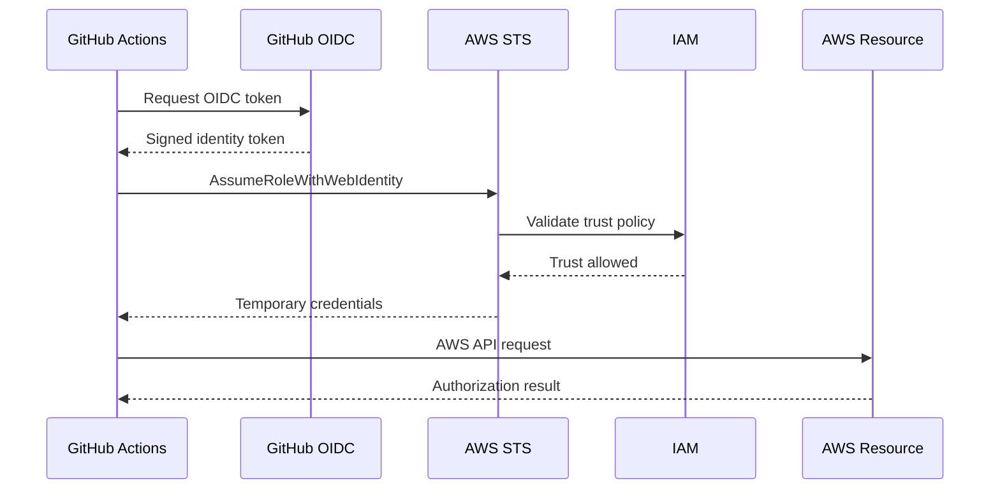
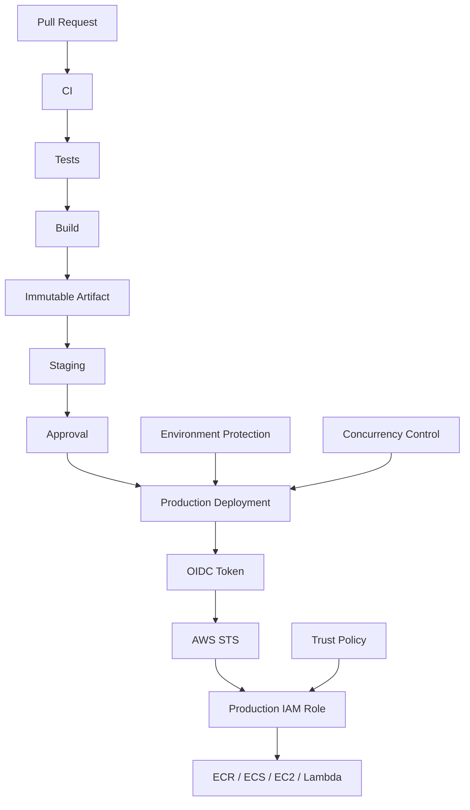

# 16- OIDC and AWS Authentication Issues

## Overview

GitHub Actions commonly authenticates with AWS using OpenID Connect (OIDC) rather than long-lived AWS access keys.

The production authentication flow is:

```text
GitHub Actions Job
      ↓
GitHub OIDC Token
      ↓
AWS IAM OIDC Provider
      ↓
IAM Role Trust Policy
      ↓
AWS STS AssumeRoleWithWebIdentity
      ↓
Temporary AWS Credentials
      ↓
AWS API
```

This design removes the need to store long-lived AWS access keys in GitHub secrets.

However, OIDC authentication introduces several independent failure domains:

```text
Workflow
   ↓
Permissions
   ↓
OIDC token
   ↓
IAM trust policy
   ↓
STS
   ↓
Temporary credentials
   ↓
IAM permissions
   ↓
AWS resource
```

A useful troubleshooting principle is:

> Prove each authentication layer independently before debugging the next layer.

For example, an `AccessDenied` error from ECR does not necessarily mean the ECR policy is wrong. The workflow may have assumed the wrong IAM role, or OIDC trust may have produced credentials for an unexpected identity.

---

## OIDC Authentication Architecture

GitHub Actions requests an OIDC identity token from GitHub.

The workflow then presents that token to AWS STS.

AWS validates:

- Token issuer.
- Token audience.
- Token subject.
- IAM trust policy conditions.
- OIDC provider configuration.

If validation succeeds, STS returns temporary credentials.



The authentication and authorization stages are distinct:

```text
OIDC + STS
    =
Authentication / role assumption

IAM permissions
    =
Authorization to AWS resources
```

Confusing these two stages is one of the most common troubleshooting mistakes.

---

## Basic GitHub OIDC Configuration

A workflow must explicitly request the OIDC permission:

```yaml
permissions:
  contents: read
  id-token: write
```

Then configure AWS credentials:

```yaml
- name: Configure AWS credentials
  uses: aws-actions/configure-aws-credentials@v6
  with:
    role-to-assume: arn:aws:iam::123456789012:role/github-actions-deploy
    aws-region: ap-south-1
```

Validate the resulting identity:

```yaml
- name: Verify AWS identity
  run: aws sts get-caller-identity
```

A production workflow should usually verify identity before performing deployment operations.

---

## Authentication Failure Domains

| Layer | Example failure |
|---|---|
| Workflow | Missing `id-token: write` |
| OIDC | Token unavailable |
| IAM provider | Incorrect provider |
| Trust policy | Subject/audience mismatch |
| STS | `AccessDenied` during role assumption |
| Credentials | Wrong or expired credentials |
| IAM permissions | `AccessDenied` on AWS API |
| Resource policy | Resource-level denial |
| Network | AWS endpoint unreachable |
| Tooling | AWS CLI/action misconfiguration |

This classification makes troubleshooting much faster.

---

## The First Diagnostic Command

After configuring AWS credentials:

```bash
aws sts get-caller-identity
```

Typical output:

```json
{
  "UserId": "AROA...",
  "Account": "123456789012",
  "Arn": "arn:aws:sts::123456789012:assumed-role/github-actions-deploy/GitHubActions"
}
```

This answers three critical questions:

- Did AWS authentication succeed?
- Which AWS account was reached?
- Which role was assumed?

If this command fails, do not start troubleshooting ECR, ECS, S3, or Lambda permissions yet.

---

## Authentication vs Authorization

Consider:

```bash
aws sts get-caller-identity
```

succeeds, but:

```bash
aws ecr describe-repositories
```

fails with:

```text
AccessDeniedException
```

The OIDC authentication path may be functioning correctly.

The remaining problem is likely:

```text
Temporary credentials
       ↓
IAM permissions
       ↓
ECR authorization
```

Compare that with:

```text
Not authorized to perform sts:AssumeRoleWithWebIdentity
```

This usually points toward:

```text
OIDC provider
or
IAM trust policy
or
GitHub token claims
```

---

## Missing `id-token: write`

### Symptom

The credentials action cannot obtain an OIDC token.

### Cause

The workflow does not have permission to request an identity token.

Incorrect:

```yaml
permissions:
  contents: read
```

Correct:

```yaml
permissions:
  contents: read
  id-token: write
```

The permission is intentionally explicit because OIDC provides access to external cloud identity.

### Production Recommendation

Keep permissions minimal:

```yaml
permissions:
  contents: read
  id-token: write
```

Do not use:

```yaml
permissions: write-all
```

just to make authentication work.

---

## Job-Level Permissions

Permissions can be scoped to the deployment job.

```yaml
jobs:
  test:
    permissions:
      contents: read

  deploy:
    permissions:
      contents: read
      id-token: write
```

This prevents unrelated jobs from requesting AWS OIDC tokens.

A useful architecture is:

```text
Lint
  ↓
Unit Tests
  ↓
Build
  ↓
Deploy Job
  ├── contents: read
  └── id-token: write
```

The deployment privilege is therefore isolated to the job that needs it.

---

## Reusable Workflow Permissions

Reusable workflows introduce another boundary.

Caller:

```yaml
jobs:
  deploy:
    uses: organization/platform/.github/workflows/deploy.yml@v1
    permissions:
      contents: read
      id-token: write
```

The reusable workflow must be designed to accept and use the required permissions.

When debugging OIDC through reusable workflows, inspect both:

```text
Caller workflow
        ↓
Reusable workflow
        ↓
Deployment job
        ↓
OIDC request
```

Do not assume that adding permissions to an unrelated caller job changes the permissions of the actual deployment job.

---

## OIDC Provider Configuration

AWS requires an IAM OIDC identity provider corresponding to GitHub's OIDC issuer.

Conceptually:

```text
GitHub OIDC issuer
        ↓
IAM OIDC Provider
        ↓
IAM Role Trust Policy
```

If the provider is missing or incorrectly configured, role assumption can fail before AWS evaluates the role's normal permissions.

Typical checks include:

- Provider URL.
- Audience.
- Thumbprint/configuration as applicable.
- Provider exists in the expected AWS account.
- Trust policy references the correct provider ARN.

---

## Wrong AWS Account

A surprisingly common failure is authenticating successfully against the wrong account.

Example:

```text
Expected:
123456789012

Actual:
987654321098
```

Always run:

```bash
aws sts get-caller-identity
```

Do not infer the account from:

- Repository name.
- AWS region.
- IAM role name.
- Environment name.

Account identity should be verified directly.

---

## Wrong IAM Role

The workflow may assume:

```text
github-actions-staging
```

when production requires:

```text
github-actions-production
```

Verify:

```bash
aws sts get-caller-identity
```

Inspect the returned ARN.

Expected:

```text
arn:aws:sts::123456789012:assumed-role/github-actions-production/...
```

Unexpected:

```text
arn:aws:sts::123456789012:assumed-role/github-actions-staging/...
```

The problem is role selection, not necessarily the role's permissions.

---

## IAM Trust Policy

The trust policy controls who may assume the role.

Conceptually:

```json
{
  "Effect": "Allow",
  "Principal": {
    "Federated": "arn:aws:iam::123456789012:oidc-provider/token.actions.githubusercontent.com"
  },
  "Action": "sts:AssumeRoleWithWebIdentity",
  "Condition": {
    "StringEquals": {
      "token.actions.githubusercontent.com:aud": "sts.amazonaws.com"
    }
  }
}
```

The important distinction is:

```text
Trust Policy
→ Who can assume the role?

Permissions Policy
→ What can the assumed role do?
```

A deployment role can have perfect ECR permissions and still fail because its trust policy rejects the GitHub identity.

---

## OIDC Subject Claims

GitHub OIDC tokens contain claims describing the workflow identity.

The `sub` claim can represent different execution contexts.

For example, a branch-based workflow may have a subject conceptually similar to:

```text
repo:ORG/REPO:ref:refs/heads/main
```

An environment-based workflow can have a subject conceptually similar to:

```text
repo:ORG/REPO:environment:production
```

The exact claim must match the trust policy used by the repository's workflow configuration.

This is particularly important when switching from branch-based deployment authorization to GitHub Environments.

---

## Branch-Based Trust

A role can be restricted to a specific repository and branch.

Conceptually:

```json
"Condition": {
  "StringEquals": {
    "token.actions.githubusercontent.com:aud": "sts.amazonaws.com",
    "token.actions.githubusercontent.com:sub": "repo:ORG/REPO:ref:refs/heads/main"
  }
}
```

This means the role is intended for a specific repository execution context.

### Benefit

A feature branch cannot automatically assume the same production role.

### Limitation

Changing branch names or deployment architecture can invalidate the trust relationship.

---

## Environment-Based Trust

Production deployments are often better modeled around GitHub Environments.

Conceptually:

```text
Repository
   ↓
production environment
   ↓
OIDC subject
   ↓
AWS production role
```

Trust policy can restrict access to the production environment rather than a broad repository branch identity.

This works well with:

- Required reviewers.
- Branch restrictions.
- Environment secrets.
- Deployment history.
- Production IAM roles.

---

## Trust Policy Condition Problems

Common mistakes include:

### Wrong audience

Expected:

```text
sts.amazonaws.com
```

but trust policy expects something else.

### Wrong repository

```text
repo:ORG/WRONG-REPO:...
```

### Wrong branch

```text
refs/heads/master
```

when the workflow runs from:

```text
refs/heads/main
```

### Wrong environment

Trust policy expects:

```text
environment:production
```

while the workflow does not use the `production` environment.

### Incorrect wildcard behavior

A broad `StringLike` condition can accidentally allow more identities than intended.

---

## `StringEquals` vs `StringLike`

Use exact matching when possible.

Example:

```json
"StringEquals": {
  "token.actions.githubusercontent.com:sub": "repo:ORG/REPO:environment:production"
}
```

Use `StringLike` only when wildcard matching is intentionally required.

Example:

```json
"StringLike": {
  "token.actions.githubusercontent.com:sub": "repo:ORG/REPO:ref:refs/heads/release/*"
}
```

The broader the pattern, the broader the trust boundary.

---

## Wildcard Trust Policy Risks

This is dangerous if broader access is not intended:

```json
"StringLike": {
  "token.actions.githubusercontent.com:sub": "repo:ORG/REPO:*"
}
```

It can allow multiple execution contexts to assume the role.

For production roles, prefer the narrowest condition compatible with the deployment model.

---

## Fork Pull Request Problems

Forked pull requests require special consideration.

A production IAM role should not generally be available to arbitrary fork execution.

Unsafe architecture:

```text
Fork PR
   ↓
Self-hosted privileged runner
   ↓
OIDC
   ↓
Production IAM role
```

A safer model is:

```text
Fork PR
   ↓
Isolated CI
   ↓
No production credentials
```

Then:

```text
Trusted branch/environment
   ↓
OIDC
   ↓
Restricted deployment role
```

---

## `pull_request` vs `pull_request_target`

OIDC does not eliminate the security concerns of workflow events.

For untrusted code:

```text
pull_request
```

and:

```text
pull_request_target
```

have different security properties.

`pull_request_target` runs with the base repository context and therefore requires particular caution when combined with checkout of untrusted code.

Avoid architectures where untrusted pull request code can execute while holding:

- Production secrets.
- Production OIDC permissions.
- High-privilege GITHUB_TOKEN permissions.
- Access to privileged self-hosted runners.

---

## Environment Protection and OIDC

A production deployment can combine:

```text
GitHub Environment
      ↓
Required Reviewer
      ↓
Deployment Job
      ↓
id-token: write
      ↓
OIDC
      ↓
Production IAM Role
```

This creates multiple controls:

- Repository authorization.
- Environment authorization.
- Human approval.
- AWS trust policy.
- IAM permissions.

No single control should be treated as the complete security boundary.

---

## AWS STS Role Assumption

The AWS credentials action ultimately uses STS to exchange the GitHub identity for temporary credentials.

Conceptually:

```text
OIDC JWT
   ↓
AssumeRoleWithWebIdentity
   ↓
STS
   ↓
Temporary Access Key
Temporary Secret Key
Session Token
```

Temporary credentials have a limited lifetime and should not be persisted unnecessarily.

---

## STS `AccessDenied`

### Symptom

```text
Not authorized to perform sts:AssumeRoleWithWebIdentity
```

### Possible Causes

- Missing OIDC provider.
- Wrong provider ARN.
- Missing `id-token: write`.
- Wrong audience.
- Wrong subject.
- Wrong repository.
- Wrong branch.
- Wrong environment.
- Trust policy typo.
- Wrong AWS account.
- Role does not trust GitHub OIDC.

### Isolation

First confirm:

```yaml
permissions:
  id-token: write
```

Then verify:

- AWS account.
- OIDC provider.
- Role ARN.
- Trust policy.
- Token claims.
- Environment/branch context.

Do not debug ECR permissions until STS role assumption succeeds.

---

## AWS CLI Identity Diagnostics

Use:

```bash
aws sts get-caller-identity
```

Check configured region:

```bash
aws configure get region
```

Check caller identity with explicit region when useful:

```bash
AWS_REGION=ap-south-1 aws sts get-caller-identity
```

Inspect relevant environment variables carefully:

```bash
env | grep '^AWS_' | sort
```

Do not print secret values in logs.

---

## Credential Source Confusion

The AWS CLI can obtain credentials from multiple sources.

Potential sources include:

- Environment variables.
- GitHub Actions credentials configuration.
- EC2 instance profile.
- AWS CLI configuration.
- Container credentials.
- Other credential providers.

This can create confusing situations on self-hosted runners.

For example:

```text
Expected:
GitHub OIDC → production role

Actual:
EC2 instance profile → infrastructure role
```

Always verify:

```bash
aws sts get-caller-identity
```

The actual identity matters more than the intended configuration.

---

## Stale AWS Environment Variables

On persistent self-hosted runners, environment variables can survive outside the intended workflow lifecycle.

Potential variables include:

```text
AWS_ACCESS_KEY_ID
AWS_SECRET_ACCESS_KEY
AWS_SESSION_TOKEN
AWS_PROFILE
AWS_REGION
AWS_DEFAULT_REGION
```

A persistent runner should not contain long-lived credentials from previous workflows.

Prefer ephemeral runners for sensitive deployments.

---

## AWS Region Problems

Authentication may succeed while the deployment still fails because the workflow targets the wrong region.

Example:

```yaml
with:
  aws-region: ap-south-1
```

Check:

```bash
aws configure get region
```

And:

```bash
echo "$AWS_REGION"
echo "$AWS_DEFAULT_REGION"
```

Verify resource location:

```text
Account
+
Region
+
Resource
```

An ECR repository in `ap-south-1` is not automatically available through an ECR endpoint in another region.

---

## ECR Authentication Problems

After OIDC succeeds, ECR operations require appropriate IAM permissions.

Authenticate:

```bash
aws ecr get-login-password --region ap-south-1 \
  | docker login \
      --username AWS \
      --password-stdin \
      123456789012.dkr.ecr.ap-south-1.amazonaws.com
```

Then verify:

```bash
aws ecr describe-repositories \
  --repository-names backend-api \
  --region ap-south-1
```

If:

```bash
aws sts get-caller-identity
```

works but ECR fails, investigate IAM permissions and repository policy.

---

## ECR Permission Failure

Common permissions include operations required for:

- Repository inspection.
- Image upload.
- Image layer upload.
- Image push.
- Image retrieval.

Do not grant broad:

```text
ecr:*
```

unless there is a justified administrative requirement.

A build role can often be limited to the repositories and operations needed by the pipeline.

---

## Cross-Account ECR

A common production model is:

```text
GitHub
   ↓
Build Account
   ↓
ECR
   ↓
Promotion
   ↓
Production Account
```

Cross-account access introduces additional authorization layers:

```text
GitHub OIDC
   ↓
Source account IAM role
   ↓
STS
   ↓
Target account permissions / resource policy
   ↓
ECR
```

Troubleshoot the active account first:

```bash
aws sts get-caller-identity
```

Then determine whether the operation requires:

- IAM identity policy.
- ECR repository policy.
- Cross-account role assumption.
- Correct registry URI.

---

## S3 Authentication Issues

Validate identity:

```bash
aws sts get-caller-identity
```

Then test the smallest required operation:

```bash
aws s3api head-bucket \
  --bucket my-deployment-artifacts
```

A successful STS call proves authentication, not S3 authorization.

Investigate:

```text
IAM identity policy
+
S3 bucket policy
+
KMS policy if encryption is involved
+
VPC/network access if applicable
```

---

## ECS Authentication and Deployment Issues

ECS deployment failures should be separated into:

```text
OIDC
 ↓
STS
 ↓
IAM
 ↓
ECR
 ↓
ECS API
 ↓
Task execution
 ↓
Container startup
 ↓
Health check
```

Verify AWS identity first:

```bash
aws sts get-caller-identity
```

Then:

```bash
aws ecs describe-clusters \
  --clusters production \
  --region ap-south-1
```

A successful ECS API call does not guarantee that the task can pull its image or start successfully.

---

## EC2 Deployment Authentication

For EC2 deployment:

```text
GitHub OIDC
    ↓
IAM role
    ↓
AWS API
    ↓
SSM / EC2 / S3
```

For Systems Manager:

```bash
aws ssm describe-instance-information \
  --region ap-south-1
```

The GitHub deployment role and EC2 instance role are different identities.

Do not confuse:

```text
GitHub deployment role
```

with:

```text
EC2 instance profile
```

---

## Lambda Deployment Authentication

A Lambda deployment role may need permissions for:

- Lambda update operations.
- S3 artifact retrieval.
- ECR image retrieval where container images are used.
- IAM `PassRole` where applicable.

`iam:PassRole` deserves particular scrutiny because it can enable delegation of another IAM role to an AWS service.

Use the narrowest possible resource scope.

---

## CloudFormation Authentication

CloudFormation deployments often require permissions beyond the direct CloudFormation API because the stack creates other resources.

A common architecture is:

```text
GitHub OIDC
   ↓
Deployment IAM Role
   ↓
CloudFormation
   ↓
Service Role
   ↓
AWS Resources
```

If the deployment uses a CloudFormation service role, distinguish:

```text
GitHub role
```

from:

```text
CloudFormation service role
```

The failure may occur at either layer.

---

## Terraform Authentication

Terraform should use the same identity model as other CI/CD infrastructure operations where practical.

Validate:

```bash
aws sts get-caller-identity
```

Then:

```bash
terraform init
terraform validate
terraform plan
```

If Terraform reports AWS authorization errors, verify the AWS caller identity before changing Terraform configuration.

---

## `iam:PassRole` Issues

A deployment can successfully authenticate and still fail because it lacks `iam:PassRole`.

Typical scenario:

```text
GitHub Actions
   ↓
IAM deployment role
   ↓
ECS / Lambda / CloudFormation
   ↓
Service role
```

The deployment role may need permission to pass a specific service role.

Keep this permission narrow:

```text
iam:PassRole
Resource: specific-role-arn
```

Avoid unrestricted:

```text
Resource: *
```

for production deployment roles unless explicitly justified.

---

## Permissions Policy vs Trust Policy

| Policy | Answers |
|---|---|
| Trust policy | Who can assume this role? |
| Identity policy | What can this role do? |
| Resource policy | Who can access this resource? |
| SCP | What is restricted at organization/account level? |
| Permission boundary | Maximum permissions available to the principal |

For an AWS authentication issue, determine which policy layer is responsible before modifying permissions.

---

## Permission Boundaries and SCPs

A role may have:

```text
Allow
```

in its IAM policy and still be denied by:

- Permission boundary.
- Service Control Policy.
- Resource policy.
- Explicit deny.

Therefore:

```text
IAM Allow
≠
Guaranteed access
```

For enterprise AWS environments, check organization-level restrictions when the role appears correctly configured but access remains denied.

---

## OIDC Debugging Strategy

Do not immediately expose the entire token.

Instead, reason from known workflow inputs:

```text
Repository
Branch
Tag
Event
Environment
Workflow
Job
AWS Account
Role
```

Then compare these values with the IAM trust policy.

For example:

```text
Workflow:
main branch
        ↓
Expected subject:
repo:ORG/REPO:ref:refs/heads/main
        ↓
Trust policy:
same exact subject?
```

If the workflow uses an environment, compare the expected environment subject instead.

---

## Debugging Workflow Contexts Safely

For non-secret diagnostic values:

```yaml
- name: Debug workflow context
  env:
    EVENT_NAME: ${{ github.event_name }}
    REF: ${{ github.ref }}
    REPOSITORY: ${{ github.repository }}
    WORKFLOW: ${{ github.workflow }}
    ENVIRONMENT: production
  run: |
    echo "event=$EVENT_NAME"
    echo "ref=$REF"
    echo "repository=$REPOSITORY"
    echo "workflow=$WORKFLOW"
    echo "environment=$ENVIRONMENT"
```

Do not dump:

```yaml
${{ toJSON(github) }}
```

or arbitrary event payloads into logs without understanding what data they contain.

Avoid exposing:

- Tokens.
- Secrets.
- Sensitive event fields.
- Internal infrastructure data.

---

## OIDC Failure Isolation

Use this sequence:

```text
1. Workflow started?
        ↓
2. id-token: write?
        ↓
3. Credentials action executes?
        ↓
4. STS role assumption succeeds?
        ↓
5. aws sts get-caller-identity succeeds?
        ↓
6. Expected account?
        ↓
7. Expected role?
        ↓
8. Required AWS API succeeds?
        ↓
9. Resource operation succeeds?
```

This creates a clean diagnostic boundary at every step.

---

## OIDC and Reusable Workflows

Reusable workflows are useful for standardizing AWS authentication.

Example:

```yaml
jobs:
  deploy:
    uses: organization/platform/.github/workflows/aws-deploy.yml@v1
    permissions:
      contents: read
      id-token: write
```

The reusable workflow can standardize:

- AWS credential configuration.
- Region selection.
- Identity verification.
- Deployment logging.
- Permission requirements.
- Environment handling.

Centralization reduces authentication configuration drift across repositories.

---

## OIDC and Custom Actions

Custom actions should not silently assume that AWS credentials exist.

A reusable action should clearly define:

- Required AWS permissions.
- Expected credentials.
- Region behavior.
- Required environment.
- Failure handling.

For example, an action that deploys to ECR should not silently depend on an unrelated global AWS profile on a persistent runner.

---

## OIDC and Docker Builds

A secure pipeline can authenticate to ECR using OIDC:

```text
GitHub Actions
   ↓
OIDC
   ↓
STS
   ↓
IAM Role
   ↓
ECR Login
   ↓
Docker Buildx
   ↓
Push Image
```

Example:

```yaml
permissions:
  contents: read
  id-token: write

steps:
  - uses: actions/checkout@v5

  - uses: aws-actions/configure-aws-credentials@v6
    with:
      role-to-assume: arn:aws:iam::123456789012:role/github-actions-ecr
      aws-region: ap-south-1

  - name: Verify identity
    run: aws sts get-caller-identity
```

The image should preferably be identified by immutable metadata such as a commit SHA or digest.

---

## OIDC and Build Once, Deploy Many

A strong production architecture separates image creation from deployment:

```text
Build
 ↓
Docker Image
 ↓
ECR
 ↓
Immutable Digest
 ↓
Staging
 ↓
Approval
 ↓
Production
```

The production deployment should not rebuild the image.

This ensures that the artifact tested in staging is the artifact deployed to production.

---

## OIDC and Deployment Concurrency

Authentication does not prevent deployment races.

Use concurrency separately:

```yaml
concurrency:
  group: production-deployment
  cancel-in-progress: false
```

The architecture becomes:

```text
Authentication
    +
Authorization
    +
Concurrency
    +
Environment Protection
    +
Immutable Artifact
```

Each solves a different failure mode.

---

## OIDC Security Best Practices

### Use short-lived credentials

Prefer OIDC over long-lived AWS access keys.

### Restrict trust

Limit:

- Repository.
- Branch or environment.
- Audience.
- Account.
- Role.

### Restrict permissions

Use least-privilege IAM policies.

### Separate environments

Use separate roles for:

```text
Development
Staging
Production
```

### Separate accounts where appropriate

For example:

```text
Development Account
Staging Account
Production Account
```

### Restrict deployment jobs

Only jobs that require AWS credentials should receive:

```yaml
id-token: write
```

---

## Production IAM Role Separation

A practical model is:

```text
GitHub
│
├── CI Role
│   └── Read-only operations
│
├── Staging Role
│   └── Staging deployment
│
└── Production Role
    └── Production deployment
```

This is preferable to one highly privileged role used by every workflow.

---

## AWS Account Separation

For larger systems:

```text
GitHub
   │
   ├── Dev Account
   ├── Staging Account
   └── Production Account
```

Each account can have independent:

- IAM roles.
- ECR repositories.
- ECS clusters.
- S3 buckets.
- KMS keys.
- CloudFormation stacks.
- Terraform state.

This reduces the blast radius of a compromised workflow.

---

## Authentication Logging

Record non-sensitive deployment metadata:

```text
Repository
Commit SHA
Workflow
Environment
AWS Account
AWS Region
IAM Role
Deployment ID
Artifact Digest
```

A deployment record should allow an operator to answer:

```text
Who initiated this?
What workflow ran?
Which identity did it assume?
Which artifact was deployed?
Where was it deployed?
```

Never record temporary credentials or OIDC tokens.

---

## CloudTrail Investigation

For AWS-side authentication investigations, CloudTrail can help determine:

- Which principal made the request.
- Which API was called.
- When it occurred.
- Which account received it.
- Whether the request was denied.

Correlate:

```text
GitHub run
   ↓
Timestamp
   ↓
IAM role
   ↓
CloudTrail event
```

This is particularly useful during security incidents.

---

## Production Incident: Unexpected AWS Access

If a GitHub workflow unexpectedly accesses AWS:

1. Identify the workflow run.
2. Identify the runner.
3. Identify the repository and ref.
4. Determine the assumed IAM role.
5. Inspect the trust policy.
6. Inspect role permissions.
7. Review CloudTrail.
8. Determine whether secrets or OIDC credentials were exposed.
9. Disable or restrict the role if necessary.
10. Rotate any exposed long-lived credentials.
11. Review third-party actions and workflow changes.
12. Re-establish least-privilege access.

Do not assume that successful OIDC authentication means the deployment is safe. Authorization scope and workflow trust remain critical.

---

## Common OIDC Mistakes

### Missing `id-token: write`

The workflow cannot request the OIDC token.

### Wrong role ARN

The workflow assumes the wrong environment role.

### Wrong AWS account

Authentication succeeds against an unexpected account.

### Wrong audience

The trust policy rejects the token.

### Wrong subject

The repository, branch, or environment does not match.

### Overly broad trust policy

A production role can be assumed by more workflows than intended.

### Confusing authentication with authorization

STS succeeds, but the AWS operation fails.

### Long-lived AWS credentials remain on the runner

OIDC benefits are undermined.

### Shared production role

Development and production workflows receive the same privileges.

### Untrusted PR uses privileged runner

OIDC may become an escalation path.

---

## Troubleshooting Matrix

| Symptom | Likely Domain | First Check |
|---|---|---|
| OIDC token unavailable | Workflow permissions | `id-token: write` |
| AssumeRole denied | Trust policy | `sub` / `aud` |
| Wrong account | Role selection | `aws sts get-caller-identity` |
| Wrong role | Workflow configuration | Returned ARN |
| ECR denied | IAM permissions | Role policy |
| S3 denied | IAM/resource policy | Caller identity |
| ECS denied | IAM | ECS permissions |
| Lambda denied | IAM / PassRole | Role permissions |
| CloudFormation denied | IAM/service role | Deployment role |
| Terraform denied | AWS identity | `aws sts get-caller-identity` |
| Timeout to AWS | Network | DNS/route/TLS |
| Works locally but not CI | Credential source | Environment/role |
| Works on one runner | Runner state | Environment variables |
| Production role accessible from PR | Trust/security boundary | Event + `sub` |

---

## GitHub CLI Operations

List workflow runs:

```bash
gh run list
```

Inspect a run:

```bash
gh run view RUN_ID
```

View logs:

```bash
gh run view RUN_ID --log
```

Rerun:

```bash
gh run rerun RUN_ID
```

List repository secrets:

```bash
gh secret list
```

List repository variables:

```bash
gh variable list
```

Inspect Actions runners:

```bash
gh api repos/OWNER/REPO/actions/runners
```

Inspect organization runners:

```bash
gh api orgs/ORG/actions/runners
```

These commands help determine whether the failure is in GitHub workflow execution or AWS authentication.

---

## AWS CLI Operations

Verify identity:

```bash
aws sts get-caller-identity
```

Inspect caller account and ARN:

```bash
aws sts get-caller-identity \
  --query '{Account:Account,Arn:Arn}' \
  --output table
```

Check ECR:

```bash
aws ecr describe-repositories \
  --region ap-south-1
```

Check ECS:

```bash
aws ecs list-clusters \
  --region ap-south-1
```

Check Lambda:

```bash
aws lambda list-functions \
  --region ap-south-1
```

Check CloudFormation:

```bash
aws cloudformation list-stacks \
  --region ap-south-1
```

The most important diagnostic remains:

```bash
aws sts get-caller-identity
```

---

## Production AWS Authentication Workflow

```yaml
name: Deploy

on:
  push:
    branches:
      - main

permissions:
  contents: read

jobs:
  build:
    runs-on: ubuntu-latest

    steps:
      - uses: actions/checkout@v5

      - name: Build
        run: |
          docker build -t backend:${GITHUB_SHA} .

  deploy:
    needs: build
    runs-on: ubuntu-latest

    permissions:
      contents: read
      id-token: write

    environment: production

    steps:
      - uses: actions/checkout@v5

      - name: Configure AWS credentials
        uses: aws-actions/configure-aws-credentials@v6
        with:
          role-to-assume: arn:aws:iam::123456789012:role/github-actions-production
          aws-region: ap-south-1

      - name: Verify AWS identity
        run: |
          aws sts get-caller-identity

      - name: Deploy
        run: |
          ./scripts/deploy.sh
```

The important design property is that only the deployment job receives:

```yaml
id-token: write
```

---

## Production Authentication Architecture



This architecture separates:

```text
Code validation
Artifact creation
Human approval
Authentication
Authorization
Deployment
```

Each layer can fail independently and should be observable independently.

---

## Senior Troubleshooting Approach

When an AWS deployment fails, reason in this order:

```text
Did the workflow start?
        ↓
Did the deployment job run?
        ↓
Does it have id-token: write?
        ↓
Can the credentials action obtain OIDC credentials?
        ↓
Can STS assume the role?
        ↓
What does aws sts get-caller-identity return?
        ↓
Is the account correct?
        ↓
Is the role correct?
        ↓
Does IAM allow the requested API?
        ↓
Does the resource policy allow it?
        ↓
Is the AWS resource reachable?
        ↓
Does the deployment itself succeed?
```

This avoids random IAM policy changes.

---

## Interview Scenarios

### AWS credentials must not be stored as GitHub secrets

Design:

```text
GitHub OIDC
→ STS
→ IAM Role
→ Temporary Credentials
```

Explain why short-lived credentials reduce credential-management risk.

### OIDC role assumption fails

Walk through:

```text
id-token permission
→ OIDC provider
→ audience
→ subject
→ trust policy
→ role ARN
→ AWS account
```

### `aws sts get-caller-identity` succeeds but ECR fails

Explain the difference between:

```text
Authentication
```

and:

```text
Authorization
```

### Staging works but production fails

Compare:

- AWS account.
- Role ARN.
- Trust policy.
- Environment.
- IAM permissions.
- ECR repository.
- Region.
- Resource policy.

### A production role can be assumed from a feature branch

Identify the trust-policy weakness and narrow the OIDC subject condition.

### A self-hosted runner already has AWS credentials

Explain why relying on ambient credentials can undermine predictable identity and security.

### A deployment uses `iam:PassRole`

Explain:

```text
GitHub IAM role
→ PassRole
→ AWS service role
→ Target resource
```

and why `iam:PassRole` should be tightly scoped.

### A compromised action requests AWS access

Discuss:

- Job-level permissions.
- OIDC scope.
- IAM trust policy.
- IAM permissions.
- Runner isolation.
- Action pinning.
- Environment protection.
- Credential lifetime.
- Artifact promotion.

---

## Production Checklist

### GitHub

- [ ] `id-token: write` is granted only where required.
- [ ] `contents` and other permissions use least privilege.
- [ ] Deployment jobs are separated from general CI.
- [ ] Production uses an appropriate GitHub Environment.
- [ ] Required reviewers are configured where appropriate.
- [ ] Branch/environment restrictions are defined.

### OIDC

- [ ] GitHub OIDC provider exists in the correct AWS account.
- [ ] Audience is correct.
- [ ] Subject conditions are intentionally scoped.
- [ ] Repository restrictions are explicit.
- [ ] Branch/environment restrictions are explicit.
- [ ] Wildcards are minimized.

### AWS

- [ ] Deployment roles are environment-specific.
- [ ] IAM permissions are least privilege.
- [ ] `iam:PassRole` is narrowly scoped.
- [ ] Resource policies are reviewed.
- [ ] SCPs and permission boundaries are understood.
- [ ] Cross-account access is intentional.

### Runner

- [ ] Long-lived AWS credentials are not stored on runners.
- [ ] Persistent runner state is controlled.
- [ ] Privileged deployment runners are isolated.
- [ ] Untrusted PRs cannot access privileged runners.
- [ ] Runner network access is restricted.

### Operations

- [ ] `aws sts get-caller-identity` is available as a diagnostic.
- [ ] CloudTrail can correlate deployment activity.
- [ ] Workflow and deployment metadata is recorded.
- [ ] IAM failures are observable.
- [ ] Credential compromise procedures are documented.
- [ ] Roles can be disabled or restricted quickly.

### Deployment

- [ ] Docker images are immutable.
- [ ] Artifacts are promoted rather than rebuilt.
- [ ] ECR access is least privilege.
- [ ] Deployment concurrency prevents races.
- [ ] Production rollback is supported.
- [ ] Staging and production identities are separated.

---

## Key Takeaways

- GitHub OIDC authentication has distinct layers: workflow permissions, OIDC token issuance, IAM trust, STS role assumption, and AWS authorization; troubleshoot them independently.
- `aws sts get-caller-identity` is the primary diagnostic for proving which AWS account and IAM role the GitHub job actually uses.
- Production IAM trust policies should narrowly constrain the GitHub repository and appropriate branch or environment, while IAM permissions separately define what the role can do.
- OIDC should be combined with least-privilege GitHub permissions, isolated deployment runners, environment protection, concurrency controls, and immutable artifact promotion.
- Prefer short-lived OIDC credentials and reproducible identity configuration over long-lived AWS keys or ambient credentials on persistent runners.