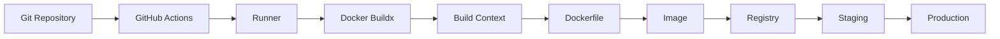
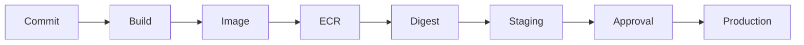
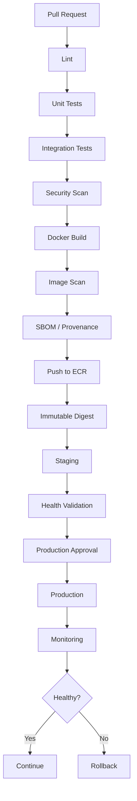

# 17- Docker Build and Registry Issues

## Overview

Docker build and registry failures in GitHub Actions usually span multiple independent layers:

```text
Workflow
   ↓
Runner
   ↓
Docker / BuildKit / Buildx
   ↓
Build Context
   ↓
Dockerfile
   ↓
Dependencies
   ↓
Image
   ↓
Registry Authentication
   ↓
Registry Repository
   ↓
Image Push
   ↓
Deployment
```

A failed `docker build` is different from a failed registry login, which is different from a successful push followed by a failed deployment.

Troubleshooting should therefore follow the failure domain rather than repeatedly changing the workflow YAML.

A useful model is:

```text
Symptom
  ↓
Possible Causes
  ↓
Isolation Strategy
  ↓
Commands / Checks
  ↓
Root Cause
  ↓
Corrective Action
  ↓
Prevention
```

For production CI/CD, the preferred artifact lifecycle is:

```text
Source
  ↓
Test
  ↓
Build
  ↓
Immutable Docker Image
  ↓
Registry
  ↓
Scan / Verify
  ↓
Staging
  ↓
Approval
  ↓
Production
```

The same image should be promoted between environments rather than rebuilt independently.

---

## Docker Build Architecture in GitHub Actions

A typical backend pipeline looks like:



Each layer has its own failure modes.

| Layer | Typical failures |
|---|---|
| Workflow | Incorrect path or permissions |
| Runner | Docker unavailable or insufficient resources |
| Build context | Missing files |
| Dockerfile | Invalid instruction or dependency failure |
| BuildKit | Cache/network/build graph failure |
| Dependencies | Package download or compilation failure |
| Image | Incorrect entrypoint or architecture |
| Authentication | Registry login failure |
| Registry | Repository/tag/permission failure |
| Push | Layer upload or network failure |
| Deployment | Image unavailable or runtime failure |

---

## Basic Docker Build

A minimal build step:

```yaml
- name: Build Docker image
  run: |
    docker build \
      --tag backend:${GITHUB_SHA} \
      .
```

The final `.` is the build context.

This distinction is critical:

```text
Dockerfile location
≠
Build context
```

For example:

```bash
docker build -f docker/Dockerfile .
```

means:

```text
Dockerfile = docker/Dockerfile
Context    = current directory
```

Whereas:

```bash
docker build -f docker/Dockerfile docker/
```

uses:

```text
Dockerfile = docker/Dockerfile
Context    = docker/
```

The second command cannot access files outside the `docker/` context.

---

## Build Context Problems

### Symptom

Docker reports:

```text
COPY failed: file not found
```

### Possible Causes

- Wrong build context.
- Incorrect `COPY` path.
- `.dockerignore` excludes the file.
- Repository was checked out into a different directory.
- Working directory is incorrect.

### Isolation

Inspect the repository:

```bash
pwd
find . -maxdepth 2 -type f | sort
```

Inspect ignored files:

```bash
cat .dockerignore
```

Then verify the build command:

```bash
docker build -f path/to/Dockerfile .
```

### Prevention

Keep the Docker build contract explicit:

```text
Repository
├── Dockerfile
├── pyproject.toml
├── src/
└── .dockerignore
```

or explicitly document a non-root Dockerfile/context arrangement.

---

## `.dockerignore` Problems

`.dockerignore` reduces build context size and prevents unnecessary files from entering the build.

Typical entries:

```text
.git
.github
__pycache__
*.pyc
.pytest_cache
.venv
.env
node_modules
dist
coverage
```

A dangerous configuration can exclude required application files.

For example:

```text
src/
```

would prevent:

```dockerfile
COPY src/ /app/src/
```

from working.

### Security Benefit

Do not send:

```text
.env
.git
credentials
private keys
local databases
```

to the Docker build context unless there is a justified requirement.

---

## Dockerfile `COPY` Failures

Consider:

```dockerfile
COPY pyproject.toml uv.lock ./
COPY src/ ./src/
```

The files must exist inside the build context.

If the workflow uses:

```yaml
defaults:
  run:
    working-directory: backend
```

then:

```bash
docker build .
```

uses `backend/` as the context.

A common failure occurs when engineers assume the workflow's repository root is still the Docker context.

---

## Dockerfile Syntax Failures

### Symptom

```text
failed to solve: Dockerfile parse error
```

### Checks

Validate locally:

```bash
docker build --check .
```

If the Docker version does not support the desired validation mode, perform a normal build:

```bash
docker build -t backend:test .
```

Inspect:

- Instruction spelling.
- Continuation characters.
- Quoting.
- `ARG` placement.
- `ENV` syntax.
- `COPY` paths.
- `RUN` shell syntax.

Keep Dockerfiles deterministic and avoid unnecessary shell complexity.

---

## Base Image Problems

Example:

```dockerfile
FROM python:3.12-slim
```

Failures may occur because:

- The tag does not exist.
- Registry access fails.
- The architecture is incompatible.
- The base image changed unexpectedly.
- Package repositories are unavailable.

Prefer explicit versions:

```dockerfile
FROM python:3.12-slim
```

rather than:

```dockerfile
FROM python:latest
```

For higher reproducibility, pin important base images by digest where appropriate:

```dockerfile
FROM python:3.12-slim@sha256:<digest>
```

Digest pinning improves supply-chain reproducibility but requires deliberate update management.

---

## Architecture Mismatch

A local image may work on:

```text
linux/arm64
```

while production expects:

```text
linux/amd64
```

Buildx supports explicit platform targeting:

```bash
docker buildx build \
  --platform linux/amd64 \
  --tag backend:${GITHUB_SHA} \
  .
```

For multi-platform images:

```bash
docker buildx build \
  --platform linux/amd64,linux/arm64 \
  --tag backend:${GITHUB_SHA} \
  --push \
  .
```

Production failures caused by architecture mismatches often appear only after the image reaches the deployment platform.

---

## Buildx

Buildx provides the modern BuildKit-based build interface used for advanced Docker builds.

Typical setup:

```yaml
- name: Set up Docker Buildx
  uses: docker/setup-buildx-action@v3
```

Then:

```yaml
- name: Build image
  uses: docker/build-push-action@v6
  with:
    context: .
    push: false
    tags: backend:${{ github.sha }}
```

Buildx is useful for:

- Multi-platform builds.
- Layer caching.
- BuildKit features.
- Registry-based builds.
- Provenance and SBOM workflows.
- Efficient CI builds.

---

## BuildKit Build Failures

BuildKit errors can contain multiple nested failures.

Example:

```text
failed to solve
```

is not itself the root cause.

Look further down the output for:

```text
failed to fetch
failed to copy
RUN command failed
permission denied
connection timeout
no space left on device
```

Use plain Docker commands for isolation:

```bash
docker build \
  --progress=plain \
  --tag backend:test \
  .
```

`--progress=plain` makes BuildKit output easier to inspect in CI logs.

---

## Dependency Installation Failures

Python builds commonly fail here:

```dockerfile
RUN pip install --no-cache-dir -r requirements.txt
```

Possible causes:

- Package does not support the Python version.
- Native compiler missing.
- OS development headers missing.
- Network failure.
- Private package registry unavailable.
- Dependency lock inconsistency.

For Debian-based Python images, native dependencies may require packages such as:

```dockerfile
RUN apt-get update \
    && apt-get install -y --no-install-recommends \
       build-essential \
       default-libmysqlclient-dev \
    && rm -rf /var/lib/apt/lists/*
```

Do not blindly install large toolchains. Determine which dependency actually requires them.

---

## Python Backend Image Example

A production-oriented multi-stage build:

```dockerfile
FROM python:3.12-slim AS builder

ENV PYTHONDONTWRITEBYTECODE=1 \
    PYTHONUNBUFFERED=1

WORKDIR /build

RUN apt-get update \
    && apt-get install -y --no-install-recommends \
       build-essential \
    && rm -rf /var/lib/apt/lists/*

COPY requirements.txt .

RUN pip install --upgrade pip \
    && pip wheel \
       --no-cache-dir \
       --wheel-dir /wheels \
       -r requirements.txt


FROM python:3.12-slim AS runtime

ENV PYTHONDONTWRITEBYTECODE=1 \
    PYTHONUNBUFFERED=1

WORKDIR /app

COPY --from=builder /wheels /wheels
RUN pip install \
      --no-cache-dir \
      /wheels/* \
    && rm -rf /wheels

COPY . .

CMD ["gunicorn", "config.wsgi:application"]
```

This separates build dependencies from the runtime image.

---

## Docker Layer Ordering

Docker caches layers independently.

Prefer:

```dockerfile
COPY requirements.txt .
RUN pip install -r requirements.txt

COPY src/ ./src/
```

instead of:

```dockerfile
COPY . .
RUN pip install -r requirements.txt
```

The first design allows dependency installation to remain cached when only application source changes.

This can significantly reduce CI build time.

---

## Docker Cache Failures

Distinguish:

```text
Build failure
```

from:

```text
Cache miss
```

A cache miss is normally not an error.

GitHub Actions Buildx cache:

```yaml
- name: Build image
  uses: docker/build-push-action@v6
  with:
    context: .
    push: false
    tags: backend:${{ github.sha }}
    cache-from: type=gha
    cache-to: type=gha,mode=max
```

A cache should improve performance, not become a correctness dependency.

The build must still succeed when the cache is empty or unavailable.

---

## Cache Corruption or Unexpected Behavior

Possible causes:

- Changed Dockerfile assumptions.
- Incorrect cache scope.
- Old dependencies.
- Shared cache across incompatible builds.
- Corrupted cache.
- Cache poisoning from untrusted workflows.

Isolation strategy:

1. Disable cache temporarily.
2. Build from scratch.
3. Compare results.
4. Re-enable cache with a controlled key/scope.

For example:

```yaml
cache-from: type=gha
```

can temporarily be removed to determine whether the failure is cache-related.

---

## Build Cache vs Artifact

These serve different purposes.

| Property | Cache | Artifact |
|---|---|---|
| Purpose | Speed up future work | Preserve build output |
| Rebuildable | Yes | Usually treated as a release output |
| Correctness dependency | Should not be | Often is |
| Example | Docker layers | Docker image |
| Lifecycle | Performance optimization | Promotion/release |
| Security | Cache poisoning concern | Artifact integrity concern |

Never treat a cache as the authoritative production artifact.

---

## Docker Registry Architecture

A registry stores and distributes container images.

Common production flow:

```text
GitHub Actions
      ↓
OIDC / Registry Authentication
      ↓
Docker Buildx
      ↓
Image
      ↓
Registry
      ↓
ECS / EKS / EC2 / Kubernetes
```

For AWS:

```text
GitHub OIDC
   ↓
STS
   ↓
IAM Role
   ↓
ECR
```

---

## Registry Authentication

For Amazon ECR:

```bash
aws ecr get-login-password \
  --region ap-south-1 \
| docker login \
    --username AWS \
    --password-stdin \
    123456789012.dkr.ecr.ap-south-1.amazonaws.com
```

Validate AWS identity first:

```bash
aws sts get-caller-identity
```

If that fails, fix OIDC/STS before debugging ECR.

If identity succeeds but ECR login fails, investigate:

- IAM permissions.
- Registry URL.
- Region.
- Repository/account.
- Docker availability.

---

## ECR GitHub Actions Example

```yaml
permissions:
  contents: read
  id-token: write

steps:
  - name: Checkout
    uses: actions/checkout@v5

  - name: Configure AWS credentials
    uses: aws-actions/configure-aws-credentials@v6
    with:
      role-to-assume: arn:aws:iam::123456789012:role/github-actions-ecr
      aws-region: ap-south-1

  - name: Login to Amazon ECR
    id: login-ecr
    uses: aws-actions/amazon-ecr-login@v2

  - name: Build and push
    uses: docker/build-push-action@v6
    with:
      context: .
      push: true
      tags: |
        ${{ steps.login-ecr.outputs.registry }}/backend:${{ github.sha }}
```

The deployment identity should be scoped to the required repository and operations.

---

## ECR Repository Does Not Exist

### Symptom

```text
RepositoryNotFoundException
```

Check:

```bash
aws ecr describe-repositories \
  --repository-names backend \
  --region ap-south-1
```

Possible causes:

- Repository does not exist.
- Wrong region.
- Wrong AWS account.
- Typographical error.
- Repository name differs between environments.

For production, repositories should generally be managed through IaC:

```text
Terraform
or
CloudFormation
```

rather than implicitly created by arbitrary application workflows.

---

## ECR Permission Errors

A successful login does not prove push authorization.

The workflow may need permissions associated with:

- Repository inspection.
- Layer upload.
- Image upload.
- Image push.

If:

```bash
aws sts get-caller-identity
```

succeeds but:

```bash
docker push ...
```

fails, inspect the IAM role and ECR repository policy.

Do not solve every failure with:

```text
ecr:*
```

Use the minimum required actions.

---

## Registry URL Problems

ECR URLs contain account and region information:

```text
123456789012.dkr.ecr.ap-south-1.amazonaws.com
```

Common mistakes:

```text
Wrong account
Wrong region
Wrong repository
Incorrect hostname
```

Derive the registry from the authenticated account and configured region rather than hardcoding inconsistent values across workflow steps.

---

## Docker Tag Problems

A tag is a mutable name.

Example:

```text
backend:latest
```

can point to different image digests over time.

For CI builds, use an immutable identifier:

```text
backend:<commit-sha>
```

For example:

```yaml
tags: |
  ${{ steps.login-ecr.outputs.registry }}/backend:${{ github.sha }}
```

Semantic release tags can additionally be used:

```text
backend:1.8.0
```

but the production deployment should retain the underlying digest.

---

## `latest` Production Problems

Using:

```text
backend:latest
```

for production deployment creates ambiguity.

Possible problems:

- The tag moves.
- Rollback identity becomes unclear.
- Staging and production can resolve different images.
- Auditing becomes difficult.
- A deployment may accidentally pull a newer image.

Prefer:

```text
backend:<commit-sha>
```

and ultimately deploy by digest when the platform supports it.

---

## Image Digest

Docker images have content-addressed digests:

```text
sha256:...
```

A production artifact can therefore be represented as:

```text
ECR repository
+
image digest
```

This is stronger than relying only on a mutable tag.

Conceptually:

```text
Tag
  ↓
Digest
  ↓
Immutable Image
```

The deployment metadata should retain the digest used.

---

## Build Once, Promote Many

A strong deployment architecture is:



Avoid:

```text
Build → Staging
Build again → Production
```

because the two builds may differ.

Prefer:

```text
Build once
→ Test
→ Publish
→ Promote
```

---

## Docker Push Failures

### Symptom

```text
denied
```

or:

```text
unauthorized
```

### Isolation

Check:

```bash
aws sts get-caller-identity
```

Then:

```bash
aws ecr describe-repositories \
  --repository-names backend \
  --region ap-south-1
```

Then authenticate:

```bash
aws ecr get-login-password \
  --region ap-south-1 \
| docker login \
    --username AWS \
    --password-stdin \
    "$ECR_REGISTRY"
```

Then test the push.

### Root Causes

- Wrong IAM role.
- Wrong account.
- Wrong repository.
- Missing push permissions.
- Repository policy denial.
- Registry URL mismatch.

---

## `no space left on device`

Docker builds can consume substantial disk space.

Check:

```bash
df -h
```

Docker usage:

```bash
docker system df
```

Inspect images:

```bash
docker image ls
```

Inspect containers:

```bash
docker ps -a
```

On self-hosted runners, persistent Docker state can accumulate across workflows.

Use ephemeral runners or controlled cleanup rather than allowing unbounded growth.

---

## Runner Resource Exhaustion

Large builds may fail because of:

- CPU exhaustion.
- Memory pressure.
- Disk exhaustion.
- Process limits.
- Network bandwidth.

Typical diagnostics:

```bash
df -h
free -h
nproc
docker system df
```

For self-hosted Linux runners:

```bash
uname -a
docker version
docker info
```

A production runner should have resource monitoring rather than relying on build failures as the first signal.

---

## Build Timeouts

A Docker build may appear stuck because of:

- Dependency download.
- DNS problems.
- Registry latency.
- Large build context.
- Slow compilation.
- Resource starvation.
- BuildKit cache behavior.

First determine which Dockerfile instruction is slow.

Use:

```bash
docker build --progress=plain .
```

Then inspect the specific layer.

Do not immediately increase workflow timeout without identifying the bottleneck.

---

## Large Build Context

A large context increases:

- Upload time to the Docker builder.
- Memory consumption.
- Build latency.
- Risk of accidentally including sensitive files.

Check repository size:

```bash
du -sh .
```

Review `.dockerignore`.

Common exclusions:

```text
.git
.venv
node_modules
__pycache__
.pytest_cache
coverage
dist
.env
```

For monorepos, use the narrowest practical build context.

---

## Private Package Registry Failures

Python applications may use:

- Private PyPI.
- GitHub Packages.
- Internal artifact repositories.

A Docker build that works locally may fail in GitHub Actions because the build environment lacks credentials.

Do not bake credentials into:

```dockerfile
ENV
ARG
COPY
```

Use BuildKit-supported secret mechanisms when a build genuinely needs authenticated package access.

The secret should not become part of the image layer.

---

## Docker Build Secrets

For example:

```bash
docker buildx build \
  --secret id=pip_config,src=$HOME/.config/pip/pip.conf \
  .
```

Dockerfile:

```dockerfile
RUN --mount=type=secret,id=pip_config,target=/etc/pip.conf \
    pip install -r requirements.txt
```

This keeps the credential out of normal image layers.

The exact mechanism should be chosen based on the package manager and CI environment.

---

## Secrets in Docker Build Arguments

Avoid:

```yaml
with:
  build-args: |
    AWS_SECRET_ACCESS_KEY=${{ secrets.AWS_SECRET_ACCESS_KEY }}
```

and:

```dockerfile
ARG AWS_SECRET_ACCESS_KEY
```

Build arguments can become exposed through build metadata or image history depending on how they are used.

Use OIDC for AWS access and BuildKit secrets for genuine build-time secrets.

---

## Dockerfile Environment Mistakes

Do not confuse build-time and runtime configuration.

Build-time:

```text
Dependency installation
Compilation
Static asset generation
```

Runtime:

```text
DATABASE_URL
REDIS_URL
AWS configuration
Application secrets
```

Production secrets should normally be injected at deployment/runtime rather than baked into the image.

---

## Django Build Problems

A Django image may fail during:

```bash
python manage.py collectstatic
```

or:

```bash
python manage.py check
```

Possible causes:

- Missing environment variables.
- Database connection attempted during build.
- Secret settings required at import time.
- Incorrect static configuration.
- Dependencies missing.

A useful architecture is to keep image construction independent of production infrastructure where possible.

Do not require a production PostgreSQL connection merely to build the image unless there is a specific reason.

---

## FastAPI Build Problems

FastAPI image failures often involve:

- Incorrect module path.
- Missing dependencies.
- Incorrect Uvicorn/Gunicorn command.
- Environment configuration.
- Native package compilation.

Example runtime command:

```dockerfile
CMD ["uvicorn", "app.main:app", "--host", "0.0.0.0", "--port", "8000"]
```

The build can succeed while the container still fails at startup.

Separate:

```text
Build validation
```

from:

```text
Runtime validation
```

---

## Container Startup vs Build Failure

These are different failure domains.

### Build failure

```text
docker build
```

### Runtime failure

```text
docker run
```

or deployment platform startup.

If the image builds successfully, validate:

```bash
docker run --rm \
  -p 8000:8000 \
  backend:${GITHUB_SHA}
```

Then test:

```bash
curl http://localhost:8000/health
```

This isolates image construction from application runtime behavior.

---

## Registry Push Succeeds but Deployment Fails

Architecture:

```text
Build
 ↓
Push
 ↓
Registry
 ↓
Deployment
 ↓
Pull
 ↓
Container startup
```

If push succeeds, do not immediately modify Docker build logic.

Investigate:

- Deployment platform credentials.
- Image URI.
- Image digest.
- Image architecture.
- Registry pull permissions.
- Network connectivity.
- Runtime configuration.
- Health checks.

---

## Image Pull Failures

Typical error:

```text
pull access denied
```

Possible causes:

- Incorrect image URI.
- Missing registry authentication.
- Missing execution-role permissions.
- Image does not exist.
- Wrong region/account.
- Private registry access unavailable.

For ECS, distinguish:

```text
GitHub deployment role
```

from:

```text
ECS task execution role
```

The GitHub role pushes the image; the ECS execution role pulls it.

---

## ECR Push vs Pull Permissions

These are different identities.

```text
GitHub Actions
    ↓
Push
    ↓
ECR
```

and:

```text
ECS
    ↓
Pull
    ↓
ECR
```

Therefore:

```text
GitHub IAM role
```

does not automatically determine:

```text
ECS image pull authorization
```

Debug the identity performing the failed operation.

---

## Multi-Stage Build Issues

Multi-stage builds reduce runtime image size:

```dockerfile
FROM python:3.12-slim AS builder

# Build dependencies...


FROM python:3.12-slim AS runtime

COPY --from=builder /wheels /wheels
```

Common errors:

```text
COPY --from=builder failed
```

Possible causes:

- Incorrect source path.
- Build stage did not create expected output.
- Wrong stage name.
- Architecture mismatch.

Verify each stage's expected filesystem output.

---

## Image Size Problems

Inspect:

```bash
docker image ls
```

Use:

```bash
docker history backend:test
```

Look for:

- Large package caches.
- Build toolchains in runtime image.
- Unnecessary source files.
- Development dependencies.
- Large artifacts.

Multi-stage builds and `.dockerignore` are usually more effective than arbitrary cleanup commands.

---

## Image Scanning

A production pipeline should scan images before promotion.

Conceptually:

```text
Build
 ↓
Scan
 ↓
SBOM
 ↓
Provenance
 ↓
Publish
 ↓
Promote
```

Scanning should be integrated into the release process rather than treated as an unrelated manual activity.

A vulnerability finding should have an explicit policy:

```text
Block
Warn
Exception
Accept temporarily
```

The policy should consider severity and exploitability rather than blindly failing every scan.

---

## SBOM and Provenance

A production image should ideally have metadata describing:

- Dependencies.
- Build source.
- Build workflow.
- Build identity.
- Artifact digest.

This enables incident investigation:

```text
Production image
   ↓
Digest
   ↓
Build
   ↓
Commit
   ↓
Dependencies
```

Artifact provenance and signing complement, rather than replace, registry access control.

---

## Registry Retention

Registries can accumulate:

```text
Every commit
Every pull request
Every release
```

Without lifecycle management, storage costs increase.

Define policies for:

- Temporary CI images.
- Staging images.
- Release images.
- Rollback images.
- Untagged images.

Do not delete images still required for rollback.

---

## Rollback and Image Retention

A rollback should reference a known immutable artifact.

Example:

```text
Current:
backend@sha256:AAA

Previous:
backend@sha256:BBB
```

Rollback:

```text
AAA
 ↓
BBB
```

This is safer than:

```text
latest
 ↓
unknown previous version
```

Maintain sufficient registry retention to support the organization's rollback and disaster recovery requirements.

---

## Docker Build and Registry Security

### Pin important dependencies

Use:

- Locked application dependencies.
- Controlled base images.
- SHA-pinned GitHub Actions where appropriate.
- Immutable production image references.

### Restrict AWS permissions

The build role should not automatically receive:

```text
AdministratorAccess
```

### Protect production

Use:

- GitHub Environments.
- Required approvals.
- Deployment concurrency.
- Restricted production roles.

### Protect runners

Do not allow untrusted pull requests to execute arbitrary code on privileged persistent runners.

---

## Third-Party Docker Actions

Docker-based GitHub Actions execute containers on the runner.

Treat them as executable dependencies.

Review:

- Source repository.
- Maintainer.
- Version.
- Digest/SHA pinning where supported.
- Permissions.
- Network access.
- Secrets.
- Filesystem access.

A Docker action with excessive permissions can become a CI/CD supply-chain risk.

---

## Docker Socket Exposure

Be especially careful with:

```text
/var/run/docker.sock
```

Access to the Docker daemon can provide powerful control over the runner host.

Avoid exposing the Docker socket to untrusted workloads unless the architecture explicitly requires it and the security boundary is understood.

Prefer isolated or ephemeral builders for privileged image-build operations where appropriate.

---

## Self-Hosted Runner Registry Issues

Self-hosted runners introduce additional failure domains:

```text
Runner
 ↓
Docker daemon
 ↓
Network
 ↓
Registry
```

Check:

```bash
docker version
docker info
df -h
free -h
```

Network diagnostics:

```bash
getent hosts <registry-host>
curl -I https://<registry-host>
```

For private registries, also inspect:

- DNS.
- Proxy.
- Firewall.
- Routing.
- TLS certificates.
- Private endpoints.
- Egress restrictions.

---

## Registry Network Failures

A registry push can fail because of:

- DNS.
- TLS.
- Proxy.
- Firewall.
- NAT.
- Private endpoint.
- Network saturation.
- Registry availability.

Differentiate:

```text
Authentication failure
```

from:

```text
Network failure
```

An HTTP `401`/`403` is different from a timeout.

---

## Registry Rate Limits and Retries

Large pipelines can generate high registry traffic.

Use:

- Layer caching.
- Shared base images.
- Controlled matrix sizes.
- Build deduplication.
- Appropriate retries.

Do not blindly retry indefinitely.

Retries should have:

```text
Bounded attempts
+
Backoff
+
Idempotent operation
```

---

## Concurrency and Duplicate Image Builds

A single commit can trigger multiple workflows through:

- `push`.
- `pull_request`.
- Manual dispatch.
- Release workflows.

This can cause:

```text
Multiple builds
Multiple pushes
Multiple tags
```

Use workflow design and concurrency controls to avoid unnecessary duplicate work.

For production deployment:

```yaml
concurrency:
  group: production-deployment
  cancel-in-progress: false
```

For CI, cancelling superseded runs may be appropriate.

---

## Matrix Build Problems

A matrix can multiply Docker builds:

```yaml
strategy:
  matrix:
    python: ["3.11", "3.12"]
    platform: ["linux/amd64", "linux/arm64"]
```

This produces four combinations.

Be aware of:

```text
Matrix cardinality
×
Build duration
×
Registry traffic
×
Runner capacity
```

Not every matrix dimension belongs in the image build stage.

Test compatibility through a matrix, but publish only the artifacts required for deployment.

---

## Dynamic Image Tags

Dynamic tags should be deterministic.

Example:

```yaml
env:
  IMAGE_TAG: ${{ github.sha }}
```

Then:

```yaml
- name: Build and push
  uses: docker/build-push-action@v6
  with:
    context: .
    push: true
    tags: |
      ${{ steps.login-ecr.outputs.registry }}/backend:${{ env.IMAGE_TAG }}
```

Avoid tags derived directly from arbitrary untrusted input without validation.

---

## Untrusted Input and Docker Tags

Do not construct shell commands directly from untrusted branch names or pull request content.

Risky:

```yaml
run: docker build -t backend:${{ github.head_ref }} .
```

A branch name can contain characters with unexpected shell semantics.

Prefer passing values through environment variables:

```yaml
env:
  IMAGE_TAG: ${{ github.sha }}
run: |
  docker build -t "backend:${IMAGE_TAG}" .
```

For image references derived from user-controlled values, validate against an explicit allowlist or safe format.

---

## Docker Build Arguments and Untrusted Input

Avoid:

```yaml
build-args: |
  VERSION=${{ github.event.pull_request.title }}
```

Use trusted immutable identifiers instead:

```yaml
build-args: |
  VERSION=${{ github.sha }}
```

If external input is required, validate it before passing it into the Docker build.

---

## Registry Authentication Failure Model

Use the following isolation tree:

```text
docker login fails
      │
      ├── AWS identity fails?
      │       └── Fix OIDC / STS
      │
      ├── AWS identity correct?
      │       └── Check IAM
      │
      ├── IAM correct?
      │       └── Check registry/account/region
      │
      └── Network failure?
              └── Check DNS/TLS/proxy/firewall
```

This prevents unrelated configuration changes.

---

## Docker Build Failure Model

```text
docker build fails
      │
      ├── Docker daemon?
      │
      ├── Build context?
      │
      ├── Dockerfile syntax?
      │
      ├── Base image?
      │
      ├── Dependency installation?
      │
      ├── BuildKit/cache?
      │
      ├── Disk/memory?
      │
      └── Network/package registry?
```

Identify the first failing layer rather than focusing on the final error message.

---

## Practical Diagnostic Workflow

### Step 1: Verify checkout

```bash
git status
pwd
ls -la
```

### Step 2: Verify Docker

```bash
docker version
docker info
```

### Step 3: Verify context

```bash
find . -maxdepth 2 -type f | sort
cat .dockerignore
```

### Step 4: Build without cache

```bash
docker build \
  --no-cache \
  --progress=plain \
  -t backend:test \
  .
```

### Step 5: Verify image

```bash
docker image inspect backend:test
```

### Step 6: Verify AWS identity

```bash
aws sts get-caller-identity
```

### Step 7: Verify ECR

```bash
aws ecr describe-repositories \
  --repository-names backend \
  --region ap-south-1
```

### Step 8: Authenticate

```bash
aws ecr get-login-password \
  --region ap-south-1 \
| docker login \
    --username AWS \
    --password-stdin \
    "$ECR_REGISTRY"
```

### Step 9: Push

```bash
docker push "$ECR_REGISTRY/backend:$IMAGE_TAG"
```

### Step 10: Verify digest

```bash
docker inspect \
  --format='{{index .RepoDigests 0}}' \
  "$ECR_REGISTRY/backend:$IMAGE_TAG"
```

---

## GitHub Actions Diagnostic Workflow

A temporary diagnostic job can isolate the environment:

```yaml
jobs:
  docker-diagnostics:
    runs-on: ubuntu-latest

    permissions:
      contents: read
      id-token: write

    steps:
      - name: Checkout
        uses: actions/checkout@v5

      - name: Docker version
        run: docker version

      - name: Docker info
        run: docker info

      - name: Disk usage
        run: df -h

      - name: BuildKit version
        run: docker buildx version

      - name: Build image
        run: |
          docker build \
            --progress=plain \
            --tag backend:test \
            .

      - name: Configure AWS credentials
        uses: aws-actions/configure-aws-credentials@v6
        with:
          role-to-assume: arn:aws:iam::123456789012:role/github-actions-ecr
          aws-region: ap-south-1

      - name: Verify AWS identity
        run: aws sts get-caller-identity
```

Remove unnecessary diagnostic output once the incident is resolved.

---

## Failure Domain Matrix

| Symptom | Isolation | Likely Cause |
|---|---|---|
| `Dockerfile parse error` | `docker build` | Dockerfile syntax |
| `COPY failed` | Inspect context | Wrong context/path |
| Base image pull fails | Pull base image | Registry/network |
| `pip install` fails | Build dependency layer | Package/native dependency |
| Build is extremely slow | `--progress=plain` | Context/cache/dependency |
| `no space left on device` | `df -h` | Runner disk |
| `docker info` fails | Docker daemon | Runner configuration |
| ECR login denied | `aws sts get-caller-identity` | OIDC/IAM |
| ECR repository denied | `describe-repositories` | IAM/resource policy |
| Push denied | IAM + repository | Push authorization |
| Image pull denied | Deployment identity | Runtime pull permissions |
| Deployment starts but container fails | Run image locally | Runtime configuration |
| Wrong image deployed | Inspect digest | Tag/release management |
| Works locally, fails in CI | Compare runner | Environment differences |
| Works on one runner | Compare runner state | Persistent runner drift |

---

## Production Docker CI/CD Architecture



The important property is artifact identity:

```text
Commit
  ↓
Image Digest
  ↓
Staging
  ↓
Production
```

The digest should remain unchanged throughout promotion.

---

## Deployment Failure After Successful Push

When the image exists in ECR but deployment fails:

```text
Do not rebuild first.
```

Check:

1. Image URI.
2. Image digest.
3. AWS account.
4. AWS region.
5. Runtime pull permissions.
6. Network access.
7. Architecture.
8. Environment variables.
9. Secrets.
10. Health checks.
11. Application startup logs.

This preserves the build artifact as the source of truth.

---

## Docker and ECS

A typical ECS architecture:

```text
GitHub Actions
     ↓
ECR
     ↓
ECS Task Definition
     ↓
ECS Service
     ↓
ALB
     ↓
Django / FastAPI
```

ECS failures after a successful push commonly involve:

- Task execution role.
- Image pull.
- Container command.
- Environment variables.
- Secrets.
- Health checks.
- Security groups.
- Application startup.

Do not treat all ECS failures as Docker build failures.

---

## Docker and Kubernetes

A Kubernetes deployment may reference:

```yaml
containers:
  - name: backend
    image: 123456789012.dkr.ecr.ap-south-1.amazonaws.com/backend@sha256:...
```

Using the digest makes the deployed artifact explicit.

Runtime troubleshooting then moves to:

```text
Image exists
→ Image can be pulled
→ Container starts
→ Readiness succeeds
→ Service receives traffic
```

---

## Docker and Celery

A backend platform may build one image and use different commands:

```text
Django:
gunicorn config.wsgi:application

Celery worker:
celery -A config worker

Celery beat:
celery -A config beat
```

The same immutable image can therefore serve multiple workloads.

The build pipeline should not unnecessarily create separate images when the application architecture does not require them.

---

## Docker and Redis/PostgreSQL

Redis and PostgreSQL normally remain runtime dependencies rather than being baked into the application image.

For CI integration testing:

```text
GitHub Actions
   ↓
Application container
   ├── PostgreSQL service
   └── Redis service
```

For production:

```text
Application image
   ↓
Managed PostgreSQL
   +
Managed Redis
```

This separation improves lifecycle management and scalability.

---

## Production Reliability

A reliable Docker pipeline should be:

- Deterministic.
- Reproducible.
- Idempotent.
- Observable.
- Secure.
- Recoverable.

### Deterministic

Same source and controlled inputs produce equivalent artifacts.

### Reproducible

Build metadata and dependencies are controlled.

### Idempotent

Retrying a push or deployment does not corrupt state.

### Observable

Builds expose useful diagnostics without leaking secrets.

### Recoverable

Previous immutable artifacts remain available for rollback.

---

## Cost Considerations

Docker CI costs can increase through:

- Large images.
- Slow builds.
- Excessive matrix dimensions.
- Repeated builds.
- Ineffective caching.
- Large build contexts.
- Excessive registry storage.
- Persistent idle runners.

Optimize in this order:

```text
Avoid unnecessary builds
        ↓
Reduce build context
        ↓
Improve Dockerfile layer reuse
        ↓
Use effective cache
        ↓
Right-size runners
        ↓
Manage registry retention
```

Do not optimize by removing required validation.

---

## High Availability and Disaster Recovery

Container registries are part of the deployment control plane.

For production recovery:

- Retain required release images.
- Record image digests.
- Keep deployment metadata.
- Maintain IaC for registry resources.
- Separate production accounts where appropriate.
- Document registry recovery procedures.
- Avoid relying exclusively on mutable tags.

A rollback should not depend on rebuilding source code during an incident.

---

## Common Mistakes

### Using `latest` for production

Makes artifact identity ambiguous.

### Building separately for every environment

Creates potentially different artifacts.

### Baking secrets into images

Creates long-lived credential exposure.

### Ignoring `.dockerignore`

Increases build context and can leak sensitive files.

### Treating cache failures as artifact failures

Cache is an optimization, not the release artifact.

### Giving the build role excessive AWS permissions

Increases blast radius.

### Using persistent runners without cleanup

Creates disk, credential, and state-management problems.

### Debugging deployment before validating the image

Creates unnecessary changes across unrelated systems.

### Rebuilding during rollback

Makes rollback slower and less deterministic.

### Printing full environment variables

Can expose secrets or sensitive configuration.

---

## Senior Design Principles

A production Docker pipeline should follow these principles:

### Separate concerns

```text
Build
≠
Authentication
≠
Registry
≠
Deployment
```

### Make artifacts immutable

Use:

```text
Commit SHA
+
Digest
```

rather than relying solely on mutable tags.

### Build once

Promote the same artifact through environments.

### Authenticate with short-lived credentials

Prefer:

```text
GitHub OIDC → AWS STS
```

over long-lived AWS keys.

### Keep caches optional

A cache miss must not break correctness.

### Keep rollback independent of source rebuilds

Rollback should select a known artifact.

### Isolate failure domains

A registry problem should not require changing the application build.

---

## Interview Scenarios

### A Docker build works locally but fails in GitHub Actions

Investigate:

```text
Runner
→ Docker version
→ Build context
→ .dockerignore
→ Environment
→ Network
→ Architecture
```

Do not assume the Dockerfile is the only difference.

### ECR login fails

Explain the diagnostic sequence:

```text
OIDC
→ STS
→ IAM trust
→ Caller identity
→ ECR authorization
→ Registry endpoint
```

### ECR push succeeds but ECS cannot start the task

Separate:

```text
GitHub push identity
```

from:

```text
ECS pull identity
```

Then inspect image URI, task execution role, architecture, networking, and health checks.

### Production deployment uses `latest`

Explain why mutable tags make rollback and auditing harder and propose immutable image identity.

### Docker cache is corrupted

Disable cache and perform a clean build. If the clean build succeeds, investigate cache scope and invalidation rather than changing application code.

### Docker image contains credentials

Explain why `ARG`, `ENV`, copied configuration files, and image layers can expose secrets. Move secrets to runtime or BuildKit secret mechanisms where build-time access is genuinely required.

### Build times increased from 5 minutes to 25 minutes

Investigate:

- Dockerfile layer ordering.
- Build context size.
- Cache hit rate.
- Dependency downloads.
- Base image changes.
- Runner resource availability.
- Matrix cardinality.

### Production needs an emergency rollback

Select a previously verified image digest rather than rebuilding from source.

---

## Production Troubleshooting Checklist

### Build

- [ ] Repository checkout succeeded.
- [ ] Working directory is correct.
- [ ] Dockerfile path is correct.
- [ ] Build context is correct.
- [ ] `.dockerignore` does not exclude required files.
- [ ] Docker version is supported.
- [ ] Buildx is available.
- [ ] Base image is reachable.
- [ ] Dependencies are available.
- [ ] Runner has sufficient CPU, memory, and disk.
- [ ] Build succeeds without cache when required.

### Registry

- [ ] AWS identity is correct.
- [ ] AWS account is correct.
- [ ] Region is correct.
- [ ] ECR repository exists.
- [ ] IAM permissions allow required operations.
- [ ] Repository policy is correct.
- [ ] Registry endpoint is correct.
- [ ] Docker login succeeds.
- [ ] Push succeeds.
- [ ] Image digest is recorded.

### Security

- [ ] OIDC is used instead of long-lived AWS keys.
- [ ] IAM trust is restricted.
- [ ] IAM permissions are least privilege.
- [ ] Secrets are not baked into images.
- [ ] Untrusted PRs cannot access privileged runners.
- [ ] Third-party actions are controlled.
- [ ] Images are scanned.
- [ ] SBOM/provenance requirements are defined.

### Deployment

- [ ] Same immutable artifact is promoted.
- [ ] Runtime identity can pull the image.
- [ ] Image architecture matches the platform.
- [ ] Runtime configuration is available.
- [ ] Health checks are configured.
- [ ] Deployment concurrency is controlled.
- [ ] Previous image remains available for rollback.
- [ ] Monitoring validates deployment health.

---

## Key Takeaways

- Troubleshoot Docker CI/CD failures by separating build context, Dockerfile, BuildKit, runner resources, registry authentication, registry authorization, image distribution, and runtime deployment.
- Use `docker build --progress=plain` and clean builds to isolate Dockerfile, dependency, cache, and resource failures instead of changing multiple variables simultaneously.
- Prefer immutable image identity using commit SHA and digest, and promote the same image from staging to production rather than rebuilding per environment.
- Treat ECR authentication and authorization as separate concerns: verify `aws sts get-caller-identity` first, then diagnose IAM, repository policy, registry, and push permissions.
- Production Docker pipelines should combine reproducible builds, controlled caching, OIDC-based AWS access, image scanning/provenance, protected deployments, registry retention, observability, and immutable rollback artifacts.