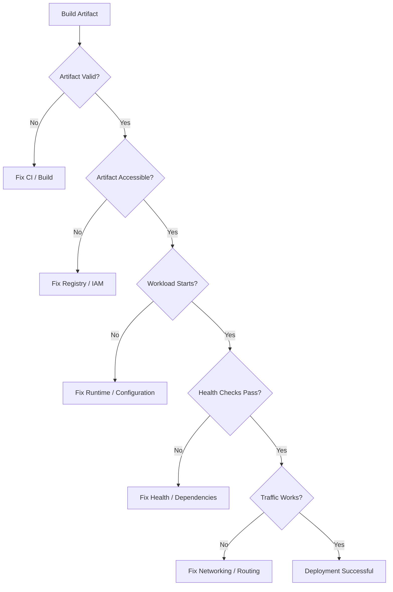
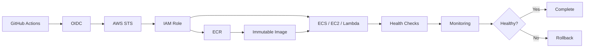

# 18- Deployment Failures

## Overview

Deployment failures occur after or during the transition from a validated build artifact to a running production or non-production workload.

A production CI/CD deployment can be modeled as:

```text
Pull Request
    ↓
Validation
    ↓
Build
    ↓
Immutable Artifact
    ↓
Registry
    ↓
Environment
    ↓
Deployment
    ↓
Health Validation
    ↓
Traffic
    ↓
Monitoring
    ↓
Rollback if required
```

A deployment can fail even when:

- The GitHub Actions workflow is valid.
- Tests pass.
- The Docker image builds successfully.
- The image is pushed to ECR.
- AWS authentication succeeds.

Deployment troubleshooting therefore requires separating CI failures from deployment failures.

A useful troubleshooting model is:

```text
Symptom
   ↓
Possible Causes
   ↓
Isolation Strategy
   ↓
Commands / Checks
   ↓
Root Cause
   ↓
Corrective Action
   ↓
Prevention
```

The most important production principle is:

> Do not rebuild an application merely because deployment failed. First determine whether the existing immutable artifact is valid and whether the failure belongs to infrastructure, configuration, networking, permissions, or runtime.

---

## Deployment Failure Domains

Deployment failures usually belong to one of these domains:

| Failure domain | Typical examples |
|---|---|
| Workflow | Wrong job dependency or condition |
| Artifact | Wrong image, tag, digest, or package |
| Registry | Image unavailable or inaccessible |
| Authentication | OIDC, IAM, STS, credentials |
| Authorization | Missing deployment or resource permissions |
| Configuration | Environment variables or secrets |
| Infrastructure | ECS, EC2, Kubernetes, Lambda, IaC |
| Networking | VPC, DNS, security groups, routing |
| Runtime | Application startup or process failure |
| Health checks | Readiness, liveness, ALB checks |
| Database | Migration or schema incompatibility |
| Concurrency | Two deployments modifying the same environment |
| Capacity | CPU, memory, replicas, quotas |
| Rollout | Rolling, blue/green, or canary failure |
| Observability | Missing logs or insufficient diagnostics |

---

## CI Failure vs Deployment Failure

The first question should be:

```text
Did the artifact build successfully?
```

If not, troubleshoot CI.

If yes:

```text
Can the deployment system access the artifact?
```

If yes:

```text
Can the workload start?
```

If yes:

```text
Can it pass health checks?
```

If yes:

```text
Can production traffic reach it?
```

This creates a useful progression:



---

## Immutable Deployment Artifacts

Production deployment should preferably use an immutable artifact.

For Docker:

```text
ECR Repository
    +
Image Digest
```

For example:

```text
123456789012.dkr.ecr.ap-south-1.amazonaws.com/backend@sha256:...
```

This is stronger than:

```text
backend:latest
```

because a tag can move while a digest identifies specific image content.

A reliable deployment flow is:

```text
Commit
  ↓
Build
  ↓
Image Digest
  ↓
Staging
  ↓
Approval
  ↓
Production
```

The production deployment should use the same artifact that passed staging validation.

---

## Build Once, Deploy Many

Avoid:

```text
Build → Staging
Build → Production
```

Prefer:

```text
Build
 ↓
Test
 ↓
Publish
 ↓
Staging
 ↓
Approve
 ↓
Production
```

This prevents environment-specific rebuilds from producing different binaries or images.

Example:

```yaml
jobs:
  build:
    runs-on: ubuntu-latest
    outputs:
      image: ${{ steps.image.outputs.image }}

    steps:
      - uses: actions/checkout@v5

      - name: Build image
        id: image
        run: |
          IMAGE="123456789012.dkr.ecr.ap-south-1.amazonaws.com/backend:${GITHUB_SHA}"
          docker build -t "$IMAGE" .
          echo "image=$IMAGE" >> "$GITHUB_OUTPUT"
```

A later deployment job should consume the output rather than rebuilding.

---

## Deployment Lifecycle

A deployment normally contains several phases:

```text
Prepare
  ↓
Authenticate
  ↓
Resolve Artifact
  ↓
Deploy
  ↓
Wait
  ↓
Health Check
  ↓
Traffic Validation
  ↓
Success / Rollback
```

Each phase should produce observable evidence.

For example:

```text
Deployment ID
Artifact digest
Environment
Target service
Start time
End time
Health result
Rollback result
```

This metadata is extremely valuable during incidents.

---

## GitHub Actions Deployment Architecture



The GitHub Actions role should have only the permissions required to perform the deployment.

---

## Deployment Permissions

A successful OIDC authentication does not mean deployment authorization exists.

Separate:

```text
Authentication
```

from:

```text
Authorization
```

Authentication answers:

```text
Who is making the request?
```

Authorization answers:

```text
What is that identity allowed to do?
```

For AWS:

```text
GitHub OIDC
    ↓
STS AssumeRole
    ↓
IAM Role
    ↓
AWS API
    ↓
Authorization
```

Start diagnosis with:

```bash
aws sts get-caller-identity
```

Then determine whether the returned role can perform the deployment operation.

---

## OIDC Deployment Failures

Common symptoms:

```text
Not authorized to perform sts:AssumeRoleWithWebIdentity
```

or:

```text
AccessDenied
```

Check:

- `id-token: write`.
- IAM OIDC provider.
- IAM trust policy.
- Audience.
- Subject claim.
- Repository.
- Branch.
- Environment.
- AWS account.
- Role ARN.

Example:

```yaml
permissions:
  contents: read
  id-token: write
```

Do not store long-lived AWS access keys in GitHub secrets when OIDC can provide short-lived credentials.

---

## AWS Account and Region Mismatch

A surprisingly common deployment failure is targeting the wrong AWS account or region.

Check:

```bash
aws sts get-caller-identity
```

Then:

```bash
aws configure get region
```

Explicitly configure the workflow:

```yaml
- name: Configure AWS credentials
  uses: aws-actions/configure-aws-credentials@v6
  with:
    role-to-assume: arn:aws:iam::123456789012:role/github-actions-deploy
    aws-region: ap-south-1
```

Verify that:

```text
AWS Account
AWS Region
ECR Repository
Deployment Target
```

all belong to the intended environment.

---

## Environment Configuration Failures

A deployment can succeed technically but fail because runtime configuration is wrong.

Typical configuration:

```text
DATABASE_URL
REDIS_URL
DJANGO_SETTINGS_MODULE
AWS_REGION
LOG_LEVEL
KAFKA_BROKERS
```

Common mistakes:

- Variable missing.
- Wrong environment.
- Incorrect secret.
- Wrong value type.
- Production secret unavailable.
- Staging value accidentally used in production.

Separate:

```text
Application artifact
```

from:

```text
Environment configuration
```

The same image should be deployable to multiple environments with different runtime configuration.

---

## GitHub Environments

GitHub Environments can provide:

- Environment secrets.
- Environment variables.
- Required reviewers.
- Deployment protection.
- Deployment history.
- Branch/tag restrictions.

Example:

```yaml
jobs:
  deploy-production:
    environment:
      name: production
```

A production deployment should generally have stronger protection than a development deployment.

---

## Approval Failures

A deployment can remain pending because:

- Required reviewer has not approved.
- Environment protection rule is unmet.
- Branch restriction prevents deployment.
- Deployment target does not satisfy environment rules.

Do not interpret a pending approval as an application failure.

The workflow state should distinguish:

```text
Waiting for approval
```

from:

```text
Deployment failed
```

---

## Artifact Resolution Failures

### Symptom

Deployment references an image that does not exist.

Possible causes:

- Incorrect tag.
- Incorrect digest.
- Wrong repository.
- Wrong AWS account.
- Wrong region.
- Image retention removed the artifact.
- Build job produced a different output.

For ECR:

```bash
aws ecr describe-images \
  --repository-name backend \
  --image-ids imageTag="$IMAGE_TAG" \
  --region ap-south-1
```

For digest-based deployment:

```bash
aws ecr describe-images \
  --repository-name backend \
  --image-ids imageDigest="$IMAGE_DIGEST" \
  --region ap-south-1
```

---

## ECR Image Pull Failures

An application runtime must have permission to pull the image.

For ECS:

```text
ECS
 ↓
Task Execution Role
 ↓
ECR
 ↓
Image
```

This identity is different from the GitHub Actions deployment role.

A successful GitHub push does not guarantee that ECS can pull the image.

Check:

- Task execution role.
- ECR repository policy.
- Account.
- Region.
- Image URI.
- Network connectivity.

---

## ECS Deployment Failures

Typical ECS lifecycle:

```text
Task Definition
    ↓
Service
    ↓
Task Placement
    ↓
Image Pull
    ↓
Container Start
    ↓
Health Check
    ↓
Traffic
```

Failures should be diagnosed according to the failed stage.

Useful commands:

```bash
aws ecs describe-services \
  --cluster production \
  --services backend \
  --region ap-south-1
```

Inspect tasks:

```bash
aws ecs list-tasks \
  --cluster production \
  --service-name backend \
  --region ap-south-1
```

Then:

```bash
aws ecs describe-tasks \
  --cluster production \
  --tasks <task-arn> \
  --region ap-south-1
```

Look for:

- `stoppedReason`.
- Container exit code.
- Health status.
- Pull errors.
- Deployment status.

---

## ECS Task Startup Failures

A task can fail before the application serves traffic.

Typical causes:

- Image pull failure.
- Invalid command.
- Missing environment variable.
- Missing secret.
- IAM failure.
- Port mismatch.
- Memory limit.
- CPU limit.
- Dependency unavailable.

The correct diagnostic sequence is:

```text
Task stopped
  ↓
stoppedReason
  ↓
Container reason
  ↓
Exit code
  ↓
Application logs
```

Do not change task definitions blindly.

---

## ECS Health Check Failures

A container can be running while still being unhealthy.

Example:

```text
Container: RUNNING
Health: UNHEALTHY
```

Potential causes:

- Wrong health endpoint.
- Application startup too slow.
- Incorrect port.
- Database unavailable.
- Redis unavailable.
- ALB cannot reach the task.
- Health check path requires authentication.
- Security group blocks traffic.

A useful health endpoint for a backend might be:

```text
GET /health
```

The endpoint should validate the appropriate dependencies without making the health check unnecessarily fragile.

---

## ALB Health Check Failures

Architecture:

```text
Client
  ↓
ALB
  ↓
Target Group
  ↓
ECS Task
  ↓
Application
```

Check:

- Target port.
- Container port.
- Target group health check path.
- Security groups.
- Listener configuration.
- Health check timeout.
- Health check interval.
- Expected status code.

A common failure is:

```text
Application listens on 8000
ALB targets 80
```

The container is healthy internally but unreachable from the load balancer.

---

## Security Group Problems

For AWS deployments, validate network access explicitly.

Example:

```text
ALB Security Group
        ↓
TCP 8000
        ↓
ECS Security Group
```

Do not expose the application directly to the internet when only the ALB should reach it.

Typical symptoms:

```text
Connection timeout
502 Bad Gateway
503 Service Unavailable
```

Possible causes include:

- Missing inbound rule.
- Wrong source security group.
- Wrong destination port.
- Network ACL.
- Route table.
- Private subnet connectivity.

---

## DNS Failures

A deployment may succeed while traffic still fails because DNS points to the wrong target.

Check:

```bash
dig api.example.com
```

or:

```bash
nslookup api.example.com
```

Verify:

- DNS record.
- Load balancer hostname.
- TTL.
- Routing policy.
- Certificate hostname.
- Environment-specific domain.

Do not assume a successful infrastructure deployment means DNS has changed as expected.

---

## TLS and Certificate Failures

Typical symptoms:

```text
certificate verify failed
SSL handshake failure
502/525-style proxy errors
```

Check:

- Certificate validity.
- Domain names.
- Certificate attachment.
- TLS policy.
- Expiration.
- Trust chain.
- Load balancer listener configuration.

For production, certificate expiration should be monitored proactively.

---

## Database Migration Failures

Database migrations are one of the highest-risk deployment steps.

Example:

```bash
python manage.py migrate
```

Possible failures:

- Lock contention.
- Migration conflict.
- Missing permission.
- Incompatible schema.
- Long-running migration.
- Application starts before schema is ready.
- Rollback cannot safely reverse schema changes.

Prefer expand-and-contract migrations.

```text
Expand
  ↓
Deploy compatible application
  ↓
Migrate data
  ↓
Switch application behavior
  ↓
Contract
```

Avoid destructive schema changes in the same deployment that first introduces code depending on the new schema.

---

## Django Deployment Failures

Common startup failures:

```text
ModuleNotFoundError
ImproperlyConfigured
Database connection refused
DisallowedHost
Missing environment variable
Static file configuration error
```

Validate inside the built image:

```bash
python manage.py check
```

Where appropriate:

```bash
python manage.py showmigrations
```

Avoid requiring production-only infrastructure during image construction.

---

## FastAPI Deployment Failures

Typical issues:

- Wrong module path.
- Uvicorn/Gunicorn command.
- Incorrect port.
- Missing environment variables.
- Dependency unavailable.
- Readiness endpoint failure.

Example:

```bash
uvicorn app.main:app \
  --host 0.0.0.0 \
  --port 8000
```

A frequent container mistake is binding to:

```text
127.0.0.1
```

inside the container.

For externally reachable container traffic, bind to:

```text
0.0.0.0
```

---

## Redis Dependency Failures

A backend may start successfully but fail when it connects to Redis.

Typical causes:

- Wrong hostname.
- Wrong port.
- TLS mismatch.
- Authentication failure.
- Security group.
- DNS.
- Redis unavailable.

Example:

```text
Application
   ↓
REDIS_URL
   ↓
Redis
```

Verify runtime configuration rather than embedding environment-specific endpoints into the image.

---

## Celery Deployment Failures

Celery deployments require consistency across:

```text
Web application
Worker
Broker
Result backend
```

For example:

```text
Django/FastAPI
      ↓
    Redis
      ↓
Celery Workers
```

A deployment can appear healthy while asynchronous jobs fail because worker and application versions are incompatible.

Prefer backward-compatible task contracts during rolling deployments.

---

## Kafka Deployment Failures

Kafka consumers and producers introduce compatibility concerns.

Potential deployment problems:

- Schema incompatibility.
- Consumer group behavior.
- Broker connectivity.
- Authentication.
- Topic configuration.
- Offset handling.
- Old and new application versions running simultaneously.

During rolling deployments, application versions may coexist.

Therefore API, database, and event contracts should remain compatible during the transition.

---

## Zero-Downtime Deployment

Zero-downtime deployment requires more than starting a new container.

The system must handle:

- Existing connections.
- In-flight requests.
- Health checks.
- Traffic draining.
- Database compatibility.
- Background workers.
- External dependencies.

Typical strategies:

| Strategy | Main property |
|---|---|
| Rolling | Replace instances gradually |
| Blue/green | Maintain two environments |
| Canary | Gradually shift traffic |
| Feature flags | Decouple release from activation |

---

## Rolling Deployment Failures

A rolling deployment can fail when:

- New instances never become healthy.
- Capacity is insufficient.
- Health checks are too strict.
- Old instances terminate too quickly.
- Database schema is incompatible.
- New and old application versions cannot coexist.

A production rollout should define:

```text
Minimum healthy capacity
Maximum capacity
Health criteria
Startup timeout
Rollback condition
```

---

## Blue/Green Deployment Failures

Blue/green maintains two versions:

```text
Blue  → Current
Green → Candidate
```

After validation:

```text
Traffic
  ↓
Green
```

Rollback:

```text
Traffic
  ↓
Blue
```

Failure modes include:

- Green environment not healthy.
- Database incompatibility.
- Shared state inconsistency.
- Incorrect load balancer routing.
- Configuration mismatch.

Blue/green provides fast traffic rollback but usually requires additional capacity.

---

## Canary Deployment Failures

Canary deployment gradually exposes traffic:

```text
1%
 ↓
5%
 ↓
25%
 ↓
50%
 ↓
100%
```

The important requirement is measurable promotion criteria.

Monitor:

- Error rate.
- Latency.
- Saturation.
- Application exceptions.
- Business-critical metrics.

Do not automatically promote a canary merely because the process is running.

---

## Health Validation

Deployment validation should happen at multiple levels:

```text
Process
 ↓
Container
 ↓
Health Endpoint
 ↓
Dependency Health
 ↓
Load Balancer
 ↓
Synthetic Request
 ↓
Business Metric
```

For example:

```text
Container RUNNING
```

does not necessarily mean:

```text
API is usable
```

and:

```text
API returns 200
```

does not necessarily mean:

```text
Business workflow is healthy
```

---

## Deployment Concurrency

Production deployments should generally prevent conflicting releases.

Example:

```yaml
concurrency:
  group: production-deployment
  cancel-in-progress: false
```

This prevents two deployments from modifying production simultaneously.

Without concurrency control:

```text
Deployment A
    ↓
starts

Deployment B
    ↓
starts before A completes

A and B modify the same environment
```

Possible consequences:

- Incorrect image becomes active.
- Rollback targets become ambiguous.
- Infrastructure updates race.
- Database migrations execute unexpectedly.
- Health checks correspond to different versions.

---

## Race Conditions in Deployment

A common failure:

```text
Build A → Deploy A
Build B → Deploy B
```

If B finishes first and A finishes later, production may unexpectedly end on A.

Artifact promotion should therefore be coupled with deployment concurrency and release ordering.

Do not assume GitHub workflow start order guarantees deployment completion order.

---

## Deployment Cancellation

For pull request CI:

```yaml
concurrency:
  group: ci-${{ github.workflow }}-${{ github.ref }}
  cancel-in-progress: true
```

For production:

```yaml
concurrency:
  group: production-deployment
  cancel-in-progress: false
```

Production deployment cancellation requires much more caution because a partially executed deployment may already have changed infrastructure.

---

## Rollback Strategy

Rollback should be an explicit operational capability.

Example:

```text
Production
Current: sha256:AAA
Previous: sha256:BBB
```

If health checks fail:

```text
AAA
 ↓
BBB
```

A rollback should ideally:

- Use a previously validated artifact.
- Avoid rebuilding.
- Preserve deployment metadata.
- Be observable.
- Be idempotent.
- Have defined health validation.

---

## Automatic Rollback

Automatic rollback can reduce recovery time, but it can also create rollback loops.

For example:

```text
Deploy
 ↓
Health fails
 ↓
Rollback
 ↓
Rollback health fails
 ↓
Rollback again
```

Define explicit limits:

```text
Maximum rollback attempts
Deployment timeout
Health criteria
Manual escalation
```

Automated rollback should be based on reliable signals.

---

## Database Rollback

Application rollback does not automatically mean database rollback.

Example:

```text
Application v2
   ↓
Schema v2
```

Rolling back only the application to v1 may fail if schema v2 contains incompatible changes.

This is why:

```text
Expand
→ Compatible application
→ Migrate
→ Contract
```

is safer than tightly coupling destructive schema changes with application deployment.

---

## Configuration Rollback

Sometimes the image is correct but configuration is wrong.

Examples:

```text
Wrong Redis endpoint
Wrong feature flag
Wrong API URL
Wrong environment variable
Wrong secret
```

The recovery action may therefore be:

```text
Configuration rollback
```

rather than:

```text
Application rollback
```

Maintain configuration history and auditability.

---

## Infrastructure Deployment Failures

Infrastructure changes may fail independently of application deployment.

Examples:

- Terraform apply failure.
- CloudFormation rollback.
- Security group modification failure.
- IAM change failure.
- ECS service update failure.
- Load balancer configuration failure.

Separate infrastructure and application deployment where practical.

For example:

```text
Infrastructure Pipeline
        ↓
Network / IAM / ECS / ECR

Application Pipeline
        ↓
Image / Service Deployment
```

This reduces blast radius.

---

## Terraform Deployment Failures

Useful diagnostics:

```bash
terraform validate
terraform plan
terraform apply
```

If state is involved:

```bash
terraform state list
```

A failed deployment should not trigger an arbitrary second `apply` without understanding state.

Check:

- State.
- Locks.
- Drift.
- Provider credentials.
- Dependency graph.
- Resource replacement.
- Partial changes.

---

## CloudFormation Deployment Failures

Useful commands:

```bash
aws cloudformation describe-stack-events \
  --stack-name production
```

Stack events usually provide the first useful resource-level failure.

Look for:

```text
CREATE_FAILED
UPDATE_FAILED
ROLLBACK_IN_PROGRESS
ROLLBACK_COMPLETE
```

The first failed resource is often more informative than the final stack status.

---

## Lambda Deployment Failures

A Lambda deployment can fail because of:

- Package size.
- Runtime mismatch.
- Architecture mismatch.
- Missing dependencies.
- IAM.
- Environment variables.
- Layer incompatibility.
- Initialization failure.

Validate the deployed function configuration:

```bash
aws lambda get-function \
  --function-name backend-production
```

Then inspect logs in CloudWatch.

---

## EC2 Deployment Failures

EC2 deployments introduce host-level failure domains:

```text
GitHub Actions
 ↓
EC2
 ↓
systemd
 ↓
Gunicorn/Uvicorn
 ↓
Application
```

Check:

```bash
systemctl status backend
```

Logs:

```bash
journalctl -u backend --no-pager
```

For application servers:

```text
Gunicorn
Uvicorn
Celery
Nginx
```

each has separate logs and failure modes.

---

## SSH Deployment Failures

SSH-based deployment can fail because of:

- Incorrect key.
- Wrong user.
- Security group.
- Network path.
- Host key.
- Bastion connectivity.
- Disk space.
- Remote command failure.

For AWS environments, Systems Manager can reduce the operational dependency on inbound SSH where supported.

Avoid storing long-lived private SSH keys in CI when a short-lived identity-based access model is available.

---

## Nginx Deployment Failures

After deployment, Nginx may return:

```text
502 Bad Gateway
```

Possible causes:

- Gunicorn/Uvicorn is down.
- Wrong upstream port.
- Wrong Unix socket.
- Security policy.
- Service startup failure.

Check:

```bash
nginx -t
```

Then:

```bash
systemctl status nginx
```

and:

```bash
journalctl -u nginx --no-pager
```

The Nginx failure should be isolated from the application process failure.

---

## Deployment Observability

A production deployment should expose:

- Deployment ID.
- Commit SHA.
- Image digest.
- Environment.
- Start/end timestamps.
- Deployment duration.
- Health status.
- Rollback status.
- Actor/workflow.
- Target service.

Example step summary:

```yaml
- name: Deployment summary
  run: |
    {
      echo "## Deployment"
      echo ""
      echo "- Environment: production"
      echo "- Commit: ${GITHUB_SHA}"
      echo "- Status: deployed"
    } >> "$GITHUB_STEP_SUMMARY"
```

Do not include secrets or sensitive credentials in summaries.

---

## Logs and Correlation

During an incident, correlate:

```text
GitHub Actions run
        ↓
Deployment ID
        ↓
Cloud deployment event
        ↓
Container/task
        ↓
Application logs
        ↓
Load balancer metrics
```

Without a deployment identifier or commit reference, incident investigation becomes much slower.

---

## Monitoring After Deployment

A deployment is not complete merely because the deployment API returns success.

Monitor:

### Infrastructure

- CPU.
- Memory.
- Disk.
- Network.

### Application

- Error rate.
- Latency.
- Throughput.
- Exceptions.

### Dependencies

- Database connections.
- Redis latency.
- Kafka consumer lag.
- External API failures.

### Business

- Request success.
- Transaction completion.
- Queue processing.
- Critical workflows.

---

## Deployment Failure Detection

Useful signals include:

```text
Health check failure
HTTP 5xx increase
Latency increase
Container restart
Task replacement
CPU/memory saturation
Database errors
Queue lag
Business metric regression
```

A good deployment system combines technical health and application-level validation.

---

## Deployment Failure Decision Tree

```text
Deployment failed
      │
      ├── Artifact exists?
      │      └── No → Fix build/registry
      │
      ├── Deployment identity valid?
      │      └── No → Fix OIDC/IAM
      │
      ├── Target accepted deployment?
      │      └── No → Fix ECS/EC2/Lambda/Kubernetes/IaC
      │
      ├── Workload started?
      │      └── No → Fix image/runtime/configuration
      │
      ├── Health checks passed?
      │      └── No → Fix application/network/dependencies
      │
      ├── Traffic works?
      │      └── No → Fix ALB/DNS/TLS/routing
      │
      └── Metrics healthy?
             └── No → Investigate regression / rollback
```

---

## GitHub CLI for Deployment Operations

List workflows:

```bash
gh workflow list
```

List recent runs:

```bash
gh run list
```

Inspect a run:

```bash
gh run view <run-id>
```

View logs:

```bash
gh run view <run-id> --log
```

Rerun:

```bash
gh run rerun <run-id>
```

Rerun failed jobs:

```bash
gh run rerun <run-id> --failed
```

Run a workflow manually:

```bash
gh workflow run deploy.yml
```

List deployments:

```bash
gh api repos/{owner}/{repo}/deployments
```

The CLI should support operational diagnosis, not replace structured monitoring.

---

## AWS CLI Deployment Diagnostics

Identity:

```bash
aws sts get-caller-identity
```

ECS service:

```bash
aws ecs describe-services \
  --cluster production \
  --services backend
```

ECS tasks:

```bash
aws ecs list-tasks \
  --cluster production \
  --service-name backend
```

Task details:

```bash
aws ecs describe-tasks \
  --cluster production \
  --tasks <task-arn>
```

ECR images:

```bash
aws ecr describe-images \
  --repository-name backend
```

CloudFormation events:

```bash
aws cloudformation describe-stack-events \
  --stack-name production
```

Lambda:

```bash
aws lambda get-function \
  --function-name backend-production
```

These commands should be used to identify the failed layer rather than simply rerunning deployment.

---

## Production Deployment Workflow

A robust deployment workflow can be structured as:

```yaml
name: Deploy

on:
  workflow_dispatch:

permissions:
  contents: read
  id-token: write

jobs:
  deploy-staging:
    runs-on: ubuntu-latest
    environment: staging

    steps:
      - uses: actions/checkout@v5

      - name: Configure AWS credentials
        uses: aws-actions/configure-aws-credentials@v6
        with:
          role-to-assume: arn:aws:iam::123456789012:role/github-actions-staging
          aws-region: ap-south-1

      - name: Deploy immutable image
        run: |
          echo "Deploying image digest: $IMAGE_DIGEST"
          ./scripts/deploy.sh "$IMAGE_DIGEST"

      - name: Validate deployment
        run: ./scripts/health-check.sh

  deploy-production:
    needs: deploy-staging
    runs-on: ubuntu-latest
    environment: production

    concurrency:
      group: production-deployment
      cancel-in-progress: false

    steps:
      - uses: actions/checkout@v5

      - name: Configure AWS credentials
        uses: aws-actions/configure-aws-credentials@v6
        with:
          role-to-assume: arn:aws:iam::123456789012:role/github-actions-production
          aws-region: ap-south-1

      - name: Deploy same image
        run: |
          echo "Deploying image digest: $IMAGE_DIGEST"
          ./scripts/deploy.sh "$IMAGE_DIGEST"

      - name: Validate production
        run: ./scripts/health-check.sh
```

The exact deployment command depends on the target platform, but the architecture remains:

```text
Staging
 ↓
Validation
 ↓
Approval
 ↓
Same Artifact
 ↓
Production
 ↓
Health Validation
```

---

## Failure Handling in a Production Pipeline

A production pipeline should define explicit outcomes:

```text
Success
Failure
Timeout
Cancelled
Rollback
Rollback Failed
Manual Intervention
```

Avoid treating all non-success states as equivalent.

For example:

```yaml
- name: Collect diagnostics
  if: ${{ failure() }}
  run: ./scripts/collect-diagnostics.sh
```

For cleanup that should run unless the workflow was cancelled, prefer carefully chosen status conditions rather than blindly using `always()`.

---

## Timeouts

Every deployment should have bounded execution.

Possible timeout domains:

- Workflow job.
- Infrastructure operation.
- ECS rollout.
- Health check.
- Application startup.
- External dependency.

An unlimited deployment can consume runners and make incident recovery harder.

Use explicit timeouts where the operation has a known upper bound.

---

## Retries

Retries are appropriate for transient operations:

```text
Network timeout
Registry request
Eventually consistent API
Transient AWS service error
```

Retries are dangerous for non-idempotent operations.

Before retrying, determine:

```text
Is the operation idempotent?
```

For deployment systems, retries should not accidentally create:

```text
Duplicate resources
Duplicate migrations
Conflicting releases
```

---

## Deployment and Database Locking

A migration can block:

```text
Application
Database
Deployment
```

Monitor database activity when migrations are involved.

For PostgreSQL, operational diagnostics may include:

```sql
SELECT pid,
       usename,
       state,
       wait_event_type,
       wait_event,
       query
FROM pg_stat_activity;
```

Long-running migrations should be designed and tested before production rollout.

---

## Production Deployment Runbook

When deployment fails:

1. Freeze unrelated changes.
2. Record the workflow run and deployment ID.
3. Identify the exact artifact digest.
4. Determine the failed deployment stage.
5. Check deployment logs.
6. Check target workload status.
7. Check health checks.
8. Check application logs.
9. Check dependencies.
10. Determine whether rollback is required.
11. Roll back to a known-good artifact if necessary.
12. Validate production health.
13. Preserve evidence.
14. Document root cause and prevention.

Avoid changing multiple unrelated components during an active incident unless required for recovery.

---

## Security During Deployment Incidents

Incident debugging must not weaken security controls.

Do not:

```text
Print secrets
Disable IAM restrictions permanently
Expose private services publicly
Disable authentication
Run arbitrary production commands from untrusted PRs
Grant AdministratorAccess as a debugging shortcut
```

Temporary break-glass access should be:

- Explicit.
- Audited.
- Time-limited.
- Reversible.
- Restricted to the incident.

---

## Self-Hosted Runner Deployment Failures

Self-hosted deployment runners may have access to:

```text
Production network
AWS credentials
Private services
Deployment credentials
Docker daemon
```

This creates a larger blast radius.

Use:

- Dedicated runner groups.
- Environment restrictions.
- Least-privilege roles.
- Ephemeral runners where practical.
- Network segmentation.
- Runner monitoring.
- Regular replacement and patching.

Do not allow arbitrary untrusted pull request code to execute on a privileged production deployment runner.

---

## High Availability

Deployment architecture should preserve service capacity during rollout.

For example:

```text
Before:
5 healthy instances

During:
5 old + new instances

After:
5 healthy new instances
```

The exact strategy depends on the platform and capacity constraints.

A deployment that temporarily reduces capacity below safe levels can turn a routine release into an availability incident.

---

## Disaster Recovery

A deployment failure is not necessarily a disaster recovery event.

Rollback handles:

```text
Bad release
```

DR handles:

```text
Environment or infrastructure loss
```

A production architecture should therefore have both:

```text
Fast rollback
+
Disaster recovery
```

DR may require:

- Infrastructure as code.
- Artifact retention.
- Backup restoration.
- Multi-AZ architecture.
- Database recovery.
- Registry availability.
- Cross-account or cross-region planning where required.

---

## Cost and Deployment Strategy

Deployment strategies have different resource costs.

| Strategy | Additional capacity | Rollback speed | Complexity |
|---|---:|---|---|
| Rolling | Low/medium | Medium | Medium |
| Blue/green | High | Fast | Medium/high |
| Canary | Medium | Fast | High |
| Recreate | Low | Slow | Low |

The correct strategy depends on:

- Availability requirements.
- Traffic volume.
- Application architecture.
- Database compatibility.
- Operational maturity.
- Cost constraints.

---

## Common Deployment Mistakes

### Rebuilding during an incident

This destroys artifact determinism.

### Deploying `latest`

Makes the actual production artifact ambiguous.

### Running migrations before compatibility exists

Can break old application instances during rolling deployment.

### Ignoring health checks

A running container is not necessarily a healthy application.

### Using one AWS role for everything

Increases blast radius.

### Allowing concurrent production deployments

Creates race conditions.

### Treating rollback as a Git operation

A Git revert does not immediately restore production state.

### Disabling security to debug

Creates additional incident risk.

### Checking only infrastructure health

The infrastructure can be healthy while business operations are failing.

---

## Interview Scenarios

### Production deployment failed after ECR push succeeded

Explain the diagnostic path:

```text
Image exists
→ Runtime can pull image
→ Task starts
→ Health checks pass
→ Traffic reaches service
→ Application metrics are healthy
```

### Two production deployments started simultaneously

Discuss:

- Concurrency groups.
- Artifact identity.
- Deployment ordering.
- Database migration safety.
- Rollback behavior.

### ECS task starts but ALB marks it unhealthy

Investigate:

- Container port.
- Target group port.
- Security groups.
- Health endpoint.
- Application startup.
- Dependency availability.

### Deployment succeeds but users receive 502

Separate:

```text
Deployment state
```

from:

```text
Traffic path
```

Then inspect:

```text
DNS
→ ALB
→ Target group
→ Security group
→ Container port
→ Application process
```

### New release requires a destructive database migration

Explain why the migration should be redesigned using an expand-and-contract approach before a zero-downtime rollout.

### Production deployment needs rollback

Use a previously validated immutable image digest rather than rebuilding from the previous Git commit.

### AWS deployment credentials fail

Start with:

```bash
aws sts get-caller-identity
```

Then investigate:

```text
OIDC
→ Trust Policy
→ STS
→ IAM Permissions
→ Resource Policy
```

### Production image works in staging but fails in production

Compare:

- Environment variables.
- Secrets.
- IAM permissions.
- Network access.
- Database schema.
- Redis/Kafka endpoints.
- Resource limits.
- Security groups.
- DNS.
- Runtime architecture.

Do not assume the image is different when the same digest was promoted.

---

## Production Checklist

### Artifact

- [ ] Build completed successfully.
- [ ] Image has an immutable identity.
- [ ] Digest is recorded.
- [ ] Image was scanned.
- [ ] SBOM/provenance requirements are satisfied.
- [ ] Artifact is retained for rollback.

### Authentication

- [ ] GitHub OIDC is configured.
- [ ] Correct AWS account is used.
- [ ] Correct region is used.
- [ ] IAM trust policy is restricted.
- [ ] Deployment permissions follow least privilege.

### Deployment

- [ ] Correct environment is selected.
- [ ] Correct artifact is deployed.
- [ ] Deployment concurrency is controlled.
- [ ] Approval requirements are satisfied.
- [ ] Runtime configuration is available.
- [ ] Target platform accepts the deployment.

### Runtime

- [ ] Image pulls successfully.
- [ ] Container/process starts.
- [ ] Application binds to the expected interface and port.
- [ ] Database connectivity works.
- [ ] Redis/Kafka dependencies work where applicable.
- [ ] Health checks pass.
- [ ] Load balancer reaches the workload.

### Validation

- [ ] Deployment logs are available.
- [ ] Application logs are available.
- [ ] Error rates are monitored.
- [ ] Latency is monitored.
- [ ] Critical business workflows are validated.
- [ ] Rollback artifact is known.

### Recovery

- [ ] Rollback procedure is documented.
- [ ] Previous artifact is available.
- [ ] Database rollback implications are understood.
- [ ] Deployment evidence is preserved.
- [ ] Incident ownership is clear.

---

## Key Takeaways

- Treat deployment failures as separate failure domains: artifact, authentication, authorization, infrastructure, networking, runtime, health checks, traffic, and application behavior.
- Promote the same immutable artifact through environments and record its digest so production deployments and rollbacks are deterministic.
- Diagnose from the deployment boundary outward: verify identity, artifact availability, target state, workload startup, health checks, networking, and application metrics.
- Design deployments around safe concurrency, backward-compatible database changes, health validation, observability, and explicit rollback procedures.
- A successful deployment API response is not proof of a healthy release; production success requires workload health, traffic validation, and application-level monitoring.