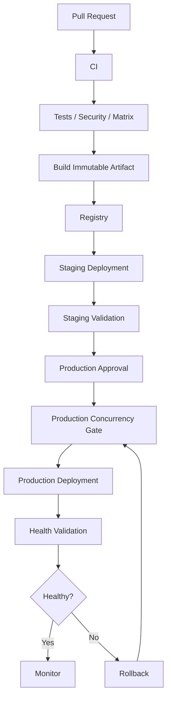

# 19- Concurrency and Race Conditions

## Overview

Concurrency is a critical part of production CI/CD design because multiple workflows, jobs, matrix executions, deployments, and infrastructure operations can execute at the same time.

GitHub Actions provides concurrency controls to coordinate these executions:

```text
Workflow
   ↓
Job
   ↓
Concurrency Group
   ↓
Execution Policy
```

Without deliberate concurrency design, production systems can experience:

- Duplicate deployments.
- Older releases overwriting newer releases.
- Conflicting infrastructure changes.
- Concurrent database migrations.
- Multiple workflows modifying the same environment.
- Race conditions between build and deployment jobs.
- Excessive CI cost.
- Inconsistent release state.

A useful mental model is:

```text
Concurrency
    ↓
Who can run simultaneously?
    ↓
Which executions share state?
    ↓
Which executions can cancel others?
    ↓
Which operations must be serialized?
```

The key distinction is:

> Parallel execution is desirable when work is independent. Serialization is required when concurrent executions can modify the same state.

---

## Parallelism vs Concurrency Control

Parallelism improves throughput.

For example:

```text
Python 3.11 ──┐
Python 3.12 ──┼──→ Test Result
Python 3.13 ──┘
```

These jobs are independent and should normally execute concurrently.

Production deployment is different:

```text
Deployment A ──→ Production
Deployment B ──→ Production
```

If both modify the same environment, concurrency can become a correctness problem.

Therefore:

| Workload | Typical strategy |
|---|---|
| Unit tests | Parallel |
| Matrix tests | Parallel |
| Independent lint jobs | Parallel |
| Docker builds | Often parallel |
| Different environment deployments | Can be parallel |
| Same production environment | Serialize |
| Shared Terraform state | Serialize |
| Destructive database migration | Carefully serialize |
| Release publication | Usually serialize |
| Deployment rollback | Serialize with deployments |

---

## Why Race Conditions Matter in CI/CD

A race condition occurs when the result depends on the timing or ordering of concurrent operations.

Consider:

```text
Commit A → Build A → Deploy A
Commit B → Build B → Deploy B
```

Suppose B starts later but finishes deployment first:

```text
Deploy B
   ↓
Production = B

Deploy A
   ↓
Production = A
```

The older commit has now overwritten the newer release.

This is a deployment race.

The workflows themselves may both report success, but the final system state is incorrect.

---

## Common CI/CD Race Conditions

Typical examples include:

- Two production deployments.
- Two staging deployments.
- Multiple Terraform applies.
- Concurrent database migrations.
- Multiple workflows publishing the same release.
- Simultaneous Docker tag updates.
- Concurrent environment configuration changes.
- Multiple rollback operations.
- Two workflows updating the same ECS service.
- Multiple workflows modifying Kubernetes manifests.
- Duplicate release creation.
- Cleanup jobs deleting artifacts still in use.

---

## GitHub Actions Concurrency

GitHub Actions supports concurrency groups.

Basic example:

```yaml
concurrency:
  group: production-deployment
  cancel-in-progress: false
```

This establishes a shared concurrency group.

The group represents a resource that should not be modified concurrently.

Examples:

```text
production-deployment
staging-deployment
terraform-production
release-publication
```

---

## Concurrency Group

A concurrency group is a logical coordination key.

For example:

```yaml
concurrency:
  group: production
  cancel-in-progress: false
```

All executions using the same group participate in the same concurrency policy.

A useful design question is:

> What shared resource am I protecting?

For example:

```text
production
```

protects a production environment.

```text
terraform-production
```

protects shared Terraform state and infrastructure.

```text
release-${{ github.ref }}
```

can coordinate work associated with a particular release reference.

---

## Workflow-Level Concurrency

Concurrency can be applied to an entire workflow.

```yaml
name: Deploy

on:
  push:
    branches:
      - main

concurrency:
  group: production-deployment
  cancel-in-progress: false

jobs:
  deploy:
    runs-on: ubuntu-latest
    steps:
      - run: ./deploy.sh
```

This prevents multiple workflow executions from concurrently operating on the protected deployment target.

---

## Job-Level Concurrency

Concurrency can also be applied to a specific job.

```yaml
jobs:
  test:
    runs-on: ubuntu-latest
    steps:
      - run: pytest

  deploy:
    runs-on: ubuntu-latest

    concurrency:
      group: production-deployment
      cancel-in-progress: false

    steps:
      - run: ./deploy.sh
```

This allows unrelated jobs to continue concurrently while serializing only the deployment operation.

This is often preferable when the workflow contains:

```text
Lint
Unit Tests
Integration Tests
Build
Deploy
```

because only deployment needs serialization.

---

## `cancel-in-progress`

The `cancel-in-progress` setting controls whether an existing execution is cancelled when another execution enters the same concurrency group.

```yaml
concurrency:
  group: ci-${{ github.workflow }}-${{ github.ref }}
  cancel-in-progress: true
```

This is useful for pull request CI.

If commits arrive quickly:

```text
Commit A → CI
Commit B → CI
Commit C → CI
```

older CI runs may become unnecessary.

Cancellation can reduce:

- Runner consumption.
- Build time.
- Queue pressure.
- CI cost.

---

## Production Deployment Concurrency

Production deployments normally require more caution.

Example:

```yaml
concurrency:
  group: production-deployment
  cancel-in-progress: false
```

Suppose:

```text
Release A → Deployment starts
Release B → Deployment starts
```

The desired behavior is usually:

```text
Release A → Complete
Release B → Deploy afterward
```

rather than:

```text
Release A → Cancel halfway
Release B → Start
```

A partially executed deployment may already have changed:

- Infrastructure.
- Database schema.
- Traffic routing.
- Service configuration.
- Running workloads.

Therefore blindly cancelling production deployments can increase risk.

---

## CI Concurrency vs CD Concurrency

| Concern | CI | CD |
|---|---|---|
| Goal | Reduce redundant work | Protect environment state |
| Typical cancellation | Yes | Usually no |
| Group | Branch/PR | Environment |
| Example | `ci-feature-x` | `production` |
| Shared state | Usually low | High |
| Main concern | Cost/time | Correctness/reliability |

---

## Pull Request Concurrency

For pull request validation:

```yaml
concurrency:
  group: ci-${{ github.workflow }}-${{ github.event.pull_request.number }}
  cancel-in-progress: true
```

If a developer pushes five commits:

```text
Commit 1 → CI
Commit 2 → CI
Commit 3 → CI
Commit 4 → CI
Commit 5 → CI
```

the workflow can prioritize the latest commit.

This is useful because the older commits are no longer the current candidate for merging.

---

## Branch-Based Concurrency

A branch-scoped group can be created using:

```yaml
concurrency:
  group: ci-${{ github.workflow }}-${{ github.ref }}
  cancel-in-progress: true
```

This allows independent branches to run concurrently:

```text
feature-a → group A
feature-b → group B
feature-c → group C
```

while preventing duplicate runs for the same branch.

---

## Environment-Based Concurrency

For deployments:

```yaml
concurrency:
  group: deploy-${{ inputs.environment }}
  cancel-in-progress: false
```

This can serialize deployments per environment.

Conceptually:

```text
staging → staging-deployment
production → production-deployment
```

This allows:

```text
Staging deployment
+
Production deployment
```

to proceed independently if the architecture permits it.

---

## Dynamic Concurrency Groups

Concurrency groups can be derived from workflow context.

Example:

```yaml
concurrency:
  group: deploy-${{ github.repository }}-${{ inputs.environment }}
  cancel-in-progress: false
```

This is useful when the same reusable workflow is used across repositories.

For example:

```text
repo-a + production
repo-b + production
```

produce different groups.

---

## Reusable Workflow Concurrency

A reusable deployment workflow can define its own concurrency policy:

```yaml
name: Reusable Deployment

on:
  workflow_call:
    inputs:
      environment:
        required: true
        type: string

jobs:
  deploy:
    runs-on: ubuntu-latest

    concurrency:
      group: deploy-${{ github.repository }}-${{ inputs.environment }}
      cancel-in-progress: false

    steps:
      - name: Deploy
        run: ./deploy.sh
```

This centralizes deployment protection across repositories.

---

## Concurrency and `needs`

Concurrency does not replace dependency graphs.

For example:

```yaml
jobs:
  test:
    runs-on: ubuntu-latest
    steps:
      - run: pytest

  build:
    needs: test
    runs-on: ubuntu-latest
    steps:
      - run: docker build .

  deploy:
    needs: build
    runs-on: ubuntu-latest
    steps:
      - run: ./deploy.sh
```

`needs` controls:

```text
Dependency ordering
```

Concurrency controls:

```text
Simultaneous execution
```

They solve different problems.

---

## `needs` vs Concurrency

| Mechanism | Purpose |
|---|---|
| `needs` | Defines job dependency |
| `if` | Defines conditional execution |
| `matrix` | Defines parallel variants |
| `concurrency` | Coordinates simultaneous executions |
| `environment` | Protects deployment targets |
| `continue-on-error` | Controls failure propagation |

A senior CI/CD design uses these mechanisms together rather than treating them as interchangeable.

---

## Matrix Jobs and Concurrency

Matrices intentionally create parallel jobs.

Example:

```yaml
strategy:
  matrix:
    python-version:
      - "3.11"
      - "3.12"
      - "3.13"
```

This produces:

```text
Python 3.11 ──┐
Python 3.12 ──┼──→ Test
Python 3.13 ──┘
```

Do not serialize independent matrix jobs merely because they belong to the same workflow.

Use concurrency only when the matrix variants share a resource.

---

## Matrix Resource Contention

A matrix can unintentionally overwhelm shared dependencies.

For example:

```yaml
matrix:
  python:
    - "3.11"
    - "3.12"
    - "3.13"

  database:
    - postgres
    - mysql
```

This creates six jobs.

If every job connects to the same database cluster:

```text
6 CI jobs
   ↓
Shared PostgreSQL
```

the test infrastructure can become the bottleneck.

Use:

```yaml
strategy:
  max-parallel: 3
```

when downstream capacity requires it.

---

## Concurrency vs `max-parallel`

These solve different problems.

```yaml
strategy:
  max-parallel: 3
```

limits simultaneous matrix jobs within a matrix strategy.

Concurrency groups coordinate executions that share a logical resource.

| Feature | Scope | Main purpose |
|---|---|---|
| `max-parallel` | Matrix | Limit matrix fan-out |
| `concurrency` | Workflow/job | Protect shared state |

---

## Race Conditions in Docker Publishing

Consider:

```text
Build A → backend:latest
Build B → backend:latest
```

If both push the same mutable tag:

```text
A pushes
B pushes
A finishes
B finishes
```

the final meaning of `latest` depends on push ordering.

Use immutable tags:

```text
backend:<commit-sha>
```

and promote immutable digests.

Avoid using concurrency as the only protection for mutable production tags.

Artifact immutability is a stronger correctness mechanism.

---

## Race Conditions in ECR

A dangerous pattern is:

```text
Build A → ECR:latest
Build B → ECR:latest
```

Production may deploy whichever image currently owns the tag.

Prefer:

```text
Build A → ECR:sha-A
Build B → ECR:sha-B
```

Then production explicitly selects:

```text
sha-A
```

or:

```text
sha-B
```

The deployment should not need to guess what a mutable tag means.

---

## Release Concurrency

Release publication should usually be serialized.

Example:

```yaml
concurrency:
  group: release-publication
  cancel-in-progress: false
```

This protects operations such as:

- Creating releases.
- Publishing release artifacts.
- Updating release metadata.
- Generating release packages.
- Publishing packages.

Two simultaneous release workflows can otherwise produce inconsistent release state.

---

## Terraform Race Conditions

Terraform state is shared state.

Consider:

```text
Workflow A → terraform plan → terraform apply
Workflow B → terraform plan → terraform apply
```

Both workflows may make assumptions based on different state snapshots.

Use a protected deployment path:

```yaml
concurrency:
  group: terraform-production
  cancel-in-progress: false
```

Terraform's state locking remains important, but GitHub Actions concurrency can prevent unnecessary competing workflow executions before they reach Terraform.

---

## Terraform Concurrency Design

A useful architecture is:

```text
Pull Requests
    ↓
terraform plan
    ↓
Review
    ↓
Merge
    ↓
Production apply
    ↓
Concurrency group
    ↓
Terraform state
```

Only the state-changing operation should generally be serialized.

Independent plans can often run concurrently.

---

## Database Migration Race Conditions

Suppose two deployment workflows both execute:

```bash
python manage.py migrate
```

Concurrent migrations can cause:

- Lock contention.
- Duplicate migration attempts.
- Conflicting schema transitions.
- Longer deployment times.
- Unexpected application behavior.

Production database migrations should have explicit ownership and serialization.

A useful pattern is:

```text
Build
 ↓
Test
 ↓
Migration compatibility check
 ↓
Serialized migration
 ↓
Application rollout
```

---

## Migration Concurrency with Rolling Deployments

A rolling deployment can temporarily contain:

```text
Application v1
+
Application v2
```

Therefore the database schema must support both versions during the transition.

Use:

```text
Expand
 ↓
Deploy compatible application
 ↓
Backfill
 ↓
Switch behavior
 ↓
Contract
```

Avoid migrations that immediately remove columns or change semantics required by the old version.

---

## Celery Race Conditions

Deployment concurrency also affects workers.

Suppose:

```text
Worker v1
Worker v2
```

run simultaneously.

A task published by v1 may be consumed by v2.

Therefore task payloads should remain backward compatible during deployment.

For critical migrations:

```text
Application compatibility
+
Worker compatibility
+
Message compatibility
```

must be considered together.

---

## Kafka Race Conditions

Kafka consumers can have multiple application versions running concurrently.

Potential problems include:

- Incompatible message schemas.
- Different processing semantics.
- Duplicate processing.
- Consumer group transitions.
- Offset behavior.

Use compatible event schemas and explicit rollout strategies.

Deployment concurrency protects the release process but does not replace application-level idempotency.

---

## Idempotency

Concurrency control reduces duplicate execution, but robust systems also use idempotency.

An operation is idempotent when executing it multiple times produces the same intended state.

For example:

```text
Set deployment to image X
```

is generally easier to make idempotent than:

```text
Increment deployment counter
```

Deployment APIs and scripts should prefer desired-state operations.

---

## Deployment Locks

Some systems require explicit locks.

For example:

```text
Production deployment lock
```

can protect:

```text
Database migration
Traffic switching
Infrastructure update
```

However, locks should have:

- Clear ownership.
- Timeouts.
- Recovery procedures.
- Observability.
- Stale-lock handling.

A lock without an expiration strategy can become an availability problem.

---

## Stale Lock Problems

Consider:

```text
Deployment A
 ↓
Acquires lock
 ↓
Runner crashes
```

If the lock remains indefinitely:

```text
Deployment B
 ↓
Blocked forever
```

Therefore distributed locking systems should define:

```text
Lease duration
Heartbeat
Expiration
Recovery
```

GitHub Actions concurrency reduces the need for application-managed locks for many workflow-level coordination problems, but external shared resources may still require their own locking semantics.

---

## Concurrency and Environment Protection

GitHub Environments provide deployment controls such as:

- Required reviewers.
- Environment secrets.
- Deployment history.
- Protection rules.

Combine environment protection with concurrency.

Example:

```yaml
jobs:
  deploy:
    environment:
      name: production

    concurrency:
      group: production-deployment
      cancel-in-progress: false
```

Conceptually:

```text
Workflow
   ↓
Concurrency gate
   ↓
Environment protection
   ↓
Approval
   ↓
Deployment
```

The exact ordering of platform-level scheduling and protection behavior should not be assumed to replace explicit workflow dependencies.

---

## Concurrency and Manual Approval

Suppose:

```text
Release A → Waiting for approval
Release B → Waiting for approval
```

Both can become operationally confusing if they target the same production environment.

Production workflows should define:

```text
Which release is eligible?
Which deployment owns the environment?
Can a newer release supersede an older pending deployment?
```

For sensitive production deployments, prefer explicit promotion workflows and immutable artifact references.

---

## Pending Deployment Strategy

A useful release architecture is:

```text
Build
 ↓
Test
 ↓
Publish immutable artifact
 ↓
Staging
 ↓
Approval
 ↓
Production concurrency
 ↓
Deploy
```

This avoids rebuilding while waiting for approval.

The artifact remains fixed while the deployment waits.

---

## Concurrency and Rollbacks

Rollback must participate in the same deployment coordination model.

Consider:

```text
Deployment A → Running
Rollback B   → Running
```

If both modify production simultaneously, the result is unpredictable.

Therefore:

```yaml
concurrency:
  group: production-deployment
  cancel-in-progress: false
```

should normally cover both forward deployments and rollback operations.

---

## Race Condition During Rollback

Example:

```text
Production = v2

Deploy v3 starts
   ↓
Health failure

Rollback v2 starts
   ↓
Deploy v3 finishes late
```

The final state could unexpectedly become:

```text
v3
```

even though rollback was requested.

This is a classic deployment race.

Rollback must coordinate with the same production deployment lock or concurrency group.

---

## Concurrency and Blue/Green

Blue/green deployments involve shared traffic state:

```text
Blue  → Current
Green → Candidate
```

Traffic switching is a critical section.

Do not allow:

```text
Deployment A → switch traffic
Deployment B → switch traffic
Rollback C → switch traffic
```

simultaneously.

The traffic switch should be coordinated through deployment concurrency.

---

## Concurrency and Canary

Canary deployments introduce additional state:

```text
1%
5%
25%
50%
100%
```

Concurrent promotions can cause unexpected traffic distribution.

Protect:

```text
Canary rollout
Traffic weights
Promotion
Rollback
```

with a common deployment coordination mechanism.

---

## Kubernetes Concurrency

Kubernetes controllers continuously reconcile desired state.

GitHub Actions should therefore avoid unnecessarily fighting the cluster.

For example:

```text
Workflow A → kubectl apply
Workflow B → kubectl apply
```

can produce last-writer-wins behavior for overlapping resources.

Prefer:

- Declarative manifests.
- GitOps where appropriate.
- Immutable image references.
- Controlled promotion.
- One authoritative deployment mechanism.

---

## ECS Concurrency

Two workflows updating the same ECS service can race:

```text
Task Definition A
Task Definition B
```

If both call:

```bash
aws ecs update-service
```

the final service configuration may depend on which update wins.

Serialize production ECS deployments.

---

## Lambda Concurrency

Lambda deployment workflows can race when multiple versions or aliases are modified.

For example:

```text
Workflow A → publish version 10 → alias production
Workflow B → publish version 11 → alias production
```

Coordinate alias changes.

Use immutable function versions and controlled alias promotion.

---

## Feature Flags and Concurrency

Feature flags can reduce deployment coupling.

Instead of:

```text
Deploy new code
+
Immediately activate behavior
```

use:

```text
Deploy compatible code
 ↓
Validate
 ↓
Enable feature
```

This allows behavior changes to be coordinated separately.

However, flag updates themselves can become shared state and may require their own governance.

---

## Concurrency and Microservices

A microservice architecture may have:

```text
Service A
Service B
Service C
```

Some services can deploy concurrently if they are independent.

Do not create a global deployment lock unless necessary.

Prefer resource-specific groups:

```text
deploy-service-a-production
deploy-service-b-production
deploy-service-c-production
```

But if services share a resource such as:

```text
Database schema
Shared API gateway
Shared infrastructure
```

the concurrency boundary may need to cover that shared resource.

---

## Choosing the Correct Concurrency Boundary

The concurrency group should protect the smallest resource that must be serialized.

Too broad:

```text
production
```

for every operation in an entire organization.

Too narrow:

```text
deployment-${{ github.run_id }}
```

which provides no coordination because every run gets a unique group.

A better design is:

```text
deploy-${{ repository }}-${{ environment }}
```

when deployments are independent per repository/environment.

---

## Concurrency Boundary Examples

| Shared resource | Suggested group |
|---|---|
| PR CI | Workflow + PR |
| Staging environment | Repository + staging |
| Production | Repository + production |
| Terraform state | State/environment |
| Release publication | Repository release |
| Shared database migration | Database/environment |
| Service deployment | Service + environment |
| Cluster-wide rollout | Cluster/environment |

The correct boundary should follow the resource being protected.

---

## Concurrency and Workflow Triggers

Duplicate triggers can unintentionally create concurrent runs.

For example:

```yaml
on:
  push:
    branches:
      - main
  pull_request:
    branches:
      - main
```

A pull request merge can result in:

```text
PR workflow
+
push workflow
```

Depending on the desired architecture, this may duplicate validation or deployment work.

Use trigger design and concurrency together.

Concurrency is not a substitute for correct event selection.

---

## Concurrency and `workflow_run`

A workflow triggered by another workflow can create another execution chain:

```text
CI
 ↓
workflow_run
 ↓
Deployment
```

Ensure that the downstream deployment is associated with the intended artifact and commit.

Do not assume that the latest branch state is necessarily the artifact that triggered the upstream workflow.

---

## Concurrency and Reusable Workflows

Reusable workflows centralize deployment behavior.

Example:

```text
Repository A ──┐
Repository B ──┼──→ Reusable Deploy Workflow
Repository C ──┘
```

The concurrency key should include enough identity to prevent unrelated repositories or environments from blocking each other.

Example:

```yaml
concurrency:
  group: deploy-${{ github.repository }}-${{ inputs.environment }}
  cancel-in-progress: false
```

---

## Concurrency and Custom Actions

Custom actions generally execute within a job and do not provide workflow-level deployment coordination.

Therefore:

```text
Composite Action
```

should not be treated as a substitute for:

```text
Concurrency group
```

The reusable workflow or calling workflow should own deployment orchestration.

---

## Security Implications

Concurrency is also a security control.

Without serialization:

- An older release may overwrite a security fix.
- A rollback can race with a deployment.
- Infrastructure changes can conflict.
- Production configuration can become unpredictable.

However, concurrency does not provide authorization.

You still need:

- Least-privilege permissions.
- Environment protection.
- OIDC.
- IAM controls.
- Secret protection.
- Runner isolation.

---

## Self-Hosted Runner Concurrency

Persistent self-hosted runners can introduce local state races.

Examples:

```text
Shared workspace
Docker cache
Temporary files
Build outputs
Credentials
```

A persistent runner should not allow one job to consume another job's workspace or artifacts.

Prefer:

- Isolated workspaces.
- Cleanup.
- Ephemeral runners.
- Dedicated runner groups.
- Controlled labels.

Concurrency groups protect workflow-level state but do not automatically clean local runner state.

---

## Docker Cache Concurrency

Shared Docker caches can improve performance but introduce coordination concerns.

Avoid making cache correctness a prerequisite for deployment.

A safe architecture is:

```text
Cache
 ↓
Faster build

Artifact
 ↓
Actual release
```

If the cache disappears:

```text
Build becomes slower
```

but should still succeed.

---

## Artifact Concurrency

Artifact names can collide if multiple jobs publish the same name.

Prefer unique identities:

```yaml
name: test-report-${{ github.run_id }}-${{ matrix.python-version }}
```

or:

```text
artifact-${commit}-${matrix_dimension}
```

This prevents unrelated executions from overwriting or confusing artifacts.

---

## Cache Key Concurrency

Cache keys should reflect the dependency inputs.

Example:

```yaml
key: ${{ runner.os }}-python-${{ hashFiles('**/requirements.lock') }}
```

Avoid using a broad shared key when incompatible dependency sets can write to the same cache namespace.

---

## Concurrency and Outputs

Job outputs are tied to workflow execution.

Do not assume a later workflow can consume the output of an earlier workflow directly.

For cross-workflow artifact promotion, use a durable release reference such as:

```text
Image digest
Release ID
Artifact ID
Commit SHA
```

The deployment should not derive artifact identity from the latest workflow state.

---

## Observability

Concurrency decisions should be visible.

Useful deployment metadata:

```text
Workflow run ID
Commit SHA
Artifact digest
Environment
Concurrency group
Deployment ID
Start time
Queue time
Completion time
Rollback status
```

A high queue time may indicate:

```text
Concurrency contention
```

rather than runner shortage.

---

## Diagnosing a Concurrency Problem

### Symptom

A deployment is waiting unexpectedly.

### Possible causes

- Another execution owns the concurrency group.
- Environment approval is pending.
- Runner capacity is unavailable.
- A previous workflow is still active.
- A stale external lock exists.

### Isolation

Inspect workflow runs:

```bash
gh run list
```

Inspect a specific run:

```bash
gh run view <run-id>
```

Check deployment status and environment protection.

### Prevention

Use explicit concurrency naming and document which resource each group protects.

---

## Diagnosing a Race Condition

### Symptom

The final production state does not match the newest release.

### Possible causes

- Concurrent deployments.
- Mutable image tags.
- Late completion of an older workflow.
- Manual rollback racing with deployment.
- Multiple infrastructure pipelines.
- Shared configuration changes.

### Isolation strategy

Reconstruct:

```text
Run A start
Run A deploy
Run B start
Run B deploy
Run A finish
Run B finish
```

Compare:

```text
Commit SHA
Image digest
Deployment timestamps
Target state
```

### Corrective action

Introduce:

```text
Immutable artifact
+
Deployment concurrency
+
Explicit promotion
```

---

## Diagnosing Duplicate Deployments

### Symptom

The same commit appears to deploy twice.

Check:

```text
push
pull_request
workflow_run
workflow_dispatch
release
```

Also inspect reusable workflow callers.

Use:

```bash
gh run list --limit 30
```

Look for:

- Same commit.
- Different workflow.
- Different trigger.
- Same environment.

The solution may be trigger cleanup rather than adding more concurrency.

---

## Diagnosing an Older Release Overwriting a Newer Release

### Symptom

Production unexpectedly runs an older commit.

Check:

1. Deployment timestamps.
2. Image digest.
3. Git commit.
4. Workflow run ID.
5. Concurrency configuration.
6. Mutable tags.

If:

```text
A = older
B = newer
```

and:

```text
Deploy B
Deploy A
```

occur in that order, the problem is likely deployment serialization or artifact selection.

---

## GitHub CLI Operational Commands

List recent workflow runs:

```bash
gh run list --limit 20
```

Inspect a run:

```bash
gh run view <run-id>
```

Inspect logs:

```bash
gh run view <run-id> --log
```

List workflows:

```bash
gh workflow list
```

Run a workflow manually:

```bash
gh workflow run deploy.yml
```

Rerun failed jobs:

```bash
gh run rerun <run-id> --failed
```

Inspect deployments:

```bash
gh api repos/{owner}/{repo}/deployments
```

Inspect deployment statuses:

```bash
gh api repos/{owner}/{repo}/deployments/{deployment_id}/statuses
```

These commands help reconstruct the execution timeline during incidents.

---

## Production Reference Architecture



The concurrency gate should cover:

```text
Deployment
+
Rollback
+
Traffic switching
```

when those operations modify the same production state.

---

## Recommended Production Workflow

A mature pipeline can use:

```text
Pull Request
    ↓
Lint
    ↓
Unit Tests ───────────┐
    ↓                 │
Integration Tests ────┤
    ↓                 │
Security Scan ────────┤
    ↓                 │
Matrix Tests ─────────┘
    ↓
Build
    ↓
Immutable Image
    ↓
ECR
    ↓
Staging
    ↓
Validation
    ↓
Approval
    ↓
Production Concurrency Gate
    ↓
Production
    ↓
Health Validation
    ↓
Monitoring
    ↓
Rollback if required
```

Parallelism is used where work is independent.

Serialization is used where shared state requires it.

---

## Common Mistakes

### Using one global concurrency group

This can unnecessarily serialize unrelated repositories and environments.

### Cancelling production deployments

A running deployment may already have changed state.

### Relying only on concurrency

Concurrency does not make mutable tags immutable or deployment scripts idempotent.

### Using mutable Docker tags

`latest` does not provide reliable artifact identity.

### Serializing all matrix tests

This removes useful parallelism and increases CI duration.

### Ignoring downstream capacity

Parallel jobs can overwhelm PostgreSQL, Redis, Kafka, or external APIs.

### Running database migrations concurrently

Schema changes often require explicit serialization.

### Allowing rollback outside deployment coordination

Rollback can race with a forward deployment.

### Assuming workflow order equals deployment order

Concurrent workflows can finish in a different order from their start order.

### Using workflow dependencies as resource locks

`needs` controls job ordering within a workflow; it does not globally lock production.

---

## Senior Design Principles

### Protect resources, not workflows

The important question is:

```text
What shared state must remain consistent?
```

not:

```text
Which workflow should be locked?
```

### Prefer the smallest correct concurrency boundary

Do not serialize unrelated workloads.

### Combine concurrency with immutable artifacts

Concurrency protects execution ordering.

Immutable artifacts protect release identity.

You generally need both.

### Make deployment operations idempotent

A retry should converge toward the intended state.

### Design rollback as a deployment

Rollback should use the same protection mechanisms as forward deployment.

### Keep shared state explicit

Databases, Terraform state, deployment targets, traffic routing, and release metadata require deliberate coordination.

---

## Interview Scenarios

### Two developers merge to `main` within seconds. Both deployments start.

Discuss:

- Production concurrency.
- Immutable image tags/digests.
- Deployment ordering.
- Whether the older release should deploy.
- Rollback semantics.

### CI takes 20 minutes because matrix jobs are serialized.

Explain the difference between:

```text
max-parallel
```

and:

```text
concurrency
```

Then identify which matrix dimensions are truly independent.

### Two Terraform workflows run simultaneously.

Discuss:

- Terraform state locking.
- GitHub Actions concurrency.
- State ownership.
- Plan vs apply.
- Drift.
- Failure recovery.

### A rollback runs while a deployment is still active.

Explain why both should participate in the same production concurrency boundary.

### A newer Docker image is deployed, but an older image appears afterward.

Investigate:

```text
Mutable tags
+
Concurrent deployments
+
Deployment completion order
+
Artifact identity
```

### PostgreSQL becomes overloaded during integration testing.

Discuss:

- Matrix cardinality.
- `max-parallel`.
- Shared database capacity.
- Isolated databases.
- Service containers.
- Test sharding.

### A reusable deployment workflow is used by 30 repositories.

Explain how the concurrency key should include:

```text
Repository
+
Environment
```

when those deployments are independent.

### A deployment workflow is cancelled halfway through.

Discuss:

- Partial infrastructure changes.
- Database migrations.
- Traffic state.
- Artifact identity.
- Recovery.
- Whether the next deployment can safely continue.

---

## Production Checklist

### CI

- [ ] Independent tests run in parallel.
- [ ] Matrix size is controlled.
- [ ] `max-parallel` matches downstream capacity.
- [ ] Duplicate triggers are understood.
- [ ] CI concurrency cancels obsolete work where appropriate.

### Artifact

- [ ] Images use immutable identifiers.
- [ ] Image digest is recorded.
- [ ] Mutable tags are not the source of production truth.
- [ ] Artifact promotion does not rebuild the image.

### Deployment

- [ ] Production deployments use a concurrency group.
- [ ] Rollbacks share the deployment concurrency boundary.
- [ ] Environment protection is configured.
- [ ] Deployment approvals are explicit.
- [ ] Deployment operations are idempotent.
- [ ] Concurrent infrastructure changes are controlled.

### Database

- [ ] Migrations are serialized where necessary.
- [ ] Schema changes support rolling deployments.
- [ ] Expand-and-contract is used for incompatible changes.
- [ ] Migration rollback implications are understood.

### Operations

- [ ] Workflow run IDs are traceable.
- [ ] Deployment IDs are recorded.
- [ ] Artifact digests are recorded.
- [ ] Queue and execution times are observable.
- [ ] Deployment state can be reconstructed during incidents.
- [ ] Recovery procedures are documented.

### Security

- [ ] Least-privilege permissions are used.
- [ ] Production environments are protected.
- [ ] OIDC is used for AWS authentication where applicable.
- [ ] Privileged runners are isolated.
- [ ] Untrusted workflows cannot modify protected environments.

---

## Key Takeaways

- Use parallelism for independent CI work and concurrency controls for operations that modify shared state such as production, Terraform state, releases, migrations, and traffic routing.
- `needs`, `max-parallel`, and `concurrency` solve different problems: dependency ordering, matrix fan-out control, and cross-execution coordination.
- Production deployments and rollbacks should normally share the same concurrency boundary, while immutable image digests provide deterministic artifact identity.
- Concurrency alone is not sufficient; combine it with idempotent operations, backward-compatible migrations, environment protection, and explicit artifact promotion.
- The correct concurrency boundary is the smallest shared resource that must be serialized, allowing unrelated services, environments, and test dimensions to continue operating in parallel.