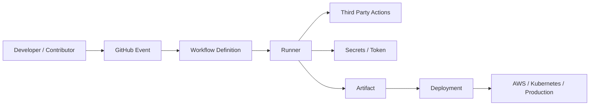
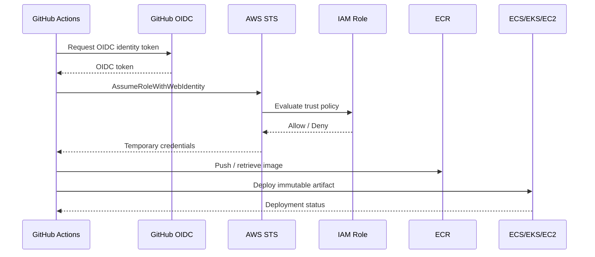
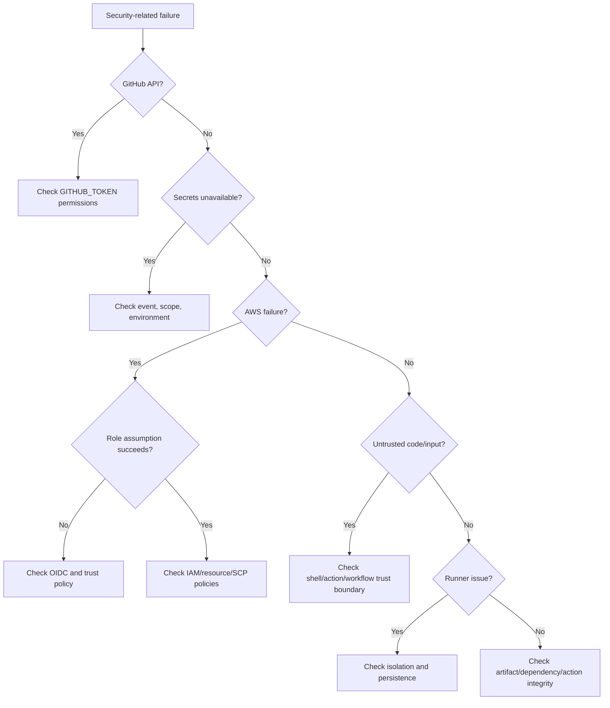

# 20- Security Related Failures

## Overview

Security-related failures in GitHub Actions are different from ordinary workflow failures because the immediate symptom may be a failed command while the underlying problem is a trust-boundary violation, excessive privilege, secret exposure, unsafe input handling, or compromised execution environment.

A production CI/CD pipeline should treat security as part of workflow correctness:

```text
Source
  ↓
Workflow
  ↓
Runner
  ↓
Actions
  ↓
Credentials
  ↓
Artifacts
  ↓
Deployment
  ↓
Production
```

Every boundary introduces potential failure modes.

Typical symptoms include:

- `Resource not accessible by integration`
- `403 Forbidden`
- Missing secrets.
- AWS `AccessDenied`.
- OIDC role assumption failures.
- An action unexpectedly accessing protected resources.
- Secrets appearing in logs or artifacts.
- Pull request workflows behaving differently for forks.
- A deployment unexpectedly running from an untrusted branch.
- Docker builds failing because credentials are unavailable.
- Security scans failing because `security-events` permissions are missing.
- A self-hosted runner executing untrusted code.
- A previously trusted third-party action changing behavior.

The troubleshooting objective is not simply to make the workflow green.

The objective is:

```text
Restore intended functionality
+
Preserve the intended security boundary
+
Prevent recurrence
```

---

## Security Failure Domains

Security failures should be classified before changing permissions or adding secrets.

| Failure domain | Typical symptom | Primary investigation |
|---|---|---|
| `GITHUB_TOKEN` | 403 / permission denied | `permissions:` |
| Secrets | Empty secret / unavailable credential | Secret scope and event |
| Environment | Approval or secret unavailable | Environment protection |
| Fork PR | Secrets unavailable | Event trust model |
| `pull_request_target` | Unexpected privileged execution | Workflow trust boundary |
| Shell injection | Unexpected command execution | Untrusted input handling |
| Third-party action | Unexpected behavior | Action source/version/SHA |
| OIDC | AWS role assumption failure | Provider/trust policy |
| AWS IAM | `AccessDenied` | Trust vs permissions |
| Runner | Suspicious filesystem/network behavior | Runner isolation |
| Artifact | Unexpected or modified artifact | Artifact integrity |
| Supply chain | Dependency/action compromise | Dependency and provenance |
| Container | Credential or host access issue | Docker/runtime boundary |
| Deployment | Unauthorized production change | Environment/permissions |
| Security scan | Scan cannot publish results | Token permissions |
| Self-hosted runner | Persistent compromise | Runner lifecycle/isolation |

---

## A Security Troubleshooting Model

Use the same investigation sequence for every security-related failure:

```text
Symptom
   ↓
Possible Causes
   ↓
Identify Trust Boundary
   ↓
Check Event and Actor
   ↓
Check Permissions
   ↓
Check Secrets / Credentials
   ↓
Check Runner
   ↓
Check Action / Dependency
   ↓
Check External Authorization
   ↓
Root Cause
   ↓
Corrective Action
   ↓
Prevention
```

Do not begin by granting:

```yaml
permissions: write-all
```

or by adding long-lived credentials.

That often hides the real problem while expanding the attack surface.

---

## Trust Boundaries

A GitHub Actions workflow crosses several trust boundaries.



Each boundary should answer:

- Who controls the input?
- Who can modify the workflow?
- What permissions are available?
- Which secrets are accessible?
- Which network resources are reachable?
- What state can be modified?

---

## First Diagnostic Question: What Event Started the Workflow?

Before investigating credentials, identify the trigger.

Examples:

```yaml
on:
  push:
    branches:
      - main

  pull_request:

  pull_request_target:

  workflow_dispatch:
```

The event determines important security properties.

Check:

```text
Event
Repository
Branch
Commit
Actor
Head repository
Base repository
Fork status
Environment
```

A workflow that succeeds on `push` to a trusted branch may intentionally fail on a forked `pull_request`.

---

## `pull_request` and Security Boundaries

For ordinary pull request workflows:

```yaml
on:
  pull_request:
```

the workflow runs in the pull request security context.

Forked pull requests are particularly important because the contributor's code may not be trusted.

Do not assume:

```text
Pull request exists
    =
Contributor is trusted
```

A pull request can modify code that executes in the runner.

---

## Why Secrets Are Often Unavailable in Fork PRs

A common symptom is:

```text
AWS credentials are empty
```

or:

```text
API token is unavailable
```

when the same workflow works on internal branches.

Possible explanation:

```text
Fork PR
   ↓
Untrusted source
   ↓
Secrets intentionally restricted
```

This is a security boundary, not necessarily a configuration defect.

Do not solve it by exposing production secrets to untrusted pull request code.

---

## `pull_request_target`

`pull_request_target` executes in the context of the base repository.

It can therefore have access to repository-level privileges and secrets that ordinary fork pull request workflows do not receive.

This makes it powerful and dangerous.

The critical mistake is:

```yaml
on:
  pull_request_target:

steps:
  - uses: actions/checkout@v4
    with:
      ref: ${{ github.event.pull_request.head.sha }}

  - run: ./build.sh
```

The workflow has potentially privileged access while executing code supplied by the pull request.

The security boundary has been crossed.

---

## Safe Pattern for Pull Request Metadata

If the purpose is to process pull request metadata, avoid executing the contributor's code.

For example:

```yaml
on:
  pull_request_target:

permissions:
  pull-requests: read

jobs:
  inspect:
    runs-on: ubuntu-latest
    steps:
      - name: Read metadata
        env:
          PR_TITLE: ${{ github.event.pull_request.title }}
        run: |
          printf '%s\n' "$PR_TITLE"
```

The principle is:

```text
Privileged context
+
Trusted workflow logic
+
No execution of untrusted repository code
```

---

## `GITHUB_TOKEN` Failures

A common error is:

```text
Resource not accessible by integration
```

or:

```text
403 Forbidden
```

The workflow may be authenticated but lack authorization.

Authentication:

```text
GitHub knows who the workflow represents.
```

Authorization:

```text
GitHub determines what that identity may do.
```

The relevant control is:

```yaml
permissions:
```

---

## Least-Privilege Permissions

Prefer explicit permissions.

Example:

```yaml
permissions:
  contents: read
```

For a job that needs additional permissions:

```yaml
jobs:
  release:
    permissions:
      contents: write
      packages: write
```

Do not grant write access globally when only one job needs it.

---

## Common Permission Requirements

| Operation | Typical permission |
|---|---|
| Checkout repository | `contents: read` |
| Modify repository contents | `contents: write` |
| Pull request metadata | `pull-requests: read` |
| Modify pull requests | `pull-requests: write` |
| Packages | `packages` |
| OIDC | `id-token: write` |
| Security results | `security-events: write` |
| Actions metadata | `actions` |

The exact permission required depends on the API or action being used.

---

## Diagnosing `GITHUB_TOKEN` Failures

### Symptom

```text
403 Forbidden
```

### Possible causes

- Missing permission.
- Job-level permissions override workflow permissions.
- Repository policy restricts the operation.
- Fork workflow has restricted permissions.
- Environment protection prevents deployment.
- Action expects a permission that was not granted.

### Isolation

Inspect the workflow:

```yaml
permissions:
  contents: read
```

Then inspect job-level overrides:

```yaml
jobs:
  deploy:
    permissions:
      ...
```

A job-level `permissions` block can change the effective permission set.

---

## Permission Debugging

A useful diagnostic sequence is:

```text
What API is failing?
        ↓
What token is being used?
        ↓
What permission does the API require?
        ↓
Is that permission granted?
        ↓
Is the workflow event allowed to receive it?
        ↓
Is a repository/organization policy restricting it?
```

Avoid solving an authorization problem by granting every available permission.

---

## Environment Protection Failures

A deployment may fail or remain blocked because of:

- Required reviewers.
- Branch restrictions.
- Environment protection rules.
- Environment secrets.
- Deployment policy.

Example:

```yaml
jobs:
  deploy:
    environment:
      name: production
```

The job may have valid GitHub permissions and still not be authorized to deploy.

---

## Environment Secrets

Environment secrets are associated with an environment.

For example:

```text
development
staging
production
```

A workflow referencing:

```yaml
environment:
  name: production
```

can receive the relevant environment configuration subject to the environment's protection rules.

Do not assume repository secrets and environment secrets have identical availability.

---

## Secret Availability Failures

A secret can appear unavailable because:

- The secret name is incorrect.
- The secret is not defined at the expected scope.
- The workflow event does not permit access.
- The environment has not been selected.
- A reusable workflow was not passed the required secret.
- The secret is intentionally unavailable to a fork.
- Organization policies restrict access.

Use:

```yaml
env:
  API_TOKEN: ${{ secrets.API_TOKEN }}
```

rather than embedding secrets directly in commands.

---

## Secret Masking Is Not a Security Boundary

GitHub attempts to mask registered secret values in logs, but masking is not equivalent to secure secret handling.

Avoid:

```yaml
run: |
  echo "${{ secrets.API_TOKEN }}"
```

Even when masking works, logging secrets is unnecessary.

Also avoid passing secrets through:

- Command arguments.
- URLs.
- Artifact files.
- Docker image layers.
- Build output.
- Debug logs.

---

## Secret Exposure Through Command Arguments

Avoid:

```yaml
run: deploy --token "${{ secrets.API_TOKEN }}"
```

Command arguments may be visible through process inspection or tooling.

Prefer environment-based credential handling when supported:

```yaml
env:
  API_TOKEN: ${{ secrets.API_TOKEN }}

run: deploy
```

The deployment program should read the credential from its expected environment or credential provider.

---

## Secret Exposure Through Artifacts

Never upload:

```text
.env
credentials.json
AWS credential files
private keys
database dumps containing credentials
```

as debugging artifacts.

A dangerous pattern is:

```yaml
- run: env > debug.txt

- uses: actions/upload-artifact@v4
  with:
    path: debug.txt
```

This can capture secrets from the environment.

---

## Secret Exposure Through Docker

Avoid:

```dockerfile
ARG AWS_SECRET_ACCESS_KEY
ENV AWS_SECRET_ACCESS_KEY=$AWS_SECRET_ACCESS_KEY
```

Secrets passed through Docker build arguments can become visible through image metadata or layers.

For builds requiring secrets, use BuildKit secret mounts where supported.

Example:

```yaml
- name: Build image
  uses: docker/build-push-action@v6
  with:
    context: .
    push: false
    secrets: |
      pip_token=${{ secrets.PIP_TOKEN }}
```

The secret should be consumed only during the required build step and should not become part of the final image.

---

## Shell Injection

GitHub event data can be attacker-controlled.

Examples include:

- Pull request title.
- Branch name.
- Commit message.
- Issue content.
- Manual workflow input.
- External API data.

Unsafe:

```yaml
- run: echo "${{ github.event.pull_request.title }}"
```

The expression is substituted before the shell executes the command.

A safer approach is to pass the value through an environment variable:

```yaml
- name: Process PR title
  env:
    PR_TITLE: ${{ github.event.pull_request.title }}
  run: |
    printf '%s\n' "$PR_TITLE"
```

The shell receives the value as data rather than as part of the command source.

---

## Python Subprocess Injection

The same principle applies to Python.

Avoid:

```python
import os
import subprocess

branch = os.environ["BRANCH"]
subprocess.run(f"deploy --branch {branch}", shell=True, check=True)
```

Prefer:

```python
import os
import subprocess

branch = os.environ["BRANCH"]

subprocess.run(
    ["deploy", "--branch", branch],
    check=True,
)
```

Better still, validate the value against an explicit allowlist when the domain is constrained.

---

## Branch Names Are Not Automatically Safe

A branch name may contain characters that affect shell interpretation.

Do not assume:

```text
github.ref
```

is safe to interpolate directly into shell code.

Use:

```yaml
env:
  REF_NAME: ${{ github.ref_name }}
```

and treat it as data.

---

## Manual Inputs Are Also Untrusted

A `workflow_dispatch` input is user-controlled.

Example:

```yaml
on:
  workflow_dispatch:
    inputs:
      environment:
        required: true
        type: choice
        options:
          - staging
          - production
```

Using a typed choice with an allowlist is safer than accepting arbitrary strings.

For deployment workflows, validate environment names before selecting credentials or infrastructure.

---

## Dynamic Matrices and Security

Dynamic matrices can be generated from JSON.

Example:

```yaml
strategy:
  matrix: ${{ fromJSON(needs.plan.outputs.matrix) }}
```

The generated JSON becomes workflow control data.

If attacker-controlled content can influence:

- Commands.
- Runner labels.
- Image references.
- Paths.
- Environment names.
- Deployment targets.

then matrix generation becomes a security boundary.

Validate dynamic configuration before using it.

---

## Third-Party Action Failures

A third-party action runs code in the workflow environment.

Therefore:

```text
uses: some/action@...
```

is equivalent to introducing executable code into your trusted pipeline.

Security failures can result from:

- Malicious action.
- Compromised maintainer account.
- Vulnerable dependency.
- Unexpected action update.
- Excessive token permissions.
- Unsafe action inputs.
- Secret access.

---

## SHA Pinning

Prefer immutable action references when organizational policy requires strong supply-chain controls.

Example:

```yaml
- uses: actions/checkout@<verified-commit-sha>
```

A version tag such as:

```yaml
- uses: actions/checkout@v4
```

is easier to maintain but is mutable.

SHA pinning improves reproducibility and reduces the risk of a tag being moved unexpectedly.

The trade-off is update maintenance.

---

## Third-Party Action Permissions

A third-party action receives the permissions available to the job.

Therefore this:

```yaml
permissions:
  contents: write
  packages: write
  id-token: write
```

combined with an untrusted action gives that action a large capability set.

Prefer privilege isolation:

```yaml
jobs:
  test:
    permissions:
      contents: read

  deploy:
    permissions:
      contents: read
      id-token: write
```

The deployment action should not automatically inherit permissions needed only elsewhere.

---

## OIDC Security Failures

AWS authentication through GitHub OIDC follows:

```text
GitHub Actions
      ↓
OIDC Token
      ↓
AWS STS
      ↓
IAM Role Trust Policy
      ↓
Temporary Credentials
      ↓
AWS API
```

Failures can occur at every boundary.

---

## OIDC Diagnostic Sequence

Check:

1. `id-token: write`.
2. OIDC token availability.
3. AWS IAM OIDC provider.
4. Audience.
5. Subject claim.
6. Repository.
7. Branch/environment conditions.
8. IAM role ARN.
9. Trust policy.
10. AWS permissions policy.

Example:

```yaml
permissions:
  id-token: write
  contents: read
```

A missing `id-token: write` commonly prevents the workflow from obtaining an OIDC token.

---

## OIDC vs AWS Permission Failure

These errors represent different layers.

### Trust failure

```text
Not authorized to perform sts:AssumeRoleWithWebIdentity
```

Investigate:

```text
OIDC provider
Audience
Subject
Trust policy
```

### Permission failure

```text
AccessDeniedException
```

after successful role assumption.

Investigate:

```text
IAM permissions
Resource policy
SCP
Permissions boundary
```

Do not modify the trust policy when the role assumption already succeeds.

---

## AWS Credential Confusion

A runner may have multiple credential sources:

```text
OIDC credentials
Environment variables
AWS credential files
EC2 instance profile
Container credentials
```

This can cause unexpected identity selection.

Always verify:

```bash
aws sts get-caller-identity
```

before diagnosing downstream AWS authorization.

---

## AWS Role Identity Diagnostic

Use:

```bash
aws sts get-caller-identity
```

Expected output should identify the intended role/account.

For example:

```json
{
  "Account": "123456789012",
  "Arn": "arn:aws:sts::123456789012:assumed-role/github-actions-deploy/GitHubActions"
}
```

If the account or role is unexpected, stop debugging ECR/ECS/S3 permissions and investigate credential selection first.

---

## AWS `AccessDenied`

After identity verification:

```text
Caller identity
     ↓
IAM identity policy
     ↓
Resource policy
     ↓
Permissions boundary
     ↓
SCP
     ↓
Service-specific authorization
```

A role may have an apparently correct identity policy while still being denied by another policy layer.

---

## `iam:PassRole` Failures

AWS deployment workflows frequently require:

```text
iam:PassRole
```

For example, ECS or Lambda deployments may reference an execution role.

The deployment role may be allowed to update the service but not pass the referenced IAM role.

This produces an authorization failure even though the main service API permission appears correct.

---

## ECR Security Failures

A workflow may authenticate successfully to AWS but fail against ECR.

Typical causes:

- Missing ECR permissions.
- Wrong AWS account.
- Wrong region.
- Incorrect repository.
- Cross-account policy issue.
- Registry authentication failure.
- Repository policy restriction.

Diagnostic:

```bash
aws sts get-caller-identity
```

Then:

```bash
aws ecr describe-repositories \
  --repository-names my-service \
  --region ap-south-1
```

Then authenticate:

```bash
aws ecr get-login-password --region ap-south-1 |
  docker login \
    --username AWS \
    --password-stdin ACCOUNT_ID.dkr.ecr.ap-south-1.amazonaws.com
```

---

## S3 Security Failures

Check:

```bash
aws sts get-caller-identity
```

Then:

```bash
aws s3api head-bucket \
  --bucket my-deployment-bucket
```

Potential causes include:

- Missing bucket permissions.
- Bucket policy denial.
- KMS permissions.
- Wrong account.
- Wrong region.
- SCP.
- Explicit deny.

---

## KMS-Related Failures

S3, Secrets Manager, ECR, and other services can involve KMS.

A workflow may have permission to call the service but fail because the underlying KMS key denies the operation.

Investigate:

```text
Service permission
+
KMS key policy
+
IAM identity policy
+
SCP
+
Key region
```

Do not assume every `AccessDenied` originates in the top-level AWS service.

---

## Container Security Failures

Containerized jobs introduce additional boundaries.

```text
Runner
   ↓
Container
   ↓
Process
   ↓
Network
   ↓
Services
```

Investigate:

- Container user.
- Mounted volumes.
- Docker socket.
- Environment variables.
- Network access.
- Credentials.
- Base image.
- Package installation.
- Build context.

---

## Docker Socket Risk

Mounting:

```text
/var/run/docker.sock
```

into a container can effectively provide access to the host Docker daemon.

A compromised process may therefore gain capabilities beyond the intended container boundary.

Avoid exposing the Docker socket to untrusted workflow code unless the architecture explicitly requires it and the runner is appropriately isolated.

---

## Self-Hosted Runner Security Failures

Self-hosted runners have a larger blast radius than ephemeral GitHub-hosted runners.

A persistent runner may retain:

- Files.
- Credentials.
- Docker layers.
- Workspace content.
- Tool caches.
- Temporary files.
- Network access.

If untrusted code executes on the runner, subsequent jobs may be exposed.

---

## Persistent Runner Incident

If a self-hosted runner is suspected of compromise:

```text
Stop scheduling jobs
       ↓
Isolate runner
       ↓
Preserve relevant evidence
       ↓
Rotate exposed credentials
       ↓
Inspect logs
       ↓
Rebuild runner
       ↓
Validate image
       ↓
Return to service
```

Do not simply delete the suspicious workspace and continue using the same runner.

---

## Ephemeral Runner Security

Ephemeral runners reduce persistence risk.

Conceptually:

```text
Provision
   ↓
Register
   ↓
Run one job
   ↓
Collect required logs/artifacts
   ↓
Destroy
```

This limits the lifetime of compromised state.

Ephemeral execution is particularly valuable for:

- Untrusted workloads.
- Build systems.
- Production deployment runners.
- High-security environments.

---

## Private Network Security

Self-hosted runners may have access to:

```text
Private APIs
Databases
Redis
Kafka
Internal services
```

This creates a high-value trust boundary.

A malicious workflow running on such a runner could potentially access internal systems.

Use:

- Runner groups.
- Dedicated labels.
- Network segmentation.
- Security groups.
- Least privilege.
- Ephemeral runners.
- Restricted workflow access.

---

## Artifact Security Failures

Artifacts are part of the software supply chain.

Potential problems include:

- Artifact modified after creation.
- Artifact from an unexpected workflow.
- Artifact from an untrusted commit.
- Secret accidentally included.
- Wrong artifact downloaded.
- Build output replaced by another execution.

Record artifact identity using:

```text
Commit SHA
Workflow run ID
Artifact ID
Image digest
Release version
```

---

## Build Once, Promote Many

A secure production flow is:

```text
Source
 ↓
Build
 ↓
Test
 ↓
Scan
 ↓
Produce immutable artifact
 ↓
Staging
 ↓
Approval
 ↓
Production
```

Do not rebuild production artifacts after approval unless the architecture explicitly requires it.

Rebuilding introduces the possibility that:

```text
Staging artifact ≠ Production artifact
```

---

## Artifact Provenance

A production artifact should answer:

```text
Which source produced it?
Which workflow built it?
Which commit produced it?
Which dependencies were included?
Which runner built it?
Which build configuration was used?
```

SBOMs, provenance, attestations, and signatures help establish this chain.

---

## Security Scan Failures

Security scanning jobs can fail for two very different reasons:

### Actual vulnerability

```text
Package vulnerability detected
```

### Pipeline authorization/configuration problem

```text
Resource not accessible by integration
```

Do not suppress the scanner simply because it fails.

Determine whether the scanner detected a security issue or lacks permission to publish results.

---

## Security Events Permission

Some security integrations require:

```yaml
permissions:
  security-events: write
```

Example:

```yaml
jobs:
  security:
    permissions:
      contents: read
      security-events: write
```

Grant this only to the job that requires it.

---

## Dependency Security Failures

Dependency failures can result from:

- Vulnerable package.
- Malicious package.
- Dependency confusion.
- Typosquatting.
- Compromised package.
- Lockfile drift.
- Unpinned dependency.
- Build script execution.

For Python:

```text
requirements.txt
requirements.lock
pyproject.toml
poetry.lock
uv.lock
```

should be treated as part of the build supply chain.

---

## Safe Python Dependency Installation

Prefer reproducible dependency installation.

For example:

```bash
python -m pip install --upgrade pip
pip install -r requirements.txt
```

For production, lock dependencies where appropriate and scan them before release.

Avoid allowing arbitrary untrusted package indexes or credentials to enter pull request builds.

---

## Supply Chain Failure Investigation

When a dependency or action is suspected:

```text
Identify component
      ↓
Identify exact version / SHA
      ↓
Identify source
      ↓
Check release history
      ↓
Check dependency chain
      ↓
Check affected workflows
      ↓
Determine credentials exposed
      ↓
Rotate credentials if necessary
      ↓
Rebuild from trusted inputs
      ↓
Verify artifact
```

---

## Security Failures in Reusable Workflows

Reusable workflows create a shared trust boundary.

Example:

```text
Repository A ──┐
Repository B ──┼──→ Reusable Workflow
Repository C ──┘
```

A change to the reusable workflow can affect many repositories.

Secure reusable workflows with:

- Explicit inputs.
- Explicit outputs.
- Minimal permissions.
- Controlled secrets.
- Versioning.
- CODEOWNERS.
- Review requirements.
- Stable references.
- Security testing.

---

## Secret Inheritance

Reusable workflows may use:

```yaml
secrets: inherit
```

This is convenient but broad.

Prefer explicit secrets when practical:

```yaml
secrets:
  deploy_token: ${{ secrets.DEPLOY_TOKEN }}
```

The goal is to make the secret contract visible and minimize accidental exposure.

---

## Security Failure in a Composite Action

Composite actions execute steps inside the caller's job.

If the caller has:

```yaml
permissions:
  contents: write
```

the composite action runs within that permission context.

Do not assume the action provides a separate privilege boundary.

Security should be controlled by the calling job and workflow architecture.

---

## Security Failure in JavaScript Actions

JavaScript actions can:

- Read environment variables.
- Access GitHub APIs.
- Execute child processes.
- Access files.
- Consume credentials.

Validate inputs before using them.

Avoid unsafe patterns such as dynamically constructing shell commands from untrusted action inputs.

Prefer structured APIs and argument arrays.

---

## Security Failure in Docker Actions

Docker actions introduce another execution layer.

Investigate:

```text
Docker image
Dockerfile
Base image
Entrypoint
Mounted paths
Environment variables
Network access
Credentials
```

Pin and maintain the action image appropriately.

Do not assume containerization automatically makes an action safe.

---

## Workflow File Integrity

The workflow itself is executable infrastructure.

Protect:

```text
.github/workflows/
```

with:

- Code review.
- CODEOWNERS.
- Branch protection.
- Restricted write access.
- Required checks.
- Security review for privileged workflow changes.

A malicious workflow modification can turn a legitimate CI pipeline into a credential-exfiltration mechanism.

---

## Production Deployment Security

A production deployment should normally require:

```text
Trusted source
    ↓
Validated workflow
    ↓
Least-privilege permissions
    ↓
Immutable artifact
    ↓
Protected environment
    ↓
Approval where required
    ↓
Concurrency control
    ↓
Deployment
    ↓
Health validation
```

Each layer addresses a different failure mode.

---

## AWS Production Architecture



The workflow should not store long-lived AWS access keys when OIDC is suitable.

---

## Security Failure Decision Tree



---

## Troubleshooting Matrix

| Symptom | Likely area | First check |
|---|---|---|
| `403 Forbidden` | `GITHUB_TOKEN` | `permissions` |
| `Resource not accessible by integration` | GitHub permissions/event | Event + token permissions |
| Secret is empty | Secret scope/event | Repository/environment/fork |
| Production job waits | Environment | Protection rules/approval |
| AWS role cannot be assumed | OIDC | Trust policy |
| AWS API returns `AccessDenied` | IAM | Caller identity + policies |
| ECR login fails | AWS/ECR | `aws sts get-caller-identity` |
| Security scan cannot upload results | Token | `security-events` |
| PR can access production secret | Trust boundary | Event + environment |
| Unexpected command executes | Injection | Untrusted input |
| Runner retains previous job data | Runner security | Workspace/isolation |
| Artifact is unexpected | Supply chain | SHA/run/artifact identity |
| Action behavior changed | Third-party action | Version/SHA/source |
| Docker build leaks credentials | Build security | Build args/layers |
| Rollback conflicts with deployment | Concurrency | Deployment group |

---

## Practical Diagnostic Commands

Check GitHub workflow runs:

```bash
gh run list --limit 20
```

Inspect a workflow run:

```bash
gh run view <run-id>
```

Inspect logs:

```bash
gh run view <run-id> --log
```

Inspect repository Actions configuration:

```bash
gh api repos/{owner}/{repo}/actions/permissions
```

Inspect repository variables:

```bash
gh variable list
```

List repository secrets without exposing values:

```bash
gh secret list
```

Inspect deployments:

```bash
gh api repos/{owner}/{repo}/deployments
```

Check AWS identity:

```bash
aws sts get-caller-identity
```

Check an ECR repository:

```bash
aws ecr describe-repositories \
  --repository-names my-service \
  --region ap-south-1
```

Inspect ECS service state:

```bash
aws ecs describe-services \
  --cluster production \
  --services my-service \
  --region ap-south-1
```

---

## Security Incident Response

When a security failure may represent actual compromise, stop treating it as an ordinary CI failure.

### Contain

- Disable or isolate affected workflows.
- Stop compromised self-hosted runners.
- Restrict affected credentials.
- Pause production deployment if required.

### Investigate

Collect:

```text
Workflow run IDs
Commit SHA
Actor
Event
Runner
Action versions
AWS role
CloudTrail events
Artifact IDs
Deployment IDs
```

### Rotate

Rotate credentials that may have been exposed.

For AWS OIDC, investigate whether temporary credentials were issued and what permissions the assumed role had.

### Recover

```text
Trusted workflow
+
Trusted runner
+
Trusted dependencies
+
Trusted artifact
```

should be established before resuming deployment.

---

## AWS Incident Investigation

For AWS-related workflow incidents, correlate GitHub and AWS evidence:

```text
GitHub workflow run
        ↓
OIDC role assumption
        ↓
STS session
        ↓
AWS API calls
        ↓
CloudTrail
        ↓
Resource changes
```

Useful evidence includes:

- IAM role.
- Session name.
- Account ID.
- API calls.
- Source IP where available.
- Timestamp.
- Target resource.
- Deployment artifact.

This allows the team to determine whether the failure was:

```text
Authorization failure
```

or:

```text
Unauthorized activity
```

---

## Security and Logging

Logs should contain enough information to diagnose failures without exposing sensitive information.

Good:

```text
Deploying image digest sha256:...
Target environment: production
AWS account: 123456789012
Role: github-actions-deploy
```

Avoid:

```text
AWS_SECRET_ACCESS_KEY=...
DATABASE_URL=...
Authorization: Bearer ...
```

A secure logging policy is part of the CI/CD architecture.

---

## Security and Debug Logging

Debugging options can increase visibility.

However, debug output should never justify exposing secrets.

Before enabling verbose diagnostics:

```text
What information could be printed?
Which environment variables exist?
Which commands are executed?
Could credentials appear?
```

Use controlled diagnostic output rather than dumping the entire environment.

---

## Production Failure Example

Consider:

```text
Pull Request
   ↓
pull_request_target
   ↓
Checkout contributor branch
   ↓
Execute tests
   ↓
AWS OIDC
   ↓
Production AWS role
```

The fundamental issue is not that AWS authentication failed.

The architecture has combined:

```text
Privileged credentials
+
Untrusted code
```

The corrective action is to redesign the trust boundary, not simply adjust the IAM policy.

---

## Secure Production Pattern

Use separate workflow phases:

```text
Pull Request
   ↓
Untrusted CI
   ↓
Tests / Static Analysis
   ↓
Trusted Build
   ↓
Immutable Artifact
   ↓
Protected Environment
   ↓
OIDC
   ↓
Production Deployment
```

The privileged deployment stage should not execute arbitrary pull request code.

---

## Security Architecture for Backend Teams

A production backend organization can use:

```text
                    GitHub
                       │
             ┌─────────┴─────────┐
             │                   │
        Pull Request          Main
             │                   │
      Untrusted CI          Trusted CI
             │                   │
       No production        Build artifact
        credentials              │
                                 ↓
                              ECR
                                 │
                        Protected Environment
                                 │
                              OIDC
                                 │
                               AWS
                         ┌───────┼────────┐
                         ↓       ↓        ↓
                       ECS     Lambda    EC2
```

The architecture separates:

```text
Code validation
```

from:

```text
Privileged deployment
```

---

## Reliability and Security

Security controls should not unnecessarily destroy reliability.

For example:

```text
Too little privilege
    ↓
Deployment fails
```

while:

```text
Too much privilege
    ↓
Security blast radius increases
```

The correct target is:

```text
Minimum privilege required
+
Correct workflow context
+
Explicit trust boundaries
+
Operational recovery
```

---

## Cost Considerations

Security architecture can affect CI cost.

Examples:

- Ephemeral runners increase provisioning overhead.
- Excessive security matrix jobs increase compute usage.
- Repeated dependency scans increase build time.
- Rebuilding artifacts for every environment increases compute and storage.
- Excessively serialized workflows increase queue time.

Use:

```text
Caching
+
Parallel testing
+
Immutable artifacts
+
Appropriate runner lifecycle
+
Targeted security scanning
```

without weakening the security boundary.

---

## High Availability and Disaster Recovery

Security controls should have recovery paths.

For critical CI/CD infrastructure:

- Maintain trusted runner images.
- Keep deployment workflows version-controlled.
- Preserve artifact metadata.
- Maintain rollback procedures.
- Keep emergency access procedures documented.
- Separate normal deployment roles from break-glass access.
- Test recovery procedures.

Break-glass access should be exceptional, audited, and tightly controlled.

---

## Common Mistakes

### Granting `write-all`

This solves many authorization errors by creating a much larger privilege boundary.

### Exposing secrets to fork PRs

This converts untrusted code execution into credential exposure.

### Using `pull_request_target` to run contributor code

The workflow may execute attacker-controlled code with privileged repository context.

### Debugging AWS permissions before checking identity

Always verify:

```bash
aws sts get-caller-identity
```

first.

### Assuming secret masking makes logging safe

Masking is not a replacement for secret minimization.

### Passing secrets through Docker build arguments

Build metadata and layers can expose sensitive values.

### Trusting third-party actions without review

Actions execute code with the permissions available to the job.

### Running untrusted code on persistent self-hosted runners

The runner can retain state between jobs.

### Using mutable artifacts

A deployment should have deterministic artifact identity.

### Disabling security scans because they block deployment

Determine whether the scanner found a vulnerability or the scanner itself is misconfigured.

### Giving deployment permissions to test jobs

Separate privilege domains by job.

---

## Senior Troubleshooting Principles

### Start with the trust boundary

Ask:

```text
Who controls the code being executed?
```

before asking:

```text
Which permission is missing?
```

### Separate authentication from authorization

For AWS:

```text
OIDC
 ↓
STS
 ↓
IAM role
```

must be analyzed separately from:

```text
IAM permissions
 ↓
Resource policies
 ↓
SCP
```

### Treat workflow files as production code

Changes to:

```text
.github/workflows/
```

can change the security model of the organization.

### Minimize privileged execution

A good pipeline keeps most jobs low privilege and reserves powerful credentials for narrowly scoped deployment jobs.

### Prefer immutable references

Use:

```text
Commit SHA
Image digest
Artifact ID
Action SHA
```

where strong reproducibility and supply-chain controls are required.

### Assume credentials can be exposed

Design so that a compromised job has the smallest practical blast radius.

---

## Production Security Checklist

### Workflow

- [ ] Workflow files are protected by code review.
- [ ] Privileged workflows have clear ownership.
- [ ] Events are intentionally selected.
- [ ] `pull_request_target` is used only where justified.
- [ ] Untrusted code cannot execute in privileged contexts.

### Permissions

- [ ] `GITHUB_TOKEN` permissions are explicit.
- [ ] Job-level permissions are minimized.
- [ ] Deployment jobs have only required permissions.
- [ ] OIDC permissions are limited to jobs that need AWS access.

### Secrets

- [ ] Secrets are scoped appropriately.
- [ ] Fork workflows cannot access sensitive production secrets.
- [ ] Secrets are not printed.
- [ ] Secrets are not written to artifacts.
- [ ] Secrets are not embedded in Docker layers.
- [ ] Rotation procedures exist.

### Actions

- [ ] Third-party actions are reviewed.
- [ ] Critical actions are pinned appropriately.
- [ ] Action dependencies are understood.
- [ ] Internal actions have ownership and versioning.
- [ ] Marketplace usage follows organizational policy.

### Runners

- [ ] Sensitive workloads use appropriately isolated runners.
- [ ] Persistent runners are hardened.
- [ ] Ephemeral runners are used where justified.
- [ ] Runner groups restrict access.
- [ ] Private network access is minimized.

### AWS

- [ ] OIDC is preferred over long-lived AWS credentials.
- [ ] IAM trust policies restrict repository/workflow identity.
- [ ] Deployment roles use least privilege.
- [ ] `aws sts get-caller-identity` is used during diagnosis.
- [ ] CloudTrail is available for incident investigation.

### Artifacts

- [ ] Artifacts have deterministic identity.
- [ ] Production images use immutable references.
- [ ] Artifact provenance is available where required.
- [ ] SBOM/security scanning is integrated.
- [ ] Production uses the same artifact validated in staging.

### Operations

- [ ] Security failures are classified by domain.
- [ ] Incident response procedures exist.
- [ ] Credential rotation procedures are documented.
- [ ] Runner compromise procedures exist.
- [ ] Rollback procedures are tested.

---

## Interview Scenarios

### A pull request from a fork needs AWS credentials for integration tests. What would you do?

Discuss:

- Trust boundaries.
- Fork security.
- Why production credentials should not be exposed.
- Mocking or service-container alternatives.
- Trusted post-merge workflows.
- Separate deployment credentials.

### A workflow receives `AccessDenied` from AWS.

Explain how you determine whether the problem is:

```text
OIDC trust
```

or:

```text
IAM authorization
```

Start with:

```bash
aws sts get-caller-identity
```

### A third-party action needs `contents: write`, but it is used in every job.

Discuss:

- Job-level permissions.
- Privilege isolation.
- Action trust.
- SHA pinning.
- Whether the write operation can be isolated to one job.

### A security scanner fails with `403`.

Explain how you determine:

```text
Scanner vulnerability result
```

versus:

```text
Scanner authorization failure
```

and identify the required GitHub permission.

### A self-hosted runner executes pull request code and has access to a private database.

Identify the security problem and discuss:

- Runner isolation.
- Workflow trust.
- Network segmentation.
- Ephemeral runners.
- Secret exposure.
- Runner groups.
- Database access controls.

### A developer wants to use `pull_request_target` because secrets are unavailable to fork PRs.

Explain why simply changing the event is unsafe if the workflow then checks out and executes the contributor's code.

### Production is deployed using `latest`.

Explain the security and reliability implications and redesign the flow around:

```text
Commit SHA
+
Image digest
+
Immutable promotion
```

### An AWS deployment works from one workflow but fails from another.

Compare:

```text
Event
Permissions
OIDC subject
Environment
Role ARN
AWS account
Region
Credential source
```

rather than assuming the application itself is the cause.

---

## Key Takeaways

- Security failures in GitHub Actions should be investigated by trust boundary and failure domain before changing permissions, secrets, or credentials.
- Separate authentication from authorization: verify the GitHub token, OIDC identity, AWS caller identity, IAM trust policy, and IAM/resource permissions independently.
- Never solve fork or untrusted-code limitations by exposing privileged secrets; keep privileged deployment execution separate from untrusted pull request code.
- Least-privilege permissions, protected environments, isolated runners, immutable artifacts, and controlled third-party actions reduce the blast radius of CI/CD compromise.
- A production security design must combine prevention with operational recovery: logging, provenance, credential rotation, runner isolation, incident response, and tested rollback procedures.