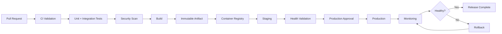
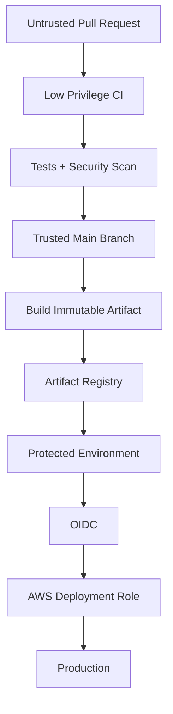

# 21- Production CI CD Failures

## Overview

Production CI/CD failures are failures that affect the delivery or deployment path of a production system rather than an isolated development workflow.

A production pipeline typically spans:

```text
Pull Request
    ↓
Validation
    ↓
Unit Tests
    ↓
Integration Tests
    ↓
Security Scanning
    ↓
Build
    ↓
Immutable Artifact
    ↓
Registry
    ↓
Staging
    ↓
Approval
    ↓
Production
    ↓
Health Validation
    ↓
Monitoring
    ↓
Rollback if required
```

A failure can originate in any layer:

- GitHub Actions configuration.
- Trigger and branch rules.
- Permissions.
- Secrets.
- OIDC and AWS authentication.
- Runner infrastructure.
- Docker builds.
- Container registries.
- Artifact handling.
- Environment protection.
- Deployment orchestration.
- Database migrations.
- Application health.
- Concurrency.
- External dependencies.
- Monitoring or rollback mechanisms.

Production troubleshooting should therefore focus on **system state and failure domains**, not only the failed YAML step.

A useful operating model is:

```text
Symptom
  ↓
Failure Domain
  ↓
Blast Radius
  ↓
Current Production State
  ↓
Isolation
  ↓
Recovery
  ↓
Root Cause
  ↓
Prevention
```

---

## What Makes Production CI/CD Failures Different?

A normal CI failure might prevent a pull request from merging.

A production failure can cause:

- Service downtime.
- Partial deployment.
- Mixed application versions.
- Database incompatibility.
- Incorrect infrastructure state.
- Message-processing failures.
- Traffic routing problems.
- Credential exposure.
- Deployment races.
- Failed rollback.
- Customer-visible errors.

The operational priority changes from:

```text
Why did this step fail?
```

to:

```text
What is the current production state?
Is the system serving traffic?
What changed?
Can we safely stop or reverse the change?
```

---

## Production Failure Domains

| Failure domain | Examples | Primary concern |
|---|---|---|
| Workflow | YAML, trigger, expressions | Pipeline execution |
| Authentication | OIDC, AWS credentials | Identity |
| Authorization | IAM, GITHUB_TOKEN | Access |
| Runner | Offline, resource exhaustion | Execution environment |
| Build | Docker, dependencies | Artifact creation |
| Registry | ECR push/pull | Artifact distribution |
| Artifact | Wrong or corrupted artifact | Release integrity |
| Environment | Approval/configuration | Deployment control |
| Application | Startup/health failure | Runtime availability |
| Infrastructure | ECS/EC2/Kubernetes | Platform state |
| Database | Migration/schema issue | Data compatibility |
| Traffic | ALB/Nginx/service routing | Request delivery |
| Concurrency | Duplicate deployment | Race conditions |
| External dependency | API/Kafka/Redis | Dependency availability |
| Rollback | Failed reversal | Recovery |
| Monitoring | Missing/incorrect signals | Detection |
| Security | Credentials/trust boundaries | Blast radius |

---

## Production CI/CD Architecture

A production pipeline should separate validation, artifact creation, and deployment.



This separation is important because a production deployment should not need to rebuild the application.

---

## Build Once, Deploy Many

Prefer:

```text
Source
  ↓
Build
  ↓
Test
  ↓
Immutable artifact
  ↓
Staging
  ↓
Production
```

over:

```text
Source
  ↓
Build staging artifact
  ↓
Deploy staging

Source
  ↓
Build production artifact
  ↓
Deploy production
```

The second approach can produce:

```text
Staging artifact != Production artifact
```

because dependency resolution, base images, external packages, or build inputs may have changed.

For Docker deployments, use immutable identity such as:

```text
image digest
```

rather than relying only on:

```text
latest
```

---

## Production Deployment Identity

A deployment should be traceable to:

```text
Git commit SHA
Workflow run
Artifact ID
Docker image digest
Release version
Environment
Deployment ID
```

Example metadata:

```text
commit:
  8d7a2e1

image:
  123456789012.dkr.ecr.ap-south-1.amazonaws.com/orders@sha256:abc...

environment:
  production

workflow_run:
  918273645
```

This makes incident investigation and rollback deterministic.

---

## The First Production Troubleshooting Rule

When a deployment fails, do not immediately rerun it.

First determine:

```text
Did the deployment change production?
```

There are at least three states:

```text
Deployment never started
```

```text
Deployment started but failed before traffic changed
```

```text
Deployment partially changed production
```

These require different recovery strategies.

---

## Deployment State Investigation

Check:

- Workflow status.
- Deployment status.
- Current application version.
- Target task/instance/pod versions.
- Health checks.
- Traffic routing.
- Database migration state.
- Queue consumers.
- Error rate.
- Latency.
- Logs.

For ECS:

```bash
aws ecs describe-services \
  --cluster production \
  --services orders-api \
  --region ap-south-1
```

For EC2:

```bash
aws ec2 describe-instances \
  --filters "Name=tag:Environment,Values=production" \
  --region ap-south-1
```

For Kubernetes:

```bash
kubectl rollout status deployment/orders-api -n production
```

---

## Production Failure Response Model

Use this sequence:

```text
Detect
  ↓
Assess
  ↓
Contain
  ↓
Recover
  ↓
Validate
  ↓
Investigate
  ↓
Prevent
```

Do not spend the first minutes of a production incident trying to identify the perfect root cause.

Restore service first when safe.

---

## Failure Severity

A useful operational classification is:

| Severity | Example | Immediate action |
|---|---|---|
| Low | Deployment check failed before production | Fix pipeline |
| Medium | Partial deployment with healthy old instances | Stabilize |
| High | Error rate increasing | Stop/rollback |
| Critical | Production unavailable | Recover service immediately |

Severity should be based on impact rather than the CI job name.

---

## Workflow Trigger Failures

A production deployment may never start because of:

- Wrong branch filter.
- Incorrect tag filter.
- Path filter.
- Release event mismatch.
- Workflow disabled.
- Incorrect workflow permissions.
- Environment restrictions.
- Manual dispatch requirements.

Example:

```yaml
on:
  push:
    branches:
      - main
```

A release branch push will not trigger this workflow.

---

## Duplicate Production Deployments

A common production failure is:

```text
Commit A
  ↓
Deployment A

Commit B
  ↓
Deployment B
```

where both deployments modify the same environment concurrently.

Use concurrency:

```yaml
concurrency:
  group: production-deployment
  cancel-in-progress: false
```

For production deployments, cancellation policy should be chosen carefully.

Automatically cancelling an active production deployment can be more dangerous than allowing it to finish.

---

## Production Deployment Race Condition

Without deployment serialization:

```text
Deployment A ────────→ production
               ↘
Deployment B ─────────→ production
```

Possible result:

```text
A finishes after B
```

and production unexpectedly runs the older version.

Use a deployment-specific concurrency group.

```yaml
jobs:
  deploy:
    concurrency:
      group: production
      cancel-in-progress: false
```

---

## `cancel-in-progress` in Production

For pull request CI:

```yaml
cancel-in-progress: true
```

can reduce unnecessary work.

For production:

```yaml
cancel-in-progress: false
```

is often safer because an active deployment may have already modified infrastructure or application state.

The correct policy depends on whether deployment steps are:

- Atomic.
- Idempotent.
- Reversible.
- Safe to interrupt.

---

## Production Authentication Failures

A deployment may fail before touching production because AWS authentication fails.

Typical symptoms:

```text
Unable to locate credentials
```

or:

```text
Not authorized to perform sts:AssumeRoleWithWebIdentity
```

or:

```text
AccessDenied
```

First determine which authentication layer failed.

---

## AWS OIDC Diagnostic Flow

```text
GitHub Actions
    ↓
OIDC token
    ↓
AWS STS
    ↓
IAM trust policy
    ↓
Temporary credentials
    ↓
IAM authorization
    ↓
AWS service
```

Check:

```yaml
permissions:
  contents: read
  id-token: write
```

Then verify:

```bash
aws sts get-caller-identity
```

If role assumption fails, investigate:

- OIDC provider.
- Audience.
- Subject.
- Repository.
- Branch/environment.
- IAM trust policy.

If role assumption succeeds but an API fails, investigate IAM authorization.

---

## AWS Caller Identity

Always establish which AWS identity the workflow is using:

```bash
aws sts get-caller-identity
```

A deployment running against the wrong AWS account is a critical configuration issue.

Verify:

```text
Account
Role
Region
Environment
Resource
```

before modifying IAM policies.

---

## AWS `AccessDenied`

Possible layers include:

```text
IAM identity policy
        ↓
Resource policy
        ↓
Permissions boundary
        ↓
SCP
        ↓
Service-specific authorization
```

A role policy that appears correct does not guarantee successful authorization.

For example, ECS deployments may also require:

```text
iam:PassRole
```

when passing an execution or task role.

---

## ECR Failures

Typical production symptoms:

```text
docker push denied
```

or:

```text
repository does not exist
```

or:

```text
no basic auth credentials
```

Diagnostic sequence:

```bash
aws sts get-caller-identity
```

```bash
aws ecr describe-repositories \
  --repository-names orders-api \
  --region ap-south-1
```

```bash
aws ecr get-login-password \
  --region ap-south-1 |
docker login \
  --username AWS \
  --password-stdin \
  123456789012.dkr.ecr.ap-south-1.amazonaws.com
```

Check:

- AWS account.
- Region.
- Repository.
- IAM permissions.
- Registry authentication.
- Cross-account policy.

---

## Docker Build Failures

Production Docker failures commonly come from:

- Missing dependency.
- Incorrect build context.
- Invalid Dockerfile.
- Platform mismatch.
- BuildKit issue.
- Secret handling.
- Network/package repository failure.
- Base image availability.
- Cache corruption.

Run the same build locally where possible:

```bash
docker buildx build \
  --platform linux/amd64 \
  -t orders-api:test \
  .
```

But remember that local reproduction may differ from GitHub-hosted or self-hosted runner environments.

---

## Docker Build Context Failures

A common error is referencing files outside the build context.

Example:

```dockerfile
COPY ../config /app/config
```

Docker will reject files outside the build context.

Prefer a deliberate build context:

```bash
docker buildx build \
  -f docker/Dockerfile \
  .
```

and control included files using:

```text
.dockerignore
```

---

## Docker Cache Failures

Caching can cause confusing build behavior.

Symptoms include:

- Old dependencies.
- Unexpected image layers.
- Build succeeding locally but failing in CI.
- Cache restore errors.

Treat Docker cache as an optimization, not as the source of truth.

The final artifact must remain reproducible without depending on stale cache state.

---

## Docker Image Identity

Avoid production deployment by mutable tag alone:

```text
orders-api:latest
```

Prefer:

```text
orders-api:8d7a2e1
```

and ideally deploy using:

```text
orders-api@sha256:...
```

The digest identifies the exact image content.

---

## Registry Pull Failures

A deployment can succeed through the CI build stage but fail when the runtime pulls the image.

Possible causes:

- Registry unavailable.
- Incorrect image reference.
- Missing pull permissions.
- Wrong region/account.
- Network connectivity.
- Private subnet routing.
- ECR endpoint configuration.
- Image architecture mismatch.

The deployment identity and runtime identity may be different.

---

## ECR Push Identity vs Pull Identity

In AWS:

```text
GitHub Actions
    ↓
Push image to ECR
```

may use one IAM role.

ECS:

```text
ECS task
    ↓
Pull image from ECR
```

may use an execution role.

Therefore:

```text
CI can push
```

does not imply:

```text
ECS can pull
```

---

## ECS Deployment Failures

For ECS, inspect:

```bash
aws ecs describe-services \
  --cluster production \
  --services orders-api \
  --region ap-south-1
```

Then inspect task failures:

```bash
aws ecs list-tasks \
  --cluster production \
  --service-name orders-api \
  --region ap-south-1
```

Potential causes:

- Image pull failure.
- Container crash.
- Health check failure.
- Missing environment variable.
- Secret retrieval failure.
- Security group issue.
- CPU/memory exhaustion.
- Incorrect task definition.
- Execution role failure.

---

## ECS Deployment Lifecycle

```text
Task Definition
      ↓
Service Update
      ↓
New Tasks
      ↓
Image Pull
      ↓
Container Start
      ↓
Health Check
      ↓
Traffic
      ↓
Old Tasks Drain
```

A failure can occur at every transition.

---

## ECS Health Check Failure

The container can be running while the service is unhealthy.

Possible causes:

```text
Application not listening
Wrong port
Wrong health endpoint
Database unavailable
Startup migration failure
Environment variable missing
Security group
ALB configuration
```

For a Django or FastAPI service, verify the application endpoint directly where appropriate.

Example:

```text
GET /health
```

should be lightweight and avoid unnecessary downstream dependencies unless dependency health is intentionally part of readiness.

---

## FastAPI and Django Startup Failures

Typical production container failures:

```text
ModuleNotFoundError
ImproperlyConfigured
Database connection refused
Migration failure
ImportError
Environment variable missing
```

For Django:

```bash
python manage.py check --deploy
```

can validate deployment-related configuration.

For FastAPI, validate application startup and dependency configuration before production deployment.

---

## Database Migration Failures

Database migrations are one of the most dangerous CI/CD failure domains because schema changes are persistent.

Example:

```text
Deploy application
    ↓
Run migration
    ↓
Migration partially succeeds
    ↓
Application deployment fails
```

The database state cannot necessarily be reverted by simply redeploying the previous image.

---

## Expand-and-Contract Strategy

For production database changes:

```text
Expand
  ↓
Deploy compatible application
  ↓
Backfill
  ↓
Switch application behavior
  ↓
Contract
```

Avoid coupling destructive schema changes with an application deployment that cannot tolerate the previous schema.

---

## Migration Compatibility

Suppose the old application expects:

```sql
old_column
```

and the new deployment immediately removes it.

A rolling deployment may create:

```text
Old application → old_column
New application → new_column
```

while both versions run simultaneously.

This can cause production failures.

Schema changes must therefore be compatible with the deployment strategy.

---

## PostgreSQL Production Failures

Common symptoms:

```text
connection refused
too many connections
timeout
deadlock
migration failure
permission denied
```

Investigate:

```text
Database availability
Network path
Security groups
Credentials
Connection pool
Database capacity
Migration state
Application version
```

Do not assume a CI deployment failure means the application image is defective.

---

## Redis Failures

Redis may support:

- Cache.
- Sessions.
- Celery broker.
- Rate limiting.
- Distributed locks.

A production deployment may therefore fail indirectly when Redis is unavailable.

Distinguish:

```text
Cache failure
```

from:

```text
Critical state dependency failure
```

Applications should avoid making cache availability a hard production dependency unless required by the architecture.

---

## Celery Deployment Failures

A backend deployment may update the API but leave workers running the old version.

Possible state:

```text
API → new version
Celery workers → old version
```

If task payloads are not backward compatible, workers may fail.

Use compatibility-aware task contracts and coordinate worker deployment where necessary.

---

## Kafka Deployment Failures

Kafka consumers can fail because of:

- Schema incompatibility.
- Consumer group changes.
- Offset behavior.
- Authentication.
- Broker connectivity.
- Serialization changes.

A production deployment should consider:

```text
Producer version
Consumer version
Message schema
Deployment order
Backward compatibility
```

---

## External API Failures

A deployment may be healthy internally while an external dependency is unavailable.

Do not immediately rollback solely because a third-party API is degraded.

Determine:

```text
Application regression
vs
Dependency outage
```

Feature flags, retries, timeouts, circuit breakers, and graceful degradation can reduce unnecessary rollbacks.

---

## Nginx and Load Balancer Failures

For Nginx or an ALB, investigate:

```text
DNS
TLS
Listener
Target group
Security groups
Health checks
Routing
Backend port
Connection draining
```

A healthy application container does not guarantee traffic can reach it.

---

## Zero-Downtime Deployment Failures

Zero downtime depends on more than having multiple instances.

Required properties may include:

- Readiness checks.
- Graceful shutdown.
- Connection draining.
- Backward-compatible schema.
- Sufficient capacity.
- Health-aware traffic routing.
- Deployment serialization.

A deployment can still cause downtime if all instances become unhealthy simultaneously.

---

## Rolling Deployment Failures

Rolling deployments gradually replace instances.

```text
Old Old Old Old
     ↓
New Old Old Old
     ↓
New New Old Old
     ↓
New New New Old
     ↓
New New New New
```

Failure points include:

- New version fails health checks.
- Capacity insufficient.
- Old version cannot coexist with new schema.
- Connection draining fails.
- New tasks crash repeatedly.

---

## Blue-Green Deployment Failures

Blue-green maintains two environments:

```text
Blue  → Current
Green → Candidate
```

Traffic switches only after validation.

```text
Blue
 ↓
Green deployment
 ↓
Health validation
 ↓
Traffic switch
```

A failed switch can often preserve the previous environment, simplifying recovery.

The trade-off is additional infrastructure capacity.

---

## Canary Deployment Failures

Canary exposes a small percentage of traffic to the new version.

```text
95% → Stable
5%  → Canary
```

Promotion should use explicit health criteria such as:

- Error rate.
- Latency.
- Saturation.
- Application-specific metrics.
- Business metrics where appropriate.

Do not promote based solely on container startup success.

---

## Production Approval Failures

A deployment may remain blocked because:

- Required reviewer has not approved.
- Environment protection rules changed.
- Branch restrictions do not match.
- Deployment comes from an unauthorized ref.
- Environment configuration is incorrect.

Check environment configuration before modifying the workflow.

---

## Artifact Promotion Failures

A staging deployment may succeed while production cannot retrieve the artifact.

Check:

```text
Artifact ID
Image digest
Registry
Account
Region
Permissions
Retention
Environment configuration
```

Never silently rebuild the artifact just to make production deployment succeed.

If the architecture requires immutable promotion, rebuilding breaks the intended release guarantee.

---

## Artifact Retention Failures

Artifacts may become unavailable because of retention policies.

Production systems should retain release-critical artifacts for an appropriate operational period.

For long-lived production rollback, a container registry with controlled lifecycle management is often more suitable than treating temporary CI artifacts as the only release source.

---

## Cache Failures

A cache failure should normally degrade into a cache miss rather than break correctness.

Good:

```text
Cache hit → faster build
Cache miss → normal build
```

Dangerous:

```text
Cache unavailable → production artifact cannot be created
```

The artifact must not depend on cache correctness.

---

## Runner Failures

Production pipelines can fail because the runner:

- Runs out of disk.
- Runs out of memory.
- Has exhausted CPU.
- Cannot reach external services.
- Has stale tooling.
- Has corrupted workspace state.
- Is offline.
- Has incorrect permissions.

For self-hosted runners, investigate:

```text
Runner status
Labels
Groups
Disk
Memory
CPU
Network
Docker
Workspace
Software versions
```

---

## Runner Resource Failures

Typical diagnostics:

```bash
df -h
```

```bash
free -h
```

```bash
nproc
```

```bash
docker system df
```

On Linux runners, also inspect:

```bash
uptime
```

```bash
ps aux --sort=-%mem | head
```

A runner that repeatedly reaches resource limits should be replaced or resized rather than repeatedly cleaned manually.

---

## Persistent Runner Failures

Persistent runners accumulate state.

Potential problems:

```text
Old workspace
Old Docker layers
Old credentials
Old package caches
Modified tools
Unexpected files
```

For security-sensitive workloads, prefer immutable or ephemeral runner infrastructure.

---

## Self-Hosted Runner Private Network Failures

A runner may have access to private resources but still fail because of:

- DNS.
- Security groups.
- NACLs.
- Routes.
- Proxy configuration.
- Firewall rules.
- Private endpoints.
- TLS certificates.

The fact that a resource is reachable from one environment does not mean it is reachable from the runner.

---

## Concurrency and Race Conditions

Production failures frequently involve multiple independent workflows modifying the same resource.

Examples:

```text
Deployment
+
Rollback
```

or:

```text
Terraform apply
+
Manual infrastructure change
```

or:

```text
Two production deployments
```

Use explicit ownership and concurrency boundaries.

---

## Rollback Failures

Rollback is not simply:

```text
Deploy previous image
```

A rollback can fail when:

- Database schema changed incompatibly.
- Configuration changed.
- Secrets changed.
- Infrastructure changed.
- Queue messages use new schemas.
- External APIs changed.
- Redis state changed.
- Kafka consumers changed.

Rollback strategy must account for stateful dependencies.

---

## Safe Rollback Model

```text
Detect failure
    ↓
Stop further promotion
    ↓
Identify last known-good artifact
    ↓
Check database compatibility
    ↓
Check configuration compatibility
    ↓
Deploy previous artifact
    ↓
Validate health
    ↓
Monitor
```

If rollback is unsafe, roll-forward may be the safer recovery mechanism.

---

## Automated Rollback

Automated rollback can reduce recovery time but can also create rollback loops.

Example:

```text
Deploy
 ↓
Health check fails
 ↓
Rollback
 ↓
Health check fails
 ↓
Rollback again
```

Use:

- Retry limits.
- Stable rollback targets.
- Deployment locks.
- Clear health thresholds.
- Manual intervention after repeated failure.

---

## Production Monitoring

CI/CD monitoring should cover more than workflow success.

Important signals include:

### Pipeline

- Workflow duration.
- Failure rate.
- Queue time.
- Deployment frequency.
- Rollback frequency.

### Application

- Error rate.
- Latency.
- Throughput.
- Saturation.
- Health status.

### Infrastructure

- CPU.
- Memory.
- Disk.
- Network.
- Instance/task health.

### Deployment

- Current version.
- Target version.
- Deployment duration.
- Failed health checks.
- Rollout progress.

---

## Deployment Health Validation

A deployment should not be considered successful because:

```text
GitHub job = success
```

Instead validate:

```text
Application starts
+
Health checks pass
+
Traffic succeeds
+
Error rate remains acceptable
+
Latency remains acceptable
+
Critical dependencies work
```

---

## Health Check Layers

Use multiple layers where appropriate:

```text
Process health
    ↓
Container health
    ↓
Application readiness
    ↓
Load balancer health
    ↓
Synthetic request
    ↓
Production metrics
```

Each layer answers a different question.

---

## Post-Deployment Verification

Example:

```bash
curl --fail --silent --show-error \
  https://api.example.com/health
```

Then inspect production metrics and logs.

For ECS:

```bash
aws ecs describe-services \
  --cluster production \
  --services orders-api \
  --region ap-south-1
```

For Kubernetes:

```bash
kubectl get pods -n production
```

```bash
kubectl rollout status deployment/orders-api -n production
```

---

## Security-Related Production Failures

Security failures can also become availability failures.

Examples:

```text
Expired credential
      ↓
Deployment cannot authenticate
```

```text
Overly restrictive IAM policy
      ↓
Application cannot retrieve secret
```

```text
Environment protection misconfiguration
      ↓
Production deployment blocked
```

```text
Compromised action
      ↓
Credential exposure
      ↓
Emergency deployment freeze
```

Security and reliability must therefore be designed together.

---

## Production CI/CD Security Boundary



The privileged path should be narrow.

---

## Production Pipeline Example

```yaml
name: Production Deployment

on:
  push:
    branches:
      - main

permissions:
  contents: read

concurrency:
  group: production-deployment
  cancel-in-progress: false

jobs:
  test:
    runs-on: ubuntu-latest

    steps:
      - uses: actions/checkout@v4

      - name: Set up Python
        uses: actions/setup-python@v5
        with:
          python-version: "3.12"

      - name: Install dependencies
        run: |
          python -m pip install --upgrade pip
          pip install -r requirements.txt

      - name: Run tests
        run: pytest

  build:
    needs: test
    runs-on: ubuntu-latest

    permissions:
      contents: read
      packages: write

    steps:
      - uses: actions/checkout@v4

      - name: Build image
        run: |
          docker buildx build \
            --tag orders-api:${{ github.sha }} \
            --load \
            .

  deploy:
    needs: build
    runs-on: ubuntu-latest

    environment:
      name: production

    permissions:
      contents: read
      id-token: write

    steps:
      - name: Configure AWS credentials
        uses: aws-actions/configure-aws-credentials@v5
        with:
          role-to-assume: ${{ vars.AWS_DEPLOY_ROLE_ARN }}
          aws-region: ap-south-1

      - name: Verify AWS identity
        run: aws sts get-caller-identity

      - name: Deploy
        run: ./scripts/deploy.sh
```

The exact deployment mechanism depends on the runtime platform, but the architecture should preserve:

```text
Least privilege
+
Immutable artifact
+
Protected environment
+
OIDC
+
Deployment concurrency
```

---

## GitHub CLI Production Operations

List recent runs:

```bash
gh run list --limit 20
```

View a run:

```bash
gh run view <run-id>
```

View logs:

```bash
gh run view <run-id> --log
```

Rerun a failed workflow:

```bash
gh run rerun <run-id>
```

Rerun only failed jobs:

```bash
gh run rerun <run-id> --failed
```

Run a workflow manually:

```bash
gh workflow run deploy.yml \
  --ref main
```

List workflows:

```bash
gh workflow list
```

List repository secrets:

```bash
gh secret list
```

List variables:

```bash
gh variable list
```

Inspect deployments:

```bash
gh api repos/{owner}/{repo}/deployments
```

Use the CLI primarily for operational inspection and controlled actions rather than replacing the deployment architecture with ad hoc commands.

---

## Production Rerun Safety

Before rerunning a failed production workflow ask:

```text
Did the first execution modify production?
```

If yes:

```text
Is the deployment idempotent?
```

Then:

```text
Will the rerun deploy the same artifact?
```

Then:

```text
Could the rerun conflict with another deployment?
```

A rerun is not automatically a safe recovery mechanism.

---

## Common Production Mistakes

### Rerunning immediately

The first deployment may have partially succeeded.

### Rebuilding during recovery

The new artifact may differ from the originally validated artifact.

### Ignoring database state

Application rollback does not automatically rollback schema changes.

### Using `latest`

Mutable tags make incident reconstruction harder.

### Running deployments without concurrency

Two releases can race against the same environment.

### Treating workflow success as application health

A successful deployment command does not guarantee healthy production traffic.

### Giving deployment credentials to test jobs

This unnecessarily increases blast radius.

### Using long-lived AWS credentials

OIDC with temporary credentials is preferable when supported.

### Deploying from untrusted code

Privileged deployment workflows should not execute arbitrary pull request code.

### Making rollback dependent on the same broken pipeline

A recovery path should be independently reliable.

---

## Production Failure Prevention

Production reliability improves when failures are prevented structurally.

### Deterministic builds

Use:

- Locked dependencies.
- Versioned base images.
- Controlled build environments.
- Immutable artifacts.

### Controlled promotion

Use:

```text
Build once
Promote many
```

### Privilege isolation

Separate:

```text
Test permissions
Build permissions
Deploy permissions
```

### Deployment serialization

Use concurrency controls for shared production environments.

### Health-aware deployment

Validate runtime behavior, not just deployment commands.

### Recovery readiness

Maintain:

- Rollback procedure.
- Last-known-good artifact.
- Deployment history.
- Incident runbook.
- Credential rotation process.

---

## High Availability Considerations

A CI/CD platform can itself become a production dependency.

For critical organizations:

- Avoid a single self-hosted runner.
- Use multiple runner instances.
- Use runner groups.
- Use ephemeral capacity where appropriate.
- Maintain healthy capacity for emergency deployment.
- Keep deployment artifacts independently accessible.
- Maintain an operational fallback procedure.

The deployment system should not become a single point of failure for production recovery.

---

## Disaster Recovery

A mature CI/CD system should answer:

```text
What if GitHub Actions is temporarily unavailable?
What if the primary runner pool fails?
What if the registry is unavailable?
What if the latest deployment is broken?
What if rollback is impossible because of a schema change?
What if AWS credentials are compromised?
```

Recovery architecture should define:

```text
RTO
RPO
Last-known-good artifact
Recovery owner
Required credentials
Deployment mechanism
Validation procedure
```

---

## Cost and Performance

Production pipelines can become expensive when they:

- Run unnecessary matrices.
- Rebuild the same artifact repeatedly.
- Use oversized runners.
- Disable caching.
- Run all tests for every unrelated change.
- Maintain excessive warm self-hosted capacity.

Use:

```text
Change detection
+
Appropriate matrices
+
Dependency caching
+
Docker layer caching
+
Immutable artifacts
+
Parallel execution
+
Ephemeral capacity
```

without compromising security or reproducibility.

---

## Failure Prevention Through Testing

Production deployment logic should itself be tested.

Test:

- Deployment scripts.
- Health checks.
- Rollback procedures.
- Migration compatibility.
- Container startup.
- Infrastructure changes.
- IAM policies.
- Environment configuration.
- Artifact promotion.
- Failure handling.

A rollback process that has never been exercised is an assumption, not a proven recovery mechanism.

---

## Production Incident Runbook

### Before deployment

```text
Verify commit
Verify artifact
Verify environment
Verify deployment concurrency
Verify approvals
Verify health baseline
```

### During deployment

```text
Monitor rollout
Monitor application health
Monitor error rate
Monitor latency
Monitor infrastructure
```

### If failure occurs

```text
Stop further promotion
Assess current state
Determine blast radius
Check health
Identify last-known-good artifact
Rollback or roll-forward
Validate recovery
```

### After recovery

```text
Capture evidence
Identify root cause
Create corrective action
Update tests
Update monitoring
Update runbook
```

---

## Production Architecture Trade-Offs

| Strategy | Main strength | Main risk |
|---|---|---|
| Rolling | Efficient resource usage | Mixed versions |
| Blue-green | Simple traffic reversal | Higher infrastructure cost |
| Canary | Progressive exposure | More complex routing/analysis |
| Rebuild per environment | Environment-specific build | Artifact drift |
| Build once/promote | Strong reproducibility | Requires promotion discipline |
| Persistent runners | Fast warm execution | State/security risk |
| Ephemeral runners | Better isolation | Provisioning overhead |
| Manual rollback | Human control | Slower recovery |
| Automated rollback | Fast recovery | False-positive rollback loops |

The appropriate strategy depends on application architecture, state management, operational maturity, and recovery requirements.

---

## Senior Troubleshooting Scenarios

### Production deployment failed after 30% rollout

Investigate:

```text
Current traffic split
Healthy instances
Failed instances
Error rate
Image digest
Application logs
Health checks
Deployment controller state
```

Do not immediately redeploy.

---

### Deployment says success but users receive 500 errors

Check:

```text
Application health
Load balancer targets
Logs
Database connectivity
Configuration
Dependency availability
Error rate
```

The CI job can succeed while production is unhealthy.

---

### New application version cannot start

Compare:

```text
Old image
New image
Environment variables
Secrets
Dependencies
Database schema
Container command
Health checks
```

Determine whether the failure is application-specific or environment-specific.

---

### Rollback image starts but requests still fail

Investigate stateful changes:

```text
Database schema
Redis state
Kafka messages
Configuration
External APIs
Infrastructure
```

A previous binary does not necessarily restore a previous system state.

---

### Two production deployments are running simultaneously

Check:

```text
Concurrency group
Workflow triggers
Manual dispatch
Reusable workflows
Release workflows
External deployment systems
```

Then determine which deployment owns production.

---

### AWS deployment fails only in production

Compare:

```text
AWS account
Role ARN
OIDC subject
Environment
IAM policy
Secrets
Region
Network
Resource policies
```

Do not assume the code differs simply because the environment differs.

---

### Self-hosted deployment runner is offline

Check:

```text
Runner status
Service/process
Network
DNS
Proxy
Registration
Labels
Runner group
Host resources
```

If the runner has persistent state and the cause is suspicious, isolate it rather than repeatedly restarting it.

---

## Interview Preparation

### How would you design a production CI/CD pipeline?

A strong answer should cover:

```text
PR validation
→ Tests
→ Security
→ Build
→ Immutable artifact
→ Registry
→ Staging
→ Approval
→ Production
→ Monitoring
→ Rollback
```

Then discuss:

- Least privilege.
- OIDC.
- Artifact promotion.
- Concurrency.
- Environment protection.
- Health validation.
- Failure recovery.

---

### How would you prevent two production deployments from running simultaneously?

Discuss:

```yaml
concurrency:
  group: production-deployment
  cancel-in-progress: false
```

Then explain why production cancellation semantics differ from PR CI.

---

### How would you rollback a failed Docker deployment?

Discuss:

```text
Identify last-known-good digest
→ Stop promotion
→ Check database compatibility
→ Deploy previous artifact
→ Validate health
→ Monitor
```

Do not simply say:

```text
git revert
```

because source rollback does not automatically rollback production state.

---

### Why is build-once/deploy-many important?

Because it guarantees that staging and production receive the same validated artifact.

The artifact becomes the release unit rather than the source branch.

---

### How would you troubleshoot AWS authentication?

Start with:

```bash
aws sts get-caller-identity
```

Then distinguish:

```text
OIDC role assumption
```

from:

```text
AWS API authorization
```

and investigate the corresponding policy layer.

---

### How would you design CI for an untrusted fork?

Keep:

```text
Untrusted code
```

separate from:

```text
Privileged credentials
```

Use ordinary pull request workflows for untrusted execution and reserve privileged deployment workflows for trusted branches or controlled promotion stages.

---

### How would you handle a production database migration failure?

Discuss:

- Current schema state.
- Application compatibility.
- Expand-and-contract migrations.
- Whether rollback is safe.
- Whether roll-forward is safer.
- Backup/recovery.
- Traffic impact.
- Validation.

---

### How would you design a rollback system?

A senior answer should include:

```text
Immutable artifacts
Deployment history
Last-known-good version
Database compatibility
Concurrency control
Health checks
Monitoring
Automated/manual rollback decision
Rollback verification
```

---

## Production Readiness Checklist

### Pipeline

- [ ] CI and CD responsibilities are separated.
- [ ] Production deployment is protected.
- [ ] Deployment concurrency is configured.
- [ ] Workflow permissions use least privilege.
- [ ] Privileged jobs are isolated.

### Artifact

- [ ] Artifact identity is deterministic.
- [ ] Docker images are immutable.
- [ ] Image digests are recorded.
- [ ] Build metadata is retained.
- [ ] Staging and production use the same artifact.

### AWS

- [ ] OIDC is configured.
- [ ] IAM trust policy is restricted.
- [ ] Deployment role is least privilege.
- [ ] AWS caller identity can be verified.
- [ ] CloudTrail is available.

### Application

- [ ] Health checks exist.
- [ ] Readiness is defined.
- [ ] Graceful shutdown is implemented.
- [ ] Database migrations are deployment-compatible.
- [ ] External dependencies have appropriate timeouts.

### Operations

- [ ] Deployment monitoring exists.
- [ ] Rollback procedure is documented.
- [ ] Last-known-good artifact is identifiable.
- [ ] Runner capacity is sufficient.
- [ ] Incident response is documented.

### Recovery

- [ ] Rollback has been tested.
- [ ] Database recovery is documented.
- [ ] Credential rotation is documented.
- [ ] CI/CD outage recovery is understood.
- [ ] Production ownership is clear.

---

## Key Takeaways

- Production CI/CD troubleshooting starts with determining the actual production state, blast radius, and failure domain rather than immediately rerunning the failed workflow.
- Build once and promote the same immutable artifact across environments to preserve reproducibility and make rollback deterministic.
- Production deployments require explicit concurrency, health validation, protected environments, least-privilege credentials, and reliable rollback or roll-forward strategies.
- Stateful dependencies such as PostgreSQL, Redis, Kafka, Celery, configuration, and infrastructure can make a simple application rollback unsafe.
- A production-grade CI/CD system must be designed for failure: observability, incident response, recovery procedures, artifact history, runner resilience, and tested rollback paths are part of the deployment architecture.