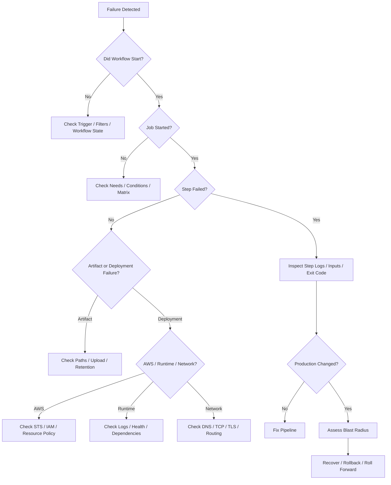
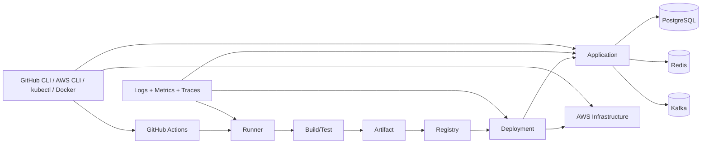

# 22- Diagnostic Commands and Debugging

## Overview

Production CI/CD debugging requires more than reading a failed GitHub Actions step. A production pipeline is a distributed system involving GitHub events, workflow execution, runners, credentials, artifacts, registries, cloud infrastructure, application processes, databases, queues, and deployment controllers.

A useful diagnostic model is:

```text
Symptom
  ↓
Failure Domain
  ↓
Execution Context
  ↓
Evidence Collection
  ↓
Isolation
  ↓
Root Cause
  ↓
Corrective Action
  ↓
Prevention
```

The objective is to answer four questions quickly:

1. **What failed?**
2. **Where did it fail?**
3. **What state was the system left in?**
4. **What is the safest recovery action?**

The commands in this document focus on GitHub Actions operations and its integration with Python, Docker, AWS, PostgreSQL, Redis, Kubernetes, and production deployment systems.

---

## Diagnostic Mindset

Do not begin with random commands.

Start with the execution path:

```text
GitHub Event
    ↓
Workflow
    ↓
Job
    ↓
Runner
    ↓
Step / Action
    ↓
Build / Test / Artifact
    ↓
Registry
    ↓
Deployment
    ↓
Runtime
    ↓
Health / Traffic
```

The failed component is usually easier to identify after the execution path is established.

### First Questions

When a pipeline fails, establish:

| Question | Example |
|---|---|
| What workflow? | `deploy.yml` |
| What run? | `918273645` |
| What commit? | `8d7a2e1` |
| What branch/tag? | `main` |
| What job? | `deploy` |
| What step? | `Deploy ECS service` |
| What runner? | `ubuntu-latest` |
| What environment? | `production` |
| What artifact? | Docker digest |
| What AWS account? | Production account |
| What region? | `ap-south-1` |
| Did production change? | Yes/No |

---

## Failure-Domain Model

| Domain | Primary tools |
|---|---|
| Workflow | `gh`, GitHub UI |
| Runner | `gh`, shell, OS tools |
| Python | `python`, `pip`, `pytest` |
| Docker | `docker`, `docker buildx` |
| AWS identity | `aws sts` |
| ECR | `aws ecr` |
| ECS | `aws ecs` |
| EC2 | `aws ec2`, `ssm` |
| S3 | `aws s3` |
| Lambda | `aws lambda` |
| CloudFormation | `aws cloudformation` |
| Terraform | `terraform` |
| Kubernetes | `kubectl` |
| PostgreSQL | `psql` |
| Redis | `redis-cli` |
| Network | `curl`, `dig`, `nslookup`, `nc` |
| Linux runner | `df`, `free`, `ps`, `ss` |
| Git | `git` |

---

## GitHub Actions Diagnostic Commands

### Authenticate GitHub CLI

```bash
gh auth status
```

This verifies that the CLI is authenticated and shows the active account and authentication scopes.

---

## List Workflows

```bash
gh workflow list
```

Useful when the expected workflow may be:

- Disabled.
- Renamed.
- Located in a different workflow file.
- Not available from the current repository.

---

## Inspect a Workflow

```bash
gh workflow view deploy.yml
```

Use this to verify the workflow definition known to GitHub.

---

## List Recent Workflow Runs

```bash
gh run list --limit 20
```

Useful filters include:

```bash
gh run list \
  --workflow deploy.yml \
  --limit 20
```

```bash
gh run list \
  --branch main \
  --limit 20
```

```bash
gh run list \
  --status failure \
  --limit 20
```

This is often the fastest way to determine whether a failure is isolated or recurring.

---

## Inspect a Workflow Run

```bash
gh run view <run-id>
```

For example:

```bash
gh run view 918273645
```

Inspect:

- Workflow.
- Commit.
- Branch.
- Trigger.
- Jobs.
- Status.
- Duration.
- Conclusion.

---

## View Complete Logs

```bash
gh run view <run-id> --log
```

For a large workflow, inspect the failed job first rather than scanning the entire output.

---

## Inspect Failed Logs

```bash
gh run view <run-id> --log-failed
```

This is useful during incidents because it reduces unrelated output.

---

## Rerun a Workflow

```bash
gh run rerun <run-id>
```

Before rerunning production workflows, determine whether the original run partially changed production.

A rerun is safe only when the workflow and deployment operations are sufficiently idempotent.

---

## Rerun Failed Jobs

```bash
gh run rerun <run-id> --failed
```

This is useful for transient CI failures but should be used carefully for deployments.

---

## Watch a Workflow

```bash
gh run watch <run-id>
```

Useful when actively observing a deployment.

---

## Download Workflow Artifacts

```bash
gh run download <run-id>
```

Artifacts may contain:

- Test reports.
- Coverage.
- Build metadata.
- Debug information.
- Logs.
- Generated configuration.
- Release manifests.

Never assume artifacts are safe to publish; they may contain sensitive information.

---

## Inspect Repository Information

```bash
gh repo view
```

For automation:

```bash
gh repo view --json nameWithOwner,defaultBranchRef
```

This helps verify that commands are operating against the expected repository.

---

## Git Diagnostic Commands

### Check Current Repository

```bash
git remote -v
```

### Current Branch

```bash
git branch --show-current
```

### Current Commit

```bash
git rev-parse HEAD
```

### Short Commit SHA

```bash
git rev-parse --short HEAD
```

### Working Tree

```bash
git status --short
```

### Commit Metadata

```bash
git show --stat --oneline HEAD
```

These checks are useful when a deployment appears to contain unexpected code.

---

## Verify GitHub Commit

Compare:

```text
GitHub workflow SHA
vs
Local Git SHA
vs
Docker image metadata
vs
Production artifact
```

A common production mistake is diagnosing the wrong release because the operator assumes the deployment corresponds to the latest local commit.

---

## Workflow Trigger Diagnostics

If a workflow did not start, inspect:

```text
Event
Branch
Tag
Path filters
Workflow state
Repository policies
Permissions
```

Example:

```yaml
on:
  push:
    branches:
      - main
```

A push to:

```text
feature/payment
```

will not trigger this workflow.

---

## Trigger Debugging Checklist

```text
Was the expected event emitted?
        ↓
Did the event match the workflow trigger?
        ↓
Did branch/tag filters match?
        ↓
Did path filters match?
        ↓
Is the workflow enabled?
        ↓
Is the workflow file present on the expected ref?
```

Do not debug job steps until you establish that the workflow actually triggered.

---

## Inspect Workflow Event Context

Use a controlled diagnostic step:

```yaml
- name: Debug GitHub context
  env:
    EVENT_NAME: ${{ github.event_name }}
    REF: ${{ github.ref }}
    SHA: ${{ github.sha }}
    WORKFLOW: ${{ github.workflow }}
    RUN_ID: ${{ github.run_id }}
  run: |
    printf 'event=%s\n' "$EVENT_NAME"
    printf 'ref=%s\n' "$REF"
    printf 'sha=%s\n' "$SHA"
    printf 'workflow=%s\n' "$WORKFLOW"
    printf 'run_id=%s\n' "$RUN_ID"
```

Avoid dumping the entire event payload when it may contain sensitive or user-controlled information.

---

## Expression Diagnostics

GitHub expressions are evaluated before or around step execution depending on where they are used.

A common mistake is confusing:

```yaml
${{ github.ref }}
```

with shell syntax:

```bash
$GITHUB_REF
```

Prefer explicit environment passing for shell commands:

```yaml
- name: Print ref
  env:
    REF: ${{ github.ref }}
  run: printf '%s\n' "$REF"
```

This also provides a safer boundary for user-controlled values.

---

## Context Diagnostics

Important contexts include:

| Context | Typical information |
|---|---|
| `github` | Event/repository/ref/run metadata |
| `env` | Environment variables |
| `vars` | Configuration variables |
| `secrets` | Secrets |
| `steps` | Step outputs |
| `needs` | Upstream job outputs/results |
| `job` | Current job information |
| `runner` | Runner metadata |
| `matrix` | Current matrix combination |
| `strategy` | Matrix strategy information |
| `inputs` | Workflow/action inputs |

A common debugging error is assuming a value exists in a context where it is not available.

---

## Safe Context Inspection

Use explicit fields:

```yaml
- name: Inspect execution context
  env:
    EVENT: ${{ github.event_name }}
    REF: ${{ github.ref }}
    SHA: ${{ github.sha }}
    RUNNER_OS: ${{ runner.os }}
  run: |
    printf 'event=%s\n' "$EVENT"
    printf 'ref=%s\n' "$REF"
    printf 'sha=%s\n' "$SHA"
    printf 'runner_os=%s\n' "$RUNNER_OS"
```

Avoid:

```yaml
run: echo '${{ toJSON(github) }}'
```

for production debugging because the payload may contain information that should not be broadly exposed.

---

## Environment Variable Diagnostics

Print non-sensitive values:

```bash
printf 'APP_ENV=%s\n' "$APP_ENV"
printf 'AWS_REGION=%s\n' "$AWS_REGION"
```

Never diagnose secrets by printing their values.

Use:

```bash
if [ -n "${API_KEY:-}" ]; then
  echo "API_KEY is configured"
else
  echo "API_KEY is missing"
fi
```

This confirms presence without exposing the secret.

---

## `$GITHUB_ENV` Diagnostics

A variable written to `$GITHUB_ENV` becomes available to subsequent steps.

```yaml
- name: Set environment variable
  run: echo "APP_ENV=staging" >> "$GITHUB_ENV"

- name: Verify environment variable
  run: printf 'APP_ENV=%s\n' "$APP_ENV"
```

A common mistake is expecting the variable to be available inside the same step that writes it.

---

## `$GITHUB_OUTPUT` Diagnostics

Step outputs should be written using `$GITHUB_OUTPUT`.

```yaml
- name: Generate version
  id: version
  run: echo "version=${GITHUB_SHA::7}" >> "$GITHUB_OUTPUT"

- name: Inspect version
  env:
    VERSION: ${{ steps.version.outputs.version }}
  run: printf '%s\n' "$VERSION"
```

If the output is empty, inspect:

```text
Step ID
Output name
File write
Job dependency
Expression syntax
```

---

## Job Output Diagnostics

Example:

```yaml
jobs:
  build:
    runs-on: ubuntu-latest
    outputs:
      image: ${{ steps.meta.outputs.image }}

    steps:
      - id: meta
        run: echo "image=orders-api:${GITHUB_SHA}" >> "$GITHUB_OUTPUT"

  deploy:
    needs: build
    runs-on: ubuntu-latest

    steps:
      - env:
          IMAGE: ${{ needs.build.outputs.image }}
        run: printf '%s\n' "$IMAGE"
```

If the deployment receives an empty value, verify:

```text
step.id
step output name
job.outputs mapping
needs dependency
needs.build.outputs.image
```

---

## Status Function Diagnostics

Important functions include:

```text
success()
failure()
always()
cancelled()
```

For example:

```yaml
- name: Upload diagnostics
  if: ${{ !cancelled() }}
  uses: actions/upload-artifact@v4
```

Use status functions deliberately.

`always()` can cause cleanup or reporting steps to run in situations where the job has been cancelled, so it should not automatically be treated as the correct choice for every post-failure operation.

---

## `continue-on-error` Diagnostics

`continue-on-error` changes failure propagation.

Example:

```yaml
- name: Non-critical scan
  continue-on-error: true
  run: ./optional-scan.sh
```

This can produce confusing results if the pipeline reports success while an important validation actually failed.

Use it only when the failure is genuinely non-blocking.

---

## Matrix Diagnostics

Print matrix values explicitly:

```yaml
- name: Matrix diagnostics
  env:
    PYTHON_VERSION: ${{ matrix.python-version }}
    DATABASE: ${{ matrix.database }}
  run: |
    printf 'python=%s\n' "$PYTHON_VERSION"
    printf 'database=%s\n' "$DATABASE"
```

For a failing matrix job, identify:

```text
OS
Python version
Database
Feature flags
Environment
```

before assuming the failure affects the entire matrix.

---

## Dynamic Matrix Diagnostics

If a planning job generates JSON:

```yaml
- name: Generate matrix
  id: matrix
  run: |
    echo 'include=[{"python":"3.11"},{"python":"3.12"}]' >> "$GITHUB_OUTPUT"
```

The consuming job may use:

```yaml
strategy:
  matrix:
    include: ${{ fromJSON(needs.plan.outputs.include) }}
```

Debug the generated JSON before debugging the matrix consumer.

A useful diagnostic is:

```yaml
- name: Print generated matrix
  env:
    MATRIX: ${{ needs.plan.outputs.matrix }}
  run: printf '%s\n' "$MATRIX"
```

Do not execute untrusted generated values as shell code.

---

## Artifact Diagnostics

When an artifact is missing, inspect:

```text
Did the producing step execute?
Was the path correct?
Was the file generated?
Was the upload step skipped?
Did the job fail before upload?
Was the artifact name expected?
Was the artifact retained?
```

Check locally:

```bash
find . -maxdepth 3 -type f | sort
```

For a known path:

```bash
test -f dist/app.tar.gz && echo "artifact exists"
```

---

## Artifact Path Diagnostics

A common failure:

```yaml
path: ./reports
```

when the actual output is:

```text
test-results/
```

Use:

```bash
pwd
find . -maxdepth 3 -type f | sort
```

before changing the upload action.

---

## Artifact vs Cache

| Property | Artifact | Cache |
|---|---|---|
| Purpose | Preserve/share outputs | Speed up future work |
| Primary use | Build/test/reports | Dependencies/build cache |
| Release input | Often | No |
| Correctness dependency | Should be deterministic | Should not be |
| Retention | Explicit | Cache lifecycle |
| Example | Docker metadata/report | pip/npm cache |

Do not use a cache as the authoritative production release artifact.

---

## Cache Diagnostics

For dependency caching, inspect:

```text
Cache key
Restore keys
Lock file hash
Dependency manager
Cache path
Hit/miss result
```

Example:

```yaml
with:
  cache: pip
  cache-dependency-path: requirements.txt
```

If dependencies change, the cache should be invalidated appropriately.

---

## `hashFiles()` Diagnostics

Example:

```yaml
key: ${{ runner.os }}-pip-${{ hashFiles('**/requirements*.txt') }}
```

If the key unexpectedly changes, verify:

```bash
find . -name 'requirements*.txt' -print
```

A different lock or dependency file can change the hash.

---

## Runner Diagnostics

Inspect runner information:

```bash
uname -a
```

```bash
uname -m
```

```bash
cat /etc/os-release
```

```bash
python --version
```

```bash
docker --version
```

```bash
git --version
```

This is especially important for self-hosted runners.

---

## CPU and Memory

```bash
nproc
```

```bash
free -h
```

```bash
uptime
```

Process inspection:

```bash
ps aux --sort=-%mem | head
```

CPU-heavy processes:

```bash
ps aux --sort=-%cpu | head
```

A test failure caused by resource exhaustion can look like an application failure.

---

## Disk Diagnostics

```bash
df -h
```

Inode usage:

```bash
df -i
```

Docker disk usage:

```bash
docker system df
```

Large workspaces:

```bash
du -sh ./* 2>/dev/null | sort -h
```

A runner with insufficient disk space can fail during:

- Docker builds.
- Dependency installation.
- Test execution.
- Artifact packaging.

---

## Process and Port Diagnostics

Check listening ports:

```bash
ss -lntp
```

Check a specific port:

```bash
ss -lntp | grep ':8000'
```

This is useful for Django, FastAPI, Nginx, and service-container debugging.

---

## Network Diagnostics

Test HTTP:

```bash
curl -I https://example.com
```

Detailed request:

```bash
curl -v https://example.com/health
```

Test TCP connectivity:

```bash
nc -vz database.example.com 5432
```

DNS lookup:

```bash
dig database.example.com
```

or:

```bash
nslookup database.example.com
```

A network failure should be separated into:

```text
DNS
→ TCP
→ TLS
→ HTTP
→ Application
```

---

## TLS Diagnostics

```bash
curl -v https://api.example.com/health
```

Inspect certificate details:

```bash
openssl s_client \
  -connect api.example.com:443 \
  -servername api.example.com
```

Common failures include:

- Expired certificate.
- Wrong hostname.
- Missing intermediate certificate.
- TLS version mismatch.
- Proxy interception.

---

## HTTP Diagnostics

A useful sequence:

```bash
curl -I https://api.example.com/health
```

then:

```bash
curl -v https://api.example.com/health
```

then:

```bash
curl --fail-with-body \
  https://api.example.com/health
```

Interpret:

```text
DNS failure
TCP failure
TLS failure
HTTP status failure
Application response failure
```

separately.

---

## Python Diagnostics

Check runtime:

```bash
python --version
```

Executable location:

```bash
which python
```

Pip location:

```bash
python -m pip --version
```

Installed packages:

```bash
python -m pip list
```

Package metadata:

```bash
python -m pip show Django
```

Import test:

```bash
python -c "import django; print(django.get_version())"
```

This helps distinguish:

```text
Python environment problem
```

from:

```text
Application code problem
```

---

## Django Diagnostics

Run:

```bash
python manage.py check
```

Deployment-oriented checks:

```bash
python manage.py check --deploy
```

Inspect migrations:

```bash
python manage.py showmigrations
```

Check pending migrations:

```bash
python manage.py migrate --plan
```

These commands are useful before changing production state.

---

## FastAPI Diagnostics

Verify imports:

```bash
python -c "from app.main import app; print(app)"
```

Run locally:

```bash
uvicorn app.main:app --host 0.0.0.0 --port 8000
```

Then:

```bash
curl --fail http://127.0.0.1:8000/health
```

Separate:

```text
Import failure
Startup failure
Port binding failure
HTTP routing failure
Dependency failure
```

---

## Pytest Diagnostics

Run the failing test:

```bash
pytest tests/test_orders.py::test_create_order -q
```

Show standard output:

```bash
pytest -s
```

Increase traceback detail:

```bash
pytest -vv
```

Stop after the first failure:

```bash
pytest -x
```

Run a subset:

```bash
pytest -k "order"
```

A useful debugging progression is:

```text
Entire suite
→ failing file
→ failing test
→ minimal reproduction
```

---

## Coverage Diagnostics

```bash
pytest --cov=app --cov-report=term-missing
```

If coverage fails in CI but works locally, compare:

```text
Python version
Dependencies
Test selection
Environment
Coverage configuration
```

Do not lower the coverage threshold simply to make the pipeline green.

---

## PostgreSQL Diagnostics

Connection test:

```bash
pg_isready \
  -h "$PGHOST" \
  -p "${PGPORT:-5432}"
```

Connect:

```bash
psql \
  "$DATABASE_URL"
```

Inspect current database:

```sql
SELECT current_database();
```

Current user:

```sql
SELECT current_user;
```

Server version:

```sql
SELECT version();
```

Active connections:

```sql
SELECT pid, usename, state, query
FROM pg_stat_activity;
```

---

## PostgreSQL Connection Failures

Diagnose in this order:

```text
DNS
→ Network
→ Port
→ TLS
→ Authentication
→ Authorization
→ Connection pool
→ Database state
```

Do not immediately change database credentials when the actual problem is network connectivity.

---

## Redis Diagnostics

Check connectivity:

```bash
redis-cli -h "$REDIS_HOST" ping
```

Expected:

```text
PONG
```

Inspect server information:

```bash
redis-cli -h "$REDIS_HOST" INFO
```

Check memory:

```bash
redis-cli -h "$REDIS_HOST" INFO memory
```

Use caution when running diagnostic commands against production Redis because some commands can be expensive.

---

## Docker Diagnostics

List images:

```bash
docker image ls
```

List containers:

```bash
docker ps -a
```

Inspect a container:

```bash
docker inspect <container>
```

View logs:

```bash
docker logs <container>
```

Follow logs:

```bash
docker logs -f <container>
```

Check resource usage:

```bash
docker stats
```

---

## Docker Build Diagnostics

Run with plain BuildKit output:

```bash
docker buildx build \
  --progress=plain \
  -t orders-api:debug \
  .
```

This exposes more build information than the default progress display.

Inspect builders:

```bash
docker buildx ls
```

Inspect a builder:

```bash
docker buildx inspect
```

---

## Docker Image Diagnostics

Inspect image metadata:

```bash
docker image inspect orders-api:debug
```

Inspect image architecture:

```bash
docker image inspect orders-api:debug \
  --format '{{.Architecture}}/{{.Os}}'
```

This helps diagnose:

```text
amd64 vs arm64
```

deployment mismatches.

---

## Docker Container Environment

Inspect environment metadata:

```bash
docker inspect <container> \
  --format '{{json .Config.Env}}'
```

Use caution because this may expose credentials.

Prefer inspecting configuration names or non-sensitive variables rather than dumping all environment values.

---

## Docker Network Diagnostics

List networks:

```bash
docker network ls
```

Inspect network:

```bash
docker network inspect <network>
```

Check container connectivity:

```bash
docker exec <container> \
  getent hosts database
```

Do not assume:

```text
localhost
```

refers to another container.

Inside a container:

```text
localhost = current container
```

---

## Service Container Diagnostics

For GitHub Actions service containers, distinguish:

```text
Runner network
```

from:

```text
Job container network
```

The correct hostname and port depend on whether the job itself runs inside a container.

A common mistake is using:

```text
localhost:5432
```

without considering the runner/container networking model.

---

## AWS Identity Diagnostics

Always begin AWS troubleshooting with:

```bash
aws sts get-caller-identity
```

Then:

```bash
aws configure list
```

The second command helps identify credential sources and configuration.

---

## AWS Region Diagnostics

```bash
aws configure get region
```

or:

```bash
printf '%s\n' "${AWS_REGION:-${AWS_DEFAULT_REGION:-unset}}"
```

A correct IAM role in the wrong AWS region can still produce confusing failures.

---

## AWS Account Diagnostics

```bash
aws sts get-caller-identity \
  --query '{Account:Account,Arn:Arn,UserId:UserId}' \
  --output table
```

This is particularly important in multi-account environments.

---

## ECR Diagnostics

List repositories:

```bash
aws ecr describe-repositories \
  --region ap-south-1
```

Inspect a repository:

```bash
aws ecr describe-repositories \
  --repository-names orders-api \
  --region ap-south-1
```

List images:

```bash
aws ecr list-images \
  --repository-name orders-api \
  --region ap-south-1
```

Describe images:

```bash
aws ecr describe-images \
  --repository-name orders-api \
  --region ap-south-1
```

---

## ECR Image Digest Verification

Find the digest:

```bash
aws ecr describe-images \
  --repository-name orders-api \
  --image-ids imageTag="$GITHUB_SHA" \
  --region ap-south-1 \
  --query 'imageDetails[0].imageDigest' \
  --output text
```

Use the digest to verify that staging and production reference the same artifact.

---

## ECS Diagnostics

List services:

```bash
aws ecs list-services \
  --cluster production \
  --region ap-south-1
```

Describe service:

```bash
aws ecs describe-services \
  --cluster production \
  --services orders-api \
  --region ap-south-1
```

List tasks:

```bash
aws ecs list-tasks \
  --cluster production \
  --service-name orders-api \
  --region ap-south-1
```

Describe tasks:

```bash
aws ecs describe-tasks \
  --cluster production \
  --tasks <task-arn> \
  --region ap-south-1
```

Look for:

- Task definition.
- Last status.
- Desired status.
- Stop reason.
- Container reason.
- Exit code.
- Image.
- Health status.

---

## ECS Deployment Diagnostics

A useful sequence is:

```text
Service
  ↓
Task definition
  ↓
Running tasks
  ↓
Stopped tasks
  ↓
Container exit reason
  ↓
Image
  ↓
Health check
  ↓
Load balancer
```

This avoids changing the deployment configuration before understanding the failure.

---

## EC2 Diagnostics

List instances:

```bash
aws ec2 describe-instances \
  --filters "Name=tag:Environment,Values=production" \
  --region ap-south-1
```

Check instance status:

```bash
aws ec2 describe-instance-status \
  --instance-ids <instance-id> \
  --region ap-south-1
```

Inspect security groups:

```bash
aws ec2 describe-security-groups \
  --group-ids <security-group-id> \
  --region ap-south-1
```

---

## AWS Systems Manager Diagnostics

When SSM is configured, it can be preferable to direct SSH access.

Check managed instances:

```bash
aws ssm describe-instance-information \
  --region ap-south-1
```

Run a diagnostic command:

```bash
aws ssm send-command \
  --instance-ids <instance-id> \
  --document-name AWS-RunShellScript \
  --parameters 'commands=["uname -a","df -h","systemctl --failed"]' \
  --region ap-south-1
```

Use appropriate IAM controls and auditing for production command execution.

---

## Lambda Diagnostics

List functions:

```bash
aws lambda list-functions \
  --region ap-south-1
```

Inspect configuration:

```bash
aws lambda get-function-configuration \
  --function-name orders-handler \
  --region ap-south-1
```

Check recent logs through CloudWatch tooling or the AWS console.

A Lambda deployment failure should be separated into:

```text
Package
→ Configuration
→ IAM
→ Runtime
→ Dependency
→ Event source
```

---

## CloudFormation Diagnostics

List stack events:

```bash
aws cloudformation describe-stack-events \
  --stack-name production \
  --region ap-south-1
```

Describe stack:

```bash
aws cloudformation describe-stacks \
  --stack-name production \
  --region ap-south-1
```

Stack events are often more useful than the final `UPDATE_FAILED` status because they identify the resource that actually failed.

---

## Terraform Diagnostics

Validate:

```bash
terraform validate
```

Inspect plan:

```bash
terraform plan
```

Inspect state:

```bash
terraform state list
```

For a specific resource:

```bash
terraform state show <resource>
```

A production Terraform failure should be investigated with state and dependency awareness before running another `apply`.

---

## Kubernetes Diagnostics

Current context:

```bash
kubectl config current-context
```

Namespaces:

```bash
kubectl get namespaces
```

Pods:

```bash
kubectl get pods -n production
```

Deployment:

```bash
kubectl get deployment orders-api -n production
```

Describe:

```bash
kubectl describe deployment orders-api -n production
```

Pod logs:

```bash
kubectl logs <pod> -n production
```

Previous container logs:

```bash
kubectl logs <pod> -n production --previous
```

Rollout:

```bash
kubectl rollout status deployment/orders-api -n production
```

History:

```bash
kubectl rollout history deployment/orders-api -n production
```

---

## Kubernetes Failure Isolation

```text
Deployment
    ↓
ReplicaSet
    ↓
Pod
    ↓
Container
    ↓
Application
    ↓
Service
    ↓
Ingress / Load Balancer
```

Do not stop at:

```bash
kubectl get pods
```

A `Running` pod can still be unreachable or unhealthy.

---

## Production Logs

Use logs to answer:

```text
What happened?
When?
Which release?
Which instance?
Which request?
Which dependency?
```

Prefer structured logs containing:

```text
timestamp
service
environment
version
request_id
trace_id
severity
error
```

Avoid logging:

- Passwords.
- Tokens.
- API keys.
- Full authorization headers.
- Sensitive personal data.

---

## Step Summaries

GitHub Actions step summaries can provide incident-friendly output:

```yaml
- name: Deployment summary
  run: |
    {
      echo "## Deployment"
      echo
      echo "- Commit: \`${GITHUB_SHA}\`"
      echo "- Environment: \`production\`"
      echo "- Region: \`${AWS_REGION}\`"
    } >> "$GITHUB_STEP_SUMMARY"
```

Summaries should contain useful operational metadata without exposing secrets.

---

## Annotations

GitHub Actions supports annotations for errors and warnings.

Example:

```bash
echo "::warning file=deploy.sh,line=42::Health check exceeded threshold"
```

Use annotations for concise actionable information rather than duplicating entire logs.

---

## Debug Logging

GitHub Actions supports enhanced debugging through repository/workflow settings.

When enabled, debug output can provide additional execution details.

Use it carefully because increased logging can:

- Increase log volume.
- Make important errors harder to find.
- Potentially expose sensitive diagnostic data if scripts are poorly designed.

---

## Debugging Secrets Safely

Never:

```bash
echo "$AWS_SECRET_ACCESS_KEY"
```

Instead:

```bash
if [ -n "${AWS_SECRET_ACCESS_KEY:-}" ]; then
  echo "AWS credential is configured"
else
  echo "AWS credential is missing"
fi
```

For OIDC, prefer verifying identity:

```bash
aws sts get-caller-identity
```

rather than inspecting temporary credential values.

---

## OIDC Diagnostics

Verify permissions:

```yaml
permissions:
  contents: read
  id-token: write
```

Then verify AWS identity:

```bash
aws sts get-caller-identity
```

If this fails:

```text
GitHub token
→ OIDC provider
→ Trust policy
→ STS
```

If this succeeds but an AWS API fails:

```text
IAM authorization
→ Resource policy
→ SCP
→ Permissions boundary
```

---

## IAM Trust Policy Diagnostics

Verify:

- OIDC provider ARN.
- Audience.
- Subject.
- Repository.
- Branch.
- Environment.
- Account.

A trust policy may intentionally reject a workflow even when the IAM permissions are correct.

---

## GITHUB_TOKEN Diagnostics

A `403` from GitHub may indicate insufficient permissions.

Example:

```yaml
permissions:
  contents: read
  pull-requests: write
```

Keep permissions minimal.

Do not solve a permission problem by blindly changing:

```yaml
permissions: write-all
```

---

## Pull Request Security Diagnostics

For untrusted pull requests, inspect:

```text
Event type
Repository origin
Fork status
Workflow permissions
Secrets availability
Runner type
Third-party actions
Shell commands
```

Treat values such as:

```text
PR title
Branch name
Commit message
Issue body
Workflow input
```

as untrusted input.

---

## Safe Shell Debugging

Unsafe:

```yaml
run: |
  echo "Deploying ${{ github.event.pull_request.title }}"
```

Safer:

```yaml
- name: Inspect PR title
  env:
    PR_TITLE: ${{ github.event.pull_request.title }}
  run: |
    printf '%s\n' "$PR_TITLE"
```

Never pass untrusted input directly into shell syntax.

---

## Custom Action Diagnostics

When a custom action fails, inspect:

```text
action.yml
inputs
outputs
runtime
entrypoint
working directory
environment
permissions
dependencies
```

For JavaScript actions:

```text
Node runtime
package dependencies
dist/
@actions/core
@actions/github
```

For Docker actions:

```text
Dockerfile
entrypoint
base image
container environment
network access
```

---

## Reusable Workflow Diagnostics

For `workflow_call`, inspect:

```text
Workflow path
Reference
Inputs
Required inputs
Secrets
Permissions
Outputs
Runner selection
Environment
```

A common issue is that the caller assumes a permission or secret automatically exists in the called workflow.

---

## Container and Service Diagnostics

For job containers:

```bash
cat /etc/os-release
```

```bash
hostname
```

```bash
ip addr
```

For service connectivity:

```bash
getent hosts postgres
```

```bash
nc -vz postgres 5432
```

For Redis:

```bash
nc -vz redis 6379
```

This isolates:

```text
DNS
→ TCP
→ Service readiness
→ Application connection
```

---

## Database Readiness vs Availability

A database container may have a process running but not be ready to accept connections.

Use health checks or explicit readiness checks.

Example:

```yaml
services:
  postgres:
    image: postgres:16
    options: >-
      --health-cmd "pg_isready -U postgres"
      --health-interval 10s
      --health-timeout 5s
      --health-retries 5
```

Avoid assuming container startup equals service readiness.

---

## Production Diagnostic Sequence

A practical sequence is:

```text
1. Identify run
2. Identify commit
3. Identify environment
4. Identify failed job
5. Identify failed step
6. Determine whether production changed
7. Identify failure domain
8. Collect evidence
9. Isolate dependency
10. Recover safely
11. Verify production health
12. Preserve evidence
13. Fix root cause
14. Add prevention
```

---

## Diagnostic Decision Tree



---

## Production Incident Diagnostics

During a production incident, preserve:

```text
Workflow run ID
Commit SHA
Deployment ID
Artifact digest
Environment
AWS account
Region
Timestamp
Failed logs
Application version
Health metrics
Rollback target
```

Do not destroy evidence by repeatedly rerunning workflows or modifying infrastructure without recording the original state.

---

## Correlation IDs

When debugging distributed backend systems, correlate:

```text
GitHub run
→ deployment
→ application version
→ request
→ service
→ database
→ queue
```

A request ID or trace ID is especially valuable for Django, FastAPI, gRPC, and microservice environments.

---

## Diagnostic Evidence Hierarchy

Prefer evidence in this order:

```text
Current system state
    ↓
Deployment metadata
    ↓
Structured logs
    ↓
Metrics
    ↓
Workflow logs
    ↓
Configuration
    ↓
Source code
    ↓
Assumptions
```

Do not treat assumptions as evidence.

---

## Common Diagnostic Mistakes

### Looking only at the last log line

The actual root cause may appear earlier.

### Debugging the wrong run

Always verify:

```text
run ID
commit SHA
branch
environment
```

### Printing secrets

Never expose credentials to diagnose configuration.

### Changing permissions blindly

First identify whether the failure is authentication or authorization.

### Ignoring runner state

Resource exhaustion can masquerade as application failure.

### Assuming `Running` means healthy

Containers and pods can be alive but unavailable.

### Assuming a successful deployment means healthy production

Runtime health must be validated separately.

### Rebuilding during incident recovery

This can destroy artifact reproducibility.

### Running destructive diagnostics

Avoid commands that modify production state when read-only diagnostics are sufficient.

---

## Diagnostic Command Reference

| Goal | Command |
|---|---|
| GitHub auth | `gh auth status` |
| List workflows | `gh workflow list` |
| List runs | `gh run list` |
| Inspect run | `gh run view <id>` |
| Failed logs | `gh run view <id> --log-failed` |
| Full logs | `gh run view <id> --log` |
| Rerun failed jobs | `gh run rerun <id> --failed` |
| Download artifacts | `gh run download <id>` |
| Git SHA | `git rev-parse HEAD` |
| Runner OS | `uname -a` |
| Disk | `df -h` |
| Memory | `free -h` |
| Processes | `ps aux` |
| Ports | `ss -lntp` |
| HTTP | `curl -v` |
| DNS | `dig` |
| TCP | `nc -vz` |
| Python | `python --version` |
| Python packages | `python -m pip list` |
| Django checks | `python manage.py check` |
| Tests | `pytest -vv` |
| Docker containers | `docker ps -a` |
| Docker logs | `docker logs` |
| Docker resources | `docker stats` |
| Docker disk | `docker system df` |
| Docker build debug | `docker buildx build --progress=plain` |
| AWS identity | `aws sts get-caller-identity` |
| AWS config | `aws configure list` |
| ECR repositories | `aws ecr describe-repositories` |
| ECR images | `aws ecr describe-images` |
| ECS services | `aws ecs describe-services` |
| ECS tasks | `aws ecs describe-tasks` |
| EC2 instances | `aws ec2 describe-instances` |
| CloudFormation events | `aws cloudformation describe-stack-events` |
| Terraform validation | `terraform validate` |
| Kubernetes pods | `kubectl get pods` |
| Kubernetes logs | `kubectl logs` |
| Kubernetes rollout | `kubectl rollout status` |
| PostgreSQL readiness | `pg_isready` |
| Redis connectivity | `redis-cli ping` |

---

## Diagnostic Commands Should Be Read-Only by Default

During incident investigation, prefer:

```text
describe
get
list
status
logs
inspect
```

over:

```text
delete
update
apply
terminate
scale
restart
```

Recovery commands should be executed only after the production state and intended outcome are understood.

---

## Production Diagnostic Architecture



The diagnostic system should provide enough visibility to traverse the same path in reverse:

```text
Production symptom
→ Runtime
→ Deployment
→ Artifact
→ Runner
→ Workflow
→ Commit
```

---

## Debugging for Reliability

Repeated manual debugging is a signal that the pipeline lacks observability.

Automate useful metadata such as:

```text
Commit SHA
Version
Artifact digest
Environment
Deployment timestamp
Workflow run
Runner
AWS account
AWS region
```

Add automated validation for:

- Artifact integrity.
- Deployment health.
- Configuration correctness.
- Database compatibility.
- Rollback readiness.

---

## Cost-Aware Diagnostics

Diagnostics should not unnecessarily increase CI cost.

Prefer:

```text
Targeted test
```

over:

```text
Entire matrix
```

when reproducing a specific failure.

Prefer:

```text
Failed logs
```

over:

```text
Full historical logs
```

Prefer:

```text
Read-only cloud queries
```

over:

```text
Repeated deployments
```

during investigation.

---

## Security-Aware Diagnostics

Production debugging has elevated security risk because diagnostic output can expose:

- Environment variables.
- Credentials.
- Tokens.
- Internal hostnames.
- Database connection strings.
- Private IPs.
- Customer information.
- Deployment metadata.

Use explicit allowlists for diagnostic output.

Good:

```bash
printf 'environment=%s\n' "$APP_ENV"
printf 'region=%s\n' "$AWS_REGION"
aws sts get-caller-identity
```

Avoid:

```bash
env
```

or:

```bash
printenv
```

in workflows containing secrets.

---

## Production Debugging Checklist

### Identify

- [ ] Workflow run identified.
- [ ] Commit SHA verified.
- [ ] Branch/tag verified.
- [ ] Environment verified.
- [ ] Failed job identified.
- [ ] Failed step identified.

### Isolate

- [ ] Failure domain identified.
- [ ] Runner state checked.
- [ ] Dependencies checked.
- [ ] Authentication checked.
- [ ] Authorization checked.
- [ ] Network checked.

### Production State

- [ ] Determined whether production changed.
- [ ] Current artifact identified.
- [ ] Current application version identified.
- [ ] Health status checked.
- [ ] Traffic status checked.

### Recover

- [ ] Rollback target identified.
- [ ] Database compatibility evaluated.
- [ ] Deployment concurrency checked.
- [ ] Recovery action recorded.
- [ ] Post-recovery validation completed.

### Prevent

- [ ] Root cause documented.
- [ ] Test added where appropriate.
- [ ] Monitoring improved.
- [ ] Runbook updated.
- [ ] Repeated manual diagnostic steps automated where useful.

---

## Senior Interview Scenarios

### A GitHub Actions workflow is green, but production is returning 500 errors. What do you inspect?

Reason through:

```text
Deployment state
→ Running artifact
→ Application logs
→ Health checks
→ Database
→ External dependencies
→ Configuration
→ Recent release
```

Do not treat GitHub workflow success as proof of application health.

---

### AWS authentication fails only in production. How do you debug it?

Start with:

```bash
aws sts get-caller-identity
```

Then compare:

```text
AWS account
IAM role
OIDC trust policy
subject
environment
region
permissions
resource policy
```

Separate role assumption from subsequent AWS authorization.

---

### Docker builds intermittently fail on self-hosted runners. What do you check?

Investigate:

```text
Disk
Memory
CPU
Docker state
BuildKit
Cache
Network
Base image availability
Runner drift
Concurrent builds
```

Then determine whether failures correlate with a specific runner.

---

### A deployment fails after changing the database schema. What is your recovery strategy?

First determine:

```text
Current schema
Application versions
Migration state
Traffic state
Compatibility
Rollback safety
```

Then choose between:

```text
Rollback
```

or:

```text
Roll forward
```

based on actual state rather than assuming the previous application version is compatible.

---

### How would you make CI/CD diagnostics production-grade?

A senior design should include:

- Structured logs.
- Step summaries.
- Deployment metadata.
- Artifact identity.
- Correlation IDs.
- Health checks.
- Metrics.
- Tracing.
- Read-only diagnostics.
- Secure secret handling.
- CLI tooling.
- Incident runbooks.
- Tested rollback.

---

## Production Diagnostic Principles

### Principle 1: Establish State Before Acting

Know whether production changed before rerunning or rolling back.

### Principle 2: Separate Authentication From Authorization

Successful identity does not imply sufficient permissions.

### Principle 3: Separate Build Failures From Runtime Failures

A successful image build does not imply a healthy application.

### Principle 4: Separate Availability From Readiness

A process can be alive while the service is unavailable.

### Principle 5: Treat Artifacts as Evidence

Record the exact artifact that reached production.

### Principle 6: Prefer Read-Only Investigation

Collect evidence before modifying state.

### Principle 7: Debug the Failure Domain

Do not change unrelated components because the error appears nearby in the pipeline.

### Principle 8: Design for Recovery

Rollback and diagnostic paths should be part of the original CI/CD architecture.

## Key Takeaways

- Production CI/CD debugging should follow the execution path from GitHub event through runner, artifact, deployment, runtime, and health rather than focusing only on the final failed log line.
- Use GitHub CLI, AWS CLI, Docker, Kubernetes, Python, database, and network diagnostics to isolate failures by domain before taking corrective action.
- Verify production state, artifact identity, AWS account/role, environment, and deployment status before rerunning or rolling back a production workflow.
- Diagnostic commands should be read-only and security-conscious by default; never expose secrets merely to confirm that configuration exists.
- A mature CI/CD platform makes diagnosis and recovery observable through structured logs, deployment metadata, immutable artifacts, health checks, correlation IDs, runbooks, and tested rollback procedures.