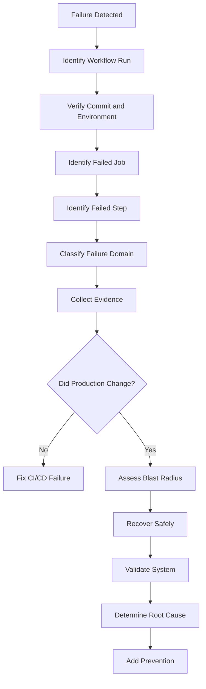
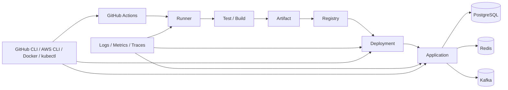

# README

## Overview

The `09- Troubleshooting` section provides a systematic approach to diagnosing GitHub Actions and CI/CD failures across the complete delivery lifecycle.

Production CI/CD is a distributed system:

```text
GitHub Event
    ↓
Workflow
    ↓
Jobs
    ↓
Steps / Actions
    ↓
Runner
    ↓
Build / Tests
    ↓
Artifacts / Cache
    ↓
Docker / Registry
    ↓
AWS / Infrastructure
    ↓
Deployment
    ↓
Application
    ↓
Monitoring
    ↓
Rollback / Recovery
```

A failure in any layer can appear as a failure somewhere else. For example:

- An AWS deployment failure may actually be an OIDC trust-policy issue.
- A Docker deployment failure may actually be an ECR permission problem.
- A failed integration test may actually be a service-container readiness issue.
- A skipped deployment may actually be caused by an expression or `needs` condition.
- A production rollback may fail because the database schema is no longer compatible with the previous application version.

The purpose of this section is therefore not simply to explain individual error messages. It is to develop a **failure-domain-driven troubleshooting methodology** that can be applied to real production CI/CD systems.

## Navigation

| # | File | Description |
|---|---|---|
| 01 | [01- Troubleshooting Methodology](./01-%20Troubleshooting%20Methodology.md) | Production CI/CD failures should be investigated systematically rather than through trial-and-error YAML changes. |
| 02 | [02- Workflow Syntax Errors](./02-%20Workflow%20Syntax%20Errors.md) | GitHub Actions workflows are declarative YAML configurations interpreted by GitHub before jobs are scheduled and executed. |
| 03 | [03- Trigger and Event Issues](./03-%20Trigger%20and%20Event%20Issues.md) | GitHub Actions trigger problems are often misdiagnosed as workflow failures. A workflow can be syntactically valid, correctly structured, and still not execute. |
| 04 | [04- Job and Step Failures](./04-%20Job%20and%20Step%20Failures.md) | GitHub Actions failures can occur at several execution layers: trigger evaluation, job scheduling, step execution, and post-job cleanup. |
| 05 | [05- Expression and Context Issues](./05-%20Expression%20and%20Context%20Issues.md) | GitHub Actions expressions and contexts control much of the dynamic behavior inside workflows. They determine which jobs run, what values are passed, and how outputs flow. |
| 06 | [06- Environment Variable and Secret Issues](./06-%20Environment%20Variable%20and%20Secret%20Issues.md) | Environment variables and secrets are fundamental to GitHub Actions workflows because they connect workflow configuration to execution environments. |
| 07 | [07- Permissions and GITHUB_TOKEN Issues](./07-%20Permissions%20and%20GITHUB_TOKEN%20Issues.md) | GitHub Actions permissions determine what a workflow, job, action, or deployment is allowed to do. |
| 08 | [08- Matrix Strategy Issues](./08-%20Matrix%20Strategy%20Issues.md) | GitHub Actions matrix strategy is one of the primary mechanisms for running the same job across multiple configurations. |
| 09 | [09- Reusable Workflow Issues](./09-%20Reusable%20Workflow%20Issues.md) | Reusable workflows allow GitHub Actions teams to define a workflow once and invoke it from multiple repositories or workflows. |
| 10 | [10- Artifact Issues](./10-%20Artifact%20Issues.md) | Artifacts are a primary data-transfer mechanism in GitHub Actions. They allow one job or workflow to persist files and make them available to later jobs. |
| 11 | [11- Cache Issues](./11-%20Cache%20Issues.md) | GitHub Actions caches are designed to reduce workflow execution time by reusing data that can be safely recreated, such as Python package installations. |
| 12 | [12- Container and Service Container Issues](./12-%20Container%20and%20Service%20Container%20Issues.md) | GitHub Actions supports containerized jobs and service containers to provide reproducible CI environments and dependency services. |
| 13 | [13- Custom Action Issues](./13-%20Custom%20Action%20Issues.md) | Custom GitHub Actions package reusable CI/CD behavior into a stable execution interface. |
| 14 | [14- Runner Issues](./14-%20Runner%20Issues.md) | GitHub Actions runners are the execution layer for workflows. A workflow defines what should happen, but the runner provides the environment where it happens. |
| 15 | [15- Self Hosted Runner Issues](./15-%20Self%20Hosted%20Runner%20Issues.md) | Self-hosted runners execute GitHub Actions jobs on infrastructure controlled by the organization rather than on GitHub-managed machines. |
| 16 | [16- OIDC and AWS Authentication Issues](./16-%20OIDC%20and%20AWS%20Authentication%20Issues.md) | GitHub Actions commonly authenticates with AWS using OpenID Connect (OIDC) rather than long-lived AWS access keys. |
| 17 | [17- Docker Build and Registry Issues](./17-%20Docker%20Build%20and%20Registry%20Issues.md) | Docker build and registry failures in GitHub Actions usually span multiple independent layers. |
| 18 | [18- Deployment Failures](./18-%20Deployment%20Failures.md) | Deployment failures occur after or during the transition from a validated build artifact to a running production or non-production environment. |
| 19 | [19- Concurrency and Race Conditions](./19-%20Concurrency%20and%20Race%20Conditions.md) | Concurrency is a critical part of production CI/CD design because multiple workflows, jobs, matrix executions, deployments, and runners can execute simultaneously. |
| 20 | [20- Security Related Failures](./20-%20Security%20Related%20Failures.md) | Security-related failures in GitHub Actions are different from ordinary workflow failures because the immediate symptom may not reveal the underlying security cause. |
| 21 | [21- Production CI CD Failures](./21-%20Production%20CI%20CD%20Failures.md) | Production CI/CD failures are failures that affect the delivery or deployment path of a production system rather than just a developer's local test. |
| 22 | [22- Diagnostic Commands and Debugging](./22-%20Diagnostic%20Commands%20and%20Debugging.md) | Production CI/CD debugging requires more than reading a failed GitHub Actions step. A production pipeline is a distributed system. |

---

## Troubleshooting Philosophy

Use the following model for every failure:

```text
Symptom
  ↓
Possible Causes
  ↓
Isolation Strategy
  ↓
Commands / Checks
  ↓
Root Cause
  ↓
Corrective Action
  ↓
Prevention
```

Avoid immediately changing configuration.

First establish:

```text
What failed?
Where did it fail?
Why did it fail?
What state is the system currently in?
Did production change?
What is the safest recovery action?
```

---

## How to Use This Section

Troubleshooting should normally proceed from the highest-level failure domain toward the specific component.

```text
Workflow
  ↓
Trigger
  ↓
Job
  ↓
Step
  ↓
Expression / Context
  ↓
Environment / Secrets / Permissions
  ↓
Matrix / Outputs / Reusable Workflow
  ↓
Artifact / Cache
  ↓
Container / Service
  ↓
Runner
  ↓
OIDC / AWS
  ↓
Docker / Registry
  ↓
Deployment
  ↓
Production Runtime
```

Do not start by changing application code when the workflow never triggered.

Do not change IAM permissions when the actual problem is an incorrect AWS region.

Do not rebuild a production image when the existing artifact is already known to be correct.

---

## Troubleshooting by Failure Domain

| Failure Domain | Typical Symptoms | Primary Diagnostic Area |
|---|---|---|
| Workflow syntax | Workflow cannot load | YAML / workflow structure |
| Trigger | Workflow does not start | Events / filters |
| Jobs | Job skipped | `needs`, `if`, matrix |
| Steps | Command/action fails | Logs / exit codes |
| Expressions | Unexpected values | Contexts / expressions |
| Environment | Missing configuration | `env` / `vars` |
| Secrets | Authentication/config failure | Secrets / environments |
| Permissions | `403`, access denied | `GITHUB_TOKEN` / IAM |
| Matrix | One combination fails | Matrix dimensions |
| Reusable workflow | Caller/callee mismatch | `workflow_call` |
| Artifact | Missing/wrong artifact | Upload/download |
| Cache | Slow or inconsistent build | Cache key/path |
| Containers | Service unavailable | Networking/readiness |
| Custom action | Action execution failure | `action.yml` / runtime |
| Runner | Job cannot execute | Runner state/resources |
| OIDC | AWS role assumption fails | Trust policy |
| AWS | API access denied | IAM/resource policies |
| Docker | Image build fails | Dockerfile/Buildx |
| Registry | Push/pull failure | ECR/auth/network |
| Deployment | Runtime rollout failure | Platform state |
| Concurrency | Conflicting deployments | Concurrency groups |
| Security | Credential/code exposure | Trust boundaries |
| Production | Customer impact | Runtime/recovery |

---

## Diagnostic Workflow

A production troubleshooting workflow should follow:



---

## Start With Evidence

Before modifying anything, record:

```text
Repository
Workflow
Run ID
Commit SHA
Branch/tag
Event
Environment
Job
Step
Runner
Artifact
Docker image digest
AWS account
AWS region
Deployment ID
Timestamp
```

This creates a reliable incident context.

---

## GitHub Actions Diagnostic Toolkit

GitHub CLI is the primary operational tool for inspecting GitHub Actions from the command line.

### Authentication

```bash
gh auth status
```

### List workflows

```bash
gh workflow list
```

### Inspect workflow

```bash
gh workflow view deploy.yml
```

### List recent runs

```bash
gh run list --limit 20
```

### Filter failed runs

```bash
gh run list \
  --status failure \
  --limit 20
```

### Inspect a run

```bash
gh run view <run-id>
```

### View logs

```bash
gh run view <run-id> --log
```

### View only failed logs

```bash
gh run view <run-id> --log-failed
```

### Watch a run

```bash
gh run watch <run-id>
```

### Rerun failed jobs

```bash
gh run rerun <run-id> --failed
```

### Download artifacts

```bash
gh run download <run-id>
```

### List workflows

```bash
gh workflow list
```

### Manually execute a workflow

```bash
gh workflow run deploy.yml --ref main
```

A production rerun should never be treated as automatically safe. First determine whether the original run changed production.

---

## Git and Commit Diagnostics

Verify the source being deployed:

```bash
git rev-parse HEAD
```

```bash
git rev-parse --short HEAD
```

```bash
git branch --show-current
```

```bash
git status --short
```

```bash
git remote -v
```

A production incident should establish:

```text
GitHub SHA
=
Build SHA
=
Artifact metadata
=
Deployment SHA
```

where the architecture requires this relationship.

---

## Workflow Trigger Problems

If a workflow did not execute, investigate:

- Event type.
- Branch filters.
- Tag filters.
- Path filters.
- Workflow state.
- Workflow file location.
- Repository configuration.
- Manual dispatch requirements.
- Event-specific restrictions.

Example:

```yaml
on:
  push:
    branches:
      - main
```

A push to `feature/orders` will not trigger this workflow.

### Diagnostic Sequence

```text
Was the event generated?
        ↓
Did the event match the workflow?
        ↓
Did branch/tag filters match?
        ↓
Did path filters match?
        ↓
Is the workflow enabled?
```

---

## Job and Step Failures

When a workflow starts but a job fails:

```text
Workflow
  ↓
Job
  ↓
Step
  ↓
Command / Action
```

Inspect the first meaningful failure rather than only the final failure.

Useful commands:

```bash
gh run view <run-id> --log-failed
```

For shell commands:

```bash
set -euxo pipefail
```

Use shell debugging carefully when secrets may be present.

---

## Expression and Context Issues

GitHub expressions use:

```yaml
${{ ... }}
```

Shell variables use:

```bash
$VARIABLE
```

Prefer an explicit boundary:

```yaml
- name: Inspect ref
  env:
    REF: ${{ github.ref }}
  run: printf '%s\n' "$REF"
```

Important contexts include:

- `github`
- `env`
- `vars`
- `secrets`
- `steps`
- `needs`
- `job`
- `runner`
- `matrix`
- `strategy`
- `inputs`

When debugging an unexpected value, first verify that the value actually exists in the context being used.

---

## Conditional Execution

Common causes of skipped jobs or steps include:

```text
if
needs
success()
failure()
always()
cancelled()
continue-on-error
```

For example:

```yaml
deploy:
  needs: tests
  if: ${{ needs.tests.result == 'success' }}
```

If `tests` is skipped, cancelled, or fails, the deployment behavior may differ from what was expected.

Status functions should be understood precisely rather than added mechanically.

---

## Environment Variable Problems

Check variable scope:

```text
Workflow
    ↓
Job
    ↓
Step
```

Example:

```yaml
env:
  APP_ENV: production
```

A step can override it:

```yaml
env:
  APP_ENV: staging
```

For debugging:

```bash
printf 'APP_ENV=%s\n' "$APP_ENV"
```

Never dump the entire environment in a workflow containing secrets.

---

## Secrets Problems

Never diagnose secrets by printing them.

Instead:

```bash
if [ -n "${API_KEY:-}" ]; then
  echo "API_KEY is configured"
else
  echo "API_KEY is missing"
fi
```

Investigate:

```text
Repository secret
Organization secret
Environment secret
Secret inheritance
Environment assignment
Workflow permissions
Fork behavior
```

A secret being defined does not mean it is available to every workflow or job.

---

## `GITHUB_TOKEN` and Permission Problems

A GitHub API failure such as:

```text
403 Forbidden
```

may indicate insufficient token permissions.

Use explicit permissions:

```yaml
permissions:
  contents: read
```

Add only the permissions required by the workflow.

For example:

```yaml
permissions:
  contents: read
  pull-requests: write
```

Avoid:

```yaml
permissions: write-all
```

as a generic troubleshooting fix.

---

## OIDC and AWS Troubleshooting

AWS authentication should be diagnosed in two distinct phases:

```text
GitHub OIDC
    ↓
STS Role Assumption
```

and:

```text
Temporary AWS Credentials
    ↓
IAM Authorization
    ↓
AWS Resource
```

Start with:

```bash
aws sts get-caller-identity
```

If this fails, investigate:

- `id-token: write`.
- OIDC provider.
- IAM trust policy.
- Audience.
- Subject.
- Repository.
- Branch.
- Environment.

If this succeeds but an AWS API fails, investigate:

- IAM identity policy.
- Resource policy.
- Permissions boundary.
- SCP.
- `iam:PassRole`.
- Service-specific permissions.

---

## Docker Troubleshooting

Useful commands:

```bash
docker --version
```

```bash
docker ps -a
```

```bash
docker image ls
```

```bash
docker system df
```

```bash
docker buildx ls
```

For detailed builds:

```bash
docker buildx build \
  --progress=plain \
  -t orders-api:debug \
  .
```

Inspect an image:

```bash
docker image inspect orders-api:debug
```

Inspect architecture:

```bash
docker image inspect orders-api:debug \
  --format '{{.Architecture}}/{{.Os}}'
```

Common causes include:

- Incorrect Dockerfile.
- Wrong build context.
- Missing dependency.
- Platform mismatch.
- Build cache.
- Base image availability.
- Network access.
- Build secrets.
- Resource exhaustion.

---

## ECR Troubleshooting

Verify AWS identity:

```bash
aws sts get-caller-identity
```

Check repository:

```bash
aws ecr describe-repositories \
  --repository-names orders-api \
  --region ap-south-1
```

List images:

```bash
aws ecr list-images \
  --repository-name orders-api \
  --region ap-south-1
```

Inspect images:

```bash
aws ecr describe-images \
  --repository-name orders-api \
  --region ap-south-1
```

For a production release, verify the exact image digest rather than relying only on a mutable tag.

---

## ECS Troubleshooting

Inspect the service:

```bash
aws ecs describe-services \
  --cluster production \
  --services orders-api \
  --region ap-south-1
```

List tasks:

```bash
aws ecs list-tasks \
  --cluster production \
  --service-name orders-api \
  --region ap-south-1
```

Inspect a task:

```bash
aws ecs describe-tasks \
  --cluster production \
  --tasks <task-arn> \
  --region ap-south-1
```

Investigate:

```text
Task definition
Image
Exit code
Stop reason
Container reason
Health status
Execution role
Task role
Network configuration
Load balancer health
```

---

## Container and Service Container Problems

For containerized CI, distinguish:

```text
Runner networking
```

from:

```text
Job container networking
```

and:

```text
Service container networking
```

Inside a container:

```text
localhost
```

refers to that container.

It does not automatically refer to PostgreSQL, Redis, or another service container.

Useful checks:

```bash
getent hosts postgres
```

```bash
nc -vz postgres 5432
```

```bash
nc -vz redis 6379
```

---

## PostgreSQL Diagnostics

Readiness:

```bash
pg_isready \
  -h "$PGHOST" \
  -p "${PGPORT:-5432}"
```

Connection:

```bash
psql "$DATABASE_URL"
```

Useful SQL:

```sql
SELECT current_database();
```

```sql
SELECT current_user;
```

```sql
SELECT version();
```

For migration diagnostics in Django:

```bash
python manage.py showmigrations
```

```bash
python manage.py migrate --plan
```

---

## Redis Diagnostics

Connectivity:

```bash
redis-cli -h "$REDIS_HOST" ping
```

Expected:

```text
PONG
```

Inspect server information:

```bash
redis-cli -h "$REDIS_HOST" INFO
```

Use expensive Redis diagnostic commands carefully in production.

---

## Python and Django Diagnostics

Python:

```bash
python --version
```

```bash
python -m pip --version
```

```bash
python -m pip list
```

Test an import:

```bash
python -c "import django; print(django.get_version())"
```

Django configuration:

```bash
python manage.py check
```

Deployment checks:

```bash
python manage.py check --deploy
```

These commands help distinguish environment problems from application problems.

---

## FastAPI Diagnostics

Verify imports:

```bash
python -c "from app.main import app; print(app)"
```

Run locally:

```bash
uvicorn app.main:app \
  --host 0.0.0.0 \
  --port 8000
```

Validate:

```bash
curl --fail http://127.0.0.1:8000/health
```

Separate:

```text
Import
→ Startup
→ Port binding
→ Routing
→ Dependency
```

failures.

---

## Pytest Diagnostics

Run the complete suite:

```bash
pytest
```

Verbose:

```bash
pytest -vv
```

Show output:

```bash
pytest -s
```

Stop at first failure:

```bash
pytest -x
```

Run one test:

```bash
pytest tests/test_orders.py::test_create_order -q
```

Run a subset:

```bash
pytest -k "order"
```

A useful progression is:

```text
Full suite
→ Failing module
→ Failing test
→ Minimal reproduction
```

---

## Artifact Problems

When an artifact is missing:

```text
Did the producer job execute?
        ↓
Did the file exist?
        ↓
Was the path correct?
        ↓
Did upload execute?
        ↓
Was the artifact retained?
        ↓
Did the consumer download the correct artifact?
```

Inspect generated files:

```bash
find . -maxdepth 3 -type f | sort
```

Verify a known file:

```bash
test -f dist/app.tar.gz && echo "artifact exists"
```

Do not use caches as authoritative release artifacts.

---

## Cache Problems

Investigate:

- Cache key.
- Restore keys.
- Dependency lock files.
- Cache path.
- Cache hit/miss.
- Dependency manager.

Example:

```yaml
key: ${{ runner.os }}-pip-${{ hashFiles('**/requirements*.txt') }}
```

A cache should improve performance, not determine correctness.

---

## Runner Troubleshooting

Linux runner diagnostics:

```bash
uname -a
```

```bash
cat /etc/os-release
```

```bash
python --version
```

```bash
docker --version
```

CPU:

```bash
nproc
```

Memory:

```bash
free -h
```

Disk:

```bash
df -h
```

Inodes:

```bash
df -i
```

Processes:

```bash
ps aux --sort=-%mem | head
```

Ports:

```bash
ss -lntp
```

Self-hosted runner failures commonly involve:

- Offline runner.
- Incorrect labels.
- Runner group restrictions.
- Resource exhaustion.
- Network connectivity.
- Stale workspace.
- Docker state.
- Software drift.
- Persistent runner contamination.

---

## Network Troubleshooting

Use layered diagnostics.

### DNS

```bash
dig api.example.com
```

### TCP

```bash
nc -vz api.example.com 443
```

### HTTP

```bash
curl -v https://api.example.com/health
```

### TLS

```bash
openssl s_client \
  -connect api.example.com:443 \
  -servername api.example.com
```

Interpret failures separately:

```text
DNS
→ TCP
→ TLS
→ HTTP
→ Application
```

---

## Reusable Workflow Problems

When a reusable workflow fails, inspect:

```text
workflow_call
inputs
secrets
permissions
outputs
runner
environment
reference/version
```

Remember:

```text
Reusable Workflow
```

can orchestrate multiple jobs.

A:

```text
Composite Action
```

packages steps executed within a job.

Confusing these abstractions often leads to incorrect troubleshooting.

---

## Custom Action Problems

For composite actions inspect:

```text
action.yml
inputs
outputs
shell
working directory
environment
```

For JavaScript actions inspect:

```text
Node runtime
package dependencies
dist/
@actions/core
@actions/github
```

For Docker actions inspect:

```text
Dockerfile
entrypoint
base image
container environment
network access
```

Also verify the action version and source.

---

## Security-Related Failures

Security boundaries can cause legitimate failures:

```text
Secret unavailable
Permission denied
OIDC role rejected
Environment approval missing
Action blocked
Runner access denied
```

Do not weaken the security model merely to make the pipeline pass.

Investigate the intended trust boundary first.

---

## Untrusted Input Diagnostics

Treat these as untrusted:

- Pull request titles.
- Branch names.
- Commit messages.
- Issue content.
- Manual inputs.
- External API values.

Prefer:

```yaml
- name: Inspect input
  env:
    VALUE: ${{ github.event.pull_request.title }}
  run: printf '%s\n' "$VALUE"
```

over directly interpolating the value into shell syntax.

---

## Concurrency Problems

Production deployments should normally use explicit concurrency.

```yaml
concurrency:
  group: production-deployment
  cancel-in-progress: false
```

Investigate:

```text
Duplicate workflow runs
Manual deployment
Automatic deployment
Rollback workflow
Reusable workflow
External deployment system
```

A race condition may leave production running an older release after a newer release has already started.

---

## Production CI/CD Failures

Production debugging should first determine:

```text
Did deployment start?
Did it modify infrastructure?
Did it modify application traffic?
Which artifact is active?
Are old and new versions running simultaneously?
Is the database compatible?
Is rollback safe?
```

Useful production evidence includes:

```text
Workflow run
Commit SHA
Artifact digest
Deployment ID
Application version
Health checks
Error rate
Latency
Logs
Database state
```

---

## Production Recovery Model

```text
Detect
  ↓
Assess
  ↓
Contain
  ↓
Recover
  ↓
Validate
  ↓
Investigate
  ↓
Prevent
```

If production is unhealthy, restoring service takes priority over perfect root-cause analysis.

After recovery, preserve evidence and perform a complete investigation.

---

## Rollback Diagnostics

Before rollback:

```text
Identify last-known-good artifact
Check database compatibility
Check configuration compatibility
Check infrastructure state
Check queue/message compatibility
Check external API compatibility
```

Then:

```text
Deploy previous artifact
→ Validate health
→ Monitor
```

A previous application image is not automatically a valid rollback if persistent state has changed.

---

## Diagnostic Architecture



A mature troubleshooting system allows an engineer to traverse this architecture in either direction.

```text
Production symptom
→ Runtime
→ Deployment
→ Artifact
→ Runner
→ Workflow
→ Commit
```

or:

```text
Commit
→ Workflow
→ Build
→ Artifact
→ Deployment
→ Runtime
```

---

## Production Diagnostic Principles

### Establish State Before Acting

Determine whether production changed before rerunning or rolling back.

### Separate Authentication From Authorization

Successful identity does not imply sufficient permissions.

### Separate CI Failure From Runtime Failure

A green workflow does not prove application health.

### Prefer Read-Only Diagnostics

Use `get`, `describe`, `list`, `status`, `logs`, and `inspect` before mutation commands.

### Preserve Artifact Identity

Record the exact image digest or artifact that reached production.

### Treat Diagnostics as Security-Sensitive

Do not expose secrets, tokens, credentials, or sensitive application data while debugging.

### Automate Repeated Diagnostics

If the same diagnostic information is repeatedly collected manually, expose it through structured logs, step summaries, deployment metadata, health checks, or operational tooling.

---

## Operational Command Quick Reference

| Area | Commands |
|---|---|
| GitHub auth | `gh auth status` |
| Workflows | `gh workflow list`, `gh workflow view` |
| Runs | `gh run list`, `gh run view` |
| Logs | `gh run view <id> --log-failed` |
| Artifacts | `gh run download <id>` |
| Git | `git rev-parse HEAD`, `git status` |
| Runner | `uname`, `df`, `free`, `ps`, `ss` |
| Network | `curl`, `dig`, `nc`, `openssl` |
| Python | `python --version`, `python -m pip list` |
| Django | `manage.py check`, `showmigrations` |
| Tests | `pytest -vv`, `pytest -x` |
| Docker | `docker ps`, `docker logs`, `docker inspect` |
| Buildx | `docker buildx ls`, `docker buildx build --progress=plain` |
| AWS identity | `aws sts get-caller-identity` |
| ECR | `aws ecr describe-images` |
| ECS | `aws ecs describe-services`, `describe-tasks` |
| EC2 | `aws ec2 describe-instances` |
| CloudFormation | `aws cloudformation describe-stack-events` |
| Terraform | `terraform validate`, `plan`, `state list` |
| Kubernetes | `kubectl get`, `describe`, `logs`, `rollout status` |
| PostgreSQL | `pg_isready`, `psql` |
| Redis | `redis-cli ping`, `redis-cli INFO` |

---

## Troubleshooting Checklist

### Workflow

- [ ] Correct workflow identified.
- [ ] Run ID recorded.
- [ ] Commit SHA verified.
- [ ] Event verified.
- [ ] Branch/tag verified.
- [ ] Filters checked.

### Execution

- [ ] Failed job identified.
- [ ] Failed step identified.
- [ ] First meaningful error identified.
- [ ] Runner state checked.
- [ ] Resource availability checked.

### Configuration

- [ ] Contexts verified.
- [ ] Environment variables verified.
- [ ] Secrets presence verified without exposing values.
- [ ] Permissions checked.
- [ ] Environment protection checked.

### Dependencies

- [ ] Matrix combination identified.
- [ ] Artifact path checked.
- [ ] Cache behavior checked.
- [ ] Container networking checked.
- [ ] Service readiness checked.

### AWS

- [ ] AWS account verified.
- [ ] AWS role verified.
- [ ] OIDC checked.
- [ ] IAM authorization checked.
- [ ] Region verified.
- [ ] Resource policy checked.

### Deployment

- [ ] Artifact identity verified.
- [ ] Image digest verified.
- [ ] Deployment state checked.
- [ ] Health checks checked.
- [ ] Concurrency checked.
- [ ] Rollback target identified.

### Production

- [ ] Blast radius assessed.
- [ ] Customer impact assessed.
- [ ] Current production state recorded.
- [ ] Recovery action documented.
- [ ] Post-recovery validation completed.
- [ ] Root cause and prevention recorded.

---

## Senior-Level Design Questions

A senior backend engineer should be able to reason through:

### Workflow Design

- How would you debug a workflow that never starts?
- How would you distinguish a skipped job from a failed job?
- How would you debug a dynamic matrix?
- How would you trace data between jobs?

### Security

- Why should deployment jobs have fewer permissions than test jobs?
- How would you diagnose an OIDC failure?
- How would you troubleshoot a `GITHUB_TOKEN` `403`?
- How would you debug a secret without exposing it?
- How would you investigate a compromised action?

### Containers

- How would you diagnose a Docker build that fails only on CI?
- How would you debug a PostgreSQL service-container failure?
- How would you distinguish a container networking problem from an application problem?

### AWS

- How would you distinguish STS role-assumption failure from IAM authorization failure?
- How would you diagnose an ECR push failure?
- How would you determine why ECS tasks are repeatedly stopping?

### Production

- How would you debug a deployment that succeeded but production is returning `500`?
- How would you determine whether rollback is safe?
- How would you diagnose two production deployments running simultaneously?
- How would you design a CI/CD platform that remains recoverable when the deployment pipeline itself fails?

---

## Target Production Pipeline

This troubleshooting section supports the complete production lifecycle:

```text
Pull Request
    ↓
Lint
    ↓
Unit Tests
    ↓
Integration Tests
    ↓
Security Scan
    ↓
Matrix Testing
    ↓
Build
    ↓
Docker Image
    ↓
ECR
    ↓
Staging
    ↓
Approval
    ↓
Production
    ↓
Monitoring
    ↓
Rollback
```

At each stage, the engineer should understand:

- What executes.
- Where it executes.
- What data it consumes.
- What data it produces.
- Which permissions it requires.
- Which failure domain it belongs to.
- How the failure is diagnosed.
- Whether the failure is safe to retry.
- How production state is recovered.

---

## Section Completion Criteria

This troubleshooting section is complete when an engineer can independently:

- Diagnose workflow and trigger failures.
- Debug jobs, steps, expressions, contexts, and conditions.
- Diagnose environment variables, secrets, and permissions.
- Debug matrices and reusable workflows.
- Diagnose artifacts and caches.
- Troubleshoot containers and service containers.
- Debug custom actions.
- Diagnose GitHub-hosted and self-hosted runner failures.
- Troubleshoot OIDC and AWS authentication.
- Diagnose Docker and ECR failures.
- Investigate deployment failures across AWS and Kubernetes.
- Identify concurrency and race conditions.
- Diagnose security-related CI/CD failures.
- Debug production deployment failures.
- Use GitHub CLI for operational workflows.
- Preserve evidence during incidents.
- Recover production safely.
- Design preventive controls after identifying root causes.

## Key Takeaways

- CI/CD troubleshooting should be organized by failure domain and follow the path from workflow trigger through runner, artifact, deployment, and production runtime.
- Start with evidence and system state before making changes; verify the run, commit, environment, artifact, permissions, and whether production was modified.
- Use GitHub CLI, AWS CLI, Docker, Kubernetes, database, Python, and network commands as targeted diagnostic tools rather than as a collection of random fixes.
- Production-grade troubleshooting must preserve security and recovery properties: avoid secret exposure, maintain immutable artifact identity, control deployment concurrency, and validate rollback safety.
- The goal of troubleshooting is not only to restore a failed pipeline but to convert the root cause into stronger tests, observability, controls, and operational practices.