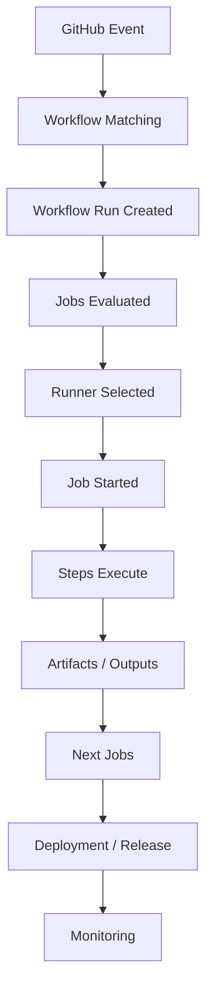
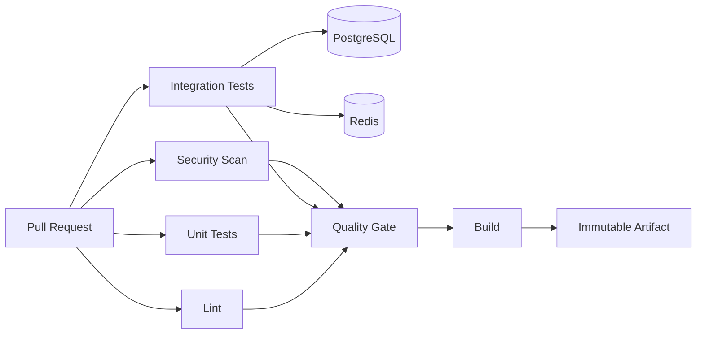
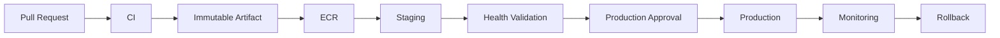
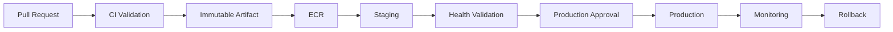
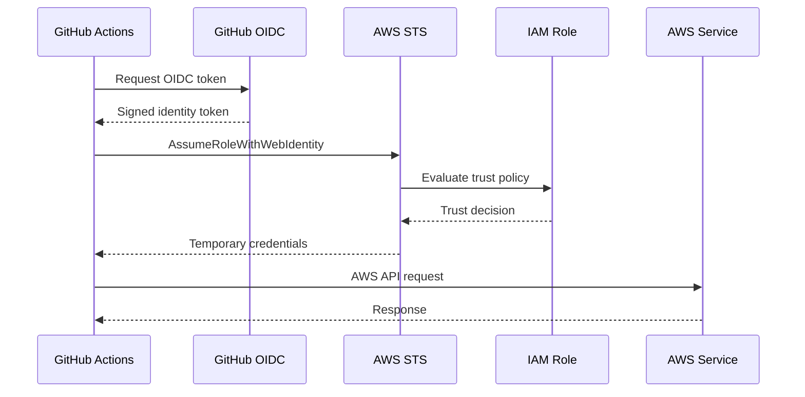
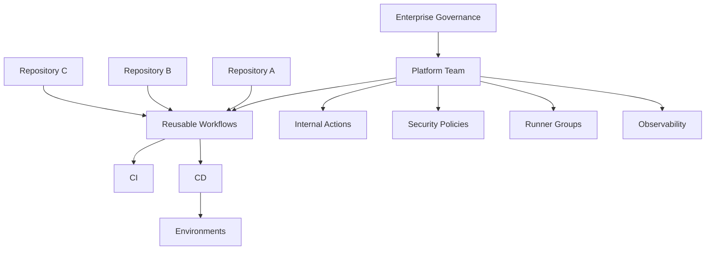
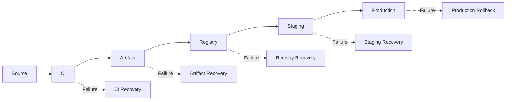
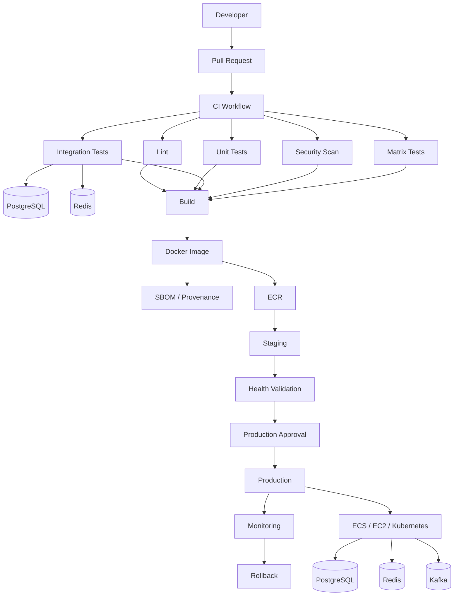

# 01- GitHub Actions Architecture

## Overview

GitHub Actions is a workflow execution platform for implementing CI/CD, automation, testing, security validation, artifact production, deployment, and operational workflows around GitHub repositories.

For a senior backend engineer, the important abstraction is not YAML syntax. It is the execution architecture:

```text
GitHub Event
    ↓
Workflow
    ↓
Jobs
    ↓
Steps
    ↓
Actions / Shell Commands
    ↓
Runner
    ↓
Build / Test / Artifact
    ↓
Registry / Infrastructure
    ↓
Deployment
    ↓
Production Runtime
```

A production GitHub Actions architecture must answer:

- What triggers the workflow?
- Where does each job execute?
- Which jobs depend on each other?
- What data moves between jobs?
- Which credentials are available?
- Which permissions are required?
- Which artifacts are immutable?
- How are environments protected?
- How are deployments serialized?
- How are failures detected and recovered?
- How does the architecture scale across repositories and teams?

The architecture should therefore be designed as a distributed CI/CD system rather than a collection of YAML files.

---

## GitHub Actions Architecture

The core GitHub Actions execution model is:

```text
Workflow
   │
   ├── Job
   │    ├── Step
   │    │    ├── Action
   │    │    └── Shell command
   │    │
   │    └── Step
   │
   └── Job
        └── Steps
```

A runner executes jobs.

An action is reusable logic executed by a step.

The relationship is:

```text
Workflow
    ↓
Job
    ↓
Step
    ↓
Action / Command
    ↓
Runner
```

Understanding these boundaries is essential for debugging and architecture decisions.

---

## Workflow

A workflow is a YAML-defined automation process stored under:

```text
.github/workflows/
```

Example:

```yaml
name: CI

on:
  pull_request:
    branches:
      - main

jobs:
  test:
    runs-on: ubuntu-latest

    steps:
      - name: Checkout
        uses: actions/checkout@v4

      - name: Set up Python
        uses: actions/setup-python@v5
        with:
          python-version: "3.12"

      - name: Install dependencies
        run: python -m pip install -r requirements.txt

      - name: Run tests
        run: pytest
```

A workflow defines:

- Triggers.
- Jobs.
- Job dependencies.
- Permissions.
- Environment configuration.
- Concurrency.
- Matrix strategies.
- Outputs.
- Artifacts.
- Deployment behavior.

---

## Workflow File Organization

A production repository may contain:

```text
.github/
    workflows/
        ci.yml
        security.yml
        build.yml
        deploy-staging.yml
        deploy-production.yml
        release.yml
```

Avoid creating workflows merely because a process can be separated.

Separate workflows when there is a meaningful boundary such as:

- Different triggers.
- Different permissions.
- Different environments.
- Different ownership.
- Different execution frequency.
- Different security boundaries.
- Independent release lifecycle.

---

## Workflow Execution Lifecycle

A simplified lifecycle is:



The important point is that a workflow is not a single process.

Each job is independently scheduled and executed.

---

## Jobs

A job is an execution unit.

Example:

```yaml
jobs:
  lint:
    runs-on: ubuntu-latest
    steps:
      - uses: actions/checkout@v4
      - run: ruff check .

  test:
    runs-on: ubuntu-latest
    steps:
      - uses: actions/checkout@v4
      - run: pytest
```

By default, independent jobs can run in parallel.

This enables:

```text
lint ──────┐
           ├── build
test ──────┘
```

instead of:

```text
lint → test → build
```

when there is no actual dependency between them.

---

## Job Dependencies

Use `needs` to establish dependency relationships.

```yaml
jobs:
  lint:
    runs-on: ubuntu-latest
    steps:
      - run: ruff check .

  test:
    runs-on: ubuntu-latest
    steps:
      - run: pytest

  build:
    needs:
      - lint
      - test
    runs-on: ubuntu-latest

    steps:
      - run: ./build.sh
```

The resulting dependency graph is:

```text
lint ──────┐
           ├── build
test ──────┘
```

`needs` should represent a real dependency.

Do not use it simply to make the workflow visually sequential.

---

## Fan-Out and Fan-In

A common CI architecture is:

```text
             ┌── Python 3.11
             │
Planning ────┼── Python 3.12
             │
             └── Python 3.13
                    │
                    ↓
                 Build
```

This is fan-out followed by fan-in.

Example:

```yaml
jobs:
  test:
    strategy:
      matrix:
        python-version:
          - "3.11"
          - "3.12"
          - "3.13"

    runs-on: ubuntu-latest

    steps:
      - uses: actions/checkout@v4
      - uses: actions/setup-python@v5
        with:
          python-version: ${{ matrix.python-version }}
      - run: pytest

  build:
    needs: test
    runs-on: ubuntu-latest

    steps:
      - run: ./build.sh
```

This is one of the primary mechanisms for scaling CI horizontally.

---

## Steps

A step is an individual operation within a job.

A step can:

- Execute a shell command.
- Run an action.
- Set environment variables.
- Produce outputs.
- Upload artifacts.
- Modify the runner workspace.

Example:

```yaml
steps:
  - name: Checkout
    uses: actions/checkout@v4

  - name: Install dependencies
    run: python -m pip install -r requirements.txt

  - name: Run tests
    run: pytest

  - name: Upload report
    uses: actions/upload-artifact@v4
    with:
      name: test-report
      path: reports/
```

Steps within a job execute sequentially unless conditional behavior changes execution.

---

## Actions

Actions package reusable behavior.

Examples include:

```yaml
uses: actions/checkout@v4
```

```yaml
uses: actions/setup-python@v5
```

Actions can be:

- JavaScript actions.
- Docker actions.
- Composite actions.

They should be treated as dependencies in the CI/CD supply chain.

---

## Runner

A runner is the execution environment for a job.

A job specifies:

```yaml
runs-on: ubuntu-latest
```

The runner:

```text
Receives job
    ↓
Creates execution environment
    ↓
Runs steps
    ↓
Produces outputs/artifacts
    ↓
Reports result
```

Runners can be:

- GitHub-hosted.
- Self-hosted.
- Persistent.
- Ephemeral.
- Linux.
- Windows.
- Other supported environments.

---

## GitHub-Hosted Runners

GitHub-hosted runners provide managed execution environments.

Example:

```yaml
runs-on: ubuntu-latest
```

Advantages:

- Low operational overhead.
- Standardized environments.
- Easy scaling.
- Reduced infrastructure management.

Limitations:

- Less control over the host.
- Restricted access to private networks.
- Runtime/tool availability follows the runner image.
- Execution environment is not under your infrastructure lifecycle.

For most public CI workloads, GitHub-hosted runners provide a strong default.

---

## Self-Hosted Runners

Self-hosted runners are useful when workflows require:

- Private VPC access.
- Internal databases.
- Custom operating-system configuration.
- Specialized hardware.
- Private package registries.
- Internal network access.
- Specialized build tooling.

Architecture:

```text
GitHub
   ↓
Self-Hosted Runner
   ↓
Private Network
   ├── PostgreSQL
   ├── Redis
   ├── Internal APIs
   └── Deployment Targets
```

The security boundary is significantly larger than with GitHub-hosted runners.

Untrusted code should not automatically execute on a privileged persistent self-hosted runner.

---

## Job Execution Lifecycle

A job approximately follows:

```text
Job Queued
    ↓
Runner Selected
    ↓
Runner Prepared
    ↓
Repository Checked Out
    ↓
Steps Execute
    ↓
Outputs / Artifacts Produced
    ↓
Job Completes
    ↓
Runner Released
```

For a self-hosted persistent runner, the workspace and host may survive after the job.

For ephemeral infrastructure, the runner can be destroyed after execution.

---

## Step Execution Lifecycle

A typical job looks like:

```text
Checkout
    ↓
Environment Setup
    ↓
Dependency Installation
    ↓
Build
    ↓
Test
    ↓
Package
    ↓
Upload Artifact
```

The step boundary is important because failures can be isolated to:

```text
Action
Shell
Environment
Dependency
Network
Runner
```

---

## CI Architecture

A production Python backend might use:



The architecture separates validation from artifact creation.

---

## Production CD Architecture

A mature CD pipeline extends CI:



The key architectural principle is:

```text
Build Once
    ↓
Produce Immutable Artifact
    ↓
Promote Same Artifact
```

rather than:

```text
Build for Staging
Build Again for Production
```

---

## Build Once, Deploy Many

Suppose a Docker image is built from:

```text
commit = 8d7a2e1
```

The image should receive an immutable identity such as:

```text
orders-api:8d7a2e1
```

and ideally a content digest:

```text
sha256:...
```

Promotion should preserve the artifact:

```text
Build
 ↓
ECR
 ↓
Staging
 ↓
Production
```

The production environment should consume the same image that was validated in staging.

---

## Why Immutable Artifacts Matter

Immutable artifacts provide:

- Reproducibility.
- Auditability.
- Safer rollback.
- Environment consistency.
- Easier incident investigation.
- Better supply-chain verification.

Avoid making a mutable tag such as:

```text
latest
```

the only production identity.

---

## Artifact Flow

```text
Source
  ↓
Build
  ↓
Artifact
  ↓
Registry
  ↓
Environment Promotion
  ↓
Production
```

The artifact becomes the contract between CI and CD.

This reduces coupling between:

```text
Source Code
```

and:

```text
Deployment
```

---

## Workflow Data Flow

Data can move between steps through:

```text
Environment
Outputs
Files
Artifacts
Cache
```

For steps:

```yaml
- name: Generate version
  id: version
  run: echo "version=${GITHUB_SHA::7}" >> "$GITHUB_OUTPUT"

- name: Use version
  env:
    VERSION: ${{ steps.version.outputs.version }}
  run: printf '%s\n' "$VERSION"
```

For jobs:

```yaml
jobs:
  build:
    runs-on: ubuntu-latest
    outputs:
      image: ${{ steps.image.outputs.image }}

    steps:
      - id: image
        run: echo "image=orders-api:${GITHUB_SHA}" >> "$GITHUB_OUTPUT"

  deploy:
    needs: build
    runs-on: ubuntu-latest

    steps:
      - env:
          IMAGE: ${{ needs.build.outputs.image }}
        run: printf '%s\n' "$IMAGE"
```

---

## Context Architecture

GitHub Actions exposes contextual information through contexts.

Important contexts include:

| Context | Purpose |
|---|---|
| `github` | Repository, event, ref, run metadata |
| `env` | Environment variables |
| `vars` | Configuration variables |
| `secrets` | Secrets |
| `steps` | Step outputs/results |
| `needs` | Upstream job outputs/results |
| `job` | Current job |
| `runner` | Runner information |
| `matrix` | Current matrix values |
| `strategy` | Matrix strategy |
| `inputs` | Workflow/action inputs |

Example:

```yaml
- name: Runtime metadata
  env:
    SHA: ${{ github.sha }}
    REF: ${{ github.ref }}
    RUN_ID: ${{ github.run_id }}
  run: |
    printf 'sha=%s\n' "$SHA"
    printf 'ref=%s\n' "$REF"
    printf 'run=%s\n' "$RUN_ID"
```

Passing values through `env` creates a clearer boundary between GitHub expression evaluation and shell execution.

---

## Expressions and Shell Execution

GitHub expressions:

```yaml
${{ github.sha }}
```

Shell variables:

```bash
$GITHUB_SHA
```

They are not the same execution mechanism.

For user-controlled data, prefer:

```yaml
- name: Process branch name
  env:
    BRANCH_NAME: ${{ github.ref_name }}
  run: |
    printf '%s\n' "$BRANCH_NAME"
```

This reduces shell-injection risk compared with direct interpolation.

---

## Event Architecture

GitHub Actions can be triggered by events such as:

```text
push
pull_request
pull_request_target
workflow_dispatch
schedule
workflow_call
workflow_run
repository_dispatch
release
```

Example:

```yaml
on:
  pull_request:
    branches:
      - main

  push:
    branches:
      - main

  workflow_dispatch:
```

Each trigger represents a different trust and execution model.

---

## Pull Request Architecture

A common CI architecture is:

```text
Pull Request
    ↓
Lint
    ↓
Unit Tests
    ↓
Integration Tests
    ↓
Security
    ↓
Quality Gate
```

Production credentials should not be exposed to arbitrary pull-request code.

This becomes especially important for forked pull requests and `pull_request_target`.

---

## `pull_request` vs `pull_request_target`

The distinction is architectural.

`pull_request` generally evaluates the pull-request code in the pull-request context.

`pull_request_target` executes in the context of the base repository.

Because the latter can access repository-level privileges and potentially secrets depending on configuration, it must not blindly execute untrusted pull-request code.

A dangerous architecture is:

```text
pull_request_target
    ↓
Checkout PR Code
    ↓
Execute PR Scripts
    ↓
Secrets / Elevated Token
```

The trust boundary has been broken.

---

## Environment Architecture

Production environments should be treated as security and deployment boundaries.

```text
Development
    ↓
Staging
    ↓
Production
```

GitHub Environments can provide:

- Environment variables.
- Environment secrets.
- Required reviewers.
- Deployment protection.
- Deployment history.
- Branch restrictions.

---

## Environment Promotion

A production architecture should resemble:

```text
Build
 ↓
Artifact
 ↓
Staging
 ↓
Validation
 ↓
Approval
 ↓
Production
```

The environment changes.

The artifact should not.

---

## Environment Separation

Avoid using one set of credentials for all environments.

Prefer:

```text
CI Role
Staging Deployment Role
Production Deployment Role
```

with distinct trust and permission boundaries.

This limits blast radius.

---

## Concurrency Architecture

Production deployments should normally prevent concurrent modifications to the same environment.

Example:

```yaml
concurrency:
  group: production
  cancel-in-progress: false
```

Architecture:

```text
Deployment A ────────┐
                     ├── Production
Deployment B ──X─────┘
```

Without concurrency control:

```text
Deployment A
     ↓
Production
     ↑
Deployment B
```

can create race conditions.

---

## Pull Request Concurrency

For CI validation, cancelling outdated runs can reduce cost:

```yaml
concurrency:
  group: ci-${{ github.workflow }}-${{ github.ref }}
  cancel-in-progress: true
```

For production deployment, cancelling a running deployment is usually more dangerous.

Use different concurrency policies for different workflow types.

---

## Matrix Architecture

Matrices provide horizontal execution.

Example:

```yaml
strategy:
  fail-fast: false
  max-parallel: 4
  matrix:
    python:
      - "3.11"
      - "3.12"
    database:
      - postgres
      - mysql
```

This creates four combinations:

```text
3.11 + postgres
3.11 + mysql
3.12 + postgres
3.12 + mysql
```

Matrix size grows multiplicatively.

If there are:

```text
4 Python versions
× 3 databases
× 2 operating systems
```

the matrix produces:

```text
24 jobs
```

This affects:

- Cost.
- Queue time.
- Runner capacity.
- Database capacity.
- Artifact volume.

---

## Dynamic Matrix Architecture

A planning job can generate JSON configuration:

```text
Repository
    ↓
Planning Job
    ↓
JSON Matrix
    ↓
Test Jobs
```

Example:

```yaml
jobs:
  plan:
    runs-on: ubuntu-latest
    outputs:
      matrix: ${{ steps.matrix.outputs.matrix }}

    steps:
      - id: matrix
        run: |
          echo 'matrix={"python":["3.11","3.12"]}' >> "$GITHUB_OUTPUT"

  test:
    needs: plan
    strategy:
      matrix: ${{ fromJSON(needs.plan.outputs.matrix) }}
    runs-on: ubuntu-latest

    steps:
      - run: python --version
```

Dynamic matrices are powerful but should be validated carefully when their values originate from untrusted or external input.

---

## Caching Architecture

Caching exists to improve performance.

It should not be treated as a release mechanism.

Common caches include:

- Python dependencies.
- Node dependencies.
- Docker build layers.

Example:

```yaml
- uses: actions/setup-python@v5
  with:
    python-version: "3.12"
    cache: pip
```

Cache identity should include the inputs that affect correctness.

For dependency files:

```yaml
key: ${{ runner.os }}-pip-${{ hashFiles('**/requirements*.txt') }}
```

---

## Artifact vs Cache

| Property | Artifact | Cache |
|---|---|---|
| Purpose | Preserve outputs | Speed up execution |
| Release input | Yes | No |
| Test reports | Yes | No |
| Build package | Yes | No |
| Dependency cache | No | Yes |
| Reproducibility | Important | Not authoritative |
| Retention | Explicit | Cache lifecycle |

A production Docker image should be stored in an appropriate registry rather than relying on a GitHub Actions cache.

---

## Containers in CI Architecture

Containers provide controlled environments for jobs and integration tests.

Example:

```yaml
jobs:
  test:
    runs-on: ubuntu-latest

    container:
      image: python:3.12-slim

    steps:
      - uses: actions/checkout@v4
      - run: pip install -r requirements.txt
      - run: pytest
```

This improves environment consistency but does not eliminate dependency or networking problems.

---

## Service Container Architecture

A backend integration test may use:

```text
GitHub Runner
    │
    ├── Python Test Job
    │
    ├── PostgreSQL
    │
    └── Redis
```

Example:

```yaml
jobs:
  integration:
    runs-on: ubuntu-latest

    services:
      postgres:
        image: postgres:16
        env:
          POSTGRES_PASSWORD: postgres
          POSTGRES_DB: testdb
        options: >-
          --health-cmd "pg_isready -U postgres -d testdb"
          --health-interval 10s
          --health-timeout 5s
          --health-retries 5

      redis:
        image: redis:7
        options: >-
          --health-cmd "redis-cli ping"
          --health-interval 10s
          --health-timeout 5s
          --health-retries 5

    steps:
      - uses: actions/checkout@v4
      - run: pytest
```

Service readiness matters because process startup does not necessarily mean application readiness.

---

## Python Backend CI Architecture

A production backend pipeline might be:

```text
Pull Request
    ↓
Lint
    ↓
Type / Static Checks
    ↓
Unit Tests
    ↓
Integration Tests
    ├── PostgreSQL
    └── Redis
    ↓
Coverage
    ↓
Security Scan
    ↓
Build
    ↓
Docker Image
```

For Django:

```text
Django
→ PostgreSQL
→ Redis
→ Celery
→ pytest
```

For FastAPI:

```text
FastAPI
→ PostgreSQL
→ Redis
→ External API mocks
→ pytest
```

---

## CI and CD Separation

CI should primarily answer:

```text
Is this change valid?
```

CD should answer:

```text
Can this validated artifact be safely promoted?
```

A clean architecture is:

```text
CI
 ↓
Immutable Artifact
 ↓
CD
 ↓
Environment Promotion
```

This separation simplifies:

- Security.
- Auditing.
- Rollback.
- Reproducibility.
- Environment promotion.

---

## Production Deployment Architecture

A complete production pipeline can be represented as:



The artifact is created once and promoted through environments.

---

## Docker CI/CD Architecture

A typical AWS architecture:

```text
GitHub Actions
      │
      ├── Buildx
      │
      ├── Security Scan
      │
      ├── SBOM / Provenance
      │
      └── OIDC
             ↓
            STS
             ↓
            IAM
             ↓
            ECR
             ↓
      ECS / EC2 / EKS
```

The GitHub workflow should not need long-lived AWS access keys when OIDC federation is appropriate.

---

## GitHub OIDC Architecture



This separates:

```text
Authentication
```

from:

```text
Authorization
```

A successful role assumption does not automatically grant access to AWS resources.

---

## AWS Account Architecture

Production systems should generally separate environments logically and, where appropriate, by AWS account.

Example:

```text
AWS Organization
│
├── Development Account
│
├── Staging Account
│
└── Production Account
```

GitHub Actions roles should be environment-specific:

```text
GitHub
  ├── CI Role
  ├── Staging Role
  └── Production Role
```

This reduces blast radius and improves auditability.

---

## Deployment Strategies

GitHub Actions can orchestrate several deployment strategies.

| Strategy | Architecture | Main Trade-off |
|---|---|---|
| Rolling | Replace instances gradually | Mixed versions |
| Blue/Green | Maintain two environments | Higher infrastructure cost |
| Canary | Gradually shift traffic | More routing/observability complexity |
| Zero downtime | Maintain serving capacity during replacement | Requires compatibility and health design |

GitHub Actions should orchestrate the strategy rather than attempt to become the runtime deployment platform itself.

---

## Rolling Deployment

```text
Version A
A A A A
   ↓
A A A B
   ↓
A A B B
   ↓
A B B B
   ↓
B B B B
```

Important considerations:

- Readiness checks.
- Graceful shutdown.
- Connection draining.
- Database compatibility.
- Health validation.
- Rollback.

---

## Blue/Green Deployment

```text
                 ┌── Blue v1
Traffic ─────────┤
                 └── Green v2
                        ↑
                  Validation
                        ↓
                  Traffic Switch
```

Advantages:

- Fast traffic switch.
- Simple rollback.
- Clear version boundaries.

Trade-off:

- Requires additional capacity.

---

## Canary Deployment

```text
Traffic
   ↓
Router
 ├── 95% → Stable
 └── 5%  → Canary
             ↓
          Metrics
             ↓
       Promote / Rollback
```

Canary deployments require reliable observability and explicit promotion criteria.

---

## Zero-Downtime Architecture

Zero downtime depends on application behavior, not only the CI/CD tool.

Important components include:

- Readiness checks.
- Graceful shutdown.
- Connection draining.
- Backward-compatible APIs.
- Expand/contract database migrations.
- Safe deployment ordering.
- Monitoring.
- Automated rollback.

For Django and FastAPI applications, the runtime server and load balancer must cooperate with the deployment strategy.

---

## Database Migration Architecture

Database schema changes are a major CI/CD failure boundary.

Prefer:

```text
Expand
  ↓
Deploy compatible application
  ↓
Backfill
  ↓
Switch application behavior
  ↓
Contract
```

Avoid deployments that require the old and new application versions to use incompatible schemas simultaneously.

This is especially important for:

- Rolling deployments.
- Blue/green deployments.
- Canary deployments.
- Rollbacks.

---

## Celery Architecture

For a Django/FastAPI system using Celery:

```text
Application
    ↓
Redis / Broker
    ↓
Celery Workers
    ↓
Database / External Services
```

Deployment must account for:

- Worker version.
- Task payload compatibility.
- Queue state.
- Graceful worker shutdown.
- Retry behavior.
- Long-running tasks.

A rollback that restores application code but leaves incompatible queued task payloads can still fail.

---

## Kafka Architecture

For Kafka-based systems:

```text
Producer
   ↓
Kafka
   ↓
Consumer
   ↓
Database / Service
```

Deployment compatibility includes:

- Event schema.
- Consumer behavior.
- Producer behavior.
- Partitioning.
- Consumer lag.
- Rollback compatibility.

CI/CD should validate contract compatibility where appropriate.

---

## Nginx and API Gateway Architecture

A deployment may look like:

```text
Internet
   ↓
Nginx / Load Balancer
   ↓
Django / FastAPI
   ↓
PostgreSQL
   ↓
Redis
```

CI/CD should validate:

- Routing.
- Health endpoints.
- TLS configuration.
- Upstream availability.
- Connection draining.
- Deployment health.

---

## Microservice CI/CD Architecture

For multiple services:

```text
                    ┌── Service A CI ──→ Artifact A
                    │
Repository Changes ─┼── Service B CI ──→ Artifact B
                    │
                    └── Service C CI ──→ Artifact C
```

Avoid forcing every microservice to rebuild and deploy for every repository change.

Use:

- Change detection.
- Service ownership.
- Independent artifacts.
- Contract tests.
- Reusable workflows.
- Shared deployment primitives.

---

## Reusable Workflow Architecture

Reusable workflows centralize orchestration.

Example:

```yaml
jobs:
  ci:
    uses: organization/platform/.github/workflows/python-ci.yml@v1
    with:
      python-version: "3.12"
    secrets: inherit
```

Reusable workflows can orchestrate:

- Multiple jobs.
- Matrices.
- Environments.
- Deployment gates.
- Permissions.
- Artifacts.

A composite action packages steps within a job.

```text
Reusable Workflow
    ↓
Multiple Jobs
    ↓
Steps

Composite Action
    ↓
Steps inside one Job
```

---

## Enterprise Architecture

A large organization may use:



Centralization should standardize:

- Security.
- Permissions.
- Deployment patterns.
- Runner policies.
- Artifact practices.
- Observability.

Repositories should retain application-specific logic.

---

## Governance Architecture

Enterprise controls may include:

- Action allowlists.
- SHA pinning.
- Required workflows.
- Reusable workflow standards.
- Runner groups.
- Environment protection.
- Permission policies.
- Secret governance.
- Artifact retention.
- Security scanning.
- Auditability.

Governance should provide safe defaults without making every repository dependent on manual platform-team intervention.

---

## Security Architecture

GitHub Actions has several trust boundaries:

```text
Repository
   ↓
Workflow
   ↓
Runner
   ↓
Action
   ↓
Credentials
   ↓
Cloud Resources
```

Each boundary should have explicit controls.

---

## Least-Privilege Architecture

Example:

```yaml
permissions:
  contents: read
```

A deployment job may require:

```yaml
permissions:
  contents: read
  id-token: write
```

Only the job requiring AWS OIDC should receive `id-token: write`.

This limits the impact of a compromised CI step.

---

## Third-Party Action Architecture

Treat third-party actions as dependencies.

Risk factors include:

- Mutable tags.
- Compromised repositories.
- Transitive dependencies.
- Excessive permissions.
- Access to secrets.
- Access to self-hosted runners.

Prefer:

```text
Trusted source
+
Version control
+
SHA pinning where appropriate
+
Least privilege
+
Review
```

---

## Supply-Chain Architecture

A production build may include:

```text
Source
 ↓
Dependencies
 ↓
GitHub Actions
 ↓
Runner
 ↓
Docker Buildx
 ↓
Image
 ↓
SBOM
 ↓
Provenance
 ↓
Attestation / Signing
 ↓
Registry
 ↓
Deployment
```

The objective is to establish confidence in the artifact and its build process.

---

## Runner Security Architecture

GitHub-hosted runners provide strong isolation for standard CI workloads.

Self-hosted runners require additional controls:

```text
Runner Group
    ↓
Network Isolation
    ↓
Ephemeral Lifecycle
    ↓
Minimal Credentials
    ↓
Restricted Workflow Access
```

Avoid giving untrusted code access to privileged persistent runners.

---

## High Availability CI/CD

CI/CD availability depends on multiple components:

```text
GitHub
Runner Capacity
Artifact Storage
Container Registry
Cloud APIs
Deployment Platform
Monitoring
```

A resilient architecture avoids unnecessary single points of failure.

For critical deployments:

- Maintain rollback artifacts.
- Keep deployment metadata.
- Use multiple runner capacity pools where appropriate.
- Avoid dependency on one self-hosted runner.
- Monitor runner health.
- Keep recovery procedures documented.

---

## Failure Domains

A production CI/CD system should isolate failures.



The recovery strategy should differ by domain.

---

## Reliability Architecture

Important properties include:

- Deterministic builds.
- Immutable artifacts.
- Idempotent deployments.
- Explicit timeouts.
- Controlled retries.
- Deployment concurrency.
- Health checks.
- Rollback.
- Observability.

Avoid retrying non-idempotent operations blindly.

---

## Observability

A production pipeline should emit:

```text
Workflow run ID
Commit SHA
Artifact ID
Image digest
Environment
Deployment ID
Version
Duration
Result
```

Application observability should connect:

```text
Deployment
→ Application version
→ Logs
→ Metrics
→ Traces
```

This makes it possible to determine whether a production incident correlates with a specific release.

---

## Monitoring CI/CD

Monitor:

- Workflow success rate.
- Workflow duration.
- Queue time.
- Runner utilization.
- Deployment frequency.
- Deployment duration.
- Deployment failure rate.
- Rollback frequency.
- Artifact failures.
- Registry failures.
- Test flakiness.

CI/CD itself is production infrastructure and should be observable.

---

## Cost Architecture

CI/CD cost is affected by:

```text
Workflow frequency
×
Job count
×
Matrix size
×
Runner duration
```

Reduce cost through:

- Dependency caching.
- Docker layer caching.
- Change detection.
- Appropriate matrix sizes.
- Parallel execution.
- Cancelled outdated PR runs.
- Efficient Docker builds.
- Ephemeral environments where justified.

Do not optimize cost by removing necessary production validation.

---

## Scalability Architecture

A scalable CI system uses:

```text
Parallel Jobs
    ↓
Matrix Execution
    ↓
Reusable Workflows
    ↓
Runner Capacity
    ↓
Artifact Registry
```

Potential bottlenecks include:

- Runner queues.
- Docker builds.
- Dependency downloads.
- Database service containers.
- Registry throughput.
- AWS API limits.
- Artifact storage.
- Large matrices.

Scaling one layer without considering downstream capacity can simply move the bottleneck.

---

## Runner Autoscaling

For high-volume CI:

```text
Workflow Queue
    ↓
Autoscaler
    ↓
Runner Provisioning
    ↓
Job Execution
    ↓
Runner Disposal
```

Ephemeral runners are particularly useful when isolation and predictable lifecycle matter.

Capacity planning should consider:

```text
Peak concurrency
Job duration
Provisioning latency
Burst traffic
Resource class
```

---

## Disaster Recovery

CI/CD disaster recovery should cover:

- Workflow source.
- Reusable workflows.
- Internal actions.
- Runner infrastructure.
- Artifact registry.
- Deployment configuration.
- Infrastructure as Code.
- Production rollback artifacts.

A production rollback should not depend on rebuilding source code after the original build environment has disappeared.

---

## Recovery Architecture

A robust recovery flow is:

```text
Production Failure
    ↓
Identify Current Artifact
    ↓
Identify Last-Known-Good Artifact
    ↓
Validate Rollback Compatibility
    ↓
Serialize Deployment
    ↓
Deploy
    ↓
Health Check
    ↓
Monitor
```

For database changes, compatibility must be established before rollback.

---

## Architecture Trade-Offs

| Decision | Benefit | Trade-off |
|---|---|---|
| GitHub-hosted runners | Low operations | Less infrastructure control |
| Self-hosted runners | Private/custom environments | Security/maintenance burden |
| Persistent runners | Fast startup | State contamination |
| Ephemeral runners | Strong isolation | Provisioning overhead |
| Large matrices | Broad compatibility | Cost/queue pressure |
| Reusable workflows | Consistency | Central coupling |
| Blue/green | Fast rollback | Higher infrastructure cost |
| Canary | Progressive validation | Routing complexity |
| Build once/promote | Strong reproducibility | Requires artifact discipline |
| Central governance | Standardization | Platform dependency |
| Independent workflows | Team autonomy | Potential duplication |

Architecture decisions should be driven by operational requirements rather than preference.

---

## Production Reference Architecture



---

## Production Workflow Example

```yaml
name: Production Pipeline

on:
  pull_request:
    branches:
      - main

  push:
    branches:
      - main

  workflow_dispatch:

permissions:
  contents: read

concurrency:
  group: production-pipeline-${{ github.ref }}
  cancel-in-progress: false

jobs:
  lint:
    runs-on: ubuntu-latest

    steps:
      - uses: actions/checkout@v4

      - uses: actions/setup-python@v5
        with:
          python-version: "3.12"

      - run: pip install -r requirements-dev.txt
      - run: ruff check .

  test:
    runs-on: ubuntu-latest

    services:
      postgres:
        image: postgres:16
        env:
          POSTGRES_PASSWORD: postgres
          POSTGRES_DB: testdb
        options: >-
          --health-cmd "pg_isready -U postgres -d testdb"
          --health-interval 10s
          --health-timeout 5s
          --health-retries 5

      redis:
        image: redis:7
        options: >-
          --health-cmd "redis-cli ping"
          --health-interval 10s
          --health-timeout 5s
          --health-retries 5

    steps:
      - uses: actions/checkout@v4

      - uses: actions/setup-python@v5
        with:
          python-version: "3.12"
          cache: pip

      - run: pip install -r requirements.txt
      - run: pytest

  build:
    needs:
      - lint
      - test

    runs-on: ubuntu-latest

    permissions:
      contents: read
      id-token: write

    steps:
      - uses: actions/checkout@v4

      - name: Build image
        run: |
          docker buildx build \
            --tag orders-api:${GITHUB_SHA} \
            --load \
            .

      - name: Authenticate to AWS
        run: |
          aws sts get-caller-identity

      - name: Publish image
        run: |
          echo "Publish immutable image to ECR"
```

A production implementation would additionally include:

- ECR authentication.
- Image scanning.
- SBOM/provenance.
- Environment promotion.
- Approval.
- Deployment.
- Health validation.
- Rollback.

---

## Architecture Review Checklist

### Workflow

- [ ] Workflow triggers are intentional.
- [ ] Jobs represent meaningful boundaries.
- [ ] `needs` reflects actual dependencies.
- [ ] Independent jobs execute in parallel.
- [ ] Conditions are explicit.

### Data Flow

- [ ] Step outputs use `$GITHUB_OUTPUT`.
- [ ] Job outputs use `needs`.
- [ ] Artifacts are used for durable outputs.
- [ ] Caches are not treated as release artifacts.
- [ ] Structured data is validated.

### Security

- [ ] Least-privilege permissions.
- [ ] Secrets scoped appropriately.
- [ ] OIDC used where appropriate.
- [ ] Third-party actions reviewed.
- [ ] Untrusted input handled safely.
- [ ] Self-hosted runners isolated.

### Deployment

- [ ] Artifact is immutable.
- [ ] Build once/promote many.
- [ ] Production concurrency is controlled.
- [ ] Environment protection is configured.
- [ ] Health validation exists.
- [ ] Rollback is operationally tested.

### Operations

- [ ] Runner capacity is monitored.
- [ ] Workflow failures are observable.
- [ ] Deployment metadata is retained.
- [ ] Artifact identity is traceable.
- [ ] Recovery procedures are documented.

### Scalability

- [ ] Matrix cardinality is controlled.
- [ ] Runner capacity matches concurrency.
- [ ] Downstream services can handle test parallelism.
- [ ] Caching reduces repeated work.
- [ ] Reusable workflows reduce unnecessary duplication.

---

## Common Architecture Mistakes

### Treating GitHub Actions as a Deployment Runtime

GitHub Actions should orchestrate deployment. The actual application runtime belongs in platforms such as ECS, Kubernetes, EC2, or another appropriate runtime.

### Rebuilding for Every Environment

Rebuilding creates uncertainty about whether staging and production actually use the same artifact.

Prefer:

```text
Build → Artifact → Promote
```

### One Giant Workflow

A massive workflow can become difficult to understand and change.

Use meaningful boundaries while avoiding unnecessary fragmentation.

### Excessive Job Dependencies

If two jobs are independent, forcing them to run sequentially increases pipeline duration.

### Excessive Matrix Dimensions

Large matrices multiply cost and runner demand.

### Persistent Privileged Runners

A compromised job can potentially affect subsequent jobs or access internal resources.

### Long-Lived Cloud Credentials

Prefer short-lived OIDC-based credentials where supported.

### Mutable Production Tags

A mutable tag such as `latest` makes artifact identity ambiguous.

### No Deployment Concurrency

Two production deployments can race and leave an unexpected version active.

### Rollback Without Database Compatibility

Application rollback is not necessarily safe after an incompatible schema migration.

### Treating Green CI as Production Health

CI validates a set of conditions. Production health requires runtime monitoring.

---

## Senior Architecture Interview Scenarios

### Design a production Python CI/CD pipeline

Expected architecture:

```text
PR
→ Lint
→ Unit
→ Integration
→ Security
→ Matrix
→ Build
→ Immutable Docker Image
→ ECR
→ Staging
→ Health Check
→ Approval
→ Production
→ Monitoring
→ Rollback
```

Discuss:

- Job dependency graph.
- Artifact identity.
- Permissions.
- OIDC.
- Environment protection.
- Concurrency.
- Rollback.
- Observability.

---

### Multiple Python versions must be tested

Use a matrix:

```yaml
strategy:
  matrix:
    python:
      - "3.11"
      - "3.12"
      - "3.13"
```

Discuss:

- Matrix size.
- `fail-fast`.
- `max-parallel`.
- Dependency caching.
- Which version is used for production builds.

---

### PostgreSQL and Redis are required

Use service containers for CI integration tests.

Discuss:

- Health checks.
- Networking.
- Test isolation.
- Parallelism.
- Database initialization.
- Connection limits.

---

### AWS credentials must not be stored as long-lived secrets

Use:

```text
GitHub OIDC
    ↓
AWS STS
    ↓
IAM Role
    ↓
Temporary Credentials
```

Discuss:

- `id-token: write`.
- Trust policy.
- Subject restrictions.
- Environment boundaries.
- Least privilege.

---

### Production deployment must not execute twice

Use concurrency:

```yaml
concurrency:
  group: production
  cancel-in-progress: false
```

Discuss:

- Rollbacks.
- Manual deployments.
- Automated deployments.
- Race conditions.
- Idempotency.

---

### Docker image must be promoted without rebuilding

Use:

```text
Build
 ↓
ECR
 ↓
Digest
 ↓
Staging
 ↓
Approval
 ↓
Production
```

Discuss:

- Image digest.
- Artifact metadata.
- SBOM.
- Provenance.
- Rollback.

---

### A self-hosted runner needs private network access

Architecture:

```text
GitHub
 ↓
Runner Group
 ↓
Ephemeral Runner
 ↓
Private VPC
 ├── Database
 ├── Redis
 ├── Internal API
 └── Deployment Target
```

Discuss:

- Runner isolation.
- Network segmentation.
- Egress.
- IAM.
- Secret handling.
- Autoscaling.
- Lifecycle cleanup.

---

## Architecture Maturity Model

| Level | Characteristics |
|---|---|
| Basic | Single workflow, basic tests |
| Intermediate | Matrices, caching, artifacts |
| Advanced | Reusable workflows, environments, concurrency |
| Production | Immutable artifacts, OIDC, deployment protection, rollback |
| Enterprise | Governance, standardized workflows, runner strategy, provenance, centralized observability |

The goal of senior-level CI/CD architecture is not maximum complexity.

It is controlled complexity with clear boundaries, predictable behavior, and recoverability.

## Key Takeaways

- GitHub Actions should be designed as a distributed CI/CD system composed of workflows, jobs, steps, actions, runners, artifacts, deployment environments, and production runtime boundaries.
- Production pipelines should separate CI validation from CD promotion and preferably follow **build once → produce immutable artifact → promote the same artifact**.
- Senior architecture decisions center on trust boundaries, least privilege, OIDC, runner isolation, environment protection, concurrency, observability, scalability, and rollback.
- The dependency graph, artifact flow, and environment promotion model should be explicit so that failures can be isolated and production state can be recovered safely.
- A scalable enterprise architecture combines reusable workflows, controlled runner capacity, governance, immutable artifacts, deployment protection, and operational observability without unnecessarily coupling every repository to one centralized implementation.