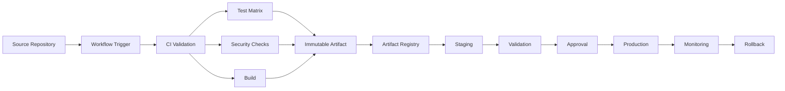
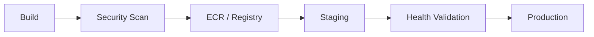
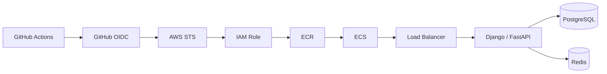
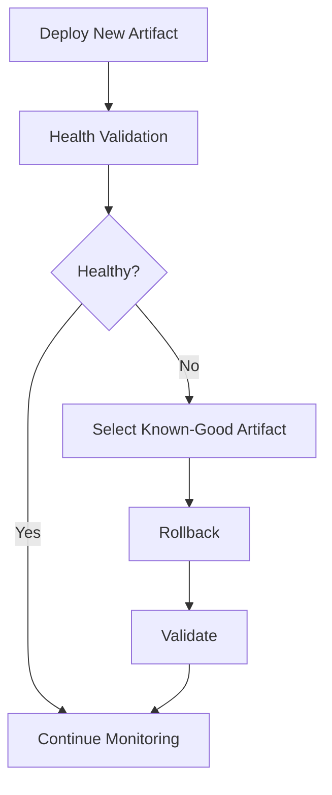
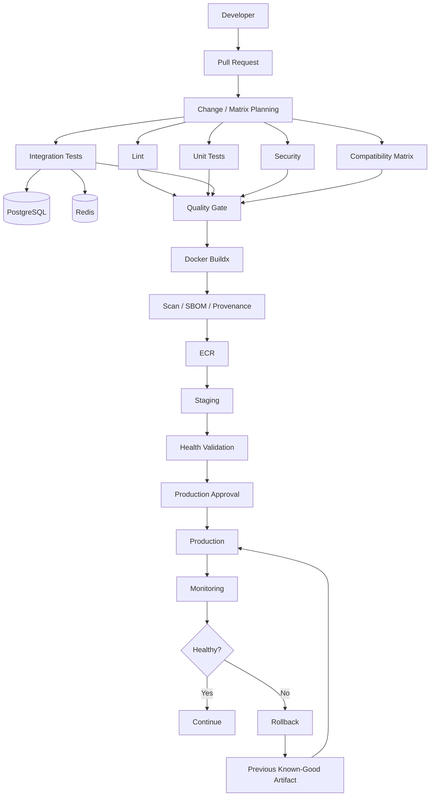

# 02- CI CD Architecture Patterns

## Overview

Production CI/CD architecture is primarily about controlling the flow of changes from source code to validated artifacts and, eventually, production systems.

GitHub Actions provides the execution platform, but the architecture should be designed around clear boundaries:

```text
Source Change
    ↓
Workflow Trigger
    ↓
Validation
    ↓
Build
    ↓
Immutable Artifact
    ↓
Artifact Registry
    ↓
Environment Promotion
    ↓
Production Deployment
    ↓
Health Validation
    ↓
Monitoring
    ↓
Rollback
```

The most important architectural properties are:

- Deterministic builds.
- Clear dependency graphs.
- Immutable artifacts.
- Explicit environment boundaries.
- Least-privilege credentials.
- Controlled deployment concurrency.
- Reproducible releases.
- Observable deployments.
- Safe rollback.
- Failure isolation.

A good CI/CD architecture minimizes coupling between source code, CI execution, deployment infrastructure, and production runtime.

---

## CI/CD Architecture Fundamentals

Continuous Integration validates changes frequently.

Continuous Delivery prepares validated artifacts for deployment.

Continuous Deployment automatically promotes validated changes according to defined policies.

A useful separation is:

```text
CI
├── Lint
├── Unit Tests
├── Integration Tests
├── Security
├── Compatibility Matrix
└── Build

CD
├── Artifact Selection
├── Staging
├── Validation
├── Approval
├── Production
├── Health Checks
└── Rollback
```

The distinction is architectural rather than merely organizational.

---

## Core Architecture Pattern

A production GitHub Actions system can be modeled as:



The artifact registry is the boundary between build and deployment.

---

## Architecture Pattern: Validate Before Build

A common pipeline is:

```text
Lint
 ↓
Unit Tests
 ↓
Integration Tests
 ↓
Security
 ↓
Build
```

This avoids spending significant build resources on changes that already fail basic validation.

However, some workflows may build earlier when the build itself is required for testing.

The correct architecture depends on the dependency graph.

---

## Architecture Pattern: Parallel Validation

Independent checks should run concurrently.

```text
             ┌── Lint
             │
Pull Request ├── Unit Tests
             │
             ├── Security Scan
             │
             └── Integration Tests
                       │
                       ↓
                    Build
```

Example:

```yaml
jobs:
  lint:
    runs-on: ubuntu-latest
    steps:
      - uses: actions/checkout@v4
      - run: ruff check .

  unit:
    runs-on: ubuntu-latest
    steps:
      - uses: actions/checkout@v4
      - run: pytest tests/unit

  security:
    runs-on: ubuntu-latest
    steps:
      - uses: actions/checkout@v4
      - run: pip-audit

  build:
    needs:
      - lint
      - unit
      - security
    runs-on: ubuntu-latest
    steps:
      - uses: actions/checkout@v4
      - run: ./build.sh
```

This reduces pipeline duration without weakening dependency correctness.

---

## Architecture Pattern: Fan-Out and Fan-In

Fan-out distributes work.

Fan-in collects results.

```text
                  ┌── Python 3.11
                  │
Planning ─────────┼── Python 3.12
                  │
                  └── Python 3.13
                         │
                         ↓
                       Build
```

This is particularly useful for:

- Python compatibility.
- Database compatibility.
- Operating-system compatibility.
- Integration test variants.
- Browser versions.
- Multiple service configurations.

---

## Architecture Pattern: Test Matrix

A matrix can combine dimensions:

```yaml
strategy:
  fail-fast: false
  max-parallel: 4
  matrix:
    python:
      - "3.11"
      - "3.12"
    database:
      - postgres
      - mysql
```

This produces:

```text
Python 3.11 + PostgreSQL
Python 3.11 + MySQL
Python 3.12 + PostgreSQL
Python 3.12 + MySQL
```

Matrix cardinality should be calculated before introducing dimensions.

For:

```text
P Python versions
×
D databases
×
O operating systems
```

the number of combinations is:

```text
P × D × O
```

Large matrices can become expensive and slow.

---

## Architecture Pattern: Compatibility Matrix

Not every dimension needs to be tested on every pull request.

A practical strategy is:

```text
Pull Request
    ↓
Small compatibility matrix

Nightly
    ↓
Full compatibility matrix

Release
    ↓
Production-supported matrix
```

This balances:

- Feedback speed.
- Coverage.
- Runner capacity.
- Cost.

---

## Architecture Pattern: Dynamic Matrix

A planning job can determine which tests are necessary.

```text
Changed Files
    ↓
Planning Job
    ↓
Determine Services / Versions
    ↓
Generate JSON
    ↓
Dynamic Matrix
    ↓
Parallel Testing
```

Example:

```yaml
jobs:
  plan:
    runs-on: ubuntu-latest
    outputs:
      matrix: ${{ steps.plan.outputs.matrix }}

    steps:
      - uses: actions/checkout@v4

      - id: plan
        shell: bash
        run: |
          echo 'matrix={"service":["orders","payments"]}' >> "$GITHUB_OUTPUT"

  test:
    needs: plan

    strategy:
      matrix: ${{ fromJSON(needs.plan.outputs.matrix) }}

    runs-on: ubuntu-latest

    steps:
      - uses: actions/checkout@v4
      - run: ./scripts/test-service.sh "${{ matrix.service }}"
```

Dynamic matrices should be deterministic and should not blindly execute arbitrary values originating from untrusted input.

---

## Architecture Pattern: Build Once, Deploy Many

One of the most important production patterns is:

```text
Source
  ↓
Build
  ↓
Immutable Artifact
  ↓
Registry
  ↓
Staging
  ↓
Production
```

Avoid:

```text
Source
 ├── Build → Staging
 └── Build → Production
```

Two builds can differ because of:

- Dependency changes.
- Base image changes.
- Toolchain changes.
- Network dependencies.
- Build timestamps.
- Environment differences.

Build once and promote the resulting artifact.

---

## Immutable Artifact Architecture

For Docker:

```text
orders-api:8d7a2e1
```

should identify the artifact associated with a specific commit.

A stronger identity is the image digest:

```text
orders-api@sha256:<digest>
```

The deployment system should retain the exact artifact identity used in production.

---

## Artifact Promotion



Promotion changes the environment, not the artifact.

---

## Artifact Metadata

A production artifact should ideally be associated with:

```text
Commit SHA
Repository
Workflow Run ID
Build Timestamp
Image Digest
Version
SBOM
Provenance
Security Scan Results
Builder Identity
```

This enables incident investigation and rollback.

---

## Architecture Pattern: Environment Promotion

A standard environment flow is:

```text
Development
    ↓
Testing
    ↓
Staging
    ↓
Production
```

Not every organization needs all four environments.

The important property is that each promotion boundary has explicit validation.

---

## Environment Separation

Environment configuration should be separated from application artifacts.

```text
Artifact
    +
Environment Configuration
    =
Running Application
```

For example:

```text
Same Docker Image
    ├── Staging Configuration
    └── Production Configuration
```

The production artifact should not need to be rebuilt simply because the database endpoint changes.

---

## Environment Protection

Production can require:

- Required reviewers.
- Branch restrictions.
- Deployment protection.
- Environment-specific secrets.
- Environment-specific variables.
- Deployment history.

A typical flow is:

```text
CI
 ↓
Staging
 ↓
Automated Validation
 ↓
Production Approval
 ↓
Production
```

---

## Architecture Pattern: Approval Gate

An approval should happen after enough evidence has been generated.

```text
Build
 ↓
Security
 ↓
Staging Deployment
 ↓
Health Validation
 ↓
Approval
 ↓
Production
```

Approving before staging validation reduces the value of the approval.

---

## Architecture Pattern: Deployment Concurrency

Production deployments should normally be serialized.

```yaml
concurrency:
  group: production
  cancel-in-progress: false
```

Without concurrency control:

```text
Deployment A ───────────────→ Production
Deployment B ────────→ Production
```

The final state may depend on timing rather than release intent.

With concurrency:

```text
Deployment A ─────────→ Production
                         │
                         ↓
                    Deployment B
```

---

## CI Concurrency vs Deployment Concurrency

They should not necessarily use the same policy.

For pull requests:

```yaml
concurrency:
  group: ci-${{ github.workflow }}-${{ github.ref }}
  cancel-in-progress: true
```

For production:

```yaml
concurrency:
  group: production
  cancel-in-progress: false
```

The first prioritizes current feedback.

The second prioritizes deployment safety.

---

## Architecture Pattern: Reusable CI Workflow

Organizations with multiple Python services often share common CI behavior.

```text
Repository A ─┐
Repository B ─┼──→ Reusable Python CI Workflow
Repository C ─┘
```

Example:

```yaml
jobs:
  ci:
    uses: organization/platform/.github/workflows/python-ci.yml@v1
    with:
      python-version: "3.12"
    secrets: inherit
```

The reusable workflow can standardize:

- Python setup.
- Dependency caching.
- Linting.
- Unit tests.
- Integration tests.
- Coverage.
- Security scanning.
- Artifact collection.

---

## Reusable Workflow vs Composite Action

| Capability | Reusable Workflow | Composite Action |
|---|---|---|
| Multiple jobs | Yes | No |
| Job orchestration | Yes | No |
| Matrix at workflow level | Yes | Limited to caller/job context |
| Environments | Yes | Not as a workflow boundary |
| Packages steps | No | Yes |
| Runs inside a job | No | Yes |
| Deployment pipeline | Good fit | Usually not |
| Reusable setup sequence | Possible | Good fit |

A reusable workflow is a pipeline abstraction.

A composite action is a step abstraction.

---

## Architecture Pattern: Reusable Deployment Workflow

A platform team can standardize deployment:

```text
Application Repository
        ↓
Reusable Deployment Workflow
        ↓
AWS OIDC
        ↓
ECR
        ↓
ECS / EC2 / Kubernetes
```

Application repositories provide parameters such as:

```text
environment
image
service
cluster
deployment strategy
```

The platform workflow owns the deployment mechanics.

---

## Architecture Pattern: Monorepo CI

A monorepo may contain:

```text
services/
    orders/
    payments/
    users/
```

A naive pipeline tests everything for every change.

A scalable architecture is:

```text
Changed Files
    ↓
Change Detection
    ↓
Affected Services
    ↓
Dynamic Matrix
    ↓
Service-specific CI
```

This reduces unnecessary execution.

---

## Architecture Pattern: Microservice CI/CD

For independent services:

```text
Service A
  ↓
Artifact A
  ↓
Deployment A

Service B
  ↓
Artifact B
  ↓
Deployment B
```

Avoid a shared pipeline that unnecessarily couples every service deployment.

Shared infrastructure can still be provided through reusable workflows.

---

## Architecture Pattern: Docker Build Pipeline

A production Docker pipeline may be:

```text
Checkout
 ↓
Dependency Resolution
 ↓
Docker Buildx
 ↓
Layer Cache
 ↓
Security Scan
 ↓
SBOM
 ↓
Provenance
 ↓
Push to ECR
```

Example:

```yaml
- name: Set up Buildx
  uses: docker/setup-buildx-action@v3

- name: Build and push
  uses: docker/build-push-action@v6
  with:
    context: .
    push: true
    tags: |
      ${{ env.REGISTRY }}/${{ env.IMAGE }}:${{ github.sha }}
    cache-from: type=gha
    cache-to: type=gha,mode=max
```

The cache improves build performance but is not the release artifact.

---

## Architecture Pattern: AWS OIDC

A secure AWS integration uses:

```text
GitHub Actions
      ↓
OIDC Identity Token
      ↓
AWS STS
      ↓
IAM Role
      ↓
Temporary Credentials
      ↓
AWS Service
```

Example job permissions:

```yaml
permissions:
  contents: read
  id-token: write
```

The AWS IAM trust policy should restrict which GitHub identities can assume the role.

---

## AWS Deployment Architecture

A common AWS architecture is:



The same architectural pattern can be adapted for EC2, Lambda, EKS, CloudFormation, or Terraform.

---

## AWS Account Separation

A production-oriented architecture can use:

```text
GitHub
   │
   ├── Development Role → Dev Account
   ├── Staging Role     → Staging Account
   └── Production Role  → Production Account
```

Each role should have only the permissions required for its environment.

This provides stronger blast-radius control than a single highly privileged deployment role.

---

## Architecture Pattern: Rolling Deployment

Rolling deployment replaces instances progressively.

```text
v1 v1 v1 v1
    ↓
v2 v1 v1 v1
    ↓
v2 v2 v1 v1
    ↓
v2 v2 v2 v1
    ↓
v2 v2 v2 v2
```

Requirements include:

- Readiness checks.
- Graceful shutdown.
- Connection draining.
- Backward-compatible application behavior.
- Database compatibility.

The main trade-off is that two application versions may run simultaneously.

---

## Architecture Pattern: Blue/Green

Blue/green maintains two deployment environments.

```text
              ┌── Blue v1
Traffic ──────┤
              └── Green v2
```

Deployment:

```text
Green Deploy
    ↓
Health Check
    ↓
Traffic Switch
    ↓
Blue Becomes Standby
```

Rollback:

```text
Traffic → Blue
```

Advantages:

- Fast traffic switching.
- Simple application rollback.
- Strong version separation.

Limitations:

- Higher infrastructure cost.
- Database compatibility is still required.
- External side effects may not be reversible.

---

## Architecture Pattern: Canary

Canary releases gradually expose a new version.

```text
Traffic
   ↓
Load Balancer
 ├── 95% → Stable
 └── 5%  → Canary
```

After validation:

```text
95/5
 ↓
75/25
 ↓
50/50
 ↓
0/100
```

Promotion should be based on measurable criteria such as:

- Error rate.
- Latency.
- Saturation.
- Business metrics.
- Health checks.

---

## Architecture Pattern: Zero-Downtime Deployment

Zero downtime is a system property.

It requires coordination between:

```text
CI/CD
+
Load Balancer
+
Application
+
Database
+
Connection Handling
```

For Django or FastAPI:

```text
Load Balancer
    ↓
Healthy Instance
    ↓
Graceful Shutdown
    ↓
New Instance
    ↓
Readiness Check
    ↓
Traffic
```

Deployment orchestration alone cannot guarantee zero downtime.

---

## Database Migration Pattern

The expand/contract pattern is safer for rolling deployments.

```text
Old Schema
   ↓
Expand Schema
   ↓
Deploy Compatible Code
   ↓
Backfill
   ↓
Switch Application
   ↓
Contract Old Schema
```

Example:

```text
users.name
```

can be migrated toward:

```text
users.first_name
users.last_name
```

without immediately removing the old field.

This allows old and new application versions to coexist.

---

## Celery Deployment Pattern

A Celery-based system introduces asynchronous compatibility concerns.

```text
Django / FastAPI
      ↓
Redis / Broker
      ↓
Celery Workers
      ↓
Database
```

During deployment:

- Old workers may process messages created by new application versions.
- New workers may process messages created by old application versions.
- Long-running tasks may outlive a deployment.
- Retry behavior can create delayed execution.

Task payloads should therefore remain backward compatible across the deployment window.

---

## Kafka Deployment Pattern

Kafka adds another compatibility boundary:

```text
Producer
   ↓
Kafka
   ↓
Consumer
```

A safe deployment must consider:

- Event schema compatibility.
- Consumer compatibility.
- Producer compatibility.
- Consumer lag.
- Replay behavior.
- Rollback behavior.

A rollback of application code does not automatically undo already-published events.

---

## Architecture Pattern: Artifact-Based Rollback

Rollback should normally use a previously validated artifact.

```text
Current Production
      ↓
Identify Bad Artifact
      ↓
Select Previous Known-Good Artifact
      ↓
Deploy Previous Artifact
      ↓
Health Validation
      ↓
Monitor
```

Avoid rebuilding an older Git revision during an incident when the original artifact is still available.

---

## Architecture Pattern: Feature-Flag Rollback

Some changes can be disabled without replacing the application artifact.

```text
Production Artifact
       ↓
Feature Flag
   ┌───┴───┐
 OFF      ON
  ↓        ↓
Old      New
Behavior Behavior
```

This is useful when:

- Deployment itself is safe.
- The feature behavior is risky.
- Reverting the entire application is undesirable.

Feature flags do not replace artifact rollback for infrastructure or binary failures.

---

## Architecture Pattern: Release-Based Deployment

A release-oriented pipeline can be:

```text
Commit
 ↓
CI
 ↓
Git Tag
 ↓
Release
 ↓
Artifact
 ↓
Staging
 ↓
Approval
 ↓
Production
```

Example:

```bash
git tag v2.4.0
git push origin v2.4.0
```

The release version should map to a reproducible source revision.

---

## Semantic Versioning

For application releases:

```text
MAJOR.MINOR.PATCH
```

Example:

```text
2.4.1
```

Use versioning consistently across:

- Git tags.
- Release metadata.
- Docker tags.
- Application version.
- Changelog.
- Deployment records.

The Docker image digest remains the strongest artifact identity.

---

## Architecture Pattern: Release Promotion

```text
Release v2.4.0
      ↓
Build
      ↓
Artifact Digest
      ↓
Staging
      ↓
Approval
      ↓
Production
```

The same artifact should be promoted.

---

## Architecture Pattern: Scheduled Full Validation

Pull requests should provide fast feedback.

Nightly workflows can perform broader validation:

```text
Pull Request
 ├── Fast Tests
 └── Security

Nightly
 ├── Full Matrix
 ├── E2E
 ├── Compatibility
 └── Extended Security
```

This prevents every pull request from carrying the full cost of exhaustive testing.

---

## Architecture Pattern: End-to-End Testing

A backend E2E pipeline may be:

```text
Application
    ↓
Nginx / Load Balancer
    ↓
Django / FastAPI
    ↓
PostgreSQL
    ↓
Redis
    ↓
Celery
```

The CI environment should provide:

- Deterministic startup.
- Service readiness.
- Isolated test data.
- Reproducible configuration.
- Test reports.
- Logs and debugging artifacts.

---

## Architecture Pattern: Integration Testing

Integration tests should validate real boundaries.

Example:

```text
pytest
  │
  ├── Django/FastAPI
  │
  ├── PostgreSQL
  │
  └── Redis
```

Service containers are useful when dependencies can run safely within the CI runner environment.

For complex integration environments, Docker Compose or ephemeral environments may be more appropriate.

---

## Architecture Pattern: Private Network CI

Some integration tests require private resources:

```text
GitHub
   ↓
Self-Hosted Runner
   ↓
Private VPC
   ├── PostgreSQL
   ├── Redis
   ├── Internal REST API
   └── gRPC Service
```

Controls should include:

- Runner groups.
- Network segmentation.
- Security groups.
- IAM.
- Egress controls.
- Ephemeral runner lifecycle.
- Restricted workflow access.

---

## Architecture Pattern: Ephemeral Runners

For high-security workloads:

```text
Job Queued
   ↓
Provision Runner
   ↓
Register
   ↓
Execute Job
   ↓
Collect Results
   ↓
Destroy Runner
```

This reduces persistent state and limits cross-job contamination.

It is especially useful for:

- Deployment runners.
- Sensitive workloads.
- Private-network access.
- Untrusted build environments with appropriate controls.

---

## Architecture Pattern: Runner Autoscaling

High-volume organizations may need:

```text
Workflow Queue
      ↓
Autoscaler
      ↓
Runner Pool
      ↓
Jobs
      ↓
Runner Disposal
```

Scaling should account for:

- Queue depth.
- Job duration.
- Provisioning latency.
- CPU/memory classes.
- Burst traffic.
- Cloud quotas.
- Network/IP capacity.

---

## Architecture Pattern: Enterprise CI Platform

A platform team may provide:

```text
                    Platform Team
                         │
       ┌─────────────────┼─────────────────┐
       ↓                 ↓                 ↓
Reusable Workflows   Internal Actions   Policies
       │                 │                 │
       └─────────────────┼─────────────────┘
                         ↓
                  Application Repos
                         │
             ┌───────────┼───────────┐
             ↓           ↓           ↓
            CI          CD       Security
```

The platform should provide paved roads without preventing teams from making justified application-specific decisions.

---

## Architecture Pattern: Security Boundary per Job

Do not give every job the same permissions.

Example:

```yaml
jobs:
  test:
    permissions:
      contents: read

  deploy:
    permissions:
      contents: read
      id-token: write
```

This ensures that a compromised test job does not automatically receive deployment credentials.

---

## Architecture Pattern: Untrusted Pull Request

A secure architecture is:

```text
Untrusted PR
    ↓
Read-only CI
    ↓
Tests / Static Analysis
```

Do not combine:

```text
Untrusted PR Code
+
Production Secrets
+
Privileged Runner
+
Deployment Credentials
```

The trust boundary must remain explicit.

---

## Architecture Pattern: Third-Party Action Isolation

Treat actions as code dependencies.

A sensitive deployment job should minimize:

```text
Third-Party Actions
```

and use:

- Trusted sources.
- SHA pinning.
- Minimal permissions.
- Explicit inputs.
- Review.
- Version governance.

---

## Architecture Pattern: Supply-Chain Integrity

A mature pipeline can use:

```text
Source
 ↓
Dependency Verification
 ↓
Trusted Workflow
 ↓
Trusted Runner
 ↓
Build
 ↓
SBOM
 ↓
Provenance
 ↓
Attestation / Signing
 ↓
Registry
 ↓
Deployment
```

This makes artifact trust part of the architecture rather than an afterthought.

---

## Architecture Pattern: Observability-Driven Deployment

A deployment should produce enough information to answer:

```text
What changed?
Which artifact was deployed?
When?
By which workflow?
To which environment?
What was the previous version?
Did health metrics change?
Can we roll back?
```

A useful deployment record contains:

| Field | Example |
|---|---|
| Commit | `8d7a2e1` |
| Version | `2.4.0` |
| Image | `orders-api:8d7a2e1` |
| Digest | `sha256:...` |
| Environment | Production |
| Workflow | Production Deployment |
| Run ID | `123456789` |
| Deployment time | UTC timestamp |
| Previous version | `2.3.9` |

---

## Architecture Pattern: Failure Isolation

A good architecture isolates failure domains:

```text
Source
  ↓
Trigger
  ↓
CI
  ↓
Artifact
  ↓
Registry
  ↓
Staging
  ↓
Production
```

Each domain should have independent diagnostics and recovery.

For example:

```text
CI failure
→ inspect workflow/job/step

Artifact failure
→ inspect build/provenance

Registry failure
→ inspect authentication/network/repository

Deployment failure
→ inspect runtime/health checks

Production failure
→ inspect application + infrastructure + rollback
```

---

## Architecture Pattern: Retry

Retries are appropriate for transient operations.

Potential retry candidates:

- Temporary network failures.
- Registry throttling.
- Cloud API throttling.
- External service instability.

Retries should not hide deterministic failures such as:

- Invalid configuration.
- Broken tests.
- Missing permissions.
- Invalid Dockerfile.
- Invalid deployment configuration.

Use bounded retries with backoff.

---

## Architecture Pattern: Idempotent Deployment

A deployment should ideally be safe to repeat.

For example:

```text
Desired State
     ↓
Apply
     ↓
Current State
```

Rather than:

```text
Run deployment script
     ↓
Assume previous state
     ↓
Modify state blindly
```

Infrastructure tools such as Terraform and CloudFormation are useful because they model desired state.

Application deployment scripts should also be designed to tolerate retries where possible.

---

## Architecture Pattern: Health Validation

Deployment success should not mean only:

```text
Command exited 0
```

A stronger pipeline is:

```text
Deploy
 ↓
Process Health
 ↓
Readiness
 ↓
HTTP Health
 ↓
Dependency Health
 ↓
Application Metrics
 ↓
Promotion
```

For a FastAPI application:

```text
GET /health/live
GET /health/ready
```

can distinguish process liveness from dependency readiness.

---

## Architecture Pattern: Automated Rollback

A controlled deployment can be:

```text
Deploy
 ↓
Health Check
 ↓
Healthy?
 ├── Yes → Continue
 └── No  → Rollback
```

Rollback criteria should be explicit.

Potential signals:

- HTTP 5xx rate.
- Latency.
- Readiness failures.
- Crash loops.
- Deployment health status.

Automatic rollback should be bounded to avoid rollback loops.

---

## Architecture Pattern: Manual Rollback

A manual rollback workflow can accept an immutable artifact:

```yaml
on:
  workflow_dispatch:
    inputs:
      image:
        description: "Immutable image reference"
        required: true
        type: string
```

The workflow should validate the requested artifact before deployment.

This is safer than asking an operator to rebuild source code during an incident.

---

## Architecture Pattern: CI/CD for Django

A practical architecture:

```text
Pull Request
 ↓
Ruff / Formatting
 ↓
pytest
 ↓
Django Integration Tests
 ↓
PostgreSQL
 ↓
Redis
 ↓
Celery Tests
 ↓
Docker Build
 ↓
ECR
 ↓
ECS / EC2
```

Production deployment should separately validate:

- Django migrations.
- Static files.
- Application health.
- Celery workers.
- Redis connectivity.
- Database compatibility.

---

## Architecture Pattern: CI/CD for FastAPI

```text
Pull Request
 ↓
Lint
 ↓
Type Checking
 ↓
pytest
 ↓
Integration Tests
 ↓
PostgreSQL / Redis
 ↓
Docker Build
 ↓
ECR
 ↓
ECS / Kubernetes / EC2
```

For gRPC systems, add:

```text
Protobuf Contract Validation
        ↓
gRPC Integration Tests
```

---

## Architecture Pattern: API Compatibility

For REST APIs:

```text
Client
  ↓
API v1
```

For gRPC:

```text
Client
  ↓
Proto Contract
  ↓
gRPC Service
```

CI should detect breaking contract changes before deployment where possible.

Contract testing becomes increasingly important as service count grows.

---

## Architecture Pattern: Infrastructure as Code

Deployment architecture should separate application and infrastructure changes.

```text
Terraform / CloudFormation
        ↓
Infrastructure

GitHub Actions
        ↓
Application Artifact
```

A pipeline may coordinate both, but they should remain logically distinct.

---

## Terraform Architecture

A common flow is:

```text
Pull Request
 ↓
terraform fmt
 ↓
terraform validate
 ↓
terraform plan
 ↓
Review
 ↓
Apply
```

Production infrastructure changes should have explicit approval and state management.

---

## CloudFormation Architecture

A CloudFormation workflow may be:

```text
Template
 ↓
Validate
 ↓
Change Set
 ↓
Review
 ↓
Execute
 ↓
Monitor
```

Change sets are particularly useful for understanding infrastructure modifications before applying them.

---

## Architecture Pattern: Blue/Green + Database

Blue/green does not eliminate database compatibility problems.

```text
Blue v1 ──┐
          ├── PostgreSQL
Green v2 ─┘
```

Both versions may temporarily access the same database.

Therefore the database schema must support both versions during the transition.

---

## Architecture Pattern: Canary + Observability

Canary architecture is incomplete without telemetry.

```text
Canary
  ↓
Metrics
  ├── Error Rate
  ├── Latency
  ├── Saturation
  └── Business Metrics
        ↓
Promotion Decision
```

Traffic percentage alone is not a deployment strategy.

---

## Architecture Pattern: Production Rollback

A complete rollback architecture is:



Rollback should be tested before it is needed.

---

## Architecture Pattern: Disaster Recovery

CI/CD disaster recovery should preserve:

```text
Source
Workflows
Reusable Workflows
Infrastructure as Code
Artifacts
Image Registry
Deployment Metadata
Rollback Artifacts
```

A recovery process should not depend on reconstructing an artifact from scratch during an outage.

---

## Architecture Pattern: High Availability CI/CD

High availability involves multiple layers:

```text
GitHub
 ↓
Runner Capacity
 ↓
Artifact Registry
 ↓
Cloud APIs
 ↓
Deployment Platform
 ↓
Production Runtime
```

For self-hosted infrastructure:

- Avoid one runner.
- Use multiple capacity units.
- Replace unhealthy runners.
- Prefer ephemeral infrastructure for sensitive workloads.
- Monitor capacity.

---

## Architecture Pattern: Cost Optimization

The highest-impact cost factors are often:

```text
Workflow Frequency
×
Execution Duration
×
Concurrency
×
Matrix Cardinality
```

Use:

- Dependency caching.
- Docker layer caching.
- Appropriate matrix design.
- Change detection.
- PR concurrency cancellation.
- Reusable workflows.
- Efficient container images.

Do not sacrifice critical validation merely to reduce runner minutes.

---

## Architecture Pattern: Workflow Limits and Constraints

CI/CD architecture must account for platform constraints such as:

- Runner availability.
- Job concurrency.
- Matrix expansion.
- Artifact storage.
- Cache behavior.
- Workflow execution duration.
- Repository and organization policies.
- Cloud API quotas.
- Container registry limits.

Exact platform limits can change, so architecture should avoid relying on undocumented limits.

---

## Architecture Pattern: GitHub CLI Operations

GitHub CLI is useful for operational workflows.

List workflows:

```bash
gh workflow list
```

Run a workflow:

```bash
gh workflow run ci.yml
```

List runs:

```bash
gh run list
```

Inspect a run:

```bash
gh run view <run-id>
```

View logs:

```bash
gh run view <run-id> --log
```

Rerun:

```bash
gh run rerun <run-id>
```

View artifacts:

```bash
gh run download <run-id>
```

These commands are useful during incident investigation and operational debugging.

---

## Architecture Pattern: AWS CLI Diagnostics

For AWS deployment failures:

```bash
aws sts get-caller-identity
```

Verify ECR repositories:

```bash
aws ecr describe-repositories
```

Inspect images:

```bash
aws ecr describe-images \
  --repository-name orders-api
```

For ECS:

```bash
aws ecs describe-services \
  --cluster production \
  --services orders-api
```

The first diagnostic question for an AWS failure should often be:

```text
Which AWS identity is this workflow actually using?
```

---

## Architecture Pattern: Docker Diagnostics

Inspect image:

```bash
docker image inspect orders-api:8d7a2e1
```

Inspect Buildx:

```bash
docker buildx ls
```

Build locally:

```bash
docker buildx build \
  --tag orders-api:local \
  .
```

When a CI Docker build fails, isolate:

```text
Dockerfile
→ Build Context
→ Base Image
→ Dependency Installation
→ Build Cache
→ Registry
```

---

## Troubleshooting by Architecture Domain

Use:

```text
Symptom
  ↓
Possible Causes
  ↓
Isolation Strategy
  ↓
Commands / Checks
  ↓
Root Cause
  ↓
Corrective Action
  ↓
Prevention
```

### Workflow Does Not Start

Check:

- Event.
- Branch filter.
- Path filter.
- Tag filter.
- Workflow location.
- Repository policy.
- Workflow syntax.

### Job Is Skipped

Check:

- `if`.
- `needs`.
- Previous job status.
- Matrix expansion.
- Event context.

### AWS Deployment Fails

Check:

```bash
aws sts get-caller-identity
```

Then inspect:

- OIDC permissions.
- IAM trust policy.
- IAM permissions.
- AWS account.
- Region.
- Environment.
- ECR/ECS resource permissions.

### Docker Image Is Missing

Check:

- Build result.
- Registry login.
- Repository.
- Tag.
- Digest.
- Push permissions.
- Region/account.

### Deployment Runs Twice

Check:

- Workflow triggers.
- Multiple workflows.
- `concurrency`.
- Manual dispatch.
- Release events.
- Reusable workflow invocation.

---

## Architecture Anti-Patterns

### Giant Sequential Workflow

```text
Lint
 ↓
Unit
 ↓
Integration
 ↓
Security
 ↓
Build
 ↓
Deploy
```

If all stages are actually independent, this creates unnecessary latency.

### Rebuild Per Environment

```text
Build → Staging
Build → Production
```

This weakens artifact consistency.

### Shared Production Credentials

```text
All Jobs → Same AWS Role
```

This increases blast radius.

### Mutable Production Image

```text
production:latest
```

This makes rollback and auditability harder.

### Persistent Privileged Runner

```text
Untrusted Code
 ↓
Persistent Runner
 ↓
Production Network
```

This creates a large security boundary.

### Unlimited Matrix

```text
Python
× Database
× OS
× Browser
× Service
× Region
```

Combinatorial growth can overwhelm runner and dependency capacity.

---

## Senior Design Principles

### Principle: Optimize for Failure Recovery

A pipeline is not production-ready merely because successful execution works.

Design for:

- Failed deployment.
- Broken artifact.
- Registry outage.
- Runner outage.
- AWS authentication failure.
- Database migration failure.
- Partial rollout.
- Rollback.

### Principle: Keep Trust Boundaries Explicit

Separate:

```text
Untrusted Code
CI
Build
Artifact
Deployment
Production
```

Do not allow one boundary to silently inherit the privileges of another.

### Principle: Prefer Immutable State

Prefer:

```text
Image Digest
Commit SHA
Versioned Artifact
```

over:

```text
latest
current
rebuild
```

### Principle: Make Deployment State Observable

An operator should be able to answer:

```text
What is running?
Why is it running?
Who deployed it?
Which artifact is it?
What was running before it?
Can it be rolled back?
```

### Principle: Separate Platform Concerns from Application Concerns

Platform teams should provide:

- Runner infrastructure.
- Security controls.
- Reusable workflows.
- Deployment primitives.
- Governance.

Application teams should own:

- Application tests.
- Application configuration.
- Service-specific deployment requirements.
- Business-level health checks.

---

## Senior Interview Scenarios

### Production Deployment Runs Twice

Discuss:

- Workflow triggers.
- Concurrency groups.
- Deployment environments.
- Idempotency.
- Race conditions.
- Rollback.

### Multiple Python Versions Are Required

Discuss:

- Matrix design.
- `fail-fast`.
- `max-parallel`.
- Dependency caching.
- Compatibility policy.
- Cost.

### PostgreSQL and Redis Are Required

Discuss:

- Service containers.
- Health checks.
- Network topology.
- Test isolation.
- Parallel execution.
- Resource limits.

### AWS Credentials Must Not Be Stored

Discuss:

```text
GitHub OIDC
→ STS
→ IAM Role
→ Temporary Credentials
```

Also discuss trust policies and least privilege.

### Docker Must Be Promoted Without Rebuilding

Discuss:

```text
Build
→ Scan
→ Push
→ Digest
→ Staging
→ Approval
→ Production
```

### Self-Hosted Runner Needs Private Access

Discuss:

- Runner groups.
- Network segmentation.
- Ephemeral runners.
- IAM.
- Security groups.
- Egress.
- Secret exposure.
- Workflow trust.

### Third-Party Action Is Compromised

Discuss:

- SHA pinning.
- Least privilege.
- Action allowlists.
- Runner isolation.
- Secret isolation.
- OIDC restrictions.
- Incident response.
- Credential rotation.

### Production Deployment Fails Halfway

Discuss:

- Health checks.
- Deployment state.
- Artifact identity.
- Concurrency.
- Rollback.
- Database compatibility.
- Monitoring.

---

## Production Architecture Checklist

### Source and Workflow

- [ ] Triggers are intentional.
- [ ] Branch/path filters are correct.
- [ ] Workflow responsibilities are clear.
- [ ] Reusable workflows are used where duplication is meaningful.

### CI

- [ ] Linting is parallelized.
- [ ] Unit tests are deterministic.
- [ ] Integration tests use isolated dependencies.
- [ ] Matrix dimensions are justified.
- [ ] Security checks run before release.

### Artifacts

- [ ] Artifacts are immutable.
- [ ] Docker images use commit-based identity.
- [ ] Digests are retained.
- [ ] SBOM/provenance is available where required.
- [ ] Production uses the same artifact validated earlier.

### Security

- [ ] `GITHUB_TOKEN` permissions are minimal.
- [ ] Secrets are scoped.
- [ ] OIDC is used for AWS where appropriate.
- [ ] Third-party actions are governed.
- [ ] Untrusted code cannot access production credentials.

### Deployment

- [ ] Staging exists where required.
- [ ] Production approval is protected.
- [ ] Deployment concurrency is controlled.
- [ ] Health validation exists.
- [ ] Rollback is tested.
- [ ] Database migrations are deployment-compatible.

### Operations

- [ ] Runner health is monitored.
- [ ] Workflow logs are accessible.
- [ ] Deployment metadata is retained.
- [ ] Artifact retention supports rollback.
- [ ] CI/CD failure domains are documented.

---

## Reference Architecture



This architecture provides clear boundaries between:

```text
Validation
Build
Artifact Storage
Promotion
Deployment
Monitoring
Recovery
```

It also supports the major production requirements of a backend engineering organization:

- Python/Django/FastAPI CI.
- PostgreSQL and Redis integration testing.
- Docker image builds.
- AWS OIDC authentication.
- ECR publishing.
- ECS/EC2/Kubernetes deployment.
- Environment approvals.
- Deployment concurrency.
- Immutable artifacts.
- Rollback.
- Enterprise governance.

## Key Takeaways

- Production CI/CD architecture should be modeled as a dependency graph and artifact-promotion system rather than a sequence of YAML commands.
- The core production pattern is **validate → build once → create an immutable artifact → promote the same artifact → monitor → rollback when necessary**.
- Parallel execution, matrices, reusable workflows, caching, and runner autoscaling improve throughput, but must be balanced against cost, downstream capacity, and operational complexity.
- Security architecture depends on explicit trust boundaries, least-privilege permissions, OIDC-based cloud authentication, isolated runners, controlled third-party actions, and protected production environments.
- Senior-level CI/CD design focuses on failure isolation, observability, deployment safety, rollback, compatibility, and maintainability as much as successful deployment.